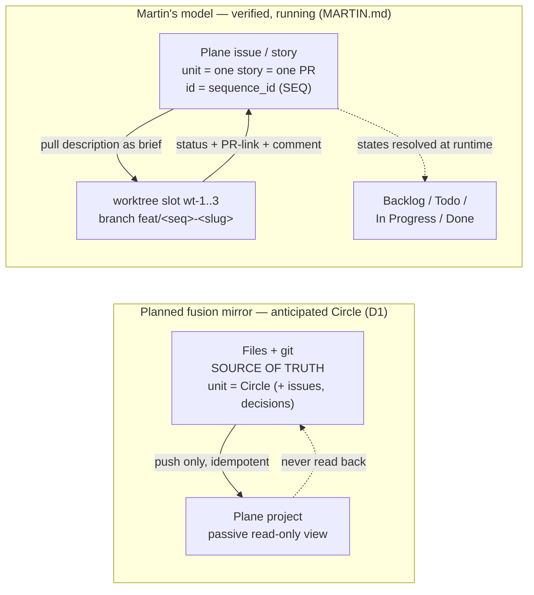
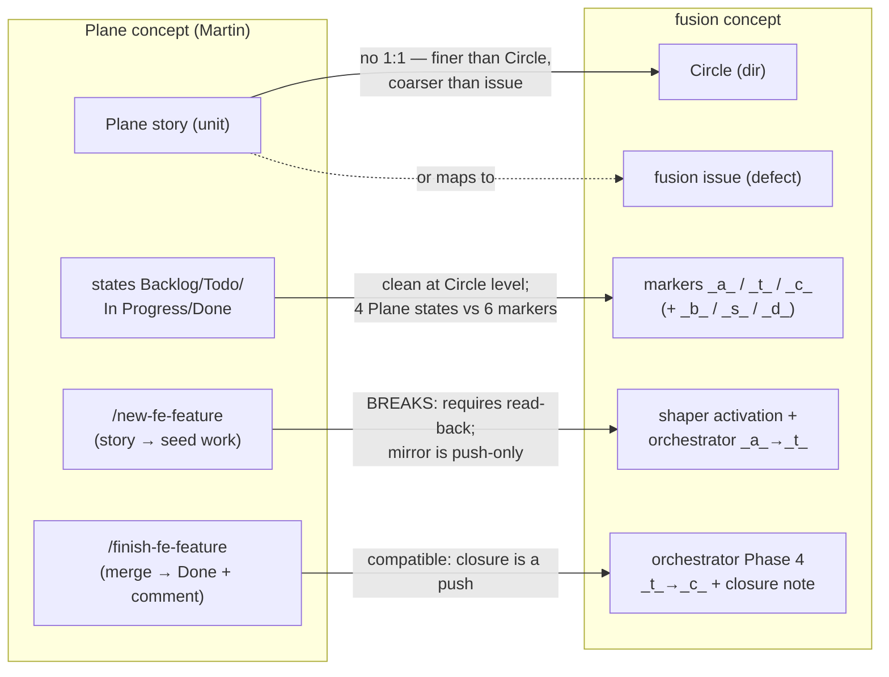
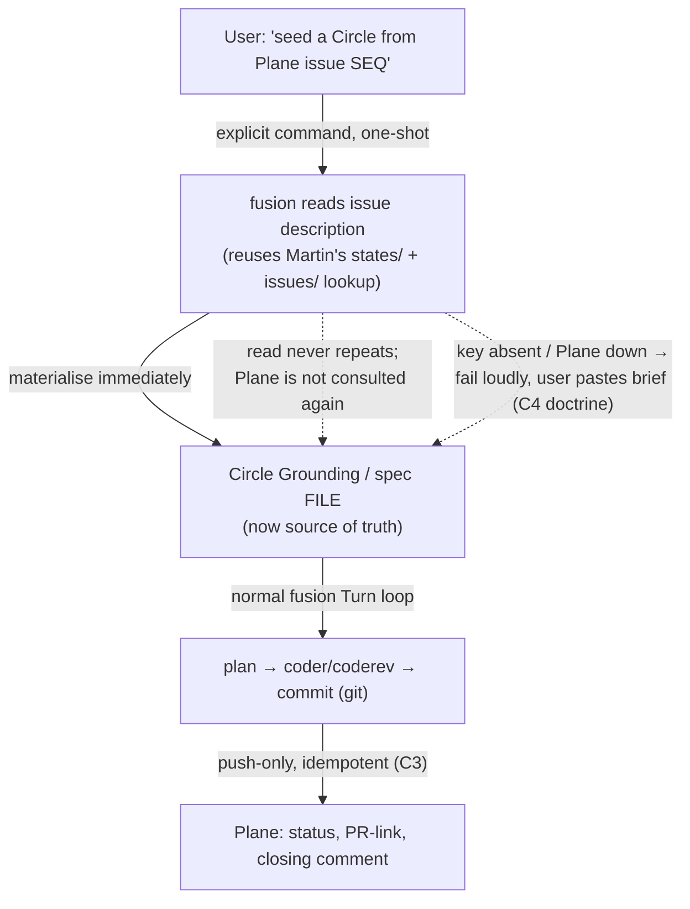

# Analysis: Plane mirror vs Martin's story-driven Plane workflow — feasibility + convergence

**Date:** 2026-07-19 21:41
**Type:** Feasibility + Comparative (convergence)
**Status:** Complete
**Requested by:** user (to inform reshaping the anticipated Plane-mirror Circle `260719-1536-plane-mirror-integration`)

## Question

fusion has an anticipated Circle to build a **one-way Plane mirror** (fusion = source of truth, Plane = passive read-only view; decision D1). Separately, **Martin** — a frontend dev on unite-co-creator and already a regular fusion user (coder / coderev / planner / bugfixer) — runs a **two-way, story-driven Plane workflow** that is verified and running today. Can fusion's Plane integration converge with Martin's workflow so that adopting *regular* fusion becomes attractive to him, while he keeps profiting from Plane? What must the Plane Circle's Directive become, and what does it cost?

The short answer: **yes, but only if the Directive gains exactly one bounded read path** — the ability to seed a Circle from a Plane issue on explicit command. That single addition is what makes regular fusion useful to Martin, and — critically — it does *not* break fusion's "files + git = source of truth" invariant, because "push-only" and "files = source of truth" are two different invariants that decision D1 currently conflates. The pure mirror (current Directive) preserves the invariant but gives Martin nothing he does not already have, so he would not switch.

## Scope

Read in full: Martin's running integration (`/Users/kai/Dropbox/qboot/projects/F03_digital-leadership/unite-co-creator/MARTIN.md`); the anticipated Circle record; the 2026-07-16 Plane spec; decisions D1 (Plane's role), D3 (offline behaviour), and D2/D4 (layout + two Circles); and the fusion Circle/marker conventions. No code was read on the Plane side — Martin's file *is* the verified integration record, and it is the primary source. Out of scope: writing the plan (planner's job), activating or reshaping the Circle (shaper/orchestrator), and Martin's frontend-rule bridge (`rules/coding-frontend.md`, unrelated to Plane).

## Findings

### 1. The two models, characterised precisely

| Dimension | Martin's model | Planned fusion mirror |
|---|---|---|
| Direction | Two-way (Plane drives seeding; work writes status/PR/comment back) | One-way, push-only (C3); never reads back (D1) |
| Source of truth | Plane holds the live story; git holds the code | Files + git; Plane is a secondary view (D1, D3) |
| Unit of work | One Plane issue = one feature = one PR | One Circle (a directory of many tasks, issues, decisions) |
| Unit id | `sequence_id` (human SEQ) → UUID via `states`/`issues` lookup | Stable Circle directory name (immutable natural key) |
| Lifecycle | Plane states Backlog→Todo→In Progress→Done, resolved at runtime via `states/` | Circle markers anticipated→active→closed (`_a_`/`_t_`/`_c_`), plus `_b_`/`_s_`/`_d_` |
| Activation | `/new-fe-feature <seq>` reads story → seeds brief → moves to In Progress | shaper portfolio-activation from files; orchestrator `_a_→_t_`; no Plane read |
| Closure | `/finish-fe-feature` merges → moves Plane to Done + closing comment | orchestrator Phase 4 `_t_→_c_` + closure note (would push to Done) |
| Concurrency | N fixed worktree slots, N stories in flight | Single active Circle (`.active-circle`), advisory single orchestrator |
| Offline | Not a goal — Plane is the queue | C4: fully operational offline, never silently broken (D3 = rebuild from files) |

### 2. Concept mapping — where it aligns and where it breaks

Three mappings are clean, one breaks, one is ambiguous.

- **States ↔ markers — clean enough.** anticipated ≈ Backlog/Todo, active ≈ In Progress, closed ≈ Done. fusion carries three extra terminal markers (bounded `_b_`, superseded `_s_`, deferred `_d_`) that Plane's default four states do not; these collapse to Done (or to a custom Plane state) on push. No blocker.
- **Closure (`/finish-fe-feature`) ↔ Phase 4 — compatible.** Writing Done + PR-link + closing comment is a *push*. The mirror already pushes closure. Martin's closing write-back and fusion's closure push are the same operation.
- **Activation (`/new-fe-feature`) ↔ `_a_→_t_` — this is where the mapping breaks.** Martin's `/new-fe-feature <seq>` *reads* the Plane story description and uses it as the work brief. That is a read-back. fusion's mirror never reads back (D1). A pure mirror cannot seed a Circle from a Plane story — so Martin's single most-used entry point has no fusion equivalent.
- **Unit granularity — ambiguous, no 1:1.** A Plane story ≈ one feature ≈ one PR. A fusion Circle is coarser (a directory of many tasks); a fusion issue is finer (a single defect) and is the wrong *kind* (defect, not story). The natural fusion home for "a Plane story" is **a small, single-feature Circle** — which is a legitimate way to run fusion, but it is not what "issue" means today. The mapping is Circle-shaped, not issue-shaped.

### 3. The core tension — decision D1, and the invariant it conflates

D1 answered "mirror, push-only", and the user's stated reason was: *"I want to read along in Plane and coordinate with others, not work in Plane."* Martin's need is the opposite verb — he wants to **drive work from a Plane story**. Laying out the three options against **both** goals (keep C4 offline-resilient AND make regular fusion attractive to Martin):

| Option | files+git = SoT? | C4 offline / never silent? | Serves Martin? | Verdict |
|---|---|---|---|---|
| **(a) Pure one-way mirror** (current Directive) | Preserved fully | Preserved fully (idempotent rebuild, no queue) | **No** — cannot seed from a story; adds nothing over his own skills | Safe, but Martin does not switch |
| **(b) Bounded bridge** — push-only continuous, plus one explicit-command one-shot read (seed a Circle from a Plane issue), materialised into files immediately | **Preserved** (see below) | Preserved (seeding read is an explicit online action that fails loudly; push channel unchanged) | **Yes** — gives him activate-from-story inside regular fusion | **Recommended** |
| **(c) Plane-as-driver** (generalise Martin's model) | **Broken** — work queue leaves git audit | **Broken** — rate-limit gates the Turn loop; offline dies | Yes | Rejected: sacrifices the invariant the user explicitly protected (this was D1 Options 2/3, already declined) |

**The crux: "push-only" and "files = source of truth" are not the same invariant.** D1's answer bundled them, but they separate cleanly:

- *Files = source of truth* means: at any moment, the files are authoritative; nothing else can silently override them.
- *Push-only* means: fusion never reads anything from Plane, ever.

A **one-shot seeding read** — read a Plane issue's description once, on explicit user command, write it straight into the new Circle's Grounding/spec file, and never consult Plane about it again — satisfies *files = source of truth* while violating only *push-only*. The instant after seeding, the file is authoritative; the Plane read was an *input event*, not a competing authority. This is exactly what Martin's `/new-fe-feature` already does: read the description once, materialise it as the brief, and from then on git is the truth.

So option (b), narrowly scoped, is the only one that threads both goals. It preserves C4 (the continuous channel stays push-only and idempotent; the seeding read is an explicit online action that fails loudly and falls back to manual paste — Martin's own doctrine) and preserves files = source of truth (the read is materialised and then inert), while giving Martin the activate-from-story ergonomics that make Plane his work instrument.

### 4. Reuse (research gate) — what the Plane Circle must take from MARTIN.md, not reinvent

Martin's file is a working, verified integration against the *same* self-hosted Plane the fusion Circle will target. Concrete pieces to reuse:

1. **API-key handling + the `zsh -ic` wrapper.** `$PLANE_API_KEY` lives in `~/.zshrc`; the non-interactive Bash-tool shell does not inherit it, so calls run through `zsh -ic "..."`. fusion's spec *requires* "key from env, never in a file" (C3 AC, conventions `## Security`) but does not say *how* — Martin's wrapper is the proven mechanism. Reuse verbatim.
2. **Runtime `states/` resolution.** Never hardcode state IDs; resolve Backlog/Todo/In Progress/Done via the project `states/` endpoint. This is also the mechanism that maps fusion markers → Plane states. The spec does not specify it; adopt it.
3. **Issue-links endpoint** (`issues/{id}/links/`) — verified reachable on self-hosted. fusion reuses it to attach commit / PR / history-file references onto mirrored work items.
4. **`sequence_id` → UUID resolution** (`GET issues/?per_page=100` then `jq 'select(.sequence_id == $s)'`). fusion needs a Circle-dir ↔ Plane-UUID map for idempotent push anyway; Martin's lookup is the reusable half, and `sequence_id` is the human handle the seeding command would take.
5. **Closure write-back pattern** — status move + closing comment + link, done together at `/finish-fe-feature`. fusion's `_t_→_c_` closure push is the same call sequence.
6. **The absent-key / Plane-down fallback doctrine** — "print the exact text/transition and let the human do it in the UI." This *is* C4's "never silently broken" made concrete. Reuse the doctrine, not just the endpoints.
7. **The config shape** — base URL + workspace slug + project UUID as environment/config (the *values* are Martin's project; the *shape* is what fusion adopts).

**Self-hosted reconciliation (the spec's worry, resolved by Martin's evidence).** The spec flags that the **Pages** API is unreachable on self-hosted (makeplane/plane#8986), so prose docs must stay files. Martin's file is a live proof that **issues, states, links, and comments ARE reachable** on the very same self-hosted `plane.digitalleadership.com`. There is no contradiction: the spec's split was drawn in exactly the right place. Prose → Pages → unreachable → stays files (fusion already accepts this — only the work queue mirrors). Work queue → issues/states/links/comments → reachable → mirrors. Martin's evidence *confirms* the spec rather than challenging it.

### 5. What the Plane Circle's Directive should become

**Variant B (recommended).** Keep the push-only mirror as the backbone — C3 (work queue appears in Plane) and C4 (offline-resilient, never silently broken) unchanged — and **add one bounded read path: seed a Circle from a Plane issue on explicit user command**, materialising the issue into the new Circle's Grounding/spec immediately so files remain the source of truth. Mandate reuse of Martin's verified primitives (key handling + `zsh -ic`, runtime `states/` resolution, issue-links, `sequence_id` lookup, and the absent-key fallback doctrine). Everything else stays out of scope: continuous bidirectional sync, a conflict model, webhooks (the seed reads on command, so Plane's double-webhook problem #7249 never arises), Plane-as-authority, and prose docs in Plane (Pages unreachable).

*One-paragraph Directive (Variant B):* "Install, implement, and test a Plane bridge for fusion's work queue. The continuous channel is a push-only, idempotent mirror: Circles, issues, and decisions appear in a Plane project as a secondary view, and fusion stays fully operational when Plane is unreachable, rebuilding the mirror from files and never failing silently (C3 + C4, unchanged from D1/D3). In addition, provide one bounded read path — on explicit user command, seed a new Circle from a named Plane issue by reading its description once and writing it straight into the Circle's Grounding, after which files are the source of truth and Plane is not consulted about it again. Reuse Martin's verified self-hosted integration primitives rather than reinventing them: the `$PLANE_API_KEY` + `zsh -ic` key handling, runtime `states/` resolution, the issue-links endpoint, `sequence_id`→UUID lookup, and the absent-key 'print it and let the human do it' fallback. Out of scope: continuous bidirectional sync, a conflict model, webhooks, Plane as the authoritative queue, and prose documents in Plane (the Pages API is unreachable on self-hosted)."

**Variant A (minimal / fallback).** Leave the Directive exactly as the current `_a_` record states it (pure push-only mirror), ship it fast, and defer Martin-convergence to a *later* Circle. Honest fallback if the user wants the mirror out first and accepts that Martin keeps his bespoke setup for now.

**What changes vs the current `_a_` Circle record** (`260719-1536-plane-mirror-integration/_a_circle.md`): today's Directive is pure push-only, no read-back. Variant B adds (i) the one command-driven seeding read, (ii) an explicit reuse mandate naming Martin's primitives, and (iii) a re-use of C4's failure doctrine as the seeding read's fallback. It refines — does not discard — D1: a new decision record (filed below) distinguishes "push-only continuous" from "files = source of truth" and permits the one-shot seeding read. The mirror backbone, C3, C4, and the Pages-stays-files split are unchanged.

### 6. Cost / risk

- **Effort shape.** Variant B is **small-to-medium on top of the mirror**, not a second project. The push mirror is the bulk of the work (the spec's "Open for Planner" list: artifact→Plane-object mapping, transfer timing in the Turn loop, file↔ID idempotency, rate-limit handling). The added seeding read is **small**: one command/skill reusing Martin's read pattern, plus a "materialise into Grounding" step. The file↔Plane-ID map it needs is already required for idempotent push, so it is not new cost.
- **The concurrency question — worktree-slots vs single-active-Circle (the biggest risk).** Martin runs N parallel worktree slots, N stories in flight. fusion is **single-active-Circle** (`.active-circle` is one pointer) with **no concurrency lock** — two orchestrators against one project corrupt `agentstate.yaml`, race the `.guard-state/` counters, and double-dispatch. If adopting regular fusion forces Martin to one story at a time, his three-slot throughput collapses and he will not switch. This is a genuine open choice the analysis cannot resolve; it is filed as a decision below. `inference:` the clean near-term answer is that Martin's worktree slots remain *his* concurrency mechanism — each slot runs its own fusion session against its own active Circle — and fusion does not try to own cross-slot concurrency; but that is the user's call, and it may require confirming that per-slot `.active-circle` / `agentstate.yaml` isolation actually holds (each slot is a separate working tree, so `pwd`-anchored workbench state *should* isolate — `speculation:`, unverified).
- **Self-hosted constraints — reconciled (see §4).** Pages unreachable → prose stays files (already accepted). Work-items reachable → Martin proves it. No blocker.
- **Rate-limit 60/min.** Martin's per-story flow makes a handful of calls; fusion pushing a whole Circle's issues + decisions could burst past 60/min. Batching/backoff is already a C3 acceptance criterion — not new, but real, and the seeding read adds only one or two calls.
- **What could make Martin NOT switch** (ranked): (1) loss of parallelism if single-active-Circle is imposed on him; (2) Variant A shipping instead of B — a pure mirror gives him nothing over his own `/new-fe-feature` / `/finish-fe-feature`, so he keeps his bespoke setup; (3) clunkier ergonomics than his two skills if convergence is done without reusing his patterns; (4) his frontend-rule bridge breaking (it will not — it is unrelated to Plane).

## Implications

D1 does not need to be overturned, and should not be. The user's protected invariant — files + git = source of truth, fusion works offline — survives Variant B intact. What D1 needs is a **refinement** that separates the invariant the user actually cares about ("files are authoritative; Plane is for reading along") from the stricter implementation choice it was bundled with ("never read anything from Plane"). Relaxing only the second, and only to a one-shot command-driven seeding read, is what converts the mirror from "something Martin can look at" into "something Martin would run." The decision is genuinely the user's: it reshapes the Circle's scope and it is Martin's adoption that is at stake.

## Recommendations

1. **User decides D1-refinement (decision record filed below).** Recommended: **option (b), bounded bridge** — push-only continuous mirror plus one command-driven seeding read. This is the only option that serves both C4 and Martin.
2. **User decides the concurrency model (decision record filed below).** This is the single biggest adoption risk and the analysis cannot answer it — it needs the user's intent for how a multi-story user runs fusion.
3. **On activation, shaper (portfolio-activation mode)** folds the chosen D1-refinement into the Circle's Grounding and updates the Directive (Variant B or A) before the planner runs. Route: shaper → planner.
4. **The planner** takes the spec's "Open for Planner" list as its agenda and adds the seeding-read command + the MARTIN.md reuse list (§4) as first-class plan items. Route: planner → coder.
5. **Do not activate or reshape the Circle from this analysis** — that is the shaper/orchestrator step.

## Filed Issues

None. Two decision records filed instead (the open choices are "decide and record", not "go fix it"):

- `260719-2141_*_plane-rolle-push-only-vs-bounded-readback-martin.md` — does the mirror stay push-only or gain a bounded seeding read to converge with Martin? Refines (does not edit) D1.
- `260719-2141_*_concurrency-worktree-slots-vs-single-active-circle.md` — how does a Martin-style multi-story user run fusion, given single-active-Circle + no concurrency lock?

## Sources

- `/Users/kai/Dropbox/qboot/projects/F03_digital-leadership/unite-co-creator/MARTIN.md` (primary — verified running integration): Plane sync mechanism `:62-119`, `states/` runtime resolution `:66-69`, issue-links + `sequence_id` lookup `:104-119`, worktree slots `:138-165`, lifecycle Backlog→Done `:71-136`, the two skills `/new-fe-feature` `:146-159` and `/finish-fe-feature` `:121-136`.
- `260719-1536-plane-mirror-integration` — anticipated Circle, Directive `:12-14`, known Plane facts `:26`.
- `260716-1847_*_spec-plane-integration-und-workbench-struktur.md` — C3/C4 `:98-119`, Pages-unreachable + rate-limit constraints `:66,:121-128`, Open for Planner `:138-146`.
- `260716-1847_*_plane-rolle-source-of-truth.md` — D1 answered "mirror / push-only" `:44-49`.
- `260716-1847_*_offline-verhalten-bei-plane-ausfall.md` — D3 "keep working, rebuild from files, never silent" `:25-27,:52`.
- `260716-1847_*_zuschnitt-umbau-und-plane-ein-oder-zwei-circles.md` — D4 two Circles.
- `rules/fusion-workbench-conventions.md` — Circle markers `:298-347`, single-active-Circle pointer `:62`; `CLAUDE.md` — no concurrency lock, advisory single orchestrator.

## Open Questions

- [ ] D1-refinement: push-only vs bounded seeding read (filed as decision — user's call).
- [ ] Concurrency model for a multi-story fusion user (filed as decision — user's call).
- [ ] `inference:`/`speculation:` Does per-worktree-slot `.active-circle` + `agentstate.yaml` isolation actually hold when N slots run N fusion sessions in parallel? Unverified; the planner should confirm before relying on it.
