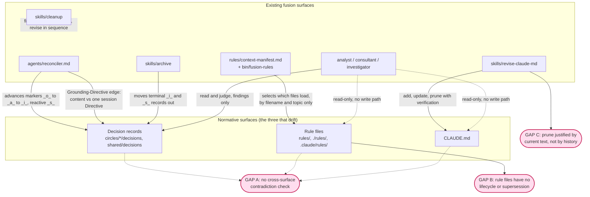

# Analysis: normative-surface drift and the case for a consolidation agent

**Date:** 2026-08-01 10:20
**Type:** Gap
**Status:** Complete
**Requested by:** orchestrator (dispatched on the user's proposal for a consolidation agent)

## Question

Three normative surfaces in a fusion-governed project drift and bloat as work proceeds: decision records under the decision stores, rule files under the plugin's `rules/` and a consuming project's `./rules/` and `.claude/rules/`, and the project's `CLAUDE.md`. The user proposes a new specialised agent that reads the project's history, judges what must change and what remains, and consolidates the three. This analysis asks what fusion already covers, what it genuinely does not, whether the write-permission model would allow such an agent to act, and whether the retained history is rich enough to justify a prune on historical grounds rather than on a re-reading of the current text.

## Scope

Read in full, in the plugin source at `/Users/kai/Projects/productive/F04-FUSION/codebase/fusion` (plugin v5.7.0, commit `17730b8`):

`agents/reconciler.md`, `agents/consultant.md`, `agents/investigator.md`, `agents/analyst.md`, `skills/revise-claude-md/SKILL.md`, `skills/cleanup/SKILL.md`, `skills/archive/SKILL.md`, `rules/context-manifest.md`, `rules/context-lean-claude-md.md`, `rules/fusion-workbench-conventions.md`, `bin/fusion-rules`, `hooks/guard.ts`, `hooks/lib/config.ts`, `hooks/lib/self-detect.ts`, `hooks/lib/events.ts`, `hooks/config.json`, `settings.json`.

Also inspected as evidence of what a running workbench retains: the five Circle records under `fusion-workbench/circles/`, the 31 shared history files, the six shared decision records, and the 500-plus-line `fusion-workbench/orchestrator-events.jsonl`.

Out of scope: any implementation proposal, any change to the surfaces themselves.

---

## Findings

### Coverage map

The graph passes the coherence self-check in `rules/design-diagrams.md`: eleven solid edges over eleven nodes, no cycles, a clean top-down direction from surface to mechanism to gap, and no orphans. The dashed edges are deliberately marked as absent capability rather than present relation.

### Per-surface answer to Question 1

**`agents/reconciler.md` — decision state hygiene, plus one content-consistency edge.**

Step 3's decision walk (`agents/reconciler.md:161-167`) advances `_o_` to `_a_` when an answer is found on disk, `_a_` to `_i_` when a commit realises it, and applies `_s_` when a later decision overrides an earlier one. That is state maintenance, not consolidation: the `_s_` transition at line 164 fires only when a *superseding record already exists*. Nothing in the prompt asks the reconciler to notice that two live decisions contradict each other, or that one has quietly stopped mattering.

Step 2.5's Grounding↔Directive edge (`agents/reconciler.md:137`) does perform a genuine semantic check. It globs `*_a_*.md` and `*_o_*.md` across every path in `$SCAN_DECISIONS` and asks, per record, whether the content remains consistent with the stated Directive. Two limits bound it. The comparison is decision-against-one-session's-Directive, never decision-against-decision. And the cadence is per session, or per Circle where one is active (`agents/reconciler.md:129`), which makes it a coherence check on the work in flight rather than a periodic sweep of the accumulated corpus.

The `knowledge` domain protocol (`agents/reconciler.md:118-123`) is the closest existing analogue to what the user wants. It cross-checks analyses against each other, resolves disagreements by recency and authority, and flags superseded analyses with a pointer to the superseder. That shape applied to decisions is precisely the missing pass. It currently ranges over `$SCAN_ANALYSES` only.

The reconciler never treats `rules/*.md` or `CLAUDE.md` as objects of reconciliation. It reads `CLAUDE.md` once at Setup for project context (`agents/reconciler.md:14`). Its write scope (`agents/reconciler.md:51-63`) permits tracking files in the workbench and one append to the orchestrator's history file, and explicitly forbids "any file outside the bullets above".

**`skills/revise-claude-md/SKILL.md` — full coverage of surface 3, on a two-day evidence horizon.**

The three passes cover surface 3 well. The prune criteria are generic rather than CLAUDE.md-specific: obsolete (`3a`, lines 61-68), outdated (`3b`, lines 70-78), redundant (`3c`, lines 80-84), unimportant (`3d`, lines 86-93). Each carries a verification requirement, and line 135 forbids pruning what cannot be verified obsolete. The mechanical cost is named directly at line 9 and bounded by a soft budget of 150 to 250 lines at line 121.

Two boundaries matter for this analysis. First, line 133 fences the skill off from surface 2: "Do not touch `README.md`, `README-agents.md`, `rules/`, or `docs/`". Second, and more consequentially, the evidence base at lines 22-29 is the current session plus `git log --oneline --since='2 days ago'`, `git diff HEAD~5 -- CLAUDE.md`, and `git status`. The skill never reads the workbench. No session history, no decision record, no Circle record, no event log enters its judgement. The user's grounding-in-history requirement identifies exactly this hole.

Redundancy detection is CLAUDE.md-internal only. Criterion `3c` catches duplication against `README.md` and `rules/*.md` by pointing at them, but it never asks whether CLAUDE.md *contradicts* a rule or a decision.

**`skills/cleanup/SKILL.md` — the cadence, not a capability.**

Cleanup is a wrapper. Step 3 dispatches the reconciler with a detected domain, Step 4 executes archive tier-1, Step 5 executes the full three-pass CLAUDE.md revision, Step 6 regenerates the activity log (`skills/cleanup/SKILL.md:103-129`). It contributes no consistency logic of its own. Its value here is that it is the only automated trigger that fires the CLAUDE.md revision without the user typing the skill name, which makes it the natural mounting point for any periodic consolidation.

**`skills/archive/SKILL.md` — mechanical relief for the workbench, marker-driven, never a judge of content.**

Tier 1 selects terminal Circles and, in the shared store, closed defects, closed plans, implemented decisions and superseded decisions (`skills/archive/SKILL.md:103-112`). Selection is by marker and by filename date, never by reading a document. Safety filter 2 at line 91 explicitly refuses to archive `_a_` decisions, on the sound reasoning that an answered-but-unrealised decision still carries live traceability. So archive removes decisions that some other surface has already judged terminal. It never *makes* that judgement.

One coupling is worth noting because it is the only place fusion already acknowledges that CLAUDE.md and the workbench can drift apart. The citation check (`skills/archive/SKILL.md:93`, procedure at lines 148-152, guardrail at line 219) hard-excludes any file referenced from CLAUDE.md and instructs the user to update CLAUDE.md first. The drift is detected; the resolution is manual and one-directional.

**`rules/context-manifest.md`, `rules/context-lean-claude-md.md` and `bin/fusion-rules` — the mechanical half of surfaces 2 and 3, and nothing semantic.**

The manifest's stated purpose is context budget: a project "does not want all of it loaded into every agent every session" (`rules/context-manifest.md:18-23`). It scopes units by agent and by topic, and packages look-up knowledge as a `skill:` pointer whose body never loads (`rules/context-manifest.md:26-28`). The companion convention specifies what CLAUDE.md keeps always-on against what moves behind the manifest (`rules/context-lean-claude-md.md:32-58`), and states plainly at lines 10-11 that it is a convention with no enforcement.

The selection mechanism is filename-pattern matching. `bin/fusion-rules:116-127` maps an agent to pattern words, and `emit_pattern_in_dir` at lines 153-165 globs `*<pattern>*.md` in each of three roots. No rule file's content is ever read.

The load-bearing finding sits at `bin/fusion-rules:292-295`, in the comment above the pattern loop:

> Order is read-order, not precedence: agents read every emitted path. Layered intentionally so a consuming project can extend the plugin's defaults without overriding.

Fusion has no precedence semantics and no override mechanism between rule sources. Two contradictory rules, one shipped by the plugin and one authored by the project, are both emitted and both read. Nothing detects the conflict, and the agent reading them has no rule for which wins.

The manifest also reduces what is *loaded*, never what *exists*. A stale rule tagged `[always]` is loaded on every session forever, and a stale rule tagged with a dead topic simply becomes invisible without ever being retired.

**`agents/analyst.md`, `agents/consultant.md`, `agents/investigator.md` — the read-and-judge capability exists three times, with no write path to surfaces 2 or 3.**

All three are read-only on project files and write only inside the workbench. The consultant states it twice (`agents/consultant.md:34`, and the prohibition at lines 45-51: "Edit any file outside `fusion-workbench/`"). The investigator's scope is at `agents/investigator.md:34-47`. The analyst's is in its own prompt's Scope section.

The judgement capability is present and mature. Analyst type 1 is document study and type 3 is gap analysis. The consultant carries an explicit Reliability Mandate requiring every statement to be checked against source, with `path:line` citations and labelled inference (`agents/consultant.md:12-21`). The investigator reconstructs causal chains from evidence. What none of them has is a target: a grep across all sixteen agent prompts for any authorised write to `CLAUDE.md` or to `rules/` returns nothing. Every hit is a read, a reference, or a Setup instruction.

One division of labour is already fixed and would need respecting. Analyst type 7 is the only typed authoring path for a decision record, and the consultant is explicitly told to delegate rather than write one (`agents/consultant.md:78`, table at lines 82-93). The reconciler advances decision markers. Neither retires a decision.

**`rules/fusion-workbench-conventions.md` — a complete retirement vocabulary with no sweep that uses it.**

The decision vocabulary (lines 270-299) already models everything a consolidation pass would need. `_s_` means superseded and requires citing the superseding record with a reason (line 280). `_i_` and `_s_` are terminal, and a revisit means filing a new decision that supersedes the old one (line 290). The two-layer split at lines 292-299 is explicit: `_o_` and `_a_` are Grounding-Stand, the current working knowledge; `_i_`, `_s_` and `_d_` are Grounding-Historie, the preserved record.

The vocabulary is therefore sufficient. What is missing is any procedure that reads N records and asks whether any two conflict, or whether one has become moot without a successor. Every documented supersession transition (worked transitions 4 and 5, lines 287-288) is triggered by the arrival of a new decision.

The Origin Rule (lines 68-85) constrains any future consolidation in a way worth naming now. A decision stays in the Circle whose Directive caused it, and reach is expressed by citation rather than by moving the file (line 83). Line 77 accepts the consequence deliberately: "a project-wide decision that *arose inside* a Circle stays in that Circle. It is not promoted." Line 85 pre-authorises the escape hatch a consolidation pass would want: "the answer is a promotion step, an explicit, recorded move from a Circle to `shared/`, not a second placement rule." That step does not exist today.

---

### Question 2 — the genuine gap

**Not covered by any existing surface.**

| # | Gap | Evidence that nothing covers it |
|---|---|---|
| A1 | Contradiction detection *across* the three surfaces. Nothing compares a decision against a rule, a rule against CLAUDE.md, or CLAUDE.md against a decision. | Reconciler compares decisions against one Directive (`agents/reconciler.md:137`) and analyses against analyses (`agents/reconciler.md:118-123`). revise-claude-md compares CLAUDE.md against itself (`skills/revise-claude-md/SKILL.md:82`). No surface spans two of the three. |
| A2 | Decision-against-decision contradiction within the corpus. | The `_s_` transition is reactive in every documented form (`rules/fusion-workbench-conventions.md:287-288`, `agents/reconciler.md:164`). |
| A3 | Rule-file lifecycle. `rules/*.md` has no state marker, no supersession vocabulary, no owner, no retirement path and no review cadence. | The filename-pattern table (`rules/fusion-workbench-conventions.md:229-244`) assigns markers to Circles, plans, defects and decisions. Rule files are not in the table at all, because they are not workbench artifacts. |
| A4 | Precedence between rule sources. | Explicitly disclaimed at `bin/fusion-rules:292-295`. |
| A5 | Proactive obsolescence. Nothing retires a decision or a rule that simply stopped applying without a successor arriving. | Follows from A2 and A3. |
| A6 | History-grounded justification for a prune. | `skills/revise-claude-md/SKILL.md:26-28` bounds the evidence at two days of git plus the current session, and never opens the workbench. |

**Partially covered, extensible.**

The reconciler is the strongest candidate for extension, on three counts. It already reads every `_a_` and `_o_` record across both stores. It already performs a content-level consistency judgement in the Grounding↔Directive edge. And it already holds write permission on decision files, including the marker rename and the `Superseded by:` annotation, which is exactly the write a consolidation verdict would need. Widening Step 2.5 from decision-against-Directive to decision-against-decision reuses machinery that exists rather than building a parallel mechanism. The `knowledge` protocol at lines 118-123 already contains the algorithm, applied to a different artifact kind.

The revise-claude-md skill is the second candidate. Its three passes are the right shape for any always-loaded normative file, and its prune criteria are not CLAUDE.md-specific. Extending it to `rules/` means widening the scope line at 133 and, more importantly, widening the evidence base at lines 22-29 to include the workbench. The second change is the one that answers the user's actual complaint.

The context manifest already solves the *mechanical* cost for surface 2, and solves it well. It is the wrong tool for the semantic cost, since it decides what loads without ever deciding what is true.

**Already fully covered, and a new agent would duplicate it.**

Adding CLAUDE.md three-pass revision, decision-marker advancement, workbench mechanical shrinking, or a periodic wrapper would each restate something fusion already has: `skills/revise-claude-md/SKILL.md` in full, `agents/reconciler.md:161-167`, `skills/archive/SKILL.md:103-119`, and `skills/cleanup/SKILL.md:103-129` respectively. A new agent that covers all three surfaces end to end would reimplement roughly half of its own remit.

**The honest verdict.**

The gap is real, and it is narrower than the proposal. What is genuinely missing is one capability, not three: **a cross-surface normative-consistency pass that reads decisions, rules and CLAUDE.md together, grounds its judgement in the retained project history, and reports contradictions and obsolescence as findings.** The editing of each surface is already owned: decisions by the reconciler, CLAUDE.md by the revise skill, the workbench's bulk by archive. Applying the Research Gate in `rules/critical-stance.md` §2, the integral design is one detector feeding three existing appliers, not a fourth agent that duplicates all three and then needs a new permission model to do so.

That framing also happens to dissolve Question 3, which is the strongest argument for it.

---

### Question 3 — the write-permission problem

**Verified state of the guard.**

`hooks/config.json:8-18` sets `protectedPaths` to `agents/**`, `rules/**`, `hooks/config.json`, `hooks/hooks.json`, `settings.json`, `bin/monitor`, `skills/**`, `.claude-plugin/plugin.json`, and `fusion-workbench/.guard-state/**`. This file ships with the plugin and is the one that loads: `findConfigPath` at `hooks/lib/config.ts:21-32` walks up from the compiled hook and finds it. The in-code default of `protectedPaths: []` at `hooks/lib/config.ts:85` applies only when the file is missing or unparseable.

A protected-path hit is an unconditional block (`hooks/guard.ts:309-327`), and it counts toward escalation. Three consecutive blocks halt every write in the project, clearable only by running `hooks/dist/clear-halt.js` (`escalation.blocksBeforeHalt: 3` in `hooks/config.json`).

**Four findings follow, and they change the shape of the answer.**

*CLAUDE.md is not protected.* It does not appear in `protectedPaths`. That is why `/fusion:revise-claude-md` works in a consuming project, and it means surface 3 poses no permission problem at all.

*There is currently no path by which fusion can write to `rules/**` in a consuming project.* The guard is a `PreToolUse` hook. It intercepts the tool call, not the caller. A skill's `Edit` call and an agent's `Edit` call reach `hooks/guard.ts` identically. So modelling the capability as a user-invoked skill, which is fusion's established answer for critical procedures, does not route around the block. The claim in `CLAUDE.md` that "a skill body becomes the user prompt; that's the only reliable enforcement" is about instruction compliance, not about tool permission, and it does not help here.

*A per-agent exemption is not implementable with the current hook payload.* `interface HookInput` at `hooks/guard.ts:80-85` carries `session_id`, `hook_event_name`, `tool_name` and `tool_input`. No agent or subagent identity is present. Granting one writer access to `rules/**` while denying the other fifteen would require a new signalling mechanism, most plausibly a dispatch-time environment variable in the shape of the existing `FUSION_ALLOW_BRANCH_SWITCH` escape hatch.

*The plugin's own repo is a testing landmine.* `hooks/guard.ts:271-283` stands the write guard down entirely when `isFusionPluginCwd()` is true (`hooks/lib/self-detect.ts:18-33`). A consolidation agent developed and tested here would write to `rules/` without resistance and would be blocked in every consuming project. `speculation:` this is the most likely way such a capability would ship broken.

**The permission model would have to allow one of three things.**

| Option | What it requires | Cost |
|---|---|---|
| Guard exemption for one writer | A new identity signal into `hooks/guard.ts` plus an exemption branch on the protected-path check | Inverts the guard's premise; adds a bypass axis that did not exist |
| Remove `rules/**` from `protectedPaths` | A one-line config edit in the consuming project | Blunt. Removes the protection for all sixteen agents, not for one |
| Proposal-only output | Nothing. The finding goes to an analysis or issue; the human applies it | Fits the existing agent contract exactly |

**Whether this conflicts with the guard's design intent: yes, directly, for the first two options.**

`hooks/lib/self-detect.ts:3-9` states the intent without ambiguity: "The guard protects `agents/**`, `rules/**`, `skills/**`, `.claude-plugin/plugin.json` etc. This is correct for projects USING fusion, but wrong when developing fusion itself." An agent that edits `rules/` is precisely the class of write the guard was built to stop, because `rules/` is where the agent's own normative constraints live. Granting it is not a configuration adjustment; it is a reversal of the guard's premise that agents do not rewrite the rules they are bound by.

The third option carries no conflict and needs no change. It is also what every read-and-judge agent in fusion already does: the investigator finds the root cause and files an issue for the executor rather than applying the fix.

**A defect surfaced while checking this.** The guard protects `rules/**` but not `.claude/rules/**`. Path matching normalises absolute paths to cwd-relative (`hooks/guard.ts:94-106`), and `globToRegex` in `hooks/lib/paths.ts:9-22` anchors the pattern with `^`, so `.claude/rules/CODING.md` does not match `rules/**`. Both directories are emitted by `bin/fusion-rules` (lines 296-298), both hold binding normative content, and only one is protected. Filed as an issue.

A second, softer point on permissions. `settings.json` auto-allows writes only under `fusion-workbench/**`. So even setting the guard aside, a write to `rules/` or to `CLAUDE.md` prompts the user unless they have run `/fusion:unlock`, which sets `defaultMode: "bypassPermissions"` (`skills/unlock/SKILL.md:29-34`). That bypass affects Claude Code's permission layer only. The fusion hook blocks independently of it.

---

### Question 4 — what durable history a workbench actually retains

**Enumerated sources, with what each carries.**

| Source | Location | Content | Value for "why does this exist, does it still apply" |
|---|---|---|---|
| Circle records | `circles/*/_S_circle.md` | Directive, Grounding snapshot with cited decisions, Dependencies, Turn log, Closure note (`rules/fusion-workbench-conventions.md:356-388`) | **Highest.** The Grounding snapshot is, by template, "what we know going in" with paths. Closure notes carry the verdict and the deliberately-left-open follow-ups. |
| Decision records | `$SCAN_DECISIONS` | Question, Options, Constraints, Recommendation, plus `Answered:` / `Implemented:` / `Superseded by:` annotations with a path, line or commit (`rules/fusion-workbench-conventions.md:516-558`) | High. A `_s_` record carries its own supersession reason inline. |
| Session history | `$SCAN_HISTORY` | Per-session narrative, plus the reconciler-appended `## Coherence` section with the three edges and their evidence (`agents/reconciler.md:184-197`) | High for what happened. Lower for why a rule was authored, unless that session logged the reasoning. |
| git log and blame | project git | For fusion's own repo: 42 commits touch `rules/`, with conventional-commit messages naming intent (`2935d93 feat(rules): readability gate — pre-send self-review against jargon Kauderwelsch`) | **The load-bearing source for surface 2**, because rule files and CLAUDE.md are tracked while the workbench is not. |
| `orchestrator-events.jsonl` | workbench root | 31 event kinds in this project's log, including `scope_resolved`, `gate_response`, `coherence_review`, `circle_activated`, `revert`, `reconciliation`, each with a one-line `detail` | Good for cadence and gate outcomes. The detail strings are summaries, not reasoning. Complements the narrative sources; does not substitute. |
| `.guard-state/events.jsonl` | workbench root | `guard_allow`, `guard_block`, `guard_halt`, churn and cross-file warnings (`hooks/lib/events.ts:22-33`) | Low for normative rationale. Useful only to show which paths churn. |
| Reviews and analyses | `$SCAN_REVIEWS`, `$SCAN_ANALYSES` | Findings with citations; analyses carry a Sources section | Moderate to high where they exist. |
| Archive store | `archive/<stamp>-<slug>/` | Everything a tier moved, plus a `MANIFEST.md` | On disk, but see the fourth thin spot below. |

**Where the evidence is thin. Five specific spots.**

*Rule files carry no in-band provenance.* No rule file in the plugin's `rules/` states which decision motivated it or which Circle produced it, with exactly one exception that proves the convention is available: `rules/fusion-workbench-conventions.md:326` reads "Binding decision: `260716-1910_*_circle-marker-am-verzeichnis-oder-an-der-circle-datei.md`". Used once, in one section, of one file. Reconstructing why a rule exists therefore means reading git log and hoping the commit message is informative. In fusion's own repo that works, because commits are conventional and descriptive. In a consuming project whose `.claude/rules/` may have been hand-authored outside any fusion session, it may yield nothing at all. This is the single cheapest high-leverage fix available, and it is independent of who does the consolidating.

*The workbench is not in version control here, so its history has no history.* Verified: `git ls-files fusion-workbench/` returns zero files, and `.gitignore:50` reads `## fusion-workbench/`, a commented-out ignore rule, so the directory is neither tracked nor ignored. `CLAUDE.md` states it is "gitignored"; that claim is wrong in both directions. The consequence for grounding is direct. Every record can be read in its current state, and no record's evolution can be diffed. The reconciler appends to files in place, and playmaker regenerates `portfolio.md` wholesale on every run (`agents/playmaker.md:136`), so prior states are simply gone. An agent asked to judge "what changed in our understanding, and when" has the endpoints and not the trajectory.

*Turn logs are unevenly populated, and the largest unit of work is the empty one.* Four of the five Circle records carry substantive Turn logs. The fifth, `260719-1536-plane-mirror-integration`, still reads "(none yet — anticipated; on activation: ...)" under `## Turn log` despite being closed with six commits. Its Closure note carries the content instead. Any consolidation pass that walks Turn logs mechanically would under-report the biggest Circle in the project. Filed as an issue.

*Archived history leaves every agent's read set.* No `SCAN_*` key names the archive store. The resolution table at `rules/fusion-workbench-conventions.md:129-153` lists `SCAN_PLANS`, `SCAN_ISSUES`, `SCAN_DECISIONS`, `SCAN_HISTORY`, `SCAN_REVIEWS`, `SCAN_ANALYSES`, `SCAN_INVESTIGATIONS`, `SCAN_CONSULT` and `SCAN_CIRCLES`, and none of them resolves into `archive/`. After a tier-1 archive, a closed Circle's decisions and history sit on disk where no agent looks. The structural irony is sharp: the capability that most needs long-horizon history would operate on a read set that is deliberately pruned of it, and the pruning grows with project age. Filed as an issue.

*Gate reasoning survives only where an agent transcribed it.* The `gate_response` event carries a one-line detail. The user's actual reasoning at a gate lives in the chat transcript, which the workbench does not retain in any form. Where an agent wrote the reasoning into a Circle record it survives well: the plane-mirror Circle's Grounding snapshot cites the user's decision of a named date and explains why a refinement was a refinement rather than a supersession. Where no agent transcribed it, it is unrecoverable.

**Assessment.** The retained history is sufficient to reconstruct why a *decision* exists and whether it still applies, and sufficient for a *Circle*. It is adequate for CLAUDE.md and for fusion's own `rules/`, carried mostly by git rather than by the workbench. It is thin to absent for a consuming project's `./rules/` and `.claude/rules/`, which is the surface where the user's proposal would most want it. The provenance-header convention would close most of that gap at negligible cost.

---

## Implications

The user's diagnosis is right and the proposed remedy is broader than the diagnosis requires. Fusion already edits each of the three surfaces through a surface that owns it, and it already fires all three on a cadence through `/fusion:cleanup`. What it has never had is anything that reads two of the three *together*, and what it has never had for `rules/` is any lifecycle at all.

The write-permission finding is the decisive constraint on the design. Because `rules/**` is guard-protected and the guard cannot distinguish callers, a consolidation capability that *writes* to `rules/` cannot be built without either weakening the guard for every agent or adding a bypass axis that does not exist today. A capability that *reports* on `rules/` needs no permission change whatsoever, and matches the contract every read-and-judge agent in fusion already honours. The permission model is therefore not merely a constraint on the design; it is an argument for a particular one.

The history finding qualifies the ambition. Grounding a prune in what actually happened is achievable for decisions and Circles today. For rule files it currently depends on git commit messages, which is adequate in fusion's own repo and unreliable elsewhere. If the user wants the grounding requirement to hold generally, a provenance header on rule files is the prerequisite, not an optional refinement.

---

## Recommendations

**Do not build an agent that consolidates all three surfaces.** Roughly half of that remit is already implemented, and the half that involves writing to `rules/` is blocked by a guard whose design intent it would invert.

**Decide first between three shapes** before any design work begins. The decision record filed alongside this analysis lays them out. In outline: extend the reconciler and the revise skill; build a narrow detector that reports and never writes; or build the broad agent and change the guard. `inference:` the second shape is the strongest on current evidence, because it needs no permission change, reuses the read-and-judge contract three agents already carry, and leaves the three existing appliers in place. The evidence supports it but does not settle it, since it costs the user a manual application step that the broad agent would automate.

**Settle the guard question separately**, because it outlives this feature. Whether fusion ever grants any writer access to `rules/**`, and by what mechanism, is a policy call that any future rule-editing capability will run into. A second decision record captures it.

**Adopt a provenance header on rule files regardless of the outcome.** The pattern exists once already at `rules/fusion-workbench-conventions.md:326`. Generalising it is cheap, independent of the other two decisions, and it is what makes "grounded in history" mechanically checkable rather than aspirational. A third decision record captures the choice between requiring it, recommending it, and relying on git.

**Route the follow-on work.** If the user picks extension, the target files are `agents/reconciler.md` Step 2.5 and `skills/revise-claude-md/SKILL.md` Inputs, and the executor is `coder` after a `planner` pass. If the user picks the narrow detector, the shaper should specify it before anything else, since its output contract is what makes it useful or noise.

---

## Filed Issues

- `260801-1020_*_workbench-untracked-breaks-archive-durability-premise.md` — the workbench is neither tracked nor gitignored, so archive's "git preserves the bytes" premise and CLAUDE.md's "gitignored" claim are both false.
- `260801-1020_*_guard-protects-rules-but-not-claude-rules.md` — asymmetric protection of two normative rule directories that `bin/fusion-rules` treats alike.
- `260801-1020_*_scan-keys-never-reach-the-archive-store.md` — archived Grounding-Historie is invisible to every agent's resolved read set.
- `260801-1020_*_plane-mirror-circle-closed-with-empty-turn-log.md` — the largest closed Circle carries an unfilled Turn log.

## Filed Decisions

- `260801-1020_*_where-does-normative-consistency-live.md` — extend existing surfaces, build a report-only detector, or build a writing agent.
- `260801-1020_*_may-any-fusion-writer-touch-rules.md` — guard policy for `rules/**` write access.
- `260801-1020_*_provenance-header-on-rule-files.md` — required, recommended, or rely on git.

## Sources

Plugin source, v5.7.0, commit `17730b8`:

- `agents/reconciler.md:12-14`, `:51-63`, `:118-123`, `:129`, `:137`, `:161-167`, `:184-197`
- `agents/consultant.md:12-21`, `:34`, `:45-51`, `:78-93`
- `agents/investigator.md:34-47`
- `agents/playmaker.md:136`
- `skills/revise-claude-md/SKILL.md:4`, `:9`, `:22-29`, `:57-93`, `:121`, `:133`, `:135`
- `skills/cleanup/SKILL.md:103-129`
- `skills/archive/SKILL.md:9`, `:91`, `:93`, `:103-119`, `:148-152`, `:219`
- `skills/unlock/SKILL.md:29-34`
- `rules/context-manifest.md:12-28`, `:92-119`, `:131-137`
- `rules/context-lean-claude-md.md:10-11`, `:32-58`
- `rules/fusion-workbench-conventions.md:68-85`, `:129-153`, `:229-244`, `:270-299`, `:326`, `:356-388`, `:516-558`
- `rules/critical-stance.md:21-32`
- `rules/design-diagrams.md:43-53`
- `bin/fusion-rules:116-127`, `:153-165`, `:292-298`
- `hooks/guard.ts:80-85`, `:94-106`, `:271-283`, `:309-327`
- `hooks/lib/config.ts:21-32`, `:85`
- `hooks/lib/paths.ts:9-22`
- `hooks/lib/self-detect.ts:3-9`, `:18-33`
- `hooks/lib/events.ts:22-33`
- `hooks/config.json:8-18`
- `settings.json` (permission allowlist)
- `.gitignore:49-50`

Workbench evidence, this project:

- `260719-1536-plane-mirror-integration` (Grounding snapshot, empty Turn log, Closure note)
- `260716-1847-workbench-umbau`, `260717-1638-marker-format-ohne-glob-metazeichen/_c_circle.md`, `260718-1924-v5x-overhaul/_c_circle.md`, `260719-1536-brest-unite-co-creator-conversion/_c_circle.md` (Turn logs)
- `fusion-workbench/orchestrator-events.jsonl` (31 event kinds, counted)
- `fusion-workbench/shared/decisions/` (six records), `fusion-workbench/shared/history/` (31 files)

Commands run: `git ls-files fusion-workbench/` (0 results), `git check-ignore -v 260801-0936-orchestrator-session.md` (no match), `git log --oneline -- rules/` (42 commits), `git log --oneline --follow -- rules/user-facing-output.md` (6 commits).

## Open Questions

- [ ] Which of the three shapes the capability takes. Filed as `260801-1020_*_where-does-normative-consistency-live.md`; needs the user.
- [ ] Whether fusion ever grants a writer access to `rules/**`. Filed as `260801-1020_*_may-any-fusion-writer-touch-rules.md`; needs the user.
- [ ] Whether rule files gain a provenance header. Filed as `260801-1020_*_provenance-header-on-rule-files.md`; needs the user.
- [ ] Whether the workbench being untracked is intended or accidental. The commented-out `.gitignore` line suggests a reversal that was never finished. Captured in the issue; needs the user's intent to resolve.
