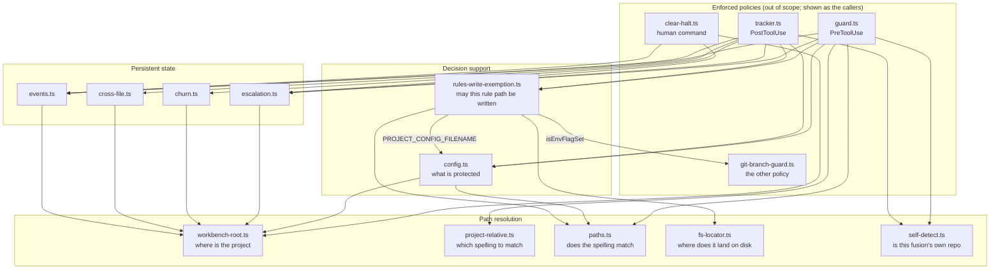
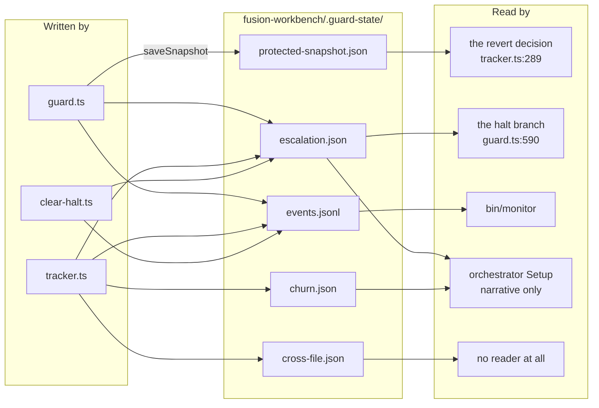

# Analysis: the compliance guard's support layer

**Date:** 2026-08-09 11:01
**Type:** Document Study
**Status:** Complete
**Requested by:** user (via orchestrator dispatch)
**Tree state:** HEAD `451a07e`, working tree clean apart from `fusion-workbench/.commit-lock/holder`

## Question

The guard enforces two policies. One reads a shell command to decide whether HEAD is about to move; the other fingerprints a set of files before and after every guarded tool call. Underneath both sits a layer that supplies configuration, path resolution and persistent state. This analysis asks what that layer costs, what of it still steers a decision, and where it can be made smaller without moving the boundary the guard defends. A parallel analysis covers the enforced policies themselves (`guard.ts`, `tracker.ts`, `protected-snapshot.ts`, `git-branch-guard.ts`, `shell-parse.ts`, `command-word.ts`); this one names them only where a boundary runs between the two.

## Scope

Twelve TypeScript modules and two JSON files, read at HEAD `451a07e`:

`hooks/lib/config.ts`, `hooks/lib/rules-write-exemption.ts`, `hooks/lib/escalation.ts`, `hooks/lib/churn.ts`, `hooks/lib/cross-file.ts`, `hooks/lib/paths.ts`, `hooks/lib/fs-locator.ts`, `hooks/lib/project-relative.ts`, `hooks/lib/self-detect.ts`, `hooks/lib/workbench-root.ts`, `hooks/lib/events.ts`, `hooks/clear-halt.ts`, `fusion-guard.json`, `templates/fusion-guard.json`.

Read as the intended behaviour: `rules/protected-path-discipline.md`, `README-hooks.md`, and the `fusion-guard.json` and self-detection sections of `CLAUDE.md`.

Two claims in this report rest on running code rather than reading it, and both are marked at the point of use. Everything else is read from the tree.

### The headline number, before anything else

The twelve modules are 3,112 lines. Of those, 1,197 are code, 1,699 are comment and 216 are blank. Fifty-five percent of the support layer is prose about the support layer.

That ratio is the single most useful fact for reading the rest of this report. Every question below about a module being "too large for what it does" turns out to be a question about how much argument sits above how little mechanism, and the answer differs sharply per module.

| Module | Lines | Code | Comment | Comment per code line |
|---|---:|---:|---:|---:|
| `config.ts` | 762 | 374 | 325 | 0.9 |
| `rules-write-exemption.ts` | 745 | 151 | 572 | 3.8 |
| `escalation.ts` | 307 | 141 | 142 | 1.0 |
| `fs-locator.ts` | 268 | 68 | 187 | 2.8 |
| `churn.ts` | 232 | 147 | 56 | 0.4 |
| `paths.ts` | 221 | 40 | 170 | 4.3 |
| `cross-file.ts` | 211 | 140 | 46 | 0.3 |
| `project-relative.ts` | 121 | 15 | 101 | 6.7 |
| `clear-halt.ts` | 91 | 42 | 40 | 1.0 |
| `events.ts` | 65 | 46 | 10 | 0.2 |
| `self-detect.ts` | 61 | 19 | 37 | 1.9 |
| `workbench-root.ts` | 28 | 14 | 13 | 0.9 |

## Findings

### The shape of the layer

Two hook entry points are the only places where the support modules meet. Nothing in the layer composes anything else beyond one level, with a single exception noted below.

Three properties of that graph carry findings.

The fan-out from `guard.ts` and `tracker.ts` is seven edges each, and it is not a defect. The two hooks are the composition points by design, and every module below them is a leaf or near-leaf. There is no cycle.

`workbench-root.ts` is the true hub: five modules call it independently, each with no argument, each re-walking the filesystem on the same tool call (`config.ts:599`, `escalation.ts:26`, `churn.ts:24`, `cross-file.ts:34`, `events.ts:16`). Consolidating that is target C4 below.

One edge runs against the layering. `rules-write-exemption.ts:269` imports `isEnvFlagSet` from `git-branch-guard.ts`, so a support module for the protected-path policy depends on the *other* policy's classifier for a three-line environment parser. The comment at `rules-write-exemption.ts:713-717` gives the reason, and it is a good one: a user who knows how `FUSION_ALLOW_BRANCH_SWITCH` behaves already knows how `FUSION_ALLOW_RULES_WRITE` behaves, because one parser answers both. The reason is sound and the placement is not; the parser belongs below both policies rather than inside one of them.

### 1. The state, and who actually reads it

Five files live under `fusion-workbench/.guard-state/`. Two of them steer a branch. Three do not.

| File | Schema | Written by | Read by | Lifetime | Steers a branch? |
|---|---|---|---|---|---|
| `escalation.json` | `EscalationState`, `escalation.ts:41-46` | `guard.ts:691`, `guard.ts:746`, `guard.ts:771`, `tracker.ts:343`, `clear-halt.ts:88` | `guard.ts:587`, `tracker.ts:335`, `clear-halt.ts:72`; out of process by `agents/orchestrator.md:113` and `skills/setup/SKILL.md:226` | `recentEvents` trimmed to the last 10 (`escalation.ts:58`, `escalation.ts:193`); the halt flag persists until a human clears it | **Yes.** `isHalted` at `guard.ts:590` blocks every write tool; `escalation.ts:237` decides the auto-halt |
| `protected-snapshot.json` | `ProtectedSnapshot`, validated at `protected-snapshot.ts:484-492` | `guard.ts:511` | `tracker.ts:289` | Overwritten on every guarded tool call | **Yes.** It is the before-picture the revert compares against |
| `events.jsonl` | `GuardEvent`, `events.ts:35-41` | `emitEvent`, roughly twenty call sites across both hooks | `bin/monitor:80` | Unbounded append, no rotation | No |
| `churn.json` | `ChurnState`, `churn.ts:39-42` | `tracker.ts:480` | `tracker.ts:425`, which is the accumulation that wrote it; out of process by `agents/orchestrator.md:113` and `skills/setup/SKILL.md:226`, as narrative | `changesThisSession` resets after two hours (`churn.ts:105`, `churn.ts:112`); `totalChanges` never resets | No |
| `cross-file.json` | `CrossFileState`, `cross-file.ts:48-52` | `tracker.ts:455` | `tracker.ts:453`, and nothing else anywhere in the repository | Never reset; `resetCrossFile` (`cross-file.ts:200`) has no caller | No |

The directory is excluded from the guard's own walk at `protected-snapshot.ts:123`, which is why writing to it during a guarded call does not report itself as a violation.

**Do the churn and cross-file counters steer anything?** No, and the evidence is exhaustive rather than suggestive. `analyzeChurn` returns a list of warnings whose only consumer is the loop at `tracker.ts:432-448`, and every branch in that loop is an `emitEvent` call. `analyzeCrossFile` returns to the loop at `tracker.ts:458-474`, which has the same shape. Neither result reaches `block`, `recordBlock`, `raiseHalt` or the response string. `getTopChurnFiles` (`churn.ts:215`) has no caller outside its own test file. This matches the intended behaviour exactly: `README-hooks.md` states that churn detection is observation-only, a signal and not an enforcement point.

The two counters are not equally idle, though, and the difference is worth stating. `churn.json` has an out-of-process reader: the orchestrator is instructed to read it at Setup and note high-thrash files (`agents/orchestrator.md:113`). `cross-file.json` has none. No agent prompt names it, no skill reads it, and `bin/monitor` reads only `events.jsonl` (`bin/monitor:78-80`). Its derived events do reach the dashboard (`bin/monitor:104-105`, `bin/monitor:511-513`), so the *signal* is consumed while the *file* is written for nobody. It is a private accumulator with a public side effect.

That accumulator has a defect. Because `pingBackCount` never resets, a file that has been revisited five times at any point in the project's history keeps `cross_file_critical` firing on every subsequent write to any file, permanently. `totalChanges` in `churn.json` latches the same way against `totalChangesCritical` (`churn.ts:178`). The measured composition of this repository's own log, recorded in issue `260805-1859_o`, shows 1,166 `churn_critical` and 1,164 `cross_file_critical` rows out of 11,142. Twenty-one percent of the guard's event log comes from two counters that steer nothing and that cannot stop firing. Filed as a separate issue.

### 2. Where `config.ts`'s 762 lines go

The premise of the question needs one correction before the breakdown is readable. `config.ts` is 762 lines of file and 374 lines of code. The other 388 are comment and blank.

| Region | Lines | Code | What it is |
|---|---:|---:|---|
| Module docstring, `config.ts:1-121` | 121 | 0 | The merge rule, the `guard.enabled` exception, the floor, the diagnostics contract |
| Imports and `findConfigPath`, `:123-154` | 32 | 18 | Locating the plugin layer by walking up from the compiled hook |
| Types and `projectDeclaredProtectedPaths`, `:156-274` | 119 | 49 | `GuardSettings`, `GuardConfig`, the three report fields |
| `DEFAULTS`, `:276-298` | 23 | 23 | The in-code third layer |
| `ConfigSources`, cache, `Layer`, `:300-334` | 35 | 10 | Injection points and the one memo slot |
| `readLayer`, `:336-376` | 41 | 24 | File to raw layer, with the absent/unparseable/not-an-object split |
| Type predicates, `:378-447` | 70 | 39 | Nine small validators |
| Leaf rule tables, `:449-493` | 45 | 43 | The table that *is* the validation rule |
| `describeValue`, `:495-501` | 7 | 6 | A type name for a diagnostic |
| `validateLayer`, `:503-583` | 81 | 51 | Drop and name every unusable leaf |
| `loadConfig`, `:585-724` | 140 | 81 | The three-layer leaf walk, the floor, the cache |
| `resetConfigCache`, `:726-729` | 4 | 3 | Test seam |
| `sensitivityLevel`, `:731-745` | 15 | 14 | Decision-governed support |
| `findRelevantDecisions`, `:747-762` | 16 | 13 | Decision-governed support |

Grouped by purpose, the 374 code lines fall out as roughly 139 for validation (predicates, tables, `describeValue`, `validateLayer`), 123 for the merge and the floor (`loadConfig`, `readLayer`, `findConfigPath`, `projectDeclaredProtectedPaths`), 72 for types and defaults, 27 for the decision-governed helpers, and 13 for injection and cache plumbing. Validation is the largest single block, and it is the youngest: `260804-1603_c` records the defect that caused it, where an untyped project value crashed the guard into its fail-open branch on every call.

**The keys the two policies actually query.** Every one of the five top-level containers is read somewhere, so nothing is dead at the container level:

| Key | Read at | What it decides |
|---|---|---|
| `guard.enabled` | `guard.ts:475`, `tracker.ts:284` | Whether either policy runs at all |
| `guard.protectedPaths` | `guard.ts:511`, `guard.ts:623`, `tracker.ts:294` | The snapshot set, and the write-tool deny |
| `escalation.blocksBeforeHalt` | `guard.ts:352`, `guard.ts:685`, `guard.ts:740` | When three blocks become a halt |
| `protectedPathsSource` and `floorPaths`, via `projectDeclaredProtectedPaths` | `guard.ts:664`, `tracker.ts:234` | Whether a project's own entry outranks the rules-write flag |
| `diagnostics` | `guard.ts:470` | One advisory per broken configuration key |
| `churn.*` | `tracker.ts:429` | Thresholds for events that steer nothing |
| `crossFile.*` | `tracker.ts:457` | Thresholds for events that steer nothing |
| `decisions`, `guard.categoryPaths` | `guard.ts:716` via `findRelevantDecisions` | CHECK 3, the decision-governed escalation |
| `guard.defaultSensitivity`, `guard.categorySensitivity` | `guard.ts:720`, `guard.ts:722` | CHECK 3's severity |

Four of those are live in every project. Three are live only in a project that writes its own values, and the shipped plugin configuration declares `"decisions": []` and `"categoryPaths": {}` (`hooks/config.json:20-27`), so `findRelevantDecisions` returns an empty list on every call and `guard.ts:718` is never entered. `inference:` a project that never authors `decisions` therefore carries about 60 lines of `config.ts` (the decision helpers, their leaf rules, their types) for a branch that cannot fire. Whether any consuming project has authored them is not measurable from this tree, so the recommendation below is a decision record and not a deletion.

The honest answer to "how many of the 762 lines contribute to what the policies query" is that roughly 250 of the 374 code lines are on the path to `protectedPaths`, `enabled` and `blocksBeforeHalt`, and the remaining 124 serve keys that are either advisory or currently unreachable on shipped defaults.

### 3. The rules-write exemption, weighed

745 lines, 151 of them code. The module is not large; its docstring is. At 3.8 comment lines per code line it is the second-densest file in the layer.

The 151 code lines divide roughly into 60 lines of decision logic (`spellingWalksUp`, `projectProtectedMatch`, `resolvesInsideRuleDir`, `rulesWriteRefusal`, `isProjectRulePath`, `isObservedRulePath`), 50 lines of user-facing message text (`REFUSAL_PREFIX`, `REFUSAL_NOTES`, `projectProtectedNote`, `rulesWriteDetail`), and 40 lines of types and constants. That is a proportionate amount of code for a permission that has four refusal reasons and has to explain each one.

**What justifies the prose.** Each gate closed a measured bypass, and each is recorded as a closed issue in the same Circle. `260802-2229_c` measured the flag becoming a write-anywhere primitive through a symlink planted in `rules/`, which is why gate 2 touches the filesystem at all. `260802-2330_c` measured the lexical `..` collapse erasing the component gate 2 was added to resolve, which is why gate 0 reads the caller's original spelling. For a security boundary that has been wrong twice, an audit trail in the file is the cheapest place to keep the reasoning. The comment density is defensible on those grounds.

**What is residue.** Three things, of decreasing severity.

The section headed "The bound on gate 0, which is not the bound it was first written with" (`rules-write-exemption.ts:82-106`) argues about `applyDirEffect`, `joinCwd(base, value)` and `CWD_UNKNOWN`. None of those are on this module's call path. Both surviving callers are `guard.ts:667` and `guard.ts:678`, both passing the write tool's raw `file_path`, and `guard.ts:150-152` records that the two-argument Bash closure was retired. Twenty-five comment lines send a reader looking for a caller that no longer exists, in the file where a reader is most likely to be auditing rather than browsing.

`.claude/rules/**` at `rules-write-exemption.ts:289` is inert and says so at `:280-284`: it is not on `guard.protectedPaths` (`hooks/config.json:9-18`), and the exemption is consulted only for a path the protected list already matched. Half the pattern list and half of gate 2's directory loop (`:441-445`) are no-ops. This is tracked as open issue `260801-1020_o`, and the pattern is correctly pre-placed rather than wrong, so it is documentation debt and not code debt.

`isObservedRulePath` (`:602-610`) is 8 lines of code under 54 lines of comment (`:548-601`) explaining which gates do not apply to a measured path. The argument is correct and is exactly the kind of reasoning that should be written down once. It is also the clearest illustration of the module's shape: the measurement-side question is a quarter of the write-side question and carries a third of the file's explanation.

**The effort against the effect.** The flag's entire reach today is `rules/**` inside the project, subject to a project's own declared entries. One live pattern, two callers, four refusal reasons, 151 lines. The mechanism is proportionate. The 572 comment lines are the price of a boundary that was breached twice before it settled, and roughly 25 of them now describe a caller that was deleted.

### 4. Path resolution, four questions rather than three answers

The four modules total 640 lines and 137 lines of code. Seventy-nine percent of them is comment and blank. Each asks a different question:

| Module | Question | Code | Touches the filesystem? |
|---|---|---:|---|
| `workbench-root.ts` | Where is the project? | 14 | Yes, `existsSync` on a marker |
| `project-relative.ts` | In which spelling should this path be matched? | 15 | No, purely lexical (`:67-69`) |
| `paths.ts` | Does that spelling match this glob set? | 40 | No, purely textual (`:196-201`) |
| `fs-locator.ts` | Where does this path actually land? | 68 | Yes, and that is its whole purpose (`:38-48`) |

The overlap is genuinely small. The two that could be confused are `project-relative.ts` and `fs-locator.ts`, because both take a path and return a path, but they are opposites by construction: one must not follow a symlink, the other exists to follow one. The one real duplication is the `..` collapse, which `paths.ts:203` performs through `posix.normalize` and `project-relative.ts:85` performs through `resolve`. `guard.ts:585` applies both in sequence, and `guard.ts:569-575` argues that the two answer different questions: one asks which directory the path hangs off, the other reduces the spelling to its narrowest honest form. That argument holds. The redundancy is real and cheap.

**The documented asymmetry is implemented as described.** The write-tool stand-down is `isFusionPluginCwd()` at `guard.ts:538`, which reads `process.cwd()` with no upward walk (`self-detect.ts:58-60`). The measurement stand-down is `isFusionPluginRoot(root)` inside `measurementRoot()` at `protected-snapshot.ts:428-433`, where `root` comes from `findWorkbenchRoot()`. `CLAUDE.md` describes exactly this, and the reason given there (a session started in `fusion-workbench/` would otherwise have its own edits reverted) is restated at `self-detect.ts:18-29` and `protected-snapshot.ts:420-426`. The churn heatmap uses the cwd form (`tracker.ts:516`), which is correct because churn keys on cwd-relative paths (`tracker.ts:398-404`); `tracker.ts:504-515` states that reasoning.

**A third anchor exists and no document names it.** `guard.ts:130` builds the `FsLocator` rooted at `process.cwd()`, and `guard.ts:203` relativises the written path against `process.cwd()`, while `loadConfig` resolves its project layer from `findWorkbenchRoot()` (`config.ts:599`). So on the write-tool surface, the path being judged is expressed in cwd space while the configuration judging it was authored in workbench-root space. Gate 1b inherits the mismatch: `projectProtectedMatch` (`rules-write-exemption.ts:385`) matches a cwd-relative canonical path against patterns a project wrote relative to its root. When cwd is the root the two spaces coincide, which is the ordinary case. When it is not, the consequence for the protected list is already filed as open issue `260804-2100_o`; this analysis adds only that the grant side shares the same coordinate mismatch. `inference:` the grant-side effect is to under-refuse rather than over-grant, because a project entry that fails to match simply leaves the default gates in charge. Not measured here.

### 5. Determinism

Six categories of hidden input, ordered by how much they can change a verdict.

**Working directory.** Five modules read it implicitly through `findWorkbenchRoot()`'s default parameter (`workbench-root.ts:18`): `config.ts:599`, `escalation.ts:26`, `churn.ts:24`, `cross-file.ts:34`, `events.ts:16`. `self-detect.ts:59` reads it directly. Only `project-relative.ts:81` takes it as an argument, and its docstring (`:15-19`) states the general case plainly: a function that reads `process.cwd()` for itself cannot be asked about two working directories in one process. The other five carry that limitation.

**Environment.** `FUSION_ALLOW_RULES_WRITE` reaches the layer as a parameter (`rules-write-exemption.ts:718-720`), read at `guard.ts:181`, `guard.ts:666` and `tracker.ts:232`. That is the right shape and the module is genuinely pure. `CLAUDE_PLUGIN_ROOT` is read directly at `escalation.ts:163` and degrades to the literal string `<plugin-root>`, so a halt message can name a placeholder where a user expects a path.

**Caching across calls.** `config.ts:326` holds one memo slot keyed on the resolved source pair, and `config.ts:727` exists to reset it. `self-detect.ts:56` holds a boolean with no key and no reset. Both live for the lifetime of one hook process, which is one tool call, so neither is observable in production. In a test process they are: a case that changes the working directory gets `isFusionPluginCwd`'s first answer forever.

**Concurrent writes to one state file.** Three modules perform read-modify-write with an atomic rename and no lock (`escalation.ts:186-201`, `churn.ts:87-96`, `cross-file.ts:101-108`). The rename prevents a torn file. It does not prevent a lost update. The concrete exposure: `guard.ts:587` loads the escalation state and `guard.ts:771` saves it on the allow path. `speculation:` if `tracker.ts:343` raises a halt on a different, parallel tool call between those two points, the allow path writes `haltActive: false` back over a halt that was correctly raised. `tracker.ts:272-280` records the parallel-call residual for the snapshot file and does not extend it to `escalation.json`. Filed as an issue with the speculation label carried through.

**Timestamps.** `churn.ts:111` compares wall-clock time against a stored `sessionStart` and resets the per-session counters after two hours (`churn.ts:105`). `cross-file.ts` has no equivalent, which is the mechanism behind the permanent latch described in finding 1. Every event line carries `new Date().toISOString()` (`events.ts:56`).

**Swallowed reads and parses.** Six `catch` blocks return a benign value: `churn.ts:81`, `cross-file.ts:95`, `escalation.ts:180`, `self-detect.ts:51`, `paths.ts:49`, `protected-snapshot.ts:464`. Two are argued as deliberate (`escalation.ts:168-173`, `protected-snapshot.ts:465-468`). Two are not, and they catch the wrong failure. `churn.ts:80` and `cross-file.ts:94` cast the parsed JSON with `as` and catch only a read or parse error, so a file that parses to a valid JSON value of the wrong shape passes the `catch` and throws later. This is the identical defect that `260802-2334_c` closed for `escalation.json` and that `escalation.ts:60-108` documents at length; the fix was applied to one of the three state modules. **Verified by execution**, not by reading: with `{}` seeded into `churn.json`, `recordChange` throws a `TypeError`, `tracker.js` prints `[tracker] Error` and emits `{}` on stdout, which discards the protected-path halt message the same call had already produced. Filed as an issue.

One further silence deserves naming. `config.ts:348` returns the empty layer for an absent file with no diagnostic. For the project layer that is correct and is the ordinary state. For the plugin layer it means the effective `protectedPaths` falls through to `DEFAULTS.guard.protectedPaths`, which is the empty list (`config.ts:280`), with nothing recorded anywhere. The seeded template names this exact risk in its own `_override` note: only the plugin's file stands between an omitted list and no protection at all. `inference:` the case is hard to reach, because `install.sh` ships `hooks/config.json` and `findConfigPath` finds it two directories up from the compiled module. It is nonetheless the one silence that contradicts the module's own stated contract at `config.ts:112-119`. Filed as an issue.

## Implications

The layer is not oversized in code. It is oversized in argument, and the argument is unevenly distributed: `project-relative.ts` carries 6.7 comment lines per code line while `cross-file.ts` carries 0.3. That distribution is the reverse of what usefulness would suggest. The heavily-commented modules are the ones whose behaviour was measured and fixed; the lightly-commented ones are the ones still carrying the defects, and the correlation is not a coincidence. Where the guard was attacked, it was documented; where it was never attacked, it was never re-read.

The second implication is about the observation half. Churn and cross-file are 443 lines and two state files that produce twenty-one percent of the event log, feed one narrative line in the orchestrator's Setup, and steer nothing. Keeping them is defensible as an observation surface. Keeping them in their present form is not, because the counters latch and the state is uncoerced.

The third is about consolidation targets in general. Almost every duplication in this layer has an argued reason at both of its definitions (`paths.ts:158-205` and `paths.ts:207-221` for the two normalisations; `guard.ts:569-575` for the double collapse). A simplification pass that reads only the code will remove denials. Each target below states explicitly whether it moves behaviour.

## Recommendations

Ranked by benefit against risk. Each is scoped so a planner can turn it into one step.

**C1. Retire the gate-0 commentary that describes the deleted Bash classifier.** Remove or rewrite `rules-write-exemption.ts:82-106`, which argues about `applyDirEffect`, `joinCwd` and `CWD_UNKNOWN`, none of which are on the call path since the classifier was retired. Replace with two sentences naming the retired caller and a git reference to it. Saves about 25 lines. Risk: low, but it deletes an audit-trail entry, so the replacement must name what was removed rather than simply dropping the text. Behaviour: none. Route to `coder`.

**C2. Extract one state-file helper for the read-coerce-write triple.** The same twelve-line pattern (resolve the directory from `findWorkbenchRoot`, `mkdirSync` recursive, write a `.tmp`, `renameSync`) appears four times: `escalation.ts:25-30` with `:186-201`, `churn.ts:23-28` with `:87-96`, `cross-file.ts:33-38` with `:101-108`, `protected-snapshot.ts:449-469`. A single `guard-state-file.ts` taking a filename and a coercion function replaces all four. Saves about 50 lines and, more importantly, gives the missing shape-coercion a single place to land instead of three. Risk: low; each call site keeps its own schema type and its own coercion. Behaviour: unchanged, provided the coercions are ported as they are. Route to `coder`, after the churn/cross-file coercion issue is decided, so the two land together.

**C3. Delete the unused exports and the duplicated threshold defaults.** Remove `getTopChurnFiles` (`churn.ts:210-220`, no caller outside its test) and the `CROSS_FILE_DEFAULT_THRESHOLDS` re-export (`cross-file.ts:210-211`, no caller at all). Remove the two `DEFAULT_THRESHOLDS` blocks (`churn.ts:63-68`, `cross-file.ts:71-74`) together with the `{...DEFAULT_THRESHOLDS, ...thresholds}` spreads at `churn.ts:160-163` and `cross-file.ts:163`, making the thresholds argument required. Those defaults are a fourth copy of numbers that already live in `config.ts:287-296` and `hooks/config.json:32-42`, and they are unreachable in production because `tracker.ts:429` and `tracker.ts:457` always pass a fully populated object. Saves about 45 lines. Risk: low, with one dependency to respect: do **not** remove `resetCrossFile` (`cross-file.ts:200-208`) in the same step, because the latch fix may want exactly that function. Behaviour: unchanged in production; the two test files need explicit thresholds. Route to `coder`.

**C4. Thread one resolved root through the state modules instead of five independent walks.** Give `getEscalationPaths`, `getChurnPaths`, `getCrossFilePaths` and `getEventsPath` a root parameter, resolved once per hook process at the entry point, following the shape `project-relative.ts:15-19` already argues for. `clear-halt.ts:47` already resolves a root it could pass. Adds about 10 lines and removes four hidden inputs plus four filesystem walks per tool call. Risk: low to medium; every call site must pass the same root, and a missed one silently reverts to the old behaviour rather than failing. Behaviour: unchanged today, because all five walks return the same directory by construction. Route to `coder`.

**C5. Decide the future of the decision-governed check before touching its support.** `decisions`, `guard.categoryPaths`, `guard.categorySensitivity`, `guard.defaultSensitivity`, `sensitivityLevel` and `findRelevantDecisions` cost about 60 lines across `config.ts` and are inert on shipped defaults (`hooks/config.json:20-27`), yet reachable by any consuming project since the per-project loader landed (`paths.ts:67-70` states this explicitly). Deleting them blind would remove a documented feature. The step is a decision record asking whether CHECK 3 is a live feature to be exercised and tested, or a retired one to be removed with its configuration surface. Risk: high if skipped and treated as a code change; low as a decision. Route to `analyst` for the record, then `planner`.

**C6. Move `isEnvFlagSet` below both policies.** `rules-write-exemption.ts:269` imports it from `git-branch-guard.ts`, so the protected-path support depends on the branch policy's classifier. The shared-parser reasoning at `rules-write-exemption.ts:713-717` is right; the location is not. Move the three-line parser to a small shared module and have both policies import it from there. Saves no lines and removes one edge that runs against the layering. Risk: very low. Behaviour: none. Route to `coder`, as a rider on C2.

## Filed Issues

- `fusion-workbench/shared/issues/260809-1101_o_churn-and-cross-file-state-are-cast-not-coerced-so-a-shape-valid-file-swallows-the-halt-message.md` — the escalation-shape defect closed by `260802-2334_c` is still open in the two sibling state modules, and the throw discards the protected-path halt message on the same call. Verified by execution.
- `fusion-workbench/shared/issues/260809-1101_o_churn-and-cross-file-criticals-latch-permanently-and-never-reset.md` — `totalChanges` and `pingBackCount` are monotonic for the life of the project, so two critical event types fire on every write once any file crosses a threshold. Twenty-one percent of the measured event log.
- `fusion-workbench/shared/issues/260809-1101_o_escalation-json-read-modify-write-can-lose-a-halt-raised-by-a-parallel-tool-call.md` — atomic rename without a lock, with the allow path holding a state object loaded before the halt.
- `fusion-workbench/shared/issues/260809-1101_o_an-absent-plugin-config-layer-yields-an-empty-protected-list-with-no-diagnostic.md` — the one silence that contradicts the loader's own stated diagnostics contract.

## Sources

Read in full: `hooks/lib/config.ts`, `hooks/lib/rules-write-exemption.ts`, `hooks/lib/escalation.ts`, `hooks/lib/churn.ts`, `hooks/lib/cross-file.ts`, `hooks/lib/paths.ts`, `hooks/lib/fs-locator.ts`, `hooks/lib/project-relative.ts`, `hooks/lib/self-detect.ts`, `hooks/lib/workbench-root.ts`, `hooks/lib/events.ts`, `hooks/clear-halt.ts`, `fusion-guard.json`, `templates/fusion-guard.json`, `hooks/config.json`, `rules/protected-path-discipline.md`.

Read at the boundary, for callers and consumers only: `hooks/guard.ts:120-204`, `:440-547`, `:615-775`; `hooks/tracker.ts:136-160`, `:200-250`, `:255-367`, `:380-537`; `hooks/lib/protected-snapshot.ts:380-498`; `bin/monitor:78-105`, `:511-513`; `agents/orchestrator.md:113`, `:427`; `skills/setup/SKILL.md:226`; `README-hooks.md:1-120`, `:241-270`.

Cross-referenced records: `shared/issues/260801-1020_o_guard-protects-rules-but-not-claude-rules.md`; `shared/issues/260804-2100_o_from-a-subdirectory-cwd-the-protected-list-matches-nothing-while-fail-closed-still-denies.md`; `circles/260801-1244-guard-rules-write/issues/260805-1859_o_das-guard-event-log-waechst-unbegrenzt-und-sein-groesster-schreiber-liefert-null-information.md`; `circles/260801-1244-guard-rules-write/issues/260802-2334_c_a-shape-valid-escalation-json-makes-the-whole-guard-fail-open-on-both-surfaces.md`; `circles/260801-1244-guard-rules-write/issues/260802-2229_c_rules-write-flag-is-a-write-anywhere-primitive-via-a-symlink-planted-in-rules.md`; `circles/260801-1244-guard-rules-write/issues/260802-2330_c_the-lexical-dotdot-collapse-erases-the-symlink-gate-2-was-added-to-resolve.md`; `circles/260801-1244-guard-rules-write/issues/260804-1603_c_the-project-config-layer-is-not-type-validated-so-a-wrong-type-fails-the-guard-open.md`; `circles/260807-0923-guard-misst-statt-orakelt/decisions/260807-0945_o_integritaet-des-eskalationsspeichers.md`.

Line counts measured by a comment-aware counter over the twelve files at HEAD `451a07e`; the execution check in finding 5 was run against a scratch workbench in `/tmp`, not against this repository.

## Open Questions

- [ ] Is CHECK 3, the decision-governed escalation, a live feature? No consuming project's configuration is visible from this tree, so C5 cannot be answered here.
- [ ] Should the cross-file counter survive at all? It has no reader outside its own accumulation, and its only consumer is an event type that currently latches. Removing it is a smaller change than fixing it; keeping it needs a stated purpose.
- [ ] Does the coordinate mismatch in finding 4 (cwd-space path against root-space project entries) change any grant verdict in practice? Marked `inference:` here and not measured.
