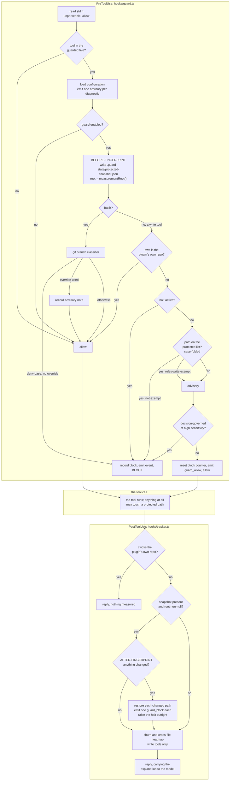
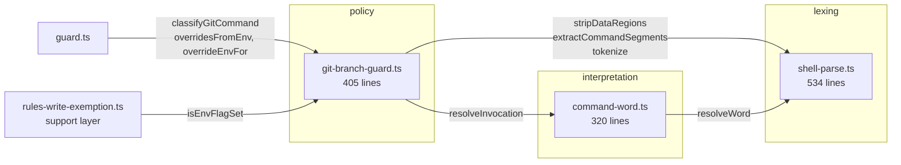

# Analysis: what the fusion compliance guard actually enforces

**Date:** 2026-08-09 11:03
**Type:** Risk Analysis, with an architectural snapshot of the control flow
**Status:** Complete
**Requested by:** user
**Scope note:** the enforcement layer only. A parallel analysis covers the support layer.

## Question

Since v6.0.0 the guard has two policies rather than three: a text-reading git branch classifier on the PreToolUse side, and a fingerprint comparison of the protected paths taken around every guarded tool call. This analysis asks what that pair enforces in fact rather than in specification, where it can answer wrongly, what its behaviour depends on besides the tool call's own inputs, how much of the retired classifier's machinery the surviving policy still needs, and what can be consolidated.

## Scope

Seven files, read in full and exercised as running code: `hooks/guard.ts` (781 lines), `hooks/tracker.ts` (537), `hooks/lib/protected-snapshot.ts` (497), `hooks/lib/git-branch-guard.ts` (405), `hooks/lib/shell-parse.ts` (534), `hooks/lib/command-word.ts` (320) and `hooks/hooks.json` (44). Together 3118 lines, of which 1567 are comment lines and roughly 1300 are code.

Two rule files were read as the specification against which behaviour was checked: `rules/protected-path-discipline.md` and `rules/git-branch-discipline.md`.

The support layer named in the brief was not read. Where a finding runs into it, the boundary is named and the finding stops there.

**Method.** Every behavioural claim below was produced by running the code, not by reading it. The git classifier was driven directly from the compiled build; the two hooks were driven as real subprocesses against scratch consuming projects, with `fusion-guard.json` declaring the protected list. Where a claim rests on reading alone, it carries `inference:` or `speculation:`. Where a git command's real effect is asserted, it was run against a throwaway repository with git 2.49.0.

---

## Findings

### 1. What the guard does today

The hook wiring is symmetric. `hooks/hooks.json:23` and `:34` register the same matcher, `Write|Edit|MultiEdit|NotebookEdit|Bash`, for PreToolUse and PostToolUse, so every guarded tool call passes through both processes.

The two sides answer different questions about different directories. PreToolUse refuses a write it can name, and matches the protected list against `process.cwd()` (`hooks/guard.ts:202-204`, via `projectRelative`). PostToolUse measures what changed, and matches the same list against the workbench root found by walking up (`hooks/lib/protected-snapshot.ts:428-433`, `measurementRoot`). The two roots agree only when the session started at the project root.

Two properties of that flow are worth naming, because both are deliberate and neither is obvious.

**The before-fingerprint is taken above every branch** (`hooks/guard.ts:509-512`), including on calls the guard is about to block. The module's own header explains why (`hooks/lib/protected-snapshot.ts:61-69`): without a before-picture the only restore target is `HEAD`, and reverting to `HEAD` destroys whatever a human has in flight. A blocked call leaves a snapshot nobody compares against, which costs one file write.

**The halt does not reach the shell** (`hooks/guard.ts:324-331`). A halted guard blocks the four write tools and lets Bash through, so an agent can still investigate and report. The protected paths are not left to the halt; they are measured after every call regardless.

State written per call, in order: one advisory event per configuration diagnostic, the snapshot, then whichever of the escalation counter, the halt flag and the event log the branch taken calls for. On the PostToolUse side, the restore writes the protected file itself before any event or halt is recorded.

### 2. Reliability

#### 2a. False alarms: the guard blocks something that was permitted

**2a-1. A plain line inside an unquoted heredoc body is read as a command.** `cat <<EOF > runbook.md` whose body contains the line `git switch main` is denied. Measured; the segment list is `["cat <<", "git switch main", "EOF"]`. The quoted-delimiter form was fixed in 2026-07 and allows.

The fail-closed argument in `hooks/lib/shell-parse.ts:110-118` conflates two facts about an unquoted heredoc. Bash expands there, so `$(git switch main)` in the body genuinely runs and must classify. A bare body line does not run; it is written to the file. The newline segmentation at `:410-414` erases the distinction by turning every body line into a candidate command. The distinction is decidable from the text, since it is the presence of a substitution, which the module already locates for other purposes. Filed as `260809-1111_*_a-plain-line-in-an-unquoted-heredoc-body-is-classified-as-a-command.md`.

**2a-2. From a subdirectory the write-tool refusal denies a path the project never protected.** Measured with the session working directory one level below the root: an `Edit` of `<root>/sub/rules/y.md` is blocked with the message `Protected path: rules/y.md`, naming a path that exists under no such spelling in the project. This half is already recorded, together with its silent-pass twin, in the open issue `260804-2100`. My measurement reproduces that record's own measurement independently. Cited, not refiled.

**2a-3. A configuration file the project cannot parse produces one advisory per guarded tool call.** `hooks/guard.ts:470-472` emits above the `enabled` check, deliberately, and the file's comment states the cost. Not a defect; recorded so the reliability picture is complete.

#### 2b. Silent passes: the guard permits something the policy forbids

Four, all measured, all on the branch policy. The protected-path measurement has no silent pass of this kind, because it compares fingerprints rather than reading a command. Its exposures are of a different shape and appear under 2c and 3.

**2b-1. A trailing `--` lifts the branch deny.** `git checkout -b bar --` is allowed by the classifier and creates and switches to a branch in real git. Verified in both directions. `classifyCheckout` returns allow on the presence of a `--` token (`hooks/lib/git-branch-guard.ts:246`) before it examines the branch-creating flags at `:249-259`. The design comment at `:24-26` is right about `git checkout <ref> -- <paths>` and does not hold when a branch-creating flag is also present, because git resolves the flag first. `-B` verified the same way; `--detach` and `--orphan` verified on the classifier only and marked `inference:` for the git half. Filed as `260809-1105_*_a-trailing-separator-lifts-the-branch-deny-so-git-checkout-b-name-runs.md`.

This is the sharpest finding in the branch policy, because `rules/git-branch-discipline.md:45` tells the agent not to phrase the command differently, on the strength of a guarantee that a two-character suffix defeats.

**2b-2. An unrecognised git global option with a separated value hides the subcommand.** `git --namespace ns switch other` and `git --attr-source HEAD switch t1` are both allowed and both switch branches in real git. Verified in both directions.

The finding's weight is not the two options. It is that this exact defect was found, recorded at severity High, and closed on 2026-08-04 as `260804-1333_*_an-unrecognised-git-global-option-swallows-the-subcommand-and-the-invocation-reads-as-an-unrecognised-program.md`, with a structural fix applied to `resolveGit` in `hooks/lib/bash-mutation-guard.ts`. That module was deleted in v6.0.0 and the fix went with it. `classifySegment` in the surviving classifier carries the same eight lines and never received the correction (`hooks/lib/git-branch-guard.ts:179-202`). A follow-on record, `260804-1344_*_the-git-option-walk-stops-at-an-unknown-options-value-so-a-c-behind-it-is-invisible.md`, then found the residual in that fix, so the remedy to carry across is the second version rather than the first. Filed as `260809-1106_*_the-unknown-global-option-fix-was-deleted-with-the-mutation-classifier-and-the-branch-guard-never-had-it.md`.

**2b-3. The command-word comparison is case-sensitive.** `GIT switch main` is allowed. Measured separately: both zsh and bash resolve `GIT` to git 2.49.0 on this machine's case-insensitive volume. The protected-path half of the same hook took the opposite decision deliberately and documented the reasoning at `hooks/guard.ts:615-622`, where one capital letter was found to bypass the whole protected list. The same argument was not carried to the command word. Filed as `260809-1110_*_the-command-word-comparison-is-case-sensitive-while-the-protected-path-match-folds.md`.

**2b-4. Commands whose verb is not in their own text.** `eval 'git switch main'`, `bash -c '…'`, a `case` arm and a script the agent invokes are all allowed. Measured, and stated as a bound in both the module header (`hooks/lib/git-branch-guard.ts:8-14`) and the rule (`rules/git-branch-discipline.md:37`). Correctly documented, not a defect, and the honest reason the branch policy is a choke point rather than a proof.

#### 2c. Data loss: the guard writes back something that should not have been written back

This is where the measurement's real exposure lies, and the rule's two conceded prices do not describe any of it.

**2c-1. Replacing a protected file with a symlink writes through it and drops the path from the watched set.** The most serious finding in this analysis. One tool call does three things:

| Consequence | Measured result |
|---|---|
| The restore follows the link | An unrelated file outside the protected tree was overwritten with the protected file's content |
| The path is not restored | It remains a symlink, while the guard's message says it "has been restored" |
| The path leaves the watched set | On the next call the snapshot holds no entry for it; its content then changes freely with nothing measured and no halt |

Three lines combine to produce it. `enumerateProtected` skips symbolic links (`hooks/lib/protected-snapshot.ts:218`), so a glob-covered path that becomes one leaves the enumeration silently. `fingerprint` follows links (`:272-273`). `restore` writes with `writeFileSync` and no `O_NOFOLLOW` (`:376`).

Wildcard-free entries survive the third consequence, because `literalPaths` (`:247-249`) watches them whether or not enumeration finds them. Measured: `fusion-guard.json` was still the snapshot's key after `rules/x.md` had dropped out. Against the shipped list that means `agents/**`, `rules/**` and `skills/**` lose protection permanently, while the five literal entries keep it and can still be used to write one arbitrary file.

The module does state a symlink boundary at `:182-197`, accurately, for enumeration. It is silent on the restore, which is the direction that writes. Filed as `260809-1104_*_a-symlink-in-place-of-a-protected-file-writes-through-it-and-removes-the-path-from-the-watched-set.md`.

**2c-2. Any writer active during the tool-call window is attributed to the agent.** Measured with no agent write anywhere in the sequence: the user saves a rule file in their own editor between the two hooks, and PostToolUse reverts it, tells the model it changed during this tool call, and halts the session. The user's bytes are not preserved anywhere.

The window is the full duration of the tool call, so a `Bash` call running a build holds it open for minutes. Concurrent writers are ordinary: an editor, a file watcher, a dev server, a second Claude session against the same project, a background process an earlier call started.

The argument at `hooks/lib/protected-snapshot.ts:61-69` says two snapshots around one tool call make the change attributable, and that attribution is what makes reverting permissible. The argument is sound and its premise is too strong. Two snapshots attribute a change to the interval, and the interval is not exclusively the agent's. Filed as `260809-1107_*_any-writer-active-during-the-tool-call-window-is-attributed-to-the-agent-and-reverted.md`.

**2c-3. A failed snapshot save leaves the previous snapshot in place.** `saveSnapshot` swallows a write failure and its comment claims the consequence is that the next comparison has no before-picture (`hooks/lib/protected-snapshot.ts:465-468`). The write that fails is to `${path}.tmp`; the previous `protected-snapshot.json` is untouched and is what `loadSnapshot` returns. Measured: with the save failing, a tool call reverted a protected file to the content it held two calls earlier, destroying an intervening state no measurement had ever objected to. `loadSnapshot` validates shape and never reads `ts`, the field whose own documentation says it exists for the reader of a stale snapshot. Filed as `260809-1108_*_a-failed-snapshot-save-leaves-the-previous-one-in-place-so-the-next-call-reverts-to-an-older-state.md`.

**Two further prices, not filed as defects because both are accurately documented.** A protected path that is now a directory cannot be restored, and the failure is reported rather than swallowed (`hooks/tracker.ts:183-190`). The parallel-call residual is stated at `hooks/tracker.ts:272-280`, honestly, including the direction of its exposure.

#### 2a-3 continued: the fail-open handlers do not fail open

Both hooks end with a handler whose comment promises to fail open (`hooks/guard.ts:776-781`, `hooks/tracker.ts:532-537`), and both call `emitEvent` before they write the verdict. `emitEvent` appends under `.guard-state/`, which is the most likely source of an unexpected throw in these two files. Measured: with that directory unwritable, `guard.js` exits non-zero with empty stdout, having written no verdict at all. In the tracker the same inversion additionally suppressed a halt that the same run had already earned, because the restore happens before the recording. `speculation:` how Claude Code interprets an empty verdict; both readings are bad in different ways. Filed as `260809-1109_*_both-hooks-fail-silent-instead-of-open-when-the-guard-state-directory-is-unwritable.md`.

### 3. Determinism

Behaviour depends on the following, beyond the tool call's own inputs.

| Dependency | Where | Intended and documented? |
|---|---|---|
| Working directory, for the write-tool refusal | `hooks/guard.ts:202-204`, `:130`, `:94-98` | Known, open, and measured, in `260804-2100`. The divergence from the measurement root is acknowledged in `CLAUDE.md` as deliberate since v6.0.1; the issue stays open because the refusal side is still the wrong one. |
| Working directory, for the plugin-repo stand-down | `hooks/guard.ts:538`, `hooks/tracker.ts:516` | Yes, and the two stand-downs were deliberately separated in v6.0.1. `hooks/lib/protected-snapshot.ts:410-426` carries the reasoning. |
| Working directory, for the churn heatmap | `hooks/tracker.ts:398-404` | Yes, and correctly so: churn is a statement about the session's own paths. |
| Workbench root, for the measurement | `hooks/lib/protected-snapshot.ts:428-433` | Yes, moved there in v6.0.1 with measured evidence on both sides. |
| `FUSION_ALLOW_BRANCH_SWITCH`, `FUSION_ALLOW_WORKTREE` | `hooks/lib/git-branch-guard.ts:395-400` | Yes. Independent, and the independence is itself pinned by a closed issue. |
| `FUSION_ALLOW_RULES_WRITE` | `hooks/guard.ts:666`, `hooks/tracker.ts:231` | Yes, on both surfaces, asked of a narrower question on the measurement side. |
| Filesystem state between the two fingerprints | `hooks/tracker.ts:292-295` | **No.** This is finding 2c-2. |
| A leftover snapshot from an earlier call | `hooks/lib/protected-snapshot.ts:479-497` | **No.** This is finding 2c-3, and the comment asserts the opposite. |
| Ordering of concurrent hook invocations | `hooks/tracker.ts:272-280` | Documented as a residual, honestly. Worth one correction: the residual says Claude Code offers no per-call correlation key. It offers a per-**session** one, `session_id`, which both hooks declare in their input types (`hooks/guard.ts:187`, `hooks/tracker.ts:107`) and neither reads. That does not close intra-session parallelism, so the residual stands, but it would separate two sessions running against one project, which `CLAUDE.md` documents as possible. |
| Symlinks | `hooks/lib/protected-snapshot.ts:218`, `:272`, `:376` | Partly. The enumeration boundary is documented; the restore's link-following is not. Finding 2c-1. |
| Filesystem case sensitivity | `hooks/guard.ts:623`, `hooks/lib/protected-snapshot.ts:176-180`, against `hooks/lib/git-branch-guard.ts:166` | Split. The path match folds unconditionally and says why. The command word does not fold and nothing says why. Finding 2b-3. |
| Wall-clock timestamps | `hooks/lib/protected-snapshot.ts:292` and the escalation entries | Written, never read. No behaviour depends on them today, which is itself the defect in 2c-3. |
| A subprocess with no timeout | `hooks/guard.ts:112-116` | **No.** `execFileSync` runs `git rev-parse` per positional argument of an ambiguous `git checkout`, with `stdio: "ignore"` and no `timeout` option. A git invocation that blocks, on a stalled network mount for instance, blocks the PreToolUse hook with no bound. `inference:` on how likely that is in practice; the absent timeout is verified. |
| The measurement root moving mid-call | `hooks/lib/protected-snapshot.ts:317` | `inference:`, not measured. A tool call that creates a nested `fusion-workbench/.fusion-setup` below the current root would make the two fingerprints report different roots, and `diffSnapshots` then returns an empty list. One call measures nothing. The refusal is correct behaviour; the silence is the part worth knowing. |

### 4. What the fallen classifier left behind

Both lexer modules now serve one consumer. The dependency shape is small and clean; the volume is not.

Every exported function is called by something, so nothing is dead at the module boundary. The dead weight is inside.

**`command-word.ts` has one export any production code uses.** `resolveInvocation` is imported at `hooks/lib/git-branch-guard.ts:66`. The other seven exports, `findCommandWord`, `programName`, `row`, `GRAMMAR_PREFIXES`, `ENV_ASSIGNMENT_RE`, `WrapperSpec` and `WRAPPER_PROGRAMS`, are referenced only inside their own file. Verified by grep across all TypeScript outside `dist/`.

**No test imports `command-word.ts` at all.** The module header states, at `:13-15`, that the answer stays in its own module "because the resolution and the git policy are different questions and the suite tests them apart." The second clause is false. There is no `command-word.test.ts`, and every test that exercises the resolution does so through `git-branch-guard.test.ts`.

**`Invocation.reachesBuiltin` has no reader anywhere**, including in tests. Its own documentation says so, at `hooks/lib/command-word.ts:262`: "NOTHING READS THIS TODAY." The field costs its 35-line rationale (`:232-266`), the `viaWrapper` bookkeeping (`:296-298`, `:315`), the computation at `:312`, and a 28-line section of the `WRAPPER_PROGRAMS` header (`:108-135`) that exists solely to explain why a related field is absent. About 68 lines for a value nothing consumes.

**The placeholder and literal-table machinery in `shell-parse.ts` cannot be reached from production code.** `resolveWord` splits its token into placeholder and code parts (`:493-503`), then handles the non-code parts (`:513-516`). Nothing mints a placeholder any more, and the only literal table in the system is `NO_LITERALS`, an empty map at `hooks/lib/git-branch-guard.ts:80`. With an empty map the split always yields exactly one code part covering the whole token, so both branches are unreachable. The cost is `PLACEHOLDER_RE` and its documentation (`:47-53`), the split (`:493-503`), the non-code branch, the `literals` parameter threaded through two module signatures, and the 17-line header paragraph describing the retired mode (`:22-38`).

The machinery is kept alive by its tests, which say so. `shell-parse.test.ts:386-389` reads: "Nothing in the module mints these tokens any more, the mode that did was retired with the mutation classifier, so the table is fed directly here." Three test cases and two helper functions, 37 lines, synthesize the input that no caller can produce.

**What is not over-dimensioned.** `WRAPPER_PROGRAMS` looks like a leftover from the verb table and is not one: `rules/git-branch-discipline.md:20` names `sudo`, `env`, `exec`, `xargs`, `nohup`, `timeout`, `command`, `nice` and `time` as covered, so the table is specification rather than residue. The heredoc and quoting machinery in `stripData` is likewise load-bearing for the git policy, with one precision defect noted at 2a-1. The flat segmenter is what the branch policy needs and no more.

**Comment volume.** The six TypeScript files are 51 percent comment lines: 1567 of 3074. `hooks/lib/protected-snapshot.ts` is 63 percent, `hooks/lib/command-word.ts` 62 percent. A measurable share documents mechanisms that no longer exist rather than the code beneath it.

---

## Implications

The two policies are in very different health, and the difference is instructive rather than incidental.

**The measurement is the right mechanism and its implementation has three holes, all in the same place.** Every finding under 2c is about what happens at the boundary between the fingerprint and the filesystem: a link followed, a window left open, a stale file left behind. None is about the decision to measure rather than predict, which the evidence continues to support. The v6.0.0 change traded an undecidable question for a decidable one and got the trade right. What it did not do is finish the second question's edges, and `260809-1104_*_a-symlink-in-place-of-a-protected-file-writes-through-it-and-removes-the-path-from-the-watched-set.md` shows the cost: a protection list that a single `ln -s` removes a path from is not a protection list for that path.

**The branch policy is now the weaker half, and its documentation understates that.** Three measured silent passes, of which one, `260809-1106_*_the-unknown-global-option-fix-was-deleted-with-the-mutation-classifier-and-the-branch-guard-never-had-it.md`, is a High-severity defect that was found and fixed nine weeks ago in a sibling module and lost when that module was deleted. Nothing in the retirement asked whether the surviving classifier carried the same eight lines. That is a process finding as much as a code finding: a shared defect fixed in one of two copies leaves no trace when the other copy is the one that survives.

**Two rule sentences are false while these issues stand**, and both are the kind that changes agent behaviour. `rules/protected-path-discipline.md:21` says the rule "carries no catalogue of holes"; there is one, and an agent that reads that sentence has been told not to look. `rules/git-branch-discipline.md:45` tells the agent not to rephrase a denied command, on the strength of a guarantee that `--` defeats. Correcting the text is cheaper than correcting the code and should not wait for it.

**The lexer stack is roughly a third larger than the one policy it now serves requires**, and the surplus is concentrated in machinery whose only remaining consumers are the tests written for it. That is not merely volume. Test-sustained dead code reads as a live seam to the next editor, and the two module headers here actively assert a second consumer that does not exist.

---

## Recommendations

Six consolidation targets, ordered by benefit against risk. Each is specific enough to become a plan step. Numbers are measured line counts unless marked approximate.

**1. Delete the placeholder and literal-table machinery from the lexer.** Remove `PLACEHOLDER_RE` and its documentation (`shell-parse.ts:47-53`), the placeholder split in `resolveWord` (`:493-503`), the non-code branch (`:513-516`), the `literals` parameter from `resolveWord` and `resolveInvocation`, the retired-mode paragraph in the module header (`:22-38`), and the three tests plus two helpers that synthesize placeholders (`shell-parse.test.ts:383-421`). About 52 source lines and 37 test lines. **Risk: very low**, because with an empty map the removed branches are provably unreachable. **Behaviour: unchanged.** Verify by running the suite with no other edit.

**2. Delete `Invocation.reachesBuiltin` and its rationale.** Remove the field and its 35-line documentation (`command-word.ts:232-267`), the `viaWrapper` bookkeeping (`:296-298`, `:312`, `:315`) and the `WRAPPER_PROGRAMS` header section that exists only to explain an absent sibling field (`:108-135`). About 68 lines. **Risk: low.** The measured shell facts the documentation records are already preserved in the closed issue `260803-2236_*_runsbuiltins-is-asserted-about-a-name-so-the-model-now-moves-the-shell-where-the-shell-did-not-move.md`; replace the prose with a one-line citation of that record rather than deleting the knowledge. **Behaviour: unchanged.**

**3. Give the two-hook seam a single-use snapshot.** `tracker.ts` unlinks the snapshot after reading it, and `saveSnapshot` unlinks a stale file when its own write fails. One invariant, "a before-picture is consumed exactly once", closes three separate exposures: the stale-snapshot revert (`260809-1108_*_a-failed-snapshot-save-leaves-the-previous-one-in-place-so-the-next-call-reverts-to-an-older-state.md`), the snapshot left behind by a blocked call, and part of the parallel-call residual documented at `tracker.ts:272-280`. Adds perhaps 10 lines and removes the need for two separate guards. **Risk: medium**, because it changes when the measurement declines to run. **Behaviour: changed, deliberately.** Pair it with a test that drives both hooks as subprocesses.

**4. Move `isEnvFlagSet` out of the git branch module.** `rules-write-exemption.ts:269` imports a generic environment-flag parser from `git-branch-guard.ts:388-392`, so the protected-path exemption depends on the branch policy for five lines that belong to neither. Move it to a neutral home. Saves no lines and removes one import edge between two policies that the rule files describe as sharing "a hook and nothing else". **Risk: very low. Behaviour: unchanged.** This one touches a file in the parallel analysis's scope, so sequence it with that analysis's conclusions.

**5. Retire the archaeology, keep the rejections.** Five comment ranges describe what a deleted module used to do: `guard.ts:29-37` and `:300-331` (including the deliberate gap in the step numbering), `git-branch-guard.ts:47-63`, `command-word.ts:4-15` and the header paragraph already counted in target 1. About 75 lines outside target 1's overlap. **Risk: low but real**, and the distinction is what makes this a targeted recommendation rather than a sweep: comments that record *why a design was rejected* must survive, because deleting the warning is how a rejected design returns. Move those to one named place with a citation to the binding decision, and delete only the descriptions of vanished mechanisms. **Behaviour: unchanged.**

**6. Fold `command-word.ts` into `git-branch-guard.ts`.** One export has a production consumer, seven do not, and no test imports the module. The header's stated reason for keeping it separate, that "the suite tests them apart", is not true. Merging removes a module, an import edge and seven needless `export` keywords, and gives the branch classifier's suite ownership of the whole path it depends on. Net saving is roughly 130 lines once target 2 has run. **Risk: medium**, because it is a move of security-relevant code and a move is where a subtle edit hides. Require the branch-guard suite green before and after with no test change beyond import paths. **Behaviour: unchanged.** Take the alternative instead, writing `command-word.test.ts` and leaving the split, only if a second consumer is actually anticipated; none is.

**Not recommended.** Shrinking `WRAPPER_PROGRAMS`. It looks like residue from the retired verb table and is specification: `rules/git-branch-discipline.md:20` names nine of its rows as covered behaviour.

**Sequencing.** Targets 1, 2 and 4 are independent and can run in any order. Target 5 overlaps target 1 and should follow it. Target 6 should follow target 2, since target 2 removes most of what would be moved. Target 3 is independent of all five and belongs with the defect work rather than the cleanup, because it closes a High-severity issue.

**Before any of this, the seven filed issues.** The consolidation is worth doing and none of it changes what the guard enforces. `260809-1104_*_a-symlink-in-place-of-a-protected-file-writes-through-it-and-removes-the-path-from-the-watched-set.md` does.

---

## Filed Issues

| File | Severity | One line |
|---|---|---|
| `260809-1104_*_a-symlink-in-place-of-a-protected-file-writes-through-it-and-removes-the-path-from-the-watched-set.md` | Critical | One `ln -s` writes an arbitrary file and permanently unwatches a glob-protected path |
| `260809-1105_*_a-trailing-separator-lifts-the-branch-deny-so-git-checkout-b-name-runs.md` | High | `git checkout -b <name> --` is allowed and creates and switches to a branch |
| `260809-1106_*_the-unknown-global-option-fix-was-deleted-with-the-mutation-classifier-and-the-branch-guard-never-had-it.md` | High | A closed High-severity defect is live again in the surviving classifier |
| `260809-1107_*_any-writer-active-during-the-tool-call-window-is-attributed-to-the-agent-and-reverted.md` | High | A human editor save during a tool call is reverted and halts the session |
| `260809-1108_*_a-failed-snapshot-save-leaves-the-previous-one-in-place-so-the-next-call-reverts-to-an-older-state.md` | High | A stale before-picture reverts a state no measurement objected to |
| `260809-1109_*_both-hooks-fail-silent-instead-of-open-when-the-guard-state-directory-is-unwritable.md` | Medium | The fail-open handler depends on the resource whose failure it recovers from |
| `260809-1110_*_the-command-word-comparison-is-case-sensitive-while-the-protected-path-match-folds.md` | Medium | `GIT switch main` passes on a case-insensitive filesystem |
| `260809-1111_*_a-plain-line-in-an-unquoted-heredoc-body-is-classified-as-a-command.md` | Medium | Writing a runbook that quotes a git command is denied |

Cited rather than refiled: `260804-2100_*_from-a-subdirectory-cwd-the-protected-list-matches-nothing-while-fail-closed-still-denies.md`, whose two measured halves this analysis reproduced independently.

## Sources

**Code, read in full:** `hooks/guard.ts`, `hooks/tracker.ts`, `hooks/hooks.json`, `hooks/lib/protected-snapshot.ts`, `hooks/lib/git-branch-guard.ts`, `hooks/lib/shell-parse.ts`, `hooks/lib/command-word.ts`, `hooks/config.json`.

**Specification:** `rules/protected-path-discipline.md`, `rules/git-branch-discipline.md`, `CLAUDE.md`.

**Records consulted:** `260804-1333_*_…` and `260804-1344_*_…` (the lost fix), `260804-2100_*_…` (the subdirectory divergence), `260716-2005_*_…` (the quoted-heredoc half), `260807-1026_*_…` (the `HEAD`-restore data loss).

**Measurement environment:** node 24.2.0, git 2.49.0, zsh 5.9 and bash, macOS on APFS in its default case-insensitive configuration. Hooks driven as real subprocesses from the work-tree build in `hooks/dist/`, against scratch consuming projects created for each case. Every scratch project lived outside the fusion repository, so the plugin-repo stand-down was not in play and the measured behaviour is the behaviour a consuming project gets.

## Open Questions

- [ ] Does target 6, folding `command-word.ts` into the branch classifier, foreclose anything? The module was created to serve two consumers and one is gone. If a second Bash policy is anticipated, keeping the split and writing its missing test is the better trade. The answer belongs to whoever holds the roadmap for the guard.
- [ ] `speculation:` how Claude Code treats a PreToolUse hook that exits non-zero with empty stdout. This decides whether `260809-1109_*_both-hooks-fail-silent-instead-of-open-when-the-guard-state-directory-is-unwritable.md` is a silent disabling of the guard or a silent blocking of the agent. Measurable against a live session; not measured here.
- [ ] Is the `git rev-parse` subprocess in `hooks/guard.ts:112-116` worth a timeout, or is the hang unreachable in practice? The subprocess runs once per positional argument of an ambiguous `git checkout`, which is a common enough shape that the question deserves an answer rather than an assumption.
