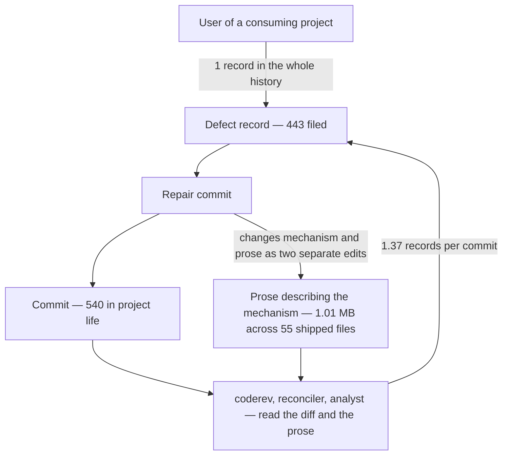
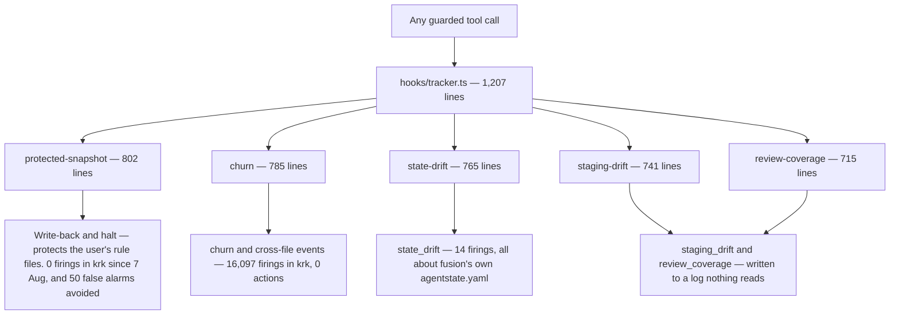

# Analysis: Where fusion's complexity comes from, and what would have to go

**Date:** 2026-08-12 00:22
**Type:** Gap / Risk, with comparative measurement against a control project
**Status:** Complete
**Requested by:** user, via orchestrator dispatch

---

## Question

The user's reading is that fusion will not reach a stable, error-free state, that continued
building is the cause rather than the cure, and that the useful question is how far the framework
must be reduced to become tractable. This analysis tests the causal claim against the project's own
records, identifies where the defects actually originate, and states what would have to be removed,
what that would cost, and whether removal is the lever that changes the trajectory.

---

## Headline

**The defect rate is not rising. The defect volume is, because throughput is.** Fusion files about
1.37 defect records per commit; krk, the Rust file manager built with fusion and carrying none of
fusion's complexity, files 1.10 per commit and closes 98 percent of them. Roughly one record per
commit is what a fusion-run project looks like, and it is a measure of review throughput rather
than of quality.

**What is unusual about fusion is not the number of defects but their kind.** In a hand-classified
random sample of 90 of the 443 records, 44 percent are a claim in shipped prose contradicting the
mechanism it describes or another claim about it. Ordinary run-time faults in code account for 23
percent. Fusion's dominant artifact is executable specification written in English, and English has
no compiler.

**Removal has already been tried at the largest available scale, and it bought four days.** The
shell classifier deletion on 7 August removed 3,597 lines of hook source and 7,475 lines of tests.
By 11 August the source stood 969 lines above its pre-deletion peak and the test corpus 4,981 lines
above it. The binding constraint is not the size of the system. It is the rate of addition, and the
one instrument the project ever built to bound that rate was converted from a blocking gate into a
non-failing report on 5 August. That report is tripped right now and says, in its own words, that
it is not a blocker.

---

## Scope

**Measured.** All 443 issue records across `fusion-workbench/shared/issues/` and the twelve Circle
issue stores, by filename stamp, marker and body. All 71 decision records, 52 review files, 344
history files, 15 analyses. The full `git log` of 540 commits from 2026-05-04 to 2026-08-12.
`orchestrator-events.jsonl` in both fusion and krk. The 18 MB `.guard-state/events.jsonl` in krk.
Byte and line counts of every shipped surface at HEAD and at 21 points in history. The hooks test
suite, run to completion. The rules-emission golden test, run to completion.

**The control.** `/Users/k1/Projects/productive/krk`, a native macOS file manager in Rust, built
with fusion since 2 August: 261 commits, 286 issue records, 6 Circles, plugin v7.2.0 installed.
It is the only live consuming project reachable from this machine.

**Read but not re-derived.** The prior analysis
`260805-1830-zweck-nutzung-und-stand-des-plugins.md`,
which answered the "does fusion serve its purpose" question on 5 August and whose findings on
context cost, agent usage and the guard's false-alarm balance stand. Its findings are cited, not
repeated. The open record
`260811-1734_*_reduce-the-surface-so-a-claim-cannot-go-stale-in-several-places-at-once.md`
and the decision it realises,
`260810-1635_*_where-does-the-obligation-sit-to-update-the-artefact-that-explains-a-behaviour-when-the-behaviour-changes.md`.

**Not measurable from here.** Whether users of consuming projects experience failures. No channel
records that, which is itself finding 3 below. The second consuming project, cocreator, no longer
exists on this machine.

---

## Findings

### 1. The rate held flat; the volume rose with throughput, and a control project confirms it

Defect records exist only since 2026-07-06. The project ran for nine weeks before that with no
issue store, so the first 24 percent of its commit history contributes no records and no comparison
is possible across it.

| Day | fusion filed | fusion commits | per commit | krk filed | krk commits | per commit |
|---|---|---|---|---|---|---|
| 08-01 | 25 | 17 | 1.47 | — | — | — |
| 08-02 | 26 | 17 | 1.53 | 19 | 17 | 1.12 |
| 08-03 | 14 | 16 | 0.88 | 36 | 21 | 1.71 |
| 08-04 | 38 | 24 | 1.58 | 39 | 17 | 2.29 |
| 08-05 | 80 | 22 | 3.64 | 21 | 18 | 1.17 |
| 08-06 | 14 | 18 | 0.78 | 25 | 27 | 0.93 |
| 08-07 | 23 | 29 | 0.79 | 22 | 26 | 0.85 |
| 08-08 | 3 | 10 | 0.30 | 12 | 9 | 1.33 |
| 08-09 | 30 | 29 | 1.03 | 20 | 25 | 0.80 |
| 08-10 | 91 | 70 | 1.30 | 70 | 68 | 1.03 |
| 08-11 | 61 | 44 | 1.39 | 22 | 31 | 0.71 |
| **Aug mean** | **405** | **296** | **1.37** | **286** | **259** | **1.10** |

The two projects sit within 25 percent of each other. krk is an ordinary application: no agent
prompts, no rules corpus, no guard sources, no meta-layer of any kind. It is built by the same
person, under the same review discipline, with the same tool. The shared rate is therefore best
read as a property of the method rather than of either codebase. About one filed record per commit
is what this way of working produces.

Against July the rate did move. July averaged roughly 0.45 records per commit; August averages
1.37. Two things changed in between, and only one of them is "more system". The review discipline
changed shape on 9 August, when `coderev` passes began to be run against explicit git ranges
(`260809-2050-coderev-guard-and-hooks-turn-6b94e17-to-head.md` is the first). Of the 272 records
that carry a `Filed by` field, 159 were filed by `coderev`. Since 10 August, 95 of 134 were.
*inference:* the threefold rise per commit is dominated by review coverage rather than by defect
density, but the two cannot be fully separated from the records alone, because no measurement of
review coverage exists for July.

Closure keeps pace. Of the 368 closed records, 299 (81 percent) closed within one day of filing and
the median lag is zero days. Across 1 to 11 August, 405 records were filed and 368 closed, a
closure ratio of 91 percent and a net growth of 37 open records over eleven days. The current
backlog of 75 open records is not accumulated debt: 51 of them were filed in the last two days, and
of the 55 open records that cite a commit, 54 cite one made within a day of the filing.

**Verdict on the user's causal claim: not supported as stated.** The rate per unit of work did not
deteriorate, and the closure discipline did not break. What the user is seeing is a real absolute
number, 75 open records, produced by a review apparatus running at roughly 35 findings a day
against a system being changed at roughly 27 commits a day. The perception of instability is
correct about the reading and wrong about the cause.

### 2. The largest defect class is prose that describes mechanism

Classification of a random sample of 90 of the 443 records, read individually. Categories are
disjoint and complete by construction; each record was placed by what had to change to close it.

| Class | Count | Share | 95% interval | Extrapolated to 443 |
|---|---|---|---|---|
| Prose contradicts the mechanism or another claim | 40 | 44% | 34–55% | ~197 |
| Run-time fault in shipped code | 21 | 23% | 15–33% | ~103 |
| Residual of the deleted shell-write classifier | 10 | 11% | 6–20% | ~49 |
| A gate, lint or test measures less than it claims | 8 | 9% | 4–17% | ~39 |
| Fusion's own bookkeeping is wrong | 6 | 7% | 3–14% | ~30 |
| A route or case that was never built | 5 | 6% | 2–13% | ~25 |

The first class covers stale citations, counts that disagree with what they count, dead paths,
prompts that contradict other prompts, comments that survived the behaviour they explained, and
documentation that describes a mechanism as it was two commits ago. Titles from the last three days
are representative: *the citation rooting commit and its own record both say seven citations and
there are eight*; *the record about counting instances of a shape gives three different counts*;
*setup step 6 tells a resumed session to create a history file that step 1 tells it not to create*;
*CLAUDE.md says the measurement stands down on cwd and it has asked the workbench root since
v6.0.1*.

An independent measurement points the same way. Of the 312 closed records whose closing note names
a file, 98 were closed by editing text alone, 99 by editing code alone, and **115 required both**.
Better than a third of closures had to change a mechanism and, separately, the prose that describes
it. The prose is a second implementation, maintained by hand, with no build step that fails when
the two diverge.

The first class is also the one a user never encounters directly. Adding the gate class and the
bookkeeping class, roughly 60 percent of the record population describes conditions invisible in a
consuming project's product. That share is why the backlog reads as alarming and behaves as
harmless.

### 3. The loop is closed: fusion's defects are found by fusion, in work fusion committed hours earlier

Two measurements, taken independently.

277 of the 443 records (63 percent) cite at least one commit hash that resolves in this repository.
Of those, **267 (96 percent) cite a commit made the same day or the day before the record was
filed**. Nine records cite a commit older than three days. The oldest is a single record citing
work 95 days old.

Of the 272 records that name their author, `coderev` filed 159 (58 percent), the orchestrator 32,
`coder` 29, the reconciler 21, the analyst 19, the consultant 8, the planner 2. **One record in the
entire history was filed by the user.**

Fusion has no feedback signal from use. Its whole defect population is generated by introspection
on its own output, minutes to hours after producing it. A system whose only quality signal is
self-inspection converges on the quality of its self-inspection, not on the quality of what it
ships. The 5 August analysis measured the same thing from a different angle and did not name it:
three consuming-project defects reached fusion in four days, and all three arrived because the user
carried session logs across by hand.



The cycle in that graph is deliberate and is the finding. Every repair commit re-enters the review
population, and every repair that touches a mechanism also has to touch the prose describing it,
which is a second opportunity for the two to diverge. The loop has no external input and no
external drain.

### 4. The surface is large, and the restatement is measurable

Shipped text at HEAD, excluding the workbench:

| Surface | Files | Bytes | Words |
|---|---|---|---|
| `agents/*.md` | 16 | 398,928 | 59,514 |
| `skills/*/SKILL.md` | 16 | 262,112 | 38,910 |
| `rules/*.md` | 13 | 151,606 | 23,016 |
| `README*.md` | 3 | 90,386 | 12,930 |
| `CLAUDE.md` | 1 | 47,370 | 6,545 |
| `docs/*.md` | 3 | 41,807 | 6,796 |
| `templates/` | 3 | 18,808 | 2,849 |
| **Total** | **55** | **1,011,017** | **150,560** |

Code at HEAD: 10,771 lines of hook source, 29,196 lines of hook tests, 5,987 lines of `bin/`
helpers. The test corpus is 2.7 times the source it tests, and the suite runs 1,349 tests in 52
files in 87 seconds, green.

`agents/orchestrator.md` alone is 164,716 bytes: 41 percent of all agent prose and larger than the
entire rules corpus. It stood at 41,623 bytes at the project's first release, 79,596 bytes on the
morning of 10 August, and 164,716 bytes on the evening of 11 August. It **doubled in about 36
hours**.

Restatement, measured two ways.

Literal duplication: 121 distinct sentences of 60 characters or more appear in two or more shipped
files. The most-repeated appears in 15 files, and the top six are all Setup boilerplate present in
14 or 15 of the 16 agent prompts.

Conceptual spread, counted as the number of the 52 shipped text files that mention a load-bearing
claim at all:

| Claim | Files touching it |
|---|---|
| Store paths come from `bin/fusion-paths` | 36 |
| Circle state markers | 32 |
| The workbench-root walk-up and halt | 24 |
| Which voice profile governs which output | 24 |
| The `Domain:` dispatch parameter | 21 |
| The commit lock | 15 |
| The Origin Rule | 13 |
| Which language governs which artifact | 14 |

The project's stated convention is one authoring home per claim, every other site citing it. The
convention is real and has been applied deliberately four times inside
`rules/fusion-workbench-conventions.md`. The distance from it is roughly the spread above minus
one, per claim. The open record `260811-1734` names this correctly and is the right work.

**One caution about that record, which is the point where this analysis parts company with the
project's own reading.** Deduplication is a one-time, constant-factor win against a process that is
linear in time. In the 48 hours of 10 and 11 August the tree gained 626 net lines in `agents/`, 363
in `skills/`, 4,720 in hook source and 12,153 in hook tests. A perfect deduplication pass would
remove some fraction of 1.01 MB once. The addition rate would refill it. Section 5 measures exactly
that happening.

### 5. Removal has been tried twice, worked both times, and did not change the trajectory

**Precedent one: the shell-write classifier.** The mechanism attempted to decide, from a shell
command's text, which files the command would write. The question is undecidable, the project
proved it, and the fix was to change the question: measure the protected paths before and after the
call instead of predicting them. The evidence for the change is unusually good.
`260804-1205-shell-reachability-model` records five holes in an approved
design, the worst of them verified to delete a protected file in both shells. In the live consuming
project, the classifier produced **50 blocks over six days and every one was a false alarm**: each
named a variable, a tilde, a glob, a scratch directory or the project's own unprotected source
file. One of them denied fusion's own documented way of closing an issue, written in its natural
loop form. The measured yield was zero real hits against 50 false ones.

Commit `ba7ccda` on 7 August deleted 3,351 lines of `bash-mutation-guard.ts` and 786 of
`shell-reach.ts`, and the day's net was 3,597 source lines and 7,475 test lines removed.

The replacement works. Since 7 August the guard has produced **zero blocks, zero write-backs and
zero halts** in krk, across five days of intense work and 7,443 tracker records. The redesign
removed a mechanism that cost friction and returned nothing, and replaced it with one that is
silent. That is the project's best piece of engineering.

**And the space refilled in four days.**

| Date | hook source | hook tests |
|---|---|---|
| 31 Jul | 2,231 | 3,475 |
| 4 Aug | 8,981 | 18,794 |
| 7 Aug, before the deletion | 9,802 | 24,215 |
| 7 Aug, after the deletion | 6,205 | 16,740 |
| 10 Aug | 6,669 | 22,240 |
| 12 Aug (HEAD) | 10,771 | 29,196 |

Four and a half days after the largest deletion in the project's history, the source stood 969
lines above the pre-deletion peak and the test corpus 4,981 lines above it. What filled the space is
enumerable: `domain-cascade` (992 lines), `state-drift` (677), `staging-drift` (645),
`review-coverage` (566), `protected-snapshot` (802), `guard-state-file` (209), `fail-open` (192),
`reverted-copy` (188), `churn-rank` (131), `turn-budget` (91), `git` (76), plus five entry-point
files. Roughly 5,000 lines of new mechanism in five days.

**Precedent two: the bus protocol,** removed in v3.15.0. No live record documents it; the bus-era
decisions were marked superseded and have since left the workbench. The removal left no residual
this analysis can find, and concurrent sessions exchange work through the user again. Cost:
apparently nil. It is a clean precedent and a small one.

**Precedent three, the one that matters most, is a removal that was undone.** Until 5 August the
rules-emission golden carried a ratchet: one byte cap per agent role, pinned to that role's measured
high-water mark, movable in one direction only. The test's own header records what happened:

> Until 2026-08-05 this file carried a ratchet ... It held the line, and it also made the first
> finding-driven addition unlandable ... The user's answer was to keep the MEASUREMENT and drop the
> BLOCK.

The budget that replaced it reports and never fails. Run today, it prints:

```
role 'circle-records.md + workbench-stash-and-lock.md' — orchestrator
  114 941 bytes, budget 114 149 (floor 102 149 + 12 000)
...
-> cut where the growth is, then re-baseline ... Until then this report stands; it is not a blocker.
```

The single remaining hard gate is `DRIFT_CEILING = 145,144`, the level the fleet reached on 4 August
before the cut. The project's own cost meter therefore permits a full return to its worst measured
state before it will stop anything. Since the ratchet was dropped: `rules/` went from 165,628 to
151,606 bytes, a real cut; `agents/` went from 288,980 to 398,928, up 38 percent; hook tests went
from 19,838 to 29,196, up 47 percent. The one surface the cap covered is the one surface that did
not grow.

### 6. Which mechanisms carry their weight

Evidence of a real catch means: the mechanism fired in a real project, on a real condition, and a
human or an agent did something about it. Absence of evidence is stated as absence, not as proof of
waste.

| Mechanism | Weight | Evidence of a real catch | Verdict |
|---|---|---|---|
| Protected-path measurement (post-v6) | `protected-snapshot` 802 + `guard` 693 lines | Zero firings in krk since 7 Aug against 50 false alarms from its predecessor in the six days before. Its value is the friction it stopped costing. | **Keep.** The redesign is proven. |
| `coderev` | one prompt, 13,218 bytes | 159 of 272 attributed records. Found the class that led to decision `260810-1635_*_where-does-the-obligation-sit-to-update-the-artefact-that-explains-a-behaviour-when-the-behaviour-changes.md`. | **Keep.** It is the project's only working sensor. |
| Human Gate / `user_gate` | prompt text | 14 firings in krk, every one a substantive product decision recorded in the history. | **Keep.** |
| Issue and decision discipline | conventions rule | Every number in this report came from a file rather than from memory. That is the capability. | **Keep.** |
| Circle container | `circle-records.md`, resolver | krk runs 6 Circles; 12 here. Actively used in both. | **Keep.** |
| `conceptrev` | prompt 12,459 bytes | 22 runs here, 7 in krk. Returned `tangled` four times, all four on the shell-reachability plan, which was in fact the plan that had to be abandoned. In krk it returned `acceptable` 7 times out of 7. | **Keep here, question there.** A verdict with no variance in a consuming project carries no information. |
| Escalation halt | `escalation` 410 lines | `haltActive: false`, `consecutiveBlocks: 0` in krk. No halt ever raised there. Halts have been raised here, all by the deleted classifier. | Weak. Retain as the guard's tail. |
| Churn and cross-file counters | `churn` 785 + `churn-rank` 131 + `bin` 66 lines; 227 KB and 162 KB of state | **16,097 firings in krk over ten days. Zero halts, zero records, zero user actions.** They are the largest writers to an 18 MB event log. | **No evidence of a catch, at very high cost.** |
| State drift | 765 lines + 1,846 test lines + 64 bin | 7 firings here, 7 in krk. **Every firing is about `agentstate.yaml` disagreeing with git.** The file holds counters an agent is asked to maintain by hand in prompt text, and the module exists to notice that the hand slipped. | Catches a real thing that only exists because a prompt asks an agent to keep a counter by hand. |
| Staging drift | 741 + 613 + 76 | 1 firing here, recovered in the next commit. Its events go to a log nothing reads, filed as `260811-1143_*_staging-drift-and-review-coverage-events-are-emitted-into-a-log-nothing-reads.md`. | One catch, no reader. |
| Review coverage | 715 + 953 + 75 | 1 report. Same unread log. Its own scanning scope is already a filed defect (`260811-1145_*_conceptrev-review-files-are-scanned-and-trigger-the-coverage-report-though-no-mandate-covers-them.md`). | No evidence of a catch. |
| Turn budget | 91 + 374 + 59 | Born 11 Aug. Its own introduction produced four open records the same night. | Too new to judge; net negative so far. |
| Domain parameter | `domain-cascade` 992 + 1,146 test lines + copies in four skill bodies | Of 534 valid recorded uses across both projects, 515 are `code`, 12 `data`, 6 `knowledge`, **1 `strategic`**. The heuristic misclassified a Cargo workspace as `strategic` in krk and was corrected by hand. | Two of four values are near-dead. |
| Plane mirror | `bin/fusion-plane` 2,503 + test 2,827 lines, skill 10,444 B, doc 24,755 B, template 8,922 B | **Zero successful pushes, ever, in either project.** `.plane-map.json` is `{}`. All 31 outbox entries deferred: 17 "Plane unreachable", 14 "PLANE_API_KEY absent". | **No evidence of any use at all.** |
| Stash / pop pair | skills 52,720 B + rule 12,957 B | Never invoked in either project. Has produced defects of its own, including the git-stash sweep hazard and a manifest field count wrong twice. | **No evidence of use.** |
| `taskplanner` and `tasklist.md` | prompt 16,989 B, plus the queue-ground apparatus in the orchestrator prompt | **Zero dispatches in either project.** krk has no `tasklist.md` at all and runs six Circles. Here the file is 162 KB and carries three open records about its own correctness. | **No evidence of use as an agent.** |
| `investigator` | prompt 15,502 B, plus a template a project must copy | **Zero dispatches in either project.** `shared/investigations/` is empty. | **No evidence of use.** |
| `consultant` | prompt 14,391 B | One dispatch here, zero in krk. `shared/consult/` is empty. | Near-dead. |
| Stylometric profiles | 4 files, 38,009 B, emitted to every agent | The profiles are the reason this report reads the way it does, and one filed defect (`260706-1902`) was a misrouting between them. | Keep. Cheap and load-bearing for a consulting-grade tool. |
| Monitor dashboard | 1,302 lines, protected path | Renders `state_drift` but not `staging_drift` or `review_coverage`. Opened a browser tab on every non-interactive spawn until 10 Aug. | Keep, but it is behind its own emitters. |

### 7. Where the hook code actually points



Counting the whole family, including entry points, `bin/` wrappers and tests: state drift 2,675
lines, churn 2,028, review coverage 1,743, staging drift 1,430, turn budget 524. **8,400 lines, 21
percent of the hooks tree, measure fusion's own paperwork rather than anything in the user's
product.** All of it was written in the last five days. One branch of the fan-out, the
protected-path measurement, serves the consuming project. The other four measure whether the
orchestrator kept its own counters straight.

---

## Implications

**The framework is not failing. Its sensor is the only thing that has ever spoken, and it is
pointed inward.** Roughly one defect record per commit is the method's normal output, confirmed on
a control project with none of fusion's complexity. What distinguishes fusion is that its own text
is its largest artifact, so its introspection finds text defects, and that it has no external
observer, so nothing else competes for the intake.

**The dominant class is structural, not careless.** A mechanism written in TypeScript is described
in a rule file, a prompt, a README table, a docstring, a template comment and CLAUDE.md. Changing
the mechanism obliges six separate edits and offers six chances to miss one. The project's answer,
recorded in decision `260810-1635_*_where-does-the-obligation-sit-to-update-the-artefact-that-explains-a-behaviour-when-the-behaviour-changes.md` and realised as issue `260811-1734`, is correct and should
proceed. It is also a one-time win: it reduces the multiplier, not the number of claims and not the
rate at which claims are created.

**The growth is not a side effect of the work; it is the shape of the work.** Six of the eleven
mechanisms with no evidence of a real catch were born in the last five days, and four of them were
born to measure the framework's own bookkeeping. The introspection loop has nothing external to
eat, so it eats the framework. Each new self-measurement module arrives with its own tests, its own
prose, its own event type, its own CLAUDE.md row and its own defect population. Turn budget, added
on the evening of 11 August, produced four open records the same night.

**Removal is real, works, and does not bind.** The classifier deletion was correct, well-argued and
well-executed, and the space closed in four days. That single fact settles the strategic question:
cutting the system smaller does not make it stable, because nothing bounds the refill. The only
mechanism the project has ever had that bounded the refill was the emission ratchet, and it was
disarmed on 5 August for a reason its own header states plainly. The reason was sound in the small
and wrong in the large: it made one 430-byte addition unlandable, and preventing exactly that is
what a cap is for.

**Which alternative diagnosis fits.** Of the three the user's framing invites, the evidence
supports the first and third, and reframes the second.

- *Prompts as executable specification.* Supported, and it is the root cause of the largest defect
  class. `agents/orchestrator.md` at 164,716 bytes now contains embedded shell programs, including
  a block the prompt itself calls "the canonical implementation" of a queue-head parser, against
  which defects are filed as code (`260810-0511_*_the-queue-head-parser-is-written-twice-in-one-file-that-calls-itself-the-canonical-implementation.md`, `260811-1915_*_the-queue-ground-check-reads-any-backticked-word-in-the-head-line-as-a-circle-name.md`). A program in a prompt has no
  parser, no type check and no test, and the project keeps adding programs to it.
- *Review finding defects faster than they are fixed.* True of the appearance, false of the
  substance. The closure ratio is 91 percent and the median lag is zero days. Reviews are not
  outrunning repair; they are outrunning the user's patience for reading the count.
- *Being both the tool and its own test subject.* Real, but not a defect. It is why the numbers
  look alarming: every record here is a record about the tool, whereas krk's 286 records are about
  a file manager and nobody reads them as instability. The genuine problem in the same area is the
  opposite of what the framing suggests. Fusion is not over-tested by being its own subject; it is
  **under-observed**, because being its own subject is the only observation it has.

---

## Recommendations

### The list, ordered by weight removed over capability lost

| # | What goes | Weight removed | What breaks / is lost | Migration |
|---|---|---|---|---|
| 1 | **The Plane mirror.** `bin/fusion-plane`, its test file, `skills/seed-from-plane/`, `docs/plane-setup.md`, `templates/plane.config.yaml`, `.plane-map.json`, `.plane-outbox.jsonl`, the CLAUDE.md row, three decision records | 5,330 lines of code and test, 44,121 bytes of prose | Nothing measured. Zero successful pushes in two projects over eleven days; the map is empty | Delete. Keep one decision record stating that a Plane bridge was built, never worked, and was removed |
| 2 | **Churn and cross-file counters.** `hooks/lib/churn.ts`, `hooks/churn-rank.ts`, `bin/fusion-churn-rank`, the two monitor panels, Setup step 5's churn read, the two state files | ~2,028 lines, 389 KB of runtime state, the two largest writers to an 18 MB log | A warning that fired 16,097 times in the live project and produced no halt, no record and no action | Delete the two event classes; the tracker's protected-path measurement is independent and stays |
| 3 | **The stash / pop pair.** `skills/circle-stash/`, `skills/circle-pop/`, `rules/workbench-stash-and-lock.md` minus its lock half | 65,677 bytes of prose, two of the three largest skills | Never invoked in either project; has produced its own defects, including a stash-sweep hazard | Keep the commit-lock section as its own short rule; `git stash` plus a note covers the rest |
| 4 | **`taskplanner` and the persisted `tasklist.md`.** The agent prompt, the queue-ground apparatus in the orchestrator prompt, the `queue_built` event | 16,989 bytes of prompt, three open records, a 162 KB file | Zero dispatches in either project; krk runs six Circles with no queue file | The orchestrator already builds a queue in-session. Keep that, drop the persisted artifact |
| 5 | **`investigator` and `consultant`.** Two prompts, one template, two empty stores | 29,893 bytes of prompt, one template a project must copy before the agent will run | Zero and one dispatch respectively in the whole history | Delete. The analyst covers both remits and is used |
| 6 | **The `strategic` and `knowledge` domain values.** Part of `domain-cascade.ts`, the cascade gate, four skill-body copies | Part of 2,138 lines, plus the gate and its copies | One recorded use of `strategic` and six of `knowledge` in 561 | Keep `code` and `data`. The parameter stays; two of its four values go |
| 7 | **The self-bookkeeping measurement family, together with its subject.** `state-drift`, `staging-drift`, `review-coverage`, `turn-budget`, their `bin/` wrappers and tests, **and `agentstate.yaml` as a hand-maintained surface** | ~5,400 lines | The ability to notice that the orchestrator's own counters drifted. That ability exists only because a prompt asks an agent to keep counters by hand | Delete `agentstate.yaml`'s progress counters. Derive turn and commit counts from `git` and the event log at read time, which is what the drift module already does to check them |
| 8 | **The embedded programs in `agents/orchestrator.md`.** The queue-head parser, the drift-check block, the record-counts block, the domain-cascade one-liner, the staging assembly | Part of 164,716 bytes, 41 percent of all agent prose | Nothing, if each becomes a `bin/` helper with a test. Several already have `bin/` siblings and were left in the prompt as well | Every shell block longer than three lines becomes a helper or is deleted. Nothing longer than three lines may be added back |

Items 7 and 8 are the uncomfortable ones. Item 7 deletes machinery written in the last five days,
some of it very carefully, on the grounds that its subject should not exist. Item 8 says that the
project's central artifact has been growing in the wrong direction and that the growth is code
smuggled into a surface with no compiler.

### What must not go, and why

- **The issue and decision record discipline.** Every measurement in this report came from a file
  rather than from memory. That property is what makes the framework worth having, and it is what
  distinguishes it from a chat log. Do not trade it for volume.
- **`coderev`.** It filed 159 of the 272 attributed defects. Removing it would not reduce the defect
  count; it would reduce knowledge of the defect count, which is the one thing this project has.
- **The post-v6 protected-path measurement.** It is the project's proof that a mechanism change can
  beat an approximation. It has cost zero friction in five days of live use.
- **The Human Gate.** Fourteen firings in krk, every one a real product decision.
- **The Circle container and the shaper.** krk's second-most-dispatched agent is the shaper, at 21
  runs. Both are in daily use.

### The lever, which is not removal

Removal of items 1 through 6 would take roughly 9,000 lines of code and 160,000 bytes of prose out
of the system with no measured capability lost. It would also be refilled in about a week at the
current rate, exactly as the classifier deletion was. Three changes address the rate instead.

**a. Restore a cap that fails, and put it on the surfaces that grew.** The emission ratchet was the
only instrument the project has ever had that bounded addition, and its own header records that it
held the line. It was dropped because it made a good addition unlandable, which is what a cap does.
Re-impose it, and re-impose it where the growth is: `agents/` (up 38 percent since the ratchet
fell), `skills/`, and hook test lines (up 47 percent). Not on `rules/`, which is the one surface the
old cap covered and the one surface that shrank. The cap should be per surface, should fail the
suite, and should be payable only by removing something.

**b. Require an external witness before a finding may open work.** Roughly 60 percent of the record
population describes conditions no user of a consuming project can observe. Those findings are
worth recording and are not worth a Turn. Propose a two-tier intake: a finding with a witness
outside fusion's own text becomes a task, and a finding whose only evidence is fusion's own prose
becomes a ledger line, batched and fixed opportunistically. A witness means a user report, a failed
run in a consuming project, or a measured cost. This is a policy about what counts as work, and it
would cut the intake by more than half without losing a single record.

**c. Instrument the consuming projects, so the loop has an external input at all.** One user-filed
defect in the entire history is not evidence that fusion works. It is evidence that nothing is
listening. krk holds an 18 MB event log that this analysis is the first thing to read. A weekly read
of the consuming projects' event logs and issue stores, filed as one analysis rather than as
findings, would give the review apparatus something to look at other than itself.

### Nothing is filed as an issue from this analysis

Seven records could be filed from the list above. Filing them would add seven entries to the
75-record backlog whose size prompted the question, and six of the seven are decisions for the user
rather than defects for an executor. The one that is already correctly filed is `260811-1734`, and
the caution in finding 4 belongs in it as a note rather than as a new record.

---

## Confidence and counter-evidence

Stated plainly, because the conclusions are strong.

- The classification in finding 2 is a hand reading of 90 of 443 records. The 44 percent figure
  carries a 95 percent interval of 34 to 55 percent. The ordering of the classes is safe; the exact
  shares are not.
- The commit-age measurement in finding 3 covers the 277 records that cite a resolvable hash, 63
  percent of the population. *inference:* the remaining 166 skew no older, because the filing dates
  are distributed the same way, but that is not checked.
- krk is an imperfect control. Same author, same discipline, same tool. The shared rate of about one
  record per commit may be a property of the method rather than a natural rate for software work of
  this kind. No third data point exists.
- No measurement of user-visible failure is possible from here, because no channel records one. The
  claim that 60 percent of records are invisible to a user is derived from what the records
  describe, not from what users experienced.
- *speculation:* the July-to-August threefold rise in records per commit is dominated by review
  coverage rather than by defect density. Review coverage was not measured before 9 August, so the
  two causes cannot be separated from the archive.

---

## Sources

- `fusion-workbench/shared/issues/` and the twelve `circles/*/issues/` stores: 443 records, read by
  filename, marker and body; 90 read in full.
- `fusion-workbench/shared/decisions/` and the Circle decision stores: 71 records. Read in full:
  `260810-1635_*_where-does-the-obligation-sit…`, `260807-0825_*_should-the-guard-predict-shell-writes-or-enforce-them`.
- `260804-1205-shell-reachability-model`, closure note.
- `260805-1830-zweck-nutzung-und-stand-des-plugins.md`.
- `260805-1830_*_alle-17-guard-blocks-…`.
- `fusion-workbench/orchestrator-events.jsonl`, 45 sessions.
- `/Users/k1/Projects/productive/krk/fusion-workbench/`: 286 issues, 6 Circles, `orchestrator-events.jsonl`,
  and `.guard-state/events.jsonl` at 18 MB and 37,186 events.
- `git log` over 540 commits; `git ls-tree` snapshots at 21 points between 2026-07-16 and HEAD.
- `hooks/lib/__tests__/rules-emission-golden.test.ts:60-205`, the cap rationale, and its run output at HEAD.
- Full hooks suite run at HEAD: 1,349 tests, 52 files, green, 87 s.

## Open questions

- [ ] Does the user want the emission cap restored as a failing gate, and on which surfaces? Item
      (a) above is the only measured lever on the addition rate, and reinstating it reverses a
      decision the user took on 5 August for a reason that was correct in the small.
- [ ] Is `agentstate.yaml` worth keeping as a hand-maintained surface at all? Every `state_drift` firing
      in both projects is that file disagreeing with git, and the check derives the true value in order
      to compare. Removal item 7 depends on the answer and is the largest single cut on the list.
- [ ] Should the two-tier intake in (b) be a convention or a mechanism? A convention in a prompt is
      the class of fix that `260801-2038` measured having zero effect on the session that installed it.
