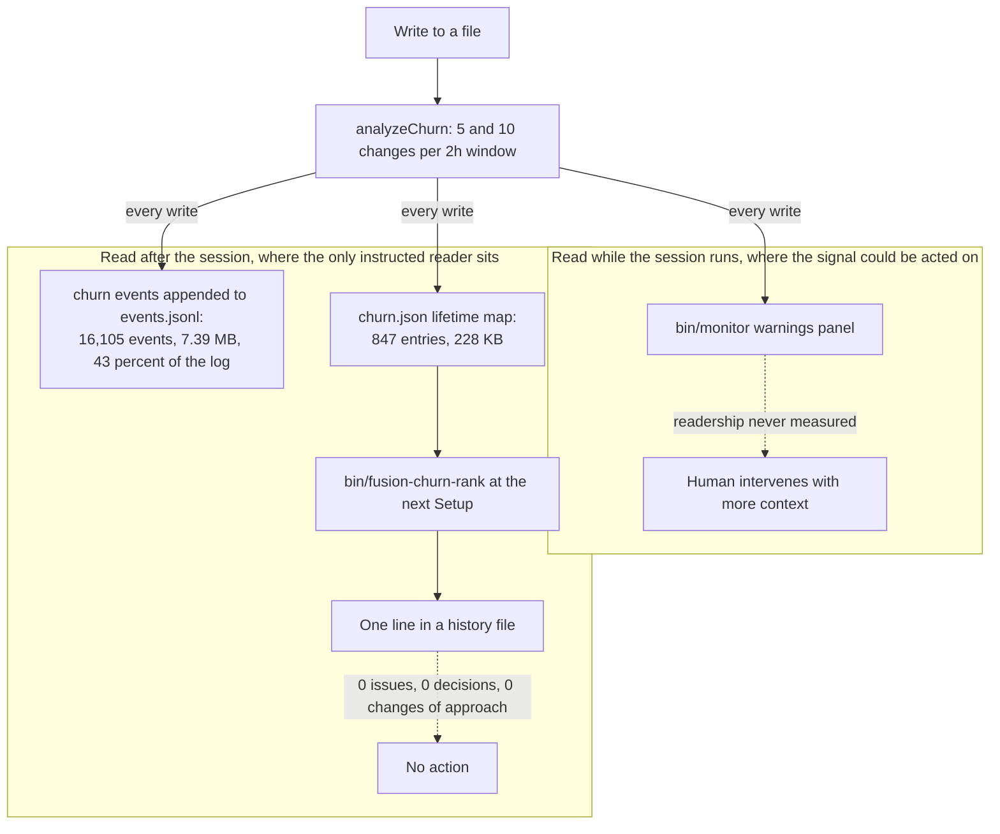
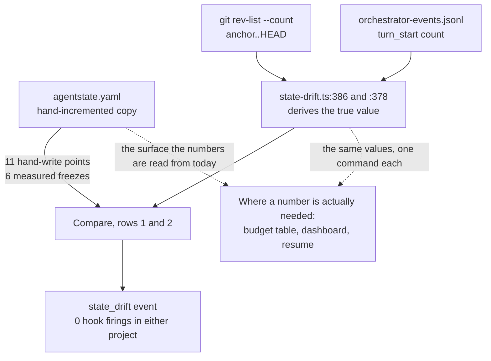
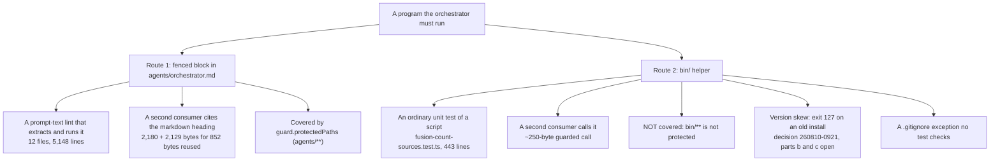

# Analysis: Four mechanisms — purpose, bindingness, and what to do with each

**Date:** 2026-08-12 02:51
**Type:** Document Study / Feasibility, with cost and origin measurement
**Status:** Complete
**Requested by:** user, via orchestrator dispatch

---

## Question

The prior analysis `shared/analyses/260812-0022-where-the-complexity-comes-from-and-what-would-have-to-go.md`
named four mechanisms as removal candidates and measured what each costs. It did not establish what
any of them was *for*. This report answers four questions that analysis left open. What idea does
the churn apparatus serve, and why does nothing act on its output? What does the domain parameter
actually change, and how binding is the change? What failure was the self-bookkeeping family built
for, and should its subject exist at all? Can the shell programs embedded in the orchestrator prompt
realistically move into `bin/` helpers? Each section ends with one verdict: remove, keep, or change.

## Scope

**Read in full.** `hooks/lib/churn.ts` (654 lines), `hooks/lib/escalation.ts` (410),
`hooks/churn-rank.ts` (131), `hooks/lib/domain-cascade.ts` (992), `hooks/lib/state-drift.ts` (677),
`hooks/lib/staging-drift.ts` (645), `hooks/lib/review-coverage.ts` (566), `bin/monitor` state paths,
`hooks/lib/__tests__/helpers/prompt-blocks.ts`, `hooks/lib/__tests__/record-counts-measurement.test.ts`,
`agents/orchestrator.md` in full, the domain sections of `taskplanner`, `reconciler`, `playmaker` and
`planner`, and eleven decision and defect records.

**Measured.** All 29 fenced blocks in `agents/orchestrator.md`, classified both mechanically by
free-variable analysis and by hand. Section byte counts across the agent fleet. `git log
--diff-filter=A` on every module named. The six commits that created a `bin/` helper, with the
orchestrator prompt's byte size immediately before and after each. Domain values recorded across
both projects. Guard-state files and event logs in this repository and in the control.

**The control.** `/Users/k1/Projects/productive/krk`, the Rust file manager built with fusion since
2 August: 17 recorded sessions, 6 Circles, an 18.2 MB guard event log.

**Not established.** Whether anyone has ever watched the live monitor during a session. No channel
records a dashboard view, so the monitor's live panel is the one surface here whose readership
cannot be measured in either direction.

---

## Finding 1: The churn and counter apparatus

### The idea, in its author's terms

Churn carries no authorising record, and it is not fusion's invention. Its file header names the
source: *"Ported from `fusion/reactor/pkg/guard/churn_heatmap.go`"* (`hooks/lib/churn.ts:4`), a Go
project outside this tree. Both `churn.ts` and `escalation.ts` arrive in `b05b423`, the root commit
of this repository, inside the v2.3.0 initial release. There is no prior discussion to recover. The
three decision records that mention churn (`260809-2004`, `260810-0920`, `260811-1534`) are all
repairs, and all three were filed in the last four days.

The clearest statement of intent is `docs/philosophy.md:17`:

> Per-file churn is counted beside all of that and **only ever warns**, so an agent thrashing
> because it lacks the context to converge shows up on the monitor while it keeps working, and
> scope creep where an executor "improves" things next to its task is visible in the same place.

Two distinct mechanisms sit in that sentence. The first is a **live convergence signal**: a human
watching the dashboard sees an agent rewriting the same file and intervenes while the session is
still running. The second is a **scope signal**: work landing next to the task rather than on it.
`README-hooks.md:23` and `docs/working-model.md:80` restate the first and are explicit that it never
blocks.

### What was built serves the first claim only, and serves it badly

The scope claim was never implemented. Churn counts changes per file. Scope creep is changes outside
a task's declared file set, which requires knowing the declared set, and nothing in `churn.ts` reads
one. The measurement that would answer the scope question is `staging-drift` and `review-coverage`,
built four days ago for unrelated reasons.

The convergence claim is implemented and does not work, for a reason that is measurable rather than
a matter of taste. In the control project, over ten days:

| Date | `churn_critical` | tracked writes | critical duty cycle |
|---|---:|---:|---:|
| 2026-08-02 | 358 | 391 | 91.6% |
| 2026-08-05 | 623 | 623 | 100.0% |
| 2026-08-08 | 113 | 113 | 100.0% |
| 2026-08-09 | 682 | 682 | 100.0% |
| 2026-08-10 | 558 | 779 | 71.6% |
| 2026-08-11 | 213 | 400 | 53.3% |

A warning that fires on between half and all of every write carries no information about which write
is unusual. The 8 and 9 August rows are the pathological case the project has already diagnosed
once. `hooks/lib/churn.ts:161-171` records that a lifetime threshold pair made the first file to
cross the critical line produce a critical on every subsequent write to any file, *"a 100% duty
cycle sustained over 21 days"*. That pair was deleted on 9 August. The duty cycle after the fix is
53 percent, which is better and still not a signal.

A second fault compounds it. `hooks/tracker.ts:752-766` keys the emitted event on the file just
written, while the message names the files over threshold. The two routinely disagree. The last
`churn_critical` in the control reads:

```
{"ts":"2026-08-11T22:16:18.422Z","event":"churn_critical","tool":"Edit",
 "file":"activity-log-k1.md","detail":"High file churn detected: 1 file(s) showing
 thrashing pattern: CLAUDE.md"}
```

The event blames `activity-log-k1.md`. The thrashing file is `CLAUDE.md`. A reader acting on the
`file` field would act on the wrong file. The `recommendation` field the analyser computes
(`churn.ts:514-515`, `:524-525`) reaches neither the log, nor the monitor, nor any prompt. It is
dead payload.

### Three candidate explanations, and which one binds

The prior analysis measured 16,097 firings against zero actions and asked whether the output is
wrong, whether the implied action does not exist, or whether nobody reads it. Re-measurement puts
the count at 16,105 churn and cross-file events, 43.3 percent of an 18.2 MB append-only log, 7.39 MB
of it. All three explanations are partly true, and they rank.

**Nobody reads it: false.** The ranking is read at Setup in most sessions. Six history files in the
control record the readout across 17 sessions, and several more do so here. The instruction is
`agents/orchestrator.md:142`: *"run the helper and note what it names."* The reading happens and
produces a line in a history file.

**The output is wrong: true, and measurable.** A 53 to 100 percent duty cycle, an event naming the
wrong file, a score still dominated by a lifetime counter compared against nothing, and a persisted
map that until 10 August ranked deleted files at the top. `hooks/churn-rank.ts:2-13` states the last
plainly: *"Three of the top four entries in this repository named files that were not there."*

**The action does not exist: true, and this is the binding constraint.** No prompt, skill, or rule
instructs any conditional behaviour on a churn value. "Note what it names" is the whole contract.
Exhaustive search across `agents/`, `skills/`, `rules/`, `bin/` and `docs/` returns no threshold
comparison, no branch, no routing. Were the signal perfect, the reader is still told only to record
it.

The ranking matters because the fixes differ. Repairing the output alone produces an accurate signal
nobody is instructed to act on. Adding an action alone routes on a signal that fires on half of all
writes.

### The deeper mismatch: the signal is live, its only instructed reader is not

Churn measures a two-hour session window with thresholds of 5 and 10 changes
(`hooks/lib/churn.ts:178-181`). Its intended payoff is intervention while the agent is still
working. Its only instructed reader runs at the Setup of the *next* session. The observation arrives
after the session that produced it has ended, by which point the corrective action, giving the agent
more context, is no longer available.

One surface does read it live. `bin/monitor:121` and `:540` render `churn_critical` in the warnings
class. That surface is exactly what the philosophy document describes, and it is the only part of
the apparatus aimed at the moment the signal could be acted on.



The graph carries one deliberate asymmetry, and it is the finding. The branch with an instructed
reader terminates in a history line. The branch that could act terminates in an unmeasured human.

### Cost

| Component | Lines |
|---|---:|
| `hooks/lib/churn.ts` | 654 |
| `hooks/churn-rank.ts` | 131 |
| `bin/fusion-churn-rank` | 66 |
| `churn.test.ts` and `churn-key-anchor.test.ts` | 1,177 |
| **Churn total** | **2,028** |
| `hooks/lib/escalation.ts` plus its two tests | 923 |

Runtime state: 400,422 bytes in the control, of which 162,424 is an orphaned `cross-file.json` whose
module was deleted on 9 August and whose file nothing removes. 112,755 bytes here.

Escalation is independent. Neither module imports the other. Escalation is driven only by the
protected-path machinery: three consecutive blocks raise a halt (`hooks/config.json:27`), and only a
human clears it. It has fired for real, 42 halts here and 50 blocks in the control, though every
retained halt event in both projects was raised by a policy since deleted. A churn critical cannot
contribute to a halt and never could.

### Verdict: **change**

Delete the branch with no reader and keep the branch the philosophy document describes.

1. **Emit on threshold crossing, not on every write.** A file crosses the session warning or
   critical threshold once per session. Emit one event at that crossing and none afterwards. In the
   control that collapses 8,916 churn events to roughly the number of distinct thrashing files,
   which `churn.json` puts at 5 for the whole ten-day period. The monitor's live panel keeps working
   and gains a signal in place of a constant.
2. **Fix the event key.** Emit one event per file over threshold, keyed on that file, rather than
   one event keyed on the write that triggered the scan. Carry the `recommendation` field the
   analyser already computes into the event detail.
3. **Delete the lifetime map and its ranking.** `churn.json`, `churn-rank.ts`,
   `bin/fusion-churn-rank` and Setup Step 5's churn read go together. The lifetime counter is
   compared against nothing, its threshold pair was already deleted as information-free, and the
   ranking exists only to make readable a map that nothing acts on. Removes 197 source lines, 501
   test lines, 340 KB of state, and one Setup step.
4. **Delete the orphaned `cross-file.json` on the read path.** The module went on 9 August. 162 KB
   of state did not.

That leaves roughly 450 lines serving one live panel, down from 2,028 serving a history line.

**Escalation: keep**, unchanged. It costs 923 lines and is the only thing in this family that has
ever stopped anything. That every retained halt came from a since-deleted policy is a fact about
those policies, not about the halt mechanism.

**The measurement that would settle the remainder.** Recommendation 1 assumes the live panel is
worth preserving, and nothing measures whether the monitor is ever open. One line in `bin/monitor`
appending a `monitor_view` event on page load answers it within a week. If the answer is zero, the
honest follow-up is to remove churn outright rather than repair it.

---

## Finding 2: The domain parameter

### What it is

`agents/orchestrator.md` Setup Step 5 detects one of four values (`code`, `data`, `strategic`,
`knowledge`) from a six-branch cascade over five integers and one string, written as pseudocode at
`agents/orchestrator.md:178-191`. The result is passed as a `**Domain:**` line to `taskplanner`,
`reconciler` and `playmaker`, and as an `**Executors:**` line to `planner`. It is also written into
`agentstate.yaml`, into the dashboard header, into the tasklist head, and as a header field on every
decision record and Circle record.

### What it changes, per consumer

| Consumer | What the value selects | Lines of behaviour that branch | How binding |
|---|---|---:|---|
| `taskplanner` | Priority Axis 1 only. Axis 2 (severity, blocking, plan order, age) is unchanged across all four. A project-local rule overrides Axis 1 entirely (`taskplanner.md:17`) | 4 table rows | Advisory. A ranking bias, third in precedence behind the project rule and Axis 2 |
| `reconciler` | Which verification protocol Step 2 runs: tests for `code`, schema validators for `data`, cross-reference checks for `strategic`, citation audits for `knowledge`. Plus one marker-rename exception at `:169` | 4 table rows plus 2 lines | The most substantive of the four, and still advisory. Step 1.5 re-detects strategic mode from workbench shape independently, described at `:43` as *"a safety net if the orchestrator passes the wrong domain or none at all"* |
| `playmaker` | Ranking bias in Process Step 3. The prompt states at `:27` that it *"does NOT change marker vocabulary or portfolio.md output structure"* | 4 table rows | Explicitly non-structural, by its own text |
| `planner` | Takes no domain. Takes an executor list, and the only effect is whether `analyst` may be assigned a step | 1 executor row | Advisory |

Roughly **14 lines of the fleet's 398,928 bytes of agent prose actually branch on the value.** Every
branch is a ranking hint or a protocol preference stated to a language model in a four-row table.
The differences between rows are real but small: `taskplanner`'s `data` row asks that referential
integrity outrank formatting, and `playmaker`'s `data` row is literally *"Same as code, plus…"*.

### How binding: not at all, by construction

No hook reads the domain. `hooks/lib/domain-cascade.ts` has **zero runtime consumers**: grep across
`hooks/*.ts`, `hooks/lib/*.ts` and `bin/` returns only the module itself, its two test files and its
compiled output. The module exists solely so that `domain-cascade.test.ts` can parse the pseudocode
out of the prompt, execute it, and assert its verdicts, and so that `findCascadeStatements()` can
detect a second statement of the cascade elsewhere in the fleet.

The detection is advisory too. `agents/orchestrator.md:153` records that *"the user may override at
any individual dispatch"*, and the reconciler re-derives the one value with substantive behaviour
from the workbench itself.

The record-level `**Domain:**` header field is written in four templates and **read nowhere**.
Search for any instruction to read, group, filter, sort, or route on a record's domain field returns
no consumer. It is a label that travels.

### Recorded use

| Value | This repository | Control | Total |
|---|---:|---:|---:|
| `code` | 344 | 183 | 527 |
| `data` | 1 | 11 | 12 |
| `knowledge` | 5 | 1 | 6 |
| `strategic` | 1 | 0 | 1 |

Two qualifications on the `data` column. All 11 control uses are `**Domain:** data` as a *record
header field* rather than as a dispatch parameter, so they measure classification habit, not
routing. And the single recorded `strategic` is the misclassification the cascade's own comment
documents at `:194`: a consuming project with 122 commits and 108 Rust files reported `strategic`
*"for five straight days across four sessions, and a human overrode it every time."*

### Cost

| Component | Size |
|---|---:|
| `hooks/lib/domain-cascade.ts` (test-only) | 992 lines |
| `domain-cascade.test.ts` | 953 lines |
| `domain-cascade-order-lint.test.ts` | 193 lines |
| `bin/fusion-count-sources` and its test | 642 lines |
| Domain sections in five agent prompts | 18,114 bytes |
| Skill bodies carrying domain handling | 4 files |
| Generated reach paragraph in `README-hooks.md`, compared byte-for-byte | 1 block |
| **Total** | **2,780 lines, ~18 KB of prompt** |

The `counted_by == "none"` fallback alone accounts for roughly 2,000 bytes of `orchestrator.md:198`,
and it exists because a project outside git counts zero and a zero is indistinguishable from a
measurement.

Three of the six cascade inputs (`commits`, `analyses_count`, `decisions_count`) exist **only** to
reach `strategic` and `knowledge`. So does the entire branch-order lint, whose stated purpose at
`:194` is to prevent a `strategic` or `knowledge` branch being lifted above the two `code_files`
branches.

### Verdict: **change** — collapse to two values

Removing the parameter entirely is defensible and slightly too aggressive. The `reconciler`'s `data`
protocol (run schema validators rather than tests) is a genuine behaviour difference, and `data` is
the second-most-used value.

Collapse to `code | data` and the following fall out by construction:

1. **Three of six cascade inputs go.** `commits`, `analyses_count` and `decisions_count` are read
   only by the two branches being removed. The cascade becomes: absent count to `code`; data
   outweighing code better than two to one to `data`; any source to `code`; sourceless data to
   `data`; otherwise `code`.
2. **`domain-cascade-order-lint.test.ts` goes entirely** (193 lines). Its sole subject is keeping
   `strategic` and `knowledge` below the `code_files` branches. With those branches gone, so is the
   defect it guards.
3. **Most of `domain-cascade.ts` goes with it.** The 992-line parser and its 953-line test exist to
   run a six-branch cascade with four possible outputs and detect restatements of it. A two-value
   cascade over two integers is small enough to state in the reconciler's own prompt with no gate at
   all. *inference:* roughly 1,500 of the 2,780 lines are removable, stated as inference because the
   restatement gate (`REACH`) protects against a real measured defect (issue `260810-1918`, a second
   copy in `skills/cleanup/SKILL.md` producing two different domains inside one session) and its
   replacement is a design question, not a deletion.
4. **Eight table rows go** across `taskplanner`, `reconciler` and `playmaker`, plus the
   `strategic`/`knowledge` marker-rename exception at `reconciler.md:169`, plus the `analyst`
   executor row in `planner`.
5. **Drop `**Domain:**` from the decision-record and Circle-record templates.** Nothing reads it.
   Keep it in the dispatch line, where it is consumed.

**What removing the parameter entirely would cost instead:** the reconciler's `data` protocol, which
12 recorded uses and one open ontology-shaped project rely on, and the Setup summary line telling
the user what kind of workbench was detected. That line is the one part of the apparatus the user
actually reads. Collapsing keeps both at roughly half the cost of removal analysis.

**The measurement that would settle it.** No record shows a `data` dispatch changing what the
reconciler did. If a single reconciliation run with `**Domain:** data` produced the same output it
would have produced with `code`, the case for removing the parameter outright becomes strong. That
is one experiment on one Circle.

---

## Finding 3: The self-bookkeeping family

### The failure it was built for was real and was measured six times

The origin record is
`shared/issues/260801-2038_c_session-bookkeeping-froze-at-turn-1-while-three-turns-ran.md`, 224
lines, now closed. The prior analysis credits it with four freezes. The record documents six.

| # | Session | `agentstate.yaml` claimed | git said | Divergence |
|---|---|---|---|---:|
| 1 | 260801, HEAD `9ab5a2a` | turn 1, tasks 4, commits 4 | 16 commits, 8 of 8 plan steps done | 12 |
| 2 | `260803-1038` | turn 0, commits 0, 8 tasks queued | 7 commits, 10 issues closed | 7 |
| 3 | `260806-2158` | turn 1, tasks 0, commits 0 | 8 commits, 11 steps done, v6.0.0 tagged | 8 |
| 4 | `260808-0920` | turn 1, tasks 1, commits 0 | 6 commits, 6 defects closed | 6 |
| 5 | during the fix | turn 0, commits 0 | 12 | 12 |
| 6 | the fixing session itself | frozen at four surfaces | — | — |

Each was measured by one command, stated at line 35: *"compare `agentstate.yaml`'s
`progress.commits` against `git rev-list --count <git_head_at_start>..HEAD`. A divergence of more
than one is a stale-state signal."* Line 57 records the result of running it: *"the file says `0`,
`git rev-list --count c9bf59e..HEAD` says `7`. Divergence 7… The check works, costs one command, and
nothing in the toolchain runs it."*

The record's own diagnosis is the sharpest sentence in the family (line 16):

> The event log staying current while the other three froze is the diagnostic: event emission is a
> per-action call that cannot be forgotten without the action failing, whereas the other three are
> end-of-Turn writes that a session can skip without anything breaking.

And the reason the first fix failed, from reconciliation `260810-0819`: *"An agent prompt is loaded
at session start, so a fix written into `agents/orchestrator.md` cannot reach the session that
writes it. A prompt-only fix has zero effect on its own session, by construction."*

That is the acceptance clause the three hook modules were built to satisfy, and it is sound
reasoning. The evidence is genuine and the design response was correct in shape.

### What was built, and whether it has caught anything

All three modules landed on 11 August in 78 minutes: `state-drift.ts` at 10:11, `review-coverage.ts`
at 11:01, `staging-drift.ts` at 11:29. Together with their tests those three commits added 9,014
lines.

| Log | This repository | Control |
|---|---:|---:|
| `.guard-state/events.jsonl` total | 17,635 | 37,186 |
| `"event":"state_drift"` | **0** | **0** |
| `"event":"staging_drift"` | **0** | **0** |
| `"event":"review_coverage"` | **0** | **0** |

The hook half has fired zero times in both projects. The tracker is demonstrably running: the same
logs carry 6,142 and 16,076 `tracker_record` events, the most recent within hours of this analysis.

The state-drift hook is currently a structural no-op, and the reason is worth stating.
`agentstate.yaml` exists only during a live session and is deleted at Cleanup
(`orchestrator.md:1099`). With the file absent, `measureStateDrift` returns `statePresent: false`
and an empty signature (`state-drift.ts:487-489`), and the model-facing path returns early at
`:910`. Consistent with that, no `state-drift.json` throttle file exists in either project.

The 15 recorded `state_drift` events are all **hand-emitted by the orchestrator per prompt
convention**, not by the hook. Among those 15: two report no divergence at all, one is a correction
of another drift event eleven seconds later (*"die gemessenen Werte sind … 7 gegen 19 und … 2 gegen
6, nicht 13 und 4"*), one records the orchestrator over-counting in the opposite direction while
repairing a drift, and one records the drift check reporting `verdict=clean` while the surface it
was built to protect was frozen.

That last one is the important one. Issue `260811-1614` (open) records that the Turn row counts only
`turn_start` events, so a Turn emitting its boundary event and none of its per-task events reads
clean. Measured four times across two projects, including three consecutive Turns in the control
with no task event at all. The record's diagnosis:

> `turn_start` is emitted at a boundary the orchestrator stops at anyway, while the per-task events
> sit beside work that has its own momentum, so the boundary event survives every lapse the others
> do not. A row that counts only the surviving event cannot see the lapse.

### The mechanism measures a problem its own design creates

For two of the five drift rows, the module computes the true value **completely and independently**,
then compares it to a hand-typed copy that contributes nothing to the computation.

```ts
// hooks/lib/state-drift.ts:386  — commits, from git alone
const out = git(root, ["rev-list", "--count", `${head}..HEAD`]);
// :523
Math.abs(real.count - claimed) > 1 ? "drift" : "ok",

// hooks/lib/state-drift.ts:376-380  — turns, from the event log alone
for (let i = anchor.from; i < lines.length; i++) {
  if (lines[i].includes('"event":"turn_start"')) count++;
}
// :547
turns.count !== claimedTurn ? "drift" : "ok",
```

Delete `progress.commits` and `progress.turn` from the file and the true values are still available
at `:386` and `:378`. The hand-written number appears only on the left side of the comparison.

Rows 3 and 4 are different in kind: they test whether the history file exists and whether its
Directive line is still a placeholder. Those are not counters and do not have this property.



The graph has no cycle and one redundant edge, which is the finding. Both paths reach `NEED`. Only
one of them can freeze.

### The project has already retired hand-tallying twice, for this reason

This is not a hypothetical redesign. It is the direction the project has already taken twice, in the
same prompt.

**First**, four record counters were withdrawn from hand-tallying (`orchestrator.md:1022`): *"the
figures that reach the budget table and the user report are the derived ones."* The trigger is at
`:720`: a session reported *"18 defect records closed, 13 filed"* where the stores held 20 and 15,
and the endpoint invariant passed on both pairs because `48 − 20 + 15` and `48 − 18 + 13` both land
on 43. Two compensating errors of the same size are invisible to the one check a hand-kept count
has. The replacement is a 36-line derivation at `:724-760`.

**Second**, review coverage was deliberately refused a field (`:797`): *"a `reviewed_through` field
would be a fifth surface a session can pass a boundary without writing — the exact class issue
`260801-2038` measured freezing in six sessions out of six."*

So the project has already reasoned its way to the answer for two cases and has not applied it to
the remaining counters.

### What would actually be lost

Classifying every field of `agentstate.yaml` against whether it is derivable:

- **Derivable from git or the event log:** `progress.turn`, `progress.commits`, `tasks_done`,
  `tasks_skipped`, `tasks_errored`, `turn_start_head`, `directive_revisions_this_session`,
  `session.started`, `session.history_file`, `work_queue[].status` for terminal states,
  `work_queue[].commit`, `plan_context.plan_file`. Twelve fields.
- **Derivable from workbench files:** `# Updated:` (the file's own mtime, and nothing reads it),
  `tasks_total`, `max_turns`, `work_queue[]` identity fields. Four.
- **Genuinely irreducible, because they are session intent that leaves no other trace:**
  `session.directive`, `session.domain`, `session.git_head_at_start`, `current_task.status`,
  `progress.paused_at_task`, `plan_context.user_directive`, `plan_context.key_findings`. Seven.

The irreducible seven are not counters. They are what the session was asked to do and where it
currently stands. Of the seven, `session.domain` carries all four skill consumers, and each of the
four already ships a documented `code` fallback.

Nothing in the dashboard goes dark. `bin/monitor` reads `agentstate.yaml` at exactly one place
(`:1140-1147`), dumps it as syntax-highlighted raw YAML, and **parses no field from it**. The
dashboard's Turn, Tasks, Commits and Errors numbers come from `orchestrator-live.md`, a separate
hand-written file. The event list comes from `orchestrator-events.jsonl`. One tab loses a raw dump,
and that tab already reads "No active session" in both projects today.

### The honest counter-argument

The event log is not truth. It is a better-shaped hand-kept record. Issue `260811-1614` measured the
log freezing at the per-task level while its boundary events kept coming, which means anything
derived from `task_done` inherits the same hand-maintenance property, just with better survival
characteristics: a lapse loses one entry rather than freezing an entire surface.

The only external witness in this system is **git**. `progress.commits` derived from `git rev-list`
cannot freeze. `tasks_done` derived from `task_done` events can. That distinction should govern the
redesign rather than a blanket "derive everything".

### Cost

| Component | Lines |
|---|---:|
| Three modules plus CLIs, `git.ts`, three `bin/` wrappers | 2,512 |
| Seven test files | 4,035 |
| **Source and tests** | **6,547** |

Prompt cost: **45,623 of 164,716 bytes, 27.7 percent of `agents/orchestrator.md`, is self-bookkeeping
instruction** (sections L718-798 and L1007-1381). The single `### Drift check` section is 10,053
bytes, larger than the entire event-log schema it depends on.

Defect cost: **21 records filed against the mechanism within 48 hours of its birth, 8 still open**,
including two saying its outputs reach no reader (`260811-1143`, `260811-1145`) and two saying the
check itself reports clean on conditions it was built to catch (`260811-1614`, `260811-2307`).

### Verdict: **change** — keep the measurement, delete its subject

The failure was real and the response was right in shape and wrong in target. The design fixed the
detection of a frozen surface instead of removing the surface that freezes.

1. **Delete every counter field from `agentstate.yaml`.** `turn`, `tasks_done`, `tasks_skipped`,
   `tasks_errored`, `commits`, `turn_start_head`, `directive_revisions_this_session`,
   `work_queue[].commit`. Keep the seven intent fields plus `current_task`. The file becomes a
   session-intent record, written at Phase 0 and at task transitions, with nothing to increment.
2. **With the counters gone, drift rows 1, 2 and 5 lose their left-hand side and go.** Rows 3 and 4
   (history file present, Directive not a placeholder) are cheap, are not counters, and stay.
   *inference:* that removes roughly 400 of `state-drift.ts`'s 677 lines and the bulk of its 1,846
   test lines, stated as inference because the row structure is shared with the reporting path.
3. **Derive at the two moments a number is needed**, using the derivation the module already
   contains: `git rev-list --count` for commits, an event-log grep for turns. The budget table
   already works this way for four record counts. Extend the same treatment to the remaining five.
4. **Prefer git over the event log wherever both can answer.** The log has been measured freezing;
   git has not.
5. **`staging-drift`: keep, fix the reader.** One catch, recovered in the next commit, and its
   subject can be permanently lost (`git checkout -- fusion-workbench/` takes an unstaged record).
   Add `staging_drift` to `WARNING_EVENT_TYPES` in `bin/monitor`, which is what open issue
   `260811-1143` already specifies.
6. **`review-coverage`: change.** Zero firings, one report, an open scoping defect where a
   `conceptrev` verdict at the plan gate triggers a coverage measurement about code commits
   (`260811-1145`). Filter the reviews scan by sender before adding it to the monitor. If it still
   produces nothing in a week of use, remove it.
7. **Turn budget: too new to judge.** It is nine hours older than this analysis and produced four
   open records the night it landed. Leave it and revisit at one week.

**What is lost:** the ability to notice that a hand-kept counter drifted, which is an ability that
exists only because a hand-kept counter exists. Nothing else. No dashboard panel, no skill (all four
domain readers carry fallbacks), and no resume path, since the resume anchor `git_head_at_start` is
one of the seven fields being kept.

---

## Finding 4: Moving the shell programs into `bin/` helpers

### Inventory

`agents/orchestrator.md` is 1,417 lines and 164,716 bytes, and holds 29 fenced blocks totalling
14,604 bytes. Twenty of those are `bash`, spanning 111 lines and **6,800 bytes, which is 4.1 percent
of the prompt**. This is an orchestrator-only phenomenon: the other fifteen agent prompts hold three
bash blocks between them.

| Class | Blocks | Bytes | What it is |
|---|---:|---:|---|
| **Already extracted** | 7 | 1,854 | `[ -x helper ] && helper` guarded call sites for `fusion-turn-budget`, `fusion-churn-rank`, `fusion-count-sources`, `fusion-review-coverage` (twice), `fusion-state-drift`, `fusion-staging-drift` |
| **(a) Self-contained program** | 6 | 3,299 | Runnable as written, no free variables, no placeholders |
| **(b) Depends on values resolved earlier** | 3 | 1,034 | Reads `$DIR`, `$WORKBENCH`, `$SCAN_CIRCLES` from the prompt's own context |
| **(c) Illustration, not meant to be run** | 4 | 613 | Carries `<absolute-path>`, `<task-id>`, `<stamp>`, `<turn-start-HEAD>` placeholders |

**Only (a) can move cleanly, and only part of (a) is worth moving.** Of the 3,299 bytes:

- `L33` (182 B) is the workbench-root bootstrap. It ends in `cd "$ROOT"`, which a child process
  cannot do for its parent, and it is the shared Setup contract every agent prompt points at. It
  cannot move.
- `L61` (250 B, copy the monitor), `L67` (46 B, launch it) and `L219` (107 B, `touch` the event log)
  are one-liners where a guarded helper call costs more bytes than the block.
- `L724` (1,862 B, the record-counts measurement) and `L868` (852 B, the queue-head parser, which
  the prompt calls *"the canonical implementation"* at `:894`) are the two genuine programs.

**The clean-extraction figure is 2,714 bytes, in two blocks.**

The classification is *mostly* mechanical. A free-variable analysis over the 20 blocks agreed with
the hand reading on 18. It got two wrong, in both directions: it flagged `L724` as class (b) because
`while read -r kind d` binds `d` and `kind`, and it passed `L568` as class (a) because the
placeholder `<turn-start-HEAD>` carries uppercase that the pattern did not anticipate. Ninety
percent accuracy with both error types present.

### Is it realistic

The extraction has already been performed six times, and the evidence from those six is the answer
to this question.

**Every helper-creating commit grew the prompt.**

| Commit | Date | Helper created | `orchestrator.md` before | after | delta |
|---|---|---|---:|---:|---:|
| `25c5454` | 08-10 | `fusion-churn-rank` | 104,561 | 104,561 | **0** |
| `2910cf6` | 08-10 | `fusion-count-sources` | 78,022 | 79,596 | **+1,574** |
| `8a49fd5` | 08-11 | `fusion-state-drift` | 113,779 | 116,188 | **+2,409** |
| `61bd21f` | 08-11 | `fusion-turn-budget` | 146,332 | 150,484 | **+4,152** |
| `afd7c2e` | 08-11 | `fusion-review-coverage` | 118,120 | 124,068 | **+5,948** |
| `cac41ef` | 08-11 | `fusion-staging-drift` | 124,068 | 134,228 | **+10,160** |
| | | | | **total** | **+24,243** |

Five of six grew it, one left it unchanged, none shrank it. Four of the six also introduced a new
capability, so the growth is not purely an extraction tax. The purest case is `2910cf6`, which
replaced an inline `find` with a helper and changed nothing else about what Setup does: the prompt
grew by 1,574 bytes.

The reason is visible in the current file. The `### Drift check` section is **10,053 bytes of prose
around a 234-byte guarded call**. Extraction moves the program out and leaves behind the call, the
version-skew guard, a description of the helper's output format, and a paragraph on what to do with
each branch of it. None of that is smaller than the shell it replaced.

**What breaks, concretely:**

1. **Guard coverage.** `agents/**` is on `guard.protectedPaths` (`hooks/config.json:9`). `bin/` is
   not, except `bin/monitor`. Moving a program from the prompt into `bin/` moves it **out of
   protection**. Any extraction must add `bin/**` to the list, which is a real change to what the
   guard measures on every tool call.
2. **`.gitignore`.** The pattern is `bin/*` with fifteen `!bin/<name>` exceptions and a warning
   comment at line 17. **No test asserts that every shipped helper is tracked.** A sixteenth helper
   omitted from that list ships as nothing, silently.
3. **Version skew.** Decision `260810-0921` measured this: `$FUSION_PLUGIN_ROOT` points at the
   installed copy and is pinned for the whole session, so a helper one commit old is `exit 127` at
   Setup. Its answer (a1) was "tolerate and report", implemented in `26ea3c3`, which is why six call
   sites now carry an `[ -x ]` guard and a stderr line, at roughly 250 bytes each. **Parts (b) and
   (c) of that decision are still open** in `260810-1544`: whether prompt-called helpers get one
   uniform guarded-call convention, and whether the work-tree preference extends to helper
   resolution. Extracting more blocks without answering (b) means writing the guard by hand at every
   new site.
4. **Readability: unchanged or improved.** The prompt's readability is not the constraint. The
   constraint is that the prose does not leave with the program.

### Does it save tokens

Not meaningfully in the prompt, and meaningfully in the consumers.

**In the prompt.** 2,714 bytes of clean-extraction candidate, minus roughly 500 bytes of guarded
call replacing them, is a net 2,214 bytes. At approximately four bytes per token that is **550
tokens per session**, against a 164,716-byte prompt costing roughly 41,200 tokens. **1.3 percent.**
Across the 62 recorded sessions in both projects the lifetime saving is about 34,000 tokens. The
orchestrator prompt is loaded once per session, not once per turn, and is prompt-cached within a
session. The token argument does not carry this decision.

**In the consumers, the saving is larger.** Two skills currently reuse the queue-head block by
*citing the markdown heading it lives under* and running it from there. `skills/next/SKILL.md`
spends 2,180 bytes on that citation and `skills/setup/SKILL.md` spends 2,129, which includes eleven
lines of source-root resolution, a `grep -q '^#### Reading a queue'` existence check against a
markdown file, and a paragraph explaining what to print when the heading is missing. **Two consumers
pay 4,309 bytes to reuse 852 bytes.** A `bin/fusion-queue-ground` reduces each site to a guarded
call plus verdict handling, roughly 600 bytes, saving about 3,100 bytes across the two, and it
removes the heading-existence check entirely.

**The saving that actually matters is not tokens.** It is the test corpus. Twelve test files whose
subject is the *text* of a markdown prompt total **5,148 lines**:

| Test | Lines |
|---|---:|
| `reference-resolution-lint` | 989 |
| `state-drift-detection-lint` | 985 |
| `record-counts-measurement` | 521 |
| `turn-budget-lint` | 374 |
| `commit-message-path` | 366 |
| `path-literal-lint` | 340 |
| `queue-ground-producer` | 327 |
| `queue-retirement-empty-key` | 297 |
| `queue-ground-lint` | 281 |
| `queue-commit-ownership-lint` | 257 |
| `executor-verification-report-lint` | 218 |
| `domain-cascade-order-lint` | 193 |

The project has built a compiler for its own prompt, complete with a shared extraction helper
(`hooks/lib/__tests__/helpers/prompt-blocks.ts`, 28 lines, exporting `extractBashBlock`). Three
tests import it and a fourth carries its own copy (`circle-stash-git-exclusion.test.ts:40`). The
`record-counts-measurement` test's own header states what that bought:

> It then shipped with four faults of its own, **all four found by extracting it and running it**,
> none of them visible to a reader.

Six defect records were filed against that single 35-line block within twelve hours on 11 August:
`260811-1406`, `-1407`, `-1412`, `-1610`, `-1616`, `-2149`. All six closed. That is 0.17 records per
line, against a project average of 1.37 records per commit.



The graph is deliberately asymmetric in favour of neither route. Route 1 buys guard coverage and
costs a bespoke lint plus an expensive citation protocol. Route 2 buys ordinary testing and costs
guard coverage, a skew guard, and an untested packaging step.

### Is it fully decidable

**No, and the project has already proved the general form of this.** Deciding what a shell block
does from its text is the same undecidable question the write-path classifier answered until v6.0.0,
which produced 50 false alarms in six days and was deleted. The classification here is a weaker form
of that question and still not clean: the mechanical classifier got 18 of 20 and erred in both
directions.

The line sits where a block's dependencies do:

- **Cleanly extractable:** a block whose free variables are empty or `$FUSION_PLUGIN_ROOT` only, and
  which carries no `<placeholder>`. Two blocks qualify and are worth the move.
- **Not worth extracting, though technically possible:** class (b), the three blocks reading `$DIR`,
  `$WORKBENCH` and `$SCAN_CIRCLES`. A helper taking those as arguments moves the resolution burden
  to the call site, and the call site is prompt text. `L827` (the queue retirement) would need three
  arguments and its own `fusion-paths` re-resolution, which is what `L724` already does inline at
  36 lines. **A helper needing six arguments is worse than the block**, because each argument is one
  more thing prompt text can get wrong, and prompt text is the surface with no compiler.
- **Never extractable:** class (c), which is illustration with placeholders, and `L33`, whose `cd`
  cannot cross a process boundary.

### Verdict: **change** — extract two blocks, then cap the rest

The blanket rule the prior analysis proposed ("every shell block longer than three lines becomes a
helper") is not supported. Applied to `L827` it produces a six-argument helper. Applied to `L33` it
produces something that cannot work. And the six prior extractions all grew the file.

Concretely:

1. **Extract exactly two blocks.** `bin/fusion-record-counts` from `L724-760` and
   `bin/fusion-queue-ground` from `L868-881`. Both are self-contained, both already have a test
   that extracts them from the markdown and runs them (`record-counts-measurement.test.ts:253`,
   `queue-ground-producer.test.ts:189`),
   and the second has three call sites paying 4,309 bytes to cite it. Convert both tests to ordinary
   script tests, the way `fusion-count-sources.test.ts` already is.
2. **Delete the prose the programs carried, not just the programs.** This is the step the six prior
   extractions skipped and the reason all six grew the file. A helper's output format belongs in the
   helper's `--help` and its header, not in the prompt. Budget: the `### The record counts are
   computed, not tallied` section is 9,626 bytes for a 1,862-byte program; the target after
   extraction is under 1,500 bytes of prompt.
3. **Answer decision `260810-1544` part (b) first.** One uniform guarded-call convention, stated
   once in `rules/`, cited at every call site. Six sites already carry a hand-written copy of it at
   about 250 bytes each. A convention plus a lint asserting every `$FUSION_PLUGIN_ROOT/bin/` call is
   guarded costs less than the seventh copy.
4. **Protect the destination.** Add `bin/**` to `guard.protectedPaths` before moving anything into
   it, or the extraction is a net loss of protection.
5. **Add one test asserting every file in `bin/` is git-tracked.** Roughly ten lines against
   `git ls-files bin/`. It closes the `.gitignore` hole permanently and costs nothing.
6. **Cap what may be added back.** No new fenced block longer than three lines in any agent prompt.
   That is a rule the existing `path-literal-lint` pattern can enforce mechanically, over
   `agents/*.md` and `skills/*/SKILL.md`, and it is the only part of this recommendation that
   affects the addition *rate* rather than the current size.

**The measurement that would settle the rest.** Extract the two blocks, delete their prose, and
measure the prompt's byte size before and after. If it does not fall by at least 8,000 bytes, the
prose is the problem and no further extraction is warranted.

---

## Implications

**Three of the four mechanisms fail the same way, and it is not the way the removal list assumed.**
Churn, the domain cascade and the drift family each measure something real, each measure it
competently, and each deliver the result to a reader who is not instructed to act on it. Churn's
reader notes what it names. The domain parameter's readers bias a ranking. The drift check's reader
is a log with one consumer that filters it out. None of the three is wrong about its subject. All
three are missing the same thing: a stated consequence.

**The strongest single finding is that two mechanisms derive the truth in order to compare it to a
copy.** `state-drift.ts:386` computes the real commit count from git and compares it to a
hand-typed number that contributes nothing to the computation. `agents/reconciler.md:43` re-detects
the domain from the workbench as a safety net against the parameter it was passed. In both cases the
derived value is available at the point of comparison, and in both cases the system keeps the copy.
That pattern, deriving truth and then preserving the thing that can disagree with it, is worth
naming as a design smell in its own right, because it appears in two unrelated subsystems within
four days of each other.

**Extraction into `bin/` is the right direction and has been executed backwards six times.** The
project moved six programs out of the prompt and left the prose in, growing the file by 24,243 bytes
in the process. The lesson is not that extraction fails. It is that a program in a prompt costs its
bytes twice, once as code and once as the explanation a reader needs because there is no test they
can run, and only the first half has been moving.

**The prompt-text lint corpus is the clearest measure of the underlying problem.** Twelve test files
and 5,148 lines exist because `agents/orchestrator.md` contains programs and markdown has no
compiler. That corpus is larger than the entire `rules/` directory it sits beside. It is competent
work solving a problem that a `bin/` directory solves for free.

**None of the four recommendations changes the addition rate**, which the prior analysis identified
as the binding constraint. Item 6 of Finding 4 (no fenced block longer than three lines) is the only
one that touches it, and it covers one surface.

---

## Recommendations

| # | Question | Verdict | The concrete change |
|---|---|---|---|
| 1 | Churn apparatus | **change** | Emit on threshold crossing rather than per write; key the event on the thrashing file; delete `churn.json`, `churn-rank.ts`, `bin/fusion-churn-rank` and Setup Step 5's churn read; delete the orphaned `cross-file.json`. Keep escalation unchanged. Net: 2,028 lines to ~450, 340 KB of state removed, the live monitor panel preserved and made informative |
| 2 | Domain parameter | **change** | Collapse to `code \| data`. That removes three of six cascade inputs, `domain-cascade-order-lint.test.ts` entirely, most of `domain-cascade.ts`, eight table rows across three prompts, and the `**Domain:**` field from the two record templates that nothing reads. Keep the dispatch line and the Setup summary |
| 3 | Self-bookkeeping family | **change** | Delete every counter field from `agentstate.yaml`, keeping the seven intent fields. Drift rows 1, 2 and 5 go with them; rows 3 and 4 stay. Derive at the point of need, preferring git over the event log. Keep `staging-drift` and give it a monitor row (`260811-1143`); fix `review-coverage`'s sender filter (`260811-1145`) before judging it |
| 4 | Shell blocks into `bin/` | **change** | Extract exactly two blocks and delete the prose with them. Answer decision `260810-1544` part (b) first, add `bin/**` to `protectedPaths`, add a ten-line test that every `bin/` file is tracked, and cap new fenced blocks at three lines |

**Ordered by weight removed against capability lost**, items 3 and 1 are the two large ones: roughly
6,500 lines and 45,623 bytes of prompt for item 3, roughly 1,600 lines and 340 KB of state for
item 1. Item 2 is roughly 1,500 lines. Item 4 is small in bytes and is the only one that changes how
future programs enter the system.

**Sequencing matters in one place.** Item 3 deletes the counters that item 4's `bin/fusion-record-counts`
partly reads (`session.git_head_at_start` and `session.started` are both in the keep set, so the
extraction is safe, but `progress.commits` is not). Do item 3 before item 4, or the extracted helper
ships against a schema about to change.

## Filed Issues

None. Six of the seven changes above are decisions for the user rather than defects for an executor,
and the seventh (`bin/` git-tracking test) is smaller than the record that would describe it. Two
existing open records already carry parts of this: `260811-1143` (drift outputs reach no reader) and
`260811-1145` (review-coverage scans the wrong senders). Decision `260810-1544` parts (b) and (c)
are open and are the prerequisite for Finding 4. Filing more would add to the 75-record backlog whose
size prompted the prior analysis.

## Sources

- `hooks/lib/churn.ts:4`, `:161-171`, `:178-181`, `:512-525`; `hooks/tracker.ts:752-767`, `:1096-1123`,
  `:1160-1166`; `hooks/churn-rank.ts:2-13`; `hooks/lib/escalation.ts:4`; `hooks/config.json:8-33`.
- `docs/philosophy.md:17`; `docs/working-model.md:80`; `README-hooks.md:23`, `:193-204`.
- `hooks/lib/domain-cascade.ts:1-60`, `REACH` at `:843-992`; `agents/orchestrator.md:153-200`, `:178-191`,
  `:194`, `:198`; `agents/taskplanner.md:19-36`, `:92`, `:127`; `agents/reconciler.md:28-47`, `:80-87`,
  `:169`; `agents/playmaker.md:25-38`; `agents/planner.md:25-49`.
- `hooks/lib/state-drift.ts:64`, `:376-395`, `:487-489`, `:505-601`, `:661`, `:910`;
  `hooks/lib/staging-drift.ts:166`; `hooks/lib/review-coverage.ts:373`; `bin/monitor:84-87`, `:120-133`,
  `:540`, `:561`, `:1081`, `:1140-1147`.
- `agents/orchestrator.md:1007-1102`, `:1149-1152`, `:1192-1254`, `:1255-1381`, `:720`, `:797`, `:894`,
  `:1022`, `:1099`; all 29 fenced blocks parsed at L33-L1372.
- `hooks/lib/__tests__/helpers/prompt-blocks.ts`; `hooks/lib/__tests__/record-counts-measurement.test.ts:1-45`;
  `hooks/lib/__tests__/fusion-count-sources.test.ts`; the twelve prompt-lint test files enumerated in Finding 4.
- `shared/issues/260801-2038_c_session-bookkeeping-froze-at-turn-1-while-three-turns-ran.md` lines 5-14,
  16, 35, 46-57, 65-76, 86-97, 113, 131-148.
- `shared/issues/260811-1143_o_…`, `260811-1145_o_…`, `260811-1614_o_…`, `260811-2307_o_…`,
  `260810-1205_c_…the-session-closure-and-filing-counts-are-hand-maintained…`, and the six records
  `260811-1406/-1407/-1412/-1610/-1616/-2149`.
- `shared/decisions/260810-0921_i_how-should-a-prompt-call-a-bin-helper-that-the-installed-copy-may-not-have.md`;
  `260810-1544_o_…`; `260809-2004_i_…`; `260810-0920_i_…`; `260811-1146_i_…`.
- `git log --diff-filter=A` on all named modules; `git show <c>^:agents/orchestrator.md` at six extraction commits.
- `/Users/k1/Projects/productive/krk/fusion-workbench/`: `.guard-state/{churn,escalation,events}.json(l)`,
  `orchestrator-events.jsonl`, 27 shared history files.
- `fusion-workbench/shared/analyses/260812-0022-where-the-complexity-comes-from-and-what-would-have-to-go.md`,
  cited and not re-derived.

## Confidence and counter-evidence

- The churn duty-cycle table divides `churn_critical` events by `tracker_record` events for the same
  day. `tracker_record` is a per-guarded-call event, so the denominator is writes plus some
  non-writes. The true duty cycle is therefore **at least** the figure shown, not at most it.
- Finding 2's claim that no hook reads the domain is verified by exhaustive grep and is safe. The
  claim that roughly 1,500 of 2,780 lines are removable is labelled inference and is not measured;
  the restatement gate protects against a real defect and its replacement is undesigned.
- Finding 3's line estimate for what leaves `state-drift.ts` is labelled inference. The row structure
  is shared with the reporting path, so the actual figure could be materially lower.
- The 14-line "actually branches" count in Finding 2 counts table rows and explicit exception
  sentences. A generous reading that counts the surrounding explanatory prose as behaviour would
  reach several hundred lines. The narrow count is the one that matters, because the prose describes
  the branch rather than adding one.
- Five of the six extraction commits also added a capability, so the +24,243-byte figure is not a
  pure extraction tax. The one clean case, `2910cf6`, grew the prompt by 1,574 bytes, and that single
  data point carries the claim.
- *speculation:* the reason all six extractions grew the file is that the author was writing the
  explanation while the design was still settling, and a stable helper would need less prose. No
  measurement supports or refutes this, and recommendation 4.2 is the experiment that would.
- Whether the live monitor is ever watched is unmeasurable from here and is load-bearing for
  Finding 1's verdict. If it is never watched, Finding 1 becomes **remove**.

## Open Questions

- [ ] Is the monitor ever open during a session? One `monitor_view` event on page load answers it in
      a week and decides whether Finding 1 is change or remove.
- [ ] Does a `**Domain:** data` reconciliation produce different output from a `code` one? One run on
      one Circle decides whether Finding 2 is change or remove.
- [ ] Decision `260810-1544` parts (b) and (c) are open and block Finding 4. Should prompt-called
      `bin/` helpers get one uniform guarded-call convention, and does the work-tree preference
      extend to helper resolution?
- [ ] Should `bin/**` join `guard.protectedPaths`? Every extraction moves code out of protection
      until it does.
