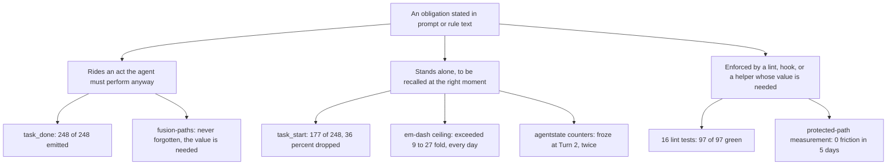

# Analysis: what to simplify, where the time goes, and why the rules do not hold

**Date:** 2026-08-12 03:03
**Type:** Comparative and Root-cause, measured against 37 days of the project's own artifacts and a control project
**Status:** Complete
**Requested by:** user, via orchestrator dispatch

---

## Question

Three questions, asked in this order and answered in it. What can be simplified in fusion. How to
get higher performance. How to shorten the loops running inside the models so that agents stop
derailing through rules and goals that have to be re-injected. Six observations came with the
questions and are filed as issues dated `260812-0253`. Each was checked rather than accepted; four
hold as stated, one holds with a different cause than the one proposed, and one is refuted.

## Scope

Every history artifact in the workbench, 380 files and 466,000 words spanning 2026-07-06 to now,
read for machine-checkable rule compliance. All 52 hook test files, run. The always-on rule
emission for all 16 agents, sized. `orchestrator-events.jsonl` in this project (1,265 events, 45
sessions) and in `/Users/k1/Projects/productive/krk` (480 events, 17 sessions). krk's
`.guard-state/events.jsonl`, 16,076 tool calls. `bin/monitor`, traced against real data. The prior
analysis `260812-0022-where-the-complexity-comes-from-and-what-would-have-to-go.md` stands; its
removal list is cited, not repeated.

**Not knowable from here.** A model's attention. Only the artifacts it produced can be measured.
Every claim below about what an agent "did" is a claim about a file it wrote.

---

## Headline

**The rules did not decay. They were never in force.** The one always-on rule with a numeric
threshold, the em-dash ceiling of one per thousand words, is exceeded by nine to twenty-seven fold
on every single day of the project's life, starting with the first history file ever written.
Within a document, compliance is 6 percent *better* in the last third than the first. Across
agents, the freshest contexts are the least compliant. There is no gradient to explain, because
there was never a compliant state to decay from.

**What separates a rule that holds from one that does not is not context depth. It is whether the
obligation rides an act the agent has to perform anyway.** Three independent instances say the same
thing, one of them measured today: the orchestrator emits `task_done` 248 times and `task_start`
177 times, so 36 percent of tasks are announced finished having never been announced started. Both
are instructed in the same prompt file. One rides the completion. The other is a standalone
obligation before the act, and it is dropped a third of the time.

**The user's remedy is right for a reason he did not give.** Shorter dispatches will not improve
rule adherence, because depth is not the variable. They will cut cost roughly fourfold, because
handoff between dispatches is measured at zero.

---

# 1. What can we simplify

The prior analysis lists eight removals with no measured capability lost, and that list stands.
Three targets it did not name are larger than several items on it.

## 1a. The always-on rule corpus, because most of it does not bind

Every agent loads a floor of 98,443 bytes of rules before its own prompt. The orchestrator loads
132,732. I tested four rules from that corpus against every artifact the project has produced.

| Rule | Kind | Measured compliance |
|---|---|---|
| Em-dash ceiling, 1 per 1,000 words (`user-facing-output.md:~95`) | running budget over own output | **9 to 27 per 1,000, every day since 260706** |
| Gloss marker syntax on first use (`user-facing-output.md:~78`) | running state over own output | **630 raw markers in shared history prose** |
| No unsolicited effort estimate (`user-facing-output.md:107`) | prohibition, discrete, rare act | holds, 1 file in the whole workbench |
| No section called "Metadata" at the top (`user-facing-output.md:~93`) | prohibition, discrete, rare act | holds, 0 files |

The split is clean and it is the finding. A prohibition against a discrete act the agent rarely
wants to perform holds. An obligation that requires the model to keep a running count or a running
state over its own output has never held, at any context depth, on any day.

The length cap is the second kind. So the user's verbosity complaint is a specific case of this,
and section 3 returns to it.

Against that, the 16 lint tests in `hooks/lib/__tests__/` are 97 of 97 green today. They enforce
structural conventions: path literals, marker format, provenance headers, citation forms, glob
forms, reference resolution. **Not one of them enforces a behavioural convention.** The project has
already discovered the answer mechanically and has applied it everywhere except to the rules the
user is complaining about.

*inference:* a substantial fraction of the 98,443-byte floor is text that does not change
behaviour. I proved it for two rules and disproved it for two others, so I cannot put a number on
the fraction. The way to find out is cheap and is in section 3.

## 1b. `tasklist.md`, at 43,130 tokens, is the single largest thing Setup reads

162,038 bytes, 1,041 lines, 79 task entries. That is more than half again the orchestrator's
*entire* rule set, and reading it costs more context than every rule file combined. The prior
analysis measured zero `taskplanner` dispatches in either project and noted that krk runs six
Circles with no queue file at all. Nothing reads it, and it is the most expensive thing Setup reads.

## 1c. The output templates are a verbosity floor

| Agent | Sections its output template mandates |
|---|---|
| analyst | 20 |
| orchestrator | 13 |
| investigator | 10 |
| planner | 9 |

On top of that, `rules/user-facing-output.md:88-91` mandates four sections for any reply at all:
action, reason, status, details. A one-line lookup cannot produce a one-line answer and satisfy a
four-section template. The floor is written down; the ceiling is not enforceable. Output length is
bounded below and unbounded above.

## Recommendation for this week

Take the always-on emission down by cutting what does not act, and prove the cut with the
instrument that already exists. `rules-emission-golden.test.ts` already measures the corpus per
role and currently reports the orchestrator 792 bytes over budget without failing. Restore it as a
failing gate, as the prior analysis recommends, and set the new floor by deleting rather than
re-baselining. Start with the persisted `tasklist.md`, which is the largest item and has no
measured consumer.

---

# 2. How do we get to higher performance

## Setup is not the problem the complaint says it is, but the complaint is real

Shell execution across all 11 Setup helpers is **593 milliseconds**, mean of five runs each. Setup
measured properly, from the first guarded tool call to the `session_start` line, is **1.3 minutes
median in fusion and 5.9 in krk**. Shell is 0.2 to 0.8 percent of it. Optimising the helpers cannot
move the number.

What the user experiences as Setup is `session_start` to `scope_resolved`, and that is **16 minutes
median, 24.4 mean, over 24 sessions**. That interval contains Setup, then Phase 0 scope resolution,
then a confirmation gate that waits on a human. So the honest statement is that Setup itself is a
few minutes and the wait around it is twenty. Filed issue `260812-0253_*_setup-takes-far-too-long`
is correct that nothing measures it; it is wrong to locate the cost in the shell calls.

## The three largest costs

Measured across 277.5 hours of within-session elapsed time in both projects.

| Rank | Cost | Size | Verdict |
|---|---|---|---|
| 1 | Bookkeeping between steps: commit, reconcile, queue rebuild, drift check, portfolio refresh | **76.5 h, up to 28% of session time** (51.2 h fusion, 25.3 h krk) | **Reducible.** Much of it maintains counters by hand that another module then checks against git |
| 2 | Review and coherence passes | **20.6 h in fusion**, against 20.8 h of all executor task work in the same log | **Reducible, not removable.** `coderev` filed 159 of 272 attributed defects and is the only working sensor |
| 3 | Context reload at every dispatch | **74,362 tokens** for an orchestrator before its first task; 69% of a 200k window once `CLAUDE.md`, the Setup skill, `tasklist.md` and `portfolio.md` are added | **Reducible.** Section 1 is the cut |

**Essential:** the executor work itself, 20.8 h in fusion and 29.7 h in krk.

**Removable, and cheap:** the test suite runs 99 seconds, and 97.9 of those seconds are one file,
`guard-rules-write-integration.test.ts`. The other 51 files run in its shadow. Sharding it drops
the suite to about 75 seconds; deleting `fusion-plane.test.ts` (74.5 s, testing a mechanism with
zero successful pushes ever recorded) drops it to about 53 seconds. At 45 documented runs on 11 and
12 August, that is 74 minutes of suite time on two days, roughly halved for a day of work.

**Cost that does not exist:** handoff between dispatches. `dispatch → dispatch` is 0.0 minutes at
the median in both projects and 1.28 hours in total across 60 fusion transitions. There is no
queueing overhead to reclaim, and, more usefully, splitting work into more dispatches is free.

## The 28 percent is an upper bound

An edge counts as bookkeeping if either endpoint is a bookkeeping event, so real work adjacent to a
commit is attributed here. Treat 28 percent as the ceiling and the direction as sound.

## Recommendation for this week

Delete the hand-maintained session counters and derive them. `agentstate.yaml`'s `progress` fields,
the Circle Turn-log tallies and the persisted `tasklist.md` are all written by hand by an agent
under prompt instruction. Every `state_drift` firing in both projects is that file disagreeing with
git, and the drift check already derives the true value from `git rev-list` in order to compare
against it. The true number is therefore already computed; only the hand-written copy is
optional. Removing the obligation also removes the roughly 5,400 lines of machinery that exists to
check it, which is item 7 of the prior analysis arriving from the performance side.

---

# 3. How do we make the loops shorter

## The decay hypothesis is refuted on two independent measurements

**Within a document.** 186 documents of 90 lines or more, 187,000 words. Em-dash density in the
first third is 12.72 per thousand words; in the last third, 11.96. Change: **minus 5.9 percent**.
If a convention degraded as an output grew, this number would be strongly positive.

**Across context depth.** Grouping every history artifact by which agent wrote it, and taking
dispatch length as a proxy for context depth:

| Author | Context at time of writing | Em-dash per 1,000 words |
|---|---|---|
| analyst | long dispatch, deep | **6.15** |
| orchestrator, end-of-session summary | deepest | **10.27** |
| coder, coderev | shortest, rules freshly loaded | **14.01** |
| reconciler | dispatched late | **14.48** |

The freshest contexts are the *least* compliant. The decay hypothesis predicts the reverse.

**Across the project's life.** Daily means run 9.15 to 27.66 per thousand words, from 260706 to
260811, with no trend. The very first history file the project ever produced sits at 12.76. There
was never a compliant state.

## What is actually going on, from the project's own records

Three instances, independent, all pointing the same way.

**One, and it is the sharpest, measured today.** `agents/orchestrator.md:465` instructs emitting
`task_start` before a dispatch, and `:1291` repeats it. The event log holds 248 `task_done` lines
and 177 `task_start` lines in this project, 95 and 79 in krk. **36 percent of tasks are announced
finished having never been announced started.** Two instructions, one file, one context, one agent.
`task_done` rides the act of finishing. `task_start` is a standalone obligation before the act.

**Two.** `260801-2038_*_session-bookkeeping-froze-at-turn-1.md`. Three of four session
surfaces stopped updating after Turn 1 while three Turns and sixteen commits ran. The record's own
diagnostic: *"event emission is a per-action call that cannot be forgotten without the action
failing, whereas the other three are end-of-Turn writes that a session can skip without anything
breaking."* Same session, same context, one obligation held and three did not. It happened again
two days later on a second session.

**Three.** `260810-0710_*_should-a-rule-be-allowed-to-land-without-the-check-that-enforces-it.md`.
A rule was written into the file every agent loads at commit `e99f0ef` and broken three commits
later at `ff70d3a` by an agent that had loaded it. That agent's own account, quoted in the record:
*"loading a rule is not reading it, and reading it at Setup is not recall forty minutes later while
typing a `mkdir`."*



## The four remedies, weighed

| Remedy | Effect on adherence | Effect on cost | Verdict |
|---|---|---|---|
| **Shorter dispatches** (the user's) | **None.** Context depth is not the variable | **About 4x.** One 200-call dispatch re-sends 15.9M non-cacheable suffix tokens; four 50-call dispatches re-send 3.9M. Handoff is measured at zero | **Adopt, for cost** |
| **Restate load-bearing rules in the dispatch prompt** | Partial. Still a statement, but short and adjacent to the act | Small gain, the dispatch prompt is cheap | **Adopt as a habit.** Costs nothing, plausibly helps |
| **Cut the corpus** (section 1) | None directly. Helps comprehension | Large | **Adopt, for cost** |
| **Re-read rules at intervals** | **None.** Depth is not the variable | Negative, adds tokens | **Reject** |
| **Attach the rule to the act** (not on the list) | **This is the one that works** | Adds test lines, costs no dispatch tokens | **Adopt.** It is one open issue away from decidable |

## On context compaction, which is the one mechanism that could rescue the hypothesis

At 800 tokens of output per tool call, an orchestrator's 200k window is full after about 157 calls,
which at the measured median gap of 8.8 seconds is **23 minutes**. Turns run to a median of 58
minutes and a p90 of 5.6 hours. Long dispatches must therefore be compacting, and compaction
summarises the oldest part of the context, which is exactly where the rules sit.

*inference:* for genuinely long dispatches this is real and would make the user's observation
literally true. It cannot explain the 40-minute case in `260810-0710`, and it cannot explain the
flat within-document measurement. It is a second mechanism operating on top of a corpus that was
not being followed in the first place, and the first problem has to be fixed before the second one
is worth measuring.

## Where the verbosity comes from, since it is the same question

The user's worked example is a lookup that returned sixty lines. The reply was **rule-compliant**.
`rules/user-facing-output.md:102` caps a chat reply at twelve lines and then says: *"If more is
needed, move detail to a 'Details' trailing block."* Line 103 adds that wide tables and long lists
belong in Details. Line 105 closes it: *"If a cap is exceeded, move material to Details, do not
relax the cap."*

**The remedy the rule prescribes for excess length is relocation, not deletion.** The cap is on the
opening summary. There is no total budget anywhere in the corpus, and no rule in any of the 16
agent prompts or 13 rule files says to answer only what was asked. The one prohibition on
unsolicited output in the whole corpus concerns effort estimates, and it is copied into eight agent
prompts. The general principle it is an instance of was never written.

So the ten-row table of things to test by hand was not instructed. It was manufactured by
`rules/user-facing-output.md:88`, "Action first: the first line answers what does the user do now?",
applied to a question that has no action. The two defects found in passing come from the filing
duty firing during a lookup. Neither is a style failure; both are the four-section template meeting
a two-line question.

The user is right that adding a length rule is refuted. The length rule exists and was obeyed.

## Recommendation for this week

Answer decision `260810-0710`, which asks exactly this question and is deferred pending three
lint-quality issues. **Two of the three are already closed** (`260810-0502_*_the-state-drift-lint-anchors-on-the-phrase-it-checks-and-one-negative-control-is-a-duplicate.md`, `260810-0503_*_the-domain-cascade-lint-is-defeated-by-a-decoy-branch-and-one-helper-has-no-negative-control.md`);
only `260810-0510_*_two-of-the-queue-ground-lints-negative-controls-re-implement-the-logic-instead-of-calling-it.md` remains. Close it, then take option 1 with the record's own bound: a rule that
constrains a mechanical, syntactic property lands with an executable check or it does not land.

Apply it first to `task_start`, because that one instance fixes the ETA (section 4), costs one
helper, and demonstrates the pattern on a rule whose failure rate is already measured at 36 percent.

---

# Where these conflict, and what I would do first

**Section 1 wants the corpus smaller; section 3 wants rules converted into lints.** A lint is code
and tests, which is the growth the prior analysis identifies as the binding constraint. Resolve it
by making the conversion a trade rather than an addition: a rule becomes a lint only by leaving the
always-on emission. Bytes per dispatch fall, test lines rise, and the tax is paid once at build
time instead of on every dispatch.

**Shorter dispatches conflict with the bookkeeping cost.** Bookkeeping is already up to 28 percent
of session time and it is per-Turn. Shortening by adding Turns would make the largest cost larger.
Shorten *within* a Turn, by bounding executor dispatches, not by cutting Turns smaller.

**What I would do first, if only one thing were done.** Delete the hand-maintained session counters
and derive them from git and the event log at read time: `agentstate.yaml`'s progress fields, the
Circle Turn-log tallies, the persisted `tasklist.md`.

It is the one change that answers all three questions at once. It removes the largest measured
cost, bookkeeping at up to 28 percent. It removes 43,130 tokens from every orchestrator Setup. It
deletes about 5,400 lines of drift machinery whose only subject is those counters. And it is the
purest application of the finding: a standalone obligation is not kept, so the right move is to
stop having one rather than to build a third module that checks whether it was.

---

# 4. The two reported defects, with causes

Both are filed already, as `260812-0253_*_the-monitors-eta-is-not-computed…` and
`260812-0253_*_the-monitor-is-no-longer-reachable-on-localhost`. Neither was fixed. Each now has a
cause a record can carry.

## The ETA

**The ETA code is correct and computes on real data.** Extracted verbatim from `bin/monitor:719-859`
and replayed against both event files, it produced a live estimate for 466 of 1,265 fusion prefix
windows and 217 of 480 in krk, for example `ETA: 22:33 (9m avg, coder)`. The UTC parsing hazard is
ruled out: the path uses `parseUTCTs()` at all six parse sites.

**Root cause: `computeETA` returns empty unless an unmatched `task_start` sits in the last 100
events** (`bin/monitor:806, :812`), and the orchestrator drops 36 percent of them. While such a task
runs there is nothing to anchor on, so the dashboard prints an em-dash for the whole duration. The
ETA would show a real estimate for 37.4 percent of fusion's in-session wall clock and 60.3 percent
of krk's. This is the same finding as section 3, seen from the dashboard.

Two secondary findings. `fusion-workbench/monitor` is stale against `bin/monitor` (55,229 against
60,194 bytes), though the `computeETA` region is byte-identical so it is not the cause. And
`renderWarnings()` at `bin/monitor:527` reads `localStorage` unguarded while every write in the
file is guarded; in a browser with site data blocked that throws, the promise chain aborts into an
empty `.catch` at `:965`, and the ETA element never renders at all.

## localhost

**Root cause established and reproduced.** The server is IPv4-only: `ReuseServer` extends
`ThreadingHTTPServer`, whose `address_family` is `AF_INET`, at `bin/monitor:1190`. On this machine
`getaddrinfo('localhost')` returns `::1` first. The monitor prints `http://localhost:PORT` at
`:1212` and opens that same spelling at `:1293`.

Probed live on port 8099 against the project's own copy:

```
lsof:  Python IPv4 TCP *:8099 (LISTEN)      <- no IPv6 row
http://localhost:8099/          200   (curl only, via Happy Eyeballs fallback)
http://127.0.0.1:8099/          200
http://[::1]:8099/              connection refused
http://192.168.178.126:8099/    200
```

The user's instinct to try the IP is exactly right, and it discriminates correctly. `curl` survives
by retrying on IPv4; a client that does not fall back, or stalls first, sees the reported
asymmetry. **Still open:** whether the user's browser falls back. A browser-side HSTS entry for
`localhost` upgrading to `https` would produce an identical symptom and is host-scoped, so it would
leave the raw IP working. Checkable at `chrome://net-internals/#hsts`.

Fix direction, not applied: bind dual-stack, or print and open `127.0.0.1`.

Two further defects found while probing. `bin/monitor:1158` runs `lsof -ti :PORT` and SIGTERMs every
PID returned; that matches either endpoint, so restarting the monitor **sends SIGTERM to the browser
process holding an open tab** (reproduced: PIDs 66947 the server and 67062 a client, both killed).
And the startup banner at `:1212-1214` never reaches a redirected log, because Python buffers stdout
when it is not a tty and then blocks in `serve_forever()`, so any caller that redirects output never
learns the URL. Separately, three test monitors from the harness have been running since yesterday
(PIDs 48216, 53620, 76226); they were left alone.

---

# On the observations that came with the questions

| Observation | Verdict |
|---|---|
| Setup takes far too long | **Partly.** Setup itself is 1.3 to 5.9 min; shell is 593 ms of it. The 16 min the user feels is Setup plus scope resolution plus a gate waiting on a human |
| Fusion is verbose, nearly every agent | **Holds, and it is instructed.** `user-facing-output.md:102-105` prescribes relocation, not deletion, as the remedy for excess length. No total budget exists |
| All operations take unbearably long | **Holds.** Turn median 58 min, p90 5.6 h, max 25.7 h. Up to 28% of it is bookkeeping |
| Rules become ineffective over time, mid-session | **Refuted as stated.** No within-document decay, no depth gradient, no compliant state on any day. The real variable is whether the obligation rides an act |
| The ETA is not computed | **Holds, with a different cause.** The estimator works; 36% of `task_start` events are never emitted |
| localhost no longer works, try the IP | **Holds, cause confirmed.** IPv4-only bind, `localhost` resolves to `::1` first. The IP works |
| The orchestrator is imprecise, its instructions often wrong | **Not measured here.** Six issues name the orchestrator prompt; the prompt is 164,716 bytes, 11.5x the median agent prompt, and doubled in 36 hours. Prior analysis item 8 covers it |
| Fusion repairs its own defects too much | **Holds in shape, not in the numbers offered.** Of 299 commits since 1 August, 266 touch the workbench and 33 touch shipped surfaces alone. Only 10 shipped-touching commits are `fix` |
| Must memory be sent with every request? | **Yes.** The API is stateless. The prompt and rules prefix is cacheable; accumulated tool output is not, and it is re-sent on every call. That is the cost argument for the user's own remedy |

---

## Nothing new is filed

All six observations already carry issue records dated `260812-0253`, each with a `Witness:` field
naming the user. Filing again would add rows to the backlog whose size prompted the question. The
causes established in section 4 belong as resolution notes on the two existing records, and the
recommendation in section 3 belongs as the answer to the existing deferred decision `260810-0710`.

## Sources

- 380 history artifacts, `fusion-workbench/shared/history/` and `circles/*/history/`, 466,000 words,
  measured for em-dash density by day, by author, and by position within document.
- `rules/user-facing-output.md:88-91, 102-105, 107`; `rules/critical-stance.md`;
  `rules/agent-setup.md`; the 13-file rules corpus sized at HEAD.
- `hooks/lib/__tests__/`, 52 files, full suite run (99 s, 1,349 tests, green) plus the 16 lint tests
  run separately (97 of 97).
- `hooks/lib/__tests__/rules-emission-golden.test.ts`, run: orchestrator 114,941 bytes against a
  budget of 114,149, reported without failing.
- `fusion-workbench/orchestrator-events.jsonl` (1,265 events, 45 sessions);
  `/Users/k1/Projects/productive/krk/fusion-workbench/orchestrator-events.jsonl` (480, 17);
  krk `.guard-state/events.jsonl` (16,076 tool calls).
- `bin/monitor:527, 719-859, 806, 812, 924-965, 1158-1164, 1190, 1212-1214, 1293`, traced and probed live.
- `agents/orchestrator.md:14, 19, 465, 1291`; the 16 agent prompts sized at HEAD.
- `260801-2038_*_session-bookkeeping-froze-at-turn-1-…`;
  `260810-0710_*_should-a-rule-be-allowed-to-land-without-the-check-that-enforces-it.md`;
  `260810-0502_c`, `260810-0503_*_the-domain-cascade-lint-is-defeated-by-a-decoy-branch-and-one-helper-has-no-negative-control.md`, `260810-0510_*_two-of-the-queue-ground-lints-negative-controls-re-implement-the-logic-instead-of-calling-it.md`.
- `260812-0022-where-the-complexity-comes-from-and-what-would-have-to-go.md`, cited throughout.
- `git log`, 299 commits since 2026-08-01, classified by surface touched.

## Open questions

- [ ] Does `260810-0510_*_two-of-the-queue-ground-lints-negative-controls-re-implement-the-logic-instead-of-calling-it.md` close, and does the user take option 1 of `260810-0710`? Everything in
      section 3 depends on that answer.
- [ ] What fraction of the 98,443-byte always-on floor is inert? Two rules measured as never
      followed, two as followed. The remainder is untested and the test is cheap.
- [ ] Is the user's browser falling back from `::1` to `127.0.0.1`, or is an HSTS entry upgrading
      `http://localhost` to `https`? One check at `chrome://net-internals/#hsts` decides it.
