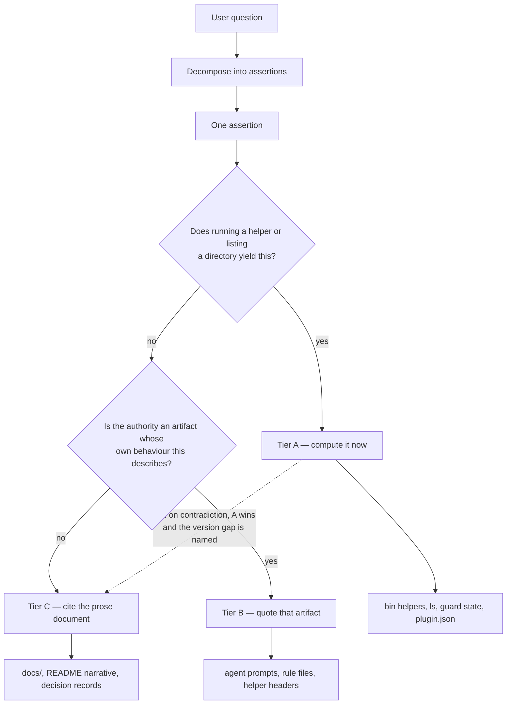

# Analysis: the seam between a measured answer and a cited one in `/fusion:help`

**Date:** 2026-08-13 08:31
**Type:** Feasibility (a case split assessed against `rules/critical-stance.md` §4)
**Status:** Complete
**Requested by:** orchestrator, for decision `shared/decisions/260813-0826_o_should-fusion-help-become-a-self-knowledge-skill-that-answers-from-the-live-installation.md`

---

## Verdict

**The seam is statable, and the evidence supports option 3, but the record cut it at the wrong granularity.** Classified at the level of the *question*, 17 of the 47 questions we inventoried are mixed, which by the record's own yardstick is a wrong cut rather than a seam; classified at the level of the *assertion the answer is made of*, every one of those 17 decomposes and the ambiguous middle is empty, leaving three named residuals that each carry a stateable rule. We also part company with the record on its motivation: staleness is the weaker of the two arguments for measuring, one of the two staleness measurements behind it is a false positive, and the stronger argument the record does not make is coverage, since 20 of the 47 questions are about the user's own installation and `/fusion:help` today answers none of them at any level of freshness.

---

## Question

The decision record recommends option 3, one help skill with two answer paths: measure anything with a countable or resolvable answer, cite `docs/` for anything conceptual. It files itself rather than deciding because of one sub-question. Where does the seam fall for a question that is partly measurable? This analysis answers that sub-question, tests whether the resulting split is disjoint and complete in the sense `rules/critical-stance.md` §4 requires, prices the measured path in body-text lines, and checks the premise the record rests on.

## Scope

**In scope.** The 47 questions derived from six sources: the five topics in `skills/help/SKILL.md`, the section headings of `README.md`, `README-agents.md`, `README-hooks.md`, `docs/philosophy.md` and `docs/working-model.md`, and the 17 rows of `CLAUDE.md` `## Where to look when something breaks`. The `bin/` helper call sites in `agents/orchestrator.md` and `skills/setup/SKILL.md` as a cost baseline. The git history of the help skill body against its cited sources. The three prior-art helpers named in the dispatch.

**Out of scope.** We did not write, design, or specify the skill body. We did not check the marketplace repository, any installed copy of fusion outside this work tree, or any consuming project. `git log` was read at `1c2d555` (v8.1.0) with three uncommitted workbench files present.

---

## Findings

### 1. The question inventory

Classification uses three tiers rather than the record's two. The reason is in section 2; the tiers are introduced here because the table needs them.

- **A (computed)** — a `bin/` helper run, a directory enumeration, or a read of a state file. Cannot go stale, because it is a measurement taken now.
- **B (quoted from the behaving artifact)** — the agent prompt, the rule file, or the helper's own header block. Cannot go stale relative to behaviour, because the text quoted is the thing that behaves.
- **C (prose)** — `docs/`, the README narrative, decision records. Can go stale, irreducibly, because the content is reasoning about the mechanism rather than the mechanism.

"Mixed" means the answer needs assertions from more than one tier.

#### From `CLAUDE.md` `## Where to look when something breaks` (17 rows, 18 questions)

| # | Question | Class | Mechanism if measured |
|---|---|---|---|
| 1 | Why does `Agent type 'X' not found` fire? | Mixed (A+C) | `ls agents/` for whether X exists; the `<plugin>:<name>` form is mechanical |
| 2 | Why can an agent not find a rule file? | **A** | `bin/fusion-rules <agent>` prints exactly what loads; `ls ./rules .claude/rules` |
| 3 | Why does the investigator halt at Setup? | **A** | `test -f ./rules/investigator-capture-layout.md` |
| 4 | Why does an agent halt with "no fusion workbench found"? | **A** | `bin/fusion-workbench-root`, exit code and path |
| 5 | Why are there stray `.guard-state/` directories? | Mixed (C+A) | version from `.claude-plugin/plugin.json`; the pre-v2.5 history is prose |
| 6 | Why did all sub-agents fail after an upgrade? | Mixed (A+C) | parse the YAML frontmatter of each `agents/*.md`; the v2.8.1 lesson is prose |
| 7 | Why did the orchestrator skip Setup? | **C** | none |
| 8 | Why does `/plugin install` return an old version? | Mixed (A+C) | compare `plugin.json` version in the install root against the marketplace cache clone |
| 9 | Why is the SessionStart banner not visible? | **C** | none |
| 10 | Why does SessionStart say "restart at the project root"? | Mixed (A+C) | `pwd` against `bin/fusion-workbench-root` |
| 11 | Why does the orchestrator skip the portfolio hint? | **A** | `test -d circles/`; read `.active-circle` and check it names a directory |
| 12 | Why does `/fusion:next` say "no Circles yet"? | **A** | enumerate `circles/*/…circle.md` and read the marker from each name |
| 13 | Why does the orchestrator fall back to `Agent(general-purpose)`? | **A** | read the `tools:` line in `agents/orchestrator.md` frontmatter |
| 14 | Why are monitor times off by the timezone offset? | **C** | none |
| 15 | Why was a protected path written back and the guard halted? | Mixed (A+C) | version; `test -f hooks/dist/lib/protected-snapshot.js` |
| 16 | Why is this project halted when nothing at HEAD could raise it? | Mixed (A+C) | read `haltActive` in `.guard-state/escalation.json` |
| 17 | Why does an advisory name `guard.protectedPaths` on every call? | **A** | `grep protectedPaths fusion-guard.json` |
| 18 | Why did an agent write to the wrong store? | Mixed (A+C) | `bin/fusion-paths <name>` for that consumer |

#### From the five topics of `skills/help/SKILL.md`

| # | Question | Class | Mechanism if measured |
|---|---|---|---|
| 19 | Why does fusion exist, and what are the five design pillars? | **C** | none |
| 20 | What is the domain parameter, and which agents take it? | Mixed (A+C) | `grep -l 'Domain:' agents/*.md`; the reason there is no default is prose |
| 21 | How does a session run, and what are the gates? | **C** | none |
| 22 | Which agent or entry point should I use for my situation? | Mixed (B+C) | the `description:` frontmatter of each `agents/*.md` and `skills/*/SKILL.md` |
| 23 | How do I start an agent? | Mixed (A+C) | which install path is live; the launcher syntax is prose |
| 24 | Where does the workbench live, and what is in it? | **A+B** | `bin/fusion-workbench-root`, `bin/fusion-paths`; layout quoted from `rules/fusion-workbench-conventions.md` |
| 25 | Where will artifact X land in *my* project? | **A** | `bin/fusion-paths <name>` |
| 26 | How do I run the monitor? | Mixed (A+C) | `test -x fusion-workbench/monitor`; the command line is prose |
| 27 | How do I recover after a crash? | Mixed (A+C) | `test -f fusion-workbench/agentstate.yaml`; the procedure is prose |
| 28 | How do I install fusion? | **C** | none |
| 29 | How do I update fusion? | Mixed (A+C) | which install path is live; the command sequence is prose |
| 30 | What version am I running? | **A** | read `.claude-plugin/plugin.json` |
| 31 | What do the guard configuration keys mean? | Mixed (B+C) | `hooks/config.example.json` quoted; the semantics are prose |
| 32 | What is *my* guard configuration right now? | **A** | read `fusion-guard.json` and the merged result |
| 33 | Where do project rules go? | Mixed (A+C) | `bin/fusion-rules <agent>` shows the live resolution |

#### From `README.md`, `README-agents.md`, `README-hooks.md`, `docs/`

| # | Question | Class | Mechanism if measured |
|---|---|---|---|
| 34 | Is this project set up for fusion? | **A** | `bin/fusion-workbench-root` |
| 35 | Which agents exist, and what does each do? | **A+B** | `ls agents/`; quote each `description:` |
| 36 | Which skills exist? | **A+B** | `ls skills/`; quote each `description:` |
| 37 | Which tools does agent X have? | **A** | read the frontmatter; only `orchestrator` declares a `tools:` line |
| 38 | Which rules does agent X read? | **A** | `bin/fusion-rules <agent>` |
| 39 | Are the hooks wired? | **A** | the verification command `README-hooks.md` already gives |
| 40 | Am I halted, and how do I clear it? | **A+B** | `.guard-state/escalation.json`; the block message names the clearing command |
| 41 | Which files are thrashing in this project? | **A** | `bin/fusion-churn-rank` |
| 42 | Which Circles do I have, and in what state? | **A** | enumerate `circles/` and read markers |
| 43 | What is a Circle *for*? | **C** | none |
| 44 | What are fusion's invariants? | **C** | none |
| 45 | How do I add a new agent or a new rule? | **C** | none |
| 46 | What are the best practices? | **C** | none |
| 47 | Why was the protected-path half of the guard removed? | Mixed (C+A) | absence of the modules; the reasoning is prose |

#### Tally

| Class | Count | Share |
|---|---|---|
| Measured outright, tier A or A+B | 20 | 43 percent |
| Prose only, tier C | 10 | 21 percent |
| Mixed | 17 | 36 percent |
| **Total** | **47** | |

### 2. The seam

**Seventeen mixed questions out of forty-seven is a wrong cut, and the reason is the granularity, not the criterion.** The dispatch set the yardstick: three ambiguous cases is a seam, thirty is a wrong cut. At 17 the record's own framing fails, and the honest response is not to shave the count but to ask what is being classified. The record classifies *questions*. Every question a user asks is answered by several assertions, and there is no reason those assertions should share a source.

**Cut at the assertion instead, and the middle empties.** All 17 mixed questions decompose without residue, because each of their assertions has exactly one authority. Question 18 is the clearest instance. "Why did an agent write to the wrong store" is one question and three assertions: *the shaper writes plans to `shared/planning` in this project* has its authority in `bin/fusion-paths shaper`, which we ran and which prints it; *an agent resolves its store at Setup rather than carrying a literal* has its authority in the agent prompt itself; *the reason the resolver exits 4 rather than emitting an empty value* has its authority in a decision record. Three assertions, three tiers, nothing ambiguous.

The seam, stated:

> **Classify the assertion, never the question.** An assertion is *computed* when running a helper or enumerating a directory yields it. It is *quoted* when its authority is an artifact whose own behaviour it describes: an agent prompt, a rule file, a helper's header block. It is *cited* when its authority is a document written about the mechanism rather than the mechanism itself. Compute what can be computed, quote what has a behaving authority, cite the rest, and never paraphrase across a tier boundary.

**Tier B is the addition that does the work, and it is not a refinement of taste.** The record treats an agent prompt as prose, which puts "what does the playmaker do" in the ambiguous middle. It does not belong there. `agents/playmaker.md:3` states in its own frontmatter that the agent ranks anticipated Circles, consolidates the shared backlog store, writes only appended sections plus `portfolio.md` and its history log, and never edits plans, queues, decisions, issues, backlog entries, code or data. That text cannot describe the playmaker wrongly, because it *is* the playmaker: the description is what the dispatcher reads and the prompt body is what the agent obeys. Quoting it is a measurement of behaviour in every sense that matters, and the record's own worked example dissolves into tier A for the emitted keys, tier B for the scope, tier C for why the boundary sits where it does.

**Three residuals survive, each with a rule.**

- **R1. A single file can hold both a tier B passage and a tier C passage.** `rules/fusion-workbench-conventions.md` is the authority the agents obey for the layout, and it also explains why the Origin Rule keys on origin. `README-hooks.md` documents the guard and also argues about a removed half. *Rule:* the tier is a property of the passage, decided by one test. Do the agents obey this text, or does it explain something else that behaves?
- **R2. Tier A and tier C can contradict each other.** A user on an installed v7 copy asks about the protected-path guard. Measurement finds the modules absent; the prose shipped in that same copy describes them as live. *Rule:* the measurement wins, and the answer names the version gap rather than silently preferring one source. Questions 5, 15, 16, 17 and 47 are all this shape.
- **R3. A routing recommendation is a synthesis, not an assertion.** Question 22, "which agent should I use", is answered by a judgement drawn from tier B descriptions and tier C workflow patterns. It has no single authority because it is not a claim about fusion. *Rule:* label it as the skill's own recommendation and name the inputs it was drawn from.

Three residuals, each stateable in one sentence. That is a seam.

### 3. The cost

**Four new guarded call sites, roughly 70 to 80 lines of body text, taking `skills/help/SKILL.md` from 119 lines to about 190.** The dispatch asked whether "measure the inventory" means ten lines or two hundred. It means tens.

**Most measurements need no helper at all.** Of the 20 outright-measured questions, 14 are answered by `ls`, `cat`, `grep` or `test` against paths that are already fixed and already named in the layout rule. `skills/setup/SKILL.md:264` does exactly this for the halt check: it reads `.guard-state/escalation.json` directly, with no helper and no `[ -x ]` guard. Only four questions reach a `bin/` helper the skill does not already call: `bin/fusion-workbench-root` (question 34), `bin/fusion-paths` (18, 24, 25), `bin/fusion-rules` (2, 38) and `bin/fusion-churn-rank` (41). The fifth, `bin/fusion-source-root`, is already in the body at lines 19 to 29 and is already paid for.

**A first-instance guarded call site costs 7 lines of shell plus one paragraph.** Measured at `skills/setup/SKILL.md:212-218`, the `bin/fusion-state-drift` block is exactly seven lines inside the fence: the opening fence, the `if [ -x ]`, the call, the `else`, the `echo` to stderr, the `fi`, the closing fence. One explanatory paragraph follows it.

**A repeat call site costs one line.** This is the finding that changes the sizing. `skills/setup/SKILL.md:254` resolves the Turn budget in a single sentence that names the canonical block in `agents/orchestrator.md` Setup Step 2 and says the `[ -x ]` guard is part of it. Line 265 does the same for the churn ranking. Neither restates the shell. A skill body can therefore inherit a guarded call rather than duplicating it, which is the same move `bin/fusion-source-root` made for the four duplicated root-resolution snippets.

**The help skill is the cheapest possible consumer of the guarded-call obligation, and this is a structural asymmetry worth stating.** The orchestrator's `bin/fusion-turn-budget` block runs to 22 lines because a budget that fails to resolve has four consequences and none of them is a number the prompt may invent (`agents/orchestrator.md:113-134`). The help skill's degraded mode has no such weight. When a helper is missing, help says so and reads the shipped document, which is precisely what it does today. The fallback is one sentence, stated once and shared by all four call sites.

| Item | Lines |
|---|---|
| Four guarded shell blocks at 7 lines each | 28 |
| One shared fallback paragraph covering all four | 4 |
| The seam statement, three tiers and three residual rules | 22 |
| Per-topic routing added to the five existing topics | 18 |
| **Added** | **72** |
| **Body after the change** (from 119) | **about 191** |

### 4. The premise check

**The premise is real but substantially weaker than the record and its companion issue claim, and one of the two measurements behind it is a false positive.**

**Confirmed: the help skill is one release behind, not two.** `skills/help/SKILL.md` contains zero occurrences of "backlog" and zero of `/fusion:direct`, both shipped in v8.1.0 (verified by `grep -c`). Its last commit is `fa2f00b`, 2026-08-12 15:34. The commit that carried the backlog to the user surfaces, `994fe05`, touched `skills/direct/SKILL.md`, `skills/memo/SKILL.md` and `skills/next/SKILL.md`, and the help skill was not among them. The gap is one release and roughly seven hours.

**Refuted: `README-hooks.md` does not describe the removed guard as live.** The companion issue `260813-0825` states that a reader of `README-hooks.md` today "is told the guard protects a path list, writes unauthorised changes back, and can be exempted with an environment variable", and that all three are false at HEAD. We read all 13 lines its grep matched. Every one is explicitly past tense or explicitly labelled as removed history. Line 14 says the layer "sat between those two until 2026-08-12" and that "the whole half was removed". Line 28 says "that went on 2026-08-12". Line 238 says "there used to be a third". Line 268 explains the retired key. Line 272 is a section heading reading "The protected-path half, and why it was removed". The file was last changed at `fa2f00b`, which is after the removal commits `60c9cd8` and `b77675d`. **The issue's headline claim was produced by counting grep hits without reading the lines, and acting on its acceptance criterion would mean rewriting prose that is already correct.**

We consider this the most consequential finding in the premise check, and it cuts directly at the seam. A count of term occurrences is a tier A measurement; the correctness of a passage is not. The false positive is a worked instance of measuring the wrong thing and reporting the result as if it settled the question, which is the failure mode a measuring help skill would be most exposed to.

**The drift ratio.** Of the 12 source files `skills/help/SKILL.md` cites, three changed after the help body last did: `README.md` at 22:44, `README-agents.md` at 21:57, and `rules/fusion-workbench-conventions.md` at 21:57, all on 2026-08-12, against the help body's 15:34. That is 3 of 12, a ratio of 25 percent, over a window of about seven hours. None of the 14 distinct paths the help body cites is dangling; all resolve.

**A second, stronger instance of the defect class, which nobody has filed.** `README-agents.md:29` describes `coderev` as reviewing "Go / TS / Python code". The agent's own frontmatter at `agents/coderev.md:3` says it reviews "application code, prompts, build/packaging, and tooling". The hand-maintained table is narrower than the agent, and `skills/help/SKILL.md:75` points the user at that table as "the full agent reference". This is a *wrong* answer rather than a missing one, and it is the kind a tier B quote of the frontmatter could not produce.

**What the numbers mean for the record's motivation.** The record argues from staleness, and the measured staleness is one skill body missing one release's two new nouns, plus one drifted table row, over a seven-hour window in a repository that shipped two major versions in a single day. That is a genuine defect class with two live instances, and it is not the emergency the record's framing implies. We would not build a mechanism on this evidence alone.

### 5. Prior art

**Three helpers already made this exact move, and their records settle two of the three questions the decision record raises.**

`bin/fusion-turn-budget` is the closest precedent and the strongest. Its header states that the Turn budget "was stated: `5`, in seven places in `agents/orchestrator.md`, in four spellings, one of which already called it a default while no source could override it", and that "seven copies of one fact go stale together and no project could change any of them" (issue `260811-1712`). The repair moved the value to one definition in `hooks/lib/config.ts` and made every consumer read it. That is the record's option 3 applied to a single fact, and it worked.

`bin/fusion-churn-rank` settles the tier B question the record does not ask. `CLAUDE.md`'s Layout entry for it deliberately does not restate its output contract; it points at the helper's own header, because a change to the output then has one surface to reach rather than two (issue `260811-1612`, filed when `CLAUDE.md` turned out to be the fifth surface of that contract and was left on the old one). **This is tier B, already in force, already justified by a filed defect.** The seam we propose is not a new idea in this repository; it is an existing convention that has never been named.

`bin/fusion-source-root` settles the duplication question, and it settles it inside `skills/help/SKILL.md` itself. Decision `260810-2145` records the failure that produced it: one fact lived in four executable copies across two skill bodies, a correction reached two of them and left two standing. The answer was option 1, one helper and four calls, and the help skill was moved onto it in the same change. The help body already carries a measured answer; adding four more is a difference of degree.

**Decision `260810-1544` part (b) settles the guard convention, and it was answered in the user's favour of the cheap option.** A prompt calling a `bin/` helper guards the call and reports absence in the fixed vocabulary; no lint enforces it. The record chose prose over a gate because three gates of exactly that shape, matching on text rather than behaviour, were themselves open defect records at the time. It also names the honest cost, that a convention in prompt text can lose to task pressure, and closes with "reconsider if the class recurs after the convention is written down". **A help skill adding four call sites is the first real test of that convention.**

**Part (c) of the same record is unanswered and it reaches this work.** Whether the work-tree preference extends to helper resolution is open. `skills/help/SKILL.md:35` already states the current split correctly: read shipped text through `$FUSION_SRC`, run or copy an installed artefact through `$FUSION_PLUGIN_ROOT`. Four new helper calls inherit that unanswered question without making it worse.

**What the prior art does not settle.** None of the three helpers faced a mixed audience. Each answers one question for one caller, and the caller is an agent prompt. A help skill answers an open-ended question for a human, and the decomposition step in the seam above has no precedent in this repository. That step is where an implementation would actually be at risk.

---

## Implications

**Option 3 is implementable, and the record can be moved to answered.** The seam holds under the §4 standard once it is cut at the assertion. It is disjoint by construction, since an assertion has exactly one authority, and complete by construction, since the three tiers exhaust the sources fusion has. The three residuals are rules the design needs, not gaps in the split.

**The record's reasoning should be corrected on two points before it is closed.** First, the tier B category is missing from it, and its absence is what put "what does the playmaker do" in the ambiguous middle. An agent prompt is not prose about fusion; it is fusion. Second, staleness is the weaker argument for measuring, and the record leans on it exclusively. The stronger argument is coverage. Twenty of the 47 questions are about the user's own installation, and the shipped prose cannot answer any of them at any level of freshness, because it does not know which project it is being read in. `/fusion:help` today cannot say which Circles this project has, where the shaper's next plan will land, whether the guard is halted, whether the configuration declares a retired key, or whether this session is running from the right directory. Those are not stale answers; they are absent ones.

**The measured half will not remove the defect the companion issue describes, and expecting it to would be a mistake.** The `README-hooks.md` false positive was produced *by* a measurement. The `coderev` row is a drifted restatement that measurement would prevent, but only because tier B quotes the frontmatter instead of restating it. What kills that defect class is the rule against paraphrasing across a tier boundary, not the act of measuring.

**The cost is low enough that the sizing should not drive the decision.** Seventy-two lines and four guarded call sites is smaller than the analysis that produced the number.

---

## Recommendations

1. **Answer decision `260813-0826` as option 3**, with the seam stated at the assertion and the tier B category added. Route to the orchestrator for the `_o_` to `_a_` transition, citing this analysis.
2. **Correct the companion issue `260813-0825` before anyone works it.** Its `README-hooks.md` row is a false positive and its first acceptance criterion would cause a rewrite of correct prose. The `coderev` row drift in `README-agents.md:29` belongs in the same issue as a confirmed finding. Route to `reconciler`, or to the orchestrator that filed it, rather than filing a competing record.
3. **When the skill body is written, state the seam once and route each of the five topics to it**, rather than restating the criterion per topic. That is the mistake `bin/fusion-source-root` was built to undo, and the help body is one of the four files it was undone in.
4. **Treat the four new call sites as the stated test of decision `260810-1544` part (b).** If the convention holds across them without a lint, the record's closing line is satisfied. If it does not, that is the recurrence it asked to be told about.
5. **Do not fold the prose work into this.** The record already says option 1's prose work happens anyway in the documentation Circle. Nothing here changes that, and the two halves are commutative.

---

## Filed Issues

None. Recommendation 2 identifies actionable work, and we deliberately did not file it: the finding is a correction to an issue filed one session ago by the dispatching orchestrator, and a competing record would duplicate rather than correct it.

---

## Sources

Read in full or in the cited range, in this work tree at `1c2d555` (v8.1.0):

- `fusion-workbench/shared/decisions/260813-0826_o_should-fusion-help-become-a-self-knowledge-skill-that-answers-from-the-live-installation.md`
- a defect record about the user-facing documentation lagging two releases and still describing a removed guard, read here at the stamp `260813-0825`. **The path this line carried has been dropped rather than corrected: no file with that slug has ever existed in this repository.** `git log --all --diff-filter=A` shows commit `799fded` adding exactly two records at that stamp, one about the playmaker holding no write key to the backlog store and one about a documentation step reaching three files where the feature reached seven surfaces, and neither is this. The curator reached the same wall on 2026-08-14 (`circles/260801-1244-curator/history/260814-1332-curator-run.md`) and so did the repair pass of 2026-08-19; naming the closest survivor as the intended target would be speculation rather than a citation. What this analysis argued about that record, at lines 173 and 216 above, stands on its own and is unchanged. What is lost is the reader's route to the evidence, and it stays lost. The open record is `circles/260819-1645-four-constraints-on-deep-change/issues/260819-2250_*_a-decision-records-cross-reference-names-a-defect-record-that-was-never-filed-and-the-intended-target-is-not-recoverable.md`, which names the two things that would close it and why neither is mechanical.
- `skills/help/SKILL.md` (119 lines, full); lines 17-35, 69, 75, 104-109 cited
- `skills/setup/SKILL.md:208-222, 252-256, 263-267`
- `agents/orchestrator.md:41, 106-134` (Setup Step 2, the `bin/fusion-turn-budget` block)
- `agents/playmaker.md:3, 40-52`; `agents/coderev.md:3`; `agents/conceptrev.md:3`; `agents/editor.md:3`; `agents/consultant.md:3`; `agents/analyst.md:3`
- `README.md`, `README-agents.md`, `README-hooks.md` (headings; `README-hooks.md:1-60` and all 13 grep-matched lines read in full; `README-agents.md:19-50` read in full)
- `docs/philosophy.md`, `docs/working-model.md` (headings and closing sections)
- `CLAUDE.md` `## Where to look when something breaks` (17 rows, full)
- `rules/critical-stance.md` §4; `rules/design-diagrams.md`; `rules/agent-setup.md`; `rules/user-facing-output.md` `## Self-review before sending`; `rules/fusion-workbench-conventions.md` `## Project language`
- `bin/fusion-turn-budget:1-48`; `bin/fusion-churn-rank:1-55`; `bin/fusion-count-sources:1-45`
- `fusion-workbench/shared/decisions/260810-1544_a_should-prompt-called-bin-helpers-get-one-guarded-call-convention-and-does-the-work-tree-preference-extend-to-them.md` (full)
- `fusion-workbench/shared/decisions/260810-2145_a_should-a-repeated-skill-body-snippet-become-a-bin-helper-now-that-one-fact-lives-in-four-executable-copies.md` (recommendation and answer)

Commands run: `bin/fusion-paths` for `analyst`, `playmaker`, `shaper`, `help` and an unknown name; `bin/fusion-rules coder`; `git log -1` per file with `--date=format:'%Y-%m-%d %H:%M'`; `git show --stat` for `994fe05`, `3c6ec4e`, `dec40bb`, `6e261c4`, `406ec0d`, `0978e9a`, `fa2f00b`; term counts by `grep -c`; citation resolution by extracting every `$FUSION_SRC/` and `$FUSION_PLUGIN_ROOT/` path from the help body and testing each for existence.

---

## What we did not check

Stated so the record's author knows the bounds of this pass.

- **No installed copy of fusion.** Every measurement was taken in this work tree. We did not verify that a `~/.fusion` install behaves as the guarded-call reasoning assumes, and we did not test any helper's absence.
- **No consuming project.** The claim that a measured help skill answers questions the prose cannot is reasoning from the mechanisms, not an observation of a project where the answers differ. Marked as inference.
- **No marketplace repository.** Question 8's mechanism, comparing two `plugin.json` versions, was not executed; the cache clone was not read.
- **The 47 questions are derived, not observed.** They come from the six documentary sources the dispatch named. We have no transcript of what users actually ask `/fusion:help`, so the tally's 43/21/36 split describes the documented surface, not measured demand. A real usage log could move it in either direction. Marked as inference.
- **We did not attempt the decomposition step end to end.** The claim that all 17 mixed questions decompose was tested by walking each one, not by writing the skill body that performs the decomposition at run time. That step is named in section 5 as the part with no precedent, and it remains the implementation's real risk.
- **No line-level audit of `docs/philosophy.md` or `docs/working-model.md` for stale claims.** We read their headings and closing sections only. The premise check covers the help skill and `README-hooks.md`; the two conceptual docs were checked for the v8.1.0 terms by `grep` and nothing more.
- **The `fusion-guard.json` merge was not exercised.** Question 32's mechanism assumes the loader can be invoked to print the merged result. We read that the loader merges per leaf but did not confirm a caller exists that prints it.

## Open Questions

- [ ] Should the seam be written into `skills/help/SKILL.md` alone, or into a rule file, given that tier B is already an unnamed convention in `CLAUDE.md` and `bin/fusion-churn-rank`?
- [ ] Does the four-call-site test of decision `260810-1544` part (b) need a recorded outcome, or is silence sufficient evidence that the convention held?
- [ ] Part (c) of `260810-1544`, whether the work-tree preference reaches helper resolution, is still unanswered and is inherited unchanged by four new call sites.
