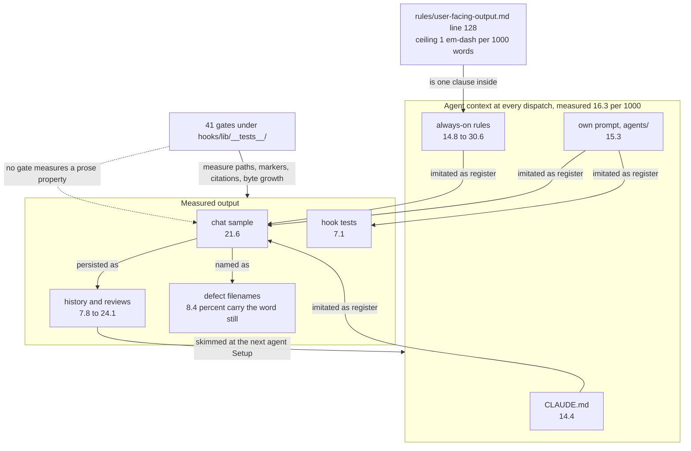

# Analysis: the rhetorical register of fusion's agent output, and why the rule against it does not hold

**Date:** 2026-08-16 07:40
**Type:** Document Study
**Status:** Complete
**Requested by:** user

## Question

The user asked for two things. First, name in linguistically correct terms the rhetorical
figures at work in a sample of the orchestrator's German chat output, extending a short
list the user had already made. Second, and this is the operative question: the output
should become more concise and more factual, so what actually produces the current register
and what would change it.

The user then added a third question, and it is the one that actually blocks him. The agents'
queries back to the user read as florid and cryptic at the same time, and the decisive
information is missing: *"was ist grau und was verschwindet"*. What must be decided, and what
does each choice foreclose.

This report answers all three, and the answers separate into two independent faults with two
independent fixes.

**The register** is not a drafting habit that a reminder would correct. It is transferred by
imitation from the prompt corpus every agent reads at dispatch, and that corpus violates the
style rule it carries at sixteen times the rule's own stated ceiling. No gate measures prose,
while forty-one gates measure structure. Findings 1 to 12.

**The undecidability** is a missing member, not a style fault. The sample is *narratio*
without *propositio*: it recounts what happened and never states what is at stake. Two
decisions are latent in it and neither is surfaced. The rule that governs gate prompts
requires the question to be readable and never requires it to state what each option
forecloses. Finding 13.

## Scope

**The sample.** The orchestrator chat text the user pasted, 231 words of German, quoted
verbatim below where cited.

**One thing about the paste, stated as an assumption.** The block the user labelled
*"Hier die Analyse"* is the same text as the block labelled *"Hier der Input"*, with the
code fence removed and paragraph breaks inserted. No prior analysis text was recoverable
from it. This report therefore supplies the figure inventory in full rather than extending
a list it could not read. If a separate analysis exists, the inventory below should be read
against it rather than in place of it.

**The corpus, for measurement.** The twelve most recent session and agent history files and
the four most recent review files under `shared/`, the four most recent analysis reports,
and the plugin's own shipped prose: `agents/*.md`, `rules/*.md`, `skills/*/SKILL.md`,
`CLAUDE.md` and the hook test suite.

**The governing rules.** `rules/user-facing-output.md`,
`fusion-workbench/stilwerk/chat-voice-de.yaml` (short form, chat),
`fusion-workbench/stilwerk/default-voice-en.yaml` (long form, artifacts).

## Findings

### 1. The register is one figure, repeated: correctio

The dominant figure is **correctio** (also *epanorthosis*): a term is stated and then
withdrawn in favour of a sharper one. Its German surface forms are `X statt Y`,
`nicht X, sondern Y`, `zwar X, aber Y`. Its English surface form across the workbench is
`rather than`.

Measured in the sample: five instances in 231 words, or 21.6 per 1000.

| Instance | Form |
|---|---|
| "das Prädikat verengt **statt** den Kommentar" | correctio |
| "**Und nachgemessen statt geschlossen**" | correctio, elliptical |
| "wurde **gemessen statt behauptet**" | correctio |
| "auf `_p_` gesetzt, **nicht auf** `_c_`" | correctio |
| "Die Meldung sagt **zwar** ..., **aber** ..." | concessio, the conceding variant |

Measured across the corpus, `rather than` plus `instead of` appears in fifteen of sixteen
recent history and review files, at 2.0 to 6.0 occurrences per 1000 words. It is not one
author's tic. It is the house figure.

**Why this is the concision finding rather than a stylistic observation.** Correctio is a
two-term figure. Every instance spends words on something that did not happen in order to
sharpen something that did. Where the rejected term is not what the reader would have
assumed, those words carry nothing:

- "Der Coder hat die stärkere Richtung genommen, das Prädikat verengt statt den Kommentar"
  reduces to "Das Prädikat wurde verengt", from eleven words to four.
- "Und nachgemessen statt geschlossen" reduces to "Nachgemessen".
- "wurde gemessen statt behauptet" reduces to "gemessen".

**The exception is real and worth stating as a rule.** One of the five earns its place:
"Ein Datensatz wurde auf `_p_` gesetzt, nicht auf `_c_`". Closed is exactly what a reader
would assume of a finished task, so naming the rejected term carries information. The
discriminating test is therefore: *correctio is justified when the rejected term is what the
reader would otherwise have assumed, and is decoration otherwise.* Four of five instances in
the sample fail that test.

### 2. Prosopopoeia, and the agentless sentence it produces

Inanimate artifacts are given agency throughout:

> "**Der Lint hat** ein besseres Zitat **erzwungen**" · "**Die Meldung sagt**" · "das Skript
> **sitzt** an einer bekannten Position" · "Der alte Listener **stirbt**, der Client
> **überlebt**" · "das `find`, das die Baumgrenze jetzt **trägt**"

The figure is **prosopopoeia** (personification of an inanimate subject). In "stirbt" and
"überlebt" it compounds with a vitality metaphor.

The cost is not ornament but attribution. Prosopopoeia moves the grammatical subject slot
onto the tool, which leaves the human or agent actor unnamed. The sample compounds this with
four agentless passives: "wurde das Zitat wiederhergestellt", "wurde auf `_p_` gesetzt",
"wurde er getötet", "wurde gemessen". Across 231 words the text names a doer exactly once,
in "Der Coder hat die stärkere Richtung genommen".

This contradicts the loaded chat profile directly. `chat-voice-de.yaml:32` (C03,
*Du-Form, direkt*) requires direct address and rejects impersonal passive constructions
where direct address is clearer.

### 3. Ellipsis: the verbless fragment

Three constructions in the sample carry no finite verb:

> "Kein Raten nötig." · "Und nachgemessen statt geschlossen:" · "der Aufbau des Reviewers
> auf Port 18825 nachgebaut, macOS 15.7.7"

The figure is **ellipsis**, in its brachylogical form: the copula or auxiliary is suppressed.

Fragments read as concise and are not. They shift work to the reader, who must reconstruct
the predicate before the clause resolves. Both governing profiles reject them explicitly.
`default-voice-en.yaml` K01 states that verbless fragments "are not sentences", and
`rules/user-facing-output.md:129` makes the same demand as point 3 of its readability gate.

### 4. Parenthesis by dash: the measured house tic

The interpolated clause set off by an em-dash is **parenthesis**, and where it postpones the
predicate it is also **hyperbaton**.

The sample carries five in 231 words, or 21.6 per 1000. The ceiling both governing documents
state is one per 1000 (`rules/user-facing-output.md:128`;
`default-voice-en.yaml:140`, AI02). The sample exceeds it by a factor of twenty-two.

Three of the five are the exact pattern the German chat profile names as the most common AI
signal at `chat-voice-de.yaml:81` (AI02): clause, dash, jargon aside, dash, compressed
reason, all in one breath.

Measured across recent agent output, per 1000 words:

| File | Words | Em-dashes | Per 1000 |
|---|---:|---:|---:|
| `260816-0119-coder-reference-lint-four-defects.md` | 663 | 16 | **24.1** |
| `260816-0112-coder-duplicate-check-before-filing.md` | 391 | 9 | **23.0** |
| `260816-0148-coder-frozen-store-exclusion-claims.md` | 771 | 17 | **22.0** |
| `260816-0200-coder-three-reviewer-found-closures.md` | 678 | 12 | 17.7 |
| `260816-0715-reconciliation.md` | 2719 | 47 | 17.3 |
| `260816-0115-coder-monitor-review-findings.md` | 546 | 9 | 16.5 |
| `260816-0713-coderev-turn-5-6-range-3a0408a-f77633f.md` | 2605 | 41 | 15.7 |
| `260815-2147-orchestrator-session.md` | 2302 | 18 | 7.8 |
| `260813-0828-documentation-staleness-survey.md` (analyst) | 3082 | 17 | 5.5 |
| `260812-0303-the-largest-consumer-read-for-the-first-time.md` (analyst) | 11854 | 19 | 1.6 |
| `260812-0251-four-mechanisms-purpose-bindingness-and-cost.md` (analyst) | 8376 | 9 | **1.1** |

Two observations follow from the table. The violation is systematic, spanning every agent
that writes prose. And the long analysis reports are the one class that approaches
compliance, which suggests the constraint is reachable rather than unrealistic.

### 5. Isocolon and the parallel refrain

"gemessen statt behauptet" and "nachgemessen statt geschlossen" share a syntactic frame:
participle, `statt`, participle. Repeated in adjacent paragraphs, that is **isocolon**
functioning as a refrain.

A second parallel structure appears in the measurement paragraph:

> "Der alte Listener stirbt weiter, der Port-haltende Client überlebt weiter, und der
> Client, dessen argv nur `monitor-server.py` nennt, überlebt jetzt auch"

That is a **tricolon** with **anaphora** on "der ... Client" and near-**epistrophe** on
"weiter". `chat-voice-de.yaml` AI04 rejects the tricolon as a default rhythm. Here it should
be kept: three processes were genuinely measured, so the count is substantive rather than
imposed. The figure is only a fault where the number of members is chosen for cadence.

### 6. Concessio with reported speech

> "Die Meldung sagt zwar, ein Neusetzen der Baseline **sei** die erwartete Antwort, aber die
> Testdatei lag außerhalb des Auftrags."

Two figures compound. **Concessio** concedes a point in order to overturn it. The Konjunktiv I
"sei" marks *oratio obliqua*, indirect reported speech. Both belong to a formal argumentative
register, and both are avoidable: "Die Meldung schlägt ein Neusetzen der Baseline vor. Die
Testdatei lag außerhalb des Auftrags."

### 7. Undefined metaphor, and codes left unglossed

Four expressions in the sample are figurative and none is glossed:

| Expression | Figure | What a reader cannot recover |
|---|---|---|
| "die Baumgrenze" | metaphor | The depth boundary of a `find` traversal |
| "der nächste Warteschlangenbau" | metaphor | The next task-queue build |
| "die stärkere Richtung" / "die billigere" | metaphor, elliptical comparative | Which of two options, and cheaper in what |
| "auf dem `find`" | metonymy, bare code | Which invocation, in which file |

Alongside them the sample uses the filename markers `_p_` and `_c_` in body prose. That is
prohibited outright at `rules/user-facing-output.md:83`, which requires the word ("in
progress", "closed") with the marker in parentheses at most. The gloss obligation for codes
is point 4 of the readability gate at `:130`, and "Klartext-Referenten" is C02 of the chat
profile at `chat-voice-de.yaml:24`.

### 8. Sententia: the aphoristic clincher

> "Kein Raten nötig."

A gnomic short sentence closing a paragraph is **sententia**. It is the register's signature
cadence, and it reads as literary judgement rather than as report. The information it
carries is already in the preceding clause ("die Startform steht fest bei
`bin/monitor:1441`"), so it is **tautology** as well.

### 9. The opener is the largest single violation

> "Zwei Dinge daran gefallen mir besonders:"

Three faults compound in nine words.

It is **propositio**, an announcement of the structure that follows, which
`chat-voice-de.yaml:138` (AI08, *Struktur ankündigen*) rejects with the near-identical
example "Es gibt drei Gründe:".

It is evaluative rather than factual, and the evaluation is of work the orchestrator itself
dispatched. `chat-voice-de.yaml:156` (AI11) bans praise directed at the reader;
`rules/critical-stance.md` §1 bans praise used to soften the author's own position. Self-praise
by the dispatching agent falls between the two and is caught by neither as written, which is
worth noting as a gap in the rules rather than in the output.

And it inverts the required information architecture. `rules/user-facing-output.md`
`## Information architecture` puts the reader's action first and the reason second. The
sample opens with the author's taste and never states an action at all.

### 10. Root cause: the corpus teaches the register that the rule forbids

The nine findings above describe the output. This one explains it, and it is the finding the
user's concision goal actually depends on.

Every agent, at every dispatch, reads a fixed set of prose: `CLAUDE.md`, the always-on rules
emitted by `bin/fusion-rules`, and its own prompt. Measured:

| Surface in the agent's context | Words | Em-dashes | Per 1000 |
|---|---:|---:|---:|
| `rules/agent-setup.md` | 533 | 15 | 28.1 |
| `rules/decision-record-examples.md` | 554 | 17 | 30.6 |
| `rules/design-diagrams.md` | 794 | 20 | 25.1 |
| `rules/critical-stance.md` | 1587 | 29 | 18.2 |
| `rules/fusion-workbench-conventions.md` | 8452 | 133 | 15.7 |
| **`rules/user-facing-output.md`** | 2563 | 38 | **14.8** |
| `CLAUDE.md` | 8280 | 120 | 14.4 |
| **Total always-on context** | **22 763** | **372** | **16.3** |

And the wider shipped corpus, for context:

| Surface | Words | Per 1000 |
|---|---:|---:|
| `rules/*.md` | 22 669 | 16.9 |
| `skills/*/SKILL.md` | 34 844 | 16.0 |
| `agents/*.md` | 61 463 | 15.3 |
| `hooks/lib/__tests__/*.ts` | 107 071 | 7.1 |

`rules/user-facing-output.md` states the ceiling of one per 1000 at line 128 and runs at
14.8. Its own first sentence, at line 5, is the banned figure in its purest form:

> "Every piece of output the user reads — status reports, gate prompts, `AskUserQuestion`
> text, session summaries, error messages, skill confirmations, activation banners — must be
> self-contained, plain-English, and action-first."

The arithmetic of the situation is the point. The prohibition is roughly thirty words. The
counter-demonstration surrounding it in the same context window is 22 763 words at sixteen
times the permitted rate. A model writing prose imitates the register of the text it is
conditioned on far more reliably than it obeys a rule stated inside that text, and here the
two point in opposite directions.

The corpus does not merely transmit the register. The output amplifies it: correctio runs at
1.0 to 1.5 per 1000 in the shipped prompts and at 2.0 to 6.0 per 1000 in the agents' own
output, and the sample reaches 21.6.

**The register has also reached surfaces nobody styled deliberately.** Of 661 defect record
filenames across all stores, 56 (8.4 percent) contain the word "still", giving the filename
corpus an anaphoric opening formula of the shape *"the X still Y"*. The hook test suite,
which is code, carries 769 em-dashes at 7.1 per 1000 words. Neither surface is governed by a
voice profile. Both acquired the register anyway.



The cycle in the graph is genuine and is the mechanism. Every agent's Setup instructs it to
skim recent history, analyses, issues and decisions. Yesterday's output is therefore part of
today's conditioning corpus, so the register compounds rather than merely persisting.

### 11. The style rules are the only ungated normative surface

The suite under `hooks/lib/__tests__/` holds 41 test files. Every one measures structure:
path literals, marker format, citation resolution, provenance headers, derivable
enumerations, review coverage, domain cascade order, deliverable language, byte growth of
the four shipped surfaces. Not one measures a prose property.

The nearest neighbour is `surface-growth-bound.test.ts`, which counts bytes. Byte growth is
orthogonal to register: the rewrite proposed below is 35 percent shorter and would pass a
growth bound identically before and after the figures were removed.

This project gates almost every normative claim it makes. The style rules are the exception,
and they are also the claim the corpus most visibly contradicts.

### 12. An adjacent defect, already filed, that is not the cause here

The chat profiles agents actually load are stale. `bin/fusion-rules` emits the workbench copy,
not the shipped copy, and the two diverge today at HEAD:

```
chat-voice-de.yaml     plugin=7358  workbench=7353  DIVERGENT
chat-voice-en.yaml     plugin=6800  workbench=6801  DIVERGENT
default-voice-de.yaml  plugin=13417 workbench=13417 identical
default-voice-en.yaml  plugin=10438 workbench=10438 identical
```

The loaded German profile caps chat at 12 lines and gate prompts at 8; the shipped one says
8 and 6.

**This is cited, not refiled.** The record is
`shared/issues/260814-1419_o_the-shipped-chat-voice-profiles-changed-and-the-workbench-copies-agents-actually-load-did-not.md`,
open since 2026-08-14.

**It is not the cause of the sample's problems, and the report states that rather than letting
the coincidence stand.** The sample runs to about twenty rendered lines and exceeds both the
loaded cap and the shipped one. Every figure inventoried above violates a clause that is
byte-identical in both copies.

### 13. The query to the user is narratio without propositio

The user's addition names a failure that is not a style fault at all, and it is the one that
blocks him. A text can be perfectly plain and still be undecidable. This one is undecidable:
at the moment a response is expected, it supplies what happened and never supplies what is at
stake.

Classical rhetoric divides a speech into five members: *exordium* (the opening), *narratio*
(the account of events), *propositio* (the point at issue), *argumentatio* (the case for it),
*peroratio* (the close). Measured against that division, the sample is:

| Member | In the sample |
|---|---|
| exordium | "Zwei Dinge daran gefallen mir besonders", an opening on the author's taste |
| narratio | six paragraphs recounting what happened |
| **propositio** | **absent** |
| argumentatio | absent as a member; reasons ride along inside the narratio |
| peroratio | "Kein Raten nötig", a clincher on a point that was never put |

The absent member is the only one the reader needs. A text that supplies premises and
withholds the conclusion is an **enthymeme with suppressed conclusion**; a text that breaks
off before its own point is **aposiopesis**. The sample is both, at the scale of the whole
message.

**Two decisions are latent in the sample and neither is surfaced.**

| Latent decision | Where it hides | What the reader is never told |
|---|---|---|
| Does the `.gitignore` half still get done, and when? | "nur Teil 1 gelandet ist. Die `.gitignore`-Hälfte lag außerhalb des Auftrags" | Whether it is queued, by whom, and what happens if nobody queues it |
| Is the pre-existing test failure accepted, or does it block? | "ein leerer Worktree auf HEAD schlägt bei derselben einen Zusicherung fehl" | Whether the session may proceed green, and whether a record exists for it |

Both appear as facts. Neither appears as a choice.

**"Was ist grau und was verschwindet."** The user's phrasing names precisely what a decidable
prompt must carry, and it demands more than an option list. It asks, per option, what that
option **forecloses**: which paths go unavailable, and which leave the board entirely. An
option list without its foreclosures is a menu without prices.

**The governing rule does not require it, and this is a gap rather than a violation.**
`rules/user-facing-output.md` `## Questions and gates` requires exactly three properties: the
question is self-contained, the options are plain English rather than internal verbs, and the
default is marked. Nothing in it requires stating what an option costs or removes. The
mechanism to carry it already exists and goes unused: the `AskUserQuestion` option schema
defines a `description` field as "what will happen if chosen ... trade-offs or implications",
and the rule that governs gate text never points at it.

**The two faults are independent, and that matters for the fix.** Removing every em-dash and
every correctio from the sample would leave it exactly as undecidable as it is now. Findings
1 to 9 describe a register that costs the reader effort. Finding 13 describes a missing
member that costs the reader the decision. They need different remedies.

**Their combination is what produces "blumig und kryptisch zugleich."** Ornate register
raises the cost of reading. The absent propositio means the reading yields nothing to act on.
A plain text with no decision point reads as a status report and is harmless. An ornate text
with no decision point reads as a demand for a response the reader cannot locate, which is
the experience reported.

**The four members a decidable gate prompt carries**, offered as the concrete replacement for
the three properties the rule states today:

1. **The decision**, as a question or a named choice point, in the first line.
2. **The state that forces it**, in one sentence.
3. **The options**, plain English, default marked.
4. **Per option, its foreclosure**: what goes grey, and what disappears.

Member 4 is the addition. Members 1 to 3 are today's rule restated.

**The sample's first latent decision, put as a gate prompt:**

> **Entscheidung: die `.gitignore`-Hälfte von Datensatz 260816-0119.** Teil 1 ist gelandet,
> der Rest lag außerhalb des Auftrags dieser Runde.
>
> - **Jetzt anhängen** (empfohlen): der Datensatz schließt heute. Kostet eine weitere Aufgabe,
>   und das Review muss den erweiterten Bereich mitabdecken.
> - **In die Warteschlange**: bleibt offen, kommt im nächsten Warteschlangenbau hoch. Heute
>   kein Abschluss.
> - **Verwerfen**: die `.gitignore`-Änderung entfällt ganz, der Datensatz schließt mit einer
>   Notiz, warum die Hälfte entfiel.

Seven lines, inside the eight-line gate cap at `rules/user-facing-output.md:101`. Each option
states its own foreclosure. Nothing in it is figurative.

## Implications

**The output is not verbose by accident.** Four of the figures inventoried above have a word
cost that is structural rather than incidental. Correctio spends a rejected term.
Prosopopoeia and the agentless passive spend a subject slot on the wrong noun and then need a
further clause to restore attribution. Parenthesis by dash defers the predicate and adds a
resumption. Sententia restates. A text built from these figures cannot be concise, because
concision would remove the figures.

**A stricter rule will not change it.** The rule exists, is read by every agent at every
dispatch, sets a numeric ceiling, and is violated by the file that states it. Adding a sixth
prohibition to `rules/user-facing-output.md` adds sixth-prohibition-shaped prose to the same
corpus and lowers the file's compliance further.

**Two mechanisms could change it, and they are complementary rather than alternative.**
Bringing the shipped corpus into compliance removes the cause, because instruction and
imitation would then point the same way. Adding a measurable gate prevents the recurrence,
because this project's own history shows that an ungated normative claim drifts. Under
`rules/critical-stance.md` §2 the first is the integral fix and the second is what holds it.

**The cost of the first is lower than it looks.** Removing em-dash parentheses and correctio
from the shipped prose shortens it. A shrink never trips a growth bound, by construction
(`hooks/lib/__tests__/helpers/growth-bound.ts`). The four surfaces under a failing growth
bound would move away from their ceilings rather than toward them.

**The two faults do not share a fix, and neither substitutes for the other.** A gate prompt
can pass every clause of `rules/user-facing-output.md` and still leave the reader unable to
act, because no clause requires an option to state its cost. A prompt can also state every
foreclosure and still be unreadable, if it states them in the register of findings 1 to 9.
The recommendations below therefore split: one track brings the corpus to its own ceiling,
the other adds the missing member to the gate contract.

**The gap in the gate contract is cheaper to close than the register.** It is one clause in
one section of one rule file, plus the option `description` field that already exists and is
already specified to carry exactly this content. The register needs 372 edits across seven
files.

**Calibration.** The measurements above are verified: every figure was produced by a command
run against the tree at HEAD, and the commands are given in Sources. The causal claim in
finding 10, that the corpus transmits the register by imitation, is an **inference** from
the co-occurrence of three facts: the rule is stated and violated in the same file, the
output rate exceeds the corpus rate on the same figures, and the register has reached
surfaces (filenames, test code) that no profile governs. It is consistent with all three and
is not experimentally isolated. The falsifying test is cheap and is named in the
recommendations.

## The sample, rewritten

The most useful output of this analysis is the demonstration. Below, the same facts with the
figures removed.

**The factual content of the sample, extracted.** Six statements:

1. A deleted line-number citation dropped the reference gate's count from 1122 to 1121 and
   the gate failed.
2. The gate's message proposes re-baselining. The test file was out of scope, so the citation
   was restored on the `find` invocation that now carries the depth boundary.
3. One record was set to in progress, not closed, because only part 1 landed and the
   `.gitignore` half was out of scope. A remainder inside a closed record is invisible to
   the next queue build, per the first review's finding.
4. The predicate was narrowed. The launch form is fixed at `bin/monitor:1441`, so the
   script's position on the command line is known.
5. Re-measured on port 18825 under macOS 15.7.7: the old listener still dies, the
   port-holding client still survives, and the client whose argv names only
   `monitor-server.py` now survives where it was previously killed.
6. The test failure was attributed by measurement: an empty worktree at HEAD fails the same
   single assertion.

**The rewrite, in the chat language:**

> Fertig, nichts für dich zu tun. Fünf Ergebnisse dieser Runde:
>
> 1. Die gelöschte Zeilenreferenz ließ das Referenz-Gate fehlschlagen, Zählstand 1122 auf
>    1121. Die Baseline blieb unangetastet, weil die Testdatei außerhalb des Auftrags lag.
>    Das Zitat sitzt jetzt auf dem `find`-Aufruf, der die Tiefenbegrenzung trägt.
> 2. Ein Datensatz steht auf "in Arbeit", nicht auf "geschlossen": nur Teil 1 ist gelandet,
>    die `.gitignore`-Hälfte lag außerhalb des Auftrags. Ein Rest in einem geschlossenen
>    Datensatz wäre für den nächsten Warteschlangenbau unsichtbar, so der Befund des ersten
>    Reviews.
> 3. Der Coder hat das Prädikat verengt. Die Startform steht fest bei `bin/monitor:1441`,
>    also ist die Position des Skripts in der Kommandozeile bekannt.
> 4. Nachgemessen auf Port 18825 unter macOS 15.7.7: alter Listener tot, Port-haltender
>    Client lebt, Client mit `monitor-server.py` in argv lebt jetzt auch. Vorher wurde er
>    getötet.
> 5. Der Testfehlschlag stammt nicht aus dieser Runde. Ein leerer Worktree auf HEAD schlägt
>    bei derselben Zusicherung fehl.

**Measured against the original:**

| | Original | Rewrite |
|---|---:|---:|
| Words | 231 | 150 |
| Em-dashes | 5 (21.6 per 1000) | 0 |
| Correctio instances | 5 | 1 (the justified one) |
| Verbless fragments | 3 | 0 |
| Rendered lines | about 20 | 6 |

The rewrite is 35 percent shorter and loses no fact. Note what was kept: the one correctio
that passes the discriminating test in finding 1, and the tricolon in point 4, whose three
members are three measured processes.

**The single most productive change, if only one is made.** Ban the em-dash parenthesis and
enforce it by counting. It is the only figure in the inventory that is mechanically
detectable, it is already the subject of a numeric rule, and removing it forces the
restructuring that also removes the compression the other figures ride on. The clause that
survives an em-dash removal has to become a sentence, which is finding 3's fix as a
side effect.

## Recommendations

1. **Bring the always-on corpus to its own ceiling, `rules/user-facing-output.md` first.**
   Route to `coder`. The seven files in the finding 10 table are 22 763 words carrying 372
   em-dashes against a permitted 23. This is a shrink and cannot trip a growth bound. Start
   with `rules/user-facing-output.md`, because a rule that violates its own numeric clause in
   its first sentence teaches the opposite of what it says.

2. **Decide whether prose gets a gate, and which surface it measures.** Filed as a decision
   record, listed below. The question is genuinely open: a shipped-prose gate and an
   output-prose gate have different costs and different failure modes, and the output store
   is not a surface this project's tests have ever read.

3. **Add the discriminating test for correctio to the rules, not another prohibition.** The
   test from finding 1 is one sentence and it is the part a blanket ban would get wrong:
   *correctio is justified when the rejected term is what the reader would otherwise have
   assumed.* Route to `curator`, since it is a change to normative text.

4. **Falsify or confirm the imitation hypothesis cheaply.** After recommendation 1 lands,
   re-run the measurement in Sources against the next session's history files. The inference
   in finding 10 predicts the output rate falls with the corpus rate. If it does not, the
   cause is elsewhere and recommendation 2 becomes the only remedy. Route to `analyst`.

5. **Add the foreclosure member to the gate contract.** Route to `curator`, since it changes
   normative text. `rules/user-facing-output.md` `## Questions and gates` gains a fourth
   required property: every option states what it forecloses, what goes grey and what
   disappears. Point the clause at the `AskUserQuestion` option `description` field, which is
   already specified to carry it. This is the cheapest of the five recommendations and the
   one the user's own complaint names directly.

6. **Require a named decision, or the explicit absence of one, at every point the user is
   expected to respond.** Route to `curator`, same file. The sample's deeper fault is that it
   arrived at a response moment carrying no question at all. The rule already has the shape
   for this at `## Information architecture` point 1, which mandates *"If there's nothing for
   the user to do, lead with that explicitly"*. That clause governs status reports and is not
   referenced by `## Questions and gates`. Bind the two.

7. **Do not translate existing artifacts or rewrite past history files.**
   `rules/fusion-workbench-conventions.md` `## Project language` already settles the
   analogous case: the boundary applies going forward. Rewriting the archive would consume
   the effort that recommendation 1 needs and would touch the evidence this report cites.

## Filed Issues

- `shared/issues/260816-0740_o_the-always-on-rule-corpus-runs-at-sixteen-times-the-em-dash-ceiling-it-states.md`
  states the case: the seven files every agent reads at dispatch carry 372 em-dashes against a
  permitted 23, and `rules/user-facing-output.md` violates its own clause in its first sentence.
- `shared/decisions/260816-0740_o_does-the-prose-register-get-a-measurable-gate-and-which-surface-does-it-measure.md`
  states the case: 41 gates measure structure and none measures a prose property. The choice is
  between gating shipped prose, gating agent output, both, or neither.
- `shared/issues/260816-0740_o_the-gate-contract-never-requires-an-option-to-state-what-it-forecloses.md`
  states the case: `## Questions and gates` requires the question to be readable and the default
  to be marked, and never requires an option to name its cost, so a compliant prompt can still
  be undecidable.

## Sources

**The commands.** Every figure in this report was produced by one of these, run at HEAD
`787010f` on 2026-08-16.

```bash
# em-dash density per 1000 words, any file
w=$(wc -w < "$f"); d=$(grep -o '—' "$f" | wc -l); echo "scale=1; $d*1000/$w" | bc

# correctio, English surface forms
grep -ohiE 'rather than|instead of|not [a-zA-Z0-9`_.-]+,? (but|instead)' "$f" | wc -l

# the anaphoric filename formula
ls shared/issues/*.md circles/*/issues/*.md | xargs -n1 basename | grep -c 'still'

# shipped-vs-loaded profile divergence
for f in chat-voice-de.yaml chat-voice-en.yaml default-voice-de.yaml default-voice-en.yaml; do
  diff -q stilwerk/$f fusion-workbench/stilwerk/$f; done
```

**The rules cited.**

- `rules/user-facing-output.md:5` — the rule's own first sentence, a double em-dash parenthesis
- `rules/user-facing-output.md:83` — marker syntax prohibited in body prose
- `rules/user-facing-output.md:102` — chat reply cap of 12 lines
- `rules/user-facing-output.md:127-131` — the five-point readability gate
- `rules/user-facing-output.md:128` — the ceiling of one em-dash per 1000 words
- `rules/user-facing-output.md` `## Information architecture` — action first, reason second
- `fusion-workbench/stilwerk/chat-voice-de.yaml:24` (C02), `:32` (C03), `:39` (C04),
  `:81` (AI02), `:104` (AI05), `:138` (AI08), `:156` (AI11)
- `fusion-workbench/stilwerk/default-voice-en.yaml:140` (AI02, "Maximum one per 1000 words"),
  K01 (verbless fragments are not sentences)
- `rules/critical-stance.md` §1 (praise as deflection), §2 (the Research Gate, one integral
  solution)
- `rules/fusion-workbench-conventions.md` `## Project language` — existing artifacts are not
  translated

**The corpus measured.** `shared/history/` twelve most recent, `shared/reviews/` four most
recent, `shared/analyses/` four most recent, `agents/*.md`, `rules/*.md`,
`skills/*/SKILL.md`, `CLAUDE.md`, `hooks/lib/__tests__/*.ts`.

**Prior work cross-referenced, not duplicated.**

- `shared/analyses/260706-1902-user-facing-agents-garbled-language-rootcause.md` — the earlier
  root-cause analysis of the same complaint. It found a **routing** fault: the consultant sent
  its chat replies through the long-form profile. That fault is fixed
  (`shared/decisions/260706-1902_i_consultant-chat-longform-boundary.md`). The present analysis
  finds a different and complementary cause: correct routing to a profile whose surrounding
  corpus contradicts it. The two do not overlap, and the earlier one's closing observation
  stands, that sharpening a profile does not stop the wrong text from being imitated.
- `shared/issues/260814-1419_o_the-shipped-chat-voice-profiles-changed-and-the-workbench-copies-agents-actually-load-did-not.md`
  covers the stale loaded profile. Verified still divergent at HEAD, and shown in finding 12 not
  to be the cause of the sample's faults.
- `hooks/lib/__tests__/helpers/growth-bound.ts` — why a shrink cannot trip a bound.

## Open Questions

- [ ] Does the imitation hypothesis in finding 10 survive the falsification test in
      recommendation 4? Until it runs, the causal claim is an inference from three consistent
      observations, not a measured result.
- [ ] Self-praise by a dispatching agent about work it dispatched falls between
      `chat-voice-de.yaml` AI11 (do not praise the reader) and `rules/critical-stance.md` §1
      (do not praise to soften your own error). Neither catches it as written. Whether that
      gap is worth closing is for the `curator` to weigh, and it is not filed here.
- [ ] Was the sample a query to the user at all, or a status report the user met at a moment
      when a response was expected? The distinction changes which rule section owns the fix,
      and the transcript alone does not settle it. Recommendation 6 is written so that either
      answer is covered.
- [ ] The report holds itself to the ceiling it measures, at zero em-dash parentheses in
      about 3400 words. Whether the register survives in it in ways the em-dash count does not
      detect is exactly the limit of a mechanical gate, and is the substance of the decision
      record filed above.
