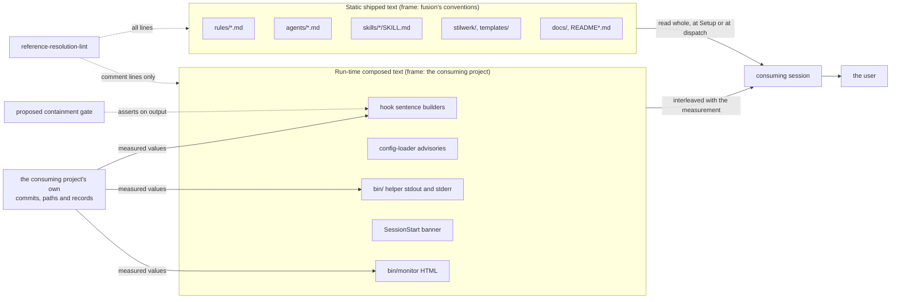

# Analysis: preventing fusion's own identifiers from reaching a consuming project

**Date:** 2026-08-18 07:15
**Type:** Feasibility
**Status:** Complete
**Requested by:** user

---

## Verdict

One new gate is warranted, and it is a test rather than a mechanism. It should assert
**containment** over the output of the hook sentence builders: every identifier in an emitted
sentence must have entered through that sentence's input. We prototyped that formulation
against both builders at HEAD and against their state before yesterday's fix. It catches all
four identifiers of the incident, on every branch, and it produces no false positive on the
branch that legitimately emits four of the consuming project's own commit hashes. The gate the
open record proposes, a blacklist on identifier *shape*, fails on that same branch, which is
the defect the reconciler already found in it.

Nothing should be gated on the static shipped surface. The rule files, the agent prompts and
the skill bodies carry 65 record stamps between them, they are there by design, and no property
of the text separates a legitimate provenance citation from a harmful one. A
gate over that surface would answer an undecidable question, which is the failure
`rules/critical-stance.md` §4 was written from.

What replaces the missing gate on the rest of the surface is a convention with no mechanism,
placed in a rule file that no agent loads at dispatch. It costs nothing per dispatch and it is
the only thing that reaches the channels a test cannot watch.

---

## Question

The plugin's own record identifiers reached a consuming project's session through a hook and
were read there as local evidence. Yesterday's commits removed four of them from two functions.
The question is whether the surface is larger than those two functions, whether any mechanism
can hold the whole surface, and what fusion should build, if anything.

---

## Scope

**In scope.** Every channel by which text authored in this repository reaches a consuming
project's session or its user: the compiled hooks, the `bin/` helpers, `agents/`, `skills/`,
the rule corpus `bin/fusion-rules` emits, `stilwerk/`, `templates/`, `docs/` and the READMEs.
The existing gate `hooks/lib/__tests__/reference-resolution-lint.test.ts`. The four growth
bounds. The open record `260817-2131_*_nothing-stops-a-fusion-workbench-id-returning-to-an-emitted-hook-sentence-because-the-lint-reads-comment-lines-only.md` and its reconciliation note.

**Out of scope.** We did not edit any source file. We did not survey consuming projects, and
we hold no measurement of how any consuming project other than the reported one has read the
static shipped text.

**A fusion-internal identifier**, for this analysis, is any token that resolves only against
fusion's own repository or workbench: a `YYMMDD-HHMM` record stamp, a git object name for a
fusion commit, a path naming a specific record under `fusion-workbench/`, or a Circle directory
name.

---

## Findings

### 1. The surface is ten channels, and only one of them has ever failed



The inventory, measured at HEAD (`1dc062d`):

| # | Channel | Reaches | Carries an internal identifier today | Checked by |
|---|---|---|---|---|
| 1 | Hook sentence builders (`coverageSentence`, `stagingSentence`) | model, then the user through the session summary | no, as of `bd2db5c`..`307a696` | nothing |
| 2 | Config-loader advisories (`hooks/lib/config.ts:331,399`) | model, repeated to the user by mandate | no | nothing |
| 3 | SessionStart banner (`hooks/session-start.ts:143`) | user | no | nothing |
| 4 | `bin/` helper stdout | model, quoted verbatim into session summaries | no | comment lines only |
| 5 | `bin/` helper stderr | model and user | yes, one site (`bin/fusion-paths:262`) | comment lines only |
| 6 | `bin/monitor` rendered HTML | user, in a browser | no (two source comments only) | nothing |
| 7 | `agents/*.md` | model, every dispatch of that agent | yes, 23 stamps across five prompts | resolution here |
| 8 | `rules/*.md` emitted by `bin/fusion-rules` | model, every dispatch of every agent | yes, 13 stamps in the always-on set alone | resolution here |
| 9 | `skills/*/SKILL.md` | model, as the user prompt | yes, 16 stamps across seven bodies | resolution here |
| 10 | `stilwerk/*.yaml`, `templates/` | copied into the project, then read at every dispatch | no | nothing |

Two entries need their measurement stated rather than asserted.

Channel 1 is clean at HEAD and the cleanliness is fragile. The only remaining identifier in
any hook code line is `hooks/lib/domain-cascade.ts:528`, inside a `CascadeError`. We verified
the record's claim that it cannot reach a session: `grep` over `hooks/**/*.ts` returns two
importers, both under `hooks/lib/__tests__/`. The exclusion holds.

Channel 8 is the densest and the most deliberate. Every one of the twelve rule files carries at
least one identifier, and the five always-on files carry thirteen stamps, three workbench paths
and one git object name between them. `rules/critical-stance.md:57,69` cites a Circle directory
and a decision record to explain why the rule exists at all. Those citations are the rule's
evidence. Removing them would leave an assertion with no shown basis, in the one rule file whose
whole subject is not asserting beyond your evidence.

### 2. Nothing in an identifier separates a good citation from a harmful one

We tested three candidate criteria and rejected the first three.

**Shape does not decide it.** fusion applies its own conventions to itself, so its record stamps
and its commit hashes are drawn from the same vocabulary a consuming project's records and
commits are drawn from. The reconciler already found the consequence, and we reproduced it:
`coverageSentence()` emits `report.since`, `report.head` and one `c.short` per uncovered commit,
so a correct emission on the uncovered branch is a sentence full of seven-character hashes. A
blacklist on `/\b[0-9a-f]{7,40}\b/` reddens on its first run against real data.

**Resolution does not decide it either, and it points the wrong way.** A citation that resolves
in fusion's workbench is exactly what the existing lint certifies, and all four incident
identifiers resolved: `260810-1205` names three live files in this workbench today. The property
we want is the reverse, "resolves here and nowhere else", and it is both over-inclusive (it flags
every legitimate provenance citation in every rule file) and under-inclusive (a fusion identifier
archived out of the workbench resolves nowhere and passes).

**Rhetorical role decides it, and is not decidable from the text.** The real difference is
whether the identifier is attached to a claim about the consuming project's current state or to
a claim about why the surrounding text says what it says. A hook sentence saying "N commits are
uncovered, this is issue X" makes X an attribute of a local measurement. A rule file saying
"binding decision: X" makes X an attribute of fusion's authorship. That distinction is real, it
is what the incident turned on, and no mechanism reading the string can compute it. Building a
classifier over it would repeat the shell-reachability failure that `rules/critical-stance.md` §4
records: 12 923 lines against an undecidable question, 17 false alarms and 0 real hits.

**Delivery channel is a decidable proxy, and it is the criterion the design should use.** Is the
string statically authored and delivered whole, or is it composed at run time around values
measured from the consuming project? The question is answered by where the string lives, not by
what it says, so a mechanism can obtain the input. It correlates with the failure almost exactly.
In statically delivered text the frame is visibly fusion's: the reader has just been handed a
file of fusion's conventions, headed `**Provenance:**` or `Binding decision:`. In composed text
fusion's prose and the consumer's measurements share one sentence, and the frame is the
consumer's. The orchestrator's own correction names the mechanism: the measurement was real and
local, "70 von 79 Commits", so the citation riding on it was read as local too.

We state the proxy's limit plainly. It is a proxy, not the property. A static prompt sentence can
still be copied forward by an agent into a document it writes in the consumer's workbench, and
finding 6 gives the site where that risk is highest. Nothing catches that, and nothing can.

### 3. The existing lint answers a different question, and cannot be widened to this one

The reconciler's reading is correct. We add three reasons, so the judgement survives someone
proposing the extension again.

**Direction.** `reference-resolution-lint.test.ts` asserts that a citation resolves in this
repository. Every incident identifier satisfied that. Widening its scope from comment lines to
code lines, which is what the open record's framing suggests, would have caught none of the four.

**Corpus.** It reads source text. A sentence assembled from four `parts.push` calls has no single
source line to scan, and the identifier that matters is the one in the assembled result.

**Exemption design.** The lint already carries pattern exemptions for blockquote examples, `e.g.`
clauses, `foo` slugs and a wholesale exemption for `rules/decision-record-examples.md`, all built
to stop it firing on tokens that are not references. A foreign-reference check on the same scanner
needs the inverse exemptions over the same corpus, and the two sets contradict each other:
`decision-record-examples.md` is exempt from resolution because its records are fabricated, and a
fabricated record is also not foreign. Two opposite questions on one scanner is the growing rim of
special cases §4 names.

### 4. Containment is decidable, and it is the formulation the open record is missing

State the gate as a set relation rather than as a pattern:

```
identifiers(builder(syntheticReport)) ⊆ identifiers(syntheticReport)
```

Every identifier in the emitted sentence must have entered through the input. Nothing authored in
the source may contribute one. The consuming project's hashes enter through `report.since`,
`report.head` and `report.uncovered[].short`, so they pass. A fusion record stamp typed into a
`parts.push` literal has no input to have come from, so it fails. There is no allowlist, no
exemption list, and no per-site maintenance: a new `parts.push` and a new report field are both
covered on the day they are written.

We prototyped it. Both builders were driven on synthetic reports through all six branches, once
against `hooks/dist/` at HEAD and once against the same modules at `82a860d`, the commit before
the fix.

| Builder and branch | At `82a860d` | At HEAD |
|---|---|---|
| `coverageSentence`, uncovered | FOREIGN: `260810-1205` | clean, 4 input hashes echoed |
| `coverageSentence`, carried | FOREIGN: `260810-1205` | clean |
| `coverageSentence`, both | FOREIGN: `260810-1205` | clean, 5 input identifiers echoed |
| `stagingSentence`, record | FOREIGN: `260811-0114_*_the-queue-rebuild-and-its-history-file-never-entered-a-commit-and-survive-only-in-the-working-tree.md`, `f38f37d` | clean |
| `stagingSentence`, commit-message | FOREIGN: `260811-1141_*_any-workbench-file-whose-name-contains-commit-message-is-classified-as-a-commit-message-and-the-model-is-told-to-delete-it.md`, `260811-0114_*_the-queue-rebuild-and-its-history-file-never-entered-a-commit-and-survive-only-in-the-working-tree.md`, `f38f37d` | clean |
| `stagingSentence`, both | FOREIGN: `260811-1141_*_any-workbench-file-whose-name-contains-commit-message-is-classified-as-a-commit-message-and-the-model-is-told-to-delete-it.md`, `260811-0114_*_the-queue-rebuild-and-its-history-file-never-entered-a-commit-and-survive-only-in-the-working-tree.md`, `f38f37d` | clean |

Sensitivity is total on the incident, and specificity is total on the branch the record's own
proposal would have failed. That is a measured result, not a projection.

Two properties of the containment form are worth naming because they are what make it cheap.
It reuses what exists: both builders are already exported and pure, `hooks/tracker.ts:481-485`
already funnels both through one `respond()` call, and the vitest harness is already there. And
it adds nothing to the plugin's runtime. A consuming project ships no new code and runs no new
check.

### 5. The gate's own residual, before anything else is weighed

Four things it does not cover, stated now so the recommendation is read against them.

*Branch coverage.* Containment holds only over branches the test drives. A branch nobody drives
is unchecked, and "every branch is driven" is itself maintained by hand.

*Registry membership.* The gate watches an enumerated set. A third builder in a new module escapes
until someone registers it. The cheapest narrowing is a companion assertion that the registry
equals the set of `*Sentence`-named symbols `hooks/tracker.ts` imports, which fails on the day a
third one is wired into the funnel. It rests on a naming convention, so a builder named otherwise
still escapes.

*The other composed channels.* Config advisories, the SessionStart banner, helper stderr and the
monitor's HTML are all composed text and none is covered. All four are clean today except
`bin/fusion-paths:262`.

*Identifiers that are not stamps or hashes.* A Circle slug written out in prose, or a phrase like
"the guard Circle", passes any extraction we would write. The harm is lower, because there is
nothing for a reader to try to open, but it is not zero.

### 6. One static site reads as an instruction rather than as provenance

`agents/orchestrator.md:866` puts a fusion record identifier inside the enumeration of what the
orchestrator reports to its user at session close: "This is the statement issue `260810-1205` was
filed about". The same identifier appears at `:811` as the source of three acceptance criteria.
By the channel criterion these sit on the safe side, and we hold no measurement of either causing
a misreading. We name them because they are the closest static analogue of the incident, and
because `:866` is the one place in the shipped prompts where a fusion identifier stands inside a
sentence about what to say to the consuming project's user. Filed as its own record rather than
folded in here.

### 7. Growth bounds price the options, and they do not bind the recommended one

Measured by replaying each bound's baseline map against the current tree:

| Surface | Head-room | Spent | Remaining |
|---|---|---|---|
| always-on rule set | 12 000 bytes | 5 423 | 6 577 |
| `agents/*.md` | 18 000 bytes | 5 745 | 12 255 |
| `skills/*/SKILL.md` | 20 000 bytes | 9 485 | 10 515 |
| hook test suite | 2 500 lines | 83 | 2 417 |

The always-on set has the least room in relative terms, and it is the surface charged to every
dispatch of every agent. A new always-on rule file of any substance would spend a large share of
what is left. The hook test suite has spent 3 percent of its head-room, so a gate of roughly 120
lines costs about 5 percent of the surface with the most room and none of the surface with the
least. A rule file emitted to no agent, on the precedent of `rules/rule-file-provenance.md`, is
charged to no bound at all.

---

## Options weighed

| Option | Catches | Misses | Cost to run and maintain | On a false positive |
|---|---|---|---|---|
| A. Containment gate over the enumerated builders | every fusion identifier authored into a composed sentence on a driven branch; measured to catch 4 of 4 | undriven branches, unregistered builders, the four other composed channels, prose slugs | about 120 test lines, 5 percent of the hook-test head-room; no runtime cost in any project | none observed; the specificity risk is the consumer-hash branch and containment passes it |
| B. Shape blacklist, as the open record proposes | the same four | the same, plus it cannot be run at all as written | same lines | reddens on the first run against a real uncovered branch; the maintainer's first move is to weaken it |
| C. Convention with no mechanism | nothing mechanically; reaches every channel including the ones no test watches | anything nobody reads it before writing | 2 to 4 KB on disk, zero dispatch bytes if emitted to no agent | not applicable |
| D. Explicit provenance marking in the text | makes a foreign reference announce itself; already practised once by hand at `rules/critical-stance.md:57` | as a gate it needs a grammar and fires on the fabricated example stamps the existing lint already had to exempt | as a convention, free; as a gate, an edit to 65 sites plus a second exemption set | a maintainer meeting it on a fabricated example learns to add an exemption, which is how exemption lists start swallowing real defects |
| E. Nothing beyond yesterday's commits | nothing further | everything the record names | zero | not applicable |

Option D deserves a sharper verdict than the table gives it, because it is attractive and it is
half right. As a fix for composed text it is worse than deletion: it keeps a byte cost on every
emission for a reference the reader still cannot open, and the user gate of 2026-08-17 already
decided the opposite, that only the instruction survives. As an unenforced clause inside option C,
governing static text where a citation is genuinely worth keeping, it is good practice and costs
nothing.

Option E is defensible on one reading and we do not adopt it. The composed surface is clean, the
incident is fixed, and the plugin's history warns against building against the next hypothetical
failure. What decides against it is that this failure is not hypothetical: it happened, it was
user-visible, it cost a correction in front of that user, and the four identifiers reached
production with every check in the repository green. The gate that would have caught them is a
test over two pure functions, and it is measured to be free of the false-positive behaviour that
makes gates get switched off.

---

## Recommendations

**1. Build the containment gate, in the set form and not the shape form.** One test file under
`hooks/lib/__tests__/`, a registry naming `coverageSentence` and `stagingSentence`, synthetic
reports driving all six branches, and one assertion per branch that the output's identifier set
is contained in the input's. Route to `coder`, against record `260817-2131_*_nothing-stops-a-fusion-workbench-id-returning-to-an-emitted-hook-sentence-because-the-lint-reads-comment-lines-only.md`. The record's own
recommendation must be corrected in the same change, because a gate written to its letter reddens
on its first run.

**2. Add the registry-completeness assertion beside it.** The set of `*Sentence` symbols imported
by `hooks/tracker.ts` must equal the registry. It is three lines and it converts "somebody
remembers" into "the suite says so".

**3. Author the convention as a rule emitted to no agent.** It states the channel criterion, names
the two sides, says why the static surface is deliberately ungated, and says where a provenance
citation belongs when the reader is a fusion developer. Emitted to no agent, on the
`rules/rule-file-provenance.md` precedent, so it is charged to no growth bound and to no dispatch.
It is also the only surface that covers `260807-2153_*_the-exempt-surface-list-is-plugin-repo-shaped-but-ships-to-every-consumer.md`, the open sibling one layer up, where a rule
file's *statement* rather than its identifiers is written from the plugin repository's position.
Route to `shaper` first if the two records should be answered together, otherwise to `coder`.

**4. Gate nothing on the static shipped text, and sweep nothing.** No lint over `rules/`,
`agents/` or `skills/` for fusion identifiers. No provenance-marker grammar. The criterion that
would justify one does not exist, and a gate on a class that cannot be decided is worse than no
gate.

**5. Put the two filed records to the user rather than deciding them here.** Both are judgement
calls about text that sits on the safe side of the criterion, and neither is measured.

---

## Residual: what still gets through

- A fusion identifier authored into a builder branch the test does not drive.
- A sentence builder added in a module the registry does not name.
- Config-loader advisories, the SessionStart banner, helper stderr, the monitor's HTML. All clean
  today apart from one stderr site, all ungated, all reachable only by convention.
- Circle slugs and other non-stamp references anywhere.
- The whole static surface, 65 record stamps across `rules/`, `agents/` and `skills/`, of which
  13 sit in the always-on set every agent loads on every dispatch. By decision, not by omission.
- The one we consider most likely to recur, and the one no mechanism reaches: an agent reading a
  fusion identifier out of a shipped prompt and copying it into a document it writes in the
  consuming project's workbench, where it becomes a local record's citation. `agents/orchestrator.md:866`
  is the site where that path is shortest.

---

## Filed Issues

- `260818-0715_*_the-orchestrator-prompt-names-a-fusion-record-inside-the-instruction-for-what-to-report-to-the-user.md`
- `260818-0715_*_four-shipped-surfaces-use-a-real-fusion-circle-directory-name-as-the-format-example.md`

---

## Sources

- `260817-2131_*_nothing-stops-a-fusion-workbench-id-returning-to-an-emitted-hook-sentence-because-the-lint-reads-comment-lines-only.md`, including the reconciliation note of 260817-2207
- `260817-2110_*_the-hook-sentences-cite-fusions-own-workbench-ids-and-a-fusion-commit-hash-into-a-consuming-projects-session.md` (the incident, with the user's verbatim report)
- `260807-2153_*_the-exempt-surface-list-is-plugin-repo-shaped-but-ships-to-every-consumer.md` (the open sibling)
- `hooks/lib/review-coverage.ts:673-703` (`coverageSentence`), `hooks/lib/staging-drift.ts:621-670` (`stagingSentence`)
- `hooks/tracker.ts:315-336`, `:400-420`, `:481-485` (the single funnel to `additionalContext`)
- `hooks/lib/domain-cascade.ts:528`; importers verified to be `hooks/lib/__tests__/domain-cascade.test.ts:21` and `domain-cascade-order-lint.test.ts:11` only
- `hooks/lib/__tests__/reference-resolution-lint.test.ts:19-105` (the gate's own account of its direction), `:129` (`TS_COMMENT_RE`), `:173-187` (the two `recordsOnly` registrations)
- `hooks/lib/__tests__/helpers/citation-scan.ts:52-510` (no hash handling anywhere)
- `hooks/lib/__tests__/helpers/growth-bound.ts:26-56` (the two re-baselining moments), `hooks/lib/__tests__/rules-emission-golden.test.ts:460-472` (`RULE_BASELINE`), `hooks/lib/__tests__/surface-growth-bound.test.ts:353-355` (the three head-room figures)
- `rules/critical-stance.md:57,69` (§4 and its worked case), `README-hooks.md` `### Growth bounds on the shipped text`
- `bin/fusion-paths:262`, `agents/orchestrator.md:811,866`, `rules/fusion-workbench-conventions.md:27,91`, `rules/circle-records.md:41`, `skills/next/SKILL.md:42`
- `hooks/lib/config.ts:329-399` (advisory texts, no identifiers), `hooks/session-start.ts:143`
- Prototype run at `82a860d` and at `1dc062d`, six branches each; script retained in the session scratchpad
- Measured tree state: `1dc062d`, clean

---

## Open Questions

- [ ] Should `agents/orchestrator.md:811,866` keep the identifier? Static, on the safe side of the criterion, and the only prompt site inside an instruction about what to tell the user. Filed; the user's call.
- [ ] Should the four format-example sites use a fabricated Circle name instead of a real one? Filed; low severity and one word each.
- [ ] Should the convention rule and record `260807-2153_*_the-exempt-surface-list-is-plugin-repo-shaped-but-ships-to-every-consumer.md` be answered by one text? They are the same class one layer apart, and answering them separately risks two rules stating the same boundary differently.
- [ ] Is there any composed channel we have not enumerated? Our list is derived from reading the hook entrypoints and the `bin/` scripts, not from an instrumented session.
