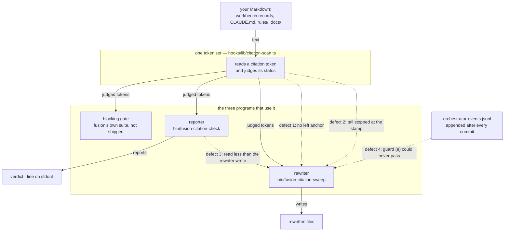

# Analysis: the four citation defects you reported, what shipped for each, and the one point still undecided

**Date:** 2026-08-30 22:41
**Type:** Document Study (report to a consuming project)
**Status:** Complete
**Requested by:** orchestrator, step 7 of `260830-1841_*_citation-mechanism-four-defect-repair.md`
**Filed by:** analyst, Kai Stalmann <ks@qantr.com>
**Audience:** a maintainer of the consuming project `unite-co-creator`, who has fusion installed and has not read fusion's own workbench

## Question

You reported four defects in fusion's citation machinery, worked around all four locally, and asked whether you can drop the workarounds. All four are repaired and committed here. This report says what each defect was, how it was measured, what shipped for it, what did not ship and why, and the one design point fusion has deliberately not answered, which is the one your own option waits on.

## Terms, before the short forms are used

fusion writes its bookkeeping as flat Markdown files under a directory called the **workbench** (`fusion-workbench/`). Each file is a **record**, and its name begins with a six-digit date and a four-digit time, the **stamp**, followed by a one-letter **state marker** between underscores and a slug: an open issue, an implemented decision, and so on. Records live in **stores**, which are the subdirectories that group them by kind (`issues/`, `planning/`, `decisions/`, `history/`, `analyses/`, `reviews/`). A store sits either inside `shared/` or inside a **Circle**, which is one unit of work with its own directory and its own set of stores. Three stores are **frozen**: `archive/`, `stashes/` and `.migration-v2-backup/` hold text that was moved there once and is not edited again.

A **citation** is one record naming another. The form fusion mandates is the bare basename with the marker position wildcarded, so a citation survives the cited record changing state. A citation that still carries its store path in front of the basename is a **store-prefixed** citation, and it is the shape the machinery is built to find and remove, because a record that moves between stores makes such a pointer wrong.

Three programs read that text, all through one tokeniser (`hooks/lib/citation-scan.ts`):

- the **reporter**, `bin/fusion-citation-check`, which prints figures and one row per violation and never fails a build;
- the **rewriter**, `bin/fusion-citation-sweep`, which rewrites store-prefixed citations to the mandated form, only when run by hand and only past three guards;
- a **blocking gate** inside fusion's own test suite, which is not shipped to you and never runs in your project.



## Scope

- Repository: fusion's own source, branch `main`, HEAD `5907b4ae` (2026-08-30), `## main...origin/main [ahead 7]`, one uncommitted path, the machine-written event log, which carries no Markdown and is outside every corpus named here.
- Commits studied: `d2e90ba9`, `cbc1d9fb`, `4cffcae4`, `32fe0d49`, `4412fc4a`, `5907b4ae`.
- Sources read: the six session histories those commits carry, the five decision records they answer or file, and the file headers of `hooks/lib/citation-scan.ts`, `hooks/citation-check.ts` and `hooks/citation-sweep.ts`.
- Your own figures are quoted as you measured them and are not re-derived here. fusion's figures were measured in fusion's own tree and say nothing about the size of the problem in yours.

## Findings

### Defect 1: the store segment had no left anchor

**Wider than reported.** You reported it against the record pattern. Three patterns lacked the anchor, not one: the record pattern, the Circle-directory pattern and the Circle's-own-record pattern. Two of the tokeniser's patterns, the ones that read a storeless basename and a bare stamp, had always opened with a lookbehind refusing a letter, a digit or a slash in front of the token. The three store-prefixed patterns never asked that question. So a store name was recognised wherever it stood, inside a longer word and behind a foreign path alike, and a directory called `circles` in somebody else's repository corrupted exactly as a directory called `issues` did.

The rewriter splices at the token's own column, so everything to the left of the store segment survived, glued to the rewritten basename. Two shapes of the result, fenced because they are exhibits and not pointers:

```
pytorch/<stamp>_*_x.md
my<stamp>_*_x.md
```

The second half of the defect is what made it expensive. Both results are invisible to the reporter afterwards, because the lookbehind on the storeless patterns refuses a stamp preceded by a letter or a slash. A pointer that had been reported as a violation stopped being reported at the moment it stopped being usable. You measured 468 such sites.

**What shipped** (`cbc1d9fb`). The three patterns take one shared left anchor and one shared rooting prefix, and the rooting prefix is a closed enumeration read off the documented workbench layout rather than guessed: an optional leading `./` or `../`, an optional `fusion-workbench/`, an optional archive sweep directory. A store-prefixed citation now begins at a non-path boundary and carries one of those rootings, or it is not a citation.

The enumeration also names the **bare Circle directory**, a record cited through its Circle's directory name without the literal `circles/` in front. You measured 150 occurrences of that shape; fusion's own tree has one. Naming it is what makes a token span its own rooting instead of producing two overlapping hits, and that is the part worth carrying away: **no repair inside the rewriting function could have worked**. That function cannot recover a path prefix the token never covered. The fix had to be in what counts as the token.

**Measured here after the change**, over fusion's own tree, same corpus and only the grammar different: `dangling` unchanged at 246, `store-prefixed` unchanged at 0, `resolved` down by exactly 1 (the single bare-Circle-directory site, which merges two hits into one), `tokens` down 54, and 53 of those 54 were exempt before, which is why no violation figure moved. The rewriter's dry run over that tree still reported `rewrites=0`.

### Defect 2: a bracket-marked citation was half-rewritten, not refused

Before fusion's v4 layout, a record carried its state marker in square brackets rather than between underscores. The record pattern's tail admitted no brackets, so a store-prefixed citation of such a name tokenised as the store segment plus the stamp, with the tail invisible. The rewriter then rewrote that half to the bare stamp and left the bracket tail standing beside it. The token had been a reported violation; afterwards the grammar produced no token for it at all, because the bare-stamp pattern refuses a stamp followed by `[`. A reported violation became one nothing reports.

The names are permanent where they matter most: `/fusion:migrate` converts the two live trees and deliberately does not convert the frozen stores, so a bracket-named record in a frozen store keeps that name for good. In your project: 21 such files under `archive/`, 205 under `.migration-v2-backup/`.

**What shipped** (`4cffcae4`), in two halves. The tail now admits brackets, so the token is read whole and stays reportable. Nothing else in the grammar learned the bracket form, so such a token is still never resolved, only reported. The stance is unchanged and sharper: a whole reported token is more pressure to migrate than half of one.

The second half is a guard on the rewriter rather than on the grammar. Every candidate rewrite is now scanned in isolation and applied only when that scan yields exactly one token covering the whole of the rewritten string, of a judged kind, not exempt. Otherwise the token is left exactly as it stands. The question is asked of the output, not of the shapes that produce it, so it subsumes the next escaping shape rather than the two known today. Cost, measured: about 48 microseconds per candidate rewrite, and a token the rewrite table leaves alone never reaches the guard at all.

### Defect 3: the rewriter's corpus was wider than the reporter's

The reporter dropped the three frozen stores; the rewriter filtered nothing. So the rewriter changed files the reporter then declared clean, and the disagreement sat inside one pair of programs rather than in any stated policy.

**What shipped** (`32fe0d49`): the exclusion list is deleted from the reporter, which now reads exactly what the rewriter reads. Four measurements settled it rather than an argument. fusion swept its own archive once already, 565 files in one commit, so the position had been overridden in practice without anyone stating it. The resolution index always walked the whole workbench with no filter, so the frozen stores were in-corpus for resolution and out-of-corpus for reporting in the same file. A store-prefixed citation inside an archived record is already dead, and rewriting it to the storeless form makes it resolve again. And your `.migration-v2-backup/` holds 0 store-prefixed citations across its 205 files, so the exception this was expected to need has no measured case.

**The blocking gate keeps all three exclusions, deliberately.** It is a different instrument. A gate reddens the test suite of somebody who compiled nothing, over text an archive sweep moved; a reporter costs its reader one row. That gate does not ship to you, so the distinction matters to you only as the reason the two corpora differ on purpose.

**What it costs, in fusion's own tree:** the corpus went from 1737 files to 2342 and `dangling` from 247 to 312. The rows were diffed as sets rather than assumed: 0 removed, 65 added, all 65 under the archive. `store-prefixed` stayed 0 and the verdict did not flip; it already read `violations`.

### Defect 4: the commit lock left the tree it had just committed dirty

fusion's commit helper appends a machine-written row to a tracked, append-only event log after the commit lands. Inside a session the work tree is therefore dirty from that instant, and the rewriter's first write guard, which refused a dirty tree, could never be satisfied.

**What shipped** (`d2e90ba9`), and it is not in the commit lock. The guard stopped testing a proxy. It asked "is the work tree clean" as a stand-in for the property it exists for, which is that a damaged rewrite has one revert back and that the run's diff is its own. It now asks that property directly: **does any uncommitted change name a file this run will read?** The rewriter computes its own corpus, so the test is exact, and it is computed once and handed to the guard so that the guard and the run cannot disagree. The event log is not Markdown, so it leaves the question by construction rather than through an exemption somebody maintains.

Say this part in your own notes if you were expecting the lock to change, because it did not, and the reason is specific. Three alternatives were considered and each gave up a property the lock's own rule mandates:

| alternative | what it gave up |
|---|---|
| emit the row before the commit | the row's measured commit hash and subject, neither of which exists yet, so the emission would have to predict from a command's text whether a commit will land |
| stage the row into the commit and amend | the hash the row just recorded, since amending changes it, and the single-author property of the staging list |
| write the row somewhere untracked | the log's whole value, which is that it travels with the repository and merges by union across checkouts |

The cost of the option chosen is stated rather than mitigated: an unrelated dirty file elsewhere in your work tree no longer refuses the run, so a person sweeping mid-edit sees the sweep's changes alongside their own in one working tree. The other two write guards are untouched, so the census is still printed and nothing is written without an explicit `--yes`.

Verified: with only the event log modified, the writing mode now reaches exit 5 (the census guard) instead of exit 4; with a Markdown record in the corpus modified, it still refuses with exit 4 and names that file alone.

### The tripwire, and why it is one property rather than a list of shapes

There was no test that would have caught any of this. **What shipped** (`5907b4ae`) is one property over a six-row fixture table: scan, rewrite, scan again, and every token that had a judged status before must still have one, matched by position within its line, so a token that vanishes fails as loudly as one whose status changes to something nothing judges. The table is data; the property is one loop, and there is no per-shape assertion beside it.

The demonstration is the point. Run against the grammar as it stood before these commits, **five of the six rows fail, and every one of them with the same transition**: a token that was `record` / `store-prefixed` becomes no token at that column. Three rows lose it because the rewrite spliced a storeless basename in behind a path fragment the token never covered. One loses it because the tail stopped at the stamp and the resulting bracket form is refused outright, which is not the demotion a reader would expect but an absence. The sixth row, a citation inside a frozen store, always held; it is in the table for corpus coverage.

An enumeration of shapes would have covered the two defects known and nothing else. The property covers the shape nobody has written a row for yet, which is why it is also the guard now standing inside the rewriter (defect 2, second half). The test cost 85 lines against a budget of 120.

## The one point fusion has not decided

**Should the citation helper read non-Markdown surfaces, with the stamp as the anchor?** Open, recorded as `260830-1844_*_does-the-citation-helper-read-non-markdown-surfaces-with-the-stamp-as-the-anchor.md`. Today the corpus is Markdown only: workbench records, `CLAUDE.md`, `rules/*.md`, `.claude/rules/*.md` and `docs/**/*.md`. A citation written into a `.py`, `.ts` or `.yaml` file is never reported when it dangles, never rewritten, and never counted. The roughly 950 citations you measured on code surfaces are what the answer turns on, and they are recorded in that record as your measurement.

The answer is not pre-empted here, and the record carries no recommendation. What it does carry is the shape of the difficulty, so you can judge how long the wait may be: fusion's only two signals for "this is an exhibit, not a pointer" are the fenced code block and the blockquote, and both are Markdown constructs. On a code surface neither exists, so every fixture string in a test file becomes a judged token unless something replaces them. The record notes that the question is answerable by measurement rather than by argument, by sampling your 950 tokens and asking per token whether a Markdown-shaped exemption would have been needed. If you can run that sample, it is the input the decision is waiting for.

## One further open question, filed while doing this work

`260830-2225_*_should-an-archived-violation-move-the-checkers-verdict-line.md`, open. Widening the reporter's corpus added 65 violation rows in fusion's own tree, all inside the archive, in text nobody will edit again. A violation nobody will repair cannot be acted on, so counting it changes what the one figure a reader acts on means.

The measurement that reshaped the question is worth passing on, because a project widening its own reporting should expect the same shape. Splitting all 312 rows (measured at `32fe0d49`) by whether anyone will ever edit the containing file:

| containing file | rows |
|---|---|
| under the archive, frozen, added by the corpus change | 65 |
| live, of a kind that carries no state marker at all (history 141, analyses 43, reviews 7) | 191 |
| live, carrying a terminal marker | 56 |
| live, carrying a live marker, so inside the blocking gate's corpus | 0 |

The four classes are disjoint and sum to 312. 256 of the 312 rows sit in text nobody will repair, and only a quarter of that mass is what the corpus change added. History files alone carry more rows than the corpus change contributed, and they were there before it. **Archived-ness is therefore not the criterion the question names**, which is why the record is open rather than settled by the obvious answer.

## Your own two notes, carried and not acted on

You reported two of your records going moot, and both are recorded here as yours rather than acted on.

The first is the exit code beside the stdout verdict, which you worked around by parsing the `verdict=` line. That reading is correct and is the shipped contract: no exit code of the reporter carries a verdict, and the same holds for the review-coverage and staging-drift helpers. Nothing changed there and nothing is proposed.

The second is the file-level declaration as a fifth exemption. It became unnecessary for you because you adopted fusion's citation form. A project unwilling to touch its legacy text would still need it. **fusion has built nothing for that and is not proposing to.** The related gap fusion did file is a different one: the tokeniser's fabricated-name exemption keys on the literal substring `foo`, so any probe fixture written to look realistic is judged like a real citation. Three writers in one session produced dangling rows that way. It is recorded as `260830-2235_*_the-fabricated-name-exemption-keys-on-the-literal-foo-so-every-realistic-probe-fixture-is-read-as-a-real-citation.md`, with no answer proposed, since an exemption that reads intent from a token is undecidable and any answer has to name a decidable property instead.

## What you get only after `fusion --update`

All five changes ship in `hooks/dist/` and in `bin/`. An installed copy is pinned for a whole session, so a session already running will not pick any of them up, and a `bin/` helper added between releases is absent from an installed copy until the update. Do this in order:

1. Run `fusion --update`.
2. Restart the session. A running one keeps the old compiled hooks and the old helpers for its whole life.
3. Re-run `bin/fusion-citation-check` over your project and keep the figures. Expect the file count to rise, since the frozen stores now enter the corpus, and expect added rows inside them.
4. Only then drop a workaround, and drop them one at a time against that reading.

**One thing the update does not do, and it is the one to check first.** These fixes prevent the corruption; they do not undo it. The rewriter's `--repair` pass covers three named classes from an earlier defect, a self-naming date field, a chained tail and a doubled marker, and the spliced-prefix shape from defect 1 is none of them (`hooks/citation-sweep.ts`, `## The repair pass`). *Inference, not verified against your tree:* if an earlier sweep already produced those 468 spliced sites in your files, your recovery path is your own git history, not a fusion helper. Measure before you assume either way, because a spliced token is invisible to the reporter by construction and will not appear in its rows.

## Implications

Three, in the order they will matter to you.

The rewriter can now run inside a fusion session, which it could not before defect 4's repair. That is the change most likely to alter your day-to-day, and it comes with a narrower guard: check your own work tree before running it, because fusion no longer checks the parts of the tree the run will not read.

The reporter's figures will move upward on your first run after the update, without anything in your project having got worse. The added rows are in frozen text. Treat the first post-update reading as a new baseline rather than as a regression.

The Markdown-only corpus stays as it is until the open record is answered, so any citation you keep on a code surface stays unmeasured. If the 950 you counted matter to your bookkeeping, the sample described above is the fastest way to move that record.

## Recommendations

- Update, restart, re-measure, and drop your workarounds one at a time against the new reading. The order is in the section above.
- Measure whether your tree already carries spliced sites from an earlier sweep before assuming the fixes cleaned anything up. They do not.
- If you can sample your 950 code-surface citations for whether each would need a Markdown-shaped exemption, send that measurement. It is what the open record is waiting for, and it is the only input named in it.
- Keep parsing the `verdict=` line. That contract is deliberate and stable.

## Filed Issues

None. Every actionable finding of this work is already a commit, a decision record or an issue, and refiling any of them would duplicate.

## Sources

- `260830-1841_*_citation-mechanism-four-defect-repair.md`, the plan whose steps 1 to 6 produced the commits studied.
- `260830-1934-sweep-dirty-tree-guard-narrowed-to-the-corpus.md` (defect 4), `260830-2153-store-prefixed-patterns-anchored-and-rooted.md` (defect 1), `260830-2206-bracket-citation-read-whole-and-the-visibility-guard.md` (defect 2), `260830-2214-checker-corpus-widened-to-the-frozen-stores.md` (defect 3), `260830-2225-analyst-frozen-stores-decision-and-residual.md` (the records), `260830-2228-the-tripwire-no-rewrite-hides-a-reported-token.md` (the tripwire).
- Decision records: `260830-1841_*_where-may-a-store-prefixed-citation-begin-and-which-rooting-forms-does-the-grammar-name.md`, `260830-1843_*_how-does-the-commit-lock-stop-leaving-the-tree-it-just-committed-dirty.md`, `260830-1816_*_do-the-frozen-stores-enter-the-sweeps-and-the-checkers-corpus-the-way-the-live-tree-does.md`, `260830-1842_*_may-the-grammar-resolve-a-bracket-marked-record-that-a-frozen-store-keeps-permanently.md`, `260830-1844_*_does-the-citation-helper-read-non-markdown-surfaces-with-the-stamp-as-the-anchor.md`, `260830-2225_*_should-an-archived-violation-move-the-checkers-verdict-line.md`.
- Issue: `260830-2235_*_the-fabricated-name-exemption-keys-on-the-literal-foo-so-every-realistic-probe-fixture-is-read-as-a-real-citation.md`.
- File headers: `hooks/lib/citation-scan.ts`, `hooks/citation-check.ts`, `hooks/citation-sweep.ts`.
- `260828-0859-citation-bookkeeping-defect-report-measured-against-fusions-own-corpus.md`, the earlier measurement of your first report.

## Open Questions

- [ ] Does the citation helper read non-Markdown surfaces, with the stamp as the anchor? `260830-1844_*_does-the-citation-helper-read-non-markdown-surfaces-with-the-stamp-as-the-anchor.md`. Open, no recommendation, waiting on a sample of your 950 tokens.
- [ ] Should an archived violation move the reporter's verdict line? `260830-2225_*_should-an-archived-violation-move-the-checkers-verdict-line.md`. Open, and its own measurement widened it.
- [ ] May the grammar resolve a bracket-marked record that a frozen store keeps permanently? `260830-1842_*_may-the-grammar-resolve-a-bracket-marked-record-that-a-frozen-store-keeps-permanently.md`. Open. Your 226 bracket-named files are counted; the number of citations of them is not, and the record asks for that measurement before an answer.
- [ ] Whether a project unwilling to touch its legacy text gets a file-level exemption. Not filed, not planned, recorded here as your note.

**Verification:** `cd hooks && npm test` exits 0, 47 test files, 806 of 806 tests passed, at 22:40 against HEAD `5907b4ae`. `bin/fusion-citation-check`, run from the repository root by absolute path, exits 0 and prints `files=2347 tokens=22181 judged=17650 resolved=16968 dangling=311 store-prefixed=0 undecidable=3157 exempt=1745 verdict=violations`, with no row naming this report. Every figure quoted from another agent's measurement is attributed to the session history that took it; nothing in this report was re-derived from memory.
