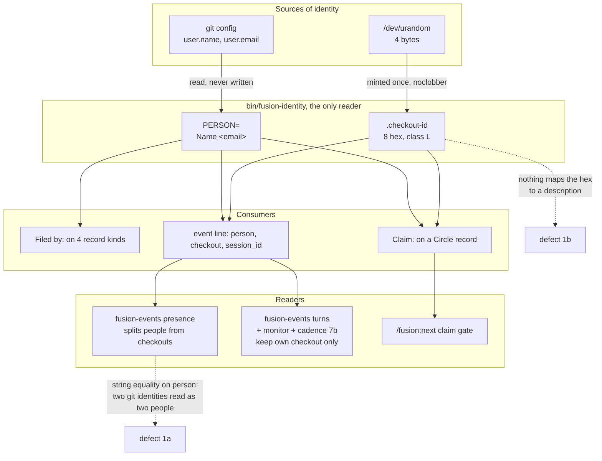

# Analysis: identity per local instance, and whether a tracked checkout registry earns its place

**Date:** 2026-09-04 10:58
**Type:** Feasibility / Gap
**Status:** Complete
**Requested by:** user, via orchestrator dispatch

## Verdict

**The parallel-orchestrator arrangement the user wants already works, and has worked since 2026-08-22. What is broken is narrower than the request implies and sits in two places, not four.** One person with two git identities is counted as two people by `bin/fusion-events presence`, which is a five-line comparison in one module. And the checkout identifier is a bare opaque token that names a machine and a folder to nobody, including its owner. Neither defect is repaired by replacing the identity model; both are repaired by giving the two keys that already exist an attribute table, which is exactly what the user's structure is if you read it as an addition rather than as a replacement.

**Read as a replacement it fails on one property: it has no join column.** The four fields the user proposes (petname, worker-id, gitname, person) contain nothing that joins a registry entry to the 280 event lines and the Circle claims already on disk carrying `checkout: 5e8248d7`. The existing eight-hex identifier is that column, and it has to be the fifth field.

**One of the four fields does not earn its place as specified.** `worker-id` = hostname + OS username + folder path is the derivation `bin/fusion-identity` already considered and rejected by name, on the property the field exists for. It survives only as an optional, opt-in, human-facing note, and it is the single field that puts machine and personal information into a possibly public repository.

We recommend **Option 1** below: one tracked file per checkout, keyed by the existing eight hex, in class R1 of the partition that is already in force. Nothing already written changes, one comparison changes, and every consumer falls back to today's behaviour when an entry is absent.

## Question

Does fusion's identity model, the git identity for attribution and a locally minted eight-hex identifier for the claim, support one person working several checkouts of one project across machines that carry different git configurations, and does the per-instance registry the user proposes repair what it does not?

## Scope

Read: `bin/fusion-identity`, `bin/fusion-events`, `hooks/lib/events-query.ts`, `bin/monitor`, `bin/fusion-session-mark`, `bin/fusion-commit-lock`, `hooks/hooks.json`, `hooks/session-start.ts`, `rules/fusion-workbench-conventions.md`, `rules/circle-records.md`, `rules/workbench-tracking.md`, `rules/critical-stance.md`, `skills/setup/SKILL.md`, `skills/next/SKILL.md`, `skills/cadence/SKILL.md`, `skills/memo/SKILL.md`, `skills/log-activity/SKILL.md`, `agents/orchestrator.md` (Setup step 2, event-log schema), the project `.gitignore`, and five prior-art stores named under `## Sources`.

Not read: the hook test suite, `agents/playmaker.md` in full, the marketplace repository.

**Git tree.** HEAD `cda72f71`, committed 2026-08-29 18:43 +0200, branch `main`, tracking `origin/main` with no ahead/behind divergence reported by `git status -sb`. Four workbench paths are modified or untracked in the working tree, all of them session state. Every present-tense claim below is dated by that commit.

**Measured in this tree, 260904:** `bin/fusion-identity` prints `PERSON=Kai Stalmann <ks@qantr.com>` and `CHECKOUT=5e8248d7`, exit 0. `fusion-workbench/orchestrator-events.jsonl` holds 2638 lines, of which 280 carry a `person` key and 280 carry a `checkout` key; both fields take exactly one distinct value across the whole file. `$USER` is `k1`; `hostname` is `k1i9`.

**One consequence of that measurement bears on everything below and is stated once.** The multi-checkout arrangement has never been exercised in this repository. Every claim about how two checkouts behave rests on the C1 measurement of 260822, which ran against scratch trees, and not on operating experience. That is a limit on the evidence, not a reason to distrust it: the C1 report tested identity by device and inode rather than by content.

## Findings

### 1. The defect, candidate by candidate

The Directive named four candidates. Three are real, one is not, and the one that is not is the one the request is built around.

#### 1a. One person, two git identities, read as two people: **real**

`presenceReport` classifies each other party by string equality on the git identity:

```
kind:
  identity.person === null ? "unknown"
  : line.person === identity.person ? "checkout"
  : "person"
```

(`hooks/lib/events-query.ts:260-266`.) A party classified `person` is added to a `Set` keyed by that string (`events-query.ts:293`), and `otherPeople` is that set's size (`events-query.ts:304`). One human whose laptop carries `ks@qantr.com` and whose desktop carries `kai@qantr.com` therefore produces `other_people=1` in each tree, and `/fusion:setup` Step 0c renders it as another person (`skills/setup/SKILL.md:152-155`).

This is not a latent risk. The decision that settled the identity model measured the two addresses coexisting in this user's own environment on 260824 and recorded the consequence in its own correction paragraph: "A person working from a second machine whose git configuration differs is read as somebody else, and `/fusion:next` refuses their own Circle. That is a false positive, not a detected conflict, and it is the one failure the refusal cannot tell apart from the collision it is built for."

**The chosen mitigation was a sentence, and the sentence is in force today.** `rules/fusion-workbench-conventions.md:449` reads: "One precondition, and no code checks it: a person uses the same git identity on every machine they run fusion from." The user is now telling us the precondition does not hold for how he works. A precondition that the person it binds cannot meet is not a mitigation; it is a deferred defect, and this Directive is the deferral coming due.

#### 1b. `checkout: 3f9a1c07` names nothing to anybody: **real, and narrower than stated**

`.checkout-id` is class L and never travels (`rules/workbench-tracking.md` `## The four classes`; `.gitignore:88-90`). The rule states its own reason: tracking it "would defeat the one collision the identifier exists to prevent, so it is the single class L entry whose classification is load-bearing rather than merely tidy."

The Directive asks whether a reader meeting `checkout: 3f9a1c07` can learn what that checkout is, who holds it, or where. The three halves of that question have different answers, and the difference matters for how much a registry buys.

| What the reader wants to know | Available today | From where |
|---|---|---|
| Who holds it | **Yes**, in both surfaces that show it | the `person` field travels beside `checkout` on every event line (`agents/orchestrator.md:103`, the `<ID>` fragment), and the claim's second literal opening is `Claimed YYMMDD-HHMM: <person>, checkout <id>.` (`rules/circle-records.md` `### The claim field`) |
| Which of that person's checkouts it is | **No** | nothing anywhere maps the identifier to a description |
| Where it physically is | **No** | the identifier is four bytes of `/dev/urandom` and carries no derivation (`bin/fusion-identity`, "Minting, and why it is minted at all") |

So the opacity is real but partial, and it is total in exactly one case: the claim field's third literal opening, `Claimed YYMMDD-HHMM, identity partial: CHECKOUT=3f9a1c07.`, written when the helper printed one half or neither. There the person is absent by construction and the reader has nothing at all. `rules/circle-records.md` already states that such a claim "shares nothing and matches no checkout, so the reader treats it as another party's and offers the override."

**What the identifier cannot answer is the user's second purpose exactly.** Two folders on one machine produce `5e8248d7` and, say, `b1f04a2c`, and no surface in fusion can say which is which. Their owner cannot say either.

#### 1c. Two checkouts of one project in two folders on one machine: **not a defect; it already works**

This is the finding that most changes the shape of the request, so we state the evidence before the conclusion.

The C1 measurement (`260822-2219-what-two-checkouts-of-one-project-actually-share.md`, since archived) tested every entry of the layout tree in two arrangements, a second full clone and a `git worktree`, by device and inode. Its verdict: "No second tree ever received the first tree's copy of any workbench file. A tracked entry arrives as an independent file, verified by device and inode and then by an append-and-compare write test; an ignored entry does not arrive at all."

Surface by surface, for two folders on one machine:

| Surface | Class | Collides? | Why |
|---|---|---|---|
| `.session-marker` | L | no | per workbench; `bin/fusion-session-mark` resolves it through `fusion-workbench-root` |
| `.active-circle` | L | no | measured `!!` (ignored) in both trees; both may hold the same Circle active and neither sees the other |
| `agentstate.yaml`, `orchestrator-live.md` | L | no | never travel |
| `.commit-lock/` | L | no | `bin/fusion-commit-lock:76` anchors `LOCK_DIR` at `fusion-workbench/.commit-lock` under the resolved workbench root, so two workbenches hold two locks. Each guards its own git index, which is what needs guarding |
| `.checkout-id` | L | no | minted independently in each |
| `orchestrator-events.jsonl` | R2 | on push, resolved by `merge=union` | the driver is declared by `/fusion:setup` Step 0h |
| Circle records, decisions, issues, plans | R1 | on push, at the `## Turn log` | measured: same-region edits conflict, different-region edits merge cleanly |
| the memo store's `memos-$USER.md` and siblings | R1 | **yes, and unresolved** | see finding 3 |

**The parallel-orchestrator case the user describes is possible today, unmodified.** What is missing is not capability. It is three other things, and naming them separately is what keeps the proposal from over-building:

1. **Legibility.** The identifier says nothing (1b).
2. **Attribution across identities.** One human reads as several (1a).
3. **Aggregation.** `/fusion:cadence` has no per-person grouping to aggregate *into* (finding 2).

The claim comparison is not on that list. It works: it compares on the halves both sides carry, and two checkouts of one person differ in the checkout half, which is precisely the collision it was built to catch (`rules/circle-records.md` `### The claim field`).

#### 1d. Does the exit-1 halt get worse under a registry? **It gets narrower, not worse**

`bin/fusion-identity` exit 1 is a git work tree whose `user.name` or `user.email` is unset, or a `git` that cannot be run. The caller halts and files nothing. The helper's header gives the reason in two clauses: "A tree that intends to commit and cannot is misconfigured, and a record filed from it would name nobody."

Under a registry, the second clause dissolves. The registry entry carries the person, so a record filed from a tree with no `user.name` would name somebody. The halt then rests on the first clause alone, which is about the tree's ability to commit and not about the record's ability to name its author.

`inference:` We judge the halt should stay, with its reason restated rather than removed. The whole design joins a record to the commits around it, and a tree that cannot commit produces records that never reach another checkout. But the restatement is a change to a rule that currently says something else, so it is the user's to take. Filed as a decision record.

`speculation:` A weaker halt would be more dangerous in one specific way. If the registry becomes an alternative source for the person, a misconfigured tree files records that look complete and are joined to no commit, and nothing downstream can tell them from records that are. We have not looked for a mechanism that would notice.

### 2. `/fusion:cadence` aggregates nothing per person today

The user's first stated purpose for the `person` field is aggregation for `/fusion:cadence`. That capability does not exist and is not degraded; it is absent.

`skills/cadence/SKILL.md:42` uses `$USER` for two filenames and nothing else: "`$USER` fixes the output filename `cadence-$USER.md` and the activity-log filename `activity-log-$USER.md`." The gathering step reads "every directory in `$SCAN_HISTORY`" with no author filter (`skills/cadence/SKILL.md:74`). The report has three sections (yesterday, last seven days, recurring themes by churn) and none of them groups by writer (`skills/cadence/SKILL.md:199-217`). One filter by identity exists in the whole skill, at Step 7b, and it filters by **checkout**, not by person: "drop rows whose `checkout` differs from `.checkout-id`" (`skills/cadence/SKILL.md:173`).

So in a project with two people, `/fusion:cadence` writes a file named after one of them containing everybody's work, with session-flow metrics computed over one checkout's event lines. That is coherent as a project digest read by one person. It is not the per-person aggregation the registry is meant to feed.

**The registry enables new work here rather than repairing existing work.** We state it plainly because it changes the cost estimate: the `person` field is necessary for the capability and nowhere near sufficient.

### 3. A defect found on the way: the tracked memo store is keyed by the OS account name

The memo store is class R1, tracked, and travels (`rules/fusion-workbench-conventions.md` `## fusion-workbench Layout`; `git check-ignore` reports the path as not ignored in this tree). Four filenames inside it or beside it are built from `$USER`:

- `memos-$USER.md` and `tasks-$USER.md` (`skills/memo/SKILL.md:33-34`)
- `cadence-$USER.md` (`skills/cadence/SKILL.md:177`)
- `activity-log-$USER.md`, in the project root rather than the workbench (`skills/log-activity/SKILL.md:34`)

R1's defining property is "many files, one writer each" (`rules/workbench-tracking.md` `## The four classes`). These four break it in both directions, and they break it on the exact grounds the identity decision used to reject `$USER` as an identity source: "`$USER` is not unique across several instances on one machine, and the git identity is not unique either when one person works from several checkouts or several computers."

Two people whose machines both call them `ubuntu` or `dev` write one tracked `memos-ubuntu.md` from two checkouts. One person whose two machines call him `k1` and `kai` gets two memo files and two cadence digests with no statement that they are one person's.

Filed as a defect. It is not caused by this Directive and it is not repaired by any option below unless one is chosen for it.

### 4. `git clean` silently orphans a checkout's identity

`rules/workbench-tracking.md` `## Two consequences` states: "An ignored path is skipped by `git stash --include-untracked`, but not by `git stash --all` or `git clean -xdf`." `.checkout-id` is ignored (`.gitignore:90`). `bin/fusion-identity` mints a fresh identifier whenever the file is absent, on first read, by design and for a stated reason ("a checkout set up under an older fusion would otherwise halt on every filing until Setup were re-run").

Composed: `git clean -xdf` in a live checkout deletes `.checkout-id`, and the next helper call mints a new one, silently. Every event line and every claim that checkout has ever written now cites an identifier no tree holds. `bin/fusion-events turns`, the monitor's own-checkout filter (`bin/monitor:1350-1357`) and `/fusion:cadence` Step 7b all read those old lines as another checkout's and drop them.

This is real today. A registry makes it worse in one way and better in another: worse because the orphaned identifier now also orphans a tracked registry entry that no local file points at; better because the entry is durable evidence that the identifier existed, which is more than the tree holds now. Filed as a defect.

### 5. What the current model is, drawn



The two dotted edges are the whole of what is broken. Everything drawn with a solid edge was measured working.

### 6. The proposed structure, field by field

#### The alias: per checkout folder, and the spec text conflates three things

The Directive asks whether the alias is per checkout folder, per machine plus folder, or per running session. The two stated purposes answer it, and they answer it the same way.

- **Per session** is ruled out by purpose 2, which wants to tell two long-lived workbenches apart, and by the multi-user spec's answer 8, which deliberately keeps the record-to-session join out of load-bearing use: "no capability walks from a record to a session." A session already has an identifier, `session_id` on the event line, written by `hooks/session-id.ts`, and it is not what a claim needs.
- **Per machine** is ruled out by purpose 2 directly: one machine holds n folders and the point is to distinguish them.
- **Per checkout folder** satisfies both purposes.

Per checkout folder is exactly the granularity `.checkout-id` already has, minted per workbench by a noclobber write. The user's structure does not need a new unit of identity; it needs a readable name for the unit that exists.

The conflation sits in the `worker-id` line of his sketch, which folds "which machine" and "which folder" into one value and then treats the pair as the identifier. Splitting them is what makes the rest of the design decidable.

#### The four fields, tested

| Field | Question it answers | Stable? | Key or attribute | What breaks when it changes |
|---|---|---|---|---|
| **petname / alias** | which checkout is this, in words | stable by choice, not by construction | **attribute**, see below | nothing, if it is an attribute. Everything already written, if it is the key |
| **worker-id** (host + user + path) | where is this checkout physically | **no**: dies on `mv`, on a rename, on a hostname change, on any container with an ephemeral hostname | **attribute only**, and optional | as an attribute, it goes stale in silence and misleads. As a key, the identity dies on a `mv` |
| **gitname / email** | which identity does this checkout commit and file under | stable per machine, not per person | attribute, and the one that carries new information | a new git identity is a **new entry** under the same person, which is correct rather than stale |
| **person** | which human, across identities and checkouts | free text; not unique in principle | key for aggregation, claimed by the human | a name change orphans the aggregation; at team scale, acceptable |

**`worker-id` as a key is the derivation the current design already rejected by name.** `bin/fusion-identity`'s header: "Hostname plus workbench path is the obvious derivation and was rejected on the one property the field exists for: it is unique only where hostnames are, and default hostnames repeat. A minted random value is unique by construction." Reintroducing it as a key would undo a decision taken on that property, with no new evidence. As an attribute it is harmless and mildly useful, and it is the only field carrying a privacy cost (finding 8). Our recommendation is that it is optional, opt-in, and never written by default.

**The alias must be an attribute, not the key, and the argument is backward compatibility rather than taste.** `rules/circle-records.md` states that records are not rewritten and that an absent claim field reads as `Unclaimed`; the event log is append-only with a union merge driver, so rewriting it is not available either. If the alias becomes the value written into `checkout:`, then `isOurs()` (`hooks/lib/events-query.ts:146-149`) compares the new spelling against 280 lines carrying the old one, and every one of them reads as another checkout's. `bin/fusion-events turns`, the monitor window and `/fusion:cadence` Step 7b would silently under-report from the switch point backward. That is repairable only by making all three readers resolve through the registry, which pays the lookup cost of the attribute design **and** buys the uniqueness problem on top.

**The missing fifth field is the join column.** The user's structure has no slot for the eight hex. Without it there is nothing joining an entry to what is already on disk, and no consumer can move from a record to a registry entry. It has to be the entry's key.

#### Who writes the identity-to-person mapping, and what happens before

It cannot be derived. Two git identities belong to one person because a human says so, and no input fusion holds carries that statement. So: **the checkout writes its own entry, at `/fusion:setup`, and the `person` value is typed or confirmed by the user in that one question.** One entry per checkout means one writer per file, which is the R1 property, and it means nobody ever edits somebody else's entry.

Before the claim is made, every consumer behaves as it does today: the person is the git identity, `presence` counts by that string, and the alias is absent. **That fallback is the property that makes the registry shippable at all.** It is strictly additive, and a project that never registers anything is a project running today's fusion.

#### Petname collisions

Two checkouts generate `brave-otter` independently. With the alias as an attribute of a hex key, the collision is cosmetic: two entries carry the same display name and the identifiers still differ, so no comparison anywhere is wrong. Detection is a glob over the registry directory, cheap enough to run at Setup. Enforcement is unnecessary and, in an eventually-consistent tracked store, not available: `/fusion:setup` in a tree that has not pulled cannot see an entry that has not been pushed. Reporting the collision and offering a rename is the whole mechanism, and it is the same shape as the claim field's stated limit: detected, not prevented.

`inference:` A generated default the user may replace at Setup beats pure generation. A human naming his own checkout produces "laptop" or "review-tree", which is what he wanted, and the collision surfaces at the moment of naming.

### 7. Transport: one file per entry, and why the other two shapes cost more

The registry is per project and lives in git, so it is a tracked file that every checkout writes to. Three shapes, and the failure mode of each is the concurrent case: two new checkouts registering and both pushing.

| Shape | Two concurrent registrations | Updates (a changed git identity) | Cost to the partition | Forecloses |
|---|---|---|---|---|
| **(a) One file per entry in a directory** | two different filenames; no textual conflict by construction | the owning checkout rewrites its own file; still one writer | joins class **R1** unchanged; no new class, no exception | an atomic single-file view (a glob is that view) |
| **(b) One line per entry, `merge=union`** | no conflict; both lines land | **cannot express replacement.** A changed identity appends a second line for the same checkout and nothing says which is current, unless every line is timestamped and readers take last-wins, which makes it a log rather than a registry | adds a **second** member to class R2, undoing a stated property of the current design | in-place correction; the "one file wide" property |
| **(c) One structured YAML/JSON file, ordinary text merge** | both append at the end of the file, same region, conflict | clean, when there is no conflict | R1 in name, but with R1's "one writer each" property broken | a machine-written file a human never has to resolve |

Shape (b) costs a property the project bought deliberately. The multi-user spec's `## The state partition` states it: "After C2 there is exactly one file in class R2, and it is append-only. Everything else either has one writer per file or never leaves the machine it was written on. The multi-writer risk of the whole design is therefore one file wide, which is what makes the rebuild small enough to specify." Adding a second R2 file spends that.

Shape (c) is the measured worst case. The C1 report tested exactly this pattern against the Circle record's `## Turn log`, which is appended at the end of a file by every session: "T2 push -> ! [rejected] ... T2 pull -> KONFLIKT (Inhalt) ... A person resolves it by hand." A registry conflicts on the same event the registry exists to make easy, namely somebody new joining.

**Shape (a) is what R1 already is.** It needs no merge driver, no lock, no ceremony, and it lands in the partition with no exception owed. The four classes still tile the layout tree, because a new store under `shared/` is R1 by the same reasoning as the shared decision store.

#### The local pointer, and whether it stays class L

A checkout learns its own entry from `.checkout-id`, unchanged, class L, unchanged. **The classification must not move**, and the reason is the one `rules/workbench-tracking.md` already gives: "a checkout that pulled another checkout's copy would carry that other one's identifier." That reasoning is not weakened by the registry; it is the reason the registry can have a durable key at all.

Two behaviours follow, and both are correct rather than tolerable:

- **After a fresh clone**, `.checkout-id` is absent, a new one is minted, and the clone registers as a new entry. A fresh clone in a new folder *is* a new instance, so a new entry is the right answer.
- **After `git clean -xdf`**, the same thing happens to a checkout that already had an identity, silently, and orphans its entry. That is finding 4, and it is a defect the registry does not cause and does not fix.

### 8. Privacy, stated

`worker-id` as sketched puts three things into a repository that may be public:

| Exposed | Example from this tree | Inference available to a reader |
|---|---|---|
| hostname | `k1i9` | often a real name (`kais-macbook-pro`), sometimes an employer's naming scheme |
| OS account name | `k1` | a second handle for the same person, joinable to other repositories |
| absolute folder path | `/Users/k1/Projects/productive/fusion` | the OS, the home directory layout, how the person organises work, and, across several entries, how many machines they have |

The eight-hex identifier exposes none of it, and a generated petname exposes none of it. So the design needs the alias to carry without the worker-id, and shape (a) gives that for free: the worker-id is one field in a file the checkout writes for itself, and omitting a field needs no switch.

**Hashing the triple is not the answer.** Its only value is being human-readable, and a hash of it is a second opaque token beside one that already exists. The disjoint choice is: written plain, or not written. We recommend not written by default, offered once at Setup, and the offer stating what it publishes.

### 9. The non-git case

`bin/fusion-identity` exit 4 is a tree that is not a git work tree: no identity is owed, the record carries the agent alone, and the person field is absent rather than empty. That support is deliberate and binding (`260824-0613_*_does-a-filing-agent-halt-in-a-tree-that-is-not-a-git-work-tree-at-all.md`, option 2).

A registry that lives in git has nothing to live in there, and the resolution is that it does not need to. The registry *file* is an ordinary file in the workbench's shared tree, which exists whether or not git does. What is absent is the transport, and with no transport there is exactly one checkout, so the registry has at most one entry and functions as a local nameplate: it names the checkout for the monitor and for `/fusion:next`, and it is read by nobody else.

Three properties follow, and together they mean the non-git case needs no special handling:

1. The registry is never required. Its absence is today's behaviour, which every consumer already implements as its fallback.
2. No halt is added anywhere. `bin/fusion-identity` exit 4 keeps its meaning: carry on, nothing is owed.
3. The `gitname` field is absent in such an entry, and absent is the honest value. `person` and `alias` are still writable, because both are the user's claims rather than reads of git.

### 10. Blast radius

| Surface | Reads today | Needs under the recommended option |
|---|---|---|
| `**Filed by:**` on 4 record kinds (`rules/fusion-workbench-conventions.md` `### Who filed it`) | `PERSON=`, git's `Name <email>` | **nothing.** The registry is a lookup table, not a substitute value. The written form is unchanged, so 146 records already carrying it stay valid |
| `**Claim:**`, three literal openings (`rules/circle-records.md` `### The claim field`) | person + hex, composed nowhere else | **nothing in the written value; a changed rendering.** `/fusion:next` resolves the hex through the registry so the refusal reads "held by Kai on `review-tree`" instead of "checkout 3f9a1c07" |
| the claim's two-half comparison | "at least one half shared and every shared half equal" | **nothing.** It compares on the hex, which is unchanged. Do not route it through the registry: a comparison that depends on a pulled file would fail differently before and after a fetch |
| `bin/fusion-events presence` / `hooks/lib/events-query.ts:260-266` | string equality on `person` | **the one changed comparison.** Same-person becomes "same registry person"; with no entry for either side, it falls back to string equality and behaves exactly as today |
| event line schema `person` / `checkout` / `session_id` (`agents/orchestrator.md:103`) | `$FUSION_PERSON`, `$FUSION_CHECKOUT`, `$FUSION_SESSION_ID` | **nothing, and deliberately.** Adding an alias field would put a resolvable value on 2638 lines; `rules/critical-stance.md` §2 rules out the duplicate, and a stale alias on an old line would be worse than an absent one |
| `bin/monitor` own-checkout filter (`bin/monitor:1350-1357`) | hex equality against `.checkout-id` | **nothing for the filter; optionally the alias in the header.** The filter must stay local: the monitor reads a class L file and must not acquire a dependency on a pulled one |
| `/fusion:next` claim gate (`skills/next/SKILL.md:202`) | claim vs. `bin/fusion-identity` | comparison unchanged; message resolves the hex |
| `/fusion:setup` Step 0i (`skills/setup/SKILL.md:336-345`) | mints, reports | **one added act:** register or refresh this checkout's entry, with the person question asked once and never again |
| `/fusion:setup` Step 0c presence report (`skills/setup/SKILL.md:152`) | `bin/fusion-events presence` | nothing of its own; it inherits the corrected count |
| `/fusion:cadence` | `$USER` for two filenames; no person grouping | **new capability, not a repair** (finding 2). Also the site of the `$USER` defect in finding 3 |
| SessionStart env exports (`hooks/hooks.json`) | `FUSION_PERSON`, `FUSION_CHECKOUT`, `FUSION_SESSION_ID` | optionally a fourth, `FUSION_ALIAS`. One `sed` line beside the three that exist |
| `bin/fusion-identity` | git config + `.checkout-id` | a third read, or a sibling helper. Keeping it in one place is what `rules/critical-stance.md` §2 asks and what the helper's own header claims for itself |

**Backward compatibility.** Every record and event line carrying `checkout: <8 hex>` keeps working with no migration, because the hex stays the key and every comparison stays on it. `rules/circle-records.md` already governs what happens to records written before a field existed: "A record written before this field existed carries no field at all, and is read as `Unclaimed`. Records are not rewritten, so there is no migration set and an absent field is not a defect to repair." The same rule covers a checkout with no registry entry, which reads as an unregistered checkout and renders as its hex.

**The one case where compatibility is not free** is the corrected `presence` comparison. A person who registers two identities changes what `other_people` counted yesterday, so a report run before and after registration gives different numbers over the same window. That is the correction landing, not a defect, and it should be stated at the site rather than smoothed over.

## Implications

**The request is smaller than it looks, and the part that is genuinely new is the aggregation, not the identity.** Two of the three things the user wants, parallel instances and telling them apart internally, are on disk and measured. The third, seeing a human's work across machines, needs a many-to-one map that only a human can write, plus a `/fusion:cadence` grouping that does not exist yet. Those are two separable pieces of work and they should not be bought as one.

**The withdrawal recorded on 260824 was right about the costs and wrong about one of them.** The decision names three: a tracked file with many writers; a person unable to file before enrolling; an entry going stale in silence. Shape (a) removes the first outright, one file per writer. The fallback-to-today rule removes the second: nothing blocks on an entry. The third is real and survives: an entry whose `worker` field describes a folder that has moved says something false and nothing notices. That is the strongest argument for that field being optional and for the alias, which cannot go stale, carrying the load.

**One question this analysis does not settle and should not.** Whether the registry is worth building at all depends on how many people and machines will actually touch this project. At one person and one checkout, which is the measured state of this repository, it buys a nicer name on a dashboard. The user is the only party who can price that, and the option set below is written so he can.

## Recommendations

### Option 1. Checkout registry as an attribute table, hex stays the key **(recommended)**

One tracked file per checkout under a new store, the memo store's sibling, one file per checkout named `<8hex>.md`, class R1. Fields: `checkout` (the hex, the key), `alias` (generated default, user may replace at Setup), `person` (the human's claim, free text), `git_identity` (recorded as read), `worker` (optional, opt-in, plain, never written by default). Written by `/fusion:setup` Step 0i, by the checkout it describes and by no other.

- **Buys:** purpose 2 fully, for every reader and not only the owner. Purpose 1's prerequisite, the identity-to-person map. A durable record that a checkout existed, which survives the `git clean` defect.
- **Costs:** one new store; one changed comparison in `events-query.ts`; one lookup in three renderers; one added Setup question. The `/fusion:cadence` grouping is separate work on top.
- **Forecloses:** an alias that survives losing `.checkout-id`. It also forecloses making the alias authoritative later without the migration this option was chosen to avoid.

### Option 2. Registry keyed by person, checkouts listed inside

One file per person, one per person, named by a slug, listing that person's git identities and checkouts.

- **Buys:** aggregation is a glob. Fewer files. The many-to-one map is stated in the shape it actually has.
- **Costs:** two checkouts of one person both write that person's file, so R1's one-writer property fails exactly where the design needs it, on the concurrent case. Resolving a hex means scanning every person file.
- **Forecloses:** the no-conflict-by-construction property that makes shape (a) cheap.

### Option 3. The alias becomes the identifier; the hex is retired

New records and event lines carry `checkout: brave-otter`. The registry maps alias to everything and keeps the retired hex for legacy joins.

- **Buys:** every surface is legible with no lookup. A reader with no registry at all still learns something from the value on the line.
- **Costs:** uniqueness becomes mandatory in an eventually-consistent tracked file, which is the enforcement problem the minted random value was chosen to escape. `isOurs()` breaks across the switch point, silently under-reporting `turns`, the monitor window and cadence Step 7b for every pre-switch line, repairable only by making all three readers registry-aware.
- **Verdict:** it pays Option 1's lookup cost and buys the uniqueness problem on top, for legibility Option 1 obtains by lookup. We do not recommend it.

### Option 4. No registry; repair the two defects narrowly

(a) One small tracked file mapping git identities to one person, read only by `events-query.ts`. (b) A local nickname beside `.checkout-id`, class L, never travelling, rendered by the monitor and `/fusion:next` for its own checkout only.

- **Buys:** purpose 1's prerequisite in full, at the smallest possible size. Purpose 2 locally: a person can tell his own two folders apart on his own screens.
- **Costs:** almost none. No new store, no Setup question, no privacy surface.
- **Forecloses:** anybody but the checkout's owner ever knowing which instance a claim or a presence line names. A colleague still reads `3f9a1c07`.

### Recommendation

**Option 1**, on three grounds. It reuses both keys that exist rather than minting a third, which is what `rules/critical-stance.md` §2 asks. It lands in class R1 with no exception owed, so the four-class partition still tiles the layout tree and nothing in `rules/workbench-tracking.md` needs a special case. And it is strictly additive: with no entry present, every surface behaves exactly as it does at HEAD, so it can ship without a migration and be adopted one checkout at a time.

**If the user's real horizon is himself on two or three machines and no second person, Option 4 is the honest answer and Option 1 is over-built.** The difference between them is whether somebody other than the checkout's owner ever needs to read the name. That is the question we cannot answer for him, and it is filed as a decision record.

Routing, if Option 1 is chosen: `shaper` for a Directive, then `planner`. The `/fusion:cadence` per-person grouping should be a separate Circle, because it is a capability rather than a repair and it can be priced on its own.

## Filed Issues

- `260904-1058_*_four-tracked-workbench-filenames-are-keyed-by-the-os-account-name-the-identity-decision-rejected.md`
- `260904-1058_*_git-clean-deletes-the-checkout-identifier-and-the-next-read-mints-a-new-one-in-silence.md`
- `260904-1058_*_cadence-names-its-report-after-one-person-and-reports-every-persons-work.md`

## Filed Decisions

- `260904-1058_*_does-fusion-gain-a-tracked-checkout-registry-and-in-which-shape.md`
- `260904-1058_*_is-the-checkout-alias-the-identifier-or-an-attribute-of-the-minted-one.md`
- `260904-1058_*_does-a-registry-entry-carry-hostname-account-name-and-folder-path.md`
- `260904-1058_*_does-the-identity-helpers-exit-1-halt-survive-a-registry-that-can-name-the-person.md`

## Sources

**Code and rules, at HEAD `cda72f71`:**
`bin/fusion-identity` (header: exit table, the minting rationale, the rejected hostname derivation) · `hooks/lib/events-query.ts:146-149, 236-310` · `bin/monitor:126-127, 1288-1359` · `bin/fusion-commit-lock:69-77` · `bin/fusion-session-mark:39-47` · `hooks/hooks.json` (SessionStart identity export) · `rules/fusion-workbench-conventions.md:23-80` (layout), `:403-450` (filing mandate, `### Who filed it`, the unchecked precondition at `:449`) · `rules/circle-records.md:171-240` (`### The claim field`) · `rules/workbench-tracking.md` (`## The four classes`, `## The event log carries a union merge driver`, `## Two consequences`) · `skills/setup/SKILL.md:128-155, 336-380` · `skills/next/SKILL.md:202` · `skills/cadence/SKILL.md:35-80, 173, 177` · `skills/memo/SKILL.md:33-37` · `skills/log-activity/SKILL.md:34` · `agents/orchestrator.md:103` · `.gitignore:74-98`

**Prior art:**
`260822-1136_*_spec-fusion-becomes-a-multi-user-tool.md` (answer table, `## The transport`, `## The state partition`, C1–C4) · `260822-1610_*_how-does-fusion-support-several-people-working-one-project-at-once.md` (including the 260822-2230 addendum) · `260822-1136_*_which-identity-does-an-attributed-record-carry-when-the-transport-is-git.md` (the answer of 260824, the registry withdrawal, and the measured correction) · `260822-2219-what-two-checkouts-of-one-project-actually-share.md` (§1 arrangement table, §2, §6, §7) · `260824-0530-record-attribution-and-circle-claim` (the Circle's whole store) · `260828-0044_*_thirty-four-of-sixty-two-records-filed-on-260827-carry-no-person-half-after-the-reach-was-settled.md`

**Commands run:** `bin/fusion-identity`; `grep -o '"person":"[^"]*"' … | sort | uniq -c` and the same for `"checkout"` over `orchestrator-events.jsonl`; `git check-ignore -q` on `.checkout-id`, `.active-circle`, `orchestrator-events.jsonl`, `shared/memos`; `git log -1`; `git status -sb`; `echo "$USER"`; `hostname`.

## Open Questions

- [ ] How many people and how many machines will actually touch a fusion project of the user's? Option 1 and Option 4 differ only on that, and nothing in the workbench answers it.
- [ ] Whether the `/fusion:cadence` per-person grouping is wanted at all, or whether the digest is meant to stay a project digest read by one person. The skill reads today as the latter and its filename as the former.
- [ ] Whether a project should be able to declare that it does **not** want a registry, the way `260825-1030_*_may-a-project-depart-from-the-four-class-partition-deliberately-and-say-so-once.md` lets a project depart from the partition. Not filed as a decision: it is only a question if Option 1 is chosen.
