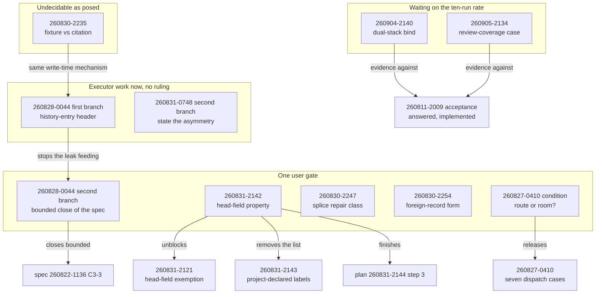

# Analysis: the nine open defect records after loop 1, and what loop 2 should do

**Date:** 2026-09-05 21:58
**Type:** Feasibility
**Status:** Complete
**Requested by:** orchestrator, session `260905-2008-orchestrator-session.md`
**Filed by:** analyst, Kai Stalmann <ks@qantr.com>
**Checkout:** 5e8248d7
**Cross-references:** `260905-2037-reconciliation.md` (the grouping this analysis tests) · `260831-2142_*_which-property-separates-a-head-field-identifier-from-a-head-field-citation.md` · `260831-2143_*_does-a-project-declare-its-own-identifier-head-fields.md` · `260811-2009_*_is-the-hooks-suite-meant-to-be-run-concurrently-with-itself-and-if-not-who-serialises-it.md` · `260822-1136_*_spec-fusion-becomes-a-multi-user-tool.md` · `260831-2144_*_repair-three-citation-grammar-defects.md`

## Question

Loop 1 closed fifteen defect records and left nine open, eight of which the reconciliation reported as unmovable by any dispatch. This analysis asks, record by record, whether the question each one poses is decidable from inputs the mechanism actually has, who can move it, and what it costs. It then says what loop 2 should do with the answer.

## Scope

The nine open records under `shared/issues/`, the two decisions blocking them, the spec and plan they belong to, and the code each acceptance turns on: `hooks/lib/citation-scan.ts`, `hooks/citation-sweep.ts`, `hooks/lib/review-coverage.ts`, `hooks/lib/__tests__/surface-growth-bound.test.ts`, `hooks/lib/__tests__/helpers/growth-bound.ts`, `hooks/lib/__tests__/monitor-warnings-panel.test.ts`, `hooks/lib/__tests__/review-coverage.test.ts`, `hooks/lib/__tests__/helpers/guard-harness.ts`, `hooks/scripts/run-tests.mjs`, `bin/monitor`, `rules/fusion-workbench-conventions.md`, `agents/coder.md`.

Read at HEAD `e9bd3e53`, committed 2026-09-05, branch `main`, `git status -sb` reporting `## main...origin/main [voraus 4]` with one modified file, `fusion-workbench/orchestrator-events.jsonl`, which is the machine-written in-flight log. Every present-tense claim below is dated by that tree. The checkout is four commits ahead of its remote and behind it in nothing, so no claim here is scoped to a stale view.

Not in scope: the ten-run suite measurement, which was running as this was written and was deliberately not duplicated. Its results are pre-routed under `## What loop 2 should do`, item 4.

---

## What loop 2 should do

**Stop trying to satisfy the Directive's first stop condition, and spend loop 2 on the four records the reconciliation misclassified plus one user gate.** Four of the eight records reported as unmovable are movable, three of them cheaply, and one of the two genuinely undecidable ones shares its mechanism with a fifth record that is currently classed as user work. The Coherence verdict at the end of loop 1 already recommended revising the Grounding rather than the Directive; this sharpens that into a specific sequence.

**1. Three executor dispatches that need no ruling at all.**

| dispatch | record | what lands |
|---|---|---|
| ontocoder or coder on `rules/fusion-workbench-conventions.md` | `260828-0044_*` first branch | a header template block under `## History Logging`, the way `## Decision Record Template` carries one |
| coder on `hooks/lib/citation-scan.ts` header | `260831-0748_*` second branch | the bracket asymmetry stated as a decision instead of standing as a consequence |
| coder on `hooks/lib/__tests__/` | `260827-0410_*` | the seven deferred dispatch integration cases, about 232 lines against 2 243 of remaining head-room |

The third is conditional on one word of the user's ruling, item 2 below, and the other two are not conditional on anything.

**2. One user gate, five questions, asked in a single pass.** Each carries a recommendation and the measurement behind it, and each is a paragraph rather than a document:

- **The head-field property** (`260831-2142_*`). The measurement that withdrew the recommendation on 260831-2215 is evidence *for* the fourth direction rather than against it. One answer here closes two open decisions, unblocks one defect and finishes a plan step. Details in `## Per-record findings`, first entry.
- **Is `260827-0410`'s condition the route or the room?** The record says "inside the growth bound after a cut". The room exists and the cut did not happen. Recommended answer: the room, because the instrument bounds the rate of addition and 232 lines inside 2 243 is exactly the addition it permits.
- **Which branch of `260831-0748`?** Recommended: the documentation branch, on a measured blast radius of 99 corpus rows and 13 blocking-gate rows for the other one.
- **The splice repair, `260830-2247`.** Recommended: take both halves of the acceptance, because the record supplies a disjoint cut it does not propose.
- **The foreign-record form, `260830-2254`.** Recommended: a writer-supplied qualifier, because the grammar already runs two exemptions of exactly that shape.

**3. One reframing to put to the user rather than a repair to dispatch.** `260830-2235_*` cannot be decided as posed, and `260828-0044_*` has a residue of the same shape. Both are cases where a rule that every agent already loads is missed at a measurable rate and the miss is found only by a later scan. The change of mechanism that answers both is to move detection from the scan to the moment the record lands. The precedent is in the tree already: `hooks/tracker.ts` speaks to the model on a narrow PostToolUse trigger when a review file lands.

**4. Apply the rate measurement mechanically.** The branches are pre-agreed under `## Per-record findings`, entries eight and nine, so the result needs no second analysis. The short form: a zero closes `260904-2140_*` and does **not** close `260905-2134_*`, because ten runs on a quiet tree do not sample the condition the second one failed under. A nonzero rate collapses both into one defect against the acceptance of `260811-2009_*`, which is answered and implemented and would then be incomplete.

**What loop 2 should not do.** It should not dispatch an executor at `260830-2235_*`, `260830-2254_*` or `260830-2247_*` before the gate, and it should not close any of the nine on a green suite run. Two of the records forbid that in terms.

### Where the nine records actually sit

The graph has one node with fan-out above two, `260831-2142`, and that is the finding rather than a drawing fault: a single unanswered predicate holds a defect, a second decision and a plan step. There are no cycles. The one edge that runs against the top-down grain is `260830-2235` to `260828-0044`, and it is not a dependency but a shared mechanism, which the prose states.

---

## Per-record findings

### 1. `260831-2142_*` and `260831-2121_*`: the withdrawal leaves one usable option, and it was never put to the user

**Verified.** `hooks/lib/citation-scan.ts:962-963` gates the `head-field` exemption on `kind === "stamp-bare" && isHeadFieldValue(before, after)`. `isHeadFieldValue()` at `:517` tests that everything left of the token is `**<Label>:** ` and everything right of it is blank. `grep -rn IDENTIFIER_HEAD_FIELDS hooks/` is empty, so nothing was built against any candidate.

**The finding.** The measurement appended on 260831-2215 refuted the field-label enumeration on one specimen: `**Session:**` carries `260829-1133-orchestrator-session.md`, a citation, and `260827-1838`, a timestamp, so the label cannot separate them. Those two values differ in **kind**. The first is a `bare-record` (it ends in `.md`); the second is `stamp-bare`, which the exemption already covers today. The specimen that killed the label therefore does not touch a rule keyed on the kind, and the kind separates precisely the pair the label could not.

**What a user needs in front of them.** One predicate, two numbers and one cost.

The predicate: in a head field whose whole value is the token, a `stamp-name` token is classified `undecidable` rather than `dangling`. It is decidable from the line's own text, because `isHeadFieldValue()` reads the label and the whole-value property with no lookup and `kind` is a shape property assigned at `:1066` from whether the stamp carries a dashed name. It is reuse rather than a new mechanism: `partition()` at `hooks/lib/citation-scan.ts:1377-1379` already places every `stamp-bare` token in `undecidable` *whatever it resolved to*, on the argument that such a token cannot answer "which of these is meant". A head-field `stamp-name` fails a neighbouring question for the same reason.

The acceptance constraint holds by construction. `**Active spec/plan:**` carries a `bare-record`, not a `stamp-name`, so it stays judged without an enumeration and without reading a resolution result. That is what separates this direction from option 2, which was rejected for reading the result.

The two numbers, re-measured at HEAD rather than taken from the record: **253 head-field lines outside `archive/` carry a whole-value `stamp-name` token, 296 including `archive/`, across nine labels, of which 276 are `**Circle:**`**. The decision record's figure of 249 over eight labels was measured on 260831 and has grown by four lines and one label since. On the other side, the reporting project's 20 rows clear with no configuration.

The cost the user is ruling on: those 253 lines move from `resolved` to `undecidable`, and a mistyped Circle name in a head field stops being reported. That is a narrower loss than option 2's, which would have silenced a broken `**Active spec/plan:**`.

**A second decision closes with it.** `260831-2143_*` asks whether a project may declare its own identifier head-field labels. Under a kind-keyed rule there is no list to declare against, so the record loses its subject. Its own reconciliation note anticipated this. One ruling therefore closes two decisions, unblocks `260831-2121_*` and finishes step 3 of plan `260831-2144_*`.

### 2. `260831-0748_*`: not undecidable, and the cheap branch is measured

**Verified.** The whole asymmetry is two characters. `hooks/lib/citation-scan.ts:319` defines `BARE_TAIL = recordTail("A-Za-z0-9_…*")` and `:326` defines `REC_TAIL = recordTail("A-Za-z0-9_…*\[\]")`. Since the 2026-09-05 repair both tails run through one `recordTail()` helper at `:314`, so branch one of the acceptance is a two-character edit to one constant.

**Why it should not be taken anyway.** I measured what widening `BARE_RE` would report. Bracket-marked storeless tokens in the `.md` corpus, classified by whether the line sits inside a fence or a blockquote:

| where | in a fence or blockquote | in bare prose |
|---|---|---|
| live workbench | 18 | 64 |
| `archive/`, which the checker reads like the live tree | 2 | 35 |
| `skills/migrate/SKILL.md` | 0 | 5 |

None of them can resolve: `find fusion-workbench -name '*[0-9][0-9][0-9][0-9][*'` returns zero files, because `/fusion:migrate` renamed every one of them. So widening the tail adds **99 dangling rows to the checker's corpus**, since the five in `skills/` fall outside it (`hooks/citation-check.ts:212-221` builds the outside-workbench half from `CLAUDE.md`, `rules/*.md`, `.claude/rules/*.md` and `docs/**/*.md`, and `skills/` is not in it).

Thirteen of those rows land in files the **blocking** gate reads: `260830-1842_o_*`, `260831-0748_o_*`, `260716-1847-workbench-umbau/_c_circle.md` and four `_i_` decisions inside that Circle. So branch one turns `npm test` red for everyone who pulls, over records nobody will rewrite, which is the cost class `CLAUDE.md` names under its three-gates entry. Branch two, stating the asymmetry in the grammar header as a decision, costs one edit and no rows. Recommend branch two.

**A by-product worth banking.** Open decision `260830-1842_*` stands with its recommendation "still asking for a citation count nobody has taken". The table above is that count. Loop 2 should append it there rather than leaving it to be taken a third time.

### 3. `260827-0410_*`: the room exists, the cut did not, and the condition is a conjunction

**Verified by measurement, not by reading the record.** Computed from the baseline maps in `hooks/lib/__tests__/surface-growth-bound.test.ts` against the checked-in golden, which the suite asserts equals the tree:

| surface | now | floor | growth | head-room | remaining |
|---|---|---|---|---|---|
| `agents/*.md` bytes | 411 882 | 399 843 | 12 039 | 18 000 | 5 961 |
| `skills/*/SKILL.md` bytes | 246 466 | 240 614 | 5 852 | 20 000 | 14 148 |
| hook-test lines | 21 023 | 20 766 | 257 | 2 500 | **2 243** |

`find hooks/lib/__tests__ -name '*.ts' | xargs wc -l` gives 21 023, matching the golden, so the surface is measured on the tree and not on a stale fixture.

The deferred work is the seven dispatch cases. The record states that the ten cases measured 285 lines together and that the three `fusion-commit-lock` cases which landed were 53, so the seven are about **232 lines**, roughly a tenth of what is left. `inference:` the 232 is arithmetic on the record's own two figures, not a count of code that exists.

**The condition is unmet on its letter and met on its substance.** The record asks for the cases "inside the growth bound after a cut". The room arrived at the 2026-09-05 merge re-baseline, event 3 in `hooks/lib/__tests__/helpers/growth-bound.ts` `## Re-baselining`, which is explicitly not a cut and which absolves what two lines of development had already added. So the user's question is one word: does "after a cut" name the route by which room arrives, or the room itself? Recommend the room. The instrument bounds the rate of addition, it never bounds a shrink, and 232 lines inside 2 243 is the addition it exists to permit. Nothing about event 3 grants the surface less than event 1 would have.

### 4. `260828-0044_*`: the first branch is executor work, and the leak is still running

The reconciliation put this record wholly in the user's column. Its **second** branch is the user's. Its first is not.

**Re-measured at HEAD**, over every `2609*` record in `issues/`, `decisions/`, `history/` and `reviews/` across the live Circles and `shared/`, `archive/` excluded: **99 files, 93 with a person half, of which 84 in the mandated form and 9 in the parenthesised spelling, and 6 with none**. All six are session-history entries. The reconciliation read 89 and 5 an hour and three commits earlier; the class is unchanged and the sixth entry, `260905-2110-coder-the-pins-entry-chain-recovers-its-three-breaks.md`, was written by this session during loop 1. The miss is not a historical residue. It is being produced now.

**Root cause, verified.** `rules/fusion-workbench-conventions.md:522` states the obligation for history entries in one sentence and gives no template block, while defect and decision records each get one. Of the fifteen agent prompts, `grep -ln "Filed by" agents/*.md` names exactly one, `agents/shaper.md`. `agents/coder.md:68` says only "Log to `$OUT_HISTORY` what you implemented" and prescribes no header at all, and every one of the six missing entries carries `**Agent:** coder` with `**Date:**` instead. So the fix is one authoring site, not fifteen prompt edits, and it fits: the always-on rule corpus had 5 332 bytes of its 12 000 left after loop 1's re-approval, read from the session log rather than re-measured here.

**The bounded-close branch, stated for a one-reading ruling.** Two questions, and the second is why this cannot simply be dispatched:

> Close `260822-1136_*_spec-fusion-becomes-a-multi-user-tool.md` at Bounded Closure with its criterion at `:181` named unmet: of 99 records filed in September, six carry no person half, every one a coder or bugfixer session-history entry. Everything else the criterion asks for is on disk.
>
> And rule on the second spelling in the same breath: nine of the 99 write `**Filed by:** coder (Name <email>, checkout <hex>)` where the rule states `**Filed by:** <agent>, <person>` with the checkout on its own line. They carry the person and the checkout, so they are not misses, but any reader or gate counting the mandated form reads them as absent. Is that spelling valid, or a defect to repair?

The second question is a decision rather than a closure, and the record asks for it to be settled in the same pass rather than met a third time.

### 5. `260830-2247_*`: the record supplies a disjoint cut and stops one sentence before proposing it

**Verified.** `hooks/citation-sweep.ts:513` types the repair class as `"date-field" | "chained-tail" | "doubled"`; `:526`, `:537` and `:540` are the three producers, and every one keys on a token that begins at a stamp and acquired a suffix. Nothing reads a prefix. The header documents the same three at `:231-243`.

**The finding.** The record's own analysis contains the answer it declines to propose. It says a letter-run fragment fused to a stamp is decidable, "since no legitimate rooting ends in a letter run", and that a foreign path segment is not obviously so. That is a disjoint and complete cut over the two shapes it named: a fourth repair class covers the letter-fragment case, and git covers the rest, documented where somebody about to run `--write` reads it. Both halves of the acceptance are then met, and neither half is an approximation of the other.

What makes this the user's call rather than a dispatch is that the second half is a written decision about a remedy, and the sweep is a program that rewrites a consuming project's records. Recommend: one decision record putting the split, and an executor dispatch behind it.

### 6. `260830-2254_*`: decidable, and the grammar already runs the pattern twice

**Verified.** The exemption chain at `hooks/lib/citation-scan.ts:936-964` runs **ten** reasons: `retired-layout-file`, `record-example-file`, `fenced-code`, `blockquote`, `announced-illustration`, `footer-template`, `placeholder`, `fabricated-name`, `glob`, `head-field`. The reconciliation note appended to this record on 260905-2015 says "seven reasons" and then lists nine, omitting `record-example-file`, which `git show 5b84b13a:hooks/lib/citation-scan.ts` confirms was present at the HEAD that note names. The number and the list are both wrong there. That is the second instance this session of a record's own cardinality drifting from its list, and it is worth correcting on the record because the argument the note is making depends on the chain being complete.

**The finding.** The record's direction 1, a writer-supplied qualifier, is not a new mechanism. `inAnnouncedIllustration()` at `:521` exempts a token the writer announced with `e.g.`, bounded by a `)`, a `;` or a sentence end, read entirely from the line's own text before any lookup. `inFooterTemplateSpan()` at `:499` does the same for a resolution-footer keyword inside a backtick span. A project qualifier in front of a basename is the third instance of a pattern the grammar already runs twice, and it satisfies the record's own §4 objection exactly: the marker is read before resolution, so a failed lookup is never the criterion.

So the question is not whether a decidable property exists. It is whether the vocabulary should spend a slot on the case. Recommend direction 1, on the record's own evidence that the shape arrives once per cross-project session and that the present workaround hides the pointer from the reader in order to satisfy a checker.

### 7. `260830-2235_*`: this cannot be decided as posed, and that is the result

**The verdict.** The acceptance asks that a writer may quote a probe or test fixture in running prose without producing a violation row, "and without the writer having to know that fencing is what makes it safe". Those two clauses together demand that two textually identical tokens receive different verdicts: one written as a fixture, one as a real pointer. No property of the text separates them. `rules/critical-stance.md` §4, third clause, applies without qualification, and no re-cut of the predicate produces one, because the distinguishing fact is the writer's intent and the writer did not express it.

**Verified.** `FABRICATED_NAME` at `hooks/lib/citation-scan.ts:490` is `/(?:^|[^A-Za-z0-9])foo(?:[^A-Za-z0-9]|$)/`, a word test on one placeholder. The 2026-09-01 repair at `7af91d5c` made it narrower, not wider, which the record's own reconciliation note states correctly.

**What has to change instead.** Drop the second clause and the question is already answered: five of the ten exemptions read a writer-supplied announcement, and fencing is one of them. The second clause is the whole difficulty, and the record's own evidence says where the mechanism must move. Six instances, four writers, and every one found by a scan after the fact. Every one of those writers had the instruction loaded, because `rules/fusion-workbench-conventions.md` `## Marker globs` is inside the always-on set that `bin/fusion-rules` emits to every agent. A rule that is loaded and missed at that rate is not fixed by more prose.

The answerable question is therefore: **can a writer be told at the moment the record lands rather than at the next scan?** The inputs exist. The file that just landed is available to the PostToolUse hook, and the checker that reads it already exists. The precedent is in the tree: `hooks/lib/review-coverage.ts` property 5 has the tracker speak to the model on a narrow trigger when a review file lands, and stay silent on every other tool call. `inference:` the same trigger shape applied to a record file that just acquired a citation the grammar reports is buildable from parts that all exist; I have not costed it, and the hook-test surface's 2 243 remaining lines would have to carry its cases.

**The coupling.** `260828-0044_*`'s residue is the same shape: `## History Logging` is always-on, every agent loads it, and six of 99 records miss it including one written tonight. One mechanism answers both records. That is the integral solution `rules/critical-stance.md` §2 asks for, and it is why these two should go to the user together rather than as two repairs.

### 8. `260904-2140_*` given a rate: the dual-stack bind

**What the record should become if the rate is zero.** Ten full-suite runs sample this case's condition, because the failure was observed in an ordinary run and the file has not been edited since (`git log` names three commits, the most recent `90c309ce` on 2026-08-27). A zero therefore bounds the rate below roughly one in ten, with the honesty a sample of ten deserves. Take the record's second acceptance branch: convert it to a written note saying what a session should do on seeing `ECONNREFUSED ::1` from this case, cite the bound, name the mechanism below, and close it `_c_`. Do not close it as fixed.

**What it should become if the rate is nonzero.** One bugfixer dispatch, with the mechanism named so the diagnosis does not start from nothing.

**The mechanism, read rather than reproduced.** `inference:`, and the label is load-bearing because I did not reproduce it. The case's readiness gate and its assertion do not use the same address family. `freePort()` at `monitor-warnings-panel.test.ts:89-104` proves a port free by binding `127.0.0.1` alone. The monitor under `bind: null` builds `DualStackServer(("::", PORT))` at `bin/monitor:1662` and, on `OSError`, falls back **silently** to `ReuseServer(("0.0.0.0", PORT))`, which is IPv4-only. In that state `127.0.0.1` answers and `::1` is refused, which is the exact failure recorded. The same file documents at `:113-137` that 42 orphaned monitors were once found alive across three days, and at `:144` that killing the wrapper alone "orphans a listening server and the next test's port scan meets a stranger", which is one way the `::` bind meets an occupied port while a v4 readiness poll is answered anyway.

**The fix is the one the governing decision already mandates.** `260811-2009_*` was answered option 2 and implemented at `332267a`: the load-sensitive cases must "wait on something observable". Here the observable already exists. `bin/monitor` writes `$URL_FILE` immediately after the bind, and the URL it writes follows the socket rather than a constant: `localhost` when the dual-stack bind succeeded, `127.0.0.1` when it did not (`bin/monitor:1695-1700`). The case can read the bind's own answer instead of inferring it from an IPv4 fetch.

### 9. `260905-2134_*` given a rate: the review-coverage case

**What the record should become if the rate is zero.** It should say that the measurement did not sample its condition, and it should stay `_o_`. Its single failure happened while a batch of eight parallel repairs sat uncommitted in the tree and two baselines had not been re-approved, which the record itself states as the reason it does not claim a flake outright. Ten runs on a quiet tree are not evidence about that condition. Either append the bound with the sampling gap named and leave the record open, or re-scope the measurement to reproduce the condition, which means running the suite while a build or a second suite run is in flight. That second form has a worked precedent: the reproduction in `260811-2009_*`, evidence of 260815-0850, is exactly that shape. Closing on a zero would be the move the record forbids in its own acceptance line.

**What it should become if the rate is nonzero.** Merged with entry 8 into one defect, not repaired separately. See below.

**One of its two readings is refuted.** `verified:` the case runs against a fresh throwaway root. `withRepo` is `withProject(fn, { git: true })` at `review-coverage.test.ts:56`, and `makeProject()` at `guard-harness.ts:348` creates it with `mkdtempSync(resolve(tmpdir(), "fusion-guard-"))`. Nothing in the case's path touches the live workbench, so the record's second reading, that it read the real review store while sibling agents wrote to it, can be struck.

**Where to look instead.** `speculation:`, and the label is honest because I found no way for it to produce the observed count. The one wall-clock coupling left in the path is the review-file window: `measureReviewCoverage()` at `hooks/lib/review-coverage.ts:519-523` bounds the review set to files whose `mtime >= floor`, where `floor` is the anchor commit's `%ct` in whole seconds multiplied by 1000. The fixture is written after the anchor commit, so the comparison should always admit it. That names where to look; it does not name a fault.

**If the rate is nonzero, both records collapse into one filing.** They are two instances of one governed question that already has an answer on disk. `260811-2009_*` stands `_i_`, answered option 2 and implemented, and its Constraints section states the property the answer had to preserve: "a red suite means your change broke something". A measured nonzero rate is evidence that the implemented answer is incomplete against its own acceptance. The correct filing is one defect against that acceptance carrying both cases as evidence, with the two records as its cross-references, followed by one bugfixer dispatch per case at the mechanisms named above. Filing two separate repairs would repeat the mistake that record was raised to end, which it says in its own Question section: "this is the third instance in one session, so it is time to answer it rather than repair each symptom."

---

## Implications

**The Directive's first stop condition is unreachable and the reason is now sharper than the reconciliation had it.** Seven records were reported as unmovable by any dispatch. Four of those seven are movable: two by an executor with no ruling at all, one behind a single-word scoping answer, and one behind a gate question that also closes a second decision. What is genuinely left for the user is five paragraphs, not five documents, and exactly one record in the whole corpus is undecidable as posed.

**The reconciliation's grouping failed in one direction only, and it is the expensive direction.** Every misclassification put a movable record in the unmovable column. Nothing moved the other way. `inference:` that is what a pass optimised for not overclaiming produces, and it is the safer failure, but it means the count of user work in the Coherence edge, seven of nineteen, overstates the gate by four.

**Two records are one problem.** `260830-2235_*` and the residue of `260828-0044_*` are both cases where a rule inside the always-on set is loaded by every agent and missed at a measurable rate, and where the miss is found only by a scan run later by somebody else. Six instances by four writers in one case, six of 99 records in the other, one of them written tonight by this very session. Neither is answered by more rule text, and the second one demonstrates why: the rule is already there, in one sentence, in a file every dispatch reads.

**A caution the session should carry into loop 2.** Three of the records I opened state a figure that does not hold. The reconciliation caught 181 against 35 in the pin chain. I found "seven reasons" against ten in the reconciliation's own note, and 249 head-field lines against 253 at HEAD. Every number in this report was taken from the tree at `e9bd3e53` rather than from a record, and loop 2 should do the same wherever a decision turns on one.

## Recommendations

| # | action | agent | blocked by |
|---|---|---|---|
| 1 | Put the five gate questions to the user in one pass, each with its recommendation | orchestrator | nothing |
| 2 | Give `## History Logging` a header template block | coder or ontocoder | nothing |
| 3 | State the bracket asymmetry as a decision in the grammar header | coder | recommendation 1, third question |
| 4 | Append the bracket-token census to `260830-1842_*` | orchestrator or reconciler | nothing |
| 5 | Correct the exemption-chain count on `260830-2254_*` | reconciler | nothing |
| 6 | Restate the seven deferred dispatch integration cases | coder | recommendation 1, second question |
| 7 | Write the head-field predicate into `hooks/lib/citation-scan.ts` and close plan step 3 | coder | recommendation 1, first question |
| 8 | Apply the rate result per entries 8 and 9 | orchestrator | the measurement in flight |

## Filed Issues

None. This analysis is read-only on every record it opened, per its dispatch. Recommendations 2 through 7 each correspond to an existing record and need no new one; the only new filing the analysis proposes is conditional, under entry 9, and belongs to the orchestrator after the rate is known.

## Sources

- `260905-2008-orchestrator-session.md`, `260905-2037-reconciliation.md`, both in the shared history store
- The nine open records under `fusion-workbench/shared/issues/`, read in full
- `260831-2142_*`, `260831-2143_*`, `260811-2009_*`, `260827-1756_*`, `260905-1810_*` under `shared/decisions/`
- `260822-1136_*_spec-fusion-becomes-a-multi-user-tool.md:181`, `260831-2144_*_repair-three-citation-grammar-defects.md`
- `hooks/lib/citation-scan.ts:314-326, 490, 499, 517, 521, 936-964, 1066, 1377-1379`
- `hooks/citation-sweep.ts:231-243, 513, 526, 537, 540`; `hooks/citation-check.ts:212-221`
- `hooks/lib/review-coverage.ts:390-430, 500-530`; `hooks/lib/citation-corpus.ts:44, 164, 174`
- `hooks/lib/__tests__/surface-growth-bound.test.ts:302-411`, `helpers/growth-bound.ts:26-90`, `fixtures/surface-growth.golden`
- `hooks/lib/__tests__/monitor-warnings-panel.test.ts:89-144, 1073-1100`; `review-coverage.test.ts:56, 168-188, 365-390`; `helpers/guard-harness.ts:158-183, 347-409, 552-562`
- `hooks/scripts/run-tests.mjs`; `bin/monitor:1577-1700`
- `rules/fusion-workbench-conventions.md:458, 462-497, 520-524`; `agents/coder.md:68`; `rules/critical-stance.md` §2, §4, §5
- Commands run at HEAD `e9bd3e53`: the per-surface growth arithmetic over the golden and the baseline maps; `find hooks/lib/__tests__ -name '*.ts' | xargs wc -l`; the bracket-token census with fence-state tracking over `fusion-workbench/`, `skills/`, `rules/`, `docs/`, `agents/`, `CLAUDE.md`; the head-field stamp-name line count with and without `archive/`; the September `**Filed by:**` re-measurement over 99 records; `git show 5b84b13a:hooks/lib/citation-scan.ts | grep -c 'record-example-file'`

## Open Questions

- [ ] Does "after a cut" in `260827-0410_*` name the route or the room? Recommended: the room.
- [ ] Is the parenthesised `**Filed by:**` spelling valid or a defect? Nine of 99 September records use it and no rule states it.
- [ ] Cost of the write-time detection mechanism proposed under entry 7. `inference:` buildable from parts that exist; not costed, and its test cases would draw on the hook-test surface's remaining 2 243 lines.
- [ ] Whether the ten-run measurement should be re-scoped for `260905-2134_*`, whose condition a quiet-tree run does not sample.
