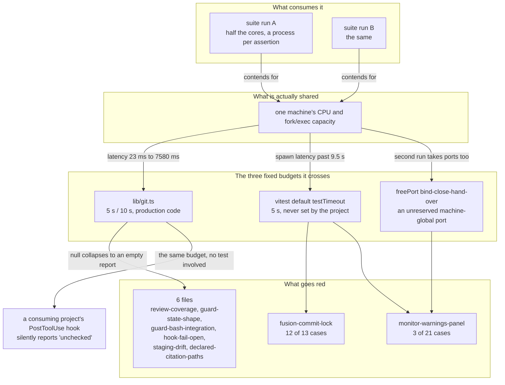

# Analysis: what shared state the hook suite reaches, and what the repair is

**Date:** 2026-09-06 00:26
**Type:** Failure Investigation
**Status:** Complete
**Requested by:** orchestrator, session `260905-2008-orchestrator-session.md`
**Filed by:** analyst, Kai Stalmann <ks@qantr.com>
**Checkout:** 5e8248d7
**Cross-references:** `260905-2356_*_the-hook-suite-is-not-isolated-from-a-second-copy-of-itself-and-fails-at-forty-percent-under-one.md` (the record this answers) · `260811-2009_*_is-the-hooks-suite-meant-to-be-run-concurrently-with-itself-and-if-not-who-serialises-it.md` (answered option 2, implemented at `332267a`) · `260904-2140_*_monitor-warnings-panel-test-fails-intermittently-on-the-dual-stack-bind.md` · `260905-2134_*_review-coverage-test-fails-in-a-full-suite-run-and-passes-in-isolation.md` · `260905-2158-the-nine-open-defects-after-loop-1-and-what-loop-2-should-do.md` (whose entries 8 and 9 pre-agreed the two branches this result does not fit)

## Question

The isolation record measures a 40 percent red rate for `npm test` under a second concurrent copy of itself and zero when alone, names six test files, and infers that four of the six reach a shared path rather than a private temporary one. This analysis asks, file by file, what state each one touches that another process could be touching at the same moment; whether the inference holds; what the repair is and what shape it has; and which of the record's two acceptance routes to take. It then says what the two rate-conditioned records should become, given a result that fits neither branch the previous analysis pre-agreed.

## Scope

Read: `hooks/lib/__tests__/` (the eight named files and `helpers/guard-harness.ts`, `helpers/citation-scan.ts`), `hooks/vitest.config.mjs`, `hooks/scripts/run-tests.mjs`, `hooks/scripts/build.mjs`, `hooks/lib/git.ts`, `hooks/lib/review-coverage.ts`, `hooks/lib/staging-drift.ts`, `hooks/lib/citation-scan.ts`, `hooks/tracker.ts`, `hooks/node_modules/tsx/dist/` (the transform cache), and the two loop-2 history files.

Ran: seven full `npm test` runs and 640 timed `git log` invocations. What was run is separated from what was read at every claim below, and the `## What was run` section states the conditions.

Git tree: HEAD `1b305c97`, committed 2026-09-05 23:22:51 +0200, branch `main`, `git status -sb` reporting `## main...origin/main [voraus 8]` with one modified file (`fusion-workbench/orchestrator-events.jsonl`, the machine-written in-flight log) and the isolation record itself untracked. Eight commits ahead of the remote and behind it in nothing, so no present-tense claim here is scoped to a stale view.

**HEAD moved under this pass.** At 00:30, after every measurement here was taken, the orchestrator committed the isolation record as `aacf0554` and appended a further section to it in the working tree. Every reading above and below was taken at `1b305c97` and none of them touches a file that commit changed, so nothing here is restated against the newer tree. The appended section is answered in finding 7, which is the only part of this report written after the move.

---

## Findings

### 1. The record's inference is refuted, for all eight files

**`verified:` no file in the affected set reaches a shared path, a shared directory name or the real workbench.** Every one of the eight builds its own root with `mkdtempSync` under `os.tmpdir()`:

| file | its root | read at |
|---|---|---|
| `guard-state-shape` | `withProject` → `makeProject` | `helpers/guard-harness.ts:348` |
| `staging-drift` | `withProject`, plus its own `mkdtempSync` for the no-workbench case | `staging-drift.test.ts:490` |
| `declared-citation-paths` | own `mkdtempSync(join(tmpdir(), "declared-"))` | `declared-citation-paths.test.ts:17` |
| `guard-bash-integration` | `withProject` | `guard-bash-integration.test.ts` throughout |
| `fusion-commit-lock` | own `mkdtempSync(join(tmpdir(), "fusion-commit-lock-test-"))` | `fusion-commit-lock.test.ts:149` |
| `monitor-warnings-panel` | own `mkdtempSync(join(tmpdir(), "fusion-monitor-"))` | `monitor-warnings-panel.test.ts:80` |
| `review-coverage` | `withProject(fn, { git: true })` | `review-coverage.test.ts:56` |
| `hook-fail-open` | `withProject` | `hook-fail-open.test.ts` throughout |

The shared build output that the previous round of this question was about is also genuinely closed. `scripts/build.mjs` compiles to a private staging directory and replaces `hooks/dist/` file by file with `rename(2)`; `scripts/run-tests.mjs` keeps that staging tree alive and names it in `FUSION_TEST_DIST`, so no case reads the content of the shared `hooks/dist/` at all. `committed-dist.test.ts`, which looks like the obvious remaining reader, extracts the committed tree with `git archive` into its own temp directory and compiles into its own `--outDir`; its header at `:51` states that it does so precisely because `hooks/dist/` and `hooks/.build-staging/` are shared. The prune in `syncIntoDist` removes a `dist/` entry only when this build did not emit it **and** its TypeScript source is absent from the tree, so two runs over one source tree agree on the end state whichever finishes last.

So the answer to the question the record asks is: **the suite reaches no shared state that another copy of itself is holding.** What it shares with a second copy is the machine, and that turns out to be enough.

### 2. What actually fails: fixed wall-clock budgets crossed under contention

**`verified:` reproduced.** Six concurrent runs (three pairs) at HEAD `1b305c97` produced two red runs, both failing the same case with the same message:

```
FAIL  lib/__tests__/review-coverage.test.ts > review coverage: the declared
      out-of-scope list > finds a review inside a Circle's own store, not only the shared one
AssertionError: expected 'unchecked' to be 'covered'
  ❯ lib/__tests__/review-coverage.test.ts:543:27
```

`unchecked` is not a race artefact. It is what `measureReviewCoverage()` returns when `windowCommits()` gets `null` back from the shared git wrapper (`hooks/lib/review-coverage.ts:431-434`, `:516-519`). `hooks/lib/git.ts:65-80` collapses **every** way git can decline into `null`, and its own docstring at `:62-63` enumerates them: not a repository, a ref that does not resolve, a non-zero exit, **the timeout**. The budget is `GIT_TIMEOUT_MS = 5_000` (`lib/git.ts:55`).

**`verified:` the budget is crossed.** Sampling `git log --format=%H HEAD~5..HEAD` on a six-commit scratch repository, 40 samples on a quiet machine and 600 samples across three concurrent pairs:

| condition | samples | max | over 3 s | over 5 s |
|---|---|---|---|---|
| quiet | 40 | 23 ms | 0 | 0 |
| two concurrent suites | 600 | 7580 ms | 4 | 1 |

A 330-fold degradation, with zero spawn errors recorded, so this is latency and not `EAGAIN` on `posix_spawn`. One git invocation in 600 crossed 5 seconds under exactly the condition the record measured. The suite issues that call many hundreds of times per run, `inference:` which is why a per-call rate of roughly one in six hundred produces a per-run red rate in the tens of percent.

**`verified by reading:` the same wrapper is the failure path of five more files.** Each of these asserts on a report that a `null` from `git()` empties:

- `guard-state-shape.test.ts` asserts the coverage sentence reached stdout (`COVERAGE_SENTENCE_MARKERS`), which is emitted only when the report has a gap to name.
- `guard-bash-integration.test.ts:330` asserts the event rows are exactly `["guard_allow", "review_coverage"]`. A `null` from git removes the second element.
- `hook-fail-open.test.ts` uses the same coverage probe (`openCoverageGap`) as its subject-carrier.
- `staging-drift.test.ts` asserts on `measureStagingDrift`, whose `git rev-parse` takes the default 5 s and whose `git status --untracked-files=all` takes `GIT_STATUS_TIMEOUT_MS = 10_000` (`lib/staging-drift.ts:148, :496-508`). Either `null` returns `EMPTY(root, why)`.
- `declared-citation-paths.test.ts` calls `declaredCitationFiles()` in-process, which returns `unavailable: true` the moment `git(projectRoot, ["rev-parse", "--show-toplevel"])` is `null` (`lib/citation-scan.ts:1358-1361`), and all three of its cases then assert against an empty result.

**That is six of the eight files failing through one function.**

### 3. The other two files fail on a timeout the suite never set

**`verified by reading:` vitest's default `testTimeout` is 5000 ms** (the installed vitest 2.x CLI help text, `node_modules/vitest/dist/chunks/cac.CB_9Zo9Q.js:1108`), and `hooks/vitest.config.mjs` sets `pool` and `poolOptions` only. It sets no `testTimeout`.

- `fusion-commit-lock.test.ts` has 13 cases and exactly **one** carries an explicit budget (`30_000`, at `:338`). The other twelve, including every case that spawns the bash lock script and waits on its output, run on the 5-second default. The file's own header at `:80-84` says "the only deadline left is the vitest case timeout, which is a deadlock guard rather than an assumption about how fast the lock is." At 5 seconds it is exactly an assumption about how fast the lock is, and one this project has already measured to be false: `vitest.config.mjs:26-30` records an instrumented bash-to-first-`mkdir` latency of **9.5 seconds in a run that passed**. The event-based repair that record 260810-1135 earned was correct and it landed on top of a budget nobody noticed was still there.
- `monitor-warnings-panel.test.ts` has 21 cases; 18 carry `30000` and the three at `:1129`, `:1133` and `:1137` do not. All three call `servedEvents()`, which starts a real python monitor and polls it. They run on the 5-second default while spawning a server.

**`verified by reading:` `monitor-warnings-panel` additionally holds the one genuinely shared machine namespace in the set.** `freePort()` at `:88-104` binds `127.0.0.1:0`, reads the assigned port, closes the socket, and hands the number to a monitor that binds it later. The port is machine-global and unreserved in that window. The file's own comment at `:46-52` accepts the window as "microseconds"; a second suite doing the same thing widens the target rather than the window. `260904-2140_*` names the sharper form of it: the readiness probe and the bind do not use the same address family.

### 4. The scope of the untimed-case problem is much wider than these two files

A grep for cases that spawn a subprocess and carry no explicit budget names **twenty** files, `fusion-commit-lock` and `monitor-warnings-panel` among them. `citation-sweep.test.ts` (17 cases), `fusion-events.test.ts` (27), `record-counts-measurement.test.ts` (19) and `fusion-count-sources.test.ts` (18) are all in it. `inference:` the observed failure set is narrower than the exposed set because those files' subprocesses are cheaper, not because they are protected. That is what the record means when it says the affected set is wider than any single run shows, and it is why the set looked inhomogeneous: it is a sample from two overlapping exposures, not a category.

### 5. The production consequence, which is larger than the test flake

**`verified by reading:` `lib/git.ts` is production code and both its callers run inside the PostToolUse hook.** `hooks/tracker.ts:305-330` runs `measureReviewCoverage` when a review file lands and `measureStagingDrift` when HEAD has moved (`:208-212`). The 5-second budget therefore applies on a consuming project's machine, under exactly the load fusion itself creates when the orchestrator dispatches executors in parallel batches.

What happens when it is crossed there is silent and indistinguishable from a real answer. `git()`'s contract is deliberate about this: `null` means "git would not say", and each caller renders it as its own honest sentence. But `verdict=unchecked` and `git status could not read fusion-workbench` read to a session as facts about the repository, not as a report that timed out. A real coverage gap goes unreported, once, on the loaded tool call, and the throttle then treats the empty signature as the state it compares against.

So the suite is not merely flaky. **It is the only instrument that reports a production budget that is too tight for a loaded machine**, and it reports it by going red. That reframes the choice between the record's two acceptance routes, and it is the single most important thing in this report.

### 6. `run-tests.mjs` and the shared `hooks/dist/` sync

The task asked whether the sync is part of the problem. **It is not, for any observed failure**, and the coder who compiled into a private staging directory this session was avoiding a hazard the build already handles.

- With unchanged sources, `syncIntoDist` compares content and skips every file (`build.mjs:177`), so two runs write nothing.
- With changed sources, run A's sync does place A's build in the shared `hooks/dist/`. No case in the suite reads that tree's content: the two that spawn or copy a compiled artifact read `FUSION_TEST_DIST`, and `committed-dist.test.ts` reads a `git archive` extraction. The one remaining reader is `reference-resolution-lint`'s `existsSync`, which an atomic rename never makes momentarily false.
- `speculation:` the residual is a false **pass**, not a false failure: if run A adds a new module, run B's existence check can resolve a citation of a file B's own build did not emit. Nothing observed it and I did not construct it.

### 7. The index-lock manifestation the record appended, and why its inference is wrong

The section appended to the record at 00:30 reports a `git commit` refused with git's index-lock message, succeeding on an immediate retry, and infers that "several of the tests in the affected set run git themselves" held the index.

**`verified by reading:` that inference does not hold.** Every git call in the suite runs against a temporary repository except four, and all four are read commands that take no index lock: `git rev-parse HEAD`, `git archive` and `git ls-files bin/` in `committed-dist.test.ts` (`:152, :172, :322`), and `git show <commit>:agents/orchestrator.md` in `record-counts-measurement.test.ts` (`:200-201, :222`). The suite cannot have held `index.lock` in this checkout.

**`verified by reading:` the family that does hold it is `git status`.** Git takes an optional index lock to write back the refreshed stat cache, which is what `--no-optional-locks` and `GIT_OPTIONAL_LOCKS=0` exist to suppress (`git(1)`, `--no-optional-locks`). Two things in this session ran one against this checkout at around that time: `hooks/tracker.ts`'s staging-drift measurement, which runs `git status --porcelain --untracked-files=all` on the tool call where HEAD moved (`lib/staging-drift.ts:502-508`), and this analysis, which ran `git status -sb` twice. `inference:` one of those two, and I cannot separate them after the fact.

**The record's conclusion survives its inference, and gets sharper.** The contention genuinely is not confined to the suite, and the commit lock genuinely does not help. But the contending party is a **read-only status call**, which is the part worth carrying: fusion's own PostToolUse hook runs one against the project on every commit-bearing tool call, and a reader that looks like it takes no lock does. `GIT_OPTIONAL_LOCKS=0` on that call is a one-line change with no behaviour cost, and it belongs with change 2 rather than with the suite.

### The causal shape



The graph carries no cycle, one fan-in node that is the finding itself, and one edge that leaves the test surface entirely, which is finding 5.

---

## What was run

Seven full `npm test` runs at HEAD `1b305c97` and 640 timed git invocations, on 2026-09-06 between 00:06 and 00:24, in this order:

1. One run alone. Green, 51 files, 877 tests, 47.5 s wall clock. No vitest process was running when it started; machine load average 5.36 on 16 cores, from two idle Claude sessions and a terminal.
2. Three pairs of concurrent runs. Pair 3 went red in both halves, on the same case, with the message quoted in finding 2. Wall clock per run rose from 47.5 s to 84 s.
3. Three further pairs with a git-latency sampler alongside. All six green; the sampler produced the 600 loaded samples in finding 2.
4. Forty quiet samples for the baseline, after the runs finished.

**Two of twelve concurrent runs red, 17 percent.** That is lower than the record's 40 percent over twenty and I do not claim it corrects it: twelve runs is a small sample, my last three pairs carried a sampler that took a little CPU away from them, and the record's own machine conditions are not reproducible after the fact. The two figures are the same class of measurement and the record's is the larger sample.

**The subject of this analysis is a measurement concurrency corrupts, so:** everything in step 1 and step 4 ran with nothing else of mine in flight; steps 2 and 3 are the concurrent condition itself and are reported as such. Nothing was edited in the repository. `syncIntoDist` wrote nothing, since the sources were unchanged, and `git status` is unchanged from the tree state named under Scope.

---

## Implications

**The record's title is right and its subtitle is wrong.** The suite is not isolated from a second copy of itself, which is the observation. But it is not because the suite reaches shared state. It is because the suite's cost model is one subprocess per assertion, and three fixed wall-clock budgets sit close enough to the loaded distribution to be crossed. "Isolate the test" is therefore the wrong repair for seven of the eight files, and following the record's inference would have sent an executor looking for a shared path that is not there.

**One of the three budgets is not a test-hygiene problem at all.** Finding 5 is the finding: `lib/git.ts`'s budget ships, runs in a consuming project's hook, and fails silently into a well-formed sentence. The suite going red is that fault reporting itself. Declaring the suite single-instance would switch the instrument off and leave the fault.

**The previous round's repair was correct and incomplete, and the incompleteness is legible.** `260811-2009_*` was answered option 2 and implemented at `332267a`. Everything that record's evidence named is genuinely fixed: the shared `dist/` delete, the two wall-clock-bound cases it knew about. What it did not reach is the budget inside the code under test and the twelve cases that quietly inherit a framework default. The Constraints section of that record states the property to preserve, "a red suite means your change broke something", and against that acceptance the implemented answer is incomplete rather than wrong.

---

## Recommendations

### The route: repair, not a single-instance declaration

Take the record's first acceptance branch. Four reasons, in order of weight:

1. **The single-instance route silences a production fault.** Finding 5. A note telling sessions how to recognise this failure would be a note telling them to ignore the only report fusion has that its own hook budget is too tight.
2. **It reverses an answered decision.** `260811-2009_*` stands `_i_`, answered by the user as option 2, and its rejected option 1 costs the executor verification contract in `agents/coder.md` `### Report shape`. Reopening that is the user's trade, not a consequence of a measurement.
3. **It would not work.** That record's own 260811-2330 evidence establishes that a single `npm test` is already a concurrent run of itself, because vitest runs its files in parallel workers. Serialising sessions does not serialise workers, and the budgets are crossed by worker load.
4. **The repair is small.** Three changes, one of them one line.

### The shape: three changes, not one and not six

| # | change | file | reaches | needs a ruling |
|---|---|---|---|---|
| 1 | set an explicit `testTimeout` (30 s, matching `CASE_TIMEOUT`) | `hooks/vitest.config.mjs` | `fusion-commit-lock` (12 cases), `monitor-warnings-panel` (3), and the untimed subprocess cases in 18 further files | no |
| 2 | make the git budget survive a loaded machine | `hooks/lib/git.ts` | six of the eight files, **and the production hook** | yes, see below |
| 2b | pass `GIT_OPTIONAL_LOCKS=0` on the staging-drift status call | `hooks/lib/staging-drift.ts:502-508` | the index-lock contention in finding 7 | no |
| 3 | let the monitor report the port it bound instead of being handed one | `monitor-warnings-panel.test.ts`, reading `$URL_FILE` | `monitor-warnings-panel`'s port TOCTOU | no |

Change 1 is one line and buys the most per byte. It is not a widened assertion budget: every one of those cases waits on an observable event already, and the vitest timeout is the deadlock guard those files' own headers say it is. Setting it to a value that is a deadlock guard rather than a speed assumption is finishing the repair those headers describe.

Change 3 is already specified. `260905-2158`'s entry 8 found that `bin/monitor` writes `$URL_FILE` immediately after the bind and that the URL follows the socket (`bin/monitor:1695-1700`). The case can read the bind's own answer. That analysis reached this without reproducing the failure and it stands.

Change 2 is the one that needs a decision, and it should be filed as one rather than dispatched. The budget cannot simply be removed: `lib/git.ts:28-30` gives the reason, that a hanging git would hang every tool call in the session, and that reason is sound. Three shapes, and I recommend the second:

- **Raise the constant.** 5 s to 30 s, 10 s to 60 s. One line, no new mechanism, and it moves the worst-case hook latency to 30 s, which is a real cost on the tool call that pays it.
- **Separate "declined" from "timed out", and retry a timeout once at a larger budget.** `git()` returns a discriminated result; a decline stays `null` on the first answer, a timeout gets one more attempt. Worst case is bounded, the callers' honest sentences are unchanged, and a consuming project's hook stops reporting `unchecked` for a loaded machine. It is one function and its two callers, and it is an integral fix rather than a special case: the distinction it draws already exists in the docstring at `:62-63` and is thrown away one line later.
- **A `FUSION_GIT_TIMEOUT_MS` environment knob the harness raises.** Rejected. It puts a lever in production code whose only consumer is the suite, and it makes the suite green while leaving the production budget exactly where it is. That is the shape `rules/critical-stance.md` §2 names as a design smell, and it would hide finding 5 rather than fix it.

**One mitigation, named as a mitigation.** Lowering `maxForks` from half the cores to a third is one line and reduces the load. It lowers a probability and cannot make any of these properties hold, and it costs every single run. Worth doing only if it turns out change 2 alone does not reach the acceptance.

### On the acceptance, honestly

The record's acceptance is ten pairs reporting 0 of 20. That is achievable and it is worth running. It certifies a rate below roughly five percent on that machine under that load; it does not certify zero, because the failure is probabilistic over wall-clock budgets and no budget makes it impossible. The record should say which of the two it is claiming when it closes. **Run the acceptance after change 1 alone before doing change 2**, because change 1 is one line and it will tell you how much of the 40 percent belongs to which budget, which the record's set does not currently separate.

### What loop 3 should not do

Do not dispatch an executor at the isolation record with the record's own inference as the brief. It names a shared path that does not exist in any of the eight files, and an executor following it would spend the dispatch confirming eight `mkdtemp` calls.

---

## What the two rate-conditioned records should now become

`260905-2158`'s entries 8 and 9 pre-agreed two branches, a rate of zero and a rate that is nonzero. I wrote that split and it was cut wrong. It is disjoint but not complete: it treated "the rate" as a scalar over one condition, a quiet tree, when the rate is a function of a variable neither branch named. The result that occurred, zero alone and 40 percent under a second copy, sits in the gap. `rules/critical-stance.md` §4 is the rule that catches this, and it catches my own case split. Neither pre-agreed branch should be applied.

**`260904-2140_*` (dual-stack bind) → `_d_`, superseded by the isolation record.** Not the zero branch: that branch would have converted it to a written note and closed it `_c_` on a bound of one in ten, and the condition is now reproducible rather than bounded. Not the nonzero branch either, since the merge it prescribes has already happened in the isolation record's `## What this record replaces`. Two things must survive the supersession, because the isolation record does not carry them: entry 8's read of the address-family mismatch and the `$URL_FILE` remedy, which is change 3 above and is still the right repair; and finding 3 here, that this file has a **second** and cheaper mechanism, three cases on the framework's 5-second default. `speculation:` the second mechanism may be the whole of what the concurrent experiment saw, since I did not observe `ECONNREFUSED ::1` in any of my seven runs. Change 1 and change 3 are both worth doing and the order between them does not matter.

**`260905-2134_*` (review-coverage case) → `_d_`, superseded by the isolation record, and its mechanism carried forward as the principal finding.** Its zero branch prescribed staying `_o_` and re-scoping the measurement to run the suite while a second suite is in flight. That re-scoping was performed and it reproduced. Two of its readings can now be struck rather than left open. Entry 9 had already refuted the live-workbench reading by reading `withProject`. Entry 9's `speculation:` about the review-file `mtime` floor at `review-coverage.ts:519-523` is refuted too: the failure is `verdict=unchecked`, which is the window itself, not the review set inside it. What the record contributes to its successor is the exact assertion text, which is the evidence that made finding 2 a read of the code rather than a guess about it.

Both supersessions belong on the isolation record as an amendment, not as edits to the two records beyond their markers and a superseded-by line. The isolation record's own diagnosis section needs the correction in finding 1, because as filed it points a repair at the wrong thing.

---

## Filed Issues

None. This analysis files nothing, per its dispatch.

**One issue is worth filing and this analysis recommends it rather than writing it**: `lib/git.ts`'s 5-second budget is production code running inside PostToolUse, and on a loaded machine it renders a timeout as a well-formed report claiming the repository would not answer. That is finding 5, it is separable from the suite, and it is what change 2 repairs. It should carry the latency table from finding 2 as its measurement and cite this analysis.

## Sources

- `260905-2356_*_the-hook-suite-is-not-isolated-from-a-second-copy-of-itself-and-fails-at-forty-percent-under-one.md`
- `260811-2009_*_is-the-hooks-suite-meant-to-be-run-concurrently-with-itself-and-if-not-who-serialises-it.md`
- `260905-2158-the-nine-open-defects-after-loop-1-and-what-loop-2-should-do.md`, entries 8 and 9
- `260905-2238-reconciliation.md`, `260905-2008-orchestrator-session.md`
- `hooks/lib/git.ts:28-30, :55, :62-63, :65-80`
- `hooks/lib/review-coverage.ts:431-434, :516-519, :519-523`
- `hooks/lib/staging-drift.ts:148, :496-508`
- `hooks/lib/citation-scan.ts:1346-1373`
- `hooks/tracker.ts:208-212, :305-330`
- `hooks/vitest.config.mjs` (whole file, and the measurement at `:26-30`)
- `hooks/scripts/run-tests.mjs`, `hooks/scripts/build.mjs:168-192`
- `hooks/lib/__tests__/helpers/guard-harness.ts:88-91, :348-391, :493-505`
- `hooks/lib/__tests__/review-coverage.test.ts:56, :543`
- `hooks/lib/__tests__/fusion-commit-lock.test.ts:64-84, :149, :338`
- `hooks/lib/__tests__/monitor-warnings-panel.test.ts:46-52, :88-104, :1129-1137`
- `hooks/lib/__tests__/guard-bash-integration.test.ts:323-337`
- `hooks/lib/__tests__/declared-citation-paths.test.ts:17-24`
- `hooks/lib/__tests__/committed-dist.test.ts:51, :152-198`
- `hooks/node_modules/vitest/dist/chunks/cac.CB_9Zo9Q.js:1107-1110`
- `hooks/node_modules/tsx/dist/temporary-directory-BDDVQOvU.mjs` and the `FileCache` in `index-CQhDiIsg.mjs` (checked and cleared: a torn cache read falls through to a recompile)

## Open Questions

- [ ] Which shape does change 2 take? Raise the constant, or split "declined" from "timed out" and retry once. Recommended: the second. This is a decision record, not an executor brief.
- [ ] Does change 1 alone reach the acceptance? Unmeasured, and cheap to find out.
- [ ] Is the em-dash of this report inside the corpus ceiling, or only inside its own file? The standing deferral `260820-2314_*_is-the-em-dash-ceiling-read-per-file-or-across-the-always-on-corpus.md` still applies; this file was measured per file.

---

## The state of the corpus at the end of loop 2

Eight defect records were open before the isolation record was filed. Read against the loop-2 verification pass and the session log:

- **Five wait on a ruling that was put to the user when loop 2 opened and has not come back.** Nothing an executor does moves them, and loop 2 already dispatched the two repairs that could be made ahead of the ruling, marking them as reversible in one commit.
- **One is undecidable as posed.** `260830-2235_*`. That was the finding, and re-asking it produces the finding again.
- **Two are subsumed** by the isolation record, and this analysis says above what they should become.

**Loop 3's substantial work is the isolation repair, and one more record that is not waiting on anything.** `260905-2213_*` (two sessions sharing one `/tmp` commit-message path) is a straightforward executor dispatch on `agents/orchestrator.md` Step 3b step 3. Its acceptance names three sufficient discriminators and declines to choose between them, which is a choice an executor makes rather than a ruling the user owes; the two properties it must preserve are stated in the record. `speculation:` a `mkdtemp` directory per session is the cheapest of the three, because it needs no identifier and cannot collide by construction.

That is the honest list: the isolation repair in its three changes, `260905-2213_*`, and nothing else that is not blocked. Loop 3 should not manufacture work from the five gated records, and it should not close any of them on a green suite run, which two of them forbid in terms.
