# Analysis: the cut ledger for the `skills/` growth surface, and what the `post` body owes

**Date:** 2026-09-08 13:46
**Type:** Gap
**Status:** Complete
**Requested by:** user

## Question

`skills/*/SKILL.md` has 1 119 bytes of head-room left against its growth bound, and the next
planned change adds a whole new body to that surface. This document answers three questions a
planner needs settled before touching a file: which passages can be cut and for exactly how many
bytes each, which passages must not be cut and why, and whether what is freed pays for
`skills/post/SKILL.md` with margin left over. It is a ledger, not an argument: every row carries a
measured before, a measured after and a net, so a later reader ticks rows off without re-deriving
anything.

## Scope

Measured over the `skills/` surface only. The other three bounded surfaces (`agents/`, the always-on
rule set, the hook test lines) are named where they bear on a decision and are otherwise out of
scope: they are four independent budgets, and shrinking one buys another nothing.

Tree read: HEAD `0f5597be37ec3ff557a79260bcf7c2ba74821e69`, committed 2026-09-08T13:25:06+02:00,
branch `main`, `main...origin/main [ahead 1]`, working tree clean except for the machine-written
`fusion-workbench/orchestrator-events.jsonl`. Every present-tense byte figure below is dated by that
commit.

The growth golden `hooks/lib/__tests__/fixtures/surface-growth.golden` was checked against the live
tree file by file before any figure was taken, and matches it exactly. The head-room arithmetic
therefore reads the same tree the gate reads.

### The bound as it stands

| Surface | Total | Floor | Budget | Free | Unit |
|---|---|---|---|---|---|
| `skills/*/SKILL.md` | 259 495 | 240 614 | 260 614 | **1 119** | bytes |
| `agents/*.md` | 414 334 | 399 843 | 417 843 | 3 509 | bytes |
| hook tests | 22 014 | 20 766 | 23 266 | 1 252 | lines |

`skills/` is the binding constraint, and a new body enters it against a baseline of zero, so every
byte of `skills/post/SKILL.md` reads as growth. Nobody granted it a budget; that is the mechanism
working as designed, not a defect in it.

## Findings

### Where the bytes move

```mermaid
flowchart TD
    subgraph cut["Rows 1-9: restatement cut to a pointer"]
        S["setup/SKILL.md"]
        C["cleanup/SKILL.md"]
        H["help/SKILL.md"]
        N["next/SKILL.md"]
        A["archive/SKILL.md"]
        M["migrate/SKILL.md"]
        D["direct/SKILL.md"]
        U["curate/SKILL.md"]
    end
    subgraph auth["Existing authoring homes (unchanged, zero bytes added)"]
        R1["rules/fusion-workbench-conventions.md"]
        R2["rules/workbench-path-resolution.md"]
        R3["rules/circle-records.md"]
        R4["bin/fusion-source-root header"]
    end
    S & C & H & N & A & M & D & U -->|"restatement replaced by a citation"| R1
    M -->|"carve-out already authored there"| R2
    A -->|"marker vocabulary already authored there"| R3
    S & C & H & N -->|"branch rationale already authored there"| R4
    S & C & H & N & A & M & D & U ==>|"frees 8 444 bytes"| HR["skills/ head-room"]
    C -->|"Row 10: message half moves out, 950-byte stanza stays"| P["skills/post/SKILL.md (new)"]
    C ==>|"frees a further 1 120"| HR
    HR ==>|"spends 4 000 to 6 500"| P
```

The graph has one direction and no cycles. Every edge is a claim the ledger below makes, and every
row of the ledger is an edge. The eight-way fan-in on `rules/fusion-workbench-conventions.md` is
the finding rather than a drawing problem: that file is already the single authoring home for the
layout, the marker vocabularies, the exit-code table and the language cascade, and eight skill
bodies currently restate parts of it instead of citing it.

### The ledger

Every "after" figure is the measured byte count of a drafted replacement, except row 10, which is
marked. Sums are exact.

| # | What is cut | Sites | Before | After | Net |
|---|---|---|---|---|---|
| 1 | The source-root preamble: three paragraphs (`UNRESOLVED`, why the branch, what the root does not cover) collapse to one that cites `bin/fusion-source-root`'s own header | `setup` 28-31 · `cleanup` 29-33 · `help` 31-35 · `next` 29-33 | 5 162 | 2 212 | **−2 950** |
| 2 | Setup's three workbench-layout bullets, replaced by a citation of `## fusion-workbench Layout` plus the two facts that are Setup's own | `setup` 84-86 | 1 048 | 485 | **−563** |
| 3 | Step 0j's `ls-files` measurement rationale, replaced by the claim plus a pointer at the defect that measured it | `setup` Step 0j | 1 014 | 498 | **−516** |
| 4 | Step 0k's four reasons for refusing to fetch, replaced by a pointer at the issue's closure note | `setup` Step 0k | 554 | 174 | **−380** |
| 5 | Archive's three restatements: the container premise, the marker-vocabulary table, the glob note | `archive` 13-20 · 85-96 · 180 | 2 335 | 917 | **−1 418** |
| 6 | Migrate's three-reason carve-out, replaced by a pointer at `rules/workbench-path-resolution.md`, which already states all three | `migrate` 14-24 | 2 226 | 913 | **−1 313** |
| 7 | Next's relay-provenance note, replaced by a pointer at the plan that draws the comparison | `next` 167 | 608 | 354 | **−254** |
| 8 | Cleanup's two exit-3/exit-4 bullets, replaced by one line naming whose fault each is | `cleanup` 88-89 | 353 | 172 | **−181** |
| 9 | The language preamble, replaced by the one-line form `skills/news/SKILL.md` already uses | `next` · `direct` · `curate` | 1 520 | 651 | **−869** |
| 10 | Cleanup Step 6's message half moves to `skills/post/SKILL.md`; a read-and-perform stanza stays behind | `cleanup` Step 6 | 2 070 | 950 *(est.)* | **−1 120** |
| | **Total** | | **16 890** | **7 326** | **−9 564** |

#### Per-site detail for the grouped rows

| Row | Site | Before | After | Net |
|---|---|---|---|---|
| 1 | `skills/setup/SKILL.md` | 1 340 | 683 | −657 |
| 1 | `skills/cleanup/SKILL.md` | 1 327 | 577 | −750 |
| 1 | `skills/help/SKILL.md` | 1 179 | 555 | −624 |
| 1 | `skills/next/SKILL.md` | 1 316 | 397 | −919 |
| 5 | `archive` container premise (13-20) | 917 | 321 | −596 |
| 5 | `archive` marker table (85-96) | 961 | 472 | −489 |
| 5 | `archive` glob note (180) | 457 | 124 | −333 |
| 9 | `next` language preamble | 531 | 217 | −314 |
| 9 | `direct` language preamble | 523 | 217 | −306 |
| 9 | `curate` language preamble | 466 | 217 | −249 |

#### The one estimated figure, and why it is defensible

Row 10 is the only row whose "after" was not measured off a drafted replacement, because the
replacement is a stanza that does not exist yet. 950 bytes is the size of the read-and-perform
stanza cleanup keeps once the composition contract lives in `post`. Two measured anchors bracket it:
cleanup's Step 4, which reads `skills/archive/SKILL.md` and adds what is Step 4's own, costs 865
bytes today, and Step 5, which reads `skills/log-activity/SKILL.md` and claims almost nothing of its
own, costs 203. A `post` stanza sits above Step 4's because more of the message half's behaviour is
genuinely cleanup's rather than the body's: `--skip claude-md` dropping the message with the step,
`--dry-run` putting no draft, `--only forum` running the half alone, and the rule that the draft is a
second question inside the same `AskUserQuestion` call. 950 is the figure the user's stated net of
1 120 implies against a measured 2 070, and it lands 85 bytes above the nearest measured analogue.
Treat it as accurate to about 150 bytes in either direction.

### Every pointer target was verified to exist

A cut that redirects a reader to a section which is not there is not a cut, it is a broken
reference. Each target was opened:

| Row | Target cited by the replacement | Verified at |
|---|---|---|
| 1 | `bin/fusion-source-root` header | `bin/fusion-source-root` |
| 2, 5 | `rules/fusion-workbench-conventions.md` `## fusion-workbench Layout` | line 23 |
| 5 | `## State Markers: issues and planning` / `## State Markers: decisions` | lines 253, 273 |
| 5 | `## Marker globs` | line 298 |
| 5 | `rules/circle-records.md` `## State Markers: circles` | line 31 |
| 6 | `rules/workbench-path-resolution.md`, "One consumer names the layout literally" | line 44 |
| 8 | `rules/fusion-workbench-conventions.md` `## Path Resolution` → Exit codes | line 147 ff. |
| 9 | `## Project language` | line 207 |

Row 6 deserves a note, because it is the strongest cut in the ledger and the least obvious. The
three numbered reasons migrate gives for not calling `bin/fusion-paths` are already authored in
full, and better, at `rules/workbench-path-resolution.md` line 44. The skill body is not
summarising that text; it is a second copy of it, with the same three reasons in the same order.
Cutting it removes a drift risk rather than removing information.

**No row adds a byte to any rules file.** Every target already exists with the content the
replacement points at, verified above. The always-on rule bound is therefore untouched by this
plan, and none of these cuts is the surface-shuffling that decision
`260822-1102_*_what-happens-when-a-planned-circles-required-work-exceeds-the-remaining-head-room.md`
refused.

### Candidates I would not take

This list is worth as much as the ledger. Each entry looks like restatement at the byte level and is
not, and a planner working down the ledger for one more kilobyte will reach for these next.

**1. `skills/setup/SKILL.md` Step 0k's eight output branches.** The `behind=` / `upstream=` /
`fetched=never` / `counts=unread` bullets read like a table that belongs somewhere central. They are
the step's own output contract, stated nowhere else, and each one names a distinct thing the run must
say. The rule the step exists to enforce, that a count never appears without its age, is carried by
those bullets and by nothing above them.

**2. `skills/archive/SKILL.md`'s safety filters and tier tables.** The single largest block of
cuttable-looking prose on the surface. It is the skill's behaviour, defined only here, and the
cleanup pipeline's Step 4 explicitly delegates the tier definition to it rather than restating it.
Cutting it would leave the definition nowhere.

**3. `skills/next/SKILL.md` Step 5b's two-question relay mechanics.** Long, procedural, and the only
statement of that flow anywhere in the tree. The provenance note beside it is restatement and is
row 7; the mechanics are not.

**4. Cleanup Step 6's "Three things are this step's and not that body's".** It is the boundary
marker that keeps the read-and-perform pattern honest, and it is precisely the text that stops the
next author from copying the curate body's procedure back into cleanup. Cutting the thing that
prevents duplication to save bytes lost to duplication is self-defeating.

**5. The `--only` / `--skip` selector table in cleanup.** Cleanup's own contract, and the place a
user learns that `--only claude-md` is not `--only curate`.

**6. Setup Step 0e's per-block prelude, repeated at every Bash call.** The repetition is functional:
each Bash call is a fresh shell and the variable does not survive. Removing the repeated line breaks
the step silently, which is the worst failure this surface can produce.

**7. Any shell block, anywhere.** Executable text is not prose, and trading a measured surface for a
broken step is not a saving. The prose metric already excludes fenced blocks from its word count for
the same reason.

**8. `skills/help/SKILL.md`'s per-topic quotes and pointers.** The skill's stated value is that it
quotes the shipped source instead of the model's memory of it. Compressing the quotes attacks the
thing the skill is for.

**9. Anything under `agents/`.** A different budget with 3 509 bytes of its own. Cutting there buys
`skills/` nothing, by construction, and spending a review pass on it while `skills/` is the binding
constraint is misdirected effort.

**10. The always-on rule files.** Same reasoning, plus a harder one: those bytes are paid on every
dispatch of every agent, so a cut there is worth more per byte than a cut here, and it should be
planned as its own piece of work rather than raided for head-room this plan does not need.

### The second claim on the same head-room

Issue `260906-2014_*_the-help-topic-on-updates-has-missed-two-releases-and-names-none-of-the-last-three.md`
is open and lands on `skills/help/SKILL.md`, the same surface. My earlier report named it and did not
price it. Here is the price, and it is a bound rather than a figure.

The update topic carries three release paragraphs, capped at three by `CLAUDE.md`. They currently
name v10.14, v10.7 and v10.6 as the install a reader is coming from, and measure 540, 946 and 808
bytes: 2 294 in total. Closing the issue swaps three paragraphs for three, covering v10.25, v10.24
and v10.23. The standing pointer line beneath them (724 bytes) does not change, and the issue's
second acceptance clause, naming this surface in `CLAUDE.md`'s release process, lands on `CLAUDE.md`
and costs the `skills/` budget nothing.

**I cannot give a figure without doing the work, and the reason is not effort.** The length of each
new paragraph is a property of what that release actually changed, not of the swap. v10.25 puts a
message between checkouts, adds a configuration leaf and ships one defect open, which is three
things to state; v10.24 moved the citation check to the write; v10.23 I did not read. What I can
give is a bound. Three-for-three on a capped list is near-neutral in expectation, the three outgoing
paragraphs average 765 bytes, and a dense release paragraph in this file runs to 946. The plausible
range is **−200 to +700 bytes** against `skills/`, and the pessimistic end is 700. Budget 700 and be
pleasantly surprised. What is settled is that it cannot consume the head-room this plan leaves.

### The sizing correction for the new body

The naive reading of row 10 is that the composition contract moves, so it costs nothing: 2 070 bytes
leave cleanup and reappear in `post`, net zero on a surface that counts both files. That reading is
wrong twice, and the correction is the difference between a plan that fits and a plan that discovers
it does not at the gate.

**First, cleanup gives back 1 120, not 2 070.** A 950-byte read-and-perform stanza stays behind,
because the flag interactions and the same-call gate rule are cleanup's own behaviour and not the
body's. Row 10's "after" column is that residual, and the composition contract's substance is **not**
counted in row 10 at all. It is counted once, inside the new body's own size. Do not double-count it.

**Second, a standalone body carries a wrapper the moved text never needed.** `post` becomes the
fourth pipeline-step body, invocable alone, so it owes what the other three owe and the moved
paragraphs do not carry: frontmatter with name, description and `allowed-tools`; the one-line
language declaration; its own `bin/fusion-paths post` resolution and the exit-code handling that goes
with it; the shape of a standalone invocation as against the inline one; and a boundaries section.
The leanest comparable wrapper in the tree, `skills/news/SKILL.md`'s head down to its first section
heading, is 1 733 bytes.

So the new body is net new growth of roughly **2 900 to 5 400 bytes**, against the roughly zero a
naive reading gives.

| | Bytes |
|---|---|
| Composition contract carried over (measured, excluding heading) | 2 048 |
| Standalone wrapper, modelled on `skills/news/SKILL.md` | ~1 700 |
| Standalone-invocation shape and boundaries | ~300 to ~2 700 |
| **`skills/post/SKILL.md` total** | **~4 000 to ~6 500** |
| less what cleanup gives back (row 10) | −1 120 |
| **Net addition to `skills/`** | **~2 900 to ~5 400** |

The upper bound of 6 500 is anchored on `skills/commit/SKILL.md` at 6 298 bytes, the smallest body
fusion currently ships. A `post` body that came in under 4 000 would be the leanest on the surface,
which is achievable for one composition and one write but should not be assumed.

### Does it fit

| Step | Free on `skills/` |
|---|---|
| Today | 1 119 |
| after rows 1-9 (−8 444) | 9 563 |
| after row 10 (−1 120) | 10 683 |
| after `skills/post/SKILL.md`, central estimate 4 800 | 5 883 |
| after `skills/post/SKILL.md`, pessimistic 6 500 | 4 183 |
| after the help topic, pessimistic 700 | **3 483** |

Yes, with margin. The plan lands between roughly 3 500 and 5 900 bytes of head-room on the worst and
central estimates, having started at 1 119. Rows 1 through 6 alone free 7 140 bytes and are enough on
their own to pay for the new body at its central estimate; rows 7 through 9 are the margin.

### Two rulings, recorded as settled

**The shape is inverted, and that is decided.** `post` becomes the fourth pipeline-step body, and
`/fusion:cleanup` Step 6's message half reads and performs it inline exactly as Steps 4, 5 and 6
already read `archive`, `log-activity` and `curate`. The composition contract lives once, in
`skills/post/SKILL.md`. The reason that decided it: two copies of one write is the drift shape this
session filed twice today, and a later change to the twenty-line cap would silently make the two
commands write different files with every gate still green. Row 10 assumes this shape; under the
non-inverted alternative row 10 is zero and the new body is larger.

**The surface-count objection is heard and rejected.** This shape does not add a fourth
administrative name. It adds a fourth step body, which is the existing pattern rather than an
exception to it. `/fusion:setup`, `/fusion:cleanup` and `/fusion:cadence` remain the three
administrative names. Do not re-open this in planning.

## Implications

The cuts are almost entirely one kind of change: a skill body restating what a rule file already
authors, replaced by a citation of that rule file. Eight of the ten rows are that shape. The `skills/`
surface has been growing not because skills acquired behaviour but because they acquired copies, and
the bound caught it, which is what the bound is for.

The verified-target check is the load-bearing part of this ledger. Row 6 in particular is a pure
de-duplication: `rules/workbench-path-resolution.md` already carries migrate's three reasons in
better prose than the skill body does. That row frees 1 313 bytes and removes a place where two
files can disagree.

## Recommendations

Take the rows in this order. It is ordered by ratio of bytes freed to risk of losing behaviour, so
a planner who stops early still has the room.

1. **Row 6, migrate's carve-out (−1 313).** Pure de-duplication against verified text. Lowest risk,
   second-largest yield.
2. **Row 1, the source-root preamble across four bodies (−2 950).** Largest yield. Four files, one
   pattern, and the replacement text is drafted for each. Do all four in one commit so the four
   copies cannot diverge again.
3. **Row 5, archive's three restatements (−1 418).** Verify the marker table's terminal-state column
   survives as a claim in the replacement, since safety filter 2 depends on `_d_` being terminal and
   still excluded.
4. **Row 9, the language preamble in three bodies (−869).** Adopt `skills/news/SKILL.md`'s one-line
   form verbatim. `skills/migrate/SKILL.md` is **excluded** from this row: its version carries a real
   exception, that the shell blocks' printed strings stay English in every project, and that clause
   is not restated anywhere.
5. **Rows 2, 3, 4 in setup (−1 459 together).** Row 3 keeps the "Reported and not repaired" sentence
   that follows the cut span; the replacement absorbs the measurement rationale and the existence-test
   sentence only.
6. **Rows 7 and 8 (−435).** Small, safe, and worth taking while the files are open.
7. **Row 10 with the new body**, as one piece of work. Row 10 is not independently takeable: cutting
   the message half before `post` exists deletes the only statement of the composition contract.

Route to `fusion:planner` with `**Executors:** coder`. Every row is a text edit to a shipped skill
body; none touches a hook, a helper or a rule file.

### What the new body owes

Beyond its own prose, `skills/post/SKILL.md` carries four obligations that will fail the suite or
mislead a reader if they are missed.

1. **A `/fusion:post` mention in `CLAUDE.md`, in the same commit.**
   `hooks/lib/__tests__/derivable-enumerations-lint.test.ts` asserts a two-way match between
   `skills/*/` and the `/fusion:<name>` tokens in `CLAUDE.md`. A new directory with no mention fails
   `npm test` immediately, with the message `skills/post/ exists but CLAUDE.md never mentions
   /fusion:post`.
2. **Two `CLAUDE.md` prose claims go from true to false.** "Three further bodies are steps of the
   cleanup pipeline rather than commands" becomes four. "Two of those three selectors are the body's
   own name and one is not" becomes two of four, since `post`'s selector is the existing `forum`.
   Neither sentence is lint-checked, which is exactly why they need a hand.
3. **The `--only forum` selector stays as it is.** It is already the documented selector for the
   message half, and it becomes the second body whose selector is not its own name, after
   `curate` and `claude-md`. Renaming it would break a documented flag for no gain.
4. **The composition contract is authored once and cited from cleanup, never restated there.** That
   is the ruling above, and it is the whole reason the inverted shape was chosen.

## Filed Issues

None. Every finding here is either a cut this document specifies or an already-filed issue
(`260906-2014_*_the-help-topic-on-updates-has-missed-two-releases-and-names-none-of-the-last-three.md`),
and refiling either would duplicate what already exists.

## Sources

- `hooks/lib/__tests__/helpers/growth-bound.ts`: the growth arithmetic, the four independent
  budgets, and the three events at which a baseline may move.
- `hooks/lib/__tests__/surface-growth-bound.test.ts`: the `skills/`, `agents/` and hook-test
  baselines and head-room figures.
- `hooks/lib/__tests__/fixtures/surface-growth.golden`: per-file sizes, verified equal to the live
  tree before any figure was taken.
- `hooks/lib/__tests__/derivable-enumerations-lint.test.ts:73-83`: the `skills/` to `CLAUDE.md`
  two-way match.
- `skills/setup/SKILL.md`, `skills/cleanup/SKILL.md`, `skills/help/SKILL.md`,
  `skills/next/SKILL.md`, `skills/archive/SKILL.md`, `skills/migrate/SKILL.md`,
  `skills/direct/SKILL.md`, `skills/curate/SKILL.md`, `skills/news/SKILL.md`,
  `skills/commit/SKILL.md`: the measured before-blocks and the wrapper anchors.
- `rules/fusion-workbench-conventions.md` lines 23, 147, 207, 253, 273, 298;
  `rules/workbench-path-resolution.md` line 44; `rules/circle-records.md` line 31;
  `bin/fusion-source-root` header: the verified pointer targets.
- `260906-2014_*_the-help-topic-on-updates-has-missed-two-releases-and-names-none-of-the-last-three.md`:
  the open issue on the same surface.
- `260822-1102_*_what-happens-when-a-planned-circles-required-work-exceeds-the-remaining-head-room.md`:
  the room is cut first, not granted.
- `260822-1226-cut-ledger-for-three-bounded-surfaces.md`: the prior ledger over three surfaces, of
  which this one covers `skills/` at a later head.

## Open Questions

- [ ] The `post` body's final size is an estimate of 4 000 to 6 500 bytes and is settled only by
  writing it. If it lands above 6 500, re-read the "does it fit" table before adding rows.
- [ ] The help-topic issue's cost is bounded at −200 to +700 and not measured. It becomes a figure
  when the three release paragraphs are drafted.
- [ ] Whether `skills/migrate/SKILL.md`'s language preamble can adopt a shortened form that keeps its
  shell-string exception is unexamined. It was excluded from row 9 rather than measured.
