# Analysis: does project size drive fusion's slowdown, and what does the bookkeeping cost in time

**Date:** 2026-09-09 10:47
**Type:** Comparative
**Status:** Complete
**Requested by:** user
**Verified:** 2026-09-09 13:10, every figure re-derived pinned to the three commits named below
**Filed by:** analyst, Kai Stalmann <ks@qantr.com>

## Question

The user's impression is that beyond some project size fusion and Claude make more errors and deliver less net product, while the bookkeeping keeps growing. Two questions follow from it, and they turn out to have different answers. Is size or complexity a driver of errors and slowdown? And what do the bookkeeping costs amount to in wall-clock time, broken down by where they are incurred?

The short answer has three parts. The size of the file being edited drives the error rate and the latency of a single change, measurably and in all three projects. fusion's own conditioning load drives the same two outcomes, by a comparable factor, and the two effects multiply. Neither drives the bookkeeping: that load is a constant of the method at its current version, imposed at the same level on a project three weeks old and on one carrying 768 000 lines, and it grew roughly eightfold over five months in every project at once.

A second pass, added at the user's request, correlated fusion's own timeline against efficiency separately from consumer growth. Over calendar time the two are the same variable, at a rank correlation of +0.99, so no time series decides between them. Two designs do: stratifying every source commit by the size of the file it touched and by the rule bytes in force at the time, and the one event where fusion's load fell while everything else went on rising.

## Scope

Three git trees, read in full over their entire history, plus the workbench record corpus and the orchestrator event log in each.

| Project | HEAD | HEAD date | Branch | Tracking | Commits | First commit |
|---|---|---|---|---|---|---|
| fusion | `a1ecf86e` | 2026-09-09 10:22 +0200 | main | 1 ahead of origin/main | 1241 | 2026-05-04 |
| krk | `68b76de` | 2026-09-09 10:31 +0200 | main | 1 ahead of origin/main | 861 | 2026-08-02 |
| unite-co-creator | `0cc2214c2` | 2026-09-09 09:01 +0200 | main | in sync | 3558 | 2026-03-22 |

Every present-tense claim below is dated by those three commits, and the `Commits` column counts merges while the per-commit analysis excludes them, leaving 1238, 861 and 3441. krk has no merge commits at all, which is why its two figures coincide.

**The trees moved during the analysis, and the figures are pinned rather than chased.** By the verification pass at 13:10 fusion stood at `17845b95` and krk at `7f69270`, three commits ahead of each snapshot, from sessions running concurrently with this one; unite-co-creator was unchanged. Every git-derived figure below was re-derived against the three commits in the table, not against the working tree.

**Units.** Sizes are 1024-based throughout: KiB where the text says KB, MiB where it says MB. The first version of this report mixed three conventions and the figures have been brought onto one.

**One premise in the request does not hold.** unite-co-creator is under active development: 447 commits landed in the twenty days to 2026-09-09, 368 authored by Kai Stalmann and 79 by a second checkout under the name Lay Flags. The first version of this sentence said three weeks; the count reproduces at a cutoff around 2026-08-20 11:00, and a true three-week window gives 472, 388 and 84. What is true of the local copy at `/Users/k1/Projects/productive/unite-co-creator` is that no fusion session runs in it. It carries no `.guard-state/`, no `.checkout-id`, no `agentstate.yaml` and no `monitor`, so it holds pulled history rather than locally produced work. The analysis below reads the project, not the disk copy, and that is the right unit for the question.

**What was measured, and what could not be.** Commit timestamps are machine-written and are the anchor for every time figure. Event-log timestamps were model-written before v10.8.0 and are used only where the row carries `person`/`checkout`, which marks the hook-written era. Workbench record dates come from filename stamps rather than from git, so they are unaffected by when each project began tracking its workbench, which differs across the three and would otherwise have confounded the trend.

**How wall-clock is attributed.** For each commit, the interval since the previous commit is charged to that commit, capped at 120 minutes; longer gaps are dropped as time between sessions. A commit touching any source file is charged to source, otherwise to documentation, otherwise to the workbench. The workbench figure is therefore a lower bound: a commit that carries both a source change and three records is charged entirely to source.

## Verification pass

Every figure in this report was re-derived on 2026-09-09 at 13:10, pinned to the three commits in the Scope table, with the git parse rebuilt from scratch rather than reused. The structural claims, step counts, byte sizes and emission sets were checked independently by a second agent working from the report text alone. Nine claims were wrong and seven more imprecise. All are corrected in place, and each correction is named where it sits rather than only here.

**Wrong, and corrected:**

| Where | Was | Is |
|---|---|---|
| Finding 18, phase ledger | ramp-up 382 KiB, ratios 2.1 / 2.7 / 5.1 | 425 KiB, ratios 2.3 / 2.8 / 5.2. The orchestrator's emitted rule set is 128 KiB, not the 72 KiB floor plus a resume rule it is never emitted |
| Finding 18, step count | `/fusion:setup` has 19 steps, twelve of them pre-flight | 16 steps, eleven pre-flight. The heading pattern counted three sub-items of Step 0g as steps |
| Finding 15 | the two commits are ninety minutes apart | forty minutes, 08:45:11 and 09:25:02 |
| Finding 1 | 35.7 / 39.7 / 40.2 record KB per source commit | 35.4 / 38.5 / 40.7. The published row held the August-only figures inside a table for the whole window |
| Finding 3 | 5.93 / 5.05 / 5.08 minutes per 100 lines | 6.39 / 5.81 / 6.36. The denominator had included lines from commits whose interval was dropped |
| Finding 6 | unite-co-creator 40.1% in June | 39.6%. Three `ci` commits had been counted on the documentation side of a docs-or-chore measure |
| Finding 10 | "live decision records still open, 25, 12 and 70" | those are all records ever filed; live is 23, 12 and 66 |
| Finding 8 | machine-timestamped rows "since 2026-08-27" | 2026-08-26 here, 2026-08-27 in the other two |
| Scope | 447 commits "in the three weeks" | in the twenty days; a true three-week window gives 472 |

**Imprecise, and sharpened:** the always-on figure in findings 12 and 17 omitted the chat voice profile the same script emits, so the floor is 74.2 KiB and not 72.5, a constant offset that leaves the trend and the cut intact; findings 3 and 4 use today's working-tree file sizes and now say so, with the commit-time reconstruction given beside them; finding 17's pointers sit in the prompt body rather than in a Setup step for most agents; finding 9's classifier is sensitive at the boundary by about one record in 1137; the closing ledger counts `CLAUDE.md` once per dispatch and now says so; and the report used three size conventions, now one.

**Reproduced exactly, unchanged:** findings 2, 5, 7, 13, 14, 16 and 17's store measurement, including the pooled 3353-commit stratification cell by cell, the 2026-08-27 before-and-after table row by row, and every rank correlation. Finding 11's row arithmetic is right unrounded and looks wrong rounded, which is now stated.

**No conclusion moved.** The corrections change magnitudes, not directions: the ramp-up is more expensive than reported rather than less, the per-100-lines figure is still flat and still not ordered by project size, and the two effects in finding 14 and the cut in finding 15 come out identical to the byte. What the pass does establish is that sixteen claims in a report written once and not checked were wrong or imprecise, which is the same defect class the report measures in the projects it studies. The nine and the seven are the rows and the clauses above; neither number is a count taken separately from them.

## Findings

### The picture, after the second pass

The request treated errors, slowdown and bookkeeping as one phenomenon with one cause. Findings 1 to 11 separated the bookkeeping from the rest. Findings 12 to 16, added on a second pass, separate the remaining two candidates from each other as far as these three trees allow. Solid edges are effects that survive a control for the other candidate. Dotted edges are questions the measurement answered with a null result, or answered only as a bundle.

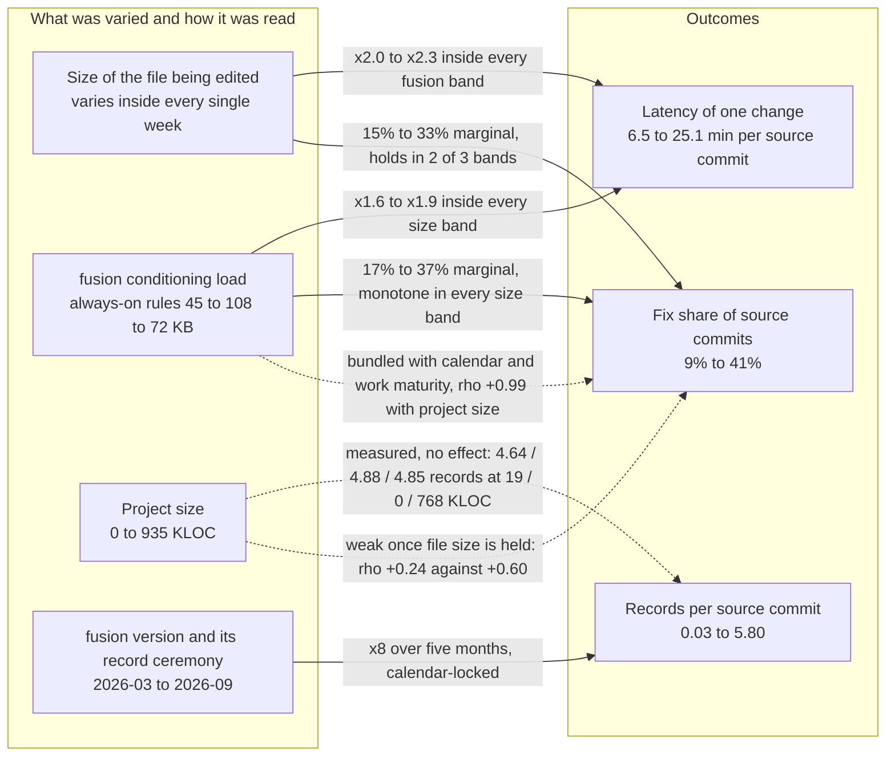
```mermaid
flowchart LR
    subgraph V["What was varied and how it was read"]
        direction TB
        FSIZE["Size of the file being edited<br/>varies inside every single week"]
        LOAD["fusion conditioning load<br/>always-on rules 45 to 108 to 72 KB"]
        PSIZE["Project size<br/>0 to 935 KLOC"]
        VER["fusion version and its record ceremony<br/>2026-03 to 2026-09"]
    end
    subgraph O["Outcomes"]
        direction TB
        LAT["Latency of one change<br/>6.5 to 25.1 min per source commit"]
        ERR["Fix share of source commits<br/>9% to 41%"]
        BOOK["Records per source commit<br/>0.03 to 5.80"]
    end
    FSIZE -->|"x2.0 to x2.3 inside every fusion band"| LAT
    FSIZE -->|"15% to 33% marginal, holds in 2 of 3 bands"| ERR
    LOAD -->|"x1.6 to x1.9 inside every size band"| LAT
    LOAD -->|"17% to 37% marginal, monotone in every size band"| ERR
    VER -->|"x8 over five months, calendar-locked"| BOOK
    PSIZE -.->|"measured, no effect: 4.64 / 4.88 / 4.85 records at 19 / 0 / 768 KLOC"| BOOK
    PSIZE -.->|"weak once file size is held: rho +0.24 against +0.60"| ERR
    LOAD -.->|"bundled with calendar and work maturity, rho +0.99 with project size"| ERR
```

The revision worth naming: the first version of this diagram put fusion's growth on the bookkeeping alone and gave errors and latency to size alone. Stratification shows the conditioning load moves latency and the fix share too, inside every file-size band, so that split was too clean.

### 1. The bookkeeping is a constant of the method, not a function of project size

Measured over one calendar window, 2026-08-01 to 2026-09-09, with the fusion version held roughly constant across all three:

| | fusion | krk | unite-co-creator |
|---|---|---|---|
| source KLOC at window start | 19 | 0 | 768 |
| records filed per source-touching commit | 4.64 | 4.88 | 4.85 |
| record KB written per source-touching commit | 35.4 | 38.5 | 40.7 |
| workbench-only share of within-session wall clock | 40% | 37% | 44% |
| records filed in the window | 2453 | 2128 | 2222 |
| record prose written in the window | 18.3 MB | 16.4 MB | 18.2 MB |

krk began on 2026-08-02 with no code at all. It paid the same per-commit bookkeeping as a project forty times its size from its first month. The three columns agree to within a few percent on every bookkeeping measure while differing by nearly three orders of magnitude in size. Whatever sets the bookkeeping level, project size is not it.

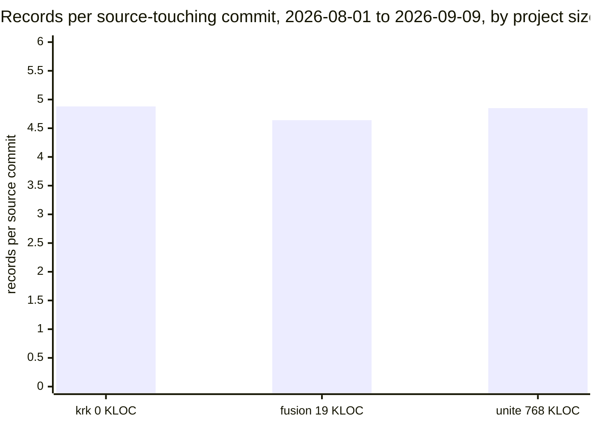
```mermaid
xychart-beta
    title "Records per source-touching commit, 2026-08-01 to 2026-09-09, by project size at window start"
    x-axis ["krk 0 KLOC", "fusion 19 KLOC", "unite 768 KLOC"]
    y-axis "records per source commit" 0 --> 6
    bar [4.88, 4.64, 4.85]
```

The same holds at session grain. Across 66, 60 and 75 commit-clustered sessions in the window, the median session ran 3.2 h, 3.2 h and 3.7 h, of which 64, 57 and 85 minutes fell in stretches where nothing but the workbench changed.

### 2. The load rose about eightfold over five months, in all three projects at once

Records filed per source-touching commit, by month:

| Month | fusion | krk | unite-co-creator |
|---|---|---|---|
| 2026-03 | | | 0.03 |
| 2026-04 | | | 0.74 |
| 2026-05 | 0.00 | | 1.56 |
| 2026-06 | 0.03 | | 1.54 |
| 2026-07 | 2.52 | | 2.22 |
| 2026-08 | 4.61 | 4.98 | 4.78 |
| 2026-09 | 4.81 | 3.74 | 5.80 |

unite-co-creator moved from 0.74 records per source commit in April to 5.80 in September while its own size grew by a factor of three. The rise is locked to the calendar, not to any project's growth curve: it appears in the same months in a repository that started in August with nothing in it. Record prose per source commit followed the same path in that project, from 5.6 KB in April to 47.9 KB in September.

Since the dates come from filename stamps rather than from commits, this trend is not an artifact of when each project began tracking its workbench.

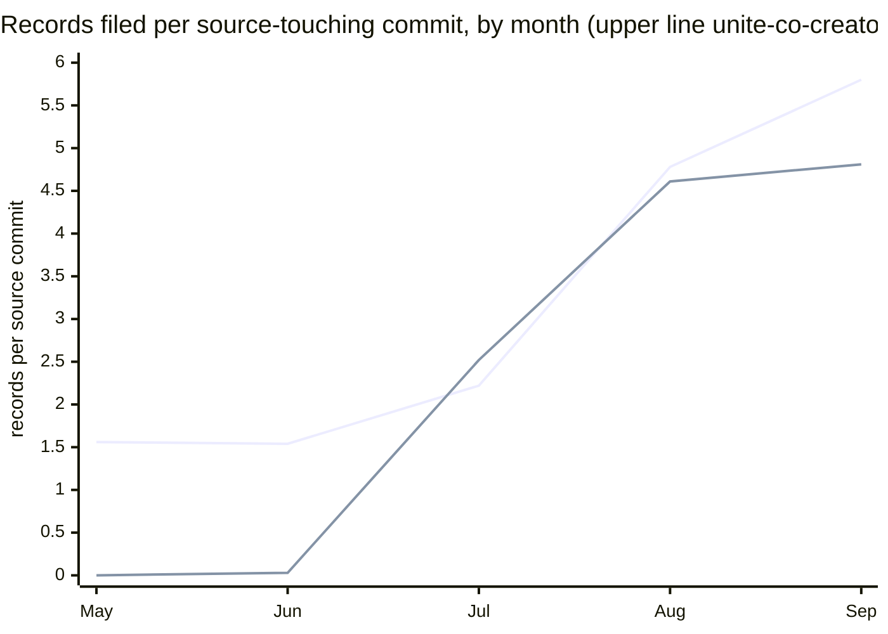
```mermaid
xychart-beta
    title "Records filed per source-touching commit, by month (upper line unite-co-creator, lower line fusion)"
    x-axis [May, Jun, Jul, Aug, Sep]
    y-axis "records per source commit" 0 --> 6
    line [1.56, 1.54, 2.22, 4.78, 5.80]
    line [0.00, 0.03, 2.52, 4.61, 4.81]
```

The same rise shows in wall clock rather than record counts. unite-co-creator's workbench-only share of attributed session time ran 30% in May, 22% in June, 30% in July, 39% in August and 68% in the first nine days of September. Its earlier months are left out here because that project began tracking its workbench in mid-April, and fusion's own months before August are left out for the same reason.

### 3. Size and local complexity do slow a single change down, by a factor of two to three

Holding project, calendar month and fusion version constant, source commits in the window split by the size of the largest source file they touch. File sizes here are today's working-tree line counts; finding 14 repeats the cut with sizes reconstructed at commit time, which is the better measure and the one to prefer where the two disagree.

| Quartile by largest file touched | fusion median lines / minutes | krk | unite-co-creator |
|---|---|---|---|
| Q1 | 175 / 11.5 | 568 / 10.5 | 295 / 10.7 |
| Q2 | 548 / 14.2 | 3097 / 20.4 | 1283 / 26.2 |
| Q3 | 1007 / 18.5 | 6004 / 15.6 | 3039 / 29.7 |
| Q4 | 1293 / 21.6 | 10759 / 32.5 | 11407 / 31.6 |

Three independent replications, same direction from the first quartile to the fourth. Repeating the same cut with sizes reconstructed at commit time gives 9.9, 13.6, 18.8 and 24.9 minutes in this repository, 11.0, 20.4, 18.8 and 28.2 in krk, and 10.2, 28.0, 29.7 and 26.8 in unite-co-creator. First to last the direction holds in all three; the middle quartiles are not monotone, and unite-co-creator's top quartile falls below its third. Roughly two to three times is the right reading of the span, not of every step in it.

```mermaid
xychart-beta
    title "Median minutes per source commit by size quartile of the largest file touched (bars fusion then krk, line unite-co-creator)"
    x-axis ["Q1 smallest", "Q2", "Q3", "Q4 largest"]
    y-axis "minutes" 0 --> 35
    bar [11.5, 14.2, 18.5, 21.6]
    bar [10.5, 20.4, 15.6, 32.5]
    line [10.7, 26.2, 29.7, 31.6]
```

The cross-project comparison at fixed calendar agrees. In August 2026 the median source commit took 16.3 minutes in fusion (44 KLOC), 19.3 minutes in krk (144 KLOC) and 27.2 minutes in unite-co-creator (876 KLOC), monotone in size.

One qualification matters. Per hundred changed lines the cost does not rise: 6.39, 5.81 and 6.36 minutes in the three projects in August, essentially flat, and not ordered by size, since the smallest codebase carries the highest figure. The first version of this report gave 5.93, 5.05 and 5.08, computed with a denominator that included lines from commits whose interval had been dropped as inter-session. Larger files attract larger commits, and the throughput per unit of text holds up. What degrades is the latency of one task and the granularity at which work can be done. That is consistent with the user's impression of slowdown without supporting a claim that the model writes text more slowly in a big project.

### 4. The error rate rises with local complexity, also replicated three times

For every source file with at least three commits in its history, the share of those commits whose subject is a fix or a revert. Sizes here are today's working-tree line counts, as in finding 3:

| Quartile by file size | fusion | krk | unite-co-creator |
|---|---|---|---|
| Q1 (median 72 / 141 / 73 lines) | 24.8% | 24.2% | 11.9% |
| Q2 | 24.3% | 29.6% | 14.8% |
| Q3 | 30.7% | 31.3% | 23.4% |
| Q4 (median 686 / 2032 / 770 lines) | 31.0% | 29.3% | 27.2% |

The gradient is clearest in unite-co-creator, where the fix share more than doubles from the smallest to the largest quartile. It is not monotone everywhere: krk's fourth quartile sits below its third. Commits per file rise the same way: 5.3 in Q1 against 16.3 in Q4 there, 5.9 against 26.5 in krk. Large files are both more error-prone and revisited far more often.

```mermaid
xychart-beta
    title "Fix share of a file's commits by its size quartile (bars fusion then krk, line unite-co-creator)"
    x-axis ["Q1 smallest", "Q2", "Q3", "Q4 largest"]
    y-axis "percent of the file's commits that are fixes" 0 --> 35
    bar [24.8, 24.3, 30.7, 31.0]
    bar [24.2, 29.6, 31.3, 29.3]
    line [11.9, 14.8, 23.4, 27.2]
```

**Reverse causality is not excluded.** A file that attracts many fixes grows through those fixes, so size and fix count feed each other. The correlation is verified; the direction is inference, not measurement.

### 5. Rework rises over each project's life, and that trend cannot be attributed

Fix commits per feature commit, by month:

| Month | fusion | krk | unite-co-creator |
|---|---|---|---|
| 2026-03 | | | 0.11 |
| 2026-04 | | | 0.26 |
| 2026-05 | 0.93 | | 0.46 |
| 2026-06 | 0.50 | | 0.61 |
| 2026-07 | 1.08 | | 0.91 |
| 2026-08 | 1.76 | 0.46 | 1.11 |
| 2026-09 | 0.90 | 1.78 | 0.80 |

unite-co-creator's climb from 0.11 to above 1.0 is monotone across six months. Within a single project, however, size and fusion version grow together, so this series cannot separate them; it is evidence that something got worse, not evidence of which thing.

The cross-project test at fixed calendar cuts against a pure size story. In August the fix-to-feature ratio was 1.64 in fusion at 44 KLOC, 0.52 in krk at 144 KLOC and 1.07 in unite-co-creator at 876 KLOC, not ordered by size. fusion, the smallest codebase of the three, has the worst ratio and the lowest net output at 98 net source lines per hour against 543 and 452. Lines of code alone do not explain the error rate. What distinguishes fusion is that its product is the rule and record machinery itself, so every change is a change to the instructions the agent is running under. **Speculation:** self-reference of that kind is the likelier driver in fusion's case, and with three projects no single-variable explanation can be established either way.

### 6. The declining net product is visible in the commit mix, not in line throughput

Share of commits typed `docs` or `chore` rather than `feat`, `fix`, `test`, `refactor` or `perf`. Commits typed `ci` are counted in neither group, which corrects one cell of the first version, where unite-co-creator's June figure read 40.1% because three `ci` commits had been folded into the documentation side:

| Month | fusion | krk | unite-co-creator |
|---|---|---|---|
| 2026-04 | | | 28.0% |
| 2026-05 | 39.0% | | 50.0% |
| 2026-06 | 32.3% | | 39.6% |
| 2026-07 | 28.4% | | 46.1% |
| 2026-08 | 50.4% | 57.4% | 54.5% |
| 2026-09 | 62.2% | 38.3% | 68.4% |

Feature commits per month in unite-co-creator fell from 221 in May to 25 in the first nine days of September, while documentation commits ran at 101 in the same nine days. The user's impression is confirmed on this measure, in both projects with enough history to show a trend.

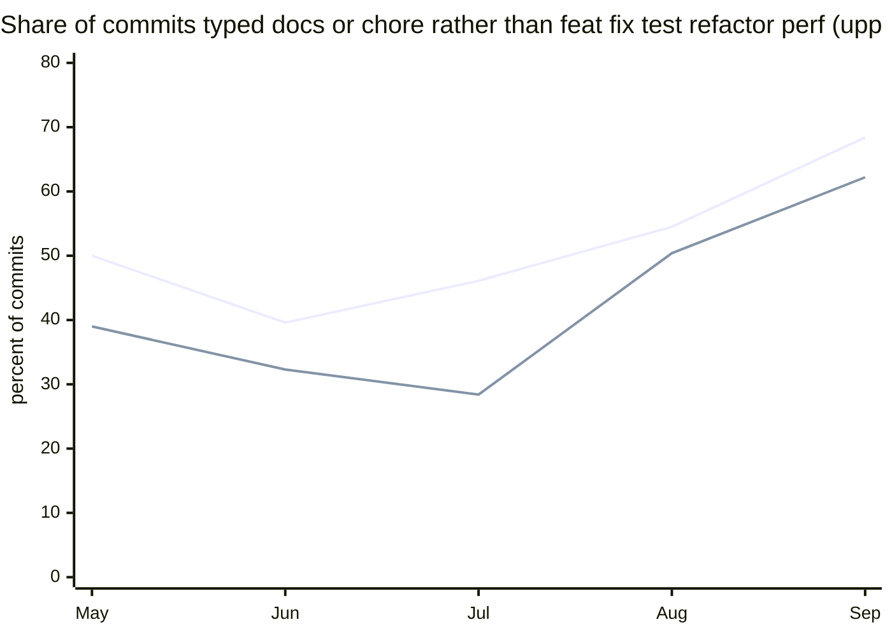
```mermaid
xychart-beta
    title "Share of commits typed docs or chore rather than feat fix test refactor perf (upper line unite-co-creator, lower line fusion)"
    x-axis [May, Jun, Jul, Aug, Sep]
    y-axis "percent of commits" 0 --> 80
    line [50.0, 39.6, 46.1, 54.5, 68.4]
    line [39.0, 32.3, 28.4, 50.4, 62.2]
```

### 7. Where the bookkeeping time actually sits

Workbench-only commit time in the window, split by which record kind the commit's lines went to:

| Kind | fusion | krk | unite-co-creator |
|---|---|---|---|
| history (session logs) | 29.0% | 19.7% | 22.5% |
| issues | 29.0% | 25.2% | 20.7% |
| decisions | 10.7% | 10.7% | 14.6% |
| planning | 8.5% | 17.7% | 10.6% |
| reviews | 6.9% | 9.9% | 4.5% |
| analyses | 4.2% | 1.2% | 9.4% |
| machine state, circle records, other | 11.4% | 14.2% | 15.1% |

Two groups fall out of that. Session ceremony, meaning history files, machine state, circle records and workbench miscellany, takes 50.9, 36.7 and 62.2 hours in the window, which is 13% to 17% of all attributed wall-clock and carries no statement about the product. Knowledge records, meaning issues, decisions, plans, reviews and analyses, take 75.0, 71.3 and 101.9 hours, or 24% to 28% of all time.

Summed across the three projects for the window: 150 hours of session ceremony and 248 hours of knowledge records, against 553 hours charged to source commits.

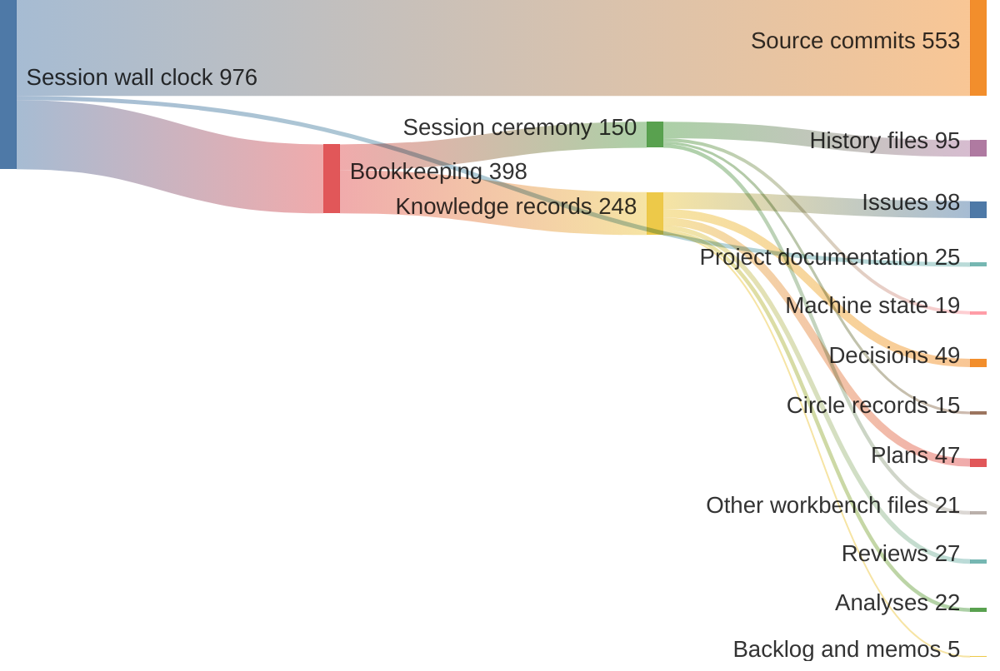
```mermaid
sankey-beta
Session wall clock,Source commits,553
Session wall clock,Bookkeeping,398
Session wall clock,Project documentation,25
Bookkeeping,Session ceremony,150
Bookkeeping,Knowledge records,248
Session ceremony,History files,95
Session ceremony,Machine state,19
Session ceremony,Circle records,15
Session ceremony,Other workbench files,21
Knowledge records,Issues,98
Knowledge records,Decisions,49
Knowledge records,Plans,47
Knowledge records,Reviews,27
Knowledge records,Analyses,22
Knowledge records,Backlog and memos,5
```

### 8. Dedicated bookkeeping agents are not where the cost is

Machine-timestamped dispatches only, that is rows carrying the `person` and `checkout` fields the hook writes. The first such row is 2026-08-26 in this repository and 2026-08-27 in the other two:

| Agent group | fusion | krk | unite-co-creator |
|---|---|---|---|
| production (coder, ontocoder, bugfixer, editor) | 73.1% | 82.8% | 67.1% |
| planning and analysis | 13.2% | 10.9% | 16.5% |
| bookkeeping (reconciler, curator, playmaker, taskplanner) | 9.8% | 3.1% | 7.6% |
| review | 3.4% | 1.3% | 4.4% |

The reconciler, curator, playmaker and taskplanner together consume between 3% and 10% of dispatch time. Removing a bookkeeping pass buys almost nothing, because the bookkeeping is not performed in a separable pass. It is performed inside every coder dispatch, which writes its own history file and files its own issues, and in the orchestrator's own turn, which is not a dispatch at all and therefore does not appear in this table.

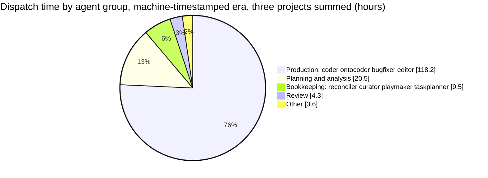
```mermaid
pie showData
    title Dispatch time by agent group, machine-timestamped era, three projects summed (hours)
    "Production: coder ontocoder bugfixer editor" : 118.2
    "Planning and analysis" : 20.5
    "Bookkeeping: reconciler curator playmaker taskplanner" : 9.5
    "Review" : 4.3
    "Other" : 3.6
```

### 9. The issues are about the product, not about the bookkeeping

Classifying each issue record by the file paths its body cites, an objective test that needs no keyword list:

| | fusion | krk | unite-co-creator |
|---|---|---|---|
| issues citing mostly source or data | 341 | 767 | 1428 |
| issues citing mostly records, rules or docs | 687 | 138 | 171 |
| meta share of the classified issues | 67% | 15% | 11% |

The classifier is a heuristic over the paths a record's first 6000 bytes cite, and it is sensitive at the boundary: two runs with slightly different rules for what counts as a documentation path moved one record of 1137. In the two consuming projects, roughly nine of every ten issues are about the product. unite-co-creator's meta share does not trend upward over its life: 13%, 18%, 6%, 14%, 9%, 13% by month. fusion's 67% is expected and not comparable, since fusion's product is the record machinery.

**Correction to an earlier reading of my own.** A first pass classified issues by keywords in their filename slug and returned 62%, 24% and 38%. That classifier is biased in two directions at once: it matches product issues that happen to mention a comment or a header, and it misses German slugs entirely, which understates krk. The citation-based figures above supersede it, and the tempting conclusion that the bookkeeping mostly generates work about itself does not survive the better test outside fusion's own repository.

### 10. Unresolved work accumulates with size

| all issue records ever filed, live and archived | filed | closed | open | open share |
|---|---|---|---|---|
| fusion | 1137 | 1074 | 63 | 6% |
| krk | 978 | 866 | 108 | 11% |
| unite-co-creator | 1768 | 1284 | 444 | 25% |

The open share is monotone in current source size, at 6% for fusion's 50 KLOC, 11% for krk's 157 KLOC and 25% for unite-co-creator's 935 KLOC. In absolute terms the largest project carries 444 open issue records, four times the next project's count. Decision records that are still open do not follow that order, at 25, 12 and 70 over all records ever filed and 23, 12 and 66 over the live tree alone, so the pattern holds for defects and not for open questions. The first version of this sentence called the all-records figures live ones. The record store grows monotonically because closure lags filing, and the reconciler, curator and taskplanner passes read it.

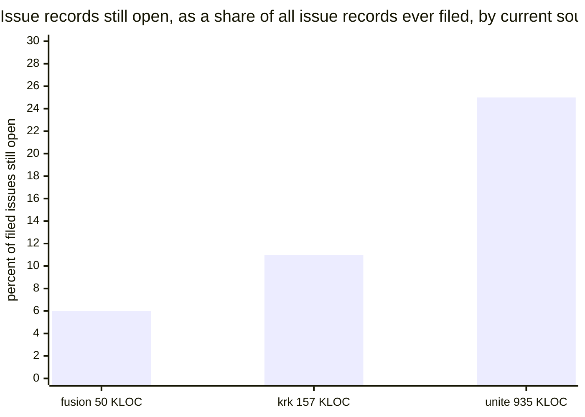
```mermaid
xychart-beta
    title "Issue records still open, as a share of all issue records ever filed, by current source size"
    x-axis ["fusion 50 KLOC", "krk 157 KLOC", "unite 935 KLOC"]
    y-axis "percent of filed issues still open" 0 --> 30
    bar [6, 11, 25]
```

### 11. The two ledgers

Input, per sub-agent dispatch, before the agent reads one line of the project:

| | rules emitted | CLAUDE.md | agent prompt (mean of 15) | total per dispatch |
|---|---|---|---|---|
| fusion | 83 KB | 91 KB | 27 KB | 202 KB |
| krk | 83 KB | 69 KB | 27 KB | 179 KB |
| unite-co-creator | 124 KB | 11 KB | 27 KB | 162 KB |

The row adds up only unrounded: 85 175 plus 93 432 plus 27 810 bytes is 201.6 KiB, which rounds to 202 while the three printed components add to 201. The orchestrator prompt is a further 152 KiB, carried by every session. Over the 475, 403 and 559 paired dispatches recorded in each project, the conditioning text alone comes to roughly 0.09, 0.07 and 0.09 GB.

Output, lifetime: 19.3 MB, 16.4 MB and 36.6 MB of record prose, 72.3 MB together. At four bytes per token that is on the order of 19 million tokens of written bookkeeping, an estimate rather than a measured count. In the current window the ratio of record prose to source text written is 3.27, 2.11 and 1.32 to one.

### 12. fusion's own growth, measured rather than named by a version number

A version number is a label. What a dispatch carries is bytes, and those were measured at the last commit of every week in fusion's history.

| Month | version | rules directory | always-on set | agents | skills | orchestrator prompt |
|---|---|---|---|---|---|---|
| 2026-05 | 3.14.0 | 45 KB | 45 KB | 273 KB | 132 KB | 88 KB |
| 2026-06 | 3.24.0 | 60 KB | 55 KB | 257 KB | 125 KB | 69 KB |
| 2026-07 | 5.8.0 | 128 KB | 108 KB | 282 KB | 201 KB | 76 KB |
| 2026-08 | 10.24.0 | 212 KB | 71 KB | 404 KB | 242 KB | 149 KB |
| 2026-09 | 10.26.0 | 226 KB | 72 KB | 407 KB | 254 KB | 152 KB |

The always-on set is the one column that reverses. It climbed from 45 KiB to 108 KiB by late July, was cut by a quarter on 2026-08-27, from 96.4 KiB to 72.5 KiB, and stands at 72 KiB. Each figure in the table is a sample at the last commit of that month's final week, so it does not coincide with the cut, which finding 15 dates and measures to the commit. Everything else grew without a reversal: the rules directory fivefold, the orchestrator prompt from 88 KB to 152 KB. The always-on figure was derived from the unindented `emit_if_exists` lines in `bin/fusion-rules` at each commit, which is the plugin-side half of the recipe this repository's own documentation gives. It omits the second half, the project's chat voice profile, emitted unconditionally by a different function in the same script: 2.6 KiB here, so the column runs about that much low at every sample, and the floor a dispatch actually reads today is 74.2 KiB rather than 72.5. The omission is a constant offset and disturbs neither the trend nor the cut in finding 15, both of which are differences.

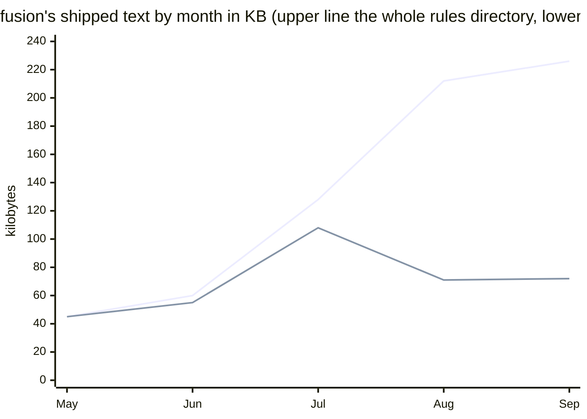
```mermaid
xychart-beta
    title "fusion's shipped text by month in KB (upper line the whole rules directory, lower line the always-on set every dispatch reads)"
    x-axis [May, Jun, Jul, Aug, Sep]
    y-axis "kilobytes" 0 --> 240
    line [45, 60, 128, 212, 226]
    line [45, 55, 108, 71, 72]
```

### 13. Over calendar time the two candidate drivers are one variable

Rank correlation between fusion's shipped rules bytes and the consuming project's own cumulative source size, week by week: +0.99 in unite-co-creator, +1.00 in krk, +1.00 in this repository. Both grow monotonically with the calendar, so no time series can tell them apart, and every correlation with an outcome comes out the same for both.

| Weekly outcome in unite-co-creator, 19 weeks | vs fusion rules bytes | vs project source KLOC | vs size of largest file touched |
|---|---|---|---|
| records per source commit | +0.89 | +0.89 | +0.64 |
| workbench share of wall clock | +0.69 | +0.70 | +0.40 |
| median minutes per source commit | +0.20 | +0.14 | +0.44 |
| fix share of commits | +0.22 | +0.24 | +0.60 |
| net source lines per hour | -0.43 | -0.42 | -0.09 |

The first two columns are indistinguishable, which is what a rank correlation of +0.99 between the two predicts. The third column differs, and it differs because the size of the file being edited varies inside every single week instead of growing with the calendar. That is the variation findings 14 and 16 use.

Reading the first two columns as evidence about a cause would be an error. They are printed so a reader can see that they carry no information, not because they carry any.

### 14. Stratifying separates the two, and both effects are real

All 3353 source-touching commits from the three projects, cut two ways at once: by the fusion always-on load in force at the time, and by the size of the largest source file the commit touched, reconstructed from the commit history rather than read off today's tree.

Median minutes per source commit:

| | file under 391 lines | 391 to 1244 | over 1244 lines | effect of size |
|---|---|---|---|---|
| fusion load under 43 KB | 6.5 | 10.9 | 13.0 | x2.0 |
| fusion load 43 to 83 KB | 8.4 | 12.4 | 18.3 | x2.2 |
| fusion load over 83 KB | 10.8 | 17.9 | 25.1 | x2.3 |
| effect of fusion load | x1.7 | x1.6 | x1.9 | |

```mermaid
xychart-beta
    title "Median minutes per source commit, 3353 commits pooled (bars fusion load low then medium then high)"
    x-axis ["file <391 lines", "file 391-1244", "file >1244 lines"]
    y-axis "minutes" 0 --> 28
    bar [6.5, 10.9, 13.0]
    bar [8.4, 12.4, 18.3]
    bar [10.8, 17.9, 25.1]
```

Fix share of source commits:

| | file under 391 lines | 391 to 1244 | over 1244 lines |
|---|---|---|---|
| fusion load under 43 KB | 9.4% | 29.5% | 16.7% |
| fusion load 43 to 83 KB | 16.5% | 28.6% | 25.9% |
| fusion load over 83 KB | 23.9% | 39.8% | 40.9% |

```mermaid
xychart-beta
    title "Fix share of source commits, 3353 commits pooled (bars fusion load low then medium then high)"
    x-axis ["file <391 lines", "file 391-1244", "file >1244 lines"]
    y-axis "percent of source commits that are fixes" 0 --> 45
    bar [9.4, 29.5, 16.7]
    bar [16.5, 28.6, 25.9]
    bar [23.9, 39.8, 40.9]
```

Both gradients survive the other's control. Latency roughly doubles with file size inside every fusion band and rises 1.6 to 1.9-fold with fusion load inside every size band. The two multiply: a small file under the light rule set took a median 6.5 minutes, a large file under the heavy one 25.1, a factor of 3.9.

For the fix share the fusion gradient is the cleaner of the two. It is monotone in all three size columns, 9.4 to 23.9 percent, 29.5 to 39.8, and 16.7 to 40.9. The size gradient is monotone in two of the three fusion rows and inverts in the lightest, where the sample is smallest.

**What the row variable actually is.** The load is measured in bytes of the always-on rule set, but that quantity moved with the calendar for most of the period, and so did the projects' size and the shift from greenfield work to modification. The row effect is a bundle, and this table does not attribute it to the rule set alone. The column effect is not a bundle: file size varies within a single week and within a single session.

### 15. One event separates the bundle, and it points at the rule set

On 2026-08-27, in two commits forty minutes apart, the plugin-side always-on set went from 96.4 KiB to 72.5 KiB. `8ac9a533` at 08:45:11 took the decision-record worked examples off the floor; `9c056b6c` at 09:25:02 took the user-facing style contract. A quarter of what every dispatch carried was removed in one morning, while calendar time went on advancing and the projects went on growing.

The two files measure 4.4 KiB and 19.9 KiB at the commits that removed them, but the floor fell by 19.4 KiB at the second commit rather than by 19.9, because the style contract and the setup rule each grew a little inside that same commit. The 24 KiB total is the difference between the two sums, which is the figure that carries the finding.

**Two corrections sit in this paragraph.** The first version placed the cut on 2026-08-24, read off a weekly sample rather than off the commits, and put three days of the old regime into the new bucket; the numbers below are the corrected ones, and the fix-share effect came out slightly larger. The second version said the two commits were ninety minutes apart, which is forty.

Three weeks before against just under two weeks after, with file size held:

| Stratum | commits before / after | fix share before | fix share after | median minutes before | after |
|---|---|---|---|---|---|
| file under 792 lines | 343 / 107 | 31.5% | 16.8% | 13.5 | 8.3 |
| file 792 to 2024 | 347 / 103 | 38.0% | 23.3% | 20.9 | 21.9 |
| file over 2024 lines | 376 / 74 | 39.9% | 36.5% | 28.2 | 24.1 |
| pooled | 1066 / 284 | 36.6% | 24.3% | 20.6 | 14.4 |

```mermaid
xychart-beta
    title "Fix share before and after the 2026-08-27 conditioning-load cut, file size held (left bar before, right bar after)"
    x-axis ["file <792 lines", "file 792-2024", "file >2024 lines"]
    y-axis "percent of source commits that are fixes" 0 --> 45
    bar [31.5, 38.0, 39.9]
    bar [16.8, 23.3, 36.5]
```

The fix share fell in all three strata. Latency did not: it fell in the smallest and largest bands and rose slightly in the middle one, so the latency reading here is weaker than the fix-share reading and should not be quoted alone.

Per project the picture is consistent without being uniform. This repository went from 44.5 to 23.4 percent while the files it touched stayed about the same size, a median 954 to 995 lines. unite-co-creator went from 38.2 to 25.3 percent, but the files it touched shrank from 1976 to 708 lines, so part of that improvement is the size effect and not the cut. krk went from 26.3 to 24.4 percent while the files it touched grew by 62 percent, from 2197 to 3558 lines, which under the size gradient alone should have made it worse.

**How much weight this carries.** It is a before-and-after comparison, not a controlled trial. The two commits shipped inside a release round that changed other things, the window after them is shorter than the window before, and nothing was randomised. What it establishes is that the fix share fell in every size stratum in the one period when fusion's conditioning load fell, which is the opposite of what a pure calendar or a pure project-growth explanation predicts.

**What left is worth naming.** The 24 KiB that stopped being carried was decision-record worked examples and a style contract. Neither is domain knowledge about the project being worked on. That is a description of the two files, not a claim that their content was the active ingredient: the same 24 KB of any text would have made the same difference to context length, and this design cannot tell content from volume.

### 16. File growth, not total size, is the part that carries the effect

Median size of the largest source file a commit touched, reconstructed at commit time:

| Month | fusion | krk | unite-co-creator |
|---|---|---|---|
| 2026-05 | 235 | | 591 |
| 2026-06 | 182 | | 683 |
| 2026-07 | 282 | | 851 |
| 2026-08 | 951 | 2107 | 1739 |
| 2026-09 | 1001 | 4483 | 678 |

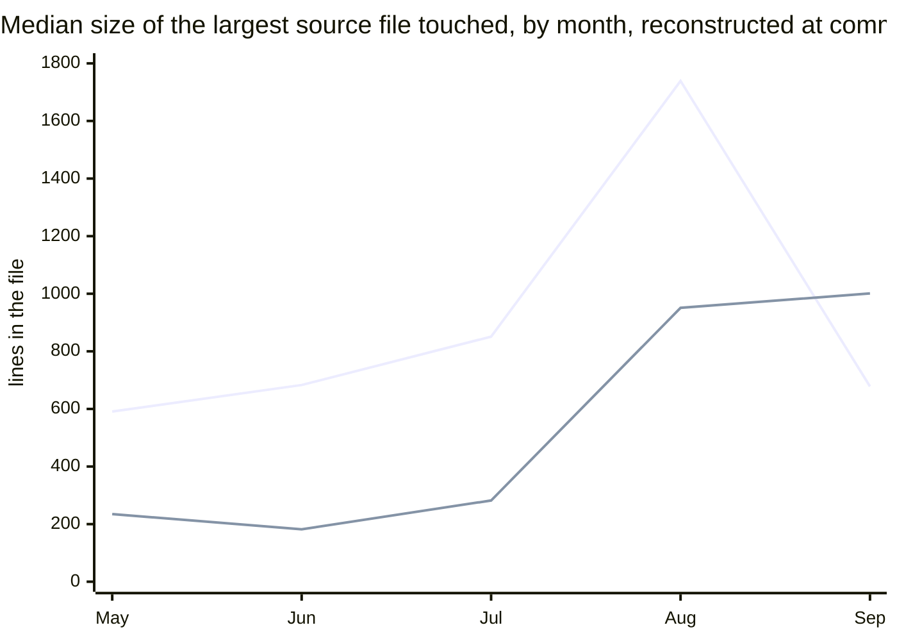
```mermaid
xychart-beta
    title "Median size of the largest source file touched, by month, reconstructed at commit time (upper line unite-co-creator, lower line fusion)"
    x-axis [May, Jun, Jul, Aug, Sep]
    y-axis "lines in the file" 0 --> 1800
    line [591, 683, 851, 1739, 678]
    line [235, 182, 282, 951, 1001]
```

Against unite-co-creator's weekly outcomes this quantity beats the project's total size on both degradation measures: +0.60 against +0.24 for the fix share, +0.44 against +0.14 for latency. On the bookkeeping measures the order reverses, +0.64 against +0.89 for records per source commit, which is what finding 1 predicts, since the bookkeeping is priced per commit and knows nothing about the file.

A project does not become slow by holding many lines. It becomes slow by growing files that a change has to be reasoned about inside. That distinction is actionable in a way total size is not.

### 17. The largest thing a dispatch is pointed at was never measured, and it is the record store

Finding 14's row variable is the always-on rule set, 74.2 KiB with the voice profile included. That is not the largest text a dispatch is aimed at. Thirteen of the fifteen agent prompts name `$SCAN_DECISIONS`, thirteen name `$SCAN_ISSUES`, twelve name `$SCAN_PLANS` and eleven name all three; `bugfixer` and `editor` name none. The pointers mostly sit in the prompt body rather than in a Setup step, which the first version of this finding got wrong: only `reconciler` names all three inside its `## Setup`, while `coder` reaches them under `## Before Coding` and `## Implementation Process`. Measuring what the pointers resolve to today:

| | open and answered decisions | open issues | live plans | last 20 history files | total |
|---|---|---|---|---|---|
| fusion | 65 files, 374 KB | 54 files, 175 KB | 6 files, 301 KB | 103 KB | 952 KB |
| krk | 34 files, 196 KB | 108 files, 404 KB | 2 files, 81 KB | 158 KB | 838 KB |
| unite-co-creator | 117 files, 830 KB | 379 files, 1674 KB | 28 files, 1673 KB | 188 KB | 4365 KB |

```mermaid
xychart-beta
    title "What each dispatch is pointed at, in KiB (left bar the always-on rule set, right bar the live record store its prompt names)"
    x-axis ["fusion", "krk", "unite-co-creator"]
    y-axis "kibibytes" 0 --> 4500
    bar [74, 74, 74]
    bar [952, 838, 4365]
```

The record store a prompt points at is 11 to 59 times the always-on rule set. Unlike the rule set, it grows with the project: the same measure for unite-co-creator, taken over the records that are still live, ran 223 KB in May, 612 KB in June, 824 KB in July, 3113 KB in August and 4177 KB in September.

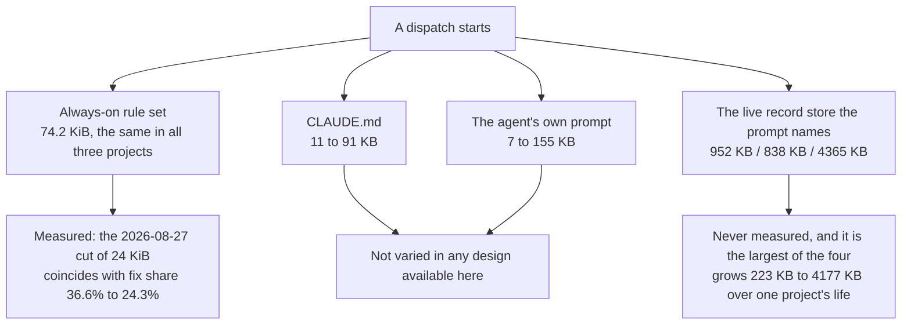
```mermaid
flowchart TD
    D["A dispatch starts"] --> R["Always-on rule set<br/>74.2 KiB, the same in all three projects"]
    D --> C["CLAUDE.md<br/>11 to 91 KB"]
    D --> A["The agent's own prompt<br/>7 to 155 KB"]
    D --> S["The live record store the prompt names<br/>952 KB / 838 KB / 4365 KB"]
    R --> M["Measured: the 2026-08-27 cut of 24 KiB<br/>coincides with fix share 36.6% to 24.3%"]
    S --> U["Never measured, and it is the largest of the four<br/>grows 223 KB to 4177 KB over one project's life"]
    C --> M2["Not varied in any design available here"]
    A --> M2
```

**Three things this does not establish.** The prompts say *skim*, not read, so an agent that greps rather than opens loads a fraction of this; the figure is what the prompt points at, which is an upper bound on what enters context and not a measurement of it. Nothing here was varied in any design, so no effect on the fix share or on latency is attributable to it. And the cross-section runs the wrong way for a simple story: this repository has the smallest store of the three at 952 KB and the worst fix-to-feature ratio at 1.64, while krk has 838 KB and the best at 0.52.

**Why it belongs in this report anyway.** The user's question was whether the volume of rules and decisions is counterproductive. For rules the answer has one measurement behind it, finding 15. For decisions there is none, and this finding says so while naming the quantity: it is the largest of the four texts a dispatch is aimed at, it is the only one of the four that scales with project age, and it is the obvious candidate for the residual that findings 5 and 13 could not attribute. Measuring it needs the same design as recommendation 3b, applied to a deliberate reduction of what Setup points at rather than of what it loads.

### 18. Why the ramp-up and the closing are felt as worse than the rest

The user and a second person on the same projects report the overhead as friction throughout, and as disproportionate in two phases: starting up after a restart, and above all closing. Four measurements bear on that, and they agree.

**The two phases are the most expensive reading of the session, and the closing is the most expensive thing fusion does.** Counting the instruction text each phase pulls in, in this repository, against one coder dispatch as the productive unit:

| Phase | what it carries | KiB | as coder dispatches |
|---|---|---|---|
| one coder dispatch | agent prompt 9, its emitted rule set 83, `CLAUDE.md` 91 | 184 | 1.0 |
| ramp-up | orchestrator prompt 152, setup body 49, the orchestrator's emitted set 128, `CLAUDE.md` 91, resume rule 5 | 425 | 2.3 |
| cleanup, minimum | the five pipeline bodies 82, a reconciler dispatch 202, a curator dispatch 222 | 506 | 2.8 |
| closing, full | the same plus a review dispatch 189 and a portfolio dispatch 256 | 951 | 5.2 |

**Two things this table does, which a reader should see.** The emitted rule set is measured per agent by running `bin/fusion-rules`, not assumed: the orchestrator's is 128 KiB rather than the 72 KiB floor, because it also draws the user-facing contract, the worked examples, both voice profiles, the Circle vocabulary and the commit-lock rule. The first version of this table assumed the floor plus a resume rule the orchestrator is never emitted, and understated the ramp-up by 11%. And `CLAUDE.md` is counted once per dispatch, because each sub-agent gets its own context, so 91 KiB of it sits inside the 951 five times over.

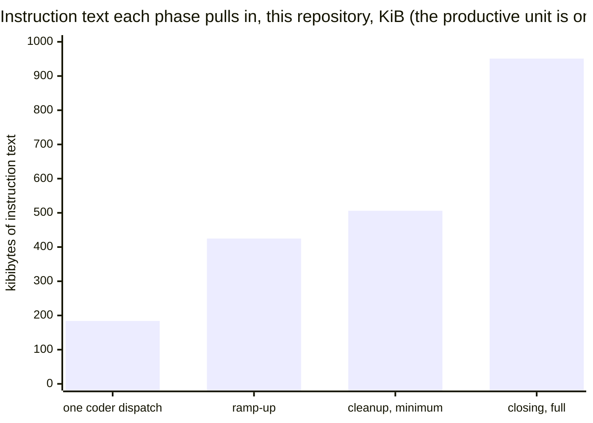
```mermaid
xychart-beta
    title "Instruction text each phase pulls in, this repository, KiB (the productive unit is one coder dispatch)"
    x-axis ["one coder dispatch", "ramp-up", "cleanup, minimum", "closing, full"]
    y-axis "kibibytes of instruction text" 0 --> 1000
    bar [184, 425, 506, 951]
```

A full closing reads five times what a productive dispatch reads, and produces nothing the user asked for. The ramp-up reads a little over twice.

**The step count is fixed and long.** `/fusion:setup` carries 16 numbered steps in 49 KiB, and eleven of them, Step 0 and Step 0b through Step 0k, are pre-flight that runs before any project context is read: the workspace, the monitor binary, the concurrent-session check, the stylometric profiles, the asset comparison, the configuration file, the permission file, the merge driver, this checkout's identity, the `.gitignore` partition and the upstream check. The first version of this paragraph said 19 steps and twelve pre-flight, counting three sub-items of Step 0g as steps of their own and implying a Step 0l that does not exist. `/fusion:cleanup` carries 9 steps in 25 KiB. Four skill bodies run inside three of them, 25 KiB for the archive step, 13 for the activity log, and 12 plus 7 for the curation step and the message it leaves; the fourth pass, Step 3's reconciliation, is a dispatch with no body of its own.

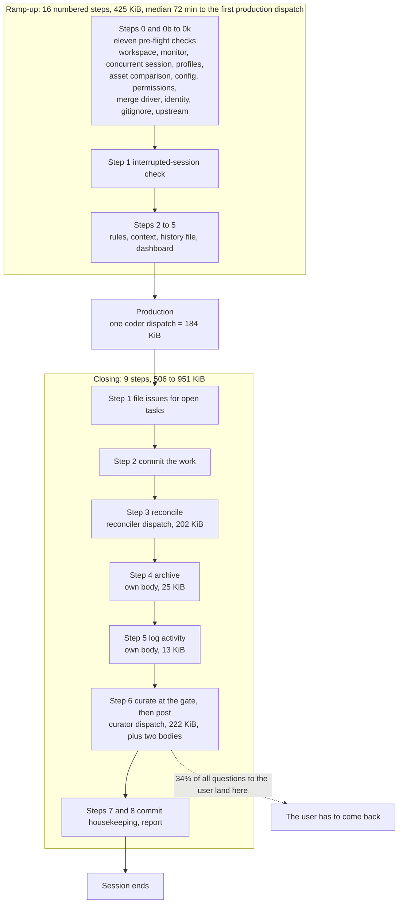
```mermaid
flowchart TD
    subgraph RAMP["Ramp-up: 16 numbered steps, 425 KiB, median 72 min to the first production dispatch"]
        direction TB
        S0["Steps 0 and 0b to 0k<br/>eleven pre-flight checks<br/>workspace, monitor, concurrent session, profiles,<br/>asset comparison, config, permissions,<br/>merge driver, identity, gitignore, upstream"] --> S1["Step 1 interrupted-session check"]
        S1 --> S2["Steps 2 to 5<br/>rules, context, history file, dashboard"]
    end
    S2 --> WORK["Production<br/>one coder dispatch = 184 KiB"]
    WORK --> C1["Step 1 file issues for open tasks"]
    subgraph CLOSE["Closing: 9 steps, 506 to 951 KiB"]
        direction TB
        C1 --> C2["Step 2 commit the work"]
        C2 --> C3["Step 3 reconcile<br/>reconciler dispatch, 202 KiB"]
        C3 --> C4["Step 4 archive<br/>own body, 25 KiB"]
        C4 --> C5["Step 5 log activity<br/>own body, 13 KiB"]
        C5 --> C6["Step 6 curate at the gate, then post<br/>curator dispatch, 222 KiB, plus two bodies"]
        C6 --> C7["Steps 7 and 8 commit housekeeping, report"]
    end
    C7 --> END["Session ends"]
    C6 -.->|"34% of all questions to the user land here"| GATE["The user has to come back"]
```

**A third of the questions put to the user fall after the work is over.** Of 279 gate events in the 43 sessions carrying a session identifier, 94 fall after the session's last production dispatch and 45 before its first. Half the interruptions sit outside the stretch where anything is being produced. That is the shape a person experiences as being kept at the desk to fill in forms.

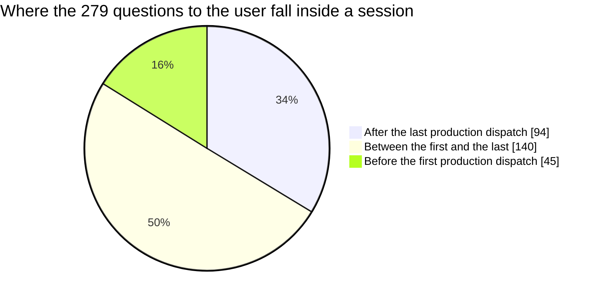
```mermaid
pie showData
    title Where the 279 questions to the user fall inside a session
    "After the last production dispatch" : 94
    "Between the first and the last" : 140
    "Before the first production dispatch" : 45
```

**The ramp-up is long in wall clock too.** Median 72 minutes from a session's first event to its first production dispatch, mean 236, ninth decile 640. Those upper figures include sessions that were interrupted and resumed, which is precisely the case the user names.

**The closing does not shrink with the session.** Closing dispatch time against production dispatch time, by how much the session produced: 0.28 minutes of closing per productive minute for sessions with 1 to 10 production dispatches, 0.12 for sessions with more than 10. The relative burden roughly doubles as the session gets smaller, which is what makes a short session feel worst. And 17 of the 43 sessions ran no production dispatch at all, so their entire length was ramp-up and ceremony.

**What this adds up to.** The closing is a fixed-length procedure executed in a fixed order regardless of what the session did, it is the most expensive reading in the session, it is where a third of the questions to the user land, and it yields no artifact the user requested. Each of those four properties is measured. The perception the user reports is the sum of them, and it is accurate rather than impressionistic.

## Implications

**The bookkeeping is a separate problem from the errors, but the conditioning load is not.** Bookkeeping tracks the version of fusion and nothing else, and it will move only if the record ceremony is cut. Errors and per-change latency have two drivers of comparable size that multiply: the file being edited, and the rule bytes the dispatch carries. Cutting the always-on set therefore buys error rate as well as tokens, which the first pass of this analysis did not see.

**The one cut already made can be priced.** Between the three weeks before 2026-08-27 and the two after, with file size held constant, the pooled fix share fell from 36.6% to 24.3%, and it fell in all three size strata. That is a before-and-after reading rather than a trial, and finding 15 states what it cannot carry. It is still the only evidence in these three trees that points at the rule set rather than at the calendar, and the effect is large enough to be worth a deliberate second cut with a measurement around it.

**The bookkeeping is priced per commit, which is the worst possible unit.** At 4.8 records and about 38 KB of prose per source-touching commit, a session that makes many small careful changes pays more than one that makes few large ones. That reverses the incentive the size effect creates, since finding 3 says small changes to small files are what goes well. The method currently taxes exactly the working style the evidence favours.

**About 15% of all wall-clock produces nothing that describes the product.** Session ceremony ran to 150 hours across the three projects in five and a half weeks. Unlike the issue and decision stores, whose content is 90% about the product and demonstrably load-bearing, the history files, machine state and circle records exist to describe the process that produced the work.

**Removing a bookkeeping agent is the wrong lever.** Dedicated bookkeeping dispatches are 3% to 10% of dispatch time. The cost is distributed across every dispatch and across the orchestrator's own turn, so only a change to what each dispatch is obliged to write will move it.

**The ramp-up and the closing are the two phases worth cutting first, on the user's own report and on the measurement.** They are the most expensive reading in a session, 2.3 and 5.2 productive units, they carry a fixed step count that does not shrink with the work, and they hold half the questions put to the user. Nothing in finding 18 depends on the disputed attribution in findings 13 to 15: these are counts of steps, kilobytes and gate events, not correlations.

**The record store's growth compounds.** Every pass that reads the workbench reads a store that grows monotonically because closure lags filing, at 25% open in the oldest project. The high-water marks introduced in v10.8.1 address the reading side. Nothing bounds the writing side.

## Recommendations

1. **Price the history file per session rather than per dispatch.** Session ceremony is 13% to 17% of wall-clock and the largest single record kind in fusion's own workbench at 29% of bookkeeping time. A single machine-written session log, assembled from the hook-written event rows that already exist, would replace the per-dispatch prose files. Route to `planner`.

2. **Make the per-commit record obligation conditional on the change.** The current rate of 4.8 records and 38 KB per source commit is uniform. A one-line fix to a small file should not carry the same record load as a design change. Any rule that ties record production to the size or class of the change would break the tax on small careful commits. This needs a decision before a plan, since it touches what a record is for; route to `shaper`.

3. **Treat file size as a first-class planning input.** Both the latency effect and the error effect are strongest in the top size quartile, and both replicate across three projects. It is the size of the file being edited that carries the effect, not the project's total size: against unite-co-creator's weekly outcomes the first predicts the fix share at +0.60 and the second at +0.24. A planner that splits work away from the largest files, or that requires decomposition before a change to them, addresses the half of the problem that is about size. Route to `planner`.

4. **Cut the always-on set again, and measure around the cut this time.** The plugin-side set stands at 72.5 KiB after the August reduction, against 108 KiB at its peak, and 74.2 KiB reaches a dispatch once this project's voice profile is added. Finding 15 prices that reduction at 12 percentage points of fix share with file size held. The measurement is cheap: record the always-on byte count on the day of the cut, then read the pooled fix share and the median minutes per source commit over the three weeks either side, stratified by file size, exactly as finding 15 does. Doing that around a deliberate cut turns a before-and-after reading into something closer to evidence. Route to `shaper` for the cut, since the question of what may leave the floor is a decision, not a plan.

5. **Make the closing proportional to the session.** Today `/fusion:cleanup` runs the same nine steps whether the session produced forty commits or none, and 17 of 43 measured sessions produced nothing at all. A session that dispatched no production agent needs no reconciliation pass, no review coverage read and no curation gate. A precondition on each of Steps 3 to 6, evaluated from the event rows the hooks already write, would skip the pass rather than run it over an empty delta. The cadence anchors added in v10.8.1 already do this for one step; the pattern is not applied to the others. Route to `planner`.

6. **Move the ramp-up's eleven pre-flight checks off the critical path.** Step 0 and Steps 0b through 0k verify the local installation and the session's surroundings, not the project's work: the workspace, the monitor binary, the concurrent-session warning, four stylometric profiles, the asset comparison, the configuration file, the permission file, the merge driver, the checkout identity, the `.gitignore` partition and the upstream check. None of them needs to run before the first dispatch, and most need not run every session. A single cached marker with a staleness date would collapse them to one check on most starts. Route to `planner`.

7. **Move the questions into the work.** 34% of gate events fall after the last production dispatch. Some are unavoidable, since a closure decision can only be taken at closure, but the curation gate and the archive confirmation are both asked about material that existed hours earlier. Asking them when the material is produced would leave the closing unattended, which is what the decision behind the pipeline's current gate order was already reaching for. This needs a decision rather than a plan; route to `shaper`.

8. **Do not pursue the record store as a source of self-generated work outside fusion's own repository.** Finding 9 rules it out at 11% and 15%. The pathology is specific to a repository whose product is the machinery.

9. **Re-measure after any cut, using the same two metrics.** Records per source-touching commit and workbench share of attributed wall-clock are both cheap to compute from git and filename stamps alone, and both proved insensitive to the confounds that defeated the naive readings here.

## Filed Issues

None. Every finding above is an input to a decision the user has not yet taken, and filing them as defects would put work in the queue that no one has agreed to do. Four of the nine recommendations name a user gate as their first step, which is where they belong.

## Sources

- Full `git log --no-merges --numstat` for all three trees at the HEAD commits named in Scope: 1238, 861 and 3441 commits.
- The stamped record corpus under each `fusion-workbench/`, live and archived: 2605, 2128 and 4793 files, 19.3 MiB, 16.4 MiB and 36.6 MiB, snapshotted before this analysis filed its own two records into the first of them.
- `fusion-workbench/orchestrator-events.jsonl` in each project: 3277, 2414 and 3834 lines; 475, 403 and 559 paired `task_start`/`task_done`, of which 215, 163 and 224 carry hook-written timestamps.
- `bin/fusion-rules coder` run with cwd in each project, for the emitted rule set and its byte count.
- fusion's own shipped surface at the last commit of each of its 19 weeks, read with `git cat-file -s` per file: `rules/`, `agents/`, `skills/`, `agents/orchestrator.md`, `CLAUDE.md`, plus the always-on set derived from the unindented `emit_if_exists` lines in `bin/fusion-rules` at that commit.
- Per-file line counts reconstructed at every commit by accumulating `numstat` from each file's first appearance, which is what findings 14 to 16 use in place of today's tree.
- Spearman rank correlations over 19 weekly observations for unite-co-creator and this repository, 7 for krk, computed on the panel described above.
- `CLAUDE.md` at HEAD and across its own git history in each project; `wc -c agents/*.md` in this repository.
- Prior work cross-referenced and not repeated: `260812-0022-where-the-complexity-comes-from-and-what-would-have-to-go.md`, `260812-0303-simplify-speed-and-why-rules-do-not-hold.md`, `260812-0303-the-largest-consumer-read-for-the-first-time.md`, and the 2026-08-27 bookkeeping cost audit recorded in project memory, whose single-project findings this analysis extends to a cross-project comparison.

## Open Questions

- [ ] What the row variable in finding 14 really is. fusion's conditioning load, the projects' size and the shift from greenfield to modification all grew with the calendar, and only the 2026-08-27 cut pulls them apart, for one event and one direction. A deliberate cut with a measurement around it would settle it; nothing already on disk will.
- [ ] Whether the record store a Setup step points at costs anything. Finding 17 measures the quantity at 952 KB, 838 KB and 4365 KB and establishes no effect. It is the largest of the four texts aimed at a dispatch and the only one that grows with the project, so leaving it unmeasured leaves the biggest candidate untested.
- [ ] Whether the size gradient in the fix share is causal or a consequence. Files that attract many fixes grow through those fixes, so the correlation in findings 4 and 14 is verified while its direction is not.
- [ ] Whether fusion's own fix-to-feature ratio of 1.64, the worst of the three at the smallest codebase, is caused by the self-reference of editing the rules the agent runs under. Testing it would need a fourth project of comparable size that is not self-referential.
- [ ] Whether the session ceremony has a reader. The measurement shows what it costs, not what it is worth, and nothing in the three workbenches records a history file being read back.
