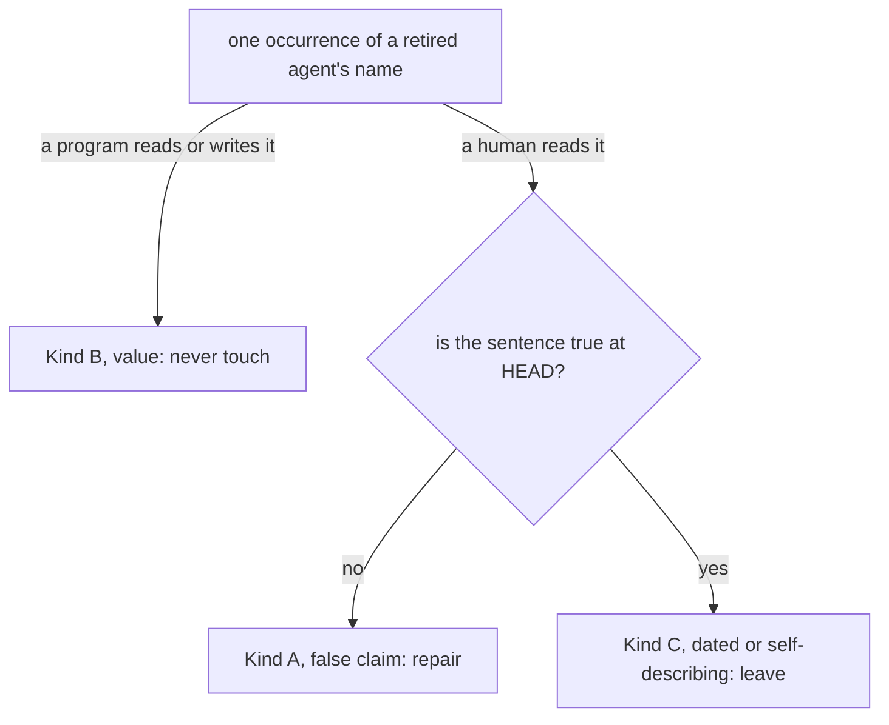

# Analysis: five retired agents and the container contradiction, read site by site

**Date:** 2026-09-11 13:16
**Type:** Document Study
**Status:** Complete
**Requested by:** orchestrator

## Question

Two defect records ask for one reading pass over the shipped text. The first
(`260910-2146_*_five-deleted-agents-are-still-named-as-live-in-twelve-shipped-files.md`)
says that five agent names deleted at v11 survive in the shipped text and proposes a
three-way split over the sites. The second
(`260911-1258_*_four-shipped-documents-say-the-container-store-went-at-v11-while-the-conventions-define-it-as-live.md`)
says four documents describe the per-work-item container as withdrawn while the conventions
define it as live. This analysis answers three things: whether the first record's split is
disjoint and complete, what each site actually is, and what each repair costs on a surface
that carries a failing growth bound.

## Scope

Read in full: both defect records; `rules/fusion-workbench-conventions.md` sections
`## fusion-workbench Layout`, `## Origin Rule`, `## Path Resolution`, `## Backlog entries`,
`## Project language` and `## Filename Patterns`; `README-hooks.md`
`### Growth bounds on the shipped text` and the two sections under it; every one of the 103
lines carrying a retired agent name, with surrounding context; the six documents that
describe the workbench layout to a reader; `hooks/lib/__tests__/surface-growth-bound.test.ts`
baselines and head-room; `hooks/lib/__tests__/fixtures/dispatch-path.baseline`;
`hooks/lib/__tests__/reference-resolution-lint.test.ts` corpus definition and pinned
baseline.

**Git state.** HEAD `fdac1cb0f8436a9f9d9f97975bccb3f5411b7e57`, committed 2026-09-11
13:00:11 +0200, branch `main`. `git status -sb` reports `## main...origin/main [voraus 1]`:
the tree is one commit ahead of its remote, with `orchestrator-events.jsonl` modified and the
two defect records renamed `_o_` to `_p_` in the working tree. Every present-tense claim
below is dated by that commit. Nothing was measured against the remote.

**Not in scope, and read only far enough to classify:** the archived and container stores
under `fusion-workbench/`, which carry the same names in frozen records.

## Findings

### 1. The population is 161 occurrences, not 148, and both measurements miss the same rows

The grep in the dispatch and the one in the defect record are case-sensitive. Three
occurrences escape them, and they are precisely the three the record names as its sharpest
instance: `agents/orchestrator.md:558`, `:559` and `:560` spell the word `Bugfixer`,
capitalised at the start of a table cell. Two gaps in the corpus account for the rest. `bin/` carries
three more occurrences in shell comments, and no `--include` pattern in either measurement
admits an extension-less executable.
`hooks/lib/__tests__/fixtures/dispatch-path.baseline` carries seven, in the hand-written
header recording what the v11 roster cut did to the per-dispatch-path bound, and no `*.md`
or `*.ts` filter reaches a `.baseline` file either.

| Measurement | Corpus | Count |
|---|---|---|
| the record's, 2026-09-10 | `rules/ agents/` | 27 |
| the dispatch's, at HEAD | `rules/ agents/ skills/ docs/ README*.md CLAUDE.md hooks/lib`, case-sensitive | 148 |
| this one, at HEAD | the same, case-insensitive | 151 |
| this one, at HEAD | the same plus `bin/`, `install.sh`, `templates/`, `.claude-plugin/`, with no extension filter | **161** |

The 161 spread over 103 lines in 36 files; the 148 the dispatch measured spread over 97. The dispatch is right that `rules/` and `agents/` are largely
swept: 9 occurrences remain there against the 27 the record measured, and 8 of the 9 are
correct as they stand. The record's own worked example of its first kind, the opening
paragraph of `rules/review-contract.md` naming `coderev` and `ontorev` as its two audiences,
no longer exists: that file now opens by naming `reviewer` as the one agent it is emitted to
(`rules/review-contract.md:6`). The record's first kind was therefore tested against a site
that was repaired before this reading began.

### 1a. Before re-running the count: `coderev` is a substring of `codereview`

So is `ontorev` of `ontoreview`. Those two are the review *folder* names retired on
2026-08-15, still named in migration and layout prose, so a pattern without word boundaries
counts 20 hits that are not agent names. Every figure above was taken with `\b`. The same
sweep without it returns 181, and the twenty sit here:

| File | Folder-name hits |
|---|---|
| `skills/migrate/SKILL.md` | 5 |
| `hooks/lib/__tests__/path-literal-lint.test.ts` | 5 |
| `rules/fusion-workbench-conventions.md` | 4 |
| `README-agents.md` | 2 |
| `skills/setup/SKILL.md` | 2 |
| `hooks/lib/citation-scan.ts` | 1 |
| `hooks/lib/staging-drift.ts` | 1 |

**Why the wrong figure is convincing.** 181 − 161 = 20, and 20 is also the combined count of
`docs/upgrading-to-v11.md` (13) and `hooks/lib/__tests__/fixtures/dispatch-path.baseline` (7),
the unique two-file subset of this corpus that sums to 20. Both are already inside the 161 and
already in the kind C table of section 6. So the boundary-less count arrives with a ready-made
explanation of itself: it looks exactly like a smaller reading that missed those two files. The
explanation survives a spot check of them and fails only a reconciliation file by file across
all 36. A spot check is not enough here; the per-file reconciliation is what settles it.

**A second trap compounds the first.** `grep` in these sessions is a shell function wrapping
ugrep, whose `-c -o` counts occurrences where `/usr/bin/grep -c` counts lines. A measurement
that names `grep` therefore does not say which program ran. Pin `/usr/bin/grep` wherever the
count is the finding, or count with `-o | wc -l`, which means the same under both.

**What it cost.** One correct reading was declared wrong, the declaration accepted, reversed,
and reversed again: four passes over one number, and a defect record filed against a correct
report. The hazard is filed as
`260911-1511_*_coderev-is-a-substring-of-codereview-so-a-sweep-without-word-boundaries-counts-two-retired-folder-names-as-agents.md`;
`260911-1422_*_the-retired-agent-readings-population-is-161-where-the-corpus-it-declares-holds-181.md`
is closed as not a defect.

### 2. The record's three-way split does not hold, and it fails in two independent ways

The record proposes: (1) a text that *addresses* a deleted agent, (2) a text that *cites* one
as an example, (3) a sentence whose *subject* is that the agent is gone.

**It is not disjoint, because kinds 1 and 2 are cut on a different axis from kind 3.** The
first two ask what the sentence does with the name, the third asks what the sentence asserts.
A single sentence answers both questions at once. `agents/coder.md:51` cites `bugfixer` as
the origin of the diagnose-before-editing contract, which is kind 2, and the same sentence's
subject is that the agent was removed at v11, which is kind 3. Under the record's cut that
site has two homes. So does every one of the six occurrences in
`hooks/lib/review-coverage.ts`.

**It is not complete, because two populations fall through both.** The dispatch names one of
them correctly. A token that is a **value a program reads or writes** is not a reference to a
role at all: `REVIEW_SENDERS` at `hooks/lib/review-coverage.ts:193` is the set of sender
segments the coverage scan recognises in filenames that are on disk in every workbench;
`MEASURED_AGENTS` at `hooks/lib/events-query.ts:443` is the population a duration reading
covers, fixed so that a reading taken today and one taken from the log's history measure the
same thing; the 21 review filenames in `hooks/lib/__tests__/review-coverage.test.ts` are the
inputs that prove the scan still parses a pre-merge file; `skills/migrate/SKILL.md:59`,
`:118` and `:175` insert `coderev` and `ontorev` into the filenames the migration writes,
because a file that came out of the old `codereview/` folder was written by `coderev` and the
sender segment is mandatory. Deleting any of these changes behaviour. Forty-three occurrences
are of this shape.

The second gap the dispatch hypothesised as separate turns out to collapse into kind 3, and
saying why is worth more than a fifth kind. A migration note that names `taskplanner` as live
is not asserting anything false, because the sentence carries its own date in its heading:
`docs/upgrading-to-v9.md:27` sits under a heading about upgrading to v9, where the agent
existed. The same holds for a measurement written down as evidence
(`hooks/lib/review-coverage.ts:29`, ten `coderev` files carrying four spellings of the range)
and for a provenance comment (`hooks/lib/__tests__/surface-growth-bound.test.ts:53`, quoting
the commit subject `feat(playmaker): introduce Circle portfolio agent`). All of them are true
at HEAD for the same reason a removal notice is true at HEAD: what they say about the present
is nothing, or that the thing is gone. One kind, one repair, and the repair is to leave them.

**Kind 2 is empty at HEAD.** Every site that would have been a stale example carries an
explicit past marker in the same sentence. `hooks/lib/__tests__/fusion-paths.test.ts:391`
reads "The negative example used to be `playmaker`. That agent went at v11". There is no
surviving site that offers a retired agent as a live illustration, so the kind the record
worried about costing bytes to rewrite has nothing in it. That is a finding about the state
of the tree, not about the kind: the sweep that cleared `rules/` and `agents/` appears to
have converted every such example rather than deleting it.

### 3. The corrected split: three kinds, cut on truth rather than on grammar

The question a repair actually answers is whether the occurrence asserts something false
about HEAD, and if it does not, whether anything depends on the token staying. Two questions,
in that order, produce a split that is disjoint and complete over all 161.



**Kind A: the occurrence asserts, in the present tense, something about HEAD that is false.**
The test is mechanical. Read the sentence as a claim about the tree as it stands, and check
it. "The reviewers (coderev, ontorev) run once per Circle" fails. "`taskplanner` now returns
its queue in a report" fails. Twelve occurrences across eight sites.

**Kind B: the occurrence is a value a program consumes or produces.** The test is whether
removing it changes what the program does. It is disjoint from A and C because a value makes
no claim: it is an input, an output, or an element of a set. Forty-three occurrences.

**Kind C: the occurrence is prose that is true at HEAD.** Two shapes, and they take the same
repair, which is none: the sentence says the agent is gone, or the sentence is dated by its
own frame and describes a past state correctly. One hundred and six occurrences.

**Why B and C are separated when both mean "leave".** The reasons differ and so do the
consequences of a careless sweep. Touching a B breaks a parser, a fixture or a migration.
Touching a C falsifies a record and breaks nothing. A later sweeper needs to know which risk
it is running, and the record's acceptance test, which asks that the grep return "only
sentences of the third kind", cannot be met at all: forty-three of the survivors are not
sentences. That is the concrete defect in the acceptance test, and the count below is what
should replace it.

### 4. Kind A, per site, with the repair and its cost

The surfaces and their margins, measured at HEAD: `agents/*.md` has 61 384 bytes of head-room
left; `skills/*/SKILL.md` has **zero**; the hook test suite has 78 lines; the per-dispatch
path bound is tightest at `reviewer` with 499 bytes, and none of these repairs touches that
path. `hooks/lib/*.ts`, `bin/`, `docs/` and the READMEs are on no bound.

| # | Site | What it says | Occ | Repair | Bounded surface | Delta |
|---|---|---|---|---|---|---|
| A1 | `agents/orchestrator.md:558-560` | "`bugfix_start` \| Bugfixer dispatched for a failed task", and the two rows under it | 3 | see below | `agents/*.md`, margin 61 384 | about −50, shrinks |
| A2 | `README.md:103` | "The reviewers (coderev, ontorev) run **once per Circle**, at its close" | 2 | "The reviewer runs once per work item, at its close, scoped by the coverage tiling" | none | n/a |
| A3 | `docs/fusion-intro.md:111` | "Reviewer (`coderev`, `ontorev`) legen ihre Befunde als Issues ab" | 2 | "Der Reviewer legt seine Befunde als Issues ab" | none | n/a |
| A4 | `hooks/lib/staging-drift.ts:17` | "and `taskplanner` now returns its queue in a report" | 1 | drop the clause: the queue went on 2026-08-15 and the agent that returned it went at v11, so the sentence has no live half left | none | requires `npm run build` in the same commit |
| A5 | `hooks/lib/__tests__/domain-cascade.test.ts:28` | "that domain is passed as the default to `taskplanner` and `reconciler`" | 1 | "to `reconciler`", which is the only consumer at HEAD (`agents/orchestrator.md:348`, `:592`) | hook tests, margin 78 lines | 0 lines |
| A6 | `hooks/lib/__tests__/staging-drift.test.ts:360` | "regenerated in full by every playmaker run" | 1 | reuse the wording the module itself already carries at `hooks/lib/staging-drift.ts:208`, "the ranking pass that wrote it, until v11 removed both" | hook tests | 0 lines if it fits one line, else +1 of 78 |
| A7 | `bin/fusion-count-sources:145` | "the `data` domain and the ontocoder/ontorev agents exist for" | 1 | "the `ontocoder` agent exists for" | none | n/a |
| A8 | `skills/migrate/SKILL.md:178` | "playmaker would see one Circle that is both `[a]` and `[t]`" | 1 | "a reader would see": the refusal is live, its stated reader is not | `skills/`, margin **0** | −3, shrinks |

**A1 in detail, because the record calls it the sharpest instance and it is sharper than the
record knew.** The three rows are not one case. `bugfix_success` and `bugfix_failure` have a
live emitter: `agents/orchestrator.md:275` and `:276` emit them from the self-healing branch
of Step 4, which now re-dispatches the same executor rather than a separate agent
(`agents/orchestrator.md:272`). Those two rows are true about what is emitted and false about
what emits it, so the repair is the When column, not the row. `bugfix_start` has **no emitter
anywhere in the prompt**: the branch that would fire it emits `task_error` instead
(`agents/orchestrator.md:273`). A table of the event kinds a session writes, listing one no
session can write, is the false claim.

We recommend deleting the `bugfix_start` row and rewriting the two survivors' When column to
name the re-dispatched executor. The alternative, adding an emission at Step 4 2a so the row
becomes true, is a behaviour change dressed as a text repair, and it would put two rows on one
moment that already has `task_error`. Renaming the two live kinds is refused for the reason
the `portfolio_refresh` row two lines below already gives in its own Detail column: a renamed
event kind splits the corpus a reader tiles closures from. One residual is created and should
be named in the commit rather than papered over: archived logs carry `bugfix_start` rows (one
is counted in the curator run of 2026-08-15), and after the deletion the table no longer
explains a kind a reader can still meet. `bin/monitor` is unaffected either way; it maps only
`bugfix_failure` to a CSS class (`bin/monitor:455`, `:1290`).

### 5. Kind B, per construct, all of it `leave`

| Site | Construct | Occ | Why it stays |
|---|---|---|---|
| `hooks/lib/review-coverage.ts:193` | `REVIEW_SENDERS` | 2 | the scan must keep recognising review files written before the merge; the module's own comment at `:183` already argues this |
| `hooks/lib/events-query.ts:443,445,446` | `MEASURED_AGENTS` | 3 | the set names the population that *was* measured; widening it would be a different measurement under the same name (`:432`) |
| `hooks/lib/__tests__/review-coverage-mandate.test.ts:71,196` | `RETIRED_SENDERS`, and the assertion that `hooks/tracker.ts` names no sender literally | 4 | holds "mandated" and "recognised" apart, which is the test's whole subject |
| `hooks/lib/__tests__/review-coverage.test.ts` (21 lines) | review-file fixtures | 21 | the inputs that prove a pre-merge filename still parses |
| `hooks/lib/__tests__/helpers/guard-harness.ts:447` | `REVIEW_PAYLOAD` | 1 | the probe path two suites write to |
| `hooks/lib/__tests__/path-literal-lint.test.ts:186,187,204` | `PROSE_THAT_MUST_NOT_FIRE` and `PATHS_THAT_MUST_FIRE` fixtures | 3 | frozen lines from the real tree at the time the lint was built |
| `hooks/lib/__tests__/domain-cascade.test.ts:714,728,738` | `MUST_NOT_FIRE` fixtures | 4 | the same, including the two adjacent table rows that measure the continuation window |
| `skills/migrate/SKILL.md:59,118,175` | the `codereview:coderev` sender-insertion pairs | 5 | the migration writes the historical sender into the filename; a file from `codereview/` was written by `coderev` |

### 6. Kind C, per file, all of it `leave`

One hundred and six occurrences over 28 files. No repair is recommended for any of them, and the
reason is the same in each case: read as a claim about HEAD, the sentence is true.

| File | Occ | Representative |
|---|---|---|
| `docs/upgrading-to-v11.md` | 13 | "five names no longer resolve" (`:72`) |
| `hooks/lib/__tests__/reference-resolution-lint.test.ts` | 15 | the pin re-approval log entries for the roster cut (`:481`, `:483`) |
| `hooks/lib/__tests__/fixtures/dispatch-path.baseline` | 7 | "`agents/coderev.md` and `agents/ontorev.md` merged into `agents/reviewer.md` at step C8" (`:57`), and the three rows removed without credit (`:81-82`) |
| `README.md` | 8 | "Five agent names stop resolving" (`:28`); the v10.26 note at `:30`, dated by its own heading |
| `hooks/lib/review-coverage.ts` | 6 | "`agents/coderev.md` and `agents/ontorev.md` then, one `agents/reviewer.md` since v11" (`:38`) |
| `hooks/lib/__tests__/surface-growth-bound.test.ts` | 6 | the six dropped baseline entries and the commit subject quoted at `:53` |
| `CLAUDE.md` | 5 | "Five prompts went at v11 and one arrived by merger" (`:16`) |
| `skills/help/SKILL.md` | 5 | "Five agent names stop resolving" (`:96`) |
| `docs/upgrading-to-v9.md` | 4 | "`taskplanner` returns its queue in a report instead" (`:27`), dated by the heading |
| `docs/upgrading-to-v10-26.md` | 4 | the seven agents that received a stopping time at that release (`:23`) |
| `hooks/lib/__tests__/executor-verification-report-lint.test.ts` | 4 | "It came from the removed bugfixer prompt and this is the only place it now lives" (`:152`) |
| `README-agents.md` | 3 | "One exception went at v11 and its guard went with it" (`:43`) |
| `docs/upgrading-to-v10-14.md` | 3 | "The per-Turn coderev/ontorev dispatch is retired" (`:7`) |
| `hooks/lib/events-query.ts` | 3 | "THE v11 ROSTER CUT DID NOT MOVE THIS SET, DELIBERATELY" (`:432`) |
| `hooks/lib/__tests__/rules-emission-golden.test.ts` | 3 | "`bugfixer` was the third until v11" (`:404`) |
| `rules/fusion-workbench-conventions.md` | 2 | "Older files carry the senders it replaced" (`:261`) |
| `agents/coder.md` | 2 | "the contract the `bugfixer` agent carried until v11" (`:51`) |
| `agents/ontocoder.md` | 2 | the same sentence (`:64`) |
| `hooks/lib/__tests__/review-coverage-mandate.test.ts:63` | 2 | the doc comment over `RETIRED_SENDERS` |
| `rules/review-contract.md:45` | 1 | "Ten `coderev` files in one store carried four spellings of the range" |
| `rules/workbench-path-resolution.md:146` | 1 | "`playmaker` read every store and went at v11" |
| `agents/orchestrator.md:272` | 1 | "`bugfixer` was removed at v11 and its diagnose-before-editing contract now lives in `coder` and `ontocoder`" |
| `docs/upgrading-to-v10-4.md:181` | 1 | the Circle-record rule's emission set at that release |
| `docs/working-model.md:164` | 1 | "A `playmaker` agent did until v11, and no replacement was built" |
| `hooks/lib/__tests__/path-literal-lint.test.ts:166` | 1 | the comment explaining where the fixture came from |
| `hooks/lib/__tests__/fusion-paths.test.ts:391` | 1 | "The negative example used to be `playmaker`" |
| `bin/fusion-review-coverage:49` | 1 | the measurement in the script header |
| `bin/fusion-rules:304` | 1 | "the list carried six before that commit and five after `playmaker` was deleted" |

### 7. Count per kind

| Kind | Occurrences | Sites (lines) | Files | Repair |
|---|---|---|---|---|
| A, false at HEAD | 12 | 10 | 8 | repair |
| B, value | 43 | 37 | 8 | leave |
| C, dated or self-describing | 106 | 56 | 28 | leave |
| **total** | **161** | **103** | **36** | |

The file column does not sum: six files carry two kinds each. `agents/orchestrator.md` is A
and C, `skills/migrate/SKILL.md` is A and B, and `hooks/lib/review-coverage.ts`,
`hooks/lib/events-query.ts`, `hooks/lib/__tests__/review-coverage-mandate.test.ts` and
`hooks/lib/__tests__/path-literal-lint.test.ts` are each B and C.

### 8. The layout contradiction: six documents, twelve sentences

The defect record names four documents. Two more carry the same claim, and one of them is on
the zero-margin `skills/` surface.

What is true at HEAD, and measured rather than asserted:
`rules/fusion-workbench-conventions.md` `## fusion-workbench Layout` shows
`circles/<stamp>-<slug>/` holding the item record plus `planning/`, `issues/`, `decisions/`,
`reviews/`, `analyses/` and `history/`; `## Origin Rule` is written in the present tense and
decides container against `shared/`; `bin/fusion-paths:387` values `OUT_BACKLOG` and
`SCAN_BACKLOG` as `circles`; `skills/setup/SKILL.md:69` creates `fusion-workbench/circles`
and creates no `shared/backlog` at all. A `shared/backlog/` directory does exist in this
repository's own workbench, holding two stranded legacy entries, which is tracked separately
as `260910-2020_*_the-two-existing-backlog-entries-keep-the-retired-marker-form-that-d1-migrates-into.md`.
It is an orphan, not a store the resolver names.

| # | Site | The false sentence | Repair |
|---|---|---|---|
| L1 | `README.md:147` | "**One kind, one store**, and every store lives under `shared/`" | "One kind, two candidate stores: a work item's own container, and `shared/` for work belonging to no item" |
| L2 | `README.md:149-154` | the tree, showing `shared/backlog/` and no `circles/` | the tree below |
| L3 | `README.md:157` | "**There is no placement decision to make**"; "A per-unit-of-work container under `circles/` stood here from v4 until v11" | state the Origin Rule as live: an artifact belongs to the work item whose directive caused it, and to `shared/` when no item is in scope; delete the withdrawal claim |
| L4 | `README-agents.md:240` | "**One kind, one store, and every store is under `shared/`**", "there is no placement decision left to make" | as L1 and L3 |
| L5 | `README-agents.md:242-252` | the tree, with `backlog/` and no `circles/` | the tree below |
| L6 | `README-agents.md:255` | "A per-unit-of-work container stood under `circles/` from v4 until v11, each directory holding its own copy of every store, with an Origin Rule to decide which copy an artifact belonged to" | present tense, and name what actually went: the six-state record and the ranking layer. `/fusion:migrate` converts a workbench that still holds a live Circle *record*, not one that has containers |
| L7 | `docs/fusion-intro.md:96` | "Bis v11 war die Arbeitseinheit ein *Circle*: ein Verzeichnis unter `circles/` mit eigenem Record, sechs Markern und einer eigenen Kopie jedes Stores. Diese Schicht ist entfallen" | half true and therefore the most misleading of the twelve: the six markers and the ranking went, the directory and its own copy of every store did not. Keep the sentence, narrow "diese Schicht" to the six states and the ranking |
| L8 | `docs/fusion-intro.md:147-157` | the tree, with `backlog/` | the tree below, in German |
| L9 | `docs/fusion-intro.md:160` | "**Es gibt keine Ablageentscheidung mehr**"; "Bis v11 stand hier ein Verzeichnis je Arbeitseinheit unter `circles/`" | as L3, in German: the Herkunftsregel is live and decides container against `shared/` |
| L10 | `docs/philosophy.md:39` | "A unit of work is a **work item**: one file, carrying its Directive and its state, in the project's backlog" | "one directory, holding its record and everything the item produces" |
| L11 | `docs/working-model.md:52` | "**A per-unit-of-work container stood here from v4 until v11.**" | the same document says the opposite at `:11` ("An item lives at `fusion-workbench/circles/<stamp>-<slug>/`"): delete the withdrawal paragraph and keep what the six-state record and the ranking layer lost |
| L12 | `skills/help/SKILL.md:63` | "one store per artifact kind, all of them under `shared/`"; "**There is no placement decision to make**"; "Until v11 each unit of work had a directory of its own carrying a copy of every store, and an Origin Rule decided which copy an artifact belonged to; that whole layer went" | as L1 and L3, and it must not grow: see the cost note below |

**What every one of the four trees should show**, reduced from
`rules/fusion-workbench-conventions.md` `## fusion-workbench Layout` and no more than that:

```
fusion-workbench/
├── circles/                      # one directory per work item
│   └── <stamp>-<slug>/           # the item's record, plus what the item produced
│       ├── <stamp>-<slug>.md
│       └── planning/ issues/ decisions/ reviews/ analyses/ history/
├── shared/                       # the same kinds, for work belonging to no item
│   ├── planning/ issues/ decisions/ reviews/ analyses/
│   ├── history/ investigations/ consult/ memos/ forum/ checkouts/
├── archive/  stilwerk/  monitor
└── (root-anchored state: orchestrator-events.jsonl, .guard-state/,
     .commit-lock/, .session-marker, .checkout-id, .cadence-anchors)
```

No tree carries a `backlog/` entry, and the word "backlog" survives only as the name of the
concept, which is what `$OUT_BACKLOG` resolves to `circles` for.

**L12 is the only one of the twelve with a byte cost, and the surface has none to give.**
`skills/*/SKILL.md` stands at exactly its budget, 224 308 bytes against a floor of 202 397
plus 21 911 of head-room, so the next byte turns the suite red. The false clause at
`skills/help/SKILL.md:63` is 242 bytes long, and deleting it is what funds the true
statement. Our estimate is that the repair lands between 100 bytes down and break-even, and
we state plainly that this is an estimate: the writer must run
`cd hooks && npx vitest run lib/__tests__/surface-growth-bound.test.ts` before committing,
and must not raise `SKILL_HEAD_ROOM` to absorb an overshoot. The ruling that authorised the
last two raises
(`260910-2256_*_may-the-growth-bounds-be-raised-for-the-duration-of-the-container-restoration.md`)
scoped them to the restoration work, and a third raise would need its own ruling and its own
written-down figure.

### 9. What no repair may move, and what it costs if one does

`hooks/lib/__tests__/reference-resolution-lint.test.ts` pins
`{ paths: 1522, anchors: 232, stampBare: 11 }` over a corpus that includes `rules/`,
`agents/`, `docs/`, `templates/`, every `skills/*/SKILL.md`, the READMEs, `CLAUDE.md`, and
the shell comments in `bin/`. Adding or removing a plugin-file path token, or a
`file.md` `## Section` anchor, in any of those moves a counter and requires a re-approval
entry written into the pin log in place, with no line added.

None of the repairs recommended here moves either counter, and that is checked rather than
assumed: the kind A repairs change bare agent names, not paths, and the layout repairs change
workbench paths, which are not plugin-file paths. Two consequences follow. The dangling
`agents/coderev.md` and `agents/bugfixer.md` tokens in `hooks/lib/review-coverage.ts:38` and
`hooks/lib/__tests__/executor-verification-report-lint.test.ts:117` are invisible to that
gate by construction, because `hooks/lib` enters the corpus with `recordsOnly: true` and the
test tree does not enter it at all. And a layout repair that decides to cite
`rules/fusion-workbench-conventions.md` `## Origin Rule` by anchor, which would be the
natural thing to do in `README-agents.md`, moves `anchors` and needs the pin entry.

## Implications

The first record's split was written from a corpus of 27 occurrences in two directories and
does not survive contact with the other 134. Its acceptance test is unmeetable as written,
because it asks a grep to return only sentences and forty-three of the survivors are values.
The corrected split gives the commit something it can actually state, and the count per kind
above is what it should state.

The second record understates its own subject in two ways that matter. It names four
documents where six carry the claim, and one of the two it misses is on the only shipped
surface with no bytes left. It also treats the six sites as independent, where two documents
contradict themselves internally: `README.md` says the container was withdrawn at `:157` and
tells a reader to file a work item under `circles/` at `:165`; `docs/working-model.md` says
it was withdrawn at `:52` and gives the container's exact path at `:11`. A reader of either
document alone cannot resolve that, which is a sharper failure than a single stale sentence.

The two subjects meet in exactly one sentence, `README.md:103`, which names two retired agents
and the retired unit in one clause. Repairing that sentence twice, once per record, is how a
repair becomes unattributable, which is the same argument the vocabulary sweep used when it
left this work alone.

## Recommendations

**The order of work is by document, not by subject.** The two records overlap in
`README.md`, `README-agents.md` and `docs/fusion-intro.md`, and `README.md:103` belongs to
both. Do each document once.

1. **`README.md`**: L1, L2, L3 and A2 in one pass. No bound, no gate.
2. **`README-agents.md`**: L4, L5, L6. If the repair cites a heading anchor, write the pin
   re-approval entry in the same commit.
3. **`docs/fusion-intro.md`**: L7, L8, L9 and A3, in German, per the artifact-language rule
   for a document whose whole body is German.
4. **`docs/philosophy.md`** L10 and **`docs/working-model.md`** L11. Both unbounded.
5. **`skills/help/SKILL.md`** L12. Measure the surface bound before and after. This is the
   one step that can fail, and it fails loudly rather than silently.
6. **`skills/migrate/SKILL.md`** A8. Three bytes down, which the same surface needs.
7. **`agents/orchestrator.md`** A1. Delete the `bugfix_start` row, rewrite the two
   survivors' When column, and name the residual in the commit message.
8. **`hooks/lib/staging-drift.ts`** A4, then `npm run build` **in the same commit**:
   `hooks/lib/__tests__/committed-dist.test.ts` fails the suite when the committed `dist/` is
   not the compilation of the committed source, and `hooks/dist/lib/staging-drift.js` carries
   the comment being edited.
9. **`hooks/lib/__tests__/domain-cascade.test.ts`** A5, **`staging-drift.test.ts`** A6,
   **`bin/fusion-count-sources`** A7. Keep A5 and A6 to zero added lines.
10. `npm test`, and state the per-kind count (12 / 43 / 106 over 161) in the commit message,
    which is what the first record's acceptance asks for.

Steps 1 to 6 are independent of 7 to 10 and can be split into two commits. Step 8 is the only
one with a same-commit obligation.

**Leave 149 of the 161 occurrences alone.** For kind B that is not a preference but a
correctness requirement. For kind C it is the cheaper answer: each one is already true, and
rewriting a true sentence spends bytes on four bounded surfaces to change nothing a reader
would learn.

## Filed Issues

None. This dispatch was scoped to analysis, and both defects already have records.

## Sources

- `260910-2146_*_five-deleted-agents-are-still-named-as-live-in-twelve-shipped-files.md`
- `260911-1258_*_four-shipped-documents-say-the-container-store-went-at-v11-while-the-conventions-define-it-as-live.md`
- `rules/fusion-workbench-conventions.md` `## fusion-workbench Layout`, `## Origin Rule`, `## Backlog entries — work items`, `## Filename Patterns`
- `README-hooks.md` `### Growth bounds on the shipped text`, `#### The 2026-09-11 raises, and the reduction read on 2026-10-10`
- `hooks/lib/__tests__/surface-growth-bound.test.ts:327-433` (baselines and head-room), `hooks/lib/__tests__/fixtures/surface-growth.golden`
- `hooks/lib/__tests__/fixtures/dispatch-path.baseline`
- `hooks/lib/__tests__/reference-resolution-lint.test.ts:96-131` (corpus), `:471` (pinned baseline)
- `agents/orchestrator.md:258-280` (Step 4 and the self-healing branch), `:545-575` (the event table)
- `hooks/lib/review-coverage.ts:1-45`, `:178-195`; `hooks/lib/events-query.ts:420-450`; `hooks/lib/staging-drift.ts:8-28`, `:208`
- `bin/fusion-paths:387`, `skills/setup/SKILL.md:69`, `bin/monitor:455`, `:1290`
- every line listed in the three tables above, read with surrounding context

## Open Questions

- [ ] **A1, the `bugfix_start` row.** We recommend deletion. Deciding it firmly needs one
      thing we could not settle from the tree: whether anyone reads the orchestrator's event
      table as the dictionary for an existing `orchestrator-events.jsonl`, or only as the
      list of what a session may emit. If the former, the row stays with a rewritten Detail,
      the way `portfolio_refresh` did.
- [ ] **L12's exact byte delta.** Estimated between −100 and 0, not measured, because the
      replacement text is not written yet. On a surface at zero margin the estimate is not
      good enough and the bound must be run.
- [ ] **L7, how much of the German Circle account to keep.** The sentence is half true, and
      how much history a reader's first orientation should carry is an editorial call, not a
      correctness one.
- [ ] **`hooks/lib/__tests__/domain-cascade.test.ts:728`.** The fixture label reads
      `playmaker.md:31-32` and names a file that is gone. The fixture text is load-bearing
      and stays. Whether the label should say so costs a few bytes on a line-bounded surface
      and buys a reader little. We would leave it, without much conviction.

## Defects found outside this scope

Named here and left, per the dispatch.

1. **Two documents name a retired selector vocabulary.** `README.md:167` and
   `docs/fusion-intro.md:140` both tell the reader to run `/fusion:cleanup --only
   log-activity`. `CLAUDE.md:20` records that the `--only`/`--skip` selectors went with the
   end-of-session pipeline, and `/fusion:log-activity` is now its own command. Both sentences
   sit in the paragraphs this repair pass will already be editing.
2. **The record's and the dispatch's grep are case-sensitive.** Both measurements miss the
   three capitalised rows the first record calls its sharpest instance, and both corpora
   exclude `bin/`, where three more occurrences sit. Any future sweep of this shape should
   use `-i` and include the extension-less executables.
3. **A lint fixture calls `shared/backlog/` "the backlog store".**
   `hooks/lib/__tests__/path-literal-lint.test.ts:205` is correct as a fixture, since the
   string must fire, and its label is the stale half. Cosmetic, and on a line-bounded surface.
