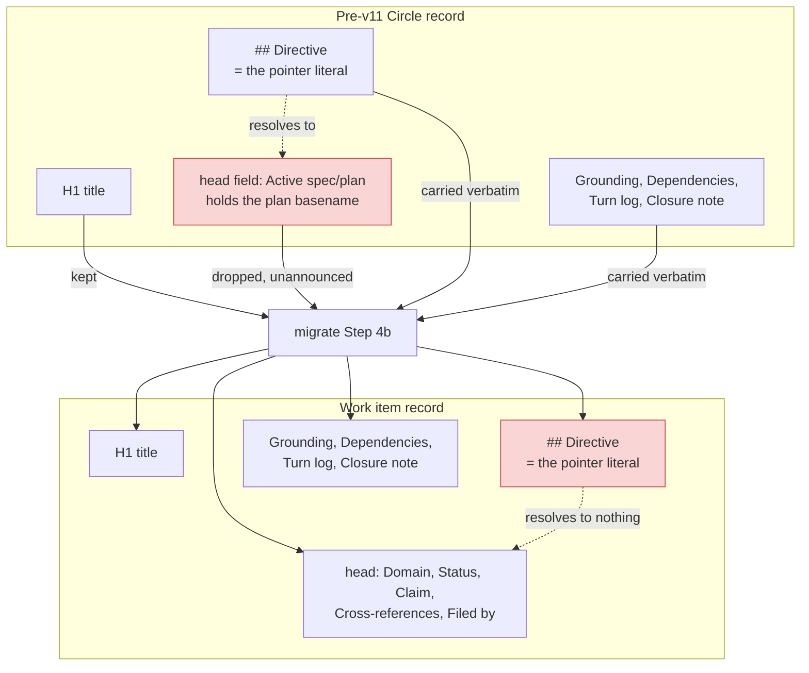

# Analysis: the Directive pointer at v11, and what the migration does to a record carrying one

**Date:** 2026-09-15 19:22
**Type:** Document Study
**Status:** Complete
**Requested by:** orchestrator (relaying a decision record from a consuming project)

## Question

A consuming project recorded a deviation: it set a Circle record's `**Active spec/plan:**` field
and declined to perform the coupled Directive-pointer swap, because the plan it cited deliberately
does not restate the Directive. The record closes by saying the general question belongs to fusion
and that neither of the project's two records settles it. Three questions follow from that. What
does `/fusion:migrate` do to a record whose `## Directive` already is the pointer literal; whether
`hooks/lib/citation-scan.ts` still keys anything on the retired `**Active spec/plan:**` field; and
whether a work item's Directive may be a pointer in the grammar that replaced the Circle.

## Scope

Read at HEAD `1401a71d` (2026-09-15, branch `main`, `git status -sb` reports
`## main...origin/main` with ten modified paths and five untracked records, none of them in the
files below): `rules/fusion-workbench-conventions.md`, `skills/migrate/SKILL.md`,
`hooks/lib/citation-scan.ts`, `docs/upgrading-to-v11.md`, `docs/upgrading-to-v10-2.md`,
`agents/orchestrator.md`, `rules/circle-records.md` at `76d833be^`. Plugin version 11.2.0.
Every present-tense claim below is dated by that commit.

Also read, as the duplicate check `rules/fusion-workbench-conventions.md` `## Record filing`
mandates: the open records in `shared/issues` and `shared/decisions`, and — because the first pass
over the shared stores alone would have missed all of it — the issue and decision stores inside
the work-item containers under `circles/`.

## Findings

### The retired rule, and what it said

`rules/circle-records.md` does not exist at HEAD. `git log --oneline -1` on that path names
`76d833be`, "the work item replaces the Circle". The pointer literal it defined, read at
`76d833be^:rules/circle-records.md:294` rather than reconstructed:

```
See `**Active spec/plan:**` above. The cited spec or plan states the Directive in force.
```

The literal cites the **field**, never the path the field holds, and the rule states the reason at
`76d833be^:rules/circle-records.md:297`: a pointer naming the path would be a second copy of the
path, and the field may hold a qualifying sentence or more than one path. That choice is the hinge
of the first finding below.

No shipped body at HEAD carries the swap obligation. `agents/orchestrator.md` has no
`## Circle head fields` section. A grep for `Active spec/plan` over `agents/`, `rules/`, `skills/`,
`bin/`, `hooks/`, `docs/`, `README*.md` and `CLAUDE.md` returns five lines: one in
`skills/migrate/SKILL.md:180`, one docstring line in `hooks/lib/citation-scan.ts:132`, and three in
`docs/upgrading-to-v10-2.md`, which is release history.

### Question 1 — the migration: a real finding, and already filed

`skills/migrate/SKILL.md` Step 4b rewrites a live record's head block and carries the body
"verbatim, from `## Directive` down" (line 152). The head block it writes (lines 140-148) holds
`**Domain:**`, `**Status:**`, `**Claim:**`, `**Cross-references:**` and `**Filed by:**`.
`**Active spec/plan:**` is not among them, and the Circle record's template
(`76d833be^:rules/circle-records.md:131`) put that field in the head. So the field is dropped and
the pointer that names it is carried across.

The consequence is sharper than a pointer at a plan that later archives. Because the literal cites
the field and not the path, the path was only ever in the field, and the field goes in the same
command. The migrated item's whole statement of intent becomes a sentence naming something absent
from the file, and the plan it was pointing at is named nowhere in the item record. Neither the
survey the user confirms nor the Step 5 report says a word about it.



**Reachability is high, and the case is the ordinary one.** The v10.2 rule fired on every write
that moved the field off `(none yet)`, so any Circle that got as far as a spec or plan under v10.2
through v10.26 carries the pointer. Exactly those live records (`_a_`, `_t_`) are what Step 4b
opens; terminal ones it never touches. In fusion's own workbench,
`grep -rl "See \`**Active spec/plan:**\` above" fusion-workbench/ | wc -l` returns 14 files, and
`grep -rl "Active spec/plan" fusion-workbench/ | wc -l` returns 136.

**This is already filed.** `260911-0715_*_the-migration-drops-two-head-fields-unannounced-and-leaves-the-directive-that-points-at-one-of-them.md`,
open, in the issue store of the work item `260909-1700-cut-fusion-to-working-minimum` rather than
in the shared one, which is why an `ls` over the shared store alone does not show it. It names
both halves — the unannounced drop and the dangling pointer — calls the pointer shape "the common
shape for any Circle that got as far as a spec", records how a hand conversion (step S10) answered
it, and carries an acceptance test. Our independent reading confirms every element of it. Nothing
is added by a second file.

One face of the defect that record does not name: Step 4b line 140 titles the item
"the record's H1, or the Directive's first sentence where it has none". Where a record has no H1
and its Directive is the pointer, the item is titled `See **Active spec/plan:** above.`
*Inference*: the Circle template always carried an H1, so this reaches only records written before
that template, and we found no instance on disk.

### Question 2 — the citation gate: no finding

`hooks/lib/citation-scan.ts:132` is inside a docstring, and it is the only occurrence of the
string in `hooks/`. The implementation of the exemption sits at line 1077 and reads
`kind === "stamp-bare" && isHeadFieldValue(before, after)`. It keys on the token's shape, a bare
stamp, and on its position as the whole value of a head line. No field name enters the test.

The docstring line is not a stale pattern but the counter-example that bounds the exemption: a head
field whose value carries a marker or a name stays a citation. The example still resolves against
this tree, where 136 files carry that field, live containers among them. The mechanism is neither
inert nor dead, and it does work for pre-v11 records the workbench keeps. Filing anything here
would be the cosmetic finding the dispatch forbids.

### Question 3 — may a work item's Directive be a pointer

**In the current grammar, no, and by removal rather than by prohibition.**
`rules/fusion-workbench-conventions.md` `## Backlog entries — work items` gives the item six head
fields — `**Domain:**`, `**Status:**`, `**Claim:**`, `**Depends-on:**`, `**Cross-references:**`,
`**Filed by:**` — and none of them names an artifact. Its `## Directive` template reads "One
paragraph: what this item aims for, and how a reader would know it was reached." There is no field
for a pointer to cite, so the v10.2 pointer form is unspellable rather than forbidden.

That is the answer to the consuming project's general question, and it settles it in the project's
own favour. Their Option 1 — field set, Directive prose kept — is what the grammar that replaced
the Circle mandates outright. It is a deviation only from a rule their installed version still
carries; at fusion 11.2.0 there is nothing to deviate from. The reciprocal also holds: a plan that
declines to restate the Directive, which their record and two of fusion's own planner runs did
independently, is simply correct now, because the record that outlives the plan is where the
Directive lives.

**The fork has been met four times inside fusion's own workbench**, and two of the four records are
open:

| Record | State | Where |
|---|---|---|
| `260821-2004_*_what-happens-to-the-directive-when-the-plan-a-circle-runs-on-deliberately-does-not-state-one.md` | deferred by the user, 2026-08-29 | decisions of `260821-1042-reply-bounded-whole-question-answered` |
| `260907-2003_*_what-does-the-directive-pointer-swap-do-when-the-cited-plan-declines-to-restate-the-directive.md` | open, reconciled twice, second instance appended | decisions of `260907-0829-message-between-checkouts-read-before-pull` |
| `260910-2011_*_a-work-item-has-no-field-for-the-plan-it-runs-on-so-the-closure-step-lost-its-source.md` | open | issues of `260909-1700-cut-fusion-to-working-minimum` |
| `260911-0715_*_the-migration-drops-two-head-fields-unannounced-and-leaves-the-directive-that-points-at-one-of-them.md` | open | issues of `260909-1700-cut-fusion-to-working-minimum` |

The second of those is now moot as posed. Its three options each modify machinery the v11 cut
removed on 2026-09-10: the swap obligation, `rules/circle-records.md`, and the orchestrator's
`## Circle head fields`. Its last reconciliation is stamped 260908-1814, two days before the
removal. Both containers holding the first two records are terminal (`_c_circle.md`), and
`260824-2013_*_do-archive-and-terminal-circles-stores-enter-any-scan-set-or-is-the-exclusion-written-down.md`
answered option 5: a terminal container's stores are deliberately out of every scan and reachable
only by naming the container as `bin/fusion-paths`' second argument. So no routine pass will read
either record again. That is a decided exclusion, not a defect, and we do not reopen it.

What survives the removal, and is live, is the third record: the item grammar has no field for the
artifact the work runs on. The consuming project's Constraints section states the same requirement
in its own words — the Directive must stay readable in a file that outlives the plan — and the
current grammar satisfies it, since the Directive stays in the item record and nothing points away
from it.

**Nothing tells a v10-habit project any of this.** `docs/upgrading-to-v11.md` never mentions the
Directive, the pointer literal or the swap. Its "What left" row describes the Circle-to-item change
as a marker-to-field change. Check 1 tells the user to run `/fusion:migrate` and says the migration
"surveys first, shows you what it will move, and asks before moving anything". Its "What needs no
action" section opens "Your existing records. No issue, decision, plan, review, analysis or history
file was rewritten, renamed or moved by this release." That enumeration excludes the Circle record,
so the sentence is accurate as far as it goes, and a reader takes from the pair that the migration
only moves files. Step 4b renames the record and rewrites its head in place, and
`skills/migrate/SKILL.md:109` is explicit that this is the one thing that is not a move. The
upgrade note, which is what a user reads before running the pass, is not.

## Implications

The consuming project needs no ruling from fusion and should be told so. The rule its record weighs
against is retired, and the behaviour it chose is what the current grammar requires. What the
project does need is a warning before it migrates, because its records are in exactly the state
Step 4b damages.

For fusion, the shipped defect is one record short of complete. The migration's behaviour is filed
and evidenced. The surface that sends a user into the migration is not, and it is the surface a
user reads first.

## Recommendations

Ranked by what it costs to leave undone. The decision is the user's.

1. **Fix the migration, per the acceptance test already in `260911-0715_*_...`.** It is the only
   finding here that destroys content, the loss is one-way, and every project upgrading mid-work
   with a spec is in its path. Reuse what exists rather than inventing: `**Cross-references:**` is
   already defined for "a record it rests on", and `rewrite_fields` in the same skill already
   rewrites a stale path field rather than dropping it, on the stated ground that a field naming a
   file that no longer exists degrades without announcing it.
2. **Say in `docs/upgrading-to-v11.md` check 1 that converting a live record rewrites its head in
   place and drops two fields.** One paragraph, no code. Filed below.
3. **Rule or retire `260907-2003_*_...`.** Its question dissolved with the machinery on 2026-09-10,
   and it sits in a store no scan reaches. Reaching it costs one `bin/fusion-paths` call naming its
   container.
4. **Nothing on `hooks/lib/citation-scan.ts`.**

Route: 1 and 2 to `coder` after the user rules; 3 to `reconciler` with the container named.

## Filed Issues

- `260915-1922_*_the-v11-upgrade-note-describes-the-migration-as-moves-only-while-step-4b-rewrites-a-live-records-head.md`,
  filed in the shared issue store, no item being in scope.

Not filed, and why: the migration defect is already open as
`260911-0715_*_the-migration-drops-two-head-fields-unannounced-and-leaves-the-directive-that-points-at-one-of-them.md`,
and the general Directive question is already open as `260907-2003_*_...` and deferred as
`260821-2004_*_...`. Per `## Record filing`, the duplicate hits take an `Also seen:` line rather
than a second file; that line is an edit to records outside an analyst's write targets, so it is
recommended to the orchestrator rather than performed here.

## Sources

- `rules/circle-records.md` at `76d833be^`: 131 (the head field), 147 (the template's Directive), 284-322 (the invariant), 294 (the pointer literal), 297 (why it cites the field)
- `skills/migrate/SKILL.md`: 109, 140-152, 180
- `rules/fusion-workbench-conventions.md`: `## Backlog entries — work items`, `## Record filing`, `## Path Resolution` (the second argument), `## Terminal states are history`
- `hooks/lib/citation-scan.ts`: 132 (docstring), 1077 (the exemption)
- `docs/upgrading-to-v11.md`: "What left", check 1, "What needs no action"
- `docs/upgrading-to-v10-2.md`: 32, 66, 78, 108
- `agents/orchestrator.md` (no `## Circle head fields` at HEAD)
- `260911-0715_*_the-migration-drops-two-head-fields-unannounced-and-leaves-the-directive-that-points-at-one-of-them.md`
- `260910-2011_*_a-work-item-has-no-field-for-the-plan-it-runs-on-so-the-closure-step-lost-its-source.md`
- `260907-2003_*_what-does-the-directive-pointer-swap-do-when-the-cited-plan-declines-to-restate-the-directive.md`
- `260821-2004_*_what-happens-to-the-directive-when-the-plan-a-circle-runs-on-deliberately-does-not-state-one.md`
- `260824-2013_*_do-archive-and-terminal-circles-stores-enter-any-scan-set-or-is-the-exclusion-written-down.md`

## Open Questions

- [ ] Whether the consuming project has upgraded past v10.26. Its records are in the shape Step 4b
      damages, and the answer decides whether the warning is urgent or historical.
- [ ] Whether `260907-2003_*_...` is ruled or marked retired. Its question no longer has a subject,
      and the decision vocabulary defines no transition for a question dissolved by removal; the
      `Retired:` line the `_a_` and `_i_` rows describe is written beside a marker that does not
      move, and `_o_` has no equivalent.
