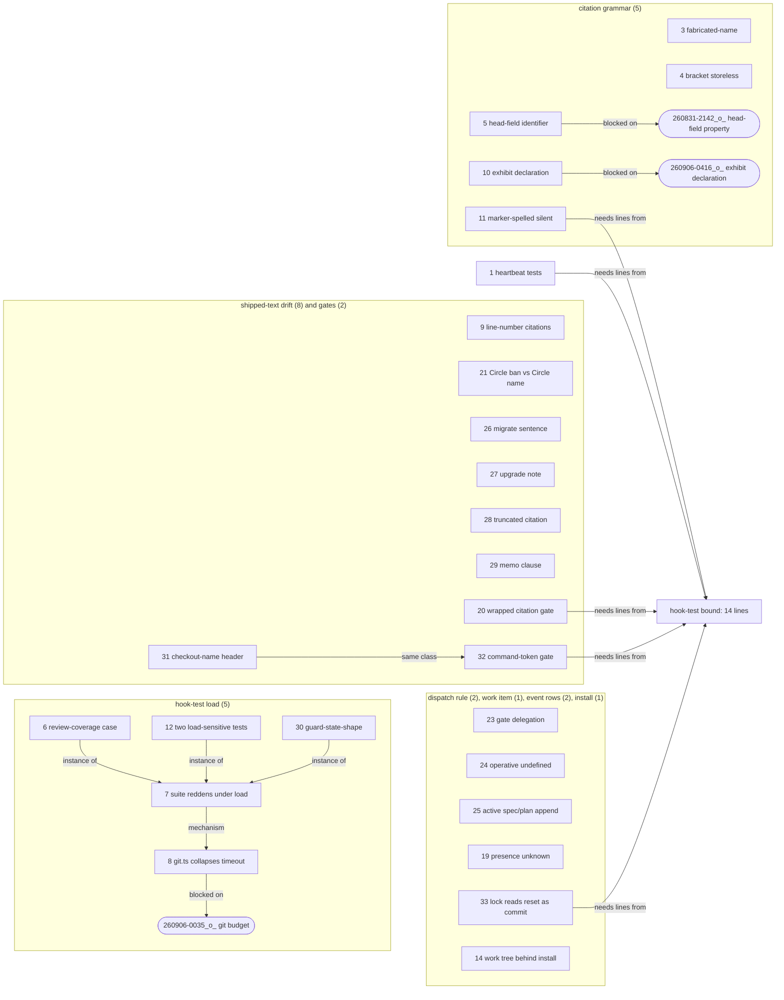

# Analysis: the 33 open defect records, classified against HEAD at fusion 11.9.1

**Date:** 2026-09-21 16:53
**Type:** Gap
**Status:** Complete
**Requested by:** orchestrator (task ISSUES-SURVEY, on the user's request "Untersuch mal was wir an offenen Issues noch so haben")

## Question

Which of the open defect records in the shared issue store still describe a defect the tree carries at HEAD, which describe one the tree has already lost without the record being closed, and which have no subject left to fix? And, for the ones still present, which are one dispatch away from closing and which wait on a ruling first?

## Scope

Every `*_o_*.md` under `$SCAN_ISSUES` (the shared store; no work item is in scope, so the resolver names that store alone). Enumerated by `ls fusion-workbench/shared/issues/*_o_*.md | wc -l` → 33, exit 0; no `_p_` record exists there. Each record was read in full and its stated defect re-checked against the tree with the command or file:line cited in its row.

Tree: `/Users/k1/Projects/productive/fusion`, HEAD `6157af3c` (2026-09-21 16:45:36 +0200), branch `main`, `git status -sb` → `## main...origin/main`, one modified file (`fusion-workbench/orchestrator-events.jsonl`), nothing else. The tree is level with its remote, so every present-tense claim below is dated to that commit.

Prior survey that overlaps: `260905-2158-the-nine-open-defects-after-loop-1-and-what-loop-2-should-do.md` covered six of these 33 (`260827-0410`, `260828-0044`, `260830-2235`, `260831-0748`, `260831-2121`, `260905-2134`); the classification here is re-taken at HEAD rather than carried over. The closure pass `f55e8a44` (2026-09-20, eighteen records) had already removed the records whose subject a deletion commit took, which is why the obsolete column below is short.

The three bounded surfaces, measured now because several fixes land on them (`hooks/lib/__tests__/surface-growth-bound.test.ts`, budget minus `surface-growth.golden` total): `agents/*.md` 11 572 bytes of margin, `skills/*/SKILL.md` 770 bytes, hook tests **14 lines**.

## Findings

### The table

State: **present** = the defect can still be shown at HEAD; **fixed** = the tree no longer carries it, the record was never closed; **obsolete** = the subject no longer exists.

| # | Record (marker wildcarded) | State | Evidence at HEAD | Theme |
|---|---|---|---|---|
| 1 | `260827-0410_*_the-machine-written-event-rows-ship-with-wiring-asserts-only-because-the-hook-test-surface-is-full.md` | present, narrowed | Dispatch rows are now covered: `hooks/lib/__tests__/guard-state-shape.test.ts:253-330`, three cases asserting `task_start` with `task`, `agent`, `session_id`, `detail`. The `agentstate.yaml` gate is gone (`6357ebfc`), so that case is moot. Not covered: the heartbeat's refresh and its negative (`grep -rln heartbeatSessionMarker hooks/lib/__tests__/` → nothing), and `person`/`checkout` on a dispatch row. | hook-test coverage |
| 2 | `260828-0044_*_thirty-four-of-sixty-two-records-filed-on-260827-carry-no-person-half-after-the-reach-was-settled.md` | fixed | Re-measured over every `2609*` record under `issues/`, `decisions/`, `reviews/` in the live tree, archive excluded: 330 files, 329 carry `**Filed by:** <agent>, Name <email>`; the one miss is a `_c_` record with no `Filed by` line at all. The history kind, the original count's bulk, is closed to writes since `0ec15cb9` (latest history stamp `260910-2215`). | record attribution |
| 3 | `260830-2235_*_the-fabricated-name-exemption-keys-on-the-literal-foo-so-every-realistic-probe-fixture-is-read-as-a-real-citation.md` | present | `hooks/lib/citation-scan.ts:527` `const FABRICATED_NAME = /(?:^\|[^A-Za-z0-9])foo(?:[^A-Za-z0-9]\|$)/;` and `:1076` applies it as the whole test. No decidable keying property proposed anywhere in the tree. | citation grammar |
| 4 | `260831-0748_*_a-storeless-bracket-marked-citation-is-invisible-while-a-store-prefixed-one-is-reported.md` | present | `REC_RE` (`citation-scan.ts:383`) admits `[` in its tail via `REC_TAIL`; `BARE_RE` (`:443`) takes `MARKER_SLOT` (`:272`, underscore form only). The header `:164-190` restates the "not read, on purpose" stance and does not state the asymmetry as a decision. | citation grammar |
| 5 | `260831-2121_*_the-head-field-exemption-reads-only-a-bare-stamp-so-a-name-shaped-identifier-in-a-head-field-is-judged.md` | present | `citation-scan.ts:1084` `kind === "stamp-bare" && isHeadFieldValue(...)`; `grep -rn IDENTIFIER_HEAD_FIELDS hooks/` → nothing. Blocking decision `260831-2142_*_which-property-separates-a-head-field-identifier-from-a-head-field-citation.md` stands `_o_`. | citation grammar |
| 6 | `260905-2134_*_review-coverage-test-fails-in-a-full-suite-run-and-passes-in-isolation.md` | present | Subsumed by row 7 on its own terms (`260905-2356` `## What this record replaces`); the same case reddened again on 260907 and 260908 after the vitest change `ea17e354` (row 11's second observation). Its sibling `260904-2140` is `_c_`; this one was left open. | hook-test load |
| 7 | `260905-2356_*_the-hook-suite-is-not-isolated-from-a-second-copy-of-itself-and-fails-at-forty-percent-under-one.md` | present | Its acceptance (ten concurrent pairs at one commit, 0 of 20 red, or a stated single-instance rule) has not been run since `ea17e354`; `hooks/vitest.config.mjs` reports a 3×3 = 9-of-9 measurement, a different experiment. Observations after that commit: rows 11 and 24. The mechanism it names, `hooks/lib/git.ts`, is row 8. | hook-test load |
| 8 | `260906-0035_*_the-git-helper-reports-a-timeout-as-not-a-repository-in-every-consuming-project.md` | present | `hooks/lib/git.ts:55` `GIT_TIMEOUT_MS = 5_000`; `:60-61` "`null` covers every way git can decline — not a repository, a ref that does not resolve, a non-zero exit, the timeout". Last commit to the file `f1099c5f`, before the record. Blocking decision `260906-0035_*_what-should-the-git-helpers-budget-be-and-is-a-timeout-retried.md` stands `_o_`. | hook-test load |
| 9 | `260906-0335_*_nine-of-twelve-line-number-citations-in-shipped-text-name-the-wrong-line-and-no-gate-resolves-one.md` | present, narrowed | `path:N` tokens in `agents skills rules README*.md CLAUDE.md docs` at HEAD: 3 (down from 12 plus the reviewer's 6 in `README-agents.md`, removed by `258d5dae`). Two are one citation, `rules/fusion-workbench-conventions.md:68` → `skills/setup/SKILL.md:49`, and it is wrong: line 49 is Probe 2 (the unmarked flat file), the two-live-trees probe is line 50. The third, `README-hooks.md:292` → `docs/philosophy.md:19`, is past tense and historical. No gate resolves a line number (`reference-resolution-lint.test.ts` scans per line for paths and anchors only). | shipped-text drift |
| 10 | `260906-0416_*_a-project-may-widen-the-citation-corpus-and-never-narrow-it-so-an-exhibit-has-no-declarable-form.md` | present | `templates/fusion.json` `_citations`: `extraPaths` is the one live setting and only adds; `citation-scan.ts:481` `RECORD_EXAMPLE_FILES` is still a literal. Blocking decision `260906-0416_*_should-a-project-be-able-to-declare-a-record-an-exhibit-and-what-does-that-declaration-cover.md` stands `_o_`. | citation grammar |
| 11 | `260908-0027_*_the-write-time-citation-check-is-silent-on-the-class-that-produced-every-violation-of-this-session.md` | present | `hooks/lib/citation-form.ts:168` `REPORTED_STATUSES = ["store-prefixed", "stale-marker"]`; a token spelling the current marker still resolves and is silent. | citation grammar |
| 12 | `260908-0032_*_two-hook-tests-are-load-sensitive-and-fail-only-in-the-parallel-full-run.md` | present | Observed 260908, after `ea17e354` (260906); its six-run acceptance has not been run. One lead it carries and nobody has pulled: the tracker emitted the staging-drift sentence where the test expected the review-coverage one, a single output slot rather than slowness. | hook-test load |
| 13 | `260908-0920_*_v10-24-1-is-tagged-and-was-never-entered-in-the-marketplace.md` | obsolete | The marketplace entry the record measured at `10.24.0` reads `11.9.1` (`/Users/k1/Projects/productive/claude-plugins/.claude-plugin/marketplace.json`, its HEAD `57ab4e3 chore(fusion): bump to 11.9.1`); `install.sh:27` and `README.md:26` both pin `v11.9.1`. The tag `v10.24.1` still exists and never will be entered; the record itself said the gap closes at 10.25.0. Its residual, "which tags may be partial", is a process statement `README-agents.md` `## Releasing` does not carry. | release / marketplace |
| 14 | `260908-1324_*_a-work-tree-behind-the-install-hides-skills-the-install-has-and-nothing-warns.md` | present | `bin/fusion-paths:212,233`: the exit-2 message names the agent/skill shape and not the work-tree preference; `skills/check/SKILL.md` `## upstream` measures behind-the-remote, not behind-the-install; `hooks/session-start.ts` warns on the subdirectory case only. | install / resolver |
| 15 | `260909-1345_*_the-size-analysis-understates-the-always-on-peak-and-the-august-cut.md` | fixed (erratum on disk) | The analysis it corrects is write-once and unchanged. The correction is `260909-1345-verification-of-the-size-versus-bookkeeping-analysis.md` items C1, C2, filed the same minute; the consumer of the analysis, `260909-1615_*_spec-cut-fusion-to-a-working-minimum.md`, cites the verification. Nothing in the tree can move further. | analysis errata |
| 16 | `260909-1347_*_the-eightfold-bookkeeping-rise-excludes-337-legacy-stamped-records-from-the-two-anchor-months.md` | fixed (erratum on disk) | Same verification record, item O1; same consumer citation. | analysis errata |
| 17 | `260909-1348_*_recommendation-7-names-an-archive-confirmation-the-cleanup-pipeline-does-not-put.md` | fixed (erratum on disk) | Same verification record, item C6. | analysis errata |
| 18 | `260909-1349_*_finding-17s-setup-pointer-claims-name-the-wrong-agents.md` | fixed (erratum on disk) | Same verification record, item C7. | analysis errata |
| 19 | `260910-2144_*_presence-cannot-name-what-another-checkout-is-working-on-because-no-event-row-carries-it-any-more.md` | present | `bin/fusion-events:65-70`: "Since 2026-09-10 no row carries that field … every line renders `unknown`". The statement sits in the header, not in the output the acceptance asks for; no session row carries a work item; no decision record on whether one should exists (`ls shared/decisions | grep -i 'session-row\|presence'` → nothing). | event-log rows |
| 20 | `260911-0752_*_a-citation-wrapped-across-a-line-break-is-checked-by-neither-class-and-fails-silently.md` | present | `reference-resolution-lint.test.ts` `scanPluginPaths` and the anchor scan iterate `for (const { line, text } of lines)`; nothing joins adjacent lines (`grep -in 'wrap\|adjacent\|joined'` → only the header's "adjacent form" for the anchor spelling). | shipped-text gates |
| 21 | `260911-0752_*_the-user-facing-style-rule-bans-a-noun-in-one-line-and-requires-it-in-another.md` | present | `rules/user-facing-output.md:45` "No fusion noun. Not Circle, …"; `:60` "Every `AskUserQuestion` is self-contained: Circle name, path or task title inside the question text". | shipped-text drift |
| 22 | `260911-1511_*_coderev-is-a-substring-of-codereview-so-a-sweep-without-word-boundaries-counts-two-retired-folder-names-as-agents.md` | fixed | The acceptance's deliverable exists: `260911-1316-five-retired-agents-and-the-container-contradiction-read-site-by-site.md:73` carries the word-boundary hazard and `:96-97` the ugrep/`/usr/bin/grep` pin, beside the figures. The remaining half ("any later pass states its pattern") is a habit no file can hold. | measurement hygiene |
| 23 | `260913-1108_*_the-gate-determination-is-delegated-to-an-analyst-that-holds-no-more-of-the-gate-list-than-the-caller.md` | present | `rules/fusion-workbench-conventions.md:243` still reads "An `analyst` determines whether one is present"; `bin/fusion-rules analyst` emits no `agents/*.md`; `agents/analyst.md` carries no gate-determination type. | dispatch rule |
| 24 | `260913-1108_*_the-positive-dispatch-rule-turns-on-an-undefined-word-and-leaves-both-exclusions-bound-to-the-orchestrator-alone.md` | present, sharpened | "operative agent" at `rules/fusion-workbench-conventions.md:241`, `README-agents.md:45`, `README-agents.md:300`, undefined. The exclusions live only at `agents/orchestrator.md:608` ("Never invokes"); the consultant-side line the record cited at `agents/consultant.md:150` is gone (`grep -in orchestrator agents/consultant.md` → nothing), so the exclusion now has one site, not two. | dispatch rule |
| 25 | `260915-2143_*_the-active-spec-plan-field-is-append-only-and-nothing-says-what-a-second-plan-does-to-it.md` | present | `agents/orchestrator.md:217` "beside any value already there — a spec and the plan drawn from it both stand"; `:441` disambiguates the spec/plan pair only. | work-item grammar |
| 26 | `260915-2144_*_a-compressed-sentence-in-migrate-now-says-the-conventions-admit-the-shape-they-forbid.md` | present | `skills/migrate/SKILL.md:183` "… no defined state, which the conventions admit and no consumer handles." | shipped-text drift |
| 27 | `260915-2145_*_the-v11-upgrade-note-is-maintained-as-live-in-one-commit-of-this-range-and-frozen-in-the-other.md` | present | `docs/upgrading-to-v11.md:25` names four `**Status:**` values; the set is five. `4d692c57` (2026-09-21) edited the file again for the mode field, so the live-maintenance side has since gained a third commit, and the file still states no position. | shipped-text drift |
| 28 | `260916-0830_*_a-guardrail-citation-is-truncated-so-no-gate-reads-it-and-no-reader-resolves-it.md` | present | `skills/archive/SKILL.md:258` carries `260811-1534_*_does-the-guard-event-log-get-an-upper-bound…` with the ellipsis and no `.md`; line 112 of the same file carries the full form, and the target resolves to one file (`shared/decisions/…_i_…`). | shipped-text drift |
| 29 | `260916-0831_*_the-memo-body-does-not-carry-the-empty-checkout-clause-the-conventions-now-bind-it-by.md` | present | `skills/memo/SKILL.md:37` names `$CO` as the `CHECKOUT=` line and defers "the rest" to the conventions by citation; no halt clause at the filename step (`grep -in 'halt\|exit 3\|exit 5\|no line' skills/memo/SKILL.md` → nothing). | shipped-text drift |
| 30 | `260916-1943_*_guard-state-shape-fails-three-cases-under-suite-load-and-passes-in-isolation.md` | present | Observed 260916, after `ea17e354`; not reproduced deliberately; no record states a measurement. Third post-fix observation of row 7's mechanism. | hook-test load |
| 31 | `260916-2144_*_the-holder-naming-section-documents-a-command-a-consumer-and-a-field-shape-that-are-all-gone.md` | present | `bin/fusion-checkout-name:228-232`: "`/fusion:next` Step 6.1 is the worked case: it reads the claim's `<person>, checkout <id>` … `held by <person> on <alias>`". `skills/next/` absent from `ls -1 skills/`. Last commit to the file `10978bff` (260916 22:00) postdates the record and left the section. | shipped-text drift |
| 32 | `260916-2145_*_a-gates-remediation-text-names-two-commands-that-do-not-exist-and-no-gate-resolves-a-command-token.md` | present | `hooks/lib/__tests__/domain-cascade.test.ts:519-520` "the route /fusion:next, /fusion:direct and /fusion:reconcile take". Over the shipped surface, `/fusion:<name>` tokens naming no `skills/` directory: `migrate-workbench-v2`, `next`, `direct`, `log-activity`, `circle-stash`, `circle-pop` (the record's set), all but this one and row 31 historical. | shipped-text gates |
| 33 | `260918-0834_*_the-lock-reads-any-head-movement-as-a-landed-commit-so-a-reset-inside-the-held-region-writes-a-row.md` | present | `bin/fusion-commit-lock` `emit_commit_event`, sixth line of the body: `[ "$head" = "$before" ] && return 0`, then `commit_is_log_only`; no reflog or commit-object test. `grep -n reset hooks/lib/__tests__/fusion-commit-lock.test.ts` → nothing. Last commit to the script `9c7f2575` (260915), before the record. | event-log rows |

### Counts, read off the table

- **present**: rows 1, 3, 4, 5, 6, 7, 8, 9, 10, 11, 12, 14, 19, 20, 21, 23, 24, 25, 26, 27, 28, 29, 30, 31, 32, 33 → **26**
- **fixed**: rows 2, 15, 16, 17, 18, 22 → **6**
- **obsolete**: row 13 → **1**

26 + 6 + 1 = 33.

Two of the six "fixed" verdicts are judgement calls and are marked as such in the table: rows 15–18 (an erratum against a write-once analysis; the wrong sentence stays in the analysis forever, the correction is on disk and cited by the consumer) and row 22 (the acceptance's written half was met at filing; the other half is a habit). If the user reads "fixed" as "the wrong text is gone", those five move to "present" with no possible fix, which is the same closing action with a different `Resolved:` sentence.

### The themes

Coherence check: four subgraphs, one shared sink (`bound`), no cycles; every edge is a relation the rows above state. The five edges into `bound` are the one structural finding of this pass: any fix that adds a test case lands on a surface with 14 lines of head-room, so those five compete for a cut before any of them can land.

| Theme | Rows | present / fixed / obsolete |
|---|---|---|
| hook-test load | 6, 7, 8, 12, 30 | 5 / 0 / 0 |
| hook-test coverage | 1 | 1 / 0 / 0 |
| citation grammar | 3, 4, 5, 10, 11 | 5 / 0 / 0 |
| shipped-text drift | 9, 21, 26, 27, 28, 29, 31 | 7 / 0 / 0 |
| shipped-text gates | 20, 32 | 2 / 0 / 0 |
| dispatch rule | 23, 24 | 2 / 0 / 0 |
| work-item grammar | 25 | 1 / 0 / 0 |
| event-log rows | 19, 33 | 2 / 0 / 0 |
| install / resolver | 14 | 1 / 0 / 0 |
| analysis errata | 15, 16, 17, 18 | 0 / 4 / 0 |
| record attribution | 2 | 0 / 1 / 0 |
| measurement hygiene | 22 | 0 / 1 / 0 |
| release / marketplace | 13 | 0 / 0 / 1 |

### Within "present": one dispatch, or a ruling first

**One dispatch** (the fix is mechanical and the record's acceptance names it; the surface each lands on is noted where its margin matters):

| Row | Fix | Surface and margin |
|---|---|---|
| 9 | Rewrite the one wrong citation at `rules/fusion-workbench-conventions.md:68` to name Probe 3 by its bullet text, not a line; with `## Filename Patterns` already mandating anchors in living text, the "something keeps them repaired" half is a lint refusing `` `path:N` `` tokens in shipped prose, which costs test lines (see the bound). | rules (no bound); lint on hook tests (14 lines) |
| 21 | One edit at `rules/user-facing-output.md:60`: "the work item's title or the user's own words for the job" in place of "Circle name". | rules |
| 26 | Reword `skills/migrate/SKILL.md:183` to "a shape the conventions do not admit and no consumer handles", byte-neutral. | skills (770 bytes) |
| 28 | Restore the full basename at `skills/archive/SKILL.md:258`, about +70 bytes; line 112 has the spelling. | skills (770 bytes) |
| 29 | One clause at `skills/memo/SKILL.md:37`: no `CHECKOUT=` line, halt and report; cadence step 1 has the wording. | skills (770 bytes) |
| 31 | Rewrite `bin/fusion-checkout-name:225-235` to keep the bound (the alias never enters a comparison) and drop the `/fusion:next` narrative and the `checkout <id>` parse. | bin |
| 32, text half | Replace the three commands at `domain-cascade.test.ts:519-520` with "the route `/fusion:reconcile` takes" or with no command name. Zero net lines. | hook tests |
| 24 | Define or drop "operative" at `conventions.md:241` and state the two exclusions (consultant, orchestrator) as project-wide there; `README-agents.md:45,300` follow. | rules, README |
| 25 | State at `agents/orchestrator.md:217` that adopting a second plan replaces the plan value and keeps the spec; the closure step at `:441` then reads one plan. The alternative (keep both, qualify) is the record's own second option; the dispatch names one. | agents (11 572 bytes) |
| 14 | Extend the exit-2 message at `bin/fusion-paths:212,233` with the work-tree-preference clause and the two remedies (`git pull` vs `fusion --update`). | bin |
| 33 | Replace the inequality with a test for a commit object created inside the region (the record names two candidates, reflog entry kind or committer date against region start; the executor measures which holds under amend and replay) and add the reset case. | bin; test lines (14) |
| 11 | Add a third reported status for a token spelling the cited record's current marker, computed as the sweep already computes it; plus its case. | hooks; test lines (14) |
| 20 | Join a filename token ending a line with an anchor opening the next before classifying, and state the count of wrapped citations the commit found. | test lines (14) |
| 1 | The heartbeat refresh and its negative, and `person`/`checkout` on a dispatch row: three cases. | test lines (14) |
| 6, 12, 30 | No fix of their own: they close when row 7's experiment is re-run and reported. The one lead worth a dispatch before any budget moves is row 12's single-output-slot observation. | — |

**Ruling first** (the record's acceptance offers two routes and says the choice is not the executor's, or an open decision record already holds the question):

| Row | The question | Where it stands |
|---|---|---|
| 8, and through it 7, 6, 12, 30 | What the git helper's budget is and whether a timeout is retried. | `260906-0035_*_what-should-the-git-helpers-budget-be-and-is-a-timeout-retried.md`, `_o_`, recommendation standing, no ruling. `260811-2009_*_is-the-hooks-suite-meant-to-be-run-concurrently-with-itself-and-if-not-who-serialises-it.md` is `_i_` (option 2, the fork cap) and did not end the observations, so it does not answer this. |
| 5 | Which decidable property separates a head-field identifier from a head-field citation. | `260831-2142_*_which-property-separates-a-head-field-identifier-from-a-head-field-citation.md`, `_o_`, its plan's recommendation refuted by a measurement appended to it; a fourth direction named there and never put to the user. |
| 10 | Whether a project may declare a record an exhibit, and what the declaration covers. | `260906-0416_*_should-a-project-be-able-to-declare-a-record-an-exhibit-and-what-does-that-declaration-cover.md`, `_o_`. |
| 3 | What decidable property, if any, exempts a realistic fixture; the record forbids a wider substring list on §2 and §4 grounds. | No decision record carries it. The record's own last section says the question is open and stops. |
| 4 | Whether the grammar reads the storeless bracket form, reversing the header's stated stance, or the header states the asymmetry as a decision. | Adjacent but not the same question: `260830-1842_*_may-the-grammar-resolve-a-bracket-marked-record-that-a-frozen-store-keeps-permanently.md`, `_o_`, is about resolving, this is about seeing. No record holds the seeing half. |
| 19 | Whether the `session_start` row carries the claimed work item, so presence can name it again. | No decision record; the issue asks for one. Adjacent: `260918-0804_*_what-stops-two-checkouts-from-working-one-job-when-the-work-hangs-on-no-item.md`, `_o_`, the no-item case. |
| 23 | Which mechanism gives a dispatched agent the gate list, or replaces the delegation: always-on bytes on all eleven paths at zero head-room, or a rule the analyst can follow. | `260913-0909_*_may-the-orchestrator-reach-every-tool-and-may-an-agent-dispatch-another.md` is `_i_` and predates the reviewer's finding; a new record is owed. |
| 27 | Whether `docs/upgrading-to-v11.md` tracks live v11 behaviour or is frozen at `v11.0.0`. | No record; the file has now been edited three times on the live side (`950a606e`, `9d5b1e80`, `4d692c57`) while `:25` stays frozen, so the tree is drifting toward "live" without anyone having said so. |
| 32, gate half | Whether a `/fusion:<name>` token becomes a pinned class, and what exempts the four historical mentions. | No record. |

## Implications

The store is not stale in the way a 33-count suggests: 26 of the 33 describe something the tree still does, and the six closable ones are closable by a `Resolved:` line each, no code. What the survey does show is where the open work actually sits.

Five records are one phenomenon. Rows 6, 7, 12 and 30 are four observations of the suite reddening under load, and row 8 is the mechanism three of the four diagnoses point at. They have been accumulating since 260905 and every one of them says the same thing: a green run is not acceptance. Nothing closes them but the ten-pair experiment, and that experiment is pointless before `260906-0035_o_` rules on the git budget, because a widened budget changes the result. That ruling is the single highest-leverage open decision in the store: it unblocks five records.

Five fixes compete for 14 lines. Rows 1, 11, 20, 32 and 33 each add a test case, and the hook-test surface has 14 lines of head-room at HEAD. The record at row 1 has been waiting on exactly this since 260827. A cut on that surface precedes any of them, and the growth-bound rule says the way out is a cut, never a baseline edit.

Seven text repairs are cheap and independent. Rows 9, 21, 26, 28, 29, 31 and the text half of 32 are each a few bytes at a known line, inside the margins measured above (skills: 770 bytes, three of the seven land there, roughly 150 bytes together). They fit one dispatch as a package, the way `260918-1048-defekte-selbstaendig-abarbeiten-mit-zweitmeinung` and `260920-2151-sieben-neue-defekte-selbstaendig-abarbeiten` packaged theirs.

Three records ask for decisions nobody has filed: rows 3, 19 and 23 (and 27, 32-gate). Each says so in its own body. A defect whose acceptance is "a ruling is recorded" and whose ruling has no record cannot progress by dispatch, and these have sat that way for one to three weeks.

The classification exposed one drift in progress: `docs/upgrading-to-v11.md` gained a third live-side edit on 2026-09-21 (`4d692c57`) while the reviewer's record about its undeclared stance stayed open. Every edit tips it further toward "live" without the file saying so.

## Recommendations

1. **Orchestrator, no dispatch:** close rows 2, 13, 15, 16, 17, 18 and 22 with the `Resolved:` sentence each row's evidence column gives (row 13 as obsolete: the marketplace passed the tag). Put to the user first whether rows 15–18 and 22 close as "fixed" or "erratum recorded, nothing further possible"; the marker move is the same.
2. **User, one ruling:** `260906-0035_o_` (git budget, retry). Then one coder dispatch to `hooks/lib/git.ts` and the ten-pair experiment from row 7, which closes rows 6, 7, 8, 12, 30 together or narrows them to the single-output-slot lead in row 12.
3. **One coder dispatch, package:** rows 9 (the citation only), 21, 26, 28, 29, 31, 32-text, 24, 25, 14. All text or a shell message; no test lines; three land on `skills/` inside 770 bytes.
4. **One cut on the hook-test surface before** rows 1, 11, 20, 33 and the lint half of 9. Whoever cuts names the lines; the five fixes then land in one dispatch.
5. **Analyst or orchestrator, four decision records to file** where the issue asks for one and none exists: row 3 (the fixture exemption's keying property), row 19 (a work-item field on the session row), row 23 (how the gate list reaches a dispatched agent), row 27 (the upgrade note's stance). Row 32's gate half can ride row 27's record or its own.
6. **Not filed here, for the orchestrator to file:** `hooks/vitest.config.mjs` (the comment block opening "Answering", above `const half`) cites `260811-2009_*_is-the-hooks-suite-meant-to-be-run-concurrently-with-itself-and-if-not-who-serialises-it.md` with the shared decision store's segment in front of it, in a `.mjs` file outside every citation corpus (`reference-resolution-lint` scans `.ts` under `hooks/`; `citations.extraPaths` is unset here). Not one of the 33; found while verifying row 7.

## Filed Issues

None. The dispatch constrained this pass to read-only on every record; the one new defect found is in recommendation 6 for the orchestrator to file.

## Sources

- `fusion-workbench/shared/issues/*_o_*.md`, all 33, read in full
- `hooks/lib/citation-scan.ts:164-190, 272, 383-391, 443-446, 481, 527, 554, 1076-1084`
- `hooks/lib/citation-form.ts:54-57, 168`
- `hooks/lib/git.ts:55-78`
- `hooks/vitest.config.mjs` (whole file)
- `hooks/lib/__tests__/guard-state-shape.test.ts:236-330`; `hooks/lib/__tests__/helpers/guard-harness.ts:770-830`
- `hooks/lib/__tests__/reference-resolution-lint.test.ts:39, 146, 300-330`
- `hooks/lib/__tests__/domain-cascade.test.ts:519-520`
- `hooks/lib/__tests__/surface-growth-bound.test.ts:327-485` and `fixtures/surface-growth.golden` (margins computed as budget minus golden total)
- `hooks/lib/orchestrator-events.ts:27-36, 85, 211-234, 249-283, 526`
- `bin/fusion-commit-lock:355-380`; `bin/fusion-checkout-name:225-235`; `bin/fusion-events:62-70` and `bin/fusion-events presence` at HEAD; `bin/fusion-paths:212, 233`
- `rules/fusion-workbench-conventions.md:68, 241-247`; `rules/user-facing-output.md:45, 60`
- `agents/orchestrator.md:217, 441, 608`; `agents/consultant.md` (grep, no orchestrator line)
- `skills/migrate/SKILL.md:183`; `skills/archive/SKILL.md:112, 258`; `skills/memo/SKILL.md:30-45`; `skills/setup/SKILL.md:44-52`; `skills/check/SKILL.md:277-298, 349`
- `docs/upgrading-to-v11.md:25` and its `git log`
- `README-agents.md:45, 300, 333-367`; `README.md:26`; `install.sh:27`; `.claude-plugin/plugin.json`
- `/Users/k1/Projects/productive/claude-plugins/.claude-plugin/marketplace.json` and its HEAD
- `260905-2158-the-nine-open-defects-after-loop-1-and-what-loop-2-should-do.md`, `260906-0026-what-shared-state-the-hook-suite-reaches.md`, `260909-1345-verification-of-the-size-versus-bookkeeping-analysis.md`, `260911-1316-five-retired-agents-and-the-container-contradiction-read-site-by-site.md` (lines 73, 96-97)
- `260909-1615_*_spec-cut-fusion-to-a-working-minimum.md` (cites the verification)
- the shared decision store's listing, for the `_o_` records cited
- `git log` on: `hooks/vitest.config.mjs`, `hooks/lib/git.ts`, `bin/fusion-commit-lock`, `bin/fusion-checkout-name`, `docs/upgrading-to-v11.md`, `hooks/lib/__tests__/guard-state-shape.test.ts`; `git show --stat f55e8a44`
- Person-half re-measurement: `find shared circles -path '*/archive/*' -prune -o \( -path '*/issues/*' -o -path '*/decisions/*' -o -path '*/reviews/*' \) -name '2609*.md' -print`, then `/usr/bin/grep -lE '^\*\*Filed by:\*\* .*<.*@'` over the list (330 / 329)

## Open Questions

- [ ] Rows 15–18 and 22: does an erratum against a write-once record close as fixed, or does the store want a distinct closing sentence for "nothing further possible"? The conventions define `Resolved:` only.
- [ ] Row 12's single-output-slot lead (tracker emitting the staging-drift sentence where review-coverage was expected): nobody has read the two reporters against each other. If real, it is a defect the budget question cannot fix and would be hidden by any widened budget.
- [ ] Whether `activity-log-k1.md` at the project root (login-keyed, the legacy name `## Filename Patterns` says `/fusion:cadence` adopts on its next run) has been left unadopted on purpose; outside this survey's 33, noticed in the command-token grep.
