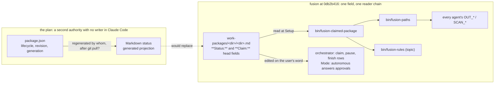

# Analysis: the "fusion dual host" design package, read against fusion as it is

**Date:** 2026-09-27 23:04
**Type:** Document Study, with gap and risk sections
**Status:** Complete
**Requested by:** orchestrator (checkout `114caf11`, person Kai Stalmann <ks@qantr.com>), audience user

## Recommendation

Accept the boundary and send the plan back before FH00 starts. The ownership split the boundary draws (Prior owns execution, authority, persistence and recovery; fusion owns roles, workflow rules, record meaning and migrations) is the same split the user already adopted in `nomenclature.md` `## Ownership boundary` and in the treatment table ruled on 2026-09-24, so that part is settled and the package restates it correctly. The plan, though, is written as if fusion had no recorded position on its subject: it cites none of the eleven decision records in `work-packages/260922-1038-prior-mapping/decisions/`, and four of its proposals reverse rulings that stand there. It also breaks three fusion invariants that no decision has reopened, and its dispatch-path budget does not close.

What to send back, in this order:

1. **FH00 starts from the recorded rulings, not from section 3 of the plan.** The eleven records (seven stamped `260922-1059`, three `260922-1114`, one `260922-1125`) already answer where `.guard-state/` goes, what an `issues/` record is, who owns the checkout registry, what happens to `history/`, `memos/` and `stilwerk/`, and which treatment the nine paths the nomenclature omits take. FH00 step 2 ("record the decisions in section 3 with identical contract identifiers in both repositories") would write a second authoring home over an existing one. The contract decision the boundary asks for as package A exists on the fusion side; what is missing is the Prior side's mirror of it.
2. **The work-package origin bound.** `rules/fusion-workbench-conventions.md` `## Work packages` states that no agent originates a work package; the user files. The `work-package-manager` profile ("selecting and forming work packages across a campaign", boundary lines 105 to 108; Prior's catalog gives it `writes_workbench: true`) and the `candidates/` store feeding package admission (boundary lines 51 and 241 to 243, plan FH11 step 1) are that bound's negation. Neither document names the bound. Either the user's word remains the admission step, which is the orchestrator's File row, or the bound is changed by a decision record filed in fusion. The `candidates/<id>.json` store also contradicts the ruling in `260922-1059_*_is-a-record-in-issues-a-candidate-or-an-admitted-work-item.md`: one `issues/` store, the marker is the classification.
3. **The lifecycle field and what reads it.** The plan replaces the five `**Status:**` values with `open, active, paused, closed` plus an outcome (plan lines 131 to 136) and makes the Markdown status a generated projection (boundary lines 221 to 222, plan lines 127 to 129). `bin/fusion-claimed-package` reads `**Status:** claimed` and `**Claim:**` out of that Markdown to decide which container every agent writes into; `bin/fusion-paths` and `bin/fusion-rules` both call it (conventions `## Path Resolution`, Contract). A projection nobody regenerates after a `git pull` in a Claude Code checkout, where no daemon runs, is a resolver reading stale scope. FH07 names `fusion-paths` and `fusion-rules` as change surfaces and does not say their input changes.
4. **The byte bound before FH03.** `agents/*.md` may grow by 18 000 bytes in total before the suite goes red, a new prompt spends the head-room in full, and the per-dispatch-path bound has zero head-room across eleven rows (`README-hooks.md` `### Growth bounds on the shipped text`; `hooks/lib/__tests__/rules-emission-golden.test.ts:934`). The smallest existing prompt is 12 255 bytes (`agents/code-implementer.md`). Five new prompts and two review profiles composed from "existing substantial instructions" (plan FH03 step 1) do not fit; the plan's "explicit measured budgets" (FH03 step 6) is a phrase where a ruling on the bound is needed, and `CLAUDE.md` `## Conventions` says the way out of a red bound is a cut, never an edit to a baseline. Three agent merges were already stopped on this bound (`README-agents.md` `## Plugin structure`).
5. **Tool restriction reverses a ruling.** FH07 step 2 ("a general Bash tool cannot remain available while the role is claimed read-only") reverses `260913-0909_*_may-the-orchestrator-reach-every-tool-and-may-an-agent-dispatch-another.md`, under which the last `tools:` line was deleted, and it collides with the reviewer's own contract: `rules/review-contract.md` mandates `git rev-parse --short` for the `**Reviewed-range:**` field. The question "can this role write" is decidable by tool absence, so the proposal is not the undecidable classifier `rules/critical-stance.md` §4 warns about; it is a reversal with an unpriced cost, and fusion measured a frontmatter change of this kind breaking every agent's load once (v2.8.1, rolled back in 2.8.3).
6. **The Claude Code distribution as drawn is incomplete.** `dist/claude-code/` (boundary lines 145 to 151) lists `.claude-plugin`, `agents`, `skills`, `hooks`, `bin`, `rules`. `install.sh:82-83` copies those plus `stilwerk`, `templates`, `docs` and the three READMEs, and `/fusion:setup` seeds the voice profiles from `stilwerk/`. The tarball must run with no build step (`README-agents.md` `### HTTPS installer`), so a generated distribution has to be committed, which the plan's "generated outputs are not authoring homes" (boundary line 164) does not say.

Everything else in the package is either right about fusion or a smaller gap listed under `## Gaps`. Send back items 1 to 3 as one contract question (they are FH00/FH01 material), items 4 and 5 before FH03 and FH07, item 6 before FH04. Commit the two documents in Prior first: they are untracked there (`?? docs/design/` in Prior's `git status`), and FH00 would base itself on files git does not hold.

## Question

Is the two-document package in `/Users/kai/Projects/productive/F09-Prior/docs/design/` right about fusion as it stands at `0db2b416`, what does it need from fusion that fusion does not provide, which fusion invariants would it break, and what should be accepted, sent back, and in what order.

## Scope

Read in full: `fusion-dual-host-boundary.md` (372 lines) and `fusion-dual-host-implementation-plan.md` (894 lines), both dated 2026-09-27. Read in Prior to check their claims: `modules/fusion/{fusion.go,manifest.json,profiles.json,workflows.json}`, `modules/fusion/cmd/fusion/main.go`, `internal/module/{records.go,steps.go}`, `modules/fusion/integration/closure.go`, `docs/decisions/0025-human-attribution-and-legacy-inventory.md`, `concept/{nomenclature,product,implementation-plan}.md` headings, `go.mod`, `fusion.json`, `fusion-workbench/.fusion-setup`. Read in fusion: `CLAUDE.md`, `README-agents.md`, `README-hooks.md`, `.claude-plugin/plugin.json`, `install.sh`, `hooks/hooks.json`, `hooks/package.json`, `hooks/scripts/run-tests.mjs`, `hooks/lib/{stores,workbench-root,orchestrator-events,dispatch-bytes}.ts`, the tests `surface-growth-bound`, `rules-emission-golden`, `window-bound`, `committed-dist`, `bin/{fusion-identity,fusion-claimed-package,fusion-stores,fusion-workbench-root,fusion-paths,fusion-rules}`, every `agents/*.md` frontmatter, `agents/{orchestrator,state-auditor,reviewer,consultant}.md` in the sections cited, `skills/{reconcile,check}/SKILL.md`, the rules `fusion-workbench-conventions`, `commit-lock`, `workbench-tracking`, `workbench-path-resolution`, `review-contract`, `critical-stance`, `docs/{working-model,upgrading-to-v12}.md`, and in this workbench the containers `260922-1038-prior-mapping` and `260923-0839-implement-prior-nomenclature` with their decisions, the shared decisions `260913-0909`, `260822-1610`, `260918-0804`.

Git state of the two trees at reading time:

- fusion: HEAD `0db2b416bebc9475d7d2b2117e894af6de1cf7d7`, 2026-09-26 15:23 +0200, branch `v12-prior-nomenclature`, tracking `origin/v12-prior-nomenclature` with no divergence; working tree `M fusion-workbench/orchestrator-events.jsonl`, `?? fusion-workbench/shared/checkouts/114caf11.md`.
- Prior: HEAD `12d8424e4034cb9860a96fba114f4fc0cf0e93d1`, 2026-09-27 20:26 +0200, branch `main`, tracking `backup/main`; working tree `M concept/implementation-plan.md`, `?? docs/design/`. Tag `checkpoint-2026-09-27-p12-text-matrix` exists.

Every present-tense claim below is about those two commits.

## Findings

### 1. What the package proposes

The boundary document proposes that the fusion repository become the single authoring home for the work method (role definitions, domain rules, workflow decisions, record schemas, migrations, fixtures) and publish two distributions from it: a Claude Code plugin and a Prior module. Prior supplies execution and authority services; Claude Code supplies its own execution environment; neither distribution requires the other host. Three arrangements are named: fusion directly in Claude Code, fusion on Prior with a native or local model, and fusion on Prior with Claude Code as a managed backend, the last one explicitly not loading the standalone plugin's hooks or a second orchestrator.

On roles, it keeps Prior's 17 canonical profile identifiers, of which ten coincide with fusion's agent names, adds five (`explorer`, `defect-fixer`, `plan-reviewer`, `work-planner`, `work-package-manager`) and splits fusion's `reviewer` into `code-reviewer` and `data-reviewer` with `reviewer` kept as a mapped alias. It changes audit semantics so that `state-auditor` and the reviewers return findings and a separately authorised operation persists them.

On the workbench, it keeps the v12 store names and adds, beside each package's Markdown record, a `package.json` that owns lifecycle, revision, dependencies and evidence references, with the Markdown status becoming a generated projection. New root entries `workbench.json`, `campaigns/` and `candidates/` appear. Handover between hosts is sequential, in one checkout, with a lock and generation fencing. The root-anchored files stay where they are for now.

The plan turns that into seventeen packages FH00 to FH16 over five milestones: contracts and schemas (FH00 to FH02), shared authoring and two builds (FH03 to FH05), a shared record service and one small repair on each host (FH06 to FH08), migration and handover (FH09, FH10), extraction of the remaining Go domain code from Prior into fusion (FH11), P12 binding, installer cutover, qualification, recovery and release evidence (FH12 to FH16). Both documents are careful about what they do not claim: nothing is implemented, no live proof is counted, autonomous campaigns stay disabled where a host cannot prove its guarantees.

### 2. Where the package is right about fusion, and where it is not

The package is right about fusion's mechanics in most of what it states, and its two authors read the source: the checked commit, the version, the eleven agents, the five statuses, the head fields, the transition window and its test, the root-anchored files and why they must not move, the launcher's `FUSION_PLUGIN_ROOT` export, the Node hooks, the growth tests, the store constants, the reviewer's `both` domain, the auditor's write scope, the identity helper. The claim-by-claim table is `## Claim-by-claim verification` at the end; the tallies are read off its three lists.

Where it is wrong or incomplete about fusion, in descending weight:

- **It does not know the eleven rulings** in `260922-1038-prior-mapping/decisions/`. Neither document cites a fusion decision record, a fusion analysis or the `nomenclature.md` copy in that container. Four of its proposals reverse a ruling there (`.guard-state/` treatment, `issues/` as candidates, the checkout registry split, `history/` to archive), and the treatment table for the nine omitted paths, adopted verbatim from the Prior builder on 2026-09-24, is the boundary's own subject matter and is not mentioned. This is the single most consequential omission because the plan's FH00 is precisely the step that would have to reconcile with those records.
- **It does not name the origin bound.** "No agent originates a work package" appears in `rules/fusion-workbench-conventions.md` `## Work packages`, `README-agents.md` `## Invariants`, `docs/working-model.md` `### How a package comes into existence`, and the decision `260920-2157_*_may-the-orchestrator-file-a-work-item-when-the-user-instructs-it.md`. The words `originates` and `/fusion:wp` occur in neither document.
- **It treats `**Mode:** autonomous` as never conferring authority** (plan FH01 acceptance, FH09 table, FH07 step 4). In fusion the field is the user's standing answer to named approvals and is written only on the user's word, by three routes (conventions `## Work packages`; `agents/orchestrator.md` `## Human approval rules`; `docs/working-model.md` `## 3`). Whether it was written on the user's word is decidable by construction. In arrangement 1 the field has to keep answering those approvals or the guided experience the package promises to preserve changes; the plan names no replacement consent mechanism for Claude Code.
- **It says the consultant "stays user-invoked"** (plan line 99; Prior's catalog: `user_invoked_only: true`). In fusion the consultant ban went with the last `tools:` line on 2026-09-13: it is dispatched for a second opinion or by `/fusion:discuss` (conventions `## Dispatching another agent`; `README-agents.md` `## Plugin structure`). Prior's flag is stricter than fusion's current rule.
- **It lists the stores to keep incompletely** (boundary lines 192 to 193 name eight). The layout tree defines twelve record stores under `shared/` plus `stilwerk/`, and the container carries `issues/` and a frozen `history/` (`hooks/lib/stores.ts` `RECORD_STORES`; conventions `## fusion-workbench Layout`). The proposed tree does include `issues/` inside the container and says "existing shared records, retained", so the omission is in the sentence, not the design.
- **It records the fusion checkout's dirty state as one event-log row** (plan lines 45 to 46). There is also an untracked checkout entry, `shared/checkouts/114caf11.md`, which is this checkout's registry line and equally unrelated.

### 3. Gaps: what the plan needs that fusion does not provide, and which invariants it would break

Each row names the invariant by its authoring home. Severity is the cost of proceeding without resolving it; effort is the qualitative class the analyst prompt prescribes.

| # | What the plan needs or changes | Fusion today, by authoring home | Severity | Effort |
|---|---|---|---|---|
| G1 | A `work-package-manager` that forms packages; a `candidates/` store admitted into `work-packages/`; an autonomous defect workflow that forms packages from defects (FH11, P20) | `rules/fusion-workbench-conventions.md` `## Work packages`: no agent originates a work package; the user files. `260922-1059_*_is-a-record-in-issues-a-candidate-or-an-admitted-work-item.md`: one `issues/` store, the marker is the classification | breaking | fundamental (a decision, then every prompt that states the bound) |
| G2 | Lifecycle `open, active, paused, closed` + outcome in `package.json`; Markdown status a generated projection | Same rule: five values and no sixth; the state is the Markdown head field. `bin/fusion-claimed-package` header and conventions `## Path Resolution` Contract: scope is read from `**Status:** claimed` and `**Claim:**` in the record; `bin/fusion-paths` and `bin/fusion-rules` both call it; `agents/orchestrator.md` `## Work packages` maintains the field on the user's word; `/fusion:migrate` reads it | breaking | large |
| G3 | New root entries `workbench.json`, `campaigns/`, `candidates/` | Conventions `## fusion-workbench Layout`: the root-anchored list "is exhaustive as written"; a new root surface lands in that tree and in `rules/workbench-tracking.md`'s class partition in the same commit. `.fusion-setup` already carries `plugin_version` (class R3); a second version marker needs a stated relation to it | modification | small per entry, but each is a rule edit plus a class ruling |
| G4 | A "shared path registry" and new record kinds | `rules/workbench-path-resolution.md`: keys are derived from the consumer prompt; `bin/fusion-paths:511-513` is the whole key set and has no key for candidates, campaigns, work items or `package.json`; `hooks/lib/__tests__/path-literal-lint.test.ts` forbids a store literal in any prompt or skill outside setup and migrate | modification | medium |
| G5 | Portable profile metadata (plan 3.1) with no language field | Conventions `## Project language`: chat and artefact language are read from the consuming project's `CLAUDE.md`; shipped text is English; head labels stay English. Prior has no `CLAUDE.md` (checked), so its own project resolves to `en` for both by the silent fallback. Neither document mentions the cascade | modification | small |
| G6 | Five new prompts and two review profiles | `README-hooks.md` `### Growth bounds on the shipped text`: `agents/*.md` head-room 18 000 bytes, a file with no baseline entry counts whole; `rules-emission-golden.test.ts:934` `DISPATCH_HEAD_ROOM = 0` over the eleven rows of `fixtures/dispatch-path.baseline`; `CLAUDE.md` `## Conventions`: a red bound is cleared by a cut, never a baseline edit. Smallest existing prompt 12 255 bytes | breaking (the suite goes red at the second new prompt) | fundamental without a ruling |
| G7 | Arrangement 3: a Prior-managed Claude client must not load the standalone plugin's hooks or start an orchestrator | Hooks fire wherever the plugin is loaded and a `.fusion-setup` marker exists above cwd (`hooks/lib/workbench-root.ts`; `hooks/hooks.json`); the launcher always passes `--plugin-dir ~/.fusion` (`install.sh:155`). Whether the managed client has the plugin is decided by Claude Code's plugin configuration, not by anything in fusion or in the workbench | breaking if unhandled | small, once the mechanism is named (a controlled `--plugin-dir` or settings for the managed client) |
| G8 | Prior owns Git mutations (FH08 step 2); a participating-host ownership lock (FH06 step 4) | `rules/commit-lock.md`: the orchestrator takes `bin/fusion-commit-lock with` around every commit, root-anchored, class L; `bin/fusion-commit-lock with` writes the `commit` row of the event log. The words "commit lock" occur in neither document. The adopted treatment table says the lock's function moves to Prior's git and lock service "after checking its holder"; the plan has no package for that hand-over | modification | medium |
| G9 | Host-qualified identity references; a fresh checkout identity for a copied checkout (Prior 0025) | `bin/fusion-identity` header: `.checkout-id` is minted on first read, class L, re-minted after `git clean`; `**Claim:**` compares on the eight hex characters alone. `260922-1059_*_is-the-checkout-registry-a-fusion-reference-or-a-prior-authority-source.md` already split: Prior owns project and checkout ID, fusion keeps person, alias and git identity for now. Compatible with plan line 73, uncited | cosmetic to modification | small |
| G10 | `**Mode:** autonomous` as provenance only, never approval (FH01, FH09) | Conventions `## Work packages` and `agents/orchestrator.md` `## Human approval rules`: the field answers named approvals in Claude Code because the user wrote it there. `docs/working-model.md` `## 3` | breaking for arrangement 1 | medium (a per-host statement of which approvals the field answers) |
| G11 | Events carrying a host namespace and provenance (boundary lines 271 to 272) | `hooks/lib/orchestrator-events.ts:110-117`: rows carry `person`, `checkout`, `session_id`; no host field. `rules/workbench-tracking.md` `## The event log carries a union merge driver`: readers scope by checkout, then sort by `ts`. `agents/orchestrator.md` line 457: two `gate_hit` strings are a measurement corpus and must not be renamed | modification | small (a hook field plus monitor), but no FH package names it |
| G12 | Read-only enforced by tool pools (FH07 step 2; boundary lines 114 to 116) | `README-agents.md` `## Plugin structure`: no agent declares a `tools:` line, by decision `260913-0909`; a v2.8.1 frontmatter change broke every agent's load. `rules/review-contract.md` mandates `git rev-parse --short` for `**Reviewed-range:**`; `agents/state-auditor.md:33` runs tests when scope warrants | modification, reverses a ruling | medium, plus an inspection facility fusion does not ship |
| G13 | FH09 inventories "Fusion v12 Markdown workbenches" | Prior's own workbench is at 11.8.0 with `shared/consult/`, `shared/planning/` and an empty `circles/` (Prior `fusion-workbench/.fusion-setup`, `ls`): a v11 layout, `/fusion:migrate` not yet run there. `docs/upgrading-to-v12.md` `## Migrating your workbench` is the procedure | modification | trivial (run the migration) but must precede FH09 |
| G14 | `fusion-module.json` at the repository root | `README-hooks.md` `### Per-project configuration: fusion.json` and `templates/fusion.json`: the consumer's per-project configuration is `fusion.json` at the project root, two-layer merge, retired keys reported on every guarded call. Prior's root carries one. Neither document mentions `fusion.json`; the near-collision of names is a hazard, and where a consuming project's configuration lives across two hosts is unaddressed | modification | small |
| G15 | `package.json` "evidence references" by content hash and revision | Conventions `## Filename Patterns`: records cite storeless basenames with the marker wildcarded; `foreign:<project>:` for another project's record; `bin/fusion-citation-check` and `hooks/lib/__tests__/workbench-citation-lint.test.ts` resolve them. No citation form for a JSON reference is stated | modification | small |
| G16 | `dist/claude-code/` as drawn; generated outputs not committed | `install.sh:82-85` copies `.claude-plugin agents skills rules hooks bin stilwerk templates docs README*`; `README-agents.md` `### HTTPS installer`: compiled hooks committed, tarball runnable without npm; `committed-dist.test.ts` asserts committed `hooks/dist` equals the compilation of committed source | breaking for install | small to state, medium to build |
| G17 | The one-orchestrator advisory beside a Prior ownership lock | `README-agents.md` `## Invariants` "Single orchestrator per project (advisory)"; `skills/check/SKILL.md` `## concurrency` reads `.session-marker`; the adopted table replaces the marker with Prior's session management. During coexistence two mechanisms answer "is someone already working here" and the plan does not say which one a Prior-launched Claude session consults | modification | small |

The structural gap behind G2, G4 and G10 is one chain, and it is worth seeing as one:

The graph passes its own check: no cycle, one direction, and the one dotted edge is the seam the plan leaves open. The node the plan needs and does not have is a writer for the projection in a checkout where nothing runs between sessions.

### 4. Risks and feasibility

The load-bearing assumptions, each with whether it is decidable from the inputs the mechanism holds (`rules/critical-stance.md` §4), and where the change falls.

| # | Assumption | Decidable? | Where the change falls | Likelihood × impact |
|---|---|---|---|---|
| A1 | A role claimed read-only can be held read-only by tool absence | Yes: a tool not granted is not callable. This is not the undecidable command classifier fusion removed. The cost is decidable too: the reviewer's mandated `git rev-parse` and the auditor's test runs need a replacement inspection facility, which neither host ships for Claude Code today | fusion (a reversal of `260913-0909`, a frontmatter change with a measured breakage history) and Prior (the facility) | high × high |
| A2 | A brief's content hash binds plans and reviews; an external edit is detected before continuing | Decidable only when every writer participates, which the plan states (FH06 step 6). In Claude Code the user edits the brief by hand by design (`/fusion:wp` writes "the user's own words"; conventions `## Work packages` lists "by the user by hand" as a write route). Every such edit would invalidate the package's plan and review evidence | fusion's guided flow, or the plan's invalidation rule | high × medium |
| A3 | Sequential handover needs a generation-fenced lock per package | In one checkout, decidable (a local lock file). Across checkouts the plan itself says no (line 75), and fusion already answers the cross-checkout case with `**Claim:**`, detected-not-prevented (conventions `## Work packages`, "A takeover overwrites the field"). Two mechanisms for "who holds this package" is the thicket §2 names | the plan (one mechanism, not two) | medium × high |
| A4 | A Prior-managed Claude client runs without the standalone hooks | Not decidable from fusion's inputs: the hooks read only the marker and the plugin root. It is decidable by Prior if Prior launches the client with a plugin set it controls. The plan asserts the outcome and names no mechanism (FH08 step 5) | Prior | medium × high |
| A5 | One fixture passing on both hosts proves shared role semantics | No, and the plan half-says so (FH14: "no changed role inherits broad competence from a tiny earlier synthetic task"). Fusion's scope is prose interpreted by a model (`README-agents.md` `## The agents`, "enforced by prose"); a fixture proves the fixture | neither; a bound on what "qualified" may mean | medium × medium |
| A6 | Fusion's repository can host Go domain code, a module binary and a build | The repository ships bash helpers and TypeScript hooks with a no-build-at-install invariant. "No Node dependency in Prior's core" (plan line 78) has a mirror the plan does not state: no Go toolchain in the Claude Code install path. Decidable and cheap to state | fusion's release process (`README-agents.md` `## Releasing`, seven steps, four version surfaces) | medium × medium |
| A7 | A new agent can be built and proven in one session | No: `README-agents.md` `## Releasing` records that a session's roster is read at start from the installed copy, so an added agent is dispatchable only in the next session after `fusion --update`. Five new agents are five two-session shapes, or one headless proof path | fusion (planning shape) | high × low |

Feasibility, by magnitude for fusion: FH00 to FH02 are small once they start from the recorded rulings; FH03 is fundamental as written because of G1, G6 and G12 together; FH06 and FH07 are large because of G2; FH04 and FH13 are medium once G16 is stated; FH09 is medium and blocked on G13 for Prior's own tree. For Prior the extraction packages (FH05, FH08, FH11) are the ones its own boundary document describes, and I did not assess them beyond confirming the import counts they rest on.

The premise "fusion is the single authoring home" holds for the Claude Code side and does not yet hold for the method as a whole: Prior's `profiles.json` (17 entries), `workflows.json` (nine named workflows: `explorer`, `implement-review`, `integrate-audit-close`, `discuss`, `parallel-collaboration`, `candidate-register`, `campaign`, `adaptive-packages`, `autonomous-defect`) and the Go packages under `modules/fusion/` are Prior-authored today. The package knows this and calls it extraction. What it does not weigh is that the extraction direction runs against the origin bound (G1): the campaign, candidate and autonomous-defect workflows are the parts of Prior's method that originate work without a user filing it.

## Implications

The boundary is acceptable and the plan is not yet a plan for fusion. Its authors understand fusion's mechanics well and its recorded decisions not at all, which is the shape a document written from the source tree without the workbench takes. The fix is cheap at FH00 and expensive at FH03: a contract decision that names the eleven rulings, the origin bound, the lifecycle field's readers and the byte bound, before any profile is composed.

Two things the user should decide rather than the authors of either document, because they are changes to fusion's own bounds and belong in fusion's decision store: whether an agent may originate a work package under a campaign (G1), and whether the dispatch-path bound is re-baselined for a larger catalog (G6). Both were decided once already, in the direction the plan reverses.

## Recommendations

1. **User, before FH00:** rule on G1 and G6 as two decision records in this workbench, since both reverse existing rulings; the package cannot proceed on the Prior side's word alone.
2. **Prior side (the other agent), FH00:** cite the eleven records and the adopted treatment table; delete section 3's rows that restate them; keep the rows that are new (host API, versioning, distribution, handover).
3. **Prior side, FH01:** keep the five `**Status:**` values as the field the resolver reads, and put lifecycle detail (outcome, execution status) in `package.json` beside it rather than over it; or specify the projection's writer for a Claude Code checkout. Add the language cascade to the profile metadata (G5) and a citation form for JSON references (G15).
4. **Prior side, FH03:** do not compose prompts until G6 is ruled. Measure the five new bodies against the head-room first; the numbers are in `README-hooks.md`.
5. **Prior side, FH04:** redraw `dist/claude-code/` from `install.sh`'s copy loop and state that the distribution is committed.
6. **Prior side, FH07:** replace the tool-pool step with the ruling it needs (G12), and add the host field to the event rows (G11) as a named step.
7. **Either side, now:** commit `docs/design/` in Prior, and run `/fusion:migrate` on Prior's own workbench (G13).
8. **Implementation-planner, later:** once G1 and G6 are ruled, a fusion-side plan for the schema and profile split can be drawn; nothing on the fusion side should start before that.

## Filed Issues

None. The package belongs to Prior, and no defect against fusion's own tree was found. One observation the user may want as an issue: `docs/upgrading-to-v12.md:37-40` and `README-agents.md:29` say the reviewer "answers to" the profile identifiers `code-reviewer` and `data-reviewer`, while `bin/fusion-paths code-reviewer` and `bin/fusion-rules code-reviewer` both exit 2 (measured). The sentences are true as nomenclature and misleading as an instruction; the boundary document's own line 35 makes the same point ("prose aliases are not executable registrations").

## Claim-by-claim verification

Every claim the package makes about fusion's mechanics, checked against the source at `0db2b416`. `V` verified, `R` refuted or inaccurate as stated, `U` not verifiable from the inputs read. Boundary line numbers are `B:n`, plan line numbers `P:n`.

### Verified

- V1 (B:5-6, P:43): fusion `0db2b416` on `v12-prior-nomenclature`, manifest `12.0.0`. `git rev-parse HEAD`; `.claude-plugin/plugin.json:3`.
- V2 (B:34): v12 renames without changing behaviour. `docs/upgrading-to-v12.md:3-7`.
- V3 (B:35): ten profile filenames match. Enumerated: `orchestrator`, `consultant`, `analyst`, `requirements-designer`, `implementation-planner`, `code-implementer`, `data-implementer`, `state-auditor`, `document-editor`, `policy-curator`; `ls agents/` has eleven files, Prior's `profiles.json` has 17 entries; `reviewer` is the one fusion name outside the 17.
- V4 (B:35, B:98, P:97-99): `reviewer` serves two domains with a `both` mode. `agents/reviewer.md:14` (`code | ontology | both`). Note the fusion value is `ontology`, not `data`.
- V5 (B:35): "prose aliases are not executable registrations". Measured: `bin/fusion-paths code-reviewer` exit 2, `bin/fusion-rules code-reviewer` exit 2.
- V6 (B:36): `state-auditor` updates tracking records. `agents/state-auditor.md:44-46, 112-134`. Fusion also has a ruling that kept it so: `260922-1114_*_does-state-auditor-keep-the-reconcilers-write-scope.md` (`_i_`), uncited by the package.
- V7 (B:37): reviewers create review and issue files. `agents/reviewer.md:43`; `rules/review-contract.md:5-7`.
- V8 (B:38, P:126-129): packages are Markdown with status, claim and mode head fields. Conventions `## Work packages` lines 195 to 213; `docs/working-model.md:11-30`.
- V9 (B:38): Prior uses revisioned JSON envelopes and integration/audit closure. Prior `internal/module/records.go` (`Revision`, `Generation`); `modules/fusion/integration/closure.go` (`AuditResult`).
- V10 (B:39): `Mode: autonomous` answers selected approvals. Conventions line 217; `agents/orchestrator.md` `## Human approval rules`; `docs/working-model.md:106-117`.
- V11 (B:40): fusion owns checkout and person helpers. `bin/fusion-identity` header lines 1 to 18.
- V12 (B:40): Prior owns its checkout and attribution registry. Prior `docs/decisions/0025`, lines 1 to 13.
- V13 (B:41, B:283): Prior embeds the profiles and calls `fusion.Load()`. Prior `modules/fusion/fusion.go:15-34`.
- V14 (B:42): 17 of 24 non-test fusion Go files import five Prior internal packages. Counted: 24 non-test files, 17 importing `internal/`, five distinct packages (`platform` 7, `module` 7, `sourcecontrol` 5, `core` 3, `ipc` 1).
- V15 (B:43): the executable module handles a handshake and `explorer.validate`; `StepRunner` takes a Go callback. Prior `modules/fusion/cmd/fusion/main.go:22-40`; `internal/module/steps.go:13`.
- V16 (B:167): Prior's authored module is 1.8.0. `modules/fusion/manifest.json`; `fusion.go:18`.
- V17 (B:36): Prior's `state-auditor` is read-only. `profiles.json`: `writes_workbench: false`, tools `read, list, search, runtime-inspect, git-inspect`.
- V18 (B:160-162): the repository's own `fusion-workbench/` is its project workbench and is tracked. `README-agents.md` `## Where the work persists`.
- V19 (B:174-176): the launcher exports `FUSION_PLUGIN_ROOT` and helpers assume paths below it. `install.sh:150-155`; `hooks/hooks.json` SessionStart; every agent Setup.
- V20 (B:184-185): the growth tests, path lint, `fusion-paths`, `fusion-rules`, store constants, setup and migrate skills and monitor readers exist as named. `hooks/lib/__tests__/{surface-growth-bound,path-literal-lint}.test.ts`; `bin/fusion-paths`; `bin/fusion-rules`; `hooks/lib/stores.ts`; `bin/fusion-stores`; `skills/{setup,migrate}`; conventions line 59 for the monitor.
- V21 (B:186-188): growth bounds must be measured on each rendered dispatch path. Consistent with `rules-emission-golden.test.ts` (per-dispatch-path bound) and `hooks/lib/dispatch-bytes.ts`.
- V22 (B:237, P:554-560): the legacy statuses are `open`, `claimed`, `paused`, `done`, `dropped`. Conventions lines 219 to 228.
- V23 (B:266-269): `.guard-state`, `.checkout-id`, `.session-marker`, the setup marker and the JSONL logs are read at fixed paths by hooks, monitor and helpers, and must not be relocated now. Conventions lines 57 to 75. Also already ruled: `260922-1059_*_does-guard-state-become-a-prior-runtime-record-or-go.md` and the adopted treatment table, uncited.
- V24 (B:322, P:78): Claude hooks are Node. `hooks/hooks.json` (every command is `node …`); `install.sh:52-56`.
- V25 (P:42): Prior HEAD `12d8424e…`. `git rev-parse HEAD` in Prior.
- V26 (P:43): eleven Claude agents and renamed stores. `ls agents/`; `docs/upgrading-to-v12.md` `### Three stores`.
- V27 (P:45): Prior's checkpoint tag exists. `git tag` in Prior.
- V28 (P:47): the planning documents live in Prior and are not installed module assets. Prior `git status`: `?? docs/design/`; `manifest.json` `data` list does not name them.
- V29 (P:53-55): `npm test` rebuilds tracked hook output. `hooks/scripts/run-tests.mjs:28-31` builds to staging and then `syncIntoDist(staging)`.
- V30 (P:295-299): the v12 to v13 window and `window-bound.test.ts`. Conventions `### Transition window`; `hooks/lib/__tests__/window-bound.test.ts:8-25`.
- V31 (P:323-324): store names exist as bash and TypeScript constants. `bin/fusion-stores`; `hooks/lib/stores.ts`; held equal by `fusion-stores.test.ts` and to the layout tree by `path-literal-lint.test.ts` (conventions line 85). The definition today is the prose tree, parsed by the lint, which the plan's "machine-readable data" would invert.
- V32 (P:369, B:312-313): agent prompts carry host-specific Setup and helper invocations. Every `agents/*.md` `## Setup` runs `bin/fusion-workbench-root`, `bin/fusion-rules`, `bin/fusion-paths`.
- V33 (P:793-799): tests run with `npm test` from `hooks/`; a lockfile is recorded. `hooks/package.json`; `hooks/package-lock.json`.
- V34 (P:684): setup markers exist and are versioned. `.fusion-setup` JSON with `plugin_version`; `rules/workbench-tracking.md:69-71`.
- V35 (B:271, B:60-61): fusion's event rows carry identity, and historic rows are evidence. `hooks/lib/orchestrator-events.ts:110-117` (`person`, `checkout`, `session_id`); adopted treatment table row for `orchestrator-events.jsonl`.
- V36 (B:170-171): the root-level plugin layout is what the installer and marketplace read. `install.sh:67-85`; `README-agents.md` `## Releasing`.

### Refuted or inaccurate as stated

- R1 (P:99, Prior `profiles.json` `user_invoked_only: true`): "Consultant stays user-invoked". Fusion: the consultant is dispatched for a second opinion or by `/fusion:discuss`; the ban went with the last `tools:` line (`260913-0909`, implemented `c066bfd3`; conventions `## Dispatching another agent`).
- R2 (P:131-136, P:554-563): a lifecycle of `open, active, paused, closed` plus outcome, mapped from the five values. Conventions line 219: "takes five values and there is no sixth"; the field is what `bin/fusion-claimed-package` reads. A proposal, but stated without naming the rule it changes or its readers.
- R3 (B:221-222, P:127-129): the Markdown status becomes a generated projection. No writer exists in a Claude Code checkout between sessions; the resolver reads the field at every Setup.
- R4 (B:192-193): "keep `work-packages/`, `plans/`, `reviews/`, `decisions/`, `analyses/`, `discussions/`, `consultations/` and `archive/`". Incomplete: `issues/`, `investigations/`, `history/`, `memos/`, `forum/`, `checkouts/`, `stilwerk/` are also live or frozen entries (`hooks/lib/stores.ts` `RECORD_STORES`; conventions tree). The proposed layout itself keeps `issues/` and "existing shared records".
- R5 (P:45-46): the fusion checkout's local change is "a local added event-log row". Also `?? fusion-workbench/shared/checkouts/114caf11.md`.
- R6 (B:145-151, P:204): `dist/claude-code` contains "all helper assets". As drawn it omits `stilwerk/`, `templates/`, `docs/` and the READMEs that `install.sh:82-83` copies and `/fusion:setup` seeds from.
- R7 (P:330-335, P:562): `Mode: autonomous` is never runtime authority. In fusion it is the user's recorded answer to named approvals, written only on the user's word (conventions line 217; `agents/orchestrator.md` `## Human approval rules`). True for Prior, false for arrangement 1 unless a replacement is named.
- R8 (B:105-108, B:51, P:94, P:611-614): `work-package-manager` forms packages and `candidates/` feeds admission. Conventions `## Work packages`: no agent originates a work package; `260922-1059_*_is-a-record-in-issues-a-candidate-or-an-admitted-work-item.md`: the `issues/` marker is the classification. A proposal that reverses a ruling and a bound without naming either.
- R9 (P:481-482): "a general Bash tool cannot remain available while the role is claimed read-only". Reverses `260913-0909` (no `tools:` line on any agent) and collides with `rules/review-contract.md`'s `git rev-parse` mandate. Stated without the ruling it reverses.
- R10 (B:539-541 of the plan, P:539): FH09's inputs are "Fusion v12 Markdown workbenches". Prior's own workbench is v11 (`fusion-workbench/.fusion-setup` at `11.8.0`; stores `consult/`, `planning/`; `circles/` empty).

### Not verifiable from the inputs read

- U1 (B:366-372): the two external Claude Code documentation pages. Not fetched; they are not claims about fusion's source.
- U2 (B:168, P:57-59): "existing runs keep their exact old module/profile pins". Prior's runtime store was not read.
- U3 (P:42): Prior's "four-role pilots, durable switching core, bounded live qualification". `internal/repair`, `internal/switching`, `internal/fusionhost` and `tests/p*_test.go` exist; the qualification state was not read.
- U4 (B:178-182): "custom field behaviour is not uniform" in the plugin manifest contract. Not measured here; fusion's own measurement on permissions (`README-agents.md` `### HTTPS installer`) is adjacent evidence, not the same claim.

## Sources

Fusion, at `0db2b416`: `CLAUDE.md`; `README-agents.md` (`## The agents`, `## Dispatch parameters`, `## Plugin structure`, `## Where the work persists`, `## Invariants`, `## Releasing`, `### HTTPS installer`); `README-hooks.md` (`### Growth bounds on the shipped text`, `### The bin/ helper roster`, `### Per-project configuration: fusion.json`); `.claude-plugin/plugin.json`; `install.sh:1-174`; `hooks/hooks.json`; `hooks/package.json`; `hooks/scripts/run-tests.mjs:1-46`; `hooks/lib/stores.ts`; `hooks/lib/workbench-root.ts`; `hooks/lib/orchestrator-events.ts:1-290`; `hooks/lib/dispatch-bytes.ts:1-80`; `hooks/lib/__tests__/surface-growth-bound.test.ts:1-120`; `hooks/lib/__tests__/rules-emission-golden.test.ts:1-80, 267, 934`; `hooks/lib/__tests__/fixtures/dispatch-path.baseline:1-30`; `hooks/lib/__tests__/window-bound.test.ts`; `hooks/lib/__tests__/committed-dist.test.ts:1-40`; `bin/fusion-identity:1-140`; `bin/fusion-claimed-package:1-80`; `bin/fusion-stores`; `bin/fusion-workbench-root`; `bin/fusion-paths:88, 414-513`; `bin/fusion-rules:1-90`; `agents/*.md` frontmatter; `agents/orchestrator.md` (`## Human approval rules`, `## Work packages`, lines 147, 170, 229, 457, 620); `agents/state-auditor.md:8, 33, 44-54, 112-145`; `agents/reviewer.md:12-19, 43, 87`; `agents/consultant.md:75, 91`; `skills/reconcile/SKILL.md:1-60`; `skills/check/SKILL.md:42-54`; `rules/fusion-workbench-conventions.md` (whole); `rules/commit-lock.md:1-60`; `rules/workbench-tracking.md:22-75`; `rules/workbench-path-resolution.md:1-80`; `rules/review-contract.md:5-81`; `rules/critical-stance.md`; `rules/agent-setup.md`; `rules/user-facing-output.md`; `rules/design-diagrams.md`; `docs/working-model.md` (whole); `docs/upgrading-to-v12.md` (whole).

This workbench: `260922-1038-prior-mapping.md` and its container; the `nomenclature.md` copy there (`## Ownership boundary`, `### Stable Fusion profile identifiers`, `### Fusion workbench migration`); its eleven decision records; `260922-1106_*_spec-prior-nomenclature-consumer-migration.md` `### C6`; `260923-0839-implement-prior-nomenclature.md`; the shared decisions `260913-0909_*_may-the-orchestrator-reach-every-tool-and-may-an-agent-dispatch-another.md`, `260822-1610_*_how-does-fusion-support-several-people-working-one-project-at-once.md`, `260918-0804_*_what-stops-two-checkouts-from-working-one-job-when-the-work-hangs-on-no-item.md`.

Prior, at `12d8424e`: `docs/design/fusion-dual-host-boundary.md`; `docs/design/fusion-dual-host-implementation-plan.md`; `go.mod`; `modules/fusion/fusion.go:5-34`; `modules/fusion/manifest.json`; `modules/fusion/profiles.json`; `modules/fusion/workflows.json`; `modules/fusion/cmd/fusion/main.go:22-40`; `internal/module/records.go:1-40`; `internal/module/steps.go:13`; `modules/fusion/integration/closure.go:1-30`; `docs/decisions/0025-human-attribution-and-legacy-inventory.md:1-40`; `concept/nomenclature.md:1-60`; `concept/product.md:144`; `concept/implementation-plan.md` headings; `fusion.json`; `fusion-workbench/.fusion-setup`; `ls fusion-workbench/{circles,shared}`; `git status`, `git tag`, `git ls-files fusion-workbench`.

## Open Questions

- [ ] Does the user want an agent to originate work packages under a campaign (G1)? A change to `## Work packages` in the conventions, and to every prompt that restates the bound.
- [ ] Is the dispatch-path bound re-baselined for a 17-profile catalog, or is the catalog cut to what fits (G6)? The bound's rule says cut.
- [ ] Which approvals does `**Mode:** autonomous` answer on each host (G10)?
- [ ] Who regenerates a Markdown projection in a Claude Code checkout that has no daemon (G2, R3)?
- [ ] Which of the two ownership mechanisms, `**Claim:**` or the plan's generation-fenced lock, is the one (A3)?
- [ ] How does Prior guarantee a managed Claude client loads no user-level fusion plugin (A4, G7)?
