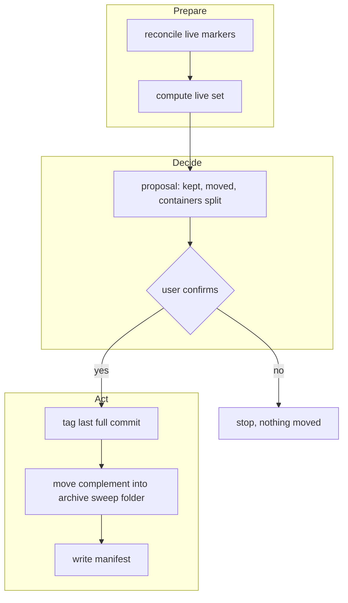
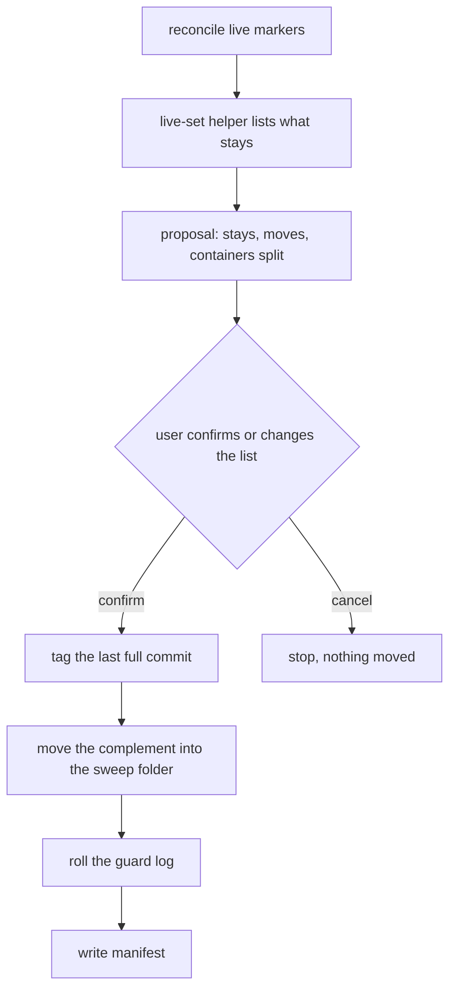

# Analysis: A snapshot of current knowledge instead of an ever-growing record corpus

**Date:** 2026-10-01 22:06
**Type:** Feasibility (with a comparative core and a risk register)
**Status:** Complete
**Requested by:** user

## Question

fusion keeps every record it ever wrote in the live workbench. That corpus supports reading the past closely, but its price is mass. Would it be better to produce a snapshot from time to time that represents current knowledge, and archive the whole prior history behind it? What does each side gain and lose, and what would have to exist technically for a user to run `/fusion:snapshot`?

## Scope

- This repository's workbench, measured in full; three consuming workbenches (`axibra-5`, `krk`, `fusion-news`) measured for size only.
- Read: `skills/archive/SKILL.md`, `rules/workbench-tracking.md`, `rules/fusion-workbench-conventions.md`, `agents/policy-curator.md` `### The seven evidence sources`, the head comment of `hooks/lib/citation-scan.ts`, `skills/reconcile/SKILL.md`, the decisions `260827-1756_*_which-citation-corpus-does-the-archive-safety-filter-protect.md` and `260922-1059_*_is-the-frozen-history-store-audit-evidence-or-typed-record-history.md`, and the memory note of the 2026-08-27 bookkeeping cost audit.
- Tree: `main` at `2e64de21` (2026-10-01 21:59), `git status -sb`: ahead of `origin/main` by 7, `orchestrator-events.jsonl` modified. Every present-tense figure below is as of that commit.
- Placement: `bin/fusion-paths analyst` resolves `$OUT_ANALYSIS` into the claimed package `261001-1930-work-order-slash-command-and-machine-readable-output`. This question did not arise from that brief, so the report sits in `shared/analyses/` under `## Origin Rule` (the worked example's second case).

## Findings

### F1. The live tree is about 95 % history

| Measure | Value | Command |
|---|---|---|
| Workbench on disk | 41 MB, of which `archive/` 13 MB | `du -sh fusion-workbench fusion-workbench/*` |
| Files in the workbench | 3 052, of which 611 under `archive/` | `find fusion-workbench -type f \| wc -l` |
| Marked records outside `archive/` | 841 closed issues, 44 closed plans, 168 implemented and 4 superseded decisions; against 4 in-progress issues, 22 open or in-progress plans, 6 open and 50 answered decisions, 21 deferred decisions, 1 open discussion | marker census over `shared/` and `work-packages/` |
| Frozen session logs outside `archive/` | 994 files, 7.1 MB | `find shared work-packages -path '*/history/*'` |
| Work packages | 1 claimed, 1 open, 1 paused, 14 done, 1 dropped, 24 in the legacy form with no `**Status:**` | `Status` field per container record |
| Repository | `.git` 147 MB; 262 of the 571 commits since 2026-09-01 touch only the workbench | `git log --since=2026-09-01` |
| Consuming projects | `axibra-5` 105 MB with 4 369 live Markdown files; `krk` 49 MB with 2 150; `fusion-news` 34 MB with 2 045 | `du -sh`, `find -name '*.md' -not -path '*/archive/*'` |

Estimate (inference): the records a session would need to act on today number roughly 100 to 150 files, against about 2 400 outside `archive/`. Every `grep` an agent runs over the workbench therefore returns mostly closed material.

### F2. The per-session reading cost is already bounded; the remaining cost is search noise and orientation

The 2026-08-27 audit's fixes landed. `policy-curator`, `/fusion:reconcile` and `/fusion:cadence` read from a per-checkout anchor (`agents/policy-curator.md` `### The seven evidence sources`, `skills/reconcile/SKILL.md` `## Arguments`). `/fusion:cadence` already excludes `archive/` from its walk. So the mass does not cost what it cost in August.

What it still costs:

1. **Search noise.** An agent asking "what holds about X" gets every closed record about X. The analyst prompt names this failure itself: re-answering a question already answered.
2. **Orientation.** No single place says what is true now. The answer is spread over rule files, `CLAUDE.md`, the code, open and answered decisions, and live work packages.
3. **Full walks in the test suite.** `hooks/lib/__tests__/workbench-citation-lint.test.ts` indexes the whole workbench, `archive/` included. A snapshot does not change this, because `archive/` stays part of the lookup index (F4).
4. **Repository mass.** No in-repository archive shrinks `.git`. Only a history rewrite would, and a rewrite breaks every other checkout. A snapshot shrinks the working tree, never the clone.

### F3. The existing archive mechanism is blocked in three places

`/fusion:archive` already moves terminal records into `archive/`. It last ran on 2026-09-22 (`git log -1 -- fusion-workbench/archive`, `c5485b06`), and the last tier sweep on 2026-08-29. Three things keep it from shrinking the tree even when it runs:

| Block | Evidence | Effect |
|---|---|---|
| **Legacy containers are never selected** | `skills/archive/SKILL.md` Step 3: a record in the old marked form "is not selected, it is not a fault" | 24 containers, 1 359 files, stay forever |
| **Filter 3 pins every record the shipped text cites** | 464 distinct citation tokens in shipped text; 289 resolve into the live tree, of them 91 implemented decisions and 127 closed issues. `hooks/lib/` alone carries 289 distinct cited basenames, mostly test comments | about 220 terminal records cannot be archived in this repository |
| **Live records sit inside finished containers** | 17 of the 39 terminal containers hold at least one record marked open, in progress, answered or deferred; together they hold 1 054 files | a whole-container move would carry live records out of sight, so these containers stay |

**Filter 3 rests on a premise that no longer holds (verified against the code, effect not run).** Decision `260827-1756` widened the filter because an archive sweep broke 31 citations and turned `npm test` red. At that time citations carried store paths. Since 2026-08-29 a citation is a storeless basename and "every citation resolves by ONE basename lookup over the whole workbench index, `archive/` included" (`hooks/lib/citation-scan.ts`, head comment, `THE GRAMMAR`). Forty shipped citations already resolve into `archive/` today. An archived record therefore stays resolvable, and the pin protects against a failure the grammar change removed. This needs one test run with a tier-1 dry move before anyone relies on it.

### F4. "Snapshot" names two separate mechanisms

The idea bundles two things that can be built and judged apart:

- **A. Consolidating knowledge**: one place that states what is true now.
- **B. Removing history from the working tree**: terminal records leave the places where agents search.

fusion already has a consolidation target for A. Rule files and `CLAUDE.md` are the normative statement of the present, and an implemented decision is by definition realised in code or rules. The `policy-curator` keeps those surfaces reconciled with the record. A separately authored snapshot document would be a second copy of current knowledge. The project has measured twice what such copies do: 39 of 94 decision records carried a `Status:` header that disagreed with their marker (`rules/fusion-workbench-conventions.md` `## Decision Record Template`), and prose cardinalities drifted across seven passes (`rules/critical-stance.md` §5).

The usable form of A is therefore **derived, not written**. After a sweep, the live tree itself is the snapshot: `ls` on it shows what is open, answered and in flight. An orientation text, where one is wanted, already exists as the analyst's Architectural Snapshot type and is dated by design.

### F5. "Is this record still current?" is decidable only for marked records

| Record kind | Current-knowledge test | Decidable from the file? |
|---|---|---|
| Issue, plan, discussion | marker open or in progress; deferred issues and plans too, since the archive skill treats deferral as "expected back" | yes |
| Decision | marker open or answered | yes |
| Work package | `**Status:**` open, claimed or paused | yes |
| Legacy container record | no five-value status | no: it has to be read, or treated as terminal |
| Analysis, review, consultation | no marker | **no** |

For the markerless kinds the question "is this still relevant" cannot be decided from the file (`rules/critical-stance.md` §4). The mechanism has to ask a different, decidable question: *is it cited by a live record, or younger than the previous snapshot?* Both have an exact answer from inputs a helper holds.

### F6. Comparison of the options

| Dimension | 1. Authored snapshot document + archive | 2. Live-set sweep into `archive/` (derived snapshot) | 3. Git as the archive (delete from tree, tag) | 4. Status quo, run tier-1 more often |
|---|---|---|---|---|
| Live tree after the operation | small | small, about 5 % of today's (estimate) | small | still about 1 700 files (F3's three blocks hold) |
| Second copy of current knowledge | **yes**, drifts | no | no | no |
| Citations keep resolving | yes | yes, by the existing lookup | **no**: the lookup and three lints need a git fallback | yes |
| Works with an untracked workbench | yes | yes | **no**: the bytes are gone | yes |
| Clone size | unchanged | unchanged | unchanged (objects stay) | unchanged |
| Close reading of the past | through `archive/` | through `archive/`, plus a tag on the last full commit | only through `git show <tag>:` | unchanged |
| New mechanism | summariser + archive | one helper, one archive mode | resolver fallback in `citation-scan`, archive filter, lints | none |
| Effort | large | medium | large | trivial (and ineffective) |

Option 3 gains nothing in repository size over option 2, because git keeps the objects in either case. What it adds is a broken lookup. Option 1 adds the drift class the project has already paid for twice. Option 4 does not reach the 2 400 files because of F3.

### F7. Risk register for option 2

| Risk | Likelihood | Impact | Mitigation |
|---|---|---|---|
| A live record is swept because its marker is stale | high: 10 live-marked records sit in one container from 2026-08-20 alone | medium: it leaves the search surface, though it stays resolvable | snapshot runs a reconcile pass first and shows every container holding a live-marked record by name |
| Agents re-derive settled questions they no longer find by `grep` | medium | medium | storeless citations from rules and live records still resolve into `archive/`; the curator still reads `archive/` |
| Splitting a finished container (live records stay, the rest moves) half-completes | low | medium | moves only within one commit, manifest written first, git is the rollback; the archive skill's whole-container rule applies to containers without live records |
| Nobody runs it | high: the last tier sweep is 33 days old | high: the problem returns | offer it from `/fusion:cleanup` when the terminal share exceeds a threshold, never run it unattended |
| Concurrent checkout edits a moved record | low: terminal records are not edited (`## Terminal states are history`) | low | git detects the rename; a live record is never moved |
| The event log is rolled while another checkout appends | medium | medium | leave `orchestrator-events.jsonl` out of version 1; its union merge across a truncation has not been tested (inference) |
| A new skill exceeds the `skills/` growth bound | high | low | build it as a mode of `/fusion:archive` rather than a new skill directory, or pay with a cut |

### F8. What would have to exist for `/fusion:snapshot`

| # | Component | Reuses | New | Effort |
|---|---|---|---|---|
| 1 | **Live-set helper** `bin/fusion-live-set`: prints every path that stays. Members: open or in-progress issues, plans and discussions; deferred issues and plans; open or answered decisions; every live work package's whole container; the record file of every terminal container that still holds a live record; every record a live record cites in `**Depends-on:**`, `**Cross-references:**` or its body; markerless records younger than the previous snapshot; the reserved root entries | the marker globs, the `Status` walk and the head-field scan from `skills/archive/SKILL.md` Step 3, `bin/fusion-cadence-anchor` for "previous snapshot" | the inversion: the archive skill lists what *goes*, the helper lists what *stays* | small to medium |
| 2 | **Snapshot mode in `/fusion:archive`**: candidates = workbench minus live set minus reserved entries; legacy containers selected as terminal; terminal containers holding live records split per file | Steps 5 to 9 of the archive skill (proposal, confirmation, move, collision guard, manifest) | complement selection; per-file move inside a split container | medium |
| 3 | **Filter 3 decision**: drop the pin or narrow it to citations that carry a store path | `citation-scan` already resolves `archive/` | a new decision record superseding `260827-1756`, then a one-line change | trivial, after one verifying test run |
| 4 | **Snapshot anchor and tag**: `fusion-cadence-anchor set last_snapshot <commit>`; `git tag fusion-snapshot/<stamp>` on the commit before the sweep, where the workbench is tracked | `bin/fusion-cadence-anchor` | one anchor key; tag only, no push | trivial |
| 5 | **History sweep** | decision `260922-1059`, already answered: "the frozen `history/` corpus moves into `archive/` in one sweep" | none: the snapshot realises it | trivial |
| 6 | **Entry point** `/fusion:snapshot` | the archive mode from row 2 | either a thin skill that calls the mode, or the name `/fusion:archive snapshot`; the second costs no `skills/` bytes | trivial |
| 7 | **Precondition**: one reconcile pass over the live set before the proposal | `/fusion:reconcile` | none | none |

What deliberately does **not** belong in it: an LLM-written summary of the past, a rewrite of git history, a new store, a change to the citation grammar, and the event log.

## Implications

The snapshot idea is sound in its second half and risky in its first. Getting history out of the places agents search is worth doing, and the existing machinery covers most of it once three blocks are lifted. Writing a separate statement of current knowledge would recreate the drift problem the project has spent September cutting away. The live tree, reduced to its live records, is itself the snapshot.

The decisive design choice is the inversion. Today the archive skill enumerates what may go and keeps everything else. A snapshot enumerates what stays and moves everything else. Because the move is reversible and every citation still resolves, an error in the live set costs visibility, not data.

Two findings stand independently of whether the snapshot is built. Filter 3 protects against a failure that the storeless grammar removed. The 24 legacy containers can never leave the live tree under the current tier rules.

## Recommendations

We recommend option 2, contingent on one test run confirming F3's claim about filter 3.

1. **Decide filter 3** (user, then `implementation-planner`): one dry tier-1 run with filter 3 disabled, then `npm test`. Green means a new decision superseding `260827-1756`.
2. **Spec** (`requirements-designer`): the live-set definition from F8 row 1 as a disjoint and complete split, including the treatment of legacy containers and of finished containers that still hold live records.
3. **Plan and build** (`implementation-planner`, then `code-implementer`): helper, archive mode, anchor, tag. Entry point as `/fusion:archive snapshot` unless the user wants the separate command name and pays for it on the `skills/` bound.
4. **First run on this repository** after a reconcile pass. That run also realises decision `260922-1059`.

## Filed Issues

None. No defect was found that this analysis does not already describe, and no choice was made yet. The filter-3 question becomes a decision record when recommendation 1 runs.

## Sources

- `skills/archive/SKILL.md` `## Safety filters`, `## Tier definitions`, `## Process` Step 3 and Step 7
- `rules/workbench-tracking.md` `## The four classes`
- `rules/fusion-workbench-conventions.md` `## Origin Rule`, `## Filename Patterns`, `## Terminal states are history`, `## Decision Record Template`, `## Session history`
- `rules/critical-stance.md` §4, §5
- `agents/policy-curator.md` `### The seven evidence sources`
- `skills/reconcile/SKILL.md` `## Arguments`; `skills/cadence/SKILL.md` (the `find` that excludes `archive/`)
- `hooks/lib/citation-scan.ts` head comment, `THE GRAMMAR`
- `260827-1756_*_which-citation-corpus-does-the-archive-safety-filter-protect.md`
- `260922-1059_*_is-the-frozen-history-store-audit-evidence-or-typed-record-history.md`
- Measurements: the commands named in F1 and F3, run at `2e64de21`

## Open Questions

- [ ] Does `npm test` stay green when a tier-1 sweep moves records the shipped text cites? (decides filter 3)
- [ ] Does a terminal container that still holds live records split per file, or does the live record move to `shared/`? The analysis favours the split, because it keeps the origin readable from the path.
- [x] Separate command name `/fusion:snapshot`, or a mode of `/fusion:archive`? Answered by the addendum below: neither, the snapshot becomes `/fusion:archive`'s only selection. Awaits the user's ruling in the spec.
- [ ] Does `orchestrator-events.jsonl` join a later version, after a test of the union merge across a truncation? (The guard log is a separate case: the addendum keeps its roll in every run.)

## Addendum 2026-10-02 06:48: what remains of `/fusion:archive`

**Requested by:** user, follow-up question: what is left for `/fusion:archive`, and should it be given up or rebuilt?

This addendum supersedes F8 row 6 and the last row of F7, which left open whether the snapshot is a separate skill or a mode. We recommend rebuilding `/fusion:archive` around the snapshot selection. A second command beside it should not exist.

### A1. Which functions of today's skill the snapshot subsumes

| Function today | Fate | Evidence |
|---|---|---|
| tier-1 (terminal markers, done or dropped containers) | **subsumed**: every record tier-1 selects lies outside the live set of F8 row 1 | `skills/archive/SKILL.md` `### Tier 1 — Terminal markers and age in the shared store` |
| tier-2, tier-3 (reviews and history older than a threshold) | **subsumed**: "younger than the previous snapshot" replaces the 14-day threshold | no archive run ever used them: the four manifests under `archive/` read tier-1 three times and "scoped tier-1" once |
| Forum entries selected by age | **subsumed** by the same rule | `### Tier 1` row for `$SCAN_FORUM` |
| Natural-language mode | **dissolves into the confirmation step**: "Change scope" adds an item the live set keeps or removes one it would move | one of the five archive folders, `260922-1514-backlog-store-frozen`, was a targeted move; it carries no manifest |

### A2. What stays because only this skill does it

| Function | Why it stays |
|---|---|
| **Rolling `.guard-state/events.jsonl`** | The log still grows in observation-only mode: 822 861 bytes, 2 911 lines, last row 2026-10-01T20:15 (`guard_allow`). It has no ceiling by design, and the roll is its only bound (`rules/workbench-tracking.md` `## The four classes`, last paragraphs). It runs on every invocation, as today. |
| **Move, never copy; no overwrite; manifest; no move before confirmation** | `## Guardrails` and Step 7 carry over unchanged. |
| **Reserved root entries** (filter 1) | unchanged; they are in the live set by definition. |
| **Live work packages and their pointers** (filter 2) | become members of the live set instead of an exclusion filter. |
| **Citation pin** (filter 3) | open: removed or narrowed per Recommendation 1. |

### A3. Why one command and not two

Two commands would carry two definitions of "finished". One lists what may go, the other what stays. They would diverge, and a user would have to know which of them misses what. One selection rule in one place follows `rules/critical-stance.md` §2. It also makes the split disjoint and complete by construction: every workbench path is in the live set or in the move list, and in no other place.

### A4. Name

Keep `/fusion:archive`. 18 shipped files outside the skill name it, `/fusion:archive` or `skills/archive` (grep at `2e64de21` over `rules/`, `agents/`, `skills/`, `README*.md`, `docs/`, `hooks/lib/`, `bin/`). A rename touches all of them and needs a transition note, and the function does not change. "Snapshot" appears in the result instead: the tag `fusion-snapshot/<stamp>` and the sweep folder `archive/<stamp>-snapshot/`.

### A5. The rebuilt flow

### A6. Effect on the skill body

Removed: the three tier tables, the argument grammar `tier-[123] <D>d`, the natural-language mode as a mode, and the tier-scoped Step 3 globs. Added: the helper call, the per-file split of a finished container that still holds live records, the anchor and the tag. Inference, not counted: the body ends shorter than its 260 lines, which leaves room on the `skills/` growth bound rather than consuming it.

### A7. Changes to the recommendations

- Recommendation 3 now reads: the entry point is `/fusion:archive` with no argument modes; there is no `/fusion:snapshot` skill.
- The spec (Recommendation 2) covers the rebuilt skill as a whole, including the guard-log roll and the confirmation step that replaces the natural-language mode.
- Correction to F7, row "Nobody runs it": `/fusion:cleanup` does not offer the archive today. Its body names `/fusion:archive` as a separate command the user runs by name (`skills/cleanup/SKILL.md`, line 11 at `2e64de21`). The mitigation therefore needs a new trigger: a line in `/fusion:cleanup` or `/fusion:check` reporting the terminal share above a threshold. Which of the two, and which threshold, is for the spec.
