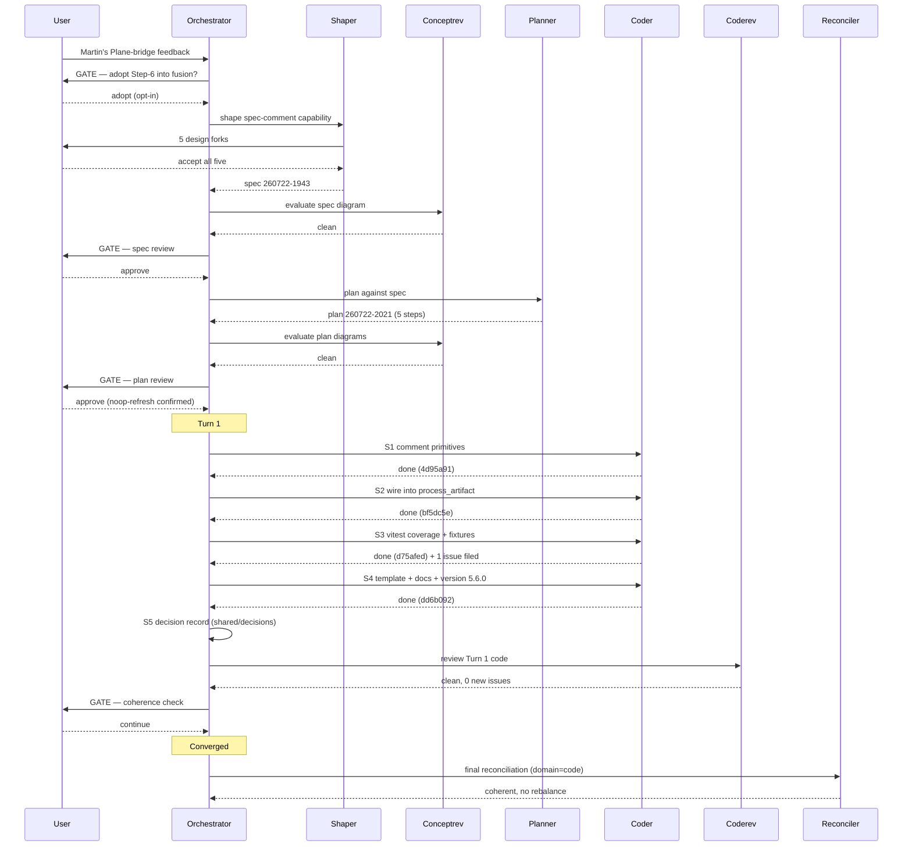

# Orchestrator Session — 260721-1045-orchestrator-session.md

**Directive:** Adopt the deferred Plane "Step 6" hook into `bin/fusion-plane`: natively upsert the full Circle spec as an idempotent Plane comment (opt-in, default off), fired on every non-deferred push. Generic capability only; the consumer-side `/new-fe-feature` fusion-key awareness stays project-side. (Trigger: Martin's feedback verifying the comments-endpoint body shape — the sole blocker that had kept the hook deferred.)
**Mode:** custom → shaped → planned → plan-execution (single Turn)
**Status:** Complete — converged; reconciler verdict coherent; v5.6.0

## Setup snapshot

**Workspace:** `/Users/kai/Dropbox/qboot/projects/F04-FUSION/codebase/fusion`
**Plugin version:** 5.5.1
**Git HEAD at start:** `1525585` on branch `main`
**Interrupted session:** none (`agentstate.yaml` absent)
**Concurrent session:** none (`fusion-session-mark check` → `none`; fresh marker written)
**Guard:** OK — `haltActive: false`, 0 consecutive blocks, no recent block events
**Active Circle:** none (`.active-circle` absent)

### Open state

| Store | Count |
|---|---|
| Open/in-progress issues (`shared/issues`) | 7 (of 27 total) |
| Open/in-progress plan steps (`shared/planning`) | 0 (of 1 total) |
| Open decisions (`shared/decisions`) | 0 (of 5 total) |
| Analyses (`shared/analyses`) | 6 |
| Circles | 5, all closed-coherent (`_c_`) |

Circle-internal stores hold a further 1 open issue, 3 open plan files and 1 analysis. These
sit inside closed Circles and are not in the resolver's scan set while no Circle is active.

### Domain detection

The heuristic in `agents/orchestrator.md` Setup Step 5 returns **strategic**, and that
result is an artifact rather than a finding. It reaches `strategic` through the branch
`analyses_count > 0 and commits == 0`, where `commits` is
`git rev-list --count HEAD -- fusion-workbench/`. That count is 0 because the workbench was
gitignored until commit `ca2d016` un-ignored it and has not been committed since — git
status still reports `?? fusion-workbench/`. The zero measures the workbench's tracking
history, not the absence of execution work.

The `code_files` input is also understated: the heuristic's `maxdepth 2` walk found 3 files,
while an unbounded walk finds 48 TypeScript/JavaScript files (most under `hooks/lib/` and
`hooks/dist/`, which sit at depth 3).

**Domain used for this session: `code`.** This repository is the fusion plugin source: 48
code files, compiled hooks, a test suite, and a release process. `taskplanner` and
`reconciler` dispatches will carry `**Domain:** code` unless the user overrides at an
individual dispatch.

*inference (unverified):* the same `commits == 0` misread will recur in any consuming
project that gitignores its workbench, which is the documented default. Worth filing as a
defect against the heuristic if it shows up a second time.

### Setup actions taken

- Pre-v4 layout check: `OLD=0`, container layout confirmed, no migration needed
- Workbench scaffold verified/created (`circles/`, `shared/*`, `archive/`, `.guard-state/`)
- Setup marker written: `.fusion-setup` (5.5.1)
- Monitor binary refreshed from `$FUSION_PLUGIN_ROOT/bin/monitor`
- Session marker written for `fusion:orchestrator`
- Stylometric profiles present (all four; no copy needed)
- `plane.config.yaml` template copied — unfilled, so no Plane mirror runs this session
- Rules loaded: `agent-setup`, `fusion-workbench-conventions`, `decision-record-examples`,
  `user-facing-output`, `critical-stance`, `git-branch-discipline`, plus the `en` chat and
  writing voice profiles
- Paths resolved for `orchestrator` (exit 0); no Circle active, so every `OUT_*` points into
  `shared/`

## Budget

| Metric | Count |
|--------|-------|
| Turns | 1 |
| Tasks resolved | 5 |
| Tasks skipped/deferred | 0 |
| Issues created (reviewers/work) | 1 (jq bare-array, latent/low) |
| Issues resolved | 0 |
| Decisions answered (`_o_`→`_a_`) | 0 |
| Decisions implemented (filed `_i_`) | 1 (thin-mirror vs comment-borne spec) |
| Commits | 4 |
| Agent errors | 0 |
| Human gates hit | 5 (Plane-adopt choice, shaper forks, spec gate, plan gate, coherence gate) |

## Pipeline

- **Phase 0** — feedback from Martin → user chose "Adopt into fusion (opt-in)".
- **Phase 0b** — shaper wrote spec `260722-1943_*_spec-plane-spec-comment.md` (5 forks put to user, all accepted); conceptrev diagram verdict clean; spec gate approved. Planner wrote plan `260722-2021` (5 steps, all coder); conceptrev clean; plan gate approved (noop-refresh reading of fork 1 confirmed).
- **Phase 2 (Turn 1)** — 5 tasks, all committed except S5 (decision record). coderev verdict clean, 0 new issues. Coherence gate → Continue.
- **Phase 3** — reconciler verdict coherent, no rebalance; fixed cosmetic marker drift.

## Per-Turn Log

### Turn 1
- Tasks attempted: S1, S2, S3, S4, S5
- Tasks completed: all 5
- Commits: 4d95a91, bf5dc5e, d75afed, dd6b092 (S5 is a workbench decision record, no code commit)
- Review findings: coderev clean, 0 new issues, 2 low no-fix observations
- Circuit breaker status: OK
- Coherence: ok

## Remaining Work

- Open issue `260722-2227_*_jq-results-fallback-throws-on-bare-array-in-three-helpers.md` — latent/low, pre-existing, not caused by this feature. Recommended one-line fix `(.results? // .)` across `comment_id_for_marker` / `state_uuid` / `label_uuid` in a separate focused pass.
- The feature is code-complete and validated offline (315 tests, `claude plugin validate .` passes). Live verification against a real Plane instance (enabling `spec_comment: true` and confirming the comment upsert round-trip) is the natural next real-world check — this repo has no live instance wired.
- Not committed to git: the fusion-workbench artifacts (untracked in this repo) — plan/decision/issue/history/dashboard/events. The 4 code commits + version bump are on `main`, unpushed.

## Commits

| Hash | Message | Task |
|------|---------|------|
| 4d95a91 | feat(plane): spec-comment primitives — gate, body builder, marker matcher, seam | S1 |
| bf5dc5e | feat(plane): wire opt-in spec-comment upsert into process_artifact | S2 |
| d75afed | test(plane): spec-comment coverage — marker, escaping, PATCH/POST, no-regression | S3 |
| dd6b092 | docs(plane): document spec_comment opt-in; template field; bump 5.6.0 | S4 |

## Coherence
<!-- RECONCILER-OWNED -->

*Appended by reconciler 260723-0712-reconciliation.md (domain: code). Per-Circle three-edge verdict at session end.*

**Verdict:** coherent

**Edges:**
- Artifact↔Grounding: 4/4 claimed commits verified on disk touching exactly the claimed files; plugin.json at 5.6.0 as claimed; 315/315 tests pass as claimed; spec + plan + decision + parent decision all exist. 1 open reviewer issue (260722-2227_*_jq-results-fallback-throws-on-bare-array-in-three-helpers.md, latent/low, pre-existing, correctly deferred; coderev 0 new issues). Drift was tracking-marker only (plan S4/S5 inline [DONE] missing → fixed; decision's stale `_p_` plan cross-ref → fixed), no code drift.
- Artifact↔Directive: commits 4d95a91, bf5dc5e, d75afed, dd6b092 (the whole 1525585..HEAD walk) map 1:1 to the 5 plan steps and move directly toward the Directive (opt-in idempotent Plane spec-comment, generic-only, default off). No orthogonal or away commits.
- Grounding↔Directive: 6 shared decisions (4 `_a_`, 2 `_i_`), 0 open/conflicting. The new `260722-2230_*_thin-mirror-vs-comment-borne-full-spec.md` records and realises the chosen architecture consistent with the Directive; parent `260719-2313_*_round-trip-write-overwrites-origin-story-description.md` preserved, not reopened. The 4 `_a_` Plane-architecture decisions do not touch this Directive's surface.

**Rebalance recommendation:** none

*Note for the orchestrator (outside reconciler write scope — flagged, not fixed): this history file's header is stale. `**Directive:**` still reads "(not yet stated…)", `**Status:**` still "Setup complete, awaiting scope", Per-Turn Log "(no Turns yet)", Commits "(none yet)" — yet a single Turn converged with 4 commits and a closed plan. agentstate.yaml is likewise stale (turn 1, tasks_done 0, all "queued") and still present (clean-exit delete pending). The orchestrator should refresh the header/log and clear agentstate on exit.*

> Orchestrator note (Phase 4): header, Per-Turn Log, and Commits refreshed; `agentstate.yaml` deleted and session marker cleared at clean exit. Both flags above are resolved.

## Session Flow

