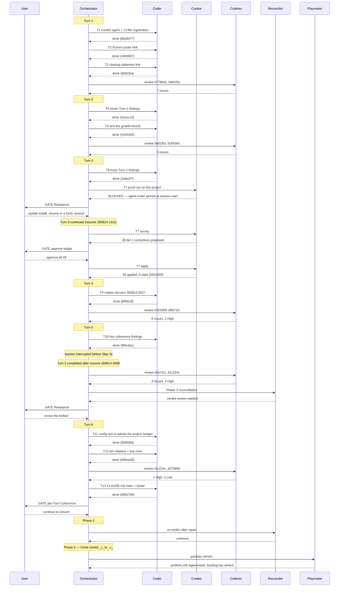

# Orchestrator Session — 260813-2345-orchestrator-session.md

**Directive:** Run Circle `260801-1244-curator` — build the curator agent that reconciles a project's three normative surfaces (decision records, project-owned rule files, `CLAUDE.md`) against what actually happened, and add a hard growth bound on the always-on rule text. Stated by the user on 2026-08-14 after activating the Circle.
**Mode:** plan (the Circle's spec `260814-0738_*_spec-curator.md`, 7 capabilities)
**Status:** Complete — Circle closed coherent

## Snapshot at Setup

| Input | Value |
|---|---|
| Workbench | /Users/k1/Projects/productive/fusion/fusion-workbench |
| Plugin version | 8.1.0 |
| Active Circle | none at Setup; `260801-1244-curator` activated mid-session on 2026-08-14 |
| git HEAD at start | d7786eb |
| Turn budget | 5 (max_turns, resolved from configuration) |
| Open defect records | 90 |
| Open plan steps (files) | 1 |
| Open decision records | 7 |
| Analyses | 15 |
| Circles | 1 anticipated, 1 bounded, 11 closed, 1 superseded |
| Workbench domain | code (code_files=125, data_files=21, counted_by=git-ls-files) |
| Work queue | current — unaffiliated backlog (head says none, no Circle active) |
| Guard | OK — haltActive false, 0 consecutive blocks |
| Portfolio hint | printed (1 anticipated Circle: 260801-1244-curator) |

## Churn ranking

451 entries, 223 absent, 2 noise, 10 ranked. Top by score:
hooks/lib/__tests__/rules-emission-golden.test.ts (51), hooks/lib/domain-cascade.ts (31),
hooks/lib/__tests__/domain-cascade.test.ts (27), README-hooks.md (24).

## Turns

Filled on 260824 from `## Per-Turn Log` below, which was written as the session ran; this section
never was (`260814-1450_*_the-turn-3-bookkeeping-says-no-review-ran-in-the-commit-that-landed-the-review.md`).

- Turn 1: T1, T2, T3 completed; T4 deliberately held.
- Turn 2: T5 and T4 completed; commits `5a1ec16`, `5c843e6`, `00f4a0b`.
- Turn 3: T6 completed, T7 blocked; commits `7421f51`, `2a8a2f7`; ended at a Rebalance gate.
- Turn 3, continued (after the resume): T7 and T8 completed; commits `1a36fe4`, `0301909`; the
  Turn-3 review filed six findings in `18173e1`.
- Turn 4: T9 completed; commits `18173e1`, `bf9553f`, `0b14d03`, `d5b71f1`, `6d433c2`; six review
  findings, two High.
- Turn 5: T10 completed; commits `9f4cdac`, `41c224c`; four review findings, two High; Rebalance gate.
- Turn 6: T11, T12, T13 completed; commits `f0d9d60`, `b90ea28`, `d270666`, `d90b794`; one High,
  two Low; coherent.

## User decisions recorded this session

**2026-08-14 — Circle `260801-1244-curator`, re-sharpening ahead of activation.** The user
directed a shaper run in portfolio-activation mode from inside this session. The shaper returned
two clarification rounds; the orchestrator relayed both, since a dispatched sub-agent cannot reach
the user. Five answers, all as recommended:

1. **The growth bound enters this Directive.** The budget report in
   `hooks/lib/__tests__/rules-emission-golden.test.ts` becomes a test that fails, on the always-on
   rule set.
2. **Derive rather than correct, as a preference rule.** Where a falsified claim is a measurement a
   command could produce, the curator proposes the derivation in the change ledger instead of the
   corrected number; implementing it stays coder work.
3. **The validation case is the project's decision corpus** — 82 records, 0 superseded, with the
   defect records as a cross-check. The consuming-project witness was not taken.
4. **C4 retires.** A dead rule file is deleted; git holds the bytes. The `rules/retired/`
   relocation, the tombstone and the version-control check leave the capability set.
5. **The growth bound is armed by re-baselining once**, at the moment of arming, with the
   2026-08-14 overshoot written into the file as text so the standing cleanup request survives the
   number moving. Answers
   `260814-0738_*_how-is-the-always-on-growth-bound-armed-when-the-corpus-is-already-over-budget.md`,
   option 1. The user was shown that this overrides the position recorded in
   `rules-emission-golden.test.ts`, that option 2 would put an unscoped 11 KB cut on the Circle's
   critical path, and that the shaper labelled its reading of the instrument's intent as inference
   rather than verified.

6. **The seventeenth agent's count claims: the figure is removed, not refreshed** (planner's option
   2). Adding `curator` falsifies 32 sentences across nine files. The five that
   `derivable-enumerations-lint.test.ts` re-derives are corrected to the tree. In the 27 no parser
   reads, the figure is deleted where the sentence does not need it — "all sixteen agents" becomes
   "every agent" — because those are precisely the claims that go stale unnoticed, and the project
   has twice concluded in writing that a figure nothing checks should not be written down.
   Historical measurements in the cut log of `rules-emission-golden.test.ts` are untouched under
   either option. Answers
   `260814-0845_*_are-the-sixteen-agent-claims-corrected-or-derived-away.md`.

## Phase 0b — Plan gate

**Plan approved by the user on 2026-08-14.**
`260814-0845_*_plan-curator.md`, five steps, every one routed
to `coder`. No `ontocoder` work: the Circle touches agent prompts, a skill body, two shell helpers,
one test file and the shipped documentation, and no ontology, manifest, schema or domain-data file.
C11, the validation run, is deliberately unassigned — the finished curator performs it, invoked by
the user through `/fusion:curate`.

**`conceptrev` verdict: acceptable** (`260814-0857-conceptrev-plan-curator.md`).
Three Mermaid blocks, all parsing and rendering, no cycle, no god node, no orphan, maximum fan-out
2, all three tree-shaped. Two substantive findings, both on diagram 1: the three invocation paths
are drawn identically, so the second dispatch that drives the apply pass lives only in the edge
label; and the gate node names four exits while the reject edge is absent. Advisory, surfaced at
the gate, not treated as a rejection. Diagram 3 matches the step list edge for edge.

**The plan's `**Decidability:**` line answers no, and changes the mechanism rather than
approximating.** Tier 1, a falsified claim about the present, is decidable because a command
produces the verdict. Tier 2 is decidable only positively: the absence of a superseding record over
83 records establishes nothing. Tier 3 is not decidable as posed. So the curator never asserts the
undecidable question; it decides whether a citation of the kind the tier requires exists and
resolves, and every proposal crosses a user gate. The residual — an LLM reading two prose passages —
is named in the plan's risks rather than argued away.

**One cost the spec did not carry.** A seventeenth agent breaks five mechanical checks and
falsifies 32 sentences. The suite is necessarily red between plan steps 1 and 2, so the two belong
in one working session.

## Per-Turn Log

### Turn 1

- **Tasks attempted:** T1 (plan steps 1+2), T2 (step 3), T3 (step 4). T4 (step 5) deliberately not
  started — see below.
- **Tasks completed:** all three. None errored, none skipped, no bugfixer dispatch.
- **Commits:** `6ba9d77`, `44b9967`, `5b81f5a`, on top of the four bookkeeping commits `f273b9a`,
  `55ead50`, `e321a54`, `a2e82cb` that carried the re-sharpening, the activation and the plan.
- **Validation:** `cd hooks && npm test` run by the orchestrator after each task, exit 0 each time;
  1023 tests after T1, 1024 after T2 and T3. One worker-crash flake reported by the executor during
  T1 was not reproducible.
- **Why T4 was held.** Plan step 5 arms the growth bound by re-baselining on the corpus *as it
  stands at that moment*. Running it inside Turn 1 would have set the baseline before the Turn's
  review could surface further rule-file edits, and any such edit would then sit above an
  already-armed bound. Review first, arm second.
- **Review findings:** `coderev` over `d7786eb..HEAD`, seven commits, filed seven defects, all in
  shipped text and none in behaviour. The severe one is
  `260814-1023_*_the-curator-is-not-in-the-orchestrators-dispatch-allowlist-so-two-of-its-three-invocation-shapes-cannot-be-reached.md`:
  `agents/orchestrator.md` lists thirteen sub-agents and the curator is not among them, so two of
  the three invocation shapes the curator's own prompt describes have no possible caller, and spec
  criterion C7 is unmet. The T1 executor had named this as a plan-level gap at the time and
  correctly declined to close it.
- **Review coverage:** `covered`. `bin/fusion-review-coverage` reports 7 commits, 0 uncovered, one
  review still unusable (the conceptrev diagram evaluation, which carries no `**Reviewed-range:**`
  and cannot sensibly carry one — filed as `shared/issues/260814-1012_*`). The carried
  `**Not-opened:**` list holds workbench records only, no shipped source.
- **Circuit breaker status:** OK. Three tasks resolved against seven issues created, so the
  net-negative row is armed but not tripped; it needs two consecutive Turns.
- **Coherence:** recorded at the per-Turn gate.

### Turn 2

- **Tasks attempted:** T5 (the seven Turn-1 review findings), T4 (plan step 5, arming the growth
  bound, preceded by a stale derived count that would otherwise have been baselined).
- **Tasks completed:** both. None errored, none skipped, no bugfixer dispatch.
- **Commits:** `5a1ec16`, `5c843e6`, plus the orchestrator's staging repair `00f4a0b`.
- **Validation:** `cd hooks && npm test` after each task, exit 0; 1024 tests after T5, 1030 after
  T4 with the bound armed and no budget report printed for any role. `claude plugin validate .`
  passed after both.
- **Two orchestrator errors this Turn, both corrected and both worth recording.** The staging list
  for T5 reached for a glob to name the seven pre-rename filenames; a renamed file is already gone
  from disk, so the pattern matched nothing and git recorded seven additions with no deletions,
  leaving the open names in HEAD beside their own closures. This is `f38f37d` from the opposite
  side, and the executor's report had carried all fourteen paths in full. Repaired in `00f4a0b`.
  Separately, a commit hash was written into `agentstate.yaml` without being read back; corrected to
  `5a1ec16`.
- **Review findings:** `coderev` over `5b81f5a..5c843e6`, three defects, all in comment and
  description text and none in behaviour. It verified every one of the five conditions the arming
  decision imposed against the diff, recomputed all fifteen figures of the overshoot table, and
  independently confirmed the orchestrator role floor at 229 bytes under `RELEASE_CAP`.
- **The reviewer's verdict on the Directive: build half met, proof half not begun.** C11, the
  validation run of `/fusion:curate` against this project's own decision corpus, has not been
  performed and no curator run file exists. The Directive names that run as the proof of the
  capability. Everything Turn 1 flagged as a blocker for it is closed.
- **Review coverage:** `covered`, 11 commits, 0 uncovered. The conceptrev diagram evaluation
  remains unusable to the helper, filed separately.
- **Circuit breaker status:** OK. Two tasks resolved against three issues created — the Turn-1
  ratio was three against eleven, so the net-negative row has now had one qualifying Turn and one
  non-qualifying one, and does not trip.

## Resume (session 260814-1311)

The session was interrupted after Turn 3's second commit and resumed at 13:11 on 260814. Setup ran
in full: workbench located, monitor refreshed to 8.2.0, session marker written, drift check clean
(five rows, no divergence; `progress.commits` read 14 against git's 15, inside the one-commit
tolerance for a commit in flight, and has been brought current). The user chose **Continue**, so this
session inherits the history file, the session anchor `d7786eb`, the start stamp `260813-2345-orchestrator-session.md` and
the Turn counter at 3, and emits no second `turn_start` for the Turn it re-enters.

**T7's blocker is cleared.** Issue `circles/260801-1244-curator/issues/260814-1200_o_*.md` recorded
that `Agent(fusion:curator)` was unreachable from the session that built the curator, because a
session reads its agent roster at start from the installed plugin copy. The install at `~/.fusion`
now carries `agents/curator.md` and `skills/curate/`, and reports version 8.2.0; the roster of this
session lists `fusion:curator`. The C11 proof run is therefore runnable here.

Snapshot at resume: 97 open defect records (4 in the Circle, 93 shared), 3 open plan files, 7 open
decision records (all shared), 15 analyses, 14 Circles (1 active, 11 closed, 1 bounded, 1
superseded). Detected domain `code` (125 source files against 21 data files, counted by
`git ls-files`). Turn budget resolved to 5. The guard is not halted; the block events in
`escalation.json` are historical, from the branch policy deleted on 260809.

The work queue at `fusion-workbench/tasklist.md` reads **stale**: its head records no Circle, while
`260801-1244-curator` is active. This session works from the queue in `agentstate.yaml`, so the file
is not on its path; it should be rebuilt before anything consumes it as current.

### Turn 3, continued (after the resume)

- Tasks attempted: T7 (curator, the C11 proof run), T8 (coder, the golden-fixture regeneration T7 made necessary)
- Tasks completed: T7, T8
- Commits: `1a36fe4` (the 28 corrections plus the regenerated fixture), `0301909` (the run file, the open decision, the two defect records, the coder's history)
- Review findings: none yet — the incremental review for this Turn has not run
- Circuit breaker status: OK
- Coherence: not yet evaluated for this Turn

  *Correction appended 260824 (ontocoder, plan step 5).* The two bullets above were false in the
  commit that wrote them: `18173e1` landed this Turn's incremental review,
  `260814-1419-coderev-curator-turn-3.md`, with six findings
  (four Medium, two Low, split four under the Circle's `issues/` and two under `shared/issues/`),
  and the per-Turn `coherence_review` for Turn 3 was recorded `ok` at 12:42:06 before the Rebalance
  gate at 13:13:35. The bullets stand as written; this note is the correction.

**What T7 established.** The curator surveyed the three normative surfaces of fusion's own
repository and proposed 28 corrections, every one of them tier 1: a checkable statement about the
present that a command falsified. Four sat in `CLAUDE.md`, nineteen in shared decision records, five
in project rule files. The user approved all 28 at the gate. Thirteen candidates were reported and,
by the agent's own rule, never offered for approval; they remain unapplied.

The decision-record half was uniformly stale citation: bracket markers and store paths from before
the v4 container layout, and literal state markers that died at the cited record's first transition.
They now carry the wildcard form the citation convention defines.

**The answer to the Directive's question.** Across the citation-linked pairs the selection rule
reached, no living decision record supersedes another, and four of them say as much in their own
text. That none of the 84 records carries the `_s_` marker is structural rather than accidental:
this project retires a decision by deleting its implementation at a user gate, not by filing a
superseding record. The removal of the protected-path half on 260812 left roughly thirteen
implemented records in that state. The marker vocabulary has no state for it, and the curator filed
the question as an open decision rather than answering it itself.

**What the staleness check caught.** On the first apply attempt a hand-transcribed before-text did
not match the file, and the run aborted before writing anything. The agent then extracted every
before/after string programmatically from the ledger; all 32 substitutions across the 28 entries
matched their file exactly once. The error was the agent's own transcription, not drift on disk —
git HEAD was unchanged between the two passes.

**Bookkeeping.** The state file, this history and the Circle's Turn log all froze again across the
two commits above and were brought current afterwards, prompted by the drift check that rides the
commit. Recorded as a `state_drift` event.

<!-- RECONCILER-OWNED -->
## Coherence

**Verdict:** review-needed

**Edges:**
- Artifact↔Grounding: **flagged.** 12 claims verified against the tree at HEAD `18173e1` — 5 plan steps, 7 spec capabilities, 2 implemented decision records re-derived from their commits, and `npm test` re-run at 1 030 tests green. 11 drift items: 3 repaired by this pass (plan and spec both Draft-with-every-step-done, now Complete and `_c_`; D1 `260801-1020_*_where-does-normative-consistency-live.md` walked `_a_`→`_i_` since the agent it specifies now exists and has run), 3 newly filed at stamp `260814-1450`, 2 already filed and confirmed standing (`260814-0813_*_the-circle-records-title-and-dependencies-still-describe-the-conventions-file-as-the-validation-case.md_o`, `260814-0828_*_the-grounding-and-the-spec-still-call-the-growth-bound-decision-open-after-it-was-answered.md_o`), 3 folded into the new filings. 13 open defect records in the Circle, of which 6 are the Turn-3 review's findings — all six re-checked and all six still stand, one Medium (`260814-1419_*_the-layout-trees-consumer-column-…`) named by the reviewer as wanted before closure because it leaves an always-on rule file promising more than it says.
- Artifact↔Directive: **OK.** 17 of the 18 commits in `d7786eb..HEAD` move toward the Directive: `f273b9a`/`55ead50`/`e321a54`/`a2e82cb` set the Circle up, `6ba9d77`/`44b9967`/`5b81f5a`/`5c843e6` are plan steps 1 to 5, `5a1ec16`/`2a8a2f7` close review defects, `1a36fe4`/`0301909` are the C11 proof run, and `249e606`/`7421f51`/`18173e1`/`00f4a0b`/`e101761` are review and record keeping. One is orthogonal — `ae21c87` tightened the shipped chat-voice profiles, was caused by no part of this Directive, and produced two of the Turn-3 findings; the Turn-3 review classifies it the same way. I agree with the review that both halves of the Directive are met, with the qualification the run states itself: the editable surface was 46 of 84 decision records, so "no living record supersedes another" holds over the surface the selection rule reached and the corpus-wide claim is filed as an open decision rather than asserted. That residual was stated by the run, reviewed, and recorded; it does not bear on closure.
- Grounding↔Directive: **flagged.** 19 active decisions in `$SCAN_DECISIONS` scanned (8 open, 11 answered) and 18 are consistent with the Directive. One is flagged: `260813-0027_*_should-the-orchestrator-be-able-to-dispatch-the-shapers-portfolio-activation-mode.md` is open, and this session executed the path it asks about — the orchestrator dispatched the shaper in portfolio-activation mode, which `agents/shaper.md:3` and `:47` forbid in two absolute sentences, and the result is `f273b9a`, the re-sharpened Grounding this whole Circle then ran against. Annotated with that evidence. The Circle's own new open record `260814-1332_o` is a residual the Directive's proof half produced rather than a conflict with it. Two further open records sit in `circles/260813-0910-documentation-matches-shipped-plugin/decisions/` and no scan key reaches them from here.

**Rebalance recommendation:** revise Grounding

<!-- RECONCILER-OWNED -->
## Coherence

**Scope:** session end (Phase 3), range `d7786eb..41c224c`, 25 commits, 5 Turns. The `## Coherence`
section above is the per-Turn verdict recorded at the Turn-3 gate and is left as written.

**Verdict:** review-needed

**Edges:**
- Artifact↔Grounding: **flagged.** 18 claims re-derived at HEAD `41c224c` rather than inherited from the mid-session pass — 5 plan steps, 7 spec capabilities, the 3 Turn-5 closures (`README-agents.md:66-68`, `agents/orchestrator.md:421`, `rules/fusion-workbench-conventions.md:58-60`), 2 implemented decision footers, and the growth bound re-run at 15 of 15 passing with no budget report. Review coverage is **complete**: `bin/fusion-review-coverage` reports `commits=25`, `reviews=6`, `uncovered=0`, `verdict=covered` after the Turn-5 review landed at 20:31; the one `unusable=1` is the conceptrev plan evaluation, tracked separately as `shared/issues/260811-1145_o_*`. 7 drift items from this pass: 3 standing at stamp `260814-2017`, 2 filed and closed within it (one a duplicate of the reviewer's fuller record, one closed when its range became covered), 1 repaired (`shared/decisions/260813-0027_i_*` header read `open` two transitions after its marker moved), 1 re-measured and left open (`shared/issues/260812-1232_o_*`, now 35 of 86 records whose header contradicts their marker, against 34 of 74 when filed). 21 open defect records in the Circle and 96 in `shared/`. **The two open High findings are what flag this edge**, both from the Turn-5 review and both verified independently by this pass. `9f4cdac` left ten stale line-number citations standing in shipped documentation, seven of them inside the same `## Dispatch parameters` table the commit corrected the other half of — `README-agents.md:59` cites `agents/orchestrator.md:392`, a table separator; `:61` cites `:850`, a sentence about review-coverage derivation; `:72` cites `:438`, the plan-review gate. And `cd hooks && npm test` is red 1 of 1 030 in the working tree on an uncommitted `orchestrator.maxTurns` line in the root `fusion-guard.json`, while `git show HEAD:fusion-guard.json | diff - templates/fusion-guard.json` is empty, so HEAD is green and only the tree is red. Beneath those, the Circle's Turn log has no Turn-5 entry and this file has no Turn 3, Turn 4 or Turn 5 section, while `bin/fusion-state-drift` reads `clean` because the `Turn 3, continued` bullet is counted as a Turn.
- Artifact↔Directive: **OK.** All 25 commits in `d7786eb..41c224c` move toward the Directive except the one already classified orthogonal at the Turn-3 gate (`ae21c87`, the chat-voice profile tightening). Both halves of the Directive are met and were verified by running the instruments, not by reading the reports. The curator half: `agents/curator.md`, `skills/curate/SKILL.md`, the seventeenth-agent registration at `bin/fusion-rules:174` and `:185`, and all three invocation shapes reachable including the roster surface `9f4cdac` corrected. The growth-bound half: the hard assertion at `hooks/lib/__tests__/rules-emission-golden.test.ts:994-995`, with the arming baseline at `:475-479` and unit tests at `:1158-1177` proving it fires in both directions; re-run green, with 415 of the head-room spent by Turn 5's own rule-file edit and the bound holding. The proof half T7 delivered: 28 tier-1 corrections proposed, all approved, all applied, 0 stale and 0 failed (`1a36fe4`, run file 2 633 lines), with its one unsettleable question filed as decision `260814-1332_o` rather than asserted.
- Grounding↔Directive: **OK.** 19 active decisions in `$SCAN_DECISIONS` (6 open and 11 answered in `shared/`, 2 open in the Circle), all 19 consistent with the Directive. The one flagged at the Turn-3 gate, `shared/decisions/260813-0027_*`, was answered at the Rebalance gate and implemented in `bf9553f`; it has left the active set and this pass corrected its stale header. The Circle's two open records are residuals its own proof half produced, not conflicts with it. Four further active decisions sit in `260801-1244-guard-rules-write`, `260807-0923-guard-misst-statt-orakelt` and `260813-0910-documentation-matches-shipped-plugin`, and no scan key reaches them from here — unchanged from the Turn-3 verdict.

**Rebalance recommendation:** revise Artifact

**What the recommendation means here, since the Directive is met.** The flag is on the Circle's last
Turn, not on what the Circle built. Both halves of the Directive landed and were re-verified by
running the instruments. One short Turn discharges the three items: close the ten stale citations the
Turn-5 review found in shipped documentation, resolve the uncommitted `fusion-guard.json` edit so the
suite is green in the tree as well as at HEAD, and write the Turn-5 entry on the Circle record
together with the missing Turn sections in this file. If instead the choice is to close now, the
records at stamps `260814-2017`, `260814-2022` and `260814-2033_*_a-resume-that-re-enters-at-phase-3-never-asks-whether-the-turn-it-skips-past-was-reviewed.md` carry every item forward with its
evidence — but a Circle that closes `_c_` over a red working-tree suite and two open High findings in
text it shipped is making a claim its own records contradict, and bounded closure would be the honest
marker.

<!-- RECONCILER-OWNED -->
## Coherence

**Scope:** session end, **second** Phase-3 pass (Phase 3 after Turn 6), range `d7786eb..d90b794`,
29 commits, 6 Turns. The two `## Coherence` sections above are left exactly as written — the first
is the Turn-3 gate verdict, the second is the session-end verdict the Rebalance decision was taken
against, and that decision is unreadable without it.

**Verdict:** coherent

**Edges:**
- Artifact↔Grounding: **OK.** Both conditions the previous verdict flagged are discharged, and each was re-derived from the tree rather than from its `_c_` marker. **High 1** (`shared/issues/260814-2022_c_*`, the guard config pinned byte-identical): `hooks/lib/__tests__/config.test.ts:1266` declares `PROJECT_SET_KEYS = ["orchestrator"]` and `withoutProjectSetKeys` at `:1369-1373` cuts it from the source text of both sides; `fusion-guard.json` carries `"orchestrator": { "maxTurns": 12 }` with `git status --short` empty, so the line is committed and not in flight; `diff fusion-guard.json templates/fusion-guard.json` differs on that line and nothing else; `cd hooks && npm test` run by this pass is **49 files, 1 030 tests, all passed**, so the tree and HEAD now agree, which is exactly what they did not do before. **High 2** (`circles/260801-1244-curator/issues/260814-2022_c_*`, the ten stale citations): all ten target lines read at HEAD one by one — `agents/orchestrator.md:434` the planner dispatch, `:449` the taskplanner dispatch, `:495` the `**Deliverable language:**` halt, `:706` the reconciler dispatch, `:907` the playmaker dispatch, `:1454` the `editor` routing row, `agents/shaper.md:89` the marker-rename sentence and `:90` the `Promoted:` append; a repo-wide sweep outside the workbench returns 16 citing lines and every one resolves. 26 claims re-checked in all, across 2 plan and spec files, 6 defect records, 3 decision records and 2 review files, with the growth bound re-run at 15 of 15 and no budget report. **Four residuals are carried forward, not flagged, and each is named so it is not read as missed:** `bin/fusion-review-coverage` reads `uncovered=1` on `d90b794`, the commit that closed the Turn-6 review's own High finding and therefore necessarily later than it — filed as `circles/260801-1244-curator/issues/260814-2153_o_*`, with its one substantive clause verified by this pass against `config.test.ts:1266` and the `diff`; one open Low, the cut helper's untested last-entry branch, which the reviewer ran by transcription and found correct in both directions; 21 open defect records in the Circle and 96 in `shared/`; and the missing Turn entries, which are the orchestrator's Phase-4 write and therefore downstream of this verdict. `shared/issues/260814-2118_o_*` bounds what the green run proves: the suite is nondeterministic under full-run load on clean HEAD, that record predates this Circle, and one green run is claimed as one green run.
- Artifact↔Directive: **OK.** 28 of the 29 commits in `d7786eb..d90b794` move toward the Directive; the one exception is `ae21c87`, already classified orthogonal at the Turn-3 gate and unchanged. All four Turn-6 commits move toward it: `f0d9d60` discharges the condition that made the Circle's own suite red at the tree, `b90ea28` repairs the citation residue of `bf9553f`, which realised the Grounding revision this Circle's own Rebalance produced, `d270666` writes the records Turn 5 never wrote, and `d90b794` corrects a normative surface that had gone on describing a mechanism the same Turn replaced — which is the Directive's own subject matter applied by hand. Both halves of the Directive remain met and were verified by running the instruments a third time, not by reading the reports: the curator half at `agents/curator.md`, `skills/curate/SKILL.md` and the seventeenth-agent registration at `bin/fusion-rules:174` and `:185`; the growth-bound half at `hooks/lib/__tests__/rules-emission-golden.test.ts:994-995`, re-run at 15 of 15 with Turn 6's own +160-byte rule-file edit charged against it in the same commit that made it, which is the behaviour C10 was armed to produce. The proof half, T7, is unchanged: 28 tier-1 corrections proposed, approved and applied, 0 stale and 0 failed, with its one unsettleable question filed as `circles/260801-1244-curator/decisions/260814-1332_o_*` rather than asserted.
- Grounding↔Directive: **OK.** 20 active decisions across `$SCAN_DECISIONS` (2 open in the Circle, 7 open and 11 answered in `shared/`), all 20 consistent with the Directive. The set is unchanged since the previous verdict except for `shared/decisions/260814-2017_o_*`, which that pass filed and `d270666` committed. Three were read in full. `260810-1635_*_where-does-the-obligation-sit-to-update-the-artefact-that-explains-a-behaviour-when-the-behaviour-changes.md` is the one that bears on Turn 6 and it agrees with it rather than conflicting: the Turn-6 High finding is a sixth instance of the class that record counts, and the answer it already carries — state a claim once and cite it, rather than placing an obligation on a reviewer or a gate — is what the repair as landed does, naming `PROJECT_SET_KEYS` as the one constant where the exemption is declared instead of restating the rule. Annotated with that instance; marker unchanged at `_a_`, because the answer is recorded and not yet realised across the corpus. Four further active decisions sit in `260801-1244-guard-rules-write`, `260807-0923-guard-misst-statt-orakelt` and `260813-0910-documentation-matches-shipped-plugin`, and no scan key reaches them from here — unchanged from both earlier verdicts.

**Rebalance recommendation:** none

**What this verdict does and does not license.** The Circle can close **closed-coherent (`_c_`)**.
The Directive is met on both halves and on its proof half, and nothing in the Artifact contradicts
its Grounding: the plan's five steps and the spec's seven capabilities were re-derived true at HEAD,
the suite is green in the tree as well as at HEAD, the growth bound holds, and the citations and the
`CLAUDE.md` claim that were wrong are right. What remains open is carried forward with its evidence,
which is what open records are for. Three writes belong to the closure itself rather than standing
in its way, and all three are the orchestrator's: the Turn-6 bullet on the Circle record and the
missing `### Turn` sections here (`circles/260801-1244-curator/issues/260814-2017_o_*`), the Circle
record's title and `## Dependencies` (`260814-0813_*_the-circle-records-title-and-dependencies-still-describe-the-conventions-file-as-the-validation-case.md_o`), and its `## Grounding snapshot` lag on the
answered growth-bound decision (`260814-0828_*_the-grounding-and-the-spec-still-call-the-growth-bound-decision-open-after-it-was-answered.md_o`). Note for whoever writes them: after the Turn-6
bullet lands, `bin/fusion-state-drift`'s Turn-log row will read 7 bullets against 6 Turns and report
drift, because the continuation bullet is counted as a Turn — that is the masking described in
`260814-2017_o_*` surfacing from the other side, and it is the record's own second fix, not a new
fault.

## Resume (session 260814-2009)

The session was interrupted a second time, after Turn 5's second commit `41c224c` and before Step 3c
ran. Setup ran in full at 20:09. The drift check was clean on all five rows, which is worth stating
because it was clean about the wrong thing: `progress.commits` and `progress.turn` agreed with the
records, so nothing in the state file announced that a Turn had ended without its review.

What did announce it was `bin/fusion-review-coverage`, run at Step 3c after the reconciler had
already been dispatched. Three commits were sitting outside every review's declared range. The
ordering was the orchestrator's error: the resume contract re-enters at Phase 2 step 3, and step 3c
is the incremental review, but the resumed session read the state file's `tasks_done: 10` as "the
work is finished" and went to Phase 3. Filed as
`260814-2033_*_a-resume-that-re-enters-at-phase-3-never-asks-whether-the-turn-it-skips-past-was-reviewed.md`.
The review was dispatched in parallel with the reconciler rather than after it, which recovered the
coverage but left the two agents working the same tree without sight of each other; both
independently found the same red suite, and the reconciler closed its own record as the duplicate.

Setup also reported the Turn budget as 12 rather than the 5 the state file carried. The budget is
read once per session from `fusion-guard.json`, and that file had gained an uncommitted
`orchestrator.maxTurns` line at 19:35, between the interruption and the resume. The state file was
brought current. That same line is what had turned the suite red, which neither session had noticed
because neither had run the suite since.

### Turn 3 (written retroactively at Phase 4)

- **Tasks attempted:** T6 (the three Turn-2 review findings), T7 (the C11 proof run).
- **Tasks completed:** T6. T7 blocked and could not start.
- **Commits:** `7421f51`, `2a8a2f7`.
- **Review findings:** the Turn-3 `coderev` pass filed six defects over `5c843e6..0301909`.
- **Circuit breaker status:** OK.
- **Coherence:** the Turn ended at a Rebalance gate. T7 could not be dispatched because a session
  reads its agent roster from the installed plugin copy at start and pins it for its whole life, so
  the session that built the curator could not run it. The user chose to update the install and
  perform the proof run in a fresh session rather than close the Circle without its proof half.

### Turn 4 (written retroactively at Phase 4)

- **Tasks attempted:** T9, realising decision `260813-0027_*_should-the-orchestrator-be-able-to-dispatch-the-shapers-portfolio-activation-mode.md` across `agents/shaper.md` and
  `agents/orchestrator.md`.
- **Tasks completed:** T9, in one commit `bf9553f` so that no state existed in which a dispatcher
  claim was unreachable in one file and permitted in the other.
- **Commits:** `18173e1`, `bf9553f`, `0b14d03`, `d5b71f1`, `6d433c2`.
- **Review findings:** six defects, two High. The first was a scoping error in how T9 was cut: the
  decision named two prompt surfaces, the task was scoped to those two, and `README-agents.md`, the
  roster's single authoring home, still forbade the dispatch while citing the line that now permits
  it.
- **Circuit breaker status:** OK.
- **Coherence:** recorded at the per-Turn gate.

### Turn 5

- **Tasks attempted:** T10, the four coherence findings the Turn-3 and Turn-4 reviews left.
- **Tasks completed:** T10. Three findings closed in `9f4cdac`. The fourth was measured unsound
  rather than closed and became decision `260814-1915_o_*` — the shaper's test for whether it was
  dispatched contradicts the tool inheritance model, and the proposed fix did not survive
  measurement.
- **Commits:** `9f4cdac`, `41c224c`.
- **Validation:** `cd hooks && npm test` exit 0 as reported by the executor at 19:12, before the
  `fusion-guard.json` edit at 19:35 that turned it red.
- **Review findings:** four defects, two High, filed after the resume. Both High findings were the
  same shape: a repair that did not reach every instance of what it claimed to fix.
- **Circuit breaker status:** OK.
- **Coherence:** the Phase-3 verdict came back `review-needed` on the two High findings, which sent
  the Circle to the Rebalance gate. The user chose to revise the Artifact.

### Turn 6

- **Tasks attempted:** T11 (the test pinning `fusion-guard.json` to the template), T12 (the ten
  stale citations and the five under-named root-anchored rows), T13 (the `CLAUDE.md` claim T11 had
  falsified, plus a closing footer contradicting its own commit).
- **Tasks completed:** all three, none errored, no bugfixer dispatch.
- **Commits:** `f0d9d60`, `b90ea28`, `d270666`, `d90b794`.
- **Validation:** `cd hooks && npm test` exit 0, run by the orchestrator between tasks and twice at
  the final tree state. The first of those runs reported one file erroring out rather than failing
  an assertion, and the immediately following run on the same unchanged tree was fully green; that
  is the third independent measurement of the suite's non-determinism this session.
- **Review findings:** one High, two Low. The High was `CLAUDE.md:30`, closed within the same Turn.
  The Turn-6 review also answered the question it was given: both repairs reached every instance,
  confirmed by a sweep over all nineteen citations in shipped text.
- **Circuit breaker status:** OK. Three tasks resolved against three issues created.
- **Coherence:** `ok` at the per-Turn gate, then `coherent` as the aggregate Phase-3 verdict.

## Budget

| Metric | Count |
|--------|-------|
| Turns | 6 |
| Tasks resolved | 13 |
| Tasks skipped/deferred | 0 |
| Issues created (by reviewers and agents) | 50 |
| Issues resolved | 23 |
| Decisions answered (`_o_`→`_a_`) | 0 |
| Decisions implemented (`_a_`→`_i_`) | 4 |
| Commits | 29 |
| Agent errors | 0 |
| Human gates hit | 5 |

The four record rows are derived from the stores at Phase 4, not tallied across Turns. Five decision
records were filed this session; none moved through `_a_` on the way to `_i_`, because the four that
reached implemented were already answered when the session began.

## Review coverage

**Range:** `d7786eb..d90b794` — 29 commits
**Covered by:** seven review files, six of them usable. Turn-1 `d7786eb..5b81f5a`, Turn-2
`5b81f5a..5c843e6`, Turn-3 `5c843e6..0301909`, Turn-4 `0301909..d5b71f1`, Turn-5 `d5b71f1..41c224c`,
Turn-6 `41c224c..d270666`. The conceptrev evaluation of the plan carries no `**Reviewed-range:**`
line and contributes no coverage; it ran and cannot be tiled, which is a reviewer-prompt gap rather
than an unreviewed range.
**Not covered:** `d90b794` — the commit that closed the Turn-6 review's own High finding, and
therefore necessarily later than that review. Filed as
`260814-2153_*_the-commit-that-closes-the-last-reviews-own-high-finding-is-the-one-commit-no-review-opens.md`.
Its one substantive sentence was verified by the reconciler against `config.test.ts:1266` and the
diff; what is missing is an independent reviewer pass, not a checked claim.
**Carried out-of-scope files:** none. The Turn-5 pass cleared all three files the Turn-4 review had
declared not-opened, and the Turn-6 pass declared none.

## Remaining Work

Nothing blocks. The Circle closed coherent and carries its open records forward.

- 21 open defect records in the Circle's store, two open decisions.
- 96 open defect records in `shared/`, including three filed at Phase 4 of this session: the suite's
  non-deterministic full-run failures, the queue-ground parse reading a backticked token out of
  prose, and the structural review-coverage gap.
- The parent spec `260801-1122_*_spec-normative-consolidation.md` is in an undecided
  state: all four of its Circles have delivered, three of its capabilities were retired rather than
  delivered, and whether it may close is the open decision `260814-2017_o_*`.
- The work queue `tasklist.md` is three days old and was built with no Circle active. It survived
  this closure because its head names no Circle. Phase 1 of the next session should rebuild it.
- Release 8.2.0 is half-published: the marketplace entry still reads 8.1.0 and no `v8.2.0` tag
  exists.

## Portfolio update

Regenerated by playmaker at Phase 4; its log is
`260814-2203-playmaker-orchestrator-phase4.md`.

The portfolio now stands at zero active and zero anticipated Circles, so the backlog is the only
source of the next unit of work. Playmaker ranked `260814-1733_*_radical-simplification.md`
top and renamed it to recommended, on the ground that it is the only live idea whose evidence is
already on disk: two analyses answer its question with measurements rather than opinion, one of them
naming a first move with its price. It proposed one deferral it could not perform, since a Phase-4
dispatch holds no confirmation.

## Commits

| Hash | Message | Turn |
|------|---------|------|
| `f273b9a` | the curator circle is re-sharpened, and its grounding is measured this week | pre-1 |
| `55ead50` | the curator circle goes active, and the lag its activation could not fix | pre-1 |
| `e321a54` | the active circle names the session log that is actually running it | pre-1 |
| `a2e82cb` | the curator circle gets its plan, and a decidability line that answers no | pre-1 |
| `6ba9d77` | the seventeenth agent, and the count claims that lose their number | 1 |
| `44b9967` | the skill that drives the curator across its gate | 1 |
| `5b81f5a` | the staleness line, and the two keys a skill body earns by naming them | 1 |
| `249e606` | Turn 1 reviewed over the whole session range | 2 |
| `5a1ec16` | the caller the third invocation shape needed, and six smaller repairs | 2 |
| `00f4a0b` | the seven closures lose the open names their rename left behind | 2 |
| `5c843e6` | the growth bound is armed, and the report becomes a gate | 2 |
| `7421f51` | Turn 2 reviewed, and the half of the Directive that has not begun | 3 |
| `2a8a2f7` | the three Turn-2 findings close | 3 |
| `e101761`..`0301909` | the C11 proof run and its records | 3 cont. |
| `18173e1` | Turn 3 reviewed over the whole uncovered range | 4 |
| `bf9553f` | the portfolio-activation mode gets a second route, and the caller that can reach it | 4 |
| `0b14d03` | the portfolio-activation question reaches implemented | 4 |
| `d5b71f1` | the thirteen-idea dump becomes three entries that can be promoted whole | 4 |
| `6d433c2` | Turn 4 reviewed, and the surface the dispatch change did not reach | 4 |
| `9f4cdac` | four documents stop claiming what their mechanism does not do | 5 |
| `41c224c` | three findings close, and the one that cannot gets its decision | 5 |
| `f0d9d60` | the drift check admits the one key the template invites a project to set | 6 |
| `b90ea28` | the ten citations bf9553f staled, and the five rows its criterion never reached | 6 |
| `d270666` | Turn 5's missing review and reconciliation, performed after the resume | 6 |
| `d90b794` | the two sentences f0d9d60 made false in the same Turn it repaired the mechanism | 6 |

## What this session is worth remembering for

One shape recurred three times and was never caught by the commit that caused it. A commit repairs a
mechanism and leaves the prose describing that mechanism standing. `bf9553f` moved 57 lines and left
sixteen citations pointing at the old positions; `9f4cdac` repaired six of them and left ten,
including seven in the same table; `f0d9d60` fixed the test and the configuration and left the
sentence in `CLAUDE.md` that described both. Each was found by the next review pass.

The common cause is visible in the Turn-5 record's own account of it: each search asked *where else
is this claim wrong* and none asked *what else did that one commit break*. The topic axis finds
instances of a subject; the commit axis finds instances of a change. A repair scoped to the first
will keep missing the second, and the miss is invisible to the person making it, because everything
they searched for they found.

## Session Flow

