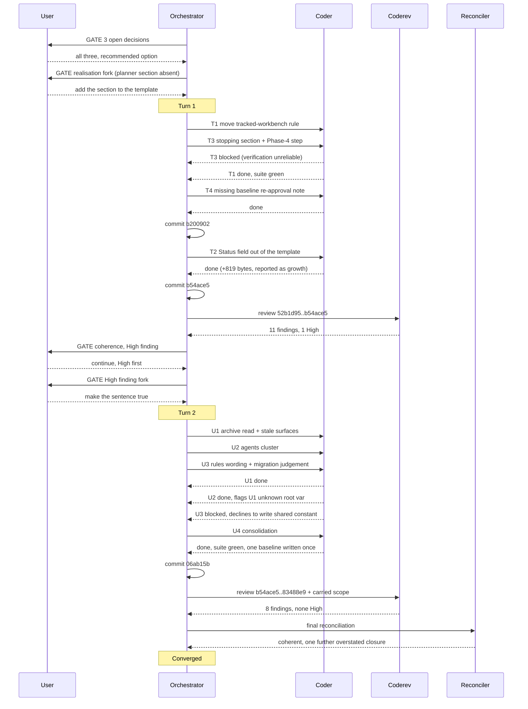

# Orchestrator Session — 260818-2301-orchestrator-session.md

**Directive:** Answer the open decision records, then realise the answers.
**Mode:** custom
**Status:** Complete

## Setup snapshot

| Item | Value |
|---|---|
| Workbench | /Users/k1/Projects/productive/fusion/fusion-workbench |
| Plugin version | 10.2.0 |
| git HEAD at start | 52b1d95 |
| Turn budget | 12 (resolved from fusion.json / defaults; no loader diagnostics) |
| Detected domain | code (code_files=98, data_files=10, counted_by=git-ls-files) |
| Active Circle | none |
| Circles | 9 closed-coherent, 1 bounded, 1 superseded; 0 anticipated, 0 active |
| Portfolio hint | not printed — no anticipated or active Circles |
| Open defect records (shared) | 87 |
| Open plan records (shared) | 0 |
| Open decision records (shared) | 3 |
| Legacy halt flag | absent |
| Permission file | .claude/settings.local.json already at bypassPermissions; Step 0g question skipped |
| Monitor binary | refreshed from the installed plugin |
| Interrupted session | none (no agentstate.yaml) |

## Turns

(none yet)

## Open decisions answered at a user gate (before any Turn)

Three open decision records were put to the user in one gate. All three were answered with the
record's own recommendation, appended an `Answered:` line citing this history file, and renamed
`_o_` → `_a_`.

| Record | Answer |
|---|---|
| `260816-1707_*_to-whom-is-the-new-workbench-tracking-rule-emitted…` | Option 1 — `rules/workbench-tracking.md` is emitted to no agent; the conventions file points at it and `/fusion:cleanup`'s archive step cites it in its own body. Unblocks the move approved in `260816-0711`. |
| `260817-1613_*_does-a-plan-stated-precondition-get-any-mechanism…` | Option 2 with option 1's honesty — the orchestrator reads `## Where this Circle stops` aloud at Phase 4 and asks; `agents/planner.md` states that the human at that gate is the whole of the enforcement. |
| `260818-2212_*_should-the-decision-records-status-field-exist-at-all…` | Option 1 — the `**Status:**` field leaves the decision-record template in two rule files; the filename marker is the only source. The 94 existing records stay as they stand. |

### Head-room measured before proposing realisation work

Taken at HEAD `52b1d95` with the baseline maps in `hooks/lib/__tests__/surface-growth-bound.test.ts`:

| Surface | Baseline floor | Measured | Remaining head-room |
|---|---|---|---|
| `agents/*.md` | 399 843 | 411 203 | 6 640 of 18 000 |
| `skills/*/SKILL.md` | 220 439 | 229 335 | 11 104 of 20 000 |

The second answer is the only one that adds to `agents/`; the first and third remove bytes from the
always-on rule set. Both growth-bound tests pass at HEAD.

## Turn 1

**Tasks:** T1, T3, T4 (commit `b200902`), T2 (commit `b54ace5`). All four done.

| Task | What landed |
|---|---|
| T1 | `rules/workbench-tracking.md` created, section moved verbatim, pointer left, fifth header-table row, cited by `skills/archive/SKILL.md`, `CLAUDE.md` Layout row. Realises `260816-1707` and unblocks `260816-0711`. |
| T3 | `## Where this Circle stops` added to the plan output format with the honesty paragraph; `agents/orchestrator.md` Phase 4 step 2b reads it aloud before the closure rename. Realises `260817-1613`, closes `260818-2343_*_the-answered-precondition-decision-names-a-planner-section-that-agents-planner-md-does-not-have.md`. |
| T4 | The missing re-approval note above the `reference-resolution-lint` BASELINE, with a per-file measurement taken in a detached worktree at `52b1d95` with `agents/*.md` held at HEAD. |
| T2 | `**Status:**` out of the decision-record template and the worked example, with the position on existing records stated. Realises `260818-2212_*_should-the-decision-records-status-field-exist-at-all-now-that-the-circle-records-has-been-removed.md`, closes `260811-2146_*_half-the-decision-records-carry-a-status-that-disagrees-with-their-marker-and-twelve-keep-the-unfilled-template-stub.md` and `260812-1232`. |

**Decisions realised this Turn:** `260816-1707`, `260816-0711`, `260817-1613`, `260818-2212_*_should-the-decision-records-status-field-exist-at-all-now-that-the-circle-records-has-been-removed.md` — all `_a_` → `_i_`.

### Three orchestrator errors, recorded because they cost time

1. **Parallel dispatch on a shared test corpus.** T1 and T3 were dispatched concurrently and each was told to run the full suite. Both suites went red on the other's in-flight edits, T3 reported itself blocked, and its verification had to be re-run on the settled tree. The file scopes were disjoint; the *verification* was not.
2. **A glob that caught a bystander.** `mv 260816-1707_a_*` renamed a second, unrelated record sharing the timestamp prefix. Reverted, body untouched, git records no change to it. Later transitions were written out by full filename.
3. **A wrong claim in a dispatch prompt.** The T4 brief explained `hooks/lib/staging-drift.ts`'s zero contribution as "a bare file path was already a counted token". False: `hooks/lib/*.ts` is scanned `recordsOnly`, so classes (a) and (b) are never read there. The executor checked rather than transcribed, and said so. Verified at `reference-resolution-lint.test.ts:176,656-657`.

A fourth belongs to the executors and is filed: T3 used `git stash`/`pop` while T1 was writing (`shared/issues/260819-0001_o_*`).

### Review

`coderev`, range `52b1d95..b54ace5`, both commits now covered. Eleven findings, ten filed as records
(`260819-0038` … `260819-0042`) plus an `Also seen:` line on `260819-0028_*_the-project-language-rule-names-a-record-status-pairing-that-no-record-kind-still-has.md`.

The High finding is that `skills/archive/SKILL.md:11` asserts "This skill reads
`rules/workbench-tracking.md`" and no step in its process does. That sentence is the *positive
reason* decision `260816-1707` gave for allowing a third no-agent rule file, so the answer was
realised as a claim rather than a mechanism. The decision's own Cons column named the risk. Verified
independently: the file appears twice more in the skill, both times as a parenthetical citation.

The review also found the always-on byte figures this session quoted (98 874 → 95 458 → 96 277) are
the `[analyst]` dispatch total, not the always-on floor; on `CLAUDE.md`'s own definition the floor ran
101 393 → 97 977 → 98 796. Same deltas, wrong label, and the same class as open issue `260816-1345`.

## Turn 2

**Tasks:** U1, U2, U3 concurrently on disjoint file sets, then U4 as a consolidation pass. All four
done, one commit. Ten of the eleven Turn-1 review findings closed, plus `260816-1051`, which an
executor found in a sentence it was already rewriting and left rather than taking uninstructed.

**The dispatch method changed after Turn 1's failure, and the change is the point.** Turn 1
dispatched two executors on disjoint *file* sets and told each to run the full suite; both suites
went red on the other's in-flight edits, and one executor reached for `git stash` to measure a delta,
reverting the whole tree to HEAD while the other was writing. Turn 2 kept the disjoint file sets and
added two constraints: **no executor runs the suite**, and **no executor writes a shared pinned
constant** — each measures its own contribution and reports it. U4 then re-measured per file, wrote
`{1156, 149, 102}` once with a note attributing all eight figures, and found they sum to the
whole-tree total exactly. Three agents had independently declined to write that constant, one of them
stating the reason unprompted: three writers of one number leave the last writer's figure standing.

**Two executors corrected their dispatch rather than following it.** U1 was told to add the fifth
rule file to a README enumeration with an "emitted to no agent" qualifier; it found that three of the
five are emitted to no agent, so the qualifier would have implied a contrast that does not exist, and
wrote what the partition table supports. U3 was asked to judge whether the `**Status:**` removal needs
the three migration surfaces its Circle-record twin got, and declined to write any: v10.2.0 is tagged
on an ancestor, so the removal is in no released version, and both available moves state something
false — a v10.2 note tells an installed base it carries a change it does not, and a v10.3 note names a
version number nobody has chosen. That finding stays open as the carrier for a release-time check.

**One defect was introduced and caught inside the Turn.** U1's new Step 1 block used `SRC` as a root
variable; `ROOT_VARS` in `reference-resolution-lint.test.ts` does not declare it, so the citation was
an unclassified-root violation. U2 found it while measuring its own zero contribution and reported it
as not its own. U4 renamed it to `FUSION_SRC`, the name that already exists for that value, rather
than declaring a synonym beside it.

**Verification:** `cd hooks && npx vitest run` — exit 0, 36 files, 672 tests, run by U4 on the settled
tree and again by the orchestrator before committing.

**Byte movement.** Always-on floor 98 796 → 98 733 (U3's two folds, both net negative).
`agents/` +766 (head-room 4 069 → 3 303). `skills/` +750 (729 for the read instruction, 21 for the
rename). No baseline moved; both goldens regenerated after all four tasks landed, never before.

## Coherence

<!-- RECONCILER-OWNED -->

Reconciler, domain `code`, HEAD `83488e9`, range `52b1d95..83488e9`. Full pass:
`260819-0840-reconciliation.md`.

**Verdict:** coherent

**Edges:**

- **Artifact↔Grounding.** 13 load-bearing claims re-derived against disk, all 13 hold; 98 open defect records in `shared/issues/`, 50 of them reviewer-filed. Every marker in the
  workbench is correct at HEAD: the four decisions marked implemented are implemented, the thirteen
  closed defects are fixed, and the bystander record a Turn-1 glob renamed stands at `_a_` untouched
  in both git and the worktree. The always-on floor reproduces to the byte at every commit in the
  range (101 393 → 97 977 → 98 796 → 98 733), `npm run build` leaves `git status -- hooks/dist`
  empty, the suite is green at 36 files / 672 tests, and `bin/fusion-review-coverage --since 52b1d95`
  returns `uncovered=0 verdict=covered carried=none`. The drift is in prose, not state: four of the
  thirteen `Resolved:` notes claim a guarantee wider than their edit delivered. The Turn-2 review
  found three (`260819-0821_*_the-status-qualifier-closure-names-one-remaining-site-and-a-shipped-agent-prompt-still-carries-it.md`, `260819-0824_*_the-stub-guard-holds-only-for-a-section-that-is-nothing-but-the-stub-and-the-closure-claims-otherwise.md`, `260819-0827_*_the-fold-note-credits-the-header-table-with-carrying-verbatim-what-the-rule-files-own-lede-carries.md`); this pass re-did the check on the other
  ten and found a fourth, `260811-2146_c_*`, closed on the first of its two stated defects with the
  second — the unfilled footer stub the decision-record template still prescribes — untouched
  (`260819-0836_o_*`, and a `Revised by:` line on the closed record). The `260816-0711` footer's word
  "verbatim" is the second wording overstatement, already carried by `260819-0826_o_*`.

- **Artifact↔Directive.** All five commits move toward the Directive; none is orthogonal and none
  moves away. `b200902` realises `260816-1707`, `260816-0711` and `260817-1613`; `b54ace5` realises
  `260818-2212_*_should-the-decision-records-status-field-exist-at-all-now-that-the-circle-records-has-been-removed.md`, the third answer; `06ab15b` closes ten of the eleven findings the review of those
  two commits raised, which is the Directive's own work being finished rather than new work; `5ec26b2`
  and `83488e9` are the workbench records of the two Turns. The Directive named three answers and
  three realisations, and the session delivered four realisations — `260816-0711` had been
  answered-but-unrealised for two days, blocked on `260816-1707`, and was unblocked by answering it.

- **Grounding↔Directive.** 25 active Grounding records (`_o_` + `_a_`) across all stores; 25
  consistent with the Directive, 0 conflicting. `shared/decisions/` holds **no** open record at HEAD:
  the three it opened with are the three the session answered and realised. The three remaining open
  decisions workbench-wide sit in closed Circles
  (`260814-1915_*_should-mode-3-require-the-audit-line-on-every-run-instead-of-testing-whether-it-was-dispatched.md`, `260815-1845_*_does-analyst-get-a-project-local-rule-pattern-now-that-the-investigator-fold-orphaned-one.md`, `260815-2056`) and are outside this Directive's reach. Of the 21
  answered records in `shared/`, none is realised by any commit in the range; the one that looks like
  a gap, `260810-2145_a_*`, carries a written-out reason for staying `_a_` and is correct as it stands.

**Rebalance recommendation:** none

The overstated-closure pattern is real, is now four instances across two Turns, and is the standing
risk this session leaves behind — but it is not a Rebalance case. None of the four options addresses
it: the Directive was reached, the Grounding is accurate at HEAD, and the Artifact does what the
decisions decided. The fix is the five open defect records that already carry it, and the check that
finds this class is a reviewer or a reconciler re-doing the measurement, which is what happened here.

## Budget

| Metric | Count |
|--------|-------|
| Turns | 2 |
| Tasks resolved | 8 (T1–T4, U1–U4) |
| Tasks skipped/deferred | 0 |
| Issues created | 24 |
| Issues resolved | 13 |
| Decisions answered (`_o_`→`_a_`) | 0 standing — see note |
| Decisions implemented (`_a_`/`_o_`→`_i_`) | 4 |
| Commits | 5 |
| Agent errors | 1 (T3 reported itself blocked on a verification the orchestrator's own parallel dispatch had made unreliable) |
| Human gates hit | 5 |

Every figure above is derived at write time rather than tallied: commits from
`git rev-list 52b1d95..HEAD`, Turns from the `turn_start` events since this session's
`session_start`, the four record rows from the stores by comparing each filename against
`52b1d95`.

**The answered row reads 0 because it counts standing markers, not transitions.** Three decision
records did move `_o_` → `_a_` at the user gate, and all three moved on to `_i_` in the same session,
so no record stands at a marker it did not have at the anchor. The transition happened; the disk no
longer shows it, and this method reports the disk.

## Per-Turn Log

### Turn 1
- Tasks: T1, T3 (concurrent), T4, T2
- Commits: `b200902`, `b54ace5`
- Review: 11 findings, 10 filed, 1 High
- Circuit breaker: OK
- Coherence: review-needed at the per-Turn gate; user chose to continue with the High finding first

### Turn 2
- Tasks: U1, U2, U3 (concurrent), U4 (consolidation)
- Commits: `06ab15b`
- Review: 8 findings, none High, all filed
- Circuit breaker: OK
- Coherence: coherent (Phase 3 reconciler)

## Review coverage

**Range:** `52b1d95..83488e9` — 5 commits
**Covered by:**
- `shared/reviews/260819-0044-coderev-*.md` — range `52b1d95..b54ace5`, covers 2
- `shared/reviews/260819-0832-coderev-*.md` — range `b54ace5..83488e9`, covers 3

**Not covered:** none
**Carried out-of-scope files:** none. The first review declared four (`hooks/dist/lib/staging-drift.js`,
`.d.ts`, and both goldens); the second was dispatched with them added to its scope and opened all four,
so the list is discharged rather than merely aged out.

## Remaining Work

`shared/decisions/` holds **no open record**. The three this session was started for are implemented.

`shared/issues/` holds 98 open records, 22 of them filed during this session. The eleven that bear
directly on this session's own output:

| Record | What it carries |
|---|---|
| `260819-0041_o_*` migration surfaces | the release-time check: does this range change something an installed base has on disk |
| `260819-0821_o_*` | `agents/orchestrator.md:303` still carries the qualifier the rule dropped |
| `260819-0822_o_*` | the fifth `fusion-source-root` call site drops the diagnostic four siblings carry |
| `260819-0823_o_*` | the installed-base premise behind leaving the migration gap open is contradicted by `install.sh`'s default ref |
| `260819-0824_o_*`, `260819-0827_o_*`, `260819-0836_o_*` | three closure notes claiming one degree more than their edit delivered |
| `260819-0825_o_*`, `260819-0826_o_*`, `260819-0828_o_*` | the fixed gate reason absent from the row a grep-builder reads; a fold phrase the cited tree does not use; the stopping section made mandatory for plans whose only stated reader never runs |
| `260819-0001_o_*` | an executor reached for `git stash` while a second was dispatched in parallel |
| `260819-0837_o_*` | a stray zero-byte `Test.txt` at the repo root that `git check-ignore` does not cover |

## Commits

| Hash | Message | Task |
|------|---------|------|
| `b200902` | a tracked workbench gets its own rule file, and a plan's stopping condition gets a reader | T1, T3, T4 |
| `b54ace5` | a decision record states its state once, on its filename | T2 |
| `5ec26b2` | the Turn-1 record, its review, and twelve defects the pass produced | housekeeping |
| `06ab15b` | the archive skill actually reads the rule it was the named consumer of | U1–U4 |
| `83488e9` | the Turn-2 record and the one finding left open on judgement | housekeeping |

## What this session got wrong, collected

Four faults were the orchestrator's own, and three of the four were found by an agent it dispatched
rather than by itself:

1. **Parallel dispatch on a shared verification.** Two executors, disjoint file sets, both told to run
   the full suite. Both suites reported the other's in-flight edits. Fixed in Turn 2 by moving the
   suite run out of the executors entirely.
2. **A glob that caught a bystander.** `mv 260816-1707_a_*` renamed an unrelated record sharing the
   timestamp prefix. Reverted; every later transition written out by full filename.
3. **A wrong claim in a dispatch prompt**, corrected by the executor rather than transcribed.
4. **Four closure notes claiming more than their edit delivered** — the dominant pattern of the Turn-2
   review and of the reconciliation, and the successor to Turn 1's dominant pattern. Each is corrected
   with a `Revised by:` line rather than a rewrite, so the original claim stays readable.

## Session Flow

---
**Correction appended 260824** (ontocoder, plan step 5 of `260824-1905_*_plan-close-every-open-defect.md`). The Turn 2 paragraph on U3 justifies leaving the migration gap open
with "the removal is in no released version". The tag half is true: `v10.2.0` is on an ancestor. The
conclusion drawn from it is not, because `install.sh` defaults to `heads/main` and `fusion --update`
re-fetches the same ref, so a user who installed or updated after `b54ace5` carries the removal while
their `plugin.json` still reads `10.2.0`. The reasoning that holds is that the version string does not
distinguish who has the change from who does not, which is a stronger argument for the release-time
check the open record carries and a different one from the one recorded. Filed as
`260819-0823_*_the-installed-base-premise-behind-leaving-the-migration-gap-open-is-contradicted-by-install-shs-default-ref.md`.
