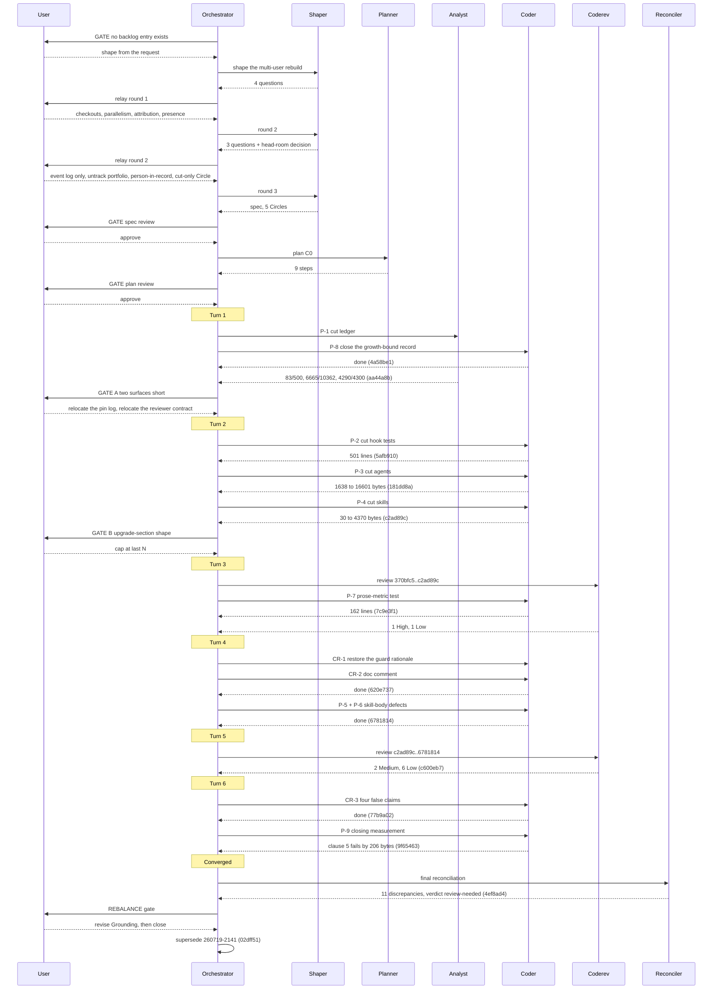

# Orchestrator Session — 260822-1009-orchestrator-session.md

**Directive:** Rebuild fusion into a multi-user tool: lift and reframe the single-active-orchestrator decision so several users can work on one workbench (and possibly several instances on one machine), and move the workbench and session state that is currently gitignored into the repository.
**Mode:** custom (Phase 0b shaping)
**Status:** Complete

## Setup snapshot

| Item | Value |
|---|---|
| Workspace | /Users/k1/Projects/productive/fusion |
| Workbench | fusion-workbench/ (container layout, pre-v4 check clean) |
| Plugin version | 10.5.0 |
| Source root | /Users/k1/Projects/productive/fusion (work tree — this is the plugin's own repo) |
| git HEAD | 370bfc5 |
| Turn budget | 12 (resolved via bin/fusion-turn-budget; no configuration diagnostics on stderr) |
| Detected domain | code (code_files=102, data_files=10, counted_by=git-ls-files) |
| Active Circle | none (`.active-circle` absent) |
| Interrupted session | none (`agentstate.yaml` absent) |

## Open state

- Open defects, shared store: 104 open, 0 in progress (141 closed).
- Open defects inside Circles: 77 (not in this session's scan scope — no Circle is active).
- Open plan steps: 0 (shared/planning holds 4 closed plans, none open).
- Open decisions: 0 open in the shared store (18 answered, 31 implemented, 1 superseded, 2 deferred).
- Circles: 14 records, all terminal — 11 closed-coherent, 2 bounded, 1 superseded. No anticipated Circle, so no portfolio hint was printed.

## Setup notes

- Monitor binary re-copied from the installed plugin and stamped in `.asset-provenance`.
- Concurrency check: no active session marker; a fresh marker was written for this session.
- Stylometric profiles: all four already present and byte-identical to the shipped copies (all four classified `case1-equal`); each was stamped. Nothing was replaced.
- `fusion.json` already present at the project root; the template was not copied over it.
- Permissions: `.claude/settings.local.json` already sets `defaultMode: bypassPermissions`, so Step 0g asked nothing and wrote nothing.
- No legacy halt flag in `.guard-state/`.

## Phase 0 — scope resolution

The user stated the Directive and cited "an extensive backlog entry" for it. **No such entry
exists.** `shared/backlog/` holds three files and none is about multi-user work; a playmaker run
four hours earlier (260822-0319-playmaker-orchestrator-phase4.md) had grepped `shared/` and `circles/` for multi-user, multi-tenant,
concurrency, parallel-session and worktree-slot wording and recorded the same absence in
`portfolio.md`. The orchestrator put the discrepancy to the user at a gate with three ways forward.
The user chose to shape from the request text, accepting that any prior work in the entry is lost.

Mode resolved as `custom`, with no pre-existing plan, so Phase 0b applies.

### What the orchestrator measured before dispatching

- **The blocking record** is `260719-2141_*_concurrency-worktree-slots-vs-single-active-circle.md`,
  answered by the user at Option 3: fusion stays single-active-Circle with no concurrency lock, and
  parallelism is out of scope. Its Option 2 sketches what is now being asked for and says it is
  "almost certainly a separate Circle of its own". Its second reconciliation note (260819-1400)
  closes with the binding sentence: nothing in fusion may assume two orchestrators can run safely
  against one workbench.
- **A second normative surface is affected**, which the request does not mention:
  `rules/workbench-tracking.md` is the authoring home of the record-versus-live-state split that
  puts the ignored files where they are, and it argues against tracking exactly the files the user
  wants tracked.
- **Ignored today** (`.gitignore`, verified): `agentstate.yaml`, `orchestrator-live.md`,
  `.session-marker`, `.active-circle`, `.guard-state/*`, `.commit-lock/*`, `monitor`.
  **Tracked today**: `orchestrator-events.jsonl`, `portfolio.md`, `.fusion-setup`,
  `.asset-provenance`. `.guard-state/` has zero tracked files.
- **Two growth budgets are effectively spent** (measured at `655d976` by the last playmaker run):
  `skills/*/SKILL.md` has 30 bytes of head-room, the hook test suite 15 lines. Work writing into
  either surface has to budget its own cut in the same plan.

## Phase 0b — shaping

Shaper dispatched with the request, the four measurements above, and an instruction to untangle
three bundled concerns before designing anything: several users on one workbench versus several
instances on one machine; what multi-user means for identity, given fusion has no notion of a user
today beyond `memos-<username>.md`; and which state moves into the repository, since "track these
files" and "make these files safe for two writers" are different problems the request runs
together. Awaiting its first clarification batch.

### Round 1 — four questions, four answers

The shaper returned four questions, each with three options and a stated foreclosure. Relayed
verbatim in German; the user answered all four in one gate.

| Question | Answer | What the user accepted losing |
|---|---|---|
| Arrangement | Multiple checkouts, git as transport | Live presence. Two people see each other only after a push. |
| Guarantee under two sessions | True parallelism | A small rebuild. This is Option 2 of the superseded record. |
| Identity | Full attribution on records | Cheapness. Every record template and filing path changes. |
| Visibility of another's work | Presence only | Insight into progress. Queue, running task and dashboard stay private. |

**The orchestrator's own reading of those four, carried into round 2.** Answers 1 and 4 together
*narrow* the opening requirement rather than confirming it. The user's stated reason for tracking
the ignored files was that several users must see them; presence-only visibility needs presence to
travel, but needs neither `orchestrator-live.md` nor `agentstate.yaml` nor the queue to travel at
all. Answer 2 creates a different reason to restructure the same files, not to share them but so
two writers never collide. Two justifications, two conclusions, one set of files, and the request
runs them together. Under answer 1 the second of `rules/workbench-tracking.md`'s two objections
gets worse rather than better: a pull now carries another person's live state into your tree.
`.active-circle` is additionally the wrong *shape* for parallelism, being a pointer to one Circle.

**Sequencing decided here:** the supersession of `260719-2141` is written after the spec is agreed,
not before. The reframed decision's answer is what the spec settles, so filing the record first
would record an answer nobody has stated. The shaper was told to carry that ordering into the
spec's own steps so the record is not forgotten.

Shaper re-dispatched for round 2 with the four answers, the observation above, the four growth
budgets, and two things to settle: whether this is one Circle or a sequence, and whether the
single-active-Circle model itself is in scope or only the advisory warning.

### Filed during shaping

- `260822-1028_*_the-gitignore-kept-list-names-three-tracked-records-and-the-rule-it-cites-names-four.md`
  — the `KEPT:` comment in `.gitignore` names three tracked records where the rule it cites names
  four; `.asset-provenance` is missing from the list. Nothing is broken, the enumeration is
  incomplete. Found while reading the very file this rebuild will rewrite.

## Session log

(Turn entries appended as the session runs.)

### Round 2 — three questions, and a factual correction from the user

| Question | Answer |
|---|---|
| What travels over git | The existing event log alone. `orchestrator-events.jsonl` is already tracked, append-only, tolerates several writers; each session appends its presence line. Accepted as final, not deferred: none of the ignored files becomes tracked. |
| `portfolio.md` | Stop tracking it; regenerate on demand via `/fusion:next`. Accepted: whoever has not pulled sees an older ranking with nothing to warn them. |
| Attribution unit | Person in the record, session only in the event log — with two conditions, below. |

**The user overturned the shaper's undecidability finding, and the orchestrator verified the
correction at HEAD.** The shaper reported that a session identifier is not derivable from fusion's
own inputs and would need a startup script. It is derivable: Claude Code passes `session_id` to
every PreToolUse and PostToolUse hook, and fusion declares it and discards it —
`hooks/guard.ts:84` and `hooks/tracker.ts:132` are the only two occurrences in `hooks/*.ts` and
`hooks/lib/*.ts`, and `GuardEvent` (`hooks/lib/events.ts:61-67`) carries no session field.
`hooks/session-start.ts` reads no stdin, so the identifier does not arrive there. This mattered
because it was about to become the spec's `**Decidability:**` line. What survives of the finding:
the agent itself never sees the identifier, only the hooks do, and two sessions in one checkout
share one `.session-marker` which the second overwrites.

**Two conditions the user attached to the attribution answer.** First, name versus body: if the
record-to-session path is ever needed, the identifier goes in the record body as a metadata field
and never in the filename, because a dead body field is a historical note while a dead filename
component is a reference that designates nothing — and filenames are citation targets that a lint
resolves. Second, a reservation: the timestamp join is weak, since filenames carry minute
resolution and two sessions of one person can write inside a minute. The spec must say what
carries the join or state plainly that it is not load-bearing.

**On the default "one session, one active Circle":** no objection, with the reason that it is not
free — `.active-circle` is a single file at the workbench root (`bin/fusion-paths:255`), so several
active Circles per session means turning that file into session state, which is exactly Circle 1.

### The head-room decision, filed and answered in the same session

The shaper filed `260822-1102_*_what-happens-when-a-planned-circles-required-work-exceeds-the-remaining-head-room.md`
with no recommendation, on the ground that the trade is the user's. Re-measured at HEAD it found
the hook-test head-room had moved from 15 lines to 12 since `655d976`, so 30 bytes on `skills/`
and 12 lines on the hook tests are what the rebuild would start against.

**The user answered Option 1: a cut-only Circle runs first**, with the four already-open defects
as its test. Options 2 (pay per step) and 3 (a third re-baselining moment) were rejected, so no
baseline moves and the growth instrument keeps its meaning. The orchestrator recorded the answer
and transitioned the record `_o_` → `_a_`.

Shaper re-dispatched for round 3 with all eight answers, the verified correction, both conditions,
and the changed sequencing.

### Round 3 — the spec, and the spec-review gate

Spec written to `260822-1136_*_spec-fusion-becomes-a-multi-user-tool.md` and
**approved by the user** at the Phase-0b gate. What it settles, beyond the eight answers:

- **Five Circles, not four.** C0 cut-only, C1 isolation proof plus supersession of the blocking
  decision, C2 transport, C3 attribution, C4 presence. C0 stays its own Circle rather than being
  absorbed, because a Circle holding both a reduction and a feature cannot report the trade between
  them honestly. C1 can refute the whole sequence while refuting is still cheap.
- **The state partition leaves exactly one file that two checkouts both write**,
  `orchestrator-events.jsonl`, which is append-only and already tracked. Everything else has one
  writer per file or never leaves the checkout. That is what keeps the rebuild specifiable.
- **The opening requirement is retired rather than fulfilled**, and the spec says so: answers 1, 4
  and 5 together mean the ignored state stays ignored, and what travels is the record layer plus one
  line per session in the log.
- **A gap in the user's answers, closed by the shaper and put back to the user:** `.active-circle`
  stays local, so nothing stops two people activating the same Circle. The Circle record gains a
  claim field and `/fusion:next` refuses a Circle held by somebody else. The collision is detected,
  not prevented, because git refuses the second push.
- **Answer 3 was narrowed to a contradiction of its own wording**, deliberately and visibly: "every
  filing path changes" becomes "the record templates change", because the user's name-versus-body
  condition leaves every filename untouched, `memos-<username>.md` included.
- Four bounded surfaces, not the three the dispatch named.

Filed by the shaper in this round: two open decisions
(`260822-1136_*_how-does-the-tracked-event-log-behave-when-two-checkouts-both-appended-to-it.md`,
blocking C2's close; `260822-1136_*_which-identity-does-an-attributed-record-carry-when-the-transport-is-git.md`,
due at C3's planning gate) and one defect
(`260822-1136_*_two-definitions-of-the-turn-count-disagree-and-the-resume-snippet-counts-every-session-in-the-log.md`).

## Phase 0b.2 — planning

Planner dispatched for **C0 only**, with `**Executors:** coder, ontocoder, analyst`. C1 through C4
are out of scope: they depend on C0's outcome and on the two open decisions. The dispatch carries
the four defects that define C0's test, the instruction to re-measure the head-room at HEAD rather
than trust the spec's figures, the `growth-bound.ts` re-baselining rule, and two observations about
where a cut is safe in this repository — that prose here is often load-bearing rather than
decorative, and that a duplicated normative statement is the cheapest legitimate cut.

## Phase 2 — the Turn loop

### Turn 1 — the ledger, and Gate A

`P-8` (coder) closed `260821-2204` after verifying both of its preconditions against the tree
rather than against the plan's account of them. It measured the record's 15-line head-room figure
at HEAD and found 12, the three lines having gone in one commit on a three-line re-approval
comment — the same kind of spend the record is about. Commit `4a58be1`.

`P-1` (analyst) produced the cut ledger and **corrected the plan by a factor of three**. The
24 685 and 12 022 duplication figures were gross occurrence bytes; net of bootstrap, one kept copy
and a citation, they yield 10 631 and 3 496, clearing neither target alone. Bootstrap duplication
is about 9 900 bytes across fifteen prompts, not the two sentences the plan named. The hook test
surface has no restatement reserve at all: 52 of 20 363 lines overlap shipped non-test text, mostly
quoted assertion strings. Commit `aa44a8b`.

**Gate A**, on totals of 83/500 lines, 6 665/10 362 bytes and 4 290/4 300 bytes. Two answers:

- The pin's re-approval log: **option 2**. Rationale and newest entry stay; the other 25 move to an
  analysis record with a citation line in their place. Recorded on `260822-1229_*_where-does-the-reference-resolution-pins-re-approval-attribution-log-live.md`, now implemented.
- The `agents/` shortfall: **relocate the reviewer contract** to a shared rule. Stated to the user
  as a relocation rather than a cut, and accepted on that statement.

### Turn 2 — three cuts

| Task | Surface | Head-room before | After | Commit |
|---|---|---|---|---|
| P-2 | hook test suite | 12 lines | 513 | `5afb910` |
| P-3 | `agents/*.md` | 1 638 bytes | 16 601 | `181dd8a` |
| P-4 | `skills/*/SKILL.md` | 30 bytes | (running) | |

`P-2` removed no assertion. Both historical narratives it cut left a citation behind, which is the
condition under which such a cut is permitted at all.

`P-3` took one ledger row **wider** than measured: the readability-gate clause was listed in six
prompts and the editor carried a shortened variant, so it was cut in seven. Leaving one copy
standing is the failure the row exists to close. Three test cases went with the relocation and
none lost a subject — three assertions had run once per prompt against two copies of one claim,
and with one authoring home they run once. The coder also noticed that the Gate A answer
authorising the relocation existed only in a dispatch prompt, and filed it as a decision record so
the new rule file's provenance could cite something durable.

`P-4` was dispatched with defect `260822-1227_*_plan-step-4-names-a-duplication-record-whose-own-fix-direction-forbids-the-cut-the-step-asks-for.md`, which the analyst filed **against the plan step
itself**: one of the three duplication records the step names as a first candidate cannot be cut
the way the step asks, yielding zero `skills/` bytes and costing about ten hook-test lines. The
ledger and that defect supersede the step's candidate list.

**Gate B** answered: cap the `/fusion:help` upgrade section at the last N releases with one
standing pointer to `docs/`, which makes its growth bounded by construction. Option 3 of the record,
raising the `skills/` baseline, was not put to the user — the record names it in order to reject it
visibly, and Gate A had already settled that no baseline moves.

## Coherence

<!-- RECONCILER-OWNED -->

Computed 260822-1556 by the reconciler (domain `code`) over `370bfc5..9f65463`, twelve commits, at
HEAD `9f65463`.

**Verdict:** review-needed

**Edges:**

- **Artifact↔Grounding:** every figure the closure measurement reports was re-derived from the tree and matches to the byte and the line — head-room 16 601 / 4 661 bytes and 302 lines, four baseline maps identical to `370bfc5` by diff (413, 389, 1 554, 1 042 bytes), clause 5's failure exactly 206 bytes and 49 lines across `620e737`, `77b9a02`, `181dd8a` and `c2ad89c` — and the four decisions that authorised commits hold their citations (`260822-1229_*_where-does-the-reference-resolution-pins-re-approval-attribution-log-live.md` → `hooks/lib/__tests__/reference-resolution-lint.test.ts:488-493`, `260822-1330_*_where-does-the-reviewer-contract-live-when-the-agents-surface-has-to-give-back-bytes.md` → `181dd8a`, `260822-1102_*_what-happens-when-a-planned-circles-required-work-exceeds-the-remaining-head-room.md` → the Gate answer, `260822-1154` ×2 → no baseline moved); against that, **three stated claims are false** (`260822-1226-cut-ledger-for-three-bounded-surfaces.md:54` names an anchor two commits behind where it ran; `260822-1228_*_…` reported step 8's own effect as a pre-existing state; the closure measurement assigns 610 bytes of the five-claim cut to the reviewer-contract relocation), **six tracking fields had drifted** (the plan's `**Status:**` and five unmarked steps, the spec's `**Status:**`), and **one shipped-text commit carries no review** — `bin/fusion-review-coverage --since 370bfc5` returns `verdict=uncovered` with `77b9a02` touching three skill bodies, which `260815-2109_*_may-a-circle-close-over-an-uncovered-review-range-and-who-decides.md` permits but does not excuse. **Flagged.**

- **Artifact↔Directive:** the commits are **orthogonal to the stated Directive**, and that is the honest reading rather than a harsh one — eleven of the twelve contain no multi-user work of any kind (`4a58be1`, `aa44a8b`, `5afb910`, `181dd8a`, `c2ad89c`, `7c9e3f1`, `620e737`, `6781814`, `c600eb7`, `77b9a02`, `9f65463` are a cut, four defect fixes, two reviews and a measurement), no record template gained a person field, `.gitignore` is untouched, `orchestrator-events.jsonl` gained no presence line, and the decision the Directive requires overturned is still standing; the single commit that moves toward the Directive is `faac921`, which carries the spec and the plan. The orthogonality is **authorised and preparatory**: the user chose it at the Phase-0b gate (`260822-1102_*_what-happens-when-a-planned-circles-required-work-exceeds-the-remaining-head-room.md`, option 1), the room it bought is real and measured, and the Directive is more reachable at HEAD than at `370bfc5`. It is still not movement toward the destination, and a closure gate that reads it as movement is reading it wrong. **Flagged.**

- **Grounding↔Directive:** 43 active decisions across the two stores at the end of this pass (24 shared, 19 in Circles; `_o_` + `_a_`, one of them filed by this pass), of which **42 are consistent with the Directive and one contradicts it outright** — `260719-2141_*_concurrency-worktree-slots-vs-single-active-circle.md`, `_a_`, whose answer is that fusion stays single-active-Circle with no concurrency lock and whose reconciliation note carries the sentence "nothing in fusion may assume two orchestrators can run safely against one workbench"; the spec schedules its supersession as C1's own work and the orchestrator deliberately sequenced the supersession after the spec was agreed, but the spec **is** agreed and no `Superseded by:` line was written, so the rule is still in force at HEAD. A second, softer item: `260807-0158_*_how-is-a-unique-record-filename-obtained.md` is `_a_` and settled "no minting helper" on a collision measurement taken over a corpus one person wrote from one checkout, which is the input the Directive changes — filed as `260822-1556_*_does-the-record-filename-convention-hold-when-several-checkouts-file-into-one-store.md`. No decision-to-decision conflict was found. **Flagged.**

**Rebalance recommendation:** revise Grounding

The mechanical priority puts Directive first when the Artifact↔Directive edge is flagged as
orthogonal. That order is not followed here, and the departure is stated rather than hidden: the
Directive needs no revision, because the orthogonality is a user choice taken at a gate with the
trade visible, and revising the destination would resolve nothing that is actually broken. What is
actually broken is one line of active Grounding forbidding what the Directive asks for. Writing the
supersession of `260719-2141` — which C1 already schedules, and which the session's own sequencing
argument now permits, since the spec it was waiting on is agreed — is the one change at HEAD that
removes a standing contradiction. Bounded Closure is not proposed: the Directive is reachable, and
C0 made it more so.

Reconciliation log for this pass: `260822-1556-reconciliation.md`.

## Budget

| Metric | Count |
|--------|-------|
| Turns | 6 |
| Tasks resolved | 12 of 12 |
| Tasks skipped/deferred | 0 |
| Issues created | 21 |
| Issues resolved | 8 (shared store; three more closed inside Circle stores, outside this session's scan scope) |
| Decisions filed | 9 |
| Decisions answered (`_o_`→`_a_`) | 2 |
| Decisions implemented (`_a_`→`_i_`) | 2 |
| Decisions superseded (`_a_`→`_s_`) | 1 |
| Commits | 14 |
| Agent errors | 0 |
| Human gates hit | 6 |

Every record figure is derived from the stores at write time rather than tallied across Turns, per
`agents/orchestrator.md` `### The record counts are computed, not tallied`.

## Review coverage

**Range:** `370bfc5..02dff51` — 14 commits
**Covered by:**
- `260822-1421-coderev-c0-cut-only-circle.md`, range `370bfc5..c2ad89c`, covers 6
- `260822-1506-coderev-the-guard-rationale-repair-and-the-capped-help-topic.md`, range `c2ad89c..6781814`, covers 3

**Not covered:** five commits.

| Commit | Subject | Shipped text? |
|---|---|---|
| `c600eb7` | the second review plus nine defect records | no |
| `77b9a02` | four false claims corrected in three skill bodies | **yes** |
| `9f65463` | the closing measurement | no |
| `4ef8ad4` | the reconciliation | no |
| `02dff51` | the supersession | no |

**One of the five carries shipped text and is the one that matters.** `77b9a02` edits
`skills/setup/SKILL.md`, `skills/next/SKILL.md` and `skills/help/SKILL.md`, and it is itself the
repair of findings from the second review, so it is exactly the kind of commit a third pass exists
to check. The other four change workbench records only.

**Carried `**Not-opened:**`:** the second review's list, fourteen paths, every one verified against
the disk before it was written. The first review's list is **not** carried, because five of its
fifteen entries name records that do not exist — filed as
`260822-1510_*_five-of-fifteen-not-opened-entries-name-records-that-do-not-exist-and-no-gate-reads-that-field.md`,
with the five real records they were paraphrases of named there.

## What C0 delivered

| Surface | Head-room at `370bfc5` | At `02dff51` | Target |
|---|---|---|---|
| Always-on rule core | 3 509 bytes | 3 509 bytes | none set |
| `agents/*.md` | 1 638 bytes | 16 601 bytes | ≥ 12 000 |
| `skills/*/SKILL.md` | 30 bytes | 4 661 bytes | ≥ 3 000 |
| Hook test suite | 12 lines | 302 lines | ≥ 300 |

All four baseline maps byte-identical to the session anchor, verified twice independently.

## The stopping clauses, read back

Seven clauses in the plan's `## Where this Circle stops`. Six hold. One does not, and the honest
answer is recorded rather than reworded:

- **Clause 5 — nothing added to a bounded surface beyond the four defect fixes: NO**, by 206 bytes
  and 49 lines. None of it is a feature; most is pin re-approval attributions the cuts themselves
  required. All four surfaces are net negative across the range. Filed as
  `260822-1506_*_two-of-the-c0-plans-stopping-clauses-cannot-both-be-answered-yes-for-a-repair-the-first-one-demands.md`,
  whose finding is that clauses 4 and 5 cannot both be answered yes for a repair clause 4 demands.
- **Clause 4 — every cut carries a home that holds its claim: holds at HEAD, did not hold
  throughout.** It was tripped by a cut in `c2ad89c`, caught by review, and repaired in `620e737`
  and `77b9a02`.

## Remaining work

- **C1 through C4 of the specification are unstarted**, and the workbench holds no Circle for any of
  them. C0 itself ran without a Circle directory, so Phase 4 had nothing to transition and the
  portfolio cannot rank what comes next. Filed as
  `260822-1556_*_the-spec-names-five-circles-and-the-workbench-holds-none-of-them-so-c0-closed-with-nothing-to-transition.md`.
- **13 open defect records** and **6 open decision records** filed this session, listed in
  `260822-1540-coder-c0-step-9-closure-measurement.md` and
  `260822-1556-reconciliation.md`.
- The specification stays `_o_` at Partially Complete: one of five capabilities delivered.

## Session Flow

**Status:** Complete. C0 delivered in full; the Coherence verdict was `review-needed` and the user
resolved it by revising the Grounding.
