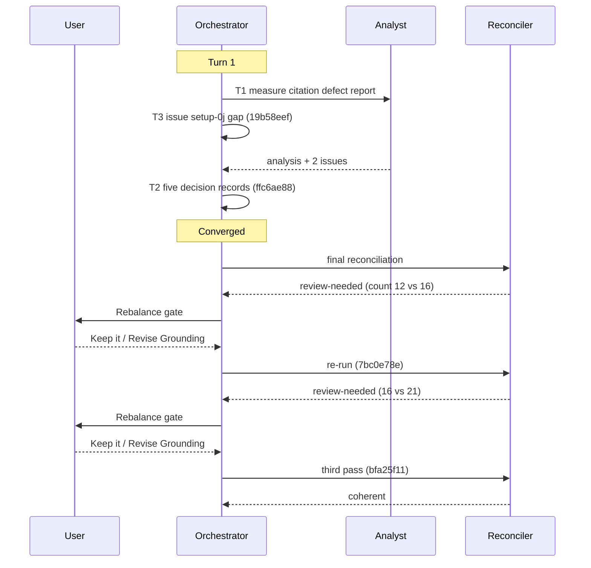

# Orchestrator Session — 260828-0846

**Filed by:** orchestrator, Kai Stalmann <ks@qantr.com>
**Directive:** (1) verify the fusion status files are gitignored per the workbench-tracking partition; (2) take up the consumer defect report on the citation convention (shared/issues/260828-0828_*_fusion-citation-bookkeeping-defect-report.md) and reflect it in this project's own bookkeeping.
**Mode:** custom
**Status:** Complete

## Snapshot at start

- HEAD: 65cf23be
- Open issues: 2 (+1 the report itself, renamed to carry its _o_ marker); open plans: 1; open decisions: 5; backlog: 3
- Circles: 15 c, 3 b, 1 s; none active, none anticipated (no /fusion:next hint printed)
- Domain: code (code_files=121, data_files=10, counted_by=git-ls-files)
- Turn budget: 12 (no loader diagnostics)
- Legacy leftovers deleted at user's choice: .guard-state/escalation.json, churn.json, state-drift.json (nothing was blocked before or after)
- Identity: Kai Stalmann <ks@qantr.com>, checkout 5e8248d7; presence: no other party in 7 days

## Log

- Setup complete; ceremony run once the Directive arrived.
- gitignore audit: .cadence-anchors (class L) was untracked but not ignored; negation-free exclusion line added to .gitignore. All other root entries match rules/workbench-tracking.md.
- T3 done: issue for Step 0j gap filed; report renamed with marker, consumer-record list fenced; commit 19b58eef.
- T1 done: analysis shared/analyses/260828-0859-citation-bookkeeping-defect-report-measured-against-fusions-own-corpus.md; two issues filed by analyst (260828-0900, 260828-0901).
- T2 done: five decision records 260828-0904_o_* for Q1–Q5; commit ffc6ae88.

## Coherence
<!-- RECONCILER-OWNED -->

**Verdict:** review-needed

**Edges:**
- Artifact↔Grounding: 9 claims verified (gitignore line, report marker and fence, analysis, 3 issues, 5 decisions, analyst history) / 1 drift item: issue `260828-0900_*` and the five `260828-0904_*` decisions state twelve `$SCAN_*` self-citation lines, the tree holds sixteen (`agents/orchestrator.md:435,511,516,550` unlisted) and the acceptance grep matches fourteen; filed as `shared/issues/260828-0907_*` (Grounding at fault) / 5 open coderev+ontorev issues, none from this session (`260827-0410_o_`, `260828-0044_o_`, `260828-0853_o_`, `260828-0900_o_`, `260828-0901_o_`).
- Artifact↔Directive: commits move toward the stated Directive; `19b58eef` closes the `.cadence-anchors` ignore gap and takes in the report (clause 1 and 2), `ffc6ae88` measures the report here and files its questions (clause 2).
- Grounding↔Directive: 40 active decisions consistent / 0 potentially conflicting; the two `260825-1030_a_*` records are the basis clause 1 executed against, and the five `260828-0904_o_*` records are clause 2's open questions, none answered against it.

**Rebalance recommendation:** revise Grounding
- Phase 3 verdict review-needed (count twelve vs sixteen). Rebalance gate: user chose Keep it, then Revise Grounding. The Grounding change is the reconciler's issue 260828-0907 plus its annotations; no new decision question arose, so no record was filed. Reconciler re-run follows.

## Coherence
<!-- RECONCILER-OWNED -->
Re-run 260828-1001, after the Rebalance gate (Keep it, then Revise Grounding); range `65cf23be..7bc0e78e`.

**Verdict:** review-needed

**Edges:**
- Artifact↔Grounding: 3 claims verified (`7bc0e78e` lands issue `260828-0907_*` and the notes on the seven records; `.gitignore:91` and the two skill lines unchanged) / 1 drift item, the same one, still open: the corrected sixteen is itself low; the widened grep `260828-0907_*` prescribes matches twenty-one lines at HEAD, the further five at `agents/orchestrator.md:33,148,398,709,1008`, all pre-session (Grounding at fault; the 0907 pass never ran its own grep, corrected by appended notes on `260828-0907_*` and `260828-0900_*`) / 6 open coderev+ontorev issues, none from this session's code (`260827-0410_o_`, `260828-0044_o_`, `260828-0853_o_`, `260828-0900_o_`, `260828-0901_o_`, `260828-0907_o_`).
- Artifact↔Directive: commits move toward the stated Directive; `19b58eef` (clause 1 and 2), `ffc6ae88` (clause 2), `7bc0e78e` (bookkeeping on clause 2's records, no code).
- Grounding↔Directive: 40 active decisions consistent / 0 potentially conflicting; unchanged from the 0907 verdict, no decision record moved in `7bc0e78e`.

**Rebalance recommendation:** revise Grounding
- Reconciler re-run (260828-1001): review-needed again; the widened grep gives 21 lines at 7bc0e78e, annotated on 260828-0907. Gate re-entry: Keep it, Revise Grounding: the figure is now command- and commit-stamped rather than asserted (critical-stance §5). Third reconciler run to confirm, then Phase 4.

## Coherence

Third pass 260828-1020, after `bfa25f11` landed the 1001 annotations; range `65cf23be..bfa25f11`.

**Verdict:** coherent

**Edges:**
- Artifact↔Grounding: 1 claim verified (the twenty-one figure in `shared/issues/260828-0907_o_*` is stamped `HEAD 7bc0e78e` and its own grep prints 21 at `bfa25f11`, same seven files, same lines) / 0 drift items / 0 open coderev+ontorev issues. The count drift flagged at 0907 and 1001 is resolved; the six open issues are tracked defects for the coder, not drift.
- Artifact↔Directive: commits move toward the stated Directive; `19b58eef` (clause 1 and 2), `ffc6ae88` (clause 2), `7bc0e78e` and `bfa25f11` (bookkeeping on clause 2's records, no shipped file touched).
- Grounding↔Directive: 40 active decisions consistent / 0 potentially conflicting; unchanged from the 1001 verdict, no decision record in the `7bc0e78e..bfa25f11` delta.

**Rebalance recommendation:** none

## Budget

| Metric | Count |
|--------|-------|
| Turns | 1 (`bin/fusion-events turns`) |
| Tasks resolved | 3 |
| Tasks skipped/deferred | 0 |
| Issues created | 4 (`filed issue`; the report itself is stamped before session start) |
| Issues resolved | 0 (`now_c issue` absent) |
| Decisions answered (`_o_`→`_a_`) | 0 |
| Decisions implemented (`_a_`→`_i_`) | 0 |
| Decisions filed | 5 (`filed decision`) |
| Commits | 5 (`git rev-list --count 65cf23be..HEAD`, incl. the closing commit) |
| Agent errors | 0 |
| Human gates hit | 2 (Rebalance gate, twice) |

## Per-Turn Log

### Turn 1
- Tasks attempted: T1 analyst measurement, T2 decision records, T3 setup-0j issue
- Tasks completed: all three
- Commits: 19b58eef, ffc6ae88
- Review findings: none (no reviewer dispatched; no code changed)
- Circuit breaker status: OK
- Coherence: ok

Phase 3 ran three times: review-needed (count twelve→sixteen), review-needed (sixteen→twenty-one), coherent (figure commit-stamped). Two Rebalance gates, both answered Keep it / Revise Grounding.

## Review coverage

**Range:** `65cf23be..HEAD` — 5 commits, all workbench records; no code or shipped text changed
**Covered by:** none (no review file this session)
**Not covered:** 19b58eef, ffc6ae88, 7bc0e78e, bfa25f11, and the closing commit
**Carried out-of-scope files:** (not recorded)

## Remaining Work

- Five open decisions `shared/decisions/260828-0904_o_*` (citation form without store; shipped citations as provenance or pointer; archive as citation target; a checker for consumers; scope of the uniqueness claim). The fix for the report hangs on them.
- Open issues from this session: `260828-0853` (Setup 0j gap), `260828-0900` (shipped self-citations, 21 lines at 7bc0e78e), `260828-0901` (archive filter cannot match `_*_`), `260828-0907` (count tracker). The report `260828-0828` stays open until the fix lands.

## Commits

| Hash | Message | Task |
|------|---------|------|
| 19b58eef | take in the defect report; close the .cadence-anchors ignore gap | T3 |
| ffc6ae88 | measure the report against fusion's corpus; five decision records | T1, T2 |
| 7bc0e78e | reconcile; count sixteen | Phase 3 |
| bfa25f11 | count stamped; second reconciliation | Phase 3 |

## Session Flow

