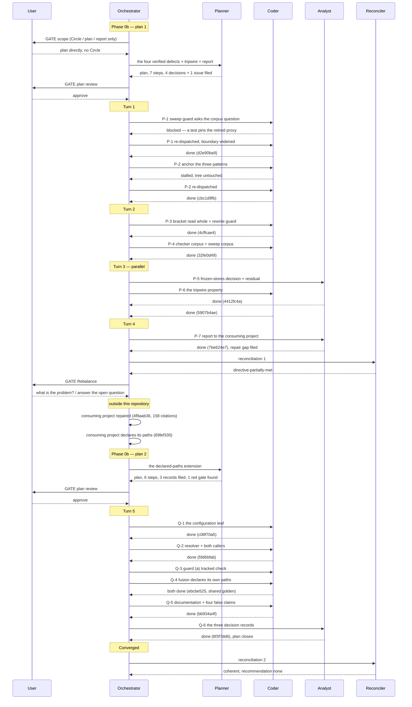

# Orchestrator Session — 260830-1801

**Directive:** A consuming project (unite-co-creator) reports that fusion's citation mechanism leaves it carrying local workarounds after the last update: four defects in `bin/fusion-citation-sweep` / its checker, one commit-lock defect, one missing tripwire, and one open upstream design point (the helper reading non-Markdown surfaces with the stamp as anchor). Verify each claim against fusion's own sources and fix what is fusion's, so a consumer can use the fusion standard without local departures.
**Mode:** custom (verification first, then scoped repair)
**Status:** Complete
**Filed by:** orchestrator, Kai Stalmann <ks@qantr.com>

## Snapshot at session start

- Workbench: `/Users/kai/Projects/productive/F04-FUSION/codebase/fusion/fusion-workbench`
- Domain: `code` (bin/fusion-count-sources: code_files=133, data_files=10, counted_by=git-ls-files)
- Turn budget: 12 (bin/fusion-turn-budget, resolved; no loader diagnostics)
- git HEAD at start: `cda72f71`
- Open issues (shared): 4 — no `_p_`
- Open plans (shared): 1 (`260822-1136_*_spec-fusion-becomes-a-multi-user-tool.md`)
- Open decisions (shared): 5
- Circles: 16 `_c_`, 3 `_b_`, 1 `_s_` — none anticipated, none active
- Circle hint: not printed (anticipated + active = 0)
- Setup marker: written, plugin_version 10.20.0
- Stylometric assets: all four `case1-equal`
- Presence: 0 other people; 1 further checkout of this user (`5e8248d7`, 2026-08-29)
- Permission seeding (Setup Step 0g): offered, unanswered at the time of writing

## Reported claims to verify

Source: the consumer's record `260829-0932_*_which-half-of-the-citation-mechanism-is-fusions-and-which-stays-here.md`
in that project's workbench, plus the session note the user relayed.

Defects claimed against fusion:
1. The sweep does not exclude frozen stores (`archive/`, `stashes/`, `.migration-v2-backup/`) — 5933 rewrites into the archive.
2. The sweep refuses the bracket-form name as an index key.
3. The store-strip is not anchored at the token start — 416 sites in the consumer, producing silent false pointers its own checker does not report.
4. `bin/fusion-commit-lock` dirties the tree it just committed by appending its own event row.
5. Missing tripwire (test/gate) for the above.

Open upstream design point:
6. Should the helper read non-Markdown surfaces, with the stamp as the anchor? Recorded as
   "proposed upstream, not decided". The consumer's Option 3 waits on this one point with no date.

Gone moot at the consumer: the exit-code-beside-stdout-verdict point (worked around by parsing
`verdict=`), and the file-level declaration as a fifth exemption (the consumer adopted fusion's form).

## Verification pass (Phase 0, before any scope was resolved)

Every claim was reproduced against `hooks/lib/citation-scan.ts`, `hooks/citation-sweep.ts`,
`hooks/citation-check.ts` and `bin/fusion-commit-lock` at `cda72f71`. Four confirmed, one
confirmed-and-worse-than-reported, one open by design.

**1. The sweep reads the frozen stores; the checker does not. Confirmed, and it is an
asymmetry inside fusion rather than a policy.** `hooks/citation-check.ts` carries
`FROZEN_PREFIXES = ["archive/", "stashes/", ".migration-v2-backup/"]` and drops them, citing
the workbench gate. `hooks/citation-sweep.ts` calls `markdownFilesUnder(root)` over the whole
workbench with no exclusion. So the pair disagrees about its own corpus: the checker never
reports what the sweep rewrites there. fusion's own workbench holds 605 `.md` files under
`archive/`, all of them in the sweep's file set. The repair pass reads `archive/` on purpose
(its header says so, because the damage reached them); the sweep has no such statement.

**2. A bracket-marked citation is silently downgraded, not merely refused. Confirmed, worse
than reported.** `REC_RE`'s tail class is `[A-Za-z0-9._…*-]*`, which excludes `[` and `]`, so
a store-prefixed citation of a bracket-marked record tokenises as the store segment plus the
stamp alone, the tail invisible. The sweep rewrites that to the bare stamp and leaves the
bracket tail standing (an inline backtick span is not an exemption in this grammar, so the
verbatim forms are fenced):

```
in   cite shared/issues/260519-0438[o]-loader-check.md now
out  cite 260519-0438[o]-loader-check.md now
```

The token was a reported `store-prefixed` violation before the sweep. Afterwards the grammar
produces no token at all for it (`STAMP_RE`'s `(?![0-9A-Za-z_\[])` boundary refuses it), so it
is an unresolvable pointer the checker cannot see. A consumer whose `archive/` kept pre-v4
names cannot address those records in any citation form fusion accepts.

**3. The store strip has no left boundary. Confirmed, with silent false pointers.** `REC_RE`
begins with an optional `fusion-workbench/`, an optional Circle-or-shared segment, then
`(planning|issues|...)\/` — and no lookbehind. Any word ending in a store name matches, and
so does any path whose second-to-last segment is one. `rewriteOf` slices at the last `/`, so
everything left of the store segment survives, glued to the stamp:

```
citation_form.py reads myplanning/260801-1234_o_the-slug.md
  -> citation_form.py reads my260801-1234_*_the-slug.md
the file src/decisions/260801-1234_o_the-slug.md is ours
  -> the file src/260801-1234_*_the-slug.md is ours
see docs/subhistory/260801-1234-note.md
  -> see docs/sub260801-1234-note.md
```

Each output is invisible to the checker afterwards: `BARE_RE`'s `(?<![\/0-9A-Za-z_-])`
lookbehind refuses a stamp preceded by a letter or a slash, so no token is produced. The
consumer measured 416 such sites.

**4. `fusion-commit-lock with` leaves the tree it just committed dirty. Confirmed.**
`emit_commit_event` appends the machine-written `commit` row to
`fusion-workbench/orchestrator-events.jsonl` after the wrapped command exits 0
(`bin/fusion-commit-lock:317`, called at :378). In a project that tracks its workbench that
file is tracked — it is here, `git check-ignore` exit 1, `git ls-files --error-unmatch` exit 0
— so `git status --porcelain` is non-empty from the moment the commit lands. Two consequences
measured rather than inferred: the sweep's guard (a) refuses a dirty tree, so the sweep can
never run in the commit that follows a commit; and every `/fusion:cleanup` split starts dirty.

**5. No tripwire for any of the four.** `hooks/lib/__tests__/citation-sweep.test.ts` (291
lines) covers the three write guards, the exit codes, the repair classes and idempotency over
a swept tree. It asserts nothing about a store segment preceded by a word character, nothing
about the frozen stores, nothing about a bracket-marked name, and — the property that would
have caught 2 and 3 at once — nothing about a rewrite turning a token the checker reports into
one it cannot see.

**6. The helper reads `.md` only. Open by design, undecided.** `markdownFilesUnder()` filters
on `.name.endsWith(".md")`, and `hooks/citation-check.ts` adds `CLAUDE.md`, `rules/*.md`,
`.claude/rules/*.md` and `docs/**/*.md` — all Markdown. A citation in a `.py`, `.ts` or `.yaml`
surface is outside the corpus. The consumer's record has this "proposed upstream, not decided",
and it is the one point their Option 3 waits on.

## Budget

| Metric | Count |
|--------|-------|
| Turns | 4 |
| Tasks resolved | 7 |
| Tasks skipped/deferred | 0 |
| Issues created (any writer) | 4 |
| Issues resolved | 0 |
| Decisions answered (`_o_`→`_a_`) | 0 |
| Decisions implemented (`_a_`→`_i_`) | 3 |
| Commits | 8 |
| Agent errors | 1 |
| Human gates hit | 3 |

The four record rows are derived off the stores, not tallied: the block in
`agents/orchestrator.md` `### The record counts are computed, not tallied`, run at
`anchor=cda72f71 start=260830-1801`. It prints `4 filed issue`, `6 filed decision`,
`3 now_i decision`, `3 now_o decision`, `4 now_o issue`.

Two readings that measure asks for and cannot give. Six decision records were filed and three
of them are the ones this session answered, so `filed` and `now_i` count overlapping sets rather
than disjoint ones. And the answered row reads 0 while two records did pass through `_a_`
within the session: the rule counts the name a record carries **now**, and both went on to `_i_`
before the session ended, so nothing sits at `_a_` to be counted. Neither is a defect in the
measure; both are what a current-name measure cannot see, stated here rather than corrected
into the table.

## Per-Turn Log

### Turn 1
- Tasks attempted: P-1, P-2
- Tasks completed: P-1, P-2
- Commits: `d2e90ba9`, `cbc1d9fb`
- Agent errors: 1 (P-2's first dispatch stalled with no output; working tree untouched, re-dispatched clean)
- Circuit breaker status: OK
- Coherence: ok

P-1 came back blocked on its first pass, and the cause was the orchestrator's dispatch boundary
rather than the executor's work: test files were excluded while the step necessarily retires one
test case, which made the step's own acceptance criterion unreachable. Widened and re-dispatched.

### Turn 2
- Tasks attempted: P-3, P-4
- Tasks completed: P-3, P-4
- Commits: `4cffcae4`, `32fe0d49`
- Circuit breaker status: OK
- Coherence: ok

### Turn 3
- Tasks attempted: P-5, P-6 (dispatched in parallel; disjoint file sets)
- Tasks completed: P-5, P-6
- Commits: `4412fc4a`, `5907b4ae`
- Issues created: 1 (`260830-2235_*_the-fabricated-name-exemption-keys-on-the-literal-foo-so-every-realistic-probe-fixture-is-read-as-a-real-citation.md`)
- Circuit breaker status: OK
- Coherence: ok

### Turn 4
- Tasks attempted: P-7
- Tasks completed: P-7
- Commits: `7be624e7`
- Issues created: 1 (`260830-2247_*_the-repair-pass-cannot-undo-the-splice-damage-the-unanchored-store-strip-produced.md`)
- Circuit breaker status: OK, queue converged
- Coherence: ok

## Both executor gates, and neither fired

The plan named two gates beyond its own approval, and both were reached and passed:

- **Step 2's `rewrites` reading.** `bin/fusion-citation-sweep --dry-run` had to keep reading
  `rewrites=0` after the anchoring landed, or the executor was to stop rather than run `--write`.
  It held, and more strongly than the criterion asked: the whole dry-run output was byte-identical
  to the previous grammar's over the same tree.
- **Step 6's line budget.** 120 lines were allowed for the property test and 85 were used, leaving
  398 lines of head-room on the hook-test surface.

## Checker and sweep figures at the last commit

Required by clause 4 of the plan's `## Where this Circle stops`.

| reading | at `cda72f71` | at `7be624e7` |
|---|---|---|
| `bin/fusion-citation-check` `files=` | 1735 | 2352 |
| `dangling=` | 246 | 311 |
| `store-prefixed=` | 0 | 0 |
| `verdict=` | `violations` | `violations` |
| `bin/fusion-citation-sweep --dry-run` `rewrites=` | 0 | 0 |
| `cd hooks && npm test` | 805 passed | 806 passed |

The `files` and `dangling` movement is the corpus widening of `32fe0d49` plus this session's own
filings. The 65 rows the widening added were listed rather than assumed and all sit under the
archive store. `store-prefixed` and the verdict did not move, and `rewrites=0` is the figure
`citation-sweep.test.ts` pins as a release gate.

## Review coverage

**Range:** `cda72f71..7be624e7` — 8 commits
**Covered by:** no review file declares a range containing any of them.
**Not covered:** all 8.

```
7be624e7  docs(analyses): the report to the consuming project, and the repair gap it exposed
5907b4ae  test(sweep): no rewrite may turn a token the checker reports into one it cannot see
4412fc4a  docs(decisions): the frozen-stores question is answered, and the residual is cut where the measurement puts it
32fe0d49  fix(citations): the reporting checker reads the corpus the sweep rewrites
4cffcae4  fix(citations): a bracket-marked citation is read whole, and no rewrite may escape the grammar
cbc1d9fb  fix(citations): a store-prefixed citation begins at a boundary and carries its own rooting
d2e90ba9  fix(sweep): guard (a) asks whether a pending change touches what this run reads
94908036  chore(workbench): the citation-defect repair is planned and its two load-bearing choices are answered
```

**Carried out-of-scope files:** the last usable review carried a 14-entry `**Not-opened:**` list,
none of it touching the files this session changed.

No review pass ran, and no Circle was active whose closure would have triggered one. This is the
plan's clause 8: `bin/fusion-review-coverage --since <previous tag>` is a precondition on any
**release** carrying this work, per `CLAUDE.md` `## Release process` step 0, and it is unmet and
unwaived. Nothing here waives it.

## Turn log

(superseded by the Per-Turn Log above.)

## Coherence

<!-- RECONCILER-OWNED -->

Computed 260830-2254 by the reconciler at HEAD `7be624e7`, session anchor `cda72f71`. Full pass:
`260830-2254-reconciliation.md`.

**SUPERSEDED** by the 260831-0159 verdict at the end of this section. It was computed over the
session's first plan alone, before the user answered the item that made it partial. It is kept as it
stands, unedited apart from this line and the label on the next, because it records what was true at
that commit. Read the final verdict below.

**Verdict (superseded):** directive-partially-met

**Edges:**
- Artifact↔Grounding: 7 of 7 plan steps verified against the tree, not against their own claims / 0 drift items / 0 open coderev+ontorev issues, because no review pass ran. `npm test` reads 806 passed exit 0, `bin/fusion-citation-check` reads `dangling=311 store-prefixed=0 verdict=violations` against step 4's prediction of the first two, and `bin/fusion-citation-sweep --dry-run` reads `rewrites=0`, the figure the release gate pins. Defect 4 was re-run live rather than trusted: with `orchestrator-events.jsonl` the only modified path, `--write` exits 5 where it exited 4 at `cda72f71`. Two items outstanding and neither is drift: one stopping clause of eight is unmet, the checker's figures are not yet in this file, which this session's own Phase-3 close performs; and `bin/fusion-review-coverage --since cda72f71` reads `commits=8 uncovered=8 verdict=uncovered`, which `260815-2109_*_may-a-circle-close-over-an-uncovered-review-range-and-who-decides.md` settles as advisory and states does not flag this edge.
- Artifact↔Directive: commits move **partially toward** the stated Directive. `d2e90ba9`, `cbc1d9fb`, `4cffcae4` and `32fe0d49` repair the four defects the Directive names, `5907b4ae` adds the tripwire it asks for, `7be624e7` writes the report it owes, and `94908036` and `4412fc4a` carry the planning and the records. Nothing is orthogonal and nothing moves away. What is unmet is the Directive's purpose clause: the consuming project keeps one local workaround, for the non-Markdown surfaces, and that point is the sixth item this Directive enumerates. It was verified, recorded and left open on purpose as `260830-1844_*_does-the-citation-helper-read-non-markdown-surfaces-with-the-stamp-as-the-anchor.md`, which asks for a measurement of the consumer's roughly 950 code-surface tokens before an answer. The shortfall is filed, the destination is reachable, and the plan says in its own words that it closes with that record open.
- Grounding↔Directive: 38 active decisions consistent (8 `_o_`, 30 `_a_`) / 0 potentially conflicting. The four citation-adjacent active records were read individually rather than counted: `260823-1414_*_does-the-workbench-citation-gates-corpus-cover-review-files.md` asks which files the blocking **gate** reads, and this session moved only the reporter's corpus, leaving all three gate exclusions untouched; `260815-2109_*_may-a-circle-close-over-an-uncovered-review-range-and-who-decides.md` is applied rather than contradicted; `260816-0119_*_can-anything-carry-the-rename-to-citation-obligation-when-a-record-marker-moves.md` and `260812-0254_*_should-a-cited-artifact-path-be-absolute-so-an-editor-can-open-it.md` bind the citation form and nothing shipped here departs from it.

**Rebalance recommendation:** accept Bounded Closure

The Directive named six items. Five are repaired, shipped and verified; the sixth is verified,
recorded and open by choice, and it is the one the consumer is blocked on. That is a session
stopped short on purpose rather than one that drifted, so neither `review-needed` nor
`coherent` fits: nothing disagrees with its basis, and the destination is not yet reached.

---

### Final verdict, 260831-0159

Computed by the reconciler at HEAD `6f3f7dd6`, session anchor `cda72f71`, over the whole session:
14 commits, 5 Turns, both plans. **Supersedes the 260830-2254 verdict above**, which covered the
first plan only. Full pass: `260831-0159-reconciliation.md`.

**Verdict:** coherent

**Edges:**
- Artifact↔Grounding: 13 of 13 plan steps verified against the tree rather than against their own claims (7 in the first plan, re-confirmed unmoved; 6 in the second, each read at the file and line the step names) / 0 drift items / 0 open coderev+ontorev issues, because no review pass ran. At HEAD, `cd hooks && npm test` reads 47 files and 818 tests passed, exit 0; `bin/fusion-citation-check` reads `declared-patterns=3 declared-files=45 files=2410 dangling=313 store-prefixed=0 verdict=violations`, which is the six-figure reading the second plan's clause 6 asks be recorded in this file, so that clause is met here rather than left open; `bin/fusion-citation-sweep --dry-run` reads `rewrites=0`, the figure the release gate pins. `declared-patterns` and `declared-files` match step 4's prediction exactly. Records: every marker sits where the plans say, no stamp-and-slug pair carries two markers anywhere in the live tree, and one violation row lands in a file this session wrote, the permanent one already filed as `260830-2254_*_a-record-citing-another-projects-workbench-record-is-reported-dangling-forever-and-no-citation-form-expresses-it.md`. Two bookkeeping conditions were found and both are reconciled by this pass rather than left as drift: the first plan stood at `_p_` with every clause now met and is closed here to `_c_`; the second plan was closed to `_c_` at `6f3f7dd6` with its clause 6 unmet, which this section's own figures now satisfy. `bin/fusion-review-coverage --since cda72f71` reads `commits=14 reviews=87 unusable=24 uncovered=14 verdict=uncovered`, which `260815-2109_*_may-a-circle-close-over-an-uncovered-review-range-and-who-decides.md` settles as advisory and states does not flag this edge.
- Artifact↔Directive: commits move **toward** the stated Directive, and all six of its enumerated items are now met. `d2e90ba9`, `cbc1d9fb`, `4cffcae4` and `32fe0d49` repair the four defects; `5907b4ae` adds the tripwire; `7be624e7` writes the report. The sixth item, the open upstream design point on non-Markdown surfaces, was the one that made the 260830-2254 verdict partial: the user answered it option 5 on 2026-08-31 and `c08f70a5`, `5fd6bfab` and `ebcbe525` built the answer, with `bb934a4f` bringing eight documented surfaces and four false claims up to the shipped behaviour and `6f3f7dd6` closing the records. `06b5aac1` and `94908036` carry the planning. Nothing is orthogonal and nothing moves away. The Directive's purpose clause, that the consumer can use the fusion standard without local departures, rests on two commits in the consuming project that this reconciler cannot read and takes on the orchestrator's report rather than as verified: `4f8aab36`, 158 citations repaired across 89 files with the shipped sweep and no fusion change, and `69fef330`, 14 declared globs covering the 193 files that carry repairable citations. The label is deliberate. If either report is wrong, this edge is the one that moves.
- Grounding↔Directive: 38 active decisions consistent (8 `_o_`, 30 `_a_`) / 0 potentially conflicting. That is the scoped figure: with no Circle active the resolver names the shared store alone, and the 10 further `_a_` records sitting in terminal Circles' own stores are a known condition with its own record, `260824-2013_*_do-archive-and-terminal-circles-stores-enter-any-scan-set-or-is-the-exclusion-written-down.md`. Two records that could have conflicted with what shipped were read individually rather than counted. `260823-1414_*_does-the-workbench-citation-gates-corpus-cover-review-files.md` asks which files the blocking gate reads, and the declaration reaches neither gate by design, with the reason written into `hooks/citation-check.ts`'s header rather than left to be inferred. `260816-0711_*_is-count-pinning-the-convention-for-every-gate-that-reports-what-it-examined.md` settles probe-assertion as the convention and count-pinning as the fallback; the two new stdout lines are reporter output and pin nothing, so nothing departs from it. The three records this session left `_o_` are residuals both plans named as not stopping conditions, not conflicts.

**Rebalance recommendation:** none

Every evaluable edge is OK and a Directive was stated, so no Rebalance option applies. Two things
stand open and neither flags an edge. The release preconditions on both plans are unmet and
unwaived: no review pass ran over any of the 14 commits, and no tag points at HEAD, with
`.claude-plugin/plugin.json` still reading `10.20.0` as it did at `cda72f71`, so this work is
unreleased rather than released untagged. Both bind a release rather than either plan's closure, and
the review-coverage question is the user's to answer. And six open records carry the residuals and
the defects found beside the work, each filed and none of them a clause of the Directive.

## Session Flow

Built from this checkout's own event rows in `orchestrator-events.jsonl`, filtered by session
identifier and sorted by timestamp. 70 rows, of which the dispatch pairs and the commit rows are
machine-written.


