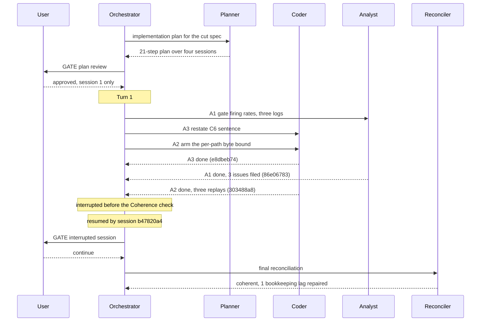

# Orchestrator Session — 260909-1331

**Status:** In progress
**Filed by:** orchestrator, Kai Stalmann <ks@qantr.com>

**Directive:** Cut fusion's ceremony and bookkeeping load radically. Verify the analysis `260909-1047-size-versus-bookkeeping-across-three-projects.md` and its conclusions in depth, correcting where wrong; use the verified analysis as the ground for a shaper dispatch that specifies how the plugin becomes a lean, collaborative development toolkit; have a second analyst review the spec; have the shaper incorporate the review; then present the spec to the user.
**Mode:** custom (shaping pipeline, no Circle active)

## Setup snapshot

- Workspace: /Users/k1/Projects/productive/fusion, HEAD a1ecf86e
- Domain: code (code_files=150, data_files=10, counted_by=git-ls-files)
- Open: 19 issues, 2 plans, 11 open decisions (shared store; no Circle active)
- Circles: 1 anticipated, 0 active, 3 bounded, 20 closed, 1 superseded
- Turn budget 12, dispatch bound 20 min; no loader diagnostics
- Portfolio hint printed: 1 anticipated Circle, /fusion:next offered
- Interrupted session from 260909-0624 discarded at user's choice (Restart)
- Identity: Kai Stalmann <ks@qantr.com>, checkout 5e8248d7 (west-harbor)

## Coherence

**Verdict:** coherent

**Edges:**
- Artifact↔Grounding: 3 plan-step claims verified (A1 `86e06783`, A2 `303488a8`, A3 `e8dbeb74`, each checked independently against the analysis file, the test suite and the spec text) / 1 bookkeeping lag found and repaired this pass, not a Grounding-vs-Artifact disagreement (the plan file's own `[DONE]` markers and `**Status:**` had not caught up to its own committed steps — corrected in `260909-1843_*_implementation-cut-fusion-to-a-working-minimum.md`) / 0 open coderev+ontorev issues
- Artifact↔Directive: commits move toward the stated Directive. `cdd94f4c`, `17845b95`, `bb341360` verify and correct the named analysis in depth; `29141af2` produces the Circle, its evidence chain and the approved plan; `86e06783`/`303488a8`/`e8dbeb74` execute the plan's Session 1 exactly as scoped ("measure and arm, nothing is removed" — no removal in this range is the intended outcome, not a shortfall); `08e81db3` repairs citation hygiene the session's own writes introduced. `b1f410fb` is routine session bookkeeping, neutral. The Directive's literal text (verify → spec → review → present) was exceeded by continuing into planning and Session-1 execution under the user's mid-session authorization recorded in `agentstate.yaml` `plan_context.user_directive` ("Freigegeben. Session 1 only..."); `control.directive_revisions_this_session` reads `0`, so that extension was not logged as a formal Directive revision — worth noting, not flagged, since the extension serves the same stated goal rather than diverging from it.
- Grounding↔Directive: 12 active decisions checked in full (this Circle's 7, plus 5 in the shared decision store matched by topic to this cut: `260815-2109_*_may-a-circle-close-over-an-uncovered-review-range-and-who-decides.md`, `260822-1102_*_what-happens-when-a-planned-circles-required-work-exceeds-the-remaining-head-room.md`, `260822-1154_*_does-a-cut-only-circle-re-baseline-the-surfaces-it-cuts.md`, `260827-1056_*_which-parts-of-the-language-and-backlog-rules-does-every-dispatch-still-carry.md`, `260909-1634_*_how-should-the-skill-surface-be-cut-once-the-agent-and-ceremony-cut-has-landed.md`) / 0 conflicting. A further 39 active decisions in the shared store were scanned by filename only, not by full content, given the dispatch's stopping bound; none names a subject this cut's plan states as removed or changed (guard mechanics, citation gates, checkout identity, install path and multi-user support are the recurring topics, all orthogonal to this Directive).

**Rebalance recommendation:** none

## Budget

| Metric | Count |
|--------|-------|
| Turns | 1 |
| Tasks resolved | 3 |
| Tasks skipped/deferred | 0 |
| Issues created | 14 |
| Issues resolved | 2 |
| Decisions answered (`_o_`→`_a_`) | 5 |
| Decisions implemented (`_a_`→`_i_`) | 0 |
| Commits | 10 |
| Agent errors | 0 |
| Human gates hit | 2 |

Every record figure above is derived at write time from the stores against
`session.git_head_at_start` (`a1ecf86e`) and `session.started` (`260909-1331`), by the block in
`agents/orchestrator.md` `### The record counts are computed, not tallied`. None is a running tally.
The commit count is `git rev-list --count a1ecf86e..HEAD`; the Turn count is `bin/fusion-events
turns`, which reported `turns=1 scope=checkout`.

## Per-Turn Log

### Turn 1

- Tasks attempted: A1, A2, A3. Tasks completed: A1, A2, A3.
- Commits: `29141af2`, `e8dbeb74`, `86e06783`, `303488a8`, `08e81db3`, and before them `cdd94f4c`,
  `b1f410fb`, `17845b95`, `bb341360` from the shaping and verification work that preceded the queue.
- Review findings: no review pass ran in this range. Three issues were filed by the A1 analyst
  against the plan and against one consuming project's event log.
- Circuit breaker status: OK. One Turn of a budget of twelve.
- Coherence: not evaluated in the Turn. The session was interrupted after the last task and before
  Step 3c-bis ran, so no `coherence_review` row exists for Turn 1. The per-Circle read at Phase 3
  covered the range instead and returned `coherent`.

The session was resumed on 260909-2304 by session `b47820a4`, which inherited this history file,
found the queue empty, repaired the state file, wrote the Circle record's Turn log entry, corrected
the record's `**Active spec/plan:**` field to name the plan, filed two decision records the A1
analysis had left inside its own `## Open Questions` section, and went to Phase 3.

## Review coverage

**Range:** `a1ecf86e..HEAD` — 10 commits
**Covered by:** no review file declares any part of this range.
**Not covered:** all 10 commits.

```
f192647c chore(circle): the bookkeeping session 1 was interrupted before writing, and its two unfiled questions
08e81db3 chore(workbench): thirty-one citations take the form that survives a marker move
303488a8 test(gates): a bound over what a dispatch actually reads, armed before the cut
86e06783 docs(circle): what each gate marked for removal actually did, measured
e8dbeb74 docs(spec): C6 says the order is computed, and the spec enters history
29141af2 docs(circle): the evidence chain, the Circle and the approved plan for the cut
bb341360 docs(analysis): every claim re-checked pinned to the snapshot commits, sixteen were wrong or loose
17845b95 docs(circle): re-measure every figure in the coverage issue, eleven were wrong
b1f410fb chore(session): the setup marker moves to v10.26.0, and this session's event and registry rows
cdd94f4c docs(analysis): size drives the errors, the method drives the bookkeeping, measured over three projects
```

**Carried out-of-scope files:** `(not recorded)` — no review carried a `**Not-opened:**` field, because
no review ran.

The gap is expected rather than a lapse: the Circle's one review pass runs at its closure, and this
Circle is one session of four and stays open. The range is stated here so the closing session inherits
it instead of rediscovering it.

## Remaining Work

Session 1 of the plan is complete and removed nothing, which was its declared scope. Sessions 2, 3
and 4 remain, and the plan's own note that each boundary needs `fusion --update` plus a session
restart still holds.

Four records block or shape what comes next, and two of them are new:

- `260909-2305_*_which-quantity-does-the-head-list-protect-a-gates-evaluation-rate-or-its-rate-of-returning-to-the-user.md`
  — open. Decides whether step C1 may delete the per-Turn Coherence gate. The two readings differ by
  about a factor of eleven.
- `260909-2305_*_does-a-gate-protected-in-one-consuming-project-bind-fusions-own-cut.md` — open.
  Decides the same for the Rebalance gate, which clears half in one measured project of three.
- `260909-2215_*_step-a1s-denominator-names-a-field-eleven-rows-carry-and-the-plans-own-figure-uses-ninety-four.md`
  — open. Moves every rate in the A1 analysis by about 8.5 depending on which reading is taken.
- `260909-2215_*_the-plans-current-state-says-every-removed-gate-has-its-own-row-kind-and-three-of-six-have-none.md`
  — open. The plan asserts something false about half of what it names; the convergence check, the
  review-coverage read and the resume procedure emit no row at all and were therefore never measured.

Three gates consequently stand un-cleared for deletion, not because they were found useful but
because nothing could measure them.

## Commits

| Hash | Message | Task |
|------|---------|------|
| `cdd94f4c` | size drives the errors, the method drives the bookkeeping | pre-queue verification |
| `b1f410fb` | the setup marker moves to v10.26.0 | pre-queue housekeeping |
| `17845b95` | re-measure every figure in the coverage issue, eleven were wrong | pre-queue verification |
| `bb341360` | every claim re-checked pinned to the snapshot commits | pre-queue verification |
| `29141af2` | the evidence chain, the Circle and the approved plan | pre-queue planning |
| `e8dbeb74` | C6 says the order is computed, and the spec enters history | A3 |
| `86e06783` | what each gate marked for removal actually did, measured | A1 |
| `303488a8` | a bound over what a dispatch actually reads, armed before the cut | A2 |
| `08e81db3` | thirty-one citations take the form that survives a marker move | A2 (follow-on) |
| `f192647c` | the bookkeeping session 1 was interrupted before writing | resume |

## Session Flow


