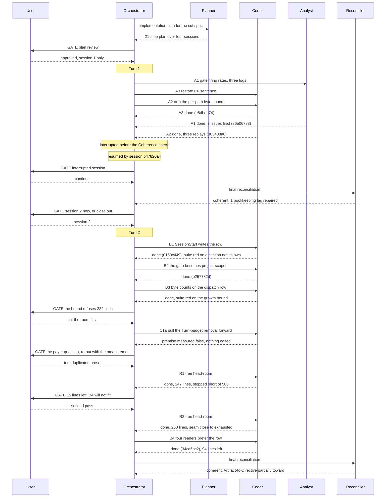

# Orchestrator Session — 260909-1331

**Status:** Complete
**Filed by:** orchestrator, Kai Stalmann <ks@qantr.com>

**Directive:** Cut fusion's ceremony and bookkeeping load radically. Verify the analysis `260909-1047-size-versus-bookkeeping-across-three-projects.md` and its conclusions in depth, correcting where wrong; use the verified analysis as the ground for a shaper dispatch that specifies how the plugin becomes a lean, collaborative development toolkit; have a second analyst review the spec; have the shaper incorporate the review; then present the spec to the user.
**Mode:** custom (shaping pipeline, no Circle active)

## Setup snapshot

- Workspace: /Users/k1/Projects/productive/fusion, HEAD a1ecf86e
- Domain: code (code_files=150, data_files=10, counted_by=git-ls-files)
- Open: 19 issues, 2 plans, 11 open decisions (shared store; no Circle active)
- Circles: 1 anticipated, 0 active, 3 bounded, 20 closed, 1 superseded
- Turn budget 12, dispatch bound 20 min; no loader diagnostics
- Portfolio hint printed: 1 anticipated Circle, /fusion:next offered
- Interrupted session from 260909-0624 discarded at user's choice (Restart)
- Identity: Kai Stalmann <ks@qantr.com>, checkout 5e8248d7 (west-harbor)

## Coherence

**Verdict:** coherent

**Edges:**
- Artifact↔Grounding: 3 plan-step claims verified (A1 `86e06783`, A2 `303488a8`, A3 `e8dbeb74`, each checked independently against the analysis file, the test suite and the spec text) / 1 bookkeeping lag found and repaired this pass, not a Grounding-vs-Artifact disagreement (the plan file's own `[DONE]` markers and `**Status:**` had not caught up to its own committed steps — corrected in `260909-1843_*_implementation-cut-fusion-to-a-working-minimum.md`) / 0 open coderev+ontorev issues
- Artifact↔Directive: commits move toward the stated Directive. `cdd94f4c`, `17845b95`, `bb341360` verify and correct the named analysis in depth; `29141af2` produces the Circle, its evidence chain and the approved plan; `86e06783`/`303488a8`/`e8dbeb74` execute the plan's Session 1 exactly as scoped ("measure and arm, nothing is removed" — no removal in this range is the intended outcome, not a shortfall); `08e81db3` repairs citation hygiene the session's own writes introduced. `b1f410fb` is routine session bookkeeping, neutral. The Directive's literal text (verify → spec → review → present) was exceeded by continuing into planning and Session-1 execution under the user's mid-session authorization recorded in `agentstate.yaml` `plan_context.user_directive` ("Freigegeben. Session 1 only..."); `control.directive_revisions_this_session` reads `0`, so that extension was not logged as a formal Directive revision — worth noting, not flagged, since the extension serves the same stated goal rather than diverging from it.
- Grounding↔Directive: 12 active decisions checked in full (this Circle's 7, plus 5 in the shared decision store matched by topic to this cut: `260815-2109_*_may-a-circle-close-over-an-uncovered-review-range-and-who-decides.md`, `260822-1102_*_what-happens-when-a-planned-circles-required-work-exceeds-the-remaining-head-room.md`, `260822-1154_*_does-a-cut-only-circle-re-baseline-the-surfaces-it-cuts.md`, `260827-1056_*_which-parts-of-the-language-and-backlog-rules-does-every-dispatch-still-carry.md`, `260909-1634_*_how-should-the-skill-surface-be-cut-once-the-agent-and-ceremony-cut-has-landed.md`) / 0 conflicting. A further 39 active decisions in the shared store were scanned by filename only, not by full content, given the dispatch's stopping bound; none names a subject this cut's plan states as removed or changed (guard mechanics, citation gates, checkout identity, install path and multi-user support are the recurring topics, all orthogonal to this Directive).

**Rebalance recommendation:** none

## Budget

| Metric | Count |
|--------|-------|
| Turns | 2 |
| Tasks resolved | 9 |
| Tasks skipped/deferred | 0 |
| Issues created | 18 |
| Issues resolved | 3 |
| Decisions answered (`_o_`->`_a_`) | 3 standing, plus 2 that have since reached `_i_` |
| Decisions implemented (`_a_`->`_i_`) | 2 |
| Commits | 17 |
| Agent errors | 0 |
| Human gates hit | 6 |

Every record figure is derived at write time from the stores against
`session.git_head_at_start` (`a1ecf86e`) and `session.started` (`260909-1331`), by the block in
`agents/orchestrator.md` `### The record counts are computed, not tallied`. None is a running tally.
Commits are `git rev-list --count a1ecf86e..HEAD`; Turns are `bin/fusion-events turns`, which
reported `turns=2 scope=checkout`.

**One reading of that table needs stating, because the derivation makes it easy to misread.** The
`_a_` row counts records *currently* carrying that marker whose name did not exist at the anchor. A
record that was answered and then implemented in the same session has left the `_a_` count and
appears in the `_i_` count instead. Five decisions were answered across the session; three still
stand answered and two went on to implemented. The measurement is a snapshot of markers, not a count
of transitions, and no transition log exists to take the other reading from.

## Per-Turn Log

### Turn 1 (session 1 of the plan: measure and arm)

- Tasks attempted and completed: A1, A2, A3.
- Commits: `29141af2`, `e8dbeb74`, `86e06783`, `303488a8`, `08e81db3`, preceded by `cdd94f4c`,
  `b1f410fb`, `17845b95`, `bb341360` from the shaping and verification work before the queue.
- Review findings: no review pass ran. Three issues filed by the A1 analyst.
- Circuit breaker: OK.
- Coherence: not evaluated in the Turn. The session was interrupted after the last task and before
  the per-Turn check ran. The Phase 3 read covered the range and returned `coherent`.

### Turn 2 (session 2 of the plan: build the substrate)

- Tasks attempted and completed: B1, B2, B3, B4, and two unplanned steps R1 and R2.
- Commits: `0160c449`, `e257782d`, `9c4dbdbb`, `c925fd9d`, `34cd5bc2`, `d7b701d2`.
- Review findings: no review pass ran. Three issues filed, one closed.
- Circuit breaker: **net-negative progress reported and not blocking.** Issues created exceeded
  issues resolved in both Turns (14 against 2, then 3 against 1), which is the stated condition. It
  is reported rather than acted on because the queue converged in the same Turn and every filed
  record is a finding from measurement work rather than blocked work. The condition is a divergence
  signal and it was right to raise here; what it signals is a session that spent its time measuring.
- Coherence: `ok` on all three edges at the per-Turn gate; `coherent` at the Phase 3 read, with the
  Artifact-to-Directive edge read as *partially toward* rather than *toward*.

**What Turn 2 cost that the plan did not budget for.** B3 returned complete and verified with the
suite red on one bound: the hook test surface stood 232 lines past its head-room, of which 9 lines
remained when the Turn began. The first route out was wrong and the measurement is why nothing broke
- deleting a test file at its baseline frees nothing, because the sum moves floor and total
together, confirmed at 232 over in both directions. Two dedicated passes then cut 497 lines of
comment prose whose surviving copy could be named block by block, and the second reported the seam
close to exhausted. B4 spent 171 of the 265 lines that bought, leaving 94.

## Review coverage

**Range:** `a1ecf86e..HEAD` - 17 commits
**Covered by:** no review file declares any part of this range.
**Not covered:** all 17 commits.
**Carried out-of-scope files:** `(not recorded)` - no review carried a `**Not-opened:**` field,
because no review ran.

The gap is expected rather than a lapse: this Circle's one review pass runs at its closure, and the
Circle is two sessions of four and stays open. The range is stated so the closing session inherits it
instead of rediscovering it. Two sessions of hook source and test changes are inside it and have had
no second reader.

## Remaining Work

Sessions 3 and 4 of the plan remain. The plan's own note that each boundary needs `fusion --update`
plus a session restart still holds, and session 3 opens with step C0, which verifies session 2's
substrate against a live log.

**C0 has one thing to check that nothing in this session could.** `/fusion:setup` copies `bin/monitor`
into the workbench from the installed plugin, so the changed monitor was never the served file. C0
must checksum the workbench copy against the installed one, then, with `orchestrator-live.md` and
`agentstate.yaml` renamed away, confirm that the dashboard panel names the running dispatch, renders
the work item or the line saying the dispatch named none, shows both counters and no error counter,
and shows the single line under Up Next with no list, and that the state panel renders the session
fields, with no panel dark.

**Five records shape or block what comes next.**

- `260909-2305_*_which-quantity-does-the-head-list-protect-a-gates-evaluation-rate-or-its-rate-of-returning-to-the-user.md`
  - open. Decides whether step C1 may delete the per-Turn Coherence gate. The two readings differ by
  about a factor of eleven.
- `260909-2305_*_does-a-gate-protected-in-one-consuming-project-bind-fusions-own-cut.md` - open. The
  same for the Rebalance gate, which clears half in one measured project of three.
- `260909-2215_*_step-a1s-denominator-names-a-field-eleven-rows-carry-and-the-plans-own-figure-uses-ninety-four.md`
  - open. Moves every rate in the A1 analysis by about 8.5 depending on the reading.
- `260909-2215_*_the-plans-current-state-says-every-removed-gate-has-its-own-row-kind-and-three-of-six-have-none.md`
  - open. The plan asserts something false about half of what it names.
- `260909-2356_*_two-shipped-docs-still-describe-the-dispatch-gate-as-the-state-file-alone.md` - open,
  and owed before any release: `README-hooks.md` and `rules/commit-lock.md` describe the pre-B2 gate,
  and one claim in the former is now simply false.

Two further records carry the head-room finding: `260910-0020_*_...` and `260910-0445_*_...`.

**One ruling stands unexecuted, deliberately.** The user ruled on 2026-09-10 to pull the Turn-budget
removal forward out of C1 to free head-room. The step was dispatched, measured its own premise false
before editing anything, and returned without acting. The ruling's purpose is gone; the removal
itself is still wanted and sits in C1 where the plan already had it.

## Commits

| Hash | Message | Task |
|------|---------|------|
| `cdd94f4c` | size drives the errors, the method drives the bookkeeping | pre-queue verification |
| `b1f410fb` | the setup marker moves to v10.26.0 | pre-queue housekeeping |
| `17845b95` | re-measure every figure in the coverage issue | pre-queue verification |
| `bb341360` | every claim re-checked pinned to the snapshot commits | pre-queue verification |
| `29141af2` | the evidence chain, the Circle and the approved plan | pre-queue planning |
| `e8dbeb74` | C6 says the order is computed | A3 |
| `86e06783` | what each gate marked for removal actually did, measured | A1 |
| `303488a8` | a bound over what a dispatch actually reads | A2 |
| `08e81db3` | thirty-one citations take the form that survives a marker move | A2 follow-on |
| `f192647c` | the bookkeeping session 1 was interrupted before writing | resume |
| `983c3cbb` | the reconciliation of session 1 | reconciliation |
| `0160c449` | the SessionStart hook writes the session row | B1 |
| `e257782d` | the gate asks about the project, not about the orchestrator | B2 |
| `9c4dbdbb` | a dispatch row carries what it cost to read | B3, R1 |
| `c925fd9d` | a second 250 lines of comment prose with a second home | R2 |
| `34cd5bc2` | four readers prefer the event row | B4 |
| `d7b701d2` | two decisions reach implemented, Turn 2 logged | Turn 2 close |

## Session Flow

## Coherence

**Verdict:** coherent

**Edges:**
- Artifact↔Grounding: 6 commits verified independently against the plan's B1–B4 steps and the
  two unplanned R1/R2 steps (B1 `0160c449`: `hooks/session-start.ts` emits the hook-written
  `session_start` row; B2 `e257782d`: `eventRowsAdmitted(root, sessionId)` at
  `hooks/lib/orchestrator-events.ts:195` disjoins the old and new gates; B3 `9c4dbdbb`: `task_start`
  gains `bytes_prompt`/`bytes_rules`/`bytes_claude_md`/`bytes_total`/`bytes_delta`/`work_item`, all
  absent-not-zero; B4 `34cd5bc2`: `bin/fusion-review-coverage`, `bin/fusion-session-domain`,
  `bin/fusion-staging-drift` and both `bin/monitor` panels prefer the row and keep the file fallback;
  R1/R2 `9c4dbdbb`+`c925fd9d`: 497 lines of duplicated hook-test comment prose cut) / 1 bookkeeping
  lag found and repaired this pass, not a Grounding-vs-Artifact disagreement (the plan's step 6 (B3)
  carried no `[DONE]` marker despite being committed — corrected in
  `260909-1843_*_implementation-cut-fusion-to-a-working-minimum.md`, same drift class Turn 1 found
  on A1–A3) / 0 open coderev+ontorev issues (no review pass has run in this Circle). `cd hooks && npm
  test` is green at 987/987 including `surface-growth-bound` (12/12) and `committed-dist`, confirmed
  by direct run, not taken from a commit message. Separately: the two `_a_`→`_i_` decision
  transitions in `d7b701d2` are honest, not flagged — both records' own `Implemented:` notes state
  plainly that the carrier and renderer exist while the file they replace is still written and both
  monitor panels still fall back to it, and the plan itself (line 161) pre-declared B4's and C6's
  commits as the transition trigger for exactly this partial state. The general convention text
  ("code or data on disk now reflects the decision") reads more completely than what is on disk
  today; the plan's own pre-declared exception is what keeps this from being a misfiled marker.
- Artifact↔Directive: commits move **partially toward** the stated Directive
  ("Cut fusion's ceremony and bookkeeping load radically…"), and the two facts that bear on the
  reading do not cancel each other. Session 2's declared scope was additive by design — the plan's
  own Approach section states "nothing is deleted before what replaces it has been seen to work,"
  and its Session 2 heading reads "every step is additive; nothing is deleted" — so the absence of
  any removal in `0160c449`, `e257782d`, `9c4dbdbb`, `c925fd9d`, `34cd5bc2` is the intended shape of
  this Turn, not a shortfall against the Directive; each of the four planned steps and both unplanned
  ones executes exactly the sequencing the user approved. Measured independently against that
  reading: `git diff --shortstat 983c3cbb..34cd5bc2` shows 4 605 insertions / 1 258 deletions across
  87 files; isolating hook source from compiled output and workbench records
  (`git diff --stat 983c3cbb..34cd5bc2 -- hooks/ ':!hooks/dist'`) gives 2 398 insertions / 1 143
  deletions, net **+1 255 lines of hook source and test code**, close to the roughly-a-thousand-line
  figure named at dispatch and on the same order as the 497 lines R1/R2 cut. A Directive naming a
  radical cut is, at this exact point in the four-session arc, presiding over a net-larger codebase
  than it started with, and nothing in this Turn's own artifacts moves that ledger the other way —
  the plan's mechanism for eventually forcing repayment (the C8 per-path bound, the D3 re-baseline)
  is armed but has not yet paid anything back, because it does not fire until sessions 3 and 4. Not
  read as "orthogonal" or "away from": every commit traces to a named plan step or its documented
  overflow, none touches a file outside the plan's stated scope, and the sequencing itself was the
  user's own choice at the gate. Read as "partially toward" rather than "toward" because the
  Directive's own word is "radically" and the artifact this Turn produced is, in raw terms, the
  opposite of that word, with the reconciliation resting on a plan-stage argument (later sessions pay
  it down) that has not yet been tested by anything landing.
- Grounding↔Directive: 5 active decisions in this Circle checked in full — the plan-size ceiling and
  the order-computing helper (`260909-1700_a_`, `260909-1808_a_`, both unrealized, neither
  contradicted by anything in Turn 2), the conditional-rule-emission keying (`260909-1843_a_`,
  scoped to session 3's C7, untouched), and the two `260909-2305_o_` questions about which project's
  gate-firing rate binds fusion's own cut (both still open, neither pre-empted by Turn 2's work) /
  0 conflicting. The shared decision store was re-checked for changes rather than re-scanned in full:
  `git diff --name-status a1ecf86e..d7b701d2 -- fusion-workbench/shared/decisions/` shows exactly one
  addition, `260909-1634_o_how-should-the-skill-surface-be-cut-once-the-agent-and-ceremony-cut-has-landed.md`,
  already filed and cross-referenced before Turn 1's own Coherence pass; nothing in the shared store
  moved during Turn 2, so Turn 1's finding of 0 conflicting among the 12 checked-in-full plus 39
  scanned-by-filename carries forward unchanged.

**Rebalance recommendation:** none
