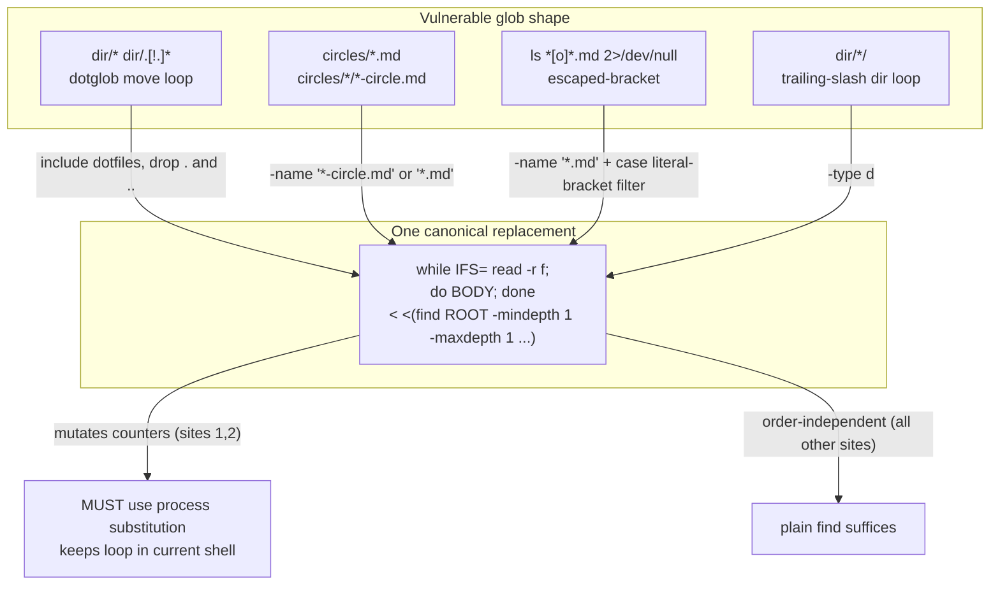
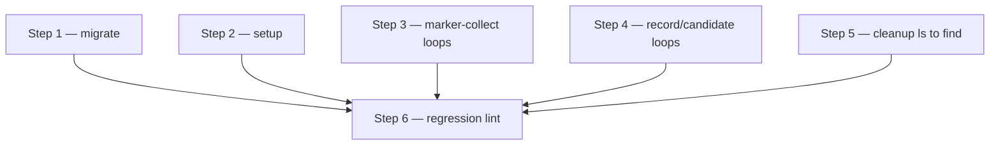

# Implementation Plan: harden skill/agent shell globs against zsh no-match abort

**Date:** 2026-07-17
**Status:** Complete — verified retroactively at HEAD `cde5319`; see Reconciliation Log.
**Spec:** none — planned from the defect issue `fusion-workbench/shared/issues/260717-1903[o]-skill-shell-scripts-assume-bash-glob-abort-under-zsh.md`

## Directive

Fix the shell-hygiene defect where inline glob loops in skill and agent bodies
abort the whole script under zsh. The user's Bash tool runs zsh 5.9 with `nomatch`
on by default, so an unmatched glob (`dir/.[!.]*`, `circles/*.md`, `*-circle.md`)
is a fatal error that kills the `eval` before the `[ -e "$f" ] || continue` guard
can fire. Under bash the same glob expands to its literal string and the guard
skips it — which is why these loops were written the way they are and why they
pass when a human re-runs them under bash. The fix removes the failure class at
the source, per `HYG-FIX-DESIGN`.

## Current State

**Verified empirically** (zsh 5.9, the Bash-tool shell on this machine):

- `for f in /tmp/none/*.md; do [ -e "$f" ] || continue; …; done` → `(eval): no matches found`, loop body never reached, subshell dies rc=1.
- `find "$dir" -mindepth 1 -maxdepth 1 | while IFS= read -r f; do …; done` → survives cleanly on a missing or empty dir, rc=0.
- `ls dir/*.md 2>/dev/null` → **still aborts** under zsh. The `2>/dev/null` redirect does not suppress the shell's own no-match error; it fires during argument expansion, before `ls` runs.
- `find` output is **unsorted** (directory order), where a shell glob is sorted. It matters only where a site depends on order.
- `find -mindepth 1 -maxdepth 1` includes dotfiles and excludes `.`/`..` — which is exactly the intent of the combined `dir/* dir/.[!.]*` idiom, so `find` is a faithful (and cleaner) replacement there.
- `find … -name '*[o]*.md'` re-introduces the bracket-expression bug: `-name` uses shell-glob matching, so `[o]` matches the single char `o`. The literal-bracket filter must be done with a `case` on the basename, not with `-name`.
- Counter persistence: in **zsh** the last stage of a pipeline runs in the current shell, so `find | while … N=$((N+1)); done` keeps `N`. In **bash** it does not (subshell), and the migrate skill is run under both. Process substitution `while … done < <(find …)` keeps the loop in the current shell in *both* shells — verified N=3 in zsh; it is the required form wherever the loop mutates outer-scope counters.

### The 14 vulnerable call sites (enumerated)

| # | File | Line | Construct | Order-sensitive? | Mutates outer counters? |
|---|------|------|-----------|------------------|-------------------------|
| 1 | `skills/migrate/SKILL.md` | 84 | Step 4 type-folder loop `for f in "$WB/$d"/* "$WB/$d"/.[!.]*` (the observed abort #1) | no | **yes** (MOVED/COLLISIONS/FALLBACKS) |
| 2 | `skills/migrate/SKILL.md` | 84 | Step 4 review-folder loop `for f in "$WB/$src"/* "$WB/$src"/.[!.]*` | no | **yes** |
| 3 | `skills/migrate/SKILL.md` | 84 | Step 4 circle loop `for f in "$WB"/circles/*.md` | no (built into TMP, `sort -u` later) | no (writes to TMP) |
| 4 | `skills/migrate/SKILL.md` | 51 | Step 2 survey circle loop `for f in "$WB"/circles/*.md` | no | no |
| 5 | `skills/setup/SKILL.md` | 37 | Step 0 pre-v4 check `for f in "$WB"/circles/*.md` (the observed abort #2) | no | no (sets OLD flag) |
| 6 | `skills/setup/SKILL.md` | 192 | Step 3 Circle-count snapshot `for f in …/circles/*/*-circle.md` | no (`sort \| uniq -c`) | no |
| 7 | `skills/next/SKILL.md` | 133 | record-picker `for f in "$CDIR"/*-circle.md` | no (one record expected) | no |
| 8 | `skills/circle-stash/SKILL.md` | 63 | record-picker `for f in "$CIRCLE_PATH"/*-circle.md` | no | REC_COUNT (in-shell, no pipe) |
| 9 | `skills/circle-stash/SKILL.md` | 228 | newest-history `for f in "$WORKBENCH/$d"/*-orchestrator-session.md` | no (picks by `-nt` mtime) | HIST_FILE (in-shell) |
| 10 | `skills/archive/SKILL.md` | 135 | marker-collect `for f in "$WORKBENCH/$SCAN_CIRCLES"/*/*-circle.md` | no | no |
| 11 | `skills/circle-pop/SKILL.md` | 83 | candidate-enum `for d in "$STASH_STORE"/*/` | no | CANDIDATES (in-shell) |
| 12 | `skills/cleanup/SKILL.md` | 67 | `ls …/*\[o\]*.md …/*\[p\]*.md 2>/dev/null` — escaped-bracket, redirect does NOT save it | display only | no |
| 13 | `agents/orchestrator.md` | 147 | marker-collect `for f in "$WORKBENCH/$SCAN_CIRCLES"/*/*-circle.md` | no (`sort \| uniq -c`) | no |
| 14 | `agents/playmaker.md` | 76 | marker-collect `for f in "$WORKBENCH/$SCAN_CIRCLES"/*/*-circle.md` | no | no |

**Not vulnerable, deliberately excluded** (verified, do not touch):
- `skills/circle-stash/SKILL.md:113`, `skills/archive/SKILL.md:48` — globs in `case` patterns, never expanded.
- `for d in $SCAN_PLANS` / `for p in $(…)` — word-splitting a variable or command substitution, not a glob; empty simply skips.
- Prose warnings that already document the bracket bug: `skills/next/SKILL.md:129`, `skills/setup/SKILL.md:197`, `skills/cleanup/SKILL.md:70`, `skills/migrate/SKILL.md:34,43,93`. These are the *guidance*, not live globs — leave them, they stay accurate after the fix.

### Two bug classes compose at one site

Site 12 (`cleanup`) already carries the *correct* fix for a **different** class — the escaped-bracket `*\[o\]*.md` guards against `[o]` being read as a bracket expression matching `o`. That fix is right and must be preserved. But the escaped-bracket glob is still no-match-fatal under zsh, so it needs the nomatch fix on top — and the nomatch fix must not undo the bracket fix. That rules out `find -name '*[o]*.md'`; the marker filter moves into a `case` on the literal string.

## Approach

One integral transformation, applied uniformly. Every vulnerable
`for f in <glob>; do [ -e "$f" ] || continue; BODY; done` becomes a
`find`-driven `while read` loop:

```sh
while IFS= read -r f; do BODY; done < <(find <root> -mindepth 1 -maxdepth 1 [-type d] [-name '<pat>'])
```

Rationale for `find` over the issue's Option 1 (`bash -c '…'` wrapper):

- **Removes the failure class** rather than shell-switching around it (`HYG-FIX-DESIGN`). Option 1 keeps the fragile globs and merely forces a shell that tolerates them; any future edit that runs the same block outside the wrapper reopens the defect.
- **No quoting hazard.** `bash -c '…'` around these blocks — several of which already contain single quotes, `sed -E`, and `awk` — needs escaping that is itself a defect source.
- **Shell-agnostic.** The result runs identically under zsh and bash, so the migrate skill no longer carries a hidden bash dependency.

Option 3 (document a bash requirement) is rejected outright: it relies on an
environment fusion does not control.

The single pattern has two documented variants:

- **Counter-mutating loops (sites 1, 2)** — use process substitution `< <(find …)`, mandatory, so the `while` runs in the current shell under *both* zsh and bash and the `MOVED`/`COLLISIONS`/`FALLBACKS` counters survive. A plain `find | while` pipe silently zeroes them under bash.
- **Literal-bracket filter (site 12)** — `find … -name '*.md'`, then keep names whose basename contains the literal `[o]` or `[p]` via `case "$b" in *'[o]'*|*'[p]'*)`. Never `-name '*[o]*'`.

For the three sites that already reduce through `sort | uniq -c` (6, 13, 14) or
build a `sort -u` table (3, 4, 5), find's unsorted output is harmless. The
record-pickers (7, 8) expect exactly one `*-circle.md` per Circle directory, so
order is irrelevant; the existing "more than one record is a fault" check in
`next` prose is unaffected. Newest-history (9) and candidate-enum (11) select by
mtime / by presence, both order-independent.

Drop the now-redundant `[ -e "$f" ] || continue` guard: `find` emits only
existing entries. (Known corner: `read -r` is line-based, so a filename
containing a literal newline would split. Workbench filenames are
timestamp-slug — no newlines — so this is acceptable; noted, not guarded.)



## Implementation Steps

1. **Fix migrate — the dangerous half-migration case**
   - Executor: coder
   - Files: `skills/migrate/SKILL.md`
   - Changes: Convert all four glob loops (Step 2 survey line 51, Step 4 execute line 84: type-folder, review-folder, circle loops). For the two counter-mutating loops (type-folder, review-folder) use `while IFS= read -r f; do move_one …; done < <(find "$WB/$d" -mindepth 1 -maxdepth 1)` — process substitution is required so `MOVED`/`COLLISIONS`/`FALLBACKS` persist. For the circle loops use `find "$WB/circles" -mindepth 1 -maxdepth 1 -name '*.md'`. Drop the `[ -e "$f" ] || continue` guards. Leave prose lines 34/43/93 untouched.
   - Dependencies: none

2. **Fix setup — the pre-v4 false-negative case**
   - Executor: coder
   - Files: `skills/setup/SKILL.md`
   - Changes: Step 0 line 37 circle loop → `find "$WB/circles" -mindepth 1 -maxdepth 1 -name '*.md'`; Step 3 line 192 count snapshot → `find ./fusion-workbench/circles -mindepth 2 -maxdepth 2 -name '*-circle.md'` (the `*/*-circle.md` depth), piped into the existing `sed … | sort | uniq -c`. Preserve the `OLD` flag logic and the marker-format grep. Leave prose line 197 untouched.
   - Dependencies: none

3. **Fix the three marker-collect loops (`*/*-circle.md`)**
   - Executor: coder
   - Files: `agents/orchestrator.md` (line 147), `agents/playmaker.md` (line 76), `skills/archive/SKILL.md` (line 135)
   - Changes: Replace `for f in "$WORKBENCH/$SCAN_CIRCLES"/*/*-circle.md; do [ -e "$f" ] || continue; …; done` with `find "$WORKBENCH/$SCAN_CIRCLES" -mindepth 2 -maxdepth 2 -name '*-circle.md' | while IFS= read -r f; do …; done`. All three feed `sort | uniq -c` or a marker collect — order-independent, plain pipe is fine (no outer-counter mutation).
   - Dependencies: none

4. **Fix the record-picker and candidate-enumeration loops**
   - Executor: coder
   - Files: `skills/next/SKILL.md` (line 133), `skills/circle-stash/SKILL.md` (lines 63, 228), `skills/circle-pop/SKILL.md` (line 83)
   - Changes: next/circle-stash record-pickers → `find "$CDIR" -mindepth 1 -maxdepth 1 -name '*-circle.md'`; circle-stash newest-history → `find "$WORKBENCH/$d" -mindepth 1 -maxdepth 1 -name '*-orchestrator-session.md'`; circle-pop candidate-enum → `find "$STASH_STORE" -mindepth 1 -maxdepth 1 -type d`. Sites 8/9/11 mutate `REC_COUNT`/`HIST_FILE`/`CANDIDATES` but do so **without a pipe today** — keep them in-shell: either process substitution `< <(find …)` or keep the loop unpiped by reading find output. Use `< <(find …)` uniformly to stay correct under bash too. Drop the `[ -e "$f" ]` guards.
   - Dependencies: none

5. **Fix cleanup — nomatch fix without undoing the bracket fix**
   - Executor: coder
   - Files: `skills/cleanup/SKILL.md` (line 67)
   - Changes: Replace `ls "$WORKBENCH/$d"/*\[o\]*.md "$WORKBENCH/$d"/*\[p\]*.md 2>/dev/null` with a find + literal-bracket case filter: `find "$WORKBENCH/$d" -mindepth 1 -maxdepth 1 -name '*.md' | while IFS= read -r f; do b=$(basename "$f"); case "$b" in *'[o]'*|*'[p]'*) printf '%s\n' "$f" ;; esac; done`. Do **not** use `find -name '*[o]*.md'` — that re-introduces the bracket-expression bug. Preserve the enclosing `for d in $SCAN_PLANS` loop and update the adjacent prose (line 70) only if the escaped-glob example it cites no longer appears.
   - Dependencies: none

6. **Regression guard — sibling lint rejecting raw `.[!.]*` in skill/agent bodies**
   - Executor: coder
   - Files: `hooks/lib/__tests__/` (new `it` block in `path-literal-lint.test.ts`, or a sibling `glob-nomatch-lint.test.ts`)
   - Changes: Add a vitest gate over `agents/*.md` + `skills/*/SKILL.md` (inside fenced ```bash blocks) that fails if a raw `.[!.]*` dotglob appears. Message points at the `find -mindepth 1 -maxdepth 1` replacement. See "Guardrail" below for scope and the recommendation to keep it narrow.
   - Dependencies: steps 1–5 (the tree must be clean before an assert-clean gate is added, or it fails on landing)



Steps 1–5 are mutually independent (disjoint files/regions) and may land in any
order or in parallel. Step 6 must land last.

## Data Structures

None. Shell-hygiene only; no schema, type, or data change.

## API Changes

None.

## Guardrail (scope item 3 — recommendation, not mandate)

**Recommended: add the narrow lint.** A vitest gate that rejects a raw `.[!.]*`
in skill/agent fenced bash is cheap, precise, and satisfies the issue's
acceptance line ("a note or test guards against re-introducing a raw
`dir/.[!.]*` no-match-fatal glob"). It fits the existing suite in
`hooks/lib/__tests__/path-literal-lint.test.ts`, which already reads exactly
this file set (`agents/*.md` + non-exempt `skills/*/SKILL.md`) with the same
"guard, not fixer" posture. After this plan lands, `.[!.]*` appears **nowhere**
in the tree, so the gate starts and stays green with zero exemptions.

**Recommended against: a broad "no `for X in <glob>`" lint.** The `find`-driven
replacement legitimately contains no glob-in-for, but many legitimate globs
remain in `case` patterns, prose, and escaped-bracket examples. A broad gate
would need a large exemption list, fight those legitimate uses, and drift into
false positives — cost out of proportion to a shell-hygiene fix. The narrow
`.[!.]*` gate catches the specific regression that actually hurt; the empirical
verification checks in steps 1–5 cover the rest.

Note the lint cannot catch every no-match-fatal shape (a bare `dir/*.md` in a
future for-loop would slip past a `.[!.]*`-only gate). That is acceptable: the
narrow gate targets the single most frequent and most silent trigger, and the
per-step zsh verification is the primary correctness surface.

## Testing Strategy

Every step carries a **zsh** verification check (this is the shell that exhibits
the bug; bash passing is not evidence). Run each from the repo root.

- **Step 1 (migrate):** stand up a scratch pre-v4 tree with an empty type folder and a `circles/` holding both marker-named `.md` files and no-marker files, run the Step 2 survey block and the Step 4 execute block under zsh, assert both run to completion (no `no matches found`), the empty folder is handled, and the reported `verschoben=/kollisionen=/mv-fallbacks=` counters are non-zero-correct (proves process substitution preserved them). Re-run to confirm idempotence.
  ```sh
  zsh -c 'D=$(mktemp -d); mkdir -p "$D/fusion-workbench/planning" "$D/fusion-workbench/circles"; : > "$D/fusion-workbench/circles/260101-0000[a]-x.md"; cd "$D"; # paste Step 4 block; echo rc=$?'
  ```
- **Step 2 (setup):** run the Step 0 block under zsh against a `circles/` dir that contains directories but no direct `*.md` (the exact observed-abort shape), assert it prints `OLD=0`/`OLD=1` correctly and does not abort; run the Step 3 snapshot against nested `*/*-circle.md` and assert the `uniq -c` marker histogram is correct.
- **Step 3 (marker loops):** for each of the three files, run the block under zsh against (a) a missing `circles/`, (b) an empty `circles/`, (c) a populated one — assert no abort and the marker counts match a hand count.
- **Step 4 (record/candidate loops):** run each block under zsh against an empty target dir (no-match case) and a one-record dir — assert `REC`/`HIST_FILE`/`CANDIDATES` land correctly and no abort.
- **Step 5 (cleanup):** run the block under zsh against a plans dir with `[o]`, `[p]`, `[c]`, `[d]` files — assert only `[o]`/`[p]` are listed (bracket fix preserved), a dir with no `[o]`/`[p]` produces empty output with no abort, and a file merely containing the letter `o` in its slug is NOT matched.
- **Step 6 (lint):** `npm test` — the new gate passes on the clean tree; a fixture with `.[!.]*` spliced into a copied prompt fails with a message naming the `find` replacement.

Full-suite gate: `npm test` green after step 6, and `claude plugin validate .` still reports passed (no frontmatter touched, but the smoke check is cheap).

## Risks & Mitigations

| Risk | Mitigation |
|------|------------|
| `find \| while` silently zeroes counters under bash (subshell), regressing migrate's report | Steps 1 and 4 mandate process substitution `< <(find …)` for every counter/variable-mutating loop; verified to preserve state in both zsh and bash. |
| Translating cleanup's escaped-bracket glob to `find -name '*[o]*'` re-introduces the bracket-expression bug | Step 5 explicitly forbids `-name '*[o]*'`; the marker filter is a `case` on the literal string `[o]`/`[p]`. |
| `find` unsorted order changes user-visible output where a site relied on sorted glob order | All 14 sites classified (table above); the only display-order site is cleanup (12), where a `\| sort` can be appended if deterministic listing is wanted. Reduce/count/pick sites are order-independent. |
| Filename with an embedded newline breaks `read -r` | Out of scope: workbench filenames are timestamp-slug, no newlines. Documented as a known corner, not guarded. |
| Lint added before the tree is clean fails on landing | Step 6 depends on steps 1–5; land last. |
| A future no-match-fatal glob of a different shape (bare `dir/*.md`) slips past the `.[!.]*`-only lint | Accepted and documented; the per-step zsh verification is the primary correctness surface, the narrow lint is a targeted backstop for the most frequent trigger. |

## Open Questions

- [ ] None blocking. The open/answered decisions in scope (`260716-*`, `260717-0033[a]`) concern the Circle-container restructure and the Plane, not shell hygiene; none feeds this plan. The one open decision `260716-1847[o]-offline-verhalten-bei-plane-ausfall` is unrelated.
- [ ] Cosmetic only: whether to append `| sort` to the cleanup listing (site 12) for deterministic display order. Executor's call at implementation time; not a blocker.

## Reconciliation Log

**260806-1152 (reconciler, workbench-wide pass)** — Status Draft → Complete, retroactive; the marker was already `_c_` while the body still said Draft with no step markers. Evidence the plan was executed: the driving issue `shared/issues/260717-1903_c_skill-shell-scripts-assume-bash-glob-abort-under-zsh.md` carries a Resolved footer naming the delivered shape (`find`-based enumeration, `< <(find …)` process substitution where counters persist, and the `glob-nomatch-lint.test.ts` gate against reintroducing raw `.[!.]*`; verified under zsh 5.9 with 196 hooks tests then green). Spot-checked at HEAD `cde5319`: `skills/migrate/SKILL.md` steps 2/4 run `while IFS= read -r … done < <(find …)` loops throughout, `skills/setup/SKILL.md` and the sibling skills carry the same form, and the lint gate is part of the 30-file suite (1611 green this pass). Site 12's escaped-bracket construct was later simplified by the v5.0.0 underscore-marker change, as the issue footer records.
