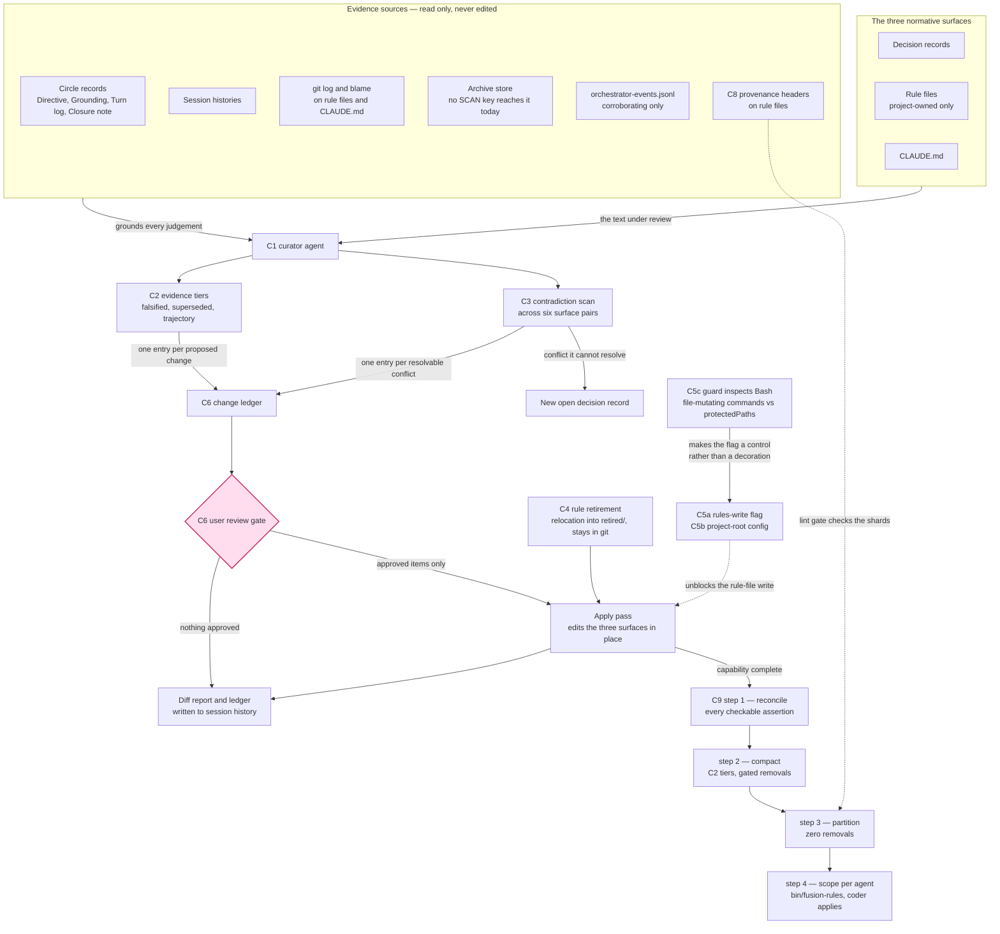
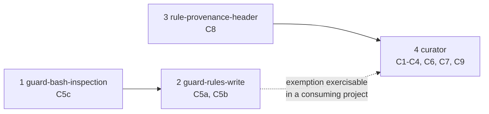

# Spec: normative-surface consolidation

**Date:** 2026-08-01 (revised 2026-08-01, third and final shaper pass)
**Status:** Final. All twelve decisions are answered and written into the capabilities below. Nothing is pending on the user. One answer, Q2, changed the shape of the work: the guard's Bash bypass is now a capability of its own (C5c) rather than a mechanism choice left to the planner. One answer, Q1, could not be realised the way it was framed — the mechanism named for the scoping step cannot perform it, and C9 step 4 states what does instead, with the evidence.
**Source:** The user's proposal that fusion gain an agent which reads the project's history and the current state of the discussion, judges what must change and what remains, and consolidates the three normative surfaces (decision records, rule files, `CLAUDE.md`) that drift, contradict each other, and grow into a standing context tax.

**Prior decisions this spec builds on, and does not reopen:**

- **D1** (`shared/decisions/260801-1020_*_where-does-normative-consistency-live.md`) — a writing consolidation agent, not a report-only detector.
- **D2** (`shared/decisions/260801-1020_a_may-any-fusion-writer-touch-rules.md`) — rule-file writes are permitted through an environment-gated exemption, plus project-level guard configuration.
- **D3** (`shared/decisions/260801-1020_a_provenance-header-on-rule-files.md`) — **answered** by D-e below and walked to anticipated (`_a_`). Full adoption: the convention, the backfill of the plugin's nine rule files, and a lint gate. C8 realises it.

**Grounding:** `shared/analyses/260801-1020-normative-surface-drift-gap-analysis.md`; `shared/history/260801-0936-orchestrator-session.md` `## Design decisions (session, 260801)` and `## Spec decisions (D-a through D-h)`; `shared/issues/260801-1156_o_bash-bypasses-the-protected-path-check-entirely.md`, which C5c closes.

**The agent is named `curator`** (D-h), and the skill that invokes it is `/fusion:curate`.

---

## Directive

A fusion-governed project can ask one agent to reconcile its three normative surfaces against what actually happened in the project, and get back a reviewed set of edits that removes what history has retired and resolves what the surfaces say in contradiction. Nothing is deleted that the agent cannot tie to a cited event, and nothing lands before the user has seen it as a change ledger. The finished agent's first job is fusion's own 54 kB conventions file, taken through the same four steps in order — reconciled against ground truth, compacted, partitioned, then scoped per agent — which is both the deliverable the project wants and the proof that the capability works. The guard is made to enforce what it currently only appears to enforce, so the permission the agent needs to touch rule files is a real control rather than a decorative one.

---

## Shape

---

## Capabilities

### C1: The curator — remit and boundaries

**Description:** One new fusion agent, named `curator`, reads the three normative surfaces together with the project's retained history, and edits all three. Its remit is defined by the *reason* for an edit, not by the surface it touches: it changes something only when the change is justified by a cross-surface contradiction or by history-grounded obsolescence. Edits justified by anything else stay with the surfaces' existing owners.

**The name** matches fusion's single-noun agent naming (`shaper`, `planner`, `reconciler`, `playmaker`, `analyst`, `editor`) and says what the agent does to the normative corpus (D-h).

**Boundary against `/fusion:revise-claude-md`.** The skill keeps its three-pass add/update/prune on this session's learnings. The curator does not run those passes and does not call the skill. The two differ by evidence horizon: the skill works from the current session plus two days of git and never opens the workbench, and the curator works from the workbench and the whole git history. Running both against `CLAUDE.md` is safe because the curator only proposes changes carrying a workbench or long-range-git citation, which is exactly the class the skill's evidence base cannot reach.

**Boundary against `agents/reconciler.md`.** The reconciler keeps its decision-marker walk (`_o_`→`_a_`, `_a_`→`_i_`, and the reactive `_s_` that fires when a superseding record already exists). The curator does not advance markers on that basis. It handles the case the reconciler's walk cannot: two live decisions that contradict each other with no superseding record yet in existence, and a decision that stopped applying without a successor arriving. Where the curator concludes one live decision supersedes another, it writes the `Superseded by:` annotation and renames to `_s_`, which is the same mechanical write the reconciler performs, reached by different reasoning.

**Explicitly not in the remit:**

- Advancing decision markers on ground-truth verification. That is the reconciler's Step 3.
- The session-learnings CLAUDE.md pass. That is the revise skill.
- Mechanical workbench shrinking by marker and date. That is `/fusion:archive`.
- Any change to which rule files load for which agent. `bin/fusion-rules` and `./rules/context-manifest.yaml` own that, and they answer a different question (what loads) from the curator's (what is true).
- Code, data, ontology, plans, issues, agent prompts, skill bodies, and `README*.md`.
- Anything under `bin/` or `hooks/`. Where a change the curator wants requires a helper or hook edit, it reports the requirement and stops. C4 and C9 both hit this boundary, and both handle it by reporting rather than by widening the remit.
- The plugin's own `rules/` directory when running inside a consuming project. Those files live in the fusion install, outside the project tree.

**Acceptance criteria:**

- [ ] Dispatching the agent on a project with all three surfaces present produces a change ledger covering all three, or an explicit statement that a surface yielded nothing.
- [ ] The agent's prompt states, in its Scope section, that it does not advance decision markers on ground-truth verification and does not run the session-learnings CLAUDE.md pass, and names both owners.
- [ ] Running the curator and then `/fusion:revise-claude-md` in either order produces no edit that reverses the other's edit.
- [ ] The agent refuses, with a stated reason, when asked to edit an agent prompt, a skill body, a plan, an issue, or any file under `bin/` or `hooks/`.
- [ ] In a consuming project the agent's rule-file scope covers `./rules/` and `.claude/rules/` and nothing else. A run in a project with neither directory reports "no project-owned rule files" and proceeds with the other two surfaces.

**Decisions made:**

- The boundary is drawn by reason-for-edit rather than by surface, so the curator neither subsumes nor duplicates the two existing appliers (D-a, confirmed).
- The agent is named `curator` (D-h, confirmed).

---

### C2: History-grounded justification for a change

**Description:** Every change the agent proposes carries a verdict tier and a citation. The tier says what kind of evidence justifies the change, and the citation names the evidence. A change with no citation is never applied; it is reported as a candidate the user may act on.

**The three tiers.**

**Tier 1 — Falsified claim.** The text asserts something checkable about the present (a path, a filename, a command, a version, a count, a configuration field, an agent or skill name) and the assertion is false today. Evidence is the check itself, reported with the command run and its result. No history is required. The live instance from the gap analysis sits here: `CLAUDE.md` cites `fusion-workbench/decisions/260516-*-bus-*.md` as marked superseded, the path is pre-v4, and the files exist nowhere in the workbench or the archive.

**Tier 2 — Superseded by a recorded position.** The text encodes a position that a later record overturns. Evidence is a decision record carrying `_a_`, `_i_`, or `_s_`, a Circle closure note, or a session history's design-decision section, cited by path plus section or line, whose content states the replacing position. The citation must name both the record and the sentence in the current text it overturns. A decision record still carrying `_o_` is not evidence: an open question retires nothing.

**Tier 3 — Obsolete by trajectory.** No single record retires it, but the accumulated history shows the practice stopped. Evidence is at least two independent sources that agree, drawn from different kinds (for example a git-log range showing a mechanism removed, plus a Circle closure note describing the removal). The agent must be able to state *when* the thing stopped applying and *what replaced it, or that nothing did*. If it cannot state both, the change is downgraded to a candidate and not applied.

**Never permitted.** A deletion justified only by re-reading the current text. "This reads redundant", "this seems unimportant", "this is historical narrative" are not evidence. Such a judgement may propose a *consolidation*, meaning a rewrite that preserves every constraint expressed in the original, but it may never propose removing a constraint. Consolidations are reported as their own ledger category and are gated like every other change.

**Evidence sources the agent must read**, in the order of value the gap analysis established:

1. Circle records under `$SCAN_CIRCLES` — `## Directive`, `## Grounding snapshot`, `## Dependencies`, `## Turn log`, `## Closure note`.
2. Decision records under `$SCAN_DECISIONS`, all five markers. `_s_` and `_i_` records carry their own supersession or realisation citation inline.
3. Session histories under `$SCAN_HISTORY`, including the reconciler-appended `## Coherence` sections.
4. `git log --follow` on each rule file and on `CLAUDE.md`, and `git blame` when a single paragraph is in question.
5. Reviews and analyses under `$SCAN_REVIEWS` and `$SCAN_ANALYSES`.
6. `fusion-workbench/orchestrator-events.jsonl` — corroborating only. Its `detail` strings are summaries, so an event may support a finding but may never be its only evidence.
7. The archive store. No `SCAN_*` key resolves into it today (`shared/issues/260801-1020_o_scan-keys-never-reach-the-archive-store.md`), so the agent reads the archive directory directly. Skipping it makes the agent blinder the longer a project has run, which inverts its purpose.
8. The provenance header on a rule file, once C8 has landed. The header names the decision record, Circle, or analysis that motivated the rule. Where the named record carries `_s_`, the rule is a Tier 2 retirement candidate with no reconstruction required.

**The thin spot, stated honestly.** For a consuming project's `./rules/` and `.claude/rules/`, sources 1 through 3 and 7 may be empty and source 4 may be uninformative, because those files can have been hand-authored outside any fusion session or copied from `templates/`. Behaviour there: Tier 1 changes still apply, and Tier 2 and Tier 3 findings are downgraded to candidates and reported. The agent does not reconstruct a rationale it cannot cite.

C8 narrows this gap forward but does not close it backward. The lint gate lives in the plugin's own test suite and cannot reach a consuming project, so a consuming project's headers are convention only, and a rule file that predates the convention has none. A project therefore gains header-based Tier 2 evidence only for rules written or edited after it adopted the convention.

**Acceptance criteria:**

- [ ] Every ledger entry names exactly one tier and carries at least one citation in the form the tier requires.
- [ ] A Tier 1 entry shows the verification command and its output.
- [ ] A Tier 3 entry states when the practice stopped and what replaced it, or is marked as a candidate rather than a proposed change.
- [ ] An entry that removes a constraint and cites only the current text is rejected by the agent's own pass and never reaches the ledger as a proposed change.
- [ ] Running the agent on a project whose archive store holds retired decisions produces citations into the archive where those decisions are the evidence.
- [ ] Running the agent on a project whose rule files have no workbench history and no informative git history produces zero applied Tier 2 or Tier 3 rule-file changes, and reports why.
- [ ] A rule file whose provenance header names a superseded (`_s_`) decision record is surfaced as a Tier 2 retirement candidate, with the header line and the record cited.

**Decisions made:**

- Three tiers rather than a single evidence bar, because the falsified-claim case is mechanically checkable and blocking it behind a history citation would prevent the agent from fixing the drift instance the user already found.
- An `_o_` decision record is not evidence for retirement.
- The provenance header becomes an eighth evidence source, forward-looking only (D-e).

---

### C3: Cross-surface contradiction detection

**Description:** The agent compares the three surfaces against each other and reports every contradiction it finds. Where one side is falsified or superseded under C2, it fixes that side. Where both sides are live and defensible, it files a decision record and edits neither.

**What counts as a contradiction.** Two normative statements contradict when both are currently binding and an agent following one would violate the other. Three kinds:

- **Direct.** One says X, the other says not-X.
- **Precedence-undecided.** Two rule files from different roots are both emitted by `bin/fusion-rules` and both binding, and fusion has no precedence semantics between rule sources (stated at `bin/fusion-rules:292-295`). Neither statement is wrong. The defect is that nothing says which governs.
- **Stale reference.** A normative statement cites an artifact that has moved, been archived, or never existed. Stale references are Tier 1 under C2 and are usually resolvable without the user.

**The pairs checked.** Six: decision against decision, decision against rule file, decision against `CLAUDE.md`, rule file against rule file, rule file against `CLAUDE.md`, and `CLAUDE.md` against itself.

**Behaviour on an unresolvable contradiction.** The agent files a decision record at `$OUT_DECISION` with marker `_o_`, following the decision-record template in `rules/fusion-workbench-conventions.md`. The record's `## Question` states the conflict; `## Options` states each position with its `path:line` citation; `## Constraints` states what breaks under each; `## Recommendation` is the agent's view with its confidence labelled per `rules/critical-stance.md`. The agent does not edit either side, and it reports the record's path in its summary.

**Placement of the new record** follows the Origin Rule. A contradiction discovered while a Circle is active and arising from that Circle's Directive lands in the Circle's decision store; otherwise it lands in `shared/`. The agent resolves both through `bin/fusion-paths`, never by naming a store path.

**Note on overlap.** Analyst type 7 is currently the typed authoring path for a decision record, and the consultant is explicitly told to delegate rather than write one. The curator becomes the second authorised author. That must be stated in the curator's prompt and reflected wherever the division of labour is documented, or it reads as an accidental overlap.

**Acceptance criteria:**

- [ ] The agent's report lists, per surface pair, how many pairs were compared and how many contradictions were found.
- [ ] A seeded direct contradiction between a rule file and `CLAUDE.md` is found and reported.
- [ ] A seeded precedence-undecided pair (the same rule stated differently in `./rules/` and `.claude/rules/`) is reported as a contradiction, not silently resolved by picking one.
- [ ] An unresolvable contradiction produces a decision record at the path `bin/fusion-paths` resolves, with all four template sections filled and both positions cited by path and line.
- [ ] The agent makes no edit to either side of a contradiction it filed as a decision record.
- [ ] The stale-reference instance in `CLAUDE.md` (the pre-v4 bus decision paths) is found on a run against this repo.

**Decisions made:**

- Unresolvable contradictions become `_o_` decision records rather than issues, because a contradiction between two defensible positions is a choice point, not a defect (per the issues-versus-decisions split in `rules/fusion-workbench-conventions.md`).

---

### C4: Rule-file lifecycle and retirement

**Description:** Rule files gain a retirement path. A retired rule moves into a `retired/` subdirectory of the root it came from, stays in version control, and stops loading. It gains no filename state marker.

**The constraint that rules out a marker.** `bin/fusion-rules` selects pattern-matched rule files by globbing `"$dir"/*"$pat"*.md` (`emit_pattern_in_dir`, `bin/fusion-rules:153-165`) and never reads a file's content. A filename marker therefore does not remove a file from the emitted set: `_s_coding-hygiene.md` still matches `*coding*` and still loads. Adding a marker naively would leave retired rules binding while appearing retired, which is worse than the current state of having no lifecycle at all. An in-file `**Status:**` header has the same defect for the same reason.

**The mechanism: relocation into `retired/`.** The same glob is a single `*` and does not descend, so a file in `<root>/retired/` is already outside the emitted set with no change to `bin/fusion-rules`. The curator moves the file, writes a one-line tombstone at the original location's sibling index stating the date, the retiring evidence citation, and the new path, and reports the move in the ledger.

**Why not the workbench archive.** Two verified problems ruled out the archive, which was the first destination considered (D-b):

1. The workbench is untracked in this project. `.gitignore:50` is the commented-out line `## fusion-workbench/`, and `git ls-files fusion-workbench/` returns zero files, so git does not hold the bytes of anything moved there.
2. `CLAUDE.md` documents the workbench as a runtime artifact that is safe to delete. Archiving a rule file into it means a documented-safe operation destroys the only copy.

`rules/retired/` stops loading for the same mechanical reason the archive would, and stays under version control, which is the property the retirement needs.

**The destination must be version-controlled, and the curator checks.** Before moving a file, the curator verifies that the destination path is tracked or trackable (not matched by `.gitignore`). This matters for `.claude/rules/`: in this repo `.claude/` is gitignored outright (`.gitignore:2`), so `.claude/rules/retired/` would repeat the durability failure the archive was rejected for. When the destination is ignored, the curator does not move the file. It reports the condition, names the ignore rule, and asks the user to decide.

**The move must go through the guard, not around it.** `rules/**` is in `protectedPaths` (`hooks/config.json:8-18`), so the destination is itself protected, and moving a rule file is a write to a protected path. Today a `mv` or `git mv` issued through Bash bypasses the protected-path check entirely, which is the defect C5c closes. Requirement here, unchanged by that: no rule-file retirement occurs without `FUSION_ALLOW_RULES_WRITE` set and an advisory event recorded, whichever tool performs the move. C5c is what makes the requirement enforceable rather than a prompt instruction the curator is trusted to follow.

**Scope bound.** In a consuming project the curator retires only that project's own `./rules/` and `.claude/rules/` files. The plugin's nine rule files live in the fusion install and are edited in the plugin source repo, where the write guard already stands down (`hooks/lib/self-detect.ts:18-33`).

**Files emitted by explicit path cannot be retired by relocation alone.** Six plugin rules are emitted by name rather than by pattern (`bin/fusion-rules:262-267`): `agent-setup.md`, `fusion-workbench-conventions.md`, `decision-record-examples.md`, `user-facing-output.md`, `critical-stance.md`, `git-branch-discipline.md`. `emit_if_exists` silently skips a missing file, so relocating one would stop it loading, but the helper would keep naming a path that no longer exists. Since the curator may not edit `bin/`, it reports the requirement and stops rather than leaving the helper stale.

**Documentation change.** `rules/fusion-workbench-conventions.md` gains a statement that rule files are not workbench artifacts, carry no state marker, and are retired by relocation into `retired/`. The filename-pattern table today omits rule files entirely, which reads as an oversight rather than a decision.

**Acceptance criteria:**

- [ ] After the agent retires a project rule file, `bin/fusion-rules <agent>` no longer emits that file's path, for every agent that previously received it.
- [ ] The retired file is present at `<original root>/retired/<filename>` and `git ls-files` reports it as tracked.
- [ ] The tombstone names the retirement date, the evidence citation, and the new path.
- [ ] A retirement attempt whose destination is matched by `.gitignore` does not move the file, and reports the matching ignore rule and its path.
- [ ] A retirement attempted with `FUSION_ALLOW_RULES_WRITE` unset is blocked and recorded as a block, regardless of whether the curator uses a write tool or a shell command.
- [ ] A retirement performed with the flag set produces one `guard_advisory` event naming the variable and the moved path.
- [ ] An attempt to retire one of the six explicitly emitted plugin rules reports that `bin/fusion-rules` still names the path and makes no move.
- [ ] `rules/fusion-workbench-conventions.md` states that rule files carry no state marker, that they retire by relocation into `retired/`, and why.
- [ ] A run against a project whose rule files all remain in force retires nothing and says so.

**Decisions made:**

- Relocation rather than a filename marker, forced by the glob semantics of `bin/fusion-rules` (D-b, first half confirmed).
- The destination is `<root>/retired/`, not the workbench archive, because the archive is untracked and documented as safe to delete (D-b).
- The destination is checked for version control before the move, which generalises the same reasoning to `.claude/rules/` in projects that ignore `.claude/`.

---

### C5: Guard changes — Bash inspection, rules-write exemption, project-level configuration

**Description:** Three changes to the compliance guard. C5c repairs a defect that makes the whole protected-path list advisory for any agent with a shell; C5a and C5b are D2's exemption and project configuration. Together they let a consuming project permit rule-file writes deliberately, per session, and never silently — and make every other protected path mean what it says.

**C5c comes first and the other two depend on it.** `FUSION_ALLOW_RULES_WRITE` sits on the `Edit` path. While `mv`, `rm`, `sed -i` and shell redirection reach the same file unguarded, the flag controls the polite route to a door that is standing open. Building C5a on today's guard produces the appearance of a control, which is worse than an acknowledged absence because it stops anyone looking.

**C5c — the guard inspects Bash for file mutation against protected paths.**

Today every path in `protectedPaths` is writable through a shell. The guard reaches the protected-path check only from `Write`, `Edit`, `MultiEdit`, and `NotebookEdit`; a `Bash` call is classified for git branch and worktree operations and then returns unconditionally (`hooks/guard.ts:265-268`), never reaching the check at `hooks/guard.ts:309`. `Edit rules/x.md` is blocked and `mv rules/x.md /tmp/` is allowed. The full statement of the defect, with the verified control flow, is `shared/issues/260801-1156_o_bash-bypasses-the-protected-path-check-entirely.md`.

This is not curator-specific. It affects all sixteen agents today, and the sharpest case is `fusion-workbench/.guard-state/**`: an agent can delete its own escalation counter through a shell, which defeats the halt the counter exists to drive.

**New behaviour.** A `Bash` command is classified for file-mutating operations. When a mutation targets a path matching the effective `protectedPaths`, the call is denied with a reason naming the command segment and the path.

**The shape follows `classifyGitCommand`, and most of the hard part already exists.** `hooks/lib/git-branch-guard.ts` is a pure, exported, unit-testable classifier that already solves the shell-parsing problem this needs: `stripDataRegions` (line 169) blanks single-quoted strings and quoted-delimiter heredocs while deliberately preserving regions where bash still expands, `extractCommandSegments` (line 335) splits on operators and recurses into substitutions, and `tokenize` (line 409) produces the argument vector. The mutation classifier is a sibling consuming the same segmentation, not a second parser.

**What counts as a mutation.** Three classes, named by what they do rather than by an exhaustive verb list:

1. Verbs that relocate or destroy a path — `mv`, `rm`, `cp`, `ln`, `install`.
2. Verbs that rewrite a file in place — `sed -i`, `perl -i`, `truncate`, `dd`, `tee`.
3. Shell output redirection — `>`, `>>`, `>|`. This one needs naming explicitly because it carries no verb, and it is the shortest route to an emptied rule file.

**The fail-closed rule, and its bound.** Completeness is not achievable: a shell can construct a path at run time, and a project's own build script can write anywhere without the guard recognising it as a mutation. The standard is the one the checkout classifier already sets — fail closed on the constructible cases. Concretely, fail-closed is scoped to a **recognised mutating command whose operands cannot be resolved**: `mv $SRC rules/` denies on the visible protected target, `mv rules/x.md $DST` denies on the visible protected source, and `mv $A $B` denies because a recognised mutation with no resolvable operand is exactly the ambiguity the guard must not wave through. It is **not** scoped to all unparseable Bash, which would block ordinary shell work and make the guard something agents route around.

**The accepted residual, stated so it is not rediscovered as a surprise:** an unrecognised program that writes a protected path still writes it. C5c raises the cost of the bypass from zero to deliberate; it does not eliminate it. Any claim that `protectedPaths` is enforced should carry that qualification.

**Self-detect interaction, which is load-bearing and easy to get backwards.** The Bash branch sits *above* the `isFusionPluginCwd()` stand-down (`hooks/guard.ts:265-268` precedes `hooks/guard.ts:274-283`), and that ordering is deliberate: the branch policy stays active in the plugin's own repo because it only ever gated the agent's tool calls. A Bash path check is a **write-guard** concern and must stand down in the plugin repo alongside the other write protection, or a fusion developer's agent cannot edit the plugin's own `rules/` through a shell — precisely the freedom the stand-down exists to grant. So the new check is gated on the plugin-repo detection while the branch classifier above it remains ungated.

**Bookkeeping stays as it is.** Two existing issues fixed the guard's Bash bookkeeping deliberately: an innocuous Bash call must not reset the consecutive-block counter (260707-0750) and must not emit a `guard_allow` event (260707-0751). Both hold unchanged. An allowed Bash call has zero side effect on guard state. A denied one records a block and emits `guard_block` or `guard_halt`, which is exactly what the branch deny already does at `hooks/guard.ts:180-199`.

**The C5a exemption applies on this path too.** With `FUSION_ALLOW_RULES_WRITE` set, a shell mutation of a rule directory is allowed and produces the same `guard_advisory` event as the write-tool path. Without that, C4's retirement move becomes impossible rather than merely guarded.

**Testability.** The classifier is pure and exported, so its cases are unit-testable without the hook firing, in the shape of `hooks/lib/__tests__/git-branch-guard.test.ts`. The wiring — that a denied mutation actually reaches a block, that the stand-down applies, that the exemption fires — needs a fixture outside the plugin repo, for the same reason C5a and C5b do.

**C5a — `FUSION_ALLOW_RULES_WRITE`.**

When the variable is set, the protected-path check exempts *only* paths matching the project's rule directories, including the `retired/` destination C4 writes into. It does not exempt `agents/**`, `skills/**`, `hooks/config.json`, `hooks/hooks.json`, `settings.json`, `bin/monitor`, `.claude-plugin/plugin.json`, or the guard's own state directory. Setting it must not turn the guard off.

When the exemption fires, the guard emits a `guard_advisory` event and pushes a `clear`-level entry onto `escalation.recentEvents`, in the same shape the branch-switch override uses at `hooks/guard.ts:159-177`. The user sees every write that happened only because the flag was set, in `.guard-state/events.jsonl` and on the monitor dashboard.

With the flag unset, behaviour is exactly as today: the write is blocked, the block counts toward the three-block halt, and the reason names the protected path.

**Accepted residual risk**, recorded in D2 and restated here so it is not rediscovered: an environment variable is a claim, not an identity. Everything in the session inherits it, including any subagent the exempted agent dispatches.

**C5b — project-level guard configuration at the project root.**

`findConfigPath()` walks up from the compiled hook's own directory (`hooks/lib/config.ts:21-32`), which sits inside the fusion install, so it always resolves to the plugin's `hooks/config.json` and can never reach a consuming project's own configuration. Every project on one install therefore shares one `protectedPaths` list.

New behaviour: the loader looks for a project-level configuration first, at the **project root, git-tracked** (working name `fusion-guard.json`), and falls back to the plugin's file and then to the in-code defaults. The project root is located from the same anchor `hooks/lib/workbench-root.ts` already computes.

**Why the project root rather than the workbench or `.claude/` (D-c).** If the configuration goes missing or is edited, `protectedPaths` silently reverts to the plugin default, which may be either more or less protective than the project intended. A setting with that consequence is treated as source: a change to it appears in a diff and passes through review. The two alternatives both fail that test in this repo. The workbench is untracked (`.gitignore:50` is commented out) and documented as safe to delete, and `.claude/` is gitignored outright (`.gitignore:2`).

**Seeding.** `/fusion:setup` seeds the file the way it already seeds `plane.config.yaml`: a template copied from `templates/`, idempotent, never overwriting a filled-in file (`skills/setup/SKILL.md:141-144`).

**The seeded file declares inheritance and lists nothing.** It states that it inherits the plugin's `protectedPaths` and that the project adds or removes entries explicitly. A template shipping today's default list verbatim would freeze that project's protected paths at the current plugin defaults, so any path fusion protects in a later version would never reach a project set up before that version — a silent under-protection that grows with every release.

**The cost is accepted rather than mitigated.** A reader of the seeded file cannot see what is protected without opening the plugin's `hooks/config.json`. The obvious mitigation — a commented-out copy of the defaults, for documentation — is rejected: a comment listing paths is a second copy of the plugin's list with no mechanism keeping it current, so it goes stale silently and then misinforms, which is worse than sending the reader to the one authoritative copy. The template names where the effective list lives and does not restate it.

**Merge semantics:** per top-level key, the project's value replaces the plugin's; keys the project omits fall back to the plugin's, then to `DEFAULTS`. A union would be safer but would make it impossible for a project to narrow `protectedPaths`, which is half of what D2 asked for.

**Self-protection floor:** the effective `protectedPaths` always includes the project configuration file itself, regardless of what that file says. Without the floor, an agent could unprotect its own guard configuration in one edit. At the project root the file is not covered by the `fusion-workbench/**` auto-allow in `settings.json`, but it is also not in the default protected list, so the floor is what protects it.

**Behaviour when the project config is missing or unparseable:** fall back to the plugin's file, and emit one advisory event naming the parse failure. Failing open silently would hide a mistyped configuration behind apparently-normal operation.

**Acceptance criteria:**

*C5c — Bash inspection:* **nine of ten met — reconciler 260801-2029, verified at HEAD `9ab5a2a` against `circles/260801-1244-guard-bash-inspection` (closed).**

- [x] In a consuming project, each of `mv`, `rm`, `sed -i`, `tee` and `>` redirection targeting a path in `protectedPaths` is blocked, and the reason names the offending command segment and the path. — `hooks/lib/__tests__/guard-bash-integration.test.ts:77-153`, spawned `dist/guard.js` against a tmpdir project root.
- [x] The same five commands targeting a path outside `protectedPaths` are allowed, and the allowed call resets no counter and emits no `guard_allow` event. — same file `:285-343`, asserted on `escalation.json` and `events.jsonl` themselves. Closes the long-open `shared/issues/260707-1006` as a side effect.
- [x] A recognised mutating command whose operands cannot be resolved to a definite path is blocked. — same file `:154-183`.
- [x] An unrecognised command is allowed, and the spec's statement of that residual appears in the guard's own documentation rather than only here. — same file `:184-206`; residual stated in `rules/protected-path-discipline.md`, `README-hooks.md` and the module docstrings (commit `3806a49`, extended by `18e2e4f` and `9ab5a2a`).
- [x] `git mv` of a protected path is blocked, and `git checkout HEAD -- <paths>` remains allowed, so the existing revert strategy is untouched. — `guard-bash-integration.test.ts:77-153` and `:322` (the revert form is in the innocuous-calls list).
- [x] A protected-path denial through Bash records a block and emits `guard_block`, and the third consecutive block halts, matching the write-tool path. — same file `:350-383`: three denies, `consecutiveBlocks` 3, `haltActive` true, events `["guard_block","guard_block","guard_halt"]`, triggers all `protected_path` plus `consecutive_blocks`.
- [x] In the fusion plugin's own repo the Bash path check stands down, while `git switch` on the same call remains denied. — same file `:389-458`, four cases: the mutation allows, `git switch` blocks with trigger `git_branch_switch`, the `Edit` path stands down too, and the boundary is asserted from the other side.
- [x] With `FUSION_ALLOW_RULES_WRITE` set, a shell move of a rule file into `retired/` is allowed and emits one `guard_advisory` event; with it unset, the same move is blocked. — **MET — reconciler 260805-2323**: `hooks/lib/__tests__/guard-rules-write-integration.test.ts:454-515` ("blocks a shell move of a rule file into retired/ when the flag is unset" / "allows the same move with the flag set, and records exactly one advisory", events asserted `["guard_advisory"]` exactly). Formerly **DEFERRED, deliberately, to `circles/260801-1244-guard-rules-write`.** Recorded as Q1 in `circles/260801-1244-guard-bash-inspection/planning/260801-1253_c_plan-guard-bash-inspection.md`. That Circle shipped the seam this criterion needs (`MutationOptions.exempt`, `hooks/lib/bash-mutation-guard.ts:168`, checked at `:1243` and `:1252`); the flag itself appears nowhere in the source at HEAD.
- [x] A shell mutation of `fusion-workbench/.guard-state/**` is blocked in a consuming project. — blocked directly, and through a `cd` (`cd fusion-workbench && rm -rf .guard-state`, commit `59a1cd9`).
- [x] The classifier's cases run as unit tests without the hook firing. — `hooks/lib/__tests__/bash-mutation-guard.test.ts`, pure, no filesystem. Full suite at HEAD: 753 passed, 16 files.

*C5a and C5b:* **all eleven met — reconciler 260805-2323, final reconciliation of `circles/260801-1244-guard-rules-write`, verified at HEAD `def351e`.** Evidence is the integration suite through the spawned guard against throwaway non-plugin project roots (`hooks/lib/__tests__/guard-rules-write-integration.test.ts`, cited per criterion below) plus the config unit suite (`hooks/lib/__tests__/config.test.ts`). The suite was run twice by the reconciler: against the TypeScript source and against the committed artifact (`FUSION_GUARD_ENTRY=dist npx vitest run`) — **1550 of 1551 passed in both runs; the sole failure is `rules-emission-golden.test.ts`, a `bin/fusion-rules` byte-count fixture stale since commit `373f5ed`, not a guard behaviour** (filed: `circles/260801-1244-guard-rules-write/issues/260805-2323_o_emissions-golden-veraltet-nach-dem-step-7-doku-commit-die-suite-ist-um-einen-test-rot.md`).

- [x] In a consuming project with the flag unset, an `Edit` to `./rules/anything.md` is blocked and the block counts toward the halt threshold. — integration `:226-247` (block + `consecutiveBlocks` 1 asserted at `:240`).
- [x] With the flag set, the same edit is allowed, a `guard_advisory` event is written naming the variable and the path, and an escalation entry is recorded. — integration `:248-311` (advisory first, `clear`-level escalation entry, counter untouched).
- [x] With the flag set, an `Edit` to `agents/anything.md` and to `skills/anything/SKILL.md` is still blocked. — integration `:312-338` and `:339-358`.
- [x] With the flag set, a write into `./rules/retired/` is allowed and recorded; with it unset, the same write is blocked. — write path integration `:287-311` ("exempts a rule file inside retired/"); shell path `:454-515` (see the C5c criterion above).
- [x] Setting the flag does not reset or clear an active halt. — integration `:359-393` (pre-seeded `haltActive: true`, edit blocked `[HALTED]`, state stays halted) plus the whole `describe` "a halted guard blocks shell mutations too" `:1429-1607`.
- [x] A project that declares its own `protectedPaths` gets that list; a project that declares only `escalation` keeps the plugin's `protectedPaths`. — integration `describe` "a project's own protectedPaths replace the plugin's" `:2147-2208`; unit `config.test.ts:418` ("a project declaring only escalation keeps the plugin's protectedPaths").
- [x] A project whose seeded configuration is untouched gets the plugin's `protectedPaths`, including any path added to the plugin default after the project was set up. — unit `config.test.ts:1236-` (`describe` "the seeded template declares inheritance and lists nothing": the shipped template merges to the plugin's configuration; every asserted key deliberately distinct from `DEFAULTS`, so a template that grew any declaration fails).
- [x] An `Edit` to the project guard configuration file is blocked whether or not that file lists itself. — integration `describe` "the self-protection floor, through the guard" `:1788-1903` (lists itself / does not / empty list / shell delete / creation allowed) and "…reached from a subdirectory" `:1904-2146` (bare and absolute spellings).
- [x] An unparseable project configuration falls back to the plugin's and emits one advisory event. — integration `describe` "an unparseable project configuration is reported, not swallowed" `:2210-2305` (advisory emitted, protected list still the plugin's); unit diagnostics cases in `config.test.ts`.
- [x] `/fusion:setup` creates the configuration file when absent and leaves a filled-in one untouched. — `skills/setup/SKILL.md:155-174` Step 0f (probe-then-copy, `[ -f ]`-guarded, measured against the guard); run-twice verification `history/260804-1511-coder-step8-setup-seeds-guard-config.md`, re-run through the real guard and a real bash at `history/260804-1940-coder-step1-floor-step4-exemption-precedence.md`.
- [x] The two changes behave identically in the fusion plugin's own repo and in a consuming project, or the difference is stated in the prompt and in the release checklist. — The difference is stated: `rules/protected-path-discipline.md` (agent-facing stand-down statement, loaded into every agent's context) and `README-hooks.md`; the template's `_inFusionsOwnSourceTree` key; integration `describe` "the project configuration in the plugin's own repo" `:2656-2720` (write guard stands down on both surfaces together, a broken configuration is still reported). The release-checklist half landed at `CLAUDE.md:70` (commit `373f5ed`): before tagging a guard-touching release, confirm behaviour against a non-plugin project root.

**Decisions made:**

- The guard's Bash inspection is widened to file-mutating commands, rather than constraining the curator to guarded tools. Enforcement over instruction, and it protects all sixteen agents rather than one (D-i).
- The fail-closed bound is the constructible cases, not completeness, and the residual is documented rather than hidden.
- The Bash path check stands down in the plugin's own repo; the branch policy above it does not.
- The flag exempts rule directories only, not the whole protected list, and covers the `retired/` destination.
- Project configuration replaces the plugin's per top-level key, with a hardcoded self-protection floor.
- The configuration file lives at the project root and is git-tracked, so a change to a security-relevant setting appears in a diff (D-c).
- `/fusion:setup` seeds a file that declares inheritance and lists nothing, and the unreadability of the effective list is accepted rather than papered over with a comment that would go stale (D-k).

---

### C6: Review gate, revert path, and wrong-prune detection

**Description:** The agent runs in two passes with a user gate between them, inside a single dispatch. Nothing is written to any surface before the user has seen the complete change ledger.

**Pass 1 — Survey, no writes.** The agent produces the change ledger: one entry per proposed change, carrying the surface, the file, the tier, the evidence citation, the exact text before, the exact text after, and a one-line statement of what constraint is removed if the change removes one.

**The gate.** The ledger is presented grouped by consequence, not by surface, with the most consequential first: constraint removals, then Tier 3 changes, then Tier 2, then Tier 1, then consolidations. The user approves all, approves by group, approves individually, or rejects.

**Blast-radius stop.** If proposed deletions exceed 20 percent of any single surface's bytes, the agent says so at the top of the gate and asks the user to confirm the scale before showing the ledger. A run that wants to delete a fifth of the project's binding rules is either right about something large or wrong about something large, and both deserve a pause.

**Preserve list.** The agent never proposes removing an item that falls under the categories `skills/revise-claude-md/SKILL.md` `## Pass guard — what to PRESERVE` enumerates: critical procedures, hidden coupling, non-obvious failure modes, authoritative pointers, user-authored content. The single exception is a Tier 2 change with an explicit superseding record. Tier 1 and Tier 3 evidence is not sufficient against a preserve-list item.

**Pass 2 — Apply.** Only approved items. Working-tree edits. The agent never commits, exactly as `/fusion:revise-claude-md` never commits.

**Revert path.** `CLAUDE.md` and rule files are git-tracked, so `git checkout -- <path>` restores them, and the agent's report names that command with the affected paths. Decision records are not covered: `git ls-files fusion-workbench/` returns zero files in this project, so the workbench has no git undo (`shared/issues/260801-1020_o_workbench-untracked-breaks-archive-durability-premise.md`). For the decision surface the agent therefore writes the complete pre-edit content of every modified record into its own history file, so a revert is reconstructible by hand. The durable fix is the filed issue, not this spec.

**Wrong-prune detection.** The failure mode is silent, because a removed constraint breaks nothing at the time. Three mitigations, all cheap:

1. The change ledger is written to `$OUT_HISTORY` on every run, applied or not. Every removal names the removed constraint in one line, so someone looking for a rule that vanished can grep the ledgers by phrase.
2. The report states, per surface, bytes and lines before and after, and the count of removals by tier.
3. The agent's own history file records the run's date, so a later run can bound its git-history reads by the previous run and report what changed in the interval.

**Acceptance criteria:**

- [ ] No file on any of the three surfaces is modified before the gate returns an approval.
- [ ] The ledger shows tier, citation, before-text, and after-text for every entry.
- [ ] Constraint removals appear first in what the user sees, not last.
- [ ] Rejecting everything at the gate leaves all three surfaces byte-identical and still writes the ledger to history.
- [ ] Approving a subset applies exactly that subset, and the report marks each unapproved entry as skipped.
- [ ] A run whose proposed deletions exceed 20 percent of a surface's bytes asks the user to confirm the scale before the ledger is shown.
- [ ] A proposed removal of a preserve-list item without a Tier 2 superseding record is not offered at the gate.
- [ ] The report names the exact `git checkout` command that reverts the rule-file and `CLAUDE.md` edits.
- [ ] Every modified decision record's pre-edit content is present in the agent's history file.

**Decisions made:**

- Survey, then gate, then apply, in one dispatch, rather than apply-then-review or a two-dispatch proposal document (D-d, confirmed).
- Blast-radius stop at 20 percent of a surface's bytes (proposed default on the first pass, overridable).

---

### C7: Invocation surface and cadence

**Description:** A user-invoked skill, `/fusion:curate`, dispatches the agent. Consolidation does not run automatically.

**Shape.** The skill dispatches the curator and presents the gate. `/fusion:cleanup` is not extended to run it. Cleanup is described as an autonomous one-shot wrap-up, and wiring a pass that rewrites binding rules into every session's end means constraints get rewritten without anyone having asked.

**What cleanup gains instead: a staleness signal, not a run.** One read-only line in its report, naming the date of the last consolidation run (read from the agent's history files) and the current byte totals of the three surfaces. The user learns when consolidation is worth running without consolidation happening behind them.

**Rationale for user-invoked over automatic.** The measured drift accumulated over roughly three months and a v4 layout restructure: nine rule files at 108 kB, `CLAUDE.md` at 28 kB, and 17 decision records of which zero are superseded. Drift at that rate does not need a per-session pass. It needs a pass the user runs when the signal says so.

**Acceptance criteria:**

- [ ] `/fusion:curate` dispatches the agent and presents the gate.
- [ ] `/fusion:cleanup` does not dispatch the agent.
- [ ] `/fusion:cleanup` reports the last consolidation date and the three surfaces' current byte totals, or states that no consolidation has run.
- [ ] The skill runs correctly in a project with no active Circle and in a project with one, resolving every path through `bin/fusion-paths`.
- [ ] The agent is dispatchable directly, without the skill, for a user or orchestrator that wants it mid-session.

**Decisions made:**

- User-invoked, with a staleness signal in cleanup rather than an automatic run (D-f, confirmed).
- The skill is named `/fusion:curate`, following the agent's name. This is a consequence of D-h, not a separate choice.

---

### C8: Provenance header on rule files

**Description:** Every rule file states which decision record, Circle, or analysis motivated it. The convention is documented, the plugin's nine existing rule files are backfilled, and a lint gate fails the plugin's test suite when a rule file lacks a header. D-e answered D3 with full adoption, chosen over the first pass's proposal to adopt the convention and defer both the backfill and the gate.

**The header.** A rule file opens with a `Binding decision:` or `Cross-references:` line naming the decision records, Circle, or analysis that produced it. The pattern already exists once in the corpus, at `rules/fusion-workbench-conventions.md:326`, and this capability generalises it. Where an older rule has no recoverable motivating record, the header says so explicitly rather than inventing one. An honest "no motivating record recoverable; originated before the convention" is a valid header and is what the lint gate accepts.

**Why the backfill is not optional.** The header's payoff is that a rule whose motivating decision carries `_s_` becomes a prune candidate any reader can spot, which is what makes C2's grounding-in-history requirement mechanically true rather than dependent on the agent's diligence. A convention applied to new files only leaves the nine oldest and largest rules, which carry most of the binding content, outside that check indefinitely.

**Reach of the gate.** The lint gate lives in the plugin's own test suite, in the shape of the existing path-literal gate (`hooks/lib/__tests__/path-literal-lint.test.ts`), and reads the plugin's `rules/` directory. It cannot reach a consuming project's `./rules/` or `.claude/rules/`, whose files are not in any test set fusion controls. For consuming projects the header is therefore documented convention, enforced only by the curator writing one whenever it creates or edits a rule file. That split follows the answered record's recommendation and is stated so it is not read as an oversight.

**Interaction with the archive.** A header pointing at a decision record that was later archived out of every read set resolves to nothing (`shared/issues/260801-1020_o_scan-keys-never-reach-the-archive-store.md`). C2's requirement that the curator read the archive directly is what keeps such a citation resolvable; the two must land together or the header degrades over time.

**Acceptance criteria:**

- [ ] `rules/fusion-workbench-conventions.md` documents the header: what it names, where it sits in the file, and what to write when no motivating record is recoverable.
- [ ] All nine plugin rule files carry a header. Each names a decision record, a Circle, or an analysis, or states explicitly that none is recoverable.
- [ ] A test fails when a file in the plugin's `rules/` directory lacks a header, and names the offending file.
- [ ] The test passes on the backfilled corpus, and `npm test` is green.
- [ ] Adding a new rule file without a header fails the test suite.
- [ ] The curator writes a header whenever it creates a rule file, and preserves or updates the existing header whenever it edits one.
- [ ] The header requires no change to `bin/fusion-rules`, which continues to emit paths without reading file content.
- [ ] `shared/decisions/260801-1020_a_provenance-header-on-rule-files.md` is cited as the motivating record in the conventions-file documentation of this convention.

**Decisions made:**

- Full adoption now: convention, backfill, and lint gate together (D-e).
- The gate covers the plugin's rules only, because that is the only corpus fusion's test suite can read. Consuming projects get the convention plus the curator's own discipline.
- A header may honestly record the absence of a motivating record. Inventing one would inject exactly the fiction this capability exists to prevent.

---

### C9: Reconcile, compact, partition, and scope `rules/fusion-workbench-conventions.md`

**Description:** The 54 401-byte conventions file is taken through four steps in order — reconciled against ground truth, compacted, partitioned into shards, then scoped per agent. All four are performed by the completed curator, inside this Circle, as its first real job. That makes the operation simultaneously the deliverable the project wants and the end-to-end validation of the capability: a curator that cannot correctly reconcile and repartition its own framework's largest rule file, with every constraint preserved and every citation still resolving, is not finished.

**Why this order.** Two reasons, and the second is the stronger one.

First, compacting before partitioning means the seams are drawn on content that is already correct. Partition first and the shards are filed around stale text, and the compaction that follows then touches most of the shards, multiplying the citation churn the partition just created.

Second, steps 1 and 2 exercise exactly the capability being built, on the largest target the project has. Every other validation of the curator is a seeded fixture; this one is real work whose correctness someone can judge.

**What the ordering does not buy, stated plainly so it is not expected.** Step 2 will not shrink the file much. C2's evidence bar removes only what history falsified or superseded, and a large share of this file is rationale prose that is still true — the argument for why derivation beats declaration is 3 400 bytes and none of it is retired. The context tax is cut by step 4 and by nothing else. A reader expecting step 2 to deliver the saving has misread what the tiers permit, and widening them to reach "this is long" is the exact failure C2 exists to prevent.

**Precondition.** C1 through C8 are complete. C9 does not begin before the curator runs end to end and the C8 lint gate exists, because the gate is one of the checks the output must pass.

---

**Step 1 — Reconcile against ground truth.**

Every assertion the file makes that can be checked is checked: paths, filenames, commands, versions, counts, agent and skill names, and cross-references. Each becomes a Tier 1 finding carrying the command and its output, or is confirmed and left alone.

Three live instances were found while specifying this, all verified 2026-08-01, all inside the file's own text:

- `analyses/260519-0438-circle-stash-pop-concept.md` is cited as a cross-reference and exists nowhere in the workbench or the archive.
- `decisions/260519-1100_a_circle-stash-pop-design.md` — the same.
- `decisions/260716-1910_i_circle-marker-am-verzeichnis-oder-an-der-circle-datei.md` is cited at a pre-v4 root-relative path. The file exists, at `circles/260716-1847-workbench-umbau/decisions/260716-1910_i_circle-marker-am-verzeichnis-oder-an-der-circle-datei.md`.

The third is the same failure class as the `CLAUDE.md` bus-decision instance the gap analysis found: a v4 layout change that the citations did not follow. That it survives in the conventions file, which is the document defining the v4 layout, is the strongest available argument that this step is worth doing.

The archive was checked and is empty here, so "not found" means gone rather than archived. On a project with a populated archive the same check needs C2's direct archive read before any citation is declared dangling.

---

**Step 2 — Compact.**

C2's three tiers apply unchanged. This is the step where removal is legitimate; step 3 is the step where it is not. Every removal is a C6 ledger entry with its tier and citation, gated like any other change.

**The borderline class, named because it will be most of the argument: statements about the past.** Line 174 recounts a hand-audit of "all 15 prompts"; there are 16 agents today. The sentence describes a past event and is not falsified by the present count, so Tier 1 does not reach it. Changing or removing it needs Tier 2 or Tier 3 evidence, or it is a consolidation that preserves the claim. The rule the curator applies: a claim about *what is* is checked against what is, and a claim about *what was* is checked against the record of what was. The present is not evidence against the past.

---

**Step 3 — Partition.**

**The partition removes nothing.** It is a split plus citation rewrites. The prune standard in C2 forbids removing a constraint on readability grounds alone, and a partition is the operation most likely to drop one by accident, so the standard here is stricter than the general one: zero removals, full stop. Where the curator judges that something should be removed, that is a step 2 finding, gated on its own merits, never carried inside the partition.

**What "every constraint preserved" is checked against.** The reference is the file as it stands when step 2 completes, captured at its git blob before the first partition edit. Three checks, all mechanical:

1. **Section inventory.** Every second-level heading appears in the mapping table the curator produces, against exactly one destination file. A heading that is merged, renamed, or dropped is an explicit mapping-table entry with a reason, not a silent difference.
2. **Normative-sentence inventory.** Every sentence containing a normative keyword (`MUST`, `MUST NOT`, `never`, `always`, `only`, `required`, `forbidden`, `may not`) appears verbatim in exactly one destination file. The sole permitted difference is a rewritten path or section citation inside the sentence. 52 lines carry such a keyword today (verified 2026-08-01), which is the count the check starts from rather than the count it must end at, since a sentence may span lines and step 2 will have moved the number.
3. **Concatenation check.** Concatenating the destination files in the mapping table's order, with headings and citation text normalised, reproduces the reference's normative content with no residue on either side. Residue on the reference side is a dropped constraint; residue on the destination side is invented content.

**The heading count is not the section count, and a mechanical split would shred three templates.** The file carries 32 second-level headings across 698 lines, but 14 of them are template *body* rather than document structure: five under `## Circle record template`, five in the embedded `portfolio.md` template, and four under `## Decision Record Template`. Only 18 are document sections. A partition driven off `^## ` would scatter each template's fields across shards. Every template moves as one unit, its body headings with it.

**Section sizes**, verified 2026-08-01, as the distribution the seams get drawn against: Path Resolution 12 193 bytes, fusion-workbench Layout 6 205, Stashes 5 745, circle markers 5 272, decision markers 3 373, Commit lock 2 739, Origin Rule 2 670, and eleven sections under 2 000. Naming the distribution is not naming the partition, which stays the planner's.

**Citation integrity.** 131 lines across 42 files cite `rules/fusion-workbench-conventions.md`; 70 of them name a `##` section, and none cites a line number (all verified 2026-08-01). Every citation must still resolve: one naming a section must name the file that now holds it. The 42 files span `agents/`, `skills/`, `rules/`, `bin/`, `hooks/`, `docs/`, `README*.md`, and `CLAUDE.md`. The curator may not edit `agents/`, `skills/`, `bin/`, `hooks/`, `README*.md`, or `docs/`, so for those it produces the complete rewrite list and a coder applies it. The curator's own edits cover the rule files and `CLAUDE.md`.

**Emission stays content-identical through step 3.** `bin/fusion-rules` emits the conventions file to every agent by explicit path (`bin/fusion-rules:263`). After the partition it emits every shard wherever it emitted the original, so no agent's always-on content changes at this step. That helper change is a coder change; the curator reports the requirement. Changing what each agent receives is step 4 and nothing before it.

**Each shard carries a C8 provenance header** and passes the C8 lint gate. The partition is the first real exercise of that gate.

---

**Step 4 — Scope the shards per agent.**

This is the step that cuts the context tax. Every agent today receives 87 387 bytes of always-on rules, of which the conventions file is 54 401 — 62 percent.

**The mechanism named for this cannot perform it, verified.** `./rules/context-manifest.yaml` was proposed as the scoping lever. Two independent reasons it is the wrong one:

1. **It never ships in the plugin.** `rules/context-manifest.md` `## Where the manifest lives (locked)` fixes it at `./rules/context-manifest.yaml` in the *consuming project*, authored per project, and states that the plugin ships only the mechanism. The shards are plugin files under `$FUSION_PLUGIN_ROOT/rules/`, so no consuming project's manifest governs them, and a plugin-shipped manifest would be a new mechanism rather than this one.
2. **It is additive only.** Manifest units are emitted *after* the always-on set, and nothing in the mechanism suppresses an emission. `bin/fusion-rules` emits the conventions file through `emit_if_exists` in its section 1, unconditionally for every agent; the manifest block is section 3 and is gated on the manifest file existing, so that the no-manifest path stays byte-identical. A manifest can give an agent a shard. It cannot take one away.

**The lever that does work.** `bin/fusion-rules` already scopes plugin rules per agent, through the `case "$AGENT"` PATTERNS table and `emit_pattern_in_dir` against the plugin's rules directory. Scoping a shard means dropping its `emit_if_exists` line and naming it so it matches the patterns of the agents that keep it. Both are edits to `bin/fusion-rules`, which is `bin/` work and outside the curator's remit under C1 — so the curator produces the scoping table and a coder applies it, the same handover the citation rewrites already use.

Two consequences the planner inherits: today's pattern vocabulary is `coding`, `ontology`, `normative`, `verb`, `investigator`, and nine of the sixteen agents have an empty pattern list. Scoping needs new pattern words and entries for agents that currently have none.

**Skills are unaffected.** `bin/fusion-rules` takes an agent name and exits 2 on anything else; only `/fusion:setup` invokes it, as `orchestrator`. Skill bodies reach conventions content by direct citation, so step 3's citation rewrite already covers them and step 4 does not touch them.

---

**The safety standard for step 4.**

Step 3's failure mode is visible: a dropped constraint shows up as residue in the concatenation check. Step 4's is not. Scoping drops a constraint for one agent, silently. Nothing fails at the time; the agent behaves slightly worse, later, for a reason nobody can trace back. No test detects an agent that no longer receives a rule it needed, because nothing anywhere states which rules it needed.

The standard therefore cannot be "check that nothing was lost." It is: **every loss is deliberate, reviewed, discoverable at run time, and attributable afterwards.** Six parts.

**S1 — A per-agent emission reference, captured before step 4.** The analogue of step 3's pre-partition git blob. For each of the sixteen agents, the output of `bin/fusion-rules <agent>` resolved to shard granularity, captured when step 3 completes and committed as a golden file in the plugin's test suite. Step 3 must leave it content-identical to the pre-partition state, which is already one of its acceptance criteria. Step 4 then lands **as a diff against that file**: no agent loses a shard except as a line someone approved. This is the load-bearing part of the standard. It converts a change that is otherwise invisible per agent into a reviewed one, and it keeps working for every later scoping change rather than only this one.

**S2 — A derived citation floor: mechanical, necessary, and not sufficient.** A test in the plugin's suite, in the shape of `hooks/lib/__tests__/path-literal-lint.test.ts`: for every agent prompt, grep it for `##` section citations of the conventions corpus, and require every cited section's shard to be in that agent's emitted set. It fails naming the agent, the section, and the shard.

Feasibility is verified: 71 such citations across 29 agent and skill files, naming 9 distinct sections, found with one expression.

**Its limit, measured, because this is the part that must not be oversold.** Those 9 sections are half of the 18. Four sections carrying binding rules are named by **zero** prompt or skill body: `## Issues vs Decisions — when to use which`, `## Issue and Decision Filing — MANDATORY`, `## Decision Record Template`, and `## Inline State Tracking`. Every agent that files an issue or a decision depends on all four. A floor built from citations places them at zero and would permit scoping them away from every agent. S2 is a catch, not a proof. Treating it as the standard would be worse than having no mechanical check, because it would license exactly the removals it cannot see while carrying the authority of a green test.

**Why the `bin/fusion-paths` derivation does not transfer.** The conventions file answers this in its own text, at `## Path Resolution` → `### Emission is per-consumer, and derived from the prompt`: *"`bin/fusion-rules` still hand-maintains its own agent → rule-pattern mapping, and that divergence is deliberate: an agent's prompt does not name the rule files that apply to it, so that mapping is an authored fact with no source to derive from. A key set is not a fact; it is a restatement of the prompt."*

That distinction is the whole answer. A `$OUT_DECISION` reference in a prompt **is** the need — the prompt naming the key is what creates it, which is why under-emission became impossible by construction. A section reliance is not stated anywhere: an agent obeys the Origin Rule because it read it, not because it names it. The four uncited mandatory sections are that gap, measured rather than asserted. Derivation yields a floor here and cannot yield the set, and the residual is not small — it is most of the file.

**S3 — Default-emit; every subtraction is argued and gated.** Scoping is opt-out, never opt-in. Each shard starts emitted to every agent that received the whole file, which is all sixteen. Each removal is a C6 ledger entry in the constraint-removal class, shown first at the gate, naming the agent, the shard, the sections it holds, and the reason.

The reason must be a positive boundary statement — *this agent's remit excludes the work these sections govern* — and not an absence of evidence. "Nothing suggests it needs this" is the same move C2 forbids for prune-by-reading, and it fails here for the same reason: the evidence that an agent depends on a rule usually exists nowhere in writing.

**S4 — An index shard every agent keeps.** One small always-on shard listing every shard, its sections, and one line on what each governs, emitted to all sixteen agents regardless of scoping. It costs roughly a heading list. It buys the difference between a section being *unavailable* and a section being *invisible*: an agent that finds itself out of its depth can see that the rule exists and read it on demand. This is the move the context manifest already makes with its `skill:<name>` pointers — reference the body without loading it — applied to shards. Without it, scoping removes an agent's ability to know a rule exists at all, which is what makes the failure silent rather than merely inconvenient.

**S5 — Run-time attribution.** Each agent's Setup already writes a history file; it records the shard set it received. When an agent is later found violating a convention, "did it even load that section?" is answerable from the history rather than reconstructed. Honest about what this is: it detects nothing at the time and prevents nothing. It makes the postmortem possible, and it is cheap enough that low value is still worth having.

**S6 — Scope only where the boundary is a mechanism, not a judgement.** Step 4 ships scoping for the shards whose audience is structurally bounded, and leaves the rest emitted to all sixteen. Two verified candidates: `## Stashes` (5 745 bytes) is consumed by `/fusion:circle-stash` and `/fusion:circle-pop`, and `## Commit lock` (2 739 bytes) by `/fusion:commit` and the orchestrator's commit flow. Since skills reach shards by direct citation rather than through `bin/fusion-rules`, no agent but the orchestrator needs either. That is 8 484 bytes removed from fifteen agents on an argument about mechanism rather than about what an agent probably needs.

Shards where the case is "this agent probably does not need it" stay emitted. A smaller cut that is safe is worth more than a larger one that is guessed, and step 4 can run again later against the evidence S5 accumulates.

**The residual, stated rather than dissolved.** With all six in place, an agent can still lose a section it needed, through an S3 entry that is argued, reviewed, wrong, and outside S2's floor. Nothing catches that at the time. What the standard buys is that the loss is a line in a diff someone approved, that the agent can still find the section through S4, and that the history says what it held. The realistic claim is **no silent loss**, not no loss — the same standard C5c settles for, for the same reason: the failure is not mechanically detectable in the general case, so the design targets deliberateness and traceability instead of completeness.

---

**Acceptance criteria:**

*Step 1 — reconcile:*

- [ ] Every checkable assertion in the file is either confirmed or carries a Tier 1 finding with its verification command and output.
- [ ] The three verified instances above are found and resolved: two dangling cross-references and one pre-v4 path.
- [ ] On a project with a populated archive, a citation is not declared dangling until the archive has been read directly.

*Step 2 — compact:*

- [ ] Every removal is a gated ledger entry with a tier and a citation, and no removal cites only the current text.
- [ ] A statement about a past event is not removed on the evidence of a present count. Any such change carries Tier 2 or Tier 3 evidence, or is a consolidation preserving the claim.

*Step 3 — partition:*

- [ ] A mapping table lists every second-level heading of the reference against its destination file, with a stated reason for every merge, rename, or drop.
- [ ] The mapping table treats each of the three templates as one unit, with its body headings in the same shard as its parent.
- [ ] The normative-sentence inventory shows every normative sentence present verbatim in exactly one shard, with rewritten citations as the only permitted difference.
- [ ] The concatenation check reports no residue on either side.
- [ ] Every one of the citing lines resolves after the partition. A citation naming a section names the file that now holds it.
- [ ] `bin/fusion-rules <agent>` for each of the 16 agents emits a set whose combined content equals what that agent received before the partition.
- [ ] Every shard carries a provenance header and the C8 lint gate passes.
- [ ] `npm test` is green, including the path-literal gate and the context-manifest test.
- [ ] No content is removed as part of the partition.
- [ ] The curator makes no edit under `agents/`, `skills/`, `bin/`, `hooks/`, `docs/`, or `README*.md`. Rewrites needed there are handed over as a list.

*Step 4 — scope:*

- [ ] A per-agent emission golden file exists, committed to the test suite, captured at the end of step 3, and every scoping change appears as a diff against it.
- [ ] A test fails when an agent's emitted set omits a shard holding a conventions section that agent's prompt cites by name, and names the agent, the section, and the shard.
- [ ] Every shard removal for every agent is a gated ledger entry carrying a positive boundary reason. A removal whose reason is an absence of evidence is not offered at the gate.
- [ ] The index shard is emitted to all 16 agents and names every shard and its sections.
- [ ] Each agent's Setup records into its history file the shard set it received.
- [ ] No shard is scoped away from an agent on a judgement about what that agent probably needs. The shipped scoping covers only structurally bounded audiences.
- [ ] The scoping table is produced by the curator and applied to `bin/fusion-rules` by a coder. The curator makes no edit under `bin/`.
- [ ] After scoping, every one of the 16 agents still receives the four sections named by no prompt: `## Issues vs Decisions — when to use which`, `## Issue and Decision Filing — MANDATORY`, `## Decision Record Template`, and `## Inline State Tracking`.

**Decisions made:**

- The conventions file is reconciled and compacted before it is partitioned, and scoped last (D-j). Compacting first draws the seams on correct content; and steps 1 and 2 exercise the capability being built, on the largest target available.
- Step 2 is not expected to shrink the file materially. C2's tiers remove what history retired, not what reads long. The saving comes from step 4.
- The partition standard is zero removals, checked against the post-compaction git blob by section inventory, normative-sentence inventory, and concatenation.
- Scoping is performed through `bin/fusion-rules`'s per-agent pattern table, not through `./rules/context-manifest.yaml`, which never ships in the plugin and can only add units, never suppress them.
- The scoping standard is no *silent* loss, not no loss: a per-agent emission golden as the reference, a derived citation floor as a partial check, opt-out scoping with argued gated entries, an index shard for discoverability, history attribution for the postmortem, and a shipped scope limited to structurally bounded audiences.
- The `bin/fusion-paths` derivation trick does not transfer. The conventions file's own text says why, and the measurement confirms it: four sections carrying mandatory rules are cited by no prompt at all.
- The whole operation is executed by the finished curator, inside this Circle, so the deliverable and the capability's end-to-end validation are the same act (D-g).

---

## Constraints

- **D1 and D2 are settled and are inputs, not options.** A writing agent, and an environment-gated rules-write exemption with project-level guard configuration.
- **The guard's write protection stands down in the fusion plugin's own repo** (`hooks/guard.ts:274-283`, `hooks/lib/self-detect.ts:18-33`). Anything built and tested here writes to `rules/` without resistance and would be blocked in every consuming project. Verification of C5 has to happen against a consuming project or a fixture that is not the plugin repo.
- **The guard inspects file paths for write tools only, today.** `Write`, `Edit`, `MultiEdit`, and `NotebookEdit` are path-checked; `Bash` is routed to the git classifier and returns unconditionally (`hooks/guard.ts:265-268`), never reaching the protected-path check at `hooks/guard.ts:309`. Every entry in `protectedPaths` is therefore writable through a shell by all sixteen agents. C5c closes this; until it lands, no claim that a path is protected is true for an agent with a shell.
- **The Bash branch sits above the plugin-repo stand-down** (`hooks/guard.ts:265-268` precedes `hooks/guard.ts:274-283`), deliberately, so the branch policy stays active in the plugin's own repo. C5c's path check is a write-guard concern and must stand down there instead, or a fusion developer's agent loses shell access to the plugin's own `rules/`.
- **The guard's Bash bookkeeping is deliberate and settled.** An innocuous Bash call must not reset the consecutive-block counter (issue 260707-0750) and must not emit a `guard_allow` event (issue 260707-0751). C5c preserves both; only a denial does bookkeeping.
- **The shell parsing C5c needs already exists.** `hooks/lib/git-branch-guard.ts` exports `stripDataRegions` (line 169), `extractCommandSegments` (line 335), and an internal `tokenize` (line 409), all fail-closed. The classifier is a sibling consuming that segmentation, not a second parser.
- **`./rules/context-manifest.yaml` cannot scope a plugin-shipped rule file.** It never ships in the plugin (`rules/context-manifest.md` `## Where the manifest lives (locked)`), and its emission is purely additive — units are emitted after the always-on set and nothing suppresses an `emit_if_exists`. The plugin's per-agent scoping lever is the `case "$AGENT"` PATTERNS table in `bin/fusion-rules`.
- **`bin/fusion-rules` is agent-only.** It exits 2 on an unknown name, and only `/fusion:setup` invokes it, as `orchestrator`. Skill bodies reach rule content by direct citation, so per-agent scoping does not reach them.
- **Every agent receives 87 387 bytes of always-on rules**, of which the conventions file is 54 401 (verified 2026-08-01). That ratio is what makes the conventions file the only always-on target worth scoping.
- **32 second-level headings, but 18 document sections.** 14 headings are template body under `## Circle record template`, the embedded `portfolio.md` template, and `## Decision Record Template`. A partition driven off `^## ` shreds all three templates.
- **Four sections carrying binding rules are named by no prompt or skill body**: `## Issues vs Decisions — when to use which`, `## Issue and Decision Filing — MANDATORY`, `## Decision Record Template`, `## Inline State Tracking` (verified 2026-08-01). Any citation-derived safety check places them at zero.
- **`rules/**` is a protected path** (`hooks/config.json:8-18`), so C4's `retired/` destination is protected too and the C5a exemption must cover it.
- **`bin/fusion-rules` never reads a rule file's content** (`bin/fusion-rules:153-165`). Any lifecycle mechanism that depends on the helper parsing a marker or a header requires changing the helper, and C4 and C8 are both designed to avoid that.
- **Six plugin rules are emitted by explicit path, not by pattern** (`bin/fusion-rules:262-267`). Relocation alone stops them loading but leaves the helper naming a missing path.
- **The Origin Rule** (`rules/fusion-workbench-conventions.md:68-85`) governs where the agent's own outputs land: decision records, history files, and the change ledger resolve through `bin/fusion-paths`, never through a named store path. The path-lint test fails the build if a store literal appears in an agent prompt or skill body.
- **No `SCAN_*` key resolves into the archive store** (`shared/issues/260801-1020_o_scan-keys-never-reach-the-archive-store.md`). C2 requires the archive to be read, so the agent reads it directly, and the planner must handle that the resolver does not supply the path.
- **The workbench is neither tracked nor gitignored in this project** (`git ls-files fusion-workbench/` returns 0; `.gitignore:50` is a commented-out ignore rule). Decision-record edits have no git undo, which is what forces C6's pre-edit-content requirement, and what ruled the archive out as C4's retirement destination.
- **`.claude/` is gitignored in this repo** (`.gitignore:2`). A `.claude/rules/retired/` destination would not be under version control here, which is why C4 checks the destination rather than assuming it.
- **131 lines across 42 files cite the conventions file**, 70 of them by `##` section and none by line number (verified 2026-08-01). C9's citation-integrity check works from that set.
- **Turn logs are unevenly populated.** The largest closed Circle in this project carries an unfilled Turn log with its content in the Closure note instead (`shared/issues/260801-1020_o_plane-mirror-circle-closed-with-empty-turn-log.md`). An evidence pass that walks Turn logs mechanically will under-report; C2 lists closure notes as a separate source for that reason.
- **Setting `FUSION_ALLOW_RULES_WRITE` must not clear an active halt.** The halt exists precisely for a writer that keeps attempting blocked writes.
- Fusion has no precedence semantics between rule sources, stated deliberately at `bin/fusion-rules:292-295`. C3 reports precedence-undecided pairs; it does not invent a precedence rule to resolve them.

---

## Out of Scope

- **Scoping any rule file other than the conventions shards.** The other five always-on plugin rules total 32 986 bytes and stay emitted to every agent unchanged. Widening step 4 to them is a later decision made against the evidence this one produces.
- **A general answer to "which rules does agent X depend on."** Step 4's standard works because it defaults to emitting and reviews every subtraction. It does not produce a dependency map, and nothing in this spec claims one is derivable.
- **Fixing the four issues the gap analysis filed.** The untracked workbench, the unprotected `.claude/rules/**`, the archive read-set gap, and the empty Turn log are each independent, already filed, and constrain this work without being part of it.
- **Any change to `bin/fusion-rules` beyond what C9 steps 3 and 4 require** — the shard emissions and the per-agent pattern entries that carry the scoping table.
- **Retiring a plugin rule file that `bin/fusion-rules` emits by explicit path.** C4 reports the requirement and stops.
- **A precedence mechanism between rule sources.**
- **Promoting a Circle-local decision to `shared/`.** The Origin Rule pre-authorises the step but does not define it (`rules/fusion-workbench-conventions.md:85`), and defining it is its own piece of work.
- **Editing agent prompts, skill bodies, `README*.md`, `docs/`, `bin/`, or `hooks/` by the curator.** Changes needed there are handed to a coder as a list. C5 and C8 themselves are coder work and are in scope for the spec, not for the curator.
- **Committing anything.** The agent leaves working-tree edits, as the revise skill does.

---

## Open for Planner

- Where the consolidation logic lives: one agent prompt, or an agent plus a skill body that carries the procedure. The pattern exists both ways in fusion (`/fusion:revise-claude-md` is a skill with no agent; the reconciler is an agent with no skill).
- How the two-pass survey-then-apply structure is carried across the gate. Sub-agents share no memory, so either the ledger persists to a file the apply pass re-reads, or the agent runs top-level and holds it. The planner picks; the spec requires only that the ledger reach the user unaltered and that the apply pass touch nothing outside it.
- The exact resolution order and file format for the project-root guard configuration, and how `loadConfig`'s cache interacts with two config sources.
- How the guard recognises "a project rule directory" for the C5a exemption: a fixed pattern set, or derived from the same roots `bin/fusion-rules` scans.
- The exact verb and redirection set C5c's classifier recognises, and how a mutation's target paths are extracted and normalised so they match `protectedPaths` globs the way `normalizeToRelative` already does for the write-tool path.
- Whether C5c's classifier lives in `hooks/lib/git-branch-guard.ts` beside the segmentation it reuses, or in a sibling module importing it, and what that module is called once it is no longer only about git.
- Whether a denied Bash mutation names the alternative (a path-checked write tool with the flag set) the way the checkout classifier names `git restore`.
- The destination-file set for C9 step 3: how many shards, along which seams, and what each is named. The spec fixes the standard, not the partition.
- The pattern words step 4 introduces, and which agents gain a pattern entry.
- The format of the per-agent emission golden and how it is regenerated without becoming the stale generated table the conventions file warns against.
- How `hooks/lib/workbench-root.ts` is reached from `hooks/lib/config.ts` without a circular import.
- Whether `/fusion:setup` seeds `fusion-guard.json` in the fusion plugin's own repo, where the guard stands down and the file has no effect.
- Whether C5's tests can run against a fixture directory or need a real consuming project, given the self-detect stand-down.
- How the agent bounds its git-history reads on a repeat run (full history each time, or since the last recorded run).
- Which `fusion-rules` pattern name the agent's rules are discovered under, and whether it needs a new pattern word.
- The shape of the C8 lint gate: a header regex, a required position in the file, and whether it validates that a cited record path exists.

---

## Decisions taken

Twelve decisions, all answered on 2026-08-01. D-a through D-h came from the second pass; D-i through D-l answer the four questions that pass raised. Four departed from the proposed default: D-b's destination, D-e, D-g, and D-i. The record for the first eight is in `shared/history/260801-0936-orchestrator-session.md` `## Spec decisions (D-a through D-h)`.

**D-a — The curator's boundary against the two existing appliers.** Split by the reason for the edit, confirming the proposed default. The curator may touch any of the three surfaces, but only when the reason is cross-surface consistency. `/fusion:revise-claude-md` keeps editing `CLAUDE.md` for session learnings, and the reconciler keeps walking decision markers against ground truth. Neither is subsumed. Realised in C1.

**D-b — Rule-file lifecycle.** Retirement by relocation with no filename marker, confirming that half of the default, but the destination is `rules/retired/` rather than the workbench archive. The archive failed on two verified counts: the workbench is untracked (`.gitignore:50` is the commented-out `## fusion-workbench/`), so git does not hold the bytes; and `CLAUDE.md` documents the workbench as safe to delete, so a documented-safe operation would destroy the only copy. `rules/retired/` stops loading for the same reason the archive would, because `emit_pattern_in_dir` at `bin/fusion-rules:161` globs `"$dir"/*"$pat"*.md` with a single `*` that does not descend, and it stays in version control. Realised in C4.

**D-c — Location of the project guard configuration.** The project root, git-tracked (working name `fusion-guard.json`), rather than the first pass's `fusion-workbench/guard.config.json` and rather than `.claude/`. If the configuration goes missing, `protectedPaths` silently reverts to the plugin default, which may be either more or less protective than the project intended. A security-relevant setting is treated as source, so a change to it appears in a diff and in review. The workbench is untracked and `.claude/` is gitignored outright here (`.gitignore:2`). `/fusion:setup` seeds the file the way it already seeds `plane.config.yaml`. Realised in C5b.

**D-d — The review gate.** Survey, gate, apply, in one dispatch, confirming the proposed default. Realised in C6.

**D-e — The provenance header, which answers D3.** Full adoption now, rather than the first pass's proposal to adopt the convention and defer the backfill and the gate. The convention is documented, all nine plugin rule files are backfilled, and a lint gate fails when a rule file lacks a header. `shared/decisions/260801-1020_a_provenance-header-on-rule-files.md` is answered by this and has been walked to anticipated separately. Realised in C8.

**D-f — Cadence.** A user-invoked skill plus a staleness line in `/fusion:cleanup`, confirming the proposed default. Realised in C7.

**D-g — The 54 kB conventions file.** In scope, as the final capability of this spec, rather than a separate anticipated Circle. The split is executed by the finished curator, inside this Circle, as its first real job, which makes it both the deliverable and the end-to-end validation of the capability. Realised in C9.

**D-h — The agent's name.** `curator`. The skill follows as `/fusion:curate`. Realised in C1 and C7.

**D-i — The guard's Bash bypass, answering Q2.** Fix the guard, rather than constraining the curator to guarded tools. The bypass was verified and filed as a standalone defect (`shared/issues/260801-1156_o_bash-bypasses-the-protected-path-check-entirely.md`); the fix widens the guard's `Bash` inspection to file-mutating commands checked against `protectedPaths`, in the shape `classifyGitCommand` already uses for branch operations and with the same fail-closed discipline. Enforcement rather than instruction, and it protects all sixteen agents rather than one. It is also what makes `FUSION_ALLOW_RULES_WRITE` a control rather than a decoration, so it precedes C5a. Completeness is not the target: a shell can construct a path at run time, so fail-closed on the constructible cases is the standard, and the residual is documented. Realised in C5c.

**D-j — Ordering for the conventions file, answering Q1.** Reconcile, then compact, then partition, then scope — all four in scope, none deferred. This replaced both options offered. Compacting before partitioning draws the seams on content that is already correct, rather than filing stale text into shards and then editing most of them again. And steps 1 and 2 exercise exactly the capability being built, on the largest target the project has, which no seeded fixture can do.

One part of the question could not be realised as framed. `./rules/context-manifest.yaml` was named as the scoping mechanism; it cannot govern a plugin-shipped file, for two verified reasons stated in C9 step 4. The scoping lever is `bin/fusion-rules`'s per-agent pattern table instead, which is `bin/` work handed to a coder. The intent of the step is unchanged; the mechanism is not the one named. Realised in C9.

**D-k — The seeded project guard configuration, answering Q3.** Inherit by default. The seeded `fusion-guard.json` declares that it inherits the plugin's `protectedPaths`; the project adds or removes entries explicitly. The cost is accepted: the effective list is not readable without opening the plugin's `hooks/config.json`. A commented-out copy of the defaults was rejected — it documents itself once and then goes stale silently, which misinforms rather than informs. Realised in C5b.

**D-l — Retirement of a `.claude/rules/` file, answering Q4.** Retire in place, into a `retired/` subdirectory of the root the file came from, with the version-control precondition that stops and asks rather than silently landing bytes outside git. One mechanism, and the problem surfaces instead of being papered over. Realised in C4, unchanged from how the second pass specified it.

---

## Circle structure

Sequencing belongs to the planner, but the dependency directions are facts about the capabilities and are recorded here so the planner does not rediscover them.

**Four Circles.**

1. **`guard-bash-inspection`** — C5c alone. Depends on nothing. Independently valuable whether or not the curator is ever built: it closes a live defect affecting all sixteen agents today.
2. **`guard-rules-write`** — C5a and C5b. Depends on Circle 1. Not for compilation — the flag builds fine on today's guard — but because shipping it first delivers the appearance of a control, which is the specific failure the filed issue warns against.
3. **`rule-provenance-header`** — C8. Depends on nothing. Must close before C9 step 3, whose shards the lint gate checks.
4. **`curator`** — C1 through C4, C6, C7, then C9's four steps as the closing work. Depends on Circle 3. Depends on Circle 2 only for the rule-file exemption to be exercisable in a consuming project; the curator itself is buildable and testable in this repo without it.

**Why the guard work is two Circles rather than one.** The second pass had it as one. It should be two, for three reasons. The blast radii differ by an order of magnitude: C5c changes how every agent's shell commands are classified, and a false positive breaks ordinary work everywhere, while C5a and C5b change one flag and one config path. C5c is independently valuable and independently revertable, and bundling it with a feature means the feature waits on the classifier's false-positive tuning. And the dependency runs one way only, cleanly, so there is nothing to gain by merging them.

---

## Questions raised by the second pass, and their answers

All four are answered. They are kept here with their original framing so the reasoning that produced D-i through D-l stays legible.

**Q1 → D-j.** Answered with a four-step ordering neither option offered, and with one correction: the scoping mechanism named in the question cannot govern a plugin-shipped file. See C9 step 4.

**Q2 → D-i.** Answered by fixing the guard, as C5c and its own Circle.

**Q3 → D-k.** Answered: inherit by default, cost accepted, no stale-prone comment.

**Q4 → D-l.** Answered as proposed: retire in place, with the version-control precondition.

The original framing of each follows.

**Q1 — Does the split reduce what agents load, or only how the text is filed?** C9 as written keeps the emitted content identical per agent, so the split buys readability and maintainability and saves no context at all. The 54 kB still reaches all 16 agents, in pieces. If the motivation for D-g was the context tax, the split has to be paired with scoping some shards per agent or per topic through `./rules/context-manifest.yaml`, which changes what each agent knows and risks an agent missing a constraint it needs. The two are separable: the partition can land first and the scoping decided afterwards against the actual shards, when the question is concrete rather than hypothetical. **Proposed answer: partition now with the emitted set unchanged, decide scoping afterwards.**

**Q2 — Retiring a rule file through a shell move bypasses the guard entirely.** The guard path-checks `Write`, `Edit`, `MultiEdit`, and `NotebookEdit`, and inspects `Bash` only for git branch and worktree operations (`hooks/guard.ts:238-266`). A `mv` or `git mv` through Bash never reaches the protected-path check, so a curator could retire a rule file in a consuming project with `FUSION_ALLOW_RULES_WRITE` unset. That defeats what D2 asked for. C4 states the requirement behaviourally and leaves the mechanism to the planner, but the choice between constraining the curator to guarded tools and extending the guard's Bash inspection has a scope consequence the user may want to make: the second is a real widening of the guard's Bash surface, with its own false-positive risk on ordinary shell commands.

**Q3 — What does the seeded `fusion-guard.json` contain?** C5b specifies an inherit-by-default template that declares no `protectedPaths`, because a template shipping today's default list verbatim would freeze that project's protected paths at the current plugin defaults, and any path fusion protects in a later version would never reach the project. The cost is that a reader of the seeded file cannot see what is protected without reading the plugin's `hooks/config.json`. The alternative is a commented-out copy of the defaults, which documents itself but goes stale silently. **Proposed answer: inherit by default, with the comment naming where the effective list lives.**

**Q4 — Where does a `.claude/rules/` file retire to?** C4 sends a retired file to a `retired/` subdirectory of the root it came from, and checks that the destination is version-controlled before moving. In this repo `.claude/` is gitignored (`.gitignore:2`), so the check stops the move and asks the user. The alternative is to route every retirement into `./rules/retired/` regardless of origin, recording the original root in the tombstone, which always lands in version control but loses the origin distinction in the filesystem. **Proposed answer: retire in place with the version-control check, since it keeps one mechanism and surfaces the problem rather than papering over it.**

---

## Reconciliation Log

**260801-2029 — reconciler, domain `code`. Marker stays `_o_`; status stays Final.**

One of the spec's four Circles has closed. `circles/260801-1244-guard-bash-inspection` carried C5c and delivered nine of its ten acceptance criteria, ticked above with evidence. The three remaining Circles (`-guard-rules-write` for C5a/C5b, `-rule-provenance-header`, `-curator`) are all `_a_` and untouched, so the spec is not close to complete and its marker does not move.

**Verified against the codebase at HEAD `9ab5a2a`, not against the Circles' own reports:**

- C5c's defect statement at line 249 and the Current-state bullet at line 609 are now historical rather than current. `hooks/guard.ts:249` runs the mutation check inside `guardBashCommand`; the `Bash` call no longer returns unconditionally. The line numbers those passages cite (`guard.ts:265-268`, `:309`) no longer point at what they describe — the file grew by 127 lines in commit `5b8430c` and again in `3177e65` and `5d9bbcc`. Left as written: they are the spec's record of the state it was written against, and the Reconciliation Log is where the difference belongs. A reader following those citations today will not find what the sentence promises.
- Line 610's claim about the ordering (Bash branch above the stand-down) still holds and is now asserted by a test.
- Line 611's bookkeeping claim still holds and is now pinned on the state files.
- Line 271, "The C5a exemption applies on this path too", is **not yet true** and is the one C5c criterion left open. The seam exists; the flag does not. `circles/260801-1244-guard-rules-write` owns it, and its `## Dependencies` correctly names this Circle as the one that had to land first. That dependency is now satisfied, which makes that Circle the next one activatable of the three.
- Line 213's requirement — that no rule-file retirement occurs without `FUSION_ALLOW_RULES_WRITE` set and an advisory event recorded, whichever tool performs the move — is now enforceable in principle (the shell route is guarded) but not enforced in fact (the flag and the advisory do not exist).

**Nothing in the spec was invalidated by what was built.** The one design divergence worth naming: C5c's `## Approach` shape, "the mutation classifier is a sibling consuming the same segmentation, not a second parser", held — but the implementation needed a third shared module, `hooks/lib/command-word.ts`, because both classifiers were independently answering "which word names the program" and answering it differently. That unification closed two High review findings. It strengthens rather than contradicts the spec's premise.

**260811-2330 — reconciler, domain `code`. Marker stays `_o_`; status stays Final. Session `260811-0752` touched neither this spec nor its remaining Circle.**

Verified at HEAD `31746d1`. `git log 7785330..HEAD -- shared/planning/ circles/260801-1244-curator/` is empty: the session ran under an issues Directive with no Circle active, and this spec was out of its scope by the work queue's own statement of ground.

Three of the spec's four Circles have now closed (`-guard-bash-inspection`, `-guard-rules-write`, `-rule-provenance-header`, all `_c_`). The fourth, `circles/260801-1244-curator`, is still `_a_` and is the only anticipated Circle in the portfolio. The agent it specifies does not exist: `agents/` has no `curator.md` and `skills/` has no `curate/`.

**One thing has moved further than the previous entry recorded, and a reader should not be sent to it.** That entry called C5c's defect statement "historical rather than current". It is now stronger than historical: the mechanism it describes has been **deleted**. `hooks/lib/command-word.ts`, `hooks/lib/shell-parse.ts` and `hooks/lib/git-branch-guard.ts` do not exist; `hooks/guard.ts` names the mutation classifier only in three comments recording its retirement (`:23`, `:112`, `:216`). The guard now measures a fingerprint of the protected paths before and after a tool call instead of predicting a write from a command's text. Circle `circles/260804-1205-shell-reachability-model` carries `_s_` for that reason, and the binding decision is `circles/260804-1205-shell-reachability-model/decisions/260807-0825_*_should-the-guard-predict-shell-writes-or-enforce-them.md`.

What this costs the spec: C5a and C5b landed and C5c's own subject is gone, so the guard half of this spec is settled by a mechanism the spec did not anticipate. **The curator capability itself is untouched by that** — it depends on the rule-write permission being a real control, which it is (`FUSION_ALLOW_RULES_WRITE`, outranked by a project's own `fusion-guard.json` entry), not on how the guard decides what a command writes. The spec's Grounding for the curator work therefore still holds; only its C5 sections describe a world that no longer exists, and they are left as written because they are the record of the state the spec was written against.

Reconciled by `reconciler`, `shared/history/260811-2330-reconciliation.md`.
