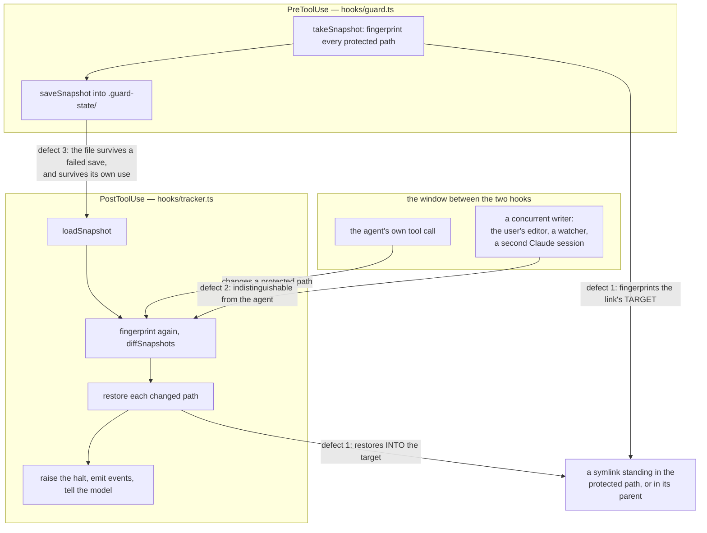
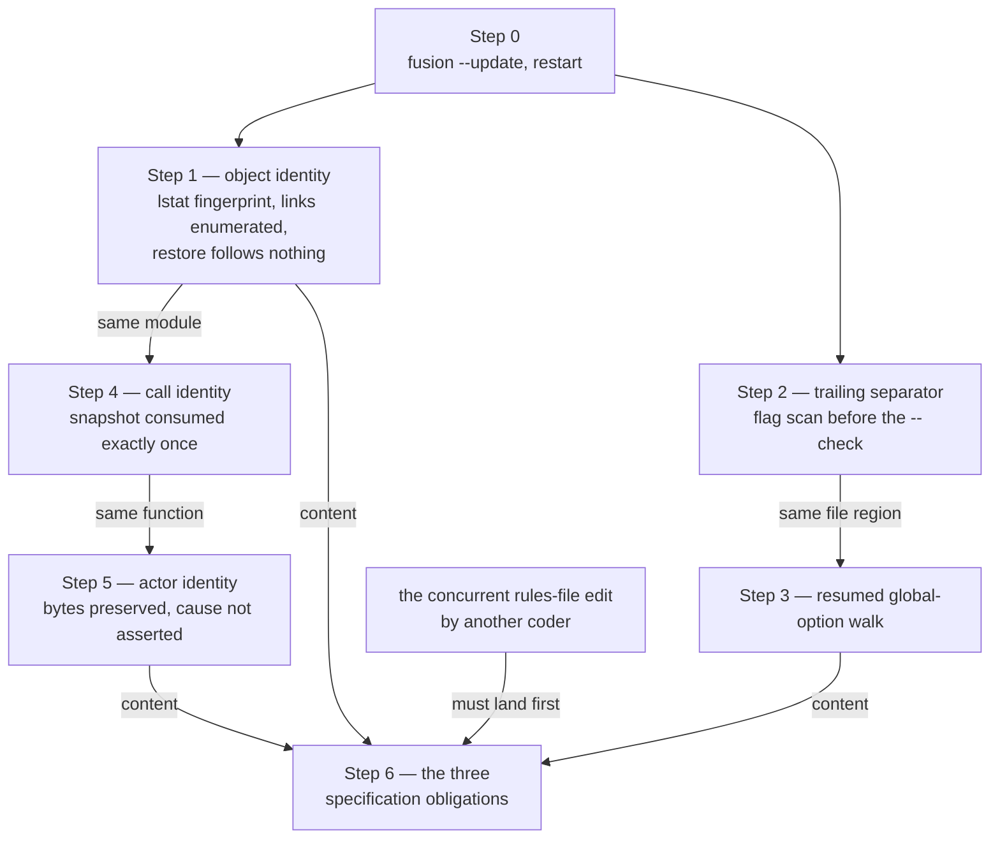

# Implementation Plan: the five severe defects in the fusion compliance guard

**Date:** 2026-08-09
**Status:** Draft
**Spec:** none — planned from a raw request. The grounding is `shared/analyses/260809-1103-guard-enforced-policies.md` (the enforcement layer) and `shared/analyses/260809-1101-guard-support-layer.md` (the support layer and its twelve consolidation targets).
**Decidability:** Two questions carry this plan and they have different answers.

*(1) "Has a protected path changed?"* stays decidable when a symlink can stand in the path's place, but only after the mechanism changes **what it fingerprints**. Today `fingerprint` uses `statSync` and `readFileSync` (`hooks/lib/protected-snapshot.ts:272-273`), both of which resolve the link, so the mechanism already answers a question about the link's *target* — an object the project never protected. Reading the path's own identity instead (`lstat`, plus a fingerprint value for "this is a link, and it points here", alongside `ABSENT` and base64 content) restores decidability from inputs the hook already holds. The same question has to be asked of every component of the path, not only the last one, or the parent directory becomes the same door: see the new defect filed alongside this plan.

*(2) "Did **this agent** change the protected path?"* is **not** decidable for a `Bash` call. The hook's inputs are two fingerprints, the tool name and the tool payload, and none of them separates the agent's shell from the user's editor, a file watcher, or a second Claude session. No re-cut of the case split produces one, so per `rules/critical-stance.md` §4 the mechanism changes rather than being approximated: the guard stops asserting the attribution in the sentence it hands the model, preserves the observed bytes before writing them back so a wrong revert is recoverable, and takes only the narrower question that **is** decidable — for the four write tools, whether a changed path is the one the payload named.

---

## Directive

Close the five severe defects filed against the guard on 2026-08-09, without opening the guard's behaviour anywhere:

| Issue | Severity | One line |
|---|---|---|
| `shared/issues/260809-1104_o_a-symlink-in-place-of-a-protected-file-…` | Critical | One `ln -s` writes an arbitrary file and permanently unwatches a glob-protected path |
| `shared/issues/260809-1105_o_a-trailing-separator-lifts-the-branch-deny-…` | High | `git checkout -b <name> --` is allowed and moves HEAD |
| `shared/issues/260809-1106_o_the-unknown-global-option-fix-was-deleted-…` | High | A High-severity defect closed on 2026-08-04 is live again in the surviving classifier |
| `shared/issues/260809-1107_o_any-writer-active-during-the-tool-call-window-…` | High | A human editor save during a tool call is reverted and halts the session |
| `shared/issues/260809-1108_o_a-failed-snapshot-save-leaves-the-previous-one-…` | High | A stale before-picture reverts a state no measurement objected to |

## Current State

**Baseline, measured rather than taken on trust.** `npm test` in `hooks/` at working tree HEAD `451a07e`: 33 test files, 1030 tests, all passing, 77.4 s wall clock. `npm test` runs `npm run build` first, so every run compiles `hooks/dist/` from the work tree before `vitest`. Every step below is verified against that baseline.

**The integration harness already builds non-fusion project roots.** `hooks/lib/__tests__/helpers/guard-harness.ts` creates a throwaway project outside this repository, seeds its `fusion-guard.json`, and spawns the compiled hooks as real subprocesses. `runToolCall(root, toolName, toolInput, effect)` runs PreToolUse, then `effect`, then PostToolUse, which is the only placement that reproduces what the measurement measures. That harness is the sanctioned verification surface for everything in this plan: the guard's write half stands down inside this repository, so an assertion written here would pass without the mechanism ever running.

**Version skew.** The work tree is at plugin version `6.1.0`; the installed copy under `$FUSION_PLUGIN_ROOT` (`~/.fusion`) is at `6.0.1`. The tests spawn the work-tree build, so they are unaffected. A developer's own live session is not: the hooks that run during the session come from the installed copy and are pinned there for the whole session.

**Where the five defects sit.**

- Defects 1, 2 and 3 are all at the boundary between the fingerprint and the filesystem, in `hooks/lib/protected-snapshot.ts` and `hooks/tracker.ts`.
- Defects 4 and 5 are both in `hooks/lib/git-branch-guard.ts`, in two different functions (`classifyCheckout` and `classifySegment`).

## Approach

### The three defects at the fingerprint boundary are three identity failures, not one

The brief asks, correctly, whether one change closes several of defects 1 to 3. It does not, and the reason is worth stating rather than asserting. The seam between the two hooks has to establish three separate identities, and each defect breaks a different one:

| Identity | The question | Broken by |
|---|---|---|
| Object | Is the thing I fingerprinted the thing the pattern names? | Defect 1 — the link is followed, so the answer is about the target |
| Call | Is this before-picture from *this* tool call? | Defect 3 — a failed save leaves an older picture in place |
| Actor | Was it this agent that changed it? | Defect 2 — the interval is not exclusively the agent's |

No single edit closes all three, and forcing one would be the over-unification `rules/critical-stance.md` §2 warns about from the other side. What **is** one integral change is defect 1 on its own: it looks like three code sites (`enumerateProtected`, `fingerprint`, `restore`) but it is one question asked consistently in three places — *does this path name the object the guard is measuring, or something the path merely points at?* That is Step 1, and it is one step, not three.

### Checking the analysis's Target 3 instead of adopting it

The brief points at Recommendation 3 of `260809-1103` (a snapshot consumed exactly once) as a proposed common solution for defects 2 and 3. Two corrections, both from reading the text and the code:

**The premise does not hold.** Recommendation 3 names `260809-1108` (defect 3), the snapshot left behind by a blocked call, and part of the parallel-call residual at `hooks/tracker.ts:272-280`. It does not name `260809-1107` (defect 2), and it cannot close it: a single-use snapshot changes *when* the measurement runs, never *whose* change it attributes. A human editor saving between two hooks of a legitimately paired call is measured, reverted and halted on exactly as before. Defect 2 needs its own step.

**One half of the proposal should be rejected.** `260809-1108`'s own suggested direction adds a second element: `loadSnapshot` rejects a snapshot older than a small bound. That element must not be built. A legitimate tool-call window has no upper bound — a `Bash` call running this very test suite holds it open for 77 seconds, and a build holds it open for minutes — so any "small bound" turns a legitimate measurement into a silent skip. That is a fail-open introduced by the fix, in a plan whose binding constraint is that no step opens behaviour further. Take the two parts that are sound: consume the snapshot on read, and unlink a stale file when a save fails. `ts` then stays written and unread, and the comment must say so instead of implying a reader.

### Defects 4 and 5: the same character and the same safety property, but no shared code

Both are argument forms the parser does not know, and both are monotone in the safe direction. The invariant they share, and which the code should state once:

> Evidence that HEAD moves is unconditional. No later token withdraws it, and no earlier token may hide it. Every change made under this invariant can only add denies, never remove one.

That is what makes both fixes admissible without a measured no-new-allow campaign on the allow side: the reorder in `classifyCheckout` returns a deny *earlier* and changes nothing else, and the resumed walk in `classifySegment` only ever adds subcommand candidates and directory facts, so the candidate set after the change is a superset of the one before.

They are nonetheless **two steps**, because they share no code: different functions, different remedies, different tests, different acceptance. Merging them would produce one step carrying two unrelated diffs.

**The unifying rewrite was considered and rejected.** One could replace the ad-hoc global-option walk with a real model of git's argument grammar, which would close both defects and the class behind them. It is rejected here on the no-opening constraint: a rewrite changes the allow side as well as the deny side, and the evidence standard that would take is the one `260804-1344` actually met — a generated cross-product of 181,115 commands measured for newly-allowed rows. That harness lived in the mutation classifier's suite and was deleted with it (verified: no such generator survives anywhere under `hooks/`). Rebuilding it is a larger piece of work than these two defects, and it should be proposed on its own merits rather than smuggled in as a bug fix.

### One new defect found while planning, filed separately

Step 1 as the filed issue describes it checks the **final** component of the protected path. It does not close the same primitive one level up: if `hooks/` is replaced by a symlink in a single tool call, `restore` still writes `hooks/config.json` through that link into the attacker's directory, because `mkdirSync(dirname(abs), {recursive: true})` succeeds on an existing symlinked directory and `writeFileSync` follows it. Filed as `shared/issues/260809-1231_o_the-restore-writes-through-a-symlinked-parent-directory-which-the-final-component-check-does-not-cover.md`, and folded into Step 1 rather than deferred, because shipping the final-component fix alone would let `rules/protected-path-discipline.md` re-earn a claim that is still false.

## Implementation Steps

Every step below is assigned to `coder`: all five defects are TypeScript in `hooks/`, and the rule files in Step 6 describe **code** behaviour, which the routing table places with `coder` rather than `ontocoder`.

---

### Step 0 — Update the installed plugin copy, then restart the session

- **Executor:** `coder`
- **Files:** none (environment only)
- **Changes:** Run `fusion --update`, then restart the Claude Code session before touching any guard source.
- **Why this is a step and not a footnote:** the tests spawn the work-tree build, so the *test* verification does not need it. The developer's own session does. `$FUSION_PLUGIN_ROOT` is pinned for the whole session, so with the installed copy at `6.0.1` and the work tree at `6.1.0`, every guard behaviour observed live during this work is the behaviour of code that is one release old. `CLAUDE.md` mandates this before rule or guard work in this repository for exactly that reason.
- **Acceptance criterion:** `grep '"version"' ~/.fusion/.claude-plugin/plugin.json` reports the same version as `.claude-plugin/plugin.json` in the work tree.
- **Test:** none. This is an environment precondition, not a behaviour.
- **Dependencies:** none.

---

### [DONE] Step 1 — Object identity: the fingerprint describes the path, and the restore never writes through a link

- **Executor:** `coder`
- **Closes:** `260809-1104` (Critical) and `260809-1231` (the parent-directory door found while planning)
- **Files:**
  - `hooks/lib/protected-snapshot.ts` — `enumerateProtected`, `fingerprint`, `restore`, and the two header sections that state the symlink boundary
  - `hooks/lib/__tests__/protected-snapshot-integration.test.ts` — new cases
- **Changes:**
  1. **`fingerprint` reads the path, not what it resolves to.** Replace `statSync` with `lstatSync`. The fingerprint domain becomes three disjoint values, and the split is complete by construction because both sentinels carry a `:` and base64 draws on `[A-Za-z0-9+/=]`:
     - `ABSENT` (`"absent:no-such-file"`) — the path does not exist
     - a new `LINK_PREFIX` value, `"symlink:" + readlinkSync(abs)` — the path is a symbolic link, and the fingerprint is its target string
     - base64 content — the path is a regular file
     A regular file that becomes a link therefore reads as `modified`, not as `deleted`, and not as unchanged-because-the-target-happens-to-match.
  2. **`enumerateProtected` stops skipping symbolic-link files.** It keeps skipping symbolic-link **directories**: the cycle argument in the header at `:186-197` still holds and must be restated in the new text rather than deleted.
  3. **`restore` becomes total over the new three-value domain.** `ABSENT` still deletes. A `symlink:` fingerprint recreates the link with `symlinkSync`, because the invariant is "put the path back to what it was", and forcing a legitimately symlinked rule file into a regular file would itself be the data loss this guard exists to prevent. Content still writes bytes.
  4. **The write never follows a link, at any component.** Two parts, and both are needed because they close different doors:
     - *Final component:* `lstatSync` the target; if it is a symbolic link, unlink it before writing, and open with `O_NOFOLLOW` (`constants.O_NOFOLLOW ?? 0`, so Windows degrades to today's behaviour rather than to `NaN`) so a race between the check and the write fails loudly with `ELOOP` instead of writing a stranger's file.
     - *Parent chain:* before writing, compare `realpathSync(dirname(abs))` against `resolve(realpathSync(root), dirname(rel))`. `root` is realpath-resolved on both sides because macOS resolves `/tmp` to `/private/tmp`, which the suite already knows about under the name "the macOS realpath trap". A divergence means some component of the path is a link, so the object the guard is about to write is not the object it measured: **refuse the restore and report the refusal through the existing failure path** (`restore` throws, `restorePath` catches, `describe` says the change is still on disk). Do not write.
  5. **Rewrite the two header sections** so they describe what the code now does. The `## Symlinks are not followed` section at `:189-197` currently states the boundary accurately for enumeration and is silent on the restore, which is the direction that writes.
- **Acceptance criteria:**
  - Replacing a glob-protected file with a symlink is reported as a change, restored to a regular file carrying the previous content, and halts.
  - The symlink's target is not written.
  - The path is present in the watched set on the following tool call, measured through the real hooks.
  - All three hold for a literal (wildcard-free) protected entry as well.
  - A protected path that was legitimately a symlink before the call and was changed is restored **as a symlink to its original target**.
  - Replacing a protected path's **parent directory** with a symlink does not write the target, and the model is told the change is still on disk.
  - A symlinked directory inside a protected tree is still not descended into, and the test states why.
- **The test that is red before and green after:** new cases in `protected-snapshot-integration.test.ts`, all through `runToolCall` with the effect between the two hooks. Anti-vacuity for each: the `victim` file's content is asserted **unchanged**, and at HEAD `451a07e` it carries the protected file's bytes, so none can pass vacuously.
  1. `effect` = `rm rules/x.md; ln -s <root>/victim/target.txt rules/x.md`. Assert: halt raised, `rules/x.md` is a regular file with the original content, `victim/target.txt` untouched.
  2. A second `runToolCall` in the same project. Assert: `rules/x.md` is in the snapshot's key set, and a change to it in that call is measured. (This is the consequence the filed issue calls the one that matters most; without this case the fix is not shown to hold.)
  3. The same pair against a literal entry (`fusion-guard.json`).
  4. `effect` = replace the protected file's parent directory with a symlink. Assert: the target directory's file is unchanged, and the tracker's message reports the restore as failed rather than as done.
  5. A protected path that starts as a symlink, is overwritten with a regular file, and is restored as a symlink to the original target.
- **Dependencies:** Step 0.

---

### [DONE] Step 2 — A trailing separator no longer lifts the branch deny

- **Executor:** `coder`
- **Closes:** `260809-1105` (High)
- **Files:**
  - `hooks/lib/git-branch-guard.ts` — `classifyCheckout`, and the design comment at `:228-239`
  - `hooks/lib/__tests__/git-branch-guard.test.ts`
  - `hooks/lib/__tests__/guard-bash-integration.test.ts`
- **Changes:** Move the branch-creating and detaching flag scan (currently `:249-259`) **above** the separator check (currently `:246`). Rewrite the design comment to state the shared invariant: a `--` separator settles the *ambiguous* form only; a HEAD-moving flag is unconditional evidence that no later token withdraws. Verified by reading that this cannot break fusion's own revert spelling: `git checkout HEAD -- rules/x.md` has args `["HEAD", "--", "rules/x.md"]`, none of which equals `-b`, `-B`, `--detach`, `--orphan` or `-`, so it falls through to the separator check exactly as today.
- **Acceptance criteria:**
  - `git checkout -b foo --`, `-B foo --`, `--detach HEAD --` and `--orphan o --` all deny.
  - `git checkout HEAD -- rules/x.md` still allows — fusion's own revert strategy.
  - `git checkout -- file`, `git checkout <ref> -- file` and `git restore file` still allow.
- **The test that is red before and green after:** in `git-branch-guard.test.ts`, one case per flag combining the flag with a trailing `--`, under a describe block whose name states why the two are not alternatives. In `guard-bash-integration.test.ts`, the `-b` and `-B` rows with the real-git effect asserted in a throwaway repository, matching the shape of the existing "the revert strategy is allowed, and it reverts" block. At HEAD `451a07e` the classifier returns allow for all four, so the cases fail before the change.
- **Do not verify this by hand in this repository.** The branch policy is active here and the defect means the command would succeed, moving fusion's own HEAD. The classifier test and the harness's throwaway repositories are the only sanctioned routes; `rules/git-branch-discipline.md` forbids reaching for the live command.
- **Dependencies:** Step 0.

---

### [DONE] Step 3 — The global-option walk resumes, restoring the fix that was deleted with the mutation classifier

- **Executor:** `coder`
- **Closes:** `260809-1106` (High)
- **Files:**
  - `hooks/lib/git-branch-guard.ts` — the walk at `:179-202` in `classifySegment`
  - `hooks/lib/__tests__/git-branch-guard.test.ts`
  - `hooks/lib/__tests__/guard-bash-integration.test.ts`
- **Changes:** Port the remedy that `260804-1344` settled on, not the first attempt that `260804-1333` closed with. Its closure note states it precisely and the coder should implement that text rather than re-derive it: a bare word is tested against the subcommand table; if it matches no row **and** an unrecognised option stands in front of it, it is that option's separated value and the walk **continues from the next index**, recording `-C` and `--work-tree` as it goes; if it matches no row and no unrecognised option stands in front of it, it is git's real subcommand and the walk stops there — which keeps the walk out of the subcommand's own arguments, where `-C` means something else (`git commit -C HEAD~1` reuses a message).

  The branch classifier's subcommand table has three rows (`switch`, `worktree`, `checkout`) against the mutation classifier's many, so the false-deny surface this creates is strictly smaller here than it was there. That is worth one sentence in the code, because it is the only respect in which the ported fix behaves differently in its new home.
- **Acceptance criteria:**
  - `git --namespace ns switch main` and `git --attr-source HEAD switch t1` both deny.
  - `git --namespace foo -C sub switch main` denies — the `260804-1344` residual, closed by resuming rather than by widening the candidate list.
  - `git diff` and `git commit -m switch` still allow: with no unrecognised option in front, the walk stops at the first non-flag word exactly as it does today.
  - `git --namespace foo -C build status` still allows, so the fix is not a blanket give-up on every invocation carrying an unrecognised option.
  - The **bound** is asserted in the suite rather than claimed in prose, in the wording `260804-1344` settled on: an option taking two separated values, and a second bare word standing between the value and the subcommand, are not closed and not claimed.
  - The cost is stated as a rule with an open example set (a false deny of the shape `git <unknown-option> <non-subcommand> switch`), which Step 6 carries into `rules/git-branch-discipline.md`.
- **The test that is red before and green after:** the three deny rows plus the two allow controls in `git-branch-guard.test.ts`, and the two real-branch-switch rows with the real-git effect asserted in `guard-bash-integration.test.ts`, in both `bash` and `zsh` as that file already does. **One case must name the sibling record `260804-1333` / `260804-1344` in its test name**, which is the filed issue's own acceptance criterion and the only mechanism that would surface a shared fix the next time one of two classifiers is retired.
- **A bounded no-new-allow check, in place of the deleted cross-product.** Add a generated corpus to the classifier suite: the cross-product of {no global option, a known one (`-C d`, `-c k=v`), a valueless unknown one (`--no-pager`, `--literal-pathspecs`), an unknown one with a separated value (`--namespace ns`, `--attr-source HEAD`)} × {`switch main`, `checkout -b f`, `checkout HEAD -- f`, `diff`, `commit -m x`, `status`, `worktree list`}. A few hundred commands, cheap to run. Assert that every verdict that **denied** at HEAD `451a07e` still denies. That is the property the structural argument claims — the candidate set only grows, so each fix can only add denies — and the corpus is what stops it being merely claimed. The implication runs in that one direction only: new denies are expected, and four of them are named in this step's acceptance criteria above.

*(Corrected on 2026-08-09, during Step 4. The sentence read "every command allowed at HEAD `451a07e` is still allowed", which is the opposite implication and contradicts the acceptance criteria it sits under: this step denies more than the baseline did, on purpose. Measured against the shipped corpus (`hooks/lib/__tests__/fixtures/git-corpus-451a07e.json`, 108 commands × 8 verdicts each): 90 verdicts moved from allow to deny, across 24 distinct commands, and 0 moved from deny to allow. The step was implemented and asserted against the property as now stated — see the `no verdict that denied at the baseline allows after the two fixes` block in `hooks/lib/__tests__/git-branch-guard.test.ts`. The acceptance criteria are untouched.)*
- **Dependencies:** Step 2 (same file and same function region; sequencing them avoids two edits racing in `git-branch-guard.ts`).

---

### [DONE] Step 4 — Call identity: a before-picture is consumed exactly once

- **Executor:** `coder`
- **Closes:** `260809-1108` (High)
- **Files:**
  - `hooks/lib/protected-snapshot.ts` — `saveSnapshot`, `loadSnapshot`, and the comment at `:465-468`
  - `hooks/tracker.ts` — `measureProtectedPaths`
  - `hooks/lib/__tests__/protected-snapshot-integration.test.ts`
- **Changes:**
  1. `saveSnapshot`'s `catch` unlinks the snapshot file, best effort (`rmSync(path, { force: true })`). The write that fails is to `${path}.tmp`; without this, the previous `protected-snapshot.json` survives and `loadSnapshot` returns it. Only after this does the existing comment's claim — "the next comparison has no before-picture and skips" — become true.
  2. Introduce `consumeSnapshot()`: load, then unlink. `measureProtectedPaths` calls it in place of `loadSnapshot`. The unlink happens after the object is in memory, so a subsequent failure in the same call does not lose the picture it is already working from.
  3. **Do not add an age bound.** Reasoned in the Approach: a legitimate window is unbounded in length, so any bound is a fail-open for long tool calls. Rewrite the `ts` field's documentation at `:127-128` to say the field is written and not read, instead of naming a reader who does not exist.
  4. Rewrite the header section `## The BEFORE fingerprint is the condition of admissibility` (`:61-69`) so its premise matches what the code can support. Two snapshots around one tool call attribute a change to the **interval**, not to the agent. Step 5 states what follows from that; this step is the place the argument stops being too strong.
- **Acceptance criteria:**
  - A snapshot that cannot be written leaves no snapshot behind, and the following PostToolUse measures nothing.
  - A snapshot is read at most once: a second PostToolUse with no intervening PreToolUse measures nothing.
  - The comment at `:465-468` describes what the code does.
- **The test that is red before and green after:** two cases in `protected-snapshot-integration.test.ts`, both driving the real hooks rather than the module.
  1. Reproduce the filed issue's own measurement: place a directory at `protected-snapshot.json.tmp` so the save fails in isolation while the rest of `.guard-state/` stays writable; change the protected file between calls; assert the next call reverts nothing and raises no halt. At HEAD `451a07e` it reverts to the two-calls-ago state and halts.
  2. Run `runGuard`, then `runTracker` twice. Assert the second tracker measures nothing.
- **Dependencies:** Step 1 (both touch `protected-snapshot.ts`; Step 1 rewrites `fingerprint` and `restore`, this step rewrites the persistence pair, and sequencing keeps the two rewrites out of each other's way).

---

### [DONE] Step 5 — Actor identity: preserve the bytes, and stop asserting a cause the hook cannot know

- **Executor:** `coder`
- **Closes:** `260809-1107` (High), for its code half. Its specification half is Step 6.
- **Files:**
  - `hooks/tracker.ts` — `measureProtectedPaths`, `describe`, and the sentence returned to the model
  - a new `hooks/lib/reverted-copy.ts` (or an equivalent home) for the preservation writer
  - `hooks/lib/__tests__/protected-snapshot-integration.test.ts`
- **Changes:**
  1. **Preserve the observed bytes before the revert.** Before `restore` runs, write the content the path actually carried into `fusion-workbench/.guard-state/reverted/<ISO-timestamp>-<flattened-path>`. Name that file in the sentence the model receives and in the `guard_block` event detail. A revert that is recoverable is a different failure from one that is not.
  2. **Bound the retention.** Keep the most recent 20 preserved copies and delete older ones on each write. `events.jsonl` is already an unbounded writer with an open issue against it (`circles/260801-1244-guard-rules-write/issues/260805-1859_o`); this fix must not add a second one.
  3. **Take the root as a parameter.** The new writer receives the already-resolved root rather than walking up for itself. This is the shape support-analysis target C4 asks for, and writing it that way now means C4 does not have to come back for it.
  4. **The message stops asserting the agent did it.** `describe` currently says a path "was modified and has been restored to its content from before this tool call". "Before this tool call" is accurate and stays; the framing that the *agent* caused it does not. The replacement states what was measured, names the preserved copy, and says plainly that a concurrent writer is one of the possible causes.
  5. **Take the one distinction that is decidable, and only in the message.** For the four write tools the payload names the target path (`extractFilePath` already exists at `hooks/tracker.ts:115`). A changed protected path *other* than that one is evidence of a writer that is not this tool call. Say so in the sentence. **Do not change what is reverted or halted on.** Not reverting such a path would open behaviour — an agent's `Edit` of A that also changed protected B would go unreverted — and the constraint on this plan forbids that. Narrowing the revert itself is a user decision, recorded in Open Questions below.

     *(Overruled at the plan gate on 2026-08-09, before this step was implemented. The user took the Open Question below rather than this recommendation: `shared/decisions/260809-1527_*_should-the-revert-narrow-to-the-payload-path-for-the-four-write-tools.md`, option 2. The **revert** narrows as well as the message, for `Write`, `Edit`, `MultiEdit` and `NotebookEdit` only; `Bash` keeps the full revert of every changed protected path, because the narrowing rests on the payload naming the target and a shell command's text names nothing of the kind. A spared path is still preserved, still described, still emitted as its own `guard_block`, and still raises the halt. The four implementation obligations in that record are what this step was built and tested against; the other four points of this step are unchanged. Sentence three above — "an agent's `Edit` of A that also changed protected B" — is the exposure the decision accepted, and the decision's own reasoning is that it has no mechanism behind it: an `Edit` has no second write.)*
- **Acceptance criteria:**
  - A reverted path's observed content is preserved under `.guard-state/` and named in the message the model receives and in the `guard_block` event.
  - The message no longer asserts the change was made by this tool call when the hook cannot know that.
  - For a write-tool call, a changed protected path other than the payload's path is described as such.
  - No more than 20 preserved copies accumulate.
  - The revert and the halt fire exactly as they do today. Nothing is newly allowed.
- **The test that is red before and green after:** in `protected-snapshot-integration.test.ts`:
  1. The filed issue's own measured sequence — `runGuard`, a write from outside the tool call (the harness's `effect` is exactly a concurrent writer as far as the hooks can tell), `runTracker`. Assert the preserved copy exists and carries the observed content, that the message names it, and that the revert and halt still happen. At HEAD `451a07e` no preserved copy exists.
  2. A write-tool call whose payload names path A while path B changes. Assert the message distinguishes them.
  3. A retention case: 25 reverts, 20 files left.
- **Dependencies:** Step 4 (same function; Step 4 settles the snapshot lifecycle first so this step edits a `measureProtectedPaths` whose persistence half is already final).

---

### [DONE] Step 6 — The three specification obligations, in one edit

- **Executor:** `coder`
- **Files:** `rules/protected-path-discipline.md`, `rules/git-branch-discipline.md`
- **Changes:** Three rule-text obligations that belong to Steps 1, 3 and 5 and are bundled here on purpose:
  1. **From Step 1:** `rules/protected-path-discipline.md:21` says the rule "carries no catalogue of holes". Re-earn the claim or qualify it. After Steps 1 and 4 the claim is defensible again for the symlink class; the sentence should name what the measurement does and does not decide rather than assert the absence of holes in general.
  2. **From Step 5:** add the **third price** to `rules/protected-path-discipline.md`, alongside "the change happens before it is seen" and "a read is not a change". The window is the full duration of the tool call, any writer active in it is measured, and the reverted bytes are preserved at a named location. Include the measured example from `260809-1107`. This is the half that discharges the agent-facing obligation on its own: an agent that meets an unexplained revert works around it, which is the failure the rule exists to prevent.
  3. **From Step 3:** state the cost of the resumed walk in `rules/git-branch-discipline.md` as a rule with an open example set, matching the wording `260804-1333` settled on. Also correct `:45`, which tells the agent not to rephrase a denied command on the strength of a guarantee that Step 2 has only now made true.
- **Why these are one step and why it comes last:** a `coder` is editing one paragraph in each of these two files in parallel with this plan. Three separate rule edits scattered across Steps 1, 3 and 5 would collide with that work three times. One edit, after the concurrent work has landed, collides at most once.
- **Acceptance criteria:**
  - Each of the three obligations is present, and each names the issue it discharges.
  - No sentence in either file states a guarantee that the code does not hold after Steps 1 to 5.
  - `provenance-header-lint` and the rest of the suite stay green.
- **Test:** the existing lint tests over `rules/` (`provenance-header-lint.test.ts`, `reference-resolution-lint.test.ts`, `marker-format-lint.test.ts`). No new behavioural test; the deliverable is text.
- **Dependencies:** Steps 1, 3 and 5 for content; the concurrent rules-file edit for timing. **The five issues stay `_o_` until this step lands** — three of them carry an acceptance criterion that only this step satisfies.

---

**Why the critical defect is first, and where the ordering deviates.** Step 1 closes the Critical issue and has no technical dependency other than the environment precondition, so it leads. The one deviation is that Steps 2 and 3 sit between Step 1 and Step 4 in wall-clock terms if the coder works strictly in order: they are in a different file, they are the cheapest two of the five, and each closes a High-severity silent pass in the policy that the analysis calls the weaker half. Nothing about them blocks or is blocked by the fingerprint track, so a second worker could take them in parallel.

## Data Structures

One changed type and one new file layout.

**`fingerprint`'s return domain grows from two values to three** (Step 1). It stays a plain `string`, so `ProtectedSnapshot.paths` and `ProtectedChange.before` need no type change. The domain:

| Value | Meaning | Restore action |
|---|---|---|
| `"absent:no-such-file"` (`ABSENT`) | The path does not exist | Delete |
| `"symlink:<target>"` (new) | The path is a symbolic link | Recreate the link |
| base64 | The path is a regular file | Write the bytes |

Disjoint because both sentinels contain `:` and base64 does not; complete because `lstat` returns exactly one of "no such file", "is a symlink", "is a regular file", with directories and other node types folding into `ABSENT` as they do today.

**The preserved-copy directory** (Step 5): `fusion-workbench/.guard-state/reverted/<ISO-timestamp>-<path with separators flattened>`. Flat, no index file, retention by count.

## API Changes

Internal to `hooks/`; no external surface changes.

- `hooks/lib/protected-snapshot.ts` exports a new `consumeSnapshot()`. `loadSnapshot` stays exported for tests, and the one production caller moves to `consumeSnapshot`.
- A new module exporting a single preservation writer that takes `(root, relPath, observedContent)`.
- `restore` gains no parameters. Its refusal to write through a link is expressed through the exception it already throws, which `restorePath` already catches and `describe` already turns into a sentence.

## Testing Strategy

**Every verification runs against a project root that is not this repository.** The guard's write half stands down here by design, so an assertion written naively in this tree passes without the mechanism running. `guard-harness.ts` already spawns throwaway roots outside the repository and drives the compiled hooks as subprocesses; every new integration case uses it.

**Every step carries a case that is red at HEAD `451a07e` and green after.** This is not a formality for Step 3 in particular: its predecessor `260804-1333` was closed with a working fix and lost anyway, because the fix lived in a module that was deleted and nothing tested the surviving copy. The test named after the sibling record is the mechanism that would catch that recurrence.

**Anti-vacuity is asserted, not assumed.** For each new case, name the mutation that must break it:

| Step | The mutation that must fail the new tests | And must **not** fail |
|---|---|---|
| 1 | Reverting `fingerprint` to `statSync` | the existing content/binary/absent cases |
| 1 | Removing the parent-chain `realpath` comparison | the ordinary revert cases |
| 2 | Restoring the original order in `classifyCheckout` | `git checkout HEAD -- rules/x.md` |
| 3 | Reverting the resumption to the two-adjacent-candidate form | `git --namespace foo -C build status` |
| 4 | Removing the unlink from the failed-save `catch` | the ordinary paired-call cases |
| 5 | Removing the preservation write | the revert and halt assertions |

**The suite as a whole.** `npm test` in `hooks/` after each step: 33 files and 1030 tests as the floor, both counts rising as cases are added, zero failures, and no existing test edited except for import paths. An existing test that has to change to accommodate a fix is a signal that the fix moved behaviour beyond what was planned; it is a stop-and-report condition, not a thing to fix by editing the test.

**Real-shell effects for the git steps.** `guard-bash-integration.test.ts` already asserts real-git effects in `bash` and `zsh` against throwaway repositories. Steps 2 and 3 add rows there. No git command from this plan is ever run by hand in this repository: the branch policy is live here and defects 4 and 5 mean the commands would succeed.

## Coupling to the consolidation round

`shared/analyses/260809-1101-guard-support-layer.md` proposes six targets (C1 to C6) and `260809-1103` proposes six more (1 to 6), all to run later. Where this plan touches them:

| Consolidation target | Relationship to this plan | What the later round must do |
|---|---|---|
| `1103` Target 3 — single-use snapshot | **Step 4 *is* this target**, minus the age bound the target's issue also suggested. The analysis itself places it "with the defect work rather than the cleanup". | Strike it from the cleanup list. Do not re-add the age bound; the reason is in the Approach. |
| `1101` C2 — one state-file helper for the read-coerce-write triple | Step 5 adds a **fifth** call site of that pattern (the preserved-copy writer). | Absorb the new writer along with the four the target names. Its line count grows by roughly one call site. |
| `1101` C4 — thread one resolved root through the state modules | Step 5 **anticipates** it: the new writer takes the root as a parameter rather than walking up. | One fewer call site to convert. Do not "simplify" it back to an internal `findWorkbenchRoot()` call. |
| `1103` Target 5 — retire the archaeology, keep the rejections | Steps 2 and 3 **add** rationale comments to `git-branch-guard.ts`, in the same file whose header `:47-63` the target wants trimmed. | The new comments record *why the current order and the resumed walk are right*, which is rejection knowledge and must survive. Trim only the descriptions of the vanished mutation classifier. |
| `1103` Target 6 — fold `command-word.ts` into `git-branch-guard.ts` | No conflict: Step 3 changes `classifySegment`, which already lives in `git-branch-guard.ts`. | Run it **after** Step 3, so a move of security-relevant code does not happen mid-fix. |
| `1103` Target 1 — delete the placeholder machinery in `shell-parse.ts` | Independent. `classifySegment` calls `resolveInvocation(tokenize(segment), NO_LITERALS)` and Step 3 does not touch that call. | Nothing. |
| `1101` C6 / `1103` Target 4 — move `isEnvFlagSet` out of the branch module | Independent. | Nothing. |
| `1101` C5 — decide the fate of the decision-governed check | Independent; already a decision record, `shared/decisions/260809-1224_o_is-the-decision-governed-escalation-check-3-a-live-feature.md`. | Nothing. |

## Risks & Mitigations

| Risk | Mitigation |
|---|---|
| A coder verifies defect 4 by typing `git checkout -b foo --` in this repository. The defect means it succeeds, and fusion's own HEAD moves. | Stated in Step 2 as a prohibition with the reason. Verification runs through the classifier test and the harness's throwaway repositories only. |
| Step 1's parent-chain check refuses a restore in a project that legitimately symlinks a rule directory, turning a working guard into one that reports failures. | The refusal is loud, not silent: the model is told the change is still on disk. The behaviour is a **narrowing**, which the constraint permits, and a project that hits it has a real ambiguity to resolve. Named in Open Questions so the user can weigh it. |
| Step 5's preserved copies live in `.guard-state/`, which an agent can delete, so the recovery they offer is not tamper-proof. | Stated plainly rather than papered over. The general form of the exposure is the open decision `circles/260807-0923-guard-misst-statt-orakelt/decisions/260807-0945_o_integritaet-des-eskalationsspeichers.md`, which this plan does not attempt to answer. The copies protect against accident, which is the case defect 2 actually describes. |
| The rules-file edits in Step 6 collide with the concurrent `coder` working in the same two files. | One bundled edit, scheduled last, after that work lands. The plan does not touch either file before then. |
| A step is verified live in a session running the installed `6.0.1` hooks and appears not to work. | Step 0, with the reason stated: `$FUSION_PLUGIN_ROOT` is pinned for the session. |
| Step 3's resumed walk introduces a false deny nobody expected. | The stated cost carries over from `260804-1333` unchanged in kind, and the bounded corpus in Step 3 measures the allow side rather than reasoning about it. |
| The five issues are marked closed after their code steps, while three of them carry an acceptance criterion only Step 6 satisfies. | Step 6 states it: the issues stay `_o_` until it lands. |

## Open Questions

- [x] **Should the revert itself narrow for the four write tools, not only the message?** **Answered at the gate on 2026-08-09: yes, option 2** — `shared/decisions/260809-1527_*_should-the-revert-narrow-to-the-payload-path-for-the-four-write-tools.md`. `Bash` is untouched and keeps the full revert. Implemented in Step 5, against that record's four obligations.
- [ ] **Does the parent-chain refusal in Step 1 break a legitimate project layout?** A project that symlinks `rules/` to a shared directory would see every restore refuse. Measurable: no such layout is visible from this tree. If one is expected, the alternative is to compare against the *previously observed* resolved parent rather than against the lexical one, which is a larger change.
- [x] **Retention for the preserved copies: 20 files, or an age bound, or both?** **Taken as the count, and only the count** — `RETAINED_COPIES = 20` in `hooks/lib/reverted-copy.ts`, pruned on every write. No age bound was added: an age bound expires the evidence exactly when a long session finally goes looking for it, which is the same shape of argument that kept an age bound off the snapshot in Step 4. Cheap to revisit; the constant is exported and the suite asserts the bound through it rather than restating the number.
- [ ] **Does the deleted cross-product harness deserve rebuilding?** `260804-1344` measured 181,115 commands for newly-allowed rows, and that instrument went with the mutation classifier. Step 3 substitutes a few-hundred-command corpus, which is proportionate to a two-line change and would not be proportionate to the grammar rewrite rejected in the Approach. If that rewrite is ever taken up, the harness is its precondition.
