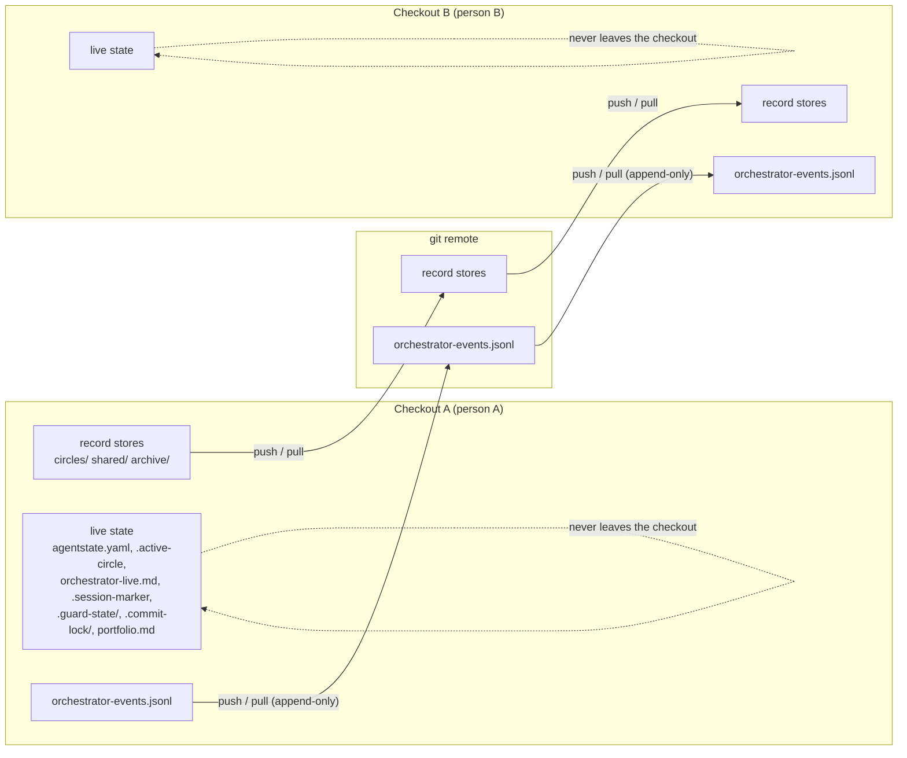
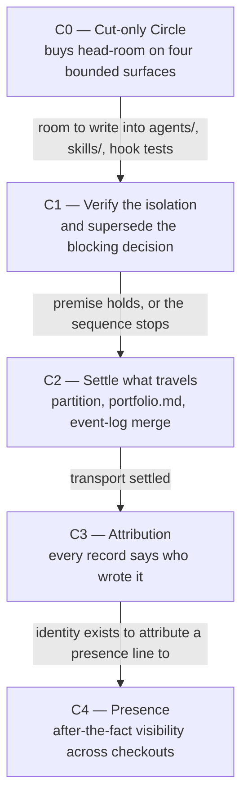

# Spec: fusion becomes a multi-user tool

**Date:** 2026-08-22
**Status:** Partially Complete
**Source:** "wir bauen fusion jetzt zu einem multiuser tool um. [...] Die blockierende Decision (nur ein aktiver Orchestrator) wird aufgehoben und reframed, so dass wir mehere User auf einer workbench arbeiten lassen können, bzw. ev. auch mehrere Instanzen auf einer Maschine. Workbench- und Zustandsdaten, die jetzt gitignored sind, müssen daher ins repo." Three shaping rounds, eight answers from the user, recorded in `shared/history/260822-1009-orchestrator-session.md`.
**Decidability:** The load-bearing question is whether a workbench record can be attributed to the person and to the session that produced it, from inputs fusion already holds. The person is decidable and needs no new input: `/fusion:memo` reads `$USER` from the environment today (`skills/memo/SKILL.md:38`), and every agent can do the same. The session is decidable for the hooks and not for the agent. Claude Code passes `session_id` to PreToolUse and PostToolUse, fusion declares it at `hooks/guard.ts:84` and `hooks/tracker.ts:132`, and nothing reads it; no agent ever receives it. Whether an agent could obtain it rests on one measurement nobody has taken, namely whether the SessionStart input package carries the field and whether a hook can relay it to the model as `additionalContext`. **No capability in this spec depends on that measurement**, because attribution in records is by person, the session identifier appears only in the event log the hooks write, and nothing here walks from a record back to a session. C4 states the measurement as its own first step and names what happens if it fails.

## Directive

After this work, several people run fusion against one project at the same time, each from their own checkout, and their records reach each other through git. Every record says who wrote it. A person can see, after a pull, that somebody else has been working and on which Circle. No live state is shared between checkouts, and no session ever reads another session's queue, dashboard or running task.

## What the user settled, and what it rules out

Eight answers, three rounds. They are load-bearing for every capability below and are not re-opened here.

| # | Question | Answer | Given up |
|---|---|---|---|
| 1 | Arrangement | Several checkouts, git as transport | Live presence. Two people see each other only after a push and a pull. |
| 2 | Guarantee under two sessions | True parallelism | A small change. The user accepted a rebuild. |
| 3 | Identity | Full attribution on records | Cheapness. Record templates change. |
| 4 | Visibility of another's work | Presence only | Insight into progress. Queue, running task and dashboard stay private. |
| 5 | What travels over git | The existing event log alone | Every currently ignored file stays ignored. Accepted as final, not deferred. |
| 6 | `portfolio.md` | Stop tracking it, regenerate on demand | A person who has not pulled sees an older ranking, with nothing to warn them. |
| 7 | Head-room on the bounded surfaces | A cut-only Circle runs first | A whole Circle in front of the work that was asked for. |
| 8 | Attribution unit | Person in the record, session only in the event log | Two conditions attached, carried in C3 below. |

**Answer 5 is the answer that shapes everything else.** The opening request asked for the ignored workbench state to move into the repository. Answers 1, 4 and 5 together retire that requirement rather than fulfilling it: presence has to travel, and `agentstate.yaml`, `orchestrator-live.md` and the work queue do not. What travels is the record layer, which already travels, plus one line per session in a log that is already tracked and already append-only.

## The transport

## The state partition

The split below ranges over **every entry of the workbench layout tree** in `rules/fusion-workbench-conventions.md` `## fusion-workbench Layout`, which that document states is exhaustive as written. Every entry falls in exactly one class, and no entry falls in none. That property is the thing to check when the layout gains an entry: a new root-anchored surface lands in one of these four classes in the same commit that creates it.

| Class | Entries | Behaviour under several checkouts |
|---|---|---|
| **R1. Travels. Many files, one writer each.** | `circles/`, `shared/`, `archive/`, `stilwerk/`, and where a workbench still holds them the two frozen stores `stashes/` and `.migration-v2-backup/` | Two people collide only on one file. A record filename carries a minute stamp and a slug, so two new records collide by accident almost never. Two people editing the *same* existing record is the real case, and C3 addresses the one instance of it that matters, the Circle record. |
| **R2. Travels. One file, appended by many.** | `orchestrator-events.jsonl` | The only file in the whole workbench that two checkouts both write and git must merge. Every merge question in this rebuild is a question about this one file. |
| **R3. Travels. Written once or rewritten per item.** | `.fusion-setup`, `.asset-provenance` | Written by `/fusion:setup` in each checkout. Both are already tracked and already tolerate a second writer, because a second setup writes the same kind of line about the same assets. |
| **L. Stays in the checkout. Never travels.** | `agentstate.yaml`, `orchestrator-live.md`, `.session-marker`, `.active-circle`, `.guard-state/` apart from its event log, `.commit-lock/`, `monitor`, and after C2 also `portfolio.md` | Per checkout by construction, because git never carries it. This is what makes two sessions in two checkouts independent without any lock. |

Two entries need their own line, because the directory is the wrong unit for them.

- **`.guard-state/` is split per file.** Its throttle records are rewritten in place and are live state (class L). Its `events.jsonl` is append-only evidence and is a record, which `rules/workbench-tracking.md` classifies as such. In this repository it is not tracked; what preserves it is the archive roll of `/fusion:cleanup`, which commits a dated copy into `archive/`, class R1. So the guard's evidence travels as an archived file and never as a live one. No change is needed for multi-user, and the spec states the classification so the next reader does not have to re-derive it.
- **`portfolio.md` moves from R1 to L**, and that move is the whole of answer 6. It is the only entry whose class this spec changes.

**What the partition buys.** After C2 there is exactly one file in class R2, and it is append-only. Everything else either has one writer per file or never leaves the machine it was written on. The multi-writer risk of the whole design is therefore one file wide, which is what makes the rebuild small enough to specify.

## The Circle sequence

**Why C0 is its own Circle and is not absorbed.** The user's answer to the head-room question chose "a cut-only Circle runs first, and the rebuild starts against the room it produces" (`shared/decisions/260822-1102_*_what-happens-when-a-planned-circles-required-work-exceeds-the-remaining-head-room.md`). Absorbing the cut into the first rebuild Circle would give that Circle two Directives, one of which is a reduction and one of which is a feature, and it would let the reduction be traded against the feature at the same gate. The instrument the cut protects exists precisely to make that trade visible, so a Circle that contains both sides of it cannot report on it honestly. The cut also has a test of its own that has nothing to do with multi-user work, which is the second reason it is a Circle rather than a step.

**Why C1 comes before anything is built.** The arrangement the user chose is the option the superseded decision could not take, because it rested on a fact nobody has ever verified: that N checkouts really produce N isolated workbenches rather than sharing one at a common parent. If that fact does not hold, C2 through C4 are all wrong, and they are wrong in a way no amount of care inside them would reveal. C1 is the cheapest possible refutation of the whole sequence, so it runs when refuting is still cheap.

**What happened to the sequence (appended 260824).** C0 ran as a plan in `shared/` with no Circle directory and no Circle record, so its closure had nothing to transition; C1 to C3 have their own Circles under `circles/` and closed as Circles (`shared/issues/260822-1556_*_the-spec-names-five-circles-and-the-workbench-holds-none-of-them-so-c0-closed-with-nothing-to-transition.md`).

## Capabilities

### C0: The four bounded surfaces have room again

**Description:** Somebody can add a paragraph to a skill body or a test case to the hook suite without the test suite going red on a growth bound. Today they cannot, on three of the four surfaces.

**Head-room measured at HEAD on 2026-08-22**, by summing each surface's baseline map in `hooks/lib/__tests__/surface-growth-bound.test.ts` and `hooks/lib/__tests__/rules-emission-golden.test.ts` against the tree:

| Surface | Baseline floor | Now | Remaining |
|---|---|---|---|
| Always-on rule core | 86 573 bytes | 95 064 | 3 509 bytes |
| `agents/*.md` | 399 843 bytes | 416 205 | 1 638 bytes |
| `skills/*/SKILL.md` | 220 439 bytes | 240 409 | 30 bytes |
| Hook test suite | 17 875 lines | 20 363 | 12 lines |

**The test the user set, enumerated.** The answered decision names "the four defects already open against `skills/setup/SKILL.md` and the hook tests" and does not list them. These four are the ones whose own text names the bound as the reason they are unfixed, so they are the enumeration this spec adopts:

1. `circles/260820-2051-style-rules-arrive-and-get-measured/issues/260821-0302_*_step-0es-repair-guards-one-of-its-three-blocks-and-its-done-report-omits-the-outcome-that-guard-emits.md` (both parts of its fix add text to `skills/setup/SKILL.md`, roughly 160 bytes against 30)
2. `shared/issues/260822-0946_*_the-v10-5-release-note-reaches-the-readme-and-not-fusion-help-because-the-skills-bound-has-30-bytes.md` (one upgrade paragraph in `skills/help/SKILL.md`, 600 to 1 100 bytes)
3. `circles/260820-2051-style-rules-arrive-and-get-measured/issues/260821-0144_*_the-authoritative-prose-metric-has-no-test-and-the-hook-test-surface-has-43-of-2500-lines-left.md` (a test file for `bin/fusion-prose-metric`)
4. `circles/260821-1042-reply-bounded-whole-question-answered/issues/260821-2204_*_a-growth-bound-lost-half-its-head-room-against-a-stated-stopping-criterion-and-the-finding-lives-only-in-a-history-log.md` (a stopping criterion that cannot be met as written)

**Acceptance criteria:**
- [x] Each of the four defects above is fixed, and `cd hooks && npm test` exits 0 after each fix.
- [x] After the four fixes, `skills/*/SKILL.md` has at least 3 000 bytes of head-room and the hook test suite at least 300 lines, measured by the same summation the bound performs.
- [x] `agents/*.md` has at least 12 000 bytes of head-room, which is what C3 and C4 need to write into the agent prompts.
- [x] No baseline map is edited. The three maps in `hooks/lib/__tests__/surface-growth-bound.test.ts` and the map in `hooks/lib/__tests__/rules-emission-golden.test.ts` are byte-identical before and after this Circle, except where a re-baseline follows an actual cut and the cut is named in the same commit, which is event 1 of `## Re-baselining` in `hooks/lib/__tests__/helpers/growth-bound.ts`.
- [x] The Circle's closure note states, per surface, what was cut and what the head-room measured before and after. *(Ticked 260825-1241 with the deviation stated: C0 had no Circle and therefore no closure note, which `## The Circle sequence` now records at `:94`. The content this criterion asks for is on disk in full at `shared/history/260822-1540-coder-c0-step-9-closure-measurement.md` `## The four surfaces`, a section per surface naming what was cut and the head-room before and after.)*

**Decisions made:**
- Cut-only Circle rather than paying per step or declaring a third re-baselining moment (user, at the gate on 2026-08-22).
- The four defects are enumerated here rather than in the decision record, because the record is answered and is not edited to add them.

**Open for planner:** which text is cut, and from which of the four surfaces. The largest single item on `agents/*.md` is `orchestrator.md` at 150 807 bytes, which is 36 per cent of that surface; the surface-bound file's own arming note says nothing asks for it to be cut, so a planner proposing that cut is proposing something new and should say so.

### C1: The isolation the whole arrangement rests on is verified, and the blocking decision is superseded

**Description:** Somebody can read a report that says, from measurement rather than from reasoning, what two checkouts of one project share and what they do not. The standing decision that fusion does not support concurrency is then replaced by a decision that says what it does support.

**Acceptance criteria:**
- [x] A report exists that measures, for at least two arrangements, which workbench entries are shared and which are per tree. The two arrangements are a second full clone, and a `git worktree` of the same repository. For each, the report states for every entry of the state-partition table above whether the second tree got its own copy, the first tree's copy, or nothing at all.
- [x] The report states what a fresh clone of a project that tracks its workbench holds and what it lacks, and what an agent does in that tree before `/fusion:setup` has run there.
- [x] The report states what happens when the second tree is created **inside** a directory that already holds a workbench, because `bin/fusion-workbench-root` walks upward from the working directory and will find the parent's marker. This is the failure mode the superseded decision named and nobody measured.
- [x] The report states whether two trees of one repository can hold the same Circle active at once, and what git does when both push a changed Circle record.
- [x] `shared/decisions/260719-2141_*_concurrency-worktree-slots-vs-single-active-circle.md` gains a `Superseded by:` line citing a new record, and is renamed from answered (`_a_`) to superseded (`_s_`). The new record states the arrangement this spec settles and is filed in the same Circle.
- [x] The new record states in its own words what survives of the superseded one. The sentence that binds it is the superseded record's own: nothing in fusion may assume two orchestrators can run safely against one workbench. That sentence is **not** overturned. It is satisfied by the arrangement, because two orchestrators never run against one workbench: they run against two.
- [ ] If the measurement shows that two checkouts do **not** get isolated workbench state in a case the user intends to use, the Circle stops and reports, and C2 through C4 do not start. That outcome is a valid closure of this Circle and is worth more than the sequence it stops. *(condition did not arise: the measurement showed isolation holds for both arrangements, so the branch never opened; decision `circles/260826-1613-cardinality-answered-cut-once-nineteen-cleared/decisions/260827-1756_*_how-does-a-checkbox-criterion-say-that-its-condition-never-arose.md`)*

**Decisions made:**
- The supersession is written after the spec is agreed and not before, because the reframed decision's answer is what the spec settles (user, round 1 sequencing).
- The verification is a step of the work rather than an assumption carried into it (user, answer 1, and the superseded record's own stated condition).

**Open for planner:** whether the measurement is an analyst pass over a scratch project or an executable check that ships. An analyst pass is enough to unblock C2. A shipped check is a new surface with a new budget and is not required by anything in this spec.

### C2: What travels is settled, and `portfolio.md` stops travelling

**Description:** A person reading `.gitignore` and `rules/workbench-tracking.md` can see which workbench entries git carries between checkouts and which it does not, and the two agree with each other and with the tree. `portfolio.md` is no longer one of them: it is regenerated on demand by `/fusion:next`.

**Acceptance criteria:**
- [x] `rules/workbench-tracking.md` carries the four-class partition above, ranging over every entry of the layout tree, and states that a multi-checkout arrangement requires the project to track its workbench. That rule is emitted to no agent, so its bytes fall on no bounded surface.
- [x] `rules/workbench-tracking.md` no longer calls `portfolio.md` "authored text, not machine-refreshed". The playmaker regenerates it in full on every run, which is the defect already filed as `shared/issues/260816-1049_*_the-split-calls-portfolio-md-not-machine-refreshed-and-the-playmaker-regenerates-it-in-full.md`. That defect is closed by this Circle.
- [x] `fusion-workbench/portfolio.md` is removed from git tracking with `git rm --cached`, and an ignore rule is added. The file itself is not deleted from anybody's working tree.
- [x] The `KEPT:` comment in `.gitignore` lists exactly the tracked root entries and matches the rule it cites. That closes `shared/issues/260822-1028_*_the-gitignore-kept-list-names-three-tracked-records-and-the-rule-it-cites-names-four.md`.
- [x] `/fusion:next` states, in the briefing it renders, when the portfolio was generated and that it reflects only what this checkout has pulled. The user accepted that a person who has not pulled sees an older ranking; the timestamp is what lets them notice.
- [x] The behaviour of `orchestrator-events.jsonl` under a git merge is decided and implemented, per the open decision `shared/decisions/260822-1136_*_how-does-the-tracked-event-log-behave-when-two-checkouts-both-appended-to-it.md`. The Circle does not close with that question open, because it is the only file in class R2 and every later capability writes to it.
- [x] A person can produce two checkouts, run a session in each, push both, and pull each into the other, and the event log in both trees then holds every line from both sessions with no line lost and no hand editing.

**Decisions made:**
- `portfolio.md` stops travelling and is regenerated on demand (user, answer 6).
- No currently ignored file becomes tracked (user, answer 5, stated as final rather than deferred).

**Open for planner:** how the event log's merge behaviour is realised once the decision above is answered, and whether anything has to change in `bin/monitor`, which reads the log for the dashboard.

### C3: Every record says who wrote it, and a Circle says who is running it

**Description:** A person reading any record in the workbench can see which person produced it, not only which agent. A person about to activate a Circle can see whether somebody else has already claimed it.

**The two conditions the user attached to answer 8**, both binding on this capability:

1. **The identifier goes in the record body and never in the filename.** A dead field in a body is a historical note; a dead component of a filename is a reference that designates nothing, and filenames are citation targets that a lint resolves. This spec applies the condition to the person as well as to the session, and therefore **changes no filename pattern anywhere**. The memo store is the one place a person already appears in a filename (`memos-<username>.md`), and it stays exactly as it is. Round 1's "filing paths change" is narrowed by this to "record templates change", and the narrowing is stated here so the user can refuse it.
2. **The record-to-session join is weak and is not made load-bearing.** Filenames carry minute resolution, and two sessions of one person can write inside one minute. This spec therefore states plainly that no capability walks from a record to a session. The record carries the person, which is what attribution was asked for. The session appears only in the event log, which the hooks write. If the join is ever needed, it arrives as a body field under condition 1, and it is not needed by anything specified here.

**Acceptance criteria:**
- [x] The decision-record template in `rules/fusion-workbench-conventions.md` `## Decision Record Template` carries the person alongside the agent in its `**Filed by:**` field, and the template states the form.
- [x] The defect-record format and the Circle-record template in `rules/circle-records.md` carry the same field in the same form. One form, three record kinds.
- [ ] Every agent that files a record writes the field. The value is read from the environment the way `/fusion:memo` reads it today, which is `$USER`. No second identity mechanism is introduced, because a mechanism that duplicates one already in the system is a defect rather than a solution. *(Two halves, and they fail differently — see the 260825-1241 entry in `## Reconciliation Log`. The second half is **stale**, overridden by `shared/decisions/260822-1136_*_which-identity-does-an-attributed-record-carry-when-the-transport-is-git.md`, which the user answered on 260824 against the option set: attribution is the git identity, read from `bin/fusion-identity`. The first half is **unmet on disk**: 28 of the 63 records filed since the obligation landed carry `**Filed by:**` with no person half and no stated reason for its absence, filed as `shared/issues/260825-1250_*_twenty-eight-records-filed-since-the-attribution-rule-landed-carry-no-person-half-and-no-stated-reason.md`.)*
- [x] The Circle record gains a claim field that says which person holds the Circle active and from which checkout. It is written when the record is renamed from anticipated to active, and cleared when the record reaches a terminal marker. Both writes ride the rename that already happens, so no new obligation is created.
- [x] `/fusion:next` refuses to activate a Circle whose claim field names somebody else, and says who holds it and when the claim was written. The user can override, in which case the claim field records both people and the override is visible in the record.
- [x] The honest limit is stated in `rules/circle-records.md`: two people who both pull, both see an empty claim and both activate will both write the field, and git will refuse the second push. The collision is **detected** rather than prevented, which is what answer 1 forecloses by choosing git as the transport. A person who loses that race pulls, sees the claim, and picks another Circle.
- [x] Records written before this Circle are not rewritten. The field appears going forward, the same way the filename patterns did.

**Decisions made:**
- Person in the record, session only in the event log (user, answer 8).
- The person goes in the body, not in a filename, and no filename pattern changes (user, condition 1, applied to the person by this spec).
- The record-to-session join is not load-bearing and is not built (user, condition 2).
- `$USER` rather than a new identity source, by reuse. The residual is named in Constraints below and is the subject of an open decision.

**Open for planner:** where the field is written in each of the three templates, and how the claim field is spelled so that a reader can tell a claimed Circle from an unclaimed one by a literal opening, the way the Directive pointer and the deletion annotation already work in `rules/circle-records.md`.

### C4: Presence travels, after the fact

**Description:** A person who has pulled can see that somebody else ran a session, when, and on which Circle. They cannot see that person's queue, running task or dashboard, and they cannot see anything that has not been pushed.

**Acceptance criteria:**
- [ ] The first step of this Circle measures whether the SessionStart hook input carries `session_id`, and whether a hook can relay a value to the model as `additionalContext`. The measurement is run and reported before anything is built on it.
- [ ] `session_start` and `session_end` events in `orchestrator-events.jsonl` carry the person. They already carry `history_file`, which the orchestrator prompt names as the session's identity in a log where a resume appends a second `session_start`. The person is added beside it.
- [ ] The session identifier is added to the events the hooks write, if and only if the measurement above shows the hooks can obtain it. If they cannot, the identifier is not added, the event log carries the person alone, and the Circle says so in its closure note rather than substituting something weaker.
- [ ] `/fusion:setup` reports, at the concurrent-session check in Step 0c, any session by another person in the pulled event log within a stated recent window, naming the person, the Circle and the time. The existing marker check is unchanged and still covers the same-checkout case, which is the only case it can see.
- [ ] The report says plainly that it reflects what this checkout has pulled, and that a session started since the last pull is invisible. That is answer 1's foreclosure, made visible at the moment somebody would otherwise assume otherwise.
- [ ] The Turn count derivation is scoped to the reading session. Today `agents/orchestrator.md:91` counts every `turn_start` in the whole log while `agents/orchestrator.md:1060` defines the same figure as the events since this session's `session_start`. Those two disagree at HEAD on any project with more than one session, and several writers make the gap wider. The defect is filed as `shared/issues/260822-1136_*_two-definitions-of-the-turn-count-disagree-and-the-resume-snippet-counts-every-session-in-the-log.md` and is fixed here.
- [ ] No capability reads another session's `agentstate.yaml`, `orchestrator-live.md` or work queue, and none of those files becomes tracked.

**Decisions made:**
- Presence only, and after the fact (user, answers 1 and 4).
- The event log is the sole carrier (user, answer 5).

**Open for planner:** the recent window the presence report uses, and whether the report is rendered by `/fusion:setup` alone or also by `/fusion:next`.

## Constraints

- No baseline of any growth bound moves except after a cut, in a commit that names the cut. This is the user's answer to the head-room question and the reason C0 exists.
- Nothing in fusion may assume two orchestrators can run safely against one workbench. The superseded decision's binding sentence survives its supersession, and the arrangement satisfies it rather than overturning it.
- No currently ignored workbench file becomes tracked, and no session reads another session's live state. Answer 5, stated by the user as final.
- The multi-checkout arrangement requires the project to track its workbench. fusion ships no rule about that and does not acquire one here; the requirement is stated in `rules/workbench-tracking.md` so that a project that ignores its workbench learns why multi-user does not work there.
- Attribution reuses `$USER`. The residual is that `$USER` is an operating-system account name while the transport is git, whose commits carry a different identity. Nothing here reconciles the two, and the choice is the subject of an open decision, `shared/decisions/260822-1136_*_which-identity-does-an-attributed-record-carry-when-the-transport-is-git.md`.
- The event log has no line or byte ceiling and may not acquire one. Every ceiling expressible in lines discards the oldest lines first, and the archive roll of `/fusion:cleanup` is what bounds the file instead.
- Every record filename pattern stays as it is. No component of any filename changes in this rebuild.

## Out of scope

- Two sessions in one checkout. The advisory marker still warns and still cannot prevent, and answer 5 forecloses the shared live state that would make it safe. Parallelism comes from several checkouts and from nowhere else.
- Several active Circles in one session. `.active-circle` stays a single file holding one directory name.
- Live presence of any kind. No polling, no shared dashboard, no lock server, no daemon.
- Sharing the queue, the running task, `orchestrator-live.md` or `agentstate.yaml`.
- A merge or conflict resolution tool for record stores. Git's own conflict handling is what a person uses, and R1's per-file writer property is what keeps that rare.
- Rewriting existing records to add the new fields.

## Open for planner

- Which text is cut in C0, and from which surface. The four defects define when enough has been cut; they do not say where the bytes come from.
- Whether C1's measurement is an analyst report or a shipped check.
- How the event log's merge behaviour is realised, once the open decision is answered.
- The spelling of the claim field and of the person field in each template.
- Whether `bin/monitor` needs any change once the event log carries a person and possibly a session.
- Ordering inside each Circle, and which steps route to `coder`, to `ontocoder` and to `analyst`.

## User decisions pending

- [x] `shared/decisions/260822-1136_*_how-does-the-tracked-event-log-behave-when-two-checkouts-both-appended-to-it.md` — what happens when two checkouts have both appended to the one tracked log. Blocks the close of C2.
- [x] `shared/decisions/260822-1136_*_which-identity-does-an-attributed-record-carry-when-the-transport-is-git.md` — the operating-system account, the git identity, or both. Blocks nothing before C3 and should be answered at C3's planning gate. *(Answered by the user on 260824 and implemented the same day; the record carries `_i_` with an `Answered:` and an `Implemented:` line naming six commits. The answer is none of the three options: attribution takes the git identity, the claim takes the git identity plus a locally minted checkout identifier.)*

## Reconciliation Log

**260822-1556 (reconciler, domain `code`, HEAD `9f65463`) — marker unchanged at `_o_`,
`**Status:** Draft` → `Partially Complete`, and four of C0's five acceptance criteria ticked.**

*Why the marker does not move.* One of five capabilities is delivered. C1 through C4 are untouched:
nothing in `370bfc5..9f65463` adds a person field to any record template, changes `.gitignore`, or
gives `orchestrator-events.jsonl` a presence line, and the decision C1 exists to supersede
(`shared/decisions/260719-2141_*_concurrency-worktree-slots-vs-single-active-circle.md`) still
carries `_a_` and still says parallelism is out of scope. A spec closes when its capabilities are
delivered, and four of them are not started. `Partially Complete` is the honest field value.

*C0's acceptance, verified against the tree rather than against the closure report.* All four
defects carry `_c_` and each fix was re-checked at its own site: the three Step 0e guards at
`skills/setup/SKILL.md:188,223,231` with the skip named in the Done-report contract at `:242`; the
v10.5 paragraph and the three-release cap at `skills/help/SKILL.md:101,107`;
`hooks/lib/__tests__/fusion-prose-metric.test.ts` at 162 lines and 9 cases; and the growth-bound
record closed in `4a58be1`. Head-room re-summed with each bound's own collector: `agents/*.md`
**16 601** bytes, `skills/*/SKILL.md` **4 661**, hook tests **302** lines, always-on rule core
**3 509** bytes unchanged. The four baseline maps re-extracted from `370bfc5` and from the tree and
diffed: `AGENT_BASELINE` 413 bytes, `SKILL_BASELINE` 389, `TEST_LINE_BASELINE` 1 554,
`RULE_BASELINE` 1 042, all four identical. `cd hooks && npm test` — exit 0, 41 files, 724 tests.

*The fifth criterion is the only one left, and it is not the reconciler's.* "The Circle's closure
note states, per surface, what was cut and what the head-room measured before and after" is the
orchestrator's at Phase 4. The figures it needs are in
`shared/history/260822-1540-coder-c0-step-9-closure-measurement.md`. Two things the note has to
carry that the acceptance criterion does not name: stopping clause 5 is answered **no** by 206 bytes
and 49 lines, re-derived here per commit and matching the closure measurement exactly; and there is
no Circle record for C0 to hold the note, filed as
`shared/issues/260822-1556_*_the-spec-names-five-circles-and-the-workbench-holds-none-of-them-so-c0-closed-with-nothing-to-transition.md`.

*The two pending user decisions are still pending.* Both `260822-1136` records carry `_o_`, neither
has an `Answered:` line, and neither blocks anything before C2 and C3 respectively, exactly as
`## User decisions pending` states.

**260822-2236 (reconciler, domain `code`, range `f90de0c..b938f68`), marker unchanged at `_o_`,
`**Status:** Partially Complete` unchanged, and six of C1's seven acceptance criteria ticked.**

*Why the marker and the status do not move.* Two of five capabilities are delivered. C2, C3 and C4 are
untouched: nothing in `f90de0c..b938f68` edits `.gitignore`, `rules/workbench-tracking.md` or any
record template, and the two pending user decisions in `## User decisions pending` both still carry
`_o_` with no `Answered:` line. `Partially Complete` remains the honest field value.

*Which criteria this session met, and which were already met.* Criteria 1 through 4 are the report's,
and this session produced it:
`circles/260822-1921-measure-what-two-checkouts-share/analyses/260822-2219-what-two-checkouts-of-one-project-actually-share.md`,
committed in `06d1bd1`. Criterion 1 is `## Findings` section 1, a row per partition entry and a column
per arrangement, identity taken by device and inode; criterion 2 is sections 3 and 4; criterion 3 is
section 5 with four nested placements probed; criterion 4 is section 6, both push cases measured with
transcripts. Criteria 5 and 6 were discharged in the **previous** session, in commit `02dff51`, and
were re-verified here rather than assumed:
`shared/decisions/260719-2141_s_concurrency-worktree-slots-vs-single-active-circle.md` carries the `_s_`
marker and a `Superseded by:` line citing `260822-1610`, and that record states what survives of the
superseded one in its `## Constraints`, first bullet.

*One deviation on criterion 5, ticked with it stated.* The criterion says the new record "is filed in
the same Circle". It is filed in `shared/decisions/`, because it was written at the Rebalance gate of
session `shared/history/260822-1009-orchestrator-session.md`, when no Circle was active. The Origin
Rule's "unknown origin means `shared/`" gives that placement, so the substance is met and the literal
placement clause is not. Nothing is moved: reach is cited, never re-placed.

*Criterion 7 is deliberately not ticked.* It is a conditional whose antecedent is false: the
measurement came back positive for both arrangements the user intends to use, so there was no
stopping outcome to record. Ticking it would read as if the Circle had stopped. It stays `[ ]` with
this note as its explanation.

*Class R3 did not survive the measurement, and `## The state partition` still states it.* The report's
`## Findings` section 8 measured `.fusion-setup` rewritten by every Setup with a truncating redirect
carrying `setup_pwd`, contradicting R3's "already tolerates a second writer". Re-verified here at the
source: `skills/setup/SKILL.md:94-98` writes `printf ... > ./fusion-workbench/.fusion-setup` with
`$(pwd -P)`, and this repository's own committed marker reads
`"setup_pwd":"/Users/k1/Projects/productive/fusion"`. The defect is filed as
`circles/260822-1921-measure-what-two-checkouts-share/issues/260822-2219_*_the-tracked-setup-marker-is-rewritten-by-every-setup-and-carries-the-checkouts-absolute-path.md`.
The R3 paragraph is not edited here: which of the three surfaces changes is a design choice for C2,
and the spec text is not the reconciler's to rewrite.

*C0's fifth criterion is still the only one of its five open*, unchanged from the 260822-1556 entry
above, and still the orchestrator's at Phase 4.

---

**260823-1446 (reconciler, domain `code`, range `3ee8eaf..7cd79f1`) — marker unchanged at `_o_`,
`**Status:** Partially Complete` unchanged, C2's seven acceptance criteria ticked, and the C2-blocking
entry under `## User decisions pending` ticked.**

*Why the marker and the status do not move.* Three of five capabilities are delivered. C3 and C4 are
untouched: nothing in this range adds a person field to a record template, gives an event line a person,
or scopes the Turn count to the reading session. `Partially Complete` stays the honest field value, and
`_o_` stays for the reason the 260822-1556 pass gave.

*C2's seven criteria, verified against the tree rather than against the closure report.* Each was opened
at its own site at HEAD `7cd79f1`, not read off the plan's `[DONE]` markers:

1. `rules/workbench-tracking.md:21-24` carries the four-class table. Tiling re-counted by hand: the
   layout tree holds 15 root entries plus the two frozen stores, and the four class rows name 6 + 1 + 2
   + 8 = 17, no entry twice and none missing.
2. `not machine-refreshed` appears nowhere under `rules/`, `hooks/`, `agents/` or `skills/`. Every
   surviving occurrence is a workbench record quoting the retired text, which is evidence rather than a
   claim.
3. `git ls-files fusion-workbench | awk -F/ 'NF==2'` returns `.asset-provenance`, `.fusion-setup` and
   `orchestrator-events.jsonl` and nothing else. `fusion-workbench/portfolio.md` is on disk at 14 963
   bytes and `git status --porcelain` on it is empty.
4. `.gitignore:70` reads `# KEPT: orchestrator-events.jsonl, .fusion-setup, .asset-provenance.`, the
   same three the command returns.
5. `skills/next/SKILL.md:122` renders the portfolio's `**Generated:**` stamp with the clause that the
   ranking covers only what this checkout has pulled.
6. `shared/decisions/260822-1136_i_how-does-the-tracked-event-log-behave-when-two-checkouts-both-appended-to-it.md`
   carries `Implemented: c9eba48`; that commit exists and touches `skills/setup/SKILL.md`, which now
   holds Step 0h at `:315`.
7. `circles/260823-0023-settle-what-travels-between-checkouts/analyses/260823-1302-two-checkouts-one-event-log-and-what-the-monitor-makes-of-it.md`
   reports 19 of 19 event lines present in both clones, files byte-identical, both pulls exiting 0. Its
   `## Scope` states the bound it accepts, that the sessions were simulated rather than run by a live
   orchestrator, which is the same bound C1 named for itself.

`cd hooks && npm test` at HEAD: 41 files, 724 tests, exit 0.

*Two boxes that stay unticked, and why neither is stale.* C1's seventh criterion at `:140` is a
conditional whose antecedent is false: the measurement showed the isolation holds, so the branch that
would stop the sequence never opened. C0's `:121`, the per-surface closure note, belongs to that Circle's
own closure and is not this range's to satisfy.

*What C2 leaves behind, stated here because the spec is where C3 and C4 are planned from.* Six open
defect records and one open decision sit in
`circles/260823-0023-settle-what-travels-between-checkouts/`, and closing that Circle puts every one of
them outside every `SCAN_*` the resolver emits. Two of them are C4's own inputs: the second event-log
reader (`260823-1110_*`) and the monitor's session attribution (`260823-1302_*`). A C4 planner reading
only `shared/` will not find them.

---

**260825-1241 (reconciler, domain `code`, range `a99e680..cfab17e`) — marker unchanged at `_o_`,
`**Status:** Partially Complete` unchanged, six of C3's seven acceptance criteria ticked, C0's fifth
ticked with a deviation stated, and the second entry under `## User decisions pending` ticked.**

*Why the marker and the status do not move.* Four of five capabilities are delivered. C4 is untouched,
and each of its seven criteria was checked rather than assumed: `orchestrator-events.jsonl` carries no
`person` key on any line (its three matches for the word are prose inside `detail` strings, from two
gate responses and one task report); `skills/setup/SKILL.md` Step 0c reports only the same-checkout
marker; the SessionStart `session_id` measurement C4 names as its own first step has not been run; and
`agents/orchestrator.md:99` still counts every `turn_start` in the whole log against the session-scoped
definition at `:1111`. That last one deserves a note, because its defect record is **closed and the
code is unchanged**: `shared/issues/260822-1136_*_two-definitions-of-the-turn-count-disagree-and-the-resume-snippet-counts-every-session-in-the-log.md`
carries `_c_` with `Resolved: referred (C4)`, so the fix lives only in C4's sixth criterion now. The
seventh criterion is a negative that currently holds — `git ls-files fusion-workbench | awk -F/ 'NF==2'`
returns `.asset-provenance`, `.fusion-setup` and `orchestrator-events.jsonl` and nothing else — but it
is a constraint on C4's own work and cannot be discharged before that work exists. `Partially Complete`
stays the honest field value, and `_o_` stays for the reason the `260822-1556` pass gave.

*C3's seven criteria, opened at their own sites at HEAD rather than read off a closure report.*

1. **Met.** `rules/fusion-workbench-conventions.md` `## Decision Record Template` carries
   `**Filed by:** <agent name or "user">, <person>`, and `### Who filed it` states the form, the
   source (`bin/fusion-identity` `PERSON=`, git's own `Name <email>`), the guarded call, and what each
   of the helper's exit codes obliges.
2. **Met.** The defect format under `## Issue and Decision Filing — MANDATORY` carries the identical
   line, and `rules/circle-records.md` `## Circle record template` carries it as well. One form,
   three record kinds, as the criterion asks.
3. **Not met, and its two halves fail differently — this is the one criterion of the seven that is
   open.** See the dedicated paragraph below.
4. **Met.** `rules/circle-records.md` `## Circle record template` carries `**Claim:**`, and
   `### The claim field` defines the three literal openings (`Unclaimed`, `Claimed `, and the
   partial-identity form) plus the value's two halves, person and checkout, both from
   `bin/fusion-identity`. The writers are in place: `agents/orchestrator.md` `## Circle head fields`
   writes the `Claimed ` form on the `_a_`→`_t_` rename, and `agents/shaper.md` writes `Unclaimed` at
   creation. The clearing half is verifiable on disk — `circles/260824-1853-close-every-open-defect/_c_circle.md`,
   terminal, reads `**Claim:** Unclaimed`.
5. **Met.** `skills/next/SKILL.md` Step 6.1 refuses in the claim's terms, names who holds the Circle
   and when, and offers one override at an `AskUserQuestion`; taking it appends the `Overridden `
   sentence so both identities stand in the record.
6. **Met.** `rules/circle-records.md` `### The claim field` states the honest limit in the criterion's
   own terms and in one sentence: *"The collision is detected, not prevented."*
7. **Met, in the rule and on disk.** `rules/circle-records.md` `### The claim field` states that a
   record written before the field carries no field and is read as `Unclaimed`, and that records are
   not rewritten. Measured: 19 records in the workbench carry a person half, every one of them stamped
   260824 or later, and no record predating the Circle carries one.

*The third criterion, which the orchestrator flagged as stale and is both stale and unmet.* Its second
half prescribes reading the value "the way `/fusion:memo` reads it today, which is `$USER`". That is
**stale**, and the spec's own `## Constraints` names the record that made it so:
`shared/decisions/260822-1136_*_which-identity-does-an-attributed-record-carry-when-the-transport-is-git.md`
was answered by the user on 260824 against its own option set — attribution takes the git identity,
the claim takes the git identity plus a locally minted checkout identifier — and `bin/fusion-identity`
implements exactly that. The criterion's text no longer describes what the project decided, which is
itself the finding, and the answered record governs.

A corrected second half does not repair the first, and the first is **unmet**. Of the 63 records filed
after `2b055a0` landed `### Who filed it` on 260824 at 12:14, 18 carry the person half, 17 carry the
stated absence the rule's exit-127 branch prescribes, and **28 carry neither** — across six agents
(`analyst` 8, `ontorev` 10, `coderev` 5, `coder` 3, `reconciler` 2, `planner` 1), so it is the
obligation's reach rather than one prompt. Filed as
`shared/issues/260825-1250_*_twenty-eight-records-filed-since-the-attribution-rule-landed-carry-no-person-half-and-no-stated-reason.md`.
C3 is therefore substantially delivered and not complete: six criteria of text, one criterion of
behaviour, and the behaviour is the one that is short.

*C0's fifth criterion, ticked with the deviation stated, on the precedent this log already carries for
C1's fifth.* It asks the Circle's closure note to state per surface what was cut and what the head-room
measured before and after. **The content exists in full**, at
`shared/history/260822-1540-coder-c0-step-9-closure-measurement.md` `## The four surfaces`: four
sections, each headed with the before and after figures (always-on rule core 3 509 → 3 509,
`agents/*.md` 1 638 → 16 601, `skills/*/SKILL.md` 30 → 4 661, hook tests 12 → 302 lines), and its
`## The seven stopping clauses, read back` answers the same clause. **The home does not and cannot.**
C0 ran as a plan in `shared/` with no Circle directory and no Circle record, which
`## The Circle sequence` records at `:94`, and the defect that raised the question
(`shared/issues/260822-1556_*_the-spec-names-five-circles-and-the-workbench-holds-none-of-them-so-c0-closed-with-nothing-to-transition.md`)
is closed by that statement rather than by a Circle being created — retro-fitting one would break the
`shared/`-rooted citations other records already carry. Left unticked, the box would stay open for the
life of the spec against work nobody can do. Ticked, with the deviation named here, it says what
happened. C0 is now 5 of 5.

*C1's seventh stays unticked and now has its own record.* It is a conditional whose antecedent is
false: the measurement showed the isolation holds, so the stopping branch never opened. Three passes
have now re-derived that same explanation, and the checkbox notation has no third state to carry it,
so a reader counting what remains reads C1 as 6 of 7 forever. Filed as
`shared/issues/260825-1250_*_a-conditional-acceptance-criterion-has-no-notation-for-a-false-antecedent-so-three-passes-re-derived-the-same-explanation.md`.

*The pending-decisions list is now clear, and both entries were cleared elsewhere rather than here.*
The C2-blocking event-log record carries `_i_`; the identity record carries `_i_` with an `Answered:`
line citing the user's answer of 260824 and an `Implemented:` line naming six commits, each checked
against its own diff. The unticked box was the stale artifact, not the marker.

*One thing this range does that no capability covers.* `shared/issues/260825-1019_*_nothing-checks-that-a-tracked-workbenchs-gitignore-matches-the-four-class-partition.md`
and the two decisions answering it were filed in `cfab17e`, this range's only commit. They are about a
**consuming project's** `.gitignore`; C2 delivered agreement between fusion's own `.gitignore` and
`rules/workbench-tracking.md` and reaches no further. The spec's `## Constraints` sentence
("fusion ships no rule about that and does not acquire one here") forecloses a rule obliging a project
to track and is **not** contradicted: the answered decision leaves that choice with the project and
never repairs an R1 exclusion. So the work is a genuine gap rather than an unstated capability. The
argument for it being its own Circle rather than a sixth capability here is written on that defect
record; it is the user's call and not the reconciler's.
