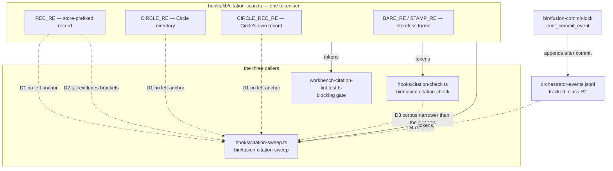
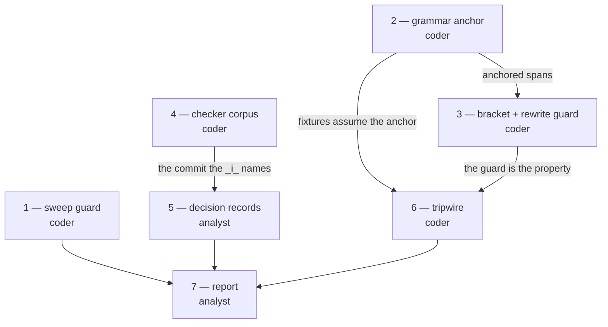

# Implementation Plan: repair four verified defects in the citation mechanism, add the tripwire, report to the consuming project

**Date:** 2026-08-30
**Status:** In Progress
**Spec:** none — planned from the orchestrator's dispatch, which carried the consuming project's report and the orchestrator's own reproduction against `cda72f71`
**Decidability:** The load-bearing question is defect 1's: **where does a store-prefixed citation token begin?** As the grammar asks it today it is *not* decidable, because with no left boundary the question reduces to "is this arbitrary path a workbench path", and a foreign directory in front of a store name is the same input as fusion's own `shared/` in front of it, to a pattern that has no left bound (the pair is spelled out under Current State). The mechanism therefore changes rather than the approximation improving (`rules/critical-stance.md` §4): the pattern stops recognising a store segment wherever it stands and instead recognises a **rooted path drawn from a closed set of rooting prefixes read off the workbench layout**, with one lookbehind in front of the whole thing. That question *is* decidable from the token text alone, because every accepted left context is a literal the layout defines and every other left context is refused by the lookbehind. The second question, defect 2's, is decidable by construction once asked the right way round: instead of enumerating the shapes a rewrite may not eat, the sweep re-reads its own output and declines any rewrite the grammar cannot see.

## Directive

Four defects in fusion's citation mechanism were reported by the consuming project `unite-co-creator` and reproduced by the orchestrator against `cda72f71`; this plan re-verified all four independently (the probe outputs are quoted per step). Repair them, add the one property test that would have caught the two largest at once, and write the report the consuming project is owed.

Nothing here re-litigates whether the defects are real. What this plan decides is *how* each is repaired, and it records the two load-bearing choices as decision records rather than as prose buried in a step.

## Current State

One grammar, three callers, and the defects are distributed across the pair of them:



**Defect 1, the store segment has no left anchor.** `REC_RE`, `CIRCLE_RE` and `CIRCLE_REC_RE` carry no lookbehind, while `BARE_RE` and `STAMP_RE` in the same file both open `(?<![\/0-9A-Za-z_-])`. Re-verified at `cda72f71` by running the compiled scanner over single lines:

```
"pytorch/issues/260101-1200_o_x.md"                   record store-prefixed col=8  'issues/260101-1200_o_x.md'
"myplanning/260101-1200_o_x.md"                       record store-prefixed col=2  'planning/260101-1200_o_x.md'
"docs/subhistory/260101-1200-note.md"                 record store-prefixed col=8  'history/260101-1200-note.md'
"mycircles/260101-1200-widget-bar"                    circle-dir store-prefixed col=2
"vendor/circles/260101-1200-widget-bar/_t_circle.md"  circle-record store-prefixed col=7
"260801-1244-guard-rules-write/issues/260101-1200_o_x.md"
                                                      record store-prefixed col=30
                                                      stamp-name resolved       col=0
```

The dispatch reported this against `REC_RE`. It is wider than that: **all three** store-prefixed patterns lack the anchor, so `mycircles/…` and `vendor/circles/…` corrupt in exactly the same way, and the repair is one rule applied three times rather than one regex fixed once. The last case is the one the dispatch measured at 150 occurrences in the consuming project, and it produces two overlapping hits today: the sweep rewrites the inner one and leaves the Circle-directory prefix glued to the result.

**Defect 2, a bracket-marked citation is silently downgraded.** Re-verified:

```
"cite shared/issues/260519-0438[o]-loader-check.md now"  record store-prefixed col=5 'shared/issues/260519-0438'
"cite 260519-0438[o]-loader-check.md now"                (no tokens)
```

The token stops at the stamp, the sweep rewrites it to the bare stamp, and the bracket tail is left standing on a token that afterwards produces no hit at all. A reported violation becomes an unreportable one.

**Defect 3, the corpora disagree.** `hooks/citation-check.ts` drops `archive/`, `stashes/` and `.migration-v2-backup/`; `hooks/citation-sweep.ts` calls `markdownFilesUnder(root)` with no exclusion. Measured over this repository's workbench at `cda72f71`:

| corpus | files | tokens | resolved | dangling | store-prefixed | undecidable | exempt |
|---|---|---|---|---|---|---|---|
| narrow (today's checker) | 1694 | 17493 | 13320 | 246 | 0 | 2427 | 1500 |
| wide (frozen included) | 2299 | 21968 | 16783 | 311 | 0 | 3153 | 1721 |

**Defect 4, the lock leaves the tree dirty.** Re-verified at `cda72f71`: `git ls-files --error-unmatch fusion-workbench/orchestrator-events.jsonl` exits 0, `git check-ignore` on the same path exits 1, and `git status --porcelain` in this repository currently lists it modified alongside `.fusion-setup` and `.asset-provenance`.

**Defect 5, no tripwire.** `hooks/lib/__tests__/citation-sweep.test.ts` is 291 lines and asserts nothing about a store segment preceded by a word character, nothing about a foreign path, nothing about the frozen stores and nothing about a bracket-marked name.

**The current release-gate reading.** `bin/fusion-citation-sweep --dry-run` over this repository's workbench prints `files=0 rewrites=0 residual=2782 record=0 circle-record=0 circle-dir=0 bare-record=0 stamp-bare=0 mode=dry-run`. `rewrites=0` is the figure `citation-sweep.test.ts` pins; `residual` moves with every record filed and is pinned by nothing.

**The head-room that bounds step 6.** Measured at `cda72f71` over `hooks/lib/__tests__/**.ts`: 19 927 lines against a baseline floor of 17 875, so **2052 of the 2500 lines of head-room are spent and 448 remain**.

## Approach

One rule per defect, each in the place that already owns the question, and no new mechanism where the file already carries the abstraction.

Defect 1 is repaired by giving the three store-prefixed patterns a shared **left anchor plus a closed rooting enumeration**, so a token spans its own rooting. That is what makes the splice correct: the sweep's corruption comes from a token that starts to the right of its own path prefix, and no amount of cleverness in `rewriteOf` can recover a prefix the token never covered. The enumeration reuses shapes the file already commits to, including the archive sweep directory that `SWEEP_DIR_RE` and `circleDirs()` already resolve against.

Defect 2 is repaired from the other side, and deliberately not by enumerating bracket shapes. The tail widens so the token is read whole and stays reportable, and the sweep gains one guard: **a rewrite is applied only when the rewritten string re-tokenises to a single token covering the whole of itself.** That is defect 5's property, enforced at the one place a rewrite happens, and it subsumes every future shape whose rewrite would escape the grammar rather than the two shapes known today.

Defect 3 removes the exclusion list from the reporting checker. The blocking gate keeps all three exclusions and is not touched.

Defect 4 replaces guard (a)'s proxy condition with the condition it stands for. "Is the tree clean" becomes "does any uncommitted change touch a file this sweep will read", which the sweep can answer exactly because it computes its own corpus. The event log is not markdown, so it leaves the question by construction rather than by exemption.

Defect 5 is the property stated as a test over a fixture workbench, after the two fixes it would fail against.

## Implementation Steps

Every code step carries the same three standing obligations, stated once here rather than repeated per step: run `npm run build` in `hooks/` and commit the regenerated `hooks/dist/` (otherwise `committed-dist.test.ts` fails); update the affected file's own header, which in every one of these files is the authoritative documentation; and commit the step on its own.

1. [DONE] **Narrow the sweep's dirty-tree guard to the sweep's own corpus**
   - Executor: `coder`
   - Files: `hooks/citation-sweep.ts`
   - Changes: in `refusal()`, replace the "any porcelain entry refuses" test with "any porcelain entry that names a file this run will read refuses". The corpus is what `main()` already builds: every `*.md` under `--root`, plus each extra `<path>` argument resolved the way `main()` resolves it. Compute the corpus once and pass it to `refusal()` rather than recomputing, so the guard and the run cannot disagree about what will be written. The refusal line keeps its `refused (dirty-tree):` shape and names the offending paths instead of a count. The other two guards, the `not-a-git-work-tree` / `workbench-untracked` / `path-outside-repo` branches and the exit codes are untouched. Update the `## The three guards on a writing mode` block in the file header to state guard (a) as the corpus question and to say why: `orchestrator-events.jsonl` is tracked, class R2 in `rules/workbench-tracking.md`, and appended by `bin/fusion-commit-lock` after every commit, so a clean-tree test can never be satisfied inside an orchestrator session.
   - Dependencies: none
   - Decision: `260830-1843_*_how-does-the-commit-lock-stop-leaving-the-tree-it-just-committed-dirty.md`, option 4. `bin/fusion-commit-lock` and `rules/commit-lock.md` are **not** edited: all three properties the rule mandates survive untouched, which is the reason that option was chosen over the three that each traded one of them away.
   - Acceptance:
     - `cd hooks && npm test` exits 0.
     - With `fusion-workbench/orchestrator-events.jsonl` the only modified path, `bin/fusion-citation-sweep --write` exits **5** (guard (b), no `--yes`) rather than 4. Today it exits 4.
     - With `fusion-workbench/portfolio.md` modified, `bin/fusion-citation-sweep --write --yes` exits **4** with `refused (dirty-tree)` naming that path.
     - `bin/fusion-citation-sweep --dry-run` last line still reads `... rewrites=0 ...`.

2. [DONE] **Anchor the three store-prefixed patterns and name the rooting forms**
   - Executor: `coder`
   - Files: `hooks/lib/citation-scan.ts`
   - Changes: introduce one `CIRCLE_DIR` source fragment (`[0-9]{6}-[0-9]{4}-[a-z0-9-]+`) and build `SWEEP_DIR_RE` from it, replacing the second literal copy of the same shape. Introduce two shared fragments, a left anchor `(?<![A-Za-z0-9._\/-])` and a rooting prefix `(?:\.{1,2}\/)*(?:fusion-workbench\/)?(?:archive\/<CIRCLE_DIR>\/)?`. Prefix `REC_RE`, `CIRCLE_RE` and `CIRCLE_REC_RE` with both. In `REC_RE`, add a bare Circle-directory alternative to the existing `circles/<dir>/` and `shared/` group, so the group reads `(?:(circles\/<dir>)\/|(shared)\/|(<dir>)\/)?`. Update the destructuring at the `REC_RE` call site, which currently reads `const [full, circleDir, shared, store, stamp, restRaw] = m;` and gains a group, and extend the `segment` string the `store-prefixed` violation reports so it names the bare-directory case. Rewrite the grammar section of the file header to state the boundary rule once: a store-prefixed citation begins at a non-path boundary and carries one of the enumerated rooting prefixes, and the enumeration is read off the layout rather than guessed.
   - Dependencies: none
   - Decision: `260830-1841_*_where-may-a-store-prefixed-citation-begin-and-which-rooting-forms-does-the-grammar-name.md`, option 2. Approving this plan is the answer to that record; the step transitions it `_o_` → `_a_` on approval and to `_i_` in this commit.
   - Acceptance:
     - `cd hooks && npm test` exits 0, `workbench-citation-lint.test.ts` included.
     - The probe below produces **no tokens** for the first five lines and exactly **one** whole-span `record` token for each of the last three.
     - `bin/fusion-citation-check` prints `dangling=246` and `store-prefixed=0`, unchanged. `resolved` falls by exactly 1, because the one bare-Circle-directory site in this repository merges two hits into one; the executor states the observed figure in its report.
     - `bin/fusion-citation-sweep --dry-run` last line still reads `... rewrites=0 ...`. Predicted rather than hoped: the two newly-rooted sites in this repository are already exempt, one inside a fenced block and one by the `glob` exemption, so neither becomes rewritable. If the figure moves, **stop and report** rather than running `--write`.

   The probe input for step 2, one line per case:

```
pytorch/issues/260101-1200_o_x.md
myplanning/260101-1200_o_x.md
docs/subhistory/260101-1200-note.md
mycircles/260101-1200-widget-bar
vendor/circles/260101-1200-widget-bar/_t_circle.md
260801-1244-guard-rules-write/issues/260101-1200_o_x.md
see fusion-workbench/circles/260801-1244-guard-rules-write/issues/260101-1200_o_x.md
./fusion-workbench/shared/issues/260101-1200_o_x.md
```

3. [DONE] **Read a bracket-marked citation whole, and refuse any rewrite the grammar cannot re-read**
   - Executor: `coder`
   - Files: `hooks/lib/citation-scan.ts`, `hooks/citation-sweep.ts`
   - Changes: widen `REC_RE`'s tail character class to admit `[` and `]`, so a store-prefixed citation of a pre-v4 bracket-marked record tokenises whole instead of stopping at the stamp. Nothing else in the grammar learns the bracket form: `BARE_RE`, `STAMP_RE`, `MARKER_SLOT` and `basenameMatcher` are untouched, so such a token is still never **resolved**, only reported. In `rewriteOf()`, gate every returned rewrite: scan the rewritten string in isolation with the same scanner and return it only when the scan yields exactly one hit whose token equals the whole string, whose kind is in `GATE_KINDS`, and whose status is not `exempt`; otherwise return `null` and leave the token as it stands. State in both headers that the grammar's "not read, on purpose" stance is preserved and sharpened: the bracket marker is never resolved, and it is now reported as a whole token instead of half of one, which is more pressure to run `/fusion:migrate` rather than less.
   - Dependencies: step 2. The visibility guard must run against anchored token spans, or it would validate a rewrite computed from a token that never covered its own rooting.
   - Related decision, deliberately **not** answered here: `260830-1842_*_may-the-grammar-resolve-a-bracket-marked-record-that-a-frozen-store-keeps-permanently.md`. `/fusion:migrate` does not convert the frozen stores, so a bracket-named record there is permanent and no citation form fusion accepts can address it. This step delivers only the minimum the dispatch names, that the sweep leave such a token alone entirely; whether the grammar should be able to resolve one is that record's question and stays `_o_`.
   - Acceptance:
     - `cd hooks && npm test` exits 0.
     - A probe over the first line below yields exactly one token, spanning the whole path, status `store-prefixed`.
     - A sweep dry run over a scratch file containing that first line reports **no** rewrite for it, and the file is byte-identical after a `--write --yes` run in a scratch git work tree.
     - A sweep dry run over a scratch file containing the second line still reports one rewrite, to the storeless basename with the marker wildcarded, so the guard has not suppressed the ordinary case.
     - `bin/fusion-citation-sweep --dry-run` over this repository still reads `... rewrites=0 ...`.

   The probe input for step 3:

```
cite shared/issues/260519-0438[o]-loader-check.md now
see shared/issues/260101-1200_o_x.md
```

4. [DONE] **Give the reporting checker the same corpus the sweep has**
   - Executor: `coder`
   - Files: `hooks/citation-check.ts`
   - Changes: delete `FROZEN_PREFIXES` and the `.filter()` that applies it, so the checker reads every `*.md` under the workbench exactly as `markdownFilesUnder(root)` returns it. Rewrite the `## Corpus` block of the file header to say that the frozen stores are read like the live tree, and to carry the four pieces of evidence: this repository swept its own archive in `f1099c5f` (565 files, 3082 insertions against 3082 deletions; the orchestrator's dispatch said 566, corrected at step 4 by `git show --numstat`); `workbenchIndex()` already walks the whole workbench with no prefix filter and `circleDirs()` carries an explicit `archive/<sweep>/circles` branch; a store-prefixed citation inside an archived record is already dead, and rewriting it to the storeless form makes it resolve again; and the consuming project's `.migration-v2-backup/` contains 0 store-prefixed citations across its 205 files, so the exception this was expected to need has no measured case. State in the same block that `hooks/lib/__tests__/workbench-citation-lint.test.ts` keeps all three exclusions, and why: a gate reddens somebody's suite over text nobody compiled, and a reporter does not.
   - Dependencies: none. Ordered after step 3 only so the figures below are read once.
   - Acceptance:
     - `cd hooks && npm test` exits 0.
     - `grep -c 'archive/\|stashes/\|migration-v2-backup' hooks/lib/__tests__/workbench-citation-lint.test.ts` is unchanged from `cda72f71`; that gate's three exclusions are untouched.
     - `bin/fusion-citation-check` prints `files=2332`, `dangling=311`, `store-prefixed=0`, `verdict=violations`. The verdict does not flip; it already read `violations` over the narrower corpus with 246 dangling citations, and the 65 added are all inside `archive/`. The executor states the observed `tokens`, `resolved`, `undecidable` and `exempt` figures in its report.

5. [DONE] **Narrow the open frozen-stores decision to what is still open, and file the residual**
   - Executor: `analyst`
   - Files: `$OUT_DECISION/260830-1816_o_do-the-frozen-stores-enter-the-sweeps-and-the-checkers-corpus-the-way-the-live-tree-does.md` (rewritten and renamed), one new `$OUT_DECISION/YYMMDD-HHMM_o_<topic>.md`
   - Changes: the existing record's options are cut wider than what remains, so rewrite them to the alternatives that were actually live, record the user's answer with the four pieces of evidence step 4 carries, and transition the record `_o_` → `_a_` → `_i_`, naming step 4's commit. The record's question is answered: yes, the frozen stores enter both corpora the way the live tree does. **File the residual as a new `_o_` record**, because it is a different question with a different answer set: *should an archived violation, which nobody will repair, move the checker's `verdict=` line at all?* Give it the second-order figures — `verdict=violations` before and after, 246 dangling becoming 311, the 65 added all inside `archive/` — and cross-reference `260819-1645_*_what-defines-the-citation-gates-corpus-and-what-happens-when-a-marker-move-changes-it.md` and `260820-0805_*_the-citation-gates-corpus-excludes-only-archive-so-a-frozen-copy-tree-would-enter-a-blocking-gate.md`, whose option-1 reasoning bounds the gate and not the reporter. Cross-reference `260823-1414_*_does-the-workbench-citation-gates-corpus-cover-review-files.md` as related and leave it open; it is a different corpus question and is not folded in.
   - Dependencies: step 4
   - Acceptance: `ls fusion-workbench/shared/decisions/ | grep -c '260830-1816'` returns 0 for the `_o_` name and 1 for the `_i_` name; the new residual record exists under an `_o_` name; `cd hooks && npm test` exits 0, which is the citation gate confirming both filenames resolve.

6. [DONE] **The tripwire: no rewrite may turn a token the checker reports into one the checker cannot see**
   - Executor: `coder`
   - Files: `hooks/lib/__tests__/citation-sweep.test.ts`
   - Changes: add one property test over a fixture workbench built in a temp directory. Scan every fixture file, run the sweep's rewrite over the same content, scan the result, and assert that **every token that had a judged status before still has one after** — matched by position within its line, so a token that vanishes fails as loudly as one that changes status to something unjudged. Drive it from a small fixture table covering the four shapes the dispatch names and the two the anchoring adds: a foreign path segment before a store name, a word character before a store name, a bracket-marked store-prefixed citation, a citation inside a frozen store, a bare Circle-directory rooting, and an archive rooting. The table is data; the property is one loop. Do **not** add per-shape assertions beside it: the property is what catches the next shape, and an enumeration beside it is the thicket `rules/critical-stance.md` §2 names.
   - Dependencies: steps 2 and 3
   - **Why this comes after the fixes, not before.** The property fails at `cda72f71` on defects 1 and 2, so committed on its own it is a red suite for everyone who pulls, and `npm test` is the gate three unrelated things already run through. The demonstration that the tripwire catches the defects is preserved without a red commit: the executor checks out `hooks/lib/citation-scan.ts` and `hooks/citation-sweep.ts` at `cda72f71` into a scratch worktree, rebuilds, runs the new test there, and **states in its report which fixture rows fail and with what status transition**. Then restores. That report line is the acceptance, not an artifact.
   - **Line budget: 120 lines.** Head-room on the hook-test surface is 448 lines at `cda72f71` (19 927 measured against a 17 875 floor, 2500 of head-room, 2052 spent). If the property cannot be written inside 120 lines, **halt and report**: a baseline moves at exactly two written-down moments and neither is "a test did not fit" (`hooks/lib/__tests__/helpers/growth-bound.ts` `## Re-baselining`). A cut is the user's call, not the executor's. Two open records already say this surface is full: `260827-0410_*_the-machine-written-event-rows-ship-with-wiring-asserts-only-because-the-hook-test-surface-is-full.md` and `260822-1154_*_does-the-hook-test-line-budget-cover-comment-prose.md`.
   - Acceptance:
     - `cd hooks && npm test` exits 0, `surface-growth-bound.test.ts` included.
     - `git diff --stat` on `hooks/lib/__tests__/citation-sweep.test.ts` shows at most 120 inserted lines.
     - The executor's report names the fixture rows that fail against the `cda72f71` grammar in the scratch worktree, and the status transition each shows.

7. **The report to the consuming project**
   - Executor: `analyst`
   - Files: one analysis report at `$OUT_ANALYSIS/YYMMDD-HHMM-<topic>.md`, resolved by the analyst's own `bin/fusion-paths analyst` at Setup. With no Circle active it lands in the shared analysis store.
   - **Language: English.** This is a fusion workbench artifact, so it takes fusion's artifact language, not the chat language and not the consuming project's (`rules/fusion-workbench-conventions.md` `## Project language`). The executor does not decide this.
   - Changes: write the report for a reader outside this project, who has fusion installed and has never read its workbench. Carry: the four defects, each with its measurement and what shipped for it; the missing tripwire and the property that replaced an enumeration of shapes; the frozen-stores corpus change and the fact that the blocking gate deliberately did not move with it; and the one point fusion has **not** decided, whether the citation helper should read non-Markdown surfaces with the stamp as the anchor, naming the record it now lives in, `260830-1844_*_does-the-citation-helper-read-non-markdown-surfaces-with-the-stamp-as-the-anchor.md`, and saying that the roughly 950 citations the consumer measured on code surfaces are what it turns on. Carry the consumer's own note that two of its records went moot and that its section-4 exemption vocabulary became unnecessary for them because they adopted fusion's form, while a project unwilling to touch its legacy would still need it; **build nothing for it**. Say plainly which of the four repairs a consuming project gets only after `fusion --update`, since every one of them ships in `hooks/dist/` and `bin/`.
   - Dependencies: steps 1 through 6
   - Acceptance: the report exists at the resolved path; `cd hooks && npm test` exits 0, which is the citation gate confirming every record it cites resolves; the report names all four defects, the tripwire, and the undecided point with its record's basename.

## Where this Circle stops

No Circle is active, so these clauses bound this plan's own work.

- Every one of the four defects has a commit whose acceptance criteria above were run and reported, or is named here as not repaired with the reason.
- `cd hooks && npm test` exits 0 at the last commit of this plan.
- `bin/fusion-citation-sweep --dry-run` over this repository's committed workbench reads `rewrites=0` at the last commit of this plan, the same figure it reads at `cda72f71`.
- `bin/fusion-citation-check` has been run at the last commit and its `files=`, `dangling=`, `store-prefixed=` and `verdict=` figures are recorded in the session history, so the corpus change is visible as a number and not only as a diff.
- `260830-1816_*_do-the-frozen-stores-enter-the-sweeps-and-the-checkers-corpus-the-way-the-live-tree-does.md` carries an `_i_` marker and the residual it left is a separate `_o_` record.
- The two decision records this plan's approval answers, `260830-1841_*_where-may-a-store-prefixed-citation-begin-and-which-rooting-forms-does-the-grammar-name.md` and `260830-1843_*_how-does-the-commit-lock-stop-leaving-the-tree-it-just-committed-dirty.md`, carry an `_i_` marker naming the commit that realised each.
- The report to the consuming project exists in the shared analysis store, in English, and names the undecided non-Markdown-surface question and the record that holds it.
- Precondition on any release that carries this work: `bin/fusion-review-coverage --since <previous tag>` has been run and its result stated in the release commit or the session log, per `CLAUDE.md` `## Release process` step 0. Nothing here waives it.
- Not a stopping condition, and named so it is not mistaken for one: `260830-1842_*_may-the-grammar-resolve-a-bracket-marked-record-that-a-frozen-store-keeps-permanently.md` and `260830-1844_*_does-the-citation-helper-read-non-markdown-surfaces-with-the-stamp-as-the-anchor.md` stay `_o_`. This plan closes with both open, deliberately.

## Data Structures

No new types. Three source fragments are introduced in `hooks/lib/citation-scan.ts` and are the only structural addition:

| name | shape | why it is shared |
|---|---|---|
| `CIRCLE_DIR` | `[0-9]{6}-[0-9]{4}-[a-z0-9-]+` | already written twice in the file, once inside `SWEEP_DIR_RE` and once inside `REC_RE` |
| the left anchor | `(?<![A-Za-z0-9._\/-])` | the same question `BARE_RE` and `STAMP_RE` already answer, asked in the three places that never asked it |
| the rooting prefix | `(?:\.{1,2}\/)*(?:fusion-workbench\/)?(?:archive\/<CIRCLE_DIR>\/)?` | the closed set the Decidability line names; one definition, three consumers |

`REC_RE` gains one capture group. That is a call-site change, not a type change, and it is named in step 2 because a silent index shift would misreport the `segment` string in every `store-prefixed` violation.

## API Changes

None that a consuming project calls. Three shipped behaviours move, and each is a documented surface:

- `bin/fusion-citation-sweep` guard (a) refuses a narrower set of trees. Exit code 4 keeps its meaning; the message names paths.
- `bin/fusion-citation-check` reads a wider corpus. The output shape is unchanged; the figures move.
- `hooks/lib/citation-scan.ts` reports fewer tokens on foreign paths and whole tokens on bracket-marked ones. Both gates read it and both stay green.

## Testing Strategy



The suite is the mechanism for steps 1 to 4: each has a probe with an expected token set and an expected exit code, and each ends with `npm test` green and the `rewrites=0` reading unchanged. Step 6 is the only step that adds a test, and it adds one property rather than a set of cases, for the reason its own entry gives.

Three existing gates constrain every step and none of them is edited:

- `hooks/lib/__tests__/workbench-citation-lint.test.ts` recomputes its corpus from the tree on every run and keeps its three frozen-store exclusions.
- `hooks/lib/__tests__/citation-sweep.test.ts` pins `rewrites=0` on a dry run over this repository's committed workbench.
- `hooks/lib/__tests__/committed-dist.test.ts` fails when the committed `hooks/dist/` is not the compilation of the committed source.

## Risks & Mitigations

| Risk | Mitigation |
|---|---|
| The rooting enumeration turns a shape that is exempt today into a rewritable token, moving `rewrites=0` and reddening the release gate | Measured before planning: the two newly-rooted sites in this repository are exempt, one fenced and one by the `glob` rule. Step 2's acceptance reads the figure and **stops** rather than running `--write` if it moved. |
| The extra capture group in `REC_RE` shifts the destructuring silently and every `store-prefixed` violation reports the wrong `segment` | Named as an explicit change site in step 2, with the current destructuring quoted. |
| The rewrite visibility guard suppresses legitimate rewrites | Step 3's acceptance includes a positive case: an ordinary store-prefixed citation must still rewrite. A guard that suppressed everything would pass a negative-only test. |
| The tripwire does not fit in 448 lines of head-room | Budget of 120 stated, halt-and-report named as the response, and the two open records that already say this surface is full are cited. A baseline edit is excluded by the growth-bound rule, not by preference. |
| Widening the checker's corpus buries the live-tree violations under archived ones nobody will repair | The residual is filed as its own `_o_` record in step 5 rather than settled by the implementation. The figures are stated so the burial is visible: 246 live becoming 311 total. |
| Narrowing guard (a) lets somebody sweep mid-edit and read one diff as two changes | Stated as the cost of option 4 in its decision record rather than mitigated. Guard (b) still prints the census and still refuses without `--yes`, so nothing is written unread. |
| A consuming project reads the report and expects the fixes to be live | Step 7 requires the report to say which repairs arrive only after `fusion --update`, since all four ship in `hooks/dist/` and `bin/`. |

## Open Questions

- [ ] Where may a store-prefixed citation begin, and which rooting forms does the grammar name? Recorded as `260830-1841_*_where-may-a-store-prefixed-citation-begin-and-which-rooting-forms-does-the-grammar-name.md`. **Answered by approving this plan** (option 2); step 2 realises it.
- [ ] How does the commit lock stop leaving the tree it just committed dirty? Recorded as `260830-1843_*_how-does-the-commit-lock-stop-leaving-the-tree-it-just-committed-dirty.md`. **Answered by approving this plan** (option 4); step 1 realises it. Approving it also means `bin/fusion-commit-lock` is not edited.
- [ ] May the grammar resolve a bracket-marked record that a frozen store keeps permanently? Recorded as `260830-1842_*_may-the-grammar-resolve-a-bracket-marked-record-that-a-frozen-store-keeps-permanently.md`. **Stays open.** Step 3 delivers only that the sweep leaves such a token alone. The record asks for a measurement before an answer: 226 bracket-named files are counted in one consuming project and the number of citations of them is not.
- [ ] Does the citation helper read non-Markdown surfaces, with the stamp as the anchor? Recorded as `260830-1844_*_does-the-citation-helper-read-non-markdown-surfaces-with-the-stamp-as-the-anchor.md`. **Stays open**, and it is the one point the consuming project is blocked on. Step 7 reports that it exists and where.
- [ ] Should an archived violation move the checker's `verdict=` line? Filed by step 5 as `260830-2225_*_should-an-archived-violation-move-the-checkers-verdict-line.md`. **Stays open.** Its measurement widens the question rather than answering it: 65 rows are archived and 191 more sit in live files of kinds nobody revises, so archived-ness is not the criterion the question names.

### Gates beyond the plan approval

Two, and only two.

1. **Step 6's line budget.** If the property test cannot be written inside 120 lines, the executor halts and the user decides the cut. A baseline edit is not available to the executor.
2. **Step 2's `rewrites` reading.** If `bin/fusion-citation-sweep --dry-run` stops reading `rewrites=0` after the anchoring lands, the executor stops and reports. Running `--write` over this repository's own workbench is a hand-run act behind the sweep's own census guard, and it is the user's, not the executor's.

No other step needs a gate. Steps 1, 3 and 4 are verified by commands with expected exit codes, and steps 5 and 7 write records and a report that the citation gate itself checks.
