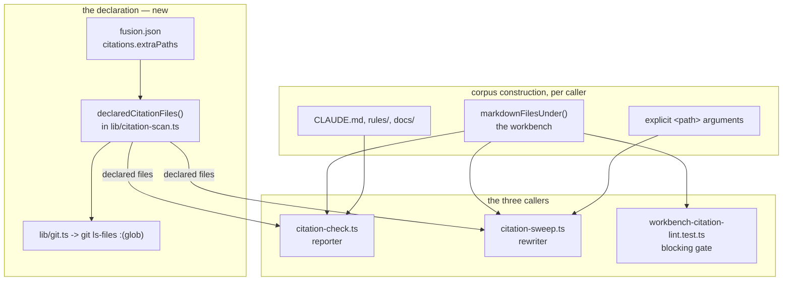
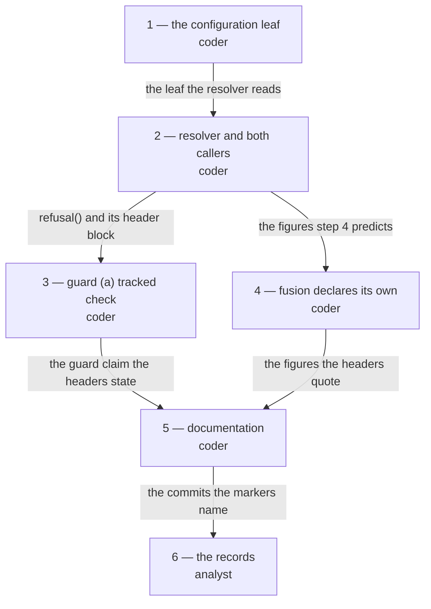

# Implementation Plan: a project declares which non-Markdown paths carry record citations, and the checker and the sweep read exactly those

**Date:** 2026-08-31
**Status:** Draft
**Spec:** none — planned from the orchestrator's dispatch, which carried the answer to `260830-1844_*_does-the-citation-helper-read-non-markdown-surfaces-with-the-stamp-as-the-anchor.md` (option 5) and the measurements from the consuming project's repair run
**Decidability:** Two questions stack here and each is answered by replacing it, not by approximating it. The first is **"does this token in a `.go` file point at a record or exhibit one?"** — *not* decidable from the token or its surroundings. Outside Markdown there is no fence and no blockquote, and those two are the entire pointer-versus-exhibit distinction fusion has; a citation inside a Python docstring and one inside a comment that names a real record are the same input to any reader of the text. So the mechanism changes (`rules/critical-stance.md` §4): the question becomes **"did the project declare this file as citation-bearing?"**, which is decidable because somebody wrote it down in a git-tracked file. That is the same move that repaired defect 1 on 2026-08-30 — stop guessing where a citation may begin, name a closed set of places instead. The second question is the one the first creates: **"which files does a declared pattern name?"** It is decidable, and the plan answers it with one mechanism and no fallback, `git ls-files` with `:(glob)` pathspec magic, the mechanism `260809-1731_*_how-should-the-domain-heuristic-count-a-projects-source-files.md` already chose for the same class of question in this repository. Its case split is disjoint and complete over five branches, each settled by a value the resolver holds: not a git work tree (`git rev-parse --show-toplevel` gives nothing), a pattern refused before git (absolute, or carrying a `..` segment), a pattern git itself refuses, a pattern matching nothing, a pattern matching files. Nothing here asks whether a *declaration* is correct: that is a judgement the project makes, and fusion reports it rather than second-guessing it.

## Directive

`260830-1844` was answered option 5 on 2026-08-31. Realise it: a project declares its citation-bearing non-Markdown paths as globs in `fusion.json`, and `bin/fusion-citation-check` and `bin/fusion-citation-sweep` add exactly those files to their corpus.

Nothing here re-opens whether the declaration is the right shape. What this plan decides is where the declaration lives, what enumerates it, whether the blocking gate reads it, and what fusion declares for itself — and it records the one load-bearing sub-choice as a decision record rather than as prose inside a step.

## Current State

**The repair route already exists.** The consuming project's 707 store-prefixed citations on `.yaml`, `.go`, `.py`, `.ts` and `.tsx` surfaces were repaired on 2026-08-31 as that project's `4f8aab36`, 158 rewrites across 89 files, by naming the files as extra `<path>` arguments to `bin/fusion-citation-sweep`, which takes a named file whatever its extension. Nothing had to be built. What is missing is that nothing walks the route routinely: `/fusion:cleanup` Step 8 calls `bin/fusion-citation-check` with no extra paths at all, so those surfaces fall out of every run and the same rot returns.

**The configuration loader resolves one leaf.** `hooks/lib/config.ts` merges the project's `fusion.json` over the in-code `DEFAULTS`, per leaf, across two layers, and `orchestrator.maxTurns` is the only live leaf. `CONTAINER_LEAF_RULES` gives every leaf a declared type; a leaf whose value has the wrong type is dropped, named in a diagnostic, and then inherits exactly as an omitted key does. `RETIRED_TOP_LEVEL_KEYS` exists so a key that stops being read is reported rather than silently ignored. `hooks/lib/__tests__/config.test.ts` `PROJECT_SET_KEYS = ["orchestrator"]` cuts those keys out of both `templates/fusion.json` and this repository's root `fusion.json` and holds every remaining byte identical.

**Both callers already build a corpus and hand it to a guard.** `citation-sweep.ts` `main()` computes `files` — every `*.md` under the workbench, plus each `<path>` argument resolved — and passes that one list to `refusal()`, so guard (a) and the run cannot disagree about what will be written. Declared files join that list at the same place `<path>` arguments do and are covered by guard (a) with no new guard code.

**What fusion's own code surfaces read today.** Measured 2026-08-31 at `7be624e7` with the compiled scanner, over the 45 files `git ls-files -- ':(glob)bin/*' ':(glob)hooks/*.ts' ':(glob)hooks/lib/*.ts'` names:

| | files | tokens | resolved | dangling | store-prefixed | undecidable | exempt |
|---|---|---|---|---|---|---|---|
| the 45 fusion would declare (`bin/*`, `hooks/*.ts`, `hooks/lib/*.ts`) | 45 | 191 | 167 | 2 | 0 | 16 | 6 |
| `hooks/lib/__tests__/**/*.ts`, which it would not | 51 | 507 | 21 | 90 | 133 | 232 | 31 |

The second row is the noise option 2 of the decision record predicted and the reason `isTestFixture` exists in the sweep. It is also the demonstration that a declaration is a judgement a person makes: the fixtures are excluded because the project knows they are exhibits, not because any reader of their text could tell.

The two dangling tokens in the first row are both at `hooks/lib/citation-scan.ts:319`, inside the string value of `RECORD_EXAMPLE_FILES` that names what `skills/migrate/SKILL.md` demonstrates on fabricated artifacts. They are exhibits in a declared file, they will be reported, and this plan accepts the two rows rather than exempting them — see Risks.

**The current release-gate reading.** `bin/fusion-citation-sweep --dry-run` over this repository reads `files=0 rewrites=0 residual=2789 record=0 circle-record=0 circle-dir=0 bare-record=0 stamp-bare=0 mode=dry-run`. With the 45 declared files added it reads `rewrites=0` and `residual=2804`. `rewrites=0` is what `citation-sweep.test.ts` pins; `residual` moves with every record filed and is pinned by nothing.

**The checker's current reading**, at `7be624e7`: `files=2353 tokens=22265 judged=17719 resolved=17036 dangling=311 store-prefixed=1 undecidable=3162 exempt=1755 verdict=violations`.

**The head-room that bounds the steps.** Measured 2026-08-31 at `7be624e7`: the hook test surface reads 19 977 lines against a floor of 17 875, so **398 of the 2 500 lines of head-room remain**. The `skills/` surface reads 239 833 bytes against a floor of 220 439, so **606 of its 20 000 bytes remain**. The `agents/` surface has 9 202 bytes left. `README-hooks.md`, `README.md`, `README-agents.md` and `CLAUDE.md` are bounded by nothing.

## Approach

One declaration, one resolver, two readers, and the blocking gate deliberately left where it is.

**The declaration is a configuration leaf**, `citations.extraPaths`, resolved by the loader that already resolves the Turn budget, with the same per-leaf merge and the same drop-and-name behaviour for a wrong type. A second top-level key is what the loader was kept in its current shape for — its own docstring says the leaf walk "is kept as the shape rather than collapsed into a single `??`, because the next setting to land here inherits the rule instead of re-deriving it". This is that setting. A project that declares nothing gets `[]`, which is what it has today: no declared files, no behaviour change, no advisory.

**The resolver is one function beside `markdownFilesUnder()`**, in `hooks/lib/citation-scan.ts`, and it runs git through `hooks/lib/git.ts`, whose three properties — cwd is the root, every failure is `null`, a timeout is mandatory — are exactly the ones this needs. No new module, so no new `README-hooks.md` `lib/` table row is owed and `derivable-enumerations-lint` stays green; no new subprocess wrapper, so `260811-1146_*_does-the-measurement-family-get-a-shared-chassis-before-the-fourth-module.md`'s trip-wire is not touched.

**The checker and the sweep share one corpus, and the reason is measured rather than argued.** Step 4 of `260830-1841_*_citation-mechanism-four-defect-repair.md` removed a reporter-versus-rewriter corpus split eight days ago, on the ground that the sweep changed files the checker then declared clean. Giving the declaration to the checker alone would recreate exactly that, one class further out: a declared `.go` file the sweep rewrites and the checker never reports. Option 4 of the decision record offered "one half can damage and the other cannot" as the reason for a split; the answer note on that record settled it the other way, and the damage the split was meant to bound is bounded three other ways instead — the declaration itself (a project names its own files), the visibility guard (no rewrite may escape the grammar), and the enumerator (a declared file is tracked by construction).

**The blocking gate does not read the declaration.** `hooks/lib/__tests__/workbench-citation-lint.test.ts` runs in `npm test` over this repository's own tree and recomputes its corpus on every run with no approvable baseline. A corpus set by an editable declaration would turn a one-line configuration edit into a red suite for everyone who pulls. That is not a new split; it is the split already in force, stated by the same file: a gate reddens somebody's suite over text nobody compiled, and a reporter costs its reader a row. The rule that emerges from the pair, and that the headers will carry: **the two hand-run helpers share one corpus; the blocking gate is narrower on purpose.**

**Glob semantics are git's, and they are small because they are not fusion's.** A pattern is a git pathspec under `:(glob)`, so `*` does not cross `/` and `**` does. One `git ls-files` call per declared pattern, so a pattern matching nothing is nameable; the union is deduplicated against the corpus by absolute path, which is why no rule about a declared `*.md` is needed — a declared file already in the corpus contributes nothing, and one outside it is added, whatever its extension. A pattern that is absolute or carries a `..` segment is refused before git reaches it, from the string alone. A tree git will not answer for yields `unavailable`, named, never an empty list — the rule `bin/fusion-count-sources` states for a count it could not take.

**What a declared non-Markdown file gets in place of the fence: nothing, and the declaration is what stands in for it.** There is no comment-block rule, no string-literal rule, no per-language exemption vocabulary, and none is planned. Inside a declared file every exemption the grammar already has still applies as written — `RECORD_EXAMPLE_FILES`, the placeholder and fabricated-name rules, the head-field rule, the glob rule — and `fencedContentLines()` will find no fences in a `.go` file, which costs nothing and asserts nothing. The consequence is stated plainly rather than mitigated: an exhibit inside a declared file is reported as a pointer, and the remedy is the project's, either by not declaring that file or by correcting the token.

## Implementation Steps

Every code step carries the same three standing obligations, stated once rather than repeated per step: run `npm run build` in `hooks/` and commit the regenerated `hooks/dist/`, or `committed-dist.test.ts` fails; update the edited file's own header, which in every one of these files is the authoritative documentation; and commit the step on its own.

1. **The configuration leaf**
   - Executor: `coder`
   - Files: `hooks/lib/config.ts`, `templates/fusion.json`, `fusion.json`, `hooks/lib/__tests__/config.test.ts`
   - Changes: add `citations: { extraPaths: string[] }` to `GuardSettings`, `RawConfig` and `DEFAULTS`, with `extraPaths: []` as the default; add a `CONTAINER_LEAF_RULES.citations.extraPaths` rule whose `expected` completes "… must be *an array of strings*"; add the leaf to the merge in `loadConfig`. The rule checks the array and its elements together: a value that is not an array, or an array holding a non-string or an empty string, is dropped whole and named, then inherits as absent — the per-leaf equivalence `260804-1630_*_what-does-a-project-guard-object-inherit-for-a-key-it-does-not-supply.md` mandates. An explicit `[]` survives as itself, which the `??` merge already guarantees and the docstring already claims. Nothing here validates a pattern's *shape*: whether a pattern is absolute or escapes the root is a resolution question and is answered at the resolution site in step 2, so the loader answers "is this the right type" and the resolver answers "does this name files in this project", once each. Rewrite the module docstring's `## The one leaf` section into `## The settings` and correct every sentence in the file that states the cardinality as one — the docstring's opening paragraph, the `orchestrator.maxTurns` description, and the `RETIRED_PROJECT_FILES` advisory text, which says "The one setting it carried". Add the identical `_citations` documentation note to both `templates/fusion.json` and this repository's root `fusion.json`; it names the key, states that a pattern is a git pathspec under `:(glob)` and gives one worked example, and says that a project declaring nothing keeps today's behaviour exactly.
   - Dependencies: none
   - Executor routing, stated because the step touches `.json`: `fusion.json` and `templates/fusion.json` are configuration, not data. `agents/orchestrator.md` `## Agent Routing Table` gives build manifests and build configuration to `coder` whatever the extension, and these two files must move in the same commit as `hooks/lib/config.ts` because `config.test.ts` holds them byte-identical outside `PROJECT_SET_KEYS`. Splitting the step would put a byte-identity constraint across two commits by two executors.
   - Line budget on the hook-test surface: **60 lines** in `config.test.ts`.
   - Acceptance:
     - `cd hooks && npm test` exits 0, `config.test.ts`'s template-drift comparison included.
     - A probe: `loadConfig` over a scratch root whose `fusion.json` holds `{"citations":{"extraPaths":["a/*.go"]}}` returns that array and no diagnostic; over `{"citations":{"extraPaths":"a/*.go"}}` it returns `[]` and one diagnostic naming `citations.extraPaths`; over `{"citations":{"extraPaths":["a",""]}}` the same; over a file declaring nothing it returns `[]` and no diagnostic.
     - `bin/fusion-turn-budget` prints the same `KEY=value` line it prints today.
     - `bin/fusion-citation-sweep --dry-run` still reads `... rewrites=0 ...`.

2. **The resolver, and both callers reading it**
   - Executor: `coder`
   - Files: `hooks/lib/citation-scan.ts`, `hooks/citation-check.ts`, `hooks/citation-sweep.ts`, `hooks/lib/__tests__/fusion-citation-check.test.ts`, `hooks/lib/__tests__/citation-sweep.test.ts`
   - Changes: add `declaredCitationFiles(projectRoot, patterns)` to `hooks/lib/citation-scan.ts`, beside `markdownFilesUnder()`, returning `{ files: { rel, abs }[], unmatched: string[], refused: { pattern, why }[], unavailable: boolean }`. It runs `git rev-parse --show-toplevel` once through `hooks/lib/git.ts`; a `null` there sets `unavailable` and returns no files. Otherwise it refuses, from the string alone, any pattern that is absolute or contains a `..` segment, then runs one `git ls-files -z -- ':(glob)<pattern>'` per surviving pattern with the project root as cwd: a `null` puts the pattern in `refused`, empty output puts it in `unmatched`, and paths are returned NUL-split. The union is deduplicated by absolute path. Both callers add the result to the corpus they already build, deduplicated against it by absolute path, and read the patterns from `loadConfig({ projectRoot })` — the checker's project root is what `findWorkbenchRoot()` returned, the sweep's is `dirname(--root)`. Each caller writes the loader's diagnostics, and one line per `unmatched`, `refused` and per `unavailable`, to **stderr**, the channel `bin/fusion-turn-budget` already uses for exactly this. The checker gains two stdout lines, `declared-patterns=<n>` and `declared-files=<n>` (`unavailable` in place of the figure where git would not answer), placed after `files=`; the sweep's summary line is **not** touched, so the release gate and `citation-sweep.test.ts` read exactly the string they read today. State in `citation-scan.ts`'s header what the resolver decides and what it refuses to decide, in the terms of this plan's Decidability line; state in both callers' headers that the two hand-run helpers share one corpus while `workbench-citation-lint.test.ts` deliberately does not read the declaration, and why.
   - Dependencies: step 1
   - Decision: `260831-0032_*_which-mechanism-enumerates-a-declared-citation-path-and-what-happens-where-git-will-not-answer.md`, option 1. Approving this plan is the answer to that record; the step transitions it `_o_` → `_a_` on approval and step 6 transitions it to `_i_`.
   - Line budget on the hook-test surface: **120 lines** across the two test files.
   - Acceptance:
     - `cd hooks && npm test` exits 0.
     - Over a scratch git project holding a workbench, a `fusion.json` declaring `["src/*.go"]`, a `src/a.go` citing a record that does not exist and a `src/b.txt` citing the same: `citation-check.js` reports the `src/a.go` row, does not report the `src/b.txt` row, and prints `declared-patterns=1 declared-files=1`.
     - In the same scratch project with `["src/*.go", "nowhere/*.py"]`: stdout is unchanged for the `.go` file, and stderr carries one line naming `nowhere/*.py` as matching nothing.
     - In the same scratch project with `["/etc/*.conf"]` and with `["../x/*.go"]`: each is named on stderr as refused before git, and `declared-files=0`.
     - With the scratch project's `.git` removed: `declared-files=unavailable` on stdout, one stderr line saying git would not answer, exit still 0.
     - `bin/fusion-citation-check` over this repository prints `declared-patterns=0 declared-files=0` and every other figure unchanged from `7be624e7`, because this repository declares nothing until step 4.
     - `bin/fusion-citation-sweep --dry-run` over this repository still reads `... rewrites=0 ...` and its summary line has the same fields in the same order.

3. **Guard (a) asks whether each extra path is tracked, not only whether it is inside the work tree**
   - Executor: `coder`
   - Files: `hooks/citation-sweep.ts`, `hooks/lib/__tests__/citation-sweep.test.ts`
   - Changes: in `refusal()`, extend the existing per-`extra`-path loop — which already resolves each path and refuses one outside the work tree — to also refuse one git does not track, with `git ls-files --error-unmatch`, the same question the guard already asks about the workbench one line earlier. The refusal line names the untracked paths and keeps its exit code 4. Declared files need no check and get none: `git ls-files` cannot name an untracked or ignored file, so the routine route is tracked by construction and only the hand-passed route can reach this branch. Update the guard (a) block in the file header to state the extra-path condition as "inside the work tree **and** tracked by it", with the measurement below.
   - Dependencies: step 2, because both edit `refusal()`'s neighbourhood and the header block that documents it.
   - Closes: `260831-0015_*_the-sweeps-guard-a-does-not-check-that-an-extra-path-argument-is-tracked.md`. Ten of the 89 files the consuming project's `4f8aab36` rewrote were gitignored build output, written with no revert available. The executor renames that record to `_c_` in the same commit.
   - **Why this plan fixes it rather than leaving it.** The feature this plan ships makes the declared route routine and safe. That leaves the `<path>` route as the thing a person reaches for on a one-off file, which is precisely the circumstance the ten files were lost in, and the cost of the check is one git call inside a loop that already runs.
   - Line budget on the hook-test surface: **40 lines**.
   - Acceptance:
     - `cd hooks && npm test` exits 0.
     - In a scratch git work tree with a tracked workbench, a committed tree, a tracked `kept.go` and an untracked `ignored.go`: `citation-sweep.js --write --yes ignored.go` exits **4** with a refusal line naming `ignored.go`, and writes nothing; `citation-sweep.js --write --yes kept.go` does not refuse on this branch.
     - `bin/fusion-citation-sweep --dry-run` over this repository still reads `... rewrites=0 ...`. A dry run needs none of the three guards, so this step cannot move that figure.

4. **fusion declares its own citation-bearing paths**
   - Executor: `coder`
   - Files: `fusion.json`, `hooks/lib/__tests__/config.test.ts`
   - Changes: add `"citations": { "extraPaths": ["bin/*", "hooks/*.ts", "hooks/lib/*.ts"] }` to this repository's root `fusion.json`, and add `"citations"` to `PROJECT_SET_KEYS` in `config.test.ts` so the template-drift comparison keeps holding every other byte identical. `templates/fusion.json` declares nothing and keeps only the `_citations` note step 1 gave it — the template is what a project starts from, and a project's citation-bearing paths are not fusion's. `hooks/lib/__tests__/*.ts` is deliberately not declared, and the `_citations` note in `fusion.json` says so in one clause: the fixtures are exhibits, and this is the judgement a declaration is for.
   - Dependencies: step 2
   - Line budget on the hook-test surface: **5 lines**.
   - Acceptance:
     - `cd hooks && npm test` exits 0.
     - `bin/fusion-citation-check` prints `declared-patterns=3` and `declared-files=45`; `files` rises by 45 from its step-2 reading, `tokens` by 191, `resolved` by 167, `dangling` by 2, `undecidable` by 16, `exempt` by 6, and `store-prefixed` by 0. `verdict` stays `violations`. The two added rows are both `hooks/lib/citation-scan.ts:319`. The executor states the observed figures in its report; where one differs from the prediction it says so rather than restating the prediction.
     - `bin/fusion-citation-sweep --dry-run` reads `... rewrites=0 ...` with `residual` at 2804 plus whatever records this session filed. **If `rewrites` is not 0, stop and report; do not run `--write`.**

5. **The documentation, including four claims the previous plan left false**
   - Executor: `coder`
   - Files: `README-hooks.md`, `README.md`, `README-agents.md`, `CLAUDE.md`, `bin/fusion-citation-check`, `bin/fusion-citation-sweep`, `agents/orchestrator.md`, `skills/help/SKILL.md`, `hooks/turn-budget.ts`
   - Changes, in two groups.
     - **The new setting.** Every surface that states the configuration's cardinality as one becomes two, per `rules/critical-stance.md` §5 — name both settings rather than counting them. The sites, enumerated by `grep -rn "only live leaf\|only live setting\|exactly one thing\|exactly one setting\|one setting\|the one leaf\|only setting" --include='*.md' --include='*.ts' --include='*.json' .` with `fusion-workbench/`, `hooks/dist/` and the activity log excluded: `README.md` (the "one setting that is left" line), `README-hooks.md` (the settings paragraph, the `turn-budget.ts` row, the `lib/config.ts` row, and the `## Per-project configuration: fusion.json` section, which gains the declaration's own subsection), `README-agents.md` (the Turn-budget paragraph), `CLAUDE.md` (the `fusion.json` + `templates/fusion.json` Layout row), `agents/orchestrator.md` (the Turn-budget bullet at Setup), `skills/help/SKILL.md` (the configure topic's project-settings bullet), `hooks/turn-budget.ts` (the docstring's "the one setting the file carries"). `templates/fusion.json`, `fusion.json` and `hooks/lib/config.ts` were done in step 1. `bin/fusion-turn-budget`'s header makes no such claim and is not edited.
     - **The four false claims.** `260831-0031_*_four-documented-surfaces-still-describe-the-citation-corpus-and-sweep-guard-the-repair-replaced.md`, filed while planning: `bin/fusion-citation-check`'s corpus block and `CLAUDE.md`'s `bin/fusion-citation-check` row still name the three frozen-store exclusions that `32fe0d49` deleted; `README-hooks.md`'s `citation-check.ts` row says "the live workbench"; `README-hooks.md`'s `citation-sweep.ts` row still states guard (a) as "a clean git work tree", which `d2e90ba9` replaced with the corpus question. Correct all four, and add the declared corpus and the new `KEY=value` lines to `bin/fusion-citation-check`'s header and the declared corpus to `bin/fusion-citation-sweep`'s — those headers are the authoritative documentation for a `bin/` helper and the README rows summarise them. The executor renames that issue to `_c_` in the same commit.
   - **The `CLAUDE.md` boundary.** Two rows only: the `fusion.json` + `templates/fusion.json` row and the `bin/fusion-citation-check` row. Nothing else in that file is touched, and this does not pre-empt `/fusion:cleanup --only claude-md`: these are factual corrections of rows this plan's own change makes false, not a reconciliation of the normative surfaces.
   - **No `docs/upgrading-to-v10-*.md` note is written**, and the reason is the release's own shape: a project that declares nothing sees no behaviour change at all, no advisory, and no moved figure, so there is nothing to migrate. The channel a project meets the setting through is the `_citations` note in the seeded template and `/fusion:help configure`, both of which this plan writes. If the release that carries this work adds one anyway, it says the same thing `docs/upgrading-to-v10-4.md` opens with.
   - Dependencies: steps 1 through 4, so every figure and every header claim is written once against the finished behaviour.
   - **Byte budgets, and they bind.** `skills/help/SKILL.md` must be **net zero bytes or smaller**: the `skills/` surface has 606 bytes of head-room and this is the only skill body the plan touches, so a naive addition eats a sixth of what the surface has left for everything else. `agents/orchestrator.md` gets **300 bytes**, against 9 202 of head-room. `README-hooks.md`, `README.md`, `README-agents.md` and `CLAUDE.md` are bounded by nothing. If the `skills/help` edit cannot be made inside its budget, **halt and report**: a baseline moves at exactly two written-down moments and neither is "a sentence did not fit" (`hooks/lib/__tests__/helpers/growth-bound.ts` `## Re-baselining`), and a cut is the user's call.
   - Acceptance:
     - `cd hooks && npm test` exits 0, `surface-growth-bound.test.ts` and `derivable-enumerations-lint.test.ts` included.
     - `grep -rn 'migration-v2-backup' bin/fusion-citation-check` returns nothing, and `git diff --stat` on `skills/help/SKILL.md` shows a net byte delta of zero or less.
     - The grep command above, re-run, returns no site that still states the cardinality as one outside `fusion-workbench/`, `hooks/dist/` and the activity log.
     - `bin/fusion-citation-sweep --dry-run` still reads `... rewrites=0 ...`.

6. **The records**
   - Executor: `analyst`
   - Files: three decision records under `$OUT_DECISION`, resolved by the analyst's own `bin/fusion-paths analyst` at Setup
   - **Language: English.** A fusion workbench artifact takes fusion's artifact language, not the chat language (`rules/fusion-workbench-conventions.md` `## Project language`). The executor does not decide this.
   - Changes: transition `260830-1844_*_does-the-citation-helper-read-non-markdown-surfaces-with-the-stamp-as-the-anchor.md` from `_a_` to `_i_`, naming the commits of steps 1, 2 and 4 and the shape that shipped, including the two things the record's option 5 did not say and this plan decided — that the sweep reads the declaration alongside the checker, and that the blocking gate does not. Transition `260831-0032_*_which-mechanism-enumerates-a-declared-citation-path-and-what-happens-where-git-will-not-answer.md` `_o_` → `_a_` → `_i_`, recording option 1 and naming step 2's commit. Leave `260831-0033_*_does-the-sweeps-test-fixture-skip-survive-a-project-declaring-its-own-citation-bearing-paths.md` at `_o_` and append one line to it recording that the plan shipped without touching `isTestFixture` and that the measurement in its Question section was taken at `7be624e7`.
   - Dependencies: steps 1 through 5
   - Acceptance: `ls fusion-workbench/shared/decisions/ | grep -oE '26083[01]-[0-9]{4}_._' | sort -u` shows the `260830-1844` and `260831-0032` stamps carrying the implemented marker and the `260831-0033` stamp carrying the open one, and nothing shows two markers for one stamp; `cd hooks && npm test` exits 0, which is the citation gate confirming every filename these records cite resolves.

## Where this Circle stops

No Circle is active, so these clauses bound this plan's own work.

- `citations.extraPaths` is resolved by `hooks/lib/config.ts` with the same drop-and-name behaviour every other leaf has, and a project that declares nothing gets `[]` with no diagnostic.
- One resolver serves both `bin/fusion-citation-check` and `bin/fusion-citation-sweep`, and no second enumerator exists anywhere in the tree.
- `hooks/lib/__tests__/workbench-citation-lint.test.ts` does not read the declaration, and the reason is written into `hooks/citation-check.ts`'s header rather than left to be inferred.
- `cd hooks && npm test` exits 0 at the last commit of this plan.
- `bin/fusion-citation-sweep --dry-run` over this repository's committed workbench reads `rewrites=0` at the last commit, the same figure it reads at `7be624e7`.
- `bin/fusion-citation-check` has been run at the last commit and its `declared-patterns=`, `declared-files=`, `files=`, `dangling=`, `store-prefixed=` and `verdict=` figures are recorded in the session history, so the corpus change is visible as a number and not only as a diff.
- No surface outside `fusion-workbench/`, `hooks/dist/` and the activity log still states the project configuration as having one setting, and none of the four claims `260831-0031_*_four-documented-surfaces-still-describe-the-citation-corpus-and-sweep-guard-the-repair-replaced.md` names still stands.
- `260830-1844_*_does-the-citation-helper-read-non-markdown-surfaces-with-the-stamp-as-the-anchor.md` and `260831-0032_*_which-mechanism-enumerates-a-declared-citation-path-and-what-happens-where-git-will-not-answer.md` each carry an `_i_` marker naming what realised them; `260831-0015_*_the-sweeps-guard-a-does-not-check-that-an-extra-path-argument-is-tracked.md` and `260831-0031_*_four-documented-surfaces-still-describe-the-citation-corpus-and-sweep-guard-the-repair-replaced.md` each carry `_c_`.
- Precondition on any release that carries this work: `bin/fusion-review-coverage --since <previous tag>` has been run and its result stated in the release commit or the session log, per `CLAUDE.md` `## Release process` step 0. Nothing here waives it. A second precondition of the same kind, because this plan ships a `bin/` behaviour change and two new stdout lines: the release is tagged, or every consuming project reads the old helper until it runs `fusion --update`.
- Not a stopping condition, and named so it is not mistaken for one: `260831-0033_*_does-the-sweeps-test-fixture-skip-survive-a-project-declaring-its-own-citation-bearing-paths.md` stays `_o_`. This plan closes with it open, deliberately.

## Data Structures

One configuration leaf and one return type. No new module and no new file.

| name | shape | where |
|---|---|---|
| `GuardSettings.citations.extraPaths` | `string[]`, default `[]` | `hooks/lib/config.ts` |
| the resolver's result | `{ files: { rel, abs }[]; unmatched: string[]; refused: { pattern: string; why: string }[]; unavailable: boolean }` | `hooks/lib/citation-scan.ts` |

The result type carries four fields rather than a file list plus a status, because the four are what the callers print and they are not reducible to each other: `unavailable` is a property of the tree, `refused` of a pattern's text, `unmatched` of a pattern's reach, and `files` of the answer.

## API Changes

None that a consuming project calls as code. Three shipped behaviours move, and each is a documented surface:

- `bin/fusion-citation-check` gains two stdout lines, `declared-patterns=` and `declared-files=`, and reads declared files into its corpus. Its exit codes are unchanged; a violation is still a row and never an exit code.
- `bin/fusion-citation-sweep` reads declared files into the corpus it already computes, so guard (a) covers them with no new guard code, and its guard (a) additionally refuses an untracked `<path>` argument. Its summary line is byte-for-byte the shape it is today.
- `fusion.json` gains a second top-level key. A project that does not write it is unaffected in every respect, including the advisory channel: `citations` is not a retired key and an absent one is silent.

## Testing Strategy

Each of steps 1 to 4 has a probe with an expected output and, where a guard is involved, an expected exit code, and each ends with `npm test` green and the `rewrites=0` reading unchanged. Two test files carry the new cases and neither is new: `fusion-citation-check.test.ts` already spawns the entry over a scratch consuming project and is where the declared-corpus cases go; `citation-sweep.test.ts` already builds a scratch git work tree and is where the guard cases go.

Four existing gates constrain every step and none of them is edited:

- `hooks/lib/__tests__/workbench-citation-lint.test.ts` recomputes its corpus from the tree on every run, keeps its three frozen-store exclusions, and does not read the declaration.
- `hooks/lib/__tests__/citation-sweep.test.ts` pins `rewrites=0` on a dry run over this repository's committed workbench.
- `hooks/lib/__tests__/committed-dist.test.ts` fails when the committed `hooks/dist/` is not the compilation of the committed source.
- `hooks/lib/__tests__/derivable-enumerations-lint.test.ts` holds `README-hooks.md`'s `lib/` table in exact set equality with `hooks/lib/*.ts`. The plan adds no module there, so the table is edited for prose and not for membership.

## Risks & Mitigations

| Risk | Mitigation |
|---|---|
| A declared file in this repository turns out to be rewritable, moving `rewrites=0` and reddening the release gate | Measured before planning: `bin/fusion-citation-sweep --dry-run` over the 45 files fusion will declare reads `rewrites=0` today. Step 4's acceptance reads the figure and **stops** rather than running `--write` if it moved. |
| The two exhibit tokens at `hooks/lib/citation-scan.ts:319` become permanent violation rows in fusion's own checker output | Accepted and named, not exempted. Adding that file to `RECORD_EXAMPLE_FILES` was considered and rejected: the table is for files whose citations are fabricated *by design*, and it exempts the whole file — two tokens inside one string value would blind every real citation in the grammar's own source. The checker already reads `verdict=violations` with 311 dangling rows; two more cost the reader two lines. |
| The corpus now depends on git, so a project outside a git work tree silently loses the declared half | It is not silent: `declared-files=unavailable` on stdout and one line on stderr, never a zero. The cost is stated in `260831-0032`'s answer rather than hidden under it, and it is what `260809-1731` already accepted for the source-file count. |
| A project declares a pattern that also matches its fixtures and the sweep rewrites exhibits | Three things stand between that and damage, and none is a new mechanism: the declaration is the project's own (it can stop declaring the path), the visibility guard refuses any rewrite the grammar cannot read back, and guard (a) refuses to write into a corpus with an uncommitted change. What is left is a rewrite of a token in a tracked, committed file, revertable by one `git checkout`. |
| `git ls-files` costs a subprocess per declared pattern on every `/fusion:cleanup` run | Bounded by the number of patterns a project writes, not by its file count, and each call is a ref-free index read. `hooks/lib/git.ts` imposes its mandatory timeout, so a pathological repository degrades to `refused` rather than hanging the run. |
| The `skills/help` edit spends head-room the surface does not have | A net-zero byte budget is stated in step 5 and halt-and-report is named as the response. A baseline edit is excluded by the growth-bound rule, not by preference. |
| The two new stdout lines break a consumer parsing the checker's output | `/fusion:cleanup` Step 8 greps for `^(verdict|store-prefixed|dangling)=` and is unaffected. No other consumer exists in the tree, and the lines are added after `files=` rather than inserted into an existing line. |
| A project upgrades, declares paths, and discovers hundreds of dangling citations it cannot repair | This is the measured consuming project's own case and it is the point rather than a risk: 856 broken judgeable citations were invisible, of which 741 were mechanically repairable. The sweep's visibility guard will decline roughly the same proportion it declined there — about 550 of 707 — leaving those tokens wrong rather than making them undecidable, which is the behaviour any widening inherits and should. |

## Open Questions

- [ ] Which mechanism enumerates a declared citation path, and what happens in a tree git will not answer for? Recorded as `260831-0032_*_which-mechanism-enumerates-a-declared-citation-path-and-what-happens-where-git-will-not-answer.md`. **Answered by approving this plan** (option 1); step 2 realises it.
- [ ] Does the sweep's test-fixture skip survive a project declaring its own citation-bearing paths? Recorded as `260831-0033_*_does-the-sweeps-test-fixture-skip-survive-a-project-declaring-its-own-citation-bearing-paths.md`. **Stays open.** The choice turns on whether anybody runs the sweep by hand over this repository's test tree, which is a fact about practice; nothing in this plan turns on it.
- [ ] Should an archived violation move the checker's `verdict=` line? Recorded as `260830-2225_*_should-an-archived-violation-move-the-checkers-verdict-line.md`. **Stays open**, and this plan makes it larger rather than answering it: a declared code surface adds rows to the same verdict.
- [ ] May the grammar resolve a bracket-marked record that a frozen store keeps permanently? Recorded as `260830-1842_*_may-the-grammar-resolve-a-bracket-marked-record-that-a-frozen-store-keeps-permanently.md`. **Stays open**, untouched by this plan.

### Gates beyond the plan approval

Two, and only two.

1. **Step 4's `rewrites` reading.** If `bin/fusion-citation-sweep --dry-run` stops reading `rewrites=0` once this repository declares its own paths, the executor stops and reports. Running `--write` over this repository's own workbench is a hand-run act behind the sweep's own census guard, and it is the user's, not the executor's.
2. **Step 5's `skills/help` byte budget.** If the configure topic cannot state two settings inside a net-zero byte delta, the executor halts and the user decides the cut. A baseline edit is not available to the executor.

No other step needs a gate. Steps 1, 2, 3 and 6 are verified by commands with expected output and expected exit codes.
