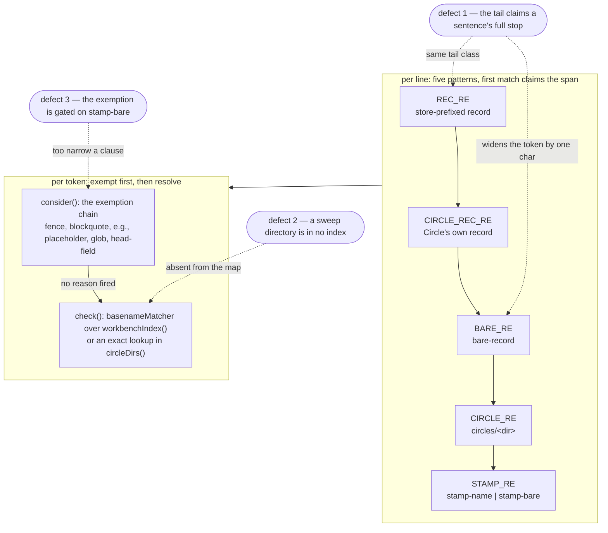

# Implementation Plan: repair three citation-grammar defects

**Date:** 2026-08-31
**Status:** Partially Complete
**Spec:** none — planned from three filed defect records
**Decidability:** The load-bearing question is defect 3's: *is this head-field value a pointer at a record or an identifier that names no record?* From the token text alone it is **not decidable** — a session identifier and a Circle directory name are both `<stamp>-<name>`, which is measured below and is what refutes candidate 3. So the mechanism changes rather than the approximation improving (`rules/critical-stance.md` §4): the grammar stops asking about the token and asks about the **field label**, an input `isHeadFieldValue()` already parses and which does separate the two classes. Defects 1 and 2 pose no such question — the tail class and the directory index are each decidable from what the mechanism already reads.

## Directive

Repair the three grammar defects a consuming project reported, filed here as
`260831-2119_*_the-bare-record-tail-class-admits-a-full-stop-so-a-citation-ending-a-sentence-dangles.md`,
`260831-2120_*_an-archive-sweep-directory-is-in-no-index-so-a-citation-naming-one-dangles.md` and
`260831-2121_*_the-head-field-exemption-reads-only-a-bare-stamp-so-a-name-shaped-identifier-in-a-head-field-is-judged.md`.
That project has been trying for several days to reach a usable state and its blocking gate is red over all three, so this plan takes the smallest correct change at each site and states, per step, where generality was traded away.

## Current State

Everything is in `hooks/lib/citation-scan.ts` at `637f9dbf`. Three readers share the grammar: `bin/fusion-citation-check`, `bin/fusion-citation-sweep`, and the blocking gate `hooks/lib/__tests__/workbench-citation-lint.test.ts`. A fourth, `hooks/lib/__tests__/reference-resolution-lint.test.ts`, runs it over the shipped text and pins three counts.

Measured at `637f9dbf`, and each figure is the command's own output:

| reading | command | value |
|---|---|---|
| corpus verdict | `./bin/fusion-citation-check` | `files=2416 tokens=22626 judged=17997 resolved=17312 dangling=313 undecidable=3214 exempt=1787 verdict=violations` |
| sweep | `./bin/fusion-citation-sweep --dry-run \| tail -1` | `files=0 rewrites=0 residual=2840 … mode=dry-run` |
| suite | `cd hooks && npm test` | 47 files, 818 tests, green |
| pinned triple | `reference-resolution-lint.test.ts:480` | `{ paths: 1563, anchors: 216, stampBare: 11 }` |
| hook-test surface | golden `[hook-tests lines]` total vs `TEST_LINE_BASELINE` | 20 170 now, floor 17 875, head-room 2 500 → **205 lines remaining** |

Three corrections to the filed records, each measured here and each to be carried into the record's closing note rather than left standing:

- The tail defect's record says its 11 rows are "all inside `archive/`". Measured, **5 are and 6 are not** — the six sit under `circles/…/history`, `circles/…/analyses`, a `_c_` issue, an `_i_` decision and `shared/history` twice. The count of 11 is right; the placement claim is not.
- No row of either defect sits in the blocking gate's corpus. That corpus is Circle records, `portfolio.md`, `_o_` issues, `_o_`/`_a_` decisions and `_o_`/`_p_` plans, `archive/` excluded, and all 14 affected rows are in history files, analyses and terminal records. So **in this tree both repairs move the checker and not the gate**; in the reporter's tree they move the gate, which is the point.
- The head-field record leaves the property open and names two candidates. A third arrived from the orchestrator, derived from the record template. It is **refuted by measurement** — see step 3.

### Where the three defects sit in the walk



The graph carries one deliberate cycle-free asymmetry worth naming in prose: defect 1 sits in tokenising and defect 3 in exempting, and the two never meet, but **defect 1 reaches `REC_RE` as well as `BARE_RE`** because both tails are the same class — which is why step 1 is one rule applied twice rather than two fixes.

## Approach

Three independent repairs, one per defect, each a predicate or a class in one file. They share no state and can land in any order; they are numbered by the size of the corpus movement they cause, largest first, so a reading that comes out wrong is attributable to the step that moved it.

Two things this plan deliberately does **not** do. It builds no configuration surface (the second decision record below says why), and it performs no release: the version bump is a step obligation, the tag and the marketplace are not this plan's.

## Implementation Steps

### 1. [DONE] The tail class stops at a word, not at a full stop

- **Executor:** `coder`
- **Files:** `hooks/lib/citation-scan.ts`, `hooks/lib/__tests__/citation-grammar-boundaries.test.ts` (new), `hooks/dist/**` (rebuild)
- **Dependencies:** none

**Change.** `BARE_RE`'s tail is `[A-Za-z0-9._…*-]*` and `REC_RE`'s is `[A-Za-z0-9._…*\[\]-]*`. Append the same lookbehind to both, at the end of the tail:

```
(?<![A-Za-z0-9_…*-]\.)
```

Read: *the token may not end in a full stop that closes a word.* The tail stays greedy, takes the stop, fails the lookbehind, and backtracks one character. A trailing dot survives only when the character before it is itself a dot — which is the ASCII ellipsis, and nothing else.

**What it does to the three neighbours.** Verified by running the old and the new pattern over the same strings; every row below is that run's output, not an inference.

```
probe line                                  old token            new token
see 260819-1645_*_…corpus…md                …corpus…md           unchanged
see 260819-1645_*_…corpus…md.               …corpus…md.          …corpus…md
truncated 260819-1645_o_                    260819-1645_o_       unchanged
truncated 260819-1645_d                     260819-1645_d        unchanged
truncated 260819-1645_…                     260819-1645_…        unchanged
ASCII ellipsis tail 260819-1645_*_what-defines...        …defines...    unchanged
Unicode ellipsis then stop 260819-1645_*_what-defines….  …defines….     …defines…
ASCII ellipsis then stop 260819-1645_*_what-defines....  …defines....   unchanged
```

The last row is the one residual and it is stated rather than hidden: four dots are ambiguous between "elided, then the sentence ended" and "elided" — the rule leaves them exactly as they are today, so it is unchanged behaviour and not a new hole. `basenameMatcher()` and the ellipsis rule are untouched.

**Where generality was traded away.** The lookbehind trims one stop, not a run of them. `<stamp>_o_slug..` still dangles. That is prose nobody writes, and a rule that ate a run would have to decide where an ASCII ellipsis ends.

**Why `REC_RE` is in scope even though `store-prefixed=0` here.** `citation-sweep.ts:429` `readsBackWhole()` requires `hits[0].token === rewritten`. Fix `BARE_RE` alone and a store-prefixed citation ending a sentence produces the candidate `<basename>.md.`, which no longer reads back whole, so the sweep **declines** a rewrite it performs today — safe but silently worse. Fixing both tails is one identical lookbehind and makes the rewrite land correctly instead. That is the integral fix; two fixes with an asymmetry between them would be the point-solution.

**Corpus effect.** `dangling` 313 → **302**. Every one of the 11 rows resolves after the trim: all 8 distinct targets were put to the tree (`find fusion-workbench -name "<stamp>_?_<slug>.md"`) and each returns exactly 1. The 11 become `resolved`, so `resolved` 17 312 → 17 323 and `judged` is unmoved.

**Acceptance:**
```
./bin/fusion-citation-check | grep -c "md\.'"                  # expect: 0   (was 11)
./bin/fusion-citation-check | grep '^dangling='                # expect: dangling=302
./bin/fusion-citation-sweep --dry-run | tail -1                # expect: begins files=0 rewrites=0
cd hooks && npm run build && npm test                          # expect: exit 0, green
```
**If the reading differs:** a `dangling` above 302 means a row did not resolve — the checker names it, and the token is the evidence. A `dangling` below 302 means the lookbehind claimed something else too; `git stash` the change and diff the two checker outputs row by row, because a token that stopped being reported is not a token that was repaired (the standard `citation-sweep.test.ts:410` states for the sweep, applied here).

### 2. [DONE] An archive sweep directory is its own index entry

- **Executor:** `coder`
- **Files:** `hooks/lib/citation-scan.ts`, `hooks/lib/__tests__/citation-grammar-boundaries.test.ts`, `hooks/dist/**`
- **Dependencies:** none

**Change.** `circleDirs()` already walks `archive/<sweep>/circles/` and indexes the Circle directories inside a sweep — 24 live and 6 archived here — and already recognises the sweep with `SWEEP_DIR_RE`. It never indexes the sweep directory itself; the count of sweep entries in the map is 0. Inside the existing `for (const sweep of …)` loop, add the sweep's own name to `dirs` before the `add(\`archive/${sweep.name}/circles\`)` call, reusing the same push-or-set arm so a duplicate name accumulates paths rather than overwriting.

**What a sweep citation reports as its resolved path:** `archive/<sweep>`, its own path and not a Circle path inside it. The map is paths rather than names for exactly this reason, and the function's docstring says so; the docstring's opening line ("Every Circle directory a citation can name") becomes false with this change and is rewritten in the same edit to name what the map now holds — every stamped directory a citation can name.

**The ambiguity question, checked rather than assumed.** A sweep directory and a Circle directory share the name shape `<stamp>-<slug>`, so a collision is possible in principle. Measured here: 4 sweeps against 30 Circle directories (24 live, 6 archived), `comm -12` over the two sorted name lists returns nothing. Were they to collide, the resolver reports `ambiguous` with both paths — which is the honest answer and is already how two same-named Circle directories in two sweeps behave. `scanRecordCitations()` counts `ambiguous` as resolved, so no collision can redden the blocking gate; `partition()` puts it in `undecidable`, so none can inflate `dangling` either.

**A second reader, named because it is easy to miss.** `STAMP_RE`'s `stamp-bare` branch prefix-matches against `circleDirs()`. Adding sweeps means a bare stamp can now also match a sweep name. That moves nothing measurable: `stamp-bare` is `undecidable` in `partition()` whatever it resolves to, and it is outside `GATE_KINDS`, so neither `dangling` nor either gate can see it.

**Where generality was traded away.** Only the sweep directory joins the index. A record naming an archive sweep by *path* (`archive/<sweep>/`) still produces no token at all, because every pattern's lookbehind refuses a `/` in front of the stamp. That is unchanged behaviour and out of this repair's scope; the record notes the same thing in its second probe.

**Corpus effect.** `dangling` 302 → **299** (313 → 310 if this step lands first). The three rows all carry the one sweep name, in two history files, both in the shared history store — named in words rather than spelled in front of each basename, because `store-prefixed` is decided from a token's shape before any lookup and no exemption reaches it, the fence included:

```
260819-1400-reconciliation-circles.md:96   '260817-1907-safe-cleanup-scoped'  dangling
260819-1400-reconciliation-circles.md:166  '260817-1907-safe-cleanup-scoped'  dangling
260825-1453-curator-run.md:31              '260817-1907-safe-cleanup-scoped'  dangling
```

No other sweep name is cited bare anywhere in the corpus.

**Acceptance:**
```
./bin/fusion-citation-check | grep -c "'260817-1907-safe-cleanup-scoped'"   # expect: 0   (was 3)
./bin/fusion-citation-check | grep '^dangling='                            # expect: dangling=299
cd hooks && npm run build && npm test                                      # expect: exit 0, green
```
plus one case in the new test file asserting that a scanner over a scratch workbench resolves a sweep name to `archive/<sweep>` and not to a path under it — the CLI prints violations only, so the resolved *path* is not readable from it and needs the unit case.

**If the reading differs:** a `dangling` still at 302 means the entry was added to a map the resolver does not read — check that it went into `circleDirs()`'s own `dirs` and not into `workbenchIndex()`. A value below 299 means the sweep entered the prefix branch as well as the exact one; that is visible as a `stamp-bare` row changing status, and it is harmless but is not this step.

### 3. The head-field exemption reads the field label

- **Executor:** `coder`
- **Files:** `hooks/lib/citation-scan.ts`, `hooks/lib/__tests__/citation-grammar-boundaries.test.ts`, `hooks/dist/**`
- **Dependencies:** none. **Blocked on one user answer** — see below.

**The property is a parameter of this step, and the user's answer decides it.** The filing record names two candidates and endorses neither; the orchestrator derived a third from the record template and has put it to the user in parallel with this planning run. The question is filed as `260831-2142_*_which-property-separates-a-head-field-identifier-from-a-head-field-citation.md`. If the answer arrives before this plan is approved, this step takes it.

**What changes in the code once a property is chosen.** The whole of it is one clause, `hooks/lib/citation-scan.ts:712-717`:

```ts
: kind === "stamp-bare" && isHeadFieldValue(before, text.slice(idx + token.length))
  ? "head-field"
```

Per candidate:

1. **The field label.** Add an exported `IDENTIFIER_HEAD_FIELDS` beside `MARKER_WORDS`; give `isHeadFieldValue()` a sibling that returns the parsed label or `null` (the regex already captures the line shape); the clause becomes *the value is the whole of a head field, and either its kind is `stamp-bare` or its label is enumerated.* **A union with today's clause, not a replacement of it** — narrowing the bare-stamp exemption to a label list breaks a committed case, `citation-sweep.test.ts:70-88`, which asserts that `**Date:**` and `**Started:**` produce no token. Cost: ~10 lines plus the list.
2. **Resolves or is exempt, never dangles.** Structural, not a predicate: exemptions run **before** `check()` in `consider()`, so this option reorders the walk — resolve first, then decide exempt-versus-dangling — and every other exemption's ordering has to be re-argued against the new sequence. Cost: the largest of the three, in the one place a walk's order is load-bearing.
3. **Neither `.md` nor a marker slot.** Two `test()` calls on the token, restricted to `kind === "stamp-bare" || kind === "stamp-name"` so a `circle-dir` in a head field is not swallowed with them. Cost: ~4 lines. **And it is refuted — see the measurement below.**

**The check the orchestrator asked for, run rather than assumed: does a sanctioned head field ever hold a citation without `.md`?** Yes, routinely. A Circle is cited by bare directory name, and head fields hold one in **249 lines outside `archive/`** in this tree, over eight labels:

```
231  **Circle:**            4  **Cross-references:**    1  **Product:**
  6  **Provenance:**        4  **Result:**              1  **Circle created:**
  1  **Session:**                                       1  **Activated from Circle:**
```
```
grep -rhInE '^\*\*[^*]+:\*\*[[:space:]]+`?[0-9]{6}-[0-9]{4}(-[a-z0-9]+)+`?[[:space:]]*$' \
  --include="*.md" fusion-workbench/circles fusion-workbench/shared rules agents skills docs *.md
```

Six of those are `**Provenance:**` lines in `rules/*.md` — inside `reference-resolution-lint.test.ts`'s shipped surface, which is a blocking gate. Candidate 3 would exempt every one of the 249 and blind a broken `**Circle:**` exactly as candidate 2 blinds a broken `**Active spec/plan:**`. The property it proposes does not separate the two classes.

**Recommendation: candidate 1, and the user's answer decides it.** Reasoning, in descending weight. Candidate 3 is out on the measurement above, not on cost. Between 1 and 2 the failure directions are asymmetric: 1 fails **strict** — an un-enumerated label produces a false dangle, which is visible in its own row and repairable — while 2 fails **loose**, staying quiet about something broken. This project has already written that asymmetry down, in `workbench-citation-lint.test.ts`: *a citation gate erring strict costs a repair while erring loose costs a dead pointer nobody sees.* And 2 is the largest build of the three, which is the opposite of what a blocked project needs. The filing record's acceptance line asks for a property rather than a list of fields; the measurement says no such property exists over the token, and the record's own second branch — *or the record says plainly that an enumeration was chosen and why* — is the one taken.

**The cost of candidate 1, stated rather than softened.** The list is compiled into fusion, so a consuming project cannot extend it: its own identifier field is judged until fusion ships the label and the project runs `fusion --update`, the one-release-behind cost every `bin/` helper already carries. It does **not** block the reporting project today — `Bus session` is fusion's own retired bus-protocol label (removed v3.15.0), so a shipped list clears their 20 rows with no configuration. The recurrence is filed as `260831-2143_*_does-a-project-declare-its-own-identifier-head-fields.md`, which recommends leaving the configuration lever until a project has a label fusion cannot enumerate for it.

**The list's first entry is the only one evidence supports.** `Bus session`, cited to the reporter's 20 rows. This tree carries no instance of the defect at all (`grep -rc '\*\*Bus session:\*\*' fusion-workbench/` finds no file), so the enumeration grows on measured evidence and never on anticipation — which is also what keeps it small enough to read.

**Corpus effect.** `dangling` **unmoved at 299** under every candidate: this tree carries no instance. The pinned triple is unmoved under all three as well — `stampBare` counts non-exempt `stamp-bare` tokens, and no candidate takes an exemption away from one.

**Probe set** (one test case each; the fifth is the discriminator):

```
probe line                                       required verdict                candidates
**Date:** 260722-1943                            stamp-bare/exempt(head-field)   1, 2, 3
**Bus session:** 260722-1943-some-identifier     exempt(head-field)              1, 2, 3
**Active spec/plan:** <a live record>.md         bare-record/resolved            1, 2, 3
**Circle:** <a live Circle directory>            stamp-name/resolved             1, 3   (2: exempt)
**Circle:** 260101-0000-no-such-circle           stamp-name/DANGLING             1 only
**Provenance:** 260801-1244-guard-rules-write    stamp-name/resolved             1, 3
```

**Acceptance:**
```
./bin/fusion-citation-check | grep '^dangling='   # expect: dangling=299, unmoved by this step
cd hooks && npm run build && npm test             # expect: exit 0, green
```
and the six probes above as cases in the new test file, written against whichever candidate the user chose, with the rows the chosen candidate does not satisfy deleted rather than inverted.

**If the reading differs:** any movement in `dangling` at this step means the clause reached a token class it was not meant to. The clause is gated on `isHeadFieldValue()`, which requires the token to be the *whole* value of a `**Label:**` line; a movement means that guard was dropped.

### 4. Close the records and bump the version

- **Executor:** `coder`
- **Files:** the three `_o_` issue records in `fusion-workbench/shared/issues/`, the decision `260831-2142_*_which-property-separates-a-head-field-identifier-from-a-head-field-citation.md`, `.claude-plugin/plugin.json`
- **Dependencies:** steps 1, 2 and 3

Transition the three issues `_o_` → `_c_` per `rules/fusion-workbench-conventions.md` `## Inline State Tracking`, and the head-field decision `_o_` → `_a_` → `_i_` (the answer, then its realisation). Carry the three corrections from `## Current State` into the closing notes — in particular that the tail defect's 11 rows are not all in `archive/`.

Bump `.claude-plugin/plugin.json` `version`. **The release is not this plan's**: the marketplace bump, the tag, the `bin/fusion-review-coverage` reading and `docs/upgrading-to-v10-*.md` are the release process's steps and are a precondition of the tag, not of this plan's closure.

**Acceptance:**
```
ls fusion-workbench/shared/issues/260831-21{19,20,21}_c_*.md   # expect: three files
cd hooks && npm test                                            # expect: exit 0, green
```

## Where this Circle stops

No Circle is active, so these are the conditions under which this plan's own work is finished.

1. `./bin/fusion-citation-check | grep '^dangling='` reads `dangling=299`, or the reading differs and the difference is named against the step that caused it before the work is called done.
2. `./bin/fusion-citation-sweep --dry-run | tail -1` begins `files=0 rewrites=0`.
3. `cd hooks && npm test` exits 0, with `BASELINE` in `reference-resolution-lint.test.ts` unedited. Should it need editing, the re-approval note is written in the same commit as the widening, per that file's own contract.
4. `hooks/dist/` is the compilation of the committed source (`committed-dist.test.ts` green), so `npm run build` ran after the last edit to `hooks/lib/citation-scan.ts`.
5. The hook-test surface is inside its head-room, re-measured after the last step rather than taken from this plan's figure.
6. The three issue records carry `_c_` and `260831-2142_*_…` carries `_i_`.
7. `.claude-plugin/plugin.json` carries a bumped version. **Precondition of a later act, not of this plan:** the release — the marketplace bump, `git tag -a v<version>`, and the `bin/fusion-review-coverage --since <previous tag>` reading stated in the release commit — must be satisfied before a tag is pushed, and no step here performs any of it.

## Data Structures

One new exported constant, and only under candidate 1 of step 3:

```ts
/** Head-field labels whose value is an identifier and never a pointer. Grown on
 *  measured evidence: an entry is a label somebody wrote in a record. */
export const IDENTIFIER_HEAD_FIELDS: ReadonlySet<string>;
```

Exported for the same reason `MARKER_WORDS` and `GATE_KINDS` are: one spelling, and a test can compare the list against the tree instead of restating it.

## API Changes

None across a module boundary. `Scanner`'s shape, `CitationKind`, `CitationStatus` and `CitationHit` are unchanged; `circleDirs()` keeps its signature and widens what it returns.

## Testing Strategy

One new file, `hooks/lib/__tests__/citation-grammar-boundaries.test.ts`, holding all three defects' probes: the eight tail rows of step 1, the sweep-resolution and no-collision cases of step 2, and the six head-field probes of step 3. It runs `createScanner()` over a scratch workbench, the way `citation-sweep.test.ts` already does, so no case depends on this repository's own tree.

Spreading the cases across `fenced-code-exemption.test.ts` and `fusion-citation-check.test.ts` costs the same number of lines against the growth bound — the budget is per surface, not per file — so the choice is one of naming: `fenced-code-exemption.test.ts` is scoped to one exemption and three unrelated grammar probes would make its name false.

**The two count-pinning gates, and which step moves which.**

- `reference-resolution-lint.test.ts` pins `{ paths: 1563, anchors: 216, stampBare: 11 }` and asserts zero dangling references over the shipped surface. **Predicted unmoved by all three steps.** No shipped file carries a token ending `md.` (the 11 are all under `fusion-workbench/`), `paths` and `anchors` are different classes entirely, and `stampBare` counts *tokens*, which no step adds, removes or exempts. Its `records` count moves and is not pinned. **The documented response if it does move is re-approval** — a new value written into `BASELINE` with a note above it attributing the move share by share, in the same commit as the widening. That file's own contract says so and says what is not the answer: widening the assertion back into a floor.
- `workbench-citation-lint.test.ts` recomputes its corpus every run and carries **no baseline and nothing to re-approve**. **Predicted unmoved in this tree** — none of the 14 affected rows is in its corpus — and strictly greener in the reporter's. **The only response to a red run there is a repair**, of the citation or of the grammar; the gate's own failure message names adding a file to `RECORD_EXAMPLE_FILES` as the wrong answer.

Both directions of risk are covered by one property that holds for all three steps: every change here either removes a violation or leaves it. Step 1 only ever shortens a token; step 2 only ever adds an index entry; step 3 only ever adds an exemption. None can turn a resolved citation into a dangling one, so no step can redden a gate that is green today.

**Line cost against `surface-growth-bound.test.ts`.** Measured at `637f9dbf`: the hook-test surface totals 20 170 lines against a `TEST_LINE_BASELINE` floor of 17 875, so 2 295 of the 2 500 head-room is spent and **205 lines remain**. The new test file has no baseline entry, so its whole size counts. Budget it at roughly 40 lines for step 1, 35 for step 2 and 45 for step 3 — about 120, leaving 85. `hooks/lib/citation-scan.ts` is in **no** bounded surface, so the grammar edits and their header prose cost nothing here. Re-measure before the last commit rather than trusting this figure:

```
cd hooks && npx vitest run lib/__tests__/surface-growth-bound.test.ts
```

## Risks & Mitigations

| Risk | Mitigation |
|---|---|
| Step 1's lookbehind eats an ASCII ellipsis and silently breaks truncated citations | The eight-row probe table is the case list, run against the pattern before the plan was written; the ASCII-ellipsis rows are in it and are asserted unchanged |
| Step 1 changes `REC_RE` and the sweep starts declining rewrites it used to make | Both tails get the same rule in the same edit, so the candidate carries no stop and reads back whole; `citation-sweep.test.ts`'s idempotency gate and its visibility invariant both cover it |
| Step 2 makes an existing Circle citation ambiguous | Measured: no sweep name collides with any of the 30 Circle directory names. A collision would report `ambiguous`, which neither gate treats as a violation |
| Step 3 is built against a property the user did not choose | The step is written as a parameter with the code change spelled per candidate; it does not start before the answer to `260831-2142_*_…` arrives |
| A candidate-1 label list becomes an allowlist that swallows real defects | Entries are added on measured evidence only, and the list starts at one entry. The union with the existing bare-stamp clause is what keeps `citation-sweep.test.ts:70-88` green and is stated in the step |
| The 205-line head-room is exhausted and the suite goes red | Re-measure after each step; the way out of a red bound is a cut, never a baseline edit (`hooks/lib/__tests__/helpers/growth-bound.ts`) |
| `hooks/dist/` is left behind the source | `npm run build` is in every step's acceptance block, and `committed-dist.test.ts` fails the suite otherwise |

## Open Questions

- [ ] **Which property separates a head-field identifier from a head-field citation** — `260831-2142_*_which-property-separates-a-head-field-identifier-from-a-head-field-citation.md`. Blocks step 3 and nothing else. The user's answer decides it; this plan recommends candidate 1 and shows candidate 3 refuted.
- [ ] **Does a project declare its own identifier head fields** — `260831-2143_*_does-a-project-declare-its-own-identifier-head-fields.md`. Blocks nothing here; the record recommends leaving the lever until a project has a label fusion cannot enumerate for it.
- [ ] Does the enumeration under candidate 1 need entries beyond `Bus session`? Answerable only over the reporting project's tree, with the same `grep` this plan used on ours. It is a step-3 input, not a design question, and an absent entry shows up as a false dangling row naming its own label.

**No user gate beyond the plan approval and defect 3's property.** Every other decision in this plan is settled by a measurement stated here or by a contract already written down in the file it governs.

## Reconciliation Log

**260905-2015 (reconciler, domain `code`, HEAD `5b84b13a`) — marker unchanged at `_o_`,
`**Status:** Draft` → `Partially Complete`, steps 1 and 2 marked `[DONE]`.**

Every figure below is the command's own output at HEAD, not a reading of a diff or of a step's
acceptance block.

**Step 1 — landed, in `4f5834ef`.** `SENTENCE_STOP` is one constant at
`hooks/lib/citation-scan.ts:296` and both tails carry it, `REC_RE` at `:324` and `BARE_RE` at `:354`,
which is the plan's "one rule applied twice" taken as written rather than two fixes.
`node hooks/dist/citation-check.js | grep -c "md\.'"` returns 0. Its record closes at this pass.

**Step 2 — landed, in the same commit.** `circleDirs()` indexes each sweep directory in its own right
and its docstring at `:803-808` names the defect record as the reason. A probe resolves the one sweep
name cited bare in this tree to `archive/<sweep>` rather than to a Circle inside it, which is the
clause the CLI could not have shown. Its record closes at this pass.

**Step 3 — not started, and blocked on a ruling rather than on work.**
`grep -rn IDENTIFIER_HEAD_FIELDS hooks/` finds nothing and the clause at `:912` is unchanged. The
blocking question stands at `_o_` **with its recommendation withdrawn**: this plan recommended
candidate 1, the field-label enumeration, and a measurement appended to that record on 260831-2215
refuted it on the same kind of evidence that refuted candidate 3 — 26 distinct stamp-shaped head-field
labels in this tree, and one label, `**Session:**`, carrying both a citation and a timestamp under the
same name. A fourth direction is named there (an unresolvable head-field value classified
`undecidable`) and the record says plainly it was never put to the user. **No executor can be
dispatched against this step as it stands.**

**Step 4 — partly done and not by this plan.** The two records for steps 1 and 2 reach `_c_` at this
pass; the third stays `_o_` because its step is unbuilt, and the head-field decision stays `_o_`.
`.claude-plugin/plugin.json` reads `10.23.0`, bumped several times by other work since this plan was
written, so the step's version obligation is satisfied incidentally rather than performed.

**Against `## Where this Circle stops`, condition by condition.**

1. `dangling=301`, not the 299 the plan predicts. **Not a fault of either step**: the corpus grew from
   2 416 files to 2 521 between the plan and HEAD, and 2 837 tokens with it, so the figure the plan
   fixed is stale rather than missed. The eleven rows step 1 was to resolve are gone and the three rows
   step 2 was to resolve are gone; what the plan could not foresee is what arrived after it.
2. `node hooks/dist/citation-sweep.js --dry-run` reports `files=0 rewrites=0`. **Holds.**
3. `cd hooks && npm test` is green, 50 files and 864 tests. **Holds.** `BASELINE` in
   `reference-resolution-lint.test.ts` did move since the plan, twice, and each move carries its
   re-approval note in the same commit as this file's contract requires; neither move was this plan's.
4. `committed-dist.test.ts` green, so `hooks/dist/` is the compilation of the committed source. **Holds.**
5. The hook-test surface is inside its head-room, and the two surface baselines moved on 260905 at a
   merge of two in-budget lines (`9f3dfae4`), a third re-baselining event that postdates this plan.
6. **Fails on both halves**: the third issue is `_o_` and the decision is `_o_`.
7. A version is bumped. **Holds**, incidentally.

**What is left of this plan is one step, and it is the user's to unblock.** Steps 1, 2 and half of 4
are finished; step 3's whole content is a predicate nobody has a property for.
