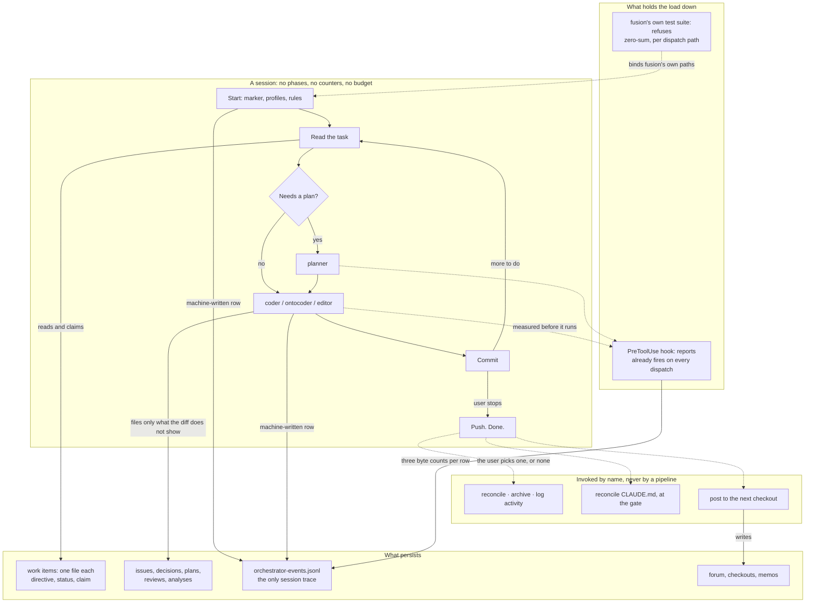

# Spec: cut fusion to a working minimum

**Date:** 2026-09-09
**Status:** Draft, revised after adversarial review
**Source:** The user's request to cut fusion's ceremony, following `260909-1047-size-versus-bookkeeping-across-three-projects.md` and its verification `260909-1345-verification-of-the-size-versus-bookkeeping-analysis.md`. Four clarification questions were answered: depth (d), cumulative across all four tiers; no agent-written session history; no closing pipeline; a zero-sum bound on everything a dispatch loads, `CLAUDE.md` included.
**Revised against:** `260909-1628-adversarial-review-of-the-cut-fusion-to-a-working-minimum-spec.md`, whose measurements govern this draft wherever it and the first draft disagree. Three issues it filed are answered here: `260909-1631_*_the-cut-spec-removes-agentstate-yaml-whose-existence-gates-every-machine-written-event-row.md`, `260909-1632_*_the-cut-specs-analyst-row-forbids-the-project-writes-its-own-claude-md-gate-requires.md`, `260909-1633_*_the-zero-sum-bounds-baseline-is-armed-at-the-moment-that-absolves-the-cut-it-must-measure.md`.
**Filed by:** shaper, Kai Stalmann <kai@qantr.com>

## Directive

After this work, a fusion session starts by reading its task, dispatches an executor, commits, and stops when the user says so. The portfolio layer, the turn loop, the closing pipeline and the per-dispatch history file no longer exist; eight agent roles remain where fifteen stood; and every byte a dispatch reads is held under a bound that cannot rise without an equal removal, measured per dispatch path against the totals that stood before the cut, and carried outside this repository by the hook that already fires on every dispatch.

## Evidence basis

This section exists so a reviewer can check the spec against its sources rather than against its confidence.

**What governs.** The verification governs over the analysis, and the adversarial review governs over both wherever it re-measured. Every figure below was measured at `bb341360` or is quoted from a source named beside it.

**Established, and this spec rests on it.**

- The phase ledger (verification F4, reproduced to the byte by this spec and again by the review). One coder dispatch reads 183.8 KiB of instruction text; the ramp-up 425.2; the minimum cleanup 505.8; a full closing 950.8. The closing reads 5.2 times what the one productive dispatch it wraps reads, and yields no artifact the user asked for.
- The ramp-up is 16 numbered steps, of which 11 are pre-flight against the local installation rather than the project. Two of the 11 are genuine prerequisites: Step 0, which writes the marker every agent walks up to find, and Step 0d, which places a profile `bin/fusion-rules` emits into every dispatch (verification C14). The other nine are not.
- Between a third and a half of all questions put to the user fall after the session's last production dispatch (verification C10: 106 of 290 classified events, 37 percent pooled, 50 percent in fusion's own log). About half the sessions carrying an identifier, 26 of 53, ran no production dispatch at all, and the closing does not shrink for them.
- Bookkeeping load does not vary with project size, across three projects spanning three orders of magnitude, under every classifier tested (finding 1, held under every test applied).
- History is the largest single record kind by bytes, at 33 to 37 percent (verification C11).
- The path a coder dispatch reads regrew after the 2026-08-27 cut while the instrument meant to hold it showed green throughout, because the instrument bounds the universal core and the growth fell outside it (verification M1 to M3). C8 carries the figures.

**Established in direction, not in value, and used only for direction.**

- Session ceremony is on the order of 13 to 17 percent of attributed wall clock (analysis finding 7). Verification U1 marks every figure in that finding reproducible in direction and not in value, because it depends on three unstated classifiers. F10 confirmed the wall-clock model in aggregate and did not confirm this split. No capability below turns on the value.
- Dedicated bookkeeping agents are 2.3 to 10.0 percent of dispatch time (verification F13, which governs over finding 8's 3 to 10). Removing a bookkeeping pass buys almost nothing, because the bookkeeping is performed inside every productive dispatch.

**Corrected, and may not appear anywhere in this work.** The "eightfold rise" (it is roughly threefold in the one project with the history to show it, verification O1); the "108 KiB peak" (it is 141.7 KiB on 2026-08-04, C1); the "24 KiB cut" (it was three commits and 33.6 KiB, C2); the "12 percentage points of fix share" (about ten, and the pooled row is confounded, C5); and the qualification that throughput is "not ordered by size" (it reverses under a defensible alternative classifier, C4).

**Forbidden as a justification.** The conditioning load is a candidate the data does not exclude and does not establish (verification O2). No capability below is justified by a claim that cutting rule bytes lowers the error rate. Where the spec cuts conditioning text it does so because the text is unread, duplicated, or attached to a mechanism being removed, and it says so.

**The honest shape of the case.** Every measurement supporting this cut is a count of bytes, steps or rows. Not one of them shows that the ceremony being removed produces worse work, and none shows that removing it will produce better work. The claim this spec rests on is narrower and survives audit: fusion charges a large, fixed, measured cost whose value has never been demonstrated, and the party paying it wants it gone.

## The shape after the cut

## Capabilities

### C1: The session has no procedure

**Description:** The orchestrator stops being a procedure and becomes a dispatch loop. It reads the task, dispatches, commits, and repeats until the user stops it. Nothing counts turns, nothing budgets them, nothing checks convergence on a schedule, and no gate fires because a phase boundary was reached.

What goes: the numbered phases (0, 0b, 1, 2, 3, 4), the Turn loop and its per-Turn steps (3a through 3e), the Turn budget and `bin/fusion-turn-budget`, the Max-Turns circuit breaker, the convergence check, the per-Turn coherence gate, the per-Turn review-coverage read, the Rebalance gate and `rules/orchestrator-rebalance.md`, the resume procedure and `rules/orchestrator-resume.md`, the session queue and the `taskplanner` role that builds it, `agentstate.yaml`, and the live dashboard file `orchestrator-live.md`.

What stays: dispatch, commit after each unit of work, and the machine-written event rows. The user is the loop's only bound, which is what the existing unresolved-budget check-in already made it whenever the budget could not be read.

**`agentstate.yaml` is a sentinel before it is a value carrier, and the sentinel is the harder half.** Its three values have named readers and move to the `session_start` row: the git head at session start (read by `bin/fusion-review-coverage --since`), the domain (read by `bin/fusion-session-domain`), and the session identifier, which `FUSION_SESSION_ID` already exports. Separately, the file's *existence* is what five machine-written surfaces gate on, through `orchestratorSessionInFlight()`: the `task_start` and `task_done` pair per dispatch, the async dispatch pairing, the `SubagentStop` row, the session-marker heartbeat that Setup's concurrency warning reads, and the `commit` row that `bin/fusion-commit-lock` writes. Delete the file with no replacement and every machine-written row stops, which makes C4's only trace, C8's per-dispatch row and C9's presence reader unsatisfiable at once.

The replacement is specified by its properties rather than its mechanism, because the current sentinel already fails on one of them. `260909-1454_*_a-dispatch-outside-a-recorded-session-writes-no-event-row-and-nothing-reports-it.md` measured a dispatch that wrote no row because the model had not written the file. So: the sentinel must be written by machine at session start, must not be a file any agent can decline to write or skip under task pressure, and its absence must be reported rather than silently producing an empty log. Two candidates already exist and the choice is the planner's: the session marker at the workbench root, whose mtime the PostToolUse hook already refreshes, and the exported session identifier, which SessionStart already writes.

**Acceptance criteria:**
- [ ] A session can be started, can dispatch an executor, can commit, and can end, with no file named `agentstate.yaml` and no file named `orchestrator-live.md` written at any point, and every machine-written row that is written today is still written.
- [ ] The session sentinel is written by a hook, not by an agent, and a dispatch that finds no sentinel produces a reported condition rather than a missing row.
- [ ] `agents/orchestrator.md` contains no numbered phase, no Turn count, no budget, and no circuit breaker.
- [ ] `bin/fusion-review-coverage` with no `--since` argument resolves its anchor without reading `agentstate.yaml`, and returns the same range it returns today for an equivalent session.
- [ ] `bin/fusion-session-domain` reports `source=` correctly with no `agentstate.yaml` present, and its no-workbench exit is unchanged.
- [ ] `bin/fusion-events` loses its `turns` subcommand rather than porting it. The quantity Turns counted no longer exists; `dispatches` already answers what a session did and gains scoping by session identifier.
- [ ] `orchestrator.maxTurns` is retired as a configuration leaf and a project that still sets it is told so. Fusion's retirement machinery is scoped to top-level keys and the `orchestrator` key survives for `dispatchMinutes`, so a leaf-scoped path is needed or the setting silently does nothing, which is the condition the existing advisory exists to prevent.
- [ ] Before each of the removed gates is deleted, its historical firing rate is read from the three event logs and written into the plan. The population is the `session_start` rows carrying a session identifier, counted per checkout by the `checkout` field so that union-merged foreign lines are excluded, and the denominator is stated with the count, because verification C10 found the session count itself moves from 43 to about 53 under re-derivation. A gate that fired in more than half of that population returns to the user before removal rather than being removed on this spec's authority.

**Also affected and not to be discovered during implementation:** `bin/monitor` reads `agentstate.yaml` and `orchestrator-live.md`, and its state panel is a second reader beyond the dashboard file itself; `bin/fusion-staging-drift` reads `session.history_file` from the state file and classifies all three removed files as its in-flight set, degrading to over-reporting rather than breaking; `bin/fusion-cadence-anchor` loses two consumers with C3 and keeps `last_forum_read_commit` with C9; `rules/workbench-tracking.md` carries four entries that become dead.

**Decisions made:**
- Depth tier (c), cumulative: the orchestrator procedure goes and is replaced by something markedly smaller (user, question 1).
- The event log absorbs the three surviving values rather than a smaller state file replacing it. Reason: the user's answer to question 2 makes the machine-written log the only trace, and a second state file would reintroduce what that answer removed.
- The sentinel is re-specified rather than ported. Reason: the current one is model-written and has a measured failure filed against it, so porting it would carry a known defect into the design that depends on it more heavily.
- The gate-firing read is a precondition, not a courtesy. Reason: each removed gate exists because something went wrong once, and nothing in the workbench records how often any of them fired. A measurement is cheap and converts a bet into a fact.

### C2: Nothing runs at session start except what the session cannot proceed without

**Description:** Starting a session performs the two steps that are genuine prerequisites and reads one marker. Everything else that runs today either moves behind that marker, moves into the machine-written row, or becomes a check the user invokes by name.

The criterion is what the critical path may contain, not how many steps it has. **The critical path may contain only: work without which the session cannot proceed, and work performed by a hook rather than by the model.** Everything else is off it.

Applied to all sixteen steps of the current ramp-up:

| Steps | Disposition |
|---|---|
| Step 0 (workspace marker), Step 0d (stylometric profiles) | Stay. Without the marker every agent halts; the profiles are emitted into every dispatch. Verification C14 corrected the analysis on exactly this point |
| Steps 0b, 0c, 0e, 0f, 0g, 0h, 0i, 0j, 0k (nine pre-flight checks) | Move behind a cached marker with a staleness date, and become reachable as one named installation check with a per-step selector, not nine commands |
| Step 1 (interrupted-session check) | Goes with C1: there is no state file to resume from |
| Step 2 (rules check) | Stays, and is not model work: it is the `bin/fusion-rules` call every dispatch already makes |
| Step 3 (context) | Off the critical path. Reading the project's context is the dispatched agent's job, and the orchestrator's copy of it is the largest single item on the largest path |
| Step 4 (history file) | Goes with C4 |
| Step 5 (event log and live dashboard) | Splits. The dashboard half goes with C1. The `session_start` row survives and must, because C1 moves three values onto it, and it is written by hook, so it is on the critical path without being model work |

**Acceptance criteria:**
- [ ] A session that has already run setup once, on an unchanged installation, reaches its first dispatch having performed only the two prerequisites, one marker read, and the hook-written `session_start` row. No model-written step other than the two prerequisites stands between session start and first dispatch.
- [ ] The marker records which checks ran, against which plugin version, and on which date, so that a plugin update or an expiry re-runs the nine rather than skipping them silently.
- [ ] The nine are reachable as one named check with a selector, and invoking one selector performs exactly that check. One body, not nine, because `skills/` carries its own growth budget and nine bodies would spend it to save critical-path time.
- [ ] The checkout identity remains available to every dispatch. It is exported at SessionStart today by a hook, not by a setup step, and that path is unaffected.
- [ ] Net bytes under `skills/` do not rise. `skills/setup/SKILL.md` is 50 575 bytes today and loses eleven steps; the new check body is the offset.

**Decisions made:**
- Two prerequisites, not zero, because verification C14 corrected the analysis on exactly this point and the corrected finding governs.
- The criterion is stated over what the path may contain rather than as a count. Reason: a count contradicts C1, which requires a hook-written row at session start, and a count cannot say why a step is allowed.
- A cached marker with a staleness date rather than deletion of the nine, and one check body with a selector rather than nine bodies. Reason: each of the nine answers a real question about the local installation and the fault measured is that they answer it on every start; nine near-identical bodies would spend the `skills/` budget to save critical-path time.

### C3: The closing is commit and push

**Description:** Ending a session commits the work and pushes it. Nothing else runs. The passes the pipeline performs become things the user invokes when the user wants them.

What goes, over all eight of the pipeline's selectable steps: Step 1, the scheduled issue-filing, is removed rather than re-homed, and what it caught falls to C5's conditional obligation or to a work item under C6; Step 2 becomes the whole of the closing; Steps 3 to 6 and the message half become five commands invoked by name; Steps 7 and 8 disappear with the housekeeping and the pipeline they serve.

**The reconciliation selector.** The dispatch asked this spec to settle it on a premise that is wrong: `--only reconcile` works today, because `skills/cleanup/SKILL.md` names `reconcile` in the step-name table that is the selector's whole vocabulary. What is true is narrower: reconciliation is a dispatch with no body of its own, so it appears in neither the sentence about bodies-that-were-commands nor the skill-bodies bullet in `CLAUDE.md`, while being a perfectly valid selector. Given that, the answer is the first of the two options the dispatch offered, carried to its end state: with the pipeline gone there is no `--only` to select within, so the four bodies and the reconciler dispatch become five commands invoked by name.

**Acceptance criteria:**
- [ ] Ending a session commits the work in meaningful splits and pushes, under the existing commit lock, and performs no dispatch and no other pass.
- [ ] Reconciliation, archiving, the activity log, the `CLAUDE.md` reconciliation and the message pass are each invocable by name, each performing exactly its own procedure.
- [ ] The `CLAUDE.md` reconciliation keeps its user gate, and the role that performs it keeps the write authority the gate is a gate on. It is the one gate that must survive, because it is the only place a normative surface is changed on evidence.
- [ ] No invocation of any of the five implies or triggers another.
- [ ] The archive pass keeps its confirmation on a standalone run. Verification C6 established that the pipeline never put an archive confirmation, so nothing is being moved here; the confirmation the standalone body already carries is simply the only one there ever was.
- [ ] Unfinished work at session end has one named home. Under C5 it is a record only when it carries something the diff does not show; otherwise it is a work item under C6, claimed or unclaimed. It is not the pipeline's issue-filing step, which is removed.
- [ ] Net bytes under `skills/` fall. `skills/cleanup/SKILL.md` is 25 624 bytes and goes; the five commands are four existing bodies plus one new one for the reconciliation dispatch.

**Decisions made:**
- No pipeline; the five passes are invoked individually (user, question 3, option a).
- Reconciliation gets its own invocation (user's addendum to 3a, with the premise corrected as above).
- The `CLAUDE.md` gate survives the cut, and C7 keeps a role that can act on it. Reason: a gate on a change no surviving agent may make is not a gate, which is the contradiction the review found in the first draft and the reason the roster in C7 is larger than that draft's.
- The pipeline's issue-filing step is removed rather than re-homed. Reason: it is a scheduled obligation to file records, which is the thing C5 removes, and re-homing it would reinstate by command what C5 removes by rule.

### C4: No agent writes a session history, and decisions carry the reasoning

**Description:** No agent writes a per-dispatch or per-session prose history file. The machine-written event log is the only trace of what a session did. `$OUT_HISTORY` stops being a write target for every agent.

**What is lost, and what catches the part that matters.** The loss the user accepted is the prose justification for choices, recorded nowhere else. The artifact that already exists for exactly that purpose is the decision record, which carries the reasoning, the options considered, the choice and its date, and which has the richer marker vocabulary for tracking whether a question is still open. The rule becomes: a choice a later reader would otherwise have to re-derive gets a decision record; everything else gets nothing.

That catches deliberate choices. It does not catch the other half of what a history file held, which is the record of an approach that was tried and abandoned. This spec does not reintroduce a file to catch it, and names it in the risks section instead.

**Acceptance criteria:**
- [ ] No agent prompt names `$OUT_HISTORY` as a write target.
- [ ] `bin/fusion-paths` no longer emits `OUT_HISTORY` to any consumer, and emits `SCAN_HISTORY` only where a reader of the existing corpus needs it. `/fusion:cadence` is that reader: two of its three ranked lists read the history store and one parses each file's `**Filed by:**` header to build its coverage line. It reads the frozen corpus and produces no new coverage past the cut, and the command says so rather than reporting a silent zero.
- [ ] The message-to-the-next-checkout pass, which today carries the session history file's basename in its pointer block, carries the commit range and the filed records without it, and omits the element rather than inventing an anchor. That omission behaviour is what its body already specifies for an unread element.
- [ ] The existing history corpus is not deleted. It stays readable where it is.
- [ ] The event log carries enough per dispatch to answer what ran, when, for how long, and by which checkout, which the machine-written `task_start`/`task_done` pair already does, and which C1's sentinel replacement is what keeps true.

**Decisions made:**
- No agent writes a history file (user, question 2, option a).
- The decision record is the named catcher for the part of the loss that matters, and no new artifact kind is created. Reason: reuse over new, and the decision record already exists for this purpose with a vocabulary for tracking whether the question is settled.
- The existing corpus stays. Reason: the 950 history records this repository filed between 2026-08-01 and 2026-09-09, against a lifetime stamped-record corpus of 2607 files (verification M5, C9), are the only evidence available for the open question of whether history files ever had a reader, and deleting them would destroy the means of answering it.

### C5: The record obligation becomes conditional, and the commit message is the per-commit record

**Description:** The uniform obligation of 4.4 to 6.3 records per source-touching commit ends. The commit message is the record of what a commit did. A record file is filed when the change carries something the diff does not show.

The record kinds that survive, with the condition that files each and no overlap between them:

| Kind | Store | Filed when |
|---|---|---|
| issue | `$OUT_ISSUE` | a defect exists that this change does not fix |
| decision | `$OUT_DECISION` | a choice was made whose reasoning a later reader would otherwise re-derive |
| plan | `$OUT_PLAN` | work spans more than one dispatch, so an instruction must outlive the dispatch that received it |
| review | `$OUT_REVIEW` | a review pass was run and found something |
| analysis | `$OUT_ANALYSIS` | a question was studied and answered without changing anything |

C6's work item is a sixth writable kind and not a record: it carries what is to be done rather than what was found, and it is the user's to create. Plans are the fattest artifact in the store a dispatch is pointed at, at 57 to 76 KB mean and 300.6 KiB across this repository's six live plans, which is a third of the whole store (verification M5). A plan gets a size ceiling, and a plan that needs more room is two plans.

**Acceptance criteria:**
- [ ] No agent prompt states an obligation to file a record per commit or per dispatch.
- [ ] Each of the five kinds carries the condition in the table above, and no change satisfies two conditions for the same content.
- [ ] A one-line fix to a small file can be committed with no record file at all.
- [ ] A plan file has a stated size ceiling, and what happens when it is exceeded is settled by the user decision still pending below.
- [ ] The measurement that says whether this worked is the share of commits whose message is the only record of what they did, read at one month, against the count of records filed in the same window. A fall in records alone measures compliance with the change and cannot fail; the pair measures whether the commit message actually absorbed the load.

**Decisions made:**
- The commit message is the per-commit record. Reason: it already exists, is already written, is already read, and travels with git rather than with the workbench.
- Plans get a ceiling. Reason: verification M5 measured them as the fattest artifact in the largest text a dispatch is pointed at, and no other record kind has that property.
- The success measurement is a pair rather than a count. Reason: the first draft's criterion could not fail, because removing an obligation to file records lowers the count of records filed by construction.

### C6: The portfolio layer becomes a flat list

**Description:** Circles stop being a container, a state machine and a ranked portfolio, and become entries in the flat store that already exists for work that is not yet a unit of work.

What goes: the Circle directory container with its six artifact subdirectories, the Circle record and its template, the six-marker state vocabulary, `portfolio.md`, the playmaker agent, `/fusion:next`, `/fusion:direct`, the `.active-circle` pointer, `rules/circle-records.md`, the Circle-versus-shared branch inside `bin/fusion-paths` with its second-argument form and its exit code 3, and the Circle-derived topic branch inside `bin/fusion-rules`.

What replaces it: the existing backlog store, one file per item, with two head fields added and the marker vocabulary dropped. Each item carries its directive, a status, and a claim naming the checkout working on it. Order is computed from confirmed prerequisite edges and reported; the user overrides it where he wants to. No agent originates an item, which is the rule that store already carries.

**The store's other bound is being overturned, and this spec says so rather than citing the rule as unchanged.** `rules/fusion-workbench-conventions.md` states two bounds in one sentence: no agent files a backlog entry, and the backlog is not the work queue. The first survives. The second does not: with Circles gone the distinction between an idea and a unit of work collapses, and the queue-builder that sentence points at is removed by C1. The reuse here is of the store's shape and its filing rule, not of its whole governing sentence.

**Playmaker's maintenance operations, which the first draft assigned to nobody.** The four confirm-gated operations on an entry, split, merge, close and defer, become edits the orchestrator performs at the user's word, with no agent dispatch: the user already confirms each one, and dispatching an agent to perform a confirmed edit is the shape this cut is against. The ranking rename between open and recommended goes entirely, because it is computed order and C6 makes order the user's.

**The Circle-derived topic, which the first draft did not notice.** `bin/fusion-rules` derives the context-manifest topic from `.active-circle`, then from the Circle record, then from the directory slug. With those gone, the topic re-sources to the claimed work item's slug, and where no item is claimed the helper takes no topic and emits no manifest units, which is exactly what it does today in a project with no manifest. C7 no longer depends on this mechanism for anything.

**One file per item, not one list file.** The per-file shape is what makes the store merge cleanly when two checkouts both add work, and merge behaviour is a multi-user property this cut is required to preserve. A single list file would conflict on every concurrent addition.

**The claim must be re-implemented, not merely removed.** The claim field lives on the Circle record today. It is the only place cross-checkout work is claimed, and without it two checkouts will do the same work. It moves to the item file as a head field carrying the eight-hex checkout identifier, which is the identifier every other multi-user surface already keys by.

**Acceptance criteria:**
- [ ] A work item can be created, claimed by a checkout, worked, and marked done, with no directory container and no marker on any filename.
- [ ] Two checkouts adding an item each, then merging, produces both items with no conflict.
- [ ] `bin/fusion-paths` resolves every `OUT_*` and `SCAN_*` key without reading `.active-circle`, keeps its `KEY=value` output shape and its exit codes 0, 1, 2 and 4, and loses exit 3.
- [ ] `bin/fusion-rules` derives a topic without reading `.active-circle` or a Circle record, and a session with no claimed item emits the same set it emits today with no manifest.
- [ ] No agent prompt and no skill body names a Circle, a state marker, or the active-Circle pointer.
- [ ] Existing Circle directories are migrated rather than orphaned: each becomes an item carrying its Directive, and the artifacts inside it move to the shared stores under the Origin Rule's fallback. The existing migration skill is the precedent for how this is offered and confirmed.
- [ ] The blocking citation gate is green after the migration. It recomputes its corpus from the tree with no approvable baseline, the citation grammar gives `circle-record` and `circle-dir` their own statuses, and this migration is the largest record move in the project's history. Retiring those two statuses is part of this capability.
- [ ] `rules/backlog-entries.md` is emitted to a surviving role or is folded into the always-on conventions. It is emitted to playmaker alone today, so removing playmaker leaves the rule governing the promoted store with no recipient.

**Decisions made:**
- Depth tier (b), cumulative: the portfolio layer goes, replaced by a flat list (user, question 1).
- The flat list is the existing backlog store rather than a new file or a new store. Reason: reuse of its shape and its filing rule, with the not-the-work-queue bound explicitly overturned above rather than quietly relied on.
- `bin/fusion-paths` keeps its interface and loses half its mechanism. Reason: every agent prompt and skill body reads its keys, and preserving the interface means the resolver's simplification touches no consumer.
- The four backlog operations go to the orchestrator and the ranking rename goes entirely, rather than either surviving in a role.
- The work-item file carries a machine-readable dependency field from its first version, so the confirmed prerequisite edges an order is computed from have a carrier before the migration rather than after it (`260909-1808_*_may-a-helper-compute-an-order-over-work-items-after-the-portfolio-layer-goes.md`, option 3).

### C7: Eight agent roles

**Description:** Fifteen roles become eight: an **orchestrator** that dispatches and commits, a **coder** owning code, an **ontocoder** owning structured data and ontology, a **planner** that turns a request into a written instruction, an **analyst** that reads and reports without writing to the project, a **reviewer** that reviews and files findings, a **curator** that changes normative text on evidence at a gate, and an **editor** that produces customer deliverables.

**The test a role must pass, and where it is not the whole argument.** A role exists when it owns a distinct write surface, or when it must be structurally forbidden from writing at all. The reason this is the test: the guard that used to enforce a path boundary was removed on 2026-08-12, so the dispatcher's choice of role is now the only thing standing between an agent and a file it should not touch, and that choice is made outside the agent that would do the touching. Applied honestly the test supports three of the first draft's nine removals and refuses six, which is why this draft keeps more roles than that one. What the test supports outright: `taskplanner` (its second limb), `shaper` (the same plan store as `planner`), and one of `coderev`/`ontorev` (identical surfaces). Of the six it refuses, this draft accepts the refusal for `curator`, which is the correction below; removes `playmaker` and `taskplanner` because C6 and C1 remove their subject matter rather than because the test says so; removes `bugfixer` on an extension of the test, that a surface which is the union of two others' is not a distinct one; and merges `consultant` and `reconciler` rather than dropping them, so neither surface disappears. One further role is kept on grounds the test does not supply, `coder` against `ontocoder`, and the paragraph below names them.

| Role | Exclusive write surface |
|---|---|
| orchestrator | commits; work items; machine-written session rows |
| coder | code, tests, build configuration, agent prompts and skill bodies |
| ontocoder | structured data, ontology, schemas, manifests |
| planner | plans and specs in the workbench |
| analyst | analyses and consultations in the workbench; writes nothing in the project |
| reviewer | review files in the workbench |
| curator | the project's normative text at a gate, and in-place corrections to existing workbench records |
| editor | project-side deliverables, outside the workbench |

Issues and decisions are a **shared surface every role may write**, and always have been: five of the eight declare `$OUT_ISSUE` and `$OUT_DECISION` as write targets today. The exclusivity requirement is over the surfaces in the table, not over these two.

**The curator survives, and this is the correction the review forced.** The first draft merged it into the analyst while C3 kept its gate, which cannot both be true: the curator's whole surface is gated writes to `CLAUDE.md` and the project's rule files, and a gate on a change no agent may make is not a gate. Merging the only role permitted to write the project's normative text into the role defined by writing nothing in the project is the precise failure the boundary test exists to prevent. It also costs nothing on the byte side, and saves: the merged path would have exceeded the pre-cut baseline of every role it absorbed.

**What each removed role carried, and where it goes.** Nothing here is dropped without being named.

| Removed | What it carried | Where it goes |
|---|---|---|
| shaper | specs; clarification with the user | planner, merge 1 |
| taskplanner | the dependency-ordered session queue | dropped with C1's phases; ordering becomes a section of a plan. After C4 it writes no file at all, which is the one clean instance of the test's second limb |
| consultant | `$OUT_CONSULT` advice files | analyst, merge 2. Its surface is a findings file in the workbench, distinct from the analyst's only by filename |
| coderev, ontorev | review files, distinguished only by the sender segment in the filename | reviewer, merge 3. Identical surfaces; the test compels this one |
| reconciler | in-place correction of existing plan, issue and review files; the `## Coherence` append onto a history file | curator, merge 4. The append dies with the history file. The rest is the curator's verb on an adjacent surface: compare a written surface against ground truth, propose, gate, apply |
| bugfixer | diagnose-then-fix over the union of coder's and ontocoder's surfaces, plus prompts | coder and ontocoder. A role whose surface is the union of two others' owns no distinct surface; the diagnose-before-editing instruction survives in both prompts |
| playmaker | portfolio ranking; `portfolio.md`; four gated backlog operations; the ranking rename | ranking and `portfolio.md` die with C6; the four operations become orchestrator edits at the user's word; the rename dies with computed order |

**The coder/ontocoder split is kept on grounds the test does not supply.** The test does not separate them: they are separated by the file's role rather than its path, which is why build manifests need a written carve-out. The grounds actually used are that a merged executor would carry the union of both conditioning bodies on every dispatch, which is the same byte argument that constrains every merge below, and that the domain parameter exists because some projects are data projects whose executor is the second of the two.

**What the roster cut costs, measured, replacing the first draft's claim that it buys no bytes.** That claim was wrong in the wrong direction. `bin/fusion-rules` keys its conditional emissions on the agent name, so a merged role inherits the union of every conditional its inputs satisfied, and the union is larger than any prompt saving. At the first draft's 22 000-byte prompt targets, the merges cost between 13 159 and 34 096 bytes on six of the eight paths they touch. The targets themselves were unreachable: the merged planner's inputs sum to 62 852 against 22 000, and the merged analyst's to 85 156.

So the byte targets are withdrawn and replaced by one derived rule, which is C8's baseline applied to a merged path: **a merged path's total may not exceed the smallest pre-cut total among the paths it replaces.** Measured, that gives each merge a budget and a required cut, and the second column is what the merge must fit inside:

| Merge | Budget | Rules under name-keyed emission | Prompt head-room | Prompt today |
|---|---|---|---|---|
| planner ← shaper | 202 428 | 100 155 | 8 841 | 48 782 |
| analyst ← consultant | 197 679 | 95 203 | 9 044 | 35 367 |
| reviewer ← coderev + ontorev | 192 521 | 91 995 | 7 094 | 15 235 |
| curator ← reconciler | 206 384 | 104 032 | 8 920 | 57 379 |

Three of the four are not reachable that way, and the reason is the same in each: the merged role inherits `user-facing-output.md` at 10 884 bytes because one of its inputs did. **Re-keying the conditional emissions off the agent name and onto the dispatch is therefore the enabling change of the whole roster cut, not a detail of it.** With that done, the head-room becomes 19 725 for the planner, 19 928 for the analyst, 19 804 for the curator, and 7 094 for the reviewer, and the required cuts are 60, 44, 65 and 53 percent of merged prompt text. The reviewer's is the credible one, because it merges two prompts that differ in one segment of one filename.

**Acceptance criteria:**
- [ ] Eight agent prompt files exist under `agents/`, and no ninth, unless a merge is stopped by the criterion below, in which case the count rises by one per stopped merge and the stop is written down with its measurement.
- [ ] Each surviving prompt states its write surface, the eight surfaces in the table above do not overlap, and issue and decision filing is declared a shared surface rather than counted against exclusivity.
- [ ] Every capability the eight removed roles carried appears in the table above with a named destination, and anything with the destination "dropped" is repeated in Out of Scope.
- [ ] No merged path's total exceeds the smallest pre-cut total among the paths it replaces, as C8 measures it. This replaces the two byte targets of the first draft, which were unreachable and which no measurement would have caught.
- [ ] The conditional rule emissions are keyed on something other than the agent name for at least `user-facing-output.md`, or three of the four merges are stopped.
- [ ] The review contract continues to reach the role that performs reviews. With `reviewer` surviving as a role this is the agent-name emission that exists today, and no topic mechanism is required, which matters because C6 removes the topic's only automatic source.
- [ ] Every dispatch parameter the surviving roles read is listed in one place, as the parameter roster already is.

**Decisions made:**
- Eight roles, not six. Reason: the write-surface test, applied honestly, refuses six of the first draft's nine removals, and two of those refusals produced contradictions with C3 and with the analyst's own prohibition. The number follows the test rather than the other way round.
- The curator survives as a role, with its gate and its write-safety discipline. Its prompt is 57 percent over the first draft's target on its own, and almost all of that is what makes a gated project-file write safe: the evidence tiers, the blast-radius stop, the preserve list, the wrong-prune detection and the revert path.
- The reconciler merges into the curator rather than the analyst. Reason: reconciliation is in-place editing of existing documents, which is the analyst's defining prohibition and the curator's defining capability.
- The byte targets are withdrawn and replaced by a rule derived from C8's baseline. Reason: they were invented numbers, they were unreachable, and the derived rule is checkable by the instrument this spec is already building.

### C8: A zero-sum bound on everything a dispatch loads

**Description:** The bounded quantity is the bytes a single dispatch reads before it reads one line of the project's own work: the agent prompt, the rule set `bin/fusion-rules` emits for that agent, and `CLAUDE.md`. It is measured per dispatch path, not averaged, and not as an always-on floor.

**The rule:** no dispatch path's total may rise above its baseline. An addition of N bytes to any component requires a removal of at least N bytes from the same path's total.

**What it is for.** The first draft stated no benefit, having correctly refused the one benefit its ancestors claimed. The honest benefit is narrower and is measured: it is the cut's own durability. The 2026-08-27 cut removed 33.6 KiB across three commits; thirteen days later the coder path had risen 21.9 percent, from 154 440 to 188 256 bytes, while the instrument meant to hold it showed green throughout, because 43 percent of the rise was in `CLAUDE.md` and the rest in rule files outside the core it measures. Without a bound covering the whole path, this cut buys a fortnight. That is the entire claim, it rests on a dated measurement, and it says nothing about error rates or token cost, the latter of which verification U4 marked unchecked.

**The baseline is the fifteen totals as they stand before the cut, not the totals after it.** A baseline armed at the moment the cut lands absolves the cut, which would make C7's stop discharged by a mechanism that cannot discharge it. Measured at `bb341360`:

| Path | prompt | emitted rules | `CLAUDE.md` | total | after the cut |
|---|---|---|---|---|---|
| orchestrator | 155 302 | 131 331 | 93 432 | 380 065 | survives; C1 must land far under it |
| playmaker | 42 955 | 125 674 | 93 432 | 262 061 | path ends with C6 |
| shaper | 29 057 | 128 279 | 93 432 | 250 768 | merged into planner |
| curator | 34 554 | 99 080 | 93 432 | 227 066 | merged with reconciler |
| reconciler | 22 825 | 90 127 | 93 432 | 206 384 | budget for curator ← reconciler |
| editor | 13 635 | 95 672 | 93 432 | 202 739 | survives |
| planner | 19 725 | 89 271 | 93 432 | 202 428 | budget for planner ← shaper |
| analyst | 21 038 | 84 319 | 93 432 | 198 789 | merged with consultant |
| consultant | 14 329 | 89 918 | 93 432 | 197 679 | budget for analyst ← consultant |
| coderev | 8 141 | 91 995 | 93 432 | 193 568 | merged into reviewer |
| ontorev | 7 094 | 91 995 | 93 432 | 192 521 | budget for reviewer |
| ontocoder | 13 262 | 85 175 | 93 432 | 191 869 | survives |
| bugfixer | 11 509 | 85 175 | 93 432 | 190 116 | path ends with C7 |
| taskplanner | 14 070 | 81 298 | 93 432 | 188 800 | path ends with C1 |
| coder | 9 649 | 85 175 | 93 432 | 188 256 | survives |

All fifteen are shown because all fifteen are the baseline. The coder row is 183.8 KiB, the verification's phase-ledger figure for one coder dispatch, reproduced. A surviving path is bound by its own row; a merged path by the smallest row among those it replaces; a path that ends has no baseline.

**Reconstruction, so a planner can compute a hypothetical path without running anything.** The always-on floor is 76 013 bytes: `agent-setup.md` 4 181, `fusion-workbench-conventions.md` 58 762, `critical-stance.md` 10 374, and the project's chat voice profile 2 696. The seven conditional emissions are `default-voice-en.yaml` 3 021, `design-diagrams.md` 5 285, `decision-record-examples.md` 4 952, `user-facing-output.md` 10 884, `circle-records.md` 28 124, `review-contract.md` 6 820, `bounded-dispatch.md` 9 162. Every one of the fifteen rule sets above reconstructs exactly from these.

Three of the seven conditionals are directly touched by this cut: `circle-records.md` goes with C6, `decision-record-examples.md` and `bounded-dispatch.md` lose most of their recipients with C7, and `bounded-dispatch.md` is one of the two files behind the measured regrowth this capability cites as its evidence.

**The baseline outside this repository is a per-project arming, not this table.** Verification M6 measured `bin/fusion-rules coder` at 85 175 bytes in fusion and in one other project and at 126 656 in a third that ships four project-side rule files, 48.7 percent higher. Two of the three components belong to the project, so fusion's totals say nothing about a consuming project's. A consuming project arms its own baseline on the reporting carrier's first run and the reported movement is against that; where none has been armed the rows are a series with no baseline, and the reader says so rather than comparing against fusion's.

**The two carriers, and the asymmetry between them.**

*Inside this repository:* the test suite, blocking. `CLAUDE.md` is in the test corpus here, so the whole quantity is measurable and a red run holds the bound. The existing emission-golden test is the place this belongs; it already drives the real script and forces the plugin root to this tree.

*Outside this repository:* the PreToolUse hook, reporting. It already fires on `Task` and `Agent`, already resolves the checkout identity, and already writes one machine-written row per dispatch; it gains the three byte counts for the dispatch it is about to allow, in that same row. The two carriers rejected: the setup step reports one figure per session and not one per path, and sits on exactly the critical path C2 is clearing; the curator's is a 227 066-byte dispatch, and dispatching an agent to report a byte count is the shape this whole cut is against.

**Re-baselining, and the event the reused rule does not have.** The existing three-event rule applies unchanged: after a cleanup, at an arming, and at a merge of two lines each inside the bound. It was written for a surface fusion owns, and two thirds of this quantity is the project's, so it has no event for a project that legitimately needs a larger `CLAUDE.md`. No fourth event is added: inside this repository the offset must come from another component of the same paths and the failure text says which, and outside it the question does not arise, because nothing is refused there. Three reasons for that, the first sufficient. Two of the three components belong to the project, so a refusal would stop a project's work over the project's own documentation. A PreToolUse denial has no recovery path. And fusion has shipped four deciding mechanisms on this hook and removed all four, the last after 24 consecutive false blocks against the agents' own verification commands.

**Why a report here is not the thing fusion deleted, stated at the strength the evidence carries.** Two of the three components are named files, counted exactly. The third is not a file but the output of a program, under arguments the hook does not fully have: after C6 there is no automatic topic source, so the hook can only run the helper with no topic, and a caller that passes one explicitly gets a set the hook did not count. The hook also fires before the dispatch runs, so it counts what the agent would read if it performs its Setup. The counted figure is therefore an upper bound with one named source of drift, which is a long way from the undecidable question about a shell command's text that the removed mechanisms answered, and is not the same as exact. That is why the conclusion is a report.

**Acceptance criteria:**
- [ ] The bound is stated over per-dispatch-path totals, and its baseline is the fifteen pre-cut totals in the table above, armed before the cut lands.
- [ ] Replayed over the window from 2026-08-27 to 2026-09-09, the new bound goes red and the existing core instrument stays green. Replayed over a window in which no component grew, the new bound stays green. Both halves are required: a zero-head-room bound goes red over any window containing one additive commit, so the first half alone distinguishes nothing.
- [ ] A change that adds bytes to `rules/fusion-workbench-conventions.md` fails the bound on every path; one that adds bytes to a conditionally emitted rule fails it on the paths that receive that rule and no others; one that adds bytes to `CLAUDE.md` fails it on every path, and the failure text says that a shared component's addition must be offset once in a shared component or once per path.
- [ ] The baseline moves only at the three existing events, each written down with what it absolved, and the failure text states that no event covers a growing `CLAUDE.md`.
- [ ] In a consuming project, every dispatch writes a row carrying the three byte counts and the resulting total, and no dispatch is refused on account of them.
- [ ] A consuming project arms its own baseline, and the reader reports movement against that or reports that none is armed. It never compares a project's total against fusion's.
- [ ] The rows are readable by name through the existing event reader, naming the path, the total and the movement.
- [ ] The figure is surfaced without being asked for at least once per session, in whatever the shrunk session start reports, sourced from the previous session's rows.
- [ ] The hook's added work does not turn the dispatch path into a synchronous subprocess on every call, or the cost is measured and stated. The hook currently allows a dispatch with no config load and no subprocess, and this would be the first thing put back on that path after a year of taking things off it.

**Decisions made:**
- The bound covers everything a dispatch loads, `CLAUDE.md` included (user, question 4, option b, with the wider scope the user stated). Measured support: `CLAUDE.md` is a median 47.00 percent of what a dispatch reads, it is the largest single item in ten of the fifteen paths, and it contributed 43 percent of the measured regrowth the existing instrument missed. The first draft said fourteen of fifteen and that was wrong.
- The quantity is per dispatch path, not a floor and not an average. Reason: the verification's recommendation 2, and the measured failure of the floor-based instrument.
- The baseline is armed before the cut, not at it. Reason: otherwise it absolves the cut, and C7's stop is discharged by a mechanism that cannot discharge it.
- The consuming-project carrier is the PreToolUse hook, it reports and never refuses, and it arms per project.
- The three-event re-baselining rule is reused with its gap named rather than extended.

### C9: The multi-user surfaces survive, and three of them need re-pointing

**Description:** Nothing in this cut removes a mechanism by which two checkouts or two people share one project. The surfaces that stay: the checkout identity and its registry, the presence and dispatch readers over the event log, the forum store with its read-before-pull helper and its message pass, the commit lock, the union merge driver on the event log, the concurrent-session marker, and the workbench tracking classes that decide what travels.

**Acceptance criteria:**
- [ ] The claim on a work item names the eight-hex checkout identifier and is visible to a checkout that has pulled, as C6 requires.
- [ ] The message pass composes its pointer block without the session history file, omitting that element rather than inventing one, and still carries the commit range and the filed records.
- [ ] The presence reader continues to name other people and other checkouts from the event log, and its reading of which work a session was on no longer depends on a Circle name in a history path.
- [ ] The commit row keeps being written. It is gated today on the same sentinel C1 replaces, so it is a test of that replacement and not merely of the lock.
- [ ] The event log keeps `merge=union` and keeps being read by the identity on each line rather than by a line's position, which is what makes it correct after a pull.
- [ ] Two checkouts can work the same project through a full cycle under the new design without either overwriting the other's records or silently taking the other's claimed item.

**Decisions made:**
- The multi-user surfaces are out of the cut's scope entirely (standing constraint from the original dispatch).
- The claim is re-implemented on the work item rather than dropped with the Circle record it lives on today.

## Stops when

- If the new bound, replayed over 2026-08-27 to 2026-09-09, does not go red, or the existing core instrument does not stay green over the same window, or the new bound does not stay green over a window in which nothing grew, then it is not measuring what C8 specifies and the work on C8 stops until the quantity is corrected.
- If a merge in C7 cannot bring its path inside the smallest pre-cut total among the paths it replaces, that merge stops and those roles stay split. Three of the four are outside their budget as things stand, so this stop is expected to fire at least once and the measurement, not a judgement, decides which.
- If the gate-firing read in C1 shows that a gate scheduled for removal fired in more than half of the stated population, that gate's removal stops and returns to the user.
- If migrating the existing Circle directories under C6 would orphan an artifact that no shared store can hold, or would leave the blocking citation gate red with no path to green in the same change, the migration stops and returns to the user before any file moves.
- If C2 and C3 together raise net bytes under `skills/`, the shape of the on-call commands returns to the user rather than being landed against that surface's own growth budget.

## Constraints

- The verification governs over the analysis, and the adversarial review governs over both where it re-measured. The five corrected figures listed in Evidence basis may not appear in any downstream document.
- The conditioning load may not be used as an established cause of anything.
- The multi-user surfaces survive.
- Nothing that has a demonstrated reader is removed on the grounds that it is large. Where something is removed because its reader is unknown, the spec says the reader is unknown rather than saying there is none. This applies to what the cut adds as well: C8 is required to state its benefit, and does.
- The existing record corpora are not deleted. Removal of an obligation to write is not permission to delete what was written.
- The bound in C8 lands in the same change as the cuts it bounds, armed at the pre-cut totals. A cut that removes bytes without changing what bounds them buys a fortnight, which is what the thirteen days after 2026-08-27 measured.
- One-way changes get a migration, offered and confirmed, on the precedent the existing migration skill sets.

## Out of Scope

- Deleting any existing record, history file, Circle directory or archive. This cut removes obligations to write and mechanisms that read; it deletes no history.
- Changing what a commit message contains beyond making it the per-commit record.
- The file-size finding. Splitting work away from large files is the other half of the analysis's recommendations and is separate work with a separate audience.
- Any claim about the error rate, in either direction.
- The release process, the installer, the marketplace, and the four version surfaces.
- The citation grammar's rewriting and sweep helpers. The grammar's two Circle statuses are **not** out of scope; they are retired inside C6, because that migration is exactly the event that reddens the blocking gate.
- The growth bounds on `agents/` and the hook test lines. C8 replaces the always-on rule bound with a per-path bound. The `skills/` bound is **not** out of scope: C2 and C3 both push against it and both carry a criterion that they do not.

**Deliberately dropped, named here so nothing is dropped silently:** the dependency-ordered session queue (C1); the ranked portfolio, `portfolio.md` and the computed order of work (C6); the backlog ranking rename (C6); the `## Coherence` append onto a history file (C7); the closing pipeline's scheduled issue-filing step (C3); coverage in `/fusion:cadence` past the cut, whose ranked lists read a corpus that stops growing (C4).

## What the cut costs and what it risks

**The benefit is unproven and the cost is measured.** The case is a large fixed cost of undemonstrated value, removed at the request of the party paying it. That is a good enough reason, and it is not a demonstrated improvement; the Evidence basis states why at length and the spec should not be read as promising one.

**The roster cut runs against the byte half of the same instruction.** A merged role inherits the union of its inputs' conditional emissions, so three of C7's four merges are outside their budget as things stand. If the re-keying of those emissions is not done, the roster cut delivers maintenance savings while raising per-dispatch bytes, and the honest outcome is that the roster stays larger than eight.

**History files may have a reader nobody has measured.** Nothing in three workbenches shows a history file being read back, and absence of a recorded read is not absence of a read: a cold-start sub-agent that greps the history store leaves no trace. The decision record catches deliberate choices. It does not catch the record of an approach tried and abandoned, which is the case where a later session repeats a mistake because nothing told it. This spec accepts that loss and names it here.

**The event log becomes a single point of failure, and its gate becomes one too.** With `agentstate.yaml` and the history files gone, one file carries the entire session trace. It merges by union and already has one recorded misattribution defect of that class. C8 adds three fields per row to the same file. C1's sentinel replacement is the second concentration: one machine-written condition now decides whether any row is written at all, and the current version of that condition already has a measured failure filed against it.

**Removing gates moves judgement to the user.** The circuit breaker, the convergence check and the coherence gate each exist because something went wrong once. C1 requires their firing rates to be read before they go, which converts most of that risk into a measurement, but the read shows how often each fired, not what it prevented on the occasions it did.

**The portfolio removal is a re-implementation dressed as a deletion.** The claim field is the only place cross-checkout work is claimed and it lives on the record being removed. If the move is done carelessly, two checkouts do the same work, and that failure is silent until both finish.

**A one-way door with a migration behind it.** Prompts, skills, rule files and resolver branches are recoverable from git. The workbench is not: existing Circle directories become data no surviving mechanism understands. The migration in C6 is the mitigation, is the part of this work most likely to lose something, and is also the event that reddens the blocking citation gate.

**The self-reference.** This spec is the activity the verification's fourth open question asks about, at its maximum scope: written by an agent whose own role is on the list to be merged, under a procedure it specifies removing, using the machinery it is cutting. The first draft's least-argued removal was its own, and the one role whose absorbing target contradicted it was the one whose gate the spec was most careful to preserve. An adversarial pass found both; this document found neither.

## Open for Planner

- The order the nine capabilities land in, and which can land independently. The one stated ordering constraint is that C8 is armed before the cuts it bounds and lands with them.
- Which of the two candidate sentinels replaces `agentstate.yaml`'s existence, and how its absence is reported.
- Where the three surviving `agentstate.yaml` values live inside the `session_start` row, and how the three helpers that read them change.
- What the conditional rule emissions are keyed on once they are not keyed on the agent name, given that C7's three unreachable merges all turn on it.
- The shape of the cached marker in C2: what it records, how staleness is decided, and what a plugin update does to it.
- How the hook computes the three byte counts cheaply enough to run on every dispatch, what it does when the rule helper is absent, and what per-project arming looks like on first run.
- The migration path for existing Circle directories, including the retirement of the citation grammar's two Circle statuses in the same change.
- The head-field names and grammar for the work item's status and claim, and where `rules/backlog-entries.md` is emitted once playmaker is gone.
- What the plan-size ceiling in C5 is, and where it is enforced.
- Everything about how the eight prompts are rewritten, given the per-merge budgets in C7.

## User Decisions Pending

- [x] **Whether the live dashboard file survives C1 in any form.** The trade-off is now sharper than the first draft stated it. `orchestrator-live.md` is model-written on a schedule C1 removes, so keeping it means keeping a per-Turn write in a design with no Turns. The monitor has two readers, not one: the dashboard file and a state panel that reads `agentstate.yaml` directly. It also already reads the event log, so everything both readers show except the fields no row carries is reconstructible from the log. The question is therefore whether those remaining fields are worth a writer, and dropping the file means the monitor's state panel is re-sourced or goes dark.
- [x] **Whether the plan-size ceiling in C5 fails hard or only reports.** A hard failure splits a plan a reader may want whole, and enforces a discipline whose value is unmeasured, which is the shape this spec refuses elsewhere. A report is what fusion's three other stdout-verdict helpers do and none has been promoted to a gate. What argues for hard: plans are a third of the store a dispatch is pointed at, at 300.6 KiB across six live plans, and they are the one record kind whose size is measured. What argues for report: no plan has a measured reader either, so a hard failure would be the first bound in this spec enforced without one.

## Reconciliation Log

**260910-2020 (reconciler, domain `code`, range `91179f35..07961552`).** Both boxes under
`## User Decisions Pending` are ticked in this pass. They were answered at gate G1 on 2026-09-09 and
both records have since reached `_i_`:
`260909-1700_*_does-the-live-dashboard-file-survive-a-session-with-no-turns.md` (implemented
`34cd5bc2`, its fallback removed at `6357ebfc`) and
`260909-1700_*_does-the-plan-size-ceiling-fail-hard-or-only-report.md` (implemented `069c54ae`).
The boxes had stood unticked through three reconciliation passes.

**The roster is eleven, not eight, and this document's `## Directive` still says eight.** Step C8 of
`260909-1843_*_implementation-cut-fusion-to-a-working-minimum.md` landed one merge of four at
`2a785ba2` — `reviewer`, absorbing `coderev` and `ontorev`, 186 973 against its armed budget of
192 521. The other three stopped on the budget, which is the step's own instruction: `planner`←`shaper`
had 2 160 bytes of allowance for a 28 942-byte role, `analyst`←`consultant` 1 046 for 13 855, and
`curator` was 9 169 bytes over before absorbing any of `reconciler`. `playmaker`, `taskplanner` and
`bugfixer` were deleted with no absorber. `ls agents/*.md` returns eleven at `07961552`, and
`CLAUDE.md` and `README-agents.md` both name eleven.

The Directive sentence and the acceptance boxes that read "the eight" are left as written — this
document is what the work was measured against, and `## What the cut costs and what it risks`
already states the outcome in advance ("the honest outcome is that the roster stays larger than
eight"). What the eleven-role result changes is not this text but session 4's D4 verification, which
is annotated in the plan.

## Reconciliation Log

**260911-1418 (reconciler, checkout 5e8248d7), at HEAD `9ceb5cc7`.** Marker left at `_o_` and `**Status:**` left unedited. Evidence and reasoning below.

**What is closed.** The implementing plan `260909-1843_*_implementation-cut-fusion-to-a-working-minimum.md` is `_c_` and Complete; the work item that ran on both is `**Status:** done` with its claim kept, closed at `e55be39e`. Two of that plan's nine stopping clauses did not hold and neither is outstanding work: clause 6 asked for a migration confirmation that the container ruling cancelled, and clause 8 asked for four baselines to move under re-baselining event 1, which the user's 260911 ruling forbids for a cut-only piece of work. Both are recorded in the closing commit message rather than left to be re-derived.

**Why the marker is not moved to `_c_`.** This document's `## Directive` says eight agent roles and the tree has eleven; `## What the cut costs and what it risks` predicted that outcome and the tail of this file records it against `07961552`. Renaming to `_c_` would assert that the Directive stated here was met. The spec is what the work was measured against, and it is more useful as an unmet Directive on record than as a closed one. Moving it is a user's call, not a reconciliation's.

**Verified against the tree at HEAD, all of it green.** `ls agents/*.md` returns eleven; `cd hooks && npm test` exits 0 at 54 files and 920 tests; the three bounded surfaces sit inside their own head-room, `agents/` by 61 153 bytes, `skills/` by 172, the hook tests by one line. Nothing in this file's acceptance text was found false against the tree beyond the eleven-versus-eight it already states about itself.
