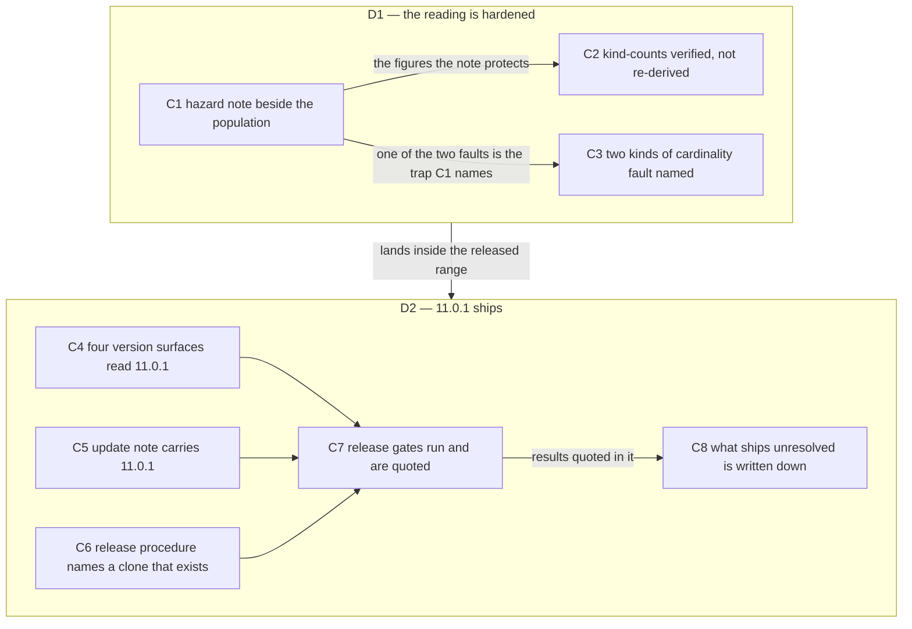

# Spec: v11.0.1, and the correction it carries

**Date:** 2026-09-11
**Status:** Draft
**Decidability:** The load-bearing question is whether "this session did what it set out to do" can be answered for a session that stated no goal while it ran. It cannot: the nine commits are the only surviving statement of intent, and a goal reconstructed from them afterwards cannot fail against them. The mechanism therefore changes rather than the answer. Acceptance below is read against preconditions each of which a command decides on its own: a version string in a named file, a gate that exits zero or does not, a coverage figure that is printed and quoted. Nothing here asks whether the session was successful.

**Source:** The user asked for two things in one pass. Ship the nine commits that stand above the v11.0.0 tag as a release, and settle the population figure in the analysis report that one of those commits added, after two measurements in the same session overturned it and a third, taken with word anchors over the same corpus at the same commit, returned the report's own number and showed the other two to have been counting a different subject.

## Directives

### D1: the correct reading is hardened against the pattern that keeps overturning it

The analysis report `260911-1316-five-retired-agents-and-the-container-contradiction-read-site-by-site.md` states a population of 161 occurrences over 103 lines in 36 files, and that reading is right: measured again at `fdac1cb0` over the corpus the report declares, with word anchors on the pattern, it returns exactly those three figures. No figure in the report moves and no kind-count is re-derived. What the report lacks is a warning about the trap that has twice been used to overturn it. `coderev` is a substring of `codereview` and `ontorev` of `ontoreview`, the two retired review folder names, so the same alternation without its anchors returns 181 over 113 lines in 38 files, and the twenty extra matches are sentences about directories rather than about agents. After this work the report carries a short note beside its population figures naming the two substrings, the size and whereabouts of the twenty, and the anchored command in full, so that the next sweeper who retypes the pattern from memory meets the hazard beside the number instead of deriving a contradiction from it.

### D2: fusion 11.0.1 ships, over a range whose gaps are stated rather than closed

D1 is a precondition of D2: its hazard note lands inside the same commit range, so the release does not publish a correct reading that a later sweeper can be expected to contradict while leaving the warning for a release after this one. The precondition holds and its reason has changed. Nothing in the report is being repaired, because nothing in it is wrong; what the range carries beside the reading is the warning that stops the reading being overturned a third time. The release then carries the version through every surface that names it, advances the update note a user reads after upgrading, corrects the one release instruction that points at a directory nobody has, runs the gates the release procedure names, and states in its own commit message what it ships unresolved. It is a patch release: nothing in the range changes what any shipped program does, only what documents, comments and advisory strings say.

## Capabilities

### C1: The report carries a hazard note beside the population it measured

**Description:** A reader who opens the report finds the same 161 occurrences over 103 lines in 36 files it has always stated, and beside them a note saying that the obvious pattern, written without word anchors, returns a larger number about a different subject.

**Acceptance criteria:**
- [ ] The report's three population figures still read 161, 103 and 36, at commit `fdac1cb0`. No population figure in the report moves, and no sentence reading 161, 103 or 36 is rewritten.
- [ ] A note at the population figures states that `coderev` is a substring of `codereview`, and `ontorev` of `ontoreview`, which are the two retired review folder names and not agent names, so an unanchored pattern counts sentences about directories as occurrences of an agent name.
- [ ] The note gives the size of the difference and where it sits: 20 occurrences across 7 files, taking the totals from 161, 103 and 36 to 181, 113 and 38. It says that only 2 of those 7 files are new to the population, `skills/setup/SKILL.md` and `hooks/lib/citation-scan.ts`, which is why the file count moves by 2 rather than by 7.
- [ ] The note states the anchored command in full, `/usr/bin/grep -r -o -i -E '\b(coderev|ontorev|bugfixer|taskplanner|playmaker)\b'` over the corpus the report already declares, so that a later pass runs it rather than retyping the alternation from memory.
- [ ] The note says that the twenty sit in sentences about directories: the migration skill's `codereview:coderev` folder-merge pairs, the layout tree in the conventions, the retired-folder fixtures in the path lint, and the store list in setup.
- [ ] The closed record `260910-2146_*_five-deleted-agents-are-still-named-as-live-in-twelve-shipped-files.md`, whose resolution note repeats 161, 103 and 36, needs no correction on this account. It is terminal and is not edited.

**Decisions made:**
- Nothing in the report is repaired, because nothing in it is wrong (measurement, this session). The reading was confirmed at `fdac1cb0` over the corpus the report declares, with `/usr/bin/grep` rather than the shell's `grep` function and with the word anchors restored, varying that one thing: anchored gives 161, 103 and 36, unanchored gives 181, 113 and 38, and `(codereview|ontoreview)` alone gives exactly the 20 between them.
- `260911-1422_*_the-retired-agent-readings-population-is-161-where-the-corpus-it-declares-holds-181.md` is closed as not a defect, and the closure rests on that measurement rather than on a judgement about the record. The corpus it declares does not hold 181 under the pattern the report declares; the 181 it names is a count that includes the two folder names.
- This reverses an earlier choice in this same spec to leave that record open. The reason for leaving it open was that the report was wrong, and the report is not wrong.

### C2: The three kind-counts stand, and the report records what verified them

**Description:** The report splits its population into three kinds: statements false at the present commit, values a program consumes, and sentences that describe a past removal. The three counts are 12, 43 and 106, and no re-derivation is owed, because each was checked file by file against an anchored count and matched everywhere. What the report gains is the record of that check, so that the next reader does not reopen a settled question.

**Acceptance criteria:**
- [ ] The report's three kind-counts still read 12, 43 and 106, and still sum to the stated total of 161. No kind-count moves.
- [ ] The report records that the three were verified independently, per file, across all 36 files of the population, against an anchored count, with zero mismatches.
- [ ] The report records the separate corroboration of the first kind: 161 occurrences at `fdac1cb0` less 149 at `9ceb5cc7` leaves 12, the number of sites the repair commit changed, and a per-file enumeration of what that commit changed matches sites A1 to A8 occurrence for occurrence.
- [ ] The report warns that this subtraction corroborates nothing about the anchors, because the unanchored pattern gives 181 less 169, which is also 12: the twenty substring matches are identical at both commits, so a figure that survives the wider pattern is not thereby evidence that the wider pattern was right.
- [ ] Nothing in the report, and nothing left in this spec, says that the report's own verification counted lines where it claimed occurrences. `grep` in the sessions that produced these readings is a shell function wrapping ugrep, whose `-c -o` counts occurrences rather than lines, so `grep -rcoiE` returned the occurrence count the report labelled it as.

**Decisions made:**
- The counts are stated as verified rather than re-derived (measurement, this session). A re-derivation would repeat a per-file check that has already been run and has already returned zero mismatches.

### C3: The session's three wrong numbers are named as two kinds, not three of one

**Description:** This session produced three wrong numbers, and the project's cardinality norm reads all three as one failure repeated. They are not one failure. Two were miscounts: a figure wrong for the subject it named. The third was not a miscount at all, but a correct figure overturned twice by a pattern that silently widened its own subject, where both numbers were correctly counted and they counted different things. The report records the distinction, because no arithmetic check reaches the second kind.

**Acceptance criteria:**
- [ ] The report names the first kind as a figure that is wrong for the subject it declares, and gives its two instances: the earlier defect record's own population count, taken case-sensitively over two directories and read as the whole population; and the 19 400-byte skills margin this spec first carried, which was `SKILL_BASELINE` 202 397 + `TEST_LINE_BASELINE` 19 228 = 221 625, two surfaces' floors added together, where the budget is 202 397 + 21 911 = 224 308 against a live 224 136 and the margin is 172.
- [ ] The report says that both instances of the first kind fall to a recount over the declared subject, which is what the cardinality norm already asks for.
- [ ] The report names the second kind as a figure that is right for the subject the pattern actually has, where that subject is not the one the sentence declares, and gives its single instance: 161 was correct and was overturned twice by the same alternation written without word anchors, which returns 181, a correct count of a population that includes two folder names.
- [ ] The report says why the second kind is the dangerous one: a recount confirms it, the arithmetic checks out, both numbers are honestly counted, and the two readings differ only by a subject the reader never sees change. It cost four reversals in one session before an anchored run settled it.
- [ ] The report cites `260826-1252_*_how-does-this-project-keep-a-cardinality-stated-in-prose-true-when-seven-passes-could-not.md` and states that the norm as written reaches the first kind and not the second, so a cardinality is owed its subject as well as its derivation.

### C4: Every surface that names a version reads 11.0.1

**Description:** Four files carry the release number, and a user or an installer reads a different one of them depending on how they arrived. After this work all four agree.

**Acceptance criteria:**
- [ ] `.claude-plugin/plugin.json` reads `"version": "11.0.1"`.
- [ ] The fusion entry in `/Users/k1/Projects/productive/claude-plugins/.claude-plugin/marketplace.json` reads `"version": "11.0.1"`.
- [ ] The pinning example in `README.md` reads `FUSION_REF=tags/v11.0.1`.
- [ ] The pinning example in the `install.sh` header comment reads `FUSION_REF=tags/v11.0.1`.
- [ ] A tag `v11.0.1` exists on the released commit and is pushed, so the two pinning examples name a ref that resolves.

**Decisions made:**
- The release is a patch, 11.0.1 and not 11.1.0 or 12.0.0 (user's choice): nine commits, no new capability, and no change to what any shipped program does. The only source file in the range whose lines moved is `hooks/lib/staging-drift.ts`, and what moved there is the wording of advisory strings the program prints.

### C5: The update note a user reads after upgrading carries this release

**Description:** The help topic on updating carries the last three releases and no more. A user coming from 11.0.0 finds a paragraph describing what changed for them, and the oldest paragraph leaves.

**Acceptance criteria:**
- [ ] The update topic in `skills/help/SKILL.md` carries a paragraph labelled for a reader coming from an 11.0.0 install.
- [ ] That paragraph says plainly that nothing in this release requires an action from the reader.
- [ ] The three paragraphs that follow are relabelled so each still names the install its reader is coming from, and the oldest of the previous three is gone.
- [ ] The net change to `skills/help/SKILL.md` is at most **+172 bytes**, the whole remaining margin on the skill surface (budget 202 397 + 21 911 = 224 308, live 224 136). The paragraph that leaves and the relabelling of the survivors are what pay for the new paragraph; the addition is sized against 172, not against a three-figure margin.
- [ ] The whole skill surface stays inside its growth bound: `cd hooks && npx vitest run lib/__tests__/surface-growth-bound.test.ts` exits 0.

### C6: The release procedure names a marketplace clone that exists

**Description:** `CLAUDE.md` tells a reader that the marketplace working clone is at a path that was deleted during the v11.0.0 release. A reader following the release steps from cold reaches a missing directory at step 2. After this work the section names the clone the last release was actually performed from.

**Acceptance criteria:**
- [ ] `CLAUDE.md` `## Release process` names `/Users/k1/Projects/productive/claude-plugins` as the marketplace working clone.
- [ ] The deleted path `/Users/k1/Projects/productive/F03-CLAUDE-plugin-marketplace/claude-plugins` appears nowhere in `CLAUDE.md`, including the parenthesis about a nested directory that only that path had.
- [ ] The paragraph about the separate cache clone is left as it stands. It was already correct and is not part of this correction.
- [ ] `260911-1233_*_the-release-procedures-marketplace-clone-path-names-a-directory-that-no-longer-exists.md` is closed with a note citing the commit that corrected it.
- [ ] Every one of the eleven per-dispatch totals stays inside its own figure in `hooks/lib/__tests__/fixtures/dispatch-path.baseline`.

**Decisions made:**
- The correction is made directly in this session (user's choice). This is a deliberate departure from the route the defect record itself states: that record says the edit belongs to the gated normative pass, because `CLAUDE.md` is read by every dispatch. The user asked for the direct correction in those terms, and that instruction is the ground for the departure. The record's stated route is not being followed, and this spec says so rather than leaving the contradiction silent.
- The replacement text is shorter than what it replaces, so the edit shrinks the file and cannot breach the tightest per-dispatch margin, which stands at 499 bytes on the review path.

### C7: The gates the release procedure names are run, and their results are quoted

**Description:** The release procedure lists checks that must pass before a tag is pushed, and one measurement that is reported rather than enforced. All of them run, and the release records what each returned.

**Acceptance criteria:**
- [ ] `claude plugin validate .` reports passed. Warnings do not block.
- [ ] The smoke test resolves the default agent: `claude --plugin-dir . --agent fusion:orchestrator -p "reply SMOKE-OK"` returns that reply.
- [ ] `cd hooks && npm test` exits 0.
- [ ] `bin/fusion-review-coverage --since v11.0.0` is run and its verdict is quoted in the release commit message or the session record, reading `commits=9 uncovered=9`.
- [ ] The uncovered range is stated and not closed. No review pass is run to clear it, and no release is blocked on it, per `260815-2109_*_may-a-circle-close-over-an-uncovered-review-range-and-who-decides.md`.

### C8: What the release ships unresolved is written down where a release reader finds it

**Description:** This release publishes several things the project already knows to be incomplete. A reader of the release commit is told what they are, rather than discovering them later.

**Acceptance criteria:**
- [ ] The release commit message names by basename every defect record this session filed that ships open. The set is the one enumerated in item 1 of `## What this release ships that is known wrong`, cited rather than recopied, so the two places cannot disagree about which records or about how many.
- [ ] It states the number of open defect records across the live stores as a whole, measured at the release commit, together with the command that produced it.
- [ ] It states the review coverage verdict for the range.
- [ ] It states that 24 review files could not be tiled against the range by the coverage measurement, so the uncovered figure is a floor rather than a full reading.

## What this release ships that is known wrong

Each item is measured rather than estimated:

1. **83 live defect records** across the live stores, which are the shared issue store and every work item's own. Measured in the working tree above `9ceb5cc7`, by `find fusion-workbench/shared/issues fusion-workbench/circles -path '*/issues/*' \( -name '*_o_*.md' -o -name '*_p_*.md' \) | wc -l`, which is stated here so that a later reader re-runs it instead of adding to or subtracting from 83. The pattern admits both the open marker `_o_` and the in-progress marker `_p_`; `_p_` matched nothing at this reading, so all 83 are open. Four of them were filed in this session and ship open by decision: `260911-1339_*_staging-drift-still-classifies-a-pointer-a-rule-says-nothing-creates-and-names-a-turn-boundary-trigger-it-does-not-have.md`, `260911-1421_*_a-work-items-own-record-classifies-as-unclassified-so-staging-drift-claims-nothing-about-the-unit-of-work.md`, `260911-1423_*_the-dead-step-3b-address-survives-in-seven-places-outside-the-file-its-repair-covered.md` and `260911-1511_*_coderev-is-a-substring-of-codereview-so-a-sweep-without-word-boundaries-counts-two-retired-folder-names-as-agents.md`, the last of which records the word-boundary hazard D1 writes the note about. An earlier draft of this list named `260911-1422_*_the-retired-agent-readings-population-is-161-where-the-corpus-it-declares-holds-181.md` among them. It is closed as not a defect under C1 and ships closed, and `260911-1511` took its place by a different route.
2. **An unreviewed range of nine commits.** `bin/fusion-review-coverage --since v11.0.0` returns `commits=9 uncovered=9`. Every commit in the release is going out without a review pass having opened it.
3. **24 review files the coverage measurement cannot tile.** They declare no usable range, so they contribute nothing to coverage either way. The uncovered figure is therefore a floor: it cannot fall below nine on the strength of files nothing can read.

## Stops when

- If `cd hooks && npm test` is red at the moment the version bump is ready to be staged, the release stops. No tag is pushed over a red suite. The red gate is repaired first, or the release is abandoned and the reason recorded.
- If `claude plugin validate .` does not report passed, the release stops before the version is bumped, because an unloadable plugin ships nothing a user can run.
- If the anchored command in C1 returns anything other than 161 occurrences over 103 lines in 36 files at `fdac1cb0`, the note is not written. The divergence is filed as its own defect record and the report is left exactly as it stands, because a note that misstates the figure it is protecting is worse than no note.
- If the edits in C5 and C6 together put any bounded surface over its head-room, the release stops until the excess is paid back on the same surface. Raising a baseline or a head-room constant is not an available answer here.

## Constraints

- `CLAUDE.md` is charged to all eleven dispatch paths at zero head-room. Measured at the current commit, the tightest of the eleven is the review path with 499 bytes to spare, and the widest is the orchestrator path with 97 729. Any byte added to `CLAUDE.md` must be paid back inside the same paths.
- The skill bodies are bounded as one surface, and the margin on it is **172 bytes**. `SKILL_BASELINE` in `hooks/lib/__tests__/surface-growth-bound.test.ts` holds ten entries summing to 202 397; with `SKILL_HEAD_ROOM` at 21 911 the budget is 202 397 + 21 911 = 224 308, and the live surface measures 224 136, which leaves 172. This spec first carried 19 400 here, and that figure was wrong: it added `TEST_LINE_BASELINE` (19 228, the floor of a different surface, the hook-test line count) to the skill floor to reach 221 625, and 172 + 19 228 = 19 400 to the byte. Two surfaces' floors had been summed into one budget.
- The report annotated under D1 is an analysis. Analyses carry no state marker and are not tracking files that a reconciliation pass may edit, so the note is a deliberate authored edit and must be commit-stamped where it states a figure.
- The closed record `260910-2146_*_five-deleted-agents-are-still-named-as-live-in-twelve-shipped-files.md` is terminal. Its resolution note repeats 161, 103 and 36, which are the right figures, and it stays exactly as written either way.
- A release is tagged on the commit that is pushed, and the two pinning examples must name a tag that exists once the release is done.
- Nothing in this work runs a whole-tree git command that discards working state.

## Out of Scope

- Every open defect record this session did not file. They are neither closed nor triaged here, and no figure for them is carried: item 1's command counts the whole store and the four this session filed are named beside it.
- Any review pass over the nine commits. The range ships uncovered by decision.
- Repairing the 24 review files that carry no usable range.
- The closed record whose resolution note repeats 161. It is terminal, the figure in it is right, and it stays as it is.
- Any change to the report's figures, to its three-way classification, or to its per-site tables. D1 adds a note and touches nothing that was already there.
- A migration note for this release, unless the decision below is answered otherwise.
- Every other normative change to `CLAUDE.md`. Only the marketplace clone path is touched.

## Open for Planner

- How many commits the work splits into, and in what order, including whether the correction under D1 is one commit or two.
- Where the hazard note sits: inline at the population table, as a footnote to it, or as its own short subsection under the first finding, given that it must be found by a reader who arrives at the number rather than at the top of the report.
- Whether the note repeats the anchored command once or at each of the report's population figures.
- Whether the two-kinds distinction under C3 belongs in the same note or in the report's implications section, where the cardinality norm is already discussed.
- Which sentences leave `skills/help/SKILL.md` to make room for the new paragraph, and how the relabelling of the surviving paragraphs is worded.
- How the release commit message carries C8 without becoming a second copy of this spec.
- Whether the four gate results in C7 are quoted in the release commit message, in a record, or in both.

## User Decisions Pending

- [ ] Whether this release gets a migration note under `docs/`. Default if unanswered: no note. The new paragraph in the help topic points at the existing v11 note, because 11.0.1 asks nothing of a reader who has already upgraded to v11.

19 400 was never a bound anyone held: it was `SKILL_BASELINE` (202 397) plus `TEST_LINE_BASELINE` (19 228), two surfaces' floors added together. Nothing is pending on it. The skills margin is 172 bytes and C5 is read against that.
