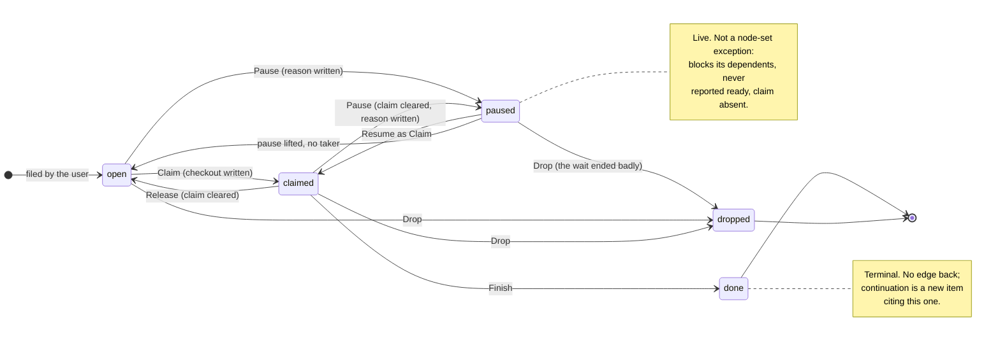
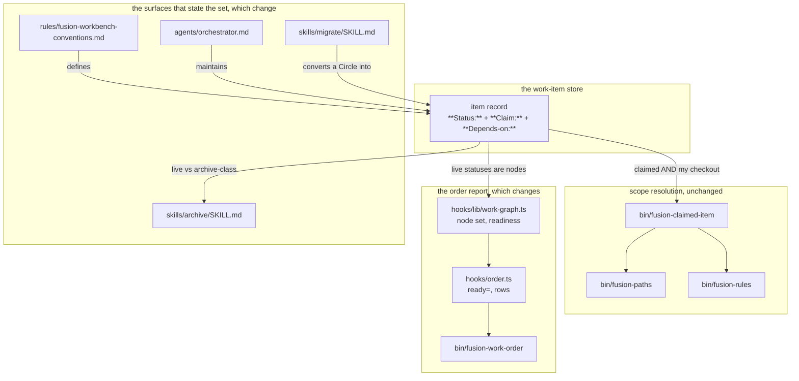

# Implementation Plan: a fifth value for a work item's `**Status:**`

**Date:** 2026-09-15
**Status:** Draft
**Spec:** none. Planned from the user's ruling, against defect `260910-2011_*_the-deferred-state-has-no-value-in-the-work-items-status-set.md`.
**Decidability:** The load-bearing question is whether a fifth value is decidable from what a reader of an item file actually holds, or whether it only relocates the judgement. Two halves, and they answer differently. **Decidable, from the record and nothing else:** which of the five words `**Status:**` carries, whether `**Claim:**` stands beside it, whether the body carries the mandated reason, and whether a `**Depends-on:**` edge pointing at the item is discharged. All four are read off the file with no judgement, and the fourth is the one a mechanism answers on every run. **Not decidable, by any mechanism with a record's inputs:** whether the word is still *true*, which is to say whether the thing the item waits for has since happened. A date in the body would be an approximation of that rather than an answer, so this plan does not ask for one. What it asks for instead is the *what*, and where the thing waited on is another work item it goes in `**Depends-on:**`, where `bin/fusion-work-order` settles the currency question mechanically. The residual is stated rather than smoothed: an item waiting on something outside the store is told from an open one by a word nobody is obliged to maintain, exactly as `open`, `claimed` and `**Active spec/plan:**` already are. The fifth value adds no new undecidable question. It adds one more word that can go stale, and buys in exchange the one question over this store that *is* mechanically decidable and is answered wrongly today.

## Directive

`**Status:**` gains `paused`: set aside deliberately, not abandoned, expected back. The user has ruled that the value exists; its shape is put to the user at a gate as decision record `260915-2028_*_what-shape-does-the-work-items-fifth-status-value-take.md`, and this plan implements that record's recommendation (option 1). The defect that raised it, `260910-2011_*_the-deferred-state-has-no-value-in-the-work-items-status-set.md`, is closed by the work.

Cite that defect by its full slug. A different record filed in the same minute, `260910-2011_*_a-work-item-has-no-field-for-the-plan-it-runs-on-so-the-closure-step-lost-its-source.md`, closed today, so the stamp alone resolves to two files and the citation gate reports it.

## Current State

Measured at `d92beb1a`, in this working tree.

**The store's grammar.** `rules/fusion-workbench-conventions.md` `## Backlog entries — work items` states that `**Status:**` takes four values "and there is no fifth", with a table whose second column is `**Claim:**`. `done` and `dropped` are terminal under `## Terminal states are history`. A `**Depends-on:**` entry "asserts one relation and one only: the named item must reach `done` or `dropped` before this item may start."

**The reason the set was cut to four, and what survives it.** The conventions argue that `dropped` collapses the issue vocabulary's `_c_` and `_d_` and the retired Circle vocabulary's `_c_`, `_b_`, `_s_` and `_d_`, because the body says which of them happened and the marker only ever abbreviated it. That argument is sound and is not weakened by this change. It is an argument about **which of several ways of finishing** a record took, and it survives whole: `dropped` still collapses all of them, and nothing is added back there. What it does not reach is a state that is not a way of finishing at all. The plan's edit to that paragraph keeps the argument and bounds it, rather than removing it.

**The helper, and the lead that needs correcting.** The dispatch's lead reads: a set-aside item is neither `done` nor `dropped`, so it blocks. That is what the grammar implies and it is **not** what the code does. `hooks/lib/work-graph.ts` admits a record to its node set on an allowlist, `if (status !== "open" && status !== "claimed") continue;`, so any unrecognised status is dropped from the graph exactly as a terminal one is. Verified by reading the module, not inferred. Three consequences follow, and the third is the defect:

1. The set-aside item is not a row, is not counted in `items=`, and its own outgoing entries go unread.
2. A dependent's entry naming it resolves to nothing and is printed on an `unresolved=` line, which reads "names no item" about an item that plainly exists.
3. The dependent is printed **`ready`**, because readiness is `out[i].length === 0 ? "ready" : "blocked"` over *resolved* edges only. A reader picking work off that report starts an item whose prerequisite is not met.

For a terminal target the same dangle is correct, because the prerequisite *is* discharged. For a set-aside target it is a false ready on the one figure a reader acts on. The value therefore cannot ship as prose alone.

**The other consumers of the value set.** `bin/fusion-claimed-item` tests `**Status:** claimed` **and** an eight-hex claim equal to this checkout, so a fifth value matches nothing and the item in scope is unchanged under every shape considered. `skills/archive/SKILL.md` carries three prose statements of the live pair and one behavioural `case "$st" in open|claimed)` that collects `**Depends-on:**` targets for its safety filter. `agents/orchestrator.md` carries the maintenance table, the Human Gate row, a Setup hint counting `open`, and two sentences naming the cardinality. `skills/migrate/SKILL.md` carries three passages saying the question is open and it leaves it where it found it. `CLAUDE.md`, `docs/working-model.md` and `docs/fusion-intro.md` each state the set.

**The bounded surfaces, measured this session.** The commands are given so the figures can be retaken rather than trusted.

| Surface | Now | Budget | Margin | How it was measured |
|---|---|---|---|---|
| `agents/*.md` | 268 763 B | 328 567 B | **59 804 B** | `fixtures/surface-growth.golden` against `AGENT_BASELINE` + `AGENT_HEAD_ROOM` |
| `skills/*/SKILL.md` | 223 996 B | 224 308 B | **312 B** | same, `SKILL_BASELINE` + `SKILL_HEAD_ROOM` |
| hook test suite | 21 822 lines | 21 823 lines | **1 line** | same, `TEST_LINE_BASELINE` + `TEST_LINE_HEAD_ROOM` |
| tightest dispatch path (`reviewer`) | 162 959 B | 189 012 B | **26 053 B** | prompt + `bin/fusion-rules reviewer \| xargs wc -c` + `CLAUDE.md`, against `fixtures/dispatch-path.baseline` |
| `orchestrator` dispatch path | 261 143 B | 380 065 B | 118 922 B | as above |

`rules/fusion-workbench-conventions.md` and `CLAUDE.md` are charged to all eleven dispatch paths, so the `reviewer` figure binds both. `hooks/*.ts`, `hooks/lib/*.ts`, `bin/`, `docs/` and the READMEs are on no bound.

## Approach

One reading carries the whole change, and every sub-answer falls out of it rather than being ruled separately. **The status set is partitioned into live and terminal, and every mechanism over the store keys on that partition rather than on the enumeration.** `{open, claimed}` was never the node set's definition; it was the complete list of the live values on the day the node set was written. `paused` joins that list.

Four consequences, none of them a new rule:

- A `**Depends-on:**` entry naming a paused item is **live and blocks**, because the field's own sentence requires the target to reach `done` or `dropped` and `paused` is neither. The grammar paragraph is unchanged in substance and gains one clause naming the consequence.
- The paused item is a **node**. Its `depth` and `blocks` stay computed, which is what puts "this paused item is blocking three others" in front of a reader, the strongest argument for un-pausing it.
- Its **readiness is never `ready`**. `ready` is an invitation to pick the item up, and the status exists to withdraw that invitation. `Readiness` gains a third value, which the module's own comment currently calls unreachable; that comment was true of a node set with no live-but-unpickable value in it, and becomes false here.
- **`**Claim:**` is cleared.** On a live item the field means somebody is working on it now, and a paused item is not being worked on. Pausing is Release plus a recorded reason; resuming is a plain Claim by anybody, with no takeover, an operation whose whole definition is contention. Who paused it is in the commit that paused it, which is where this project keeps the per-change record.

**`## Terminal states are history` is not touched, and that is load-bearing rather than incidental.** It decides the migration question at no cost: a `_d_` Circle record is terminal in the vocabulary it belongs to, so it converts to nothing, and work wanted back out of one is a new item citing it. That is the same shape the section already prescribes for every terminal record, so the migration answer is not a special case and the section needs no exception.

### The status lifecycle



`paused --> done` is deliberately absent. Work that landed passed through somebody working on it, and that is `claimed`.

### Where a status is read, and what each reader does with `paused`



`bin/fusion-claimed-item` is the one reader whose answer must not move, and it does not: it requires `**Status:** claimed` and a matching claim, so a paused item is not matched. Confirmed by reading its scan, which greps both fields.

## Implementation Steps

Every step is `coder`. **No step routes to `ontocoder`**: nothing here is ontology, a manifest, a schema, fixture data or data documentation. The two generated fixtures the work touches, `surface-growth.golden` and `rules-emission.golden`, are the test instrument's own artifacts and move with the code that is measured. **No step routes to `analyst`**: the comparative work this change needed is done, in this plan and in the decision record beside it, and a dispatch to restate it would buy nothing.

1. [DONE] **The grammar: `rules/fusion-workbench-conventions.md` `## Backlog entries — work items`**
   - Executor: `coder`
   - Files: `rules/fusion-workbench-conventions.md`
   - Changes: the record template's status line becomes `open | claimed | paused | done | dropped`, live values before terminal. The value table gains a `paused` row reading, in the `**Claim:**` column, `absent`. The sentence "`**Status:**` takes four values and there is no fifth" becomes five, and the paragraph under it keeps the cut-to-four argument and bounds it: `dropped` still collapses every way of *finishing*, and the new value is not one. State the allowed transitions (into `paused` from `open` and `claimed`; out of it to `open`, `claimed` or `dropped`; never to or from a terminal value) and that `paused` is the one live value an item returns from. Add to the `**Depends-on:**` paragraph, whose defining sentence is left exactly as written, the clause that a `paused` target has reached neither terminal value, so the entry is live and the item is a node in `bin/fusion-work-order`'s graph. Add to the `**Claim:**` paragraph that the field is absent on `paused`, with the takeover reason in one clause. Mandate the body note: a paused item's body says **what** it is waiting for, and where that is another work item the statement is a `**Depends-on:**` entry rather than prose. No date is written, because nothing checks one.
   - `## Terminal states are history` is **not edited**. Confirm that by reading it, and say so in the commit message.
   - Bound: charged to all eleven dispatch paths at zero head-room, against the `reviewer` margin of 26 053 B. Budget roughly 900 to 1 300 B. Re-measure after the edit.
   - Dependencies: none.

2. [DONE] **The node set and readiness: `hooks/lib/work-graph.ts` and `hooks/order.ts`**
   - Executor: `coder`
   - Files: `hooks/lib/work-graph.ts`, `hooks/order.ts`
   - Changes: `ItemStatus` gains `"paused"`; the filter in `computeWorkGraph` admits it, staying an allowlist so a record with an unreadable or garbage `**Status:**` remains outside the node set. `Readiness` gains `"paused"`, and the row expression returns it for a paused node whatever its out-edges, leaving `depth` and `blocks` computed as for any node. Rewrite the three comments the change falsifies: the module header's node-set paragraph, the `ItemStatus` doc comment ("The two live values"), and the `Readiness` comment asserting a third value would be an unreachable branch, which was true only of the old node set. In `hooks/order.ts`, update the header's worked example and the five-column note; `ready=` counts `readiness === "ready"` and needs no edit, and `roots=` still counts a paused node at depth 0, which is correct. Check the column width: `readiness.padEnd(7)` fits `paused` at six characters without widening the row.
   - Then `npm run build` in `hooks/`, because `committed-dist.test.ts` fails when the committed `dist/` is not the compilation of the committed source.
   - Bound: none. `hooks/*.ts` and `hooks/lib/*.ts` are on no growth bound.
   - Dependencies: step 1.

3. [DONE] **The fixture test, and the bound that may refuse it: `hooks/lib/__tests__/work-graph.test.ts`**
   - Executor: `coder`
   - Files: `hooks/lib/__tests__/work-graph.test.ts`
   - Changes: two entries in the table-driven `FIXTURE`, a paused item carrying an outgoing entry that **is** read, and a live item depending on it. Extend `EXPECTED` with both rows, move `items` from 9 to 11 and `edges` from 6 to 7, and assert three things: the paused node's readiness is `"paused"`, its dependent is `"blocked"` rather than `ready`, and the entry naming the paused item does **not** appear in `unresolvedEdges`. Fold the assertions into the existing `it` blocks rather than adding a new one.
   - **Measure before writing.** The hook test surface stands at **1 line** of margin. The addition is expected to cost eight to twelve lines. Look for an honest cut inside `hooks/lib/__tests__/**.ts` first. **Do not edit `TEST_LINE_BASELINE` or `TEST_LINE_HEAD_ROOM`**, and do not fund the addition by deleting another gate's reasoning, which is the trade refused on 2026-08-05 and restated in `README-hooks.md`.
   - If no cut is available, **stop and report the figure**. Three routes exist and the choice is the user's, not the executor's: a cut elsewhere in the surface; a head-room raise, the fourth named event in `hooks/lib/__tests__/helpers/growth-bound.ts` `## Re-baselining`, which moves no baseline and must name the before and after figures and date its reduction; or shipping the behaviour with the cases written, measured and deferred as an open issue, which is the precedent set by `260827-0410_*_the-machine-written-event-rows-ship-with-wiring-asserts-only-because-the-hook-test-surface-is-full.md`. Whichever is chosen, the cases are not dropped in silence.
   - Dependencies: step 2.

4. [DONE] **The maintenance operations: `agents/orchestrator.md`**
   - Executor: `coder`
   - Files: `agents/orchestrator.md`
   - Changes: the work-item maintenance table gains a **Pause** row, "`**Status:**` to `paused`, the `**Claim:**` cleared, the body saying what it is waiting for", and one sentence beneath it: resuming is **Claim**, and lifting a pause with nobody taking it sets `open`. The Human Gate row listing the operations gains `paused`. The sentence reading "its four `**Status:**` values" becomes five, and so does "Neither case is any of the four item values" in the Setup work-item walk. The Setup hint prints how many items are `open` and, when any are, how many are `paused`; a value the hint never counts is a pile of set-aside work nobody sees again. Confirm and leave alone: `## Closing a work item` step 1 tests for `done` or `dropped` and that test stays exact, because `paused` is not terminal and the section runs only on the item this session claimed.
   - Bound: `agents/*.md` margin 59 804 B, orchestrator path margin 118 922 B. Comfortable.
   - Dependencies: step 1.

5. [DONE] **The two skill bodies, budgeted together: `skills/archive/SKILL.md` and `skills/migrate/SKILL.md`**
   - Executor: `coder`
   - Files: `skills/archive/SKILL.md`, `skills/migrate/SKILL.md`
   - Changes, archive. One is behaviour and the rest are prose. **The behaviour fix:** the dependency-target scan whose `case "$st" in open|claimed)` collects `**Depends-on:**` entries from live items must also read a paused item's, or a terminal item that a paused item depends on can be archived out from under it, which safety filter 3 will not catch because it scans citing prose rather than the field. The two prose statements of the live pair, in the safety-filter list and in the guardrails, gain `paused`. Confirm and leave alone: the archive-class selector matching `done|dropped` stays exactly as it is, so a paused item is never archive-class.
   - Changes, migrate. **This is the step that pays for the surface.** The answer is that a `_d_` Circle record still does not convert: it is terminal in its own vocabulary, and `## Terminal states are history` forbids editing a terminal record back into a live shape. The cost against that section is nil, which is what makes it the right answer; the cost to the user is that work in a `_d_` container does not come back by itself, and wanting it back means filing a new item, setting it `paused`, and citing the container. Replace the three passages that state the question as open, in the conversion-table paragraph, in the `DEFERRED>0` clause of the confirmation prompt, and in the report's `_d_` line. Those three lines hold 1 243 bytes today and the answer is shorter than the question was. Keep the per-container naming in the survey and the report: a user with a `_d_` container now has something to do about it.
   - Bound: `skills/*/SKILL.md` margin **312 B**, and the two files share it. Migrate is expected to return 600 to 900 B, which funds archive several times over. **Measure both files after the edit and state the net in the commit message.** If the surface is over, cut in migrate rather than raising anything.
   - Dependencies: step 1.

6. [DONE] **The prose surfaces outside `agents/` and `skills/`: `CLAUDE.md` and `docs/`**
   - Executor: `coder`
   - Files: `CLAUDE.md`, `docs/working-model.md`, `docs/fusion-intro.md`
   - Changes: `CLAUDE.md`'s work-item bullet says "The four statuses are ...", which becomes five, and carries the clause "*deferred* as a live state, which has no status of its own and maps to `dropped`", which this work makes false and which becomes the account of how the fifth value arrived. `docs/working-model.md` states the set, the terminal pair and the `**Depends-on:**` relation; all three need the new value, and the `**Depends-on:**` paragraph needs the blocks consequence. `docs/fusion-intro.md` states the same in German and is edited in German, that file's own language being deliberate.
   - **`docs/upgrading-to-v11.md` is not edited.** It describes correctly what v11 did, and rewriting it would edit history rather than document a change.
   - Bound: `CLAUDE.md` is charged to all eleven paths at zero head-room, margin 26 053 B on `reviewer`; aim near-neutral, since the false clause being replaced is about as long as its replacement. `docs/` is on no bound.
   - Dependencies: step 1.

7. [DONE] **The records: close the defect and regenerate the goldens**
   - Executor: `coder`
   - Files: `260910-2011_*_the-deferred-state-has-no-value-in-the-work-items-status-set.md`, which sits in the issues store of the container named after the working-minimum cut of 260909; `hooks/lib/__tests__/fixtures/surface-growth.golden`; `hooks/lib/__tests__/fixtures/rules-emission.golden`
   - Changes: append a `Resolved:` note to the defect and rename `_o_` to `_c_`. **The record's Acceptance clause is annotated, not rewritten.** It reads "Before D1 runs, the conventions say either ...", which assumed a one-way migration step that no longer runs that way, the migration now leaving a terminal record alone. The `Resolved:` note says what landed, and says in one clause that the urgency the Acceptance rested on is gone and the question was answered on its own merits. Editing the Acceptance itself would erase the reversal instead of pointing at it, which is the same reason `## Inline State Tracking` leaves a `Resolved:` note unedited when a later record reverses it.
   - Regenerate both goldens, read both diffs, and state the movements in the commit message: `UPDATE_SURFACE_GOLDEN=1` because `agents/` and `skills/` sizes moved, `UPDATE_RULES_GOLDEN=1` because a rule file's bytes moved. Regenerating records movement and clears no bound.
   - Dependencies: steps 1 through 6.

8. **The release surfaces, at release time only**
   - Executor: `coder`
   - Files: `.claude-plugin/plugin.json`, `skills/help/SKILL.md`, the marketplace entry, and a `docs/upgrading-to-*.md` note if the release warrants one
   - Changes: this step runs only if and when the change ships as a release, under `CLAUDE.md` `## Release process`. The version bumps; the update topic in `skills/help/SKILL.md` gains this release's paragraph, relabels the two below it and drops the oldest, and names the fifth value as the one thing a consuming project acts on. That topic has gone unadvanced through two releases before because no step in the release list reached it, which is why it is named here rather than left to the ceremony.
   - Bound: the help topic is on the `skills/` surface, which step 5 must leave enough room in. Measure again at release.
   - Dependencies: steps 1 through 7.

## Where this work stops

- `rules/fusion-workbench-conventions.md` `## Backlog entries — work items` states the five values, the `paused` row with `**Claim:** absent`, the allowed transitions, the `**Depends-on:**` consequence and the body obligation.
- `## Terminal states are history` is byte-identical to its state at `d92beb1a`.
- `bin/fusion-work-order`, run against a scratch store holding a paused item and a dependent, prints the paused item as a node with readiness `paused`, prints the dependent as `blocked`, and lists the dependent's entry on no `unresolved=` line. Run it; do not infer it from the diff.
- `cd hooks && npm test` is green, with `hooks/dist/` rebuilt from the committed source and both goldens regenerated and their diffs read.
- Every bounded surface is re-measured after the change and each is inside its bound, with `agents`, `skills`, hook-test lines and the tightest dispatch path stated as figures in the commit message.
- Defect `260910-2011_*_the-deferred-state-has-no-value-in-the-work-items-status-set.md` carries a `Resolved:` note and stands at `_c_`, with its Acceptance annotated rather than rewritten.
- **Precondition on any release carrying this work:** decision `260915-2028_*_what-shape-does-the-work-items-fifth-status-value-take.md` has been ruled by the user and stands at `_a_` or `_i_`, and step 8 has run. A release that goes out before the ruling ships a convention nobody approved.
- If step 3's test cases could not be landed inside the hook-test bound, the choice among the three routes was put to the user and its answer is recorded, in a decision record or in the commit message. The cases are not absent in silence.

## Data Structures

Two type changes, both in `hooks/lib/work-graph.ts`, and no new type.

```ts
/** The live values of `**Status:**`. `done` and `dropped` are terminal and are not nodes. */
export type ItemStatus = "open" | "claimed" | "paused";

/**
 * Three-valued and derived. `ready` and `blocked` are computed from out-edges;
 * `paused` is the node's own status, and overrides both, because `ready` is an
 * invitation to pick the item up and the status exists to withdraw it.
 */
export type Readiness = "ready" | "blocked" | "paused";
```

`WorkItemNode.status` widens with `ItemStatus` and nothing else moves. `ItemFigures.readiness` widens with `Readiness`. `WorkGraphReport` is untouched: `items`, `edges`, `cycles`, `rows`, `noDependsOnField` and `verdict` all keep their meanings, and a paused node counts in `items` because it is one.

## API Changes

No signature moves. Two output contracts widen, both documented where they are produced.

- `bin/fusion-work-order`'s fourth column may now read `paused`, and its header's column note says so. `ready=` counts only `readiness === "ready"`, so a paused node drops out of that count with no arithmetic change. `roots=` still counts it at depth 0, correctly.
- A work item record's `**Status:**` may now read `paused`. Every consumer that tests for `claimed` or for the terminal pair keeps its test exact; the consumers that enumerate the live set are the ones this plan edits.

## Testing Strategy

- **The fixture test** (step 3) is the only automated coverage the behaviour change gets, and it is the step the bound may refuse. Its three assertions are named in the step.
- **One manual run** against a scratch store, named as a stop condition above, because the fixture test exercises `computeWorkGraph` and not the printing in `hooks/order.ts`. Build a temporary workbench holding a paused item, a dependent, and one of each existing status, and read `bin/fusion-work-order`'s output by eye.
- **`npm test` as the regression net.** Three gates will notice a mistake in this work specifically: `committed-dist.test.ts` if `dist/` was not rebuilt, `workbench-citation-lint.test.ts` if any citation added here fails to resolve or resolves to two files, and `surface-growth-bound.test.ts` if a surface went over.
- **No test is added for `bin/fusion-claimed-item` or `bin/fusion-paths`.** Their behaviour does not change under a fifth value, and a case asserting that a non-`claimed` status is not matched would spend lines from a surface with one, to pin a property the existing tests already pin for `open`.

## Risks & Mitigations

| Risk | Mitigation |
|---|---|
| The hook-test bound refuses step 3 and the behaviour ships untested | Step 3 stops and reports rather than editing a constant. Three routes are named and the choice is the user's. The precedent record shows the project has taken the deferral route before, with the cases written down so they are cheap to restate |
| `skills/` goes over its 312 bytes because migrate returned less than expected | Step 5 budgets both files as one and measures the net. The cut is in the same step as the spend, so nothing lands half-paid |
| A dependent on a paused item is still printed `ready` because the readiness override was missed | Named as its own assertion in step 3 and as its own stop condition, and confirmed by the manual run rather than by reading the diff |
| A citation of the defect resolves to two files, because another record shares its minute | Every citation carries the full slug. `workbench-citation-lint.test.ts` recomputes its corpus per run and reports a multi-resolution, so the mistake fails the suite rather than shipping |
| The archive dependency scan is left on `open\|claimed` and a paused item's prerequisite is archived away | Called out as the one behavioural edit inside step 5, separately from that step's prose |
| The cardinality drifts: one surface says five and another still says four | Three sites state it as a numeral, in the conventions, in `CLAUDE.md` and in the orchestrator prompt. All three are named in steps 1, 4 and 6 and move in the same piece of work |
| `paused` widens the readiness column and the report's alignment breaks | Six characters against `padEnd(7)`. Checked in step 2 |

## Open Questions

- [ ] **The shape of the value is a user gate, not an executor's call.** Decision `260915-2028_*_what-shape-does-the-work-items-fifth-status-value-take.md` holds the four sub-questions with options and a recommendation. This plan implements option 1; a different ruling changes steps 1, 2 and 4 and leaves the rest as written. Nothing should be built before the ruling.
- [ ] **Where do step 3's lines come from?** The hook test surface has one line of margin and the step needs roughly ten. The three routes are in the step. Two standing records bear on it and neither is answered: `260822-1154_*_does-the-hook-test-line-budget-cover-comment-prose.md` asks whether comment prose belongs on this budget at all, and `260827-0410_*_the-machine-written-event-rows-ship-with-wiring-asserts-only-because-the-hook-test-surface-is-full.md` is the last time the surface was full and cases were written and then removed.
- [ ] **Does the Setup hint count paused items?** Step 4 says yes, at about ninety bytes on a path with ample margin. The argument against is that a hint is one line and every value added to it dilutes the one number a user reads at Setup. The argument for is that a value the hint never counts is a pile of set-aside work that goes unseen. Worth a sentence from the user at the gate.
- [ ] **Does this ship as its own release?** Step 8 is conditional on that. The change is user-visible in a consuming project's store and in `bin/fusion-work-order`'s output, which argues for a note; it removes nothing and rewrites no existing record, which argues that a note is optional.
