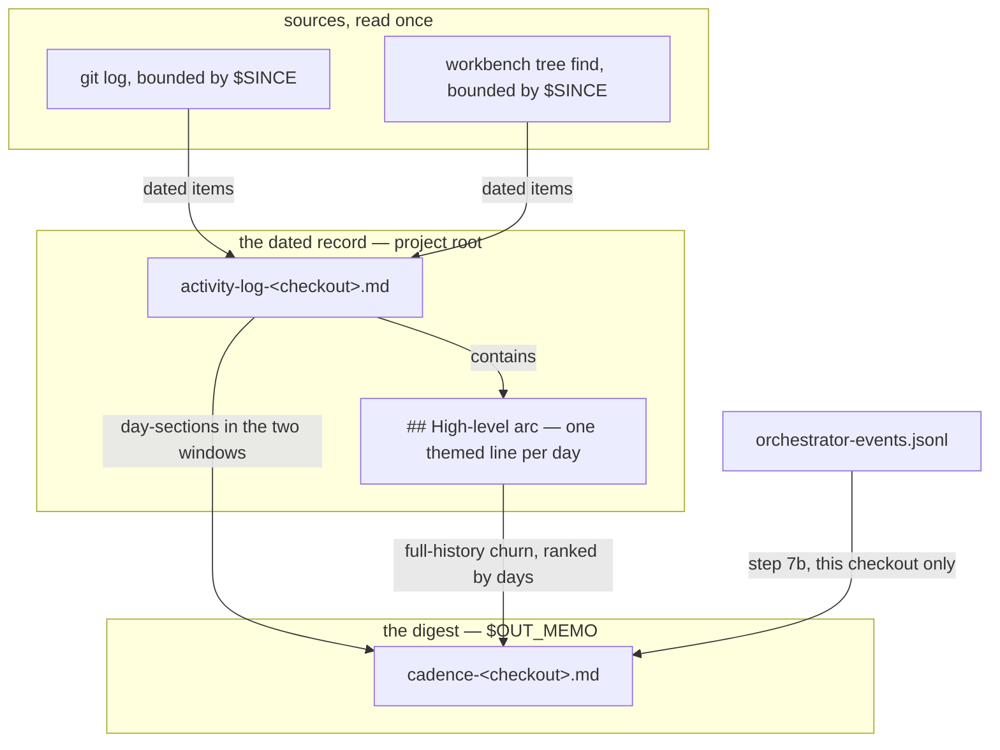

# Implementation Plan: merge `/fusion:log-activity` into `/fusion:cadence`

**Date:** 2026-09-15
**Status:** Complete — steps S1 through S8 done. Released as 11.4.0.
**Spec:** none — planned from the orchestrator's dispatch, carrying the user's ruling
**Decidability:** The load-bearing question is whether **one body can carry both procedures inside the `skills/` surface's remaining budget**. It is **not decidable from the inputs planning has**: a prose body's finished size is not computable from the two bodies it replaces, and every size in this plan below S1 is an estimate. The mechanism is therefore **measurement, not prediction** — S1 writes the body, `stat -f%z` reports it against a ceiling this plan derives exactly (19 427 bytes), and S1 **stops and reports** if it overshoots rather than improvising an offset, editing a head-room constant, or cutting an unrelated body. Every other question this plan answers *is* decidable from the tree and was measured before it was written; each such figure carries the command that produced it.

## Directive

One command, always fresh. `/fusion:cadence` writes the activity log first and then digests it. `/fusion:log-activity` stops existing. The user chose this over a refresh switch and over a staleness heuristic; neither is reintroduced. The reasoning and what the ruling gives up are filed separately, as `260915-2309_*_does-the-activity-log-keep-its-own-command-or-become-the-first-half-of-cadence.md` — this plan cites it and does not restate it.

## Current State

Everything below was measured at HEAD on 2026-09-15, not inherited from the dispatch.

**The two bodies.** `skills/cadence/SKILL.md` is 19 727 bytes, `skills/log-activity/SKILL.md` 13 273 (`stat -f%z`). The dispatch's figures are confirmed.

**They are already coupled, and the coupling already fails.** Cadence's step 3 reads the activity log as source `a`, checking the project root and the workbench, and its degradation list says `activity log: none` when absent. The log in this repository, `activity-log-k1.md`, is 249 429 bytes across 70 day-sections and its newest section is dated **2026-08-29** — seventeen days stale in the repository that ships both commands. That is the ruling's evidence.

**The stated reason for the split now cuts the wrong way — confirmed.** `skills/cadence/SKILL.md` `## What this skill is NOT` says cadence is "read-only on all inputs" and "is not the activity-log step". `rules/fusion-workbench-conventions.md:34` states the consequence in its own words: *"Until the activity log's own adoption run, `/fusion:cadence` reports that source absent even with the legacy file in front of it: cadence is read-only on the activity log and so cannot be the party that adopts it."* The merge removes that hole. **The adoption run becomes cadence's**, under the conditions that line already sets for the other three personal logs (rename only when this checkout's `$USER` is the suffix, only when nothing stands at the new name, report the rename, merge nothing, delete nothing).

**A pointer that is already dead — confirmed.** `skills/cadence/SKILL.md` `## What this skill is NOT` says *"Run `/fusion:cleanup --only log-activity` first"*. The `--only`/`--skip` selector vocabulary went on 260910 with the end-of-session pipeline (`CLAUDE.md`, skill-bodies bullet), so that form resolves to nothing today. **It is a defect the merge happens to clear, not one the merge creates**, and it is cleared by deletion rather than by repair.

**The byte case is the reverse of what the dispatch assumed, and this is the plan's central constraint.** The margin is 56 bytes, which is the one figure the dispatch had right. Derived rather than asserted, from `SKILL_BASELINE` in `hooks/lib/__tests__/surface-growth-bound.test.ts` and `stat -f%z` over `skills/*/SKILL.md`:

| Quantity | Bytes | How |
|---|---|---|
| `skills/` total today | 224 252 | `cat skills/*/SKILL.md \| wc -c` |
| floor (baseline summed over present files) | 202 397 | the ten `SKILL_BASELINE` entries |
| head-room (`SKILL_HEAD_ROOM`) | 21 911 | the constant |
| budget | 224 308 | floor + head-room |
| **margin** | **56** | budget − total |

Deleting a body **does not fund the merge**. `growth()` in `hooks/lib/__tests__/helpers/growth-bound.ts` sums the floor over the files that are *present*, and the same file's test *"carries no baseline entry for a file that is gone"* requires the deleted file's entry to be dropped in the same commit. So the deletion removes 13 273 from the total **and 13 629 from the floor** — and `skills/log-activity/SKILL.md` sits 356 bytes *below* its baseline, so the deletion **forfeits a 356-byte credit**. After the deletion:

- floor 202 397 − 13 629 = **188 768**; budget 188 768 + 21 911 = **210 679**
- the other twelve bodies, cadence excluded: 224 252 − 19 727 − 13 273 = **191 252**
- therefore the merged cadence body **C ≤ 19 427 bytes**, and the surface's margin afterwards is **19 427 − C**.

**The merged body must be smaller than today's cadence body alone, while doing both jobs.** A straightforward concatenation with the obvious de-duplication lands near 30 500 bytes and puts the surface roughly 11 000 over. The bound is doing its job: it refuses two pipelines glued together and forces the integral design in `## Approach`.

**The re-baselining question, answered against the mechanism rather than the dispatch.** The dispatch says the baseline-map edit is legitimate under event 1, "after a cleanup". It is not, and `hooks/lib/__tests__/helpers/growth-bound.ts` `## Re-baselining` refuses that reading in its own words: *"READ LITERALLY — 'it cut, so it may re-baseline what it cut' — THIS EVENT IS THE SILENT RAISE ARRIVING THROUGH THE DOOR THE RULE LEFT OPEN, and the user REFUSED that reading on 2026-09-11: A CUT-ONLY PIECE OF WORK NEVER RE-BASELINES, whatever it cut, and its head-room is what the cut leaves."* This work is cut-only on that surface, so **no baseline moves**. Dropping the `"log-activity/SKILL.md": 13629` line is a different obligation entirely — it is compliance with the stale-entry assertion above, whose failure text reads *"an entry nothing is measured against inflates the floor and grants head-room nobody decided to grant."* The precedent is in the map, five lines up: `direct/SKILL.md` (10 613) was **dropped rather than zeroed** on 2026-09-10 with the same reasoning. S2 follows that comment's shape exactly.

**A second pinned baseline the dispatch did not name, and it *is* a re-approval.** `hooks/lib/__tests__/reference-resolution-lint.test.ts` pins `BASELINE = { paths: 1541, anchors: 239, stampBare: 11 }` — the count of references the gate resolved. Deleting a shipped body and rewriting six surfaces moves `paths` and `anchors`. That file's own `BASELINE_MESSAGE` says what to do: *"If the change is legitimate, RE-APPROVING THE BASELINE IS THE EXPECTED RESPONSE."* This is that, and it is not a head-room edit. S3 performs it under that file's own conventions.

**The hook-test surface has one line of margin.** Floor 19 228 summed over the present `TEST_LINE_BASELINE` entries, total 21 822 lines (`find hooks/lib/__tests__ -name '*.ts' | xargs wc -l`), head-room 2 595 → **margin 1 line**. Every test edit in this plan must therefore be net non-positive. It is: S2 deletes about eleven lines and adds about five, S3 appends to the existing `const BASELINE` line rather than opening a new one — which is the convention that file already adopted, in its own words, *"ON THIS LINE RATHER THAN A NEW ONE, BECAUSE THE hook-tests LINE SURFACE STOOD AT ONE LINE OF MARGIN."*

**The dispatch-path bound is not a constraint here.** Measured per path (agent prompt + `bin/fusion-rules <agent> | xargs wc -c` + `CLAUDE.md`) against `hooks/lib/__tests__/fixtures/dispatch-path.baseline`, the tightest row is `reviewer` at 24 684 bytes of margin; the loosest is `orchestrator` at 117 064. `CLAUDE.md` is 62 392 bytes against a 93 432 entry, so the rule and `CLAUDE.md` edits in S5 and S6 are affordable. They are still planned net non-positive, because a bound with margin is not a bound with permission.

**The resolver key set does not change.** `bin/fusion-paths log-activity` emits `WORKBENCH` alone — the skill names no `$OUT_*` or `$SCAN_*` key, which `skills/log-activity/SKILL.md` step 0 states and `hooks/lib/__tests__/fusion-paths.test.ts:466` pins. Cadence already receives `WORKBENCH`, `OUT_MEMO` and `SCAN_HISTORY`, and `WORKBENCH` is emitted unconditionally. **The merged body's key set is therefore exactly cadence's of today.** It is verified for free: `fusion-paths.test.ts` loops `[...AGENTS, ...SKILLS]` and asserts `emitted === keysNamedIn(name)` for every name, deriving `SKILLS` from the tree — so the name disappears from the loop when the directory does, and the merged body's set is re-derived from its own prose on the next run.

**The reference sites.** `grep -rln 'log-activity'` returns 113 files; excluding `fusion-workbench/` (records and archive, which no shipped-text gate reads for plugin paths) it returns **21**. Of those, `hooks/dist/lib/citation-corpus.*` are build output, `activity-log-k1.md` is the log itself, `refactor/260827-0335-…` is a superseded planning document that no gate scans, and `docs/upgrading-to-v9.md` carries the string only inside `--only log-activity` — **zero `/fusion:log-activity` tokens**, so it is untouched, which confirms the dispatch's reading that v9's note is history and stays as it is. The remaining sites carry real obligations and are itemised per step below.

## Approach

**One scan, one dated record, one digest read off that record.** Not two procedures in one file.

Today the two commands read the same corpus twice: log-activity scans git and the workbench tree to write the dated record; cadence then scans the session histories, git *and* that record again to rank topics. After the merge the activity log **is** the gathered data, so cadence's own three-source gather, its source legend, its two-location lookup for source `a`, its frozen-`h` prose and its step-4 date derivation all collapse into the scan that writes the log. This is what makes the byte ceiling reachable at all, and it is the better design independently: one read of a corpus instead of two, and the digest built on a record that is by construction current.

Three consequences, each deliberate and each stated where a reader meets it:

1. **The churn list reads the log's `## High-level arc` section, not the corpus.** That section is one already-themed line per day, newest first — measured at 46 lines / 2 657 bytes against the log's 249 429. Reading it is what makes a full-history churn ranking cheap; reading the whole log is not an option at that size. The column's unit becomes **days**, not sessions.
2. **The unit grain changes from log unit to day-section.** Of cadence's three unit kinds, git-commit days were already day-grained and session histories are a frozen store that nothing writes to. Only the frozen source gave sub-day grain, so the loss is bounded — but the report says "days" where it said "sessions", and `## Open Questions` puts the change in front of the user.
3. **The merged command halts without a workbench.** Cadence halts today; log-activity degrades to scanning git alone into an unsuffixed `activity-log.md` in the working directory. One entry condition, and it is cadence's, because a digest cannot be written without `$OUT_MEMO` and `$SCAN_HISTORY` anyway. The unsuffixed filename becomes unreachable and its clause leaves `rules/fusion-workbench-conventions.md` in S5.

**What it costs a user who only wants yesterday's digest.** The shell half is measured: the workbench `find` is 0.29 s unbounded and 0.05 s under a seven-day `-newermt`, and `git log --since='30 days ago'` is 0.04 s — call it under half a second, on a workbench of 2 196 live Markdown files. **The model half was not measured and this plan does not estimate it.** What bounds it is structural rather than empirical: `skills/log-activity/SKILL.md` step 2's high-water mark means a same-day second run re-reads exactly one day-section plus the new items, and the churn pass reads a 2 657-byte arc section rather than the corpus. On that reading the merged command is *cheaper* than today's cadence alone, which reads every session-history file for its churn ranking — but that is an inference from the two procedures, not a measurement, and it is labelled as one.

Read against the self-check: one direction, no cycle, no node pointing at everything, every edge a relation the prose above declares and every declared relation an edge. The single node with two inbound edges is the activity log, which is the point of the design — the two sources meet once, in one record, and nothing downstream reads them again.

## Implementation Steps

Steps run in order. S1 and S2 must land in **one commit**: the surface bound and the stale-baseline assertion are both evaluated over the tree as it stands, and a commit that deletes the body without dropping its baseline entry fails the suite, as does one that drops the entry while the file is still there.

1. [DONE] **Write the merged `/fusion:cadence` body**
   - Executor: `coder`
   - Files: `skills/cadence/SKILL.md`
   - Changes: rewrite as the single procedure in `## Approach` — resolve workbench and stores once; identity and `$CO` once, **including the legacy `$USER` adoption run** under the conditions `rules/fusion-workbench-conventions.md:34` already sets; compute the two windows; **one** scan of git and the workbench tree under the high-water-mark bound, carrying `skills/log-activity/SKILL.md` step 3's four frozen-store path exclusions verbatim (`archive/`, `stashes/`, `stilwerk/`, `.migration-v2-backup/` — see S5); write or refresh the activity log at the project root with its per-day entries, arc bullets, per-week table and commit total, refreshing the most recently logged date in place; then digest — the two windows from the log's day-sections, the churn ranking from its `## High-level arc`, step 7b's session-flow metrics unchanged; write `cadence-$CO.md`; report. Frontmatter: the `description` must name both jobs, and `allowed-tools` must gain `Glob`, `Grep` and **`Edit`** from log-activity's list — the merged body refreshes an existing log in place and `[Bash, Read, Write]` cannot. Keep the two resolver-key assertions, one per Bash call that interpolates a key, and the fusion-bug halt behind them. Delete: the `--only log-activity` pointer, the "is not the activity-log step" claim, the read-only claim, the three-source legend and the two-location `a` lookup.
   - **Ceiling: 19 427 bytes.** Measure with `stat -f%z skills/cadence/SKILL.md` and report the figure. If it overshoots, **stop and report** — do not edit `SKILL_HEAD_ROOM`, do not cut another skill body, do not move a baseline.
   - Dependencies: none
2. [DONE] **Delete the body, drop its baseline entry, and repair the test surface**
   - Executor: `coder`
   - Files: `skills/log-activity/` (deleted), `hooks/lib/__tests__/surface-growth-bound.test.ts`, `hooks/lib/__tests__/fusion-paths.test.ts`, `hooks/lib/__tests__/path-literal-lint.test.ts`, `hooks/lib/__tests__/fixtures/surface-growth.golden`
   - Changes: `git rm -r skills/log-activity`. In `SKILL_BASELINE`, delete `"log-activity/SKILL.md": 13629,` and replace it with a comment in the shape of the `direct/SKILL.md` comment five lines above — naming the date, the change, and that the entry is dropped rather than zeroed because an entry for an absent file inflates the floor. **No other baseline entry moves and no head-room constant is touched.** In `fusion-paths.test.ts`, delete the `it("gives log-activity WORKBENCH alone — it names no key")` block whole; the per-name loop above it derives `SKILLS` from the tree and needs no edit. In `path-literal-lint.test.ts`, relabel the two `PROSE_THAT_MUST_NOT_FIRE` entries from `"log-activity legend"` / `"log-activity legend, backlog row"` to name cadence — they are prose fixtures, not tree assertions, so the strings stay as they are and only the labels move. Regenerate the golden (`cd hooks && UPDATE_SURFACE_GOLDEN=1 npx vitest run lib/__tests__/surface-growth-bound.test.ts`), read the diff, re-run without the flag. Net line movement must be ≤ 0; report it.
   - Dependencies: S1 (same commit)
3. [DONE] **Re-approve the reference-resolution pin**
   - Executor: `coder`
   - Files: `hooks/lib/__tests__/reference-resolution-lint.test.ts`
   - Changes: after S1–S2 and S5–S6 are in the tree, run the gate, read the received `paths`/`anchors`/`stampBare`, write them into `BASELINE`, and attribute the move **on the existing `const BASELINE` line** rather than on a new one — the file's own convention at one line of margin. The note must follow the established form: the before and after figures, the added and removed tokens named, and the delta established by **swapping each edited file back to HEAD in place** rather than by subtraction. This is a re-approval under that file's `BASELINE_MESSAGE`, not a head-room edit.
   - Dependencies: S1, S2, S5, S6
4. [DONE] **Re-home the citation-corpus precedent, and rebuild `dist/`**
   - Executor: `coder`
   - Files: `hooks/lib/citation-corpus.ts`, `hooks/dist/**`
   - Changes: `FROZEN_PREFIXES`' doc comment cites `skills/log-activity/SKILL.md:89` as "the precedent this list follows", and the paragraph below it reasons about "three of that precedent's four entries". **Re-point both at the merged body's exclusion list** rather than deleting the sentence: the four-entry list survives S1 verbatim inside `skills/cadence/SKILL.md`, and it is *why* this list is shaped as it is. Cite it in the anchor form the conventions mandate (the file plus its section heading), not `path:line` — the line number is what rotted here, and no gate resolves a plugin path inside `hooks/lib` comments, which are scanned `recordsOnly`. Then `npm run build`, or `hooks/lib/__tests__/committed-dist.test.ts` fails on a `dist/` that is not the compilation of the committed source.
   - Dependencies: S1
5. [DONE] **Move the two obligations that live in the always-on conventions**
   - Executor: `coder`
   - Files: `rules/fusion-workbench-conventions.md`
   - Changes: three edits, net non-positive in bytes. (a) Line 66: `skills/log-activity/SKILL.md` and `skills/archive/SKILL.md` are named as the two consumers that exclude the frozen stores by path, with the warning not to drop the exclusions — **rename the first to `skills/cadence/SKILL.md`**; the obligation moves with the scan, which S1 carries verbatim. (b) Line 34: the sentence *"Until the activity log's own adoption run, `/fusion:cadence` reports that source absent … cadence is read-only on the activity log and so cannot be the party that adopts it"* is false after the merge — replace it with the statement that `/fusion:cadence` **is** the adoption run for the activity log, under the same conditions the paragraph sets for the other three logs. (c) Lines 32 and 292 (the same sentence, stated twice in the file): the clause *"That reaches the activity log alone — `/fusion:memo` and `/fusion:cadence` both halt earlier when there is no workbench — and the log is then written unsuffixed as `activity-log.md`"* describes a mode that no surviving writer reaches once cadence halts. **Cut the unsuffixed-name clause in both places** and say instead that every writer of a personal log halts without a workbench. Report the byte delta of the file.
   - Dependencies: S1
6. [DONE] **The shipped prose: `CLAUDE.md`, the READMEs, the docs**
   - Executor: `coder`
   - Files: `CLAUDE.md`, `README.md`, `README-agents.md`, `docs/fusion-intro.md`, `docs/upgrading-to-v11.md`, `skills/cleanup/SKILL.md`, `skills/help/SKILL.md`
   - Changes: eleven `/fusion:log-activity` tokens across eight files (`grep -rn '/fusion:log-activity' --include='*.md' . --exclude-dir=fusion-workbench`), one of which is the deleted body. Two gates make this mandatory rather than tidy, both in `hooks/lib/__tests__/derivable-enumerations-lint.test.ts`: *"CLAUDE.md's skill list covers every skill directory, and cites no phantom skill"* checks **both directions** over the whole file, and *"no shipped doc cites a phantom skill"* scans `README*.md`, `CLAUDE.md` and every `docs/*.md`. Per file: **`CLAUDE.md`** skill-bodies bullet — the five commands the pipeline became become four, the token goes, and the enumeration of every `skills/` directory must stay complete in the other direction. **`README-agents.md`** — delete the `/fusion:log-activity` table row (the parser at that test asserts exact set equality between the rows and the directories) and drop the name from the prose at `:215`. **`README.md`** — `:28` (the v11 five-command list) and `:170` (which tells the reader to run the other command first; that sentence's whole point is gone). **`docs/fusion-intro.md`** — `:126`, `:141`, `:220`, in German, matching the file's language. **`skills/cleanup/SKILL.md`** and **`skills/help/SKILL.md`** — the list of five becomes four in each; both are on the bounded `skills/` surface, so both edits are net negative and their credit counts toward S1's ceiling. **`docs/upgrading-to-v11.md:104` is the hard case:** it is a historical note that correctly records what v11 shipped, and the phantom-skill gate will fail on its table row regardless. Do **not** rewrite what v11 did. Restate the token as a statement rather than a pointer — drop the `/fusion:` form and write the bare name — which is the remedy `CLAUDE.md` already documents for this class and the convention that bullet already applies to `next`, `direct`, `revise-claude-md` and `unlock`. **`docs/upgrading-to-v9.md` is not edited**: measured, it carries zero `/fusion:log-activity` tokens, and its `--only log-activity` string is outside the gate's grammar and true of v9.
   - Dependencies: S1, S2
7. [DONE] **What a consuming project is owed**
   - Executor: `coder`
   - Files: `docs/upgrading-to-v11-4.md` (new), `skills/help/SKILL.md`, `README.md`
   - Changes: a command stops resolving and the user who types it gets an unknown-command error with no pointer, so he is owed a sentence. Write a short `docs/upgrading-to-v11-4.md` on the model of `docs/upgrading-to-v10-3.md` — `/fusion:log-activity` is gone, `/fusion:cadence` writes the log and then digests it, **nothing in your project needs changing**, and the digest's churn column now counts days. Add the release's paragraph to `skills/help/SKILL.md` `### 4. Update`, relabelling the ones below it and dropping the oldest, per the release process in `CLAUDE.md`; that swap is net-neutral on the bounded surface by construction and must be measured, not assumed. Point `README.md` `## Install` at the new note. `docs/` is bounded by nothing, so the note's length is free.
   - Dependencies: S6
8. [DONE] **Close the record trail**
   - Executor: `analyst`
   - Files: `$OUT_DECISION/260915-2309_o_does-the-activity-log-keep-its-own-command-or-become-the-first-half-of-cadence.md`, `$OUT_ISSUE/260908-1612_o_log-activity-calls-itself-cleanups-step-6-and-it-is-step-5.md`
   - Changes: the decision record is **already filed** by this planning run (see `## Open Questions`), so this step does not create it. After S1–S7 commit, append the `Implemented:` annotation naming the commit and rename `_a_` → `_i_` per `rules/fusion-workbench-conventions.md` `## Inline State Tracking`. **The `_o_` → `_a_` transition is not this step's and not any agent's**: the orchestrator writes that line and the user rules it, per `260905-1042_*_may-a-dispatched-agent-perform-the-open-to-answered-transition-at-all-and-under-which-bound.md`. Separately, close `260908-1612_*_…`: its acceptance test is *"`skills/log-activity/SKILL.md`'s opening paragraph names Step 5, and no two skill bodies claim the same cleanup step number"*, and both clauses hold vacuously once the file is gone — append `Resolved:` naming the deletion and rename to `_c_`.
   - Dependencies: S1–S7

## Where this work stops

- The merged `skills/cadence/SKILL.md` writes or refreshes `activity-log-<checkout>.md` at the project root and writes `cadence-<checkout>.md` in `$OUT_MEMO` in one invocation, and `skills/log-activity/` does not exist.
- `cd hooks && npm test` is green, with `skills/cadence/SKILL.md` measured at 19 427 bytes or less and that figure stated in the commit message.
- No head-room constant was edited, and the only baseline map entry that moved is the dropped `log-activity/SKILL.md` line; the `reference-resolution-lint` pin carries a re-approval note in its own file's established form.
- Every `/fusion:log-activity` token is gone from the shipped surfaces, and `docs/upgrading-to-v9.md` is byte-identical to its state at the start of this work.
- The decision record cited above stands at `_i_` with its commit named, and `260908-1612_*_…` stands at `_c_`.
- **Precondition on any release carrying this work:** `docs/upgrading-to-v11-4.md` exists and `skills/help/SKILL.md` `### 4. Update` names this release, before the tag is pushed — the release process in `CLAUDE.md` step 0 already requires the second, and this work adds the first.
- **Precondition on the tag:** the open defect `260915-2145_*_the-v11-upgrade-note-is-maintained-as-live-in-one-commit-of-this-range-and-frozen-in-the-other.md` is either answered or explicitly carried, in the release commit or the session log. S6 touches `docs/upgrading-to-v11.md` and therefore takes a position on it; the position must be visible rather than implied.

**Annotation, 260916 — the clauses above are left exactly as written; this says which of them the
ruling overtook.** The plan is terminal, so nothing in it is edited; two of its acceptance clauses
became false after it was written, and a reader who consults this section alone is told the
opposite of what shipped.

- **The 19 427-byte ceiling on `skills/cadence/SKILL.md` was superseded by a head-room raise.** The
  user ruled on 2026-09-16, shown the measurement and the two alternatives (cut live substance out
  of a skill body, or abandon the merge), that `SKILL_HEAD_ROOM` rise 21 911 -> 24 911, +3 000. The
  merged body shipped at 21 901 bytes. The commit message states the ceiling and the two parent
  sizes but never the finished figure, so the clause's "and that figure stated in the commit
  message" is unmet as well.
- **"No head-room constant was edited" is false on its first half**, by that same ruling. Its second
  half holds: the only baseline map entry that moved is the dropped `log-activity/SKILL.md` line.

**Where the real figures live.** The raise, its before-and-after and the date its reduction is read
are in `README-hooks.md` `#### The head-room raises, and the reduction read on 2026-10-10`. What the
surface measures at any later moment is in `hooks/lib/__tests__/fixtures/surface-growth.golden`,
block `[skills bytes]` — not in this plan and not in that README, both of which state a figure as of
a named commit.

**One omission rather than a falsehood.** S1's `Delete:` list names four things and not the
`**Covers:**` line, which the merge also removed. The cost is recorded where a reader looks for what
a ruling gave up — `260915-2309_*_does-the-activity-log-keep-its-own-command-or-become-the-first-half-of-cadence.md`
`## What the answer gives up` — rather than by rewriting a terminal plan.

## Data Structures

None. No schema, type or structured-data file changes; `ontocoder` routes to no step in this plan, which is why the executor column names only `coder` and `analyst`.

## API Changes

One user-facing surface change: `/fusion:log-activity` stops resolving as a slash command, and `/fusion:cadence` gains the write. The resolver contract is unchanged — the merged body's key set is `WORKBENCH`, `OUT_MEMO`, `SCAN_HISTORY`, exactly cadence's of today, because `log-activity` named no key (`hooks/lib/__tests__/fusion-paths.test.ts:466`, pinned at HEAD and deleted by S2).

## Testing Strategy

- `cd hooks && npm test` after each of S2, S4, S5, S6 — the four steps that can redden a gate. Do not defer to the end: the reference-resolution pin in S3 must be re-approved against a tree where all other edits already stand, or the delta it attributes is wrong.
- The three figures S2 must report: `skills/` total, floor and margin, taken from the bound's own failure text or recomputed the way `## Current State` does.
- S1's ceiling check is `stat -f%z skills/cadence/SKILL.md`, reported verbatim, not rounded or described.
- The hook-test line count, before and after, from `find hooks/lib/__tests__ -name '*.ts' | xargs wc -l` — the surface has one line of margin and every step that touches a test owes the number.
- No new test is added. The gates that matter here already exist and each is named at the step it binds; adding a test would spend the one line of margin that the same surface has left.

## Risks & Mitigations

| Risk | Mitigation |
|---|---|
| The merged body cannot be written inside 19 427 bytes | S1 stops and reports rather than improvising. The escape routes are a user ruling — a head-room raise, which `growth-bound.ts` names as an event and which this plan is forbidden to plan, or a compensating cut in another body, which is separate work. Neither is an executor's call. |
| The one-scan design silently loses a source cadence reads today | The frozen session-history store is the only source the log's tree scan does not already cover in the same grain, and it is closed to writes. S1 carries the four path exclusions verbatim so the scan's corpus is unchanged; the `**Sources scanned:**` line must still name what was read. |
| The churn column changes meaning without the user noticing | It is an open question below, it is in the decision record's "what the answer gives up", the report's column header says days, and the upgrade note in S7 says it in one sentence. |
| An executor rewrites `docs/upgrading-to-v11.md`'s account of v11 to make a gate green | S6 states the remedy explicitly (restate the token, do not restate the history) and `## Where this work stops` makes the position on the open defect a visible precondition. |
| `hooks/dist/` is left behind the source | S4 ends in `npm run build`; `committed-dist.test.ts` fails otherwise and names it as an artifact defect. |
| The activity log moves out of the project root | It does not. `rules/fusion-workbench-conventions.md` `## Filename Patterns` puts `activity-log-<checkout>.md` in the project root and says it stays there; S1 writes it there and S5 edits nothing about its location. |

## Open Questions

- [x] **Does the merge get a decision record, and who files it?** Answered by filing it. `$OUT_DECISION/260915-2309_o_does-the-activity-log-keep-its-own-command-or-become-the-first-half-of-cadence.md` is written and carries the question, the two rejected options, the constraints and what the ruling gives up. Per this agent's own contract a choice binding work beyond one plan is a record, not a bullet, so it is filed rather than described here. **S8 does not create it**; it appends `Implemented:` and renames `_a_` → `_i_`. The `_o_` → `_a_` transition belongs to the orchestrator with the user's ruling.
- [ ] **Does the churn list keep counting sessions, or count days?** The byte ceiling forces the one-scan design, which makes the day-section the only unit available at reasonable cost. The recommendation is days, with the column relabelled and the change stated in the upgrade note. If the user wants sessions kept, the merge needs a head-room raise to afford a second gather — which is his ruling to make, not this plan's.
- [ ] **Does the merged command keep log-activity's no-workbench mode?** The recommendation is no: cadence halts, the unsuffixed `activity-log.md` becomes unreachable, and S5 cuts its clause from the conventions. The cost is a user with the plugin but no workbench, who today gets a git-only log in his working directory and afterwards gets a halt.
- [ ] **Is `docs/upgrading-to-v11.md` live or frozen?** S6 has to touch it and therefore answers it by acting. The question is already filed as `260915-2145_*_the-v11-upgrade-note-is-maintained-as-live-in-one-commit-of-this-range-and-frozen-in-the-other.md` and this plan does not file a second record for it. The position S6 takes — frozen in substance, edited only to keep a gate honest about a name — is the narrower of the two and should be confirmed at the gate rather than assumed.
