# Tasklist

**Generated:** 2026-08-10 02:49
**Domain:** code
**Git HEAD at build time:** `8960e1a`
**Records inventoried:** 34
**Execution tasks:** 31 (0 blocked on a missing prerequisite task; 12 need a human decision before an executor can start — see below)
**Close without work:** 3

---

## Read this first

**Three of the thirty-four need no work.** They are listed in `## Close without work` at the
bottom, not queued as tasks. Two were resolved by later work and one is no longer
reproducible. That is a small share, so the honest headline is the opposite of "most of this
is stale": **31 of 34 are genuinely open and were re-verified against the working tree at
`8960e1a`.**

Two more are materially smaller than they read. Task 16 (the archive skill's durability
sentence) lost two of its three consequences when the workbench became git-tracked, and task
14 (the ordering-site count in `README-hooks.md`) is still wrong but no longer wrong in the
direction the record says. Both are noted in place.

**Twelve tasks cannot start until a human decides something.** They are marked
`**Human gate:**` in the task body and listed together in `## Human gates` below. Dispatching
an executor at one of them produces a guess, not a fix.

## Scope of this queue

This queue covers exactly the **34 open defect records in
`fusion-workbench/shared/issues/`** — every file matching `*_o_*.md` in that one directory.

Deliberately **not** inventoried, and their absence here means nothing about their state:

- **16 open defect records inside `fusion-workbench/circles/*/issues/`.** The user deferred
  these to a later session. They are open and unqueued.
- Open plans in `shared/planning/`, open decisions in `shared/decisions/` (there are four —
  one of them blocks task 2 below), review findings in `shared/reviews/`, and analyses.

Do not read an absence from this queue as "nothing else is open".

## Verification

Every one of the 34 was checked against the working tree at `8960e1a`, by reading the file
or running the command the record cites — not by trusting the record's own reconciliation
notes, several of which are weeks old. Each task carries a `**Verified open:**` line saying
what was read and what it said. Where a record's line-number citation had drifted, the
current location is given and the drift is noted; where a record's evidence has been
overtaken by later work, the task says so and states what survives.

Two records are the same *class* as another but are not duplicates, and both say so
themselves: tasks 2 and 3 both edit the domain-detection block but fix different defects in
it (the counting versus the branch order), and tasks 6 and 7 are both Turn-boundary writes a
session can skip but land on different surfaces (session state versus the work queue). No
pair among the 34 is a genuine duplicate.

## Routing

- **29 tasks route to `coder`** — TypeScript, shell scripts, agent prompts, skill bodies,
  rule files and documentation of code.
- **2 tasks route to `ontocoder`** — task 1 (`settings.json`) and task 29
  (`stilwerk/*.yaml`). Both are human-gated by the rule that `ontocoder` work is gated.
- Task 30 edits YAML frontmatter *inside* a skill body and is queued to `coder` anyway, with
  a routing note: splitting a four-line frontmatter edit away from the body edit in the same
  file costs more than the split buys.

## Human gates

Twelve tasks need a human answer before an executor starts. Four kinds:

| Kind | Tasks |
|---|---|
| The record names two or more candidate fixes and explicitly refuses to choose | 5, 9 (partly), 18, 21 (partly), 23, 24, 25, 26, 28 |
| A decision record is already filed and still open | 2 (blocked on `shared/decisions/260809-1731_o_how-should-the-domain-heuristic-count-a-projects-source-files.md`) |
| Routed to `ontocoder`, or a schema change to a file every consuming project holds a copy of | 1, 29 |
| Acceptance criteria cannot be pinned down from the record | 27 (part 1 is a question only the user can answer), 31 (the record's own first step is "ask why, before writing anything") |

Nothing in this queue is structurally destructive. The closest is task 5, whose *candidate*
fix changes what `/fusion:circle-stash` sweeps into a git stash — a rescue tool, so a wrong
answer there loses user work. That is why it is gated.

**Guard note.** Nine tasks write to a path on `guard.protectedPaths` (`agents/**`,
`rules/**`, `settings.json`, `hooks/config.json`). In *this* repository the guard's
protected-path measurement stands down (`hooks/lib/self-detect.ts`), so those writes are not
blocked here. Do not carry that assumption to a consuming project.

## Dependency graph

Edges read "the task at the tail lands before the task at the head". Almost every edge is a
**file collision turned into sequencing**: two tasks editing one file get one commit each,
in priority order. The four edges that carry real content dependencies are labelled as such.

Two honest readings of this graph:

- **`agents/orchestrator.md` is the contended file, not a contended task.** Five tasks touch
  it (2, 3, 6, 7, 8, and 24 and 27 touch its Step 3a). They are drawn as two chains rather
  than a star because I sequenced them, but the underlying fact is that one prompt file
  carries the session loop, the domain heuristic, the dispatch contract and the Phase 4
  bookkeeping. That is a god-file, and the graph is showing it.
- **Eight tasks have no edges at all.** In a dependency DAG of *design*, an orphan is a
  defect. In a *work queue* an independent task is the good case: it means the task shares no
  file and no open decision with anything else and can be dispatched in any order. Read the
  unconnected nodes as parallelisable, not as forgotten.

```mermaid
flowchart TD
  subgraph domain["agents/orchestrator.md — the domain heuristic block"]
    T2["T2 · count source files by depth and breadth<br/>high · BLOCKED on an open decision"]
    T3["T3 · code count before artifact count<br/>high"]
  end

  subgraph session["agents/orchestrator.md — session loop, dispatch, Phase 4"]
    T6["T6 · detect frozen session bookkeeping<br/>high"]
    T7["T7 · stop the queue outliving its Circle<br/>high"]
    T8["T8 · executor reports a verification result<br/>high"]
    T24["T24 · dispatch prompt states the task's origin<br/>normal"]
    T27["T27 · orchestrator notices an unattributed edit<br/>normal"]
  end

  subgraph cadence["skills/cadence/SKILL.md"]
    T9["T9 · one definition of a churn session<br/>high"]
    T10["T10 · empty resolver key fails loudly<br/>high"]
    T30["T30 · frontmatter hygiene<br/>low"]
  end

  subgraph conventions["rules/fusion-workbench-conventions.md"]
    T19["T19 · exempt surfaces stop over-claiming<br/>normal"]
    T28["T28 · a citation form that does not rot<br/>normal"]
  end

  subgraph hooks["hooks/ and its README"]
    T13["T13 · noise list names one metric<br/>normal"]
    T22["T22 · churn key anchored to the workbench<br/>normal"]
    T21["T21 · clear-halt reports what it discarded<br/>normal"]
    T14["T14 · drop the stale ordering-site count<br/>normal"]
  end

  subgraph gitstate["the tracked workbench — .gitignore and its consumers"]
    T15["T15 · untrack the commit-lock holder<br/>normal"]
    T5["T5 · circle-stash stops sweeping its own stash<br/>high"]
    T16["T16 · archive stops promising git holds the bytes<br/>normal"]
  end

  subgraph circlerec["the Circle record's fields"]
    T18["T18 · one source for a Circle's state<br/>normal"]
    T25["T25 · a route from existing work to a Circle<br/>normal"]
  end

  subgraph resolver["bin/fusion-paths and the prompts that name its keys"]
    T11["T11 · close the five prompt key gaps<br/>high"]
    T23["T23 · decide whether archived records are readable<br/>normal"]
  end

  subgraph free["No shared file, no shared decision — dispatch in any order"]
    T1["T1 · stop every dispatch prompting<br/>high"]
    T4["T4 · Plane key survives a state change<br/>high"]
    T12["T12 · remove the stray markup tag<br/>normal"]
    T17["T17 · backfill an empty Turn log<br/>normal"]
    T20["T20 · a stale chat profile is detected<br/>normal"]
    T26["T26 · the diagram is checked against its prose<br/>normal"]
    T29["T29 · the writing profile answers to its name<br/>low"]
    T31["T31 · why the review file was never written<br/>low"]
  end

  T2 -->|"the ordering fix is only meaningful once the count is trustworthy"| T3
  T6 --> T7
  T7 --> T18
  T7 --> T20
  T8 --> T24
  T24 --> T27
  T9 --> T10
  T10 --> T30
  T10 --> T19
  T19 --> T28
  T13 --> T22
  T15 -->|"answers which transients are ignored"| T5
  T15 -->|"answers whether git holds the bytes"| T16
  T11 --> T23
  T18 -->|"if the field is dropped, the record template changes under this task"| T25
```

---

## Tasks

### 1. Grant `Agent(fusion:*)` so a fusion session stops prompting once per dispatch

- **ID:** `I:260801-2352-agent-perms`
- **Source:** `fusion-workbench/shared/issues/260801-2352_o_plugin-settings-json-has-no-agent-allow-entries.md`
- **Executor:** `ontocoder` — **Human gate**
- **Files:** `settings.json` (plugin root); `CLAUDE.md` (the "permission parity" sentence
  under the HTTPS-installer section)
- **Depends on:** none
- **Priority:** high
- **Status:** [ ] open
- **Detail:** The plugin's `settings.json` ships 16 scoped auto-allows and not one
  `Agent(...)` entry, so on a project with no permission allowlist of its own every single
  subagent dispatch raises an approval dialog. An orchestrator session is nothing but a
  sequence of dispatches, so that is one dialog per task. `CLAUDE.md` claims this file gives
  an HTTPS install "permission parity with a marketplace install"; for agent dispatch that
  claim is false and must be corrected in the same change. `Read`, `Glob` and `Grep` are
  absent too, and every agent's Setup begins by reading rule files outside the workbench.
- **Human gate — verify before choosing:** the record raises an unanswered question that
  decides which fix is right: *is a plugin-level `settings.json` honoured as a permission
  source at all under `--plugin-dir`?* If it is not, this file is decorative and the real fix
  is for `/fusion:setup` to seed `.claude/settings.local.json` the way `/fusion:unlock` does.
  Answer that first — it is a measurement, not an opinion — then choose.
- **Acceptance:** a dispatch of `fusion:playmaker` on a project with no `.claude/` directory
  does not prompt; the `CLAUDE.md` parity sentence matches what the file actually grants;
  whichever of the two mechanisms is chosen, the other is not left half-built.
- **Verified open:** `settings.json` `permissions.allow` holds 16 entries at HEAD —
  two `Write`/`Edit` workbench patterns, nine `Bash(...)` patterns, `Bash(date *)` — and no
  `Agent(`, `Read(`, `Glob(` or `Grep(` entry. `grep -n "Agent(" settings.json` returns
  nothing.

### 2. Count a project's source files by depth *and* breadth

- **ID:** `I:260807-1951-code-count`
- **Source:** `fusion-workbench/shared/issues/260807-1951_o_die-tiefenschranke-der-codezaehlung-sieht-keinen-cargo-workspace.md`
- **Executor:** `coder` — **Human gate: an open decision record blocks this**
- **Files:** `agents/orchestrator.md` (Setup Step 5, the `code_files` and `data_files`
  definitions — measured at `:123-124` at HEAD); possibly a new helper under `bin/`
- **Depends on:** none (but see the gate)
- **Priority:** high
- **Status:** [ ] open
- **Detail:** `code_files` counts only `top-level + 1 subdir deep`, so a Cargo workspace
  (`crates/<name>/src/*.rs`, three levels), Go with `internal/<pkg>/`, a `src/components/x/`
  frontend and a `src/<pkg>/<mod>/` Python layout all count **zero**. Measured in the
  consuming project KRK: 0 against 90 real `.rs` files. Measured in this repository at
  260809: `code_files=4` against 95 files `git ls-files` finds in the same 0.011s. The record
  adds a second, independent gap on the same line: the extension list omits Kotlin, Swift, C,
  C++, C#, Ruby, PHP, Scala, Elixir, `.vue` and `.svelte` entirely — those projects count zero
  at *any* depth. `data_files` carries the mirror-image error (five extensions under four
  fixed directory names, and no depth limit at all), so fixing only `code_files` shifts the
  `data_files > code_files * 2` ratio instead of correcting it. The depth cap buys nothing the
  `capped at 1000` on the same line does not already buy. `git ls-files` is the candidate the
  record measures, and it also removes the need for a `target/`/`node_modules/`/`vendor/`
  exclusion list, because `.gitignore` already excludes those.
- **Human gate:** the design question is already filed and still open —
  `fusion-workbench/shared/decisions/260809-1731_o_how-should-the-domain-heuristic-count-a-projects-source-files.md`.
  It records depth and breadth as settled (user direction) and leaves the *mechanism* open.
  Answer it, then dispatch. Do not let an executor pick the mechanism.
- **Acceptance:** a Cargo workspace, a Go `internal/` tree and a `src/components/` frontend
  each report a non-zero count matching what a full-tree search finds; `data_files` is counted
  by the same mechanism so the ratio in the fourth branch is dimensionally sound; the change
  is measured on at least one real consuming project, not only on this repository.
- **Verified open:** `agents/orchestrator.md:123` at HEAD still reads `code_files = count of
  project files matching *.go, *.ts, *.tsx, *.py, *.js, *.rs, *.java (top-level + 1 subdir
  deep, capped at 1000)`. `.java` was added since filing; the depth cap and the missing
  languages are unchanged. The blocking decision is still `_o_`.

### 3. Read the code count before the artifact counts, so a code project cannot come out `strategic`

- **ID:** `I:260807-1942-domain-order`
- **Source:** `fusion-workbench/shared/issues/260807-1942_c_die-domaenenerkennung-entscheidet-vor-der-codezaehlung-und-erreicht-code-nie.md`
- **Executor:** `coder` — **Human gate: the shape of the fix is a decision, per the record**
- **Files:** `agents/orchestrator.md` (Setup Step 5, the five-branch cascade — measured at
  `:126-130` at HEAD)
- **Depends on:** task 2 — **content dependency, not just a file collision.** Pulling the code
  count in front of the artifact counts is only an improvement if the code count is
  trustworthy, and today it is structurally zero for most layouts. Landing this first would
  move a wrong number to the front of the cascade.
- **Priority:** high
- **Status:** [x] done — `agents/orchestrator.md` Setup Step 5 reordered into three regions
  (absent count, then the project tree, then the artifacts); new gate
  `hooks/lib/__tests__/domain-cascade-order-lint.test.ts`. Executor log:
  `fusion-workbench/shared/history/260810-0349-coder-domain-cascade-branch-order.md`.
- **Detail:** The cascade's first two branches both return `strategic` and neither reads
  `code_files`. Only the third branch asks about code. So once either fires, the project's
  code volume has no influence on the result — 0, 90 or 9000 files, same answer. Measured in
  KRK: `decisions_count=3`, `issues_count=1`, so branch 1 fired in a repository with 122
  commits and 90 Rust files. Two open decisions against one open defect record is enough to
  trip it, which means a team that closes defects promptly and lets decisions sit flips into
  `strategic` from week to week. Branch 2 is as easy: `commits` counts only commits touching
  `fusion-workbench/`, so a workbench that was never committed stands at 0 and one analysis
  document is enough. The cost is not cosmetic — the domain is passed as the default to
  `taskplanner`, `reconciler` and `planner`, and `agents/reconciler.md` under `strategic`
  runs no code tests and does not rename a fixed defect's marker to closed. In KRK the
  heuristic reported `strategic` for five straight days across at least four sessions and a
  human overrode it every time. A measurement every user discards is not a heuristic.
- **Human gate:** the record states plainly that the obvious correction (code volume decides
  first) may not be the right *form*, and that the prior question is whether the domain should
  be detected automatically at all rather than declared once per project. That is a decision
  record, not an executor's call.
- **Acceptance:** a repository with substantial code and a handful of open decisions reports
  `code`; the branch that returns `strategic` does so on evidence that a code project cannot
  trip incidentally; whichever form is chosen, the reasoning is written down where the next
  reader of Setup Step 5 will find it.
- **Verified open:** the cascade at `agents/orchestrator.md:126-130` is unchanged at HEAD —
  branches 1 and 2 return `strategic` without reading `code_files`.

### 4. Take the state marker out of the Plane mirror's natural key

- **ID:** `I:260807-1939-plane-key`
- **Source:** `fusion-workbench/shared/issues/260807-1939_o_plane-natural-key-carries-the-state-marker-and-breaks-on-every-transition.md`
- **Executor:** `coder`
- **Files:** `bin/fusion-plane` — the six key-construction sites (measured at `:934`, `:939`,
  `:954`, `:959`, `:1158`, `:1161` at HEAD), `map_get_id` (`:550`), `rebuild_map`,
  `build_write_body`; `hooks/lib/__tests__/fusion-plane.test.ts`
- **Depends on:** none
- **Priority:** high
- **Status:** [ ] open
- **Detail:** The mirror's natural key is the record's full basename, and the state marker
  sits inside it. The marker changes on every state transition, and a state transition is
  precisely the event the mirror exists to push into Plane. So every transition presents a key
  the map has never seen, `map_get_id` (an exact string comparison) misses, and the push
  **creates a second Plane issue** instead of moving the first to Done. The first stays at its
  old state forever. `--rebuild-map` cannot recover it: `rebuild_map` reads the key back out of
  the Plane issue's description, where `build_write_body` embedded the *old* key at creation
  time, so the rebuild restores exactly the mapping the transition invalidated. The marker is
  state, not identity, and it already lives correctly in `last_state` (`map_get_state`). The
  key should be `<store>::issues/YYMMDD-HHMM_<slug>.md` with no marker segment. fusion already
  made this call correctly once, for Circle directories: the marker sits on `_t_circle.md` and
  never on the directory name, so every reference into a Circle survives its lifecycle. Apply
  the same rule here. **Do this before the first successful push:** `.plane-map.json` is three
  bytes (`{}`) and all 29 recorded operations fell back to the outbox, so the migration
  question — what happens to entries already written and to `fusion-key:` lines in Plane
  issues already created — costs nothing today and gets expensive the moment a push lands.
- **Acceptance:** the reproduction in the record inverts — push a record as `_o_`, rename it
  to `_c_`, push again, and `--plan` reports `op=update`, not a second `op=create`; the key is
  built from one helper rather than at six sites; a lint or test fails if a seventh site
  constructs a key from a raw basename; `npm test` green from `hooks/`.
- **Verified open:** all six sites at HEAD still read `"...::issues/$(basename "$f")"` or the
  decisions equivalent; `map_get_id` at `:550` is still
  `jq -r --arg k "$1" '.[$k].plane_id // empty'`; `.plane-map.json` is still empty.

### 5. Stop `/fusion:circle-stash` sweeping away the stash it just wrote

- **ID:** `I:260717-0030-stash-sweep`
- **Source:** `fusion-workbench/shared/issues/260717-0030_c_git-stash-include-untracked-can-sweep-the-stash-directory.md`
- **Executor:** `coder` — **Human gate: the record calls this a design call, not a defect fix**
- **Files:** `skills/circle-stash/SKILL.md` (the stash write in step 7.5 and the
  `git stash push --include-untracked` at `:273` measured at HEAD; the user-facing sentence at
  `:167` describes the same act), `rules/workbench-stash-and-lock.md`
- **Depends on:** task 15 — that task answers which root-anchored transients belong in
  `.gitignore` for a tracked workbench, and this task's cheapest fix depends on the answer.
- **Priority:** high
- **Status:** [x] done — `260810-0416-coder-circle-stash-git-exclusion.md` in the shared
  history store
- **Detail:** Step 7.5 writes the stash directory; step 7.11 then runs
  `git stash push --include-untracked`, which can capture the directory that was just created
  and destroy the artifact the skill exists to produce. The user loses exactly the in-flight
  Circle they invoked the rescue tool to protect. Verified in three configurations by a coder
  who hit it on the first sandbox run and lost the test workbench: a **gitignored** workbench
  is safe; an **untracked, unignored** workbench is swept whole; a **tracked** workbench has
  its new untracked `stashes/<id>/` swept. This repository is now in the third configuration —
  `git ls-files fusion-workbench/` returns 710 files — so the one safe configuration that kept
  this from biting no longer applies here. The likely fix is a pathspec exclusion
  (`git stash push --include-untracked -- ':(exclude)fusion-workbench'`).
- **Human gate:** the prior question is what the git stash is *for* in this skill at all.
  `/fusion:circle-stash` already captures the parts it needs by copy, so it is not obvious the
  workbench should ever travel in the git stash. Answer that, then implement — a pathspec
  bolted on without answering it is the special case the design would not need.
- **Acceptance:** in all three workbench configurations (ignored, untracked, tracked), the
  stash directory written in step 7.5 survives step 7.11 intact; the user's uncommitted source
  changes are still captured; a test drives the tracked-workbench case, which is the one this
  repository is in.
- **Verified open:** `skills/circle-stash/SKILL.md:273` at HEAD still reads
  `git stash push --include-untracked -m "fusion:circle-stash $STASH_ID" || true` with no
  pathspec. The workbench is tracked (710 files) and unignored (`git check-ignore` exits 1).
- **Resolved:** the workbench is excluded from the git stash entirely (the human gate's prior
  question, answered), via `-- ':/' ":(exclude)$WB_NAME"` under a branch. The pathspec form
  alone would have broken the gitignored configuration — `git stash push <pathspec> -u` runs
  `git add --all` internally, which refuses a pathspec naming an ignored path, creating the
  entry, leaving the tree dirty and exiting 1 into the existing `|| true`. The branch asks that
  same command under `--dry-run`. Driven in throwaway repositories across six configurations
  including the mixed one this repository has had since `65f7c3b`; pinned by
  `hooks/lib/__tests__/circle-stash-git-exclusion.test.ts`, which extracts the Step 7.6 block
  from the skill body rather than restating it. One residual named in the skill: an ignored
  workbench carrying force-added tracked files still stashes those files' modifications.

### 6. Detect the session bookkeeping freezing, instead of only prescribing that it must not

- **ID:** `I:260801-2038-frozen-state`
- **Source:** `fusion-workbench/shared/issues/260801-2038_o_session-bookkeeping-froze-at-turn-1-while-three-turns-ran.md`
- **Executor:** `coder`
- **Files:** `agents/orchestrator.md` (the Turn-boundary write and Phase 4),
  `skills/setup/SKILL.md` (the interrupted-session check), `bin/monitor`
- **Depends on:** none
- **Priority:** high
- **Status:** [ ] open
- **Detail:** Three of the four session-state surfaces stop being updated after Turn 1 while
  the session runs on. Measured **four times**, in four separate sessions: `agentstate.yaml`
  said `commits: 0` while `git rev-list --count <start>..HEAD` said 7, then 8, then 6; the
  Circle record said `Status: anticipated` with an empty Turn log while the Circle had been
  active for days; the session-history file said `Directive: (not yet stated)` while the
  Directive was set and eight hours of work followed. The one surface that never froze is
  `orchestrator-events.jsonl`, and that is the diagnostic: event emission is a per-action call
  that cannot be forgotten without the action failing, while the other three are end-of-Turn
  writes a session can skip with nothing breaking. Resume is the feature this breaks — the
  state file is authoritative precisely because the session that wrote it is gone. In one
  instance `session.history_file` named a file that does not exist, so the resume anchor
  pointed at nothing. The record proposes two fixes and rejects a third. **Option 2 is the one
  that generalises and it is one command:** compare `agentstate.yaml`'s `progress.commits`
  against `git rev-list --count <git_head_at_start>..HEAD`; a divergence above one is a
  stale-state signal, computable by `/fusion:setup`'s interrupted-session check, by the
  monitor and by the reconciler. Option 1 is the one that *prevents*: make the
  `agentstate.yaml` + Circle Turn-log write part of the same step as the commit rather than a
  separate obligation after it. Option 3 (let the reconciler repair it) is rejected in the
  record and must stay rejected — it would put two writers on the session-state surfaces.
- **Acceptance:** `/fusion:setup` computes the commit divergence and reports it when it
  exceeds one; the Turn-boundary write rides an obligation the session already holds rather
  than standing alone; the mid-session Circle supersession case is named, because that is what
  produced the dangling `session.history_file` anchor; the reconciler still reports drift and
  still does not repair it.
- **Verified open:** no divergence check exists anywhere. `grep -n "rev-list --count"` over
  `skills/setup/SKILL.md`, `agents/orchestrator.md`, `bin/monitor` and `agents/reconciler.md`
  finds only the two Setup-Step-5 domain counters, neither of which is this comparison.

### 7. Stop the work queue outliving the Circle it was built for

- **ID:** `I:260807-1515-stale-queue`
- **Source:** `fusion-workbench/shared/issues/260807-1515_o_die-warteschlange-veraltet-wieder-weil-nur-die-neuerzeugung-gebaut-wurde-nicht-die-vorbeugung.md`
- **Executor:** `coder`
- **Files:** `agents/orchestrator.md` (Phase 4), `skills/setup/SKILL.md`,
  `skills/next/SKILL.md`
- **Depends on:** task 6 — both add an obligation at the same Turn and Circle boundary in the
  same three files, and the record names them as the same class. Land the detection mechanism
  first so this one can reuse it rather than invent a second.
- **Priority:** high
- **Status:** [x] done — `agents/orchestrator.md` `### The queue's ground`, cited by
  `/fusion:setup` Step 3 and `/fusion:next` Step 5, retirement on the Phase 4 pointer clear.
  The producer-side residual is filed as `260810-0431_o_the-work-queue-does-not-record-the-ground-it-was-built-on.md`
- **Detail:** `tasklist.md` went stale seven hours after a predecessor record was closed by
  regenerating it. At that moment the queue's header named an active Circle that had carried
  the superseded marker since that morning and a source plan whose steps 3-11 built a
  classifier a commit had already deleted — so eleven queue entries described work that was
  not merely undone but **no longer to be done**. Several agents reported the file as stale
  during that session and none could touch it, because `tasklist.md` belongs to `taskplanner`
  alone. The predecessor's closure note asked for exactly this item and named what it did not
  carry: "The preventive half is not carried by this closure." The new measurement this record
  adds is that a queue can go stale **without a Circle closing**: here the active Circle was
  *superseded* mid-session, and a prevention keyed to the closure markers has no event for
  that. Three options: (1) make regeneration binding at every change of the active Circle, not
  only at activation; (2) have the orchestrator delete `tasklist.md` whenever `.active-circle`
  is deleted or rewritten; (3) have `/fusion:setup` and `/fusion:next` compare the queue's
  `**Generated:**` and `**Active Circle:**` headers against `.active-circle` and warn. **The
  record recommends option 2 in its `.active-circle` form** and gives the reason: it hangs on a
  condition rather than on an event list, so it covers transitions nobody thought of when the
  rule was written — which is the exact gap this case exposed. Options 1 and 3 complement it;
  they do not compete.
- **Acceptance:** superseding the active Circle mid-session leaves no queue describing the old
  Circle's work; the mechanism keys on `.active-circle` rather than on an enumeration of state
  markers; `/fusion:setup` and `/fusion:next` say so when they find a queue whose header does
  not match the pointer.
- **Verified open:** no stamp comparison exists. `grep -n "tasklist"` over
  `agents/orchestrator.md`, `skills/setup/SKILL.md` and `skills/next/SKILL.md` finds only
  Phase 1's "if stale or missing, invoke `taskplanner`" — which is the voluntary regeneration
  the record says is not enough — and the agent-roster row. Neither skill compares
  `**Generated:**` or `**Active Circle:**` against `.active-circle`.

### 8. Make an executor's report carry the result of its own verification run

- **ID:** `I:260805-0629-verify-field`
- **Source:** `fusion-workbench/shared/issues/260805-0629_o_an-executor-may-report-done-while-its-own-verification-run-is-still-in-flight.md`
- **Executor:** `coder`
- **Files:** `agents/coder.md` (Implementation Process steps 4 and 6 — measured at `:67-70` at
  HEAD), `agents/ontocoder.md` (the same contract), `agents/orchestrator.md` (Step 3a step 5,
  "Verify output")
- **Depends on:** none
- **Priority:** high
- **Status:** [ ] open
- **Detail:** `agents/coder.md` says "**Test** your changes compile and pass existing tests"
  and then "**Report** to user: list of changed files + history file path". The test step has
  no completion condition and the report has no field for its outcome, so an executor that
  starts a long check and reports while it is still running violates nothing written down. The
  orchestrator does not close the gap on receipt: Step 3a step 5 checks one thing, whether the
  agent wrote outside its declared scope. Measured cost in a consuming session: about forty
  minutes of wall clock across two dispatches, because the executor's run was still holding
  the build when the orchestrator's own validation needed to start, so the orchestrator waited
  for a run whose result it could not see and then started a second one it could. The prior art
  is one directory over and must be **reused rather than reinvented**: `agents/bugfixer.md`
  already defines a four-field report whose third field is "Verification result (pass/fail)",
  and the orchestrator already branches on it. Three pieces: a completion condition on the
  test step (and what to do when the check cannot finish — report the failure to finish, do
  not report done); a verification field on the report carrying the command and its exit code;
  and a receipt check in the orchestrator that treats a missing verification result as a
  blocked task rather than proceeding to commit. The third piece is what makes the first two
  hold — this project has already recorded once that a "MUST" in a prompt loses to task
  pressure, and the fix then was to give the procedure a checking surface, not stronger
  wording.
- **Acceptance:** `coder` and `ontocoder` reports carry the verification command and its exit
  code; an executor that cannot finish its check reports that fact instead of "done"; the
  orchestrator refuses to proceed to its commit step on a report with no verification result;
  the report shape is the bugfixer's extended, not a second mechanism.
- **Verified open:** `agents/coder.md` Implementation Process at HEAD still reads
  `4. **Test** your changes compile and pass existing tests` … `6. **Report** to user: list of
  changed files + history file path`. `agents/orchestrator.md` Step 3a step 5 still reads
  "Check that it modified only files within its declared scope" and nothing about build state.

### 9. Give `/fusion:cadence` one definition of a churn session

- **ID:** `I:260731-2246-churn-unit`
- **Source:** `fusion-workbench/shared/issues/260731-2246_o_cadence-churn-session-defined-two-ways-for-git-commits.md`
- **Executor:** `coder`
- **Files:** `skills/cadence/SKILL.md` — the log-unit definition in step 4 (measured at `:106`
  at HEAD), the churn metric in step 7 (`:139`), the ordering rule (`:130`), the git-source
  legend row
- **Depends on:** none
- **Priority:** high
- **Status:** [ ] open
- **Detail:** The skill defines its unit of counting twice and the two disagree for git.
  Step 4: "Each **log unit** is one dated thing: one session-history file, one
  `## YYYY-MM-DD` day-section in the activity log, or **one git commit**." Step 7, citing step
  4 as its authority: "A 'session' is one log unit as defined in step 4 (… or **one
  git-commit day**)." Per-commit and per-commit-day are not close: a topic worked in ten
  commits on one afternoon scores 10 under one and 1 under the other. Git is normally the
  highest-volume of the three sources, so this decides the ranking of list 3 — the list the
  skill exists to produce — and the answer depends on which sentence the running agent read
  last. The same contradiction hits the two recent lists' ordering rule. **Fix per-commit-day
  and make step 4 say so**, for a reason rather than a coin flip: churn measures how many
  separate times you came back to a theme, and a run of commits in one sitting is one return,
  not ten; and it makes the git unit dimensionally consistent with the other two (a history
  file is one session, an activity-log day-section is one day), so no source uses a finer
  grain than the rest and silently dominates. Inherited from `flight`'s original, not
  introduced by the port.
- **Acceptance:** one unit is stated in step 4 and step 7 restates it without contradicting
  it; the git source counts commit-days, with a day's commits read together for topics; the
  ordering rule in the two recent lists and the git-source legend read against the same unit.
- **Verified open:** at HEAD `skills/cadence/SKILL.md:106` reads "or one git commit" and
  `:139` reads "or one git-commit day" while citing step 4. The line numbers have drifted from
  the record's `:103`/`:136`; the text has not.

### 10. Make an empty resolver key stop `/fusion:cadence` instead of producing a quiet week

- **ID:** `I:260731-2246-empty-key`
- **Source:** `fusion-workbench/shared/issues/260731-2246_o_cadence-empty-key-expansion-writes-a-silently-empty-digest.md`
- **Executor:** `coder`
- **Files:** `skills/cadence/SKILL.md` (step 3, before the gather block — the three sites are
  at `:92`, `:94` and `:150` at HEAD); `rules/fusion-workbench-conventions.md`
  `## Path Resolution`, the *Where the call belongs* paragraph
- **Depends on:** task 9 (same file, land the user-visible ranking fix first)
- **Priority:** high
- **Status:** [ ] open
- **Detail:** `$SCAN_HISTORY`, `$WORKBENCH` and `$OUT_MEMO` are **resolver keys**, not shell
  variables — the running agent is expected to substitute their values textually before
  executing the block, and nothing exports them. If the agent runs the block verbatim they
  expand to the empty string: the history loop yields zero iterations and **exit 0**, the
  activity-log test just returns false, and `mkdir -p "$WORKBENCH/$OUT_MEMO"` becomes
  `mkdir -p "/"`, which succeeds — so the digest is written to `/cadence-$USER.md`. The skill
  then builds three lists from an empty source set and reports that nothing happened. Its own
  prose names the harm: "the result looks like a quiet week rather than a bug." Cadence is not
  the inventor of this pattern — seven sibling skills interpolate resolver keys into shell
  blocks the same way — but it is the first consumer where an empty expansion is **silent and
  self-consistent**; in the siblings the same slip fails loudly (a `cp` into `/` errors, a
  `[ ! -d ]` short-circuits, `circle-stash` refuses without a `CIRCLE` line). **Do not paper
  over it per-site with an `export`.** The integral fix is an assertion on the resolved values
  before first use: in step 3, if the resolved `SCAN_HISTORY` or `WORKBENCH` is empty, stop and
  report a fusion bug rather than writing a digest — an empty *directory* is legitimate (a
  fresh workbench has no history), an empty *key* never is, and only one of the two is a quiet
  week. Then state it once in the convention, so the guarantee holds on the consumer side where
  the interpolation happens, matching the resolver's own refusal to emit `KEY=` (exit 4).
  Calibration carried from the record: this was not observed failing in a live run; the
  evidence is the Bash tool's documented non-persistence of shell state, the verified
  exit-0-with-no-output behaviour, and the absence of a substitution instruction at step 3
  where step 2 has one.
- **Acceptance:** an empty `SCAN_HISTORY` or `WORKBENCH` stops the skill with a fusion-bug
  report and writes no digest; an empty history *directory* still produces a normal
  "quiet week" digest; `rules/fusion-workbench-conventions.md` `## Path Resolution` states the
  consumer-side rule once; the seven sibling skills are named as inheriting it, not patched
  one at a time.
- **Verified open:** all three sites are present at HEAD. Step 3 still carries no assertion,
  while step 2 still carries "Use the printed values literally". The conventions file has no
  empty-expansion rule (`grep -n "empty expansion\|fail loudly"` returns nothing). One cited
  line changed for an unrelated reason: the history loop is now
  `for d in $(printf '%s\n' "$SCAN_HISTORY")`, a fix for zsh word-splitting, which does not
  affect the empty-expansion behaviour.

### 11. Close the five prompt gaps where an agent performs an act it has no resolved path for

- **ID:** `I:260717-0107-prompt-gaps`
- **Source:** `fusion-workbench/shared/issues/260717-0107_o_prompt-gaps-surfaced-by-fusion-paths-key-set-derivation.md`
- **Executor:** `coder`
- **Files:** `agents/planner.md`, `agents/shaper.md`, `agents/analyst.md`
- **Depends on:** none
- **Priority:** high
- **Status:** [ ] open
- **Detail:** `bin/fusion-paths` derives each agent's key set by grepping that agent's own
  prompt, so a key the prompt never names is a key the agent never receives — there is no
  other route to supply it. Five rows are live, re-measured by running the resolver rather
  than by grepping the prompts:
  - **`planner` → `$OUT_ISSUE`. The consequential one.** `agents/planner.md` says its output
    is "planning documents only, plus history and **issue entries** per conventions" and
    elsewhere "file an issue referencing the spec rather than guessing". The act is named
    twice and the write path nowhere, so a planner filing an issue today has no resolved
    target.
  - **`planner` → `$OUT_DECISION`** — the prompt reads decisions and never names filing one.
    This is the row a live planner surfaced during a Circle.
  - **`planner` → `$SCAN_ANALYSES`** — an analyst's report is a planning input with no path.
  - **`shaper` → `$SCAN_PLANS`** — shaper writes `$OUT_PLAN` and has no read key for prior
    specs and plans. The contrast is sharp in its own emitted set.
  - **`analyst` → `$SCAN_ANALYSES`** — analyst has `$SCAN_PLANS` and `$SCAN_HISTORY` and no
    path for prior analyses.

  Each row is a question about the prompt with two possible answers: add the step and the
  `$KEY`, or conclude the prompt is right and the key was speculative. Answer it by reading
  the prompt, never by editing `bin/fusion-paths` — the resolver holds no key list. Two rows
  from the original table are **settled and must not be reopened**: `coderev`/`ontorev` →
  `$OUT_HISTORY` (a decision ruled the reviewers exempt and both prompts say so) and
  `coderev`/`ontorev` → `$OUT_DECISION` (both prompts instruct "don't refile; cross-reference
  instead", so a read key with no write key is the intended shape).
- **Acceptance:** `bin/fusion-paths planner` emits a write key for the act the prompt names
  twice; each of the five rows ends either with a key in the emitted set or with a sentence in
  the prompt saying the agent does not perform that act; the two settled rows stay settled;
  `npm test` green.
- **Verified open:** all five re-measured against the resolver at HEAD.
  `bin/fusion-paths planner` emits `OUT_PLAN OUT_HISTORY SCAN_PLANS SCAN_ISSUES
  SCAN_DECISIONS` — no `OUT_ISSUE`, no `OUT_DECISION`, no `SCAN_ANALYSES`.
  `bin/fusion-paths shaper` emits every store it writes and no `SCAN_PLANS`.
  `bin/fusion-paths analyst` emits no `SCAN_ANALYSES`.

### 12. Remove the stray `</content>` tag from the two documents that ship it

- **ID:** `I:260809-2243-stray-tag`
- **Source:** `fusion-workbench/shared/issues/260809-2243_o_docs-philosophy-md-ends-with-a-stray-content-tag-that-ships-to-every-consumer.md`
- **Executor:** `coder`
- **Files:** `docs/philosophy.md` (last line), `README.md` (last line)
- **Depends on:** none
- **Priority:** normal
- **Status:** [ ] open
- **Detail:** Both files end with a bare `</content>` and neither has an opening tag anywhere.
  It is the closing half of a wrapper that was never meant to reach disk; `git log -S` puts
  both in `43ee3b5`, the commit that rewrote them, so it has shipped in every release since.
  Delete both lines. **The scope is one site wider than the record's own body says** — the
  body names only `docs/philosophy.md`, while its second acceptance criterion already covers
  the wider case. `README.md` is the more consequential of the two: it is the first surface a
  user reads. These are the only two occurrences outside `fusion-workbench/`.
- **Acceptance:** `docs/philosophy.md` ends with the `/fusion:help` bullet and no markup token
  after it; `README.md` ends with its own final content line; `grep -rn "</content>" docs/
  skills/ agents/ rules/ README*.md` finds nothing.
- **Verified open:** `grep -rn "</content>"` at HEAD returns exactly two lines —
  `README.md:150` and `docs/philosophy.md:52`. The record cites `README.md:151`; it is at
  `:150` today.

### 13. Reduce the tracker's noise-list comment to the one metric that still reads it

- **ID:** `I:260809-2252-noise-comment`
- **Source:** `fusion-workbench/shared/issues/260809-2252_o_the-tracker-noise-list-still-says-it-excludes-two-metrics-when-only-churn-reads-it.md`
- **Executor:** `coder`
- **Files:** `hooks/tracker.ts` (the `TRACKER_NOISE_FILES` header comment),
  `hooks/dist/tracker.js` (rebuild, do not hand-edit)
- **Depends on:** none
- **Priority:** normal
- **Status:** [ ] open
- **Detail:** The header comment reads "Tracking them as churn or ping-back produces pure
  noise — exclude from **both metrics**." There is no second metric. The constant has exactly
  one reader at HEAD, on the churn path; the ping-back tracker, its state file, its event
  types and its configuration block all left with commit `c353196`, and the exclusion list
  itself did not need to change — only the reason given for it. This is not the kind of drift
  an identifier grep would have caught, because the comment says "ping-back" and the removed
  module was called "cross-file". Nothing about the list's membership changes. There is an
  irony worth keeping in mind while editing: the rest of the same comment block argues at
  length that the `.guard-state/**` entry must **not** be deleted merely because a sibling
  entry elsewhere was retired — and the opening sentence is about that retired sibling. Leave
  that argument intact.
- **Acceptance:** the `TRACKER_NOISE_FILES` header names one metric and the word "ping-back"
  does not appear in it; `hooks/dist/tracker.js` is rebuilt from source with
  `npm run build` (the committed `dist/` is byte-identical to a fresh `tsc` today — keep it
  so); `git grep -in 'ping-back\|pingback' -- hooks/ bin/ rules/ agents/ skills/ docs/
  README*.md` returns only past-tense mentions naming decision `260809-2004`.
- **Verified open:** the comment at HEAD still reads "Tracking them as churn or ping-back
  produces pure noise — exclude from both metrics."

### 14. Drop the ordering-site count from `README-hooks.md` rather than correcting it

- **ID:** `I:260809-2258-site-count`
- **Source:** `fusion-workbench/shared/issues/260809-2258_o_readme-hooks-says-fourteen-ordering-sites-and-the-commit-that-wrote-it-converted-fifteen.md`
- **Executor:** `coder`
- **Files:** `README-hooks.md` (the `lib/fail-open.ts` row — measured at `:173` at HEAD)
- **Depends on:** none
- **Priority:** normal
- **Status:** [ ] open
- **Detail:** The row says `answer` and `bestEffort` "carry the same rule to the **fourteen
  sites** inside `main` where an escalation save, an event append or the churn heatmap stood
  ahead of the verdict." The count was wrong when written and is wrong now, in the opposite
  direction. **The record's own evidence has been overtaken:** it argued the true figure was
  fifteen and named `hooks/guard.ts:857-864` as the omitted site. That code is gone — commit
  `7598073` deleted the branch policy outright, and `hooks/guard.ts` is much shorter. Counting
  the class at HEAD gives **thirteen** call sites: eight in `hooks/guard.ts` (`:305`, `:406`,
  `:479`, `:573`, `:598`, `:635`, `:652`, `:672`) and five in `hooks/tracker.ts` (`:496`,
  `:549`, `:583`, `:585`, `:776`). Do **not** simply write "thirteen": that number goes stale
  on the next conversion or deletion exactly as this one did, twice within a week. Take the
  record's own second option and replace the number with a description that does not carry a
  count. The reason to fix it rather than absorb it is that this sentence is the shipped
  description of the security boundary's ordering rule, and a reader auditing it finds a
  different number of converted sites than the document admits and has to work out which of
  the two is wrong.
- **Acceptance:** the `lib/fail-open.ts` row describes the ordering rule without a site count,
  or states a count that a reader can re-derive and that is correct at HEAD; the rest of the
  row's claims (the verdict first and unguarded, every record of it after, each in its own
  `try`) are unchanged.
- **Verified open:** `README-hooks.md:173` at HEAD still reads "the fourteen sites".
  Re-enumerated: 13 call sites, listed above.

### 15. Untrack the commit lock's holder file and decide which transients follow it

- **ID:** `I:260808-0920-lock-tracked`
- **Source:** `fusion-workbench/shared/issues/260808-0920_o_commit-lock-holder-is-tracked-in-git.md`
- **Executor:** `coder`
- **Files:** `.gitignore`; the git index entry for
  `fusion-workbench/.commit-lock/holder`
- **Depends on:** none
- **Priority:** normal
- **Status:** [ ] open
- **Detail:** `fusion-workbench/.commit-lock/holder` is under version control. It entered the
  tree in `451a07e` and currently shows as deleted in `git status`, because the lock directory
  is removed on release. The commit lock is root-anchored runtime state:
  `bin/fusion-commit-lock` creates the directory with `mkdir`, writes three lines into
  `holder` (tag, pid, acquired_at), and removes the whole directory on release. Nothing in it
  survives a release, so nothing in it belongs in version control. It became tracked because
  this repository is the one place where `fusion-workbench/` is git-tracked rather than
  ignored, so a `git add` of the workbench running while a commit is in flight sweeps the
  holder in with the artifacts. Two separable parts: remove the current entry
  (`git rm --cached fusion-workbench/.commit-lock/holder`), and prevent recurrence by adding
  `fusion-workbench/.commit-lock/` to `.gitignore`. **Settle the same question for the other
  root-anchored transients in this one pass rather than one at a time**, because the answer is
  what task 5 and task 16 depend on: `.session-marker` and `agentstate.yaml` are untracked and
  show as `??`; `.guard-state/` **is** tracked and its files are modified on every session, so
  the same sweep hazard applies there today with continuous rather than transient churn;
  `.active-circle` should be checked in the same breath. Not blocking — the lock is not held
  and `bin/fusion-commit-lock check` reports `not held`.
- **Acceptance:** `git ls-files fusion-workbench/.commit-lock/` returns nothing; `.gitignore`
  covers the lock directory; each of `.session-marker`, `.active-circle`, `.guard-state/` and
  `agentstate.yaml` is either deliberately tracked with the reason written down, or ignored —
  no path is left in the accidental middle the way the lock holder was.
- **Verified open:** `git ls-files fusion-workbench/.commit-lock/` still returns
  `fusion-workbench/.commit-lock/holder`. `.gitignore` has no `commit-lock` entry; its only
  workbench lines are a comment at `:49` and the double-commented `## fusion-workbench/` at
  `:50`.

### 16. Stop `/fusion:archive` promising unconditionally that git holds the bytes

- **ID:** `I:260801-1020-archive-premise`
- **Source:** `fusion-workbench/shared/issues/260801-1020_o_workbench-untracked-breaks-archive-durability-premise.md`
- **Executor:** `coder`
- **Files:** `skills/archive/SKILL.md` (the premise sentence in the intro, `:9` at HEAD)
- **Depends on:** task 15 (that task settles which workbench paths are tracked, which is the
  premise this sentence rests on)
- **Priority:** normal
- **Status:** [ ] open
- **Detail:** **Two of this record's three consequences have dissolved since it was filed, and
  the task is correspondingly smaller.** It was filed when this repository's workbench was
  neither tracked nor gitignored. It is now tracked — `git ls-files fusion-workbench/` returns
  710 files — and `CLAUDE.md` was corrected on 260807 to say so. So consequence 1 (archive's
  durability premise fails *here*), consequence 2 (the workbench has no history of its own)
  and consequence 3 (`git status` permanently dirty) no longer hold for this repository.
  **What survives is the part that was never about this repository:** `skills/archive/SKILL.md`
  states, unconditionally, that archives are "moved, not copied — so the live workbench stays
  focused while git preserves the bytes." fusion ships no `.gitignore` rule for consuming
  projects, so a consumer's workbench may be tracked, ignored, or neither — and in two of
  those three states an archive move is the only copy of the artifact, with the skill's own
  collision guard protecting against overwrite but not against this. The sentence is unsafe as
  written regardless of what any one project chooses.
- **Acceptance:** the premise sentence either states its condition (git preserves the bytes
  *when the workbench is tracked*) or drops the durability claim; a user reading the skill in
  an untracked-workbench project is not told their bytes are safe when they are not; the
  `CLAUDE.md` correction already made is not undone.
- **Verified open:** `skills/archive/SKILL.md:9` at HEAD still reads "moved, not copied — so
  the live workbench stays focused while git preserves the bytes", unconditionally.

### 17. Backfill the Plane-mirror Circle's Turn log, and make the omission detectable

- **ID:** `I:260801-1020-empty-turnlog`
- **Source:** `fusion-workbench/shared/issues/260801-1020_o_plane-mirror-circle-closed-with-empty-turn-log.md`
- **Executor:** `coder`
- **Files:** `fusion-workbench/circles/260719-1536-plane-mirror-integration/_c_circle.md`
  (`## Turn log`); `agents/orchestrator.md` Phase 4 (the closure step)
- **Depends on:** none
- **Priority:** normal
- **Status:** [ ] open
- **Detail:** That Circle carries the closed-coherent marker and a full Closure note citing
  six commits `eb9cf59..aefbf39`, while its `## Turn log` still holds the placeholder written
  at anticipation time. The template specifies the Turn log as an append-only list, one bullet
  per Turn, carrying the commit range, the Coherence verdict and the session-history path. The
  other Circles in this workbench have substantive Turn logs; this one has the most work
  behind it and is the only empty one. The information is not lost — the Closure note carries
  it — but it is in the section mechanical readers do not read, so any consumer that walks
  Turn logs to reconstruct what a Circle did under-reports this Circle to **zero Turns**.
  `/fusion:cadence` ranks recurring themes by how many sessions a topic reappears in, and
  playmaker's `portfolio.md` renders recently-closed Circles from their records: the Circle
  with the most work behind it looks like the one with none. Two parts: backfill this record's
  Turn log from `shared/history/260719-1632-orchestrator-session.md` and the six commits named
  in its Closure note; and make the omission harder to repeat — the orchestrator writes the
  Turn log and renames the record in the same Phase 4, so a closure that finds the
  anticipation placeholder still present is a detectable condition.
- **Acceptance:** the Circle's `## Turn log` states its Turns with commit ranges, verdicts and
  history paths, in the template's format; the placeholder text is gone; a closure that would
  leave an anticipation placeholder in place is caught at Phase 4 rather than discovered later
  by an analyst.
- **Verified open:** `_c_circle.md` `## Turn log` at HEAD still reads "(none yet —
  anticipated; on activation: shaper portfolio-activation refreshes this Grounding snapshot
  …)", immediately above a full Closure note.

### 18. Give a Circle's state one source instead of two

- **ID:** `I:260802-0920-status-field`
- **Source:** `fusion-workbench/shared/issues/260802-0920_o_next-skill-activates-a-circle-without-updating-its-status-field.md`
- **Executor:** `coder` — **Human gate: the record's preferred option is a decision, not a fix**
- **Files:** depends on the choice. `skills/next/SKILL.md` Step 6, `agents/orchestrator.md`
  Phase 4 closure, `rules/fusion-workbench-conventions.md` `## Circle record template`,
  `rules/circle-records.md`
- **Depends on:** task 7 (both edit `skills/next/SKILL.md`)
- **Priority:** normal
- **Status:** [ ] open
- **Detail:** `/fusion:next` Step 6 renames the Circle record from `_a_circle.md` to
  `_t_circle.md` and writes `.active-circle`, and never touches the record's `**Status:**`
  field, so the field keeps saying `anticipated` while the filename says active. The template
  defines both surfaces and no rule says which wins; the marker is the one every agent reads,
  which makes the field the copy that rots. **Four reconciliation passes measured the whole
  workbench and corrected the issue's own scope paragraph in a direction it did not
  anticipate.** The field is *not* never updated: five of six closed Circles said `closed`, and
  one record read `active` at a closed marker, meaning its field was updated at activation and
  missed at closure — the inverse failure. So the defect is not "the transition points never
  update the field"; it is that **no prompt or skill step requires the update**, so it happens
  when a writer happens to notice and is skipped when nobody does. Three candidates: update
  the field at every transition point (correct, and it spreads an obligation that every new
  transition point inherits and can forget); **drop `**Status:**` from the template and let the
  marker be the only source**; or keep the field and define it as decorative. The record and
  three reconciliations all lean to the second, on the ground that a field maintained by
  attention rather than by procedure will keep producing exactly the mixture observed — and
  because the framework already made this call once, replacing a declared key set with a
  derived one for the same reason.
- **Human gate:** option 2 removes a field from a record template every consuming project
  writes, so it is a decision record, not a defect fix. Note also that one record
  (`circles/260801-1244-rule-provenance-header`) deliberately preserves the contradiction as
  the sole specimen, per its own closure note — do not "fix" it by hand.
- **Acceptance:** a reader of a Circle record has exactly one authoritative statement of its
  state; whichever option is taken, the obligation lands somewhere a new transition point
  cannot silently skip; the preserved specimen record is handled deliberately.
- **Verified open:** `skills/next/SKILL.md` Step 6 at HEAD renames the record (`mv
  "$CDIR/_a_circle.md" "$CDIR/_t_circle.md"`) and writes the pointer, with no `**Status:**`
  write anywhere in the file.

### 19. Split the exempt-surface list by who the text actually reaches

- **ID:** `I:260807-2153-exempt-surfaces`
- **Source:** `fusion-workbench/shared/issues/260807-2153_o_the-exempt-surface-list-is-plugin-repo-shaped-but-ships-to-every-consumer.md`
- **Executor:** `coder`
- **Files:** `rules/fusion-workbench-conventions.md` `## Project language`, the exempt-surface
  block (measured at `:204-213` at HEAD)
- **Depends on:** task 10 (both edit `rules/fusion-workbench-conventions.md`)
- **Priority:** normal
- **Status:** [ ] open
- **Detail:** The block says "**Exempt surfaces — English in every project, whatever either
  line says.** These ship to consuming projects of every language, so one project's
  declaration cannot govern them", then lists `rules/`, `agents/`, `skills/`, code and
  comments, `README.md` and `docs/`, and operator strings. `rules/fusion-workbench-conventions.md`
  is emitted unconditionally to all sixteen agents in **every** project, so a German consuming
  project's agents read this list and apply it to their own tree — where `rules/` is the
  project's own agent-rule directory that ships nowhere, `agents/` and `skills/` do not exist
  as plugin directories at all, and `README.md` and `docs/` are the consumer's own documents
  for the consumer's own readers. The stated reason is true for exactly one repository, this
  one, while the rule it justifies is stated absolutely. A `de`-declaring consumer is told its
  own README must be English on a ground that does not hold for it. Two of the six bullets
  survive universalisation on their own merits — code and comments, and operator strings
  emitted by tooling before any agent has read `CLAUDE.md`, the latter with a worked
  justification in `hooks/session-start.ts`. **Fix direction: split the list in two by
  audience.** Universal exemptions keep the `session-start.ts` citation. The other four become
  exemptions belonging to *a project that ships a rule corpus*, stated as a **criterion rather
  than a path list**: text a project ships to consumers of unknown language is English. Then
  fusion's own repo falls under it by the criterion, a consumer that ships nothing is
  unaffected, and a consumer that does ship a corpus gets the same guidance for the right
  reason. The binding decision required naming this repository's double role — source of the
  shipped rule text *and* a `de` project with its own workbench — rather than passing over it,
  and the current text universalises instead.
- **Acceptance:** the sentence "These ship to consuming projects of every language" is no
  longer offered as the reason for a rule a project that ships nothing must also obey; the
  universal half and the ships-a-corpus half are separated; the double role is named.
- **Verified open:** the block is verbatim at `rules/fusion-workbench-conventions.md:204-213`
  at HEAD, reason clause included.

### 20. Detect a chat profile that still names its sibling by filename

- **ID:** `I:260807-2154-stale-profile`
- **Source:** `fusion-workbench/shared/issues/260807-2154_o_corrected-sibling-wording-never-reaches-an-existing-consumer.md`
- **Executor:** `coder` — **Human gate: the guarded-copy semantics are deliberate**
- **Files:** `skills/setup/SKILL.md` (the four guarded profile copies, measured at `:135-138`
  and the intent sentence at `:141`); possibly `README.md` beside the
  `**Artifact language:**` line
- **Depends on:** task 7 (both edit `skills/setup/SKILL.md`)
- **Priority:** normal
- **Status:** [ ] open
- **Detail:** A plan step replaced the same-language *filename* in both chat profiles with a
  language-neutral role reference. The corrected files reach new consumers only. Every project
  set up before v6.1.0 keeps a `chat-voice-<lang>.yaml` that still names
  `default-voice-<chat-lang>.yaml` as its long-form sibling — which is exactly the file the
  two-declaration split stops emitting once that project declares `**Artifact language:**`.
  No skill refreshes an existing workbench's profiles: setup's four copies are all guarded by
  `[ -f … ] ||`, `/fusion:migrate` names `stilwerk/` in its never-touch list, and
  `/fusion:archive` excludes it. Failure scenario: a project set up at v6.0.1 with
  `**Language:** de` adds `**Artifact language:** en`; `bin/fusion-rules` emits
  `chat-voice-de.yaml` and `default-voice-en.yaml`; the stale chat profile tells the agent the
  sibling is `default-voice-de.yaml`, a file that was not emitted. The agent then holds two
  contradicting statements, because `rules/agent-setup.md` ships fresh with the plugin and says
  the two paths *may* name different languages and that this is intended. Resolving that
  conflict the wrong way is the behaviour the wording change was written to prevent. Three
  candidates: have `/fusion:setup` detect a chat profile that still names a `default-voice-*.yaml`
  filename and tell the user to delete it so the fresh copy lands (detection is a plain `grep`,
  the overwrite stays opt-in); document the one-time refresh in `README.md` beside the
  `**Artifact language:**` line; or accept and close, since the shipped rule already carries
  the authoritative statement and the stale comment is only a hint.
- **Human gate:** options 1 and 2 need a decision first. The guarded-copy semantics in
  `skills/setup/SKILL.md` are deliberate — "existing files are left untouched, so any
  project-local edits to the profiles survive subsequent setups" — and must not be silently
  inverted.
- **Acceptance:** a pre-v6.1.0 consumer that adopts the two-declaration split either gets told
  once to refresh its chat profile, or is documented as not needing to; project-local edits to
  a profile are never overwritten without the user asking; whichever option is chosen, the
  record's third option (accept and close) is a legitimate outcome and should be recorded as a
  decision rather than left implicit.
- **Verified open:** the four `[ -f … ] ||` guarded copies are at
  `skills/setup/SKILL.md:135-138` at HEAD, unchanged; no other write path to `stilwerk/`
  exists in `skills/`.

### 21. Make `clear-halt` report a halt it discarded instead of printing success

- **ID:** `I:260809-2049-clear-halt`
- **Source:** `fusion-workbench/shared/issues/260809-2049_o_clear-halt-discards-a-halt-raised-between-its-load-and-its-save-and-tells-the-human-it-cleared.md`
- **Executor:** `coder`
- **Files:** `hooks/clear-halt.ts` (after `saveEscalation`, measured at `:88` at HEAD);
  `hooks/lib/escalation.ts` (`:287`, read-only context — the merge rule itself is correct and
  should not change); `hooks/lib/__tests__/escalation.test.ts`
- **Depends on:** none
- **Priority:** normal
- **Status:** [ ] open
- **Detail:** The escalation merge adopts a halt found on disk only when it is *newly* raised.
  The docstring's reason is right for the case it names: a caller that loaded a halt and is
  writing `false` is `clear-halt.ts`, and an unconditional OR would resurrect the halt the user
  just cleared. But the test cannot tell that case from a different one. When `clear-halt`
  loads a halt **and** the measurement raises a second, unrelated halt between that load and
  the save, the baseline is already true, the newly-raised halt is not adopted, and it is
  written away — while the human is told "Halt cleared. Guard will resume normal operation."
  for a protected-path violation that happened while they were reading the output and that
  they never saw named. Measured directly against a temp workbench. The asymmetry that makes
  it hard to notice afterwards: the discarded halt's `recentEvents` entry **survives** the
  merge, so the record of the halt is in the file while the halt itself is not. **The fix is
  not a merge change** — the current rule is the right default. The cheap fix is in
  `clear-halt.ts`: after `saveEscalation` returns, compare the events now on disk against the
  ones it printed, and if a halt-level entry arrived that the human did not see, say so and
  exit non-zero instead of printing the success line. The narrower alternative — re-read and
  refuse when the disk halt is not the one loaded — needs a halt identity the state does not
  carry today, so it is the more expensive of the two.
- **Acceptance:** a halt raised between `clear-halt`'s load and its save is either preserved or
  reported, never silently dropped under a success line; the ordinary path with nothing
  concurrent still prints "Halt cleared. Guard will resume normal operation." and exits 0;
  `npm test` green.
- **Verified open:** `hooks/lib/escalation.ts:287` is unchanged at HEAD. `hooks/clear-halt.ts`
  calls `clearHalt(state)` then `saveEscalation(state)` and goes straight to the
  `halt_cleared` event and the success line — there is no post-save comparison.

### 22. Anchor the churn map's key to the workbench root and decide what happens to the 535 entries

- **ID:** `I:260809-2023-churn-key`
- **Source:** `fusion-workbench/shared/issues/260809-2023_o_the-churn-map-is-keyed-by-the-sessions-cwd-and-never-pruned-so-setups-thrashing-read-ranks-dead-paths.md`
- **Executor:** `coder` — **Human gate: the record says a decision precedes the fix, in three parts**
- **Files:** `hooks/tracker.ts` (the key normalisation, measured around `:665-670` at HEAD),
  `hooks/lib/churn.ts` (the map), reusing `hooks/lib/workbench-root.ts` and
  `hooks/lib/project-relative.ts`; `fusion-workbench/.guard-state/churn.json` (the accumulated
  state)
- **Depends on:** task 13 (both edit `hooks/tracker.ts`)
- **Priority:** normal
- **Status:** [ ] open
- **Detail:** `churn.json` holds 535 entries and 297 of them (56%) resolve to no file on disk
  under any reading of the key, because a key is derived from wherever the session happened to
  start rather than from the file itself. `trackChurn` normalises an absolute path to a
  cwd-relative one only when it starts with `process.cwd() + "/"`, and stores the raw absolute
  path otherwise; nothing anchors the key to the workbench root. The map therefore carries
  four incompatible spellings — 229 relative to `fusion-workbench/`, 149 absolute in this
  checkout, 120 absolute in a scratchpad or `/tmp`, 37 absolute under an entirely different
  root — and **zero** relative to the repo root, which is the spelling every consumer would
  assume. A file edited from the repo root, from `fusion-workbench/` and from a second clone
  accumulates three independent counters, each under-reporting. Nothing prunes: there is no
  delete path in the module, so a key outlives the deletion, rename or move of its file for the
  life of the project. `thrashingScore` is `rapidChangePenalty + floor(totalChanges / 3)` and
  the penalty is 0 for every stale entry, so a dead key's score is purely its lifetime total,
  which never decays. Three of the top four ranked files at measurement time did not exist, and
  the top one named a path on a machine this checkout is not on — and every one of the top six
  carried `session=0`, so the ranking the orchestrator reads at Setup says nothing about the
  session the reader is asking about. Not caused by and not fixed by the latching-thresholds
  work, which deliberately kept `totalChanges` because the Setup read wants the lifetime
  number; this is about what that number is computed over.
- **Human gate:** three parts to decide. (a) The key — anchoring to the workbench root is the
  obvious answer and the helpers already exist. (b) The 535 existing entries — migrate the
  rewritable ones, clear the map, or drop entries whose file is absent; these are three
  different answers with three different costs. (c) Whether an entry should be dropped when its
  file disappears at all — a deleted file's churn history is arguably worth keeping, and an
  existence check on every record is a `stat` per entry per write. The record is explicit: **do
  not settle (c) by adding the check and seeing whether anyone complains.** A one-off hand-prune
  was deliberately not done, because it would clear today's ranking, regrow within days, and
  destroy the evidence at the one surface where the defect is visible.
- **Acceptance:** one file has one key from any working directory; the Setup ranking is
  dominated by files that exist; whichever answer (b) takes, it is applied once and recorded,
  not repeated as a manual prune; nothing is enforced off this file and it stays that way —
  churn is observation-only by construction.
- **Verified open:** `churn.json` still holds 535 entries. `hooks/tracker.ts` still derives the
  key with `const cwd = process.cwd(); … resolved.startsWith(cwd + "/") ? relative(cwd,
  resolved) : rawFilePath`.

### 23. Decide whether archived records are readable, and say so either way

- **ID:** `I:260801-1020-archive-scan`
- **Source:** `fusion-workbench/shared/issues/260801-1020_o_scan-keys-never-reach-the-archive-store.md`
- **Executor:** `coder` — **Human gate: the record calls this a design call, not a bug fix**
- **Files:** `bin/fusion-paths`; `rules/fusion-workbench-conventions.md` `## Path Resolution`;
  `rules/workbench-path-resolution.md` (the key table)
- **Depends on:** task 11 (both concern which keys the resolver derives and emits)
- **Priority:** normal
- **Status:** [ ] open
- **Detail:** Nine read keys are defined and every one resolves into the active Circle and
  `shared/`. **None resolves into `archive/`.** Meanwhile `/fusion:archive` tier-1 moves whole
  terminal Circles plus closed defects, closed plans, and implemented and superseded decisions
  out of the shared store, and `/fusion:cleanup` Step 4 runs tier-1 **autonomously with no
  confirmation gate**. Failure scenario: a project runs `/fusion:cleanup` at the end of each
  session, as intended; after several months most closed Circles and all implemented and
  superseded decisions sit in `archive/`; a reconciler then computes the Grounding-Directive
  edge by globbing the decision store and sees only the live records; a new decision that
  contradicts an archived implemented one is filed, answered and implemented with nothing
  noticing, because the record it contradicts is outside every resolved read path. The
  supersession marker the vocabulary exists to express is never applied, and the
  Grounding-history layer stops functioning as a layer. The same blindness hits any capability
  grounded in project history: the record set shrinks with every cleanup run, precisely as the
  project's history gets longer. Two candidates: add an explicit archive read key (say
  `SCAN_ARCHIVE`) that the resolver emits for consumers whose prompts name it, which follows the
  existing derive-from-prompt contract and costs nothing for consumers that never ask; or state
  deliberately that archived material is out of scope for all agent reads and say so in the
  conventions.
- **Human gate:** option 2 is genuinely defensible — unbounded read scope has its own cost —
  so this is a choice, not an oversight to be corrected by an executor. What is **not**
  defensible is the current state, where the exclusion is invisible and its effect grows
  silently. Either answer closes it; no answer does not.
- **Acceptance:** an agent that needs archived records can resolve a path to them, or the
  conventions state that archived material is deliberately out of every agent's read scope;
  the reconciler's Grounding-Directive computation is explicitly covered by whichever answer
  is chosen.
- **Verified open:** `bin/fusion-paths` contains no `SCAN_ARCHIVE` and no `archive` resolution
  (`grep -n "archive" bin/fusion-paths` returns nothing).

### 24. Put the task's origin in the dispatch prompt

- **ID:** `I:260805-0629-dispatch-origin`
- **Source:** `fusion-workbench/shared/issues/260805-0629_o_dispatch-prompt-carries-no-origin-so-a-sub-agents-history-lands-by-pointer-alone.md`
- **Executor:** `coder` — **Human gate: two choice points, both stated in the record**
- **Files:** `agents/orchestrator.md` Step 3a step 4 (the four-bullet dispatch prompt);
  `rules/fusion-workbench-conventions.md` `## Origin Rule (Herkunftsregel)`
- **Depends on:** task 8 (both edit `agents/orchestrator.md` Step 3a)
- **Priority:** normal
- **Status:** [ ] open
- **Detail:** The dispatch prompt names four things — what to do, which files to touch, the
  acceptance criteria, and a reference to the source file — and origin is not one of them. So a
  dispatched agent cannot apply the Origin Rule; it can only take whatever `.active-circle`
  says. The Origin Rule leaves exactly one judgement to the writing agent — "did this arise from
  the active Directive, or did you merely find it nearby?" — and a dispatched sub-agent is a
  cold start with no memory of the session, so it knows only those four bullets, none of which
  answers the question. Meanwhile `bin/fusion-paths` resolves `OUT_HISTORY` mechanically from
  `.active-circle`, so with a Circle active every dispatched agent's history store is the
  Circle's, regardless of what the task was about. The resolution is correct as specified and
  still semantically wrong whenever the task did not come from the Directive. The damage is not
  a lost file — both stores are always scanned — it is that the Circle's record of what it
  produced now includes work it did not produce, which is the attribution the container layout
  exists to keep straight. **Reuse the parameter mechanism that already carries `**Domain:**`**
  rather than inventing a second one; the same mechanism already carries `**Executors:**`,
  `**Mode:**`, `**Circle file:**` and `**Parent task:**`.
- **Human gate:** two things the record explicitly does not settle. (1) Is the origin statement
  **advisory** (the agent still resolves through `bin/fusion-paths`) or **binding** (the agent
  overrides the resolved `OUT_HISTORY` when told the task is not Circle-work)? The second is the
  larger change, because it puts a store decision back into a prompt after v4.0.0 deliberately
  took it out. (2) Is history even the right artifact to move? A sub-agent's history records a
  dispatch the orchestrator made during this Circle's session, which is arguably Circle-work
  whatever the task was about — if that reading holds, the defect is only the absence of a
  stated origin, and just issues and decisions need the routing.
- **Acceptance:** the dispatch prompt states the task's origin explicitly, supplied by the
  orchestrator, which is the party that knows why it dispatched; if the fix goes past the
  advisory form, the two questions above are answered in a decision record first.
- **Verified open:** `agents/orchestrator.md` Step 3a step 4 at HEAD still lists exactly four
  bullets — "What to do", "Which files to touch", "What the acceptance criteria are",
  "Reference to the source plan/issue file" — with no origin line.

### 25. Give existing pre-Circle work a route into a Circle

- **ID:** `I:260803-1837-precircle-route`
- **Source:** `fusion-workbench/shared/issues/260803-1837_o_no-route-turns-existing-pre-circle-work-into-a-circle.md`
- **Executor:** `coder` — **Human gate: the second question is explicitly for the framework owner**
- **Files:** `agents/shaper.md` (anticipated-circle mode's fixed frontmatter fill, measured at
  `:65` at HEAD; portfolio-activation mode at `:47-55`); `skills/direct/SKILL.md`,
  `skills/seed-from-plane/SKILL.md`; `rules/fusion-workbench-conventions.md`
  `## Circle record template`
- **Depends on:** task 18 (if that task drops `**Status:**` from the template, the record shape
  this task writes changes under it)
- **Priority:** normal
- **Status:** [ ] open
- **Detail:** Circle creation accepts a raw one-line draft and nothing else. There is no route
  that takes work already on disk — a finished spec, a reviewed plan, its issues and its
  answered decisions — and makes a Circle out of it, although the conventions treat the
  pre-Circle case as routine and say so. Anticipated-circle mode creates the Circle from a
  draft string with a fixed frontmatter fill (`**Active spec/plan:**` and `**Active session
  history:**` are `(none yet)`), writes no spec, and may not modify an existing Circle. Two
  skills reach that mode, `/fusion:direct` and `/fusion:seed-from-plane`, and both inherit the
  hardcoded `(none yet)`. Portfolio-activation mode *does* set the field, but it produces a new
  spec in the same run, so pointing it at already-planned work yields a second spec and
  repoints the field away from the reviewed plan — worse than the gap. So the only way to
  attach existing work is a hand edit that no prompt authorises, on a field whose three
  consumers (`/fusion:circle-stash`'s lookup, playmaker's `portfolio.md` rendering, the
  orchestrator's resume) all "degrade without announcing it". A Circle left at `(none yet)`
  looks healthy in the portfolio briefing while its plan is invisible to everything that would
  surface it. The clarification round is wasted work too: anticipated-circle mode re-asks
  questions an existing spec already answered. **Minimum a fix must do:** a route that takes an
  existing plan or spec and produces an anticipated Circle whose `**Active spec/plan:**` names
  it, whose `## Grounding snapshot` carries the decisions the plan realises, and whose
  `## Dependencies` cites the issues it closes — a hardened plan's own cross-reference block
  already carries the material for all three. Activation then has to **skip** the shaping pass
  rather than mint a second spec, which is a change to portfolio-activation mode as well.
- **Human gate:** the second question is Kai's and is deliberately left open — **should files
  move into the Circle, or only be pointed at?** Three shapes, listed in the record without a
  recommendation: pointer only (cheapest, consistent with the Origin Rule as written, leaves
  the container property unmet); adoption with citation rewrite (delivers the container
  property, needs a second placement rule and a reliable rewrite pass, which is what the Origin
  Rule's second corollary warns against); or a `## Working set` section on the record listing
  every artifact with its path (a view rather than a placement, so it needs no change to the
  Origin Rule). The Origin Rule as written forbids moving, and the only escape hatch it
  contemplates runs the other way, Circle to `shared/`. If shape 2 or 3 is taken, it belongs in
  a decision record.
- **Acceptance:** a user with a finished spec and a reviewed plan can create a Circle that
  names them, without a hand edit and without minting a second spec; activation of such a
  Circle does not re-run the clarification round; whichever placement shape is chosen is
  recorded as a decision, not implied by the implementation.
- **Verified open:** `agents/shaper.md:65` at HEAD still fixes `**Active spec/plan:**` and
  `**Active session history:**` to `(none yet)` in anticipated-circle mode.

### 26. Check the design diagram against the prose it illustrates

- **ID:** `I:260804-1702-diagram-agreement`
- **Source:** `fusion-workbench/shared/issues/260804-1702_o_the-diagram-self-check-tests-shape-and-never-tests-agreement-with-the-prose.md`
- **Executor:** `coder` — **Human gate: the general rule is what needs deciding**
- **Files:** `rules/design-diagrams.md` `## Coherence self-check`; possibly
  `agents/conceptrev.md`
- **Depends on:** none
- **Priority:** normal
- **Status:** [ ] open
- **Detail:** The self-check asks five questions — hairball, fan-out, cycles, layering, orphans
  — and all five are about the graph **in isolation**. None asks whether the graph says the same
  thing as the document around it. A plan can pass every one and still draw a dependency the
  prose does not declare, or omit one the prose does. Not hypothetical: it was the finding in
  two consecutive independent evaluations in the same Circle, against two plans by the same
  authoring agent. The second returned a tangled verdict for a missing `Step 2 → Step 4` edge
  that Step 4's own text declares, four statements about two steps disagreeing, and a
  transitive-reduction policy applied inconsistently so a missing edge could not be told from a
  deliberate omission — and named the recurrence explicitly: "in both plans the work-order graph
  is read at a gate for a partition it does not draw." **The five shape questions could not
  have caught either one, and this is the sharp part: a graph with a missing edge is *less*
  tangled by every measure the checklist names — fewer edges, lower fan-in, no new cycle. The
  checklist rewards the defect.** Both instances fell on the question the human gate was
  convened to answer, which is where the cost is highest: a reader who trusts the picture starts
  work that cannot proceed, or approves an ordering the plan does not have. What is missing is
  an agreement check between the graph and the declarations it draws, **plus** a stated policy on
  transitive edges so a reader can tell a deliberate omission from a forgotten one.
- **Human gate:** one worked formulation exists as a local convention in a revised plan — every
  edge is one name in one step's `Dependencies` line and every name in every `Dependencies` line
  is one edge, direct prerequisites only. Whether that is right as a *general* rule is exactly
  what needs deciding: it is written for a dependency DAG and says nothing useful about a
  sequence diagram or an entity model, so lifting it verbatim into the rule file would be the
  wrong move.
- **Acceptance:** the self-check asks at least one question the graph cannot pass while
  contradicting its document; the transitive-edge policy is stated so an omission is
  distinguishable from a forgotten edge; whatever is added is scoped to the diagram types it
  actually applies to.
- **Verified open:** `rules/design-diagrams.md` `## Coherence self-check` at HEAD still lists
  exactly the five shape questions and nothing about agreement with the prose.

### 27. Let the orchestrator notice a file that changed with no task authorising it

- **ID:** `I:260801-1410-unattributed-edit`
- **Source:** `fusion-workbench/shared/issues/260801-1410_o_unattributed-edit-to-ontocoder-prompt-during-session.md`
- **Executor:** `coder` — **Human gate: part 1 is a question only the user can answer**
- **Files:** `agents/orchestrator.md` Step 3a step 5 ("Verify output")
- **Depends on:** task 24 (both edit `agents/orchestrator.md` Step 3a)
- **Priority:** normal
- **Status:** [ ] open
- **Detail:** **Part 2 of this record is already discharged and must not be redone.**
  `agents/ontocoder.md` gained a scope-exclusion bullet during a session with no task
  authorising the file, and the added text asserted orchestrator behaviour that does not exist
  ("The orchestrator grep-checks staged diffs before committing"). Commit `a342e9b` committed
  the bullet and removed the false sentence, verifying that no such grep appears in
  `agents/orchestrator.md` and no implementation exists in hooks or skills. What remains is
  parts 1 and 3. **Part 3 is the durable half and is not specific to that incident:** the
  orchestrator should diff the working tree against its own expected file set after each
  dispatched task, rather than relying on an executor happening to report an anomaly it noticed
  in passing — which is the only reason this one surfaced at all. Note what the record
  establishes about the guard: `agents/**` is on the protected list, but the guard stands down
  entirely when cwd is the plugin's own repo, so nothing here could have detected the edge; and
  after the shell-bypass work it still could not, because the plugin-repo stand-down covers
  that too by design. So the detection has to be the orchestrator's, not the guard's.
- **Human gate:** part 1 asks the user to confirm or deny authorship of the original nine lines.
  Nothing in the Circle histories, the session history or the commit trail records an answer,
  and the commit's attribution says nothing because every commit in that session carries the
  same. An agent cannot answer this. If it was an agent's edit, that is a scope violation worth
  understanding, since no dispatched task in the session was near that file. If the user cannot
  reconstruct it after this long, say so and close part 1 explicitly rather than leaving it
  hanging.
- **Acceptance:** the orchestrator compares the working tree against the file set it dispatched
  for, and reports a file that changed outside it; part 1 is answered or explicitly retired;
  part 2 stays done.
- **Verified open:** `agents/orchestrator.md` Step 3a step 5 at HEAD checks only "that it
  modified only files within its declared scope" as reported by the agent — there is no
  working-tree diff. `grep -n "diff the working tree\|expected file set"` returns nothing. The
  ontocoder scope bullet is present and the false sentence is gone.

### 28. Adopt a citation form for rule files that does not go stale on the next edit

- **ID:** `I:260808-0030-line-citations`
- **Source:** `fusion-workbench/shared/issues/260808-0030_o_line-number-citations-into-rule-files-go-stale-and-no-gate-reads-them.md`
- **Executor:** `coder` — **Human gate: the scope of the preference needs deciding**
- **Files:** `rules/fusion-workbench-conventions.md` (a convention line);
  `hooks/lib/__tests__/reference-resolution-lint.test.ts` if option 2 is taken
- **Depends on:** task 19 (both edit `rules/fusion-workbench-conventions.md`)
- **Priority:** normal
- **Status:** [ ] open
- **Detail:** A record that cites a rule file by line number is correct the day it is written
  and silently wrong afterwards: any insertion above the cited line moves it, the citation
  still parses, the file still exists, and the reader lands on something else. Measured on live
  records — a section that ran 185-208 now runs 221-245; two citations into `bin/fusion-rules`
  moved by 17 lines. **The sharpest instance: an open finding was staled by a later Turn of the
  same session, about two hours after it was filed.** This is not slow rot. A wider sweep finds
  the same shape throughout the older corpus. Nothing catches it:
  `reference-resolution-lint.test.ts` is the gate built for this class and it resolves three
  kinds of reference — plugin-file paths, adjacent section-heading anchors, and workbench-record
  citations in the ratified wildcard form. A line number is none of the three; the gate reads
  the path, confirms the file exists, and stops. Its input surface is also bounded to the
  plugin's own shipped text, so workbench records sit outside it twice over. **The record class
  was solved and this one was not, and the solved one is the model:** a decision ratified a
  citation *form* for records that survives a marker change, then taught the lint to enforce it.
  Three directions: (1) prefer the heading anchor and say so — a `## Section` reference is stable
  under every edit that does not rename the heading, and the existing lint already resolves that
  form, so it composes with the gate that exists; (2) extend the lint to fail when a cited line
  number exceeds the file's length, which catches the crude half and nothing subtler; (3) accept
  and repair on reconciliation, which costs nothing up front and guarantees that citations in
  records nobody re-reads stay wrong. **Option 1 is the only one that removes the failure rather
  than sampling it.** Nothing is broken at runtime; the cost is a reader sent to the wrong line
  and reconciliation time spent re-deriving citations that were right when filed.
- **Human gate:** option 1 needs a scope decision — does the preference bind fusion's own
  shipped text only, or also the records agents write? The second is much the larger surface.
- **Acceptance:** a stated preference exists for the stable citation form; whichever scope is
  chosen, the gate that already resolves heading anchors is reused rather than a second
  mechanism built; historical records are explicitly out of scope for repair (they are evidence
  that the failure is systemic, not individual defects).
- **Verified open:** `hooks/lib/__tests__/reference-resolution-lint.test.ts` at HEAD contains no
  handling of line-number citations (`grep -n "line number\|lineNumber"` returns nothing).

### 29. Give the writing profile a handle for the reference that points at it

- **ID:** `I:260807-2154-profile-handle`
- **Source:** `fusion-workbench/shared/issues/260807-2154_o_the-writing-profile-carries-no-handle-for-the-reference-that-now-points-at-it.md`
- **Executor:** `ontocoder` — **Human gate: item 1 is a schema change to a file every consuming project holds**
- **Files:** `stilwerk/default-voice-en.yaml`, `stilwerk/default-voice-de.yaml` (plugin
  copies); the same two files in the workbench are project-local copies and are not the fix
- **Depends on:** none
- **Priority:** low
- **Status:** [ ] open
- **Detail:** With the filename removed from the chat profiles, "the long-form writing profile"
  / "das Langform-Schreibprofil" is the only handle each chat profile offers for its sibling —
  and neither writing profile contains that phrase or declares a `scope:` key, while both chat
  profiles declare `scope: short-form`. The reference resolves only through
  `rules/agent-setup.md`; the target file gives the reader nothing to match on. Failure
  scenario, in this repository's own configuration (chat German, artifacts English): an agent is
  handed `chat-voice-de.yaml` and `default-voice-en.yaml`, reads that long-form prose is governed
  by "das Langform-Schreibprofil", opens the other emitted file and finds a document calling
  itself "Consulting & Strategy - Professional Voice" that declares no scope. Nothing in that
  file confirms it is the thing the pointer meant. Before the change there were two handles, the
  filename and a German word-stem match; both are now gone. That is the correct trade — the
  filename had to go — but it makes the target file's silence load-bearing where it was not
  before. Two items: **item 1**, add `scope: long-form` to both writing profiles, mirroring the
  chat profiles; **item 2**, add one header comment line to each naming its role, so a plain
  text match succeeds. Both are language-neutral, so neither re-introduces the coupling that was
  removed. **Item 2 alone already closes the dangling-reference half and carries no schema
  risk.** Severity is low and the record says so plainly: the reference does resolve today,
  through a rule every agent reads at Setup before it reads either profile. This is a robustness
  gap, not a live fault.
- **Human gate:** item 1 adds a key to a profile schema that every consuming project holds a
  copy of, and the record states it must not be made without the user's approval. Item 2 does not
  need that approval and can be landed alone if the user prefers.
- **Acceptance:** an agent holding only the two emitted profile paths can confirm from the
  writing profile's own text that it is the long-form profile; if item 1 is taken, both writing
  profiles declare it and the chat profiles' `scope: short-form` is unchanged; if only item 2 is
  taken, that is recorded as the deliberate scope.
- **Verified open:** `grep -n '^scope:'` over the two writing profiles returns nothing, while
  both chat profiles declare `scope: short-form`. Neither writing profile contains "long-form"
  or "Langform" as a role statement.

### 30. Trim the cadence skill's frontmatter to what routing needs

- **ID:** `I:260731-2246-cadence-frontmatter`
- **Source:** `fusion-workbench/shared/issues/260731-2246_o_cadence-frontmatter-unused-tools-and-oversized-description.md`
- **Executor:** `coder` — **routing note below**
- **Files:** `skills/cadence/SKILL.md` frontmatter (`description`, `allowed-tools`)
- **Depends on:** task 10 (same file; land the two functional fixes first)
- **Priority:** low
- **Status:** [ ] open
- **Detail:** Two hygiene findings, no functional failure. (1) `allowed-tools` lists `Glob` and
  `Grep` and the body prescribes neither — it does discovery with `find` (and the comment beside
  it argues explicitly for `find` over globbing, because it survives a missing directory under
  zsh), reads with `Read` and writes with `Write`. Honest qualification carried from the record:
  they are not *impossible*, since an agent could reasonably reach for `Grep` to find the
  day-sections in the activity log, so this is a permissive allowlist rather than a wrong one,
  inherited unchanged from `flight`'s original. Either drop them, or name the read they
  authorise in the body so the allowlist stays checkable. Nothing is missing in the other
  direction. (2) The description is **904 characters, 2.6x the next-longest skill**
  (`skills/migrate/SKILL.md` at 346). A skill description is routing metadata and it sits in the
  context of every session in a project with the plugin enabled, whether or not the skill is
  ever invoked — roughly 220 tokens of standing cost against a plugin that otherwise keeps them
  at 60-90, which cuts against fusion's own lean-context convention. Most of the length is body
  material that does not aid routing: the three lists enumerated in full, the source inventory,
  and the resolution mechanism. Cut to the two things routing needs — what the skill produces
  and the trigger phrasings — in the 150-250 character band the other skills use. Keep the
  "what have I been working on" / "what did I do yesterday" / "show my cadence" triggers.
  Three things were checked and are **not** issues: the frontmatter parses (no `: ` sequence
  inside the description value, so the unquoted plain scalar is safe and the known
  frontmatter-breaking failure mode does not apply); the dashes in the description are harmless
  in plain-scalar YAML; and `argument-hint: ""` is a cosmetic inconsistency only.
- **Routing note:** this is a YAML-frontmatter edit, which by the letter of the file-ownership
  split is `ontocoder` territory. It is queued to `coder` because the frontmatter and the body it
  describes are one file and one change, and item 1's honest resolution may be to *name the read*
  in the body rather than drop the tools. If the caller prefers the strict split, treat it as one
  task with two commits.
- **Acceptance:** `allowed-tools` matches what the body prescribes, or the body names the read
  the extra tools authorise; the description is in the 150-250 character band and keeps the
  trigger phrasings; `claude plugin validate .` still passes.
- **Verified open:** `skills/cadence/SKILL.md` frontmatter at HEAD still reads
  `allowed-tools: [Bash, Read, Glob, Grep, Write]`; neither `Glob` nor `Grep` is named in the
  body; the `description:` line measures 904 characters.

### 31. Find out why the review file was never written, before editing anything

- **ID:** `I:260808-0030-missing-review`
- **Source:** `fusion-workbench/shared/issues/260808-0030_o_the-coderev-pass-filed-four-issues-and-left-no-review-file.md`
- **Executor:** `coder` — **Human gate: the record's own first step is a question, not an edit**
- **Files:** none yet. `agents/coderev.md` only if the diagnosis says so;
  `fusion-workbench/shared/reviews/` if a reconstruction is chosen
- **Depends on:** none
- **Priority:** low
- **Status:** [ ] open
- **Detail:** Four issues carry "**Filed by:** coderev, review of b246996..HEAD" and no
  corresponding review document was ever written — confirmed against git, not just the directory
  listing, so this is a file that was never created rather than one lost to a staging fault.
  It matters because `agents/coderev.md` makes the review file the pass's only durable record
  and says so as the reason no history entry is kept. With neither, the pass left no record of
  its own scope: what range it read, which files it covered, what it looked at and found clean,
  and how many findings it judged the tree to hold. The four issues are the findings; nothing
  states they are *all* the findings. The practical loss lands at the next review, which cannot
  tell what its predecessor already cleared and so either re-reads everything or assumes coverage
  it cannot verify. The four findings themselves are intact, well-evidenced and correctly routed
  — this is a missing record, not a missing review. **One datapoint has arrived since filing and
  it points at "instance, not pattern":** a later coderev pass did write its review file
  (`shared/reviews/260809-2050-coderev-guard-and-hooks-turn-6b94e17-to-head.md`), so the
  obligation is being met in general.
- **Human gate:** the record orders its own options and the order is the point. **Option 3
  first:** ask why the step was skipped, at the next coderev dispatch, before any prompt is
  edited — one instance is not a pattern, and nothing here establishes whether the obligation is
  unclear in the prompt, whether the dispatch omitted it, or whether the pass ran out of turn.
  Then either reconstruct the review file from the four issues (honest only if it says plainly
  that it was assembled after the fact and that the pass's clean-surface coverage is therefore
  not recoverable — half a record is not the record), or accept the gap as an instance. Editing
  `agents/coderev.md` on a single instance would be a fix applied ahead of a diagnosis.
- **Acceptance:** the diagnosis question is asked and answered before any file is written; if a
  reconstruction is written it is labelled as one; if the gap is accepted, that is recorded so it
  is not re-derived at the next reconciliation.
- **Verified open:** `fusion-workbench/shared/reviews/` at HEAD holds no coderev file for the
  `b246996..HEAD` range. Its coderev entries are `260731-2247`, `260806-1154` and `260809-2050`.

---

## Close without work

These three are not execution tasks. Each was checked against the working tree at `8960e1a`
and needs no code change. They still carry the open marker in
`fusion-workbench/shared/issues/`; closing that marker is the `reconciler`'s call, not this
queue's.

### C1. The lint gate's four scope questions were all answered — `260717-0031`

- **Source:** `fusion-workbench/shared/issues/260717-0031_o_p8-lint-gate-scope-open-questions-from-conversions.md`
- **Reason:** **already resolved.** The record collected four scope decisions that the P-8 path
  lint gate would need. The gate exists as
  `hooks/lib/__tests__/path-literal-lint.test.ts`, and all four are settled in it, each with the
  reasoning written beside it:
  - **Item 1 (frontmatter).** Settled the opposite way from the record's fear: the gate reads
    the whole file, frontmatter included, with a test named "reads the whole file, frontmatter
    included" and the decision recorded in a comment. The record's second half — that
    playmaker's `description` was factually stale and described the pre-container model — is
    also fixed: it now opens "A Circle is a directory under `fusion-workbench/circles/` whose
    record carries an underscore state marker".
  - **Item 2 (`skills/setup/SKILL.md`'s `circles/` glob).** Settled by excluding the structural
    container roots `circles/`, `shared/`, `archive/`, `stashes/` from the type-folder list,
    with the reason stated: they are the layout's roots, legitimately named in prose, in Circle
    globs, and as the resolver's own values, and flagging them "would fire on legitimate
    mentions and force wrong exemptions". An artifact-type segment nested inside a circle path
    is still caught.
  - **Item 3 (path shape, not the bare noun).** Settled: the gate matches the `<type>/` path
    form, with test cases for the prose the record worried about.
  - **Item 4 (union with hosted skills; the two mismatch directions).** Dissolved and replaced.
    Under-emission and over-emission both became impossible once `bin/fusion-paths` derived each
    key set by grepping the one prompt that names it, which is what
    `260717-0107` records. What replaced it is a genuinely different and still-live check: every
    `$OUT_*`/`$SCAN_*` key `skills/setup/SKILL.md` names must be one `agents/orchestrator.md`
    names, because setup calls `fusion-paths orchestrator`. That relates two prompts and can
    drift, and it is tested.
- **Not carried forward:** nothing. The five prompt-gap rows the record's item 4 pointed at live
  on as task 11, filed under their own record.

### C2. The two-layout window closed with the migration — `260717-0115`

- **Source:** `fusion-workbench/shared/issues/260717-0115_o_live-workbench-split-across-two-layouts-during-conversion.md`
- **Reason:** **no longer reproducible.** The record describes a window during the v4 conversion
  in which this repository's own workbench held artifacts in both the pre-v4 root type folders
  and the new `shared/` store at once, because the agent prompts were converted before the
  workbench was migrated. The record itself says the consequence is bounded and that the
  migration step would merge rather than lose anything. It did. At HEAD
  `fusion-workbench/` holds only `shared/`, `circles/`, `archive/`, `stilwerk/`, `monitor/` and
  the root state files — **not one pre-v4 type folder remains**. The general lesson the record
  draws for other projects (any project upgrading fusion mid-session hits the same window, and
  `/fusion:setup`'s migration check is what closes it) is already implemented: setup detects a
  pre-v4 workbench and refuses, routing the user to `/fusion:migrate`.

### C3. The halt is cleared and the policy that raised it no longer exists — `260809-2255`

- **Source:** `fusion-workbench/shared/issues/260809-2255_o_the-branch-policy-verification-left-an-active-halt-and-24-consecutive-blocks-in-the-live-guard-state.md`
- **Reason:** **overtaken by later work, on both criteria.**
  - Criterion 1's state half is met: `fusion-workbench/.guard-state/escalation.json` at HEAD
    reads `haltActive: false, consecutiveBlocks: 0`, and `events.jsonl` carries two
    `halt_cleared` rows. The next session in this project does not open on a halt.
  - Criterion 2 ("the verification-surface rule covers the branch policy explicitly") is moot.
    Commit `7598073` deleted the branch policy outright; `hooks/lib/` carries no
    `git-branch-guard.ts`, `shell-parse.ts` or `command-word.ts`, and nothing about a `Bash`
    command is read by the guard any more. There is no branch policy left to probe, in a harness
    or anywhere else, so there is no rule to write about probing it.
- **One residual, stated rather than queued:** no session-history file records the clearing, so
  criterion 1's audit-trail half is unmet. That is a one-line note about an event that already
  happened, not code work. If the audit trail matters to you, append the note; the queue does not
  need a task for it.
- **The record's third suggestion is worth keeping even though the record closes.** It proposed a
  read-only classification path so a reviewer could measure a guard verdict without moving the
  escalation counter. The branch policy is gone, but the general shape — a probe that measures
  without side effects on shipped project state — still applies to the protected-path
  measurement. If anyone wants it, it is a decision record, not a defect.

---

## Changelog

- **2026-08-10 02:49** — Queue rebuilt from scratch at `8960e1a`, replacing the 260809-1751
  queue entirely. That queue covered ten records, all ten now closed, and its scope was a strict
  subset of this one; nothing from it was carried forward as an open task, and no `[x]` or `[~]`
  marker survived because no task in it is still open. 34 records inventoried, 31 queued, 3
  closed without work. 15 dependency edges recorded: 11 from file collisions turned into
  sequencing, 4 carrying genuine content dependencies (task 2 before 3, task 15 before 5,
  task 15 before 16, task 18 before 25). 12 tasks flagged as needing a human decision
  before dispatch; 2 routed to `ontocoder`; 1 (`task 30`) routed to `coder` against the letter of
  the file-ownership split, with a note.
