# Tasklist

**Generated:** 2026-08-11 17:34
**Domain:** code
**Active Circle:** none — no `.active-circle` pointer exists, so `fusion-paths` emitted no `CIRCLE` key and every `OUT_*` resolves into `shared/`
**Git HEAD at build time:** `f70cb07`
**Records inventoried:** 72 open defect records (62 in `shared/issues/`, 10 inside four already-closed Circles), plus 7 answered decisions whose realisation no defect record carries
**Open tasks:** 74
**Blocked:** 22 (20 need a human decision before an executor can start, 2 need the user at a machine this session cannot reach)
**Resolved on disk, marker not yet moved:** 1 full, 2 partial — see the section below, and do not dispatch them

---

## The ground this queue was built on

**Session scope: open defect records only.** The Directive is *"close the open findings to reach a
clean state before any new feature or restructuring work begins."* This is a cleanup queue. It
carries no plan steps, no new capability work and no Circle activation, and it was built with **no
Circle active** — the portfolio holds one anticipated Circle (`circles/260801-1244-curator`) and it
was deliberately not touched.

Four things a later reader should take from that.

1. Every task here traces to a defect record or to an answered decision that already existed.
   Nothing was invented as work. The one exception is task 1, and it is named as such.
2. The one open plan, `shared/planning/260801-1122_o_spec-normative-consolidation.md`, is **not**
   inventoried. Its absence says nothing about its state; it is out of the Directive's scope.
3. Because no Circle is active, `$SCAN_ISSUES` resolves to `shared/issues/` alone. The 10 records
   inside closed Circles are outside that scan and were reached by naming their paths. Per the
   Origin Rule they stay where they are — every entry below cites them by workbench-relative path
   and nothing here proposes moving them.
4. This is a **rebuild, not an update**. The previous queue was written at HEAD `7785330`; 20
   commits and three Turns have landed since. Every entry carried over was re-checked against the
   file on disk, and several are annotated where the record's own citations have drifted.

## Read this first — the queue has a gate, and it is task 1

`cd hooks && npm test` at HEAD `f70cb07` is **red**: 49 files, 1284 tests, **1 failed**. The
failure is `reference-resolution-lint.test.ts`, and it is two dangling citations, both created by
commit `1064fec` — the commit that answered the twelve decisions renamed their markers and did not
follow the citations into the two source files that name them.

The executor report contract derives `Result: done` from the suite's exit code
(`agents/coder.md` `### Report shape`), so **every executor dispatched before task 1 lands will
report `blocked`**, whatever it actually achieved. That is the contract behaving as written — the
consequence is recorded at `shared/issues/260810-0703_o_…`, which is task 45 here. Land task 1
first.

---

## Already resolved on disk — transition the marker, do not dispatch an executor

These carry an `_o_` marker and the work behind them is done. Each line names the evidence. **No
executor is needed; a marker rename plus a `Resolved:` note closes them.** They are excluded from
the 74 open tasks above.

### Fully resolved

| Record | Evidence at HEAD `f70cb07` |
|---|---|
| `shared/issues/260810-1632_o_the-churn-stand-down-still-asks-cwd-and-the-comment-justifying-that-was-falsified-by-the-same-commit.md` | Closed by commit `1d5eed6`. Both halves are done: the gate at `hooks/tracker.ts:1079` now reads `isFusionPluginRoot(workbenchRoot)` instead of `isFusionPluginCwd()`, and the comment at `:1043-1077` was rewritten — it names this record by number, states that the anchor moved in `25c5454`, and explains the null-root case rather than resting on the falsified premise. The record's own recommendation offered two routes and the stronger one was taken. |

### Partially resolved — one acceptance criterion met, a human decides whether that closes it

| Record | What is met, what is not |
|---|---|
| `shared/issues/260810-0819_o_head-carries-six-records-twice-and-the-class-fix-was-deferred-to-a-decision-never-filed.md` | **Criterion 1 met, measured now:** `git ls-tree -r --name-only HEAD -- fusion-workbench/shared/issues \| grep -c '_o_'` returns **62** and `ls … \| grep -c '_o_'` returns **62**; the duplicate-stem probe in the record's own Reproduction block returns nothing. No record is carried twice any more. **Criterion 2 met by a different mechanism than the record asked for:** it asked for a decision record on marker-rename staging or the convention written into `rules/fusion-workbench-conventions.md` with a gate. What exists instead is `agents/orchestrator.md:432` (the staging shape — no `-A`, no `-u`, no directory argument), a gate over it (`hooks/lib/__tests__/queue-commit-ownership-lint.test.ts`), and `hooks/lib/staging-drift.ts`, which *measures* records that missed their commit rather than forbidding the command that loses them. **Criterion 3 not met:** `260807-1941_c_`'s deferral is still unanswered in writing. Task 34 carries the residue. |
| `shared/issues/260809-2255_o_the-branch-policy-verification-left-an-active-halt-and-24-consecutive-blocks-in-the-live-guard-state.md` | **Criterion 1 met:** `fusion-workbench/.guard-state/escalation.json` reads `"haltActive": false, "consecutiveBlocks": 0`, and the clearing is recorded in `shared/history/260810-0844-orchestrator-session.md`. **Criterion 2 is arguably moot:** it asks that the verification-surface rule name the branch policy, and the branch policy was deleted in `7598073` before such a rule could be written. The reconciler declined to make that call because the criterion is written as a rule obligation, not a state fact. Task 47 carries it. |

---

## Blocked — a human must decide before an executor can start

**No decision record is open any more.** All twelve that were open at the start of the previous
session are now answered (9) or deferred with a named trigger (3). So "waiting on a decision" means
something different than it did in the previous queue, and the two cases below must not be
conflated.

### Previously blocked, now unblocked — do not carry the old "needs an answer" forward

| Entry | What released it |
|---|---|
| Task 25 — pin the drift check's four sentences to an approved baseline (`shared/decisions/260810-2032_a_…`) | The answer bound the implementer to land it **after** `I:260801-2038-frozen-state`. That record is now `shared/issues/260801-2038_c_session-bookkeeping-froze-at-turn-1-while-three-turns-ran.md` — closed. The sequencing constraint is discharged and the pin can be built. |
| Task 27 — the duplicate-filing check at filing time (`circles/260801-1244-guard-rules-write/issues/260805-1548_o_…`) | The record states it stays open "bis sie beantwortet ist", pointing at the rule-text ratchet question. That decision is now `circles/260801-1244-guard-rules-write/decisions/260805-1559_i_…` — implemented in `3163281`, which set a 12 000-byte headroom over the role floor with a hard cap at 145 144. The ~430-byte paragraph the record already drafted now fits. |
| Tasks 2, 4, 5, 6, 7–11 — the five realisation records `260811-1730` … `260811-1734` | Their decisions were answered by the user on 260811 (commit `1064fec`). Each carries its chosen option and its exclusions; see the entries. |
| Task 41 — the domain-capture one-liner in a fourth skill body | Its blocker was "resolve `2030` first with a `bin/` helper". `2030` is answered (`260810-2145_a_`) and realised as task 4. |

### Genuinely parked behind a deferred decision

Three decisions are deferred, each with a stated trigger. Nothing in the open set is *hard*-blocked
by them, but two triggers are close and one is worth naming:

- `shared/decisions/260810-0710_d_should-a-rule-be-allowed-to-land-without-the-check-that-enforces-it.md`
  — **trigger: the lint cohort's own fate, records `260810-0502`, `260810-0503` and `260810-0510`.**
  The first two are now `_c_`. **Only `260810-0510` is left**, and it is task 30 here. Landing task
  30 fires this decision's trigger, and the answer then governs task 46 (a release gate) and
  criterion 2 of task 47.
- `shared/decisions/260810-0718_d_should-rebuild-map-merge-with-the-existing-map-or-replace-it.md`
  — trigger: the first real `push --rebuild-map` recovery against a workbench that has seeded from
  Plane. Task 49 sits next to it and needs its own wire-format decision, which is not this one.
- `shared/decisions/260809-1224_d_is-the-decision-governed-escalation-check-3-a-live-feature.md`
  — trigger: a measurement over the consuming projects this developer can reach. That measurement
  is machine-bound; see the next section.

### Needs a human decision before dispatch (20)

Each of these has options in its record and none of the options is safe for an executor to pick.
The task entry states the choice in one line.

Tasks **33, 42, 43, 45, 46, 47, 48, 49, 50, 53, 54, 55, 56, 57, 58, 59, 61, 66, 70** and the
open half of **34**.

---

## Needs the user at a machine this session cannot reach (2, plus one deferral trigger)

| Item | What it needs |
|---|---|
| Task 73 — `circles/260801-1244-guard-rules-write/issues/260805-2323_o_die-emissionsmessung-auf-der-unite-cocreator-maschine-steht-noch-aus.md` | Run `fusion --update` on the **unite-cocreator** machine, then spot-check the byte sums of `bin/fusion-rules <agent>` against `hooks/lib/__tests__/fixtures/rules-emission.golden`. The project path `/Users/kai/Dropbox/qboot/projects/F03_digital-leadership/unite-co-creator` is not reachable from this machine. Without the update that machine still runs the old rule set (105 354 bytes). |
| Task 74 — `circles/260719-1536-plane-mirror-integration/issues/260719-2304_o_verify-plane-create-patch-body-against-live-instance.md` | One real `fusion-plane push --circle <dir>` against the configured self-hosted Plane at `plane.digitalleadership.com`, confirming the `states/` envelope, the create/PATCH field names (`description_html` is the high-risk one — if it is wrong the embedded `fusion-key` never lands and `--rebuild-map` cannot reconstruct), and the `parent` sub-issue field. Also check `doctor`'s exit codes are non-zero on real failure. |
| Deferral trigger for `260809-1224_d` | Read `fusion-guard.json` from each consuming project the user has, **`unite` first**, and report whether any populates `decisions` or the three `guard.category*` keys. A non-zero answer settles CHECK 3 as live; a zero answer settles it as retired. Not a queued task — it is the event that re-opens the decision. |

---

## Dependency graph

```mermaid
flowchart TD
  T1["T1 · suite is red<br/>two stale marker citations"]

  subgraph REAL["Realising the five answered decisions"]
    direction TB
    D1544["4a · D:260810-1544<br/>guarded-call convention, prose"]
    T1733["4 · I:260811-1733<br/>bin/fusion-source-root + 4 calls"]
    T1730["2 · I:260811-1730<br/>throttle onto the seam + lib/git.ts"]
    T1731["5 · I:260811-1731<br/>event log gets its archive case"]
    T1732["6 · I:260811-1732<br/>editor language from the dispatch"]
    T34a["7 · 1734a · churn contract, one home"]
    T34b["8 · 1734b · routing table names Cargo.toml"]
    T1522["9 · D:260811-1522<br/>README-hooks table generated"]
    T34c["10 · 1734c · max_turns configurable"]
    T34p["11 · 1734 parent<br/>closes per instance, not per class"]
    D1544 --> T1733
    T34a --> T34p
    T34b --> T34p
    T1522 --> T34p
    T34c --> T34p
  end

  subgraph T3REV["Turn-3 review findings"]
    direction TB
    T1610["12 · I:260811-1610 · High<br/>print the filed counts"]
    T1616["13 · I:260811-1616<br/>cause list matches its branch"]
    T1149["14 · I:260811-1149<br/>exemption becomes an allow-list"]
    T1611["15 · I:260811-1611<br/>assert the dependency"]
    T1617["18 · I:260811-1617<br/>amend record 260811-1547"]
    T1547["19 · I:260811-1547<br/>the lint for /fusion:&lt;name&gt;"]
    T1610 --> T1616
    T1149 --> T1611
    T1617 --> T1547
  end

  subgraph T1REV["Turn-1 review findings"]
    direction TB
    T1147["20 · I:260811-1147<br/>define the Sender field"]
    T1148["21 · I:260811-1148<br/>parseNotOpened"]
    T1145["22 · I:260811-1145<br/>sender filter on the scan"]
    T1147 --> T1148
  end

  subgraph UNB["Released by this sitting's answers"]
    direction TB
    T2032["25 · D:260810-2032<br/>baseline pin"]
    T2149["26 · I:260810-2149<br/>pin the coverage counts"]
    T1548["27 · I:260805-1548<br/>duplicate-filing check"]
    T2032 --> T2149
  end

  subgraph GATE["Fires a deferred decision's trigger"]
    T0510["30 · I:260810-0510<br/>negative controls call the helper"]
    D0710{{"260810-0710_d re-opens<br/>rule without a check"}}
    T0510 --> D0710
  end

  T1 --> REAL
  T1 --> T3REV
  T1 --> T1REV
  T1 --> UNB
  T1 --> GATE
  T1733 --> T41["41 · I:260810-2110<br/>domain capture, 4th copy"]
  D0710 -.governs.-> T46["46 · I:260810-1618<br/>release over an unreviewed range"]
  D0710 -.governs.-> T47["47 · I:260809-2255<br/>criterion 2"]
```

The gate node is real rather than drawn for tidiness: a red suite makes every executor report
`blocked`, so task 1 precedes the whole queue. Edges inside the clusters are the only genuine
orderings — the remaining 50 tasks are independent of each other and are ordered by priority alone,
so drawing an edge from task 1 to each of them would say nothing the gate node does not.

---

## Tasks

### 1. Repair the two stale decision-marker citations that turn the suite red

- **ID:** `T1`
- **Source:** `hooks/lib/__tests__/reference-resolution-lint.test.ts` (the failing gate); governing rule `shared/decisions/260806-0015_i_zitierform-fuer-workbench-records.md`
- **Executor:** coder
- **Depends on:** none
- **Priority:** critical
- **Status:** [x] done — three citations rewritten to the wildcard form (`hooks/lib/reverted-copy.ts:32`, `hooks/lib/review-coverage.ts:78`, and a third the gate could not see, `hooks/review-coverage.ts:52`); `cd hooks && npm test` exit 0, 1284 passed. The recurrence is recorded at `shared/issues/260811-1755_o_stale-marker-citations-recur-and-the-lint-does-not-read-the-hook-entrypoints-where-one-was-hiding.md`, which also carries the measured surface gap.
- **Detail:** `cd hooks && npm test` fails one case at HEAD `f70cb07`. Two shipped source files cite decision records by a marker that commit `1064fec` moved: `hooks/lib/reverted-copy.ts:32` names `circles/260807-0923-guard-misst-statt-orakelt/decisions/260807-0945_o_integritaet-des-eskalationsspeichers.md` (now `_a_`), and `hooks/lib/review-coverage.ts:78` names `shared/decisions/260810-0710_o_should-a-rule-be-allowed-to-land-without-the-check-that-enforces-it.md` (now `_d_`). Rewrite both in the ratified wildcard form — `260807-0945_*_…`, `260810-0710_*_…` — which is what the lint's own fix message asks for and what survives the next transition. Then re-run the suite and confirm 1284 pass. **No defect record covers this**; it is the queue's own measured ground, and it is the same class as the closed `260805-1839_c_acht-zitate-tragen-verfallene-decision-marker…`. File a record for it if the recurrence matters.

### 2. Move the three throttle stores onto the existing guard-state seam and extract one git wrapper

- **ID:** `I:260811-1730`
- **Source:** `shared/issues/260811-1730_*_realise-the-measurement-chassis-first-two-pieces-throttle-onto-the-existing-seam-and-one-git-wrapper.md`
- **Closes:** `shared/issues/260811-1142_*_the-three-measurement-modules-hand-roll-a-guard-state-store-the-seam-built-for-it-already-owns.md` (the narrow finding this realisation subsumes) — closed `_o_` → `_c_` in the same pass
- **Executor:** coder
- **Depends on:** T1
- **Priority:** high
- **Status:** [x] done — `hooks/lib/git.ts` is new and holds the only `execFileSync` in the hooks source; `guardStatePath`/`loadGuardState`/`saveGuardState` widened by one optional `root?: string` and the six hand-written throttle functions replaced by six calls plus one total coercion each; the trigger criterion, its three checkable questions and the fourth-module trip-wire written into `hooks/tracker.ts` above the three `measure…ForModel` bodies, none of which moved. `cd hooks && npm test` exit 0, 1284 passed, plus a scratch project root driven through `dist/tracker.js`. Decision `260811-1146` moved `_a_` → `_i_`; issues `260811-1730` and `260811-1142` moved `_o_` → `_c_`. One thing the acceptance did not anticipate: `derivable-enumerations-lint.test.ts` requires every `hooks/lib/*.ts` to have a row in `README-hooks.md`'s files table, so `lib/git.ts` got one. History: `shared/history/260811-1806-coder-task2-throttle-seam-and-git-wrapper.md`.
- **Detail:** Realises `shared/decisions/260811-1146_*_…`, **option 2**. Two pieces only. (a) `hooks/lib/state-drift.ts:512-531`, `hooks/lib/review-coverage.ts:560-579` and `hooks/lib/staging-drift.ts:449-466` each hand-roll the same read/coerce/mkdir/write against `.guard-state/`, and each writes with a bare `writeFileSync` where `saveGuardState` writes through a `.tmp` and a `rename`. Widen `guardStatePath` / `loadGuardState` / `saveGuardState` in `hooks/lib/guard-state-file.ts` by one optional `root?: string` argument — verified at HEAD they take no root, which is why the three forked — and replace the six hand-written functions with calls plus a coercion each. `escalation.ts` and `churn.ts` keep their two-argument calls unchanged. Keep `staging-drift.ts`'s two-field state (`head` + `reported`) as its own coercion. (b) Extract the `execFileSync` git wrapper — verbatim twice and once inline at `review-coverage.ts:315-326`, `staging-drift.ts:260-271`, `state-drift.ts:280-288` — into one `hooks/lib/git.ts`. (c) Write down the **trigger** criterion as the thing that decides whether a future measurement is a sibling at all; the three differ (every guarded tool call, a review file landing, HEAD having moved) and that difference is why siblings were the right relation.
- **Bound, from the answer — do not widen:** the tracker's three `measure…ForModel` bodies, the three CLI mains and the three `bin/` wrappers **stay as they are**. The full chassis is taken at the fourth module. **Do not turn this into option 1.**
- **Acceptance:** three throttle copies become one call to the existing seam; one `lib/git.ts` with no second copy anywhere; the trigger criterion is written where the next author will read it; tracker, CLIs and wrappers untouched; suite green.

### 3. Write the guarded-call convention for prompt-called `bin/` helpers, in prose, with no gate

- **ID:** `D:260810-1544`
- **Source:** `shared/decisions/260810-1544_a_should-prompt-called-bin-helpers-get-one-guarded-call-convention-and-does-the-work-tree-preference-extend-to-them.md`
- **Executor:** coder
- **Depends on:** T1
- **Priority:** high
- **Status:** [ ] open
- **Detail:** Realises the answer's **option 3 for part (b)**: a prompt that calls a `bin/` helper guards the call and reports the absence in a fixed vocabulary, because the installed copy of the plugin need not carry a helper added between releases. State it once, in prose, in the authoring home a prompt reads. **Add no lint** — the answer rejected one explicitly, on the ground that three gates of exactly that shape (matching on text rather than behaviour) are themselves open defect records right now, so a fourth would be built on a mechanism under repair. This is a precondition for task 4, which needs the vocabulary at four call sites.
- **Bound:** part (c) of that record — whether the work-tree preference extends to helper resolution — is **not** answered and must not be assumed. File it as its own decision when it is taken up.

### 4. One `bin/fusion-source-root` helper, and the four skill-body copies become four guarded calls

- **ID:** `I:260811-1733`
- **Source:** `shared/issues/260811-1733_*_the-source-root-resolution-becomes-one-helper-and-the-four-skill-body-copies-become-four-calls.md`
- **Closes:** `shared/issues/260810-2030_*_the-source-root-resolution-is-stated-in-two-skill-bodies-and-has-no-single-home.md`; `shared/issues/260811-0109_*_the-source-root-rooting-reached-two-skills-and-two-more-still-cite-the-install-copy.md`
- **Executor:** coder
- **Depends on:** T1, `D:260810-1544`
- **Priority:** high
- **Status:** [x] done — `bin/fusion-source-root` is new (plus its `!bin/fusion-source-root` line in `.gitignore`). Four skill bodies, six guarded calls: setup and next carry two each (announce + inline re-resolution), cleanup and help one each, newly added, with their shipped-file citations moved onto `$FUSION_SRC`. `grep -rn 'fusion-plugin-cwd' agents/ skills/ rules/` is now empty. Siblings brought along: `bin/fusion-plugin-cwd`'s `Consumers:` header, `hooks/session-start.ts`'s no-upward-walk comment, and `CLAUDE.md` twice (a Layout row, and the Release-process paragraph's list of what the work-tree preference covers). `cd hooks && npm test` exit 0, 1293 passed. Issues `260811-1733`, `260810-2030` and `260811-0109` moved `_o_` → `_c_`; decision `260810-2145` **stays `_a_`** and carries an `Implemented:` note saying why — its second half (the domain capture, task 41) is unanswered and `_i_` is terminal. **Note on the acceptance:** "four guarded calls" and "the two skills that still cite the install copy are corrected with it" cannot both hold literally; this Detail's own "four, not two" was taken as authoritative, so "four" is four skill bodies. History: `shared/history/260811-1847-coder-tasks456-source-root-event-log-deliverable-language.md`.
- **Detail:** Realises `shared/decisions/260810-2145_*_…`, **option 1**. Add `bin/fusion-source-root`, which prints the source root — the work tree when `bin/fusion-plugin-cwd` says cwd is the plugin's own repository, `$FUSION_PLUGIN_ROOT` otherwise — and replace the inline two-line branch in the skill bodies with calls to it. The call-site count is **four, not two**: `skills/setup/SKILL.md` and `skills/next/SKILL.md` carry `FUSION_SRC` today (`grep -rl 'FUSION_SRC' skills/ agents/` returns exactly those two), and `skills/cleanup/SKILL.md` (six citations at `:11, :117, :125, :134, :140, :146`) and `skills/help/SKILL.md` (five at `:23, :25, :49, :55, :88`) still cite the install copy. `cleanup:125` is behaviour, not reading — it sends the reader to Setup Step 5 of the installed `agents/orchestrator.md` as the one place the domain cascade is decided. Preserve three properties: the check is at cwd with **no upward walk**, so from a subdirectory of this repo the answer is the install; it must be callable from a skill body; and the `queue-check: UNAVAILABLE` path must still fire when the resolved copy lacks the section, naming which copy was read. Guard the call at all four sites per task 3.
- **Bound, from the answer — do not widen:** the **domain-capture** snippet is out of scope. It is the weaker case (short, read-only, fallback stated at every site) and is a separate call once this one has proved itself. It is task 41.
- **Acceptance:** one helper, four guarded calls, no fifth copy anywhere in `agents/`, `skills/`, `rules/` or `bin/`; the two skills that still cite the install copy are corrected with it; suite green.

### 5. Give the guard event log its own archive case, because it is evidence and not live state

- **ID:** `I:260811-1731`
- **Source:** `shared/issues/260811-1731_*_the-guard-event-log-needs-its-archive-case-because-it-is-evidence-and-not-live-state.md`
- **Executor:** coder
- **Depends on:** T1
- **Priority:** high
- **Status:** [x] done — `skills/archive/SKILL.md` gained a `### Rolling the guard event log` subsection, a Tier 1 row, a proposal line, the Step 7 roll (`mv` then `: >`, never copy-then-truncate), a manifest section and a guardrail; `rules/fusion-workbench-conventions.md` moves the log to the records side and narrows `.guard-state/` on the live-state side; `hooks/lib/events.ts` gained a doc comment **forbidding** a ceiling and **no ceiling was added**; `.gitignore` carries the matching note. `bin/monitor` needed no change and three new cases in `monitor-warnings-panel.test.ts` pin why (byte-empty log, absent log, post-roll events only). `cd hooks && npm test` exit 0, 1293 passed. Issue `260811-1731` `_o_` → `_c_`; decision `260811-1534` `_a_` → `_i_`. `guard_allow` untouched.
- **Detail:** Realises `shared/decisions/260811-1534_*_…`, **option 1: archive rather than truncate.** `.guard-state/events.jsonl` is classified as evidence. Give it its own case in `skills/archive/SKILL.md`: roll the log into the archive store under a dated name and start a fresh empty log, the way terminal records are already moved. The skill's never-touch list currently follows `.guard-state/` wholesale to the live-state side, and `rules/fusion-workbench-conventions.md` `### Which of them a tracked workbench tracks` puts it there — an append-only log is not a state file, and both places need the distinction drawn.
- **Bound, from the answer — do not add a ceiling:** **no line or byte limit anywhere, including in `emitEvent`.** Every such ceiling discards the oldest lines first, and those are the 99 block, halt and clear events — the only lines that record the guard enforcing anything. Dropping `guard_allow` (4 999 lines, 28 %) was offered alongside and **not taken**; it stays available as a separate, smaller call and must not be folded in here.
- **Acceptance:** `/fusion:archive` archives the log and starts a fresh one; the conventions file distinguishes the append-only log from the state files inside `.guard-state/`; no ceiling in `emitEvent`; `bin/monitor` still reads a rolled log correctly, including immediately after a roll when the live file is empty.

### 6. The editor takes its deliverable language from the dispatch, and fails loudly without one

- **ID:** `I:260811-1732`
- **Source:** `shared/issues/260811-1732_*_the-editor-takes-its-deliverable-language-from-the-dispatch-and-fails-loudly-without-one.md`
- **Executor:** coder
- **Depends on:** T1
- **Priority:** high
- **Status:** [x] done — `agents/editor.md` gained `## Deliverable language — named in the dispatch, or you halt`, and the prompt now names **neither** declaration token anywhere, which is what makes the absence of a default checkable. `rules/fusion-workbench-conventions.md` `## Project language` is four-way, disjoint and complete: the persisted case splits on whether the file is for the project or for a reader outside it. New gate `hooks/lib/__tests__/deliverable-language-lint.test.ts` (6 cases), written in `executor-verification-report-lint.test.ts`'s shape and honest about what a prompt lint can check. Siblings: `agents/orchestrator.md` (routing + dispatch tables), `CLAUDE.md` (dispatch-parameter bullet, now four agents), `README-agents.md`. `cd hooks && npm test` exit 0, 1293 passed. Issue `260811-1732` `_o_` → `_c_`; decision `260807-2131` `_a_` → `_i_`.
- **Detail:** Realises `shared/decisions/260807-2131_*_…`, **option 3: a per-deliverable declaration with no project default.** A customer deliverable follows neither the chat nor the artifact declaration. `agents/editor.md:16,62` must require the dispatching task to name the target language and **halt** when none is given, with a message naming what to pass. `rules/fusion-workbench-conventions.md` `## Project language` gains a customer-deliverable case naming the dispatch as the source; that section presents a three-way split that is currently disjoint and complete, so the fourth case must state where a deliverable sits relative to the persisted-file case it would otherwise fall into, and keep the split disjoint and complete.
- **Bound, from the answer — the loudness is the substance:** **no fallback path may exist.** Silently defaulting to either declaration reintroduces exactly the defect the answer rejects — a finished document in the wrong language, discovered by the customer rather than by a stop. This project's deliverables are not reliably in one language, so any project-wide default is wrong a large share of the time.
- **Acceptance:** `agents/editor.md` requires the language and halts without it; the conventions file carries the case and stays disjoint and complete; no fallback anywhere; a gate pins the absence of a default if one can be written in the shape of the existing prompt lints.

### 7. Give the churn-rank output contract one authoring home, and bring `CLAUDE.md` onto it

- **ID:** `I:260811-1734a`
- **Source:** `shared/issues/260811-1734_o_reduce-the-surface-so-a-claim-cannot-go-stale-in-several-places-at-once.md` (first named instance)
- **Closes:** `shared/issues/260811-1612_o_claude-md-is-the-fifth-surface-of-the-churn-rank-output-contract-and-was-left-on-the-old-one.md`
- **Executor:** coder
- **Depends on:** T1
- **Priority:** high
- **Status:** [ ] open
- **Detail:** Commit `adaa545` added a `noise=` line to `bin/fusion-churn-rank`'s output and carried the new contract to four surfaces plus two `README-hooks.md` rows. **Verified still wrong at HEAD:** `CLAUDE.md:33` says the helper prints `anchor=`/`entries=`/`absent=`/`ranked=` and that one exclusion runs on the read path. Both halves are false — five keys, two exclusions. It survived the sweep because it spells the keys inline in backticks, so the `grep -rn "absent="` the sweep used misses it. Fix the row, and while there make it **cite** `bin/fusion-churn-rank`'s own header usage block rather than restate it, so a sixth surface cannot appear. That citation-not-restatement move is the whole point of the parent record.
- **Acceptance:** a grep for the output keys across `CLAUDE.md`, `README*.md`, `bin/`, `hooks/`, `agents/` and `skills/` returns one contract, not two.

### 8. Name `Cargo.toml` in the routing table, and make the four "authority" claims checkable against it

- **ID:** `I:260811-1734b`
- **Source:** `shared/issues/260811-1734_o_…` (second named instance)
- **Closes:** `shared/issues/260811-1301_o_the-orchestrators-routing-table-omits-cargo-toml-from-the-build-manifests.md`; `shared/issues/260811-1613_o_four-prompts-now-defer-to-a-routing-table-that-still-carries-the-gap-260811-1301-names.md`
- **Executor:** coder
- **Depends on:** T1
- **Priority:** high
- **Status:** [ ] open
- **Detail:** **Verified at HEAD:** `grep -n "Cargo.toml" agents/orchestrator.md` returns nothing. The `coder` row at `:346` names `.rs` but not its build manifest; the `ontocoder` row at `:347` scopes `.toml` to `ontology/`, `manifests/` and schema directories, so a workspace-root `Cargo.toml` falls under neither row and is decided only by the tiebreaker sentence at `:358`. Commit `3b30f5e` then made this worse in a specific way: `agents/coder.md:24`, `agents/ontocoder.md:24`, `agents/planner.md:45` and `README-agents.md:42` **dropped their own statement** of the boundary in favour of calling that table the authority — so four surfaces now point at a text that does not carry the fact. Add `Cargo.toml` to the `:346` row, or give it a row beside the `tsconfig.json` row at `:352`, which already settled the identical case of a build configuration carrying another layer's extension. Then either restate the role-not-extension rule in the tiebreaker in the words the four prompts quote, or soften the four "authority" claims. Second-order, same pass: `agents/ontocoder.md:24` says the table "routes on" the file's role; the ontocoder row routes on the file's **directory**.
- **Note on the old reason for not fixing it:** `260811-1301` was filed rather than fixed because `agents/orchestrator.md` sat outside its task's disjoint file set. That reason no longer holds — `41d8e2b` and `adaa545` both edit that file.
- **Acceptance:** the table names `Cargo.toml`; every file that calls that section "the authority" can be checked against it and finds the rule stated in the same terms.

### 9. Generate the `README-hooks.md` lib table from the modules it describes

- **ID:** `D:260811-1522`
- **Source:** `shared/decisions/260811-1522_a_should-the-readme-hooks-lib-table-pin-its-prose-to-the-modules-it-describes.md`
- **Executor:** coder
- **Depends on:** T1
- **Priority:** high
- **Status:** [ ] open
- **Detail:** Realises the answer, **option 1: generate every row from its module.** Each `hooks/lib/*.ts` exports a one-line description and the table is generated from them, the way `describeReach()` already pins the domain-cascade paragraph. Drift becomes impossible rather than detectable. Option 3 — pinning only the rows that restate a code decision — was declined because it leaves the pinned/unpinned boundary as a judgement call renewed at every edit.
- **Known cost, stated in the answer rather than argued away:** the retrofit across roughly 25 rows was never measured. Expect that to be the bulk of the work.
- **Why it is here:** this is the same rule as task 11's parent, applied to the surface where the drift was measured twice. Two open records already name this table as stale (`260809-2258`, task 36, and the `lib` rows the Turn-1 review found).

### 10. Make the Turn budget configurable per project instead of stating it in seven places

- **ID:** `I:260811-1734c`
- **Source:** `shared/issues/260811-1712_o_max-turns-is-hardcoded-in-eight-places-and-cannot-be-set-per-project.md`
- **Executor:** coder
- **Depends on:** T1
- **Priority:** high
- **Status:** [ ] open
- **Detail:** User request, filed via orchestrator. The value `5` is written into `agents/orchestrator.md` at `:362`, `:366`, `:685`, `:847`, `:849`, `:922` and `:1073`, in four different spellings, plus the circuit-breaker table row at Step 3d. `:847` already calls it a *default*, which implies a source that can override it; none exists, so that word is currently false. **Do not invent a configuration mechanism:** `fusion-guard.json` at the project root is the established per-project surface, git-tracked, merged per **leaf** key by `hooks/lib/config.ts` over the plugin's `hooks/config.json` and then over built-in defaults, with a wrong-typed value dropped and named in an advisory. Reuse it. One consumer already treats the budget as data — `skills/circle-stash/SKILL.md:126,131` reads `progress.max_turns` from `agentstate.yaml` — so the value is data at one site and prose at seven.
- **Acceptance:** the budget is declarable per project through the existing per-leaf merge; the orchestrator obtains it at Setup and carries it in `agentstate.yaml` where `progress.max_turns` already has a home; **no site in the prompt states the number**, the dashboard's `<N>/<max>` included; a default is defined once in the configuration layer; the out-of-range and wrong-type cases are decided (the guard loader's drop-and-advise is the precedent); a gate pins that no bare Turn-budget literal returns.
- **Scope bound from the record:** whether the *other* fixed budgets move with it — the Directive-revisions cap of 1, the one-bugfixer-attempt rule, the three-errors-per-Turn threshold — is deliberately **not** decided. Decide it when this lands; widening now would be a guess.

### 11. Reduce the surface: one authoring home per claim, per instance

- **ID:** `I:260811-1734`
- **Source:** `shared/issues/260811-1734_o_reduce-the-surface-so-a-claim-cannot-go-stale-in-several-places-at-once.md`
- **Executor:** coder
- **Depends on:** tasks 7, 8, 9, 10
- **Priority:** high
- **Status:** [ ] open
- **Detail:** Realises `shared/decisions/260810-1635_a_…`, which took **none of its four options** and re-cut the question: the obligation sits on no reviewer, executor or gate. The surface is reduced instead, so a claim stated once and cited from every other site cannot go stale in several places at once. That answers a question a mechanism can act on (is this claim stated twice?) in place of one a diff cannot (which artefact explains this behaviour?). `rules/critical-stance.md` §4 governs. The work: identify claims currently stated in more than one shipped surface across `agents/*.md`, `skills/*/SKILL.md`, `rules/*.md`, `README*.md` and `CLAUDE.md`; pick the authoring home for each; replace the rest with citations; let the existing duplication gates carry what remains. `rules/fusion-workbench-conventions.md` already did this to four of its own topics and is the worked precedent, header table included.
- **This entry is the residual after the split.** The record says it should not be attempted in one dispatch and invites per-surface entries, so the four measured instances were pulled out as tasks 7, 8, 9 and 10. **This task is what remains: the sweep for instances nobody has enumerated yet.** It is not a licence to re-do the four.
- **Acceptance is per instance, not for the class. Do not close this on a rule being written down.** It closes when each named instance has one authoring home. If the sweep finds further instances, split them out the same way rather than absorbing them here.
- **Explicitly not the answer:** an obligation in a reviewer or executor prompt, and a gate that derives "the artefact explaining this behaviour" from a diff. Both were considered and rejected in the decision; do not reintroduce either as a supplement without re-opening it.

### 12. Print the record counts that need no git, instead of reporting the whole read as unmeasurable

- **ID:** `I:260811-1610`
- **Source:** `shared/issues/260811-1610_c_the-unmeasured-branches-discard-the-filed-count-which-needs-no-git-and-a-test-now-pins-the-discard.md`
- **Executor:** coder
- **Depends on:** T1
- **Priority:** high
- **Status:** [x] done — the block computes the cause once (`WHY=`) and then splits on `$T`: absent stays `records=unmeasured why=no-anchor-in-agentstate` with nothing printed; present runs the find loop, prints its `filed` lines and suppresses the `now_` probe with `[ -n "$WHY" ] ||`, under a `records=partial why=<cause>` header. The closing prose is now a bullet per header line saying which cells take a measured value. The `toEqual({})` at `record-counts-measurement.test.ts:271` was replaced with `toEqual(EXPECTED.filedOnly)` plus a `noNowCounts` helper, asserted in both shells. `cd hooks && npm test` exit 0, 1301 passed. Issue `260811-1610` `_o_` → `_c_`. History: `shared/history/260811-2005-coder-tasks1213-record-counts-partial-and-cause-list.md`.
- **Detail:** The only High finding in the Turn-3 review. `agents/orchestrator.md:620-628` has two `records=unmeasured` branches; both print the cause and nothing else. But the loop produces two kinds of line, and only one needs the anchor: `now_<marker> <kind>` asks git whether a name existed at the anchor, while `filed <kind>` compares the record's own filename stamp against `session.started` — filenames and `T`, no git. The prompt's own prose at `:648` says so. `:649` then instructs the model to "write `unmeasured` into those four cells verbatim", and one of the four (`Issues created`) was measurable in both branches. The reach is wider than the defect it repaired: this fires for **every session in a project that does not track its workbench**. Split the condition on what each half needs — `T` for `filed`, `A` for `now_` — rather than on one combined gate: `T` present with an unusable anchor prints the `filed` lines then `records=partial why=workbench-not-in-anchor-commit`; `T` absent stays `records=unmeasured why=no-anchor-in-agentstate`. Note the branch-1 test is `[ -z "$A" ] || [ -z "$T" ]`, so it also fires when only the anchor is missing.
- **A green-suite trap, named so the fix is not read as a regression:** `hooks/lib/__tests__/record-counts-measurement.test.ts:271` asserts `expect(v.counts).toEqual({})` — correct about today's behaviour, and it must be **replaced**, not deleted.
- **Acceptance:** with the workbench untracked and `session.started` present, the block prints the `filed` counts; the closing paragraph says which cells take a measured value and which take `unmeasured`, per cause; a case asserts the filed counts over an untracked workbench in **both shells**; suite exits 0.

### 13. Make the `unmeasured` cause list correspond to the branch that emits each value

- **ID:** `I:260811-1616`
- **Source:** `shared/issues/260811-1616_c_the-unmeasured-cause-list-assigns-a-project-outside-git-to-the-branch-that-cannot-reach-it.md`
- **Executor:** coder
- **Depends on:** `I:260811-1610` (same paragraph, same file — land them in that order)
- **Priority:** normal
- **Status:** [x] done — "a project outside git" moved to `no-anchor-in-agentstate` with its reason (Setup Step 5 records a HEAD only in a git repository), `workbench-not-in-anchor-commit` left with the two causes it can reach, and the conjunction replaced by "missing either `git_head_at_start` or `started`". Gated twice: a no-`.git` fixture in both anchor states in both shells, and a prose case pinning "outside git" between the two backticked cause names. `cd hooks && npm test` exit 0, 1301 passed. Issue `260811-1616` `_o_` → `_c_`. Same history file as task 12.
- **Detail:** `agents/orchestrator.md:649` lists "a project outside git" under `workbench-not-in-anchor-commit`. Measured: Setup Step 5 records the anchor conditionally ("Note current git HEAD (if git repo)"), so a project outside git writes no `git_head_at_start`, `[ -z "$A" ]` is true, and **branch 1** fires with `why=no-anchor-in-agentstate`. Branch 2 reaches "outside git" only when a valid anchor was recorded and the repository disappeared mid-session, which is not what a reader pictures. Second mismatch: branch 1's prose reads as a conjunction ("carries no `git_head_at_start` **and** `started`") where the code is `||`. Move "a project outside git" to branch 1 with its reason, leave branch 2 with the two causes it can reach, and change the prose to "missing either `git_head_at_start` or `started`". This is `260811-1406`'s defect one layer up: a stated cause list that does not match the branch that fires.
- **Acceptance:** every cause named under a `why=` value is reachable by the branch emitting it; branch 1's description matches its `||`; cases in `record-counts-measurement.test.ts` cover a project outside git in both anchor states.

### 14. Replace the commit-message-path lint's keyword exemption with an explicit path allow-list

- **ID:** `I:260811-1149`
- **Source:** `shared/issues/260811-1149_c_the-commit-message-path-lints-exemption-regex-is-broad-and-case-inconsistent.md`
- **Executor:** coder
- **Depends on:** T1
- **Priority:** normal
- **Status:** [x] done — the keyword exemption is replaced by a module-level constant `NAMEABLE_LEFTOVER = "fusion-workbench/.commit-msg-tmp"`, subtracted from the helper's hits per line; every other workbench-internal commit-message path is an offence with no exemption. Line numbers re-measured before use: `agents/orchestrator.md:420` (record said `:418`, it moved today) and `skills/commit/SKILL.md:88`, both naming that one path. Verified by mutation, not by green: changing the constant's value fails `it("finds none")` and the new control, both naming `NAMEABLE_LEFTOVER`. Issue `260811-1149` `_o_` → `_c_`.
- **Detail:** **Verified at HEAD:** `hooks/lib/__tests__/commit-message-path.test.ts:187` still reads `if (/Never inside|never inside|leftover|Measured|improvised|fault/.test(line)) continue;` (the record cites `:141`; the line has moved to `:187`, the text is unchanged). Three problems in order of consequence: `fault` is a common word in these prompts — `agents/orchestrator.md` uses it repeatedly in the staging-check section, so a line that genuinely *prescribed* a workbench message path and also said "fault" would be exempted, and that prompt is the gate's whole subject; the case handling is inconsistent (`Never inside|never inside` spelled twice, `Measured` capital-only, three others lowercase-only, with no stated rule); and it is a blacklist standing in for an allow-list, which is prose classification and not decidable from a keyword set. **The gate does not need to classify prose.** Both legitimate lines name one literal path, `fusion-workbench/.commit-msg-tmp` — measured, they are `agents/orchestrator.md:418` and `skills/commit/SKILL.md:88`. Allow-list that one path and flag every other workbench-internal commit-message path unconditionally.
- **Sequencing note:** doing this as filed removes the keyword exemption entirely, which may close task 15 outright rather than requiring it. Read task 15's record before deciding.

### 15. Assert the exemption dependency over the real prompt lines, not over a fixture string

- **ID:** `I:260811-1611`
- **Source:** `shared/issues/260811-1611_c_the-positive-control-documents-the-keyword-exemption-dependency-in-a-comment-and-asserts-something-else.md`
- **Executor:** coder
- **Depends on:** `I:260811-1149`
- **Priority:** normal
- **Status:** [x] done — **built, not closed out.** Task 14 replaced the exemption rather than deleting the sparing, so the dependency survived in allow-list form. `flaggedLines()` lifts the scan out once; the new positive control asserts over it that the scan is non-empty (the gate is not passing while measuring nothing) and that the distinct set of flagged paths is exactly `[NAMEABLE_LEFTOVER]` (the allow-list is the only thing sparing them). Part (3) of the filed direction is `it("finds none")` itself, whose message now names the constant and the offending `file:line`, so it was not duplicated as a fourth assertion. Anchors are found by scanning, not hard-coded — `agents/orchestrator.md` moved `:418` → `:420` while the record was open. One drafted claim was withdrawn after mutation testing disproved it (non-emptiness does **not** guard against narrowing back to `classify`; the store-prescription control does). Issue `260811-1611` `_o_` → `_c_`.
- **Detail:** Commit `3b30f5e` widened `workbenchMessagePaths()` to reach `hasCommitMessageName` instead of `classify()` — the right call — at a stated cost: a prompt line citing a record whose slug says "commit message" is now flagged, and only the line-level keyword exemption keeps `it("finds none")` green. The commit message claims the dependency "is now asserted by the positive control instead of sitting latent". It is not: the added assertion builds a fixture carrying none of the six keywords and asserts that the name test flags a record citation — a claim the test one line above already makes. Measured: exactly two shipped lines are flagged-and-spared, both by the single keyword `leftover`. Drop `leftover` and `it("finds none")` turns red while the positive control stays green. Fix: lift the exemption regex into a named constant the control can reach, then assert (1) `workbenchMessagePaths(line)` is non-empty for `agents/orchestrator.md:418` and `skills/commit/SKILL.md:88`, (2) the exemption matches both of those lines, (3) the flagged-and-not-exempted count is 0.
- **Acceptance:** a test fails, with a message naming the keyword exemption, if the exemption stops matching the lines the widened helper flags; the assertion reads lines from the shipped prompts, not a fixture string; suite exits 0.

### 16. Give the drift check a row that notices a Turn which committed without recording what it committed

- **ID:** `I:260811-1614`
- **Source:** `shared/issues/260811-1614_o_the-drift-checks-turn-row-is-satisfied-by-a-turn-start-alone-so-a-turn-that-emits-nothing-else-reads-clean.md`
- **Executor:** coder
- **Depends on:** T1
- **Priority:** normal
- **Status:** [ ] open
- **Detail:** `agents/orchestrator.md` `### Drift check` calls `orchestrator-events.jsonl` a record that cannot freeze, "because emitting an event is a call that either happens or visibly does not", and builds four rows on that property. `hooks/lib/state-drift.ts:271` then reads exactly one event type out of it — `turn_start` — and compares it to `progress.turn`. Nothing else in the log is read, so a Turn that emits its boundary event and none of the mandated per-task events (`task_start`, `task_done`, `commit`) is indistinguishable from one that emitted all of them. **This very range is the case:** Turn 3 produced three commits closing eleven queue entries and the log carries no `task_start`, no `task_done` and no `commit` for any of them, while `bin/fusion-state-drift` reports `verdict=clean`, four rows, zero drift. That matters because the Phase 4 sequence diagram is built from those events — `agents/orchestrator.md:1197` says "do not reconstruct from memory" — so such a Turn yields a diagram with a start, an end and nothing between. Add a fifth row: `commit` (or `task_done`) events carrying the current turn number against `git rev-list --count <turn_start_head>..HEAD`, with the existing row semantics (a difference of more than one, to allow the commit in flight). Alternatively state in the section that per-task events are advisory — but the current text presents the whole log as unfreezable.
- **Fold in, same file:** `fusion-workbench/agentstate.yaml` carries a hand-written `# Updated:` comment that nothing reads, so a stale stamp beside current values is invisible.
- **Acceptance:** `bin/fusion-state-drift` reports drift, naming the log, for a session whose current Turn has commits in git and no task events; a case in the state-drift suite constructs that state; suite exits 0.

### 17. Stop `boundedList` emitting `(+0 more)` for a single over-long path

- **ID:** `I:260811-1615`
- **Source:** `shared/issues/260811-1615_c_boundedlist-emits-plus-zero-more-for-a-single-over-long-path-against-its-own-stated-invariant.md`
- **Executor:** coder
- **Depends on:** T1
- **Priority:** low
- **Status:** [x] done — the suffix is now conditional (`return dropped > 0 ? … : shown`) and the comment names the floor at `kept = 1` as the branch its predecessor's loop-only proof missed. One case added beside the existing two-path one, asserting the whole singular-label string for a lone over-long path and `not.toContain(" more)")`. Rebuilt `hooks/dist/` (only `dist/lib/rules-write-exemption.js` changed) and re-measured the record's own reproduction against it: the 163-character path now prints with no suffix. `cd hooks && npm test` exit 0, 50 files, 1301 passed. Three earlier full runs were red on flakes outside this file set — twice `fusion-commit-lock`/`clear-halt-concurrent-halt` poll races under four concurrent agents, once `record-counts-measurement.test.ts` reading `agents/orchestrator.md` mid-edit; each passed in isolation. Issue `260811-1615` `_o_` → `_c_`. History: `shared/history/260811-2009-coder-task17-boundedlist-zero-dropped-suffix.md`.
- **Detail:** `hooks/lib/rules-write-exemption.ts:790-792` carries a comment proving `dropped` is never 0, and the proof holds for the loop but not for the floor above it. With `paths.length === 1` and that path over budget, the loop breaks at `i = 0` with `kept = 0`, the floor sets `kept = 1`, and `dropped = 0` — so a complete list of one gets a suffix implying truncation. Measured against the shipped `dist`, not the source: a 163-character path yields `… (+0 more)`. Both call sites reach it — `hooks/guard.ts:586` passes exactly one path, `hooks/tracker.ts:526` passes the exempted set, which is one path whenever one file changed. The suite misses it because `rules-write-exemption.test.ts:1117` uses two paths and the integration case uses thirty. Fix: `return dropped > 0 ? \`${shown} (+${dropped} more)\` : shown;` and correct the comment to say the floor is the branch that can produce `dropped === 0`.
- **Acceptance:** `rulesWriteDetail([<path longer than the budget>])` returns the path with no suffix; a case asserts that shape beside the existing two-path one; the comment no longer claims `dropped` cannot be 0; suite exits 0.

### 18. Amend record `260811-1547` — its proposed lint has an exception, in a shipped skill

- **ID:** `I:260811-1617`
- **Source:** `shared/issues/260811-1617_o_record-260811-1547-states-its-proposed-lint-has-no-exceptions-and-a-shipped-skill-already-is-one.md`
- **Executor:** coder
- **Depends on:** T1
- **Priority:** low
- **Status:** [ ] open
- **Detail:** `260811-1547` is a correct record whose *proposal* carries an unchecked claim of the same kind it was filed against: "Built-in Claude Code commands are not in that namespace, so the rule has no exceptions to carve." Measured over `agents/`, `skills/`, `rules/`, `docs/`, `README*.md` and `CLAUDE.md`, there are **two** misses, not one. The second is `skills/setup/SKILL.md:49`, which names the retired `/fusion:migrate-workbench-v2` (fusion v2.3–v2.5) to explain why a directory that former skill created is on the probe's exclusion list — honest, load-bearing, and exactly the shape criterion 2 forbids. A lint written to the record as filed turns the suite red on its first run against a line nobody should change. Amend the record: drop the "no exceptions" sentence, name the one that exists, and reshape criterion 2 so a reference is an offence only when the line does not mark it as retired or absent — asserting that exemption against `skills/setup/SKILL.md:49` directly, so it cannot be narrowed without that line failing.
- **Note:** this task edits a *record*, which is normally the reconciler's work. It is queued here because the record's proposal is the specification task 19 implements, and the amendment is what makes task 19 buildable.

### 19. Correct the `/fusion:monitor-reset` citation and gate the `/fusion:<name>` reference class

- **ID:** `I:260811-1547`
- **Source:** `shared/issues/260811-1547_o_the-orchestrator-prompt-cites-a-fusion-monitor-reset-skill-that-does-not-exist.md`
- **Executor:** coder
- **Depends on:** `I:260811-1617`
- **Priority:** low
- **Status:** [ ] open
- **Detail:** **Verified still live:** `grep -rn "monitor-reset"` over `agents/`, `skills/`, `rules/`, `bin/`, `README*.md` and `CLAUDE.md` returns exactly one line, `agents/orchestrator.md:192`. There is no such skill; `skills/` holds sixteen directories and none is `monitor-reset`. The sentence is not decoration — it is the *reason* given for the instruction beside it (never truncate the event log; touch-or-append, never `>`), so an agent reads "something already archives this file" as established. It propagated: the claim was cited a second time in a decision record about a different append-only log before anyone checked. Two separable pieces. (1) Correct `:192` — name the mechanism that really archives the log (task 5 is building one) or state plainly that nothing does; the append-only instruction stands on its own. (2) Extend `hooks/lib/__tests__/reference-resolution-lint.test.ts` to resolve `/fusion:<name>` against `skills/*/SKILL.md`, with the retired-or-absent exemption task 18 specifies.
- **Acceptance:** `grep -rn 'monitor-reset'` returns nothing, or only a line naming it as a mechanism that does not exist; every `/fusion:<name>` in the shipped prompts resolves to a `skills/<name>/SKILL.md`, checked by a test rather than by hand, with the `skills/setup/SKILL.md:49` exception asserted.

### 20. Define the `**Sender:**` header field the two reviewer prompts anchor on

- **ID:** `I:260811-1147`
- **Source:** `shared/issues/260811-1147_o_both-reviewer-prompts-place-the-mandated-fields-beside-a-sender-field-neither-prompt-defines.md`
- **Executor:** coder
- **Depends on:** T1
- **Priority:** low
- **Status:** [ ] open
- **Detail:** **Verified at HEAD:** `agents/coderev.md:73` and `agents/ontorev.md:66` both open the new mandate with "carries these two lines in its header block, beside `**Sender:**`", and `grep -n "Sender"` across the three reviewer prompts returns exactly those two lines. No prompt defines the field, no review file in `shared/reviews/` carries one, and `rules/fusion-workbench-conventions.md` puts the sender in the **filename**, saying only that "the document header repeats it" without naming a field. So the placement instruction anchors on nothing and a reviewer has to invent either the field or the position. The mandate's own argument is that an unmandated format produced four spellings across ten files; leaving the placement unanchored reproduces that in miniature. Take the smaller of the two fixes: drop "beside `**Sender:**`", say "in the header block, before the first `##` heading", and have `headerField` (`hooks/lib/review-coverage.ts:209-215`) stop at the first heading rather than scanning the whole file — which closes the parser's exposure in the same change, since today the first line of *prose* starting with `**Reviewed-range:**` wins, and a review *about* the mandate is exactly such a file.

### 21. Stop `parseNotOpened` reading a prose value as a file list or as a declared `none`

- **ID:** `I:260811-1148`
- **Source:** `shared/issues/260811-1148_o_parse-not-opened-misreads-a-prose-value-as-a-file-list-or-as-a-declared-none.md`
- **Executor:** coder
- **Depends on:** `I:260811-1147` (same file, same parser)
- **Priority:** low
- **Status:** [ ] open
- **Detail:** **Verified at HEAD:** `hooks/lib/review-coverage.ts:265` still tests `/^none\b/i` on the trimmed value, and the third branch accepts anything. Two readings go wrong in opposite directions. `**Not-opened:** none of the prompt files` matches branch 1 and is recorded as *nothing was excluded* — the reviewer stated an exclusion and the parser records the opposite; that is the quiet failure and the shape the record was filed about. `**Not-opened:** nothing left unopened` reaches the fallback, becomes `["nothing left unopened"]`, and `coverageSentence` hands it to the orchestrator as the next dispatch's scope. The fallback's instinct is right — an unparseable statement must not vanish — but it promotes the statement to a file list, and a file list is acted on. Tighten branch 1 to `/^none$/i` on the trimmed value, or `/^none\b/i` only when nothing but punctuation follows (`none — everything was opened` still passes; `none of the prompt files` does not). Replace the word-splitting fallback with a fourth field on `ReviewRow`, `notOpenedRaw`, recorded and rendered verbatim with `files: []` and `recorded: true`.

### 22. Filter the review-coverage scan and trigger by the sender segment

- **ID:** `I:260811-1145`
- **Source:** `shared/issues/260811-1145_o_conceptrev-review-files-are-scanned-and-trigger-the-coverage-report-though-no-mandate-covers-them.md`
- **Executor:** coder
- **Depends on:** T1
- **Priority:** normal
- **Status:** [ ] open
- **Detail:** Three agents write into `$OUT_REVIEW`; `afd7c2e` gave the `**Reviewed-range:**` / `**Not-opened:**` mandate to `coderev` and `ontorev` only. `conceptrev` correctly carries no range — it evaluates a document's diagrams, not a commit range — yet both halves of the new mechanism treat it as a range reviewer. `reviewFiles()` (`hooks/lib/review-coverage.ts:277-309`) takes every `*.md` under every reviews store with no sender filter, so a `conceptrev` assessment is read, found to carry no range, and reported `UNUSABLE`. And `measureReviewCoverageForModel` fires on any `.md` under a path containing `/reviews/` (`hooks/tracker.ts:905-907`), so a `conceptrev` verdict landing at the plan gate — Phase 0b, before any Turn — fires the whole measurement and can hand the model a sentence about uncovered *code* commits when an uncovered range is the normal state. The module's own header argues the trigger must be narrow so the check does not cry wolf on its commonest path. Make the sender segment the discriminator on both sides — it is mandatory in the filename, so it is available and need not be inferred. Keep names whose sender is `coderev` or `ontorev`; a file with **no recognisable sender segment** is still reported by name with the reason, because that is a genuinely unreadable review and must not be dropped. Put the sender set in one exported constant that `review-coverage-mandate.test.ts` asserts against (it already fixes `REVIEWER_PROMPTS` to two names at `:68`), so a fourth sender is a decision somebody makes rather than a silent widening.

### 23. Make the staging-shape lint catch a directory argument with no trailing slash

- **ID:** `I:260811-1144`
- **Source:** `shared/issues/260811-1144_o_the-staging-shape-lint-misses-a-directory-argument-that-has-no-trailing-slash.md`
- **Executor:** coder
- **Depends on:** T1
- **Priority:** normal
- **Status:** [ ] open
- **Detail:** **Verified at HEAD:** `hooks/lib/__tests__/queue-commit-ownership-lint.test.ts:131` still classifies a `git add` token as a directory argument only when `token.endsWith("/")`. So `git add fusion-workbench` passes — measured against the lint's own helpers, `weakenedStaging` returns `[]`. The file's header calls this the load-bearing assertion: "the cheapest way to make an unstaged-record report go away is to widen the staging command, and that trade is forbidden", and `agents/orchestrator.md` Step 3b step 4 states the forbidden form as "No `-A`, no `-u`, **no directory argument**". A directory without a trailing slash is the ordinary spelling — it is how the `f38f37d` defect was written. The negative control at `:244` asserts `toHaveLength(1)` on `git add -u fusion-workbench`, which passes on the `-u` token alone, so it witnesses the flag rule and nothing about the directory rule. Cut it the other way: **allow-list the placeholder shapes** (`<absolute-path>`, `<old>`, `<new>`, `/tmp/…` message paths) and flag everything else, which is decidable from the text and closes the class. Add a control that exercises the directory rule alone: `expect(weakenedStaging(fenced("git add fusion-workbench"))).toHaveLength(1)`.

### 24. Surface `staging_drift` and `review_coverage` in the monitor's warnings panel

- **ID:** `I:260811-1143`
- **Source:** `shared/issues/260811-1143_o_staging-drift-and-review-coverage-events-are-emitted-into-a-log-nothing-reads.md`
- **Executor:** coder
- **Depends on:** T1
- **Priority:** normal
- **Status:** [ ] open
- **Detail:** **Verified at HEAD:** `bin/monitor`'s `WARNING_EVENT_TYPES` holds `churn_warning`, `churn_critical`, `guard_block`, `guard_halt`, `guard_advisory`, `guard_error` and `state_drift` — three event types landed in this range and only one is handled. `review_coverage` (`hooks/tracker.ts:923`) and `staging_drift` (`:1005`) are written into `.guard-state/events.jsonl` and then dropped by the `if event not in WARNING_EVENT_TYPES: continue` at `:1081`; they are not in the event list either, which renders from a different file they never touch. `staging_drift` is the one whose subject can be **lost** — a record that missed its commit survives only in the working tree and `git checkout -- fusion-workbench/` takes it — and the whole argument in `staging-drift.ts:1-14` is that nothing was looking. After the change the hook looks, tells the model once in a tool result, and logs it where no reader is. The asymmetry also contradicts the family's own design: `state-drift.ts:47-48` names `bin/monitor` as its **third caller**. Add both types to `WARNING_EVENT_TYPES` with their own subset budget (widen `DRIFT_EVENT_TYPES` to all three, or add `STAGING_EVENT_TYPES` / `COVERAGE_EVENT_TYPES`), and add `levelLabel` branches beside `:561` — suggested `Unstaged record` and `Review gap`, since "Warning" beside a drift row invites the wrong reading.
- **Human-gate note:** `bin/monitor` is on `guard.protectedPaths`. In a consuming project this is a change a human makes or approves; in this repository the measurement stands down.

### 25. Pin the drift check's four sentences to an approved baseline

- **ID:** `D:260810-2032`
- **Source:** `shared/decisions/260810-2032_a_should-the-drift-checks-four-sentences-be-pinned-to-an-approved-baseline-instead-of-screened-by-a-blacklist.md`
- **Closes:** `shared/issues/260810-2110_o_the-skip-licence-list-has-no-pattern-for-permission-and-misses-only-when-beside-the-only-if-it-carries.md`
- **Executor:** coder
- **Depends on:** T1
- **Priority:** high
- **Status:** [ ] open
- **Detail:** **Newly unblocked.** The answer chose **option 2** — assert the four sentences against a committed baseline rather than screening them with a blacklist — and bound the implementer to land it *after* `I:260801-2038-frozen-state`. That record is now `_c_`, so the sequencing constraint is discharged. Build the pin in `hooks/lib/__tests__/state-drift-detection-lint.test.ts`, against the text that task left behind. This closes the open skip-licence record beside it, which measured 36 probes against the 26-pattern `SKIP_LICENCES` list and found **all 36 pass** — the list's whole vocabulary is negation-shaped, so bare permission ("you may run the drift check"), soft recommendation, advisory framing, deferral, exclusion synonyms and conditional near-synonyms all sail through, and `only when` is missing beside the `only if` that is present. Adding twenty more patterns is a longer approximation of an undecidable question; the pin closes the class.
- **Three binding conditions from the answer:** (1) the failure message must say, in the failure itself, that re-approving the baseline is the expected response to a legitimate rewording and how to do it — a gate that punishes good edits gets routed around, and the message is the only place that can be prevented; (2) the normalisation must be **stated** in the test's header — whatever it collapses, whitespace, case, markdown emphasis, line wrapping — because a reader who cannot predict what counts as "the same sentence" cannot predict when re-approval is due; (3) option 3 (keep both mechanisms) was **declined**, so the blacklist's fate is not settled by this answer and must not be read into it — whether the patterns come out afterwards is a separate call made against what the pin demonstrably covers.

### 26. Pin the reference lint's coverage counts instead of asserting a floor

- **ID:** `I:260810-2149`
- **Source:** `shared/issues/260810-2149_o_a-coverage-floor-cannot-see-coverage-leave-and-the-approved-baseline-pin-is-the-general-answer.md`
- **Executor:** coder
- **Depends on:** `D:260810-2032` (same mechanism; build it once and apply it)
- **Priority:** normal
- **Status:** [ ] open
- **Detail:** Two gates lost coverage in one session with nothing turning red, and the cause is the shape of the assertion rather than the contents of either gate. `reference-resolution-lint.test.ts` counts what it examined (`counts.paths`, `counts.anchors`, `counts.records`) and asserts a **floor** — `counts.paths > 50` against a corpus of 148. Eight citations left the examined set when they gained a root variable the gate did not classify, and no floor placed anywhere could have seen it: raise it to 140 and it is brittle against every legitimate edit that removes a citation; leave it low and it is blind. The cascade reach gate has the same shape from the other side — its claimed reach is written by hand beside it and was broader than the gate twice in two Turns. Apply the same baseline pin decision `260810-2032` adopted for prose, to a number. Costed by the executor who found it at roughly 15 lines in `reference-resolution-lint.test.ts` plus one number per deliberate change. **The failure message must say re-approval is expected and how**, the same condition the decision carries. **Open scope question worth settling once rather than per site:** is count-pinning a convention for every gate that reports what it examined, or a fix applied to these two? Three applications in one session is where the answer stops being obvious.

### 27. Add the duplicate-check step to the mandatory filing convention

- **ID:** `I:260805-1548-dedup`
- **Source:** `circles/260801-1244-guard-rules-write/issues/260805-1548_o_beim-filen-prueft-niemand-ob-der-store-denselben-defekt-schon-traegt.md`
- **Executor:** coder
- **Depends on:** T1
- **Priority:** normal
- **Status:** [ ] open
- **Detail:** **Newly unblocked.** The paragraph is already drafted and measured in the record; it was withdrawn only because `hooks/lib/__tests__/rules-emission-golden.test.ts` ratcheted every role cap to the measured maximum and would not admit ~430 further bytes in an always-loaded rule file. That ratchet question is now answered and implemented: `circles/260801-1244-guard-rules-write/decisions/260805-1559_i_…`, commit `3163281`, sets 12 000 bytes of headroom over the role floor with a hard cap at 145 144 and a named-files report on overrun. The paragraph fits. Add it to `rules/fusion-workbench-conventions.md` `## Issue and Decision Filing — MANDATORY`, before the NEVER block, with the three properties the draft specifies: a **budget** (one `ls` over the open records in the target store plus `shared/` when a Circle is active — names, not files, so the cost is constant); an **exit on hit** (append one `Also seen: YYMMDD-HHMM by <agent> — <clause>` line to the existing record, no second record, and the hit record's marker, state and ownership untouched); and an **explicit counter-direction** (on doubt the new record is written; a duplicate costs a reconciler a merge, an unfiled defect costs the defect; and this step must never end with nothing written). State the limit too: a filename comparison catches the same defect in similar words and misses it in different ones, and the reconciler stays the backstop. The motivating case is real — the same defect filed twice 21 hours apart in a consuming project holding 64 open issues.

### 28. Correct the `CLAUDE.md` troubleshooting row that says the measurement stands down on cwd

- **ID:** `I:260811-1345`
- **Source:** `shared/issues/260811-1345_o_claude-md-says-the-measurement-stands-down-on-cwd-and-it-has-asked-the-workbench-root-since-v6-0-1.md`
- **Executor:** coder
- **Depends on:** T1
- **Priority:** normal
- **Status:** [ ] open
- **Detail:** **Verified still live at HEAD:** `CLAUDE.md:127` ends "In this repo the measurement stands down entirely, so seeing it here means the cwd was not the plugin root." The second clause has been false since v6.0.1 — the measurement's stand-down asks the **workbench root** it walks up to, through `isFusionPluginRoot(root)` folded into `measurementRoot()`. `CLAUDE.md`'s own opening paragraph says exactly that two hundred lines earlier, so the file contradicts itself, and the row a reader consults *while debugging a halt* is the wrong half. State which half asks which root, or point the row at the opening paragraph rather than restating it — restating is what let them drift. **Check all three gates when writing the correction, not two:** commit `1d5eed6` moved the tracker's churn and event stand-down onto the workbench root as well (that is the fix behind the resolved record listed above), so at HEAD the write-tool deny is the only one that still asks cwd.

### 29. State the queue-head derivation once, and have the retirement cite it

- **ID:** `I:260810-0511`
- **Source:** `shared/issues/260810-0511_o_the-queue-head-parser-is-written-twice-in-one-file-that-calls-itself-the-canonical-implementation.md`
- **Executor:** coder
- **Depends on:** T1
- **Priority:** normal
- **Status:** [ ] open
- **Detail:** **Still live, and the record's own description has drifted in the direction that makes it worse.** The record says the two copies "already differ" by a `2>/dev/null`. At HEAD they are no longer near-identical copies but **two different implementations**: `agents/orchestrator.md:703` (Phase 4 retirement) uses `grep -oE 'circles/[A-Za-z0-9._-]+|\`[A-Za-z0-9._-]+\`' | head -1 | tr -d '\`' | sed 's|^circles/||'`, while `:745` (`#### Reading a queue`) uses a single `sed -E` with three substitutions. The section containing the second declares itself canonical and two skills were changed to defer to it; `hooks/lib/__tests__/queue-ground-lint.test.ts:187-199` enforces that discipline against the two **skills** only, so the orchestrator's own second copy sits inside the file the lint treats as the source of truth and is invisible to it. The rule was applied outward and not inward. The consequence is concrete: the retirement decides whether to **move** the work queue by comparing `$G` against `basename "$DIR"`, so a divergence can report a queue `current` while the retirement declines to retire it, or the reverse. Fix: state the derivation once in `#### Reading a queue`, have Phase 4 step 4 cite it and keep only the comparison, and extend the lint to count occurrences of the parser inside `agents/orchestrator.md` itself.
- **Coordination:** if the check is factored into a rule file instead (proposed in the now-closed `260810-0501`), this duplicate goes in the same change rather than being carried across.

### 30. Make the queue-ground lint's negative controls call the production helpers

- **ID:** `I:260810-0510`
- **Source:** `shared/issues/260810-0510_o_two-of-the-queue-ground-lints-negative-controls-re-implement-the-logic-instead-of-calling-it.md`
- **Executor:** coder
- **Depends on:** T1
- **Priority:** normal
- **Status:** [ ] open
- **Detail:** **This task fires a deferred decision's trigger** — it is the last of the three records `shared/decisions/260810-0710_d_should-a-rule-be-allowed-to-land-without-the-check-that-enforces-it.md` is waiting on (`260810-0502` and `260810-0503` are now `_c_`). **Verified still live:** `hooks/lib/__tests__/queue-ground-lint.test.ts` has three negative controls and only one is real. The tautology builds a string and asserts the string it just built lacks a substring — `assertRidesTheAct` is never called. The re-implementation copies the table-splitting logic from the real test inline and asserts on it (the record cites `.not.toBe(5)`; at HEAD it reads `.not.toBe(3)`, same shape). Measured consequence recorded in the reconciliation: replace the body of `assertRidesTheAct` with an empty block and **nothing in the file fails**. A structural precondition the fix must absorb: `assertRidesTheAct` is declared with **no parameter** and closes over `orchestrator()`, `nextSkill()` and `setupSkill()`, which read the real files — a fixture cannot be handed to it, so the factoring is a precondition, not a tidy-up. Also correct the overstated fixture comment in `executor-verification-report-lint.test.ts:180-182`: against `git show 1f2faaf^:agents/coder.md` it diverges three ways, not two — step 2 omitted, `### Report shape` prepended, step 5 truncated. The positive tests in both files are genuine gates; only the negative-control block is decorative.

### 31. Fix the commit lock's worked example, and state that `with` performs a `cd`

- **ID:** `I:260810-2025`
- **Source:** `shared/issues/260810-2025_o_the-lock-rules-worked-example-names-a-site-that-no-longer-uses-the-form-it-illustrates.md`
- **Executor:** coder
- **Depends on:** T1
- **Priority:** normal
- **Status:** [ ] open
- **Detail:** `rules/workbench-stash-and-lock.md:135` offers one worked example of the explicit `acquire`/`release` form and it is wrong twice over: Step 3b was rewritten to take the lock through `with`, so the named site no longer uses the form it illustrates, and the retry it points at sits at step 2, outside the held region that begins at step 5 — so it was never the example the sentence needed. This is how the wrong call site arose in the first place: an executor read "internal control-flow" as covering the bugfixer retry, then the call site was cited back as evidence. Replace the parenthetical or drop it and leave the criterion bare — a criterion with no example is weaker guidance and cannot mislead; a criterion with a false example is worse than either. If an example is kept it must name a site that genuinely holds the lock across control-flow, and there may be none, in which case say the explicit form exists for a case that has not yet arisen. **Two more in the same pass:** the "Who acquires" list says the orchestrator acquires "at Phase 2 Step 3b — before staging and committing", but acquisition and staging are now one `with`-held command; and the section does not state that `with` performs a `cd` to the workbench root (measured: in a scratch repository whose git toplevel, workbench root and caller directory were three different places, toplevel-relative and caller-relative staging both exited 128 with nothing staged, while workbench-root-relative, absolute and `:/` all succeeded). `agents/orchestrator.md` Step 3b says it at its own call site and `skills/cleanup/SKILL.md` was deliberately not given a third copy — this rule file is the authoring home.
- **Scope note:** this touches a rule file. Read `rules/rule-file-provenance.md` first.

### 32. Give the monitor's browser-gap line an executable gate

- **ID:** `I:260810-2027`
- **Source:** `shared/issues/260810-2027_o_the-monitors-browser-gap-line-has-no-executable-gate.md`
- **Executor:** coder
- **Depends on:** T1
- **Priority:** normal
- **Status:** [ ] open
- **Detail:** **Newly unblocked:** the record deferred to queued task `I:260810-1632-pty-case`, which reworked `PTY_RUNNER` and `startMonitor`; that record is now `_c_`, so the collision is gone. `bin/monitor` prints one stderr line when the interactive user gets no browser tab, on both paths — `no <launcher> on PATH` when `command -v` fails, and `<launcher> could not open a browser` when the launcher exits non-zero — and nothing asserts either. `hooks/lib/__tests__/monitor-warnings-panel.test.ts` already has everything needed: `startMonitor({ tty: true })` with the pty runner, a `fakeOpen()` shim first on `PATH` (three cases use it today, at `:678`, `:697`, `:716`), and `pathWith()`. Two cases are missing: a shim `open` that exits non-zero, and a `PATH` whose launcher is absent (a `uname` shim printing `Linux` picks `xdg-open`, which the test machine does not have — that is how the fix was measured by hand). Both need the monitor's stderr, which `startMonitor` currently discards with `stdio: "ignore"`. The line is the only thing standing between a user with no launcher and reading the silence as "the monitor did not start".

### 33. Decide who owns a marker rename, then apply it — **needs a human decision**

- **ID:** `I:260810-2024`
- **Source:** `shared/issues/260810-2024_o_a-marker-rename-is-claimed-by-two-prompts-and-one-executor-moved-seven-other-executors-records.md`
- **Executor:** coder (after the choice)
- **Depends on:** T1
- **Priority:** normal
- **Status:** [ ] open
- **Detail:** `agents/orchestrator.md:216` permits the orchestrator to rename `_o_`→`_p_`→`_c_`, and `agents/coder.md:46` instructs the executor to do the same at task end. Both read it as permission and in session `260810-1646` both acted on it. Nothing detects the overlap because both produce the same result on the happy path. It surfaced when one of five parallel executors ran `for f in 260810-1918_p_*.md`, the glob matched all eleven records, and seven belonging to four other running executors were renamed; it noticed, reverted, and reported unprompted, and the orchestrator verified all twelve intact afterwards. The consequence is not the duplicate work — it is that no party can assume it is the only one renaming, so no party can safely use a pattern. **The choice, which an executor must not make:** (1) one owner — strike the rename from one prompt, at the cost of separating the `Resolved:` note from the rename, since the executor knows when the work is done and the orchestrator only when the report arrives; (2) keep both and forbid the pattern — a marker rename names its files explicitly, never through a glob, the same rule as staging applied to the surface it was not applied to; (3) make the transition atomic per record. Options 2 and 3 compose; option 1 excludes them. **Read `260810-0819` (task 34) first — one change may settle both.**

### 34. Answer `260807-1941`'s deferral on marker-rename staging — **needs a human decision**

- **ID:** `I:260810-0819`
- **Source:** `shared/issues/260810-0819_o_head-carries-six-records-twice-and-the-class-fix-was-deferred-to-a-decision-never-filed.md`
- **Executor:** coder (after the choice)
- **Depends on:** T1
- **Priority:** normal
- **Status:** [ ] open
- **Detail:** Criteria 1 and 2 are met — see the partially-resolved table above; measured now, no record is carried twice and the staging shape has both a rule and a gate. **What is left is criterion 3, and it is a decision.** `260807-1941_c_` closed the identical shape for three records on 260807 and was explicit that it closed the *instance* and not the *class*: "whether a marker rename should go through `git mv` as a convention, so the two halves of a rename cannot be staged apart. **That is a decision, not a fix.**" No decision record was ever filed for it, and three days later it recurred at twice the volume in three separate commits. What exists today is a *measurement* (`hooks/lib/staging-drift.ts` reports a record that missed its commit) rather than a convention that prevents the split. Decide whether measurement is the answer and close the deferral in writing, or file the decision record `260807-1941_c_` asked for. **Do not leave it standing for a third recurrence** — that is the record's own third acceptance criterion.

### 35. Correct the Turn-1 review's totals table and the Turn-2 range line

- **ID:** `I:260810-0820`
- **Source:** `shared/issues/260810-0820_o_the-turn-1-review-totals-table-says-fourteen-findings-and-the-body-carries-seventeen.md`
- **Executor:** coder
- **Depends on:** T1
- **Priority:** normal
- **Status:** [ ] open
- **Detail:** `shared/reviews/260810-0512-coderev-turn-1-range-8960e1a-to-head.md:169-176` totals 3 High / 6 Medium / 5 Low / 14, and the body carries seventeen findings `F1`…`F17` (3 High / 7 Medium / 7 Low). The stamp range in the sentence at `:178` is right and all seventeen records exist; only two severity rows are short, so it is not a transcription slip in the total cell. The wrong number propagated — it is what the Phase 3 dispatch quoted back, and a totals table is what a reader trusts over a manual recount. Three findings under-counted is not cosmetic: closed-versus-filed is the input to the Coherence verdict, and this biases it toward progress. Second, smaller instance in the same cohort: `260810-0752-coderev-turn-2-range-ff70d3a-to-head.md:4` says "6 commits" where `git rev-list --count ff70d3a..c923935` returns 5.
- **Third acceptance criterion, worth answering rather than skipping:** decide whether a review's totals should be **derived** rather than typed. The counts are mechanically recoverable from the finding headings the file already carries, and this is the third counting defect the cohort produced. If they stay typed, say so somewhere a reviewer reads.

### 36. Fix the ordering-site count in `README-hooks.md`

- **ID:** `I:260809-2258`
- **Source:** `shared/issues/260809-2258_o_readme-hooks-says-fourteen-ordering-sites-and-the-commit-that-wrote-it-converted-fifteen.md`
- **Executor:** coder
- **Depends on:** T1
- **Priority:** low
- **Status:** [ ] open
- **Detail:** **Verified still live:** `README-hooks.md:176` says `answer` and `bestEffort` carry the ordering rule "to the fourteen sites inside `main`". Enumerating that class against `hooks/guard.ts` and `hooks/tracker.ts` gives **fifteen**; the omitted one is `hooks/guard.ts:857-864`, the CHECK 3 low/medium advisory, which `f9c4214` converted itself and which is the identical shape to the CHECK 2 rules-write advisory at `:803-805` that the count *does* include. So the commit undercounted its own work; no site was left unfixed. The error is in the safe direction, and that is the reason to fix rather than absorb it — the sentence is the shipped description of the security boundary's ordering rule, and a reader auditing it finds one more converted site than the document admits. **Recorded as checked so it is not re-derived:** "eleven verdict-discarding" is exact, all three records the commit closed meet their acceptance at HEAD, and `hooks/dist/` is byte-identical to a fresh `tsc`. Prefer a description that does not go stale on the next conversion over a corrected number — and note task 9 may generate this row from its module, so coordinate.

### 37. Identify and fix the load-sensitive case in the commit-lock test

- **ID:** `I:260810-1135`
- **Source:** `shared/issues/260810-1135_o_a-timing-case-in-fusion-commit-lock-test-fails-under-load-and-passes-in-isolation.md`
- **Executor:** coder
- **Depends on:** T1
- **Priority:** normal
- **Status:** [ ] open
- **Detail:** The case is now identified rather than suspected: **"creator reaped between mkdir and its holder write"** in `hooks/lib/__tests__/fusion-commit-lock.test.ts`. Four observations, all under parallel load (Turn 1 and Turn 2 of `260810-1646`, Turn 3, and one earlier), none in isolation; it passed standalone 10 of 10 immediately after failing, and `bin/fusion-commit-lock` and its test are untouched since 260806, so nothing in the change under test accounts for it. This session commits on the suite's exit code, so a load-sensitive case gives that gate a false-failure mode, and a false failure teaches its reader to re-run rather than to look. **Fix direction, and the caution matters:** if the case asserts on elapsed wall-clock time, make the timing **injectable** rather than widening the tolerance — a widened tolerance is the same test with a longer fuse. If it depends on the stale-lock threshold (60 s), that threshold is a constant the test could be given rather than sharing with production. The lock's documented behaviour includes real timing (200 ms poll, exponential backoff to 2 s), so a test of it necessarily waits; the question is whether it waits on a wall clock or an injectable one. Consider recording this and task 38 against one decision about whether this suite is meant to be run concurrently with itself at all.

### 38. Fix the load-sensitive browser-launch case in the monitor suite

- **ID:** `I:260811-1409`
- **Source:** `shared/issues/260811-1409_o_the-browser-launch-case-in-the-monitor-suite-fails-under-parallel-load-and-passes-in-isolation.md`
- **Executor:** coder
- **Depends on:** T1
- **Priority:** normal
- **Status:** [ ] open
- **Detail:** Measured over seventeen runs: the full suite alone is green three times for three; the file alone is green five for five; six concurrent copies of the file are green; **three concurrent full suites failed all three times, on the same two cases** — this one and the already-recorded commit-lock case. The failing assertion is `monitor-warnings-panel.test.ts:695`, `expect(await waitForFile(marker, 10000)).toBe(true)` in *"a terminal on stdout still gets the dashboard opened for it"*. It ran 12 331 ms against its own 30 s `it` timeout, so vitest's timeout is not what fired — the internal ten-second `waitForFile` budget expired, because `bin/monitor` sleeps 0.5 s after forking the server and under three concurrent suites the python3 pty runner → bash → fork → sleep → `open` chain does not finish inside ten seconds. **What this is not:** it is not the `Worker exited unexpectedly` failure reported elsewhere (not reproduced in any of the seventeen runs), and it is not caused by the pty probe `f2d9905` added (memoised, 40–70 ms, once per worker, and it sits inside `startMonitor`, which returns before the ten-second clock starts). **Fix direction:** establish first whether ten seconds is a real requirement or an arbitrary budget. If arbitrary, a larger number is not the fix — `waitForFile` should report *what it waited for and how long*, so a load failure is distinguishable from a launch that never happened. If the launch latency is bounded by something observable (the server answering, the pty runner's output), wait on that rather than a wall clock.

### 39. Find the three tests whose registration is conditional in the Plane suite

- **ID:** `I:260810-0918-suite`
- **Source:** `shared/issues/260810-0918_o_the-suite-total-moves-between-runs-and-the-variance-is-entirely-in-one-file.md`
- **Executor:** coder
- **Depends on:** T1
- **Priority:** normal
- **Status:** [ ] open
- **Detail:** Three consecutive `npm test` runs against one tree reported 1002, 1005, 1002 — all green — and diffing the per-file counts pins the whole variance to `hooks/lib/__tests__/fusion-plane.test.ts`, which collected 96 tests in one run and 93 in another. Every other file was stable. A test count that moves on its own defeats the cheapest check there is: exit code still works, the count does not, so a genuinely dropped test cannot be distinguished from this variance by anyone reading two numbers. Three tests appearing and disappearing is also the shape of registration depending on something environmental — a fixture file's presence, a `git` invocation at collection time, a platform probe, a `describe.skipIf` — which would mean three assertions are not running on some runs. **What has not been established, and is the first and cheapest thing to do: which three.** Nobody has diffed the collected test *names* between a 96-run and a 93-run. `vitest run hooks/lib/__tests__/fusion-plane.test.ts --reporter=json` twice, then diff the name lists. **Do not start from the source.** Also unestablished: whether the variance predates `4bf509e` and `f320db2`; `git stash` and run the file twice at `8960e1a`. Fix: make the registration unconditional, or make its condition explicit and asserted. A test that genuinely cannot run somewhere should be `skip`ped visibly — a skipped test is reported and counted, which is the property this defect removes.

### 40. Write the scratch-copy rule for destructive verification

- **ID:** `I:260810-1820`
- **Source:** `shared/issues/260810-1820_o_an-executor-verified-a-gate-by-mutating-a-file-another-executor-held-in-the-live-tree.md`
- **Executor:** coder
- **Depends on:** T1
- **Priority:** normal
- **Status:** [ ] open
- **Detail:** **The option is already chosen — this is implementation, not a decision.** User decision, session `260810-1646`: **option 1, a scratch copy of the repository.** A destructive verification copies the tree, or the single file it needs, into a temporary directory, mutates there, and points the gate at the copy; the live working tree is never written by a verification step. The incident: to prove a gate fails on four mutations, an executor wrote each into `agents/orchestrator.md` in the live tree, ran the gate, and restored — for about four minutes the prompt carried deliberately corrupted text while a second executor was editing Phase 2 Step 3b of the same file. It came out clean, and that is the outcome, not the design: the restore is a script's last step, so any crash, timeout or interruption leaves grammatical prose mutations in place that nothing downstream would notice. Cite the precedent rather than inventing a procedure — in the same Turn, the executor of `I:260810-0502-drift-lint` verified four inversions against mutated copies in a scratch area and never touched the real prompt.
- **Two things the record carries forward and the implementer must weigh once:** options 2 (fixtures) and 3 (state the rule in the dispatch fence) were offered and not taken, and option 3 was argued as worth doing whichever of the others was chosen — it is the line that makes an executor look for the scratch copy at all. Without it, option 1 is a technique that exists and is not asked for. **Either add the fence line or say why it is unnecessary.** And **where the rule belongs is still open and is the implementer's first call:** the executor prompts (`agents/coder.md`, `agents/ontocoder.md`, `agents/bugfixer.md`, where a verification obligation already lives) or a rule file emitted to them. Prefer whichever avoids stating the same procedure in three prompts.

### 41. Give the domain-capture one-liner one home

- **ID:** `I:260810-2110-domain`
- **Source:** `shared/issues/260810-2110_o_the-domain-capture-one-liner-is-now-copied-into-a-fourth-skill-body-and-the-copying-is-the-stated-justification.md`
- **Executor:** coder
- **Depends on:** `I:260811-1733` (task 4 — the same design decision covers both, and the source-root helper proves the shape first)
- **Priority:** normal
- **Status:** [ ] open
- **Detail:** `b3cc034` added the `agentstate.yaml` domain-read to `skills/cleanup/SKILL.md:65-71`; the same two lines already stood in `skills/next/SKILL.md:74-76`, `skills/direct/SKILL.md:56-58` and `skills/seed-from-plane/SKILL.md:78-80`, and the commit's own reasoning cites the three existing copies as the ground for a fourth. The change is right and the mechanism is not: cleanup's version adds `DOMAIN_SOURCE` so the fallback is reported rather than applied silently — a genuine improvement over the three it was copied from, which are now three lines behind it. **That divergence, on the first copy, is the whole defect.** The one-liner does three things — locate `agentstate.yaml`, read `session.domain`, fall back to `code` and say which happened — and all three belong in one place. Two candidates: a `bin/fusion-session-domain` helper printing `domain=` and `source=`, called the way `bin/fusion-count-sources` is with the `[ -x ]` guard convention decision `260810-0921` settled; or a `DOMAIN` key on `bin/fusion-paths`, which is the cheaper call site but stretches what the resolver is for.
- **Bound from decision `260810-2145_*_`:** the domain capture is the **weaker** case (short, read-only, fallback stated at every site) and was explicitly deferred to "once the first has proved itself". Do not fold it into task 4.

### 42. Seed `.claude/settings.local.json` at setup — **needs a human decision on the grant**

- **ID:** `I:260810-0326`
- **Source:** `shared/issues/260810-0326_o_setup-must-seed-claude-settings-because-the-plugin-settings-json-is-not-a-permission-source.md`
- **Executor:** coder (after the choice)
- **Depends on:** T1
- **Priority:** high
- **Status:** [ ] open
- **Detail:** **Verified at HEAD:** `grep -n "settings" skills/setup/SKILL.md` returns nothing — setup seeds no permission file. Measured on Claude Code 2.1.226 with a scratch project and structured `permission_denials`: a plugin's own `settings.json` is **not** a permission source under `--plugin-dir`. The decisive pair used one identical `"Write"` entry, differing only in which file held it — project `.claude/settings.json` permitted and created the file; a minimal throwaway plugin's `settings.json` was denied and recorded. So fusion's 16 scoped auto-allows grant nothing, in an HTTPS install and a marketplace install alike. **A second finding is load-bearing for the fix:** directory-scoped path patterns did not match at all from a source that *is* honoured — `Write(fusion-workbench/**)` (the exact form fusion ships), `Write(./fusion-workbench/**)`, `Write(sub/**)` and the absolute double-slash form were all denied; only the bare `Write` was honoured. Whoever implements this must not assume the existing scoped patterns work once relocated. `/fusion:unlock` is the model to copy — bare tool names plus `defaultMode: "bypassPermissions"` — and its step-4 merge procedure and gitignore step must be **reused**, not re-implemented.
- **The decision an executor must not make:** what the seeded grant is. `/fusion:unlock` is deliberately permissive; a setup-time default may want to be narrower, and the measurement says a narrower grant **cannot currently be expressed** with the scoped patterns fusion ships. Also decide what becomes of the inert plugin-root `settings.json`: delete it, or keep it with a comment saying it is not read.
- **Acceptance:** a fresh consuming project that has only run `/fusion:setup`, with no prior `.claude/`, completes an orchestrator Turn without a per-tool approval dialog; the seeded file comes from `/fusion:unlock`'s merge procedure; no shipped document claims the plugin-root file grants permissions.
- **Unexplained and worth a look by whoever picks this up:** running `--agent fusion:orchestrator` in the scratch project, three `Bash` calls were denied that ran fine under the default agent in the same directory. An agent with an explicit `tools:` allowlist appears to lose the sandbox path that makes read-only shell calls permission-free, and fusion's orchestrator is the only agent with such a list.

### 43. Put the two Plane runtime files in the layout tree — **needs a human decision on two of three questions**

- **ID:** `I:260810-0410`
- **Source:** `shared/issues/260810-0410_o_the-layout-tree-calls-itself-exhaustive-and-omits-the-two-plane-runtime-files.md`
- **Executor:** coder (after the choices)
- **Depends on:** T1
- **Priority:** normal
- **Status:** [ ] open
- **Detail:** `rules/fusion-workbench-conventions.md` § "fusion-workbench Layout" says of its enumeration "The list is exhaustive as written, and it is a list rather than a count on purpose", and names the discipline that keeps it true: a `bin/` helper or hook adding a root-anchored surface lands in this tree in the same commit. `fusion-workbench/.plane-map.json` and `.plane-outbox.jsonl` are missing — both owned and written by `bin/fusion-plane`, both at the workbench root, both named in `CLAUDE.md`'s `bin/fusion-plane` row. The paragraph makes a claim about itself, so the omission is evidence that the discipline did not hold, and the same gap recurs with the next helper. **Three questions, and only the first is mechanical.** (1) Do the two files belong in the tree with the same per-surface justification the others carry? The tree argues per surface that none of the listed surfaces belongs to a unit of work; that argument has not been made for these two. (2) **Decision:** which group does each fall into under § "Which of them a tracked workbench tracks"? `.plane-map.json` is answered — tracked, because the record-to-Plane-ID binding is load-bearing for the idempotent push. `.plane-outbox.jsonl` is not: it is a human-readable record of deferred pushes, which reads like the tracked group, but it grows unboundedly, which reads like the ignored one. (3) **Decision:** is there a check that would have caught this, or does the obligation stay a convention? A lint comparing root-anchored paths named across `bin/` and `hooks/` against the tree's enumeration is conceivable; whether it earns its maintenance is the open part.
- **Coordinate with task 44:** the two files must be added **once**, in the tree, not twice.

### 44. Classify `.fusion-setup` and move the tracked-workbench section to its authoring home

- **ID:** `I:260810-0504`
- **Source:** `shared/issues/260810-0504_o_the-tracked-workbench-section-re-enumerates-a-closed-list-and-leaves-one-surface-unclassified.md`
- **Executor:** coder
- **Depends on:** `I:260810-0410` (same file, same enumeration — land them together)
- **Priority:** normal
- **Status:** [ ] open
- **Detail:** Three parts. (1) **The partition is incomplete.** `### Which of them a tracked workbench tracks` splits the root-anchored surfaces into records (track) and live state (do not), and `fusion-workbench/.fusion-setup` is in neither — it is not a record in the section's sense and it is not live state, being written once and never overwritten. In this repository it is tracked and not ignored, so tree and `.gitignore` agree by accident rather than by the rule. `rules/critical-stance.md` §4 is the standard the section has to meet, and `65f7c3b`'s commit message claims "all ten root-anchored surfaces were put to it" while the tree holds eleven. Classify it, or say explicitly that the split ranges over the ten session-state surfaces and not over the tree. (2) **It is a second enumeration of a closed list ten lines below the first**, so a helper adding a root-anchored surface now has two places to land instead of one — the exact failure the paragraph above was written to prevent, arriving from inside the same document. (3) **The audience does not match the content:** this file is emitted to all sixteen agents on every dispatch, and the tracked/untracked split is consumed by `/fusion:circle-stash`, `/fusion:cleanup` and whoever writes a `.gitignore` — never by `coder`, `ontocoder`, `analyst`, `shaper`, `editor`, `planner`, `taskplanner` or `conceptrev`. `rules/workbench-stash-and-lock.md` already exists, is emitted to `orchestrator` alone, and is cited by both stash skills; move the section there and leave a one-line pointer, matching the four partitions the header table already records. The byte cost is measured: the two new paragraphs added 2 151 bytes to a file loaded sixteen times per dispatch.

### 45. Decide what the report contract does with a known-red baseline — **needs a human decision**

- **ID:** `I:260810-0703`
- **Source:** `shared/issues/260810-0703_o_the-report-contract-derives-blocked-from-a-suite-exit-code-so-a-known-red-baseline-blocks-every-task.md`
- **Executor:** coder (after the choice)
- **Depends on:** T1
- **Priority:** high
- **Status:** [ ] open
- **Detail:** **This queue is a live instance of the defect** — see "Read this first": the suite is red at HEAD for a reason unrelated to any task here, so every executor dispatched before task 1 will report `blocked`. Commit `1f2faaf` gave `agents/coder.md` and `agents/ontocoder.md` a report shape where `Result` is derived from `Verification:` and `done` requires exit code 0. The derivation is what made `done` mean something and is not the defect. The consequence nobody stated: the exit code it reads is the **whole suite's**, so any pre-existing failure blocks every task that runs the suite, whatever the task touched — and the party who can clear it is often not the party being blocked. **The contract cannot express three states where there are three:** verification passed; verification failed *because of this task*; verification failed for a reason that predates the task and is named, owned and tracked elsewhere. Case 3 currently reads as case 2. Sessions have worked around it by naming the known failure in the dispatch prose, and a convention that works only because the dispatcher remembers to warn is what `rules/critical-stance.md` §2 names. **Three ways, none obviously right:** (1) leave it — a red baseline is a real defect and blocking is arguably correct, since the alternative is executors deciding which failures are theirs, the judgement the derivation removed; (2) add a fourth `Verification:` form for "failed, named, predates this task", which reintroduces a judgement call that this project's own reviews show an agent readily overstates; (3) make the *question* narrower rather than the answer softer — ask the suite about the task's own surface, which is `critical-stance` §4's shape, and costs a way to select tests per change that this repository does not have.

### 46. Decide how a release proves its range was reviewed — **needs a human decision**

- **ID:** `I:260810-1618`
- **Source:** `shared/issues/260810-1618_o_a-release-was-tagged-and-pushed-while-its-own-review-pass-was-still-running.md`
- **Executor:** coder (after the choice)
- **Depends on:** T1
- **Priority:** normal
- **Status:** [ ] open
- **Detail:** Session `260810-1402` dispatched a `coderev` pass over `430d73a..HEAD` and ran the release mechanics in parallel to avoid making the user wait. The release finished first: **v7.2.0 was tagged, pushed and reachable by every consumer while the review of what it contained had not returned.** The dispatch prompt for that review said in its first line that a release goes out immediately after and that its findings decide what ships. A finding now cannot change v7.2.0; it lands in a 7.2.1, after consumers have been told to update — and updating consumers was the user's stated reason for closing early. Holding the tag for ten minutes would have cost nothing. **This is ordering, not coverage,** and the distinction matters for whoever fixes it: `260810-1205` (now closed) was about passes that ran but did not tile the range; this is about a pass correctly scoped to the whole range and overtaken by the release it was gating. A coverage metric computed at session end would have reported this range as fully reviewed. **The mechanism is the release procedure:** `CLAUDE.md`'s release section has a validate gate, a smoke test and a guard-testing caution, and every check it carries is about whether the plugin *loads* — none about whether anyone looked. **Three directions:** (1) a release gate that refuses to tag over an unreviewed range, derivable from the review filenames (which carry their ranges) against `git rev-list`; (2) make the review synchronous whenever a release follows — cheap, what should have happened, and exactly the kind of instruction that loses to task pressure; (3) accept that a release may go out over an unreviewed range and say so — **which is deferred decision `260810-0710_d`, one layer up.** If that answers yes, this record closes as intended behaviour.
- **Acceptance whatever lands:** a session that tags a release can state, from evidence rather than recollection, whether the tagged range was reviewed, and a `no` is visible **before** the tag is pushed.

### 47. Close or restate criterion 2 of the branch-policy halt record — **needs a human decision**

- **ID:** `I:260809-2255`
- **Source:** `shared/issues/260809-2255_o_the-branch-policy-verification-left-an-active-halt-and-24-consecutive-blocks-in-the-live-guard-state.md`
- **Executor:** coder (after the choice)
- **Depends on:** T1
- **Priority:** low
- **Status:** [ ] open
- **Detail:** Criterion 1 is met and verified now: `.guard-state/escalation.json` reads `haltActive: false`, `consecutiveBlocks: 0`, and the human clearing on 2026-08-09 22:14 is recorded both in the file's `recentEvents` and in `shared/history/260810-0844-orchestrator-session.md`. The residue in `recentEvents` is correct to leave — it is a log and the events happened. **Criterion 2 asks that the verification-surface rule cover the branch policy explicitly, and the branch policy was deleted in `7598073` before such a rule could be written.** That leaves it satisfiable only in the general form: *a policy is verified through the sanctioned harness, not through live probes against the running project.* The reconciler declined to close on criterion 1 alone because the criterion is written as a rule obligation, not a state fact. **The user's call:** judge criterion 2 moot with the policy gone and close the record, or write the general rule. It is the same class question deferred decision `260810-0710_d` carries from the other direction.
- **Worth keeping from the record whichever way it goes:** the original incident was a verification sweep running documented deny cases as real `Bash` calls against the **live** project guard rather than a harness project — nine halts inside 1.3 seconds — and the branch policy was the one half that stayed active in this repository by design, which is exactly why probing it there had a side effect on shipped project state.

### 48. Decide what an unused `--fixture` does — **needs a human decision**

- **ID:** `I:260810-0918-fixture`
- **Source:** `shared/issues/260810-0918_o_push-fixture-without-rebuild-map-never-reads-the-fixture-and-says-nothing.md`
- **Executor:** coder (after the choice)
- **Depends on:** T1
- **Priority:** low
- **Status:** [ ] open
- **Detail:** `bin/fusion-plane`'s `--fixture <f>` is only ever consumed by the rebuild path, so a caller passing it without `--rebuild-map` gets a run that ignores the file, exits 0, and says nothing on either stream. Same silent-no-op family as `260810-0747`, which `4bf509e` closed; the file's own rule is stated in `map_forget` around `:1504` — an absent mutation is a reported failure, never a silent no-op. **It was left out of that fix deliberately and the reasoning holds:** `FUSION_PLANE_ISSUES_FIXTURE` is the env twin of this flag and is picked up unconditionally, so a blanket refusal would break every push issued from a shell that exports the seam for other purposes. **The decision:** whether an unused `--fixture` is a usage error, a warning on stderr, or a harmless no-op on a documented test seam — and whatever is decided must say what happens when the fixture arrives from the **environment** rather than the command line, since that is the spelling a user does not see in their own command. Low severity: `--fixture` is documented as a test seam and no operator documentation points a user at it.

### 49. Decide whether the Plane issue body carries a key-format marker — **needs a human decision**

- **ID:** `I:260810-1158`
- **Source:** `shared/issues/260810-1158_o_a-third-derivation-site-reads-the-key-back-out-of-a-plane-issue-body-which-carries-no-format.md`
- **Executor:** coder (after the choice)
- **Depends on:** T1
- **Priority:** low
- **Status:** [ ] open
- **Detail:** `205ae06` closed the file-side/map-side divergence by stamping `key_format: 2` on every entry at `map_put` and deriving only for entries predating the stamp. That works because the map is a file fusion owns and can stamp. `JQ_REBUILD_MAP` has a third derivation site the fix does not reach: a rebuild reconstructs the map from the board, reading each key back out of the Plane issue **body**, and a body carries no format field — so a pathological name whose issue was POSTed after the key went marker-free is stripped again on rebuild, producing the same divergence through the wire instead of through the map. **Reachability, inherited from the parent record:** the trigger is a filename shaped `<stamp>_<marker>_<letter>_<rest>.md`; all 348 issue and decision filenames in this workbench were scanned and none carries a second `_<letter>_` segment, because kebab-case slugs carry no underscores — a convention nothing enforces. Latent today, permanent once reached. **The decision:** whether the issue body should carry a format marker at all, and if so what happens to issues already on real boards. The map's answer (absent field means legacy, fold once) costs a local rewrite there and a PATCH to every issue fusion has ever created here, or an indefinite legacy path. **An alternative worth weighing:** the rebuild takes the key from the map for entries the map already knows and derives only for issues it has never seen — keeps the wire format unchanged and reduces exposure without removing it.

### 50. Decide the citation form for rule files — **needs a human decision on scope**

- **ID:** `I:260808-0030-lines`
- **Source:** `shared/issues/260808-0030_o_line-number-citations-into-rule-files-go-stale-and-no-gate-reads-them.md`
- **Executor:** coder (after the choice)
- **Depends on:** T1
- **Priority:** normal
- **Status:** [ ] open
- **Detail:** A record citing a rule file by line number is correct on the day it is written and silently wrong afterwards: any insertion above the cited line moves it, the citation still parses, the file still exists, and the reader lands on something else. Measured on live records, not historical ones — and the sharp case is that an **open** finding was staled by a **later Turn of the same session**, about two hours after it was filed. This queue reproduces the pattern: three of the entries above had to annotate a moved line number (tasks 14, 29, 30). `hooks/lib/__tests__/reference-resolution-lint.test.ts` is the gate built for this class and resolves three reference kinds — plugin-file paths, adjacent section-heading anchors, and workbench-record citations in the ratified wildcard form. A line number is none of the three, and its input surface is bounded to the plugin's shipped text, so workbench-record citations sit outside it twice over. **The record class was solved and this one was not:** decision `260806-0015_i_zitierform-fuer-workbench-records` met the identical problem for record citations by ratifying a *form* that survives the change and teaching the lint to enforce it. **The decision:** option 1 — prefer the heading anchor and say so, which is the only route that removes the failure rather than sampling it and composes with the existing gate — needs a scope call first: does the preference bind fusion's own shipped text only, or also the records agents write? Option 2 (fail when `NNN` exceeds the file's length) catches only the crude half; option 3 (repair on reconciliation) guarantees that citations in records nobody re-reads stay wrong. Nothing is broken at runtime; the cost is a reader sent to the wrong line and reconciliation time re-deriving citations that were correct when filed.

### 51. Ask why the coderev pass wrote no review file, then decide what to do about the gap

- **ID:** `I:260808-0030-review`
- **Source:** `shared/issues/260808-0030_o_the-coderev-pass-filed-four-issues-and-left-no-review-file.md`
- **Executor:** coder
- **Depends on:** T1
- **Priority:** low
- **Status:** [ ] open
- **Detail:** Four issues in `shared/issues/` carry `**Filed by:** coderev, review of b246996..HEAD` and no corresponding review document exists. Confirmed against git rather than a directory listing: `git log --diff-filter=A --name-only b246996..HEAD | grep -i coderev` returns nothing, so the file was never written rather than written and lost to a staging fault. It matters because `agents/coderev.md:69` makes the review file the pass's only durable record and says so as the reason no history entry is kept — so this pass left no record of its own scope: what range it read, which files it covered, what it found clean, how many findings it judged the tree to hold. The four issues are the findings; nothing states they are *all* the findings, and a later pass over the same surface cannot tell what its predecessor cleared. The ontorev pass the same night wrote exactly that document, which is what makes the gap visible. **Order matters:** the record asks for **option 3 first** — ask why the step was skipped before writing anything. One instance is not a pattern, and nothing establishes whether the obligation is unclear in the prompt, the dispatch omitted it, or the pass ran out of turn. Then option 1 (reconstruct the review from the four issues, stating plainly that it was assembled after the fact and that the clean-surface coverage is not recoverable) or option 2 (accept it as an instance). **Editing `agents/coderev.md` on a single instance would be a fix applied ahead of a diagnosis.**

### 52. Split the exempt-surface list by who the text reaches

- **ID:** `I:260807-2153`
- **Source:** `shared/issues/260807-2153_o_the-exempt-surface-list-is-plugin-repo-shaped-but-ships-to-every-consumer.md`
- **Executor:** coder
- **Depends on:** T1
- **Priority:** normal
- **Status:** [ ] open
- **Detail:** `rules/fusion-workbench-conventions.md` `## Project language` declares six exempt surfaces — English in every project, whatever either declaration says — and gives as the reason "These ship to consuming projects of every language, so one project's declaration cannot govern them". That reason is true for exactly one repository, this one. The file is emitted unconditionally to all sixteen agents in **every** project (`bin/fusion-rules`, the emission line the record cites as `:387` and the reconciler re-measured at **`:404`** after `4992ffb` shifted it; the project-rules search layer likewise moved from `:464` to `:481`). So a German consuming project's agents apply the list to their own tree, where `rules/` is the project's own fusion-agent rule directory that ships nowhere, `agents/` and `skills/` do not exist as plugin directories at all, and `README.md` and `docs/` are the consumer's own documents for the consumer's own readers. The decision that motivated the section set it as a constraint that the answer must **name this repository's double role** rather than pass over it; the text universalised the plugin repo's exemptions instead. **Fix:** split the list in two by audience — universal exemptions (code and code comments; operator strings emitted by tooling before any agent has read `CLAUDE.md`, keeping the `hooks/session-start.ts` `## Why the message is English` citation), and exemptions belonging to a project that **ships a rule corpus**, stated as a criterion rather than as paths: *text a project ships to consumers of unknown language is English*. Then fusion's own repo falls under it by the criterion, a consumer that ships nothing is unaffected, and one that does ship gets the same guidance for the right reason. Whatever shape is chosen, the sentence "These ship to consuming projects of every language" must stop being offered as the reason for a rule a project which ships nothing also has to obey.

### 53. Decide how an existing consumer gets the corrected chat profile — **needs a human decision**

- **ID:** `I:260807-2154-sibling`
- **Source:** `shared/issues/260807-2154_o_corrected-sibling-wording-never-reaches-an-existing-consumer.md`
- **Executor:** coder (after the choice)
- **Depends on:** T1
- **Priority:** low
- **Status:** [ ] open
- **Detail:** Step S8 of the language-split plan replaced the same-language filename in both chat profiles with a language-neutral role reference. The corrected files reach **new consumers only**: no skill refreshes an existing workbench's stylometric profiles — `skills/setup/SKILL.md:135-138` guards all four copies with `[ -f … ] ||` and `:141` states the intent ("existing files are left untouched, so any project-local edits to the profiles survive subsequent setups"), `skills/migrate/SKILL.md:114` names `stilwerk/` in the never-touch list, `skills/archive/SKILL.md:91` excludes it, and `grep -rn "stilwerk" skills/` finds no other write path. So a project set up at v6.0.1 with `**Language:** de` that later adds `**Artifact language:** en` keeps a `chat-voice-de.yaml` telling the agent its long-form sibling is `default-voice-de.yaml` — the file the split stops emitting. The agent then holds two contradicting statements, and resolving that the wrong way is the behaviour the plan's own Risks row was written to prevent. **The decision, and it must not be made by an executor because the guarded-copy semantics at `skills/setup/SKILL.md:141` are deliberate:** (1) have `/fusion:setup` detect a chat profile that still names a `default-voice-*.yaml` filename and tell the user to delete it so the fresh copy lands — detection is a plain `grep`, the overwrite stays opt-in; (2) document the refresh in `README.md` beside the `**Artifact language:**` line; (3) accept and close, since the shipped `rules/agent-setup.md` already carries the authoritative statement and the stale comment is only a hint.

### 54. Give the writing profiles a reciprocal handle — **needs the user's approval for the schema half**

- **ID:** `I:260807-2154-handle`
- **Source:** `shared/issues/260807-2154_o_the-writing-profile-carries-no-handle-for-the-reference-that-now-points-at-it.md`
- **Executor:** ontocoder
- **Depends on:** T1
- **Priority:** low
- **Status:** [ ] open
- **Detail:** With the filename removed, "the long-form writing profile" / "das Langform-Schreibprofil" is the only handle each chat profile offers for its sibling, and neither `default-voice-en.yaml` nor `default-voice-de.yaml` contains that phrase or declares a `scope:` key, while both chat profiles do. Verified by parsing all four with Ruby's Psych and perl `YAML::XS`: the chat profiles' top-level keys are `[name, description, scope, whitelist, blacklist, examples, settings]`, the writing profiles' are `[name, description, whitelist, blacklist, examples, anti_examples, settings]`; `grep -i "chat\|kurzform\|short-form"` over both writing profiles finds nothing, so neither family names the other from the writing side. The reference resolves **only** through `rules/agent-setup.md:48-50`; reword that one sentence and it dangles. Before the change there were two handles, the filename and (in German) "Beratungs-" against the target's own "Consulting & Strategy"; both are gone, which was the correct trade but makes the target file's silence load-bearing. **Two items, and they split cleanly:** item 2 — add one header comment line to each writing profile naming its role — is a comment only, carries no schema risk, and **on its own closes the dangling-reference half**. Item 1 — add `scope: long-form` to both files, mirroring `scope: short-form` in the chat profiles — is a **schema change to a file every consuming project holds a copy of and must not be made without the user's approval.** Severity Low: the reference does resolve today, through a rule every agent reads at Setup before either profile.

### 55. Decide how a dispatch states a task's origin — **needs a human decision**

- **ID:** `I:260805-0629`
- **Source:** `shared/issues/260805-0629_o_dispatch-prompt-carries-no-origin-so-a-sub-agents-history-lands-by-pointer-alone.md`
- **Executor:** coder (after the choice)
- **Depends on:** T1
- **Priority:** normal
- **Status:** [ ] open
- **Detail:** The orchestrator's executor dispatch prompt names four things — what to do, which files to touch, the acceptance criteria, and the source plan or issue — and origin is not one of them. The Origin Rule leaves exactly one judgement to the writing agent: *did this arise from the active Directive, or did you merely find it nearby?* A dispatched sub-agent is a cold start with no memory of the session and none of the four bullets answers that. Meanwhile `bin/fusion-paths` resolves `OUT_HISTORY` mechanically from `.active-circle`, so with a Circle active every dispatched agent's history store is the Circle's regardless of what the task was about — correct as specified and semantically wrong whenever the task did not come from the Directive. The damage is not a lost file (both stores are always scanned) but that the Circle's record of what it produced includes work it did not produce, which is the attribution the container layout exists to keep straight. **Reuse the parameter mechanism that already carries `**Domain:**`** rather than inventing a second one — the same mechanism already carries `**Executors:**`, `**Mode:**`, `**Circle file:**` and `**Parent task:**`. **Two things need deciding:** (1) whether the origin statement is **advisory** (the agent still resolves through `bin/fusion-paths`) or **binding** (the agent overrides the resolved `OUT_HISTORY` when told the task is not Circle-work) — the second is the larger change, because it puts a store decision back into a prompt after v4.0.0 deliberately took it out; (2) whether history is even the right artifact to route, since a sub-agent's history records a dispatch the orchestrator made during this Circle's session, which is arguably Circle-work whatever the task was about — if that reading holds, the defect is the absence of a stated origin and only issues and decisions need routing.

### 56. Decide the agreement check between a diagram and its prose — **needs a human decision**

- **ID:** `I:260804-1702`
- **Source:** `shared/issues/260804-1702_o_the-diagram-self-check-tests-shape-and-never-tests-agreement-with-the-prose.md`
- **Executor:** coder (after the choice)
- **Depends on:** T1
- **Priority:** normal
- **Status:** [ ] open
- **Detail:** `rules/design-diagrams.md` `## Coherence self-check` asks five questions and all five are about the graph in isolation — hairball, fan-out, cycles, layering, orphans. None asks whether the graph says the same thing as the document around it, so a plan can pass all five and still draw a dependency the prose does not declare, or omit one it does. **Not hypothetical:** it was the finding in two consecutive `conceptrev` evaluations in one Circle against two plans by the same authoring agent — one missing work-order edge judged latent, then a `tangled` verdict with a missing `Step 2 → Step 4` edge that Step 4's own text declares, four statements about two steps disagreeing, and a transitive-reduction policy applied inconsistently so a missing edge could not be told from a deliberate omission. **The five questions could not have caught either:** a graph with a missing edge is *less* tangled by every measure the checklist names, so the checklist rewards the defect. Both instances fell at the human gate, which is where the cost is highest. What is missing is an agreement check between the graph and the declarations it draws, plus a stated policy on transitive edges. **The decision:** one plan worked a formulation out in place as a local convention — every edge is one name in one step's `Dependencies` line and every name in every `Dependencies` line is one edge, direct prerequisites only. **Whether that is the right general rule is exactly what needs deciding: it is written for a dependency DAG and says nothing useful about a `sequenceDiagram` or an `erDiagram`, so lifting it verbatim into the rule file would be the wrong move.**
- **Guard note:** `rules/design-diagrams.md` is on `guard.protectedPaths`. In a consuming project a fix needs the Human Gate or `FUSION_ALLOW_RULES_WRITE`; `rules/protected-path-discipline.md` governs.

### 57. Decide whether pre-Circle work can become a Circle, and whether files move — **needs a human decision**

- **ID:** `I:260803-1837`
- **Source:** `shared/issues/260803-1837_o_no-route-turns-existing-pre-circle-work-into-a-circle.md`
- **Executor:** coder (after the choice)
- **Depends on:** T1
- **Priority:** normal
- **Status:** [ ] open
- **Detail:** Circle creation accepts a raw one-line draft and nothing else. Anticipated-circle mode (`agents/shaper.md:57-74`) fills `**Active spec/plan:**` and `**Active session history:**` with a hardcoded `(none yet)` (`:65`), writes no spec (`:62`), and may not modify an existing Circle (`:28`) — and two skills reach it, `/fusion:direct` and `/fusion:seed-from-plane`, both inheriting the hardcoded value. Portfolio-activation mode does set the field (`:53`) but mints a new spec in the same run (`:52`), so pointing it at already-planned work yields a second spec and repoints the field away from the reviewed plan, which is worse than the gap. So the only route is a hand edit that no prompt authorises. The conventions treat the cross-store case as **routine**, not exceptional, and record that the three consumers of that field — `/fusion:circle-stash`'s lookup, playmaker's `portfolio.md`, the orchestrator's resume — all "degrade without announcing it", so a Circle left at `(none yet)` looks healthy while its plan is invisible. **The decision the user must make is the second question, not the first:** should files **move** into the Circle? Against, three things — the Origin Rule forbids it as stated ("Reach is cited, never placed… One record, one location, many citations"); the only contemplated promotion runs the other way, Circle → `shared/`; and a move invalidates every existing citation unless it also rewrites them. For, one thing, and it is the actual complaint: a Circle is defined as a container, and a Circle whose entire working set sits elsewhere is a container in name only. **Three shapes, listed without a recommendation because the choice is the framework owner's:** pointer only; adoption with citation rewrite; or a `## Working set` block on the record, filled at creation from the plan's own cross-references — a view rather than a placement, so it needs no change to the Origin Rule.

### 58. Decide the fate of the Circle record's `**Status:**` field — **needs a human decision**

- **ID:** `I:260802-0920`
- **Source:** `shared/issues/260802-0920_o_next-skill-activates-a-circle-without-updating-its-status-field.md`
- **Executor:** coder (after the choice)
- **Depends on:** T1
- **Priority:** normal
- **Status:** [ ] open
- **Detail:** `skills/next/SKILL.md` Step 6 renames the Circle record and writes `.active-circle` without touching `**Status:**`, and the orchestrator's Phase 4 closure renames without a field update either. **Four reconciliation passes measured it across the whole workbench rather than inferring, and the data corrects the record's own scope paragraph:** the field *is* updated at some transitions, just not reliably — two of nine records disagreed at the first survey, three of nine at the second, four of eleven at the third, and one record read `active` at a `_c_` marker, meaning its field was updated at activation and missed at closure, the exact inverse of the filed failure. So the defect is not "the transition points never update the field"; it is that **no prompt or skill step requires the update**, so it happens when a writer notices and is skipped when nobody does, and a reader cannot tell which of the two surfaces is stale on any given record. **The decision:** (1) have each transition point update the field, which is correct and spreads the obligation across every present and future transition site, each free to forget it; (2) **drop `**Status:**` and let the filename marker be the only source** — removes the duplication rather than maintaining it, at the cost of a record that no longer states its own state when read in isolation; (3) keep the field and define it as decorative, which leaves a field that reads as authoritative and is not. Option 2 matches the framework's own reasoning about derived-versus-declared state, and the evidence has strengthened for it: every activation-ownership surface was consolidated by decision `260806-0015_i_wem-gehoert-die-circle-aktivierung`, and the field-update obligation still landed nowhere because no decision assigned it.
- **Do not hand-correct the live specimens.** `circles/260801-1244-rule-provenance-header/_c_circle.md` deliberately keeps its `anticipated` field as the sole preserved specimen, per its own closure note.

### 59. Confirm authorship of the ontocoder prompt edit, and decide on the durable fix — **needs the user**

- **ID:** `I:260801-1410`
- **Source:** `shared/issues/260801-1410_o_unattributed-edit-to-ontocoder-prompt-during-session.md`
- **Executor:** coder (after the answer)
- **Depends on:** T1
- **Priority:** normal
- **Status:** [ ] open
- **Detail:** `agents/ontocoder.md` gained seven lines during the orchestrator session of 260801 and no dispatched task named that file or authorised editing it. **Part 2 is discharged:** commit `a342e9b` committed the lines and removed the false sentence they carried ("The orchestrator grep-checks staged diffs before committing"), verifying that no such check exists in `agents/orchestrator.md`, in Phase 2 Step 3b, or in any hook or skill. **Part 1 is unresolved and only the user can resolve it:** nothing in the Circle's history, the session history or the commit trail records the user confirming or denying authorship, and the commit's attribution says nothing (every commit in that session carries the same author and co-author). If an agent wrote it, that is a scope violation worth understanding, because no dispatched task in the session was near the file. **Part 3 is the durable fix and is not specific to the incident:** whether the orchestrator should diff the working tree against its own expected file set after each dispatched task, rather than relying on an executor happening to report an anomaly it noticed in passing — which is how this surfaced. Note that the guard could not have stopped it here and still cannot: `agents/**` is protected, but the write half stands down in this repository by design.

### 60. Backfill the plane-mirror Circle's Turn log, and make the omission detectable

- **ID:** `I:260801-1020-turnlog`
- **Source:** `shared/issues/260801-1020_o_plane-mirror-circle-closed-with-empty-turn-log.md`
- **Executor:** coder
- **Depends on:** T1
- **Priority:** low
- **Status:** [ ] open
- **Detail:** `circles/260719-1536-plane-mirror-integration/_c_circle.md` carries `_c_` and a full Closure note citing six commits `eb9cf59..aefbf39`, while its `## Turn log` still holds the placeholder written at anticipation time. The Circle record template specifies the Turn log as an append-only list, one bullet per Turn, with the commit range, the Coherence verdict and the session-history path; the other Circles in this workbench have substantive Turn logs, and this one is the largest by commit count and the only one empty. **The information is not lost** — the Closure note carries it — so the defect is that it sits in the wrong section and mechanical readers miss it: `/fusion:cadence` ranks recurring themes by how many sessions a topic reappears in, and playmaker renders recently-closed Circles from their records, so the Circle with the most work behind it looks like the one with none. Two parts: backfill this record's Turn log from `shared/history/260719-1632-orchestrator-session.md` and the six commits its Closure note names; and make the omission harder to repeat — the orchestrator writes the Turn log and renames the record in the same Phase 4, so a closure that finds the anticipation placeholder still present is a detectable condition.

### 61. Decide whether archived material is readable at all — **needs a human decision**

- **ID:** `I:260801-1020-archive`
- **Source:** `shared/issues/260801-1020_o_scan-keys-never-reach-the-archive-store.md`
- **Executor:** coder (after the choice)
- **Depends on:** T1
- **Priority:** normal
- **Status:** [ ] open
- **Detail:** All nine read keys — `SCAN_PLANS`, `SCAN_ISSUES`, `SCAN_DECISIONS`, `SCAN_HISTORY`, `SCAN_REVIEWS`, `SCAN_ANALYSES`, `SCAN_INVESTIGATIONS`, `SCAN_CONSULT`, `SCAN_CIRCLES` — resolve into `circles/<active>/…` and `shared/…`, and none resolves into `archive/`. `/fusion:archive` tier 1 moves whole terminal Circles plus closed defects, closed plans, and implemented and superseded decisions into `archive/`, and `/fusion:cleanup` Step 4 runs tier 1 **autonomously with no confirmation gate**. **Failure scenario:** a project runs `/fusion:cleanup` at each session end as intended; after months most closed Circles and all implemented and superseded decisions sit in `archive/`; a reconciler then computes the Grounding↔Directive edge by globbing `*_a_*.md` and `*_o_*.md` across `$SCAN_DECISIONS`, sees only the live records, and a new decision that contradicts an archived implemented one is filed, answered and implemented without anything noticing — so the `_s_` supersession the marker vocabulary exists to express is never applied. The same blindness applies to anything grounded in project history: the record set shrinks with every cleanup run, precisely as the history gets longer. **The decision, and it is a design call rather than a bug fix because option 2 is defensible:** (1) add an explicit archive read key (for example `SCAN_ARCHIVE`) that `bin/fusion-paths` emits for consumers whose prompts name it, following the existing derive-from-prompt contract and costing nothing for consumers that never ask; or (2) state deliberately that archived material is out of scope for all agent reads and say so in the conventions, so the exclusion is a decision rather than an omission. **What is not defensible is the current state, where the exclusion is invisible and its effect grows silently.**

### 62. Record in the manifest schema why both stash fields exist

- **ID:** `D:260806-1152`
- **Source:** `shared/decisions/260806-1152_a_stash-manifest-dirname-and-pointer-content-duplicate.md`
- **Executor:** coder
- **Depends on:** T1
- **Priority:** low
- **Status:** [ ] open
- **Detail:** Realises the answer, **option 1: keep both fields, no schema change.** `original_circle_dirname` and `active_circle_content` answer different questions — where the restored directory belongs, and what `.active-circle` literally held. They agree on every healthy workbench, and the case the manifest exists for is not a healthy one: on a corrupt or half-restored workbench **their divergence is the diagnosis**, and a nine-field schema would have discarded it to save a line. The only work the answer asks for: **record that reason in the manifest schema documentation, so the next reader does not re-file the duplication as redundancy.** The schema's authoring home is `rules/workbench-stash-and-lock.md`; coordinate with task 31, which edits the same file.

### 63. Write down that an agent can clear its own halt, as a stated boundary

- **ID:** `D:260807-0945`
- **Source:** `circles/260807-0923-guard-misst-statt-orakelt/decisions/260807-0945_a_integritaet-des-eskalationsspeichers.md`
- **Executor:** coder
- **Depends on:** T1
- **Priority:** normal
- **Status:** [ ] open
- **Detail:** Realises the answer, **option 4: the exposure is accepted as permanent and written down rather than mitigated.** The threat model was settled first and it decides the rest: the halt acts against an agent that is **not** looking for a way around it — against one that slips (repeated blocks, a task it cannot complete cleanly, a loop it does not notice), the halt raises, the write tools stop, and the agent is told to report to a human. Against an agent that actively seeks the bypass, no option holds while the agent has a shell, so building one would buy the appearance of a guarantee rather than the guarantee. **To realise:** the text layer says openly that an agent can clear its own halt, at the site where the halt is explained to agents (`rules/protected-path-discipline.md` `### What a halt costs you`) and in `README-hooks.md` where it is explained to users. **It must read as a stated boundary of the mechanism, not as an oversight**, because that is what it now is.
- **Bound:** options 1, 2 and 3 — relocating the state outside the writable area, signing it, reconstructing the halt from the append-only event stream — are **not taken and are not left implied as future work.** The halt stays clearable and `.guard-state/` stays off the protected list; the measurement's self-reference is what closed that route and has not changed. This also removes the last argument for putting `.guard-state/` back on the protected list, and should be cited by anything that proposes it again.
- **Note:** this record's citation in `hooks/lib/reverted-copy.ts:32` is half of task 1.

### 64. Have `bin/fusion-count-sources` emit its own extension set

- **ID:** `D:260810-1010`
- **Source:** `shared/decisions/260810-1010_a_should-a-test-learn-a-scripts-extension-set-by-reading-its-text-or-by-asking-bash.md`
- **Executor:** coder
- **Depends on:** T1
- **Priority:** normal
- **Status:** [ ] open
- **Detail:** Realises the answer, **option 3: the script emits its own extension set.** `bin/fusion-count-sources` gains a documented mode whose output the test consumes, and the text parsing goes away entirely. **Verified still unrealised at HEAD:** the script builds `CODE_EXT` across `:132-140` and exposes no mode that prints it. This is the mechanism change `rules/critical-stance.md` §4 asks for rather than a fourth anchor: three rounds of tighter regex landed in one day — a magic floor, a left-anchored filter, a wider filter — and the fourth was already measured before the third was committed, since `export`, `declare`, a leading separator and `printf -v` all escape, and the generalisation is that any declaration whose variable name is not the first token on the line escapes. Widening again starts matching the script's own *uses* of the variable, so the next anchor is not merely wider but wrong in a new direction. Sourcing the script (option 2) was rejected because its cost concentrates in exactly the place that has failed three times. **The property that closed round 1 must survive: the test may not carry a copy of the list.** Consuming the script's own output satisfies that, because the script computes the value by running.

### 65. Land the record-filename citation rule in `## Filename Patterns`

- **ID:** `D:260807-0158`
- **Source:** `shared/decisions/260807-0158_a_how-is-a-unique-record-filename-obtained.md`
- **Executor:** coder
- **Depends on:** T1
- **Priority:** low
- **Status:** [ ] open
- **Detail:** The record's premise was falsified by measurement, the filename pattern stands, and the answer is a **citation rule**. The record sets its own condition for moving to `_i_`: the rule text lands in `rules/fusion-workbench-conventions.md` `## Filename Patterns`. **Verified unmet at HEAD:** that section carries the artifact-kind table, the `<sender>` rule and the `$OUT_MEMO` write-semantics note, and no citation rule. It was explicitly scoped out of the language-split Directive and has been open work since session 260807-1917. Land the rule text.
- **Citation drift, already recorded:** this record's own header cites `## Filename Patterns` at lines 185-208 and the section has moved to 221-245, staled by the language-split plan's Step S1. Do not re-cite by line number — task 50 is the general case, and `260808-0030` names this record as its first measured instance.

### 66. Decide how an agent without `$OUT_DECISION` files a decision — **needs a human decision**

- **ID:** `I:260807-0952`
- **Source:** `circles/260807-0923-guard-misst-statt-orakelt/issues/260807-0952_o_ontocoder-kann-keinen-entscheidungssatz-ablegen.md`
- **Executor:** coder (after the choice)
- **Depends on:** T1
- **Priority:** normal
- **Status:** [ ] open
- **Detail:** `bin/fusion-paths` derives a consumer's key set from the keys its own prompt names. `agents/ontocoder.md` names `$OUT_ISSUE` and `$OUT_HISTORY` and not `$OUT_DECISION`, so `bin/fusion-paths ontocoder` emits no write path for decision records — and no error either, because the resolver only complains when a prompt names a key it cannot value (exit 4), not the reverse. Re-measured by the reconciler at HEAD `e684eae`: eight lines, no `OUT_DECISION`. It surfaced when a plan step assigned ontocoder a decision record "in `$OUT_DECISION`" and the agent had to **derive** the location from the Circle half of `SCAN_DECISIONS` plus the Origin Rule — probably the right place, but a derivation, and replacing exactly that derivation is what the Path Resolution contract exists for. **The gap is not ontocoder's:** `grep -l OUT_DECISION agents/*.md` finds six prompts naming the key (`analyst`, `investigator`, `reconciler`, `consultant`, `shaper`, `orchestrator`); the other ten do not, including `coder`, `ontocoder`, `planner`, `bugfixer`, `coderev` and `ontorev` — precisely the agents that meet open questions while implementing and reviewing. The mandatory filing rule binds every one of them and the resolver gives none of them a target. **The decision:** (1) the prompts name `$OUT_DECISION` where they already name `$OUT_ISSUE`, and the resolver emits it by itself; or (2) decision records are not assigned to these agents at all and the plan step changes executor.
- **Origin note, for whoever moves it:** by the Origin Rule this belongs in `shared/issues/` — it was found in this Circle's step 1 but not caused by its Directive. It was deliberately **not** moved, because the rule requires no retrospective redistribution and a move would break the references from the plan and the session history.

### 67. Measure the reach of the rules-write exemption after the mechanism change

- **ID:** `I:260807-1427`
- **Source:** `circles/260807-0923-guard-misst-statt-orakelt/issues/260807-1427_o_reichweite-der-regel-ausnahme-ist-nach-dem-mechanismuswechsel-nicht-neu-gemessen.md`
- **Executor:** coder
- **Depends on:** T1
- **Priority:** normal
- **Status:** [ ] open
- **Detail:** The text correction is done: the `## What the flag reaches` block in `hooks/lib/rules-write-exemption.ts` no longer says "measured", and the classifier-era operand paragraphs (which claimed `rm -rf rules` and `rm -rf rules/` "stay denied", and named `isProtected` and the mutation guard's first pass — all deleted with `ba7ccda`) are replaced by a statement about the mechanism read from the code: the question is asked per **file** and never over a directory node, because both callers can only pass file paths — `guard.ts` CHECK 2 the write tool's target, and the measurement the output of `enumerateProtected`, which takes only `entry.isFile()`. **What is missing is the measurement.** The old version carried a measured basis ("Measured on the real guard subprocess in a throwaway project"); the new one carries none, and the conclusion that `rm -rf rules` with the flag set leaves the whole rule tree deleted is **derived from the code and not verified**. The reconciler confirmed at HEAD that no history file records such a run and that `rules-write-exemption*.test.ts` only ever exercises single file paths, never a directory node — so the suite being green means "the checked cases hold", not "the directory case is measured". **To do:** run the case once in a throwaway consuming project, flag set and unset, over `rm -rf rules`, `rm -rf rules/retired` and `mv rules/retired /tmp/gone`; write the result into the section; restore the "measured" basis. **Until that happens the section must not be called "measured" again.** Note that this repository's own stand-down makes local testing unrepresentative by construction — use a project root that is not this one, as the release procedure already requires for guard work.

### 68. Align the setup probe's tree with migrate's reformat tree

- **ID:** `I:260806-0022`
- **Source:** `circles/260805-2005-textschicht-gegen-code-nachziehen/issues/260806-0022_o_setup-klammer-probe-und-migrate-reformat-decken-verschiedene-baeume.md`
- **Executor:** coder
- **Depends on:** T1
- **Priority:** normal
- **Status:** [ ] open
- **Detail:** The **shape** mismatch is fixed — both now select with the identical `\[[oatcibspd]\]-` basename filter. A **scope** mismatch remains: `/fusion:setup`'s bracket-marker probe walks the whole workbench tree minus the three frozen stores (`archive/`, `stashes/`, `.migration-v2-backup/`), while `/fusion:migrate`'s reformat pass visits only `shared/` at any depth and `circles/` from depth 2 down, plus whatever the type-folder moves deposit into `shared/` first. A bracket-marker file anywhere else — at the workbench root, or in a directory the layout does not name — is flagged by setup and never renamed by migrate, so the refuse → migrate → nothing-to-do **deadlock reappears through the scope side instead of the shape side**. Re-verified at HEAD `fbd8c4d` by the closing reconciliation of that Circle: `skills/setup/SKILL.md:43` against `skills/migrate/SKILL.md:85`, unchanged. **Two candidate resolutions, and the criterion decides between them:** scope setup's probe to the union of trees migrate actually converts (`shared/`, `circles/` depth ≥ 2, and the eleven pre-v4 type folders), or extend migrate's reformat pass to the tree setup probes. The rule is *the detector must only look for things the executor can remove* — **the two files must move together.**

### 69. Put a source-code check ahead of the decision-to-defect ratio in the domain heuristic

- **ID:** `I:260805-1830`
- **Source:** `circles/260801-1244-guard-rules-write/issues/260805-1830_o_die-domaenenheuristik-meldet-strategic-trotz-cargo-workspace-mit-laufenden-tests.md`
- **Executor:** coder
- **Depends on:** T1
- **Priority:** normal
- **Status:** [ ] open
- **Detail:** In the consuming project `krk` the orchestrator Setup's domain detection returned `strategic` because the count of open decisions (5) reached the count of open defects (3), without ever asking whether source code was present. What was actually there: a Cargo workspace with four crates, 16 Rust source files and running tests. The session corrected to `code` by hand. Evidence: `/Users/k1/Projects/productive/krk/fusion-workbench/circles/260802-0842-krk-mac-dateimanager-editor-git/history/260803-1038-orchestrator-session.md`, section "Domänenerkennung", carrying the heuristic's input values and the reason for the correction. The first branch reaches the decision-to-defect ratio before any source-code criterion is seen, so an active build project with lively decision discipline tips systematically to `strategic`. **Fix:** before the ratio, take a source-code inventory — build manifests present (`Cargo.toml`, `go.mod`, `package.json`, `pyproject.toml`) plus source files — as a dominant signal for `code`. The heuristic lives in the orchestrator's Setup step 5 (`agents/orchestrator.md`, mirrored in `skills/setup/SKILL.md`), and the domain-cascade order is gated by `hooks/lib/domain-cascade.ts` and its lint, so the reordering has a gate that will need updating with it.

### 70. Settle the LICENSE — **needs a decision from the user**

- **ID:** `I:260805-1839`
- **Source:** `circles/260801-1244-guard-rules-write/issues/260805-1839_o_install-sh-will-eine-license-kopieren-die-das-repo-nicht-hat.md`
- **Executor:** coder (after the choice)
- **Depends on:** T1
- **Priority:** low
- **Status:** [ ] open
- **Detail:** `install.sh:81` lists `LICENSE` in the copy loop and the repository has no such file; measured, `ls LICENSE` returns "No such file or directory". The `[ -e ]` guard on the next line swallows it silently, so an installation does not break — the plugin simply ships without a licence file while the installer expects one. Two mechanical routes: put a LICENSE in the repository, and the list is true; or strike the entry, and the list stops lying. **The choice is not mechanical.** As a publicly installable project distributed by `curl | bash` from GitHub, a missing licence is a distribution question, and which licence (or none) is the user's call, not an executor's. Severity Low; verified.

### 71. Decide whether the write-tool deny walks up to the workbench root

- **ID:** `I:260804-2100`
- **Source:** `circles/260801-1244-guard-rules-write/issues/260804-2100_o_from-a-subdirectory-cwd-the-protected-list-matches-nothing-while-fail-closed-still-denies.md`
- **Executor:** coder (after the choice)
- **Depends on:** T1
- **Priority:** normal
- **Status:** [ ] open
- **Detail:** **Both clauses of this record's title are now false, and its residual is much narrower than the title suggests.** Fail-closed is gone — it lived in the deleted `hooks/lib/bash-mutation-guard.ts` — and the protected list bites again: `measurementRoot()` in `hooks/lib/protected-snapshot.ts` resolves to `findWorkbenchRoot()`, and `guard.ts` and `tracker.ts` both read from there instead of `process.cwd()`. That was measured before the correction against a real foreign project with cwd `<project>/sub`: `/bin/sh` writing `<project>/rules/x.md` left the file changed with no rollback, no halt and no event, while `/bin/sh` writing `<project>/sub/rules/y.md` was **rolled back and halted** although that path is on no protected list — the guard protected a `rules/` that need not exist and left unprotected the one that does. The stand-down had to move up with the measurement root, or a fusion developer's own `rules/` and `agents/` edits would have been reverted from `fusion-workbench/`, so `isFusionPluginRoot(dir)` is the parameterised form and `measurementRoot()` evaluates it at the measurement root. **What keeps the record open is one coordinate asymmetry:** `hooks/lib/project-relative.ts` still resolves the **pre-emptive write-tool deny** against `process.cwd()`. Measured: `Edit <project>/rules/x.md` from `<project>/sub` passes the deny (`pre: {}`) and is then rolled back and halted by the measurement. The protection is equal; the warning arrives later — from the root an agent gets a clean "denied" *before* writing, from a subdirectory it writes, gets rolled back, and the guard halts. **The decision: whether the pre-emptive deny walks up too.** It was deliberately left alone because that is a change on the denial side and the file is covered anyway; a fourth case in `hooks/lib/__tests__/protected-snapshot-subdirectory.test.ts` pins the measured behaviour so the sentence is measured rather than guessed. Note the same assumption is carried by at least four sites (this deny, `isFusionPluginCwd()`, `bin/fusion-plugin-cwd`, and `bin/fusion-rules`/`bin/fusion-paths` above it); the SessionStart warning added in `hooks/session-start.ts` makes the condition audible and replaces none of them.

### 72. Regenerate the git gold fixture with the missing joiners and an allow-only row

- **ID:** `I:260804-0842`
- **Source:** `circles/260801-1244-guard-rules-write/issues/260804-0842_o_the-git-gold-fixture-carries-no-double-pipe-pipe-or-ampersand-joiner-and-no-allow-only-row.md`
- **Executor:** coder
- **Depends on:** T1
- **Priority:** low
- **Status:** [ ] open
- **Detail:** **Read the scope note first: the classifier this fixture insulated no longer exists.** The git branch/worktree policy and its classifier were deleted on 260809, so whoever picks this up must decide whether the fixture still has a subject at all before regenerating it — that judgement is not made here, and if the answer is no, the record closes as moot rather than being worked. **What the record says, if it does have one:** the fixture's provenance claim holds and was independently reproduced (98/98 against a pre-change classifier materialised out of git, 98/98 against the current one; 25 845 git-shaped commands × 4 override combinations with zero differences). Two coverage gaps remain: three of the six joiners are absent (13 rows `&&`, 9 `;`, 13 newline, and **zero** `||`, `|`, `&`) in a fixture built to pin a *joiner* widening; and no row is allow-only, because the corpus was filtered to "produces a deny or an override", so an allow → deny drift outside the 98 is out of reach. The test docstring also overstates the corpus, claiming the verdicts hold "over every command string in the whole test suite" when it holds the filtered subset. If regenerated, the property that makes the fixture worth having must survive: generate against a classifier materialised out of git at the reference commit. Pair it with the test list from the closed `260804-1024`, as that record's reconciliation already asks.

### 73. Measure the rules emission on the unite-cocreator machine — **needs the user at that machine**

- **ID:** `I:260805-2323`
- **Source:** `circles/260801-1244-guard-rules-write/issues/260805-2323_o_die-emissionsmessung-auf-der-unite-cocreator-maschine-steht-noch-aus.md`
- **Executor:** none — user action
- **Depends on:** none
- **Priority:** normal
- **Status:** [ ] open
- **Detail:** The second falsification test of the exit plan's step 6 requires a measurement of `bin/fusion-rules` against `$FUSION_PLUGIN_ROOT` **on the consuming machine after `fusion --update`**, compared with the emission golden's numbers. **The plugin-side half is green** — the simulated install path put all 16 agents exactly on the golden numbers, recorded in `circles/260801-1244-guard-rules-write/history/260805-1200-coder-step6-release-vorbereitet.md`. The machine half cannot run from here: `/Users/kai/Dropbox/qboot/projects/F03_digital-leadership/unite-co-creator` is not reachable from this machine. **What the user does:** run `fusion --update` on the unite-cocreator machine, then spot-check the byte sums of `bin/fusion-rules <agent>` against `$FUSION_PLUGIN_ROOT` versus `hooks/lib/__tests__/fixtures/rules-emission.golden`. Without the update that machine keeps the old rule set (105 354 bytes); releases v5.9.0–v5.9.2 and everything after are tagged and pushed.

### 74. Verify the Plane create/PATCH body against the live instance — **needs the user at a live Plane**

- **ID:** `I:260719-2304`
- **Source:** `circles/260719-1536-plane-mirror-integration/issues/260719-2304_o_verify-plane-create-patch-body-against-live-instance.md`
- **Executor:** none — user action (a coder can run it once the instance is reachable)
- **Depends on:** none
- **Priority:** normal
- **Status:** [ ] open
- **Detail:** `bin/fusion-plane` makes three assumptions about the Plane REST API that the verified primitives do not cover — only the `states/` resolution, the `sequence_id`→UUID lookup and the `issues/{id}/links/` body were confirmed. **(1)** The `states/` response envelope: the helper handles both a bare array and `{results:[…]}` via `(.results // .)`; confirm which the instance returns. **(2) Highest risk — create/PATCH issue body field names.** The helper uses the v1 conventional `name`, `description_html`, `state` (UUID) and `parent` (UUID). **If `description_html` is wrong the embedded `fusion-key` never lands, and `push --rebuild-map` cannot reconstruct the map after a map loss.** **(3)** The `parent` field for sub-issue attach: the answered decision chose child sub-issues with a links fallback, and the helper verifies from the create response and falls back to `issues/{id}/links/` on mismatch — so this path is guarded, but confirm the primary works. **Also:** `doctor` returned rc=0 when run outside a workbench; verify its exit codes are non-zero on real failure (key absent, config missing, states unreachable) so "never fail silently" holds at the exit-code level. **Resolve by running one real `push --circle <dir>`** against the configured instance and confirming the issue is created with the embedded key readable back. The offline core is complete and proven; this is the pre-live gap, not implementation debt, and it is the tracked reason that Circle's coherence reads "coherent with a noted live-verification follow-up".

---

## Changelog

**2026-08-11 17:34 — full rebuild at HEAD `f70cb07`, replacing the build of 09:03 at HEAD `7785330`.**

The previous queue was treated as a stale input and discarded, not extended. Every entry here was
re-derived from the record on disk.

**Added (24 entries with no counterpart in the previous queue).** The five realisation records for
the decisions answered this sitting (`260811-1730` … `260811-1734`, split into eight entries because
`1734` asks to be); the eleven Turn-1 and Turn-3 review findings filed since (`260811-1142` …
`260811-1149`, `260811-1610` … `260811-1617`, `260811-1301`, `260811-1345`, `260811-1409`,
`260811-1547`, `260811-1712`); and seven answered decisions whose realisation no defect record
carries (`D:260806-1152`, `D:260807-0158`, `D:260807-0945`, `D:260810-1010`, `D:260810-1544`,
`D:260810-2032`, `D:260811-1522`).

**Added as task 1, with no source record.** The suite is red at HEAD and no open record covers it.
Commit `1064fec` renamed twelve decision markers and left two citations in `hooks/lib/` behind.

**Removed (31 records closed since the previous build).** Every entry whose source file now carries
`_c_` was dropped, including the whole `260811-14xx` cohort, `260810-1918`, `260810-2110`'s closed
half, `260810-0455` (the red suite the previous queue's task 1 fixed) and `260801-2038` (whose
closure is what unblocks task 25 here).

**Moved out of the task list, not dropped.** `260810-1632` is resolved on disk with an unrenamed
marker; `260810-0819` and `260809-2255` are partially resolved. All three are in the section above
with their evidence.

**Re-verified rather than carried.** Fourteen entries were checked against the file on disk and
three carry a correction to the record's own citation: task 14 (`commit-message-path.test.ts:141`
→ `:187`), task 29 (the two queue-head parsers are no longer near-copies but two different
implementations), task 30 (`.not.toBe(5)` → `.not.toBe(3)`).

**Re-classified.** Four entries the previous queue listed as needing a human answer are now
unblocked (tasks 25, 27, 41, and the five realisation records); one task (30) is now the trigger
for a deferred decision rather than an ordinary finding.

**Counts.** 72 open defect records inventoried across two stores — 62 in `shared/issues/`, 10 inside
four already-closed Circles (`260719-1536-plane-mirror-integration`, `260801-1244-guard-rules-write`,
`260805-2005-textschicht-gegen-code-nachziehen`, `260807-0923-guard-misst-statt-orakelt`). The
previous build found 16 across five; six of those have closed and the fifth Circle
(`260804-1205-shell-reachability-model`, now `_s_`) holds none. No record was moved, and none should
be: the Origin Rule keeps them where they are and this queue cites them by path.
