# Tasklist

**Generated:** 2026-08-10 14:34
**Domain:** code
**Active Circle:** none (unaffiliated backlog)
**Git HEAD at build time:** `430d73a`
**Records inventoried:** 45
**Open tasks:** 43 (0 blocked on a missing prerequisite task; 18 need a human decision before an executor can start — see below)
**Blocked:** 0
**Close without work:** 2

---

## Read this first

**Two of the forty-five need no work.** They are in `## Close without work` at the bottom, not queued
as tasks. One was resolved by later work and one is no longer reproducible. So the honest headline is
that **43 of 45 are genuinely open and were re-verified against the working tree at `430d73a`**.

**Two records that were blocked on an unanswered decision are now dispatchable.** The user answered
both decisions during session `260810-0844`, and each answer is quoted in the task that consumes it —
task 2 (the missing `bin/` helper) and task 4 (the churn key). Do not re-open either question; carry
the recorded answer into the dispatch.

**Three records are materially smaller or differently shaped than they read**, and each says so in
place: task 24 (the duplicated records at HEAD) has had its first acceptance criterion met since
filing, task 23 (the guard halt) likewise, and task 31 (the moving test count) did not reproduce in
three consecutive runs today.

**Eighteen tasks cannot start until a human decides something.** They carry a `**Human gate:**` line
in the task body and are listed together in `## Human gates` below. Dispatching an executor at one of
them produces a guess, not a fix. Two of the eighteen are *partial* gates: part of the work can start
now and the gated part is named separately.

## Scope of this queue

This queue covers exactly the **45 open defect records in `fusion-workbench/shared/issues/`** — every
file matching `*_o_*.md` in that one directory, counted at `430d73a`.

Deliberately **not** inventoried. Their absence from this queue says nothing about their state:

- **16 open defect records inside `fusion-workbench/circles/*/issues/`.** The user has again chosen to
  leave these for a later session. They are open and unqueued.
- **1 open plan** in `shared/planning/`, **5 open decisions** in `shared/decisions/`, **13 review
  files** in `shared/reviews/`, and **9 analyses** in `shared/analyses/`. Counted at `430d73a`.

Do not read an absence from this queue as "nothing else is open".

## Verification

Every one of the 45 was checked against the working tree at `430d73a`, by reading the file or running
the command the record cites — never by trusting the record's own reconciliation notes, several of
which are days or weeks old. Each task carries a `**Verified open:**` line saying what was read or run
and what it said.

**On reuse of the previous queue's verification.** The queue this file replaces was built at
`8960e1a` on 260810-0249. Measured against the current store: it named 34 source records, of which
**22 are still open, 12 have since been closed** (all twelve now carry the `_c_` marker on disk — no
renames, no losses), and **23 currently-open records were unknown to it**. Seventeen commits landed in
between, so no prior verification was carried forward unchecked. For the 22 survivors the earlier
reading was used as a starting point and then **re-run**; where a re-check produced the same result the
task says so, and where it produced a different one the change is stated explicitly. Four survivors
changed materially since `8960e1a`: tasks 2, 4, 23 and 24.

**Suite baseline, measured rather than assumed.** `cd hooks && npm test` at `430d73a`: **39 files,
1040 tests, all passing, 85.67s**. Any task below that reports a red suite is reporting its own
regression.

## Same class, not duplicates

Six pairs and triples in this queue look like one record split in two. Each is genuinely two defects,
and in every case the records say so themselves. Do not merge them.

| Group | Why they are distinct |
|---|---|
| Tasks 9, 10, 28 (three lint gates) | Three separate test files, three different weaknesses: a token match that a decoy branch satisfies, an anchor that quotes the phrase it checks, and negative controls that never call the production helper. A fix to one teaches nothing to the other two. |
| Tasks 30, 39, 38 (three wrong counts) | A review's totals table against its own body, a record's prose against its own list, and a dashboard's session tally against the disk. Same class — hand-kept counts — three different producers. |
| Tasks 12, 41 (review accountability) | One is a pass that ran and left no review file; the other is a range that no pass ever opened. `260810-1205` names `260808-0030` as "the same accountability gap, from the other side". |
| Tasks 5, 38 (session bookkeeping) | Task 5 is four state surfaces freezing for a whole session; task 38 is two counts drifting by two inside one correct-looking total. The finer one is not a subset of the coarser: its own invariant passed. |
| Tasks 31, 32 (suite instability) | A test count that moves between runs, and a timing case that fails under CPU contention. `260810-1135` cross-references `260810-0918` as "a different instability in the same suite". |
| Tasks 34, 35 (a `bin/fusion-plane` flag) | One flag is undocumented in `usage()`; a different flag is silently ignored when passed without its partner. Same file, same family of silence, two different flags. |

## Routing

- **42 tasks route to `coder`** — TypeScript under `hooks/`, shell helpers under `bin/`, agent prompts
  under `agents/`, skill bodies under `skills/`, rule files under `rules/`, and documentation.
- **1 task routes to `ontocoder`** — task 42, whose payload is the two `stilwerk/default-voice-*.yaml`
  profiles as structured data.
- **Task 43** edits YAML frontmatter *inside* a skill body and is queued to `coder` anyway, with a
  routing note: splitting a four-line frontmatter edit away from the body edit in the same file costs
  more than the split buys.

## Human gates

Eighteen tasks need a human answer before an executor starts. Five kinds:

| Kind | Tasks |
|---|---|
| The record names two or more candidate fixes and explicitly refuses to choose | 8, 11, 16, 17, 18, 20, 35, 36, 40, 41 |
| A design question the record hands to the framework owner by name | 11 (should files move into a Circle), 24 (the marker-rename staging convention) |
| Acceptance cannot be pinned down from the record without a user answer | 6 (what the seeded permission grant is), 19 (authorship of an edit only the user can confirm), 41 (the record's own first step is "ask why, before writing anything") |
| A schema or template change to a file every consuming project holds a copy of | 17 (the Circle record template), 42 (the voice-profile schema) |
| The record's own closure is the question | 23 (is the second criterion moot now that the policy is gone?) |
| **Partial** — part of the work is ungated and named separately | 15 (`.plane-map.json` is answered, `.plane-outbox.jsonl` is not), 30 (fix the two counts now; whether totals become derived is the decision) |

Nothing in this queue is structurally destructive. The closest is task 4, whose migration rewrites the
keys in a live `churn.json` — but churn is observation-only by construction, nothing is enforced off
that file, and the user's recorded answer already names what happens to the entries.

**Guard note.** Sixteen tasks write to a path the guard protects (`agents/**`, `rules/**`,
`hooks/config.json`). In *this* repository the protected-path measurement stands down
(`hooks/lib/self-detect.ts`), so those writes are not blocked here. Do not carry that assumption into a
consuming project.

## Dependency graph

Two things this graph encodes, and they are different:

- **A subgraph means "these tasks edit one file."** Landing two of them is two commits, not one, and
  the second executor re-reads the file. Membership is the collision statement; no edge is drawn for a
  collision alone.
- **An edge means "the tail must land before the head."** Five edges carry real content dependencies
  and are labelled; the rest are ordering choices inside a contended file, made so an executor working
  top-to-bottom never has to jump.

Two honest readings of the shape:

- **`agents/orchestrator.md` and `rules/fusion-workbench-conventions.md` are contended files, not
  contended tasks.** Eight tasks touch the first and six the second. One prompt carries the session
  loop, the Setup heuristic, the dispatch contract, the drift check and the Phase 4 bookkeeping; one
  rule file carries the layout, the language policy, the path resolution and the marker vocabulary.
  Both are god-files, and the graph is showing that rather than hiding it.
- **Twenty-two tasks have no edge at all.** In a design DAG an orphan is a defect. In a work queue it
  is the good case: the task shares no file and no open decision with anything else and can be
  dispatched in any order. Read the unconnected nodes as parallelisable, not as forgotten.

```mermaid
flowchart TD
  subgraph orch["agents/orchestrator.md — one prompt, five regions"]
    direction TB
    T2["T2 · Setup tolerates a missing helper<br/>high · answer on record"]
    T5["T5 · the session's own bookkeeping stops freezing<br/>high"]
    T12["T12 · review coverage measured against the range<br/>high"]
    T38["T38 · session counts derived, not tallied by hand<br/>low"]
    T37["T37 · the Cleanup wording stops excluding a live call point<br/>low"]
    T18["T18 · the dispatch prompt states the task's origin<br/>normal"]
    T19["T19 · an unauthorised edit becomes visible<br/>normal"]
    T29["T29 · one derivation of the queue's ground<br/>normal"]
  end

  subgraph conv["rules/fusion-workbench-conventions.md — the second god-file"]
    direction TB
    T13["T13 · exempt surfaces stop over-claiming<br/>normal"]
    T14["T14 · the tracked-workbench split gets complete<br/>normal"]
    T15["T15 · the layout tree names the Plane files<br/>normal"]
    T16["T16 · decide whether archived records are readable<br/>normal"]
    T24["T24 · a marker rename cannot be staged half-way<br/>normal"]
    T40["T40 · a citation form that does not rot<br/>low"]
  end

  subgraph skills["skills/setup and skills/next"]
    direction TB
    T6["T6 · a fresh project stops prompting per tool call<br/>high"]
    T7["T7 · the cross-file citation gets a root<br/>high"]
    T17["T17 · a Circle states its state once<br/>normal"]
    T33["T33 · a stale chat profile is detected<br/>normal"]
  end

  subgraph hooksrc["hooks/ — tracker, its dist twin, its README"]
    direction TB
    T4["T4 · one file gets one churn key<br/>high · answer on record"]
    T25["T25 · the noise list names one metric<br/>normal"]
    T26["T26 · drop the stale ordering-site count<br/>normal"]
  end

  subgraph lints["hooks/lib/__tests__ — the four gates that landed together"]
    direction TB
    T9["T9 · the cascade gets executed, not read<br/>high"]
    T10["T10 · the drift lint anchors on the act<br/>high"]
    T28["T28 · a negative control calls the real helper<br/>normal"]
  end

  subgraph plane["bin/fusion-plane and docs/plane-setup.md"]
    direction TB
    T27["T27 · the documented key shape matches the real one<br/>normal"]
    T34["T34 · the second test seam gets documented<br/>low"]
    T35["T35 · an unused flag stops being silent<br/>low"]
    T36["T36 · the third key derivation<br/>low"]
  end

  subgraph suite["test-suite reliability"]
    direction TB
    T31["T31 · the suite total stops moving<br/>normal"]
    T32["T32 · a timing case stops depending on load<br/>normal"]
  end

  subgraph free["No shared file, no shared decision — dispatch in any order"]
    direction TB
    T1["T1 · remove the stray markup tag<br/>high"]
    T3["T3 · the queue records its own ground<br/>high"]
    T8["T8 · a red baseline stops blocking every task<br/>high"]
    T11["T11 · a route from existing work into a Circle<br/>high"]
    T20["T20 · the diagram is checked against its prose<br/>normal"]
    T21["T21 · backfill an empty Turn log<br/>normal"]
    T22["T22 · archive stops promising git holds the bytes<br/>normal"]
    T23["T23 · close the halt record or state what is left<br/>normal"]
    T30["T30 · the review's totals match its own body<br/>normal"]
    T39["T39 · a record about counting counts once<br/>low"]
    T41["T41 · why the review file was never written<br/>low"]
    T42["T42 · the writing profile answers to its name<br/>low"]
    T43["T43 · frontmatter hygiene<br/>low"]
  end

  T6 --> T7
  T6 --> T33
  T5 --> T12
  T5 --> T38
  T5 --> T37
  T18 --> T19
  T4 --> T25
  T13 --> T40
  T14 -->|"move the second enumeration first, so the two Plane files land once"| T15
  T3 -->|"mandate the head line before consolidating the parser that reads it"| T29
  T7 -->|"if the section moves to a rule file, the duplicate goes in the same change"| T29
  T28 -->|"factors the table check into a callable helper this task extends"| T29
  T34 --> T35
  T35 -->|"the wire-format question is the same decision, one layer out"| T36
```

---

## Tasks

### 1. Remove the stray `</content>` tag from the two documents that ship it

- **ID:** `I:260809-2243-stray-tag`
- **Source:** `fusion-workbench/shared/issues/260809-2243_o_docs-philosophy-md-ends-with-a-stray-content-tag-that-ships-to-every-consumer.md`
- **Executor:** `coder`
- **Files:** `docs/philosophy.md` (last line), `README.md` (last line)
- **Depends on:** none
- **Priority:** high
- **Status:** [x] done — session `260810-1402`, both lines deleted, acceptance re-verified
- **Detail:** Both files end with a bare `</content>` and neither has an opening tag anywhere. It is
  the closing half of a wrapper that was never meant to reach disk; `git log -S` puts both in
  `43ee3b5`, the commit that rewrote them, so it has shipped in every release since. Delete both
  lines. **The scope is one site wider than the record's own body says** — the body names only
  `docs/philosophy.md`, while its second acceptance criterion already covers the wider case.
  `README.md` is the more consequential of the two: it is the first surface a user reads, which is why
  a two-line deletion sits at the top of this queue rather than the bottom.
- **Acceptance:** `docs/philosophy.md` ends with the `/fusion:help` bullet and no markup token after
  it; `README.md` ends with its own final content line; `grep -rn "</content>" docs/ skills/ agents/
  rules/ README*.md` finds nothing.
- **Verified open:** re-ran the record's own acceptance command at `430d73a`.
  `grep -rn "</content>" docs/ skills/ agents/ rules/ README*.md` returns exactly two lines:
  `docs/philosophy.md:52` and `README.md:150`. Same two sites the previous queue found at `8960e1a`,
  same line numbers.

### 2. Let Setup Step 5 report a missing helper instead of emitting a shell error

- **ID:** `I:260810-0352-helper-absence`
- **Source:** `fusion-workbench/shared/issues/260810-0352_o_setup-step-5-now-calls-a-helper-the-installed-copy-does-not-have.md`
- **Executor:** `coder`
- **Files:** `agents/orchestrator.md` Setup Step 5 (the `bin/fusion-count-sources` call, measured at
  `:121` at HEAD, and the cascade's `counted_by` vocabulary just below it)
- **Depends on:** none
- **Priority:** high
- **Status:** [ ] open
- **Detail:** Setup Step 5 calls `"$FUSION_PLUGIN_ROOT/bin/fusion-count-sources"`.
  `$FUSION_PLUGIN_ROOT` is exported by the SessionStart hook, points at the **installed** copy, and is
  pinned for the whole session. When the helper is one release newer than the install, the session
  gets exit 127 at its own Setup. This is not the stale-text residual `CLAUDE.md` already documents:
  that one is about reading an older version of a file that exists in both copies, while here the file
  is absent, and the failure lands on Setup rather than on a rule an agent consults. The class will
  bite once per new helper from here on — the two helpers a prompt called before this one predate
  every install in use, which is why it never bit before.
- **The decision is answered — carry it, do not re-open it.** `shared/decisions/260810-0921_a_how-should-a-prompt-call-a-bin-helper-that-the-installed-copy-may-not-have.md`
  records the user's answer from session `260810-0844`: **take option (a1), tolerate and report.** The
  call site catches the absence and reports it in the vocabulary the cascade already has — no
  measurement was taken, `counted_by=none`, the domain falls back to `code`, and the reason is stated
  in the Setup summary. That branch exists already (commit `31d8bb3` put it at the top of the cascade
  for exactly this shape); the defect is that the call site emits the shell's 127 instead of reaching
  it. **Parts (b) and (c) of that decision stay open and are out of scope here:** whether prompt-called
  helpers get a uniform guarded-call convention, and whether the work-tree preference extends to helper
  resolution. Do not widen into either. The `CLAUDE.md` line that the hooks do **not** get the
  work-tree treatment stays as it is.
- **Acceptance:** an orchestrator session against an install lacking `bin/fusion-count-sources`
  completes Setup, reports `counted_by=none` with the reason named, and resolves the domain to `code`;
  no shell 127 reaches the user; the existing not-a-git-repository branch is reused rather than
  duplicated; `npm test` green from `hooks/`.
- **Verified open:** `agents/orchestrator.md:121` at HEAD still reads
  `"$FUSION_PLUGIN_ROOT/bin/fusion-count-sources"` with no existence check. The absence branch that
  *does* exist covers a different case — the line below it reads "Exit 2 with `counted_by=none` means
  the project is not in a git repository" — so a missing file still falls through to the shell.
  **Changed since the previous queue:** the blocking decision moved `_o_` → `_a_` and now carries the
  user's answer, and the local install at `~/.fusion` (still reporting version 7.0.0) now holds
  `bin/fusion-count-sources` by hand copy, so today's *instance* does not reproduce on this machine
  while the mechanism is untouched.

### 3. Make the work queue record the ground it was built on

- **ID:** `I:260810-0431-queue-ground`
- **Source:** `fusion-workbench/shared/issues/260810-0431_o_the-work-queue-does-not-record-the-ground-it-was-built-on.md`
- **Executor:** `coder`
- **Files:** `agents/taskplanner.md` Step 4 (the mandated tasklist header)
- **Depends on:** none
- **Priority:** high
- **Status:** [ ] open
- **Detail:** `agents/taskplanner.md` Step 4 mandates a four-line header — `**Generated:**`,
  `**Domain:**`, `**Open tasks:**`, `**Blocked:**` — and none of them says which Circle the queue was
  built for. A run that follows the specification to the letter produces a queue that cannot afterwards
  be told apart from one built under different ground. Two real queues measured in the record: the
  260807 queue carried an `**Active Circle:**` line on its own initiative, the 260810 queue did not,
  and nothing in Step 4 made either wrong. The consumer-side half already landed
  (`agents/orchestrator.md` `### The queue's ground`), and its retirement at closure fires only for a
  queue that names its Circle; for one that does not, the verdict falls back to comparing modification
  times, which a checkout or a copy resets. So the exact half of the fix covers a format one run
  happened to produce and the weak half covers the format the specification actually mandates — which
  is backwards. **The question is undecidable without the stamp:** which Circle a queue was built
  *for* cannot be recovered from its text, because the task `**Source:**` paths do not answer it. The
  fix is one line in one producer, written on every run, with an explicit `none` when no Circle is
  active so the absence is a recorded fact rather than an omission.
- **Note for the executor:** *this* queue already carries the line
  (`**Active Circle:** none (unaffiliated backlog)`) because the dispatch asked for it. Writing it once
  by hand does not close the record — the record asks that the producer be *required* to write it.
- **Acceptance:** `agents/taskplanner.md` Step 4 mandates the `**Active Circle:**` field with both
  spellings shown, including `none`; rows 3 and 4 of the verdict table in `agents/orchestrator.md`
  `### The queue's ground` collapse into rows 1 and 2 and the modification-time comparison is dropped;
  a gate pins the mandate the way the other queue-ground lints do.
- **Verified open:** read `agents/taskplanner.md` Step 4 directly at `430d73a`. The mandated header is
  still exactly four lines and contains no `**Active Circle:**`; `grep -n "Active Circle"
  agents/taskplanner.md` returns nothing.

### 4. Anchor the churn key to the workbench root and migrate the entries already recorded

- **ID:** `I:260809-2023-churn-key`
- **Source:** `fusion-workbench/shared/issues/260809-2023_o_the-churn-map-is-keyed-by-the-sessions-cwd-and-never-pruned-so-setups-thrashing-read-ranks-dead-paths.md`
- **Executor:** `coder`
- **Files:** `hooks/tracker.ts` (the key normalisation, measured at `:669` at HEAD), `hooks/lib/churn.ts`
  (the map and the read path), reusing `hooks/lib/workbench-root.ts` and `hooks/lib/project-relative.ts`;
  `fusion-workbench/.guard-state/churn.json` (the accumulated state); `hooks/dist/` (rebuild, do not
  hand-edit)
- **Depends on:** none
- **Priority:** high
- **Status:** [x] done — session `260810-1402`, key anchored to the workbench root, migration + merge rule in `hooks/lib/churn.ts`, ranking read through the new `bin/fusion-churn-rank`
- **Detail:** A churn key is derived from wherever the session happened to start rather than from the
  file itself: `trackChurn` normalises an absolute path to a cwd-relative one only when it starts with
  `process.cwd() + "/"`, and stores the raw absolute path otherwise. The map therefore carries four
  incompatible spellings of one file — relative to `fusion-workbench/`, absolute in this checkout,
  absolute in a scratchpad or `/tmp`, absolute under an entirely different root — and **zero** relative
  to the repo root, which is the spelling every consumer would assume. A file edited from two
  directories accumulates two independent counters, each under-reporting. Nothing prunes: there is no
  delete path in the module, so a key outlives the deletion, rename or move of its file for the life of
  the project, and `thrashingScore` for a dead key is its undecayed lifetime total. At filing, three of
  the top four ranked files did not exist and the top one named a path on a machine this checkout is not
  on. Nothing is enforced off this file — churn is observation-only by construction — so the cost is
  that a shipped Setup surface reports a ranking of mostly-nonexistent files.
- **The decision is answered — carry it, do not re-open it.** `shared/decisions/260810-0920_a_what-should-a-churn-key-be-anchored-to-and-what-happens-to-the-535-entries-already-recorded.md`
  records the user's answer from session `260810-0844`, in three parts:
  - **(a) The key is anchored to the workbench root.** `hooks/lib/workbench-root.ts` already resolves
    it and `hooks/lib/project-relative.ts` already does this shape of work for the guard, so the two
    subsystems stop disagreeing about what a path is.
  - **(b) Migrate what can be rewritten.** The workbench-relative and this-checkout keys are rewritten
    to the new anchor; entries naming other roots are dropped. The merge rule for two spellings of one
    file is left to the implementer and **must be stated in the commit message**.
  - **(c) Keep every entry, and exclude absent files from the ranking the reader sees.** The existence
    check moves to the read path, which runs once per Setup rather than once per write. Cost accepted:
    one `stat` per entry per Setup, and a file that still grows without bound. That growth is a separate
    question the answer does not settle.
  - **The count is not part of the answer.** The record's title says 535 entries, the file held 588 at
    `ed87d87` and holds **590** now. Write the migration against a rule, never against a number.
- **Acceptance:** one file has one key from any working directory; the Setup ranking is dominated by
  files that exist; the migration runs once and its merge rule is stated in the commit; a deleted
  file's history survives in the map while leaving the ranking; nothing is enforced off this file and it
  stays that way; `npm test` green from `hooks/`.
- **Verified open:** `hooks/tracker.ts:669` at HEAD still reads
  `resolved.startsWith(cwd + "/") ? relative(cwd, resolved) : rawFilePath`. `churn.json` now holds
  **590** entries under `files` (read with `python3 -c "import json; print(len(json.load(open(...))['files']))"`),
  against 535 in the record and 588 at the last reconciliation — it is still growing.
  **Changed since the previous queue:** the blocking decision moved `_o_` → `_a_`, so the three-part
  human gate the earlier queue recorded is discharged.

### 5. Stop the session's own bookkeeping freezing, and make the freeze reach the surfaces that report it

- **ID:** `I:260801-2038-frozen-state`
- **Source:** `fusion-workbench/shared/issues/260801-2038_o_session-bookkeeping-froze-at-turn-1-while-three-turns-ran.md`
- **Executor:** `coder`
- **Files:** `agents/orchestrator.md` (the Turn-boundary write, `### Drift check`, Phase 4),
  `skills/setup/SKILL.md` (the interrupted-session check), `bin/monitor`
- **Depends on:** none
- **Priority:** high
- **Status:** [ ] open
- **Detail:** Three of the four session-state surfaces stop being updated after Turn 1 while the
  session runs on. Measured **five times** across five sessions: `agentstate.yaml` said `commits: 0`
  while `git rev-list --count` said 6, 7, 8, then 12; a Circle record said `Status: anticipated` with
  an empty Turn log while the Circle had been active for days; a session-history file said
  `Directive: (not yet stated)` while the Directive was set and eight hours of work followed. The one
  surface that never froze is `orchestrator-events.jsonl`, and that is the diagnostic: event emission
  is a per-action call that cannot be forgotten without the action failing, while the other three are
  end-of-Turn writes a session can skip with nothing breaking. Resume is the feature this breaks — the
  state file is authoritative precisely because the session that wrote it is gone, and in one instance
  `session.history_file` named a file that does not exist.
  **Half of the fix has landed and its own limits are recorded.** `agents/orchestrator.md` now carries
  a `### Drift check` attached to four event emissions, which is candidate 2 (detection). What remains:
  - **Candidate 1, prevention, is not built.** The Turn-boundary write still stands as its own
    obligation; it does not ride the commit. That is the shape that was skipped five times.
  - **`/fusion:setup` does not compute the divergence.** The orchestrator's inlined Setup Step 1 does;
    `skills/setup/SKILL.md` carries the same steps for the user-triggered path and was out of scope.
  - **`bin/monitor` does not compute it either.** It is on the guard's protected-path list and a
    monitor change carries its own release consequence.
  - **The reconciliation adds a failure mode the record did not name, and it is the sharp one.** An
    agent prompt is loaded at session start, so a fix written into `agents/orchestrator.md` cannot
    reach the session that writes it. The check landed at 04:15, its call points were reached at 06:55,
    and it never fired — `grep -c state_drift` on the event log still returns 0. That is not prompt
    text losing to task pressure; it is a prompt-only fix having zero effect on its own session, by
    construction. An enforcement has to sit where something runs unasked: a hook, or a `bin/` helper
    that `/fusion:setup`, the monitor and the reconciler all call.
  - Candidate 3 (let the reconciler repair it) is rejected in the record and must stay rejected — it
    would put two writers on the session-state surfaces.
- **Acceptance:** the Turn-boundary write rides an obligation the session already holds rather than
  standing alone; `/fusion:setup` computes the commit divergence on the user-triggered path; the
  mid-session Circle supersession case stays named, because that is what produced the dangling resume
  anchor; the reconciler still reports drift and still does not repair it; whatever is built, the
  session that installs it is not the session expected to run it.
- **Verified open:** `grep -c "Drift check" agents/orchestrator.md` → 6, so the detection half is
  present. `grep -c "rev-list --count"` → `skills/setup/SKILL.md: 0`, `bin/monitor: 0`, so both named
  gaps are unchanged. `grep -c state_drift fusion-workbench/orchestrator-events.jsonl` → **0**: the
  check has still never fired.

### 6. Seed a permission source in the consuming project, because the plugin's `settings.json` is not one

- **ID:** `I:260810-0326-seed-settings`
- **Source:** `fusion-workbench/shared/issues/260810-0326_o_setup-must-seed-claude-settings-because-the-plugin-settings-json-is-not-a-permission-source.md`
- **Executor:** `coder` — **Human gate**
- **Files:** `skills/setup/SKILL.md` (a new seeding step, reusing `/fusion:unlock`'s merge procedure);
  `skills/unlock/SKILL.md` (read-only, the procedure to reuse); `settings.json` at the plugin root
  (its fate is part of the gate)
- **Depends on:** none
- **Priority:** high
- **Status:** [ ] open
- **Detail:** Measured on 260810 against Claude Code 2.1.226: a plugin's `settings.json` is **not**
  read as a permission source under `--plugin-dir`. The decisive probe was a pair — the same tool, the
  same command, one identical `"Write"` allow entry, differing only in which file held it: in a
  project's `.claude/settings.json` it was permitted; in a minimal throwaway plugin's `settings.json`
  loaded with `--plugin-dir` it was denied and the denial was recorded. So fusion's 16 scoped
  auto-allows grant nothing, in an HTTPS install and a marketplace install alike, and padding that file
  would change no session's behaviour. A fresh consuming project therefore has no permission source of
  its own, and `Write`, `Edit` and the non-sandboxed shell calls every fusion session makes will prompt
  or be denied there.
  **A second measurement is load-bearing for the fix and must not be assumed away:** directory-scoped
  path patterns did not match at all in this version, *from a source that is honoured*. With the entry
  in the project's own `.claude/settings.json`, `Write(fusion-workbench/**)` — the exact form fusion
  ships — and three sibling spellings were all denied. Only the bare `Write` was honoured. Whoever
  implements the seeding must not assume fusion's existing scoped patterns work once relocated; they
  were never exercised, because the file holding them was never read. Why the scoped forms miss is
  **not characterised** — treat it as measured behaviour, not as an explanation.
  One further observation worth a look: under `--agent fusion:orchestrator`, three `Bash` calls were
  denied that ran fine under the default agent in the same directory. An agent with an explicit
  `tools:` allowlist appears to lose the sandbox path that makes read-only shell calls permission-free,
  and fusion's orchestrator is the only agent with such a list.
- **Human gate — two questions, both in the record:** (1) **What the seeded grant is.**
  `/fusion:unlock` is deliberately permissive (`bypassPermissions`); a setup-time default may want to
  be narrower, and the measurement above says a narrower grant *cannot* currently be expressed with the
  scoped path patterns fusion ships. That is a decision, not an executor's call. (2) **What becomes of
  the inert `settings.json` at the plugin root** — delete it, or keep it with a comment saying it is not
  read. Leaving it as-is invites the next reader to conclude from its contents what a session is allowed
  to do.
- **Acceptance:** a fresh consuming project that has only run `/fusion:setup`, with no `.claude/`
  beforehand, completes an orchestrator Turn without a per-tool approval dialog; the seeded file is
  produced by the same merge procedure `/fusion:unlock` uses, not a second implementation of it;
  whatever is decided about the plugin-root `settings.json`, no shipped document claims it grants
  permissions.
- **Verified open:** `grep -c "settings.local.json\|\.claude/settings" skills/setup/SKILL.md` → **0**
  at `430d73a`. Setup seeds no permission source. This record is the successor to
  `260801-2352_c_plugin-settings-json-has-no-agent-allow-entries.md`, which the previous queue carried
  as its task 1 and which closed once the measurement answered its open question.

### 7. Give the two skills' cross-file citation a root they can actually resolve

- **ID:** `I:260810-0501-citation-root`
- **Source:** `fusion-workbench/shared/issues/260810-0501_o_two-skills-cite-a-prompt-section-they-have-no-documented-route-to-read.md`
- **Executor:** `coder`
- **Files:** `skills/setup/SKILL.md` (`:242`), `skills/next/SKILL.md` (`:104` and `:164`);
  `skills/cleanup/SKILL.md:11` (read-only, the precedent to copy)
- **Depends on:** task 6 — both edit `skills/setup/SKILL.md`; land the user-facing permission fix first.
- **Priority:** high
- **Status:** [ ] open
- **Detail:** Both new sections delegate a whole procedure to a section of another file named by a bare
  relative path — *"Run the check from `agents/orchestrator.md` `### The queue's ground` →
  `#### Reading a queue`. That section is the canonical implementation … do not restate the branches
  here."* `agents/orchestrator.md` does not exist at a consuming project's root. It ships inside the
  plugin, and the only documented way a skill reaches a plugin file is `$FUSION_PLUGIN_ROOT`;
  `skills/cleanup/SKILL.md:11` sets that precedent explicitly and applies it twice.
  `bin/fusion-rules` does not close the gap either — it emits rule files, and `agents/orchestrator.md`
  is emitted to no agent. **Bare citations of this shape already existed and survived because each
  carried an inline fallback**; these two remove the fallback deliberately, which makes an unresolvable
  citation load-bearing for the first time. A reader who cannot open the file has nothing at all: no
  branches, no verdict table, no default. **The failure is silent** — a file is found, the heading is
  not, and the step is likely to be skipped or improvised. That is why it is filed separately from
  task 2, whose failure is an exit code.
  **Worth deciding alongside, and arguably the better answer:** a procedure three consumers must run
  verbatim is a **rule**, not a section of one agent's prompt. Moving `#### Reading a queue` into a file
  under `rules/` and emitting it to the three consumers would use the mechanism the project already has
  and remove the citation instead of repairing it — the same partition the conventions file's own header
  table documents for four other topics. If that route is taken, task 29's duplicate goes in the same
  change.
- **Acceptance:** every citation of `agents/orchestrator.md` from a skill body resolves through
  `$FUSION_PLUGIN_ROOT` or through an emitted rule file; a consuming project running `/fusion:setup`
  against an install that lacks the section is told so rather than silently skipping the step; the
  `skills/cleanup/SKILL.md:11` precedent is reused, not restated.
- **Verified open:** the three bare citations are present at `430d73a` —
  `skills/setup/SKILL.md:242`, `skills/next/SKILL.md:104` and `:164`, each naming
  `agents/orchestrator.md` with no `$FUSION_PLUGIN_ROOT`. **One half of the record no longer
  reproduces here:** `grep -c "The queue's ground" /Users/k1/.fusion/agents/orchestrator.md` now
  returns **2**, where the record measured zero, because the installed copy has been hand-patched (the
  same workaround recorded against task 2). The time-limited half is therefore quiet on this machine
  while the general defect — a prose citation with no root — is untouched.

### 8. Stop a known-red baseline from blocking every task that runs the suite

- **ID:** `I:260810-0703-blocked-derivation`
- **Source:** `fusion-workbench/shared/issues/260810-0703_o_the-report-contract-derives-blocked-from-a-suite-exit-code-so-a-known-red-baseline-blocks-every-task.md`
- **Executor:** `coder` — **Human gate: three ways, none obviously right, per the record**
- **Files:** `agents/coder.md` (the `Verification:` forms and the `Result` derivation, measured at
  `:78-80` at HEAD), `agents/ontocoder.md` (the same contract), `agents/orchestrator.md` Step 3a step 5
  (the receipt branch that reads the field)
- **Depends on:** none
- **Priority:** high
- **Status:** [ ] open
- **Detail:** Commit `1f2faaf` gave the executors a report shape in which `Verification:` admits three
  forms and `Result` is derived from it, so `done` requires an exit code of 0. The derivation is what
  made `done` mean something and it works. It also has a consequence nobody stated: **the exit code it
  reads is the whole suite's**, so any pre-existing failure blocks every task that runs the suite,
  whatever the task touched. Observed the night the contract landed: an executor fixed
  `bin/fusion-count-sources`, ran `npm test`, got 967 of 968 passing with the single failure in a
  fixture the task never touched, and reported `Result: blocked … field 2 decides, not me`. That is the
  contract behaving exactly as written, and the executor was right to follow it rather than exercise
  judgement about which failures count. The cost is that one unrelated failure converts into a blocked
  report from every executor dispatched until somebody clears it, and the party who can clear it is
  often not the party being blocked. **There are three states and the shape distinguishes two:** the
  verification passed; it failed because of this task; it failed for a reason that predates the task and
  is named, owned and tracked elsewhere. The third currently reads as the second. The dispatch prompts
  worked around it by naming the known failure in prose, which is a convention that works only because
  the dispatcher remembers to warn.
- **Human gate — the record lists three and recommends none.** (1) **Leave it.** A red baseline is a
  real defect and blocking on it is arguably correct; the alternative is executors deciding for
  themselves which failures are theirs, which is exactly the judgement the derivation removed. (2) **Add
  a fourth `Verification:` form** for "failed, and the failure is named and predates this task" — this
  reintroduces a judgement call, and the same session's reviews show how readily an agent's
  self-assessment overstates. (3) **Make the question narrower rather than the answer softer** — ask the
  suite about the task's own surface, so the exit code being read is about this task. That is the shape
  `rules/critical-stance.md` §4 recommends when a question cannot be decided from the inputs at hand,
  and it costs a way to select tests per change, which this repository does not have.
- **Acceptance:** whichever option is taken is recorded as a decision rather than implied by the
  implementation; if the shape changes, `coder`, `ontocoder` and the orchestrator's receipt branch move
  together; an executor is never asked to judge which failures are its own.
- **Verified open:** `agents/coder.md:78-80` at HEAD still defines exactly the three `Verification:`
  forms, and `agents/orchestrator.md` Step 3a step 5 still branches on them with "Four cases, and there
  is no fifth". No fourth form and no per-surface selection exists. Note the baseline is green today —
  39 files, 1040 tests — so nothing is blocked right now; the defect is latent until the next red.

### 9. Execute the domain cascade instead of reading its prose

- **ID:** `I:260810-0503-cascade-lint`
- **Source:** `fusion-workbench/shared/issues/260810-0503_o_the-domain-cascade-lint-is-defeated-by-a-decoy-branch-and-one-helper-has-no-negative-control.md`
- **Executor:** `coder`
- **Files:** `hooks/lib/__tests__/domain-cascade-order-lint.test.ts` — `firstIndex` (`:67`),
  `assertCodeCountFirst`, `assertAbsentCountFirst`, the negative-control block; possibly a new
  executable cascade beside `bin/fusion-count-sources`
- **Depends on:** none
- **Priority:** high
- **Status:** [ ] open
- **Detail:** The lint measures branch **order** by asking whether a branch's text *mentions* a token,
  so `firstIndex(branches, /\bcode_files\b/)` is satisfied by any branch containing the string whether
  or not that branch can ever fire. **Four edits that reinstate the original defect pass**, each
  confirmed by probing the production helpers directly: a decoy branch (`elif code_files < 0`) above a
  restored pre-fix order; an inverted condition (`elif code_files == 0`) in the `> 0` slot; a dead
  threshold (`elif code_files > 100000`); and — added by the reconciliation — the token appearing only
  in a trailing comment, since `branchesFrom` keeps the whole line and the cascade in the prompt is
  comment-heavy. So the decisive answer is yes: **`260807-1942` can be reinstated in full with the
  suite green.** That matters because the domain the cascade produces is passed as the default to
  `taskplanner`, `reconciler` and `planner`, and under `strategic` the reconciler runs no code tests.
  A second, separable defect: `assertAbsentCountFirst` — the helper guarding the `counted_by == "none"`
  line the prompt itself calls load-bearing — is never demonstrated to fail on anything. The block that
  looks like its negative control is a second *positive* assertion (`.not.toThrow()`).
  **What is right and must be kept:** the fixture claim is substantially true, checked against
  `git show 2910cf6`, which is better than its sibling lints can say; and the cascade itself is sound,
  disjoint and complete with a final `else`. The lint is the weak part, not the change.
  **The record recommends option 2 and gives the reason:** stop linting the prose and execute the
  cascade. It is six lines of decision logic over five integers; lifting it into a function beside
  `bin/fusion-count-sources` and asserting the *verdicts* for the projects the commit message already
  measured (Cargo 0→27, Go 0→19, frontend 50→11, this repo 4→88, a consuming project 0→108, ontology
  2/30) gates behaviour instead of layout and catches all four defeats.
  `circle-stash-git-exclusion.test.ts` is the worked precedent for extracting executable logic out of a
  prompt body.
- **Acceptance:** each of the four mutations above fails the suite; `assertAbsentCountFirst` has a
  negative control that calls it and expects a throw; if the cascade is lifted into code, the prompt and
  the function cannot drift apart silently; `npm test` green from `hooks/`.
- **Verified open:** `hooks/lib/__tests__/domain-cascade-order-lint.test.ts` has not been touched since
  `31d8bb3` (`git log --oneline -1` on the file). `firstIndex` at `:67` still reads
  `branches.findIndex((l) => re.test(l))` — a text match, not a condition match.

### 10. Anchor the drift lint on the act, not on the phrase it checks

- **ID:** `I:260810-0502-drift-lint`
- **Source:** `fusion-workbench/shared/issues/260810-0502_o_the-state-drift-lint-anchors-on-the-phrase-it-checks-and-one-negative-control-is-a-duplicate.md`
- **Executor:** `coder`
- **Files:** `hooks/lib/__tests__/state-drift-detection-lint.test.ts` — `CALL_POINTS[1]` (`:76`),
  `CALL_POINTS[3]` (`:78`), the fixtures at `:180-196`, the negative control at `:205-211`, the header
  claim at `:30-39` and `:68-73`
- **Depends on:** none
- **Priority:** high
- **Status:** [ ] open
- **Detail:** The lint states its own design rule in its header — *"The anchor is the EMISSION …, never
  the drift check — a check that has drifted away from its carrier must fail here, and it cannot do that
  if the anchor is the check itself"* — and two of its four anchors break that rule, matching lines that
  necessarily contain the phrase the follow-up assertion then looks for. Removing the check from Step 3e
  produces a missing-anchor error rather than the intended failure. **The reconciliation makes it worse
  than the record claims**, and this is the part to build against: the follow-up assertion is
  `toMatch(/drift check/i)` against the anchored line, so a line that mentions the check *while
  forbidding it* satisfies the gate — verified by running `assertRidesAnEmission` against a copy of the
  prompt with all four call points inverted (`"The drift check is NOT run here"`, `"may be skipped under
  time pressure"`, and so on). It passed. The other five tests read only `### Drift check` and the event
  table, and all four mutated lines sit outside both, so **`npm test` stays green with the check disabled
  at every call point it exists to hold. All four anchors are defeatable, not two.**
  Two further defects: the negative control at `:205-211`, titled *"rejects a check bolted on beside the
  emission instead of into it"*, is a renamed duplicate — both fixtures open with the identical
  `turn_start` line, `assertRidesAnEmission` throws on `CALL_POINTS[0]` and returns, so the standalone
  line is never reached and an *honest* standalone obligation is accepted. And the fixture comment claims
  *"the three call points exactly as they stood at HEAD before this change"* while two of its four lines
  are invented — `git show 9bad4d6^:agents/orchestrator.md` contains no occurrence of "drift check"
  anywhere.
  This is not an argument for deleting the lint: the mechanism it guards is sound and worth guarding. It
  is an argument for the header's claim being brought down to what the code does.
- **Acceptance:** the assertion is about the *act*, not the phrase, so a line that mentions the check
  while forbidding it fails; all four call points are genuinely anchored; the negative controls assert
  on distinct messages; the two invented fixture lines are corrected or dropped and the comment says
  plainly which lines are historical and which are constructed; the header claim matches what the code
  does; `npm test` green from `hooks/`.
- **Verified open:** `hooks/lib/__tests__/state-drift-detection-lint.test.ts` has not been touched since
  `9bad4d6` (`git log --oneline -1` on the file), so every cited line still lands on the text it
  describes.

### 11. Give existing pre-Circle work a route into a Circle

- **ID:** `I:260803-1837-precircle-route`
- **Source:** `fusion-workbench/shared/issues/260803-1837_o_no-route-turns-existing-pre-circle-work-into-a-circle.md`
- **Executor:** `coder` — **Human gate: the second question is explicitly the framework owner's**
- **Files:** `agents/shaper.md` (anticipated-circle mode's fixed frontmatter fill, measured at `:65` at
  HEAD; portfolio-activation mode above it); `skills/direct/SKILL.md`, `skills/seed-from-plane/SKILL.md`;
  `rules/fusion-workbench-conventions.md` `## Circle record template`
- **Depends on:** none
- **Priority:** high
- **Status:** [ ] open
- **Detail:** Circle creation accepts a raw one-line draft and nothing else. There is no route that
  takes work already on disk — a finished spec, a reviewed plan, its issues and its answered decisions —
  and makes a Circle out of it, although the conventions treat the pre-Circle case as routine and say so
  in as many words. Anticipated-circle mode creates the Circle from a draft string with a fixed
  frontmatter fill (`**Active spec/plan:**` and `**Active session history:**` are `(none yet)`), writes
  no spec, and may not modify an existing Circle; two skills reach that mode and both inherit the
  hardcoded value. Portfolio-activation mode *does* set the field, but it produces a new spec in the same
  run, so pointing it at already-planned work yields a second spec and repoints the field away from the
  reviewed plan — worse than the gap. So the only way to attach existing work is a hand edit that no
  prompt authorises, on a field whose three consumers (`/fusion:circle-stash`'s lookup, playmaker's
  `portfolio.md` rendering, the orchestrator's resume) all "degrade without announcing it". A Circle left
  at `(none yet)` looks healthy in the portfolio briefing while its plan is invisible to everything that
  would surface it. The clarification round is wasted work too: the mode re-asks questions an existing
  spec already answered.
  **Minimum a fix must do:** a route that takes an existing plan or spec and produces an anticipated
  Circle whose `**Active spec/plan:**` names it, whose `## Grounding snapshot` carries the decisions the
  plan realises, and whose `## Dependencies` cites the issues it closes — a hardened plan's own
  cross-reference block already carries the material for all three. Activation then has to **skip** the
  shaping pass rather than mint a second spec, which is a change to portfolio-activation mode as well.
- **Human gate:** the second question is Kai's and is deliberately left open — **should files move into
  the Circle, or only be pointed at?** Three shapes, listed in the record without a recommendation:
  pointer only (cheapest, consistent with the Origin Rule as written, leaves the container property
  unmet); adoption with citation rewrite (delivers the container property, needs a second placement rule
  and a reliable rewrite pass, which is what the Origin Rule's second corollary warns against); or a
  `## Working set` section on the record listing every artifact with its path (a view rather than a
  placement, so it needs no change to the Origin Rule). The Origin Rule as written forbids moving, and
  the only escape hatch it contemplates runs the other way, Circle to `shared/`. If shape 2 or 3 is
  taken, it belongs in a decision record.
- **Acceptance:** a user with a finished spec and a reviewed plan can create a Circle that names them,
  without a hand edit and without minting a second spec; activation of such a Circle does not re-run the
  clarification round; whichever placement shape is chosen is recorded as a decision, not implied by the
  implementation.
- **Verified open:** `agents/shaper.md:65` at HEAD still fixes `**Active spec/plan:**` and
  `**Active session history:**` to `(none yet)` in anticipated-circle mode — unchanged since the previous
  queue verified the same line at `8960e1a`.

### 12. Measure review coverage against the range, not against the last Turn

- **ID:** `I:260810-1205-review-coverage`
- **Source:** `fusion-workbench/shared/issues/260810-1205_o_seven-of-sixteen-commits-in-the-session-range-never-reached-a-review-pass-and-nothing-measures-the-gap.md`
- **Executor:** `coder`
- **Files:** `agents/orchestrator.md` (the Turn loop's review dispatch, and the session-end summary);
  `fusion-workbench/agentstate.yaml` (which carries no review-coverage field)
- **Depends on:** task 5 — both add an obligation to the orchestrator's session bookkeeping, in the same
  file; land the freeze fix first so this one can ride the mechanism rather than invent a second.
- **Priority:** high
- **Status:** [ ] open
- **Detail:** Sixteen commits landed in `18b6094..ed87d87`. Two `coderev` passes ran, their two ranges
  do not tile the session's range, and the untiled part was never noticed: seven code-bearing commits
  reached HEAD and a **pushed tag** with no reviewer having opened them.
  **Turn 2's omission is the one worth naming, because it was declared rather than overlooked.** The
  first pass states in its own header that three named files "were not opened" because concurrent tasks
  held them — and those are exactly the files two of the unreviewed commits changed. The reviewer
  correctly reported the boundary of its scope; nothing downstream read that sentence and re-queued the
  files. The scope note went into a file and stopped there. That a second look was needed is not
  hypothetical: a real defect in one of those commits was filed by an *executor* reporting outside its
  own scope, and fixed three commits later in a commit that was never reviewed either.
  **The reporting understated it by a factor of seven** — the dashboard said one commit had no review
  pass. The session did not hide the gap; it measured it against the last Turn instead of against the
  range. Nothing holds "commits reviewed" against "commits landed": `agentstate.yaml` tracks `commits`,
  `turn` and `turn_start_head` and no reviewed-through marker, while the review filenames carry their
  ranges — the data needed to tile the range is on disk, in the filenames, and nothing reads it. The
  release process has a validate gate, a smoke test and a guard-testing caution, and no review-coverage
  gate.
  **Two of the record's three pieces are in scope here; the third is not.** (1) Derive the coverage
  statement from the review files' own ranges against `git rev-list <session-start>..HEAD`. (2) Carry a
  reviewer's declared out-of-scope file list into the next dispatch's scope, as an obligation rather than
  a footnote. (3) Whether a release may go out over an unreviewed range at all is a decision, is not
  filed here, and belongs beside `shared/decisions/260810-0710_o_should-a-rule-be-allowed-to-land-without-the-check-that-enforces-it.md`.
- **Acceptance:** the session-end summary's review-coverage statement is computed from the review files'
  ranges, and a range not covered is named commit by commit; a reviewer's declared out-of-scope file list
  is carried into the next review dispatch's scope; the third piece is left to a decision record and not
  implemented ahead of it.
- **Verified open:** `git rev-list --count 18b6094..ed87d87` → **16**, and `shared/reviews/` holds four
  range-carrying coderev files, two of which cover the session in question. `grep -c` for
  `reviewed_through|review-coverage|reviewed through` over `agents/orchestrator.md` and
  `fusion-workbench/agentstate.yaml` → **0 in both**. Nothing measures the gap.

### 13. Split the exempt-surface list by who the text actually reaches

- **ID:** `I:260807-2153-exempt-surfaces`
- **Source:** `fusion-workbench/shared/issues/260807-2153_o_the-exempt-surface-list-is-plugin-repo-shaped-but-ships-to-every-consumer.md`
- **Executor:** `coder`
- **Files:** `rules/fusion-workbench-conventions.md` `## Project language`, the exempt-surface block
  (measured at `:217` at HEAD)
- **Depends on:** none
- **Priority:** normal
- **Status:** [ ] open
- **Detail:** The block says *"Exempt surfaces — English in every project, whatever either line says.
  These ship to consuming projects of every language, so one project's declaration cannot govern them"*,
  then lists `rules/`, `agents/`, `skills/`, code and comments, `README.md` and `docs/`, and operator
  strings. `rules/fusion-workbench-conventions.md` is emitted unconditionally to all sixteen agents in
  **every** project, so a German consuming project's agents read this list and apply it to their own
  tree — where `rules/` is the project's own agent-rule directory that ships nowhere, `agents/` and
  `skills/` do not exist as plugin directories at all, and `README.md` and `docs/` are the consumer's own
  documents for the consumer's own readers. The stated reason is true for exactly one repository, this
  one, while the rule it justifies is stated absolutely. A `de`-declaring consumer is told its own README
  must be English on a ground that does not hold for it.
  Two of the six bullets survive universalisation on their own merits — code and comments, and operator
  strings emitted by tooling before any agent has read `CLAUDE.md`, the latter with a worked
  justification in `hooks/session-start.ts`. **Fix direction: split the list in two by audience.**
  Universal exemptions keep the `session-start.ts` citation. The other four become exemptions belonging
  to *a project that ships a rule corpus*, stated as a **criterion rather than a path list**: text a
  project ships to consumers of unknown language is English. Then fusion's own repo falls under it by the
  criterion, a consumer that ships nothing is unaffected, and a consumer that does ship a corpus gets the
  same guidance for the right reason. The binding decision required naming this repository's double role
  — source of the shipped rule text *and* a `de` project with its own workbench — and the current text
  universalises instead.
- **Acceptance:** the sentence "These ship to consuming projects of every language" is no longer offered
  as the reason for a rule a project that ships nothing must also obey; the universal half and the
  ships-a-corpus half are separated; the double role is named.
- **Verified open:** `grep -n "These ship to consuming projects of every language"
  rules/fusion-workbench-conventions.md` → `:217`, reason clause verbatim and unchanged. **The record
  and the previous queue both cite `:204-213`; the block is at `:217` today** — a live instance of the
  defect task 40 is filed against.

### 14. Complete the tracked-workbench split, and stop enumerating one list twice

- **ID:** `I:260810-0504-tracked-split`
- **Source:** `fusion-workbench/shared/issues/260810-0504_o_the-tracked-workbench-section-re-enumerates-a-closed-list-and-leaves-one-surface-unclassified.md`
- **Executor:** `coder`
- **Files:** `rules/fusion-workbench-conventions.md` `### Which of them a tracked workbench tracks`
  (measured at `:71` at HEAD); `rules/workbench-stash-and-lock.md` (the proposed destination);
  the `.gitignore` comment that applies the decision
- **Depends on:** none
- **Priority:** normal
- **Status:** [ ] open
- **Detail:** Three parts.
  **(1) The partition is incomplete.** The section splits the root-anchored surfaces into records
  (tracked) and live state (untracked). `fusion-workbench/.fusion-setup` appears in the layout tree
  directly above and is in **neither** bucket: it is not a record in the section's sense (no past version
  answers anything) and it is not live state (written once, never overwritten). Checked here — it is
  tracked and not ignored, so the tree and the `.gitignore` agree by accident rather than by the rule.
  `rules/critical-stance.md` §4 is the standard the section itself has to meet, and the commit message
  claimed "all ten root-anchored surfaces were put to it" while the tree holds eleven.
  **(2) It is a second enumeration of a list the same file already closes ten lines above**, under a
  paragraph that says the tree "is exhaustive as written … an incomplete tree invites exactly the
  reasoning-by-omission it exists to prevent". There are now two enumerations of one set in one file, so
  a `bin/` helper that adds a root-anchored surface has two places to land instead of one. The cost is
  already concrete: task 15 records two files missing from the tree, and the new section omits them too.
  **(3) The audience does not match the content.** This file is emitted to all sixteen agents on every
  dispatch. The tracked/untracked split is consumed by `/fusion:circle-stash`, `/fusion:cleanup` and
  whoever writes a `.gitignore` — never by `coder`, `ontocoder`, `analyst`, `shaper`, `editor`,
  `planner`, `taskplanner` or `conceptrev`. The file's own header table documents the remedy and has
  applied it four times: partition a topic into its own authoring home and emit it to a derived audience.
  `rules/workbench-stash-and-lock.md` already exists, is emitted to `orchestrator` alone, and is cited by
  both stash skills.
- **Acceptance:** `.fusion-setup` is classified, or the split explicitly says it ranges over the ten
  session-state surfaces and not over the tree; the section moves to `rules/workbench-stash-and-lock.md`
  with a one-line pointer left behind, matching the four partitions the header table already records; the
  `.gitignore` comment cites it; the two Plane runtime files are added once, in the tree, per task 15.
- **Verified open:** the section is at `rules/fusion-workbench-conventions.md:71` at `430d73a` and
  carries both bullets verbatim. `grep -c "fusion-setup"` over that section → **0**, so the surface is
  still in neither bucket. `git ls-files fusion-workbench/.fusion-setup` returns the path and
  `git check-ignore` exits 1: tracked, not ignored, exactly as the record says.

### 15. Put the two Plane runtime files in the tree that calls itself exhaustive

- **ID:** `I:260810-0410-layout-tree`
- **Source:** `fusion-workbench/shared/issues/260810-0410_o_the-layout-tree-calls-itself-exhaustive-and-omits-the-two-plane-runtime-files.md`
- **Executor:** `coder` — **Human gate (partial): one of the two files is already classified**
- **Files:** `rules/fusion-workbench-conventions.md` `## fusion-workbench Layout` (the tree) and its
  tracked/untracked split
- **Depends on:** task 14 — **content dependency.** That task moves the second enumeration out of the
  file; doing it first means these two files get added in one place rather than two, which is what the
  record and its sibling both ask for.
- **Priority:** normal
- **Status:** [ ] open
- **Detail:** The layout tree enumerates the root-anchored surfaces and says of that enumeration: *"The
  list is exhaustive as written, and it is a list rather than a count on purpose."* It then names the
  obligation that keeps it true: *"When a `bin/` helper or a hook adds a root-anchored surface, it lands
  in this tree in the same commit."* Two root-anchored surfaces are missing: `fusion-workbench/.plane-map.json`
  and `fusion-workbench/.plane-outbox.jsonl`. Both are owned and written by `bin/fusion-plane`, both sit
  at the workbench root, and `CLAUDE.md` names them there. The tree does not.
  **This is worth a record rather than a one-line edit** because the paragraph does not merely list — it
  makes a claim about itself and names the discipline that keeps the claim true. The omission is evidence
  that the discipline did not hold when the Plane bridge landed, and the same gap recurs with the next
  helper that needs root-anchored state. Fixing the two lines without asking why they were missed leaves
  the mechanism that missed them in place. Note also that the tree justifies root-anchoring per surface —
  none of the listed surfaces belongs to a unit of work — and that argument has never been made for
  either Plane file.
- **Human gate — one of three questions is open, and it is narrow.** (1) Do the two files belong in the
  tree with the same per-surface justification the others carry? (2) Which group does each fall into?
  **`.plane-map.json` is answered — tracked, because it holds the record-to-Plane-ID binding without
  which the idempotent push breaks.** `.plane-outbox.jsonl` is **not**: it is a human-readable record of
  deferred pushes, which reads like the tracked group, but it grows unboundedly, which reads like the
  ignored one. (3) Is there a check that would have caught this, or does the obligation stay a
  convention? A lint comparing the root-anchored paths named across `bin/` and `hooks/` against the
  tree's enumeration is conceivable; whether it is worth its own maintenance is the open part.
  **The ungated part** — adding `.plane-map.json` to the tree with its justification — can start as soon
  as task 14 lands.
- **Acceptance:** both files appear in the tree exactly once, each with the per-surface justification the
  other entries carry; `.plane-outbox.jsonl`'s group is decided rather than defaulted; whether the
  obligation gets a gate is answered explicitly rather than left implied.
- **Verified open:** `grep -c "plane-map\|plane-outbox" rules/fusion-workbench-conventions.md` → **0** at
  `430d73a`. Neither file appears anywhere in the conventions.

### 16. Decide whether archived records are readable, and say so either way

- **ID:** `I:260801-1020-archive-scan`
- **Source:** `fusion-workbench/shared/issues/260801-1020_o_scan-keys-never-reach-the-archive-store.md`
- **Executor:** `coder` — **Human gate: the record calls this a design call, not a bug fix**
- **Files:** `bin/fusion-paths`; `rules/fusion-workbench-conventions.md` `## Path Resolution`;
  `rules/workbench-path-resolution.md` (the key table)
- **Depends on:** none
- **Priority:** normal
- **Status:** [ ] open
- **Detail:** Nine read keys are defined and every one resolves into the active Circle and `shared/`.
  **None resolves into `archive/`.** Meanwhile `/fusion:archive` tier-1 moves whole terminal Circles plus
  closed defects, closed plans, and implemented and superseded decisions out of the shared store, and
  `/fusion:cleanup` Step 4 runs tier-1 **autonomously with no confirmation gate**. Failure scenario: a
  project runs `/fusion:cleanup` at the end of each session, as intended; after several months most
  closed Circles and all implemented and superseded decisions sit in `archive/`; a reconciler then
  computes the Grounding-Directive edge by globbing the decision store and sees only the live records; a
  new decision that contradicts an archived implemented one is filed, answered and implemented with
  nothing noticing, because the record it contradicts is outside every resolved read path. The
  supersession marker the vocabulary exists to express is never applied, and the Grounding-history layer
  stops functioning as a layer. The same blindness hits any capability grounded in project history: the
  record set shrinks with every cleanup run, precisely as the project's history gets longer.
  Two candidates: add an explicit archive read key (say `SCAN_ARCHIVE`) that the resolver emits for
  consumers whose prompts name it, which follows the existing derive-from-prompt contract and costs
  nothing for consumers that never ask; or state deliberately that archived material is out of scope for
  all agent reads and say so in the conventions.
- **Human gate:** option 2 is genuinely defensible — unbounded read scope has its own cost — so this is
  a choice, not an oversight to be corrected by an executor. What is **not** defensible is the current
  state, where the exclusion is invisible and its effect grows silently. Either answer closes it; no
  answer does not.
- **Acceptance:** an agent that needs archived records can resolve a path to them, or the conventions
  state that archived material is deliberately out of every agent's read scope; the reconciler's
  Grounding-Directive computation is explicitly covered by whichever answer is chosen.
- **Verified open:** `grep -c "archive" bin/fusion-paths` → **0** at `430d73a`. No `SCAN_ARCHIVE`, no
  archive resolution of any kind. Same result the previous queue measured at `8960e1a`.

### 17. Give a Circle's state one source instead of two

- **ID:** `I:260802-0920-status-field`
- **Source:** `fusion-workbench/shared/issues/260802-0920_o_next-skill-activates-a-circle-without-updating-its-status-field.md`
- **Executor:** `coder` — **Human gate: the record's preferred option is a decision, not a fix**
- **Files:** depends on the choice. `skills/next/SKILL.md` Step 6 (the rename, measured at `:146` at
  HEAD), `agents/orchestrator.md` Phase 4 closure, `rules/fusion-workbench-conventions.md`
  `## Circle record template`, `rules/circle-records.md`
- **Depends on:** none
- **Priority:** normal
- **Status:** [ ] open
- **Detail:** `/fusion:next` Step 6 renames the Circle record from `_a_circle.md` to `_t_circle.md` and
  writes `.active-circle`, and never touches the record's `**Status:**` field, so the field keeps saying
  `anticipated` while the filename says active. The template defines both surfaces and no rule says which
  wins; the marker is the one every agent reads, which makes the field the copy that rots.
  **Four reconciliation passes measured the whole workbench and corrected the record's own scope
  paragraph in a direction it did not anticipate.** The field is *not* never updated: five of six closed
  Circles said `closed`, and one record read `active` at a closed marker, meaning its field was updated
  at activation and missed at closure — the inverse failure. So the defect is not "the transition points
  never update the field"; it is that **no prompt or skill step requires the update**, so it happens when
  a writer happens to notice and is skipped when nobody does. By the fourth pass the defect had
  out-raced its own correction inside eight minutes.
  Three candidates: update the field at every transition point (correct, and it spreads an obligation
  that every new transition point inherits and can forget); **drop `**Status:**` from the template and
  let the marker be the only source**; or keep the field and define it as decorative. The record and four
  reconciliations all lean to the second, on the ground that a field maintained by attention rather than
  by procedure will keep producing exactly the mixture observed — and because the framework already made
  this call once, replacing a declared key set with a derived one for the same reason.
- **Human gate:** option 2 removes a field from a record template every consuming project writes, so it
  is a decision record, not a defect fix. Note also that one record
  (`circles/260801-1244-rule-provenance-header`) deliberately preserves the contradiction as the sole
  specimen, per its own closure note — do not "fix" it by hand.
- **Acceptance:** a reader of a Circle record has exactly one authoritative statement of its state;
  whichever option is taken, the obligation lands somewhere a new transition point cannot silently skip;
  the preserved specimen record is handled deliberately.
- **Verified open:** `skills/next/SKILL.md:146` at HEAD is `mv "$CDIR/_a_circle.md" "$CDIR/_t_circle.md"`,
  and `grep -n "Status:" skills/next/SKILL.md` returns nothing — no `**Status:**` write anywhere in the
  file. Unchanged since the previous queue checked the same lines at `8960e1a`.

### 18. Put the task's origin in the dispatch prompt

- **ID:** `I:260805-0629-dispatch-origin`
- **Source:** `fusion-workbench/shared/issues/260805-0629_o_dispatch-prompt-carries-no-origin-so-a-sub-agents-history-lands-by-pointer-alone.md`
- **Executor:** `coder` — **Human gate: two choice points, both stated in the record**
- **Files:** `agents/orchestrator.md` Step 3a step 4 (the four-bullet dispatch prompt, measured at
  `:355-359` at HEAD); `rules/fusion-workbench-conventions.md` `## Origin Rule (Herkunftsregel)`
- **Depends on:** none
- **Priority:** normal
- **Status:** [ ] open
- **Detail:** The dispatch prompt names four things — what to do, which files to touch, the acceptance
  criteria, and a reference to the source file — and origin is not one of them. So a dispatched agent
  cannot apply the Origin Rule; it can only take whatever `.active-circle` says. The Origin Rule leaves
  exactly one judgement to the writing agent — *"did this arise from the active Directive, or did you
  merely find it nearby?"* — and a dispatched sub-agent is a cold start with no memory of the session, so
  it knows only those four bullets, none of which answers the question. Meanwhile `bin/fusion-paths`
  resolves `OUT_HISTORY` mechanically from `.active-circle`, so with a Circle active every dispatched
  agent's history store is the Circle's, regardless of what the task was about. The resolution is correct
  as specified and still semantically wrong whenever the task did not come from the Directive. The damage
  is not a lost file — both stores are always scanned — it is that the Circle's record of what it
  produced now includes work it did not produce, which is the attribution the container layout exists to
  keep straight. **Reuse the parameter mechanism that already carries `**Domain:**`** rather than
  inventing a second one; the same mechanism already carries `**Executors:**`, `**Mode:**`,
  `**Circle file:**` and `**Parent task:**`.
- **Human gate:** two things the record explicitly does not settle. (1) Is the origin statement
  **advisory** (the agent still resolves through `bin/fusion-paths`) or **binding** (the agent overrides
  the resolved `OUT_HISTORY` when told the task is not Circle-work)? The second is the larger change,
  because it puts a store decision back into a prompt after v4.0.0 deliberately took it out. (2) Is
  history even the right artifact to move? A sub-agent's history records a dispatch the orchestrator made
  during this Circle's session, which is arguably Circle-work whatever the task was about — if that
  reading holds, the defect is only the absence of a stated origin, and just issues and decisions need
  the routing.
- **Acceptance:** the dispatch prompt states the task's origin explicitly, supplied by the orchestrator,
  which is the party that knows why it dispatched; if the fix goes past the advisory form, the two
  questions above are answered in a decision record first.
- **Verified open:** read `agents/orchestrator.md:352-360` at HEAD. Step 3a step 4 still lists exactly
  four bullets — "What to do", "Which files to touch", "What the acceptance criteria are", "Reference to
  the source plan/issue file" — with no origin line.

### 19. Let the orchestrator notice a file that changed with no task authorising it

- **ID:** `I:260801-1410-unattributed-edit`
- **Source:** `fusion-workbench/shared/issues/260801-1410_o_unattributed-edit-to-ontocoder-prompt-during-session.md`
- **Executor:** `coder` — **Human gate: part 1 is a question only the user can answer**
- **Files:** `agents/orchestrator.md` Step 3a step 5 ("Verify output", measured at `:366` at HEAD)
- **Depends on:** task 18 — both edit `agents/orchestrator.md` Step 3a, one step apart.
- **Priority:** normal
- **Status:** [ ] open
- **Detail:** **Part 2 of this record is already discharged and must not be redone.**
  `agents/ontocoder.md` gained a scope-exclusion bullet during a session with no task authorising the
  file, and the added text asserted orchestrator behaviour that does not exist ("The orchestrator
  grep-checks staged diffs before committing"). Commit `a342e9b` committed the bullet and removed the
  false sentence, verifying that no such grep appears in `agents/orchestrator.md` and no implementation
  exists in hooks or skills. What remains is parts 1 and 3.
  **Part 3 is the durable half and is not specific to that incident:** the orchestrator should diff the
  working tree against its own expected file set after each dispatched task, rather than relying on an
  executor happening to report an anomaly it noticed in passing — which is the only reason this one
  surfaced at all. Note what the record establishes about the guard: `agents/**` is on the protected
  list, but the guard stands down entirely when cwd is the plugin's own repo, so nothing there could have
  detected the edge; and after the shell-bypass work it still could not, because the plugin-repo
  stand-down covers that too by design. So the detection has to be the orchestrator's, not the guard's.
- **Human gate:** part 1 asks the user to confirm or deny authorship of the original nine lines. Nothing
  in the Circle histories, the session history or the commit trail records an answer, and the commit's
  attribution says nothing because every commit in that session carries the same. An agent cannot answer
  this. If it was an agent's edit, that is a scope violation worth understanding, since no dispatched task
  in the session was near that file. If the user cannot reconstruct it after this long, say so and close
  part 1 explicitly rather than leaving it hanging.
- **Acceptance:** the orchestrator compares the working tree against the file set it dispatched for, and
  reports a file that changed outside it; part 1 is answered or explicitly retired; part 2 stays done.
- **Verified open:** `agents/orchestrator.md:366` at HEAD reads "Check that it modified only files within
  its declared scope" — the agent's own report, not a measurement.
  `grep -n "diff the working tree\|expected file set" agents/orchestrator.md` returns nothing.

### 20. Check the design diagram against the prose it illustrates

- **ID:** `I:260804-1702-diagram-agreement`
- **Source:** `fusion-workbench/shared/issues/260804-1702_o_the-diagram-self-check-tests-shape-and-never-tests-agreement-with-the-prose.md`
- **Executor:** `coder` — **Human gate: the general rule is what needs deciding**
- **Files:** `rules/design-diagrams.md` `## Coherence self-check`; possibly `agents/conceptrev.md`
- **Depends on:** none
- **Priority:** normal
- **Status:** [ ] open
- **Detail:** The self-check asks five questions — hairball, fan-out, cycles, layering, orphans — and all
  five are about the graph **in isolation**. None asks whether the graph says the same thing as the
  document around it. A plan can pass every one and still draw a dependency the prose does not declare,
  or omit one the prose does. Not hypothetical: it was the finding in two consecutive independent
  evaluations in the same Circle, against two plans by the same authoring agent. The second returned a
  tangled verdict for a missing `Step 2 → Step 4` edge that Step 4's own text declares, four statements
  about two steps disagreeing, and a transitive-reduction policy applied inconsistently so a missing edge
  could not be told from a deliberate omission — and named the recurrence explicitly: *"in both plans the
  work-order graph is read at a gate for a partition it does not draw."*
  **The five shape questions could not have caught either one, and this is the sharp part: a graph with a
  missing edge is *less* tangled by every measure the checklist names — fewer edges, lower fan-in, no new
  cycle. The checklist rewards the defect.** Both instances fell on the question the human gate was
  convened to answer, which is where the cost is highest: a reader who trusts the picture starts work that
  cannot proceed, or approves an ordering the plan does not have. What is missing is an agreement check
  between the graph and the declarations it draws, **plus** a stated policy on transitive edges so a
  reader can tell a deliberate omission from a forgotten one.
- **Human gate:** one worked formulation exists as a local convention in a revised plan — every edge is
  one name in one step's `Dependencies` line and every name in every `Dependencies` line is one edge,
  direct prerequisites only. Whether that is right as a *general* rule is exactly what needs deciding: it
  is written for a dependency DAG and says nothing useful about a sequence diagram or an entity model, so
  lifting it verbatim into the rule file would be the wrong move.
- **Acceptance:** the self-check asks at least one question the graph cannot pass while contradicting its
  document; the transitive-edge policy is stated so an omission is distinguishable from a forgotten edge;
  whatever is added is scoped to the diagram types it actually applies to.
- **Verified open:** read `rules/design-diagrams.md` `## Coherence self-check` in full at `430d73a`. It
  lists exactly five bulleted questions, all about the graph alone; `grep -c "agreement\|agrees with the
  prose"` over the whole file → **0**.

### 21. Backfill the Plane-mirror Circle's Turn log, and make the omission detectable

- **ID:** `I:260801-1020-empty-turnlog`
- **Source:** `fusion-workbench/shared/issues/260801-1020_o_plane-mirror-circle-closed-with-empty-turn-log.md`
- **Executor:** `coder`
- **Files:** `fusion-workbench/circles/260719-1536-plane-mirror-integration/_c_circle.md` (`## Turn log`);
  `agents/orchestrator.md` Phase 4 (the closure step)
- **Depends on:** none
- **Priority:** normal
- **Status:** [ ] open
- **Detail:** That Circle carries the closed-coherent marker and a full Closure note citing six commits
  `eb9cf59..aefbf39`, while its `## Turn log` still holds the placeholder written at anticipation time.
  The template specifies the Turn log as an append-only list, one bullet per Turn, carrying the commit
  range, the Coherence verdict and the session-history path. The other Circles in this workbench have
  substantive Turn logs; this one has the most work behind it and is the only empty one. The information
  is not lost — the Closure note carries it — but it is in the section mechanical readers do not read, so
  any consumer that walks Turn logs to reconstruct what a Circle did under-reports this Circle to **zero
  Turns**. `/fusion:cadence` ranks recurring themes by how many sessions a topic reappears in, and
  playmaker's `portfolio.md` renders recently-closed Circles from their records: the Circle with the most
  work behind it looks like the one with none. Two parts: backfill this record's Turn log from
  `shared/history/260719-1632-orchestrator-session.md` and the six commits named in its Closure note; and
  make the omission harder to repeat — the orchestrator writes the Turn log and renames the record in the
  same Phase 4, so a closure that finds the anticipation placeholder still present is a detectable
  condition.
- **Acceptance:** the Circle's `## Turn log` states its Turns with commit ranges, verdicts and history
  paths, in the template's format; the placeholder text is gone; a closure that would leave an
  anticipation placeholder in place is caught at Phase 4 rather than discovered later by an analyst.
- **Verified open:** read `## Turn log` in `_c_circle.md` at `430d73a`. It still reads "(none yet —
  anticipated; on activation: shaper portfolio-activation refreshes this Grounding snapshot against the
  current v5.4.0 tree …)", immediately above a full Closure note.

### 22. Stop `/fusion:archive` promising unconditionally that git holds the bytes

- **ID:** `I:260801-1020-archive-premise`
- **Source:** `fusion-workbench/shared/issues/260801-1020_o_workbench-untracked-breaks-archive-durability-premise.md`
- **Executor:** `coder`
- **Files:** `skills/archive/SKILL.md` (the premise sentence in the intro, `:9` at HEAD)
- **Depends on:** none
- **Priority:** normal
- **Status:** [x] done — session `260810-1402`, Turn 1. `skills/archive/SKILL.md:9` drops the
  durability clause; a new paragraph at `:11` states the condition in the form
  `rules/fusion-workbench-conventions.md` `## Which of them a tracked workbench tracks` governs.
  History: `fusion-workbench/shared/history/260810-1525-archive-durability-premise.md`.
- **Detail:** **Two of this record's three consequences have dissolved since it was filed, and the task
  is correspondingly smaller.** It was filed when this repository's workbench was neither tracked nor
  gitignored. It is now tracked and `CLAUDE.md` was corrected on 260807 to say so, so consequence 1
  (archive's durability premise fails *here*), consequence 2 (the workbench has no history of its own)
  and consequence 3 (`git status` permanently dirty) no longer hold for this repository.
  **What survives is the part that was never about this repository:** `skills/archive/SKILL.md` states,
  unconditionally, that archives are "moved, not copied — so the live workbench stays focused while git
  preserves the bytes." fusion ships no `.gitignore` rule for consuming projects, so a consumer's
  workbench may be tracked, ignored, or neither — and in two of those three states an archive move is the
  only copy of the artifact, with the skill's own collision guard protecting against overwrite but not
  against this. The sentence is unsafe as written regardless of what any one project chooses. Note that
  task 14's own text already states the correct conditional form ("no skill may promise that git holds
  its bytes — that promise is available only for the first group, and only where the project tracks the
  workbench"), so the wording to adopt is already written down in the conventions.
- **Acceptance:** the premise sentence either states its condition (git preserves the bytes *when the
  workbench is tracked*) or drops the durability claim; a user reading the skill in an
  untracked-workbench project is not told their bytes are safe when they are not; the `CLAUDE.md`
  correction already made is not undone.
- **Verified open:** `skills/archive/SKILL.md:9` at HEAD still reads "moved, not copied — so the live
  workbench stays focused while git preserves the bytes", unconditionally. Same line, same wording the
  previous queue found at `8960e1a`.

### 23. Close the branch-policy halt record, or state what is left of it

- **ID:** `I:260809-2255-guard-halt`
- **Source:** `fusion-workbench/shared/issues/260809-2255_o_the-branch-policy-verification-left-an-active-halt-and-24-consecutive-blocks-in-the-live-guard-state.md`
- **Executor:** `coder` — **Human gate: the record's own closure is the question**
- **Files:** none unless the second criterion is taken up, in which case a verification-surface rule
  under `rules/`
- **Depends on:** none
- **Priority:** normal
- **Status:** [ ] open
- **Detail:** A verification sweep ran the branch policy's documented deny cases as real `Bash` calls
  against the **live** project guard rather than against a harness project — nine of them inside 1.3
  seconds — and left `haltActive: true` with 24 consecutive blocks, while both status surfaces a human
  consults still said `Guard: OK (0 blocks)`. **The first acceptance criterion is now met.** The halt was
  cleared by a human intervention on 2026-08-09, and the clearing is recorded in a session history file
  that names the intervention and states that the events left in `recentEvents` are residue of a policy
  that no longer exists — correct to leave, because `recentEvents` is a log and the events happened.
  **The second criterion is not met and may be moot.** It asks that "the verification-surface rule covers
  the branch policy explicitly". No such rule exists, because commit `7598073` deleted the branch policy
  outright before a rule could be written for it. That leaves the criterion satisfiable only in the
  general form — *a policy is verified through the sanctioned harness, not through live probes against the
  running project* — which is the same shape of question that
  `shared/decisions/260810-0710_o_should-a-rule-be-allowed-to-land-without-the-check-that-enforces-it.md`
  carries from the other direction.
  The record also proposed a read-only classification path so a reviewer could measure a guard verdict
  without moving the escalation counter. The branch policy is gone, but that shape — a probe that
  measures without side effects on shipped project state — still applies to the protected-path
  measurement. If it is wanted, it is a decision record, not a defect.
- **Human gate:** the reconciler states plainly that it does not make this call, because the criterion is
  written as a rule obligation and not as a state fact. **The question for the user is one sentence: with
  the branch policy deleted, is criterion 2 moot, so that this record closes on criterion 1 alone?** If
  yes, this is a marker change and no code work. If no, the general verification-surface rule is the
  deliverable.
- **Acceptance:** either the record is closed with the reason recorded, or a verification-surface rule
  exists that names the harness as the sanctioned surface in the general form; the residual read-only
  probe idea is filed as a decision or explicitly dropped.
- **Verified open:** `fusion-workbench/.guard-state/escalation.json` at `430d73a` reads
  `"haltActive": false, "consecutiveBlocks": 0` — criterion 1 confirmed met, against the `true / 24` the
  record quotes. `grep -rn "sanctioned verification surface\|harness is the sanctioned" rules/ agents/
  CLAUDE.md` → **nothing**; criterion 2 confirmed unmet.

### 24. Make a marker rename impossible to stage half-way

- **ID:** `I:260810-0819-marker-staging`
- **Source:** `fusion-workbench/shared/issues/260810-0819_o_head-carries-six-records-twice-and-the-class-fix-was-deferred-to-a-decision-never-filed.md`
- **Executor:** `coder` — **Human gate: the record's own second criterion is a decision**
- **Files:** `rules/fusion-workbench-conventions.md` `## State Markers` (the authoring home named by the
  record), plus a gate under `hooks/lib/__tests__/` if the convention route is taken
- **Depends on:** none
- **Priority:** normal
- **Status:** [ ] open
- **Detail:** Three commits in one session performed `_o_` → `_c_` marker renames add-only: the new
  filename was staged, the old one was not. HEAD then carried six records under two names each, and a
  marker glob against git returned 52 open records where the disk held 46. On disk every record appeared
  once; the six deletions sat unstaged.
  **This is not simply a repeat.** `260807-1941_c_` closed the identical shape for three records three
  days earlier, and its own "The fix" section is explicit that it was closing the *instance* and not the
  *class*: *"whether a marker rename should go through `git mv` as a convention, so the two halves of a
  rename cannot be staged apart. **That is a decision, not a fix**."* That deferral was honest — and no
  decision record was ever filed for it, so the class was left with neither a fix nor an open question
  tracking it, and it recurred at twice the volume in a session that never noticed. The general lesson
  that record drew ("stage the containing directory with `-A`, or name both the old and the new path")
  lives only inside a closed defect record. Nothing an agent loads at Setup carries it.
  **The first acceptance criterion is now met** — see the verification below — so what remains is
  entirely the class.
- **Human gate:** the record's second criterion offers an either/or that only the framework owner can
  settle: **file a decision record on the staging convention for marker renames, or write the convention
  where an agent reads it and give it a gate.** Its third criterion adds that `260807-1941_c_`'s deferral
  must be answered explicitly rather than left standing for a third recurrence.
- **Acceptance:** `git ls-tree -r HEAD` returns each record exactly once under its current marker (met);
  the class is addressed rather than the instance, by a filed decision or by a written and gated
  convention; the earlier record's deferral is answered explicitly.
- **Verified open:** ran the record's own reproduction at `430d73a`.
  `git ls-tree -r --name-only HEAD -- fusion-workbench/shared/issues | grep -c '_o_'` → **45**, and
  `ls fusion-workbench/shared/issues | grep -c '_o_'` → **45**: git and disk now agree. The duplicated-stem
  query returns nothing and `git status --short` shows no unstaged deletions, so **criterion 1 is met**;
  commit `430d73a` staged them. Criterion 2 is unmet: `grep -n "git mv" rules/fusion-workbench-conventions.md
  agents/*.md` returns nothing, and `shared/decisions/` still contains no record on marker-rename staging.

### 25. Reduce the tracker's noise-list comment to the one metric that still reads it

- **ID:** `I:260809-2252-noise-comment`
- **Source:** `fusion-workbench/shared/issues/260809-2252_o_the-tracker-noise-list-still-says-it-excludes-two-metrics-when-only-churn-reads-it.md`
- **Executor:** `coder`
- **Files:** `hooks/tracker.ts` (the `TRACKER_NOISE_FILES` header comment, `:94` at HEAD),
  `hooks/dist/tracker.js` (`:73` — rebuild, do not hand-edit)
- **Depends on:** task 4 — both edit `hooks/tracker.ts`; land the churn-key change first and rebuild
  `dist/` once.
- **Priority:** normal
- **Status:** [ ] open
- **Detail:** The header comment reads "Tracking them as churn or ping-back produces pure noise —
  exclude from **both metrics**." There is no second metric. The constant has exactly one reader at HEAD,
  on the churn path; the ping-back tracker, its state file, its event types and its configuration block
  all left with commit `c353196`, and the exclusion list itself did not need to change — only the reason
  given for it. This is not the kind of drift an identifier grep would have caught, because the comment
  says "ping-back" and the removed module was called "cross-file". Nothing about the list's membership
  changes. There is an irony worth keeping in mind while editing: the rest of the same comment block
  argues at length that the `.guard-state/**` entry must **not** be deleted merely because a sibling entry
  elsewhere was retired — and the opening sentence is about that retired sibling. Leave that argument
  intact.
- **Acceptance:** the `TRACKER_NOISE_FILES` header names one metric and the word "ping-back" does not
  appear in it; `hooks/dist/tracker.js` is rebuilt from source with `npm run build` (the committed
  `dist/` is byte-identical to a fresh `tsc` today — keep it so); `git grep -in 'ping-back\|pingback' --
  hooks/ bin/ rules/ agents/ skills/ docs/ README*.md` returns only past-tense mentions naming decision
  `260809-2004`.
- **Verified open:** `grep -n "both metrics" hooks/tracker.ts hooks/dist/tracker.js` returns both sites at
  `430d73a` — `hooks/tracker.ts:94` and `hooks/dist/tracker.js:73`, source and compiled twin still in
  step and both still wrong.

### 26. Drop the ordering-site count from `README-hooks.md` rather than correcting it

- **ID:** `I:260809-2258-site-count`
- **Source:** `fusion-workbench/shared/issues/260809-2258_o_readme-hooks-says-fourteen-ordering-sites-and-the-commit-that-wrote-it-converted-fifteen.md`
- **Executor:** `coder`
- **Files:** `README-hooks.md` (the `lib/fail-open.ts` row — measured at `:173` at HEAD)
- **Depends on:** none
- **Priority:** normal
- **Status:** [ ] open
- **Detail:** The row says `answer` and `bestEffort` "carry the same rule to the **fourteen sites** inside
  `main` where an escalation save, an event append or the churn heatmap stood ahead of the verdict." The
  count was wrong when written and is wrong now, in the opposite direction. **The record's own evidence
  has been overtaken:** it argued the true figure was fifteen and named a site in `hooks/guard.ts` as the
  omitted one. That code is gone — commit `7598073` deleted the branch policy outright. Counting the class
  at HEAD gives **thirteen**. Do **not** simply write "thirteen": that number goes stale on the next
  conversion or deletion exactly as this one did, twice within a week. Take the record's own second option
  and replace the number with a description that does not carry a count. The reason to fix it rather than
  absorb it is that this sentence is the shipped description of the security boundary's ordering rule, and
  a reader auditing it finds a different number of converted sites than the document admits and has to
  work out which of the two is wrong.
- **Acceptance:** the `lib/fail-open.ts` row describes the ordering rule without a site count, or states
  a count that a reader can re-derive and that is correct at HEAD; the rest of the row's claims (the
  verdict first and unguarded, every record of it after, each in its own `try`) are unchanged.
- **Verified open:** `README-hooks.md:173` at HEAD still reads "the fourteen sites". Re-counted at
  `430d73a` rather than carried forward: `grep -c "answer(\|bestEffort("` → `hooks/guard.ts: 8`,
  `hooks/tracker.ts: 5`, **13 total** — the same figure the previous queue derived by enumeration at
  `8960e1a`, re-derived here by count.

### 27. Make the documented Plane key shape match the one the tool now builds

- **ID:** `I:260810-0507-plane-doc-key`
- **Source:** `fusion-workbench/shared/issues/260810-0507_o_plane-setup-doc-still-documents-the-marker-bearing-key-so-map-forget-fails-as-written.md`
- **Executor:** `coder`
- **Files:** `docs/plane-setup.md` (the `map --forget` paragraph, measured at `:271` at HEAD)
- **Depends on:** none
- **Priority:** normal
- **Status:** [x] done
- **Detail:** Commit `f320db2` removed the state marker from the natural key. The setup document still
  tells the user a sub-artifact is keyed `<circle-dir>::issues/<file>.md`, in the paragraph that instructs
  them to run `map --forget` — and `<file>` is no longer the on-disk filename, because the marker is
  stripped. Copying the documented spelling now fails with `no such key … map not changed`, exit 1. The
  failure is loud and the same paragraph already advises reading the keys off a `map` dump, which yields
  the correct form, so a user who follows the whole paragraph recovers; one who copies the key shape from
  the prose does not. `docs/` ships to every consumer, so this is user-facing documentation rather than an
  internal note. **Fix direction:** update the key shape to the marker-free form, and say in one clause
  that the marker is deliberately absent so the key survives a state transition — that sentence is the
  whole point of `f320db2` and it is the thing a user is most likely to get wrong when hand-composing a
  key.
- **Acceptance:** the documented key shape matches what `bin/fusion-plane` builds; the reason the marker
  is absent is stated in one clause; a user hand-composing a key from the prose gets one that
  `map --forget` accepts.
- **Verified open:** `grep -n "::issues/" docs/plane-setup.md` → the marker-free-key paragraph is at
  `:271`, still describing `<circle-dir>::issues/<file>.md` with no note that `<file>` is not the on-disk
  name. **The record cites `:251`; it is at `:271` today** — another live instance of task 40's defect.

### 28. Make the queue-ground lint's negative controls call the helper they claim to test

- **ID:** `I:260810-0510-negative-controls`
- **Source:** `fusion-workbench/shared/issues/260810-0510_o_two-of-the-queue-ground-lints-negative-controls-re-implement-the-logic-instead-of-calling-it.md`
- **Executor:** `coder`
- **Files:** `hooks/lib/__tests__/queue-ground-lint.test.ts:222-256` (and `assertRidesTheAct` at
  `:130-140`, which must be given a parameter first); `hooks/lib/__tests__/executor-verification-report-lint.test.ts:180-193`
- **Depends on:** none
- **Priority:** normal
- **Status:** [ ] open
- **Detail:** **Part 1.** The queue-ground lint has three negative controls; one is real and two do not
  exercise the production assertions. One builds a string and then asserts that the string it just built
  lacks a substring — `assertRidesTheAct`, the production helper, is never called. The other copies the
  table-splitting logic from the real test inline and asserts against the copy. Both prove something
  about the fixture and nothing about the gate. **Measured consequence:** replace the body of
  `assertRidesTheAct` with an empty block and nothing in the file fails, so the whole four-call-point
  enforcement is deletable with the negative control untouched.
  **A structural precondition the fix must absorb:** `assertRidesTheAct` is declared with **no
  parameter** — it closes over the functions that read the real files — so a fixture cannot be handed to
  it and the control had nowhere to go but a copy. The factoring is a precondition, not a tidy-up. The
  same applies to the table check, which lives inline inside an `it` block.
  **Part 2.** The executor-verification lint's fixture comment claims *"the coder's Implementation
  Process exactly as it stood at HEAD before this change"* and diverges three ways from
  `git show 1f2faaf^:agents/coder.md`: a step is omitted, a `### Report shape` heading is **prepended**
  that did not exist, and a further step is truncated. The prepended heading is not cosmetic — the parser
  requires exactly one such section and throws otherwise, so the genuine pre-fix text would have failed at
  the parser rather than at the assertion the test is demonstrating. The fixture was shaped to route the
  failure to the intended place. The negative controls in that file are otherwise the strongest of the
  four new lints; only the historical claim is overstated.
  **Why the two are filed together:** `rules/critical-stance.md` §3 is the standard — a claim of
  verification is permitted only where the verification happened. The pattern worth naming rather than
  fixing six times is that *a negative-control block is only a negative control when it calls the same
  function the real test calls.* Anything else is a second copy of the logic, and a second copy is the
  thing these gates exist to prevent.
- **Acceptance:** both queue-ground controls call `assertRidesTheAct` and the extracted table assertion
  and expect a throw; `assertRidesTheAct` takes its input as a parameter; the executor-verification
  fixture comment says plainly that the heading is supplied so the parser can reach the assertion under
  test; `npm test` green from `hooks/`.
- **Verified open:** neither test file has been touched since the commit that introduced it —
  `git log --oneline -1` gives `ff70d3a` for `queue-ground-lint.test.ts` and `1f2faaf` for
  `executor-verification-report-lint.test.ts` — so every cited line range still lands on the text it
  describes.

### 29. State the queue-head derivation once, in the section that calls itself canonical

- **ID:** `I:260810-0511-parser-twice`
- **Source:** `fusion-workbench/shared/issues/260810-0511_o_the-queue-head-parser-is-written-twice-in-one-file-that-calls-itself-the-canonical-implementation.md`
- **Executor:** `coder`
- **Files:** `agents/orchestrator.md` — Phase 4 step 4 (the retirement snippet) and
  `### The queue's ground` → `#### Reading a queue`; `hooks/lib/__tests__/queue-ground-lint.test.ts`
  (the "one canonical implementation" assertion)
- **Depends on:** tasks 3, 7 and 28. **Task 3 is a content dependency:** both parsers read a line format
  no producer mandates, so mandating the format first means the consolidated parser is reading something
  guaranteed to be there. **Task 7 is a content dependency:** if the section moves to a rule file, this
  duplicate goes in the same change rather than being carried across. **Task 28** factors the table check
  into a callable helper, which is the shape this task's lint extension needs.
- **Priority:** normal
- **Status:** [ ] open
- **Detail:** The same eight-stage pipeline for extracting the Circle name out of the queue's head line
  appears twice in `agents/orchestrator.md`, about a hundred lines apart, and the two copies **already
  differ**: the retirement copy carries `2>/dev/null`, the reading copy does not.
  **This matters more than an ordinary duplicate** because the section containing the second copy declares
  itself canonical, and two skills were changed in the same commit to defer to it rather than restate
  anything. The lint enforces exactly that discipline — but only against the two **skills**. The
  orchestrator's own second copy is inside the file the lint treats as the source of truth, so it is
  invisible to the check: the rule was applied outward and not inward.
  The consequence is concrete: the retirement decides whether to **move** the work queue by comparing its
  extracted value against the active Circle's directory name. If the two derivations drift, the reading
  section can report a queue `current` while the retirement declines to retire it, or the reverse — a
  queue moved that a consumer had just called a valid backlog.
  **Fix direction:** state the derivation once, in `#### Reading a queue`, and have Phase 4 step 4 cite
  it — the same treatment the two skills were given. The retirement then needs only the comparison, not
  the extraction. Extend the lint's assertion to count occurrences of the parser inside
  `agents/orchestrator.md` itself, so the file that owns the rule is also held to it.
- **Acceptance:** one derivation of the queue's ground exists in the prompt and Phase 4 cites it; the two
  copies' `2>/dev/null` divergence cannot recur; the lint fails if a second parser appears anywhere in
  `agents/orchestrator.md`; `npm test` green from `hooks/`.
- **Verified open:** counted the pipeline at `430d73a`:
  `grep -c "grep -oE 'circles/[A-Za-z0-9._-]+"` over `agents/orchestrator.md` → **2**. Both copies are
  still present and the lint still reaches only the skills.

### 30. Make the Turn 1 review's totals match the findings it carries

- **ID:** `I:260810-0820-review-totals`
- **Source:** `fusion-workbench/shared/issues/260810-0820_o_the-turn-1-review-totals-table-says-fourteen-findings-and-the-body-carries-seventeen.md`
- **Executor:** `coder` — **Human gate (partial): the third criterion is a decision**
- **Files:** `fusion-workbench/shared/reviews/260810-0512-coderev-turn-1-range-8960e1a-to-head.md`
  (the totals table and the sentence under it);
  `fusion-workbench/shared/reviews/260810-0752-coderev-turn-2-range-ff70d3a-to-head.md:4` (the range line)
- **Depends on:** none
- **Priority:** normal
- **Status:** [ ] open
- **Detail:** The Turn 1 review's totals table reads Critical 0 / High 3 / Medium 6 / Low 5, total 14,
  and the sentence under it says "All fourteen are in `shared/issues/`". The body of the same file carries
  **seventeen** findings, each with an explicit severity in its heading: High 3 (the table agrees), Medium
  7 (the table says 6), Low 7 (the table says 5). The table's own rows sum to 14, so this is not a
  transcription slip in the total cell — two severity rows are short. The stamp range in the sentence is
  right and every one of the seventeen records is real; only the count is wrong.
  **The wrong number propagated.** It is the figure quoted back to the reconciler in the Phase 3 dispatch
  and it is the figure any future reader will take, because a totals table is what a reader trusts over a
  manual recount of seventeen headings. Three findings under-counted is not cosmetic: the session's own
  closed-versus-filed arithmetic is the input to the Coherence verdict, and this table biases it toward
  progress.
  A second, smaller instance in the same cohort: the Turn 2 review's header says the range is 6 commits
  where `git rev-list --count` returns 5. The nine findings and the file counts in the same header are
  correct; only the commit count is off by one.
- **Human gate — the third criterion only.** The first two criteria are arithmetic and ungated: fix the
  totals table to 3 / 7 / 7 / 17, fix the sentence, fix the range line to 5 commits. The third asks
  whether a review's totals should be **derived** rather than typed — the counts are mechanically
  recoverable from the finding headings the file already carries, and this is the third counting defect
  the cohort has produced. If the answer is that they stay typed, that has to be said somewhere a reviewer
  reads, rather than leaving the next recount to a reconciler.
- **Acceptance:** the Turn 1 totals table reads 3 / 7 / 7 / 17 and the sentence says seventeen; the Turn
  2 range line says 5 commits; whether totals become derived is answered and recorded either way.
- **Verified open:** re-ran the record's own reproduction at `430d73a`.
  `grep -c '^\*\*F[0-9]* · '` on the Turn 1 review → **17**; the table at `:167-179` still reads
  `0 / 3 / 6 / 5` totalling **14**, and the sentence still says "All fourteen".
  `git rev-list --count ff70d3a..c923935` → **5**, against the "6 commits" still in the Turn 2 header.

### 31. Find out whether the suite total still moves, before changing anything

- **ID:** `I:260810-0918-suite-variance`
- **Source:** `fusion-workbench/shared/issues/260810-0918_o_the-suite-total-moves-between-runs-and-the-variance-is-entirely-in-one-file.md`
- **Executor:** `coder`
- **Files:** `hooks/lib/__tests__/fusion-plane.test.ts` — test collection, not any assertion
- **Depends on:** none
- **Priority:** normal
- **Status:** [ ] open
- **Detail:** Three consecutive `npm test` runs against the same tree reported three different totals —
  1002, 1005, 1002, all green — and diffing the per-file counts pinned the whole variance to one file,
  which collected **96** tests in one run and **93** in another while every other file was stable.
  **Why it is worth a record rather than a shrug:** a test count that moves on its own defeats the
  cheapest check there is. The session's own commit gate was "the baseline is 38 files / 1001 tests,
  anything red is yours", and an executor is asked to report the exact command and exit code. Exit code
  still works. The *count* does not, so a genuinely dropped test — a `describe` that stops registering, a
  conditional `it` that silently skips — cannot be distinguished from this variance by anyone reading two
  numbers. Three tests appearing and disappearing is also the shape of a registration that depends on
  something environmental: a fixture file's presence, a `git` invocation at collection time, a platform
  probe, or a `describe.skipIf`. That would mean three assertions are not running on some runs, which is a
  coverage question and not only a bookkeeping one.
  **What the record says has not been established, and it is still the first thing to do:** *which* three
  tests. Nobody has diffed the collected test *names* between a 96-run and a 93-run — only the counts were
  compared. `vitest run <file> --reporter=json` twice, then diff the name lists. Do not start from the
  source.
  **Read the verification below before starting.** The variance did not reproduce in three runs today, so
  the honest first question has changed from "which three tests" to "does this still happen at all, and if
  not, which commit stopped it".
- **Acceptance:** either the conditional registration is identified and made unconditional (or its
  condition made explicit and asserted), or the variance is shown not to reproduce at HEAD and the record
  closes with the measurement recorded and the commit that ended it named; if some tests genuinely cannot
  run in some environments they are `skip`ped visibly rather than never registered, since a skipped test is
  reported and counted.
- **Verified open, and materially changed:** ran `npx vitest run lib/__tests__/fusion-plane.test.ts` three
  consecutive times at `430d73a`. All three reported **123 tests passed**, identical. The file has grown
  from the 93/96 the record measured, and the variance did not appear. Three runs is evidence, not proof —
  an environment-dependent registration can be stable on one machine — so the record stays open, but its
  cited measurement no longer holds at HEAD. The whole-suite figure was also re-measured: `npm test` gives
  **39 files, 1040 tests, 85.67s**, green.

### 32. Identify the commit-lock timing case before widening anything

- **ID:** `I:260810-1135-lock-flake`
- **Source:** `fusion-workbench/shared/issues/260810-1135_o_a-timing-case-in-fusion-commit-lock-test-fails-under-load-and-passes-in-isolation.md`
- **Executor:** `coder`
- **Files:** `hooks/lib/__tests__/fusion-commit-lock.test.ts` — one timing case, not yet identified;
  `bin/fusion-commit-lock` (read-only context)
- **Depends on:** none
- **Priority:** normal
- **Status:** [ ] open
- **Detail:** With three agents running `npm test` concurrently against the same checkout, one full-suite
  run failed a single timing case in the commit-lock test. The same case passed in isolation and passed on
  the next full run. Two other runs in the same window failed only on files a concurrent task was editing,
  which is a different and understood cause.
  **What has not been established, and the record is careful about it:** whether the flake is load-induced
  or intrinsic. The observation was made under an unusual condition — three vitest processes on one machine
  — and that is exactly the condition under which a timing assertion with a real sleep in it will fail
  without anything being wrong. The honest reading is that this may be a test that is correct but not
  robust under CPU contention, rather than a test that is wrong. Nobody has identified *which* case it
  was; the executor reported the file and the shape, correctly staying inside its own scope.
  **Why it is worth a record:** this session commits on the suite's exit code, and every task is asked to
  report that code as the thing that decides whether its work lands. A load-sensitive case gives that gate
  a false-failure mode, and a false failure teaches its reader to re-run rather than to look. The commit
  lock is also the mechanism that makes concurrent agents safe to run at all, so a flaky test of it is
  worth understanding rather than retrying past. Its documented behaviour includes real timing — a 200ms
  poll with exponential backoff to 2s, and stale-lock detection at 60 seconds — so a test of it necessarily
  waits, and the question is whether it waits on a wall clock or on an injectable one.
  **Fix direction:** identify the case first, by running the file alone in a loop under artificial load. If
  it asserts on elapsed wall-clock time, make the timing injectable rather than widening the tolerance — a
  widened tolerance is the same test with a longer fuse. If it depends on the stale-lock threshold, that
  threshold is a constant the test could be given rather than sharing with production.
- **Acceptance:** the case is named; whether it is load-induced or intrinsic is stated with the evidence;
  if it is fixed, the fix is an injectable clock or an injected constant, not a wider tolerance; `npm test`
  green from `hooks/`.
- **Verified open:** the file carries real timing at `430d73a` — `setTimeout`-based `sleep`,
  `Date.now()`-bounded polling loops, and an injected `FUSION_TEST_HOLDER_WRITE_DELAY` sleep patched into
  the script under test. No case is marked as timing-sensitive and none has an injectable clock.

### 33. Detect a chat profile that still names its sibling by filename

- **ID:** `I:260807-2154-stale-profile`
- **Source:** `fusion-workbench/shared/issues/260807-2154_o_corrected-sibling-wording-never-reaches-an-existing-consumer.md`
- **Executor:** `coder` — **Human gate: the guarded-copy semantics are deliberate**
- **Files:** `skills/setup/SKILL.md` (the four guarded profile copies at `:135-138` and the intent
  sentence at `:141`); possibly `README.md` beside the `**Artifact language:**` line
- **Depends on:** task 6 — both edit `skills/setup/SKILL.md`; land the permission seeding first.
- **Priority:** normal
- **Status:** [ ] open
- **Detail:** A plan step replaced the same-language *filename* in both chat profiles with a
  language-neutral role reference. The corrected files reach new consumers only. Every project set up
  before v6.1.0 keeps a `chat-voice-<lang>.yaml` that still names `default-voice-<chat-lang>.yaml` as its
  long-form sibling — which is exactly the file the two-declaration split stops emitting once that project
  declares `**Artifact language:**`. No skill refreshes an existing workbench's profiles: setup's four
  copies are all guarded by `[ -f … ] ||`, `/fusion:migrate` names `stilwerk/` in its never-touch list, and
  `/fusion:archive` excludes it.
  Failure scenario: a project set up at v6.0.1 with `**Language:** de` adds `**Artifact language:** en`;
  `bin/fusion-rules` emits `chat-voice-de.yaml` and `default-voice-en.yaml`; the stale chat profile tells
  the agent the sibling is `default-voice-de.yaml`, a file that was not emitted. The agent then holds two
  contradicting statements, because `rules/agent-setup.md` ships fresh with the plugin and says the two
  paths *may* name different languages and that this is intended. Resolving that conflict the wrong way is
  the behaviour the wording change was written to prevent.
  Three candidates: have `/fusion:setup` detect a chat profile that still names a `default-voice-*.yaml`
  filename and tell the user to delete it so the fresh copy lands (detection is a plain `grep`, the
  overwrite stays opt-in); document the one-time refresh in `README.md` beside the `**Artifact language:**`
  line; or accept and close, since the shipped rule already carries the authoritative statement and the
  stale comment is only a hint.
- **Human gate:** options 1 and 2 need a decision first. The guarded-copy semantics are deliberate —
  *"existing files are left untouched, so any project-local edits to the profiles survive subsequent
  setups"* — and must not be silently inverted.
- **Acceptance:** a pre-v6.1.0 consumer that adopts the two-declaration split either gets told once to
  refresh its chat profile, or is documented as not needing to; project-local edits to a profile are never
  overwritten without the user asking; if the record's third option (accept and close) is chosen, that is
  recorded as a decision rather than left implicit.
- **Verified open:** the four `[ -f … ] ||` guarded copies are at `skills/setup/SKILL.md:135-138` at
  `430d73a`, verbatim as cited. `grep -rn "stilwerk" skills/` finds no other write path — every remaining
  hit is a read of a chat profile or an exclusion entry.

### 34. Document the second `bin/fusion-plane` test seam, the way the first one was

- **ID:** `I:260810-1030-comments-fixture`
- **Source:** `fusion-workbench/shared/issues/260810-1030_o_the-comments-fixture-seam-is-undocumented-in-usage-the-way-fixture-was.md`
- **Executor:** `coder`
- **Files:** `bin/fusion-plane` — the `push` synopsis in the file header and in `usage()`
- **Depends on:** none
- **Priority:** low
- **Status:** [ ] open
- **Detail:** `--comments-fixture` and its env twin `FUSION_PLANE_COMMENTS_FIXTURE` appear nowhere in the
  `push` synopsis, in the file header or in `usage()`. That is the same omission commit `98c8b3f` just
  corrected for `--fixture`, in the same two places, left standing because the review that found it was
  scoped to `--fixture`. So the two seams now disagree about whether a test seam gets documented, and a
  reader who finds `--fixture` in `usage()` and reasons that the list is complete will conclude
  `--comments-fixture` does not exist. It was filed rather than fixed on the spot because the executor was
  scoped to three records and correctly declined to widen into a fourth — "while I was in there" is how a
  task's diff stops matching its stated scope.
  **Do the general check while in the file**, as the record asks: whether any other flag the file accepts
  is missing from those two lists. The same question has now been asked once per seam; asking it once for
  all of them would end the series.
- **Acceptance:** both spellings appear in the `push` synopsis in the header and in `usage()`, matching
  the wording `98c8b3f` used for `--fixture`; every other accepted flag is checked against those two lists
  in the same pass.
- **Verified open:** `--comments-fixture` is parsed at `bin/fusion-plane:1697-1698` at `430d73a`, and
  `sed -n '/^usage()/,/^}/p' bin/fusion-plane | grep -c "comments-fixture"` → **0**. Accepted by the
  parser, absent from the help.

### 35. Decide what an unused `--fixture` should do, then stop it being silent

- **ID:** `I:260810-0918-push-fixture`
- **Source:** `fusion-workbench/shared/issues/260810-0918_o_push-fixture-without-rebuild-map-never-reads-the-fixture-and-says-nothing.md`
- **Executor:** `coder` — **Human gate: the record names what must be decided before it is fixed**
- **Files:** `bin/fusion-plane` — `cmd_push` flag handling
- **Depends on:** task 34 — both edit the same flag surface; land the documentation fix first, since it is
  ungated and cheap.
- **Priority:** low
- **Status:** [ ] open
- **Detail:** `--fixture <f>` is only ever consumed by the rebuild path. A caller who passes it without
  `--rebuild-map` gets a run that ignores the file entirely, exits 0, and prints nothing about the flag on
  either stream. This is the same silent-no-op family as the record commit `4bf509e` just closed from the
  other side: the user named an input, the input was not used, and nothing said so. The file's own rule is
  stated in `map_forget` — an absent mutation is a reported failure, never a silent no-op.
  **Why it was not folded into that commit, and the reasoning holds:** `FUSION_PLANE_ISSUES_FIXTURE` is the
  env twin of this flag and is picked up unconditionally, so a blanket refusal would break every push
  issued from a shell that exports the seam for other purposes. The refusal that was right for
  `--rebuild-map` under `--plan` is not obviously right here, which makes this a separate decision rather
  than a widening of that one.
- **Human gate:** whether an unused `--fixture` should be a usage error, a warning on stderr, or left alone
  as a harmless no-op on a documented test seam. **The env twin is the complication:** whatever is decided
  has to say what happens when the fixture arrives from the environment rather than the command line, since
  that is the spelling a user does not see in their own command.
- **Acceptance:** a `--fixture` that will not be read produces whatever the decision says it produces, and
  the same rule is stated for the env twin; the file no longer contradicts its own stated rule about silent
  no-ops; `npm test` green from `hooks/`.
- **Verified open:** at `430d73a` every `--fixture` reference in `bin/fusion-plane` sits on the rebuild
  path — the header synopsis reads `push [--circle <dir>|--all] [--plan] [--rebuild-map [--fixture <json>]]`
  and the two prose lines at `:170` and `:174` both bind it to a rebuild. Nothing consumes it otherwise and
  nothing reports its being ignored.

### 36. Decide whether a Plane issue body should carry a key-format marker

- **ID:** `I:260810-1158-third-derivation`
- **Source:** `fusion-workbench/shared/issues/260810-1158_o_a-third-derivation-site-reads-the-key-back-out-of-a-plane-issue-body-which-carries-no-format.md`
- **Executor:** `coder` — **Human gate: the fix changes the wire format**
- **Files:** `bin/fusion-plane` — `JQ_REBUILD_MAP`, where it applies `stable_key` to a key extracted from a
  Plane issue body
- **Depends on:** task 35 — same file, and the decision one layer out: both ask what a Plane-side input is
  allowed to mean.
- **Priority:** low
- **Status:** [ ] open
- **Detail:** Commit `205ae06` closed the divergence between the file side and the map side by stamping
  `key_format: 2` on every entry at `map_put` and having the map side derive only for entries that predate
  the stamp. That works because the map is a file fusion owns and can stamp. `JQ_REBUILD_MAP` has a **third**
  derivation site the fix does not reach: a rebuild reconstructs the map from the board, reading each key
  back out of the Plane issue **body** — and a body carries no format field. So a pathological name whose
  issue was POSTed after the key went marker-free is stripped again on rebuild, producing the same
  divergence the parent record describes, arriving through the wire instead of through the map.
  **Reachability, inherited exactly from the parent:** the trigger is a filename of the shape
  `<stamp>_<marker>_<letter>_<rest>.md`. All 348 issue and decision filenames in this workbench were scanned
  when the parent was filed and none carries a second `_<letter>_` segment; kebab-case slugs carry no
  underscores, so the convention holds and nothing enforces it. Latent today, permanent once reached, and
  reached only through a name the convention does not produce.
- **Human gate:** whether the issue body should carry a format marker at all, and if so what happens to
  issues already on a board without one. The map's answer — treat an absent field as legacy and fold once —
  is available here too, but it costs a different thing: on the map the fold is a local rewrite, while on
  the wire it means a PATCH to every issue fusion has ever created, or an indefinite legacy path.
  **An alternative worth weighing:** the rebuild could take the key from the map for entries the map already
  knows, and derive only for issues it has never seen. That keeps the wire format unchanged and reduces the
  exposure to genuinely new issues, though it does not remove it.
- **Acceptance:** whichever route is chosen is recorded as a decision before implementation; the rebuild
  cannot re-introduce a divergence the map side has already resolved; issues already on a real board are
  covered explicitly rather than by assumption; `npm test` green from `hooks/`.
- **Verified open:** at `430d73a`, `JQ_STABLE_KEY` at `bin/fusion-plane:761-762` defines both `stable_key`
  and the format-aware `settled_key`, and the comment at `:758` states plainly that "the rebuild uses bare
  `stable_key`". The rebuild's own extraction at `:1538` applies `stable_key` to the key it reads back.
  `key_format` appears 8 times in the file and none of them on the wire side.

### 37. Say what the Cleanup drift call point means instead of what it claims

- **ID:** `I:260810-0509-cleanup-wording`
- **Source:** `fusion-workbench/shared/issues/260810-0509_o_the-cleanup-drift-call-point-claims-a-single-turn-session-reaches-no-other-which-phase-2-contradicts.md`
- **Executor:** `coder`
- **Files:** `agents/orchestrator.md` — Phase 2 step 2, Step 3e (the `turn_end` paragraph, `:468` at HEAD),
  Cleanup (the `session_end` bullet, `:652` at HEAD)
- **Depends on:** task 5 — both edit the drift-check call points in `agents/orchestrator.md`; land the
  mechanism work first so this prose fix is not written twice.
- **Priority:** low
- **Status:** [ ] open
- **Detail:** Three sections written in one commit disagree about which drift-check call points a short
  session reaches. Phase 2 attaches the check to **every** Turn's opening emission. Step 3e then says of
  the `turn_end` point that "a session that converges or exits early never reaches this emission at all;
  for those, the `session_end` call point in Cleanup is the one that fires." And Cleanup says "a
  single-Turn session reaches this call point and no other." Both of the last two are false as written: a
  single-Turn session runs Turn 1, so it reaches `turn_start` and therefore the Phase 2 call point, before
  it reaches `session_end`. "The one that fires" and "no other" each exclude a call point the same commit
  installed two sections earlier.
  **The substantive point behind the wording is sound**, and the fix is to say it: at `turn_start` of Turn
  1 there is nothing to have drifted yet, so `session_end` is the first call point that can *find* anything
  in a single-Turn session. It is worth a record because `agents/orchestrator.md` is the file three
  consumers now treat as a canonical implementation, and a lint asserts the call-point set is complete and
  attached — a reader reconciling "four call points" against "no other" has to decide which sentence to
  trust, which is the kind of small contradiction that becomes a wrong edit later.
- **Acceptance:** the Cleanup bullet says `session_end` is the first call point at which anything can have
  *drifted* in a single-Turn session, not the only one that fires; Step 3e is adjusted the same way; the
  four-call-point statement elsewhere in the file is not contradicted by either.
- **Verified open:** both sentences are verbatim at `430d73a` — `agents/orchestrator.md:468` ("the
  `session_end` call point in Cleanup is the one that fires") and `:652` ("A single-Turn session reaches
  this call point and no other").

### 38. Derive the session's closed and filed counts instead of tallying them by hand

- **ID:** `I:260810-1205-session-counts`
- **Source:** `fusion-workbench/shared/issues/260810-1205_o_the-session-closure-and-filing-counts-are-hand-maintained-and-both-drifted-by-two-against-the-disk.md`
- **Executor:** `coder`
- **Files:** `agents/orchestrator.md` (the Turn-loop bookkeeping that produces the `## Session result`
  lines); `fusion-workbench/orchestrator-live.md` (the surface, regenerated each session)
- **Depends on:** task 5 — both change what the orchestrator writes about its own session, in the same
  file; land the freeze fix first.
- **Priority:** low
- **Status:** [ ] open
- **Detail:** A session's `## Session result` reported "18 defect records closed, 13 filed"; measured from
  disk and git it was **20 closed and 15 filed**. **The arithmetic is self-consistent and still wrong:**
  `48 − 20 + 15 = 43` and `48 − 18 + 13 = 43` both land on the observed endpoint, so the invariant that
  would normally catch a miscount passes on either pair. Two compensating errors of the same size cannot be
  detected by the check the session has.
  **The likely cause is named and is worth building against:** five records were filed by a review and
  closed before anything was committed, so their `_o_` names never reached the index. A count kept by
  watching git renames misses them from the closed side; a count kept by watching new `_o_` files misses
  them from the filed side. That is precisely the observed −2/−2.
  **Why a mechanism rather than a correction in place:** the numbers are derivable. `shared/issues/` is a
  directory of files whose names carry both the marker and the filing timestamp, and the session start stamp
  is in `agentstate.yaml`. Every figure in that block is a two-line shell command against data already on
  disk, and none is currently computed that way.
- **Acceptance:** the `## Session result` counts are derived from `shared/issues/` and the session-start
  stamp at write time, not accumulated across Turns by hand; the closed count is derived from the marker on
  disk, not from git renames, so a record filed and closed within one commit is counted on both sides.
- **Verified open:** `grep -n "defect records closed" fusion-workbench/orchestrator-live.md` returns nothing
  at `430d73a` — the dashboard has been overwritten by the current session, so **the specific instance is
  gone and only the mechanism remains**. That is the durable half and it is what this task is for: nothing in
  `agents/orchestrator.md` derives those counts, so the next session's block will be hand-kept again.

### 39. Make the record about counting instances give one count

- **ID:** `I:260810-0751-three-counts`
- **Source:** `fusion-workbench/shared/issues/260810-0751_o_the-record-about-counting-instances-of-a-shape-gives-three-different-counts.md`
- **Executor:** `coder`
- **Files:** `fusion-workbench/shared/issues/260810-0710_c_the-drift-checks-last-line-makes-the-whole-block-exit-non-zero-when-no-circle-is-active.md`
  (the opening line of its own argument)
- **Depends on:** none
- **Priority:** low
- **Status:** [ ] open
- **Detail:** The record's own argument is that two instances of one shell-idiom hazard in one Turn are
  worth reading together rather than patching separately. It then states the count three ways within seven
  lines: *"It is the **third** instance of one shape tonight … the reason to read the **three** together"*;
  the list underneath it has **two** bullets; and *"**Both** arrived in Turn 1"*. The commit message filing
  the same record says *"the **second** instance of the shape tonight"*, matching the list and the "Both"
  and contradicting the record's own opening.
  **The count is the argument.** "Twice in one Turn, by different agents" is what carries the record's third
  question — whether the shape earns a check — and a reader who takes "third" at face value looks for a
  missing instance that does not exist. The same session already produced a commit whose subject is a list
  that called itself exhaustive and was missing two entries; this is the same failure with the sign
  reversed.
  **The two sites named are real and do share the shape** — that part was verified at filing: a
  `[ -n "$REC" ] && row …` in final position makes the drift-check block exit non-zero whenever no Circle is
  active, and `/fusion:next` step 6.3 carries `[ -f … ] && echo …` in the same position. No third site was
  found.
  **Fix: one word.** Change "third" to "second" and "the three" to "the two", or add the third instance if
  one exists that the reviewer did not find.
- **Acceptance:** the record states one count and it matches its own list and its own commit message; if a
  third instance is found it is named rather than implied.
- **Verified open:** the target record has since closed (`260810-0710_c_`) but the defect is in its prose,
  not its state: `grep -n "third instance"` on that file returns `:13`, *"It is the third instance of one
  shape tonight, and that is the reason to read the three together rather than patch each"*, immediately
  above a two-bullet list. Editing a closed record's prose is legitimate here — the record remains the
  written argument, and the argument is currently wrong.

### 40. Adopt a citation form for rule files that does not go stale on the next edit

- **ID:** `I:260808-0030-line-citations`
- **Source:** `fusion-workbench/shared/issues/260808-0030_o_line-number-citations-into-rule-files-go-stale-and-no-gate-reads-them.md`
- **Executor:** `coder` — **Human gate: the scope of the preference needs deciding**
- **Files:** `rules/fusion-workbench-conventions.md` (a convention line);
  `hooks/lib/__tests__/reference-resolution-lint.test.ts` if option 2 is taken
- **Depends on:** task 13 — both edit `rules/fusion-workbench-conventions.md`; land the substantive
  language fix first.
- **Priority:** low
- **Status:** [ ] open
- **Detail:** A record that cites a rule file by line number is correct the day it is written and silently
  wrong afterwards: any insertion above the cited line moves it, the citation still parses, the file still
  exists, and the reader lands on something else. Measured on live records — a section that ran 185-208 now
  runs 221-245; two citations into `bin/fusion-rules` moved by 17 lines. **The sharpest instance: an open
  finding was staled by a later Turn of the same session, about two hours after it was filed.** This is not
  slow rot. A wider sweep finds the same shape throughout the older corpus.
  Nothing catches it: `reference-resolution-lint.test.ts` is the gate built for this class and it resolves
  three kinds of reference — plugin-file paths, adjacent section-heading anchors, and workbench-record
  citations in the ratified wildcard form. A line number is none of the three; the gate reads the path,
  confirms the file exists, and stops. Its input surface is also bounded to the plugin's own shipped text,
  so workbench records sit outside it twice over.
  **The record class was solved and this one was not, and the solved one is the model:** a decision ratified
  a citation *form* for records that survives a marker change, then taught the lint to enforce it. Three
  directions: (1) prefer the heading anchor and say so — a `## Section` reference is stable under every edit
  that does not rename the heading, and the existing lint already resolves that form, so it composes with the
  gate that exists; (2) extend the lint to fail when a cited line number exceeds the file's length, which
  catches the crude half and nothing subtler; (3) accept and repair on reconciliation, which costs nothing up
  front and guarantees that citations in records nobody re-reads stay wrong. **Option 1 is the only one that
  removes the failure rather than sampling it.** Nothing is broken at runtime; the cost is a reader sent to
  the wrong line.
- **Human gate:** option 1 needs a scope decision — does the preference bind fusion's own shipped text only,
  or also the records agents write? The second is much the larger surface.
- **Acceptance:** a stated preference exists for the stable citation form; whichever scope is chosen, the
  gate that already resolves heading anchors is reused rather than a second mechanism built; historical
  records are explicitly out of scope for repair (they are evidence that the failure is systemic, not
  individual defects).
- **Verified open, with two fresh instances found while building this queue:**
  `grep -ci "line number\|lineNumber" hooks/lib/__tests__/reference-resolution-lint.test.ts` → **0**, so the
  gate still reads no line numbers. Two citations drifted between `8960e1a` and `430d73a` and are recorded in
  this queue rather than only argued: the exempt-surface block cited at `:204-213` is at `:217` (task 13),
  and the Plane key paragraph cited at `:251` is at `:271` (task 27). The defect is producing new instances
  faster than reconciliation repairs them.

### 41. Find out why the review file was never written, before editing anything

- **ID:** `I:260808-0030-missing-review`
- **Source:** `fusion-workbench/shared/issues/260808-0030_o_the-coderev-pass-filed-four-issues-and-left-no-review-file.md`
- **Executor:** `coder` — **Human gate: the record's own first step is a question, not an edit**
- **Files:** none yet. `agents/coderev.md` only if the diagnosis says so;
  `fusion-workbench/shared/reviews/` if a reconstruction is chosen
- **Depends on:** none
- **Priority:** low
- **Status:** [ ] open
- **Detail:** Four issues carry `**Filed by:** coderev, review of b246996..HEAD` and no corresponding review
  document was ever written — confirmed against git rather than the directory listing, so this is a file that
  was never created rather than one lost to a staging fault. It matters because `agents/coderev.md` makes the
  review file the pass's only durable record and says so as the reason no history entry is kept. With
  neither, the pass left no record of its own scope: what range it read, which files it covered, what it
  looked at and found clean, and how many findings it judged the tree to hold. The four issues are the
  findings; nothing states they are *all* the findings. The practical loss lands at the next review, which
  cannot tell what its predecessor already cleared and so either re-reads everything or assumes coverage it
  cannot verify. The four findings themselves are intact, well-evidenced and correctly routed — this is a
  missing record, not a missing review.
  **The evidence has strengthened toward "instance, not pattern".** Four later coderev passes have each
  written their review file, so the obligation is being met in general. **But read this beside task 12**,
  which is the same accountability gap from the other side — a range that no pass opened — and whose own
  cross-references name this record as such. The diagnosis question below is cheaper to answer if both are
  considered together.
- **Human gate:** the record orders its own options and the order is the point. **Option 3 first:** ask why
  the step was skipped, at the next coderev dispatch, before any prompt is edited — one instance is not a
  pattern, and nothing here establishes whether the obligation is unclear in the prompt, whether the dispatch
  omitted it, or whether the pass ran out of turn. Then either reconstruct the review file from the four
  issues (honest only if it says plainly that it was assembled after the fact and that the pass's
  clean-surface coverage is therefore not recoverable — half a record is not the record), or accept the gap
  as an instance. Editing `agents/coderev.md` on a single instance would be a fix applied ahead of a
  diagnosis.
- **Acceptance:** the diagnosis question is asked and answered before any file is written; if a
  reconstruction is written it is labelled as one; if the gap is accepted, that is recorded so it is not
  re-derived at the next reconciliation.
- **Verified open:** `ls fusion-workbench/shared/reviews/ | grep -i coderev` at `430d73a` returns seven
  files — `260731-2247`, `260806-1154`, `260809-2050`, `260810-0512`, `260810-0752`, `260810-0939`,
  `260810-1032` — and none covers the `b246996..HEAD` range, which would carry a `260807-21xx` stamp. Four
  coderev files have been added since the previous queue checked this at `8960e1a`, and the gap is unchanged.

### 42. Give the writing profile a handle for the reference that points at it

- **ID:** `I:260807-2154-profile-handle`
- **Source:** `fusion-workbench/shared/issues/260807-2154_o_the-writing-profile-carries-no-handle-for-the-reference-that-now-points-at-it.md`
- **Executor:** `ontocoder` — **Human gate: item 1 is a schema change to a file every consuming project holds**
- **Files:** `stilwerk/default-voice-en.yaml`, `stilwerk/default-voice-de.yaml` (the plugin copies — the two
  files under `fusion-workbench/stilwerk/` are this project's own copies and are not the fix)
- **Depends on:** none
- **Priority:** low
- **Status:** [ ] open
- **Detail:** With the filename removed from the chat profiles, "the long-form writing profile" / "das
  Langform-Schreibprofil" is the only handle each chat profile offers for its sibling — and neither writing
  profile contains that phrase or declares a `scope:` key, while both chat profiles declare
  `scope: short-form`. The reference resolves only through `rules/agent-setup.md`; the target file gives the
  reader nothing to match on.
  Failure scenario, in this repository's own configuration (chat German, artifacts English): an agent is
  handed `chat-voice-de.yaml` and `default-voice-en.yaml`, reads that long-form prose is governed by "das
  Langform-Schreibprofil", opens the other emitted file and finds a document calling itself "Consulting &
  Strategy - Professional Voice" that declares no scope. Nothing in that file confirms it is the thing the
  pointer meant. Before the change there were two handles, the filename and a German word-stem match; both
  are now gone. That is the correct trade — the filename had to go — but it makes the target file's silence
  load-bearing where it was not before.
  Two items: **item 1**, add `scope: long-form` to both writing profiles, mirroring the chat profiles;
  **item 2**, add one header comment line to each naming its role, so a plain text match succeeds. Both are
  language-neutral, so neither re-introduces the coupling that was removed. **Item 2 alone already closes the
  dangling-reference half and carries no schema risk.** Severity is low and the record says so plainly: the
  reference does resolve today, through a rule every agent reads at Setup before it reads either profile.
  This is a robustness gap, not a live fault.
- **Human gate:** item 1 adds a key to a profile schema that every consuming project holds a copy of, and the
  record states it must not be made without the user's approval. Item 2 does not need that approval and can
  be landed alone if the user prefers.
- **Acceptance:** an agent holding only the two emitted profile paths can confirm from the writing profile's
  own text that it is the long-form profile; if item 1 is taken, both writing profiles declare it and the chat
  profiles' `scope: short-form` is unchanged; if only item 2 is taken, that is recorded as the deliberate
  scope.
- **Verified open:** `grep -c '^scope:'` at `430d73a` → **0** for both `stilwerk/default-voice-en.yaml` and
  `stilwerk/default-voice-de.yaml`, and **1** for both chat profiles. The project's own copies under
  `fusion-workbench/stilwerk/` return 0 as well, so the asymmetry holds on both sides.

### 43. Trim the cadence skill's frontmatter to what routing needs

- **ID:** `I:260731-2246-cadence-frontmatter`
- **Source:** `fusion-workbench/shared/issues/260731-2246_o_cadence-frontmatter-unused-tools-and-oversized-description.md`
- **Executor:** `coder` — **routing note below**
- **Files:** `skills/cadence/SKILL.md` frontmatter (`description`, `allowed-tools`, `:4` at HEAD)
- **Depends on:** none
- **Priority:** low
- **Status:** [ ] open
- **Detail:** Two hygiene findings, no functional failure.
  **(1)** `allowed-tools` lists `Glob` and `Grep` and the body prescribes neither — it does discovery with
  `find` (and the comment beside it argues explicitly for `find` over globbing, because it survives a missing
  directory under zsh), reads with `Read` and writes with `Write`. Honest qualification carried from the
  record: they are not *impossible*, since an agent could reasonably reach for `Grep` to find the day-sections
  in the activity log, so this is a permissive allowlist rather than a wrong one, inherited unchanged from
  `flight`'s original. Either drop them, or name the read they authorise in the body so the allowlist stays
  checkable. Nothing is missing in the other direction.
  **(2)** The description is the outlier by a wide margin — 891 characters of value against 346 for the
  next-longest skill. A skill description is routing metadata and it sits in the context of every session in a
  project with the plugin enabled, whether or not the skill is ever invoked, so that is roughly 220 tokens of
  standing cost against a plugin that otherwise keeps them at 60-90, which cuts against fusion's own
  lean-context convention. Most of the length is body material that does not aid routing: the three lists
  enumerated in full, the source inventory, and the resolution mechanism. Cut to the two things routing needs —
  what the skill produces and the trigger phrasings — in the 150-250 character band the other skills use. Keep
  the "what have I been working on" / "what did I do yesterday" / "show my cadence" triggers.
  **Three things were checked and are not issues:** the frontmatter parses (no `: ` sequence inside the
  description value, so the unquoted plain scalar is safe and the known frontmatter-breaking failure mode does
  not apply); the dashes in the description are harmless in plain-scalar YAML; and `argument-hint: ""` is a
  cosmetic inconsistency only.
- **Routing note:** this is a YAML-frontmatter edit, which by the letter of the file-ownership split is
  `ontocoder` territory. It is queued to `coder` because the frontmatter and the body it describes are one file
  and one change, and item 1's honest resolution may be to *name the read* in the body rather than drop the
  tools. If the caller prefers the strict split, treat it as one task with two commits.
- **Acceptance:** `allowed-tools` matches what the body prescribes, or the body names the read the extra tools
  authorise; the description is in the 150-250 character band and keeps the trigger phrasings;
  `claude plugin validate .` still passes.
- **Verified open:** `skills/cadence/SKILL.md:4` at `430d73a` still reads
  `allowed-tools: [Bash, Read, Glob, Grep, Write]`; the `description:` value measures **891 characters**
  (re-measured, not carried forward); `grep -cE "\bGlob\b|\bGrep\b"` over the file returns 1, which is the
  frontmatter line itself, so neither tool is named in the body.

---

## Close without work

These two are not execution tasks. Each was re-checked against the working tree at `430d73a` and needs no
code change. They still carry the open marker in `fusion-workbench/shared/issues/`; closing that marker is
the `reconciler`'s call, not this queue's.

### C1. The lint gate's four scope questions were all answered — `260717-0031`

- **Source:** `fusion-workbench/shared/issues/260717-0031_o_p8-lint-gate-scope-open-questions-from-conversions.md`
- **Reason:** **already resolved.** The record collected four scope decisions the path-lint gate would need.
  The gate exists as `hooks/lib/__tests__/path-literal-lint.test.ts`, and all four are settled in it, each
  with the reasoning written beside it:
  - **Item 1 (frontmatter).** Settled the opposite way from the record's fear: the gate reads the whole file,
    frontmatter included, under a test named "reads the whole file, frontmatter included" with the decision
    recorded in a comment beside it. The record's second half — that playmaker's `description` was factually
    stale and described the pre-container model — is also fixed: it now opens "A Circle is a directory under
    `fusion-workbench/circles/` whose record carries an underscore state marker".
  - **Item 2 (`skills/setup/SKILL.md`'s `circles/` glob).** Settled by excluding the structural container
    roots `circles/`, `shared/`, `archive/` and `stashes/` from the type-folder list, with the reason stated
    in the file: they are the layout's roots, legitimately named in prose, in Circle globs, and as the
    resolver's own values. An artifact-type segment nested inside a circle path is still caught.
  - **Item 3 (path shape, not the bare noun).** Settled: the gate matches the `<type>/` path form.
  - **Item 4 (union with hosted skills).** Dissolved and replaced. Under-emission and over-emission both
    became impossible once `bin/fusion-paths` derived each key set by grepping the one prompt that names it.
    What replaced it is a genuinely different and still-live check, tested in the same file: every
    `$OUT_*`/`$SCAN_*` key `skills/setup/SKILL.md` names must be one `agents/orchestrator.md` names, because
    setup calls `fusion-paths orchestrator`.
- **Re-verified at `430d73a`:** `hooks/lib/__tests__/path-literal-lint.test.ts` exists; the frontmatter test
  is at `:186-189`, the container-root exclusion with its reasoning at `:39-45`, and the setup-subset
  `describe` block at `:310`. Same verdict the previous queue reached at `8960e1a`, re-checked rather than
  carried.
- **Not carried forward:** nothing. The five prompt-gap rows the record's item 4 pointed at were filed under
  their own record, which closed on 260810 as `260717-0107_c_`.

### C2. The two-layout window closed with the migration — `260717-0115`

- **Source:** `fusion-workbench/shared/issues/260717-0115_o_live-workbench-split-across-two-layouts-during-conversion.md`
- **Reason:** **no longer reproducible.** The record describes a window during the v4 conversion in which this
  repository's own workbench held artifacts in both the pre-v4 root type folders and the new `shared/` store at
  once, because the agent prompts were converted before the workbench was migrated. The record itself says the
  consequence is bounded and that the migration step would merge rather than lose anything. It did. The
  general lesson it draws for other projects — any project upgrading fusion mid-session hits the same window,
  and `/fusion:setup`'s migration check is what closes it — is already implemented: setup detects a pre-v4
  workbench and refuses, routing the user to `/fusion:migrate`.
- **Re-verified at `430d73a`:** `ls -d fusion-workbench/*/` returns exactly `archive/`, `circles/`, `shared/`
  and `stilwerk/`. **Not one pre-v4 type folder remains.**

---

## Changelog

- **2026-08-10 14:34** — Queue rebuilt from scratch at `430d73a`, replacing the 260810-0249 queue entirely.
  That queue named 34 source records; 22 are still open, 12 have since closed (all twelve verified to carry
  `_c_` on disk — no renames, no losses), and 23 currently-open records were unknown to it. 45 records
  inventoried, 43 queued, 2 closed without work.
  **Four survivors changed materially and are not carried forward as they stood:** task 2 and task 4 lost
  their human gates, because the decisions blocking them (`260810-0921` and `260810-0920`) were answered by
  the user and each answer is now quoted in the task that consumes it; task 24's first acceptance criterion
  was met by `430d73a` itself, leaving only the class fix; task 23's first criterion was met by a human
  clearing the guard halt, leaving one closure question.
  **One record's cited measurement no longer reproduces:** task 31's test-count variance did not appear in
  three consecutive runs today (123/123/123, against the 96/93 the record measured), so the task's first
  question changed from "which three tests" to "does this still happen".
  14 dependency edges recorded: 9 from file collisions turned into sequencing, 5 carrying genuine content
  dependencies (task 14 before 15, tasks 3 / 7 / 28 each before 29, task 35 before 36) — the labelled edges
  in the graph.
  22 tasks carry no edge at all and are parallelisable. 18 tasks flagged as needing a human decision before
  dispatch, two of them partially. 1 task routed to `ontocoder`; 1 (task 43) routed to `coder` against the
  letter of the file-ownership split, with a note.
  **Suite baseline measured, not assumed:** 39 files, 1040 tests, green, 85.67s.
  **New convention adopted this run:** the queue head carries `**Active Circle:**`, per
  `260810-0431_o_the-work-queue-does-not-record-the-ground-it-was-built-on.md`. Writing it here does not close
  that record — it asks that the producer be *required* to write it, which is task 3.
