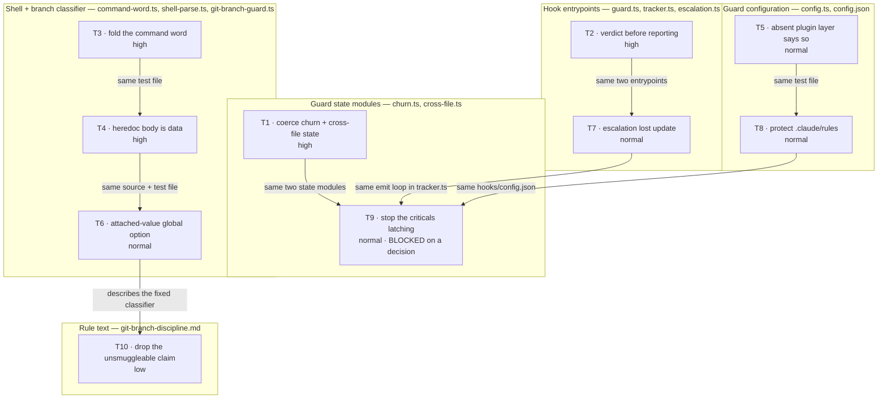

# Tasklist

**Generated:** 2026-08-09 17:51
**Domain:** code
**Open tasks:** 10
**Blocked:** 1 (task 9, awaiting a human decision)

**Scope of this queue.** It covers exactly the ten open defect records named in the
dispatch, all in `fusion-workbench/shared/issues/`. It is not a full workbench scan: open
plans, decisions, reviews and every other issue in the store were deliberately not
inventoried. Do not read an absence here as "nothing else is open".

**Verification.** Every one of the ten was checked against the working tree at `6b94e17`
before queueing. All ten are genuinely open, none is a duplicate of another, and none is
already fixed. Details are in the per-task notes.

**Executor.** All ten route to `coder`. Two carry a routing note (tasks 8 and 10); read
them before dispatching.

## Dependency graph

Edges read "the task at the tail must land before the task at the head". The graph is the
transitive reduction: task 10 also depends on tasks 3 and 4, and task 6 also on task 3,
through the chains drawn. Grouping is by the file cluster a task edits, which is what
generates almost every edge — two tasks touching one file are sequenced rather than left
adjacent and independent, so each gets its own commit.

## Tasks

### 1. Coerce the churn and cross-file state files instead of casting them

- **ID:** `I:260809-1101-coerce`
- **Source:** `fusion-workbench/shared/issues/260809-1101_o_churn-and-cross-file-state-are-cast-not-coerced-so-a-shape-valid-file-swallows-the-halt-message.md`
- **Executor:** coder
- **Files:** `hooks/lib/churn.ts`, `hooks/lib/cross-file.ts`, `hooks/lib/__tests__/churn.test.ts`, `hooks/lib/__tests__/cross-file.test.ts`
- **Depends on:** none
- **Priority:** high
- **Status:** [x] done (260809-1811, coder — shared helper `hooks/lib/guard-state-file.ts`)
- **Detail:** `loadChurn` (`hooks/lib/churn.ts:80`) and the cross-file loader
  (`hooks/lib/cross-file.ts:94`) do `JSON.parse(content) as ChurnState` and catch only a
  missing file or a parse failure. A file that parses to a valid JSON value of the wrong
  shape — `{}` is enough — passes the catch and throws on the next field access. The throw
  escapes to `hooks/tracker.ts:532`, whose handler calls `respond()` with no argument and
  so discards the protected-path halt sentence built at `hooks/tracker.ts:355-366`. The
  revert and the halt still land; what is lost is the only message telling the agent which
  file changed and how a human clears it, which is exactly the silent-revert failure
  `rules/protected-path-discipline.md` was written against. The file is never repaired,
  because `saveChurn` sits after the throw, so every later tool call in that project takes
  the same path until a human deletes it. Give both modules a `coerceState` equivalent
  modelled on `hooks/lib/escalation.ts:109-127` — require an object, default `files` to
  `{}`, default the scalar fields. The escalation module already carries this fix (issue
  `260802-2334_c`); this is the same defect in the two siblings it was not applied to. The
  analysis recommends landing a single shared state-file helper carrying the coercion seam
  (target C2 in `shared/analyses/260809-1101-guard-support-layer.md`) so a third copy
  cannot drift again — prefer that over two parallel private copies.
- **Acceptance:** a `churn.json` containing `{}` loads to a valid empty state with no
  throw; the same for `cross-file.json`; a test drives the compiled `tracker.js` with a
  shape-valid-but-wrong state file and asserts the protected-path halt message still
  reaches stdout; `npm test` green.
- **Verified open:** `hooks/lib/churn.ts` still reads `return JSON.parse(content) as
  ChurnState` inside a bare `catch`, and `hooks/lib/cross-file.ts` has the same shape.

### 2. Write the verdict before reporting the error, in both hook entrypoints

- **ID:** `I:260809-1109-failopen`
- **Source:** `fusion-workbench/shared/issues/260809-1109_o_both-hooks-fail-silent-instead-of-open-when-the-guard-state-directory-is-unwritable.md`
- **Executor:** coder
- **Files:** `hooks/guard.ts` (top-level handler), `hooks/tracker.ts` (top-level handler),
  check the same pattern in `hooks/session-start.ts` and `hooks/clear-halt.ts`; a new
  subprocess test under `hooks/lib/__tests__/`
- **Depends on:** none
- **Priority:** high
- **Status:** [x] done (260809-1826, coder — shared helper `hooks/lib/fail-open.ts`)
- **Detail:** Both hooks end with a handler whose comment promises fail-open, and both
  call `emitEvent(...)` before `allow()` / `respond()`. `emitEvent` appends to
  `fusion-workbench/.guard-state/events.jsonl`. When the original throw was an I/O error
  under `.guard-state/` — the likeliest cause, since nearly every write these files make
  goes there — `emitEvent` throws again inside the handler and the verdict line never
  runs. Measured: with `.guard-state/` read-only, `node hooks/dist/guard.js` exits 1 with
  empty stdout. Whether Claude Code reads that as "no verdict" (guard silently off) or as
  an error (agent blocked with no reason) was not measured, and both readings are bad.
  Fix: move `allow()` / `respond()` above the `emitEvent` call in each handler and wrap the
  reporting in its own `try`/`catch`. The verdict is the hook's contract with Claude Code;
  the event log is best effort and must not be able to withdraw it.
  `process.stderr.write` can stay where it is — it does not touch the failing resource.
- **Acceptance:** with `.guard-state/` unwritable, `guard.js` writes `{}` to stdout and
  exits 0; `tracker.js` writes a valid response envelope and exits 0; a failure inside the
  error reporting cannot suppress the verdict; a test drives both through the real
  subprocess with an unwritable state directory; `npm test` green.
- **Verified open:** both handlers still end `emitEvent(...)` then `allow()` /
  `respond()`. The record's own reconciliation notes `hooks/tracker.ts` was rewritten in
  `62f5490` / `d8745f0` without touching this handler.

### 3. Fold the command word so a capitalised `GIT` cannot pass the branch policy

- **ID:** `I:260809-1110-casefold`
- **Source:** `fusion-workbench/shared/issues/260809-1110_o_the-command-word-comparison-is-case-sensitive-while-the-protected-path-match-folds.md`
- **Executor:** coder
- **Files:** `hooks/lib/command-word.ts` (`programName`, `:196-199`),
  `hooks/lib/git-branch-guard.ts:241` (`invocation.name !== "git"`),
  `hooks/lib/__tests__/git-branch-guard.test.ts`
- **Depends on:** none
- **Priority:** high
- **Status:** [x] done (260809-1839, coder — fold in `programName`, `hooks/lib/command-word.ts`)
- **Detail:** `classifySegment` decides a segment is a git call by comparing the resolved
  command word against the literal `"git"`, case-sensitively. On a case-insensitive
  filesystem — macOS APFS in its default configuration — the shell resolves `GIT` to the
  same binary, so the spelling alone flips the guard's verdict. Measured: `git switch
  main` denies, `GIT switch main`, `Git switch main` and `gIt worktree add ../w x` all
  allow, while `zsh -c 'GIT --version'` and `bash -c 'GIT --version'` both print `git
  version 2.49.0`. The protected-path half of the same hook took the opposite decision
  deliberately and wrote down why at `hooks/guard.ts:617-622` (`matchesAnyFolded`: a glob
  compiles to a case-sensitive regex, so `AGENTS/coder.md` missed `agents/**`). That
  argument was never carried across to the command word. Fold once where the word is
  resolved — in `programName` — not at each comparison, so every future consumer gets the
  same answer. Folding cannot widen an allow: it can only make more segments resolve to a
  known program name, and every table the resolved name is compared against is a deny
  table. `Invocation.name` is currently the basename as spelled; if a consumer ever needs
  the original spelling, add a field rather than leaving the comparison case-sensitive.
- **Acceptance:** `GIT switch main`, `Git switch main` and `gIt worktree add x y` all
  deny; `/usr/bin/GIT switch main` and `\GIT switch main` deny; non-git programs are
  unaffected (`RM -rf x` resolves to `rm` and changes no verdict, since the branch policy
  holds no `rm` row); a test states the filesystem dependency so the case is not read as
  unreachable on a case-sensitive volume; `npm test` green.
- **Verified open:** `hooks/lib/git-branch-guard.ts:241` still reads `invocation.name !==
  "git"`, and `programName` still returns the basename as spelled. `9716ee5` rewrote
  `classifyCheckout` and the global-option walk and left this alone.

### 4. Treat an unquoted heredoc body as data with its substitutions lifted out

- **ID:** `I:260809-1111-heredoc`
- **Source:** `fusion-workbench/shared/issues/260809-1111_o_a-plain-line-in-an-unquoted-heredoc-body-is-classified-as-a-command.md`
- **Executor:** coder
- **Files:** `hooks/lib/shell-parse.ts` (`stripData` heredoc branch `:234-309`, newline
  segmentation `:410-414`, `extractCommandSegments` `:359-399`),
  `hooks/lib/__tests__/shell-parse.test.ts`, `hooks/lib/__tests__/git-branch-guard.test.ts`
- **Depends on:** task 3 (both add cases to `git-branch-guard.test.ts`; sequencing only, no
  semantic dependency)
- **Priority:** high
- **Status:** [x] done (260809-1855, coder — `blankHeredocBody` in `hooks/lib/shell-parse.ts`)
- **Detail:** A heredoc with an unquoted delimiter has its body preserved as code, and the
  segmenter then splits on newlines, so every body line becomes its own candidate command.
  Measured: `cat <<EOF > runbook.md` with a body line `git switch main` segments to `["cat
  <<", "git switch main", "EOF"]` and denies, while the quoted form `<<'EOF'` allows (that
  half was fixed by `260716-2005_c`). The module argues the preservation as fail-closed
  because bash expands in an unquoted body, and the argument is right about expansion and
  wrong about execution. `$(git switch main)` in the body does run, so preserving it is
  correct; a bare line reading `git switch main` does not run, it is written to the file
  exactly as in the quoted form. The distinction is decidable from the text — it is the
  presence of a substitution, which `stripData` already locates elsewhere and `resolveWord`
  already tests for at `:517`. Fix: blank the body as the quoted form does, but first
  extract every `$(…)` and backtick region and append those as segments in their own right.
  `extractCommandSegments` already performs exactly that lifting for code regions; the
  change is to apply it to the body before blanking rather than to leave the body whole.
  That is one mechanism reused, not a heredoc special case, and it keeps the fail-closed
  property where it was earned. **Explicitly not to be built**, for the reasons
  `260716-2005` already gave: an allow-list for command-looking prose, or any rule about
  which lines "look like documentation".
- **Acceptance:** `cat <<EOF` with a body line `git switch main` allows; the same with
  `$(git switch main)` in the body still denies; the same with a backticked `` `git switch
  main` `` still denies; the quoted-delimiter cases from `260716-2005` stay green; a real
  branch switch outside any heredoc still denies; `npm test` green.
- **Verified open:** `hooks/lib/shell-parse.ts` is not in the diff `451a07e..fb262d8`; the
  heredoc branch and the newline segmentation are unchanged.

### 5. An absent plugin config layer must produce a diagnostic

- **ID:** `I:260809-1101-plugin-layer`
- **Source:** `fusion-workbench/shared/issues/260809-1101_o_an-absent-plugin-config-layer-yields-an-empty-protected-list-with-no-diagnostic.md`
- **Executor:** coder
- **Files:** `hooks/lib/config.ts` (`readLayer` `:348`, the docstring at `:112-119` and
  `:337-346`), `hooks/lib/__tests__/config.test.ts`
- **Depends on:** none
- **Priority:** normal
- **Status:** [x] done (260809-1900, coder — absent plugin layer diagnosed in `readLayer`)
- **Detail:** `readLayer` returns the empty layer for a configuration file that does not
  exist, with no diagnostic. Applied to the plugin layer that silently drops the effective
  `guard.protectedPaths` to `DEFAULTS.guard.protectedPaths`, which is the empty list — the
  guard then protects nothing and says nothing. The loader's own docstring commits to the
  opposite: a configuration file that cannot be read is dropped and recorded, never dropped
  silently. The commitment is scoped to a file that exists, and an absent file is exempt by
  construction. For the project layer that exemption is right, and must stay: a project
  that has never written `fusion-guard.json` is the ordinary case and must not be nagged.
  For the plugin layer the same silence means something else, because the plugin's own
  `hooks/config.json` is the only thing carrying a non-empty default list — the seeded
  template says so in its own words. Fix: distinguish the two layers in `readLayer`. An
  absent project layer stays silent; an absent plugin layer produces one diagnostic naming
  the path that was searched, which `hooks/guard.ts:470` already turns into a
  `guard_advisory` on every guarded call until it is fixed. That is the same loudness the
  module already chose for a plugin file that exists but does not parse. Reachability is
  low (the record says so plainly: `install.sh` copies `hooks/` wholesale) — the reason to
  fix it is that this is the one silence in the loader that contradicts a contract the
  loader itself states, in the direction that removes protection.
- **Acceptance:** an absent plugin `config.json` yields exactly one diagnostic naming the
  searched path; an absent project `fusion-guard.json` yields none; the diagnostic surfaces
  as a `guard_advisory`; `npm test` green.
- **Verified open:** `hooks/lib/config.ts` still opens `readLayer` with `if
  (!existsSync(path)) return EMPTY_LAYER;` for both layers, and is not in the diff
  `451a07e..fb262d8`.

### 6. An attached-value global option must not also consume the next word

- **ID:** `I:260809-1548-attached-option`
- **Source:** `fusion-workbench/shared/issues/260809-1548_o_an-unknown-global-option-carrying-its-own-value-should-not-also-consume-the-next-word.md`
- **Executor:** coder
- **Files:** `hooks/lib/git-branch-guard.ts:283-285` (the `unknownOption` assignment),
  `hooks/lib/__tests__/git-branch-guard.test.ts`,
  `hooks/lib/__tests__/fixtures/git-corpus-451a07e.json` (baseline, read-only — do not
  regenerate it), `rules/git-branch-discipline.md` (`## One deny you will not have
  expected`)
- **Depends on:** task 4 (same source file and same test file as tasks 3 and 4; land after
  both so each classifier change is one commit)
- **Priority:** normal
- **Status:** [x] done (260809-1912, coder — `unknownOption = !t.includes("=")` in
  `classifySegment`; sweep re-measured 145 → 142, newly allowed 0)
- **Detail:** The resumed option walk added in `9716ee5` sets `unknownOption = true` for
  every unrecognised `-`-prefixed token, so it skips the following token as a possible
  value. For an option written in the attached form, `--exec-path=/x`, that is provably
  wrong: the value is already part of the token and no further word belongs to it. The
  consequence is three of the ten false denials that step accepted as its price — `git
  --exec-path=/x grep switch` denies today because `grep` is eaten as the option's value
  and `switch` lands in subcommand position. Not setting `unknownOption` for any token
  containing `=` removes those three without allowing anything new: an attached-value
  option cannot be the form that hides a subcommand behind a separate word, which is the
  entire failure mode the resumed walk exists to close. The `coder` who implemented step 3
  identified this, deliberately did not build it, and was right to leave it — extending a
  security-relevant classifier past its planned scope is how a fix acquires unreviewed
  behaviour. This record exists so the improvement is not lost to that judgement. Note the
  bound: `git --no-pager grep switch`, the one form somebody plausibly types, is not among
  the three and stays denied either way.
- **Acceptance:** a global option token containing `=` does not cause the next token to be
  skipped; the corpus measurement is re-run and nothing is newly allowed against the
  `451a07e` baseline, with the newly-denied count falling from 145 to 142; the cost rule in
  the step-3 tests and the text in `rules/git-branch-discipline.md` `## One deny you will
  not have expected` are updated to match the smaller set; the four existing corpus
  describes in `git-branch-guard.test.ts` stay green; `npm test` green.
- **Verified open:** `hooks/lib/git-branch-guard.ts:282` still sets `unknownOption = true`
  with no test for `=`. The record's dependency on plan step 6 is discharged — that step
  landed in `fb262d8`, so criterion 3 is now an edit to existing rule text rather than a
  wait for it to be written.

### 7. Stop the escalation read-modify-write losing a halt raised in parallel

- **ID:** `I:260809-1101-escalation`
- **Source:** `fusion-workbench/shared/issues/260809-1101_o_escalation-json-read-modify-write-can-lose-a-halt-raised-by-a-parallel-tool-call.md`
- **Executor:** coder
- **Files:** `hooks/lib/escalation.ts` (`saveEscalation` `:186-201`, `coerceState`
  `:96-101`, `raiseHalt` `:273-289`), `hooks/guard.ts:587` and `:771`,
  `hooks/tracker.ts:335-343`, `hooks/lib/__tests__/escalation.test.ts`
- **Depends on:** task 2 (both edit `hooks/guard.ts` and `hooks/tracker.ts`)
- **Priority:** normal
- **Status:** [x] done (260809-1927, coder — candidate 1, the merge on save; `saveEscalation`
  re-reads and adopts a halt raised since its load, in `hooks/lib/escalation.ts`, which
  joined the `hooks/lib/guard-state-file.ts` seam because the merge has to read. No call
  site in `hooks/guard.ts` or `hooks/tracker.ts` changed. Counters stay last-writer-wins;
  `churn.json` and `cross-file.json` untouched.)
- **Detail:** `escalation.json` is loaded, mutated in memory and written back with an
  atomic rename, with no lock. The rename prevents a torn file; it does not prevent a lost
  update, because `saveEscalation` serialises the whole state object the caller is holding,
  so every write is a full replacement. `hooks/guard.ts` holds that object across the
  entire PreToolUse decision — load at `:587`, save at `:771` — and everything in between
  is time in which another process can have written a different state. The writer that
  matters is the measurement: `hooks/tracker.ts:335-343` loads, calls `raiseHalt`, saves.
  If that lands between guard's load and guard's save, the allow path writes
  `haltActive: false` back over it, the `recentEvents` entry goes with it, and the
  `guard_halt` event stays in the log describing a halt that is no longer recorded.
  **Calibration, carried from the record:** the read-modify-write shape is verified by
  reading; the interleaving itself is marked `speculation:` and was not measured, because
  Claude Code exposes no per-call correlation key and reproducing it needs two concurrent
  guarded tool calls. Severity is conditional on how often that happens, which is unknown.
  Three candidate fixes, none obviously right: re-read the state immediately before saving
  and merge the halt flag rather than replacing it; give the halt flag its own file so the
  two writers never share a document; or take the advisory lock `bin/fusion-commit-lock`
  already implements. The record names the first as smallest, and it would need
  `haltActive` treated as monotonic within a call, which matches how `coerceState` already
  leans. Reuse before building: check `bin/fusion-commit-lock` before writing a new locking
  mechanism. Note that this is distinct from decision
  `circles/260807-0923-guard-misst-statt-orakelt/decisions/260807-0945_o_integritaet-des-eskalationsspeichers.md`,
  which asks how the store survives an agent that deliberately deletes it — this is
  accidental loss under ordinary operation, with no adversary. Read that decision before
  choosing, so the two answers do not conflict.
- **Acceptance:** a halt raised by `tracker` between another call's load and save survives;
  a test simulates that interleaving deterministically rather than by timing; the same
  read-modify-write in `churn.json` and `cross-file.json` is left alone (a lost update
  there costs only counter accuracy — say so in the change rather than widening scope);
  `npm test` green.
- **Verified open:** `hooks/lib/escalation.ts` is not in the diff `451a07e..fb262d8`.

### 8. Protect `.claude/rules/**`, or write down why it is not protected

- **ID:** `I:260801-1020-claude-rules`
- **Source:** `fusion-workbench/shared/issues/260801-1020_o_guard-protects-rules-but-not-claude-rules.md`
- **Executor:** coder — **with a routing note, read it before dispatching**
- **Files:** `hooks/config.json` (the `protectedPaths` list),
  `hooks/config.example.json`, `hooks/lib/rules-write-exemption.ts` (two comments,
  `:279-283` and `:535-536`), `hooks/lib/__tests__/config.test.ts:238-248`,
  `hooks/lib/__tests__/rules-write-exemption.test.ts`, `README-hooks.md`
- **Depends on:** task 5 (both edit `hooks/lib/__tests__/config.test.ts`; sequencing only)
- **Priority:** normal
- **Status:** [ ] open
- **Detail:** `hooks/config.json` lists `rules/**` among the guard's protected paths and
  does not list `.claude/rules/**`. Path matching is anchored — `globToRegex` in
  `hooks/lib/paths.ts:9-22` wraps the pattern as `^...$` and `hooks/guard.ts:94-106`
  normalises to cwd-relative first — so `.claude/rules/CODING-HYGIENE.md` does not match
  `rules/**` and a write to it is allowed. That is inconsistent, because `bin/fusion-rules`
  emits from all three roots in one pass with no precedence between them, an agent reads
  every emitted path, and `rules/context-lean-claude-md.md:64-72` explicitly assigns the
  *heavier* material to `.claude/rules/`. The result is inverted protection: an agent
  cannot touch a thin capture-layout file in `./rules/` but can rewrite the coding-hygiene
  rules that bind it. Two candidate resolutions, both one line — add `.claude/rules/**` to
  `protectedPaths`, or state deliberately why the two roots differ and document that in
  `README-hooks.md`. The record judges the first correct and the second right only if there
  is a reason nobody has written down; look for such a reason before choosing.
  **The landing is already prepared**, which is a strong signal for the first option:
  `hooks/lib/rules-write-exemption.ts:279-289` already carries `.claude/rules/**` in
  `RULE_DIR_PATTERNS` and names this very record as the thing it is waiting for. Closing
  this makes two comments there stale — `:279-283` ("although it is not on the protected
  list today") and `:535-536` ("not on the protected list at HEAD") — and both must be
  corrected in the same commit, or the module documents a state that no longer exists.
- **Routing note:** the load-bearing edit is one line in `hooks/config.json`, and by the
  letter of fusion's file-ownership split (`coder` owns `.ts`, `ontocoder` owns JSON) that
  line belongs to `ontocoder`. It is queued to `coder` anyway, because the same change
  must move two TypeScript comments and two test files to stay coherent, and splitting a
  one-line change across two agents costs more than the split buys. If the caller prefers
  the strict split, dispatch `ontocoder` for `hooks/config.json` and
  `hooks/config.example.json` first, then `coder` for the rest, and treat the pair as one
  task with two commits.
- **Acceptance:** `.claude/rules/x.md` is measured and written back like `rules/x.md`, or
  `README-hooks.md` states why it is not; the two stale comments in
  `rules-write-exemption.ts` match the new state; the shipped-list assertion in
  `config.test.ts:238-248` covers the new entry; `FUSION_ALLOW_RULES_WRITE` still exempts
  `.claude/rules/**` and is still outranked by a project-declared entry; `npm test` green.
- **Verified open:** `hooks/config.json` `protectedPaths` reads `["agents/**", "rules/**",
  "hooks/config.json", "hooks/hooks.json", "settings.json", "bin/monitor", "skills/**",
  ".claude-plugin/plugin.json"]` — no `.claude/rules/**`.

### 9. Give the churn and cross-file criticals a reset boundary — decision first

- **ID:** `I:260809-1101-latching`
- **Source:** `fusion-workbench/shared/issues/260809-1101_o_churn-and-cross-file-criticals-latch-permanently-and-never-reset.md`
- **Executor:** coder — **only after the decision below is answered**
- **Files:** depends on the decision. Candidate set: `hooks/lib/churn.ts:107-132` and
  `:178`, `hooks/lib/cross-file.ts:122-153`, `:169-174`, `:200-208`,
  `hooks/tracker.ts:432-448` and `:458-474`, `hooks/config.json` (the `churn` and
  `crossFile` threshold blocks), `README-hooks.md`, the two state-module tests
- **Depends on:** task 1 (same two state modules), task 7 (`hooks/tracker.ts` emit loop),
  task 8 (`hooks/config.json`) — plus an unanswered human decision, below
- **Priority:** normal
- **Status:** [ ] open — **blocked**
- **Blocked on:** a decision nobody has recorded yet. No decision record exists for this;
  the queue does not invent one. Whoever picks this up files the question first and stops.
- **Detail:** `totalChanges` in `churn.json` and `pingBackCount` in `cross-file.json` are
  monotonic for the life of a project. `recordChange` resets the per-session counter after
  two hours but `stats.totalChanges` only ever increments, and `analyzeChurn` re-checks
  that permanent total against `totalChangesCritical` on every call — so a file with
  fifteen lifetime changes reports critical whenever any file is written. Cross-file is
  worse: it has no session concept at all, and `resetCrossFile` has no caller anywhere in
  the repository (confirmed: the only hits are its own definition at
  `hooks/lib/cross-file.ts:200` and the generated `hooks/dist/lib/cross-file.d.ts`), though
  its docstring calls it a checkpoint "after a commit indicates progress". The cost is
  measured in this repository's own log: 2,330 of 11,142 lines are the two critical types,
  a fifth of the event log, from two counters that steer no branch — `analyzeChurn`'s
  result is consumed only by the emit loop at `hooks/tracker.ts:432-448` and
  `analyzeCrossFile`'s only by `:458-474`, and neither reaches `block`, `recordBlock`,
  `raiseHalt` or the hook response. Two further consequences: the dashboard's warnings
  panel holds thirty rows, so a permanently-firing critical pushes real `guard_block` and
  `guard_halt` rows off it, and a level that is always on reports nothing about the current
  session, which is the question `agents/orchestrator.md:113` asks the churn file at Setup.
  **The three options are mutually exclusive and the record does not choose between them:**
  give the counters a reset boundary (session start, a commit, or an explicit checkpoint
  that finally calls `resetCrossFile`); or drop the total-level thresholds and keep only
  the session-level ones; or remove cross-file outright. The analysis notes cross-file has
  no reader outside its own accumulation, which makes removal a smaller change than repair.
  Removing a shipped observation surface is not a call an executor makes on its own.
- **First action for the executor:** file the decision record in `shared/decisions/` naming
  the three options and what each costs, then stop and surface it. Do not implement one of
  the three and record the choice afterwards.
- **Verified open:** `resetCrossFile` still has no caller; `hooks/lib/churn.ts` and
  `hooks/lib/cross-file.ts` are not in the diff `451a07e..fb262d8`.

### 10. Drop the "cannot smuggle a branch switch" claim from `## The rule`

- **ID:** `I:260809-1226-overclaim`
- **Source:** `fusion-workbench/shared/issues/260809-1226_o_the-rule-still-promises-a-branch-switch-cannot-be-smuggled-into-a-compound-command.md`
- **Executor:** coder — see the routing note
- **Files:** `rules/git-branch-discipline.md` (`## The rule`, the segmentation paragraph at
  `:18` and the wrapper-resolution paragraph that follows; `## Why` at `:49`)
- **Depends on:** task 6 (which also edits this file), and through it tasks 3 and 4 —
  **this task is last on purpose**
- **Priority:** low
- **Status:** [ ] open
- **Detail:** The segmentation paragraph in `## The rule` describes what the guard does —
  splits on `;`, `&&`, `||`, `|`, `&` and newlines, splices line continuations, strips
  subshell parentheses, inspects command substitutions — and closes with an absolute: "You
  cannot smuggle a branch switch inside a compound command." The description is accurate;
  the closing sentence is not. Segmentation finding a segment and the classifier denying
  that segment are two different steps, and the open classifier defects are all failures of
  the second. A deny-case segment the classifier reads as allow passes whether it stands
  alone or sits inside a compound command, so the compound command is not the thing that
  fails to smuggle it. `## Why` already concedes the general point and now names the
  defects explicitly; this sentence sits several screens earlier, in the section a reader
  treats as the statement of the policy, and contradicts the concession. The fix is not a
  caveat bolted onto the sentence: the paragraph is describing segmentation, and
  segmentation genuinely does what it says. The honest close names its own scope — that no
  segment escapes being classified — leaving whether a classified segment is correctly
  denied to `## Why`. Decide the wrapper-resolution paragraph in the same pass: it
  enumerates leading assignments, compound-command introducers, wrapper programs, paths,
  quoting and backslash escapes as covered, which is exactly the class the case-folding
  defect falsified.
- **Why this is last, verified rather than assumed:** the dispatch flagged this dependency
  as needing a check, and it holds on two independent grounds. **File collision:** task 6's
  own acceptance criterion 3 edits this same file (`## One deny you will not have
  expected`), so the two must be sequenced. **Content:** `## Why` at `:49` currently names
  `260809-1110` — task 3 — as a *measured defect standing open*, and the wrapper-resolution
  paragraph must be corrected "with the case-folding defect taken into account". Once task
  3 lands, that sentence is false and the wrapper paragraph becomes accurate as written, so
  the correction this task writes differs depending on whether task 3 landed. The
  dependency on task 4 is weaker and is stated as such: the heredoc fix changes what
  newline segmentation yields for a heredoc body, and this task rewrites the paragraph that
  describes segmentation. `rules/git-branch-discipline.md` contains no heredoc text today
  (checked), so this is a content dependency, not a collision. Landing task 10 before tasks
  3, 4 and 6 would mean writing rule text about a classifier that is about to change, which
  is how the overclaim arose in the first place.
- **Routing note:** the record is filed with `**Domain:** knowledge` because the artifact
  is rule text, not code. It is queued to `coder` because the correction is a statement
  about what `hooks/lib/git-branch-guard.ts` and `hooks/lib/shell-parse.ts` actually do
  after tasks 3, 4 and 6, and only the agent that changed them can write it accurately.
  This is not `ontocoder` work and not `editor` work.
- **Acceptance:** `## The rule` makes no claim about a branch switch being unsmuggleable
  that the open classifier defects falsify; whatever the section does claim is a property
  of segmentation alone, with classification correctness left to `## Why`; the
  wrapper-resolution paragraph is either confirmed accurate or corrected in the same pass,
  with the case-folding defect taken into account; `## Why` no longer describes
  `260809-1110` as open once task 3 has landed.
- **Verified open:** `rules/git-branch-discipline.md:18` still ends "You cannot smuggle a
  branch switch inside a compound command." `fb262d8` edited the file for three other
  obligations and left it standing.

## Notes on the ten records

**None is already fixed.** Each was checked against the working tree at `6b94e17`, not
against its own reconciliation note. The specific line or string each record cites was read
and still reads as filed; the per-task "Verified open" lines say what was checked.

**None is a duplicate of another.** Two pairs look adjacent and are not. Tasks 1 and 9 both
edit `hooks/lib/churn.ts` and `hooks/lib/cross-file.ts`, but one is an unvalidated JSON
shape that costs the halt message and the other is a monotonic counter that costs the
signal — different defects, different fixes, no overlap in the lines they touch. Tasks 2
and 7 both edit `hooks/guard.ts` and `hooks/tracker.ts`, but one is the top-level error
handler and the other is the escalation state's read-modify-write.

**`rules/protected-path-discipline.md` is cited but not edited by any of the ten.** Tasks 1
and 7 quote it as the contract they restore; none of the ten records asks for a change to
it. If a task's implementation makes a statement in that file false, that is a new finding
to file, not scope to absorb.

**Nine of ten are `coder` work without qualification.** Tasks 8 and 10 carry routing notes;
neither is `ontocoder` work in substance, and neither needed forcing.

**Verification is `npm test` from `hooks/`** (`npm run build && vitest run`). Where a record
named a test file or fixture, it is carried into that task's acceptance criteria: the
`451a07e` corpus baseline for task 6, the subprocess harness for task 2, the shipped-list
assertion in `config.test.ts` for task 8.

## Changelog

- **2026-08-09 17:51** — Queue created. Ten tasks added from the shared issue store, scope
  restricted to the ten records named at dispatch. Eight dependencies recorded: five from
  file collisions turned into sequencing (tasks 4, 6, 7, 8, 9), three from content (task 10
  on task 6, and through it on tasks 3 and 4). One task blocked pending a decision (task 9).
