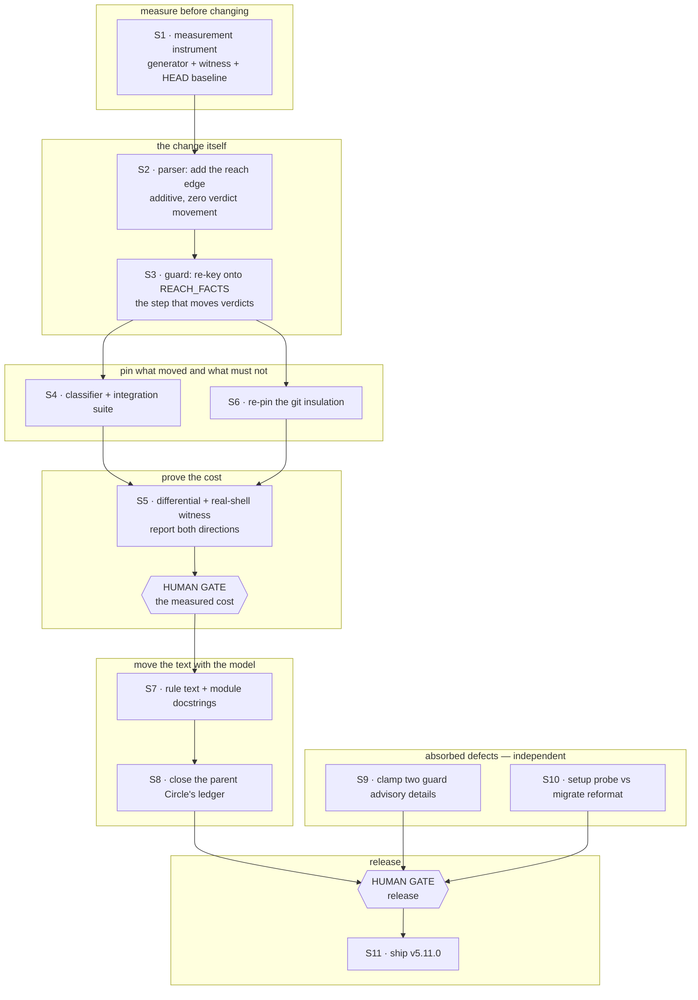
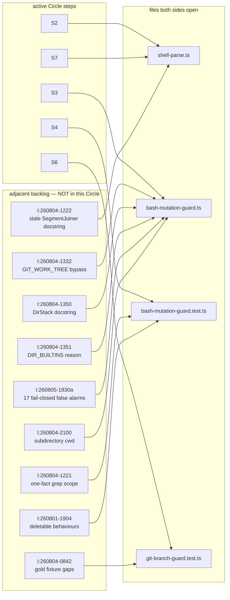

# Tasklist

**Generated:** 2026-08-07 00:02
**Domain:** code
**Active Circle:** `circles/260804-1205-shell-reachability-model` (`_t_`)
**Source plan:** `circles/260804-1205-shell-reachability-model/planning/260806-2353_*_plan-shell-reachability-model.md`
**Open tasks:** 44 (11 in the active Circle, 33 unaffiliated backlog)
**Blocked:** 10 (all inside the active Circle — S2 through S11 have unmet dependencies or sit behind a human gate)
**Ready now:** 34 (S1, plus every backlog entry — backlog items are independent by construction)

---

## How to read this file

**Section A is the active Circle's queue. It is the only section the orchestrator's Turn loop may pull from.**

Sections B and C are backlog: open defects that exist in the workbench and are routable, but that no active Directive caused. Pulling one into this Circle would widen the Circle past its own Directive and past the plan the user approved. They are listed so that they are *visible*, not so that they are *next*. They become work when a Circle adopts them — which is what the active plan did with two of them (S9 and S10 below).

Section D is what was deliberately **not** queued, with the reason for each. Read it before concluding that something is missing.

---

## Dependency graph — the active Circle

The graph is the plan's own, reproduced without alteration. It has one spine, one fork (S4 / S6 rejoining at S5), two independent absorbed defects that only meet the spine at the release gate, and no cycles. S9 and S10 can run at any time; they are drawn where they attach, not where they must wait.

## File collisions — where backlog touches the Circle's files

This graph carries no ordering. It answers one question: an executor working S2, S3, S4, S6 or S7 will have these files open, and these nine filed defects live in the same files. **Do not fix them in passing.** Each is unowned backlog; folding one in silently widens the Circle and makes the S5 differential measure two changes at once, which is exactly what S1 exists to prevent. If a step genuinely cannot be completed without touching one, say so at the Turn boundary rather than deciding alone.

---

# Section A — Active Circle queue

Every entry here comes from the approved plan. Work them top to bottom.

### A1. Build the measurement instrument before touching the classifier
- **ID:** `P:S1`
- **Source:** `circles/260804-1205-shell-reachability-model/planning/260806-2353_*_plan-shell-reachability-model.md` step 1
- **Executor:** coder
- **Depends on:** none — **this is the one task that is ready right now**
- **Priority:** high
- **Status:** [ ] open
- **Detail:** Two new files, `hooks/lib/__tests__/helpers/reachability-corpus.ts` and `hooks/lib/__tests__/helpers/shell-witness.ts`. The corpus is a deterministic, seedless cross-product generator over heads (`true`, `false`, `[ -d nope ]`, `echo hi`, `ls`, none) × joiners × the four directory builtins × compound wrappers (`if`, `while`, `until`, brace group, pipeline, bare) × write verbs (`rm`, `rm -rf`, `mv`, `sed -i`, `cp`, redirection, `tee`) × targets (protected and unprotected, relative and absolute); export it as a function so a test can consume it. The witness takes one row, materialises a throwaway project **outside this repository**, seeds the target file, runs the row in `bash` and in `zsh`, and reports per shell whether the file survived. Capture the full-corpus verdict baseline at HEAD `38c5123` to scratch; commit only the bounded subcorpus (compound-command, pipeline, `||`, `|`) as `hooks/lib/__tests__/fixtures/mutation-verdicts-head.json`, modelled on `git-verdicts-head.json` including its non-vacuity assertion.
- **Why it is first:** the parent Circle shipped two enumerations harvested from its own test suite and both were falsified inside a day. A corpus harvested from the tests measures reproduction, not cost. The instrument must exist before the change it measures.

### A2. Add the grammar-derived reach edge to the parser
- **ID:** `P:S2`
- **Source:** same plan, step 2
- **Executor:** coder
- **Depends on:** `P:S1`
- **Priority:** high
- **Status:** [ ] open
- **Detail:** In `hooks/lib/shell-parse.ts`, add `SegmentReach` and `ParsedSegment.reach` per the plan's edge-vocabulary table (`start`, `and`, `seq`, `or`, `cond-true`, `cond-false`, `branch`, `barrier`, `transparent`, `pipe-member`). Derive it in a pass over the segments `scanSegments` already produces, using a stack of open compound heads plus a pipeline-membership marker, and read the grammar words from `command-word.ts`'s existing `GRAMMAR_PREFIXES` rather than minting a second list. `joiner`, the segmentation itself, and blank mode stay untouched — the layer annotates, it never splits differently. New unit tests in `shell-parse.test.ts` read `reach` as a table the way existing tests read `joiner`, including multi-line spellings where the grammar word is its own segment.
- **Proof obligation:** the guard does not read the new field yet, so re-running the S1 differential must report **zero** rows moved in either direction. Non-zero here means the layer changed segmentation, which invariant 1 forbids.

### A3. Re-key the guard's two questions onto the reach edge
- **ID:** `P:S3`
- **Source:** same plan, step 3
- **Executor:** coder
- **Depends on:** `P:S2`
- **Priority:** high
- **Status:** [ ] open
- **Detail:** In `hooks/lib/bash-mutation-guard.ts`, rename `JOINER_FACTS` to `REACH_FACTS` and re-key it on `SegmentReach`. Keep both field names (`carriesCdForward`, `movesCallingShell`), the safe-list default for an unknown row, the single reader, and the export-as-review-surface stance. The walk's one lookup reads `segment.reach`. Update the module docstring's `TWO PRECISIONS ON THE WORD &&` section to state the reachability model and to move issue `260804-0839` from "still open" to closed, keeping the `until` counter-example where it is.
- **Note:** this is the step that moves verdicts, and it should be **one commit** so the differential has a single boundary to measure across.

### A4. Pin the behaviour, including the shapes that must not move
- **ID:** `P:S4`
- **Source:** same plan, step 4
- **Executor:** coder
- **Depends on:** `P:S3`
- **Priority:** high
- **Status:** [ ] open
- **Detail:** In `bash-mutation-guard.test.ts` and `guard-bash-integration.test.ts`: the four relief families allow (`if cd hooks; then rm -rf dist; fi`, `while cd build; do rm out.js; done`, `{ cd build; } && rm out.js`, `cd hooks && npx tsc | tee typecheck.log`), and the same shapes against a **protected** target still deny, so the block cannot pass by allowing everything. The twelve `until` rows keep denying in their own case with the reason in the comment. Anti-vacuity neighbours sit beside their relief partners: `cd hooks; npx tsc | tee typecheck.log` denies while the `&&` form allows; `{ cd build; ls; } && rm out.js` denies, so `transparent` is not a blanket exemption for `}`; `cd build | grep x && rm out.js` denies, which is the pipeline-head rule. Re-run the existing `||` and `|` cases unchanged. Move the one-fact grep assertion from `.joiner` to `.reach` and additionally assert zero reads of `.joiner` in the mutation guard's code. Move the four relief rows out of the "costs these ordinary shapes" block into the relief block, leaving that block's rule statement intact.
- **Note:** the relief rows must be asserted through the real guard subprocess (`helpers/guard-harness.ts`) as well as the unit classifier. The write guard stands down inside this repository, so a unit-level allow can pass for the wrong reason.

### A5. Re-pin the git branch classifier's insulation
- **ID:** `P:S6`
- **Source:** same plan, step 6
- **Executor:** coder
- **Depends on:** `P:S3`
- **Priority:** high
- **Status:** [ ] open
- **Detail:** In `hooks/lib/__tests__/git-branch-guard.test.ts`, extend the source assertion that currently forbids `parseCommand`, `ParsedSegment` and `joiner` to also forbid `reach`, `SegmentReach` and `REACH_FACTS`. Re-run the 98-command gold fixture (`fixtures/git-verdicts-head.json`); it must reproduce byte for byte with **no regeneration**. If the fixture needs regenerating, the insulation has been breached and that is a defect to file, not a fixture to refresh.
- **Ordering note:** listed after S4 because both feed S5, but it only needs the new names to exist — it can run as soon as S3 lands, in parallel with S4.

### A6. Measure the change in both directions, execute what newly allows, and report
- **ID:** `P:S5`
- **Source:** same plan, step 5
- **Executor:** coder
- **Depends on:** `P:S4`, `P:S6`
- **Priority:** high
- **Status:** [ ] open
- **Human gate:** **yes** — the user sees both sets and the shell evidence before anything ships
- **Detail:** Run the S1 generator against the S1 baseline and the post-S3 classifier, and bucket every row whose verdict moved. For **every** deny-to-allow row, run the witness in `bash` and in `zsh` and record where the write actually landed — a row that allows while the shell writes a protected path is a regression and blocks the gate. For allow-to-deny rows, state the cost as a **rule with labelled examples plus an explicit note that the example set is open**, never as a closed list; that closed-list mistake has been made and falsified twice already. Both shells belong in the method because they disagree about the last element of a pipeline, and a row must be measured in the shell that performs its write. Write the measurement record to `circles/260804-1205-shell-reachability-model/reviews/`.

### A7. Move the documentation with the model
- **ID:** `P:S7`
- **Source:** same plan, step 7
- **Executor:** coder
- **Depends on:** `P:S5` (the human gate must have passed)
- **Priority:** normal
- **Status:** [ ] open
- **Detail:** Five passages in `rules/protected-path-discipline.md` plus the `SegmentJoiner` docstring in `hooks/lib/shell-parse.ts` go wrong the moment the model changes, and are rewritten together. The rule statement ("unknown in every segment that is reachable without an `&&`") becomes the reachability statement. The joiner table becomes the edge table, keeping its three-column shape and its closing sentence that anything absent counts as no to both. Questions 2 and 3 of the four-question procedure are re-stated over the edge rather than the adjacent operator, and question 3 gains the compound-command answers. The "Written, not run" paragraph keeps its control row exactly as it stands — that residual does not move. The residual paragraph drops the clause naming a conditional body, a loop body, a brace group and a pipeline stage as a deny you pay, and the catalogue count is corrected to what the catalogue then holds. Read the line numbers out of the file rather than trusting the plan's citations.
- **Before editing:** `reference-resolution-lint.test.ts` checks that citations in rule text resolve, and `rules/rule-file-provenance.md` governs the `**Provenance:**` header. The header stays as it is — the file is not new.

### A8. Close the parent Circle's ledger where this work reaches it
- **ID:** `P:S8`
- **Source:** same plan, step 8
- **Executor:** coder
- **Depends on:** `P:S7`
- **Priority:** normal
- **Status:** [ ] open
- **Detail:** Append a `Resolved:` note naming the commit and the measured relief to `circles/260801-1244-guard-rules-write/issues/260804-0839_*_the-flat-joiner-model-ignores-shell-precedence-so-a-pipeline-and-an-if-body-degrade-a-cd-the-shell-guarantees.md`, then rename its marker from `_o_` to `_c_`. Append a closure note to section 1 of `circles/260801-1244-guard-rules-write/analyses/260805-0717-protected-path-forensics.md` ("One honest edge, still open, and it costs rather than leaks") — the shipped rule file points readers there and it becomes wrong on the same commit. Both records stay where they are; the Origin Rule's second corollary is that reach is cited, never placed.
- **Say plainly in both notes what stays open:** the control row `[ -d nope ] || cd build && rm rules/x.md` denies before and after, because reachability is a static property and an exit status is not. `mv "$f"` and the whole unresolvable-operand class are untouched by this Circle.

### A9. Clamp the two unbounded guard advisory details
- **ID:** `P:S9`
- **Source:** same plan, step 9 — **which adopts** `circles/260801-1244-guard-rules-write/issues/260803-1352_*_two-guard-advisory-details-skip-the-200-char-clamp-and-render-a-row-nine-times-normal-height.md`
- **Executor:** coder
- **Depends on:** none — **ready now, independent of the S1–S8 spine**
- **Priority:** normal
- **Status:** [ ] open
- **Detail:** Route both advisory details through `forEvent()` — the rules-write exemption's path list and the git override note, both in `hooks/guard.ts`. For the path list, drop whole entries and append `(+N more)` rather than truncating mid-path; that is a `rulesWriteDetail` change in `hooks/lib/rules-write-exemption.ts`, not a `forEvent` change. Add a test in `hooks/lib/__tests__/monitor-warnings-panel.test.ts` that a 30-path exemption and a long override command both produce a detail within `EVENT_DETAIL_MAX`. **Read the line numbers out of `guard.ts` rather than trusting the citation** — this issue's citations have drifted twice already.
- **On completion:** append the resolution note to the source issue and rename its marker to `_c_`. The issue stays in the parent Circle; it is cited, not moved.

### A10. Give setup's bracket probe and migrate's reformat pass the same tree
- **ID:** `P:S10`
- **Source:** same plan, step 10 — **which adopts** `circles/260805-2005-textschicht-gegen-code-nachziehen/issues/260806-0022_*_setup-klammer-probe-und-migrate-reformat-decken-verschiedene-baeume.md`
- **Executor:** coder
- **Depends on:** none — **ready now, independent of the S1–S8 spine**
- **Priority:** normal
- **Status:** [ ] open
- **Detail:** `skills/setup/SKILL.md` and `skills/migrate/SKILL.md` must move in **one commit**, because the criterion is a relation between them: the detector may only look for things the executor can remove. Today setup's bracket-marker probe walks the whole workbench minus `archive/`, `stashes/` and `.migration-v2-backup/`, while migrate's reformat pass visits only `shared/` at any depth plus `circles/` from depth 2. A bracket-marker file anywhere else — the workbench root, say — is flagged by setup and never renamed by migrate, so setup refuses, migrate reports nothing to do, and the deadlock reappears. Recommended resolution: widen migrate's `find` to the tree setup probes. Widening beats narrowing the probe because it loses no file. Read both line numbers out of the files.
- **Human gate:** **only if the recommendation does not hold.** If widening migrate changes behaviour in a way you cannot bound, that is a decision to record — file a decision record in this Circle's decision store and stop, rather than picking.
- **On completion:** append the resolution note to the source issue and rename its marker to `_c_`.
- **Priority note:** rated normal rather than high because the deadlock needs a bracket-marker file outside both stores to trigger, which is a narrow condition — but when it triggers it blocks setup completely.

### A11. Ship v5.11.0
- **ID:** `P:S11`
- **Source:** same plan, step 11
- **Executor:** coder
- **Depends on:** `P:S8`, `P:S9`, `P:S10`, and the `P:S5` human gate
- **Priority:** high
- **Status:** [ ] open
- **Human gate:** **yes** — this is the point at which the change becomes live for consuming projects
- **Detail:** Follow the release process in `CLAUDE.md`. Validate first: `claude plugin validate .` must pass, plus the agent-resolution smoke test. Confirm the guard was verified against a project root that is **not** this repository — the self-detect stand-down makes a local check unrepresentative by construction, and the S4 integration cases through `guard-harness.ts` are what satisfies that. Then rebuild and commit `hooks/dist/`, bump `.claude-plugin/plugin.json` to 5.11.0, pull and bump the marketplace clone's `marketplace.json`, commit and push both repositories, tag `v5.11.0` and push the tag, and refresh **both** `FUSION_REF` pin examples in the same commit as the version bump — `install.sh` and `README.md`, the latter being the surface a user reads first and the one that drifted for months.
- **Why this is high:** the over-deny this Circle closes is live for consuming projects right now (v5.9.x and v5.10.0 shipped it). Nothing in Section A reaches a user until this step runs.

---

# Section B — Adjacent backlog (same files as the Circle, NOT in the Circle)

These nine are filed, open, and unowned. They live in the files S2/S3/S4/S6/S7 will edit. **They are not this Circle's work.** They are listed here so an executor recognises them on sight and leaves them alone rather than rediscovering them as fresh findings.

### B1. `GIT_WORK_TREE=` in the environment relocates the write, and the classifier reads no variable
- **ID:** `I:260804-1332`
- **Source:** `circles/260801-1244-guard-rules-write/issues/260804-1332_*_git-work-tree-in-the-environment-relocates-the-write-and-the-classifier-reads-no-variable.md`
- **Executor:** coder
- **Depends on:** none
- **Priority:** high
- **Status:** [ ] open
- **Detail:** Severity High, filed against a security control. A `GIT_WORK_TREE=` assignment in the environment relocates where a git command's write lands, and the protected-path classifier inspects no environment variable — so the operand it resolves is not the path the write reaches. This is a genuine bypass, not a false-positive complaint, and it is the highest-severity open item anywhere in the workbench. It is separable from the reachability model and does not need to wait for this Circle.

### B2. All 17 guard blocks in the observed consuming project were fail-closed false alarms
- **ID:** `I:260805-1830a`
- **Source:** `circles/260801-1244-guard-rules-write/issues/260805-1830_*_alle-17-guard-blocks-im-beobachteten-konsumprojekt-waren-fail-closed-fehlalarme.md`
- **Executor:** coder
- **Depends on:** none
- **Priority:** high
- **Status:** [ ] open
- **Detail:** Measured in a live consuming project (krk) over 02.–05.08. across 14,599 events: exactly 17 `guard_block` entries on the Bash surface, and every one of them carried a variable, a tilde or a glob as its blocked operand (`"$f"`, `"$SCRATCH"`, `~/Library/Application\`, `*`). Not one named an actually protected path. Zero true positives, seventeen fail-closed refusals on harmless targets — including fusion's own marker rename. **This is a different over-deny from the one the active Circle fixes:** the Circle closes the *reachability* degrade, while these 17 are the *unresolvable-operand* class, which the plan explicitly leaves untouched (step 8's note). Highest user-facing-pain item in the backlog, with measurement already in hand.

### B3. The "one fact about a joiner, in one place" guarantee is asserted over one file while a second file holds the same fact
- **ID:** `I:260804-1221`
- **Source:** `circles/260801-1244-guard-rules-write/issues/260804-1221_*_the-one-fact-about-a-joiner-guarantee-is-asserted-over-one-file-and-a-second-file-already-holds-the-same-fact.md`
- **Executor:** coder
- **Depends on:** none — but **S4 rewrites the very assertion this issue is about**
- **Priority:** normal
- **Status:** [ ] open
- **Detail:** Severity Medium. The grep assertion that pins "one fact about an edge lives in one place" scans a single file, and a second file already carries the same fact — so the guarantee the assertion claims to enforce does not hold across the codebase. S4 moves that assertion from `.joiner` to `.reach`; it does **not** widen its file scope. Whoever does S4 will be inside this exact code. Resist fixing it there: the scope widening is a separate change with its own blast radius, and folding it in makes the S5 differential measure two things.

### B4. The `SegmentJoiner` docstring says both shapes are open and cites a filename that no longer exists
- **ID:** `I:260804-1222`
- **Source:** `circles/260801-1244-guard-rules-write/issues/260804-1222_*_the-segmentjoiner-docstring-says-both-shapes-are-open-and-cites-the-decision-by-a-filename-that-no-longer-exists.md`
- **Executor:** coder
- **Depends on:** none — but **S7 rewrites this exact docstring**
- **Priority:** normal
- **Status:** [ ] open
- **Detail:** Severity Low. The `SegmentJoiner` docstring in `hooks/lib/shell-parse.ts` claims both shapes are still open, and cites its decision record by a filename whose marker has since changed, so the citation resolves to nothing. S7 rewrites that docstring for the reachability model anyway. This is the one adjacent item where folding the fix into the Circle step is arguably correct rather than scope creep — but say so at the Turn boundary and let the orchestrator decide, rather than deciding alone.

### B5. The git gold fixture carries no `||`, `|` or `&` joiner and no allow-only row
- **ID:** `I:260804-0842`
- **Source:** `circles/260801-1244-guard-rules-write/issues/260804-0842_*_the-git-gold-fixture-carries-no-double-pipe-pipe-or-ampersand-joiner-and-no-allow-only-row.md`
- **Executor:** coder
- **Depends on:** none — but **S6 re-runs this fixture and must reproduce it byte for byte**
- **Priority:** normal
- **Status:** [ ] open
- **Detail:** Severity Low, test coverage. The 98-command gold fixture that insulates the git branch classifier contains no command using `||`, `|` or `&` as a joiner, and no row that is allow-only — so its 98 verdicts prove less than their count suggests. Adding rows means regenerating the fixture, and S6's whole point is that the fixture must reproduce **without** regeneration. Do not touch it during S6; extending it is a separate, later change with its own baseline.

### B6. From a subdirectory working directory the protected list matches nothing while fail-closed still denies
- **ID:** `I:260804-2100`
- **Source:** `circles/260801-1244-guard-rules-write/issues/260804-2100_*_from-a-subdirectory-cwd-the-protected-list-matches-nothing-while-fail-closed-still-denies.md`
- **Executor:** coder
- **Depends on:** none
- **Priority:** normal
- **Status:** [ ] open
- **Detail:** Severity Low as filed, but it is the same cwd-sensitivity family as `I:260805-1839a` below and as the "start sessions at the repo root" caveat in `CLAUDE.md`. Run the guard with a subdirectory as cwd and the protected-path list matches nothing at all, while the fail-closed rule keeps denying — so the guard becomes maximally annoying and minimally protective at the same time. Worth fixing together with `I:260805-1839a`; both come from resolving self-location against cwd with no upward walk.

### B7. The `DirStack` docstring claims the compiler enforces a depth invariant it does not enforce
- **ID:** `I:260804-1350`
- **Source:** `circles/260801-1244-guard-rules-write/issues/260804-1350_*_the-dirstack-docstring-claims-the-compiler-enforces-a-depth-invariant-it-does-not-enforce.md`
- **Executor:** coder
- **Depends on:** none
- **Priority:** low
- **Status:** [ ] open
- **Detail:** Documentation of a security control asserting a compile-time guarantee that does not exist. Either make the invariant real or state the truth. Same module as S3.

### B8. `DIR_BUILTINS` carries a shell-dependent fact about `chdir`, justified by the wrong reason
- **ID:** `I:260804-1351`
- **Source:** `circles/260801-1244-guard-rules-write/issues/260804-1351_*_dir-builtins-carries-a-shell-dependent-fact-about-chdir-justified-by-the-wrong-reason.md`
- **Executor:** coder
- **Depends on:** none
- **Priority:** low
- **Status:** [ ] open
- **Detail:** The row is right; the comment explaining why it is right names a reason that is not the reason. A future editor reasoning from the stated justification would reach a wrong conclusion about a neighbouring row. Same module as S3.

### B9. Four classifier behaviours are deletable with a green suite
- **ID:** `I:260801-1904`
- **Source:** `circles/260801-1244-guard-bash-inspection/issues/260801-1904_*_four-classifier-behaviours-are-deletable-with-a-green-suite.md`
- **Executor:** coder
- **Depends on:** none
- **Priority:** low
- **Status:** [ ] open
- **Detail:** Severity Low, no live defect. Four behaviours in the mutation classifier can be removed without any test failing, so a future edit that removes them by accident would not be caught. S1's generated corpus may well cover some of these incidentally — worth re-checking this issue **after** S5 reports, since the honest answer may be "three of the four are now pinned".

---

# Section C — Unaffiliated backlog

Open, routable, and caused by no active Directive. Ranked. Nothing here is in the active Circle.

### C1. `/fusion:circle-stash` can sweep away the stash directory it just wrote
- **ID:** `I:260717-0030` · **Source:** `shared/issues/260717-0030_*_git-stash-include-untracked-can-sweep-the-stash-directory.md` · **Executor:** coder · **Depends on:** none · **Priority:** high · **Status:** [ ] open
- **Detail:** `git stash push --include-untracked` in `skills/circle-stash/SKILL.md` step 7.11 can capture the stash directory that step 7.5 created moments earlier, destroying the artifact the skill exists to produce. Verified by `coder` in three configurations. The user loses the in-flight Circle they were trying to protect — data loss in the one skill whose purpose is preventing data loss.

### C2. Plugin `settings.json` grants no `Agent(...)` permission, so every subagent dispatch prompts the user
- **ID:** `I:260801-2352` · **Source:** `shared/issues/260801-2352_*_plugin-settings-json-has-no-agent-allow-entries.md` · **Executor:** ontocoder · **Depends on:** none · **Priority:** high · **Status:** [ ] open
- **Detail:** `settings.json` at the plugin root ships 16 scoped auto-allows and not one `Agent(...)` entry, so every dispatch the orchestrator makes — `fusion:playmaker`, `fusion:coder`, all of them — interrupts the user for approval. This is continuous, visible friction in the primary workflow, and the fix is entries in a JSON file. Note the v2.8.1 lesson recorded in `CLAUDE.md`: verify the change with an end-to-end dispatch, not by inference.

### C3. Session bookkeeping froze at Turn 1 while three Turns and sixteen commits ran
- **ID:** `I:260801-2038a` · **Source:** `shared/issues/260801-2038_*_session-bookkeeping-froze-at-turn-1-while-three-turns-ran.md` · **Executor:** coder · **Depends on:** none · **Priority:** high · **Status:** [ ] open
- **Detail:** Three of the four session-state surfaces stopped updating after the first Turn of the 260801 session while it went on to run three Turns, sixteen commits and two code reviews. Each surface recovers individually; together they mean an interrupted-session resume would have restarted four hours and twelve commits behind reality. Same failure family as the issue that produced *this* tasklist rebuild — bookkeeping that silently stops rather than failing loudly.

### C4. The write guard protects `./rules/**` but not `.claude/rules/**`
- **ID:** `I:260801-1020a` · **Source:** `shared/issues/260801-1020_*_guard-protects-rules-but-not-claude-rules.md` · **Executor:** ontocoder (`hooks/config.json`), with a coder follow-up for the pinning test · **Depends on:** none · **Priority:** high · **Status:** [ ] open
- **Detail:** `hooks/config.json` lists `rules/**` among `protectedPaths` and omits `.claude/rules/**`, although `bin/fusion-rules` reads both as binding rule sources. A rule file an agent must obey sits unprotected. Check `templates/fusion-guard.json` and the root `fusion-guard.json` for the same gap in the same pass — `config.test.ts` pins the root copy byte-identical to the template.

### C5. The guard event log grows without bound, and its largest writer carries no information
- **ID:** `I:260805-1859` · **Source:** `circles/260801-1244-guard-rules-write/issues/260805-1859_*_das-guard-event-log-waechst-unbegrenzt-und-sein-groesster-schreiber-liefert-null-information.md` · **Executor:** coder · **Depends on:** none · **Priority:** normal · **Status:** [ ] open
- **Detail:** `.guard-state/events.jsonl` is append-only with no rotation, trimming or ceiling, and nobody cleans it: `skills/archive/SKILL.md` explicitly lists `.guard-state/` as do-not-touch, `emitEvent` only appends, and `saveEscalation` trims only `escalation.json`'s `recentEvents`. Meanwhile `bin/monitor` reads and parses the whole file on **every** refresh at a 2-second default interval. The largest single writer is a `tracker_record` line reading "Bash command observed" — 2,420 of them since 07-07, carrying nothing. Two fixes compose: stop writing the empty line, and rotate the log.

### C6. The tracker only stands down in the plugin repo when cwd is exactly the repo root
- **ID:** `I:260805-1839a` · **Source:** `circles/260801-1244-guard-rules-write/issues/260805-1839_*_der-tracker-steht-im-plugin-repo-nur-dann-still-wenn-cwd-exakt-die-repo-wurzel-ist.md` · **Executor:** coder · **Depends on:** none · **Priority:** normal · **Status:** [ ] open
- **Detail:** `hooks/tracker.ts` exits via `isFusionPluginCwd()` before logging anything, yet `events.jsonl` carries fresh `tracker_record` lines. Cause (derived, premises verified): `isFusionPluginCwd()` checks `process.cwd()/.claude-plugin/plugin.json` with no upward walk, so from a subdirectory such as `hooks/` the self-detect returns false and the tracker runs — while `findWorkbenchRoot()` *does* walk up and finds the log anyway. Same root cause as `I:260804-2100`; fix them together. Note `CLAUDE.md` documents the no-upward-walk bound as deliberate for `bin/fusion-plugin-cwd`, so this needs a decision about whether the two halves should agree here or diverge.

### C7. The domain heuristic reports `strategic` for a Cargo workspace with running tests
- **ID:** `I:260805-1830c` · **Source:** `circles/260801-1244-guard-rules-write/issues/260805-1830_*_die-domaenenheuristik-meldet-strategic-trotz-cargo-workspace-mit-laufenden-tests.md` · **Executor:** coder · **Depends on:** none · **Priority:** normal · **Status:** [ ] open
- **Detail:** In consuming project krk, the orchestrator's Setup step 5 domain detection returned `strategic` because open decisions (5) matched open defects (3), without ever checking whether source code was present. What was actually there: a Cargo workspace, four crates, 16 Rust source files, running tests. The session corrected it by hand. The domain parameter routes `taskplanner`, `reconciler` and `planner` — a wrong answer mis-prioritises every queue those three build.

### C8. `/fusion:next` activates a Circle without updating its `**Status:**` field
- **ID:** `I:260802-0920` · **Source:** `shared/issues/260802-0920_*_next-skill-activates-a-circle-without-updating-its-status-field.md` · **Executor:** coder · **Depends on:** none · **Priority:** normal · **Status:** [ ] open
- **Detail:** The activation branch of `skills/next/SKILL.md` renames `_a_circle.md` to `_t_circle.md` and writes `.active-circle`, but never updates the record's own `**Status:**` line — so the filename says active and the body says anticipated. A live specimen is deliberately preserved in `circles/260801-1244-rule-provenance-header/` per that Circle's closure note; use it to verify the fix.

### C9. `clear-halt.js` reports "not halted" instead of "no workbench found"
- **ID:** `I:260805-1134` · **Source:** `shared/issues/260805-1134_*_clear-halt-meldet-erfolg-wenn-es-die-workbench-nicht-findet.md` · **Executor:** coder · **Depends on:** none · **Priority:** normal · **Status:** [ ] open
- **Detail:** Severity Medium. Run from the wrong directory, `clear-halt.js` reports success rather than reporting that it found no workbench — a silent wrong answer where an error was warranted (`HYG-NO-SILENT-FAIL`).

### C10. An executor may report done while its own verification run is still in flight
- **ID:** `I:260805-0629a` · **Source:** `shared/issues/260805-0629_*_an-executor-may-report-done-while-its-own-verification-run-is-still-in-flight.md` · **Executor:** coder · **Depends on:** none · **Priority:** normal · **Status:** [ ] open
- **Detail:** Severity Medium-High, filed by consultant from an orchestrator session note in a consuming project. An executor agent can return a completion report while the test or build run it started has not finished, so the orchestrator records a success that has not been demonstrated. Prompt-level fix across the executor agents.

### C11. The dispatch prompt carries no origin, so a sub-agent's history lands by pointer alone
- **ID:** `I:260805-0629b` · **Source:** `shared/issues/260805-0629_*_dispatch-prompt-carries-no-origin-so-a-sub-agents-history-lands-by-pointer-alone.md` · **Executor:** coder · **Depends on:** none · **Priority:** normal · **Status:** [ ] open
- **Detail:** Severity Medium. A dispatched sub-agent learns its Circle affiliation only from `.active-circle`, never from the dispatch prompt, so if the pointer changes or is absent mid-dispatch its history file lands in the wrong store with no way to detect it. Touches the Origin Rule's mechanical applicability.

### C12. fusion cannot turn existing pre-Circle work into a Circle
- **ID:** `I:260803-1837` · **Source:** `shared/issues/260803-1837_*_no-route-turns-existing-pre-circle-work-into-a-circle.md` · **Executor:** coder · **Depends on:** none · **Priority:** normal · **Status:** [ ] open
- **Detail:** Severity Medium-High, filed by consultant at the user's request. There is no route — no skill, no agent path — that takes work already under way outside any Circle and turns it into one. A user who starts working and then wants Circle bookkeeping has to reconstruct it by hand. Capability gap rather than defect; may need a shaper pass before it is implementable.

### C13. No `SCAN_*` key resolves into the archive store
- **ID:** `I:260801-1020b` · **Source:** `shared/issues/260801-1020_*_scan-keys-never-reach-the-archive-store.md` · **Executor:** coder · **Depends on:** none · **Priority:** normal · **Status:** [ ] open
- **Detail:** All nine read keys resolve into `circles/<active>/` and `shared/` and none into `archive/`, so the moment `/fusion:archive` moves a decision or a history entry it leaves every agent's read set permanently. Archiving therefore destroys reachability rather than merely tidying. Constrains any future history-grounded capability (the curator Circle's spec cites it for exactly that reason).

### C14. Nobody checks whether the store already holds the same defect when filing
- **ID:** `I:260805-1548` · **Source:** `circles/260801-1244-guard-rules-write/issues/260805-1548_*_beim-filen-prueft-niemand-ob-der-store-denselben-defekt-schon-traegt.md` · **Executor:** coder · **Depends on:** none · **Priority:** normal · **Status:** [ ] open
- **Detail:** The same defect was filed twice in a consuming project, 21 hours apart, because the filing convention has no dedup step. With 45 open issues across this workbench alone the cost compounds. Convention plus prompt change.

### C15. The design-diagram self-check tests the graph's shape and never its agreement with the prose
- **ID:** `I:260804-1702` · **Source:** `shared/issues/260804-1702_*_the-diagram-self-check-tests-shape-and-never-tests-agreement-with-the-prose.md` · **Executor:** coder · **Depends on:** none · **Priority:** normal · **Status:** [ ] open
- **Detail:** `rules/design-diagrams.md`'s five self-check questions — hairball, fan-out, cycles, layering, orphans — are all about the graph in isolation. A plan can pass all five while drawing a dependency its prose never declares, or omitting one the prose does. Affects every planning artifact including this file.

### C16. `/fusion:cadence` defines a churn "session" two ways for git commits
- **ID:** `I:260731-2246a` · **Source:** `shared/issues/260731-2246_*_cadence-churn-session-defined-two-ways-for-git-commits.md` · **Executor:** coder · **Depends on:** none · **Priority:** normal · **Status:** [ ] open
- **Detail:** Severity Medium, inherited verbatim from `flight`'s original. The ambiguity sits precisely on the metric that the skill's list 3 exists to produce, so the recurring-themes ranking is not reproducible.

### C17. An unsubstituted `$SCAN_HISTORY` makes `/fusion:cadence` report a quiet week instead of failing
- **ID:** `I:260731-2246b` · **Source:** `shared/issues/260731-2246_*_cadence-empty-key-expansion-writes-a-silently-empty-digest.md` · **Executor:** coder · **Depends on:** none · **Priority:** normal · **Status:** [ ] open
- **Detail:** Severity Medium, silent wrong output, cheap fix. The surfacing site is `skills/cadence/SKILL.md`, but the resolver-key-in-a-shell-block pattern it inherits is shared by seven other skills — fix the pattern, not just the instance.

### C18. The `coder` description omits Rust, the language of the largest observed deployment
- **ID:** `I:260805-1830b` · **Source:** `circles/260801-1244-guard-rules-write/issues/260805-1830_*_die-coder-beschreibung-nennt-rust-nicht-die-sprache-des-groessten-beobachteten-einsatzes.md` · **Executor:** coder · **Depends on:** none · **Priority:** low · **Status:** [ ] open
- **Detail:** `agents/coder.md` and `README-agents.md` describe the coder as "(Go, TypeScript, React, Python)" with an ownership list that has no `.rs`. The most active observed consuming project is a Rust/Cargo workspace where the coder is the most-dispatched agent (37 of 80). Cheap, but it is agent **frontmatter** — apply the `CLAUDE.md` v2.8.1 lesson and verify with a real dispatch.

### C19. `/fusion:cadence` frontmatter: two unused tools and an oversized description
- **ID:** `I:260731-2246c` · **Source:** `shared/issues/260731-2246_*_cadence-frontmatter-unused-tools-and-oversized-description.md` · **Executor:** coder · **Depends on:** none · **Priority:** low · **Status:** [ ] open
- **Detail:** Severity Low, hygiene only, no functional failure. Two tools the skill body never uses, and a description 2.5× the next-longest. Fold into whichever pass touches `skills/cadence/SKILL.md` for C16 or C17.

### C20. Stale `!bin/fu` exception in `.gitignore`
- **ID:** `I:260716-1940` · **Source:** `shared/issues/260716-1940_*_stale-bin-fu-exception-in-gitignore.md` · **Executor:** coder · **Depends on:** none · **Priority:** low · **Status:** [ ] open
- **Detail:** `.gitignore` carries an un-ignore exception for `bin/fu`, removed in v3.20.0 when it was folded into the `fusion` launcher (commit `2736d07`). Dead since. One-line deletion; verify `bin/` still holds no such file first.

### C21. The replacement audit recipe went stale one Turn after it was written, and omits `moved`
- **ID:** `I:260804-1027` · **Source:** `circles/260801-1244-guard-rules-write/issues/260804-1027_*_the-replacement-audit-recipe-went-stale-in-the-turn-after-it-was-written-and-omits-moved.md` · **Executor:** coder · **Depends on:** none · **Priority:** low · **Status:** [ ] open
- **Detail:** Severity Low, record integrity of a security control. A documented audit recipe was invalidated by the very next Turn's changes and never covered the `moved` case. Anyone running it as written gets an incomplete audit and no signal that it is incomplete.

### C22. Five message assertions interpolate `HEADER_WINDOW` on both sides, so they cannot fail
- **ID:** `I:260802-1255` · **Source:** `circles/260801-1244-rule-provenance-header/issues/260802-1255_*_five-message-assertions-interpolate-header-window-on-both-sides.md` · **Executor:** coder · **Depends on:** none · **Priority:** low · **Status:** [ ] open
- **Detail:** Severity Low — weak assertions, not wrong ones, plus a divergence from the three sibling lint gates the plan required this one to match. Five tests that pass unconditionally.

### C23. The template's provenance placeholder opts out of the template's own fill-in convention
- **ID:** `I:260802-1256` · **Source:** `circles/260801-1244-rule-provenance-header/issues/260802-1256_*_template-placeholder-opts-out-of-the-templates-own-fill-in-convention.md` · **Executor:** coder · **Depends on:** none · **Priority:** low · **Status:** [ ] open
- **Detail:** Severity Low. The added sentence documents a hazard instead of removing it; the fix is one line.

### C24. Circle `260719-1536-plane-mirror-integration` closed coherent with an unfilled Turn log
- **ID:** `I:260801-1020c` · **Source:** `shared/issues/260801-1020_*_plane-mirror-circle-closed-with-empty-turn-log.md` · **Executor:** coder · **Depends on:** none · **Priority:** low · **Status:** [ ] open
- **Detail:** The record carries `_c_` and a full Closure note citing six commits `eb9cf59..aefbf39`, while its `## Turn log` still holds the "(none yet — anticipated)" placeholder. The 260806-1152 reconciliation confirmed the state and deliberately did not reconstruct the log. Reconstructing it from those six commits is mechanical; deciding whether it is worth reconstructing is the actual question.

---

# Section D — Open work deliberately NOT queued

Listed with the reason. None of these is forgotten; each is blocked on something an executor cannot supply.

**Needs a human decision before any executor can act**

| Item | Source | Why not queued |
|---|---|---|
| Stash manifest duplicates a field | `shared/decisions/260806-1152_*_stash-manifest-dirname-and-pointer-content-duplicate.md` | Decision in `_o_` — a user-input gate. Drop one field or keep both deliberately; no implementation exists to queue until it is answered. |
| How may a deliberately deleted Circle disappear? | `circles/260801-1244-guard-rules-write/decisions/260805-1548_*_wie-soll-ein-circle-verschwinden-duerfen-den-jemand-absichtlich-loescht.md` | Decision in `_a_` — an answer is recorded but the realising change is not scoped. Needs a planner or shaper pass, not an executor. |
| `install.sh` copies a LICENSE the repo does not have | `circles/260801-1244-guard-rules-write/issues/260805-1839_*_install-sh-will-eine-license-kopieren-die-das-repo-nicht-hat.md` | Two resolutions (add a LICENSE, or drop the line) and the choice is the user's — this is a publicly `curl \| bash`-installable project, so which licence is a real decision, not a code fix. |
| Workbench untracked breaks the archive durability premise | `shared/issues/260801-1020_*_workbench-untracked-breaks-archive-durability-premise.md` | `skills/archive/SKILL.md` says git preserves the bytes; `CLAUDE.md` says the workbench is gitignored. Both cannot be true. Fixing it means either tracking the workbench or retracting two documented claims — a user decision. |

**Needs a resource an executor does not have**

| Item | Source | Why not queued |
|---|---|---|
| Verify `bin/fusion-plane`'s create/PATCH body against the live instance | `circles/260719-1536-plane-mirror-integration/issues/260719-2304_*_verify-plane-create-patch-body-against-live-instance.md` | Requires the live self-hosted Plane at `plane.digitalleadership.com` plus `$PLANE_API_KEY`. Not reachable from a dispatched executor. |
| Emissions measurement on the unite-cocreator machine | `circles/260801-1244-guard-rules-write/issues/260805-2323_*_die-emissionsmessung-auf-der-unite-cocreator-maschine-steht-noch-aus.md` | Requires a different machine. |

**Suspected already resolved — a reconciler pass, not executor work**

| Item | Source | Evidence |
|---|---|---|
| Live workbench split across two layouts mid-conversion | `shared/issues/260717-0115_*_live-workbench-split-across-two-layouts-during-conversion.md` | The workbench holds no root type folders today; only `shared/` and `circles/`. The window the issue describes closed when the migration ran. Verify and close. |
| P-8 lint gate scope: four open questions | `shared/issues/260717-0031_*_p8-lint-gate-scope-open-questions-from-conversions.md` | P-8 shipped as `603ce62` and `path-literal-lint.test.ts` exists with a `DEFINITION_SITES` list. Some of the four questions were answered by what shipped; which ones needs checking, not implementing. |
| Prompt gaps surfaced by `fusion-paths` key-set derivation | `shared/issues/260717-0107_*_prompt-gaps-surfaced-by-fusion-paths-key-set-derivation.md` | Cites paths in the pre-v4 bracket-marker form that no longer resolve. Overtaken in part by the v4 restructure; needs re-verification against HEAD before anyone acts on it. |
| An agent prompt was modified by no task that authorized it | `shared/issues/260801-1410_*_unattributed-edit-to-ontocoder-prompt-during-session.md` | A governance finding about a session that ended on 260801. There is nothing to implement; the question is whether the finding produced a control, and if not, whether it should. |

**Awaiting Circle activation**

| Item | Source | Why not queued |
|---|---|---|
| Spec: normative-surface consolidation (the `curator` agent) | `shared/planning/260801-1122_*_spec-normative-consolidation.md` | Status Final, all twelve decisions answered — but it is a **spec**, not a plan, and it belongs to the anticipated Circle `circles/260801-1244-curator` (`_a_`). Its per-Circle implementation plan is produced by the planner at activation. Route it through `/fusion:next`, not through this queue. |

**Answered decisions with no realising work in scope**

`shared/decisions/260719-2141_*_concurrency-worktree-slots-vs-single-active-circle.md` and `shared/decisions/260801-1020_*_where-does-normative-consistency-live.md` are both `_a_` — answered, not realised. The active plan checked both and records that neither binds its work. The second is realised by the curator Circle above. Neither yields a task today.

---

## Changelog

**2026-08-07 00:02 — full rebuild.**

- **Removed all 11 prior entries (P-1 … P-11).** They were the v4.0.0 workbench-restructure queue generated `260716-1920` for `circles/260716-1847-workbench-umbau`, a Circle that closed on 260716. Nine entries were `[x]`, two `[deferred]`. Its `**Source plan:**` pointed at a pre-v4, root-relative, bracket-marker path that resolved to nothing in the current layout — twice over. No marker was preserved: not one of those tasks survives into the current queue, so there was nothing to carry forward.
- **Added Section A** — the 11 steps of the active Circle's approved plan, in the plan's own dependency order, all routed to `coder`.
- **Added Section B** — 9 filed defects that live in the files the plan's steps will edit, marked explicitly as outside the Circle so an executor does not absorb them in passing.
- **Added Section C** — 24 unaffiliated backlog defects, ranked.
- **Added Section D** — 11 open items deliberately not queued, each with its blocking reason.
- **Two issues appear as plan steps rather than as backlog entries**, because the plan adopted them: `260803-1352` (advisory-detail clamp) is `P:S9`, and `260806-0022` (setup probe vs migrate reformat) is `P:S10`. They are cited in place, not moved — the Origin Rule's second corollary. Both are listed once, in Section A only.
- **Resolves** `shared/issues/260801-2038_*_tasklist-holds-a-fully-closed-queue-from-a-circle-closed-two-weeks-ago.md`, whose option 1 ("regenerate on Circle activation") this rebuild performs. That issue's options 2 and 3 — delete the queue at Circle closure, and stamp-and-warn at `/fusion:setup` — remain unimplemented and are **not** covered by this rebuild. They are what would stop the same drift recurring; this rebuild only repairs the current instance.
