# Tasklist

**Generated:** 2026-08-11 09:03
**Domain:** code
**Active Circle:** none — no `.active-circle` pointer exists, so every `OUT_*` resolves into `shared/`
**Git HEAD at build time:** `7785330`
**Records inventoried:** 69 (53 in `shared/issues/`, 16 inside five already-closed Circles)
**Open tasks:** 68 (28 need a human answer before an executor can start; 2 need the user at a machine)
**Blocked:** 1 — the whole suite is red at HEAD, so task 1 precedes every task whose acceptance is an exit code
**Close without work:** 2

---

## The ground this queue was built on

**Session scope: open defect records only.** The Directive is *"close the open findings to reach a
clean state before any new feature or restructuring work begins."* This is a cleanup queue. It
carries no plan steps, no new capability work and no Circle activation, and it was built with **no
Circle active** — the portfolio holds one anticipated Circle (`circles/260801-1244-curator`) and it
was deliberately not touched.

A later reader should take three things from that. First, every task here traces to a defect record
that already existed; nothing was invented as work. Second, the one open plan in
`shared/planning/260801-1122_o_spec-normative-consolidation.md` is **not** inventoried, and its
absence says nothing about its state. Third, because no Circle is active, `$SCAN_ISSUES` resolves to
`shared/issues/` alone — the 16 records inside closed Circles are outside it and were reached by
naming their paths. They stay where they are, per the Origin Rule; nothing here proposes moving them.

## Read this first

**Task 1 is not optional and it is not ordinary.** `cd hooks && npm test` at HEAD `7785330` is
**red**: 41 files, 1142 tests, 1 failed. One stale citation in `skills/setup/SKILL.md:45` fails
`reference-resolution-lint.test.ts`. The executor report contract derives `Result: done` from the
suite's exit code (`agents/coder.md:78-80`), so **every executor dispatched before task 1 lands will
report `blocked`, whatever it touched**. That is exactly the failure mode queued task 40 describes,
arriving before the queue was even dispatched. Land task 1 first.

**No defect record exists for task 1.** It was found by running the suite while this queue was being
built, not by reading a record. Filing it is the reconciler's or the orchestrator's call, not this
queue's — but do not let the missing record delay the fix.

**Two records need no work.** They are in `## Close without work` at the bottom with the evidence
that resolves them, and they are **not** dropped: both still carry the open marker on disk, and
renaming that marker is the reconciler's call. One is obsolete (the machinery it describes was
deleted), one is fixed (the cascade was rebuilt in the direction it asked for).

**Three more records had part of their work land since they were filed.** They stay queued, with the
discharged half named so nobody redoes it: task 5 (the queue rebuild is committed; the durable
question is not), task 18 (both sites the record names are gone, the defect moved to a third), task
20 (its blocking decision was answered and implemented, so it is no longer blocked).

**Twenty-eight tasks need a human answer first**, blocks B below. Dispatching an executor at one of
them produces a guess. Nine open decision records sit behind them and the user chose not to answer
them up front; each gated task names the one it waits on, or states that it *is* the choice point.

**Two tasks need the user at a keyboard, not an executor** (block C). Neither can be done from this
machine.

## Scope of this queue

Exactly 69 open defect records, from two places, counted at `7785330`:

| Where | Count | How it was reached |
|---|---|---|
| `fusion-workbench/shared/issues/` | 53 | `$SCAN_ISSUES` with no Circle active. All 53 are `_o_`; there are no `_p_`. |
| `circles/260801-1244-guard-rules-write/issues/` | 10 | named path — outside `$SCAN_ISSUES` |
| `circles/260801-1244-rule-provenance-header/issues/` | 2 | named path |
| `circles/260807-0923-guard-misst-statt-orakelt/issues/` | 2 | named path |
| `circles/260805-2005-textschicht-gegen-code-nachziehen/issues/` | 1 | named path |
| `circles/260719-1536-plane-mirror-integration/issues/` | 1 | named path |

All five Circles are closed (`_c_`), so none of their records is owned by a running unit of work.
Every entry below cites its record by **workbench-relative path**, so a Circle-scoped record is
reachable without guessing which store it is in.

Deliberately **not** inventoried, and their absence means nothing about their state: the one open
plan named above; the nine open decision records (they appear here only as gates); review files and
analyses; `shared/backlogs/260811-0826_observations.txt`, an untracked user note that is not a
defect record and carries no marker.

## Verification

All 69 were checked against the working tree at `7785330` by reading the file or running the command
the record cites. Every entry carries a `**Verified:**` line saying what was read or run.

**On reuse of the previous queue.** The queue this replaces was built at `5ef92eb` on 260810-1723 and
inventoried 47 records. Twenty-two commits landed since. Measured against the current store: **40 of
its 47 are still open, 7 have closed** (5 by commits in the range, 2 were its own close-without-work
pair), and **13 currently-open records were unknown to it**, plus the 16 Circle-scoped records it
explicitly left for a later session. Nothing was carried forward unchecked — every one of the 40
survivors was re-run today, and entries whose measurement moved say so in place.

**Suite baseline, measured rather than assumed.** `cd hooks && npm test` at `7785330`: **41 files,
1142 tests, 1 failed, 88.04s**. The single failure is task 1. Any task below that reports a *second*
failure is reporting its own regression.

## Same class, not duplicates

Groups that look like one record split in two. Each is genuinely distinct; do not merge them.

| Group | Why they are distinct |
|---|---|
| Tasks 11, 12, 36, 65 (four churn/tracker defects) | A comment naming a metric that no longer exists; a read-path filter the migration made necessary; the tracker's own early exit asking cwd; the churn stand-down asking cwd. They share two files and nothing else. |
| Tasks 4, 56 (review accountability) | Coverage — passes that ran but did not tile the range — against ordering — a pass correctly scoped and overtaken by the release it was gating. `260810-1618` states plainly that fixing `260810-1205` does not fix it. |
| Tasks 13, 29, 32, 34, 54, 28 (six wrong counts) | A shipped README's site count, a record's prose against its own list, a commit message against an array, two reviews' totals against their own bodies, and a dashboard's session tally against the disk. Same class, six different producers. |
| Tasks 16, 17 (suite instability) | A test count that moves between runs, and a timing case that fails under CPU contention. `260810-1135` cross-references `260810-0918` as "a different instability in the same suite". |
| Tasks 24, 25 (the monitor test file) | A harness with no path for a machine that cannot allocate a pty, and a shipped stderr line with no assertion behind it. Both hook into `PTY_RUNNER` and `startMonitor`; neither is the other. |
| Tasks 26, 60, 61 (three `bin/fusion-plane` findings) | One flag undocumented in `usage()`; a different flag silently ignored without its partner; a third key-derivation site on the wire. Same file, three different silences. |
| Tasks 42, 43, 44 (three duplicated-criterion findings) | The source-root branch in two skills; the same branch missing from two more; the domain one-liner in four. One decision (`260810-2145`) covers all three, which is why they are sequenced rather than merged. |
| Tasks 50, 51 (marker-rename ownership) | One is a rename staged half-way into a commit; the other is two prompts both claiming the transition. `260810-2024` says to read `260810-0819` first because one change may settle both — that is a sequencing note, not an identity. |
| Tasks 19, 36, 65 (three cwd-vs-root gates) | The pre-deny path resolution, the tracker's early exit, and the churn stand-down each ask `process.cwd()` where the measurement asks the workbench root. Three call sites, one shared premise; the guard's own half was already moved and these were not. |

## Routing

- **67 tasks route to `coder`** — TypeScript under `hooks/`, shell helpers under `bin/`, agent prompts
  under `agents/`, skill bodies under `skills/`, rule files under `rules/`, the installer, and
  workbench records whose payload is prose.
- **1 task routes to `ontocoder`** — task 64, whose payload is the two `stilwerk/default-voice-*.yaml`
  profiles as structured data.
- **Task 30** edits YAML frontmatter *inside* a skill body and is queued to `coder` anyway: the
  frontmatter and the body it describes are one file and one change, and the honest fix may be to
  name the read in the body rather than drop the tools. If the caller prefers the strict split, treat
  it as one task with two commits.
- **Tasks 67 and 68 route to nobody.** They are user actions on machines and services this session
  cannot reach.

**Guard note.** Nineteen tasks write to a path the guard protects (`agents/**`, `rules/**`). In *this*
repository the protected-path measurement stands down (`hooks/lib/self-detect.ts`), so those writes
are not blocked here. Do not carry that assumption into a consuming project.

## Human gates

Twenty-eight tasks carry a `**Human gate:**` line. Six kinds:

| Kind | Tasks |
|---|---|
| The record names two or more candidate fixes and explicitly refuses to choose | 40, 46, 48, 52, 56, 57, 59, 60, 61, 62, 63, 65, 66 |
| A design question the record hands to the framework owner by name | 41 (should files move into a Circle), 50 (the marker-rename staging convention), 42 (a third `bin/` helper) |
| Acceptance cannot be pinned down without a user answer | 39 (what the seeded permission grant is), 49 (authorship of an edit only the user can confirm), 63 (the record's own first step is "ask why, before writing anything") |
| A schema or template change to a file every consuming project holds a copy of | 47 (the Circle record template), 64 (the voice-profile schema) |
| The record's own closure is the question | 53 (is the second criterion moot now that the branch policy is gone?) |
| **Partial** — part of the work is ungated and named separately | 43, 44 (both wait on task 42's answer and are otherwise mechanical), 45 (`.plane-map.json` is answered, `.plane-outbox.jsonl` is not), 54 (fix the two counts now; whether totals become derived is the decision), 55 (detection is a `grep`; the overwrite semantics are the decision), 58 (the mechanism is decided in `260810-2032`; its scope is not) |

**The nine open decision records, and which tasks wait on them.** None was answered up front, by the
user's choice.

| Decision record | Question, in one line | Tasks that wait on it |
|---|---|---|
| `shared/decisions/260806-1152_o_stash-manifest-dirname-and-pointer-content-duplicate.md` | Do two manifest fields holding one value both need to exist? | none in this queue — cited as context by tasks 18 and 47 |
| `shared/decisions/260807-2131_o_which-language-governs-a-customer-deliverable.md` | Chat language or artifact language for a customer deliverable? | none in this queue |
| `shared/decisions/260809-1224_o_is-the-decision-governed-escalation-check-3-a-live-feature.md` | Is the decision-governed escalation live, or retired with its configuration surface still shipping? | none in this queue |
| `shared/decisions/260810-0710_o_should-a-rule-be-allowed-to-land-without-the-check-that-enforces-it.md` | Must a rule land with an executable check? | 40, 53, 56 (and task 4's third piece, which is deliberately left out of scope) |
| `shared/decisions/260810-0718_o_should-rebuild-map-merge-with-the-existing-map-or-replace-it.md` | Merge or replace on `--rebuild-map`? | none directly; adjacent to 60 and 61 |
| `shared/decisions/260810-1544_o_should-prompt-called-bin-helpers-get-one-guarded-call-convention-and-does-the-work-tree-preference-extend-to-them.md` | One guarded-call convention for `bin/` helpers, and does the work-tree preference reach them? | 31, 42 |
| `shared/decisions/260810-1635_o_where-does-the-obligation-sit-to-update-the-artefact-that-explains-a-behaviour-when-the-behaviour-changes.md` | Who must update the prose when the behaviour it explains changes? | 13, 11, 65 and the whole wrong-count class — it is the class's own decision |
| `shared/decisions/260810-2145_o_should-a-repeated-skill-body-snippet-become-a-bin-helper-now-that-one-fact-lives-in-four-executable-copies.md` | Does a repeated skill-body snippet become a `bin/` helper? | 42, 43, 44 |
| `circles/260807-0923-guard-misst-statt-orakelt/decisions/260807-0945_o_integritaet-des-eskalationsspeichers.md` | How does the guard know the escalation state it reads is the one it wrote? | none in this queue — it is the residual of a closed Circle and has no defect record behind it |

**One decision that is already answered and matters here.** `shared/decisions/260810-2032_a_should-the-drift-checks-four-sentences-be-pinned-to-an-approved-baseline-instead-of-screened-by-a-blacklist.md`
adopted a baseline pin for the drift check's four sentences. Tasks 57 and 58 both build on it; what
is still open in each is scope, not mechanism.

Nothing in this queue is structurally destructive.

## Dependency graph

Two things this graph encodes, and they are different:

- **A subgraph means "these tasks edit one file or one closely-held pair."** Landing two of them is
  two commits, not one, and the second executor re-reads the file. Membership is the collision
  statement; no edge is drawn for a collision alone.
- **An edge means "the tail must land before the head."** Eleven edges carry real content
  dependencies and are labelled; the rest are ordering choices inside a contended file, made so an
  executor working top-to-bottom never has to jump.

Four honest readings of the shape:

- **`agents/orchestrator.md` is still the contended file, not a contended task.** Eleven tasks touch
  it. One prompt carries the session loop, the Setup heuristic, the commit procedure, the dispatch
  contract, the drift check, the staging shape and the Phase 4 bookkeeping. It is a god-file, and the
  graph shows that rather than hiding it. `rules/fusion-workbench-conventions.md` is second with six,
  and `hooks/lib/__tests__/` third with nine.
- **Task 1 fans out to everything that reports an exit code.** Four edges are drawn, one into each
  subgraph whose acceptance names `npm test`; the real reach is 24 tasks. That is not a design defect
  in the queue — it is what a red baseline does, and it is the concrete instance of what gated task
  40 is filed about.
- **Thirty-one tasks have no edge at all.** In a design DAG an orphan is a defect. In a work queue it
  is the good case: the task shares no file and no open decision with anything else and can be
  dispatched in any order.
- **One cluster is new and worth naming.** Tasks 42, 43 and 44 are three findings of one shape — a
  criterion stated in several executable copies with nothing keeping them equal — and they chain
  rather than sit side by side, because the decision behind 42 sets the call-site count for both
  others. Two of the three were introduced *as fixes* in the last session.

Node labels carry the priority and, where it applies, `gate` (an executor cannot start) or `user`
(no executor can do it at all).

```mermaid
flowchart TD
  subgraph pre["Prerequisite — the suite is red at HEAD 7785330"]
    T1["T1 · one stale citation turns the whole suite red<br/>critical"]
  end

  subgraph orch["agents/orchestrator.md — one prompt, seven regions"]
    direction TB
    T2["T2 · the session's bookkeeping stops freezing<br/>high"]
    T4["T4 · review coverage measured against the range<br/>high"]
    T15["T15 · one derivation of the queue's ground<br/>normal"]
    T27["T27 · the Cleanup wording stops excluding a live call point<br/>low"]
    T28["T28 · session counts derived, not tallied by hand<br/>low"]
    T31["T31 · Setup reads exit 3 as a missing build<br/>low"]
    T48["T48 · the dispatch prompt states the task's origin<br/>normal · gate"]
    T49["T49 · an unauthorised edit becomes visible<br/>normal · gate"]
    T50["T50 · a marker rename cannot be staged half-way<br/>normal · gate"]
    T51["T51 · a marker rename names its files<br/>normal · gate"]
    T56["T56 · a release states whether its range was reviewed<br/>normal · gate"]
  end

  subgraph conv["rules/fusion-workbench-conventions.md — the second god-file"]
    direction TB
    T8["T8 · exempt surfaces stop over-claiming<br/>normal"]
    T9["T9 · the tracked-workbench split gets complete<br/>normal"]
    T20["T20 · a duplicate check before filing<br/>normal"]
    T45["T45 · the layout tree names the two Plane files<br/>normal · gate"]
    T46["T46 · decide whether archived records are readable<br/>normal · gate"]
    T62["T62 · a citation form that does not rot<br/>low · gate"]
  end

  subgraph skl["skills/ — setup, next, cleanup, help"]
    direction TB
    T33["T33 · the cascade-reach sentence stops being one third short<br/>low"]
    T39["T39 · a fresh project stops prompting per tool call<br/>high · gate"]
    T42["T42 · one home for a criterion stated four times<br/>high · gate"]
    T43["T43 · the other two skill bodies get the same root<br/>high · gate"]
    T44["T44 · the domain one-liner stops being copied<br/>normal · gate"]
    T47["T47 · a Circle states its state once<br/>normal · gate"]
    T55["T55 · a stale chat profile is detected<br/>normal · gate"]
  end

  subgraph chn["hooks/tracker.ts and hooks/lib/churn.ts"]
    direction TB
    T11["T11 · the noise list names one metric<br/>normal"]
    T12["T12 · the ranking stops promoting noise files<br/>normal"]
    T21["T21 · the event log stops growing unbounded<br/>normal"]
    T36["T36 · the tracker stand-down asks the root<br/>low"]
    T65["T65 · the churn stand-down asks the root<br/>low · gate"]
  end

  subgraph grd["hooks/guard.ts and the protected-path measurement"]
    direction TB
    T18["T18 · the advisory detail gets a bound again<br/>normal"]
    T19["T19 · the pre-deny asks the measurement's root<br/>normal"]
    T22["T22 · the exemption's reach is measured again<br/>normal"]
  end

  subgraph lnt["hooks/lib/__tests__ — the gate cohort"]
    direction TB
    T14["T14 · a negative control calls the real helper<br/>normal"]
    T16["T16 · the suite total stops moving<br/>normal"]
    T17["T17 · a timing case stops depending on load<br/>normal"]
    T24["T24 · a pty failure reads as a pty failure<br/>low"]
    T25["T25 · the browser-gap line gets a gate<br/>normal"]
    T32["T32 · the skip-licence counts agree<br/>low"]
    T37["T37 · message assertions stop testing themselves<br/>low"]
    T57["T57 · a coverage count gets pinned, not floored<br/>normal · gate"]
    T58["T58 · the skip-licence vocabulary class closes<br/>normal · gate"]
  end

  subgraph pln["bin/fusion-plane"]
    direction TB
    T26["T26 · the second test seam gets documented<br/>low"]
    T60["T60 · an unused flag stops being silent<br/>low · gate"]
    T61["T61 · the third key derivation<br/>low · gate"]
    T67["T67 · the create body is checked against a live board<br/>normal · user"]
  end

  subgraph free["No shared file, no shared decision — dispatch in any order"]
    direction TB
    T3["T3 · the queue records its own ground<br/>high"]
    T5["T5 · a queue rebuild reaches a commit by rule<br/>high"]
    T6["T6 · the lock rule's example names a real site<br/>normal"]
    T7["T7 · a destructive verification takes a copy<br/>normal"]
    T10["T10 · backfill an empty Turn log<br/>normal"]
    T13["T13 · drop the stale ordering-site count<br/>normal"]
    T23["T23 · probe and reformat cover one tree<br/>normal"]
    T29["T29 · a record about counting counts once<br/>low"]
    T30["T30 · frontmatter hygiene<br/>low"]
    T34["T34 · the 19:18 review's totals match its body<br/>low"]
    T35["T35 · the coder's description names Rust<br/>low"]
    T38["T38 · the template placeholder gets its brackets<br/>low"]
    T40["T40 · a red baseline stops blocking every task<br/>high · gate"]
    T41["T41 · a route from existing work into a Circle<br/>high · gate"]
    T52["T52 · the diagram is checked against its prose<br/>normal · gate"]
    T53["T53 · close the halt record or state its residue<br/>normal · gate"]
    T54["T54 · the 05:12 review's totals match its body<br/>normal · gate"]
    T59["T59 · ontocoder gets a decision write path<br/>normal · gate"]
    T63["T63 · why the review file was never written<br/>low · gate"]
    T64["T64 · the writing profile answers to its name<br/>low · gate · ontocoder"]
    T66["T66 · the installer's LICENSE entry<br/>low · gate"]
    T68["T68 · the emission measurement on the other machine<br/>low · user"]
  end

  T1 -->|"the suite is red, and Result:done is derived from its exit code — 24 tasks wait on this"| T14
  T1 --> T18
  T1 --> T11
  T1 --> T26

  T2 --> T27
  T2 --> T28
  T2 -->|"the same range-against-reviews bookkeeping; ride the mechanism, do not invent a second"| T4
  T2 -->|"the drift-check prose this rewrites is the text the baseline pin would pin"| T58
  T3 -->|"mandate the head line before consolidating the parser that reads it"| T15
  T14 -->|"factors the table check into a callable helper this task extends"| T15
  T11 -->|"the corrected comment travels with the constant this task may move"| T12
  T12 --> T65
  T9 -->|"move the second enumeration first, so the two Plane files land once"| T45
  T8 --> T62
  T24 -->|"both rework PTY_RUNNER and startMonitor in the same file"| T25
  T26 --> T60
  T60 -->|"the wire-format question is the same decision, one layer out"| T61
  T4 -->|"the same computation, consumed as a precondition rather than as a report"| T56
  T39 --> T55
  T48 --> T49
  T50 -->|"one change may settle both halves of rename ownership"| T51
  T42 -->|"answer the one-home question before rooting two more bodies through it"| T43
  T42 --> T44
```

**One collision the graph cannot show.** Task 21 edits `hooks/lib/events.ts` and `bin/monitor`'s read
path; task 25 edits the monitor's test harness and task 24 the same file. They do not conflict in
practice, but whoever lands the second one re-reads the file.

---

## Tasks — dispatchable now

Nothing from here to task 38 needs a user answer. Task 1 comes first for the reason stated above.

### 1. Restore the green suite: one stale citation fails the whole run

- **ID:** `X:260811-0901-red-baseline`
- **Source:** none — **no defect record exists.** Found by running `cd hooks && npm test` at
  `7785330` while this queue was being built. The failing gate is
  `hooks/lib/__tests__/reference-resolution-lint.test.ts:669`.
- **Executor:** `coder`
- **Files:** `skills/setup/SKILL.md:45` (the citation). Nothing else.
- **Depends on:** none. **Everything whose acceptance is an exit code depends on this.**
- **Priority:** critical
- **Status:** [x] done — `cd hooks && npm test` exits 0 (1142 passed, 0 failed)
- **Detail:** `skills/setup/SKILL.md:45` cites
  `fusion-workbench/shared/issues/260717-0115_o_live-workbench-split-across-two-layouts-during-conversion.md`.
  That record now carries `_c_`, so the citation is dangling and the reference-resolution lint fails
  the whole suite. The lint states its own fix in the failure message: cite the marker position as
  `_*_`, the wildcard form ratified by decision `260806-0015_i_zitierform-fuer-workbench-records.md`.
  **This is self-inflicted and worth understanding rather than only fixing.** The record went `_o_` →
  `_c_` in the last session precisely because the previous queue had classified it "close without
  work". Closing a record breaks every citation of it that names the old marker — which is the exact
  failure the wildcard form exists to prevent, and which is why the lint knows the remedy by name.
  Expect one or two more of these each time a batch of records closes, and read tasks 54 and 62
  beside it.
  While in the file, run the same check outward rather than only at line 45:
  `grep -rn '_[opadcibs]_' skills/ agents/ rules/ | grep 'fusion-workbench/'` and convert any other
  marker-bearing record citation to the wildcard form in the same commit.
- **Acceptance:** `cd hooks && npm test` exits 0; `skills/setup/SKILL.md:45` cites the record in
  `_*_` form; no other marker-bearing citation of a workbench record survives in `skills/`, `agents/`
  or `rules/`.
- **Verified:** ran `cd hooks && npm test` at `7785330` — 41 files, 1142 tests, **1 failed**. Ran
  `npx vitest run lib/__tests__/reference-resolution-lint.test.ts` in isolation: 29 tests, 1 failed,
  the single finding being `skills/setup/SKILL.md:45`, `stale marker '_o_': the record now exists as
  shared/issues/260717-0115_c_…`.

### 2. Stop the session's own bookkeeping freezing

- **ID:** `I:260801-2038-frozen-state`
- **Source:** `fusion-workbench/shared/issues/260801-2038_*_session-bookkeeping-froze-at-turn-1-while-three-turns-ran.md`
- **Executor:** `coder`
- **Files:** `agents/orchestrator.md` (the Turn-boundary write, `### Drift check`, Phase 4),
  `skills/setup/SKILL.md` (the interrupted-session check), `bin/monitor`
- **Depends on:** task 1
- **Priority:** high
- **Status:** [x] done — `cd hooks && npm test` exits 0 (42 files, 1166 tests). The measurement moved
  into `hooks/lib/state-drift.ts` with three callers, none of them the session that installs it: the
  PostToolUse hook on every guarded tool call, `bin/fusion-state-drift` behind `/fusion:setup` Step 1
  and the orchestrator's Drift check, and `bin/monitor` surfacing the emitted `state_drift` events.
  Named residual: it makes a skipped write impossible not to notice, and cannot make the write
  happen — the repair stays the orchestrator's, because candidate 3 stays rejected.
- **Detail:** Three of the four session-state surfaces stop being updated after Turn 1 while the
  session runs on. Measured **six times** across six sessions: `agentstate.yaml` said `commits: 0`
  while `git rev-list --count` said 6, 7, 8, then 12; a Circle record said `Status: anticipated` with
  an empty Turn log while the Circle had been active for days; a session history said
  `Directive: (not yet stated)` while eight hours of work followed. `orchestrator-events.jsonl` never
  froze, and that is the diagnostic: event emission is a per-action call that cannot be forgotten
  without the action failing, while the other three are end-of-Turn writes a session can skip with
  nothing breaking. Resume is the feature this breaks.
  **The detection half has landed and its own limits are recorded.** `agents/orchestrator.md` carries
  a `### Drift check` attached to four event emissions — candidate 2. What remains:
  - **Candidate 1, prevention, is not built.** The Turn-boundary write still stands as its own
    obligation; it does not ride the commit. That is the shape that has now been skipped six times.
  - **`/fusion:setup` does not compute the divergence.** The orchestrator's inlined Setup Step 1 does;
    `skills/setup/SKILL.md` carries the same steps for the user-triggered path and was out of scope.
  - **`bin/monitor` does not compute it either.**
  - Candidate 3 (let the reconciler repair it) is rejected in the record and must stay rejected — it
    would put two writers on the session-state surfaces.
  - **A prompt-only fix cannot reach the session that writes it.** An agent prompt is loaded at
    session start, so the enforcement has to sit where something runs unasked: a hook, or a `bin/`
    helper that `/fusion:setup`, the monitor and the reconciler all call.
- **Acceptance:** the Turn-boundary write rides an obligation the session already holds rather than
  standing alone; `/fusion:setup` computes the commit divergence on the user-triggered path; the
  mid-session Circle supersession case stays named; the reconciler still reports drift and still does
  not repair it; whatever is built, the session that installs it is not the session expected to run
  it.
- **Verified:** `grep -c "Drift check" agents/orchestrator.md` → 6, so detection is present.
  `grep -c "rev-list --count"` → `skills/setup/SKILL.md: 0`, `bin/monitor: 0`; both named gaps
  unchanged. `fusion-workbench/agentstate.yaml` does not exist right now (deleted at the last
  session's Cleanup, as designed), so the state surface itself cannot be inspected.

### 3. Make the work queue record the ground it was built on

- **ID:** `I:260810-0431-queue-ground`
- **Source:** `fusion-workbench/shared/issues/260810-0431_c_the-work-queue-does-not-record-the-ground-it-was-built-on.md`
- **Executor:** `coder`
- **Files:** `agents/taskplanner.md` Step 4 (the mandated tasklist header)
- **Depends on:** none
- **Priority:** high
- **Status:** [x] done
- **Detail:** `agents/taskplanner.md` Step 4 mandates a four-line header — `**Generated:**`,
  `**Domain:**`, `**Open tasks:**`, `**Blocked:**` — and none of them says which Circle the queue was
  built for. A run that follows the specification to the letter produces a queue that cannot
  afterwards be told apart from one built under different ground. The consumer-side half already
  landed (`agents/orchestrator.md` `### The queue's ground`), and its retirement at closure fires only
  for a queue that names its Circle; for one that does not, the verdict falls back to comparing
  modification times, which a checkout or a copy resets. So the exact half of the fix covers a format
  one run happened to produce and the weak half covers the format the specification mandates.
- **Note for the executor:** *this* queue carries the line (`**Active Circle:** none`) because the
  dispatch asked for it, and so did the two before it. Writing it by hand does not close the record —
  the record asks that the producer be *required* to write it.
- **Acceptance:** `agents/taskplanner.md` Step 4 mandates the `**Active Circle:**` field with both
  spellings shown, including `none`; rows 3 and 4 of the verdict table in `agents/orchestrator.md`
  `### The queue's ground` collapse into rows 1 and 2 and the modification-time comparison is dropped;
  a gate pins the mandate the way the other queue-ground lints do.
- **Verified:** `grep -c "Active Circle" agents/taskplanner.md` → **0** at `7785330`. The mandated
  header is still exactly four lines. Unchanged across three build points.

### 4. Measure review coverage against the range, not against the last Turn

- **ID:** `I:260810-1205-review-coverage`
- **Source:** `fusion-workbench/shared/issues/260810-1205_c_seven-of-sixteen-commits-in-the-session-range-never-reached-a-review-pass-and-nothing-measures-the-gap.md`
- **Executor:** `coder`
- **Files:** `agents/orchestrator.md` (the Turn loop's review dispatch, and the session-end summary);
  `fusion-workbench/agentstate.yaml` (which carries no review-coverage field)
- **Depends on:** task 2 — both add an obligation to the orchestrator's session bookkeeping, in the
  same file; land the freeze fix first so this one rides the mechanism rather than inventing a second.
- **Priority:** high
- **Status:** [x] done — `hooks/lib/review-coverage.ts` + `bin/fusion-review-coverage`, the two mandated
  review-header fields in `agents/coderev.md` / `agents/ontorev.md`, Step 3c's widened dispatch scope and
  Phase 4's `## Review coverage` section. History:
  `shared/history/260811-1058-review-coverage-measured-against-the-range.md`. The release gate (piece 3)
  was **not** built, as required. Source record renamed `_o_` → `_c_`.
- **Detail:** Sixteen commits landed in `18b6094..ed87d87`. Two `coderev` passes ran, their ranges do
  not tile the session's range, and the untiled part was never noticed: seven code-bearing commits
  reached HEAD and a **pushed tag** with no reviewer having opened them. Turn 2's omission was
  *declared* rather than overlooked — the first pass states in its own header that three named files
  "were not opened" because concurrent tasks held them, and those are exactly the files two of the
  unreviewed commits changed. Nothing downstream read that sentence and re-queued the files. The
  dashboard reported one unreviewed commit where there were seven: the session measured the gap
  against the last Turn instead of against the range. The data needed to tile the range is on disk, in
  the review filenames, and nothing reads it.
  **Two of the record's three pieces are in scope; the third is not.** (1) Derive the coverage
  statement from the review files' own ranges against `git rev-list <session-start>..HEAD`. (2) Carry
  a reviewer's declared out-of-scope file list into the next dispatch's scope, as an obligation rather
  than a footnote. (3) Whether a release may go out over an unreviewed range at all is a decision, is
  not filed here, and belongs beside
  `shared/decisions/260810-0710_o_should-a-rule-be-allowed-to-land-without-the-check-that-enforces-it.md`.
  **Read this beside task 56**, the ordering half, which consumes this computation as a precondition.
- **Acceptance:** the session-end summary's review-coverage statement is computed from the review
  files' ranges, and a range not covered is named commit by commit; a reviewer's declared out-of-scope
  file list is carried into the next review dispatch's scope; the third piece is left to a decision
  record and not implemented ahead of it.
- **Verified:** `grep -cE "reviewed_through|review-coverage|reviewed through" agents/orchestrator.md`
  → **0**. `shared/reviews/` now holds **ten** coderev files, two more than at `5ef92eb`, and the two
  newest cover `5ef92eb..940d522` and `da8c9db..b3cc034` — which between them leave `940d522..da8c9db`
  and `b3cc034..7785330` untiled. The defect reproduced during the session that filed it.

### 5. Make a queue rebuild reach a commit by rule, not by luck

- **ID:** `I:260811-0114-uncommitted-queue`
- **Source:** `fusion-workbench/shared/issues/260811-0114_o_the-queue-rebuild-and-its-history-file-never-entered-a-commit-and-survive-only-in-the-working-tree.md`
- **Executor:** `coder`
- **Files:** `agents/orchestrator.md` (Step 3b's staging shape at `:419-422`, and the Turn-end
  boundary); `agents/taskplanner.md` (which writes `tasklist.md` and does not commit)
- **Depends on:** none
- **Priority:** high
- **Status:** [x] done — commit pending in this Turn
- **Detail:** **The immediate state is already repaired and must not be redone.** Commit `60f47c2`
  committed `fusion-workbench/tasklist.md` and `shared/history/260810-1723-tasklist-update.md`, and
  `fusion-workbench/.commit-msg-tmp` no longer exists. What the record itself says about that: *"That
  is a one-command fix and it closes nothing, because the next queue rebuild has the same exposure."*
  The durable half is untouched, and it is three questions:
  - **Who commits a queue rebuild?** `tasklist.md` is `taskplanner`'s alone to write, and
    `taskplanner` does not commit. The orchestrator commits, and dispatches `taskplanner` outside the
    Turn loop where no staging list exists. Neither party owns the handoff.
  - **Should the orchestrator check for unstaged workbench records at Turn end?** A
    `git status --porcelain fusion-workbench/` at the Turn boundary would have caught this in Turn 1
    and every Turn after. It is the measurement counterpart to the staging shape — the same move the
    guard made when it stopped predicting writes and started measuring paths. It overlaps gated task
    49 from the other side: 49 watches for changes nobody authorised, this watches for changes nobody
    staged.
  - **Should the commit-message file be forbidden inside `fusion-workbench/`?** Step 3b already
    prescribes `/tmp/fusion-commit-msg-<task-id>.txt`; nothing enforces it, and one commit improvised
    a workbench-root path instead. `/tmp` is swept, the workbench is not.
  **Why the staging rule did not catch it, and this is the part to build against:** the rule installed
  at `agents/orchestrator.md:419` is a shape — *every path passed to `git add` is one you wrote out
  yourself* — which makes over-staging impossible and under-staging invisible. A file nobody names is
  a file nobody commits, and the rebuild ran forty-three minutes before the range's first commit, so
  no task's staging list had a reason to name it. It lasted eighteen commits.
- **Acceptance:** a queue rebuild has a named owner for its commit; a Turn that ends with unstaged or
  untracked files under `fusion-workbench/` says so before the Turn closes; the commit-message path is
  enforced rather than only prescribed; the existing staging shape is not weakened to achieve any of
  it.
- **Verified:** `git log --oneline -1 -- fusion-workbench/tasklist.md` → `60f47c2`, and the history
  file is tracked at the same commit — the immediate half is discharged.
  `ls fusion-workbench/.commit-msg-tmp` → No such file. `grep -rn commit-msg-tmp agents/ skills/ bin/
  hooks/` → nothing, so the path is still unnamed anywhere.
  `git status --porcelain --untracked-files=all fusion-workbench/` right now reports two untracked
  files, so the exposure is live at this moment.

### 6. Make the commit lock's worked example name a site that uses the form

- **ID:** `I:260810-2025-lock-example`
- **Source:** `fusion-workbench/shared/issues/260810-2025_o_the-lock-rules-worked-example-names-a-site-that-no-longer-uses-the-form-it-illustrates.md`
- **Executor:** `coder`
- **Files:** `rules/workbench-stash-and-lock.md:135` (the parenthetical), `:137-139` (`### Who
  acquires`), and the `## Commit lock` section (the missing `cd` statement)
- **Depends on:** none
- **Priority:** normal
- **Status:** [ ] open
- **Detail:** The rule reads *"The `with` form is canonical; explicit `acquire`/`release` is for
  special cases like internal control-flow (retry after bugfixer in orchestrator Phase 2 Step 3b)."*
  The criterion is right; the parenthetical is wrong twice. Step 3b was rewritten to take the lock
  through `with` again, so the one named example of the explicit form no longer uses it — and the
  retry it points at sits at step 2, outside the held region that begins at step 5, so it was never an
  instance of control-flow *inside* the lock. **The wrong example produced the wrong call site:** the
  executor of `260810-1535` read "internal control-flow" as covering the bugfixer retry, and the call
  site was then cited back as evidence. A criterion with no example is weaker guidance and cannot
  mislead; a criterion with a false example is worse than either.
  **Two more edits belong in the same pass.** `### Who acquires` says the orchestrator acquires "at
  Phase 2 Step 3b — before staging and committing"; after the rewrite the acquisition and the staging
  are one `with`-held command, so "before staging" is no longer a separate moment. And `## Commit
  lock` does not state that `with` performs a `cd`: the branch calls `resolve_root`, which walks up
  from the caller's directory to the workbench root and `cd`s there, so the wrapped command runs at
  the workbench root — not the workbench directory and not the git toplevel. Measured on a scratch
  repository where those were three different places: toplevel-relative and caller-relative staging
  both exited 128 with nothing staged; workbench-root-relative, absolute and `:/` all succeeded.
  `agents/orchestrator.md` Step 3b states it at its own call site; `skills/cleanup/SKILL.md` was
  deliberately not given a third copy, because this rule file is the authoring home.
- **Scope note:** this touches a rule file. Read `rules/rule-file-provenance.md` first.
- **Acceptance:** the explicit-form criterion carries either a true example or none; if none, the rule
  says plainly that the explicit form exists for a case that has not yet arisen; `### Who acquires` no
  longer implies staging is a separate moment; `## Commit lock` states that `with` `cd`s to the
  workbench root and that pathspecs are read from there.
- **Verified:** `rules/workbench-stash-and-lock.md:135` carries the parenthetical verbatim; `:139`
  reads "before staging and committing"; the section states no `cd`.

### 7. Send a destructive verification to a scratch copy

- **ID:** `I:260810-1820-scratch-verification`
- **Source:** `fusion-workbench/shared/issues/260810-1820_o_an-executor-verified-a-gate-by-mutating-a-file-another-executor-held-in-the-live-tree.md`
- **Executor:** `coder`
- **Files:** the implementer's first call — either `agents/coder.md`, `agents/ontocoder.md` and
  `agents/bugfixer.md` (where a verification obligation already lives), or one rule file emitted to
  them. Plus `agents/orchestrator.md`'s dispatch fence if the fence line is taken.
- **Depends on:** none
- **Priority:** normal
- **Status:** [ ] open
- **Detail:** **The choice is already made and this is not a gate.** To prove a gate fails on four
  mutations, an executor wrote each mutation into `agents/orchestrator.md` in the live working tree,
  ran the gate and restored the file — for about four minutes, while a second executor was editing the
  same file. It came out clean, and that is the outcome, not the design: the restore is the last step
  of a script, so any crash, timeout or interruption leaves deliberately corrupted prose in place, and
  nothing downstream would notice because the mutations are grammatical prose whose whole point is
  that the existing gate passes them. The user chose **option 1, a scratch copy of the repository**
  (session `260810-1646`): a destructive verification copies the tree, or the single file it needs,
  into a temporary directory, mutates there, and points the gate at the copy. The live working tree is
  never written by a verification step.
  **Cite the precedent rather than inventing a procedure:** in the same Turn, the executor of
  `I:260810-0502-drift-lint` verified four inversions against mutated copies in a scratch area and
  never touched the real prompt. The safe technique was already being practised beside the unsafe one.
  **One thing the record carries forward and asks the implementer to weigh once.** Option 3, a line in
  the dispatch fence saying the "do not touch" list covers temporary writes as well as edits, was
  argued as worth doing whichever option won — without it, the scratch copy is a technique that exists
  and is not asked for. It is not reopened as a question; either add the fence line or say why it is
  unnecessary.
- **Acceptance:** an executor reading its own prompt learns where a destructive verification may
  write, and the answer is not the live tree; the rule is stated once, not in three prompts
  (`rules/critical-stance.md` §2); the fence-line question is answered explicitly.
- **Verified:** `grep -rn "scratch cop\|scratch directory\|destructive verification" agents/coder.md
  agents/ontocoder.md agents/bugfixer.md rules/*.md` → **nothing**. The chosen rule is written nowhere.

### 8. Split the exempt-surface list by who the text actually reaches

- **ID:** `I:260807-2153-exempt-surfaces`
- **Source:** `fusion-workbench/shared/issues/260807-2153_o_the-exempt-surface-list-is-plugin-repo-shaped-but-ships-to-every-consumer.md`
- **Executor:** `coder`
- **Files:** `rules/fusion-workbench-conventions.md:217` (`## Project language`, the exempt-surface
  block)
- **Depends on:** none
- **Priority:** normal
- **Status:** [ ] open
- **Detail:** The block says *"Exempt surfaces — English in every project, whatever either line says.
  These ship to consuming projects of every language, so one project's declaration cannot govern
  them"*, then lists `rules/`, `agents/`, `skills/`, code and comments, `README.md` and `docs/`, and
  operator strings. `rules/fusion-workbench-conventions.md` is emitted unconditionally to all sixteen
  agents in **every** project, so a German consuming project's agents read this list and apply it to
  their own tree — where `rules/` is the project's own agent-rule directory that ships nowhere,
  `agents/` and `skills/` do not exist as plugin directories at all, and `README.md` and `docs/` are
  the consumer's own documents for the consumer's own readers. The stated reason is true for exactly
  one repository while the rule it justifies is stated absolutely.
  Two of the six bullets survive universalisation on their own merits — code and comments, and
  operator strings emitted before any agent has read `CLAUDE.md`, the latter with a worked
  justification in `hooks/session-start.ts`. **Fix direction: split the list by audience.** Universal
  exemptions keep the `session-start.ts` citation. The other four become exemptions belonging to *a
  project that ships a rule corpus*, stated as a **criterion rather than a path list**: text a project
  ships to consumers of unknown language is English. fusion's own repo then falls under it by the
  criterion, a consumer that ships nothing is unaffected, and a consumer that does ship a corpus gets
  the same guidance for the right reason.
- **Acceptance:** "These ship to consuming projects of every language" is no longer offered as the
  reason for a rule a project that ships nothing must also obey; the universal half and the
  ships-a-corpus half are separated; this repository's double role is named.
- **Verified:** `grep -n "These ship to consuming projects of every language"
  rules/fusion-workbench-conventions.md` → `:217`, reason clause verbatim and unchanged.

### 9. Complete the tracked-workbench split, and stop enumerating one list twice

- **ID:** `I:260810-0504-tracked-split`
- **Source:** `fusion-workbench/shared/issues/260810-0504_o_the-tracked-workbench-section-re-enumerates-a-closed-list-and-leaves-one-surface-unclassified.md`
- **Executor:** `coder`
- **Files:** `rules/fusion-workbench-conventions.md:71` (`### Which of them a tracked workbench
  tracks`); `rules/workbench-stash-and-lock.md` (the proposed destination); the `.gitignore` comment
- **Depends on:** none
- **Priority:** normal
- **Status:** [ ] open
- **Detail:** Three parts.
  **(1) The partition is incomplete.** The section splits the root-anchored surfaces into records
  (tracked) and live state (untracked). `fusion-workbench/.fusion-setup` appears in the layout tree
  ten lines above and is in **neither** bucket: not a record in the section's sense, not live state.
  It is tracked and not ignored, so tree and `.gitignore` agree by accident rather than by the rule.
  **(2) It is a second enumeration of a list the same file closes ten lines above**, under a paragraph
  saying the tree "is exhaustive as written … an incomplete tree invites exactly the
  reasoning-by-omission it exists to prevent". Two enumerations of one set in one file means a `bin/`
  helper adding a root-anchored surface has two places to land. The cost is concrete: gated task 45
  records two files missing from the tree, and this section omits them too.
  **(3) The audience does not match the content.** This file is emitted to all sixteen agents on every
  dispatch. The tracked/untracked split is consumed by `/fusion:circle-stash`, `/fusion:cleanup` and
  whoever writes a `.gitignore` — never by `coder`, `ontocoder`, `analyst`, `shaper`, `editor`,
  `planner`, `taskplanner` or `conceptrev`. The file's own header table documents the remedy and has
  applied it four times. `rules/workbench-stash-and-lock.md` already exists, is emitted to
  `orchestrator` alone, and is cited by both stash skills.
- **Acceptance:** `.fusion-setup` is classified, or the split explicitly says it ranges over the ten
  session-state surfaces and not over the tree; the section moves to
  `rules/workbench-stash-and-lock.md` with a one-line pointer left behind; the `.gitignore` comment
  cites it; the two Plane files land once, in the tree, per task 45.
- **Verified:** the section is at `:71`. `grep -c "fusion-setup"` over it → **0**, so the surface is
  still in neither bucket. `git ls-files fusion-workbench/.fusion-setup` returns the path.

### 10. Backfill the Plane-mirror Circle's Turn log, and make the omission detectable

- **ID:** `I:260801-1020-empty-turnlog`
- **Source:** `fusion-workbench/shared/issues/260801-1020_o_plane-mirror-circle-closed-with-empty-turn-log.md`
- **Executor:** `coder`
- **Files:** `fusion-workbench/circles/260719-1536-plane-mirror-integration/_c_circle.md:58` (the
  placeholder); `agents/orchestrator.md` Phase 4 (the closure step)
- **Depends on:** none
- **Priority:** normal
- **Status:** [ ] open
- **Detail:** That Circle carries the closed-coherent marker and a full Closure note citing six
  commits `eb9cf59..aefbf39`, while its `## Turn log` still holds the placeholder written at
  anticipation time. The template specifies the Turn log as an append-only list, one bullet per Turn,
  carrying the commit range, the Coherence verdict and the session-history path. This Circle has the
  most work behind it and is the only empty one. The information is not lost — the Closure note
  carries it — but it is in the section mechanical readers do not read, so any consumer that walks
  Turn logs under-reports this Circle to **zero Turns**. `/fusion:cadence` ranks recurring themes by
  how many sessions a topic reappears in, and playmaker renders recently-closed Circles from their
  records: the Circle with the most work behind it looks like the one with none.
  Two parts: backfill from `shared/history/260719-1632-orchestrator-session.md` and the six commits in
  the Closure note; and make the omission harder to repeat — the orchestrator writes the Turn log and
  renames the record in the same Phase 4, so a closure that finds the anticipation placeholder still
  present is a detectable condition.
- **Acceptance:** the Circle's `## Turn log` states its Turns with commit ranges, verdicts and history
  paths in the template's format; the placeholder is gone; a closure that would leave an anticipation
  placeholder in place is caught at Phase 4.
- **Verified:** line 58 of `_c_circle.md` still reads "(none yet — anticipated; on activation: shaper
  portfolio-activation refreshes this Grounding snapshot against the current v5.4.0 tree …)",
  immediately above a full Closure note.

### 11. Reduce the tracker's noise-list comment to the one metric that still reads it

- **ID:** `I:260809-2252-noise-comment`
- **Source:** `fusion-workbench/shared/issues/260809-2252_o_the-tracker-noise-list-still-says-it-excludes-two-metrics-when-only-churn-reads-it.md`
- **Executor:** `coder`
- **Files:** `hooks/tracker.ts:101` (the `TRACKER_NOISE_FILES` header comment),
  `hooks/dist/tracker.js:74` (rebuild, do not hand-edit)
- **Depends on:** task 1
- **Priority:** normal
- **Status:** [ ] open
- **Detail:** The header comment reads "Tracking them as churn or ping-back produces pure noise —
  exclude from **both metrics**." There is no second metric. The constant has exactly one reader at
  HEAD, on the churn path; the ping-back tracker, its state file, its event types and its
  configuration block all left with commit `c353196`, and the exclusion list itself did not need to
  change — only the reason given for it. This is not drift an identifier grep would have caught,
  because the comment says "ping-back" and the removed module was called "cross-file". Nothing about
  the list's membership changes. **Leave the rest of the comment block intact:** it argues at length
  that the `.guard-state/**` entry must *not* be deleted merely because a sibling entry was retired,
  and that argument is still load-bearing.
  **Coordinate with task 12**, which may move or export `TRACKER_NOISE_FILES` so the churn read path
  can apply it. Landing this first means the corrected comment travels with the constant.
- **Acceptance:** the `TRACKER_NOISE_FILES` header names one metric and the word "ping-back" does not
  appear in it; `hooks/dist/tracker.js` is rebuilt with `npm run build`, not hand-edited;
  `git grep -in 'ping-back\|pingback' -- hooks/ bin/ rules/ agents/ skills/ docs/ README*.md` returns
  only past-tense mentions naming decision `260809-2004`.
- **Verified:** `grep -n "both metrics" hooks/tracker.ts hooks/dist/tracker.js` returns both sites —
  `hooks/tracker.ts:101` and `hooks/dist/tracker.js:74`, source and compiled twin still in step and
  both still wrong.

### 12. Keep the files the tracker refuses to measure out of the ranking it feeds

- **ID:** `I:260810-1632-churn-noise-filter`
- **Source:** `fusion-workbench/shared/issues/260810-1632_o_the-churn-ranking-has-no-noise-filter-so-the-migration-promotes-dashboard-files-into-setups-top-ten.md`
- **Executor:** `coder`
- **Files:** `hooks/lib/churn.ts` — `rankThrashing` and its result shape; `hooks/tracker.ts` —
  `TRACKER_NOISE_FILES` (must be exported or moved); `hooks/churn-rank.ts` and `bin/fusion-churn-rank`
  (the reader); `hooks/dist/` (rebuild)
- **Depends on:** task 11 — same constant, and the corrected comment should travel with it.
- **Priority:** normal
- **Status:** [ ] open
- **Detail:** `rankThrashing` excludes entries whose file is absent and nothing else.
  `TRACKER_NOISE_FILES` names four workbench surfaces the tracker refuses to count as churn because
  they are rewritten continuously by design: `orchestrator-live.md`, `orchestrator-events.jsonl`,
  `agentstate.yaml` and `.guard-state/**`. The migration `25c5454` introduced re-anchors legacy keys
  into exactly those spellings, and the read path then shows them. Measured against this repository's
  live map (592 entries): `orchestrator-live.md` scores 15 and lands **10th** in the default
  `--limit 10` ranking — a slot in the exact output `agents/orchestrator.md` Setup Step 5 tells the
  orchestrator to read and report to the user.
  **Recommendation from the record:** apply `matchesAny(path, TRACKER_NOISE_FILES)` in `rankThrashing`
  as a second exclusion, **counted separately from `absent`** so a reader can tell "deleted" from "not
  evidence". That keeps the entries in the map, which decision `260810-0920` part (c) asks for, and
  keeps them out of the ranking. Dropping them during the migration would also work but discards
  history the decision chose to preserve, and would not help a map migrated before the fix lands.
  **Reach:** every project whose churn map predates the anchor change. A fresh project is unaffected.
- **Acceptance:** a migrated map's noise entries do not appear in `bin/fusion-churn-rank` output; the
  count of excluded-as-noise entries is reported separately from `absent=`; the entries stay in the
  map; the constant has one definition, not two copies; `npm test` green from `hooks/`.
- **Verified:** `grep -c "TRACKER_NOISE_FILES" hooks/lib/churn.ts hooks/tracker.ts` → **0** in
  `churn.ts`, 3 in `tracker.ts`. The read path still cannot see the list.

### 13. Drop the ordering-site count from `README-hooks.md` rather than correcting it

- **ID:** `I:260809-2258-site-count`
- **Source:** `fusion-workbench/shared/issues/260809-2258_o_readme-hooks-says-fourteen-ordering-sites-and-the-commit-that-wrote-it-converted-fifteen.md`
- **Executor:** `coder`
- **Files:** `README-hooks.md:174` (the `lib/fail-open.ts` row)
- **Depends on:** none
- **Priority:** normal
- **Status:** [ ] open
- **Detail:** The row says `answer` and `bestEffort` "carry the same rule to the **fourteen sites**
  inside `main` where an escalation save, an event append or the churn heatmap stood ahead of the
  verdict." The count was wrong when written and is wrong now, in the opposite direction. **The
  record's own evidence has been overtaken:** it argued the true figure was fifteen and named a site
  in `hooks/guard.ts` as the omitted one; that code is gone, deleted with the branch policy. Counting
  the class at HEAD gives **thirteen**. Do **not** simply write "thirteen": that number goes stale on
  the next conversion exactly as this one did, twice within a week. Take the record's second option
  and replace the number with a description that carries no count. The reason to fix it rather than
  absorb it is that this sentence is the shipped description of the security boundary's ordering rule.
- **Acceptance:** the `lib/fail-open.ts` row describes the ordering rule without a site count, or
  states a count a reader can re-derive and that is correct at HEAD; the rest of the row's claims are
  unchanged.
- **Verified:** `README-hooks.md:174` still reads "the fourteen sites".
  `grep -c "answer(\|bestEffort("` → `hooks/guard.ts: 8`, `hooks/tracker.ts: 5`, **13 total** —
  unchanged by the twenty-two commits since `5ef92eb`.

### 14. Make the queue-ground lint's negative controls call the helper they claim to test

- **ID:** `I:260810-0510-negative-controls`
- **Source:** `fusion-workbench/shared/issues/260810-0510_o_two-of-the-queue-ground-lints-negative-controls-re-implement-the-logic-instead-of-calling-it.md`
- **Executor:** `coder`
- **Files:** `hooks/lib/__tests__/queue-ground-lint.test.ts:222-256` (and `assertRidesTheAct` at
  `:130`, which must be given a parameter first);
  `hooks/lib/__tests__/executor-verification-report-lint.test.ts:180-193`
- **Depends on:** task 1
- **Priority:** normal
- **Status:** [ ] open
- **Detail:** **Part 1.** The queue-ground lint has three negative controls; one is real and two do
  not exercise the production assertions. One builds a string and then asserts that the string it just
  built lacks a substring — `assertRidesTheAct` is never called. The other copies the table-splitting
  logic inline and asserts against the copy. Both prove something about the fixture and nothing about
  the gate. **Measured consequence:** replace the body of `assertRidesTheAct` with an empty block and
  nothing in the file fails, so the whole four-call-point enforcement is deletable with the negative
  control untouched.
  **A structural precondition the fix must absorb:** `assertRidesTheAct` is declared with **no
  parameter** — it closes over the functions that read the real files — so a fixture cannot be handed
  to it and the control had nowhere to go but a copy. The factoring is a precondition, not a tidy-up.
  The same applies to the table check, which lives inline inside an `it` block. Task 15 needs that
  same callable table check, which is why it is queued behind this one.
  **Part 2.** The executor-verification lint's fixture comment claims *"the coder's Implementation
  Process exactly as it stood at HEAD before this change"* and diverges three ways from
  `git show 1f2faaf^:agents/coder.md`: a step is omitted, a `### Report shape` heading is
  **prepended** that did not exist, and a further step is truncated. The prepended heading is not
  cosmetic — the parser requires exactly one such section and throws otherwise, so the genuine pre-fix
  text would have failed at the parser rather than at the assertion the test demonstrates. The
  negative controls in that file are otherwise the strongest of the four new lints; only the
  historical claim is overstated.
- **Acceptance:** both queue-ground controls call `assertRidesTheAct` and the extracted table
  assertion and expect a throw; `assertRidesTheAct` takes its input as a parameter; the
  executor-verification fixture comment says plainly that the heading is supplied so the parser can
  reach the assertion under test; `npm test` green from `hooks/`.
- **Verified:** `assertRidesTheAct` is at `queue-ground-lint.test.ts:130`, still declared
  `function assertRidesTheAct(): void`, no parameter; called once, at `:184`. Neither file has been
  touched since the commit that introduced it (`ff70d3a`, `1f2faaf`).

### 15. State the queue-head derivation once, in the section that calls itself canonical

- **ID:** `I:260810-0511-parser-twice`
- **Source:** `fusion-workbench/shared/issues/260810-0511_o_the-queue-head-parser-is-written-twice-in-one-file-that-calls-itself-the-canonical-implementation.md`
- **Executor:** `coder`
- **Files:** `agents/orchestrator.md` — Phase 4 step 4 (the retirement snippet) and
  `### The queue's ground` → `#### Reading a queue`;
  `hooks/lib/__tests__/queue-ground-lint.test.ts` (the "one canonical implementation" assertion)
- **Depends on:** tasks 3 and 14. **Task 3 is a content dependency:** both parsers read a line format
  no producer mandates, so mandating the format first means the consolidated parser reads something
  guaranteed to be there. **Task 14** factors the table check into a callable helper, which is the
  shape this task's lint extension needs.
- **Priority:** normal
- **Status:** [ ] open
- **Detail:** The same eight-stage pipeline for extracting the Circle name out of the queue's head line
  appears twice in `agents/orchestrator.md`, about a hundred lines apart, and the two copies **already
  differ**: the retirement copy carries `2>/dev/null`, the reading copy does not. This matters more
  than an ordinary duplicate because the section containing the second copy declares itself canonical,
  and two skills were changed in the same commit to defer to it. The lint enforces exactly that
  discipline — but only against the two **skills**. The orchestrator's own second copy is inside the
  file the lint treats as the source of truth, so it is invisible: the rule was applied outward and
  not inward. The consequence is concrete — the retirement decides whether to **move** the work queue
  by comparing its extracted value against the active Circle's directory name, so a drift lets the
  reading section report a queue `current` while the retirement declines to retire it, or the reverse.
  **Fix direction:** state the derivation once, in `#### Reading a queue`, and have Phase 4 step 4
  cite it. The retirement then needs only the comparison. Extend the lint to count occurrences of the
  parser inside `agents/orchestrator.md` itself.
- **Acceptance:** one derivation exists in the prompt and Phase 4 cites it; the `2>/dev/null`
  divergence cannot recur; the lint fails if a second parser appears anywhere in
  `agents/orchestrator.md`; `npm test` green from `hooks/`.
- **Verified:** `grep -c "circles/[A-Za-z0-9._-]" agents/orchestrator.md` → **2**. Both copies present;
  the lint still reaches only the skills.

### 16. Find out whether the suite total still moves, before changing anything

- **ID:** `I:260810-0918-suite-variance`
- **Source:** `fusion-workbench/shared/issues/260810-0918_o_the-suite-total-moves-between-runs-and-the-variance-is-entirely-in-one-file.md`
- **Executor:** `coder`
- **Files:** `hooks/lib/__tests__/fusion-plane.test.ts` — test collection, not any assertion
- **Depends on:** task 1
- **Priority:** normal
- **Status:** [ ] open
- **Detail:** Three consecutive `npm test` runs against the same tree reported three different totals —
  1002, 1005, 1002, all green — and diffing the per-file counts pinned the whole variance to one file,
  which collected **96** tests in one run and **93** in another while every other file was stable. A
  test count that moves on its own defeats the cheapest check there is: the exit code still works, the
  *count* does not, so a genuinely dropped test cannot be distinguished from this variance by anyone
  reading two numbers. Three tests appearing and disappearing is also the shape of a registration that
  depends on something environmental — a fixture's presence, a `git` invocation at collection time, a
  platform probe, a `describe.skipIf` — which would mean three assertions are not running on some runs.
  **Read the verification below before starting.** The variance has now failed to reproduce across
  three build points, so the first question is no longer "which three tests" but "does this still
  happen at all, and if not, which commit stopped it". Do not start from the source; run
  `vitest run <file> --reporter=json` twice and diff the collected test *names* if it reproduces.
- **Acceptance:** either the conditional registration is identified and made unconditional (or its
  condition made explicit and asserted), or the variance is shown not to reproduce at HEAD and the
  record closes with the measurement recorded and the commit that ended it named; if some tests
  genuinely cannot run in some environments they are `skip`ped visibly rather than never registered.
- **Verified:** the whole-suite run at `7785330` reported a stable 1142 collected tests. The record's
  cited measurement is what no longer holds; the record stays open because the question is not
  answered, not because it is contradicted.

### 17. Identify the commit-lock timing case before widening anything

- **ID:** `I:260810-1135-lock-flake`
- **Source:** `fusion-workbench/shared/issues/260810-1135_o_a-timing-case-in-fusion-commit-lock-test-fails-under-load-and-passes-in-isolation.md`
- **Executor:** `coder`
- **Files:** `hooks/lib/__tests__/fusion-commit-lock.test.ts` — one timing case, not yet identified;
  `bin/fusion-commit-lock` (read-only context)
- **Depends on:** task 1
- **Priority:** normal
- **Status:** [ ] open
- **Detail:** With three agents running `npm test` concurrently against the same checkout, one full
  run failed a single timing case in the commit-lock test. The same case passed in isolation and on
  the next full run. **What has not been established, and the record is careful about it:** whether
  the flake is load-induced or intrinsic. The observation was made under an unusual condition — three
  vitest processes on one machine — which is exactly the condition under which a timing assertion with
  a real sleep will fail without anything being wrong. Nobody has identified *which* case it was.
  It is worth a record because this project commits on the suite's exit code, and every task reports
  that code as the thing that decides whether its work lands. A load-sensitive case gives that gate a
  false-failure mode, and a false failure teaches its reader to re-run rather than to look.
  **Fix direction:** identify the case first, by running the file alone in a loop under artificial
  load. If it asserts on elapsed wall-clock time, make the timing injectable rather than widening the
  tolerance — a widened tolerance is the same test with a longer fuse. If it depends on the stale-lock
  threshold, that threshold is a constant the test could be given rather than sharing with production.
- **Acceptance:** the case is named; whether it is load-induced or intrinsic is stated with the
  evidence; if it is fixed, the fix is an injectable clock or an injected constant, not a wider
  tolerance; `npm test` green from `hooks/`.
- **Verified:** the file still carries real timing — `setTimeout`-based `sleep`, `Date.now()`-bounded
  polling loops, and an injected `FUSION_TEST_HOLDER_WRITE_DELAY`. No case is marked timing-sensitive
  and none has an injectable clock. The flake did not reappear in today's run.

### 18. Give the rules-write advisory detail a bound again — at the site it moved to

- **ID:** `I:260803-1352-advisory-clamp`
- **Source:** `fusion-workbench/circles/260801-1244-guard-rules-write/issues/260803-1352_o_two-guard-advisory-details-skip-the-200-char-clamp-and-render-a-row-nine-times-normal-height.md`
- **Executor:** `coder`
- **Files:** `hooks/tracker.ts:508` (the unbounded call), `hooks/lib/rules-write-exemption.ts:756`
  (`rulesWriteDetail`), and wherever a shared clamp is put — `hooks/lib/events.ts` is the module both
  hooks already import
- **Depends on:** task 1
- **Priority:** normal
- **Status:** [ ] open
- **Detail:** **Read the record's coordinates as history, not as instructions — every one of them is
  obsolete, and the defect is still real.** The record names two unclamped sites in `hooks/guard.ts`
  and a 200-character clamp called `forEvent`. At HEAD: `forEvent` and `EVENT_DETAIL_MAX` **no longer
  exist anywhere in `hooks/`**, both named sites went with the Bash classifier in v6.0.0, and the one
  `guard.ts` call that survives (`:585`, `rulesWriteDetail([filePath])`) is the single-path case the
  record itself excluded as fine. So the record as written is discharged.
  What is not discharged is its finding. `hooks/tracker.ts:508` now calls
  `rulesWriteDetail(exempted)` on a list of arbitrary length, emitted as a `guard_advisory` detail,
  and there is no clamp in the codebase for it to skip. The measurement the record made still applies
  to it: rendered through `bin/monitor`'s own stylesheet at a 900px viewport, a 12-path advisory is 6
  lines and ~150px, a 30-path advisory is **15 lines and ~370px** — nine ordinary rows of a scarce
  surface. The 30-path case is not contrived: `sed -i 's/x/y/' rules/*.md` under
  `FUSION_ALLOW_RULES_WRITE` is one command and fusion ships enough rule files to reach it.
  **Two things the record decided that still hold.** The bound belongs in the producer, not in the
  monitor's CSS — a CSS clamp would be a second, weaker bound compensating for an unbounded producer,
  and it would hide the tail from the one person who needs it. And for a *list*, dropping whole
  entries and appending `(+N more)` reads better than a mid-token ellipsis, which makes it a
  `rulesWriteDetail` change rather than a clamp-at-the-call-site change.
- **Acceptance:** a `guard_advisory` detail carrying an arbitrary path list is bounded before it is
  emitted; the bound lives where both hooks can reach it rather than being written twice; a truncated
  list drops whole entries and says how many it dropped; the record's obsolete `guard.ts` coordinates
  are corrected in place so the next reader is not sent to deleted code; `npm test` green.
- **Verified:** `grep -rn 'EVENT_DETAIL_MAX\|forEvent' hooks/` (excluding `dist/`) → **nothing**.
  `grep -rn 'rulesWriteDetail' hooks/` → `guard.ts:585` (`[filePath]`, bounded by construction) and
  `tracker.ts:508` (`exempted`, unbounded). `ls hooks/lib/bash-mutation-guard.ts` → No such file.

### 19. Anchor the write-tool pre-deny on the same root the measurement uses

- **ID:** `I:260804-2100-pre-deny-root`
- **Source:** `fusion-workbench/circles/260801-1244-guard-rules-write/issues/260804-2100_o_from-a-subdirectory-cwd-the-protected-list-matches-nothing-while-fail-closed-still-denies.md`
- **Executor:** `coder`
- **Files:** `hooks/lib/project-relative.ts` (`projectRelative`), `hooks/guard.ts:165` (the caller),
  `hooks/lib/__tests__/protected-snapshot-subdirectory.test.ts` (the fourth case, which already pins
  the current behaviour)
- **Depends on:** task 1
- **Priority:** normal
- **Status:** [ ] open
- **Detail:** **Both clauses of the record's title are now false, and its residual is the reason
  `CLAUDE.md` still tracks it.** Fail-closed went with the Bash classifier in v6.0.0, and the
  measurement root moved to `measurementRoot()` — that is `findWorkbenchRoot()`, the same root the
  configuration already walked up to — so the protected list reaches a session started below the
  project root again. The stand-down had to move up with it, or the guard would have begun reverting a
  fusion developer's own edits.
  **What is left is one asymmetry, measured rather than argued.** The write tools' *pre-deny* still
  resolves through `projectRelative(filePath, process.cwd())`. Measured through the real hooks against
  a foreign project, cwd `<project>/sub`: an `Edit` of `<project>/rules/x.md` returns `pre: {}` and is
  **allowed** by the pre-deny, then written back and halted by the measurement afterwards. The
  protection is equal; the warning is late. From the root an agent gets a clean refusal *before* the
  write; from a subdirectory it writes, is rolled back, and meets a halt.
  **Why it was deliberately left, and what changes that.** It is a change on the deny side, and the
  file is covered either way, so it was recorded as the test file's fourth case rather than fixed.
  What makes it worth doing now is that it is the last of three call sites still asking cwd (tasks 36
  and 65 are the other two), and fixing them together is one coordinate change rather than three.
  Note the constraint the record is firm about: **do not widen the matching to the project root as a
  policy change** — that would newly deny. Moving the pre-deny onto `measurementRoot()` makes the two
  halves agree; it does not enlarge the list.
- **Acceptance:** the pre-deny and the measurement resolve protected paths against one root; a write
  tool aimed at a protected path is refused before the write from a subdirectory as it is from the
  root; nothing newly denies that the measurement would not have reverted anyway; the subdirectory
  test file's fourth case is updated to assert the new behaviour rather than the old; `npm test` green.
- **Verified:** `hooks/guard.ts:165` still reads `return projectRelative(filePath, process.cwd());`,
  while `guard.ts:336` carries the comment `## The root is measurementRoot(), not process.cwd()` for
  the measurement half. The two halves still disagree.

### 20. Have an agent look before it files a duplicate

- **ID:** `I:260805-1548-filing-dedup`
- **Source:** `fusion-workbench/circles/260801-1244-guard-rules-write/issues/260805-1548_o_beim-filen-prueft-niemand-ob-der-store-denselben-defekt-schon-traegt.md`
- **Executor:** `coder`
- **Files:** `rules/fusion-workbench-conventions.md` `## Issue and Decision Filing — MANDATORY` (the
  paragraph goes before the NEVER block)
- **Depends on:** none
- **Priority:** normal
- **Status:** [ ] open
- **Detail:** **This record was blocked and is not any more — that is the reason it is queued here
  rather than under a gate.** The same defect was filed twice in a consuming project, 21 hours apart,
  and a reconciler merged them by hand. The convention required only one direction: it says where a
  file goes, what it is called and what is in it, and nothing about looking at what is already there.
  The fix paragraph was **written, measured and withdrawn** because
  `hooks/lib/__tests__/rules-emission-golden.test.ts` was a ratchet — `ROLE_CAPS` pinned to the
  measured high-water mark, "It may only ever be LOWERED" — and the shortest viable version of this
  paragraph is about 430 bytes at each of sixteen agents. Decision
  `circles/260801-1244-guard-rules-write/decisions/260805-1559_i_der-regeltext-ratchet-laesst-keine-erweiterung-zu…md`
  answered that and is **implemented** (`3163281`): the ratchet became `RULE_BASELINE` plus a
  `GROWTH_BUDGET` of 12 000 bytes that **prints** the grown files and does not fail, with one hard
  ceiling at `DRIFT_CEILING = 145 144`. Its own closing note says the two withheld additions are now
  landable and were deliberately not shipped in a test refactor.
  **The paragraph's three properties are what make it payable, and all three are load-bearing.**
  *Budget:* one `ls` over the open records in the target store (plus `shared/` when a Circle is
  active), read names, not files — constant cost. *Exit on a hit:* append one line to the existing
  record (`Also seen: YYMMDD-HHMM by <agent> — <clause>`), never a second record, and leave the hit
  record's marker, state and ownership untouched. *Counter-direction, explicitly:* in doubt, write the
  new record. The paragraph must say both costs by name — a duplicate costs a reconciler one merge, an
  unfiled defect costs the defect — and must state that this step may never end with nothing written.
  Include the limit rather than omitting it: a filename comparison catches the same defect in similar
  words and misses it in different ones, and the reconciler stays the backstop.
- **Acceptance:** the paragraph is in `## Issue and Decision Filing — MANDATORY` ahead of the NEVER
  block, carrying budget, hit-exit and counter-direction; the growth budget's report names the
  increase rather than failing; `npm test` green from `hooks/`.
- **Verified:** `grep -n "Also seen:" rules/fusion-workbench-conventions.md` → **nothing**; the
  paragraph is still absent. The blocking decision now carries `_i_` and its implementation commit is
  named in the record, so the "Warum er nicht drinsteht" section is out of date and should be struck
  in the same pass.

### 21. Stop the guard event log growing without bound

- **ID:** `I:260805-1859-event-log`
- **Source:** `fusion-workbench/circles/260801-1244-guard-rules-write/issues/260805-1859_o_das-guard-event-log-waechst-unbegrenzt-und-sein-groesster-schreiber-liefert-null-information.md`
- **Executor:** `coder`
- **Files:** `hooks/tracker.ts:661` (the contentless Bash `tracker_record`); `hooks/lib/events.ts`
  (`emitEvent`, where a cap would go); `bin/monitor` (the read path, which parses the whole file each
  refresh); `skills/archive/SKILL.md` (the never-touch list, if the log is to be archivable)
- **Depends on:** task 1
- **Priority:** normal
- **Status:** [ ] open
- **Detail:** `fusion-workbench/.guard-state/events.jsonl` is append-only with no rotation, trimming
  or ceiling, and nobody clears it: `/fusion:archive` lists `.guard-state/` in its never-touch set,
  `emitEvent` only appends, and `saveEscalation` trims `recentEvents` inside `escalation.json` rather
  than the log. The monitor reads and parses the **whole file on every refresh**, default interval two
  seconds.
  **The record's own measurement, and the current one, which is worse.** At filing: 11 142 lines,
  4.9 MB, 61 ms per refresh, about 3 % sustained load at a 2 s interval. Today: **17 443 lines, 8.2
  MB** — the file grew 57 % in six days, which overtakes the record's linear projection rather than
  contradicting it.
  The largest single writer is `{"event":"tracker_record","tool":"Bash","detail":"Bash command
  observed"}` — an event with no file, no command and no result, saying that a Bash call happened,
  which follows from every other signal. The monitor filters it out of `WARNING_EVENT_TYPES`, so
  nothing reads it. It was 22 % of the log at filing.
  **Two independent fixes, both named in the record.** (a) Drop the contentless Bash `tracker_record`
  or give it content — the cheapest halving. (b) Introduce rotation (a size or line cap in
  `emitEvent`, or bring `.guard-state/events.jsonl` into `/fusion:archive`) and have the monitor read
  only the tail. The archive's never-touch list is not wrong — it protects *state* files; an
  append-only log is not a state file and deserves its own case, which is the sentence to write rather
  than an exception to carve.
- **Acceptance:** the log has an upper bound, or a documented rotation, and the monitor no longer
  re-parses the whole file every two seconds; the contentless Bash event is removed or carries
  something a reader could use; whatever is decided about `/fusion:archive` is stated as its own case
  rather than as an exception to the state-file rule; `npm test` green from `hooks/`.
- **Verified:** `wc -l fusion-workbench/.guard-state/events.jsonl` → **17 443**;
  `du -h` → **8.2M**. `grep -n rotat hooks/lib/events.ts` → nothing. `hooks/tracker.ts:661` still
  emits `"Bash command observed"`.

### 22. Measure the rules-exemption's reach instead of deriving it

- **ID:** `I:260807-1427-exemption-reach`
- **Source:** `fusion-workbench/circles/260807-0923-guard-misst-statt-orakelt/issues/260807-1427_o_reichweite-der-regel-ausnahme-ist-nach-dem-mechanismuswechsel-nicht-neu-gemessen.md`
- **Executor:** `coder`
- **Files:** `hooks/lib/rules-write-exemption.ts:532` (`## What the flag reaches`, the section that
  lost its measured basis); a new or extended case under `hooks/lib/__tests__/`
- **Depends on:** task 1
- **Priority:** normal
- **Status:** [ ] open
- **Detail:** The text half is done: the section no longer calls itself "measured", and the operand
  paragraphs that described the deleted classifier are replaced by a statement read out of the code —
  the question is asked per **file** and never over a directory node, because both callers can only
  pass file paths and `enumerateProtected` admits only `entry.isFile()`.
  **What is missing is the measurement the old version had.** The conclusion that `rm -rf rules` with
  `FUSION_ALLOW_RULES_WRITE` set leaves the whole rule tree deleted is **derived from the code and
  never run**. The record is explicit that this is the exact class of sentence that stood false for
  four days in this same Circle, and the reconciliation confirms nothing under
  `circles/260807-0923-guard-misst-statt-orakelt/history/` records such a run.
  **What to run**, in a throwaway project rather than here, with the flag set and unset: `rm -rf
  rules`, `rm -rf rules/retired`, `mv rules/retired /tmp/gone`. Write the result into the section and
  restore its "measured" basis. Until that happens the section must not be called measured again.
  The guard-harness suites already spawn foreign project roots, so the fixture cost is low.
- **Acceptance:** the three commands are run in a project that is not this repository, with the flag
  set and unset, and the verdicts are written into `## What the flag reaches` with the command that
  produced them; the section names its measured basis again; a suite case pins at least the directory
  case so the answer cannot silently change; `npm test` green from `hooks/`.
- **Verified:** the section is at `hooks/lib/rules-write-exemption.ts:532` and no longer says
  "measured". `hooks/lib/__tests__/rules-write-exemption.test.ts` exercises the exemption through
  single file paths only; the comment at `:253` still describes a directory case in terms of "the
  mutation guard's FIRST pass", which is deleted machinery.

### 23. Make Setup's probe and migrate's reformat cover one tree

- **ID:** `I:260806-0022-probe-scope`
- **Source:** `fusion-workbench/circles/260805-2005-textschicht-gegen-code-nachziehen/issues/260806-0022_o_setup-klammer-probe-und-migrate-reformat-decken-verschiedene-baeume.md`
- **Executor:** `coder`
- **Files:** `skills/setup/SKILL.md:56` (the whole-tree probe), `skills/migrate/SKILL.md:85` and `:96`
  (the reformat pass and its description)
- **Depends on:** none
- **Priority:** normal
- **Status:** [ ] open
- **Detail:** The *shape* mismatch is fixed — both sides now select with the identical
  `\[[oatcibspd]\]-` basename filter. A *scope* mismatch remains. `/fusion:setup`'s bracket-marker
  probe walks the whole workbench minus three frozen stores (`archive/`, `stashes/`,
  `.migration-v2-backup/`); `/fusion:migrate`'s reformat pass visits only `shared/` at any depth and
  `circles/` from depth 2 down. A bracket-marker file anywhere else — at the workbench root, or in a
  directory the layout does not name — is flagged by setup and never renamed by migrate: **setup
  refuses, migrate reports nothing to do**, and the deadlock the shape fix closed reappears through
  the scope side.
  **The criterion is already stated in both files and it decides the fix:** *the detector must only
  look for things the executor can remove.* Two ways to satisfy it — narrow setup's probe to the union
  of trees migrate actually converts (`shared/`, `circles/` at depth ≥ 2, and the eleven pre-v4 type
  folders), or widen migrate's reformat pass to the tree setup probes. Either way **the two files move
  in one commit**; landing one without the other reopens the deadlock from the opposite side.
- **Acceptance:** the set of files setup refuses on is exactly the set migrate renames; a
  bracket-marker file at the workbench root either does not trigger a refusal or is renamed by
  migrate; the probe-consistency criterion is stated once and cited by the second file rather than
  restated; both `skills/setup/SKILL.md` and `skills/migrate/SKILL.md` change in the same commit.
- **Verified:** `skills/setup/SKILL.md:56` still runs `find "$WB"` over the whole tree minus the three
  frozen stores; `skills/migrate/SKILL.md:85` still builds its reformat candidate list from
  `$WB/shared` plus `$WB/circles -mindepth 2`. Both filters are `\[[oatcibspd]\]-`, so the shape
  halves agree and the scope halves do not.

### 24. Make a pty failure in the monitor suite read as a pty failure

- **ID:** `I:260810-1632-pty-case`
- **Source:** `fusion-workbench/shared/issues/260810-1632_o_the-pty-case-in-the-monitor-suite-has-no-path-for-a-machine-that-cannot-allocate-one.md`
- **Executor:** `coder`
- **Files:** `hooks/lib/__tests__/monitor-warnings-panel.test.ts` — `PTY_RUNNER` and `startMonitor`.
  No shipped code.
- **Depends on:** task 1
- **Priority:** low
- **Status:** [ ] open
- **Detail:** The suite drives the interactive browser-launch case through a `python3`
  pseudo-terminal wrapper. `os.openpty()` is called unguarded and the spawn has no `error` listener,
  so on a machine that cannot allocate a pty the case does not skip and does not name the pty — it
  times out after 15 seconds with `monitor did not come up`, accusing the component that is fine.
  Two failure modes, neither naming its cause: **no `/dev/ptmx`** (a container, a locked-down sandbox)
  raises `OSError`, python3 exits non-zero, the monitor never starts, and the poll throws after 15 s —
  and two of the three cases use `tty: true`, so the suite reports two monitor failures for one pty
  failure. **No `python3` on `PATH`** makes `spawn` emit `error` (ENOENT) with no listener, which Node
  re-raises as an uncaught exception and vitest surfaces as an unhandled error rather than a failing
  assertion.
  **Two things the record checked and cleared, so nobody re-checks them:** the fake-`open` shim cannot
  leak (it writes into a fresh `mkdtemp` and is passed only through `opts.env`), and the process group
  is cleaned up (`detached: true` makes the python runner the group leader, so the existing
  `afterEach` reaches all three processes). The `python3` dependency itself is not the finding —
  `bin/monitor` is a python heredoc, so a machine without python3 fails the whole monitor suite
  already.
  **Recommendation:** probe once before the tty cases — `python3 -c "import os; os.openpty()"` — and
  skip the two `tty: true` cases with a named reason when it fails; or at minimum attach an `error`
  listener in `startMonitor` and include the child's exit status in the timeout message.
- **Acceptance:** on a machine that cannot allocate a pty the two `tty: true` cases skip with a reason
  naming the pty, or fail with a message naming it; a missing `python3` produces a failed assertion
  rather than an unhandled error; the non-tty cases are unaffected; `npm test` green from `hooks/`.
- **Verified:** `os.openpty()` is still called unguarded inside `PTY_RUNNER`; `startMonitor` still
  spawns with `stdio: "ignore"` (`:165`) and no `error` listener before a 15-second poll. The file was
  last touched by `2679589`.

### 25. Give the monitor's browser-gap line an executable gate

- **ID:** `I:260810-2027-browser-gap-gate`
- **Source:** `fusion-workbench/shared/issues/260810-2027_o_the-monitors-browser-gap-line-has-no-executable-gate.md`
- **Executor:** `coder`
- **Files:** `hooks/lib/__tests__/monitor-warnings-panel.test.ts` — two new cases plus a change to
  `startMonitor`, which currently discards stderr; `bin/monitor:1265` (read-only, the line under test)
- **Depends on:** task 24 — **content dependency.** That task reworks `PTY_RUNNER` and `startMonitor`,
  which are the two places these cases hook into. Landing both at once collides.
- **Priority:** normal
- **Status:** [ ] open
- **Detail:** `bin/monitor` prints one stderr line when the interactive user gets no browser tab, on
  both paths: `no <launcher> on PATH` when `command -v` fails, and `<launcher> could not open a
  browser` when the launcher exits non-zero. **Nothing asserts either line.** The test file already
  has everything the assertion needs — `startMonitor({ tty: true })` with the pty runner, a
  `fakeOpen()` shim first on `PATH`, and the `pathWith()` helper. Two cases are missing beside the
  three that exist: a shim `open` that exits non-zero, and a `PATH` whose launcher is absent (a
  `uname` shim printing `Linux` picks `xdg-open`, which the test machine does not have — that is how
  the fix was measured by hand). Both need the monitor's stderr, which `startMonitor` currently
  discards.
  **Why it is not merely missing coverage.** That line is the only thing standing between a user with
  no launcher and reading the silence as "the monitor did not start". A prompt-level obligation with
  no gate is the asymmetry the Turn-1 review named across this whole cohort: the domain cascade got a
  runnable gate; the commit sequence, the staging rule and the browser launcher did not, so a
  regression in any of the three is caught only by review.
- **Acceptance:** both stderr lines are asserted, each by a case that produces its own condition;
  `startMonitor` exposes stderr without breaking the three existing cases; the two new cases skip
  cleanly on a machine with no pty, per task 24; `npm test` green from `hooks/`.
- **Verified:** `bin/monitor:1265` carries `BROWSER_GAP="$BROWSER_LAUNCHER could not open a browser"`.
  `grep -c "could not open a browser" hooks/lib/__tests__/monitor-warnings-panel.test.ts` → **0**;
  `startMonitor` still spawns with `stdio: "ignore"`.

### 26. Document the second `bin/fusion-plane` test seam, the way the first one was

- **ID:** `I:260810-1030-comments-fixture`
- **Source:** `fusion-workbench/shared/issues/260810-1030_o_the-comments-fixture-seam-is-undocumented-in-usage-the-way-fixture-was.md`
- **Executor:** `coder`
- **Files:** `bin/fusion-plane` — the `push` synopsis in the file header (`:16`) and in `usage()`
  (`:2374`)
- **Depends on:** task 1
- **Priority:** low
- **Status:** [ ] open
- **Detail:** `--comments-fixture` and its env twin `FUSION_PLANE_COMMENTS_FIXTURE` appear nowhere in
  the `push` synopsis, in the file header or in `usage()`. That is the same omission commit `98c8b3f`
  just corrected for `--fixture`, in the same two places, left standing because the review that found
  it was scoped to `--fixture`. So the two seams now disagree about whether a test seam gets
  documented, and a reader who finds `--fixture` in `usage()` and reasons that the list is complete
  concludes `--comments-fixture` does not exist. It was filed rather than fixed on the spot because
  the executor was scoped to three records and correctly declined to widen into a fourth.
  **Do the general check while in the file**, as the record asks: whether any other flag the file
  accepts is missing from those two lists. The same question has now been asked once per seam; asking
  it once for all of them ends the series.
- **Acceptance:** both spellings appear in the `push` synopsis in the header and in `usage()`, matching
  the wording `98c8b3f` used for `--fixture`; every other accepted flag is checked against those two
  lists in the same pass.
- **Verified:** `sed -n '/^usage()/,/^}/p' bin/fusion-plane | grep -c "comments-fixture"` → **0**.
  Accepted by the parser, absent from the help.

### 27. Say what the Cleanup drift call point means instead of what it claims

- **ID:** `I:260810-0509-cleanup-wording`
- **Source:** `fusion-workbench/shared/issues/260810-0509_c_the-cleanup-drift-call-point-claims-a-single-turn-session-reaches-no-other-which-phase-2-contradicts.md`
- **Executor:** `coder`
- **Files:** `agents/orchestrator.md` — Phase 2 step 2, Step 3e (`:497`), Cleanup (`:681`)
- **Depends on:** task 2 — both edit the drift-check call points in the same file; land the mechanism
  work first so this prose fix is not written twice.
- **Priority:** low
- **Status:** [x] done
- **Detail:** Three sections written in one commit disagree about which drift-check call points a
  short session reaches. Phase 2 attaches the check to **every** Turn's opening emission. Step 3e then
  says of `turn_end` that "a session that converges or exits early never reaches this emission at all;
  for those, the `session_end` call point in Cleanup is the one that fires." And Cleanup says "A
  single-Turn session reaches this call point and no other." Both of the last two are false as
  written: a single-Turn session runs Turn 1, so it reaches `turn_start` and therefore the Phase 2
  call point, before it reaches `session_end`.
  **The substantive point behind the wording is sound, and the fix is to say it:** at `turn_start` of
  Turn 1 there is nothing to have drifted yet, so `session_end` is the first call point that can
  *find* anything in a single-Turn session. It is worth a record because three consumers now treat
  `agents/orchestrator.md` as a canonical implementation and a lint asserts the call-point set is
  complete and attached — a reader reconciling "four call points" against "no other" has to decide
  which sentence to trust.
- **Acceptance:** the Cleanup bullet says `session_end` is the first call point at which anything can
  have *drifted* in a single-Turn session, not the only one that fires; Step 3e is adjusted the same
  way; the four-call-point statement elsewhere is not contradicted by either.
- **Verified:** both sentences are verbatim at `agents/orchestrator.md:497` and `:681`. They moved
  eleven lines since `5ef92eb`; the wording is untouched — which is itself another instance of what
  gated task 62 is filed against.

### 28. Derive the session's closed and filed counts instead of tallying them by hand

- **ID:** `I:260810-1205-session-counts`
- **Source:** `fusion-workbench/shared/issues/260810-1205_c_the-session-closure-and-filing-counts-are-hand-maintained-and-both-drifted-by-two-against-the-disk.md`
- **Executor:** `coder`
- **Files:** `agents/orchestrator.md` (the Turn-loop bookkeeping that produces the `## Session result`
  lines); `fusion-workbench/orchestrator-live.md` (the surface, regenerated each session)
- **Depends on:** task 2 — both change what the orchestrator writes about its own session, in the same
  file.
- **Priority:** low
- **Status:** [x] done
- **Detail:** A session's `## Session result` reported "18 defect records closed, 13 filed"; measured
  from disk and git it was **20 closed and 15 filed**. **The arithmetic is self-consistent and still
  wrong:** `48 − 20 + 15 = 43` and `48 − 18 + 13 = 43` both land on the observed endpoint, so the
  invariant that would normally catch a miscount passes on either pair. Two compensating errors of the
  same size cannot be detected by the check the session has.
  **The likely cause is named and is worth building against:** five records were filed by a review and
  closed before anything was committed, so their `_o_` names never reached the index. A count kept by
  watching git renames misses them from the closed side; a count kept by watching new `_o_` files
  misses them from the filed side. That is precisely the observed −2/−2.
  **Why a mechanism rather than a correction in place:** the numbers are derivable. `shared/issues/`
  is a directory of files whose names carry both the marker and the filing timestamp, and the session
  start stamp is in `agentstate.yaml`. Every figure in that block is a two-line shell command against
  data already on disk, and none is currently computed that way.
- **Acceptance:** the `## Session result` counts are derived from `shared/issues/` and the
  session-start stamp at write time, not accumulated across Turns by hand; the closed count is derived
  from the marker on disk, not from git renames, so a record filed and closed within one commit is
  counted on both sides.
- **Verified:** `fusion-workbench/orchestrator-live.md` does not exist at `7785330` — the dashboard is
  regenerated per session — so **the specific instance is gone and only the mechanism remains**.
  `grep -c "Session result" agents/orchestrator.md` → 0 as a derivation; nothing computes the figures.

### 29. Make the record about counting instances give one count

- **ID:** `I:260810-0751-three-counts`
- **Source:** `fusion-workbench/shared/issues/260810-0751_o_the-record-about-counting-instances-of-a-shape-gives-three-different-counts.md`
- **Executor:** `coder`
- **Files:** `fusion-workbench/shared/issues/260810-0710_c_the-drift-checks-last-line-makes-the-whole-block-exit-non-zero-when-no-circle-is-active.md:13`
- **Depends on:** none
- **Priority:** low
- **Status:** [ ] open
- **Detail:** The target record's own argument is that two instances of one shell-idiom hazard in one
  Turn are worth reading together rather than patching separately. It then states the count three ways
  within seven lines: *"It is the **third** instance of one shape tonight … the reason to read the
  **three** together"*; the list underneath has **two** bullets; and *"**Both** arrived in Turn 1"*.
  The commit message filing it says *"the **second** instance"*, matching the list and the "Both".
  **The count is the argument.** "Twice in one Turn, by different agents" is what carries the record's
  third question — whether the shape earns a check — and a reader who takes "third" at face value
  hunts a missing instance that does not exist. The two sites named are real and do share the shape;
  no third was found.
  **Fix: one word.** Change "third" to "second" and "the three" to "the two", or add the third
  instance if one exists.
- **Acceptance:** the record states one count and it matches its own list and its own commit message;
  if a third instance is found it is named rather than implied.
- **Verified:** the target record carries the closed marker (`260810-0710_c_`) but the defect is in
  its prose: `grep -n "third instance"` returns `:13`, immediately above a two-bullet list. Editing a
  closed record's prose is legitimate here — the record remains the written argument, and the argument
  is wrong.

### 30. Trim the cadence skill's frontmatter to what routing needs

- **ID:** `I:260731-2246-cadence-frontmatter`
- **Source:** `fusion-workbench/shared/issues/260731-2246_c_cadence-frontmatter-unused-tools-and-oversized-description.md`
- **Executor:** `coder` — **routing note below**
- **Files:** `skills/cadence/SKILL.md` frontmatter (`description` at `:2`, `allowed-tools` at `:4`)
- **Depends on:** none
- **Priority:** low
- **Status:** [x] done
- **Detail:** Two hygiene findings, no functional failure.
  **(1)** `allowed-tools` lists `Glob` and `Grep` and the body prescribes neither — it does discovery
  with `find` (and the comment beside it argues explicitly for `find` over globbing, because it
  survives a missing directory under zsh), reads with `Read` and writes with `Write`. Honest
  qualification carried from the record: they are not *impossible*, since an agent could reach for
  `Grep` to find the day-sections in the activity log, so this is a permissive allowlist rather than a
  wrong one, inherited unchanged from `flight`'s original. Either drop them, or name the read they
  authorise in the body so the allowlist stays checkable.
  **(2)** The description is the outlier by a wide margin — 904 characters including the key, against
  346 for the next-longest skill. A skill description is routing metadata and sits in the context of
  every session in a project with the plugin enabled, whether or not the skill is invoked: roughly 220
  tokens of standing cost against a plugin that otherwise keeps them at 60-90, which cuts against
  fusion's own lean-context convention. Most of the length is body material that does not aid routing.
  Cut to what routing needs — what the skill produces and the trigger phrasings — in the 150-250
  character band the other skills use, keeping "what have I been working on" / "what did I do
  yesterday" / "show my cadence".
  **Three things were checked and are not issues:** the frontmatter parses (no `: ` inside the
  description value, so the unquoted plain scalar is safe); the dashes are harmless in plain-scalar
  YAML; `argument-hint: ""` is a cosmetic inconsistency only.
- **Routing note:** this is a YAML-frontmatter edit, which by the letter of the file-ownership split
  is `ontocoder` territory. It is queued to `coder` because the frontmatter and the body it describes
  are one file and one change, and item 1's honest resolution may be to *name the read* in the body.
  If the caller prefers the strict split, treat it as one task with two commits.
- **Acceptance:** `allowed-tools` matches what the body prescribes, or the body names the read the
  extra tools authorise; the description is in the 150-250 character band and keeps the trigger
  phrasings; `claude plugin validate .` still passes.
- **Verified:** `skills/cadence/SKILL.md:4` still reads `allowed-tools: [Bash, Read, Glob, Grep,
  Write]`; the `description:` line measures **904** characters including the key, re-measured today.

### 31. Teach Setup what the churn helper's exit 3 means

- **ID:** `I:260810-1632-churnrank-exit3`
- **Source:** `fusion-workbench/shared/issues/260810-1632_c_setup-documents-churn-rank-exit-2-and-not-the-exit-3-that-this-repos-own-build-cycle-produces.md`
- **Executor:** `coder`
- **Files:** `agents/orchestrator.md` Setup Step 5 (the `bin/fusion-churn-rank` paragraph);
  `skills/setup/SKILL.md` inherits it by pointing at that block
- **Depends on:** none
- **Priority:** low
- **Status:** [x] done
- **Detail:** Setup Step 5 wraps `bin/fusion-churn-rank` in an `[ -x ]` guard and explains exit 2. It
  never mentions **exit 3**, which the wrapper raises when `hooks/dist/churn-rank.js` is absent — and
  the `[ -x ]` guard does not cover that case, because the wrapper is present and executable while the
  thing that is missing sits one directory over.
  **Reachable, not theoretical.** `bin/fusion-churn-rank` resolves its program relative to itself, so
  in the fusion work tree during a build, or in any checkout where `hooks/dist/` was never built, the
  helper exists, passes `[ -x ]`, and exits 3. The condition is recorded first-hand in the same commit
  range: *"`npm run build` deletes and rebuilds `dist/` — a second session running the suite in the
  same checkout has been observed wiping it mid-run."* The `bin/fusion-count-sources` sibling has no
  equivalent gap because it is self-contained bash.
  **Severity is low and the record says so:** churn is advisory, the failure is loud on stderr, and
  nothing downstream reads the ranking. What it costs is one non-zero exit at the orchestrator's own
  Setup in vocabulary the prompt has not taught the cascade to read.
  **Recommendation, deliberately small:** add one sentence to the paragraph that already covers exit
  2 — exit 3 means the plugin's compiled hooks are missing, the remedy is `fusion --update` for an
  installed copy or `cd hooks && npm run build` in a work tree, and the ranking is skipped exactly as
  in the absent-helper branch. **Do not add a cascade branch:** the outcome is identical to the two
  branches already there, and decision `260810-0921` settles that the reason is reported rather than
  branched on. Note that decision `260810-1544` carries the still-open half of that question — whether
  every prompt-called helper gets one guarded-call convention — so keep this edit inside the shape
  that already exists rather than inventing a second.
- **Acceptance:** Setup Step 5 states what exit 3 means and what the orchestrator does with it; the
  remedy is named for both the installed copy and the work tree; no new cascade branch is added;
  `skills/setup/SKILL.md` still reaches the explanation through its existing pointer.
- **Verified:** `grep -c "exit 3" agents/orchestrator.md` → **0**. The paragraph documents the `[ -x ]`
  guard and exit 2 and stops there.

### 32. Make the skip-licence counts agree with the array they describe

- **ID:** `I:260810-2110-licence-counts`
- **Source:** `fusion-workbench/shared/issues/260810-2110_o_the-skip-licence-commit-says-eleven-patterns-and-twelve-were-added-and-the-docstring-calls-eleven-items-eight-forms.md`
- **Executor:** `coder`
- **Files:** `hooks/lib/__tests__/state-drift-detection-lint.test.ts:202-206` (the docstring);
  `fusion-workbench/shared/issues/260810-1918_c_the-skip-licence-blacklist-misses-every-negation-that-does-not-use-the-word-not.md`
  (its resolution note)
- **Depends on:** none
- **Priority:** low
- **Status:** [ ] open
- **Detail:** Two count claims around `45d76f0` do not survive being counted. **(1)** The commit
  subject says *"eleven more licences are closed with witnesses"* and the record's resolution note
  says *"Eleven patterns added"* and *"Each of the eleven was spliced one at a time"*. **Twelve** new
  entries were added — measured by extracting the `re:` literals at each end of the range: 16 entries
  at `da8c9db`, 26 at `b3cc034`, with five leaving and fifteen arriving, three of which are widened
  re-spellings. "Eleven" is reached only by counting the two contraction regexes as one bullet, which
  the control does not do: it requires each entry to be the first matching **its own** example, so
  both contraction entries are separately witnessed. **(2)** The docstring reads *"The eight forms
  from issue 260810-1918 are the contraction families, `not required`, `no longer`, `except when`,
  `provided that`, `as time allows`, `best effort`, `where practical`, `drop`, `sparingly` and `at
  most`"* — equating the number eight with an enumeration of eleven. The issue's table has eight
  *rows* naming eleven *phrasings*; the record's note states the relationship correctly and the
  docstring dropped the "for".
  **Why file a counting nit.** This range's purpose was repairing false claims found in the previous
  range's commit messages, and one of those was a count. A count in a commit message is the cheapest
  thing in the repository to verify and the most expensive to disbelieve later.
- **Acceptance:** the docstring says "eleven phrasings, in eight forms, from issue 260810-1918"; a
  correction line is appended to the record's resolution note; nothing executable changes.
- **Verified:** the docstring at `:202-206` is verbatim as quoted. The array now holds **41** `re:`
  entries, more than the 26 the record measured, so re-count before writing a number rather than
  copying either figure.

### 33. Correct the cleanup skill's claim about the cascade gate's reach

- **ID:** `I:260810-2200-cascade-reach-sentence`
- **Source:** `fusion-workbench/shared/issues/260810-2200_c_the-cleanup-skill-says-the-cascade-gate-scans-prompts-and-skill-bodies-and-it-now-scans-rules-too.md`
- **Executor:** `coder`
- **Files:** `skills/cleanup/SKILL.md:125`; `hooks/lib/domain-cascade.ts` `REACH` (read-only, the
  rendered description to cite)
- **Depends on:** none
- **Priority:** low
- **Status:** [x] done
- **Detail:** The skill describes the single-definition gate as scanning "every agent prompt and every
  skill body". Turn 3 added `rules/**` to the scanned set, so the sentence is one third short. The
  reason for adding it is the reason the sentence needs updating: `rules/agent-setup.md` makes reading
  every emitted rule mandatory, so a rule file consumes the cascade exactly as a skill body does. The
  measured cost of adding the thirteen rule files was zero false positives.
  **Why this is a record and not a passing edit.** The sentence is a claim about a gate's reach, in a
  file the gate itself scans, and this session had three separate instances of a hand-written reach
  claim drifting from the gate it describes. The Turn-3 change moved the claim into `REACH` in
  `hooks/lib/domain-cascade.ts` as **data**, with probes the suite runs and `README-hooks.md` rendered
  from it and compared byte-for-byte. This sentence is the one remaining hand-written copy, and it is
  already wrong. So the fix is not only to correct the words: **consider citing the rendered
  description rather than restating it**, the way `README-hooks.md` now does. If it restates, it will
  drift again on the next change to the file set. This is the concrete instance of open decision
  `260810-1635`.
- **Acceptance:** the sentence names all three globs or cites the rendered `REACH` description; if it
  restates, the restatement is checked by something; the executor that widened the gate is not asked
  to widen it again.
- **Verified:** `skills/cleanup/SKILL.md:125` still reads "it scans every agent prompt and every skill
  body, and only the orchestrator's may state the cascade". `hooks/lib/domain-cascade.ts:840` declares
  `fileSet: ["agents/*.md", "skills/*/SKILL.md", "rules/*.md"]` — three globs against the sentence's
  two.

### 34. Make the 19:18 review's totals match the findings it carries

- **ID:** `I:260811-0109-review-totals-ten`
- **Source:** `fusion-workbench/shared/issues/260811-0109_o_the-turn-1-reviews-totals-say-ten-findings-and-it-carries-eleven.md`
- **Executor:** `coder`
- **Files:** `fusion-workbench/shared/reviews/260810-1918-coderev-turn-1-range-5ef92eb-940d522.md`
  (the totals table, the sentence under it, and the duplicated `M3` label)
- **Depends on:** none
- **Priority:** low
- **Status:** [ ] open
- **Detail:** The review's totals read Critical 0 / High 2 / Medium 3 / Low 5, followed by "Ten
  findings, ten records filed under `shared/issues/260810-1918_o_*`". **Eleven** records were filed
  under that stamp, all eleven in `da8c9db`, and all eleven now carry `_c_`. The body carries eleven
  distinct findings and twelve labelled bullets: High `H1`,`H2` (table correct); Medium `M1`,`M2` and
  `M3` **used twice** — once for `agents/orchestrator.md:429`, marked "Folded into H2" and not
  separately filed, once for `bin/monitor:1244` and filed — so three filed Medium records, table
  correct *only because* the duplicate label belongs to a folded item; Low `L1`–`L6`, six each with
  its own record, **table says 5**. One Low is missing, the prose total inherits it, and `M3` names
  two different findings.
  **Why it matters, given every finding did reach a record.** Nothing was lost. What is wrong is the
  review's own summary, and a summary is what the next reader trusts instead of counting. The session
  history says "Review findings: 11 filed by `coderev`", so history and review disagree by one and
  the history is right.
  **This is a reproduction, not a new class.** Gated task 54 is the same defect in the *earlier*
  review of the same day. Correcting this one table closes nothing on its own; that is task 54's
  question. Fix the arithmetic here and give the duplicate label a distinct name so a derived count
  would be possible at all.
- **Acceptance:** the totals table reads 0 / 2 / 3 / 6 with a total of 11 and the sentence says
  eleven; the two findings sharing `M3` carry distinct labels; the change is a review-file edit and
  touches no shipped code.
- **Verified:** the review file exists at the cited path;
  `ls fusion-workbench/shared/issues/ | grep -c 260810-1918` confirms the filed-record count, and all
  of them carry `_c_`.

### 35. Name Rust in the coder's description and settle the `Cargo.toml` boundary

- **ID:** `I:260805-1830-coder-rust`
- **Source:** `fusion-workbench/circles/260801-1244-guard-rules-write/issues/260805-1830_c_die-coder-beschreibung-nennt-rust-nicht-die-sprache-des-groessten-beobachteten-einsatzes.md`
- **Executor:** `coder`
- **Files:** `agents/coder.md:2` (the frontmatter `description`), `README-agents.md` (the coder row)
- **Depends on:** none
- **Priority:** low
- **Status:** [x] done
- **Detail:** **Half of this has landed and must not be redone.** `agents/coder.md:19` now owns
  `.rs` and `.java` in the Scope list. The frontmatter `description` — the line the orchestrator reads
  when it decides where to dispatch — still says "(Go, TypeScript, React, Python). Owns `.go`, `.ts`,
  `.tsx`, `.py`, `.js`", and `README-agents.md` names no Rust anywhere. So the routing metadata and
  the scope body now disagree inside one file.
  The finding's ground: the most active observed consuming project is a Rust/Cargo workspace in which
  the coder is the most-used agent, 37 of 80 dispatches. The language list is descriptive rather than
  restrictive, so the work happens anyway — but a description that omits the main language of the main
  use can skew dispatch and the agent's own self-placement, most concretely at the coder/ontocoder
  boundary for `Cargo.toml`, which is formally TOML and therefore ontocoder's, and is in fact the
  coder's build manifest exactly as a Makefile is.
- **Acceptance:** the `description` names Rust and `.rs` and matches the Scope list in the same file;
  `README-agents.md` agrees; `Cargo.toml` is stated as the coder's, alongside `Makefile`, `go.mod` and
  `package.json`; `claude plugin validate .` still passes.
- **Verified:** `agents/coder.md:19` lists `.rs`; `agents/coder.md:2` does not.
  `grep -in "rust" README-agents.md` → nothing.

### 36. Make the tracker's stand-down ask the workbench root

- **ID:** `I:260805-1839-tracker-standdown`
- **Source:** `fusion-workbench/circles/260801-1244-guard-rules-write/issues/260805-1839_o_der-tracker-steht-im-plugin-repo-nur-dann-still-wenn-cwd-exakt-die-repo-wurzel-ist.md`
- **Executor:** `coder`
- **Files:** `hooks/tracker.ts:778` (the `isFusionPluginCwd()` gate); `hooks/lib/self-detect.ts`
  (`isFusionPluginRoot(dir)` is the parameterised form already used by `measurementRoot()`);
  `hooks/dist/` (rebuild)
- **Depends on:** task 1
- **Priority:** low
- **Status:** [ ] open
- **Detail:** `hooks/tracker.ts` exits via `isFusionPluginCwd()` before logging anything, and yet
  `fusion-workbench/.guard-state/events.jsonl` carries fresh `tracker_record` lines — 2 420 of the
  contentless Bash kind at the time of filing. The explanation is derived from verified premises:
  `isFusionPluginCwd()` reads `process.cwd()/.claude-plugin/plugin.json` **with no upward walk**, so a
  hook running with a *subdirectory* of the repo as cwd finds no manifest, self-detect answers false,
  and the tracker runs — while `findWorkbenchRoot()` walks up and finds the log anyway. Both `dist`
  variants have the check in the same order, so the events can only come from a non-root cwd.
  **This is the third of the three call sites that still ask cwd** (tasks 19 and 65 are the others),
  and the record says plainly how to fix it: relate the anchor to the root found by walking up, the
  same cut `260804-2100` needs, *"sonst heilt der Guard und der Tracker bleibt schief"*. The
  parameterised form already exists — `isFusionPluginRoot(dir)` at `hooks/lib/self-detect.ts:42`,
  which `measurementRoot()` evaluates at the workbench root. Reuse it; do not write a fourth walk.
  **Scope:** the plugin's own repository only. `isFusionPluginCwd()` is false in every consuming
  project, so the gate never fires elsewhere. What it costs here is log noise and a churn count that
  depends on which directory the session started in.
- **Acceptance:** the tracker's stand-down and the protected-path measurement ask the same directory;
  a session started in `fusion-workbench/` records no more tracker events than one started at the repo
  root; no consuming project's behaviour changes; `hooks/dist/` rebuilt from source; `npm test` green.
- **Verified:** `hooks/tracker.ts:778` still reads `if (isFusionPluginCwd()) {`;
  `hooks/lib/self-detect.ts:58-59` shows `isFusionPluginCwd()` delegating to
  `isFusionPluginRoot(process.cwd())`, so the parameterised form is one argument away.

### 37. Make the provenance lint's message assertions test the message

- **ID:** `I:260802-1255-header-window`
- **Source:** `fusion-workbench/circles/260801-1244-rule-provenance-header/issues/260802-1255_o_five-message-assertions-interpolate-header-window-on-both-sides.md`
- **Executor:** `coder`
- **Files:** `hooks/lib/__tests__/provenance-header-lint.test.ts` — the interpolating assertions at
  `:268`, `:349`, `:363`, `:384`, `:405`
- **Depends on:** task 1
- **Priority:** low
- **Status:** [ ] open
- **Detail:** `report()` builds its message with `HEADER_WINDOW` interpolated, and five assertions then
  check for the same interpolation — each compares a template literal against its own substring. Set
  `HEADER_WINDOW = 3` and all five still pass while the gate silently narrows to three lines and the
  message truthfully advertises the wrong rule. The acceptance criterion these were written for is
  about the message stating the fix; a message stating a *wrong* window satisfies all five.
  **The gate's behaviour is safe and must be left alone:** `:257-266` pins the accept/reject boundary
  at 10 and 11 with real arithmetic and independently asserts the fixture really has its header at
  line 11. Only the message assertions are hollow.
  **Sibling divergence, and it is the reason this was filed rather than shrugged at.** All three other
  corpus-lint gates use plain literals in every `toContain` — `path-literal-lint.test.ts`,
  `marker-format-lint.test.ts`, `glob-nomatch-lint.test.ts`. None interpolates a constant it is
  testing, and the plan required this gate to follow their shape.
  **Fix.** Write `"first 10 lines"` and `"no 'Provenance:' line in the first 10 lines"` as literals at
  the five sites, so a window change forces a deliberate test edit. And move `:268` out of the
  `describe` block titled "the window is exactly the first ten lines": it asserts nothing about that
  block's fixture, and `:349` already makes the identical assertion where it belongs. Leave the
  literal-string assertions elsewhere in the file untouched — they pin the spec's verbatim wording,
  which is what a message test is for.
- **Acceptance:** none of the five assertions interpolates `HEADER_WINDOW`; setting `HEADER_WINDOW` to
  3 fails the suite; the misplaced assertion is moved; `npm test` green from `hooks/`.
- **Verified:** all five interpolating assertions are present, at `:268`, `:349`, `:363`, `:384` and
  `:405`; `HEADER_WINDOW = 10` is declared at `:71`.

### 38. Bring the template's provenance placeholder under the template's own convention

- **ID:** `I:260802-1256-template-placeholder`
- **Source:** `fusion-workbench/circles/260801-1244-rule-provenance-header/issues/260802-1256_c_template-placeholder-opts-out-of-the-templates-own-fill-in-convention.md`
- **Executor:** `coder`
- **Files:** `templates/investigator-capture-layout.md:3` (the placeholder) and `:7-8` (the patch
  sentence and its separator)
- **Depends on:** none
- **Priority:** low
- **Status:** [x] done
- **Detail:** The file's own instruction is "fill in every `<bracketed placeholder>`". The provenance
  line is the one placeholder in the file that is **not** bracketed, so the instruction does not reach
  it — and a second sentence was added to patch that gap, whose own wording states the defect as a
  property: *"It carries no angle brackets, so it is easy to read past."* The added sentence documents
  a hazard instead of removing it.
  Consequence in a consuming project: an unreplaced placeholder becomes a hollow header on a real rule
  file in `./rules/`, where no gate reaches. The spec accepts hollow headers as a limitation caught by
  review; shipping a template that *predisposes* toward one is a different thing from accepting that
  residual.
  **Fix, one line:** write the placeholder as
  `**Provenance:** <the record, Circle, or commit that motivated your project's capture layout>` and
  delete the patch sentence and its `>` separator. The lede's existing instruction then covers it, and
  a copier sweeping for angle brackets finds it.
  **Not a defect, stated so nobody widens the change:** `templates/` is outside the gate's file set
  (`gatedFiles()` reads `rules/` only), and that is correct — a template is not a rule file and its
  header is an instruction rather than a citation. Nothing here argues for widening the gate.
- **Acceptance:** the provenance placeholder is bracketed like every other placeholder in the file;
  the patch sentence and its separator are gone; the gate's file set is unchanged.
- **Verified:** `templates/investigator-capture-layout.md:3` still reads
  `**Provenance:** replace this line with the record, Circle, or commit that motivated your project's
  capture layout.` with no angle brackets, and `:7` still carries the patch sentence.

---

## Tasks that need a human answer first

Everything from here to task 66 carries a `**Human gate:**` line. Dispatching an executor at one of
these produces a guess, not a fix. Six are *partial* — part of the work is ungated and named
separately in the task.

### 39. Seed a permission source in the consuming project, because the plugin's `settings.json` is not one

- **ID:** `I:260810-0326-seed-settings`
- **Source:** `fusion-workbench/shared/issues/260810-0326_o_setup-must-seed-claude-settings-because-the-plugin-settings-json-is-not-a-permission-source.md`
- **Executor:** `coder` — **Human gate**
- **Files:** `skills/setup/SKILL.md` (a new seeding step, reusing `/fusion:unlock`'s merge procedure);
  `skills/unlock/SKILL.md` (read-only, the procedure to reuse); `settings.json` at the plugin root
  (its fate is part of the gate)
- **Depends on:** none
- **Priority:** high
- **Status:** [ ] open
- **Detail:** Measured on 260810 against Claude Code 2.1.226: a plugin's `settings.json` is **not**
  read as a permission source under `--plugin-dir`. The decisive probe was a pair — the same tool, the
  same command, one identical `"Write"` allow entry, differing only in which file held it: in a
  project's `.claude/settings.json` it was permitted; in a minimal throwaway plugin's `settings.json`
  loaded with `--plugin-dir` it was denied and the denial was recorded. So fusion's 16 scoped
  auto-allows grant nothing, in an HTTPS install and a marketplace install alike. A fresh consuming
  project therefore has no permission source of its own, and `Write`, `Edit` and the non-sandboxed
  shell calls every fusion session makes will prompt or be denied there.
  **A second measurement is load-bearing and must not be assumed away:** directory-scoped path
  patterns did not match at all in this version, *from a source that is honoured*. With the entry in
  the project's own `.claude/settings.json`, `Write(fusion-workbench/**)` — the exact form fusion
  ships — and three sibling spellings were all denied; only the bare `Write` was honoured. Why the
  scoped forms miss is **not characterised**; treat it as measured behaviour, not as an explanation.
  One further observation worth a look: under `--agent fusion:orchestrator`, three `Bash` calls were
  denied that ran fine under the default agent in the same directory.
- **Human gate — two questions, both in the record:** (1) **What the seeded grant is.**
  `/fusion:unlock` is deliberately permissive (`bypassPermissions`); a setup-time default may want to
  be narrower, and the measurement says a narrower grant *cannot* currently be expressed with the
  scoped patterns fusion ships. (2) **What becomes of the inert `settings.json` at the plugin root** —
  delete it, or keep it with a comment saying it is not read. Leaving it as-is invites the next reader
  to conclude from its contents what a session is allowed to do.
- **Acceptance:** a fresh consuming project that has only run `/fusion:setup`, with no `.claude/`
  beforehand, completes an orchestrator Turn without a per-tool approval dialog; the seeded file is
  produced by the same merge procedure `/fusion:unlock` uses, not a second implementation; whatever is
  decided about the plugin-root `settings.json`, no shipped document claims it grants permissions.
- **Verified:** `grep -c "settings.local.json\|\.claude/settings" skills/setup/SKILL.md` → **0**.
  Setup seeds no permission source.

### 40. Stop a known-red baseline from blocking every task that runs the suite

- **ID:** `I:260810-0703-blocked-derivation`
- **Source:** `fusion-workbench/shared/issues/260810-0703_o_the-report-contract-derives-blocked-from-a-suite-exit-code-so-a-known-red-baseline-blocks-every-task.md`
- **Executor:** `coder` — **Human gate: three ways, none obviously right, per the record**
- **Files:** `agents/coder.md:78-80` (the `Verification:` forms and the `Result` derivation),
  `agents/ontocoder.md` (the same contract), `agents/orchestrator.md` Step 3a step 5 (the receipt
  branch that reads the field)
- **Depends on:** none
- **Priority:** high
- **Status:** [ ] open
- **Detail:** Commit `1f2faaf` gave the executors a report shape in which `Verification:` admits three
  forms and `Result` is derived from it, so `done` requires exit 0. The derivation is what made `done`
  mean something and it works. It also has a consequence nobody stated: **the exit code it reads is
  the whole suite's**, so any pre-existing failure blocks every task that runs the suite, whatever the
  task touched. Observed the night the contract landed: an executor fixed `bin/fusion-count-sources`,
  ran `npm test`, got 967 of 968 passing with the single failure in a fixture the task never touched,
  and reported `Result: blocked … field 2 decides, not me`. That is the contract behaving exactly as
  written. **There are three states and the shape distinguishes two:** the verification passed; it
  failed because of this task; it failed for a reason that predates the task and is named, owned and
  tracked elsewhere. The third currently reads as the second.
  **This is live right now, which it was not at the previous two build points.** The suite is red at
  `7785330` for one stale citation (task 1), so until task 1 lands every executor dispatched from this
  queue will report `blocked`. The defect stopped being latent between the last queue and this one.
- **Human gate — the record lists three and recommends none.** (1) **Leave it.** A red baseline is a
  real defect and blocking on it is arguably correct; the alternative is executors deciding for
  themselves which failures are theirs, which is exactly the judgement the derivation removed.
  (2) **Add a fourth `Verification:` form** for "failed, and the failure is named and predates this
  task" — this reintroduces a judgement call, and the same session's reviews show how readily an
  agent's self-assessment overstates. (3) **Make the question narrower rather than the answer softer**
  — ask the suite about the task's own surface, so the exit code being read is about this task. That
  is the shape `rules/critical-stance.md` §4 recommends, and it costs a way to select tests per
  change, which this repository does not have.
- **Acceptance:** whichever option is taken is recorded as a decision rather than implied by the
  implementation; if the shape changes, `coder`, `ontocoder` and the orchestrator's receipt branch
  move together; an executor is never asked to judge which failures are its own.
- **Verified:** `agents/coder.md:78-80` still defines exactly the three `Verification:` forms and
  derives `Result` from field 2; no fourth form and no per-surface selection exists. The baseline is
  **red** today, so the defect is active rather than latent.

### 41. Give existing pre-Circle work a route into a Circle

- **ID:** `I:260803-1837-precircle-route`
- **Source:** `fusion-workbench/shared/issues/260803-1837_o_no-route-turns-existing-pre-circle-work-into-a-circle.md`
- **Executor:** `coder` — **Human gate: the second question is explicitly the framework owner's**
- **Files:** `agents/shaper.md:65` (anticipated-circle mode's fixed frontmatter fill; portfolio-
  activation mode above it); `skills/direct/SKILL.md`, `skills/seed-from-plane/SKILL.md`;
  `rules/circle-records.md` (the Circle record template)
- **Depends on:** none
- **Priority:** high
- **Status:** [ ] open
- **Detail:** Circle creation accepts a raw one-line draft and nothing else. There is no route that
  takes work already on disk — a finished spec, a reviewed plan, its issues and its answered decisions
  — and makes a Circle out of it, although the conventions treat the pre-Circle case as routine and
  say so in as many words. Anticipated-circle mode creates the Circle from a draft string with a fixed
  frontmatter fill (`**Active spec/plan:**` and `**Active session history:**` are `(none yet)`),
  writes no spec, and may not modify an existing Circle; two skills reach that mode and both inherit
  the hardcoded value. Portfolio-activation mode *does* set the field, but it produces a new spec in
  the same run, so pointing it at already-planned work yields a second spec and repoints the field
  away from the reviewed plan — worse than the gap. So the only way to attach existing work is a hand
  edit that no prompt authorises, on a field whose three consumers (`/fusion:circle-stash`'s lookup,
  playmaker's `portfolio.md` rendering, the orchestrator's resume) all "degrade without announcing
  it". A Circle left at `(none yet)` looks healthy in the briefing while its plan is invisible to
  everything that would surface it. The clarification round is wasted work too: the mode re-asks
  questions an existing spec already answered.
  **Minimum a fix must do:** a route that takes an existing plan or spec and produces an anticipated
  Circle whose `**Active spec/plan:**` names it, whose `## Grounding snapshot` carries the decisions
  the plan realises, and whose `## Dependencies` cites the issues it closes — a hardened plan's own
  cross-reference block already carries the material for all three. Activation then has to **skip** the
  shaping pass rather than mint a second spec, which changes portfolio-activation mode as well.
- **Human gate:** the second question is the framework owner's and is deliberately left open —
  **should files move into the Circle, or only be pointed at?** Three shapes, listed in the record
  without a recommendation: pointer only (cheapest, consistent with the Origin Rule as written, leaves
  the container property unmet); adoption with citation rewrite (delivers the container property,
  needs a second placement rule and a reliable rewrite pass, which is what the Origin Rule's second
  corollary warns against); or a `## Working set` section listing every artifact with its path (a view
  rather than a placement, so it needs no change to the Origin Rule). The Origin Rule as written
  forbids moving, and the only escape hatch it contemplates runs the other way, Circle to `shared/`.
- **Acceptance:** a user with a finished spec and a reviewed plan can create a Circle that names them,
  without a hand edit and without minting a second spec; activation of such a Circle does not re-run
  the clarification round; whichever placement shape is chosen is recorded as a decision.
- **Verified:** `agents/shaper.md:65` still fixes `**Active spec/plan:**` and `**Active session
  history:**` to `(none yet)` in anticipated-circle mode.

### 42. Give a criterion stated in four executable copies one home

- **ID:** `I:260810-2030-source-root-home`
- **Source:** `fusion-workbench/shared/issues/260810-2030_o_the-source-root-resolution-is-stated-in-two-skill-bodies-and-has-no-single-home.md`
- **Executor:** `coder` — **Human gate: decision
  `shared/decisions/260810-2145_o_should-a-repeated-skill-body-snippet-become-a-bin-helper-now-that-one-fact-lives-in-four-executable-copies.md`**
- **Files:** `skills/setup/SKILL.md` and `skills/next/SKILL.md` (the announcing block plus an inline
  re-resolution in each); `bin/` if a helper is the answer; `bin/fusion-plugin-cwd` (read-only, the
  precedent)
- **Depends on:** none
- **Priority:** high
- **Status:** [ ] open
- **Detail:** Both skills carry the same two-line branch —
  `if "$FUSION_PLUGIN_ROOT/bin/fusion-plugin-cwd" 2>/dev/null; then FUSION_SRC="$PWD"; else FUSION_SRC="$FUSION_PLUGIN_ROOT"; fi`
  — and the snippet is re-resolved inline at two further sites within those files, because each shell
  call is a fresh shell. The executor kept the surrounding paragraph byte-identical in both files so a
  diff shows drift. That is a good mitigation and it is not a gate: nothing fails when they diverge.
  **What made it concrete rather than principled:** the Turn-3 executor reported that fixing the
  empty-root report — one factual change — had to be written into four places in two files, and
  getting it wrong in one would have been invisible. The prose in each file promises the inline copy is
  "those same two lines", and nothing checks that promise.
  **The precedent for the cost of leaving it sits in the same session.** `skills/cleanup/SKILL.md`
  carried a second statement of the domain cascade, in the order from before a fix, and no gate read
  it, so the two copies diverged behaviourally and a consuming project got `code` at Setup and
  `strategic` at Cleanup in one session.
  **What a helper would have to preserve, none of it optional:** the check is at the working directory
  with **no upward walk**, so from a subdirectory of the plugin's own repository the answer is the
  install, matching the TypeScript half by construction; it must be callable from a skill body; and
  the `queue-check: UNAVAILABLE` path must still fire when the resolved copy lacks the section, naming
  which copy was read.
- **Human gate:** whether either snippet becomes a `bin/` helper. A third `bin/` helper is a real
  addition to a surface every agent and skill calls at Setup, and it is itself a helper the install may
  not have, so the bootstrap problem moves rather than dissolving — which is why decision `260810-1544`
  part (b) is adjacent and may want answering in the same breath. The argument for is not the count but
  the class: this is the second duplicated-criterion finding in one session, and the first shipped a
  false claim that no second copy could exist. **Tasks 43 and 44 both wait on this answer**, and task
  43 raises the real call-site count from two consumers to four.
- **Acceptance:** the source-root criterion has one statement that the others cite or call; whichever
  shape is chosen, a change to it cannot land in three places and miss the fourth; the no-upward-walk
  property survives; the decision is recorded before the implementation.
- **Verified:** `grep -rl 'FUSION_SRC' skills/ agents/` → exactly `skills/next/SKILL.md` and
  `skills/setup/SKILL.md`.

### 43. Root the other two skill bodies' citations the same way

- **ID:** `I:260811-0109-source-root-reach`
- **Source:** `fusion-workbench/shared/issues/260811-0109_o_the-source-root-rooting-reached-two-skills-and-two-more-still-cite-the-install-copy.md`
- **Executor:** `coder` — **Human gate (partial): waits on task 42's answer; the citation list itself
  is mechanical**
- **Files:** `skills/cleanup/SKILL.md` (six citations, at `:11`, `:117`, `:125`, `:134`, `:140`,
  `:146`); `skills/help/SKILL.md` (five, at `:23`, `:25`, `:49`, `:55`, `:88`)
- **Depends on:** task 42 — **content dependency.** Extending the two-line branch to two more bodies
  makes it four statements of one criterion and worsens the very record task 42 is filed against. The
  record says so in as many words and calls the other order "the cheaper one".
- **Priority:** high
- **Status:** [ ] open
- **Detail:** `63deec1` gave `skills/setup/SKILL.md` and `skills/next/SKILL.md` a resolved source root
  and moved all eight of their citations of `agents/orchestrator.md` onto it. Two other skill bodies
  carry citations of the same class and were not moved. **Two of cleanup's are load-bearing for
  behaviour, not just for reading:** `:125` sends the reader to Setup Step 5 of
  `$FUSION_PLUGIN_ROOT/agents/orchestrator.md` as the one place the domain cascade is decided, and
  `:134`/`:140`/`:146` tell the skill to read three other skill bodies from the install and execute
  their procedures inline.
  **Why this is the same defect and not a cosmetic asymmetry.** Inside this repository `bin/fusion-rules`
  and `bin/fusion-paths` read the work tree on purpose, and `$FUSION_PLUGIN_ROOT` pins to the install
  for the whole session. A skill that cites the install hands a reader rules and paths from the
  checkout and a cited procedure from the install — two versions of one file, differing in silence.
  **Failure scenario:** a fusion developer edits Setup Step 5 in the work tree, then runs
  `/fusion:cleanup` in the same session without `fusion --update`; Step 3 follows `:125` into the
  installed prompt, reads the previous release's cascade, and dispatches the reconcile with a domain
  decided by a heuristic no longer in the tree. The presence check that would make this audible exists
  only in setup and next.
  The sharpest part: the closing record for the earlier defect says "Every plugin-file citation in the
  file is now rooted." It is — at `$FUSION_PLUGIN_ROOT`, which the very next task in the same session
  decided was the wrong root for setup and next. The closure is honest about what it did; nothing
  recorded the residue. In a consuming project both roots hold the same value, which is why this is
  invisible without looking.
- **Human gate:** none of its own. It waits on task 42 only, and its contribution to that decision is
  the call-site count: **four consumers, not two.**
- **Acceptance:** all four skill bodies resolve plugin-file citations through whatever task 42 decides;
  no body carries a fifth independent statement of the criterion; `/fusion:cleanup`'s three
  execute-inline citations resolve to the same copy the helpers read.
- **Verified:** `grep -c 'FUSION_PLUGIN_ROOT' skills/cleanup/SKILL.md skills/help/SKILL.md` → **10**
  each, and `grep -rl 'FUSION_SRC'` finds neither file.

### 44. Stop the domain one-liner being copied into a fifth skill body

- **ID:** `I:260810-2110-domain-oneliner`
- **Source:** `fusion-workbench/shared/issues/260810-2110_o_the-domain-capture-one-liner-is-now-copied-into-a-fourth-skill-body-and-the-copying-is-the-stated-justification.md`
- **Executor:** `coder` — **Human gate (partial): waits on task 42's answer; the divergence itself is
  mechanical**
- **Files:** `skills/cleanup/SKILL.md:63-72`, `skills/next/SKILL.md:69-80`,
  `skills/direct/SKILL.md:52-60`, `skills/seed-from-plane/SKILL.md:74-82`
- **Depends on:** task 42 — one design decision should cover both duplicated criteria; the records say
  so to each other.
- **Priority:** normal
- **Status:** [ ] open
- **Detail:** `b3cc034` added the `agentstate.yaml` domain-read to `skills/cleanup/SKILL.md`. The same
  two lines already stood in three other skill bodies, and the commit's own reasoning is *"the same
  one-liner `/fusion:next`, `/fusion:direct` and `/fusion:seed-from-plane` already use"* — three
  existing copies cited as the ground for a fourth.
  **The change is right; the mechanism is not.** Taking the domain from `agentstate.yaml` instead of
  re-deciding it is exactly what the release-blocking finding asked for, and cleanup's version adds
  `DOMAIN_SOURCE` so the fallback is reported rather than applied silently — a genuine improvement over
  the three it was copied from, **which are now three lines behind it. That divergence, on the first
  copy, is the whole defect.** The four sites are already not identical.
  **Fix direction.** The one-liner does three things — locate `agentstate.yaml`, read `session.domain`,
  fall back to `code` and say which happened — and all three belong in one place. Two candidates: a
  `bin/` helper (`fusion-session-domain`) printing `domain=` and `source=`, called the way
  `bin/fusion-count-sources` is, with the `[ -x ]` guard convention decision `260810-0921` settled; or
  `bin/fusion-paths` gaining a `DOMAIN` key, since every consumer already calls it at its first step
  and the value is workbench state — the cheaper call site, but it stretches what the resolver is for,
  since it resolves *paths*.
- **Human gate:** the same one as task 42. Two duplicated criteria make a thicker case than either
  alone, and one design decision should cover both.
- **Acceptance:** the domain capture has one implementation; the `DOMAIN_SOURCE` reporting reaches all
  four consumers rather than one; a change to the fallback cannot land in three places and miss the
  fourth.
- **Verified:** the one-liner is present in all four skill bodies at the cited line ranges; only
  `skills/cleanup/SKILL.md` carries `DOMAIN_SOURCE`.

### 45. Put the two Plane runtime files in the tree that calls itself exhaustive

- **ID:** `I:260810-0410-layout-tree`
- **Source:** `fusion-workbench/shared/issues/260810-0410_o_the-layout-tree-calls-itself-exhaustive-and-omits-the-two-plane-runtime-files.md`
- **Executor:** `coder` — **Human gate (partial): one of the two files is already classified**
- **Files:** `rules/fusion-workbench-conventions.md` `## fusion-workbench Layout` (the tree) and its
  tracked/untracked split
- **Depends on:** task 9 — **content dependency.** That task moves the second enumeration out of the
  file; doing it first means these two files get added in one place rather than two.
- **Priority:** normal
- **Status:** [ ] open
- **Detail:** The layout tree enumerates the root-anchored surfaces and says of that enumeration:
  *"The list is exhaustive as written, and it is a list rather than a count on purpose."* It then names
  the obligation that keeps it true: *"When a `bin/` helper or a hook adds a root-anchored surface, it
  lands in this tree in the same commit."* Two root-anchored surfaces are missing:
  `fusion-workbench/.plane-map.json` and `fusion-workbench/.plane-outbox.jsonl`. Both are owned and
  written by `bin/fusion-plane`, both sit at the workbench root, and `CLAUDE.md` names them there.
  **This is worth a record rather than a one-line edit** because the paragraph does not merely list —
  it makes a claim about itself and names the discipline that keeps the claim true. The omission is
  evidence that the discipline did not hold when the Plane bridge landed, and the same gap recurs with
  the next helper that needs root-anchored state. Note also that the tree justifies root-anchoring per
  surface, and that argument has never been made for either Plane file.
  **A third instance arrived since the record was filed**, and it strengthens the case: a commit wrote
  `fusion-workbench/.commit-msg-tmp` at the workbench root, improvised, named nowhere in `agents/`,
  `skills/`, `bin/` or `hooks/` (see task 5).
- **Human gate — one of three questions is open, and it is narrow.** (1) Do the two files belong in
  the tree with the same per-surface justification the others carry? (2) Which group does each fall
  into? **`.plane-map.json` is answered — tracked, because it holds the record-to-Plane-ID binding
  without which the idempotent push breaks.** `.plane-outbox.jsonl` is **not**: it is a human-readable
  record of deferred pushes, which reads like the tracked group, but it grows unboundedly, which reads
  like the ignored one. (3) Is there a check that would have caught this, or does the obligation stay
  a convention? **The ungated part** — adding `.plane-map.json` to the tree with its justification —
  can start as soon as task 9 lands.
- **Acceptance:** both files appear in the tree exactly once, each with the per-surface justification
  the other entries carry; `.plane-outbox.jsonl`'s group is decided rather than defaulted; whether the
  obligation gets a gate is answered explicitly.
- **Verified:** `grep -c "plane-map\|plane-outbox" rules/fusion-workbench-conventions.md` → **0**.

### 46. Decide whether archived records are readable, and say so either way

- **ID:** `I:260801-1020-archive-scan`
- **Source:** `fusion-workbench/shared/issues/260801-1020_o_scan-keys-never-reach-the-archive-store.md`
- **Executor:** `coder` — **Human gate: the record calls this a design call, not a bug fix**
- **Files:** `bin/fusion-paths`; `rules/fusion-workbench-conventions.md` `## Path Resolution`;
  `rules/workbench-path-resolution.md` (the key table)
- **Depends on:** none
- **Priority:** normal
- **Status:** [ ] open
- **Detail:** Nine read keys are defined and every one resolves into the active Circle and `shared/`.
  **None resolves into `archive/`.** Meanwhile `/fusion:archive` tier-1 moves whole terminal Circles
  plus closed defects, closed plans, and implemented and superseded decisions out of the shared store,
  and `/fusion:cleanup` Step 4 runs tier-1 **autonomously with no confirmation gate**.
  **Failure scenario:** a project runs `/fusion:cleanup` at the end of each session, as intended; after
  several months most closed Circles and all implemented and superseded decisions sit in `archive/`; a
  reconciler then computes the Grounding-Directive edge by globbing the decision store and sees only
  the live records; a new decision that contradicts an archived implemented one is filed, answered and
  implemented with nothing noticing. The supersession marker the vocabulary exists to express is never
  applied, and the Grounding-history layer stops functioning as a layer. The same blindness hits any
  capability grounded in project history: the record set shrinks with every cleanup run, precisely as
  the project's history gets longer.
  Two candidates: add an explicit archive read key (say `SCAN_ARCHIVE`) that the resolver emits for
  consumers whose prompts name it, which follows the existing derive-from-prompt contract and costs
  nothing for consumers that never ask; or state deliberately that archived material is out of scope
  for all agent reads and say so in the conventions.
- **Human gate:** option 2 is genuinely defensible — unbounded read scope has its own cost — so this is
  a choice, not an oversight for an executor to correct. What is **not** defensible is the current
  state, where the exclusion is invisible and its effect grows silently. Either answer closes it.
- **Acceptance:** an agent that needs archived records can resolve a path to them, or the conventions
  state that archived material is deliberately out of every agent's read scope; the reconciler's
  Grounding-Directive computation is explicitly covered by whichever answer is chosen.
- **Verified:** `grep -c "archive" bin/fusion-paths` → **0**. No `SCAN_ARCHIVE`, no archive resolution
  of any kind. Same result at all three build points.

### 47. Give a Circle's state one source instead of two

- **ID:** `I:260802-0920-status-field`
- **Source:** `fusion-workbench/shared/issues/260802-0920_o_next-skill-activates-a-circle-without-updating-its-status-field.md`
- **Executor:** `coder` — **Human gate: the record's preferred option is a decision, not a fix**
- **Files:** depends on the choice. `skills/next/SKILL.md:169` (the rename), `agents/orchestrator.md`
  Phase 4 closure, `rules/circle-records.md` (the record template)
- **Depends on:** none
- **Priority:** normal
- **Status:** [ ] open
- **Detail:** `/fusion:next` Step 6 renames the Circle record from `_a_circle.md` to `_t_circle.md`
  and writes `.active-circle`, and never touches the record's `**Status:**` field, so the field keeps
  saying `anticipated` while the filename says active. The template defines both surfaces and no rule
  says which wins; the marker is the one every agent reads, which makes the field the copy that rots.
  **Four reconciliation passes measured the whole workbench and corrected the record's own scope
  paragraph in a direction it did not anticipate.** The field is *not* never updated: five of six
  closed Circles said `closed`, and one record read `active` at a closed marker, meaning its field was
  updated at activation and missed at closure — the inverse failure. So the defect is not "the
  transition points never update the field"; it is that **no prompt or skill step requires the
  update**, so it happens when a writer happens to notice. By the fourth pass the defect had out-raced
  its own correction inside eight minutes.
  Three candidates: update the field at every transition point (correct, and it spreads an obligation
  every new transition point inherits and can forget); **drop `**Status:**` from the template and let
  the marker be the only source**; or keep the field and define it as decorative. The record and four
  reconciliations all lean to the second, on the ground that a field maintained by attention rather
  than by procedure keeps producing exactly the mixture observed — and because the framework already
  made this call once, replacing a declared key set with a derived one for the same reason.
- **Human gate:** option 2 removes a field from a record template every consuming project writes, so it
  is a decision record, not a defect fix. Note also that `circles/260801-1244-rule-provenance-header`
  deliberately preserves the contradiction as the sole specimen, per its own closure note — **do not
  "fix" it by hand.**
- **Acceptance:** a reader of a Circle record has exactly one authoritative statement of its state;
  whichever option is taken, the obligation lands somewhere a new transition point cannot silently
  skip; the preserved specimen is handled deliberately.
- **Verified:** `skills/next/SKILL.md:169` is `mv "$CDIR/_a_circle.md" "$CDIR/_t_circle.md"`, and
  `grep -c "Status:" skills/next/SKILL.md` → **0** — no `**Status:**` write anywhere in the file.

### 48. Put the task's origin in the dispatch prompt

- **ID:** `I:260805-0629-dispatch-origin`
- **Source:** `fusion-workbench/shared/issues/260805-0629_o_dispatch-prompt-carries-no-origin-so-a-sub-agents-history-lands-by-pointer-alone.md`
- **Executor:** `coder` — **Human gate: two choice points, both stated in the record**
- **Files:** `agents/orchestrator.md` Step 3a step 4 (the four-bullet dispatch prompt);
  `rules/fusion-workbench-conventions.md` `## Origin Rule (Herkunftsregel)`
- **Depends on:** none
- **Priority:** normal
- **Status:** [ ] open
- **Detail:** The dispatch prompt names four things — what to do, which files to touch, the acceptance
  criteria, and a reference to the source file — and origin is not one of them. So a dispatched agent
  cannot apply the Origin Rule; it can only take whatever `.active-circle` says. The Origin Rule leaves
  exactly one judgement to the writing agent — *"did this arise from the active Directive, or did you
  merely find it nearby?"* — and a dispatched sub-agent is a cold start with no memory of the session.
  Meanwhile `bin/fusion-paths` resolves `OUT_HISTORY` mechanically from `.active-circle`, so with a
  Circle active every dispatched agent's history store is the Circle's regardless of what the task was
  about. The resolution is correct as specified and still semantically wrong whenever the task did not
  come from the Directive. The damage is not a lost file — both stores are always scanned — it is that
  the Circle's record of what it produced now includes work it did not produce.
  **Reuse the parameter mechanism that already carries `**Domain:**`** rather than inventing a second
  one; the same mechanism already carries `**Executors:**`, `**Mode:**`, `**Circle file:**` and
  `**Parent task:**`.
- **Human gate:** two things the record explicitly does not settle. (1) Is the origin statement
  **advisory** (the agent still resolves through `bin/fusion-paths`) or **binding** (the agent
  overrides the resolved `OUT_HISTORY` when told the task is not Circle-work)? The second is the larger
  change, because it puts a store decision back into a prompt after v4.0.0 deliberately took it out.
  (2) Is history even the right artifact to move? A sub-agent's history records a dispatch the
  orchestrator made during this Circle's session, which is arguably Circle-work whatever the task was
  about — if that reading holds, the defect is only the absence of a stated origin, and just issues and
  decisions need the routing.
- **Acceptance:** the dispatch prompt states the task's origin explicitly, supplied by the
  orchestrator, which is the party that knows why it dispatched; if the fix goes past the advisory
  form, the two questions above are answered in a decision record first.
- **Verified:** Step 3a step 4 still lists exactly four bullets, ending with "Reference to the source
  plan/issue file", with no origin line.

### 49. Let the orchestrator notice a file that changed with no task authorising it

- **ID:** `I:260801-1410-unattributed-edit`
- **Source:** `fusion-workbench/shared/issues/260801-1410_o_unattributed-edit-to-ontocoder-prompt-during-session.md`
- **Executor:** `coder` — **Human gate: part 1 is a question only the user can answer**
- **Files:** `agents/orchestrator.md` Step 3a step 5 ("Verify output")
- **Depends on:** task 48 — both edit `agents/orchestrator.md` Step 3a, one step apart.
- **Priority:** normal
- **Status:** [ ] open
- **Detail:** **Part 2 of this record is already discharged and must not be redone.**
  `agents/ontocoder.md` gained a scope-exclusion bullet during a session with no task authorising the
  file, and the added text asserted orchestrator behaviour that does not exist ("The orchestrator
  grep-checks staged diffs before committing"). Commit `a342e9b` committed the bullet and removed the
  false sentence. What remains is parts 1 and 3.
  **Part 3 is the durable half and is not specific to that incident:** the orchestrator should diff the
  working tree against its own expected file set after each dispatched task, rather than relying on an
  executor happening to report an anomaly it noticed in passing — which is the only reason this one
  surfaced. Note what the record establishes about the guard: `agents/**` is on the protected list, but
  the guard stands down entirely when cwd is the plugin's own repo, so nothing there could have
  detected the edit, and after the measurement rewrite it still could not, by design. **The detection
  has to be the orchestrator's, not the guard's.**
  **Read this beside task 5**, which is the same observation from the other side: this watches for
  changes nobody authorised, task 5 watches for changes nobody staged. One `git status --porcelain`
  at the Turn boundary plausibly serves both.
- **Human gate:** part 1 asks the user to confirm or deny authorship of the original nine lines.
  Nothing in the Circle histories, the session history or the commit trail records an answer, and the
  commit's attribution says nothing because every commit in that session carries the same. An agent
  cannot answer this. If the user cannot reconstruct it after this long, say so and close part 1
  explicitly rather than leaving it hanging.
- **Acceptance:** the orchestrator compares the working tree against the file set it dispatched for,
  and reports a file that changed outside it; part 1 is answered or explicitly retired; part 2 stays
  done.
- **Verified:** Step 3a step 5 still reads "Check that it modified only files within its declared
  scope" — the agent's own report, not a measurement.
  `grep -c "diff the working tree\|expected file set" agents/orchestrator.md` → **0**.

### 50. Make a marker rename impossible to stage half-way

- **ID:** `I:260810-0819-marker-staging`
- **Source:** `fusion-workbench/shared/issues/260810-0819_o_head-carries-six-records-twice-and-the-class-fix-was-deferred-to-a-decision-never-filed.md`
- **Executor:** `coder` — **Human gate: the record's own second criterion is a decision**
- **Files:** `rules/fusion-workbench-conventions.md` `## State Markers` (the authoring home named by
  the record), plus a gate under `hooks/lib/__tests__/` if the convention route is taken
- **Depends on:** none
- **Priority:** normal
- **Status:** [ ] open
- **Detail:** Three commits in one session performed `_o_` → `_c_` marker renames add-only: the new
  filename was staged, the old one was not. HEAD then carried six records under two names each, and a
  marker glob against git returned 52 open records where the disk held 46.
  **This is not simply a repeat.** `260807-1941_c_` closed the identical shape for three records three
  days earlier, and its own "The fix" section is explicit that it was closing the *instance* and not
  the *class*: *"whether a marker rename should go through `git mv` as a convention, so the two halves
  of a rename cannot be staged apart. **That is a decision, not a fix**."* That deferral was honest —
  and no decision record was ever filed for it, so the class was left with neither a fix nor an open
  question tracking it, and it recurred at twice the volume in a session that never noticed. The
  general lesson lives only inside a closed defect record; nothing an agent loads at Setup carries it.
  **The first acceptance criterion is met and has stayed met** through two further sessions — see the
  verification — so what remains is entirely the class.
- **Human gate:** the record's second criterion offers an either/or only the framework owner can
  settle: **file a decision record on the staging convention for marker renames, or write the
  convention where an agent reads it and give it a gate.** Its third criterion adds that
  `260807-1941_c_`'s deferral must be answered explicitly rather than left standing for a third
  recurrence. **Task 51 is the second half of the same ownership question** and may be settled by one
  change.
- **Acceptance:** `git ls-tree -r HEAD` returns each record exactly once under its current marker
  (met); the class is addressed rather than the instance, by a filed decision or by a written and
  gated convention; the earlier record's deferral is answered explicitly.
- **Verified:** ran the record's own reproduction at `7785330`.
  `git ls-tree -r --name-only HEAD -- fusion-workbench/shared/issues | grep -c '_o_'` → **53**, and
  `ls fusion-workbench/shared/issues | grep -c '_o_'` → **53**: git and disk agree, so criterion 1 held
  through another twenty-two commits. Criterion 2 is unmet: `grep -c "git mv"
  rules/fusion-workbench-conventions.md` → **0**, and `shared/decisions/` still contains no record on
  marker-rename staging.

### 51. Give a marker rename one owner, and make it name its files

- **ID:** `I:260810-2024-rename-ownership`
- **Source:** `fusion-workbench/shared/issues/260810-2024_o_a-marker-rename-is-claimed-by-two-prompts-and-one-executor-moved-seven-other-executors-records.md`
- **Executor:** `coder` — **Human gate: option 1 excludes options 2 and 3**
- **Files:** `agents/orchestrator.md:216` (the orchestrator's claim), `agents/coder.md:46` (the
  executor's claim), and `agents/ontocoder.md` if the same line is there
- **Depends on:** task 50 — the record says to read `260810-0819` first, since a single change may
  settle both.
- **Priority:** normal
- **Status:** [ ] open
- **Detail:** `agents/orchestrator.md:216` lists, among the things the orchestrator may do, *"Rename
  state markers on files under `$SCAN_ISSUES` and `$SCAN_PLANS` (`_o_` to `_p_`, `_p_` to `_c_`)"*.
  `agents/coder.md:46` instructs the executor to do the same thing at the end of its task. Both are
  read as permission by the agent holding them, and in one session both acted on it. Nothing detects
  the overlap, because both parties produce the same result on the happy path.
  **How it surfaced.** Turn 2 ran five executors in parallel, each owning a named subset of eleven
  records filed by one review. One executor performed its four closures with
  `for f in 260810-1918_p_*.md`. The glob matched all eleven, so **seven records belonging to four
  other running executors were renamed.** It noticed, reverted in the next command, and reported it
  unprompted; the orchestrator verified afterwards that all twelve in-flight records are intact.
  **Why it is worth filing anyway.** The consequence is not the duplicate work — it is that no party
  can assume it is the only one renaming, so no party can safely use a pattern. The executor's own
  diagnosis is the sharpest statement of it: the glob stood in for paths written out, which is exactly
  what the staging rule it had just finished writing forbids one file over. **A rule stated for
  `git add` and not for `mv` is a rule the next executor applies to `git add` only.** A parallel batch
  is the case where this bites, and parallel batches are now routine.
- **Human gate:** three options, and the first excludes the others. (1) **One owner** — strike the
  rename from one prompt. The orchestrator is the better candidate on paper: it dispatches, knows
  which records belong to which task, and stages the rename into a commit. The cost is that the
  executor knows *when* the work is done and the orchestrator only knows when the report arrives, so
  the `Resolved:` note and the rename would separate. (2) **Keep both, forbid the pattern** — state in
  both prompts that a marker rename names its files explicitly, never through a glob. (3) **Make the
  transition atomic per record** — append-and-rename as one step, so a partial batch cannot leave a
  record renamed but unannotated. Options 2 and 3 compose; option 1 excludes them.
- **Acceptance:** exactly one party is licensed to perform a marker rename, or both are and neither may
  use a glob; the `Resolved:` note and the rename cannot separate; whichever is chosen is written where
  the agent that performs the rename reads it.
- **Verified:** both claims are present verbatim — `agents/orchestrator.md:216` and
  `agents/coder.md:46`.

### 52. Check the design diagram against the prose it illustrates

- **ID:** `I:260804-1702-diagram-agreement`
- **Source:** `fusion-workbench/shared/issues/260804-1702_o_the-diagram-self-check-tests-shape-and-never-tests-agreement-with-the-prose.md`
- **Executor:** `coder` — **Human gate: the general rule is what needs deciding**
- **Files:** `rules/design-diagrams.md` `## Coherence self-check`; possibly `agents/conceptrev.md`
- **Depends on:** none
- **Priority:** normal
- **Status:** [ ] open
- **Detail:** The self-check asks five questions — hairball, fan-out, cycles, layering, orphans — and
  all five are about the graph **in isolation**. None asks whether the graph says the same thing as the
  document around it. A plan can pass every one and still draw a dependency the prose does not declare,
  or omit one the prose does. Not hypothetical: it was the finding in two consecutive independent
  evaluations in the same Circle, against two plans by the same authoring agent. The second returned a
  tangled verdict for a missing `Step 2 → Step 4` edge that Step 4's own text declares, four statements
  about two steps disagreeing, and a transitive-reduction policy applied inconsistently — and named the
  recurrence explicitly: *"in both plans the work-order graph is read at a gate for a partition it does
  not draw."*
  **The five shape questions could not have caught either one, and this is the sharp part: a graph with
  a missing edge is *less* tangled by every measure the checklist names — fewer edges, lower fan-in, no
  new cycle. The checklist rewards the defect.** Both instances fell on the question the human gate was
  convened to answer. What is missing is an agreement check between the graph and the declarations it
  draws, **plus** a stated policy on transitive edges so a reader can tell a deliberate omission from a
  forgotten one.
- **Human gate:** one worked formulation exists as a local convention in a revised plan — every edge is
  one name in one step's `Dependencies` line and every name in every `Dependencies` line is one edge,
  direct prerequisites only. Whether that is right as a *general* rule is exactly what needs deciding:
  it is written for a dependency DAG and says nothing useful about a sequence diagram or an entity
  model, so lifting it verbatim into the rule file would be the wrong move.
- **Acceptance:** the self-check asks at least one question the graph cannot pass while contradicting
  its document; the transitive-edge policy is stated so an omission is distinguishable from a forgotten
  edge; whatever is added is scoped to the diagram types it actually applies to.
- **Verified:** `rules/design-diagrams.md` `## Coherence self-check` lists exactly five bulleted
  questions, all about the graph alone; `grep -c "agreement\|agrees with the prose"` over the whole
  file → **0**. *(This queue's own graph was written under that same unamended checklist, and its
  `Depends on:` lines and its edges were cross-read by hand for exactly the reason this task names.)*

### 53. Close the branch-policy halt record, or state what is left of it

- **ID:** `I:260809-2255-guard-halt`
- **Source:** `fusion-workbench/shared/issues/260809-2255_o_the-branch-policy-verification-left-an-active-halt-and-24-consecutive-blocks-in-the-live-guard-state.md`
- **Executor:** `coder` — **Human gate: the record's own closure is the question**
- **Files:** none unless the second criterion is taken up, in which case a verification-surface rule
  under `rules/`
- **Depends on:** none
- **Priority:** normal
- **Status:** [ ] open
- **Detail:** A verification sweep ran the branch policy's documented deny cases as real `Bash` calls
  against the **live** project guard rather than against a harness project — nine of them inside 1.3
  seconds — and left `haltActive: true` with 24 consecutive blocks, while both status surfaces a human
  consults still said `Guard: OK (0 blocks)`. **The first acceptance criterion is met.** The halt was
  cleared by a human intervention on 2026-08-09, recorded in a session history that names it and states
  that the events left in `recentEvents` are residue of a policy that no longer exists — correct to
  leave, because `recentEvents` is a log and the events happened.
  **The second criterion is not met and may be moot.** It asks that "the verification-surface rule
  covers the branch policy explicitly". No such rule exists, because commit `7598073` deleted the
  branch policy outright before a rule could be written for it. That leaves the criterion satisfiable
  only in the general form — *a policy is verified through the sanctioned harness, not through live
  probes against the running project* — which is the same shape of question that decision
  `260810-0710` carries from the other direction.
  The record also proposed a read-only classification path so a reviewer could measure a guard verdict
  without moving the escalation counter. The branch policy is gone, but that shape — a probe that
  measures without side effects on shipped project state — still applies to the protected-path
  measurement. **Task 7's answer is the neighbouring precedent**: a destructive verification takes a
  scratch copy. The same reasoning covers a live-probe verification.
- **Human gate:** the reconciler states plainly that it does not make this call, because the criterion
  is written as a rule obligation and not as a state fact. **The question for the user is one sentence:
  with the branch policy deleted, is criterion 2 moot, so that this record closes on criterion 1
  alone?** If yes, this is a marker change and no code work. If no, the general verification-surface
  rule is the deliverable — and it should then be written once, beside task 7's scratch-copy rule,
  rather than as a second statement of the same idea.
- **Acceptance:** either the record is closed with the reason recorded, or a verification-surface rule
  exists naming the harness as the sanctioned surface in the general form; the residual read-only probe
  idea is filed as a decision or explicitly dropped.
- **Verified:** `fusion-workbench/.guard-state/escalation.json` reads `haltActive: false`,
  `consecutiveBlocks: 0` — criterion 1 confirmed still met against the `true / 24` the record quotes.
  `grep -rn "sanctioned verification surface\|harness is the sanctioned" rules/ agents/ CLAUDE.md` →
  **nothing**; criterion 2 confirmed unmet.

### 54. Make the 05:12 review's totals match the findings it carries

- **ID:** `I:260810-0820-review-totals`
- **Source:** `fusion-workbench/shared/issues/260810-0820_o_the-turn-1-review-totals-table-says-fourteen-findings-and-the-body-carries-seventeen.md`
- **Executor:** `coder` — **Human gate (partial): the third criterion is a decision**
- **Files:** `fusion-workbench/shared/reviews/260810-0512-coderev-turn-1-range-8960e1a-to-head.md`
  (the totals table at `:167-179` and the sentence under it);
  `fusion-workbench/shared/reviews/260810-0752-coderev-turn-2-range-ff70d3a-to-head.md:4` (the range
  line)
- **Depends on:** none
- **Priority:** normal
- **Status:** [ ] open
- **Detail:** The totals table reads Critical 0 / High 3 / Medium 6 / Low 5, total 14, and the sentence
  under it says "All fourteen are in `shared/issues/`". The body carries **seventeen** findings, each
  with an explicit severity in its heading: High 3 (the table agrees), Medium 7 (the table says 6),
  Low 7 (the table says 5). The table's rows sum to 14, so this is not a transcription slip in the
  total cell — two severity rows are short. Every one of the seventeen records is real; only the count
  is wrong.
  **The wrong number propagated.** It is the figure quoted back to the reconciler in the Phase 3
  dispatch and the figure any future reader will take, because a totals table is what a reader trusts
  over a manual recount of seventeen headings. Three findings under-counted is not cosmetic: the
  session's closed-versus-filed arithmetic feeds the Coherence verdict, and this table biases it toward
  progress. A second, smaller instance in the same cohort: the Turn 2 review's header says the range is
  6 commits where `git rev-list --count` returns 5.
  **It recurred the same day.** Ungated task 34 is the identical defect in the next review of that
  session — which is the evidence for this record's premise, not a duplicate of it.
- **Human gate — the third criterion only.** The first two are arithmetic and ungated: fix the totals
  table to 3 / 7 / 7 / 17, fix the sentence, fix the range line to 5 commits. The third asks whether a
  review's totals should be **derived** rather than typed — the counts are mechanically recoverable
  from the finding headings the file already carries, and this is now the fourth counting defect the
  cohort has produced. If the answer is that they stay typed, that has to be said somewhere a reviewer
  reads. Note task 34's finding: a derived count also needs the labels to be unique, and they are not.
- **Acceptance:** the Turn 1 totals table reads 3 / 7 / 7 / 17 and the sentence says seventeen; the
  Turn 2 range line says 5 commits; whether totals become derived is answered and recorded either way.
- **Verified:** `grep -c '^\*\*F[0-9]* · '` on the Turn 1 review → **17**; the table at `:167-179`
  still reads `0 / 3 / 6 / 5` totalling **14**, and the sentence still says "All fourteen".

### 55. Detect a chat profile that still names its sibling by filename

- **ID:** `I:260807-2154-stale-profile`
- **Source:** `fusion-workbench/shared/issues/260807-2154_o_corrected-sibling-wording-never-reaches-an-existing-consumer.md`
- **Executor:** `coder` — **Human gate (partial): the guarded-copy semantics are deliberate**
- **Files:** `skills/setup/SKILL.md` (the four guarded profile copies); possibly `README.md` beside the
  `**Artifact language:**` line
- **Depends on:** task 39 — both edit `skills/setup/SKILL.md`; land the permission seeding first.
- **Priority:** normal
- **Status:** [ ] open
- **Detail:** A plan step replaced the same-language *filename* in both chat profiles with a
  language-neutral role reference. The corrected files reach new consumers only. Every project set up
  before v6.1.0 keeps a `chat-voice-<lang>.yaml` that still names `default-voice-<chat-lang>.yaml` as
  its long-form sibling — which is exactly the file the two-declaration split stops emitting once that
  project declares `**Artifact language:**`. No skill refreshes an existing workbench's profiles:
  setup's four copies are all guarded by `[ -f … ] ||`, `/fusion:migrate` names `stilwerk/` in its
  never-touch list, and `/fusion:archive` excludes it.
  **Failure scenario:** a project set up at v6.0.1 with `**Language:** de` adds
  `**Artifact language:** en`; `bin/fusion-rules` emits `chat-voice-de.yaml` and
  `default-voice-en.yaml`; the stale chat profile tells the agent the sibling is
  `default-voice-de.yaml`, a file that was not emitted. The agent then holds two contradicting
  statements, because `rules/agent-setup.md` ships fresh with the plugin and says the two paths *may*
  name different languages and that this is intended. Resolving that conflict the wrong way is the
  behaviour the wording change was written to prevent.
  Three candidates: have `/fusion:setup` detect a chat profile that still names a `default-voice-*.yaml`
  filename and tell the user to delete it so the fresh copy lands; document the one-time refresh in
  `README.md`; or accept and close, since the shipped rule already carries the authoritative statement.
- **Human gate:** options 1 and 2 need a decision first. The guarded-copy semantics are deliberate —
  *"existing files are left untouched, so any project-local edits to the profiles survive subsequent
  setups"* — and must not be silently inverted. **The detection itself is the ungated half:** a `grep`
  that reports and changes nothing does not touch those semantics.
- **Acceptance:** a pre-v6.1.0 consumer that adopts the two-declaration split either gets told once to
  refresh its chat profile, or is documented as not needing to; project-local edits to a profile are
  never overwritten without the user asking; if the third option is chosen, that is recorded as a
  decision rather than left implicit.
- **Verified:** the four `[ -f … ] ||` guarded copies are still in `skills/setup/SKILL.md` under
  `## Step 0d — Ensure stylometric profiles are present locally`; `grep -rn "stilwerk" skills/` finds
  no other write path.

### 56. Let a release state, from evidence, whether its range was reviewed

- **ID:** `I:260810-1618-release-ordering`
- **Source:** `fusion-workbench/shared/issues/260810-1618_o_a-release-was-tagged-and-pushed-while-its-own-review-pass-was-still-running.md`
- **Executor:** `coder` — **Human gate: three candidate directions, none decided in the record**
- **Files:** `CLAUDE.md` `## Release process` (the gate list); `agents/orchestrator.md` (the Turn loop's
  review dispatch and the release sequence)
- **Depends on:** task 4 — **content dependency.** That task builds the range-against-reviews
  computation from the review filenames; this task consumes it as a precondition rather than as a
  report. Do not build it twice.
- **Priority:** normal
- **Status:** [ ] open
- **Detail:** Session `260810-1402` dispatched a `coderev` pass over its own commit range and, to avoid
  making the user wait, ran the release mechanics in parallel: version bump across four surfaces,
  `claude plugin validate`, the agent smoke test, the marketplace bump, `git push`, `git tag -a
  v7.2.0`, `git push origin v7.2.0`. **The release finished first. v7.2.0 is tagged, pushed and
  reachable by every consumer while the review of what it contains had not returned.** The dispatch
  prompt for that review said, in its first line, that a release goes out immediately after and that
  its findings decide what ships; the orchestrator then did not wait for the answer to the question it
  had just asked. Five of the previous queue's seven new records came out of that review.
  **Why this is not merely untidy.** A finding now cannot change v7.2.0. It lands in a 7.2.1, after
  consumers have been told to update — and the user's stated reason for closing the session early was
  precisely to update consumers.
  **A reproduction, not a new class, and the distinction decides who fixes what.** Task 4 is about
  **coverage**: passes that ran but did not tile the range. This record is about **ordering**: a pass
  correctly scoped to the whole range and overtaken by the release it was gating. A coverage metric
  computed at session end would have reported this range as fully reviewed. **Fixing task 4 does not
  fix this.**
  **The release procedure is where it should be caught.** `CLAUDE.md`'s release section has a validate
  gate, a smoke test and a guard-testing caution, and no gate asking whether the range being tagged has
  been reviewed. Every check it carries is about whether the plugin *loads*; none is about whether
  anyone looked at the change.
- **Human gate — the record lists three and decides none.** (1) **A release gate that refuses to tag
  over an unreviewed range**, derived from the review filenames against `git rev-list` — task 4's
  computation used as a precondition. (2) **Make the review synchronous whenever a release follows** —
  cheap, and exactly the kind of instruction that loses to task pressure, which is how this happened.
  (3) **Accept that a release may go out over an unreviewed range, and say so** — already an open
  question with a home at `shared/decisions/260810-0710_o_…`. If the answer there is yes, this record
  closes as intended behaviour rather than as a defect.
- **Acceptance:** a session that tags a release can state — from evidence rather than recollection —
  whether the tagged range was reviewed, and a `no` is visible **before** the tag is pushed; the
  computation is task 4's, not a second one.
- **Verified:** `git tag --points-at 8b2a206` → `v7.2.0`, on the release commit inside the range, and
  `shared/reviews/260810-1632-coderev-turn-1-range-430d73a-to-head.md` is stamped 16:32, after the tag.
  `CLAUDE.md` `## Release process` lists steps 0 through 6 with no review-coverage gate among them.

### 57. Pin a coverage count instead of flooring it

- **ID:** `I:260810-2149-coverage-pin`
- **Source:** `fusion-workbench/shared/issues/260810-2149_o_a-coverage-floor-cannot-see-coverage-leave-and-the-approved-baseline-pin-is-the-general-answer.md`
- **Executor:** `coder` — **Human gate (partial): the mechanism is decided, the scope is not**
- **Files:** `hooks/lib/__tests__/reference-resolution-lint.test.ts:676` (the floor); the cascade reach
  gate in `hooks/lib/domain-cascade.ts` / its test
- **Depends on:** none
- **Priority:** normal
- **Status:** [ ] open
- **Detail:** Two gates lost coverage in one session with nothing turning red, and the cause is the
  same in both. `reference-resolution-lint.test.ts` counts what it examined and asserts a **floor**
  against it — `counts.paths > 50` against a corpus of 148. Eight citations left the examined set when
  they gained a root variable the gate did not classify, and the floor could not see it. **No floor
  placed anywhere could:** raising it to 140 makes it brittle against every legitimate edit that
  removes a citation, and leaving it low makes it blind. The cascade reach gate had the same shape from
  the other side — its claimed reach was written by hand beside it, and twice in two Turns the claim
  was broader than the gate.
  **The mechanism is already chosen once.** Decision
  `shared/decisions/260810-2032_a_should-the-drift-checks-four-sentences-be-pinned-to-an-approved-baseline-instead-of-screened-by-a-blacklist.md`
  adopted a baseline pin for the drift check's four sentences: assert equality against a committed
  baseline rather than screening for what might have gone wrong, with a failure message stating that
  re-approving the baseline is the expected response to a legitimate change. Pinning a coverage *count*
  is that mechanism applied to a number instead of to prose. Under a pin, the eight departing citations
  would have failed the suite the moment they departed.
  **Costing, from the executor who found it:** roughly 15 lines in `reference-resolution-lint.test.ts`,
  plus one number to update per deliberate change. The cascade reach gate would take a comparable pin.
  **What must come with it:** the failure message must say plainly that re-approval is expected and how
  to do it. A gate that punishes a legitimate edit without saying so gets routed around, and that is
  the whole risk of pinning.
- **Human gate:** **is count-pinning a convention for every gate that reports what it examined, or a
  fix applied to these two?** Three applications in one session is the point at which the answer stops
  being obvious by default, and `260810-2032`'s answer covered the drift check only and deliberately
  did not generalise. The same restraint applies here, which is why the scope is the question rather
  than the mechanism.
- **Acceptance:** the reference-resolution gate asserts an exact examined count against a committed
  baseline rather than a floor; its failure message names re-approval as the expected response; whether
  the pin generalises is answered and recorded; `npm test` green from `hooks/`.
- **Verified:** `hooks/lib/__tests__/reference-resolution-lint.test.ts:676` still reads
  `expect(counts.paths, "class (a) plugin-path references resolved").toBeGreaterThan(50)`.

### 58. Close the skip-licence list's vocabulary blind side

- **ID:** `I:260810-2110-skip-licence-modality`
- **Source:** `fusion-workbench/shared/issues/260810-2110_o_the-skip-licence-list-has-no-pattern-for-permission-and-misses-only-when-beside-the-only-if-it-carries.md`
- **Executor:** `coder` — **Human gate (partial): the mechanism is decided, taking it now is the
  question**
- **Files:** `hooks/lib/__tests__/state-drift-detection-lint.test.ts:57-88` (the header that names the
  alternative), `:194-245` (`SKIP_LICENCES`), `:306-322` (the scan loop)
- **Depends on:** task 2 — the drift-check prose that task rewrites is the text a baseline pin would
  pin. `45d76f0` deferred the pin for exactly this sequencing reason.
- **Priority:** normal
- **Status:** [ ] open
- **Detail:** `45d76f0` widened `SKIP_LICENCES` from 16 to 26 patterns, all of them negations,
  conditionals or time-permitting phrases. **Not one addresses modality.** An editor who softens the
  drift check from an instruction to a permission — the most ordinary way English does this — passes
  every one of them. Measured by replicating the scan loop against the declared list and splicing each
  clause into the bound `session_end` line, **thirty-six probes were run and all thirty-six pass**:
  bare permission ("you **may** run the drift check", "**consider** running"), soft recommendation
  ("**is recommended**", "**is encouraged**"), advisory framing ("**is advisory**",
  "**is non-blocking**"), deferral without the word ("**can wait** until the next session"), exclusion
  synonyms ("**forgo**", "**waive**", "**bypass**", "**is exempt**"), and conditional near-synonyms
  ("**only when**", "**if applicable**", "**as needed**").
  **"only when" is the sharpest of them.** `\bonly if\b` is on the list and has been since before that
  commit. `only when` is its exact synonym and is not — the same defect shape the motivating issue
  described, reproduced inside the repair that closed it, and it costs one alternation to fix.
  **The bare-permission class is the one worth weighing most.** "You may run the drift check in the
  same command as that `turn_end` emission" reads to a human as the check being optional at the call
  point that fires every Turn, which is exactly the condition issue `260801-2038` measured six times.
  **This does not contradict the header**, which states plainly that the list is a blacklist,
  incomplete by construction. What is filed here is that the list's whole vocabulary is negation-shaped,
  so it has a systematic blind side rather than scattered gaps.
- **Human gate:** whether to take the baseline pin now or grow the list once more. Adding twenty more
  patterns is what `rules/critical-stance.md` §4 calls a longer approximation of an undecidable
  question, and the test's own header already says so and names the alternative — pin the
  check-mentioning sentences of each act window, whitespace-normalised, against a baseline literal,
  which closes the whole vocabulary class. Decision `260810-2032` adopted that mechanism **for the
  drift check** and deliberately did not settle whether the blacklist beside it comes out. **If the
  list grows first**, the six with the best cost-to-coverage ratio are `only when`, `may`, `can`,
  `consider`, `recommended` and `advisory`.
- **Acceptance:** the four bound sentences are pinned against an approved baseline, or the list gains
  the six named patterns and the header says why the class is still open; whichever is chosen, the
  thirty-six probes are re-run and the result recorded; `npm test` green from `hooks/`.
- **Verified:** `grep -c "only when" hooks/lib/__tests__/state-drift-detection-lint.test.ts` → **0**,
  while `only if` is present. The array now holds **41** `re:` entries, up from the 26 the record
  measured, so re-run the probes rather than trusting the record's figure.

### 59. Give `ontocoder` a resolved place to write a decision record

- **ID:** `I:260807-0952-ontocoder-decision`
- **Source:** `fusion-workbench/circles/260807-0923-guard-misst-statt-orakelt/issues/260807-0952_o_ontocoder-kann-keinen-entscheidungssatz-ablegen.md`
- **Executor:** `coder` — **Human gate: two resolutions, and the record says neither is its Circle's
  to pick**
- **Files:** `agents/ontocoder.md` (where it names `$OUT_ISSUE`), and the nine other prompts that do
  not name `$OUT_DECISION`; `bin/fusion-paths` needs no change either way
- **Depends on:** none
- **Priority:** normal
- **Status:** [ ] open
- **Detail:** `bin/fusion-paths` derives a consumer's key set from the keys its own prompt names.
  `agents/ontocoder.md` names `$OUT_ISSUE` and `$OUT_HISTORY` and not `$OUT_DECISION`, so
  `bin/fusion-paths ontocoder` emits no write path for decision records — and no error either, because
  the resolver only complains when a prompt names a key it cannot value (exit 4), not the reverse.
  It surfaced when a plan step assigned `ontocoder` a decision record "in `$OUT_DECISION`" and the
  dispatch repeated the phrase verbatim. The agent wrote the record into the active Circle's
  `decisions/`, derived from the Circle half of `SCAN_DECISIONS` and the Origin Rule. That is very
  probably the right place — **but it is the agent's derivation, not the resolver's answer**, and
  replacing exactly that derivation is what `## Path Resolution` calls `bin/fusion-paths` the single
  resolution point for.
  **The gap is not ontocoder's.** Measured today with `grep -l OUT_DECISION agents/*.md`: seven prompts
  name the key (`analyst`, `shaper`, `consultant`, `reconciler`, `orchestrator`, `investigator`,
  `planner`). The other nine do not — including `coder`, `ontocoder`, `bugfixer`, `coderev` and
  `ontorev`, which are precisely the agents that meet open questions while implementing and reviewing.
  The mandatory filing rule in the same conventions file addresses **every** agent that files, and for
  nine of them the resolver emits no target.
  **Origin note, for whoever considers moving it:** it was found in this Circle's step 1 but not caused
  by its Directive, so `shared/issues/` would be the Origin Rule's place. It is deliberately not moved
  — the rule requires no retroactive redistribution, and a move would break the references from the
  plan and the session log.
- **Human gate:** two resolutions, mutually exclusive. (1) `agents/ontocoder.md` names `$OUT_DECISION`
  where it names `$OUT_ISSUE`, and the resolver emits the key by itself — which then raises whether the
  other eight prompts get the same treatment. (2) Decision records are not assigned to `ontocoder` at
  all, and a plan step that wants one changes its executor. The record is explicit that this is not its
  own Circle's call.
- **Acceptance:** every agent the mandatory filing rule binds can resolve a decision write path, or the
  rule states which agents it does not bind and why; no prompt derives a store location that the
  resolver should have supplied.
- **Verified:** ran `bin/fusion-paths ontocoder` at `7785330`: eight lines — `WORKBENCH`,
  `OUT_HISTORY`, `OUT_ISSUE`, four `SCAN_*` and `TASKLIST`. **No `OUT_DECISION`.**
  `grep -l 'OUT_DECISION' agents/*.md` → seven files.

### 60. Decide what an unused `--fixture` should do, then stop it being silent

- **ID:** `I:260810-0918-push-fixture`
- **Source:** `fusion-workbench/shared/issues/260810-0918_o_push-fixture-without-rebuild-map-never-reads-the-fixture-and-says-nothing.md`
- **Executor:** `coder` — **Human gate: the record names what must be decided before it is fixed**
- **Files:** `bin/fusion-plane` — `cmd_push` flag handling
- **Depends on:** task 26 — both edit the same flag surface; land the documentation fix first, since it
  is ungated and cheap.
- **Priority:** low
- **Status:** [ ] open
- **Detail:** `--fixture <f>` is only ever consumed by the rebuild path. A caller who passes it without
  `--rebuild-map` gets a run that ignores the file entirely, exits 0, and prints nothing about the flag
  on either stream. This is the same silent-no-op family as the record commit `4bf509e` just closed
  from the other side: the user named an input, the input was not used, and nothing said so. The file's
  own rule is stated in `map_forget` — an absent mutation is a reported failure, never a silent no-op.
  **Why it was not folded into that commit, and the reasoning holds:** `FUSION_PLANE_ISSUES_FIXTURE` is
  the env twin of this flag and is picked up unconditionally, so a blanket refusal would break every
  push issued from a shell that exports the seam for other purposes. The refusal that was right for
  `--rebuild-map` under `--plan` is not obviously right here.
- **Human gate:** whether an unused `--fixture` should be a usage error, a warning on stderr, or left
  alone as a harmless no-op on a documented test seam. **The env twin is the complication:** whatever
  is decided has to say what happens when the fixture arrives from the environment rather than the
  command line, since that is the spelling a user does not see in their own command.
- **Acceptance:** a `--fixture` that will not be read produces whatever the decision says it produces,
  and the same rule is stated for the env twin; the file no longer contradicts its own stated rule
  about silent no-ops; `npm test` green from `hooks/`.
- **Verified:** every `--fixture` reference in `bin/fusion-plane` still sits on the rebuild path — the
  header synopsis and `usage()` both read
  `push [--circle <dir>|--all] [--plan] [--rebuild-map [--fixture <json>]]`. Nothing consumes it
  otherwise and nothing reports its being ignored.

### 61. Decide whether a Plane issue body should carry a key-format marker

- **ID:** `I:260810-1158-third-derivation`
- **Source:** `fusion-workbench/shared/issues/260810-1158_o_a-third-derivation-site-reads-the-key-back-out-of-a-plane-issue-body-which-carries-no-format.md`
- **Executor:** `coder` — **Human gate: the fix changes the wire format**
- **Files:** `bin/fusion-plane` — `JQ_REBUILD_MAP`, where it applies `stable_key` to a key extracted
  from a Plane issue body
- **Depends on:** task 60 — same file, and the decision one layer out: both ask what a Plane-side input
  is allowed to mean.
- **Priority:** low
- **Status:** [ ] open
- **Detail:** Commit `205ae06` closed the divergence between the file side and the map side by stamping
  `key_format: 2` on every entry at `map_put` and having the map side derive only for entries that
  predate the stamp. That works because the map is a file fusion owns and can stamp. `JQ_REBUILD_MAP`
  has a **third** derivation site the fix does not reach: a rebuild reconstructs the map from the
  board, reading each key back out of the Plane issue **body** — and a body carries no format field. So
  a pathological name whose issue was POSTed after the key went marker-free is stripped again on
  rebuild, producing the same divergence the parent record describes, arriving through the wire instead
  of through the map.
  **Reachability, inherited exactly from the parent:** the trigger is a filename of the shape
  `<stamp>_<marker>_<letter>_<rest>.md`. All 348 issue and decision filenames in this workbench were
  scanned when the parent was filed and none carries a second `_<letter>_` segment; kebab-case slugs
  carry no underscores, so the convention holds and nothing enforces it. Latent today, permanent once
  reached, and reached only through a name the convention does not produce.
- **Human gate:** whether the issue body should carry a format marker at all, and if so what happens to
  issues already on a board without one. The map's answer — treat an absent field as legacy and fold
  once — is available here too, but it costs a different thing: on the map the fold is a local rewrite,
  while on the wire it means a PATCH to every issue fusion has ever created, or an indefinite legacy
  path. **An alternative worth weighing:** the rebuild could take the key from the map for entries the
  map already knows and derive only for issues it has never seen, which keeps the wire format unchanged
  and reduces the exposure without removing it. Note that decision `260810-0718` (merge or replace on
  rebuild) is adjacent and touches the same command.
- **Acceptance:** whichever route is chosen is recorded as a decision before implementation; the rebuild
  cannot re-introduce a divergence the map side has already resolved; issues already on a real board are
  covered explicitly rather than by assumption; `npm test` green from `hooks/`.
- **Verified:** `grep -c "key_format" bin/fusion-plane` → **8**, none of them on the wire side.

### 62. Adopt a citation form for rule files that does not go stale on the next edit

- **ID:** `I:260808-0030-line-citations`
- **Source:** `fusion-workbench/shared/issues/260808-0030_o_line-number-citations-into-rule-files-go-stale-and-no-gate-reads-them.md`
- **Executor:** `coder` — **Human gate: the scope of the preference needs deciding**
- **Files:** `rules/fusion-workbench-conventions.md` (a convention line);
  `hooks/lib/__tests__/reference-resolution-lint.test.ts` if option 2 is taken
- **Depends on:** task 8 — both edit `rules/fusion-workbench-conventions.md`; land the substantive
  language fix first.
- **Priority:** low
- **Status:** [ ] open
- **Detail:** A record that cites a rule file by line number is correct the day it is written and
  silently wrong afterwards: any insertion above the cited line moves it, the citation still parses,
  the file still exists, and the reader lands on something else. **The sharpest instance: an open
  finding was staled by a later Turn of the same session, about two hours after it was filed.** This is
  not slow rot.
  Nothing catches it: `reference-resolution-lint.test.ts` is the gate built for this class and it
  resolves three kinds of reference — plugin-file paths, adjacent section-heading anchors, and
  workbench-record citations in the ratified wildcard form. A line number is none of the three. Its
  input surface is also bounded to the plugin's own shipped text, so workbench records sit outside it
  twice over.
  **The record class was solved and this one was not, and the solved one is the model:** a decision
  ratified a citation *form* for records that survives a marker change, then taught the lint to enforce
  it. Three directions: (1) prefer the heading anchor and say so — a `## Section` reference is stable
  under every edit that does not rename the heading, and the existing lint already resolves that form;
  (2) extend the lint to fail when a cited line number exceeds the file's length, which catches the
  crude half and nothing subtler; (3) accept and repair on reconciliation, which costs nothing up front
  and guarantees that citations in records nobody re-reads stay wrong. **Option 1 is the only one that
  removes the failure rather than sampling it.**
- **Human gate:** option 1 needs a scope decision — **does the preference bind fusion's own shipped
  text only, or also the records agents write?** The second is much the larger surface.
- **Acceptance:** a stated preference exists for the stable citation form; whichever scope is chosen,
  the gate that already resolves heading anchors is reused rather than a second mechanism built;
  historical records are explicitly out of scope for repair.
- **Verified, and the defect produced four more instances in twenty-two commits:**
  `grep -ci "line number\|lineNumber" hooks/lib/__tests__/reference-resolution-lint.test.ts` → **0**,
  so the gate still reads no line numbers. Citations that drifted between `5ef92eb` and `7785330`, all
  recorded in this queue rather than only argued: the two Cleanup sentences `:486`/`:670` → `:497`/`:681`
  (task 27), the `/fusion:next` rename `:146` → `:169` (task 47), the guard advisory sites into deleted
  code (task 18), and the exempt-surface block's own `:204-213` self-citation (task 8). **Note that the
  sibling class — a citation whose record marker changed — is not merely stale but currently red: it is
  task 1.**

### 63. Find out why the review file was never written, before editing anything

- **ID:** `I:260808-0030-missing-review`
- **Source:** `fusion-workbench/shared/issues/260808-0030_o_the-coderev-pass-filed-four-issues-and-left-no-review-file.md`
- **Executor:** `coder` — **Human gate: the record's own first step is a question, not an edit**
- **Files:** none yet. `agents/coderev.md` only if the diagnosis says so;
  `fusion-workbench/shared/reviews/` if a reconstruction is chosen
- **Depends on:** none
- **Priority:** low
- **Status:** [ ] open
- **Detail:** Four issues carry `**Filed by:** coderev, review of b246996..HEAD` and no corresponding
  review document was ever written — confirmed against git rather than the directory listing, so this
  is a file that was never created rather than one lost to a staging fault. It matters because
  `agents/coderev.md` makes the review file the pass's only durable record and says so as the reason no
  history entry is kept. With neither, the pass left no record of its own scope: what range it read,
  which files it covered, what it looked at and found clean, and how many findings it judged the tree
  to hold. The four issues are the findings; nothing states they are *all* the findings. The practical
  loss lands at the next review, which cannot tell what its predecessor already cleared.
  **The evidence has strengthened further toward "instance, not pattern".** Seven later coderev passes
  have each written their review file, two more than at the last build. **But read this beside tasks 4
  and 56**, the coverage and ordering halves of the same accountability gap.
- **Human gate:** the record orders its own options and the order is the point. **Option 3 first:** ask
  why the step was skipped, at the next coderev dispatch, before any prompt is edited — one instance is
  not a pattern, and nothing here establishes whether the obligation is unclear in the prompt, whether
  the dispatch omitted it, or whether the pass ran out of turn. Then either reconstruct the review file
  from the four issues (honest only if it says plainly that it was assembled after the fact and that
  the pass's clean-surface coverage is therefore not recoverable), or accept the gap as an instance.
  Editing `agents/coderev.md` on a single instance would be a fix applied ahead of a diagnosis.
- **Acceptance:** the diagnosis question is asked and answered before any file is written; if a
  reconstruction is written it is labelled as one; if the gap is accepted, that is recorded so it is not
  re-derived at the next reconciliation.
- **Verified:** `ls fusion-workbench/shared/reviews/ | grep -i coderev` returns **ten** files and none
  covers the `b246996..HEAD` range, which would carry a `260807-21xx` stamp. The gap is unchanged.

### 64. Give the writing profile a handle for the reference that points at it

- **ID:** `I:260807-2154-profile-handle`
- **Source:** `fusion-workbench/shared/issues/260807-2154_o_the-writing-profile-carries-no-handle-for-the-reference-that-now-points-at-it.md`
- **Executor:** `ontocoder` — **Human gate: item 1 is a schema change to a file every consuming
  project holds**
- **Files:** `stilwerk/default-voice-en.yaml`, `stilwerk/default-voice-de.yaml` (the **plugin** copies
  — the two files under `fusion-workbench/stilwerk/` are this project's own copies and are not the fix)
- **Depends on:** none
- **Priority:** low
- **Status:** [ ] open
- **Detail:** With the filename removed from the chat profiles, "the long-form writing profile" / "das
  Langform-Schreibprofil" is the only handle each chat profile offers for its sibling — and neither
  writing profile contains that phrase or declares a `scope:` key, while both chat profiles declare
  `scope: short-form`. The reference resolves only through `rules/agent-setup.md`; the target file
  gives the reader nothing to match on.
  **Failure scenario, in this repository's own configuration** (chat German, artifacts English): an
  agent is handed `chat-voice-de.yaml` and `default-voice-en.yaml`, reads that long-form prose is
  governed by "das Langform-Schreibprofil", opens the other emitted file and finds a document calling
  itself "Consulting & Strategy - Professional Voice" that declares no scope. Nothing in that file
  confirms it is the thing the pointer meant. Before the change there were two handles, the filename
  and a German word-stem match; both are now gone. That is the correct trade — the filename had to go —
  but it makes the target file's silence load-bearing where it was not before.
  Two items: **item 1**, add `scope: long-form` to both writing profiles, mirroring the chat profiles;
  **item 2**, add one header comment line to each naming its role, so a plain text match succeeds. Both
  are language-neutral. **Item 2 alone already closes the dangling-reference half and carries no schema
  risk.** Severity is low and the record says so plainly: the reference does resolve today, through a
  rule every agent reads at Setup before it reads either profile.
- **Human gate:** item 1 adds a key to a profile schema that every consuming project holds a copy of,
  and the record states it must not be made without the user's approval. Item 2 does not need that
  approval and can be landed alone if the user prefers.
- **Acceptance:** an agent holding only the two emitted profile paths can confirm from the writing
  profile's own text that it is the long-form profile; if item 1 is taken, both writing profiles declare
  it and the chat profiles' `scope: short-form` is unchanged; if only item 2 is taken, that is recorded
  as the deliberate scope.
- **Verified:** `grep -c '^scope:'` → **0** for both `stilwerk/default-voice-en.yaml` and
  `stilwerk/default-voice-de.yaml`, and **1** for both chat profiles. The asymmetry is unchanged.

### 65. Make the churn stand-down ask the directory its own reason names

- **ID:** `I:260810-1632-churn-standdown`
- **Source:** `fusion-workbench/shared/issues/260810-1632_o_the-churn-stand-down-still-asks-cwd-and-the-comment-justifying-that-was-falsified-by-the-same-commit.md`
- **Executor:** `coder` — **Human gate: the record offers two answers and picks neither**
- **Files:** `hooks/tracker.ts` — the stand-down gate at `:778` and its justifying comment, the churn
  key call at `:680`; `hooks/dist/tracker.js` (rebuild). No consuming project is affected.
- **Depends on:** tasks 11 and 12 — same two files, and both are ungated.
- **Priority:** low
- **Status:** [ ] open
- **Detail:** `hooks/tracker.ts` states, as the reason the churn stand-down asks a different directory
  than the protected-path measurement does: *"Churn is keyed on paths relativized against
  `process.cwd()`, so cwd is the directory it must ask about."* **Commit `25c5454` made that false in
  the same file.** Churn is now keyed against the workbench root —
  `churnKey(rawFilePath, process.cwd(), findWorkbenchRoot())` at `:680`, with
  `KEY_ANCHOR = "workbench-root"` — so the one fact the two-gate split rests on no longer holds.
  **The behavioural half, measured in the record:** `isFusionPluginCwd()` checks
  `./.claude-plugin/plugin.json` at cwd with no upward walk, so in this repository a session started at
  the repo root records no churn at all, while a session started in `fusion-workbench/` — which
  `CLAUDE.md` calls "the ordinary case here" — records churn **and** triggers the on-disk migration
  that rewrites `.guard-state/churn.json` (592 entries in, 415 out, measured against the live file).
  That is the same shape as the defect `25c5454` closed: what gets counted depends on which directory
  the session started in. The protected-path measurement does not have it, because `measurementRoot()`
  asks `isFusionPluginRoot(root)` about the root it walked up to.
  **This is the third of three cwd-vs-root call sites** — tasks 19 and 36 are the others, and both are
  ungated. If all three land, they should land as one coordinate story rather than three unrelated
  edits.
- **Human gate:** the record names two answers and chooses neither, and they are not equivalent.
  (1) **Change the gate to ask the root** — `isFusionPluginRoot(findWorkbenchRoot())`, the same question
  `measurementRoot()` already answers — which makes churn stand down uniformly here and removes the cwd
  dependence. (2) **Keep `isFusionPluginCwd()` and rewrite the comment** to state the reason that
  actually holds. The record is firm on one point only: *do not leave the comment as written*, because
  it argues from a premise the file below it contradicts. Since the comment's content depends on which
  answer is taken, there is no ungated half to start on.
- **Acceptance:** the stand-down gate and the comment beside it agree with what the churn key is
  anchored to; whichever answer is taken, the three-gate structure is explicable from the code rather
  than from a falsified premise; if the gate changes, `CLAUDE.md`'s account of the stand-downs moves
  with it; `npm test` green from `hooks/`.
- **Verified:** `hooks/tracker.ts:778` still reads `if (isFusionPluginCwd()) {`, and `:680` still passes
  `findWorkbenchRoot()` as the churn key's anchor. Both exactly as filed.

### 66. Decide the installer's LICENSE entry

- **ID:** `I:260805-1839-install-license`
- **Source:** `fusion-workbench/circles/260801-1244-guard-rules-write/issues/260805-1839_o_install-sh-will-eine-license-kopieren-die-das-repo-nicht-hat.md`
- **Executor:** `coder` — **Human gate: which licence, or none, is the user's call**
- **Files:** `install.sh:81` (the copy list); a `LICENSE` file at the repo root if one is chosen
- **Depends on:** none
- **Priority:** low
- **Status:** [ ] open
- **Detail:** `install.sh:81` lists `LICENSE` in the copy list, and `ls LICENSE` returns "No such file
  or directory". The `[ -e ]` guard on the next line swallows it silently, so an installation does not
  break — the plugin simply ships without a licence file while the installer expects one. Two ways to
  make the list honest: put a `LICENSE` in the repo, or strike the entry. Verified today; unchanged.
- **Human gate:** as a publicly installable project distributed by `curl | bash` from GitHub, a missing
  licence is a distribution question and not only a list-hygiene one. **Which licence, or the decision
  to ship without one, is the user's** — an executor cannot pick it, and striking the entry to make the
  list truthful is a different answer from adding the file, not a smaller version of it.
- **Acceptance:** the installer's copy list and the repository's contents agree; if a licence is added,
  it is the one the user named; if the entry is struck, the reason is recorded so the next reader does
  not re-add it.
- **Verified:** `grep -n "LICENSE" install.sh` → `:81`, inside the copy loop. `ls LICENSE` → No such
  file or directory.

---

## Tasks that need the user at a machine, not an executor

Neither of these can be done from this session. They are in the queue so they are not lost, and they
are separated so the orchestrator does not dispatch an executor at them.

### 67. Verify `bin/fusion-plane`'s create and PATCH body against the live board

- **ID:** `I:260719-2304-plane-live-check`
- **Source:** `fusion-workbench/circles/260719-1536-plane-mirror-integration/issues/260719-2304_o_verify-plane-create-patch-body-against-live-instance.md`
- **Executor:** **user** — needs the configured self-hosted Plane instance and a real push
- **Files:** none until the result is known; `bin/fusion-plane` if a field name is wrong
- **Depends on:** none
- **Priority:** normal
- **Status:** [ ] open
- **Detail:** Three assumptions `bin/fusion-plane` makes about the Plane REST API were never verified
  against a live instance. The verified primitives cover only the `states/` resolution, the
  `sequence_id` → UUID lookup and the `issues/{id}/links/` body.
  1. **`states/` response envelope** — the helper handles both a bare array and `{results:[...]}` via
     `(.results // .)`. Confirm which the instance returns.
  2. **create/PATCH field names** — the helper uses `name`, `description_html`, `state` (UUID) and
     `parent` (UUID). Standard but unverified. **This is the highest-risk one: if `description_html` is
     wrong, the embedded `fusion-key` never lands and `push --rebuild-map` cannot reconstruct the map
     after a loss.**
  3. **`parent` for sub-issue attach** — already guarded (the helper verifies from the create response
     and falls back to `issues/{id}/links/`), so confirm the primary path rather than fear it.
  Also minor: `doctor` returned rc=0 when run outside a workbench. Confirm its exit codes are non-zero
  on real failure, so "never fail silently" holds at the exit-code level too.
  **How to do it:** one real `push --circle <dir>` against the configured instance, then read the
  created issue back and confirm the embedded key is recoverable.
- **Acceptance:** the three assumptions are confirmed or corrected against the live instance; the result
  is written into the record; `doctor`'s exit codes are checked on a real failure.
- **Verified:** `grep -c "description_html" bin/fusion-plane` → **8**; the field is still assumed
  throughout. Nothing in the workbench records a live push.

### 68. Run the emission measurement on the unite-cocreator machine

- **ID:** `I:260805-2323-emission-measurement`
- **Source:** `fusion-workbench/circles/260801-1244-guard-rules-write/issues/260805-2323_o_die-emissionsmessung-auf-der-unite-cocreator-maschine-steht-noch-aus.md`
- **Executor:** **user** — the machine is not reachable from here
- **Files:** none; the comparison target is
  `hooks/lib/__tests__/fixtures/rules-emission.golden`
- **Depends on:** none
- **Priority:** low
- **Status:** [ ] open
- **Detail:** The plugin-side half of this falsification is green — a simulated installation path put
  all sixteen agents exactly on the golden figures. The machine-side half cannot run from here, because
  the consuming project's directory is not reachable from this machine.
  **What the user does:** on the unite-cocreator machine, run `fusion --update`, then spot-check the
  byte sums of `bin/fusion-rules <agent>` against `$FUSION_PLUGIN_ROOT` versus the golden fixture.
  Without the update, that machine keeps the old rule set (105 354 bytes) active.
  **Note the record's figure is now historical.** The rules-emission gate has since been rebuilt from a
  ratchet into a growth budget with a hard ceiling (see task 20), so compare against the current
  baseline in `hooks/lib/__tests__/rules-emission-golden.test.ts` rather than against the number quoted
  in the record.
- **Acceptance:** the measurement is run on that machine and its result recorded in the record; if the
  figures disagree with the golden, that becomes its own finding rather than being absorbed here.
- **Verified:** nothing to verify locally — the machine is out of reach, which is the finding.

---

## Close without work

These two are not execution tasks. Each was re-checked against the working tree at `7785330` and needs
no code change. **Both still carry the open marker on disk**, and renaming that marker is the
`reconciler`'s call, not this queue's — they are listed here rather than dropped so that the decision
to close them is made rather than inherited.

Note what task 1 says about the cost of closing a record: a marker rename breaks every citation that
names the old marker. Check `grep -rn <stamp> skills/ agents/ rules/` before renaming either of these,
and convert any hit to the `_*_` wildcard form in the same commit.

### C1. The git gold fixture and everything it pinned were deleted — `260804-0842`

- **Source:** `fusion-workbench/circles/260801-1244-guard-rules-write/issues/260804-0842_o_the-git-gold-fixture-carries-no-double-pipe-pipe-or-ampersand-joiner-and-no-allow-only-row.md`
- **Reason:** **obsolete.** The record asks that a gold fixture be regenerated with three missing
  joiners (`||`, `|`, `&`) and an allow-only row, and that a test docstring be corrected. Every one of
  those four things is gone:

  | What the record acts on | State at `7785330` |
  |---|---|
  | `hooks/lib/__tests__/fixtures/git-verdicts-head.json` (the fixture to regenerate) | deleted |
  | `hooks/lib/__tests__/git-branch-guard.test.ts` (the docstring to correct) | deleted |
  | `hooks/lib/bash-mutation-guard.ts` (the classifier whose verdicts it pinned) | deleted |
  | `hooks/lib/shell-parse.ts` (the segmenter the fixture existed to insulate it from) | deleted |

  All four went with the v6.0.0 rewrite in `circles/260807-0923-guard-misst-statt-orakelt`, which
  replaced prediction with measurement, and with `7598073`, which deleted the branch policy outright.
  The record's own framing makes this the clean case rather than a judgement call: it opens by
  establishing that the classifier "really did not move" across two independent reproductions, and its
  entire ask is coverage for a regression in machinery that no longer exists. `CLAUDE.md` records the
  same deletion in its own words: *"Nothing about a `Bash` command is read by the guard any more."*
- **Re-verified at `7785330`:** `ls` returns "No such file or directory" for all four paths.
- **Not carried forward:** nothing. The record's cross-reference to `260804-1024` (the missing `git -C`
  row) points at the same deleted surface.

### C2. The domain cascade was rebuilt in exactly the direction this asked for — `260805-1830`

- **Source:** `fusion-workbench/circles/260801-1244-guard-rules-write/issues/260805-1830_o_die-domaenenheuristik-meldet-strategic-trotz-cargo-workspace-mit-laufenden-tests.md`
- **Reason:** **resolved.** The record reports that Setup Step 5's domain heuristic answered
  `strategic` for a Cargo workspace with four crates, sixteen Rust source files and passing tests,
  because the first branch compared open decisions against open defects before any source-code
  criterion was seen. Its proposal: put a source-inventory check — build manifests plus source files —
  ahead of the decisions-to-defects ratio, as the dominant signal for `code`.
  That is what the cascade now does, and the prompt's own justification names this exact project:

  > *"The two `strategic` branches used to stand ahead of every count, so once either fired the
  > project's code volume had no influence on the result — 0, 90 or 9000 files, same answer. Measured
  > in a consuming project with 122 commits and 108 Rust files: three open decisions against one open
  > defect record was enough, the heuristic reported `strategic` for five straight days across four
  > sessions, and a human overrode it every time."*

  Three things landed together and all three are what the record asked for. `bin/fusion-count-sources`
  supplies the source inventory it wanted, counting with `git ls-files` so it needs no exclusion list.
  The cascade reads `counted_by`, then `code_files`, before either `strategic` branch, and
  `elif code_files > 0 → code` stands in front of both. And the ordering is now **executed rather than
  read**: `hooks/lib/domain-cascade.ts` parses the cascade out of the prompt and runs it, with the
  prompt itself stating *"Do not lift a `strategic` or `knowledge` branch above the two `code_files`
  branches"* and `hooks/lib/__tests__/domain-cascade-order-lint.test.ts` failing if it comes back.
- **Re-verified at `7785330`:** read the cascade at `agents/orchestrator.md:149-172`. `counted_by ==
  "none"` is the first branch; `code_files > 0 and data_files > code_files * 2 → data` and
  `code_files > 0 → code` precede every artifact branch; the `strategic` branches sit below them in the
  `code_files == 0` region. `hooks/lib/domain-cascade.ts` exists and is executed by the suite.
- **Not carried forward:** nothing. Its sibling from the same analysis — the coder description omitting
  Rust — is a different finding and is queued as task 35.

---

## Changelog

- **2026-08-11 09:03** — Queue rebuilt from scratch at `7785330`, replacing the 260810-1723 queue
  entirely. That queue inventoried 47 records at `5ef92eb` and deliberately left the Circle-scoped
  records for a later session. This one inventories **69**: the 53 open records in `shared/issues/`
  plus the 16 inside five closed Circles, reached by naming their paths because no Circle is active.
  68 queued, 2 closed without work.

  **What moved in the 22 commits since `5ef92eb`:**

  | Record | Was | Closed by |
  |---|---|---|
  | `260810-1535` the commit procedure truncating any message with an apostrophe | task 1, high | `a7d02da`, then `3016020` took the lock back through `with` |
  | `260810-1558` a missing `open` orphaning the monitor's server | task 3, high | `e7b48a1`, with `e3aa768` on the fractional-sleep half |
  | `260810-0501` two skills citing a prompt section with no resolvable root | task 5, high | `89b13f1`, then `63deec1` rooted it at the copy the helpers read |
  | `260810-0503` the domain cascade lint defeated by a decoy branch | task 6, high | `5d0ee05`, executing the cascade instead of reading it |
  | `260810-0502` the drift lint anchored on the phrase it checks | task 7, high | `e5cda49` |
  | `260717-0031` the lint gate's four scope questions | C1, close without work | marker moved to `_c_` |
  | `260717-0115` the two-layout conversion window | C2, close without work | marker moved to `_c_` — **and closing it is what turned the suite red**; see task 1 |

  **Thirteen records are new since that queue**, all filed on 260810-1820 or later: five by the
  `coderev` pass over `da8c9db..b3cc034`, five by the orchestrator on its executors' own reports, and
  three by the closing reconciliation at `e2a34f0`. Six of the thirteen are duplicated-criterion or
  wrong-count findings, and **two of them were introduced by fixes landed in the same session** — the
  source-root branch and the domain one-liner both spread while closing something else.

  **Sixteen Circle-scoped records enter a queue for the first time.** They were filed between
  260719-2304 and 260807-1427 and have been outside every queue's scan since, because their Circles
  closed and `$SCAN_ISSUES` stopped reaching them. Two of the sixteen turned out to need no work; one
  (`260805-1548`) had its blocking decision answered and implemented on 260805 and has been unblocked
  and unqueued ever since; and two are user actions on machines this session cannot reach.

  **One task has no record behind it.** Task 1 was found by running the suite, not by reading a record.

  **Three verification results moved materially:**
  - **The suite is red**, where all three previous queues measured it green. One stale citation, one
    line, created by this workbench's own record closures. It converts gated task 40 from latent to
    active.
  - **The guard event log grew 57 % in six days** — 11 142 lines / 4.9 MB when `260805-1859` was filed,
    17 443 lines / 8.2 MB today. The record's linear projection is being overtaken, not merely held.
  - **`260803-1352`'s two named sites and the clamp they skip no longer exist**, and the defect it
    describes moved to a third site (`hooks/tracker.ts:508`) where there is now no clamp in the
    codebase at all. The record is right and every coordinate in it is wrong.

  **Ordering.** Task 1 first, because a red baseline makes every executor report `blocked`. Then
  dependency, then priority, then the gates. Twenty edges recorded: nine from file collisions turned
  into sequencing, eleven carrying genuine content dependencies (the labelled edges in the graph).
  Thirty-one tasks carry no edge at all and are parallelisable. 28 tasks flagged as needing a human
  decision, six of them partially; 2 need the user at a machine. 1 task routed to `ontocoder`; 1 (task
  30) routed to `coder` against the letter of the file-ownership split, with a note.

  **Suite baseline measured, not assumed:** 41 files, 1142 tests, **1 failed**, 88.04s.
