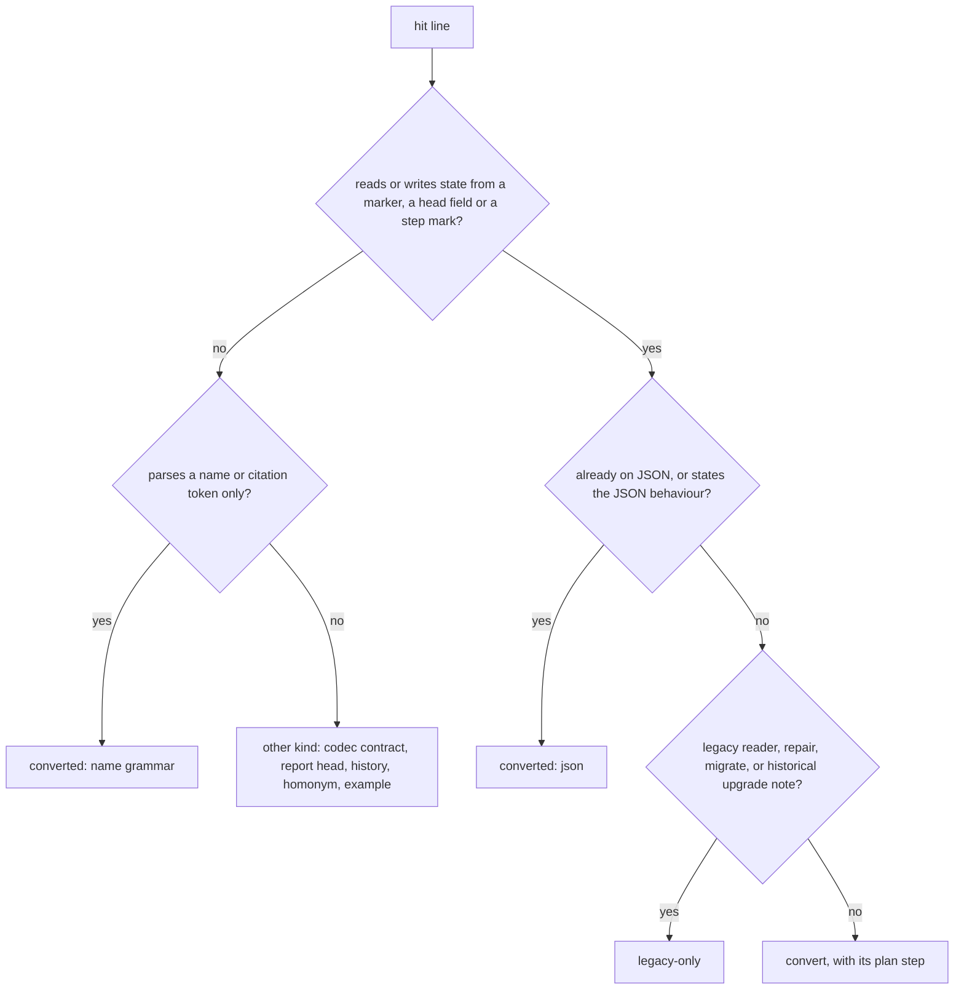

# Analysis: FJ03d step 2, the repository-wide classification at the base commit

**Date:** 2026-10-05 05:04
**Type:** Impact
**Status:** Complete
**Requested by:** orchestrator
**Cross-references:** 261004-2212_*_plan-fj03d-rules-prompts-and-live-predicates-switched-with-this-workbench-in-one-window.md (step 2), 261005-0504-fj03d-step2-classification-per-hit-table.md (the per-hit table), 260929-1810_*_the-shipped-prompts-disagree-on-who-moves-which-marker-and-one-names-a-marker-no-vocabulary-has.md, 260929-2025_*_the-orchestrator-prompt-still-says-a-task-start-row-carries-the-byte-measurements.md, 260930-1219_*_the-rule-text-states-the-claim-criterion-in-head-fields-and-two-causes-of-exit-3-which-the-helpers-no-longer-match.md, 260930-1640_*_the-layout-tree-the-tracking-rule-and-the-ignore-hints-name-no-json-surface-which-staging-drift-already-classifies.md

## Question

Which lines of fusion's shipped text, helpers, hooks, tests and codec source still match the Markdown control grammar that Prior's spec §7 names, and what becomes of each one? The plan's step 2 asks for one recorded search at the base commit. Every hit takes exactly one of four classes, and every **convert** hit names the plan step that converts it. The report also maps the four open FJ03d issues row by row to plan steps. It lists each consumer §7 names together with the test that runs its shipped block or helper.

## Scope

**Trees read.**

| Tree | HEAD | Commit date | Branch | Tracking (`git status -sb`) |
|---|---|---|---|---|
| fusion, this checkout | `84817e07` | 2026-10-05 04:53 +0200 | `fj-json-workbench` | ahead of `origin/fj-json-workbench` by 233; one modified file, `fusion-workbench/orchestrator-events.jsonl` |
| fusion, worktree `fusion-fj03d` | `84047ad7` | 2026-10-05 04:36 +0200 | `fj03d` | no upstream; clean (0 porcelain lines) |
| Prior (read only, `git show main:` only) | `5609ff15` | 2026-10-04 21:19 +0200 | `main` | not checked out, not written |

**The search ran against the base commit `84047ad7`**, whose full hash is `84047ad7602e79d7ad961e7a5b1ff6f5001dcaf0`. Nothing was read from either work tree's files for the count. The same command, run without a revision in the clean `fj03d` worktree, gives byte-identical output after prefixing.

**The recorded command** (zsh or bash, from the fusion repository root, one line):

```
git grep -I -n -E -e '\*\*(Status|Claim|Mode|Depends-on|Active spec/plan):\*\*' -e '\\\*\\\*(Status|Claim|Mode|Depends-on|Active spec)' -e "[\"'](Status|Claim|Mode|Depends-on|Active spec/plan)[\"']" -e '_[oapcidsbt]_' -e '_\(?(\\?\*\|)?\[[a-zA-Z*^-]+\]\)?_' -e 'IN PROGRESS|DONE\\?\]' 84047ad7 -- agents skills rules docs templates README.md README-agents.md README-hooks.md CLAUDE.md install.sh bin ':(glob)hooks/*.ts' ':(glob)hooks/lib/*.ts' hooks/lib/__tests__ codec/src codec/README.md
```

Output: **723 lines in 96 files**. `| wc -l` re-takes the count.

**How each part of §7's pattern set maps to an expression.**

| §7 pattern | Expression(s) | Hits carrying it |
|---|---|---|
| The five control head fields (`Status`, `Claim`, `Mode`, `Depends-on`, `Active spec/plan`) | bold form `**F:**`; the regex-escaped form `\*\*F` that shell and TypeScript readers spell; the quoted key `"F"` a head-map reader passes | 217, 4, 18 |
| Marker scans in globs and regexes | every literal marker of both vocabularies and of the Circle vocabulary (`o a p c i d s b t`); the class forms `_[a-z]_`, `_([a-z])_`, `_(\*\|[opcdais])_` | 438 literal, 41 class |
| Marker renames (`mv` of a marked name) | covered by the marker expressions: every `mv` line in scope was inspected, and none renames a marked name without also carrying a marker literal | 0 extra |
| Inline progress parsers and progress marks | `IN PROGRESS`, `[DONE]` and the escaped `\[DONE\]` | 25 |

A line carrying several patterns counts once. The extension beyond the plan's own `## Current State` grep (`\*\*(…):\*\*|_o_|_a_|_p_|_c_\b|_i_|_d_|\[IN PROGRESS\]|\[DONE\]`) is deliberate. That grep misses `_s_`, `_b_` and `_t_`, every regex-class form, and every head-field reader that spells the field escaped or quoted. Those readers include the orchestrator's Setup claim walk (`agents/orchestrator.md:138`) and `/fusion:archive`'s two package walks (`skills/archive/SKILL.md:148`, `:158`).

**Accepted noise.** `codec/src/__tests__/ops.test.ts:3219` and `:3220` match `DONE]` through an array of a constant named `DONE`. Both rows are counted and classed with the rest of the codec.

**Not decidable by this search.** A reader that builds its pattern at run time matches nothing here. So does a module that imports a live predicate without spelling a marker: `hooks/citation-check.ts` imports `isLiveRecord` and carries no hit. The plan's Decidability line names this limit, and step 11's behavioural run is the check that covers it.

## Findings

### The four classes, as applied

The plan defines four disjoint classes. Applying them line by line needed one reading rule per class. Each rule is stated here so that step 10 classes the same way.

| Class | Applied to | Basis labels in the table |
|---|---|---|
| **converted** | Lines that read or write JSON, or that state the JSON behaviour (`json`). Also the **name grammar** (`name-grammar`): code and fixtures that parse a filename or citation token, marker slot included, and decide no state. §7's citation row requires the converted checker to keep resolving old basenames ("UUID-Verweise und alte Basenames auflösen"). §9 requires that "neue und alte Zitate lösen zum gleichen Artefakt auf". | `json` 15, `name-grammar` 90 |
| **convert** | Lines that read state from a marker or head field, write one, rename a marked file, or mark a step, and that the plan rewrites. Includes the **legacy branch** of a dual-format consumer whose JSON branch already exists. | 366 hits, one step each |
| **legacy-only** | `hooks/lib/legacy-import.ts`, `hooks/lib/legacy-repair.ts`, `/fusion:migrate` and `bin/fusion-migrate` with their tests, the historical upgrade notes in `docs/` and `README.md`, and the two roster rows naming the legacy modules | `legacy-reader` 68, `migrate` 18, `upgrade-note` 33 |
| **other kind** | The codec's own contract and tests; markerless report kinds (an analysis, consultation or policy-curator run file carrying `**Status:** Draft`); history (anecdotes, logs, citations of past records); **homonyms** (`**Mode:** survey\|apply` is a dispatch parameter, `**Mode:**` in an archive MANIFEST); jargon examples that name a marker as a token not to print | `codec-contract` 92, `history` 19, `homonym` 9, `analysis-head` 7, `jargon-example` 6 |



**Two of these readings widen the plan's wording, and the orchestrator should confirm them before step 10.** The plan glosses **converted** as "already reads or writes JSON". 90 hits are classed converted as name grammar, although they read no JSON. They belong to converted consumers (the citation scanner, sweep, checker and staging drift) that must keep reading marked basenames. If the orchestrator wants them apart, the scheme needs a fifth class, and the table already labels each row so that the split is mechanical. The plan glosses **other kind** as "reviews, history, memos, analyses, the codec's own contract". The homonym and jargon-example rows (15 together) are not a record type at all; they are lines the pattern catches without the grammar being present.

### Totals per class and per directory

| Directory | converted | convert | legacy-only | other kind | Total |
|---|---|---|---|---|---|
| `agents/` | 0 | 90 | 0 | 8 | 98 |
| `skills/` | 1 | 25 | 2 | 3 | 31 |
| `rules/` | 0 | 89 | 0 | 2 | 91 |
| `docs/` | 0 | 22 | 30 | 0 | 52 |
| `templates/` | 0 | 0 | 0 | 0 | 0 |
| `README.md` | 0 | 3 | 3 | 0 | 6 |
| `README-agents.md` | 0 | 6 | 0 | 4 | 10 |
| `README-hooks.md` | 0 | 4 | 2 | 4 | 10 |
| `CLAUDE.md` | 0 | 0 | 0 | 0 | 0 |
| `install.sh` | 0 | 0 | 0 | 0 | 0 |
| `bin/` | 1 | 7 | 0 | 2 | 10 |
| `hooks/*.ts` | 4 | 2 | 0 | 0 | 6 |
| `hooks/lib/*.ts` | 17 | 20 | 43 | 2 | 82 |
| `hooks/lib/__tests__/` | 82 | 98 | 39 | 16 | 235 |
| `codec/src/` | 0 | 0 | 0 | 90 | 90 |
| `codec/README.md` | 0 | 0 | 0 | 2 | 2 |
| **Total** | **105** | **366** | **119** | **133** | **723** |

`templates/` holds one text file at the base, `templates/fusion.json`, and it carries no hit. `CLAUDE.md` and `install.sh` carry none either.

**Every one of the 723 output lines sits in exactly one class.** `classify.py` assigns each line by one rule, with an explicit line rule overriding a whole-file rule. It halts when a line matches zero rules or more than one, and when a rule names a line that is not a hit. It completed with 723 rows and no error.

### The convert hits, by plan step

| Step | Hits | Files (hits) |
|---|---|---|
| 3 | 62 | `rules/fusion-workbench-conventions.md` (62) |
| 4 | 27 | `rules/decision-record-examples.md` (17), `rules/orchestrator-rebalance.md` (4), `rules/context-manifest.md` (2), `rules/rule-file-provenance.md` (2), `rules/workbench-tracking.md` (2) |
| 5 | 38 | `agents/orchestrator.md` (38) |
| 6 | 52 | `agents/policy-curator.md` (16), `agents/state-auditor.md` (14), `agents/implementation-planner.md` (7), `agents/analyst.md` (6), `agents/code-implementer.md` (3), `agents/requirements-designer.md` (3), `agents/reviewer.md` (2), `agents/data-implementer.md` (1) |
| 7 | 33 | `skills/archive/SKILL.md` (16), `hooks/lib/__tests__/archive-filter-key.test.ts` (8), `skills/wp/SKILL.md` (4), `skills/discuss/SKILL.md` (3), `skills/check/SKILL.md` (1), `skills/wp-order/SKILL.md` (1) |
| 8 | 116 | `hooks/lib/__tests__/citation-sweep.test.ts` (36), `hooks/lib/citation-corpus.ts` (18), `hooks/lib/__tests__/plan-size.test.ts` (17), `hooks/lib/__tests__/plan-stopping-section-lint.test.ts` (13), `hooks/lib/__tests__/workbench-citation-lint.test.ts` (13), `hooks/lib/__tests__/fusion-citation-check.test.ts` (8), `bin/fusion-plan-size` (3), `bin/fusion-citation-check` (2), `hooks/lib/__tests__/declared-citation-paths.test.ts` (2), `hooks/lib/plan-size.ts` (2), `hooks/plan-size.ts` (2) |
| 9 | 35 | `docs/working-model.md` (17), `README-agents.md` (6), `docs/fusion-intro.md` (5), `README-hooks.md` (4), `README.md` (3) |
| none (`?`) | 3 | `bin/fusion-checkout-name:244`, `bin/fusion-rules:598`, `hooks/lib/__tests__/rules-emission-golden.test.ts:281` |

The full per-hit table, with file, line, pattern, class, step, basis and reason for each of the 723 lines, is `261005-0504-fj03d-step2-classification-per-hit-table.md` in this store.

**Five reading notes on the step assignment.**

- **Step 4 picks up two rule files the plan does not name.** `rules/context-manifest.md:120`–`121` state the claim criterion as `**Status:**` and `**Claim:**`, which is issue 260930-1219's defect in a third file. `rules/rule-file-provenance.md:33`–`34` argue from a marker that moves with a record's life. Step 4's file list ends "every other rule file step 2 classes **convert**", so both are carried.
- **Step 8's legacy-fixture tests are wider than its file list suggests.** Besides the own-tree lints, these files hold cases that run an explicit checker over a legacy fixture: `citation-sweep.test.ts` (every describe before line 494, among them the two `format=legacy` expectations at 71 and 229), `fusion-citation-check.test.ts` (43–184), `plan-size.test.ts` (73–161) and `declared-citation-paths.test.ts:79`–`82`. That last case runs `hooks/dist/citation-check.js` on a workbench without `workbench.json`. Once step 8 turns the legacy branch into a refusal, each of these must move to a JSON fixture or become a refusal case. Step 8's acceptance allows exactly the own-tree lints and the own-tree sweep case to be red. These cases are therefore part of "their tests", or they turn red unexpectedly.
- **Two of step 8's four own-tree lints carry no convert hit.** All hits in `reference-resolution-lint.test.ts` and `fenced-code-exemption.test.ts` are name grammar or history. Their dependence on the legacy workbench, if any, is not textual, so step 11 is where it shows.
- **The orchestrator's own Setup walk is a hidden head-field reader.** `agents/orchestrator.md:138` reads `**Status:**` with `sed` and falls back to `_?_circle.md`. The plan's own grep misses it because the field is regex-escaped. It is classed step 5.
- **The plan's `_b_` passage is already gone.** No line under `agents/` or `rules/` carries `_b_` at `84047ad7`. Item 2 of issue 260929-1810 needs only confirmation in steps 4 and 5.

### The four open FJ03d issues, row by row

| Issue | Row / item | State at `84047ad7` | Carried by |
|---|---|---|---|
| 260929-1810 (who moves which marker) | 1. `agents/orchestrator.md` `## Scope` permits renames `_o_`→`_p_`→`_c_` while other sections move decision and deferral markers | open: line 174, with the moves at 88, 241, 242, 269, 300, 392, 394 and 400 | step 5 |
| | 2. `_b_` marker in `### Rebalance approval` | no `_b_` anywhere in `agents/` or `rules/` | steps 4 and 5 confirm; nothing to convert |
| | 3. `agents/analyst.md` type 7 files a decision directly as answered with a `path:line` citation | open: line 140 | step 6 |
| | 4. `agents/consultant.md` `## Scope` writes decision records, `## Secondary Mode` forbids it | open: lines 39 and 75. Neither carries a pattern, so no hit; found by reading the issue's passage | step 6 |
| | 5. `rules/orchestrator-rebalance.md` sets a history file's `**Status:**` | open: line 65 | step 4 |
| 260929-2025 (`task_start` byte measurements) | the `task_start` row | open: `agents/orchestrator.md:567`; `git grep 'byte measurements' 84047ad7 -- agents skills rules` names only that line. No hit, since the row carries no pattern | step 5 |
| 260930-1219 (claim criterion, exit 3 causes) | passage 1: `### Contract` and `#### Exit codes` in the conventions rule | open: line 135 (criterion), row 3 of the exit table, line 149 | step 3 |
| | passage 2: `rules/agent-setup.md` `## What fusion-paths emits` | open: line 45 ("exit 3 … the user clears it"). No hit; found by reading | step 4 |
| | (related, not in the issue) `rules/context-manifest.md:120`–`121` states the same criterion | open | step 4 |
| 260930-1640 (JSON surfaces unnamed) | 1. Layout tree | open | step 3 |
| | 2. `rules/workbench-tracking.md` R3 and L | open | step 4 |
| | 3. `JSON_LIVE_STATE` merge | open | step 4 |
| | 4. `/fusion:check` gitignore loops | **done at the base**: `skills/check/SKILL.md:267` lists `workbench.json` in the R2/R3 loop, `:275` lists `.json-state` in the L loop | none needed; step 7 leaves it |
| | 5. This repository's `.gitignore`, and the `git check-ignore` acceptance on a scratch workbench | open: `.gitignore` at `84047ad7` names neither `.json-state/` nor `workbench.json` | **no step**: `.gitignore` is outside the search scope and in no step's file list |
| | 6. `skills/help/SKILL.md` monitor line | open: line 67 | step 7 |
| | 7. `agents/orchestrator.md` `## Staging check`, and the routing line sending `package.json` to `code-implementer` | open: line 189 and the `## Staging check` table | step 5 |
| | 8. `skills/migrate/SKILL.md` `## Step 6` stop on the sweep's exit 3 or 6 | open: line 156 reports the summary with no exit named | step 7 |

### §7's consumers and the test that runs their shipped block or helper

A test counts when it runs the shipped text or binary: a helper spawned, or a skill's bash block lifted by heading and run. A lint that only reads the text does not count.

| §7 consumer | Test that runs the shipped block or helper | Gap |
|---|---|---|
| `bin/fusion-claimed-package` | `fusion-claimed-package.test.ts` (JSON fixtures), `fusion-paths.test.ts`, `codec/src/__tests__/install.test.ts` (installed copy) | none |
| `bin/fusion-paths`, `bin/fusion-rules` | `fusion-paths.test.ts`; `context-manifest.test.ts` (claim project on JSON); `rules-emission-golden.test.ts`, `rules-voice-profile.test.ts` | none |
| `bin/fusion-work-order` | `fusion-work-order.test.ts`, `install.test.ts` | none |
| Agent Setup and the orchestrator | none runs a prompt. Text lints only: `reference-resolution-lint`, `rules-emission-golden`, `path-literal-lint`, `fusion-paths.test.ts` key derivation | **no run test**. Step 11's one headless analyst dispatch is the only execution planned |
| `skills/wp` | `install.test.ts`: `## Step 0`, `## On a JSON-controlled workbench` | the legacy flow is not run |
| `skills/setup` | `install.test.ts`: `## Step 0`; `store-name-migration.test.ts`: `### Superseded-format check` and the block under "Write the setup marker" | none for the JSON path |
| `skills/migrate` | `store-name-migration.test.ts` and `install.test.ts`: Steps 1, 2 and 4; `migrate.test.ts` runs `bin/fusion-migrate` | **Step 6 (sweep) and Step 7 (Node gate and the migration calls) are run by no test.** Issue 260930-1640 row 8 sits in Step 6 |
| `skills/reconcile` | none; five bash blocks at the base | **no test** |
| `skills/archive` | `archive-filter-key.test.ts` (legacy walk, filter-3 key); `install.test.ts` (`## Step 1`, `## On a JSON-controlled workbench`) | none |
| `skills/cadence` | none; six bash blocks at the base | **no test** |
| `skills/check` | `install.test.ts`: `## concurrency`; `store-name-migration.test.ts`: `## Stamp what you ran`; `legacy-halt-clearing.test.ts`: a text check | **the `## gitignore` loops (issue rows 4 and 5) are run by no test** |
| Reviewer, state-auditor, policy-curator | prompts: none. Their helpers: `edge-answers.test.ts` spawns `bin/fusion-edge-answers`' entry; `record-write.test.ts` and `install.test.ts` run `bin/fusion-write` (reviewer evidence included) | **no run test of the prompts** |
| Hooks, root, citation and staging consumers | `staging-drift.test.ts`, `session-start-*.test.ts`, `hooks-wiring.test.ts`, `install.test.ts` (`bin/fusion-staging-drift`) | none |
| Monitor and events | `record-change.test.ts`, `monitor-warnings-panel.test.ts`, `fusion-events.test.ts` | none |
| Citation check, sweep, archiving | `fusion-citation-check.test.ts`, `citation-sweep.test.ts` (the compiled entries), `install.test.ts` (the `bin/` wrappers), `record-archive.test.ts` (`bin/fusion-archive`) | none |
| Stores, path lints, tracking | `fusion-stores.test.ts`, `path-literal-lint.test.ts`, `staging-drift.test.ts` | none |
| Installer, version, help | `install.test.ts` runs the working tree's `install.sh` | **help: text lint only** |

## Implications

The text cutover is concentrated. Four files carry 154 of the 366 convert hits: `rules/fusion-workbench-conventions.md` (62), `agents/orchestrator.md` (38), `hooks/lib/__tests__/citation-sweep.test.ts` (36) and `hooks/lib/citation-corpus.ts` (18). Step 8 is the largest step by hit count, mostly in tests, and it carries most of the behavioural risk. Every legacy-fixture case of the three explicit checkers depends on the `format=legacy` branch that step 8 removes.

The legacy-only class is self-contained. It holds 119 hits in the legacy reader, the repair, `/fusion:migrate` and the historical upgrade notes. No convert step touches it, and step 10's re-run should find it unchanged.

## Recommendations

We recommend the orchestrator settle three points before it dispatches the steps they touch. Plan amendments are its call.

1. **Before step 7: the fate of the dual-format skill bodies.** `/fusion:wp`, `/fusion:discuss` and `/fusion:archive` keep a full legacy body beside their JSON sections. The 23 hits in `skills/archive`, `skills/wp` and `skills/discuss`, and the 8 in `archive-filter-key.test.ts`, are classed convert on that basis. The plan answers N2 (refuse legacy by name, point at `/fusion:migrate`) for the three explicit checkers in step 8 only. It does not say whether these skill bodies drop their legacy halves the same way or keep them. We recommend step 8's answer, for one rule across both. The alternative is to class those 31 hits legacy-only and widen that class's definition.
2. **Plan amendment: three files and `.gitignore` that no step names.** `bin/fusion-rules:598` and `rules-emission-golden.test.ts:281` describe the state-auditor's act as the `_o_ -> _a_` rename. Step 4 rewrites that act in `rules/decision-record-examples.md`, so step 4's file list should gain both. `bin/fusion-checkout-name:244` documents reading the holder off the `**Claim:**` line; step 3 changes that template, so step 3 or 4 should take it. Issue 260930-1640 row 5 needs `.gitignore` in step 4's file list. Its `git check-ignore` acceptance on a scratch workbench also needs a step: step 4's tests, or step 11.
3. **Before step 10: confirm the two widened class readings** (name grammar under converted, homonyms and jargon examples under other kind). Alternatively, rule a fifth class. Step 10 must class with the same reading, or its comparison with this count is not like for like.

The consumers without a run test (the prompts, `/fusion:reconcile`, `/fusion:cadence`, `/fusion:migrate` Steps 6 and 7, `/fusion:check`'s gitignore loops, `/fusion:help`) are step 10's finding to file, as its acceptance says. Naming them now lets steps 7 and 11 close the cheap ones: the migrate and check blocks lift by heading like the blocks already tested.

## Filed Issues

None. Every finding here belongs to the plan's own steps or to a plan amendment the orchestrator rules on. Step 10's acceptance assigns filing a test gap to the orchestrator.

## Sources

- The plan: 261004-2212_*_plan-fj03d-rules-prompts-and-live-predicates-switched-with-this-workbench-in-one-window.md, `## Current State`, `## Approach`, Part A rules, steps 1 to 11.
- Prior `concept/fusion-json-workbench-spec.md` at Prior `5609ff15` (`main`), `## 7. Fusion-Verbraucher vollständig umstellen` and `## 9. Implementierungspakete und Nachweise`, read with `git show main:` only.
- The four issues in this package's issue store, as cited above.
- At `84047ad7`: `skills/archive/SKILL.md`, `skills/discuss/SKILL.md`, `skills/wp/SKILL.md`, `skills/migrate/SKILL.md` (Steps 6 and 7), `skills/check/SKILL.md` (lines 239, 267, 275, 283), `skills/help/SKILL.md:67`, `agents/consultant.md` (39, 75), `agents/orchestrator.md` (138, 174, 189, 567), `rules/agent-setup.md:45`, `.gitignore`, `bin/monitor` (1760–1775, 1930–1940), `bin/fusion-rules` (590–602), `bin/fusion-checkout-name` (238–250), `hooks/lib/plan-size.ts` (36–60, 90–115), `hooks/lib/edge-answers.ts` (1–40), `hooks/lib/domain-cascade.ts` (715–725), `hooks/citation-check.ts` (format gate), the outlines of `citation-sweep.test.ts`, `workbench-citation-lint.test.ts`, `fenced-code-exemption.test.ts`, `declared-citation-paths.test.ts` (60–90), `store-name-migration.test.ts` (1–40), `codec/src/__tests__/install.test.ts` (55–80 and its section list).
- Working files in the session scratchpad: `hits-84047ad7.txt` (the raw output), `pat.py` (pattern tagging), `classify.py` (one rule per hit set; fails on zero or several matches), `table.tsv`.

## Open Questions

- [ ] Do `/fusion:wp`, `/fusion:discuss` and `/fusion:archive` drop their legacy bodies in step 7 (refusal by name, as step 8 does for the checkers) or keep them? The answer moves 31 hits between convert and legacy-only.
- [ ] Which step takes `bin/fusion-rules:598`, `rules-emission-golden.test.ts:281`, `bin/fusion-checkout-name:244` and `.gitignore` (issue 260930-1640 row 5)?
- [ ] Does name grammar stay under converted, and do homonyms and jargon examples stay under other kind, or does step 10 class with a fifth class?
