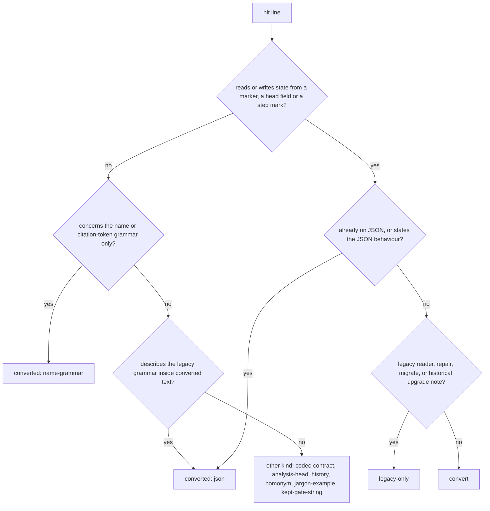

# Analysis: FJ03d step 10, the classification re-run at the side branch head

**Date:** 2026-10-05 10:16
**Type:** Impact
**Status:** Complete
**Requested by:** orchestrator
**Cross-references:** 261004-2212_*_plan-fj03d-rules-prompts-and-live-predicates-switched-with-this-workbench-in-one-window.md (step 10, and the ruling under step 2), 261005-0504-fj03d-step2-classification-at-the-base-commit.md, 261005-0504-fj03d-step2-classification-per-hit-table.md, 261005-0856_*_fj03d-step10-class-reading-for-borderline-hits.md, 261005-1016-fj03d-step10-classification-per-hit-table.md (the per-hit table and the rule list)

## Question

Does any line of fusion's shipped text, helpers, hooks, tests or codec source at the head of the side branch still need converting from the Markdown control grammar? Step 10 of the plan re-runs step 2's recorded search at `fj03d` `29dac3c5`, classes every hit under the user's ruling of 2026-10-05, and explains each difference from step 2's count by the step that made it. It also updates the list of the consumers Prior's spec §7 names with the test that runs each one's shipped block or helper.

## Scope

**Trees read.**

| Tree | HEAD | Commit date | Branch | Tracking (`git status -sb`) |
|---|---|---|---|---|
| fusion, this checkout | `347fcac6` | 2026-10-05 10:11 +0200 | `fj-json-workbench` | ahead of `origin/fj-json-workbench` by 246; one modified file, `fusion-workbench/orchestrator-events.jsonl` |
| fusion, worktree `fusion-fj03d` | `29dac3c5` | 2026-10-05 08:17 +0200 | `fj03d` | no upstream; clean |
| Prior (read with `git show 5609ff1:` only) | `5609ff1` | 2026-10-04 21:19 +0200, as step 2 recorded it | not checked out | not written |

**The search ran against `29dac3c5`**, full hash `29dac3c5b292ca3ab2fedfdba1bcf5137ac1e756`. Step 2's base was `84047ad7`. Nothing was read from a work tree's files for the count, and nothing was written in the worktree.

**The recorded command**, step 2's with the revision changed (zsh or bash, from the fusion repository root, one line):

```
git grep -I -n -E -e '\*\*(Status|Claim|Mode|Depends-on|Active spec/plan):\*\*' -e '\\\*\\\*(Status|Claim|Mode|Depends-on|Active spec)' -e "[\"'](Status|Claim|Mode|Depends-on|Active spec/plan)[\"']" -e '_[oapcidsbt]_' -e '_\(?(\\?\*\|)?\[[a-zA-Z*^-]+\]\)?_' -e 'IN PROGRESS|DONE\\?\]' 29dac3c5 -- agents skills rules docs templates README.md README-agents.md README-hooks.md CLAUDE.md install.sh bin ':(glob)hooks/*.ts' ':(glob)hooks/lib/*.ts' hooks/lib/__tests__ codec/src codec/README.md
```

Output: **433 lines in 75 files** (step 2: 723 in 96). `| wc -l` re-takes the count.

| Pattern | Hits carrying it at the head | At the base |
|---|---|---|
| bold head field `**F:**` | 114 | 217 |
| escaped head field | 1 | 4 |
| quoted head-field key | 18 | 18 |
| marker literal | 262 | 438 |
| marker class in a glob or regex | 30 | 41 |
| progress mark | 14 | 25 |

A line carrying several patterns counts once. The one escaped head-field reader left is in `hooks/lib/__tests__/legacy-import.test.ts`. The 14 progress marks sit in the legacy reader and repair with their tests (9), the codec (4) and the new upgrade document's table (1).

**Not decidable by this search**, as at step 2: a reader that builds its pattern at run time, or one that imports a predicate without spelling a marker. Step 11's rehearsal is the check for those.

## Findings

### The acceptance result

**No hit is in class convert.** Every one of the 433 output lines sits in exactly one of the other three classes.

| Class | Head | Step 2 | Difference |
|---|---|---|---|
| converted | 177 | 105 | +72 |
| convert | **0** | 366 | −366 |
| legacy-only | 119 | 119 | 0 |
| other kind | 137 | 133 | +4 |
| **Total** | **433** | **723** | **−290** |

### The class rules, as applied

The classes, the flowchart and the basis labels are step 2's. The user's ruling adds four rules, (a) to (d), which the plan records under step 2. One basis label is new.



| Basis | Class | Rule | Head | Step 2 |
|---|---|---|---|---|
| `name-grammar` | converted | The line concerns the name or citation-token grammar only and decides no state, comments included (ruling a). | 140 | 90 |
| `json` | converted | The line reads or writes JSON or states the JSON behaviour. It also covers a line that describes the legacy grammar inside converted text (ruling b), and a test line that pins "the record decides, whatever the name carries". | 37 | 15 |
| `legacy-reader` | legacy-only | `hooks/lib/legacy-import.ts`, `hooks/lib/legacy-repair.ts`, their tests and their two roster rows. | 68 | 68 |
| `migrate` | legacy-only | `/fusion:migrate`, `bin/fusion-migrate` and their tests. | 18 | 18 |
| `upgrade-note` | legacy-only | The historical upgrade notes for v10 and v11 in `docs/` and `README.md`. | 33 | 33 |
| `codec-contract` | other kind | The codec's own contract and tests, under `codec/`. | 93 | 92 |
| `history` | other kind | Anecdotes, logs and citations of past records that name no procedure. | 18 | 19 |
| `analysis-head` | other kind | `**Status:**` of a report kind with no control file (analysis, consultation, policy-curator run file). | 7 | 7 |
| `homonym` | other kind | The same token with another meaning: the policy-curator's `**Mode:** survey\|apply` dispatch parameter, the `**Mode:**` line of an archive MANIFEST (ruling d). | 9 | 9 |
| `jargon-example` | other kind | A marker named as a token in prose or fixture text, with no grammar present (ruling d). | 6 | 6 |
| `kept-gate-string` (**new**) | other kind | The line spells the fixed event-log detail `answered by **Mode:** autonomous`, which Prior §7 requires to stay ("alte Gate-Strings erhalten"). The state the string reports is read from `mode` in JSON; the string is a log constant and no head-field read (ruling c). | 4 | 0 |

**The new label's four lines** are `agents/orchestrator.md:372`, `:438`, `:568` and `:601`. Each was read in full at the head. Line 372 sorts the gate rows under `mode` `autonomous` and reads "the claimed item's field"; lines 438 and 568 fix the log strings; line 601 carries the string beside the `**Mode:** apply` homonym and is counted once, under the gate string. None of the four was carried over from a step-2 row.

**Between `json` and `name-grammar` inside converted**, a test fixture takes `json` when its case pins that a name's marker and the record's state disagree and the record wins, and `name-grammar` when the marked name is only a path or a citation token. The choice moves no class total.

### Totals per directory

| Directory | converted | convert | legacy-only | other kind | Total | Step 2 total |
|---|---|---|---|---|---|---|
| `agents/` | 0 | 0 | 0 | 12 | 12 | 98 |
| `skills/` | 1 | 0 | 2 | 3 | 6 | 31 |
| `rules/` | 3 | 0 | 0 | 2 | 5 | 91 |
| `docs/` | 3 | 0 | 30 | 0 | 33 | 52 |
| `templates/` | 0 | 0 | 0 | 0 | 0 | 0 |
| `README.md` | 1 | 0 | 3 | 0 | 4 | 6 |
| `README-agents.md` | 0 | 0 | 0 | 4 | 4 | 10 |
| `README-hooks.md` | 0 | 0 | 2 | 4 | 6 | 10 |
| `CLAUDE.md` | 0 | 0 | 0 | 0 | 0 | 0 |
| `install.sh` | 0 | 0 | 0 | 0 | 0 | 0 |
| `bin/` | 1 | 0 | 0 | 2 | 3 | 10 |
| `hooks/*.ts` | 4 | 0 | 0 | 0 | 4 | 6 |
| `hooks/lib/*.ts` | 22 | 0 | 43 | 2 | 67 | 82 |
| `hooks/lib/__tests__/` | 142 | 0 | 39 | 15 | 196 | 235 |
| `codec/src/` | 0 | 0 | 0 | 91 | 91 | 90 |
| `codec/README.md` | 0 | 0 | 0 | 2 | 2 | 2 |
| **Total** | **177** | **0** | **119** | **137** | **433** | **723** |

Basis per directory:

| Directory | Basis counts |
|---|---|
| `agents/` | `analysis-head` 4, `kept-gate-string` 4, `homonym` 3, `history` 1 |
| `skills/` | `name-grammar` 1, `homonym` 3, `migrate` 2 |
| `rules/` | `json` 3, `history` 1, `jargon-example` 1 |
| `docs/` | `upgrade-note` 30, `json` 3 |
| `README.md` | `upgrade-note` 3, `json` 1 |
| `README-agents.md` | `homonym` 3, `history` 1 |
| `README-hooks.md` | `legacy-reader` 2, `history` 4 |
| `bin/` | `json` 1, `history` 2 |
| `hooks/*.ts` | `name-grammar` 4 |
| `hooks/lib/*.ts` | `legacy-reader` 43, `name-grammar` 12, `json` 10, `analysis-head` 1, `jargon-example` 1 |
| `hooks/lib/__tests__/` | `name-grammar` 123, `json` 19, `legacy-reader` 23, `migrate` 16, `history` 9, `jargon-example` 4, `analysis-head` 2 |
| `codec/src/`, `codec/README.md` | `codec-contract` 93 |

### How the classes were assigned

`classify10.py` holds one rule per file and line set, 77 rules in all; the per-hit table file reproduces the list in full, so a third count can apply it like for like. A rule naming lines overrides a file's whole-file rule. The script halts when a hit matches no rule or several, and when a rule names a line that is no hit. It completed with 433 rows.

**No class was carried over by row text.** The hits fall into three groups:

| Group | Hits | How classed |
|---|---|---|
| In a file whose blob is identical at `84047ad7` and `29dac3c5` | 262 | By step 2's rule for that file, restated in the rule list. None of these rules was convert at step 2, and rulings (a) to (d) change none of them. |
| In a changed file, with a step-2 row of the same text | 128 | Each line read at the head. 40 of them had a step-2 row classed convert and are converted now (see step 8 below). |
| In a changed file, with no step-2 row | 43 | Each line read at the head, with its surrounding case or paragraph. |

### Each difference from step 2, by the step that made it

The search was re-run at each of the nine commits between the base and the head. Hits were compared by file and line text between neighbouring commits.

| Commit (step) | Hits after | Removed | Added | What moved |
|---|---|---|---|---|
| `7fe0a7fe` (3) | 664 | 63 | 4 | 62 convert hits of `rules/fusion-workbench-conventions.md` rewritten. 3 new lines in that file describe the legacy letters and say they are not read: converted, `json`. One `history` line (the pin comment of `reference-resolution-lint.test.ts`) rewritten in place. |
| `8a6100fc` (4) | 634 | 31 | 1 | 27 convert hits in five rule files, plus the three the amendment gave this step (`bin/fusion-checkout-name`, `bin/fusion-rules`, `rules-emission-golden.test.ts`). The pin comment again. |
| `ac60df2b` (fix, plan anchors) | 634 | 0 | 0 | Nothing. |
| `0f57b119` (5) | 600 | 39 | 5 | 38 convert hits of `agents/orchestrator.md` rewritten. 4 lines carrying the kept gate string are new text: other kind, `kept-gate-string`. The pin comment again. |
| `693a29bc` (6) | 548 | 53 | 1 | 52 convert hits in eight prompts. The pin comment again. |
| `3a11d9ea` (8) | 495 | 82 | 29 | 76 convert hits removed. 4 `json` and 2 `name-grammar` rows of `plan-size.ts` and its test were rewritten with them. 29 lines are new: 19 `json`, 10 `name-grammar`. **A further 40 convert hits kept their text and changed class in place**, see below. |
| `5bffedff` (7) | 464 | 34 | 3 | 33 convert hits in five skills and `archive-filter-key.test.ts`. 2 new fixture lines of the sweep's legacy rewriter case: `name-grammar`. The pin comment again. |
| `9928dd38` (9) | 432 | 36 | 4 | 35 convert hits in `docs/` and the READMEs. 3 table rows of the new `docs/upgrading-to-v13.md` and one sentence of `README.md` describe the legacy forms beside what replaced them: converted, `json`. The pin comment stops matching: `history` −1. |
| `29dac3c5` (fix, skill refusal test) | 433 | 0 | 1 | One legacy package fixture in `codec/src/__tests__/install.test.ts:793`: `codec-contract`. |

**The 40 hits step 8 converted without changing their text.** At the base these were fixtures of cases that ran a checker over a legacy workbench. Step 8 moved the fixtures onto a JSON workbench (`scratchAt` in `citation-sweep.test.ts` now calls `jsonWorkbenchAt`; the other files use `placeRecord`), so the same marked names are now only paths and citation tokens on records whose state the codec holds.

| File | Hits | Step-2 class | Head class |
|---|---|---|---|
| `hooks/lib/__tests__/citation-sweep.test.ts` | 34 | convert, step 8 | converted, `name-grammar` |
| `hooks/lib/__tests__/fusion-citation-check.test.ts` | 3 | convert, step 8 | converted, `name-grammar` |
| `hooks/lib/__tests__/declared-citation-paths.test.ts` | 2 | convert, step 8 | converted, `name-grammar` |
| `hooks/lib/__tests__/plan-stopping-section-lint.test.ts` | 1 | convert, step 8 | converted, `name-grammar` (`isSpec` is now `lib/plan-size.ts`'s and reads either name form) |

**The balance per class.**

| Class | Arithmetic |
|---|---|
| convert | 366 − 62 (step 3) − 30 (step 4) − 38 (step 5) − 52 (step 6) − 76 removed and − 40 reclassed (step 8) − 33 (step 7) − 35 (step 9) = 0 |
| converted | 105 + 3 (step 3) − 6 + 29 + 40 (step 8) + 2 (step 7) + 4 (step 9) = 177 |
| legacy-only | 119, unchanged. Three `README.md` rows moved by two lines. |
| other kind | 133 − 1 (`history`, the pin comment, step 9) + 4 (`kept-gate-string`, step 5) + 1 (`codec-contract`, `29dac3c5`) = 137 |

Step 2 counted 116 convert hits for step 8; 76 removed and 40 reclassed make 116. Every other step removed exactly its step-2 count.

### The fold to Prior's three classes

Prior §7's closing paragraph asks for three classes: "umgestellt, ausschließlich Legacy-Import/Archiv oder nachweislich anderer Record-Typ".

| Prior's class | Fusion's class and bases | Hits |
|---|---|---|
| umgestellt | converted: `name-grammar` 140, `json` 37 | 177 |
| ausschließlich Legacy-Import/Archiv | legacy-only: `legacy-reader` 68, `upgrade-note` 33, `migrate` 18 | 119 |
| nachweislich anderer Record-Typ | other kind, less the three bases below: `codec-contract` 93, `history` 18, `analysis-head` 7 | 118 |
| **Folded total** | | **414** |

**Apart from that fold: 19 hits are no record kind.** The pattern matched and the control grammar is absent. They are not reported as another record type.

| Basis | Hits | Where |
|---|---|---|
| `homonym` | 9 | `agents/policy-curator.md` 3, `README-agents.md` 3, `skills/curate/SKILL.md` 2, `skills/archive/SKILL.md` 1 |
| `jargon-example` | 6 | `rules/user-facing-output.md` 1, `hooks/lib/domain-cascade.ts` 1, test fixtures 4 |
| `kept-gate-string` | 4 | `agents/orchestrator.md` 4 |

414 and 19 make 433. Of the 118 under "anderer Record-Typ", only the 7 `analysis-head` hits are the head of another record type in the strict sense. The 93 codec hits and the 18 history hits are there on the plan's own gloss of other kind ("history … the codec's own contract"); the discussion noted this under its claim C4.

### §7's consumers and the test that runs their shipped block or helper, at the head

A test counts when it runs the shipped text or binary: a helper spawned, or a skill's bash block lifted by heading and run. A lint that only reads the text does not count.

| §7 consumer | Test that runs the shipped block or helper | Gap at the head | Against step 2 |
|---|---|---|---|
| `bin/fusion-claimed-package` | `fusion-claimed-package.test.ts`, `fusion-paths.test.ts`, `codec/src/__tests__/install.test.ts` (installed copy) | none | same |
| `bin/fusion-paths`, `bin/fusion-rules` | `fusion-paths.test.ts`, `context-manifest.test.ts`, `rules-emission-golden.test.ts`, `rules-voice-profile.test.ts` | none | same |
| `bin/fusion-work-order` | `fusion-work-order.test.ts`, `install.test.ts` | none | same |
| Agent Setup and the orchestrator | none runs a prompt. The orchestrator's Setup claim walk is now `bin/fusion-claimed-package`, which has its test (step 5) | **no run test of a prompt**; step 11's headless analyst dispatch is the one execution planned | narrower: the walk left the prompt |
| `skills/wp` | `install.test.ts`: `## Step 0`, `## On a JSON-controlled workbench`, and the legacy refusal of the gate (`29dac3c5`) | none | **closed**: the legacy flow is gone and its refusal is pinned |
| `skills/setup` | `install.test.ts`: `## Step 0`; `store-name-migration.test.ts` | none | same |
| `skills/migrate` | `install.test.ts` and `store-name-migration.test.ts`: Steps 1, 2 and 4; `migrate.test.ts` runs `bin/fusion-migrate`; `citation-sweep.test.ts` runs the sweep on a legacy workbench and its exits 3 and 6 | **Step 7's Node gate block is run by no test.** Step 6 holds no bash block at the head; its stop on exit 3 or 6 is prose over a tested helper | narrower: Step 6's helper path is covered |
| `skills/reconcile` | none; five bash blocks | **no test** | same |
| `skills/archive` | `install.test.ts`: `## Step 1`, `## On a JSON-controlled workbench`, the legacy refusal; `archive-filter-key.test.ts` runs filter 3's key derivation out of the skill text; `record-archive.test.ts` runs `bin/fusion-archive` | none | same; the legacy walk and its test left with step 7 |
| `skills/cadence` | none; six bash blocks | **no test** | same |
| `skills/check` | `install.test.ts`: `## concurrency`; `store-name-migration.test.ts`: `## Stamp what you ran`; `legacy-halt-clearing.test.ts`: a text check | **the `## gitignore` loops are run by no test.** Step 4's `git check-ignore` case in `staging-drift.test.ts:537` tests this repository's `.gitignore`, not the skill's block | same |
| Reviewer, state-auditor, policy-curator | prompts: none. Helpers: `edge-answers.test.ts`, `record-write.test.ts`, `install.test.ts` (`bin/fusion-write`, evidence included) | **no run test of the prompts** | same |
| Hooks, root, citation and staging consumers | `staging-drift.test.ts`, `session-start-*.test.ts`, `hooks-wiring.test.ts`, `install.test.ts` | none | same |
| Monitor and events | `record-change.test.ts`, `monitor-warnings-panel.test.ts`, `fusion-events.test.ts` | none | same |
| Citation check, sweep, archiving | `fusion-citation-check.test.ts`, `citation-sweep.test.ts`, `plan-size.test.ts` (JSON cases and the refusal of a legacy workbench by name), `install.test.ts`, `record-archive.test.ts` | none | same, on JSON fixtures since step 8 |
| Stores, path lints, tracking | `fusion-stores.test.ts`, `path-literal-lint.test.ts`, `staging-drift.test.ts` | none | same |
| Installer, version, help | `install.test.ts` runs the working tree's `install.sh` | **help: text lint only** | same |

`/fusion:discuss` is not in §7's row, but `install.test.ts` runs its Steps 1, 4 and 8 and its legacy refusal.

**Finding for the orchestrator to file: six consumers have no test that runs their shipped text.** These are the agent prompts (Setup, orchestrator, reviewer, state-auditor, policy-curator), `/fusion:reconcile`, `/fusion:cadence`, `/fusion:check`'s `## gitignore` loops, `/fusion:migrate` Step 7's Node gate block, and `/fusion:help`. The open issues of this package were checked; none of them names these gaps. Four of the six are bash blocks under a heading (`reconcile`, `cadence`, the `gitignore` loops, the Node gate) and lift the way `install.test.ts` already lifts the others. A prompt has no block to lift, and step 11's dispatch is its only execution.

### Reading notes

- **Step 3's plan note calls its three remaining lines legacy-only; under ruling (b) they are converted, basis `json`.** The lines are `rules/fusion-workbench-conventions.md:287`, `:322` and `:340`. Each says what the legacy letters were and that they are not read for state. The class totals above use the ruling. The plan note is the orchestrator's to correct.
- **`docs/upgrading-to-v13.md:21`–`23` are classed converted, `json`, and not legacy-only `upgrade-note`.** That basis is step 2's for the historical notes of v10 and v11. The v13 rows put each legacy form beside the JSON field that replaced it, which is ruling (b)'s case. Either reading keeps them out of convert.
- **`codec/src/__tests__/install.test.ts:793` is `codec-contract` by the directory rule**, as its twin at line 566 was at step 2. It is the Markdown of a v12 package in the fixture for the three skills' legacy refusal. The line writes a head field that the gate under test never reads, so it could not reach convert under any reading.
- **Steps 5 and 6 left what their notes say.** `agents/orchestrator.md` has 5 hits (4 gate strings, 1 anecdote); the other prompts have 7 (4 report heads, 3 homonyms).
- **`ac60df2b` is on the branch between steps 4 and 5 and is not one of steps 3 to 9.** It moved no hit.

## Implications

The textual half of FJ03d's first Decidability question is answered at the head: relative to the recorded pattern set, no shipped line still reads state from a marker, a head field or a step mark outside the legacy reader, the repair and `/fusion:migrate`. The legacy-only class is byte-stable across the branch at 119 hits, which is what step 2 predicted.

The behavioural half stays with step 11. This search cannot see a reader that builds its pattern at run time, and six consumers named by §7 have no test that runs their shipped text.

Step 17 hands Prior the three folded totals (177, 119, 118) and, apart from them, the 19 hits that are no record kind, with the per-basis counts from this report.

## Recommendations

1. **Orchestrator: mark step 10's acceptance on convert = 0**, and file the test-gap finding as one issue (or one per consumer, as it prefers). We recommend one issue that lists the six, with the four liftable blocks named as the cheap part.
2. **Orchestrator: correct step 3's plan note** from "each legacy-only" to converted, basis `json`, so the plan and this report agree under ruling (b).
3. **Step 11 (rehearsal)** should run the unlifted blocks by hand at least once on the migrated copy: `/fusion:reconcile`, `/fusion:cadence`, `/fusion:check`'s `## gitignore` loops and `/fusion:migrate` Step 7's Node gate. That is the only execution they get before the window.

## Filed Issues

None. The dispatch reserves filing to the orchestrator.

## Sources

- The plan, 261004-2212_*_plan-fj03d-rules-prompts-and-live-predicates-switched-with-this-workbench-in-one-window.md: the `**Decidability:**` line, step 2 with its notes and the ruling, steps 3 to 10.
- 261005-0504-fj03d-step2-classification-at-the-base-commit.md and its per-hit table; step 2's `classify.py`, `pat.py`, `hits-84047ad7.txt` and `table.tsv`, read from the earlier session's scratch directory.
- 261005-0856_*_fj03d-step10-class-reading-for-borderline-hits.md, claims C8, C9, C11, C14, C15 and C16.
- Prior `concept/fusion-json-workbench-spec.md` at `5609ff1`, `## 7. Fusion-Verbraucher vollständig umstellen`: the consumer table and the closing paragraph.
- At `29dac3c5`, read with `git show`: `agents/orchestrator.md` (372, 438, 487, 568, 601); `rules/fusion-workbench-conventions.md` (287, 322, 340); `docs/upgrading-to-v13.md` (21–23); `README.md` (30–34, 176); `README-hooks.md:694`; `hooks/lib/citation-corpus.ts` (26–36); `hooks/lib/plan-size.ts` (42–46, 93); `hooks/lib/__tests__/citation-sweep.test.ts` (outline, 20–48, 92–104, 380–398, 452–464, 540–560); `fusion-citation-check.test.ts` (36–48, 92–108, 165–170, 344–350); `plan-size.test.ts` (126–162); `plan-stopping-section-lint.test.ts` (186–198); `declared-citation-paths.test.ts` (72–83); `workbench-citation-lint.test.ts` (176–210); `archive-filter-key.test.ts` (1–24); `codec/src/__tests__/install.test.ts` (555–567, 780–800, and every `shippedBlocks` call); `skills/migrate/SKILL.md` (Steps 6 and 7).
- The search output at each of `7fe0a7fe`, `8a6100fc`, `ac60df2b`, `0f57b119`, `693a29bc`, `3a11d9ea`, `5bffedff`, `9928dd38` and `29dac3c5`.
- Working files in this session's scratch directory, outside both trees: `hits-29dac3c5.txt`, `classify10.py` (the rule list the per-hit table file reproduces), `join.py`, `delta.py`, `table10.tsv`.

## Open Questions

- [ ] One issue for the six consumers without a run test, or one per consumer? The orchestrator files.
- [ ] Does step 17 hand `codec-contract` (93) and `history` (18) to Prior under "anderer Record-Typ", as the plan's gloss has it, or name them apart like the 19? This report gives both counts.
