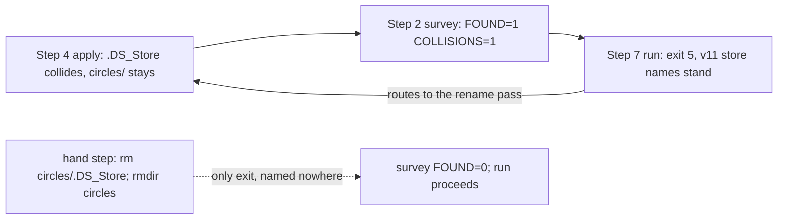

# Analysis: FJ05 step 15, re-migration of one real workbench on fresh copies at `f2cc68f0`

**Date:** 2026-10-09 21:48
**Type:** Feasibility (the real-workbench proof of plan step 15)
**Status:** Complete. Every acceptance item passes on the one workbench. One new finding (R1) is filed as an issue; it needed one hand step before the JSON run could start.
**Requested by:** orchestrator, work package 260928-1338-json-control-data-and-markdown-artefacts
**Cross-references:** 261009-1021-plan-fj05-release-acceptance-of-13-0-0-with-the-claim-takeover.md (step 15 and its step notes); 261004-1516-fj04-step12-rerun-proof-on-fresh-copies.md (the harness and the figures compared against); 261009-1833-migrate-names-a-four-commit-split-but-gives-no-path-lists-so-staging-it-needs-a-generated-list.md; 261005-1107_*_the-citation-checker-reports-violations-on-this-workbench-once-migrated-and-two-readme-rows-misstate-its-scope.md; 261009-2148-the-rename-pass-cannot-drain-a-circles-store-whose-only-entry-is-a-colliding-ds-store-and-the-json-run-refuses-on-it.md (filed by this run)

## Question

Does the release candidate C `f2cc68f0` migrate a fresh copy of a real foreign workbench end to end, with no Prior present? That covers the v12 rename pass, the citation sweep, the JSON run, `validate`, a no-op second run, the shipped readers, a kill with resume, and a byte-identical rollback. And how does each figure compare with 261004-1516?

**This step ran on one foreign workbench, not two.** The plan's step 15 names two. The user ruled that it runs on one. Read as migration evidence for Prior, this report covers one real project, and nothing in it speaks for a second one.

## Scope

**Live repository.** fusion, branch `fj-json-workbench`, HEAD `8f980329` (committed 2026-10-09T21:10:20+02:00). It is 2 ahead of `origin/fj-json-workbench` and 0 behind. `origin/fj-json-workbench` contains C. Between C and HEAD, nothing outside `fusion-workbench/` changed. Nothing was read from the live work tree's files except the plan, the analyses and the rules. No whole-tree git command ran there.

**The candidate.** C = `f2cc68f010bdda14e801d6b4777046846ea0c66b`, committed 2026-10-09T20:41:53+02:00.

**The workbench: foreign workbench 1.** Its location and name are not recorded here. Only aggregate figures appear.

- It is a different checkout of the same project as 261004-1516's **second** copy. The second copy's source head is an ancestor of this source's head, 293 commits earlier. The record-shape figures that cannot move without a code change match the second copy exactly (see the comparison).
- Clean at `c049ea22` (`main...origin/main`), fusion 12.2.1 layout per its `.fusion-setup`, not migrated.
- The workbench holds 8 435 files in 1 022 directories (266 MB). Its `.git` is 1.3 GB, and the whole project is 11 GB with 228 579 files.

**Install.** `build-install.sh` packed `git archive f2cc68f0` into a tarball. It then ran that archive's own `install.sh` under `env -i`, with `PATH`, `HOME` and `FUSION_PLUGIN_ROOT` only. Stub `curl` served the tarball and stub `claude` answered.

| Item | Value |
|---|---|
| Installer | `fusion 13.0.0 installed.`, exit 0 |
| Installed `plugin.json` | `13.0.0` |
| Installed bundle | 699 011 bytes, `sha256:fb1703619c94bd2ed6ef8b753e70dd38e36dcb26da0775fb4e19274ed11bb66f`, equal to the blob at C and to step 6's note |
| Install against `git archive f2cc68f0` | 0 differing lines over every path of `install.sh`'s copy loop |
| Machine | Apple M2 Max, 64 GiB, macOS 26.6.2, Node v25.7.0, git 2.53.0 |

**Environment of every helper call (Prior absent).** Every call ran through `fm.sh`, `fx.sh`, `fmk.sh` or `skillblk.sh` under `env -i`, with exactly `PATH`, `HOME` and `FUSION_PLUGIN_ROOT`. `fx.sh … /usr/bin/env` prints those three.

- `PATH` is one scratch directory of symlinks to node, git, bash and the core tools, plus the two stubs. Nothing in it matches `/prior/i`.
- `HOME` is a fresh scratch directory per copy, so each migration session lives under it.

**Copies.** The copies were made with `cp -c -R -p` of the whole project, an APFS clone. This is cheaper than 261004-1516's `cp -a` of `.git`, the root `.gitignore` and `fusion-workbench/`, and it is more faithful. The citation sweep and the `untracked=`/`ignored=` listing read files outside the workbench, which a three-entry copy would show as deleted. The clone cost 43 s and no measurable disk (453 GiB free before and after).

| Copy | Made from | Used for |
|---|---|---|
| B | the source | base; remote removed |
| A | B | rename pass, sweep, survey, run, `validate`, no-op, read-backs |
| K | A's pre-run tree (via R) | kill inside a chunk, resume |
| R | A's pre-run tree | run, then rollback before any ordinary write |
| T | A after the rename pass | one probe of R1; deleted at once |

In every copy:

- The remote `origin` was removed, leaving `git remote` empty, so a push has no target.
- `core.hooksPath` was re-pointed to an empty scratch directory. **The source's config holds it as an absolute path to the source's own `.githooks/`**, so any commit in a copy would have run the source's hooks. No commit was made in the end.
- Repo-local `user.name 'Step15 Scratch'` and `user.email` were set. No record value comes from that identity.

**Source hashes.** Three digests were taken each time:

- a content tree hash of the workbench (261004-1516's `treehash.mjs`);
- a content tree hash of `.git`;
- a stat list of the whole project (path, type, size, mtime, mode), which catches any write anywhere.

They were taken before the copy (21:14:50), after it (21:15:53) and at the end (21:49:09). All three agree, and B equals the source on all three:

| Digest | Value |
|---|---|
| Workbench | `caec9d0c…bd12` (8 435 files, 1 022 dirs) |
| `.git` | `ce761dde…24fa` (7 924 files, 319 dirs) |
| Project stat list | `69b72372…91e3` |

No helper ran with the source as working directory. The source's `HEAD` and `refs` were read as files, not through git.

**Load.** The 1-minute load was 3.6 to 5.6 before the A run and 9.7 after it. A process outside this run then held it at 12 to 15 for the K and R series. Each timing below states its load.

## Findings

### Acceptance, item by item

| Acceptance item (plan step 15) | Result |
|---|---|
| The copy ends valid | **pass.** A: `validate` `valid:true`, `checked:748`, 0 findings. K after the resume: the same. |
| A no-op second run | **pass.** A: `result=no-op`, 0.17 s, stored answers 38 → 38. K: a second `resume` answers `result=no-op`. |
| A resumed kill | **pass.** K: killed inside chunk 18 of 35. `run` exit 7, `resume` exit 0, `chunks=35/35 verified=yes fence=-`, journal empty. |
| A byte-identical rollback before any ordinary write | **pass.** R: `rollback` exit 0, `result=legacy`. The workbench without `.json-state/` and `archive/migrations/` equals the pre-run tree (`d2a61a05…c76b`). The project outside the workbench is stat-identical, and `git status --porcelain` is identical. |
| The source's three hashes agree | **pass.** All three digests agree, as listed above. |
| Every difference from 261004-1516 explained or filed | **pass.** Explained below. One new defect is filed (R1). |
| No record names the location | **pass.** The grep is in `### The confidentiality grep` below. |
| Read back one open and one terminal record via `show`, `fusion-paths`, `fusion-work-order` | **pass**, below. |
| Steps 1, 2 and 4 of the installed `skills/migrate/SKILL.md`, verbatim | **pass with R1.** The blocks ran verbatim, but the pass does not converge without one hand step. |

### The v12 rename (copy A)

The installed Step 1 and Step 2 blocks ran verbatim. The guard printed `INSTALLED=13.0.0 READS_V12=yes`. The survey printed:

```
FOUND=1 LEGACY=0 COLLISIONS=1 EMPTY=7 UNTRACKED=1 DIRTY=0 UNKNOWN=0 LEFT=22
```

The dispatch expected only an empty `circles/`. The survey found more:

- two containers under `circles/` that also exist under `work-packages/`, each holding only empty subdirectories;
- an untracked `circles/.DS_Store`, which collides with `work-packages/.DS_Store`.

Step 4 printed `moved=7 mv-fallbacks=7 collisions=1 left=0 mode=git`. The seven moves were the empty subdirectories, all by `mv`, since git tracks none of them. The `.DS_Store` stayed, so `circles/` stayed: "is not empty and stays".

**R1: the pass cannot converge, and the JSON run refuses on its remainder.**

- The re-survey prints `FOUND=1 COLLISIONS=1` again, and will on every run.
- On a clone (T), `bin/fusion-migrate run` exited 5: "the v11 store names stand (circles); rename them first with /fusion:migrate's rename pass. Nothing was written." Its tree was unchanged.
- The two refusals point at each other. Neither the skill nor the helper names the way out, which is deleting `circles/.DS_Store` by hand.



This run took that hand step on A (`rm circles/.DS_Store; rmdir circles`). The re-survey then printed `FOUND=0` and every counter at 0, with `LEFT=22`.

The rename staged nothing: `git status --porcelain` was empty, since everything moved was untracked and empty. **So there was no rename to commit, and no commit was made in any copy.**

R1 is filed as `261009-2148-the-rename-pass-cannot-drain-a-circles-store-whose-only-entry-is-a-colliding-ds-store-and-the-json-run-refuses-on-it.md`. The user's own trial on a throwaway copy of the same project reached the JSON run, which is consistent with the same hand delete done without being told.

### The citation sweep (copy A, Step 6)

| Item | Dry run | Write (`--write --yes`) |
|---|---|---|
| Exit | 0 | 0 |
| `format=` | `legacy` | `legacy` |
| `scope=workbench` | 6 files, 54 rewrites | the same |
| `scope=archive` / `scope=extra-paths` | 0 / 0 | 0 / 0 |
| By kind | `record` 13, `package-record` 41, `package-dir` 0 | the same |
| Residual | 26 527 | 26 527 |

After the write, `git status --porcelain` shows 6 modified files, all under `fusion-workbench/`. The 54 rewrites equal the user's trial (step 15's step note). That trial needed `78680a11`. At C, the sweep's git listing over 1 MB no longer refuses.

K and R were cloned from A at this point. All three copies have the same workbench hash (`d2a61a05…c76b`), the same `.git` stat list and the same porcelain digest.

### Questions

The uninterrupted path asks three questions, and no repair question:

1. Step 3, the rename.
2. Step 6, the sweep write.
3. Step 7, "Migrate now?".

`repair --list` printed `blocking=0`, with 0 `ask=` and 0 `unrepairable=` lines. `repair --list --optional` printed `optional=285` and was not walked, per Step 7. The survey and both listings left the tree byte-identical (`d2a61a05…` before and after).

The interrupted path adds Step 7's *Interrupted* question.

R1 adds no question. It adds a hand step that no question names.

### Survey, run and reads (copy A), compared with 261004-1516's second copy

| Item | 261004-1516 second | Now | Difference explained by |
|---|---|---|---|
| Rename pass | `FOUND=0`, no rename | `FOUND=1`, 7 moved, 1 collision, then the hand step | Checkout-local leftovers in this checkout (untracked, empty). R1 |
| Sweep | not run | 54 rewrites in 6 files | Not run in 261004-1516 (a separate choice then). Equals the user's trial |
| Cut: package live / terminal | 70 / 46 | 72 / 48 | Project work over 293 commits |
| Cut: record live / closure | 627 / 1 | 627 / 1 | equal |
| Cut: plain terminal / empty container | 988 / 0 | 1 059 / 0 | Project work |
| Blocking findings | 0 | 0 | equal |
| Optional (reported, repairable) findings | 277 | 285 | +1 `filed-by-not-owed`, +7 `answered-without-answer-line`: project work |
| Records in the proposal / chunks | 744 / 34 | 748 / 35 | +4 packages. 35 equals the user's trial |
| Codec `migration survey` answer bytes | 2 048 186 (12.2 %) | 2 182 304 (13.0 %) | Larger corpus. 0.87 / 0.89 s median / max at load 12 |
| `untracked=` / `ignored=` lines | 0 / 10 | 2 / 281 | Checkout-local files git does not carry: 206 ignored in the frozen `.migration-v2-backup/`, 61 ignored and 2 untracked under `archive/`, 14 root runtime files. Listed, not migrated |
| `run` | exit 0, `result=json-control`, 68.38 s (load 4.1) | exit 0, `result=json-control`, 74.1 s (load 4.2 to 9.7) | Scales with 748 records and 35 chunks |
| Apply per chunk, from the stored answers' mtimes | median 1.76 s, max 1.89 s | median about 1.8 s, max 2.61 s | The max falls in the late chunks, as load rose to 9.7 |
| `validate` | 744 valid | 748 valid, 0 findings | +4 records |
| Unscoped `list` bytes | 411 702 | 415 304 | +4 records |
| `reconcile` bytes | 479 664 | 512 872 | More references |
| `reconcile` result | 1 508 references, 19 dependencies, 0 intents / records / narratives | 1 626 references, 21 dependencies, 0 / 0 / 0 | Project work |
| `show` of every listed record | 744 shown, 0 refused | 748 shown, 0 refused | |
| Second `run` | `result=no-op`, 0.24 s, 37 → 37 | `result=no-op`, 0.17 s, 38 → 38 | One more chunk |

**Findings by class.** The survey reports 16 `findings=reported` classes, and none is blocking. The nine classes 261004-1516's table carries compare as follows:

| Class | 261004-1516 second | Now |
|---|---|---|
| `filed-by-missing` | 128 | 128 |
| `filed-by-not-owed` | 48 | **49** |
| `filed-by-unreadable` | 6 | 6 |
| `answered-without-answer-line` | 19 | **26** |
| `mark-outside-numbered-step` | 65 | 65 |
| `unknown-step-mark` | 3 | 3 |
| `duplicate-step-number` | 5 | 5 |
| `unresolvable-active-document` | 2 | 2 |
| `active-document-role-unclear` | 1 | 1 |
| `circle-deferred` | 0 | 0 |
| **Total** | **277** | **285** |

The other seven reported classes were not tabled in 261004-1516, so no comparison exists for them:

| Class | Now |
|---|---|
| `circle-head-disagrees-with-marker` | 12 |
| `terminal-value-without-v1-state` | 5 |
| `status-head-in-live-record` | 63 |
| `reference-not-a-citation` | 165 |
| `decision-line-disagrees-with-marker` | 43 |
| `answer-ref-self` | 82 |
| `live-record-in-terminal-container` | 175 |

**Derived-value classes, survey against read-back.** Every survey `derived=` line equals the read-back count for its rule.

| Pointer, rule (detail) | 261004-1516 second | Now: survey = read-back | Difference explained by |
|---|---|---|---|
| `/filed_by/actor` `unknown` | 182 | 183 = 183 | The +1 `filed-by-not-owed` |
| `/filed_by/person` `git-first-add` | 182 | 183 = 183 | The same |
| `/control/answer_ref` `answer-ref-self` (`no-answer-line`) | 19 | 26 = 26 | The +7 `answered-without-answer-line` |
| `/control/answer_ref` `answer-ref-self` (`unresolvable-answer-line`) | not a class | 56 = 56 | Code change `833575f8`, "an Answered: line citing nothing resolvable carries its derived entry" (261004-1807 B1). These values were carried before as well; they are now marked as derived |
| `/control/steps/<i>/state` `unrecognised-mark-open` | 3 | 3 = 3 | equal |
| `/control/steps` `duplicate-numbers-unanchored` | 1 | 1 = 1 | equal |
| `/references/<i>` `binding-carried-as-reference` (`role-unclear`) | 1 | 1 = 1 | equal |
| `unanchored_marks` | 69 in 11 records | 69 in 11 records | equal |
| Controls with actor `legacy-unknown` | 182, no null person | 183, no null person | +1 as above |

**Person halves against `git log --follow`.** `follow.mjs` compared each of the 183 `git-first-add` values with the last line of `git log --follow --diff-filter=A --no-mailmap` for the record's narrative. Result: 183 agree, 0 commit disagreements, 0 person disagreements, 0 files where `--follow` found nothing. 261004-1516 measured 182 of 182.

**Record mix after activation.** By kind:

| Kind | Count | By state |
|---|---|---|
| Package | 120 | 55 open, 13 paused, 4 claimed, 34 done, 14 dropped |
| Issue | 437 | 436 open, 1 in progress |
| Decision | 141 | 3 open, 138 answered |
| Plan | 50 | 42 open, 7 in progress, 1 closed |

By source: 699 `imported`, 49 `legacy-terminal`.

### Read-back of one open and one terminal record (copy A)

Two packages were read back:

- the open record: the first `imported` package at `open`;
- the terminal record: the first `legacy-terminal` package at `done`.

| Reader | Result | 261004-1516 second |
|---|---|---|
| `fusion-record show` | both `ok:true`; kinds, states and sources as picked | both `ok` |
| `fusion-paths analyst <open dir>` / `<terminal dir>` | exit 0 / 0, each container named | the same |
| `fusion-paths analyst` (no item) | exit 0 | exit 0 |
| `fusion-work-order --format tsv` | exit 0; open named, terminal not; 86 rows | open named, terminal not |
| `fusion-claimed-package` | exit 0; prints `PACKAGE=` and `CONTAINER=` | exit 0, no claim |
| `fusion-citation-check` | exit 0, `format=json-control`, both named, `verdict=violations` | both named |
| `fusion-citation-sweep --dry-run` | exit 0, `format=json-control`; `bare-record` 8 115 rewrites, store kinds 0 | `format=json-control` |

Three of these need a word:

- **`fusion-claimed-package`.** The copy carries this checkout's own `.checkout-id`, and one of the 4 claimed packages is claimed by it. In 261004-1516 the second copy's checkout held no claim.
- **`verdict=violations`.** This is the known state of a migrated workbench (261005-1107_*). It is not new.
- **The 8 115 `bare-record` rewrites.** They are the marker respelling, which Step 6 names as a separate, later choice.

### Kill inside a chunk, then resume (copy K)

**Method.** As in 261004-1516, a stand-in bundle ran in a copy of the install. It passes every request to the real bundle. On `migration apply` of the chosen chunk, it SIGKILLs the real process as soon as that chunk's journal entry exists. `status`, `resume` and everything after them ran through the pristine install.

**One attempt was discarded.** The stand-in's own pass-through was at fault: an asynchronous stdout write before `process.exit` cut the survey answer at 65 536 bytes, so the run stopped at the survey with exit 7. That K copy was deleted and re-cloned from R's untouched pre-run tree. The stand-in was fixed to write synchronously and run again. No figure below comes from the discarded copy.

| Item | Now | 261004-1516 second |
|---|---|---|
| Chunk killed | 18 of 35 | 17 of 34 |
| Killed after (from the request's start) | 1.31 s | 1.92 s |
| `run` | exit 7, "the outcome of migration apply chunk 18 … is unknown … `resume` … sends the same request again" | exit 7, the same for chunk 17 |
| `status` after the kill | `state=legacy`, a fence, `chunks=17/35`, `verified=no`; 1 journal entry; 18 stored answers (plan and 17 chunks) | `chunks=16/34` |
| `resume` | exit 0, `result=json-control`, chunks 18 to 35 applied, verified, 34.5 s (load 12.2) | exit 0, 57.63 s (load 50 to 70) |
| After the resume | `chunks=35/35`, `verified=yes`, `fence=-`, journal empty, `validate` 748 valid, 0 findings | `chunks=34/34`, 744 valid |
| A second `resume` | `result=no-op` | `result=no-op` |

### Rollback before any ordinary write (copy R)

| Item | Now | 261004-1516 second |
|---|---|---|
| `run` | exit 0, 748 records, 35 chunks, 78.1 s (load 12.8) | |
| `rollback` | exit 0, `result=legacy`, 36 rollback chunks (35 and chunk 0), 40.5 s (load 12.6) | exit 0, 35 rollback chunks, 45.84 s (load 40) |
| Workbench without `.json-state/` and `archive/migrations/` | `d2a61a05…c76b`, **equal** to the pre-run tree (8 434 files, 1 019 dirs) | equal |
| Project outside the workbench (stat list) / `git status --porcelain` | equal / equal | not measured |
| `archive/migrations/` | 0 files; 189 directories, 154 of them leaf-empty | 0 files, 184 empty dirs |
| `workbench.json` | absent | absent |
| `status` after | `state=legacy fence=- rolled_back=true` | the same |

The empty directories are the ones `codec/README.md` permits after a complete rollback. Their count follows the chunk count. The run was the only write before the rollback.

### The confidentiality grep

The checks ran over `fusion-workbench/` and the logs, matching the project's name and the full source path. They ran after the last write; the commands and exit codes are in the `Verification:` line.

- **What this run wrote** (this report, its `-logs/` directory and the issue it filed): 0 matches for either term.
- **Everything else under `fusion-workbench/`**: 0 files match the full source path. 27 files match the project's name, and this run wrote none of them. Most are earlier records: the plan's step notes and ruling, 261003-1004's labels, earlier issues and reviews, and the archived originals of an earlier migration. This report does not repeat their wording.

  Two of the 27 were written at 21:12 by the observation hooks, when this analysis was dispatched: `orchestrator-events.jsonl` (a `task_start` row whose `detail` carries the dispatch text) and `.guard-state/dispatch-map.json`. They hold the name, but not the full path. **So the dispatch prompt itself records the name in the workbench.** A later dispatch on a confidential source should keep the name out of its own text. Step 15's acceptance greps for the source path, and that grep finds nothing in the whole workbench. A grep for the name finds something only in those earlier records.

## Implications

- C migrates one real foreign workbench end to end with no Prior runtime, on 748 records in 35 chunks. Every step holds: no-op second run, resumed kill, byte-identical rollback. Every derived value is announced by the survey and read back rule for rule.
- The record-shape figures that only a code change could move are unchanged from 261004-1516, apart from the one class code change `833575f8` intended to add. Every other movement is project work over 293 commits, or checkout-local files git does not carry.
- **R1 is the one finding, and it lands on users.** A macOS checkout whose `circles/` was ever opened in Finder holds a `.DS_Store`. Such a checkout cannot finish the rename pass, and the JSON run refuses on the remainder, with each refusal pointing at the other. The data is unharmed and the way out is one `rm`, but nothing names it. It does not change what this run measured. It matters for step 20's precondition, the user's real migration of this project, if that checkout still carries the file.
- As Prior's evidence, this report is **one** workbench: the larger of the two real projects 261004-1516 measured. The smaller, third project was not re-measured at C.

## Recommendations

1. **Step 15: mark done on one workbench** (orchestrator, step note), saying it is one by the user's ruling, and cite this report in step 18's hand-over.
2. **R1: code-implementer**, a short fix with one owner: `hooks/migrate.ts` together with `skills/migrate/SKILL.md` Step 2/4. The integral fix belongs in the rename pass, which is the single place that decides what "drained" means. That pass treats an untracked `.DS_Store` as OS metadata: it removes it when it is the last entry, or Step 2 names it with its one-line removal. Do not special-case it in `fusion-migrate`'s precondition, which would leave a `circles/` the rename pass still reports. Whether it ships in 13.0.0 or is deferred like the other migrate polish items is the user's call. Until then, the user's real migration (step 20's precondition) checks `circles/` by hand.
3. **Note on `core.hooksPath`** (no issue filed, not a fusion defect): a project that sets an absolute `core.hooksPath` carries it into every copy. A future harness that commits in a copy should re-point it first, as this run did.

## Filed Issues

- `261009-2148-the-rename-pass-cannot-drain-a-circles-store-whose-only-entry-is-a-colliding-ds-store-and-the-json-run-refuses-on-it.md`: R1.

## Sources

- Plan `261009-1021-plan-fj05-…`: step 15 and the step notes at its end (step 15, C replaced, step 16).
- Analysis `261004-1516-fj04-step12-rerun-proof-on-fresh-copies.md`: Scope (harness, copy method, labels) and every table in Findings. `261003-1004-fj04-step12-proof-on-copies-of-real-workbenches.md`: Scope, for the label mapping and the harness's PATH.
- At C: `install.sh`; `skills/migrate/SKILL.md`, Steps 1 to 7; `bin/fusion-migrate` (header, exits); `bin/fusion-record` (header); `bin/fusion-paths` (usage); `hooks/dist/migrate.js` `legacyNames` and `preconditions`; `hooks/dist/lib/record-client.js` (the bundle path and spawn).
- `git log 0b1e1b58..f2cc68f0 -S'unresolvable-answer-line'`: `833575f8`, `728545eb`.
- Logs, beside this report in `261009-2148-fj05-re-migration-of-one-real-workbench-at-f2cc68f0-logs/`. They hold aggregate figures only, with container names replaced by `<c>`:
  - `00-install.log`
  - `00-source-hashes.log`
  - `01-rename-pass.log`
  - `02-citation-sweep.log`
  - `03-survey-and-repairs.log`
  - `04-run-copy-A.log`
  - `05-reads-copy-A.log`
  - `06-kill-and-resume-copy-K.log`
  - `07-rollback-copy-R.log`
- Scratch, deleted at the end of the run (copies, homes, raw outputs that name the project's files):
  - the scripts `build-install.sh`, `fm.sh`, `fx.sh`, `fmk.sh`, `skillblk.sh`, `treehash.mjs`, `statlist.sh`, `statlist-out.sh`, `phases.mjs`, `showall.mjs`, `follow.mjs` and `readback.sh`;
  - the kill stand-in.

## Open Questions

- [ ] R1: does the fix ship in 13.0.0 or is it deferred past it, as the four migrate items in the step note "C replaced" were? This is the user's ruling.
- [ ] Does step 18's hand-over need the smaller project (261004-1516's third) re-measured at C, or does the user's one-workbench ruling stand as the evidence? This is the user's ruling, already given for step 15.

Verification: `install.sh` from `git archive f2cc68f0` exit 0, bundle `fb170361…` (0 diff lines); source hashes before / after copy / end / after cleanup equal (4 of 4); Step 2 guard and survey exit 0, Step 4 exit 0 (`collisions=1`), `fusion-migrate run` on T exit 5 (R1); sweep `--dry-run` / `--write --yes` exit 0 / 0 (54 rewrites); `survey`, `repair --list`, `repair --list --optional` exit 0 (`blocking=0`); `run` A exit 0 (`result=json-control`, 748 records, 35 chunks); `validate` `valid:true` (748); second `run` exit 0 `result=no-op`; read-back readers exit 0 (9 of 9); `follow.mjs` 183 of 183 agree; K `run` exit 7, `resume` exit 0, second `resume` `result=no-op`, `validate` `valid:true`; R `rollback` exit 0, tree `d2a61a05…` equal; `fusion-write create --kind issue` exit 0 (`result=landed`); the source-path grep over `fusion-workbench/` exit 1 (no match), and the name grep over this run's files exit 1 (no match).
