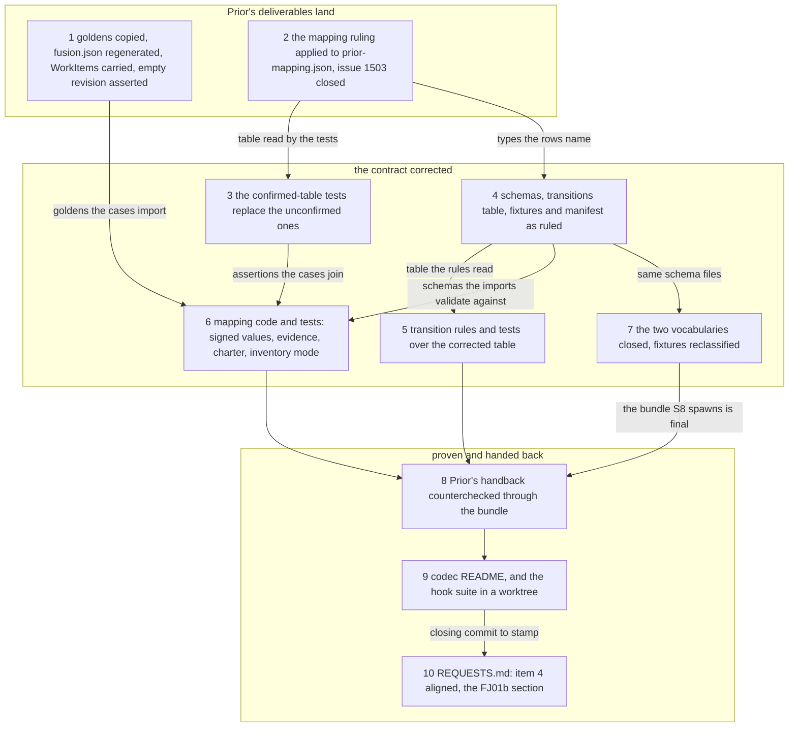
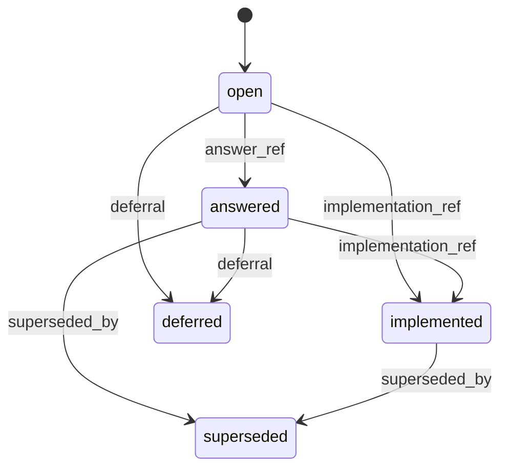

# Implementation Plan: FJ01b, the FJ00 follow-up: every Prior ruling applied on the fusion side, and the codec contract frozen at one revision before FJ02

**Date:** 2026-09-28
**Status:** Complete — closed by the user on 2026-09-28; ten steps across be2b0570, 027f9bee, 4ffb6774, 2a1d3b01, 451e771c, bf21eeb7, dc798133, 487c3a53, plus the parser fix and the README clauses as 14ab3bb0; the contract FJ02 starts from is dc798133 (bundle 445 664 bytes, sha256:f82aa558444a85e6ddf99ed8ba16346832a27e27207e00930d002c74a1727230); hook suite 1 008 of 1 009 (the monitor case).
**Spec:** none as a requirements-designer spec. The inputs are the Prior side's two responses, read-only at Prior commit `c512c4c`: `docs/design/fusion-fj00-prior-response.md` (answers 1 to 6 and the five-item "Fusion-side application checklist" at its foot), `docs/design/fusion-fj00-prior-mapping-ruling.json` (the row-by-row ruling), `docs/design/fusion-fj01-prior-response.md` (answers 7 to 10 and the handback under `tests/testdata/fusion-fj01/prior-handback/`), and the 13 goldens under `tests/testdata/fusion-prior-goldens/`. The user ruled on 2026-09-28 that this is a plan of its own and not FJ02.
**Cross-references:** 260928-1338-json-control-data-and-markdown-artefacts.md, 260928-1341_*_plan-fj00-schemas-dto-mapping-and-reference-status-contract.md (closed), 260928-1550_*_plan-fj01-codec-port-bundle-wrapper-and-first-record-round-trip.md (closed), 260928-1420_*_which-closed-vocabularies-do-artefact-kind-and-issue-disposition-kind-take.md (answered, option 3), 260928-1420_*_where-do-a-candidates-statement-and-purpose-live-after-import.md (answered, option 1), 260928-1735_*_does-transition-keep-walking-the-claim-and-release-edges-once-they-are-operations-of-their-own.md (answered, option 1), 260928-1503_*_the-nil-and-empty-mapping-rule-says-export-writes-the-go-nil-form-and-that-cannot-round-trip.md (open; closed by step 2)
**Survey commit:** fusion `2d78ed71` on `fj-json-workbench` (the dispatch named `1d13513f`; the commit between them touched only the workbench), Prior `c512c4c`. `codec/dist/fusion-record.js` at the survey commit: 440 232 bytes, `sha256:d9d0d440caeb7c311c1de942ca2471a3621dbcfb7d1bcefd6877c5922e4ff500`, the digest Prior's FJ01 pins carry. The three bounded surfaces stand where FJ01 left them (3 806 bytes, 25 559 bytes, 6 lines); nothing here touches them.
**Decidability:** The load-bearing question is *has every ruling the Prior side returned been applied, so that the revision FJ02 starts from is the one both hosts read?* It is decidable from the inputs this plan has: the ruling is a file whose 170 rows compare row for row against `contract/prior-mapping.json`; each golden is a file whose SHA-256 either equals Prior's or does not; every schema correction is pinned by a fixture whose manifest outcome the harness asserts on both sides; and the revision is the bundle digest at a named commit. Two questions inside the rulings are not decidable from bytes, and the plan does not approximate them: whether a legacy deferred decision carries a target and a ruler, and whether a `running` package has a current authorised handover. Both are migration findings FJ04 reports from inputs only it has (the workbench inventory, the migration plan); here the schema requires the fields and the mapping refuses to invent them.

## Directive

Apply, in `codec/`, everything the Prior side ruled on FJ00's six and FJ01's four requests: copy the 13 Go-emitted goldens and regenerate the derived side; bring `contract/prior-mapping.json` into line with the ruling row for row; correct the schemas and the mapping code where the ruling corrected a type or a rule (signed ratings and scores, evidence order, charter multiplicity, unversioned evidence, `FailureReason` on `stale`, the `empty_collections` carry, the merged-candidate inconsistency); apply the three state corrections (5a confirm, 5b narrow discussions, 5c decision `_d_` is `deferred` with a target and a ruler); close the two vocabularies as the user ruled; countercheck Prior's handback through the pinned bundle; align one sentence in `REQUESTS.md` with the strict reader; and hand the Prior side the resulting immutable revision. The operation kernel (journal, multi-file transactions, `claim`, `release`, `create` and the other named operations) stays `not-implemented-in-fj01`; nothing here changes `transitions.json`'s package edges or the recorded protocol session.

## Current State

What the survey verified, with the command where a figure is stated:

- **Goldens.** All 13 aggregates in Prior's `prior.json` files equal the derived fusion fixtures in value and key order, apart from the two `Form`-only plan cases whose `Revision` is `""` (checked with a `node` comparison over the stripped aggregates, case by case). Three cases carry `_inputs` the derived files did not: `plan/admission-crash-requires-observation-before-dispatch` and `plan/failed-package-does-not-block-unrelated-package` gain `FormationPolicy` and `WorkItems`; `register/admission-persists-stable-item-and-current-attempt` gains `Policy`. The golden's three metadata keys sit at the end of the file, not the top; `prior-mapping.test.ts` strips underscore keys before reading, so the position is immaterial. The plan round-trip helper in that test (`roundTrip`, `case "packages.Plan"`) passes `FormationPolicy` only; `importPlan` (`codec/src/prior/packages.ts` `PlanInputs`) takes no `workItems`. There is no fixture writer: `fusion.json` was regenerated by hand at FJ00; `round-trip-cli.test.ts` has the pattern to copy (`UPDATE_PROTOCOL_SESSION=1`). The revision test (`prior-mapping.test.ts`, "the recomputed revision and hashes equal the stored ones") compares `computePriorRevision(exported)` with the stored value unconditionally, which fails on `""`. `jsonShaOrNull` and `unJsonSha` in `common.ts` already map `""` to `null` and back, and `formation.revision` is nullable in `campaign.schema.json`.
- **Mapping table.** Comparing the ruling's `rows` and `state_mapping.rows` with `codec/contract/prior-mapping.json` by `aggregate.prior_key` (a `node` one-liner over both files) finds 57 field rows whose `type`, `null_vs_empty` or `note` differ and 7 state rows whose `note` differs; every row of the ruling is `confirmed: true`, every fusion row `confirmed: false`. The ruling also rewrites two `conventions.null_vs_empty` entries (`nil-and-empty-to-[]`, `nil-and-empty-to-no-records`) and adds `prior_review_commit: dbd1aa1` and `fusion_review_commit: 6667d63b…`. The fusion file's `description` still says every row is unconfirmed until the Prior side rules. Two tests pin the unconfirmed state: `prior-mapping.test.ts` "the table has 163 field rows and 7 state rows, none confirmed yet" and "the state rows are read, not applied: … unconfirmed" (`proposedPackageStatus` returns `confirmed: false`). The open issue `260928-1503_*` names the wrong sentence in `nil-and-empty-to-[]`; the ruling's 3c text is its correction.
- **Schemas and code the ruling corrects.** `record.schema.json`: candidate `severity`, `estimated_scope` and selection `score` are `non_negative_integer`; candidate `evidence` carries `uniqueItems: true` and its `ref` is a non-empty string, `revision` a `prior_opaque_revision`; `merge_into` and `outcome: merged` imply each other by `if/then`. `campaign.schema.json`: `string_set` (uniqueItems) on the five charter lists and on the first three also `minItems: 1`; formation candidate and package `risk`, `validation_cost`, `estimated_size` are `non_negative_integer`; `failure_reason` is required on `failed` and forbidden on `formed | admitting | admitted`, so a `stale` package with a reason already validates. `codec/src/prior/candidates.ts`: `nonEmpty` on `Evidence[].Ref`, `opaque` on `Evidence[].Revision`, `distinct` over evidence pairs, `nonNegative` on `Severity`, `EstimatedScope`, `Score`; the `MergeInto` refusal reads "a merge target and the disposition outcome merged imply each other". `packages.ts`: `nonNegative` on the three metrics of both `Candidate` and `Package`; the `failed` rule for `FailureReason` is the only rule on that field. `campaign.ts`: `stringSet` (refuses duplicates) over all five charter lists, `atLeastOne` on the first three. `common.ts` `PriorRefusalClass` is `schema-invalid | unresolved-reference`.
- **The three state corrections.** 5a: `transitions.json` gives issues and plans the five edges with `closed` and `deferred` terminal and no `deferred → open`; nothing to implement. 5b: `transitions.json` lists four discussion states with the single edge `open → closed`; `record.schema.json` `discussion_control.state` is the shared `four_states` def. 5c: `transitions.json` and `record.schema.json` carry the decision state `dropped` with edges `open → dropped`, `answered → dropped`; the fixtures `valid/record/decision-dropped.json` and `invalid/record/decision-dropped-with-successor.json` and the manifest note "A decision state is open, answered, implemented, superseded or dropped" spell it; `transitions.test.ts` asserts the `dropped` table and builds its decision payloads in `satisfying()`; `transitions.ts` `TransitionPayload` names the three decision references and `allowed()` honours an edge's `requires` column generically.
- **Vocabularies.** `common.schema.json` `artefact_ref.kind` and `record.schema.json` `disposition.kind` are open `token`s. `grep -rlE '"kind": *"markdown"' codec/fixtures codec/src` lists 41 fixture files (evidence reports, package artefact references, decision references); `"kind": "resolved"` sits in `valid/record/issue-closed.json` and `invalid/record/issue-open-with-disposition.json`, and `transitions.test.ts` `satisfying()` writes `kind: "resolved"` into issue payloads. `json` (27 occurrences, backups) is in the ruled list; `markdown` is not; `resolved` is not (the ruled word is `fixed`). The scratch workbench's issue record (`codec/fixtures/workbench/shared/issues/…record.json`) carries `disposition: null` and no artefact reference, and `06-validate.response.json` echoes only counts, so closing the vocabularies moves no byte of the recorded session.
- **Handback.** Prior's five files: `package.json` (the record after `claimed → paused`), `revision.txt` (`sha256:4f5897da…`), `show.response.json` (no absolute path inside), `transition.request.json`, `transition.response.json` (`previous_revision` is the R1 of `03-show`). `round-trip-cli.test.ts` already copies `codec/fixtures/workbench/` to a temp dir and spawns `bin/fusion-record`; `fixtures.test.ts` exempts `prior/`, `workbench/` and `protocol-session/` from manifest coverage by prefix (line 124).
- **Strict reader order.** `codec/src/strict-json.ts` refuses `too-large`, then `bom`, then `invalid-utf8`, then the scanner's findings in document order; `REQUESTS.md` item 4 says "a byte order mark, more than 1 MiB, invalid UTF-8, …".
- **Bundle and pins.** `codec/src/cli/schemas.ts` inlines the seven schemas and the two tables `transitions.json` and `dependencies.json`; `prior-mapping.json` is not inlined. So every step that changes a schema or `transitions.json` changes the bundle; the mapping table alone does not. `npm test` in `codec/` rebuilds `dist/` before the suite and runs the committed-bundle gate last, comparing HEAD's bundle with a build of HEAD's source. Prior pins the bundle digest in `tests/testdata/fusion-fj01/UPSTREAM.json` and the fixture snapshot at fusion `6667d63b` in `tests/testdata/fusion-codec/UPSTREAM.json` (172 cases).
- **Hook suite.** `hooks/lib/__tests__/reference-resolution-lint.test.ts` scans `skills/`, the repository root, `bin/`, `install.sh`, `hooks/lib` and `hooks/`; it does not read `codec/`. FJ01's pin re-approval came from `install.sh`, `README-hooks.md` and the wrapper header, none of which this plan touches. FJ01 left the suite at 1 008 of 1 009 in a worktree, the monitor bind case the one red.
- **Version.** `git log 40a1713f..HEAD -- .claude-plugin/plugin.json` is empty: neither FJ00 nor FJ01 bumped; `plugin.json` reads 12.0.0 while the installed copy under `$FUSION_PLUGIN_ROOT` reads 12.0.1.

## Approach

One pass over the codec, in the order the rulings depend on each other: Prior's deliverables land first (the goldens, then the mapping table as ruled), the contract is corrected against them (schemas, tables, fixtures, then the code that reads them), the frozen result is proven (the handback through the bundle, the hook suite in a worktree) and handed back (README, `REQUESTS.md`). Every correction is realised the same way FJ00 realised the original: the rule lives in a schema or a table, the code reads the table, and a manifest fixture pins the outcome for both hosts. No correction is a special case in code that the schema does not also state.

Three choices the rulings leave to the fusion side are taken here and named so the approval can overturn them:

1. **The deferral of a decision is a `control.deferral` object**, `{target, ruled_by}`, non-null exactly in state `deferred`, mirroring the conventions' `Deferred: <target> — <reason>; ruled by <actor>, <person>` line the way `answer_ref` mirrors `Answered:`. `target` is one `reference` (record, artefact, foreign or legacy citation) or `{kind: "external", name}` for a phrase such as "v1.x", which Prior's 5c says must not be turned into a manufactured record id; `ruled_by` is the common `actor` (`{actor, person|null}`), the shape `filed_by` uses. The reason stays Markdown. A legacy record whose `Deferred:` line names no target is a migration finding in FJ04, never a null the schema admits.
2. **The closed vocabularies are applied as ruled**, which means the 41 fixtures carrying `markdown` are reclassified by what the path names, not by the file's format, and `resolved` becomes `fixed`. The ruled artefact list has `json` because Prior's backups need a kind the path does not state; `markdown` states nothing the path does not already say. Open Questions carries the alternative.
3. **The merged-candidate inconsistency stays a refusal** (Prior: "the target's consistency refusal can remain"), with the class `schema-invalid` unchanged and the reason opening with `legacy-inconsistency:` so that FJ04 can report it as an unresolved legacy state to reconcile rather than as something Go could not have written. No third refusal class is added: the spec's typed set has none for it, and a prefix on the reason is what a migration report needs.

The rebuilt bundle is committed with every step that changes a schema or a table, as FJ01 steps 2 to 5 did, so the committed-bundle gate is green at every commit of this plan and the closing digest is one the Prior side can pin once. Committing the bundle only at the end would leave the gate red across the intermediate commits, which contradicts the gate's own message.

Coherence check: ten nodes, twelve edges, three layers in reading order, no cycle, no orphan, and every edge is a dependency a step's `Dependencies` line declares (and none is missing: step 1 and step 2 have none, the rest are listed below).

## Implementation Steps

1. [DONE] **The 13 goldens land, `fusion.json` is regenerated by a writer, the plan helper carries `WorkItems`, and an empty revision is asserted rather than recomputed**
   - Done 2026-09-28 by `code-implementer`: `cd codec && CODEC_REQUIRE_GOLDENS=1 npm test` exit 0 (12 files, 732 tests; `fixtures/prior: 0 derived-from-source, 13 Go-emitted golden(s)`, `163 of 163 prior_keys exercised`), `npm run typecheck` exit 0, `codec/dist/` unchanged. The 13 `prior.json` digests (`shasum -a 256`, equal on both sides, Prior `c512c4c`):
     `6357d877e5da7926eb1969e8ef4bf121b6bf21344cc33c0fe4b0ed237e777554` campaign/discard-failed-and-cancelled-remain-distinct;
     `1d0d1d48b7e18b64ba4d9daf514c0d89c602e8b0f3e2e70dc01a042c51d05b71` campaign/restart-cannot-reset-failures-reviews-or-resource-limits;
     `56c63333e437ce1ad9906be9ea6e7c299b436c2f07019dc5f65361fbf2903319` campaign/revocation-amendment-and-terminal-outcomes;
     `5d42b47025de71436c5f1bc459b876b8f6c5804e2c8d3a6d4a5d3587cc0e949d` campaign/unknown-effect-and-baseline-deterioration-pause;
     `8c732d273d33024f755d51b96a4c6e929f67e89c71a7d38431298347f9d0159a` plan/adaptive-formation-records-merge-split-and-deferral;
     `1a71c32ae1aa3d17b152adc8453a06a15c5f01ebe3539abd80fbe78861d00632` plan/admission-crash-requires-observation-before-dispatch;
     `ca61f24ae7745f97817315cc2152b5e873718fedaf4d1ba388df982e611645ee` plan/dependency-cycle-is-deferred;
     `8306736e95e98e5d245ae36d6a45f0afe8d9d165fcae8a8506e7d0827f3f1677` plan/failed-package-does-not-block-unrelated-package;
     `fbc54e6e2e93dfe6b79af6abdb59a04cf01ee25f6ca4a1f5e4f04591115a1f53` register/admission-persists-stable-item-and-current-attempt;
     `2b21f78761b5c116f539e6983db4ed153e91d0d66762f87b5c86328ac5a02c8f` register/duplicate-intake-and-source-change-require-requalification;
     `873777ceadb5e13a38de413d2fb0d5d31ca8ebb802db2388e945a06ca581919e` register/frozen-selection-replays-explanation-and-stale-prevents-admission;
     `8b29c60af945d5fd59cbe09047789c2f7a0226751ee8490fa7965aa7f6a69f26` register/merge-chains-resolve-and-cycles-rollback;
     `4590b12e5cb13d480284f6c1fdd53ab5374ad0e6137ebcf405fefb3ab1dd7011` register/policy-records-every-exclusion-reason-and-closed-watermark.
     `WorkItems` is carried by three goldens (`plan/admission-crash-…` and `plan/failed-package-…` with `["item-a","item-b"]`, `register/admission-persists-…` with `["item-1"]`) and each inventory covers every id its golden names: no refusal, nothing for step 10's item 15 from this step. The writer regenerated five `fusion.json` with value changes (the two `Form` cases' `revision` to `null`; the three cases with new `_inputs` gain `policy`), the other eight byte-identical, so the writer's serialisation equals the hand-written FJ00 form.
   - Executor: `code-implementer`
   - Files: `codec/fixtures/prior/<aggregate>/<case>/prior.json` (13 files), `codec/fixtures/prior/<aggregate>/<case>/fusion.json` (13 files), `codec/src/prior/packages.ts`, `codec/src/__tests__/prior-mapping.test.ts`
   - Changes: copy each `prior.json` from `/Users/kai/Projects/productive/F09-Prior/tests/testdata/fusion-prior-goldens/<aggregate>/<case>/prior.json` at Prior `c512c4c` byte for byte (`cp`, then `shasum -a 256` on both sides; the 13 digests go into the step's `[DONE]` note). `PlanInputs` gains `workItems?: ReadonlySet<string>`; `importPlan` checks every `Admission.Attempts[].ItemID` and every `ActiveItems` key against it when given (`unresolved-reference` naming the id otherwise), the way `importRegister` checks `Disposition.WorkItemID`; `exportPlan` is unchanged. The test's `roundTrip` for `packages.Plan` passes `WorkItems` from `_inputs` and carries it back in `exportedInputs` as the register branch does, so `expect(exportedInputs).toEqual(c.inputs)` holds for the two goldens that carry it. A writer under `UPDATE_PRIOR_FIXTURES=1`, in the shape of `round-trip-cli.test.ts`'s `UPDATE_PROTOCOL_SESSION`, rewrites each case's `fusion.json` from `import(prior)` in the codec's deterministic serialisation and keeps the `_provenance` line; the ordinary run compares and fails naming the case and the variable. The revision test compares `computePriorRevision(exported)` with the stored value only when the stored value is non-empty; for the two `Form` cases it asserts `imported.formation.revision === null` and `exported.Revision === ""` and computes nothing. A `WorkItems` inventory that does not cover an id in the golden is a refusal that names the id; it is reported to the Prior side in step 10 and never defaulted.
   - Acceptance: `cd codec && CODEC_REQUIRE_GOLDENS=1 npm test` green; the suite prints `fixtures/prior: 0 derived-from-source, 13 Go-emitted golden(s)`; the 13 `prior.json` digests equal Prior's; `npm run typecheck` green. No other test file is expected red; any red is a stop.
   - Dependencies: none.

2. [DONE] **`contract/prior-mapping.json` as the Prior side ruled it, and the nil-and-empty issue closed**
   - Done 2026-09-28: differences to the ruling 0, unconfirmed 0; changed per field row: confirmed 163, type 17, null_vs_empty 2, note 57; state rows note 7, confirmed 7; kept sections byte-identical to the ruling's copies; the ruling in Prior's work tree equals the blob at c512c4c. Prior's prose says thirty corrected rows, the ruling carries 57; the rows were taken, not the number. The two expected reds in prior-mapping.test.ts are step 3's; committed together with step 3 so no commit carries a red suite.
   - Executor: `data-implementer`
   - Files: `codec/contract/prior-mapping.json`, `$OUT_ISSUE/260928-1503_o_the-nil-and-empty-mapping-rule-says-export-writes-the-go-nil-form-and-that-cannot-round-trip.md` (append `Resolved:`, rename to `_c_`)
   - Changes: replace `rows`, `state_mapping` and `conventions.null_vs_empty` with the ruling's (`/Users/kai/Projects/productive/F09-Prior/docs/design/fusion-fj00-prior-mapping-ruling.json` at `c512c4c`), so every one of the 163 field rows and 7 state rows reads `confirmed: true` and the 57 corrected rows carry Prior's `type`, `null_vs_empty` and `note` verbatim; add `prior_review_commit` and `fusion_review_commit` as the ruling carries them; keep `prior_commit: 12d8424`, `source_structs`, `source_files`, `input_contracts_not_the_on_disk_shape`, `verbatim_vocabularies` and `import_stamps` as they stand (the ruling's copies are identical; verify rather than assume). Rewrite `description` so it no longer says every row is unconfirmed: it says the rows are the contract as ruled at Prior `c512c4c` against fusion `6667d63b`, that `confirmed: true` approves the target contract and not any particular fusion revision (the ruling's own wording), and that the two `Statement` and `Purpose` rows stay after FJ04 (decision `260928-1420_*_where-do-a-candidates-statement-and-purpose-live-after-import.md`, option 1). Key order inside a row stays the file's. The issue `260928-1503_*` gains `Resolved: contract/prior-mapping.json \`conventions.null_vs_empty\` — the nil-and-empty-to-[] entry now describes the empty_collections carry, as Prior's 3c ruled` and moves to `_c_`.
   - Acceptance: a `node` one-liner reading both files reports zero differences between the ruling and the fusion file on `rows`, `state_mapping.rows` and `conventions` (key order aside) and no row with `confirmed: false`; `codec/src/__tests__/prior-mapping.test.ts` is the one expected red (its two cases asserting unconfirmed rows), cleared by step 3; any other red is a stop.
   - Source: decision `260928-1420_*_where-do-a-candidates-statement-and-purpose-live-after-import.md` (option 1: the two rows are kept; this step writes their notes as ruled, which is the realisation, so the record takes `Implemented:` naming this step's commit, written by whoever holds the hash after the orchestrator commits).
   - Dependencies: none.

3. [DONE] **The tests that asserted an unconfirmed table are replaced**
   - Done 2026-09-28 by `code-implementer`: `cd codec && CODEC_REQUIRE_GOLDENS=1 npm test` exit 0 (12 files, 732 tests), `npm run typecheck` exit 0, `codec/dist/` unchanged. The first case lists any unconfirmed row by key (none) and pins `prior_review_commit` and `prior_commit`; the second asserts "not applied" over the sources: the only `proposedPackageStatus(` under `src/prior/` is its definition in `common.ts` (`packages.ts` re-exports the name, calls nothing). The phrase "confirmed or not" sat on `VOCABULARY.packageState`'s comment, not on `proposedPackageStatus`'s; both comments in `common.ts` were reworded, no code changed.
   - Executor: `code-implementer`
   - Files: `codec/src/__tests__/prior-mapping.test.ts`, `codec/src/prior/common.ts` (doc comment on `proposedPackageStatus` only)
   - Changes: "the table has 163 field rows and 7 state rows, none confirmed yet" becomes "the table has 163 field rows and 7 state rows, every one confirmed by Prior's ruling" and asserts `confirmed === true` on all 170, plus `prior_review_commit === "dbd1aa1"` and `prior_commit === "12d8424"`; "the state rows are read, not applied: … unconfirmed" becomes the same sentence with `confirmed: true`, and keeps the assertion that no importer applies a row (`proposedPackageStatus` is still read by nothing in `src/prior/` but the test: assert that with a `grep`-equivalent over the sources, or state it in the test's comment as FJ00 did). The comment on `proposedPackageStatus` no longer says "confirmed or not".
   - Acceptance: `CODEC_REQUIRE_GOLDENS=1 npm test` and `npm run typecheck` green; no expected red.
   - Dependencies: 2.

4. [DONE] **Schemas, the transitions table, fixtures and manifest: the ruling's type corrections and the three state corrections**
   - Done 2026-09-28: manifest 208 entries (valid 51, invalid 157; record 59, campaign 25, package 46, evidence 20, protocol 30, workbench 19, workbench/v2 1, bytes 8); bundle 444 087 bytes, sha256:2f0a7692abea9f537d69d3de821759448c547ba6033040a6a6a11c784eaad57c; package block of transitions.json byte-identical to HEAD. Departures: `name_list` def for data_boundary and capabilities instead of narrowing `string_list`, which six other fields share; `decision-state-unknown.json` now carries `dropped` since `deferred` became valid; the unversioned-evidence fixture carries a failed qualification. The four reds in transitions.test.ts (decision markers, the two deferred edges, the requires list) are step 5's; committed together with step 5.
   - Executor: `data-implementer`
   - Files: `codec/schemas/record.schema.json`, `codec/schemas/campaign.schema.json`, `codec/contract/transitions.json`, `codec/fixtures/valid/record/*`, `codec/fixtures/invalid/record/*`, `codec/fixtures/valid/campaign/*`, `codec/fixtures/manifest.json`
   - Changes, `record.schema.json`: candidate `severity` and `estimated_scope` become plain `integer` (`risk` and `confidence` stay `non_negative_integer`: Prior validates those two at intake and the ruling left their rows unchanged); selection `score` becomes `integer`; `evidence` loses `uniqueItems` and its description says order is kept and duplicates preserved, `evidence[].ref` becomes `string | null` (non-empty when a string) and `evidence[].revision` `prior_opaque_revision | null`; `discussion_control.state` becomes the enum `["open", "closed"]` in a new def `two_states` (issue and plan keep `four_states`); `decision_control.state` enum becomes `["open", "answered", "implemented", "superseded", "deferred"]`, a new required property `deferral` is `null` or `{target, ruled_by}` with `target` `oneOf` the common `reference` and `{kind: "external", name: string minLength 1}` and `ruled_by` the common `actor`; the `allOf` rules read: `deferred` requires `deferral` an object and `implementation_ref` and `superseded_by` null, every other state requires `deferral` null. The schema `description` drops "a deferred decision's target lives in the Markdown Deferred: line" and "dropped carries no successor" and states the new rule; the `four_states` and decision state descriptions no longer mention `dropped`. Changes, `campaign.schema.json`: a new def `string_list_nonempty` (`minItems: 1`, items non-empty strings, no `uniqueItems`) for `item_kinds`, `candidate_sources`, `workflow_templates`, and `string_list` (items non-empty strings) for `data_boundary` and `capabilities`; formation candidate and package `risk`, `validation_cost`, `estimated_size` become `integer`; `formation_package`'s description adds that `failure_reason` occurs on `stale` as well as `failed` (the `if/then` pair already admits it) and that `baseline_hash` is set by `Dispatch` and cleared on other formed packages by a successful completion. Changes, `transitions.json`: `discussion.states` `["open", "closed"]`, `terminal` `["closed"]`, the note about imported four-state values replaced by "a legacy record carrying another value is a migration finding, never an imported state"; `decision.markers.dropped` becomes `deferred: "_d_"`, `states` and `terminal` name `deferred`, the edges `open → dropped` and `answered → dropped` become `open → deferred` and `answered → deferred`, each with `"requires": "deferral"`, and the note about the spec naming the state `dropped` is replaced by "Prior's FJ00 response 5c: `_d_` is deferred, terminal, with an explicit target and who ruled"; the `sources` list gains the response document. Package edges: byte-identical to HEAD (`git show HEAD:codec/contract/transitions.json` diffed on the `package` block). Fixtures: `valid/record/decision-dropped.json` becomes `decision-deferred.json` with a `deferral` naming an external target `v1.x` and `ruled_by {actor: "user", person: "kai"}`; `invalid/record/decision-dropped-with-successor.json` becomes `decision-deferred-with-successor.json`; new `invalid/record/decision-deferred-without-deferral.json`, `invalid/record/decision-open-with-deferral.json`, `invalid/record/discussion-state-in-progress.json`; every other decision fixture gains `"deferral": null`; `invalid/record/candidate-negative-severity.json` is deleted and `valid/record/issue-candidate-legacy-signed-ratings.json` (severity −1, estimated_scope −2, score −3) and `invalid/record/candidate-negative-risk.json` (risk −1, the bound that stays) take its place; new `valid/record/issue-candidate-unversioned-and-duplicate-evidence.json` (one entry with `ref: null, revision: null`, two identical entries); new `valid/campaign/formation-signed-metrics-stale-reason-and-charter-duplicates.json` (a formation candidate with `risk: -1`, a package in `stale` with a `failure_reason`, a charter whose `item_kinds` and `data_boundary` each repeat an entry). `manifest.json` follows every rename, deletion and addition; the notes on `decision-state-unknown` and `discussion-*` name the new enums.
   - Acceptance: `codec/src/__tests__/fixtures.test.ts` green (every fixture indexed exactly once, every outcome as the manifest says); `codec/src/__tests__/transitions.test.ts` is the one expected red (its discussion and decision table assertions and the `dropped` payloads), cleared by step 5; `prior-mapping.test.ts` stays green (the goldens carry no value the corrections admit or refuse differently); any other red is a stop. The rebuilt bundle is part of this step's commit.
   - Dependencies: 2.

5. [DONE] **The transition rules and their tests over the corrected table**
   - Done 2026-09-28 by `code-implementer`: `cd codec && CODEC_REQUIRE_GOLDENS=1 npm test` exit 0 (12 files, 729 tests), `npm run typecheck` exit 0, `npm run build` exit 0 reporting `dist/fusion-record.js: unchanged` (444 087 bytes, sha256:2f0a7692abea9f537d69d3de821759448c547ba6033040a6a6a11c784eaad57c, step 4's bytes: an optional interface field emits no JavaScript). `TransitionPayload.deferral` added; `allowed()` untouched, the refusal reads `decision: deferred requires deferral` and the requires case now asserts that wording for every requiring edge. The discussion enumeration is 4 ordered pairs from the table's two states, built from the state list as before.
   - Executor: `code-implementer`
   - Files: `codec/src/transitions.ts`, `codec/src/__tests__/transitions.test.ts`
   - Changes: `TransitionPayload` gains `deferral?: unknown` beside the three decision references, and the comment names it; `allowed()` needs no new branch, because the `requires` column is read generically, but the refusal wording is checked to read `decision: deferred requires deferral`. The tests: the discussion case asserts `states` `["open", "closed"]`, `terminal` `["closed"]` and the single edge; the decision case asserts the `deferred` marker, states, terminal set and the seven edges with `deferred` in place of `dropped`; `satisfying()` supplies a `deferral` object for `to === "deferred"` and writes `kind: "fixed"` into issue dispositions (the ruled word; step 7 closes the enum); `terminalLeaves` still equals `["decision:implemented>superseded"]`. The ordered-pair enumeration is built from the table's state lists, so it follows the change without a hand-written list.
   - Acceptance: `CODEC_REQUIRE_GOLDENS=1 npm test` and `npm run typecheck` green; no expected red.
   - Dependencies: 4.

6. [DONE] **The mapping code and its tests carry the material corrections**
   - Done 2026-09-28 by `code-implementer`: `cd codec && CODEC_REQUIRE_GOLDENS=1 npm test` exit 0 (12 files, 735 tests; `163 of 163 prior_keys exercised`, 13 goldens), `npm run typecheck` exit 0, `codec/dist/` unchanged (444 087 bytes, sha256:2f0a7692…, step 4's bytes: `src/prior/` is not in the bundle). Two choices the step left open: the inventory mode sits on the result envelope (`ImportResult<T> = PriorResult<T> & { inventory }`, on refusals too), not inside the value, so the 13 `fusion.json` stay byte-identical and `exportRegister`/`exportPlan` take the blocks unchanged; the `MergeInto` check is two rules now, `MergeInto` set without `merged` carrying the `legacy-inconsistency:` reason and `merged` without a target keeping a plain schema-invalid reason, since the ruling names only the first as a legacy state. The three required charter lists keep a non-empty-string check per entry (the schema's `string_list_nonempty` has `minLength: 1`), without `distinct`.
   - Executor: `code-implementer`
   - Files: `codec/src/prior/candidates.ts`, `codec/src/prior/packages.ts`, `codec/src/prior/campaign.ts`, `codec/src/prior/blocks.ts` (types), `codec/src/prior/common.ts`, `codec/src/__tests__/prior-mapping.test.ts`
   - Changes: `candidates.ts`: `Evidence[].Ref` and `Revision` import through `emptyToNull` and `opaqueOrNull` and export through `nullToEmpty` and `unOpaque` (exact `""` back), the `distinct` call over evidence is removed and the stored sequence kept, `Severity`, `EstimatedScope` and `Score` go through `integer` instead of `nonNegative` (`Risk` and `Confidence` keep `nonNegative`), the `MergeInto` refusal keeps its class and its reason becomes `legacy-inconsistency: MergeInto is set while the disposition outcome is not merged (Qualify on a merged candidate clears Disposition without clearing MergeInto); a migration finding to reconcile, not repaired here`; `importRegister` and `importPlan` return, beside the blocks, `inventory: {work_items: "checked" | "carry-only"}` naming whether a `workItems` set was supplied, so FJ04 has the fact it needs to refuse a carry-only import as a validated migration (checklist item 3); the option itself stays optional and no record field changes. `packages.ts`: the three metrics on `Candidate` and `Package` go through `integer`; the `failed` rule stays and a comment names `stale` as the other state that carries a reason. `campaign.ts`: the five charter lists keep order and multiplicity (`t.list`, no `stringSet`), `atLeastOne` stays on `ItemKinds`, `CandidateSources`, `WorkflowTemplates`, and `computeCharterHash` is checked to hash the original slice (the test already asserts it against the goldens). `common.ts`: `nonNegative` stays for the two candidate fields; nothing else. Tests, all in `prior-mapping.test.ts` under "typed refusals, never defaults" and a new "corrections Prior ruled": a register whose candidate carries `Score: -3`, `Severity: -1`, `EstimatedScope: -2` imports, validates against `record.schema.json` and exports the same bytes; duplicate evidence entries survive the round trip and `computeEvidenceHash` still equals the stored hash; `Evidence[].Ref: ""` imports as `null`, exports as `""`, and a `Qualification` with `Passed: false` is never promoted; a charter with a repeated `ItemKinds` entry round-trips with `computeCharterHash` equal; a package in `stale` with a `FailureReason` imports and exports; `MergeInto` without `merged` is refused with the reason opening `legacy-inconsistency:`; the two inventory modes are asserted (`checked` refuses an unknown id, `carry-only` carries it and says so); the existing case "an unknown Package.State is schema-invalid" is unchanged and re-run.
   - Acceptance: `CODEC_REQUIRE_GOLDENS=1 npm test` and `npm run typecheck` green; the three-way `walkGoFields` coverage test still reports 163 of 163 `prior_keys` exercised; no expected red.
   - Dependencies: 1, 3, 4.

7. [DONE] **The two vocabularies closed, and the fixtures reclassified**
   - Done 2026-09-28 by `data-implementer`: `cd codec && CODEC_REQUIRE_GOLDENS=1 npm test` exit 0 (12 files, 737 tests; `fixtures: 210 manifest entries`, valid 51, invalid 159; record 60, evidence 21, the other schemas unchanged), `npm run typecheck` exit 0, `npm run build` exit 0; bundle 445 664 bytes, sha256:f82aa558444a85e6ddf99ed8ba16346832a27e27207e00930d002c74a1727230. 48 `markdown` references in the 41 files, reclassified: report 19 (every evidence `report`), other 13 (12 `archive/` backups, one absolute-path reference), decision 8, review 7, memo 1; `resolved` to `fixed` in the two issue fixtures. One choice the rule left open: `invalid/package/artefact-path-dotdot.json`'s `shared/reviews/../../outside.md` took `review` from its store segment (the fixture's refusal is the path, not the kind). `codec/src/__tests__/references.test.ts` still builds artefact refs with `kind: "markdown"` (6 places) and `src/references.ts` checks `kind` against the token pattern alone, so the parser admits what the schema now refuses; reported, not edited. The recorded session and the scratch workbench are byte-identical to HEAD.
   - Executor: `data-implementer`
   - Files: `codec/schemas/common.schema.json`, `codec/schemas/record.schema.json`, the 41 fixture files `grep -rlE '"kind": *"markdown"' codec/fixtures` lists, `codec/fixtures/valid/record/issue-closed.json`, `codec/fixtures/invalid/record/issue-open-with-disposition.json`, new `codec/fixtures/invalid/evidence/report-kind-unknown.json`, new `codec/fixtures/invalid/record/issue-disposition-kind-unknown.json`, `codec/fixtures/manifest.json`
   - Changes: `artefact_ref.kind` becomes the enum `spec, plan, issue, decision, discussion, review, analysis, consultation, memo, forum, report, patch, log, other, audit, test-report, integration-report, handover, manifest, json` and its description cites the decision record and says the set is additive-only from here; `disposition.kind` becomes the enum `fixed, duplicate, deferred, rejected, out-of-scope, merged, superseded` with the same note, and the description says `control.candidate.selection.outcome` is Prior's separate verbatim set and never this one. Every `"kind": "markdown"` artefact reference takes the kind the conventions' `## Filename Patterns` row gives the store its `path` sits in (`reviews/` → `review`, `plans/` → `spec` when the basename carries `-spec-` or `_spec_` else `plan`, `issues/` → `issue`, `decisions/` → `decision`, `discussions/` → `discussion`, `analyses/` → `analysis`, `consultations/` → `consultation`, `memos/` → `memo`, `forum/` → `forum`); an evidence `report` reference takes `report`; a path in none of those stores (a work-package narrative, an `archive/` file) takes `other`. `resolved` becomes `fixed` in the two fixtures. The two new invalid fixtures carry a lowercase token outside each enum (`"kind": "markdown"` for the artefact, `"kind": "resolved"` for the disposition), so the manifest pins the closure itself and not only the token rule; the notes on `report-kind-not-token` and `issue-disposition-kind-not-token` stay (uppercase is outside the enum too).
   - Acceptance: `grep -rE '"kind": *"(markdown|resolved)"' codec/fixtures/valid codec/fixtures/workbench` is empty; `fixtures.test.ts`, `round-trip-cli.test.ts` (the six recorded pairs unchanged, no `UPDATE_PROTOCOL_SESSION`) and the whole suite green under `CODEC_REQUIRE_GOLDENS=1`; the rebuilt bundle is part of the commit; no expected red.
   - Source: decision `260928-1420_*_which-closed-vocabularies-do-artefact-kind-and-issue-disposition-kind-take.md` (option 3 as ruled; this step is its realisation, so the record takes `Implemented:` naming this step's commit).
   - Dependencies: 4.

8. [DONE] **Prior's handback counterchecked through the pinned bundle**
   - Done 2026-09-28 by `code-implementer`: `cd codec && CODEC_REQUIRE_GOLDENS=1 npm test` exit 0 (13 files, 743 tests; `prior-handback.test.ts` 6 cases), `npm run typecheck` exit 0, `codec/dist/` unchanged (445 664 bytes, sha256:f82aa558…, step 7's bytes). The `show` over the scratch copy with only the record replaced equals `show.response.json` byte for byte: the schema changes of steps 4 and 7 touch no field of this record. The five digests (`shasum -a 256`, equal on both sides and to the blobs at Prior `c512c4c`):
     `4f5897da396b43cfac70b7f79932cb291e1f9cd3b86c5ab1b688edf30893b8e7` package.json;
     `13058c70ea4d3079a4b8d8e18414b068bf344459f032aa81ca5b9c98b5ccd6df` revision.txt;
     `ad5d5380e9294e29dc64c217d74bebb8df3658fa666299e8ffb501aa52a83f19` show.response.json;
     `f9c8e60e7509e2e83743d620a5bf0598a345e1fadabf72d26df516d8f749b44b` transition.request.json;
     `dc180fce19562d281f43d73d4f39b3b9feed503554c6cab1eba1a5989c58f328` transition.response.json.
     One thing the plan's wording did not say: the validator is keyed by the URN `urn:fusion:schema:fusion.package/v1` (as `manifest.json` spells it), not by the record's own `schema` field `fusion.package/v1`; the test names the URN.
   - Executor: `code-implementer`
   - Files: `codec/fixtures/prior-handback/package.json`, `revision.txt`, `show.response.json`, `transition.request.json`, `transition.response.json` (five files, byte-identical to `/Users/kai/Projects/productive/F09-Prior/tests/testdata/fusion-fj01/prior-handback/` at `c512c4c`), `codec/src/__tests__/prior-handback.test.ts`, `codec/src/__tests__/fixtures.test.ts` (the exemption prefix list gains `prior-handback/`)
   - Changes: the test's header names the Prior commit and the five digests; the cases: `revision.txt` equals `sha256:` over the bytes of `package.json`; `transition.response.json` carries that revision as `revision` and `03-show.response.json`'s revision as `previous_revision`, and `transition.request.json` names the record path and `to: paused` (read as data, asserted as such); the handback `package.json` passes `strictParse` and validates against `fusion.package/v1`; a fresh copy of `codec/fixtures/workbench/` in a temp directory has only `work-packages/260928-1200-parser-fix/package.json` replaced by the handback bytes, `show` on that path runs through `bin/fusion-record` as `round-trip-cli.test.ts` spawns it, and stdout equals `show.response.json` byte for byte (that response echoes no root, so no placeholder substitution). No `README.md` is added under the new directory: the codec README's layout table names it in step 9.
   - Acceptance: the new suite green; `fixtures.test.ts` green with the exemption; `CODEC_REQUIRE_GOLDENS=1 npm test` green; no expected red.
   - Dependencies: 5, 6, 7.

9. [DONE] **The codec README, and the hook suite in a worktree**
   - Done 2026-09-28 by `code-implementer`: `cd codec && CODEC_REQUIRE_GOLDENS=1 npm test` exit 0 (13 files, 743 tests), the README read by no test. Hook suite in a scratch worktree at `bf21eeb7` (`git worktree add … HEAD`, `cd hooks && npm install && npm test`, worktree removed and pruned afterwards): exit 1, 60 files (59 passed, 1 failed), 1 009 tests (1 008 passed, 1 failed); the one red is `monitor-warnings-panel.test.ts` "bin/monitor — the default wildcard bind > answers at `localhost` on both loopback families, with no MONITOR_BIND set" (timed out at 30 000 ms), the case FJ01 left red; no other red. The three growth-bound figures, read as floor + head-room − golden total over `surface-growth-bound.test.ts` and `fixtures/surface-growth.golden`: `agents/` 3 806 bytes of room (324 761 measured, floor 310 567, head-room 18 000), `skills/` 25 559 bytes (202 469, floor 188 768, head-room 39 260), hook tests 6 lines (22 252, floor 19 228, head-room 3 030); unchanged. README changes: the `contract/` row, the `fixtures/prior/` row, the new `fixtures/prior-handback/` row, and a new section `## The two closed vocabularies` between "The CLI" and "Layout" (20 artefact kinds in `common.schema.json`, 7 disposition kinds in `record.schema.json`, additive-only, citing `260928-1420_*_which-closed-vocabularies-do-artefact-kind-and-issue-disposition-kind-take.md`); nothing else in the file moved.
   - Executor: `code-implementer`
   - Files: `codec/README.md`
   - Changes: the layout table gains the row `fixtures/prior-handback/` (Prior's FJ01 handback, counterchecked by `prior-handback.test.ts`); the `fixtures/prior/` row says the 13 `prior.json` are Go-emitted goldens (`go-golden@dbd1aa1`) and that `UPDATE_PRIOR_FIXTURES=1` regenerates `fusion.json`; the `contract/` row says `prior-mapping.json` is the contract as Prior ruled it, every row confirmed; a sentence under "The CLI" or a new short section names the two closed vocabularies and where they are defined (`common.schema.json`, `record.schema.json`) and that they are additive-only; the FJ01 sentence on what is implemented stays. Then the hook suite: `git worktree add <scratch> HEAD` (never a whole-tree checkout in the working tree), `cd hooks && npm install && npm test`, record exit code, file and test counts in this step's `[DONE]` note, remove the worktree; re-read the three growth-bound figures.
   - Acceptance: the codec suite green; the hook suite at 1 008 of 1 009 with `monitor-warnings-panel.test.ts`'s loopback case the one red, or better; any other red is a stop (a lint that learned `codec/` would be fixed inside that lint's own rules, but the survey found none scanning it); the three figures unchanged at 3 806 bytes, 25 559 bytes and 6 lines.
   - Dependencies: 8.

10. [DONE] **`REQUESTS.md`: item 4 aligned with the strict reader, and the FJ01b section for the Prior side**
    - Done 2026-09-28 by `analyst`: item 4's order sentence verified against `codec/src/strict-json.ts` (`too-large`, `bom`, `invalid-utf8`, scanner findings in document order, `syntax`, `not-an-object`) and rewritten, with one clause added that the source shows and the dispatched sentence did not: the scan stops at the first token it cannot place, so a finding after such a token is named `syntax`. `## FJ01b (the FJ00 follow-up)` written against `dc798133`, 445 664 bytes, `sha256:f82aa558…`, Prior `c512c4c`; items 11 to 15 as planned. Counts re-verified at `dc798133` by re-running `CODEC_REQUIRE_GOLDENS=1 npm test` (13 files, 743 tests; 210 entries, 51/159; 13 goldens; 163/163 keys) and `npm run typecheck`, and by `node` over the mapping (170/170 confirmed) and the manifest; Prior's two pins read from its tree: `fusion-codec/UPSTREAM.json` at `6667d63b` with 211 files, `fusion-fj01/UPSTREAM.json` at `68754f58` with 25 files, `REQUESTS.md` among them, which item 12 names. Not committed.
    - Executor: `analyst`
    - Files: `codec/fixtures/prior/REQUESTS.md`
    - Changes: in item 4, the sentence on the strict reader's order becomes "more than 1 MiB (1 048 576 bytes), then a byte order mark, then invalid UTF-8, then the scanner's findings in document order (a duplicate key at any depth, a non-finite number token, a second top-level value, whichever comes first), then a syntax error, then a top-level value that is not an object", matching `codec/src/strict-json.ts`; the old sentence is not kept beside it. A new section `## FJ01b (the FJ00 follow-up)`, written against the commit of step 9 and the bundle's byte size and `sha256:` digest at that commit, in the shape of `## FJ01`: what was applied (one line per checklist item 1 to 4, with the fixture, table or schema it landed in, and the counts the harness printed: goldens, confirmed rows, manifest entries valid and invalid); then the requests: (11) re-snapshot `tests/testdata/fusion-codec/` at this commit (schemas, tables, manifest, fixtures) and re-run `TestFusionCodecSharedManifest`, since the 172-case pass was against `6667d63b` and Prior's response 4 says it must not be relabelled; (12) re-pin the FJ01 adapter's bundle digest and replay the six recorded pairs and the handback against this bundle (the fusion side asserts both unchanged and green, and says so); (13) the deferral shape of 5c as applied, for the decision row of spec 4.3 to confirm or correct; (14) the artefact-kind list as applied, with the reclassification rule for what was `markdown`, so Prior's evidence and handover references use `report`, `handover` and the rest as intended; (15) anything step 1 or step 6 surfaced (a `WorkItems` id the golden's inventory did not cover, a value a golden carried that the corrections did not foresee), or the statement that nothing did. The section ends with the sentence that FJ02 starts from this revision.
    - Acceptance: the section exists, names each request with the file it closes, states the fusion commit and the digest; the item-4 sentence matches the source order; `git diff --stat` for the step shows only this file.
    - Dependencies: 9.

## Where this work stops

- The 13 `codec/fixtures/prior/**/prior.json` are byte-identical to Prior's goldens at `c512c4c` (digests in step 1's note), every `fusion.json` is the writer's output, and `cd codec && CODEC_REQUIRE_GOLDENS=1 npm test` and `npm run typecheck` are green at the closing commit.
- `codec/contract/prior-mapping.json` equals the ruling on `rows`, `state_mapping.rows` and `conventions` row for row, every one of the 170 rows `confirmed: true`, and no test asserts an unconfirmed row.
- Each correction has a manifest fixture the harness asserts: signed ratings and score (valid), negative candidate risk (invalid), unversioned and duplicate evidence (valid), signed formation metrics with a `stale` reason and charter duplicates (valid), discussion `in_progress` (invalid), decision `deferred` with a deferral (valid), `deferred` without one and `open` with one (invalid), an artefact kind and a disposition kind outside the closed sets (invalid).
- `artefact_ref.kind` and `disposition.kind` are closed to the ruled sets, and no valid fixture or scratch record carries `markdown` or `resolved`.
- The six recorded pairs under `codec/fixtures/protocol-session/` are unchanged byte for byte and `round-trip-cli.test.ts` is green without regeneration; `prior-handback.test.ts` is green; the `package` block of `transitions.json` is byte-identical to HEAD's at the survey commit.
- The committed-bundle gate is green at every commit of this plan, and the closing digest and byte size are the ones `REQUESTS.md` `## FJ01b` states.
- The hook suite in a worktree at the closing commit stands at 1 008 of 1 009 with the monitor loopback case the one red, or better; the three growth-bound figures stand at 3 806 bytes, 25 559 bytes and 6 lines.
- No file under `agents/`, `skills/`, `rules/`, `hooks/`, `bin/`, `templates/`, `install.sh` or `.claude-plugin/` changed in this plan's commits; `plugin.json` stays at 12.0.0, following FJ00 and FJ01, and the release that ships the branch takes the one bump, above the 12.0.1 the installed copy already carries.
- Issue `260928-1503_*` is `_c_` with its `Resolved:` line; the two decisions `260928-1420_*` carry `Implemented:` lines naming the commits of steps 2 and 7; `260928-1735_*` stays `_a_`, because its realisation is FJ02's.
- No journal, no multi-file transaction, no `claim`, `release` or `create` operation and no migration were written; the nine deferred operations still answer `not-implemented-in-fj01`.
- Precondition for FJ02: this plan is closed and `REQUESTS.md` `## FJ01b` is stamped with the closing commit; FJ02 is planned against that revision and no earlier one.

## Data Structures

- `record.schema.json` `decision_control.deferral`: `null | {target: reference | {kind: "external", name}, ruled_by: actor}`, non-null exactly in state `deferred` (step 4); the decision lifecycle after 5c:

  `implemented`, `superseded` and `deferred` are terminal; `implemented → superseded` stays the one terminal-to-terminal edge in the table. A discussion has `open` and `closed` with the one edge between them.
- `record.schema.json` `two_states` for discussions; candidate `evidence[]` with nullable `ref` and `revision` and no uniqueness; `severity`, `estimated_scope`, `score` signed (step 4).
- `campaign.schema.json` `string_list_nonempty` and `string_list` for the charter lists; signed formation metrics (step 4).
- `common.schema.json` `artefact_ref.kind` enum of 20 tokens; `record.schema.json` `disposition.kind` enum of 7 (step 7).
- `codec/src/prior/packages.ts` `PlanInputs.workItems`; the import results of register and plan gain `inventory: {work_items: "checked" | "carry-only"}` (steps 1 and 6); no record field changes for it.
- `codec/fixtures/prior-handback/` (step 8).

## API Changes

None shipped beyond the contract itself: the bundle's request and response shapes are unchanged, the nine deferred operations answer as before, and `bin/fusion-record` is untouched. `importPlan` takes one more optional input and the two import results carry the inventory mode.

## Testing Strategy

The codec's own suites carry every check: the golden gate under `CODEC_REQUIRE_GOLDENS=1`, the manifest-driven fixture suite for every schema correction, the table-driven transition enumeration for 5b and 5c, the mapping cases for the ruled corrections, the recorded protocol session for "nothing in the session moved", the new handback suite for "Prior's write is readable here", and the committed-bundle gate at every commit. The hook suite runs once in a worktree at step 9 as confirmation, since the survey found no hook lint reading `codec/`. No live workbench, no Prior code executed here.

## Risks & Mitigations

| Risk | Mitigation |
|------|------------|
| A golden's `WorkItems` inventory does not cover an id the plan's attempts or active items name, and step 1 goes red on `unresolved-reference` | The refusal names the id; it is a finding for step 10's item 15 and never a default; the step stays red rather than widening the inventory by hand |
| A `markdown` reference sits in a path the reclassification rule does not cover and gets a wrong kind | The rule is by store segment, with `other` for a path in no store; step 7's acceptance greps for what is left; step 10 tells Prior the rule so its own references follow it |
| Loosening the transport schema (signed values, duplicates, unversioned evidence) admits what native authoring should refuse | Prior's ruling separates lossless transport from the stricter new-authoring policy; that policy is the kernel's create-time validation and belongs to FJ02, named there; the manifest keeps one invalid fixture per bound that stays (`risk`, `confidence`, counters, positive versions) |
| Every schema or table change moves the bundle digest, and Prior's two pins go stale one step at a time | The bundle is committed with each such step so the gate stays green, and Prior re-pins once at the closing digest step 10 states |
| The deferral shape is a fusion choice Prior's spec 4.3 may word differently | Step 10 item 13 puts the shape to Prior; an additive correction later is a schema change under the same freeze rule, and the fixture pins the shape as applied |
| `prior-mapping.test.ts` is red between steps 2 and 3, `transitions.test.ts` between 4 and 5 | Each step names its one expected red and the step that clears it; any other red stops the step |

## Open Questions

- [x] The three rulings of 2026-09-28 are cited above and not re-decided: vocabularies option 3, Statement and Purpose option 1, `transition` stays the general edge walker.
- [ ] `markdown` as an artefact kind: the ruled list does not carry it, and step 7 reclassifies the 41 fixtures by path. If the user would rather keep `markdown` as a format-kind beside `json`, that is an additive line in the answered record before step 7 runs, and step 7's rule becomes "keep `markdown`". The recommendation stands with the ruling: `json` names backups the path does not, `markdown` names what the path already says.
- [ ] The deferral shape (`control.deferral {target, ruled_by}`) goes to the Prior side in step 10 for spec 4.3; open until Prior answers.
- [ ] Two answered records in the container were realised by FJ00 and FJ01 and still read `_a_` (`260928-1341_*_does-the-json-codec-live-in-its-own-package-or-under-hooks.md`, `260928-1550_*_which-process-boundary-and-shipped-form-does-the-codec-take.md`). Not this plan's; a reconciliation pass moves them to `_i_` citing `13f89307` and `8c64aa88`.
